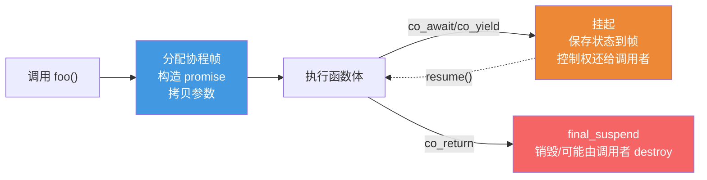
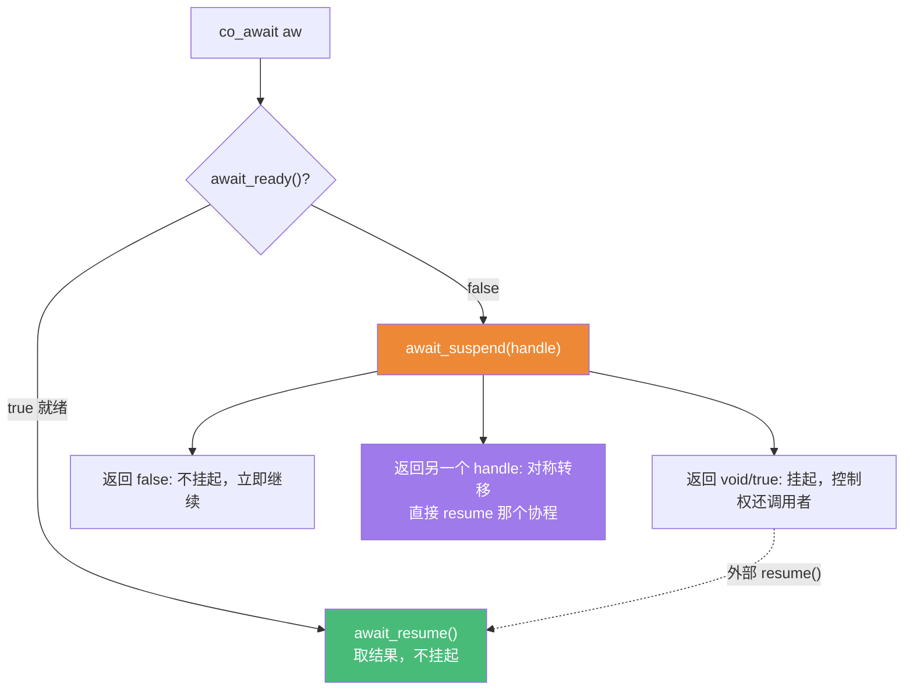
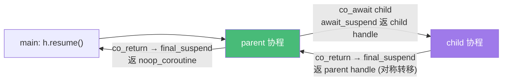

# 精通 C++ 协程

> 课程编号：C25
> 路线图来源：现代 C++ 全栈深度课程 — 并发
> 难度：⭐⭐⭐⭐⭐
> 预计阅读时间：70 分钟
> 📅 内容基准：**C++23** + GCC 14 / Clang 18 / MSVC 19.4x（协程为 C++20 引入）

---

## 引言：这个函数能"暂停"吗？

```cpp
#include <coroutine>

Generator<int> count_to(int n) {
    for (int i = 1; i <= n; ++i)
        co_yield i;            // 暂停，把 i 交给调用者，下次从这里继续
}

void demo() {
    for (int x : count_to(3))  // 1) 这个 for 怎么驱动协程？
        std::print("{} ", x);  // 输出 1 2 3
}                              // 2) 局部变量 i 存在哪？函数返回了为什么 i 还在？
```

答案：① 函数体里只要出现 `co_await`/`co_yield`/`co_return` 之一，这个函数就是**协程**——编译器把它**变换成一个状态机**，`count_to(3)` 不立即执行函数体，而是返回一个 `Generator`，每次迭代调用 `coroutine_handle::resume()` 推进到下一个 `co_yield`；② 局部变量 `i` 不在普通栈帧上，而存在堆上分配的**协程帧（coroutine frame）**里，所以协程"暂停返回"后 `i` 依然存活，下次 `resume` 时恢复。

C++20 协程是一种**无栈协程（stackless coroutine）**：编译器把你的函数拆成"挂起点之间的片段"，把局部状态搬到堆上的协程帧，从而实现"暂停—恢复"。但 C++20 只提供了**底层语言机制**（`promise_type`、awaiter、`coroutine_handle`），标准库几乎没给现成的协程类型——你要么自己写 `Generator`/`Task`，要么用 C++23 的 `std::generator` 或第三方库。本章带你从机制到自己造轮子，彻底搞懂"协程是怎么变换出来的"。

---

## 第一章：协程是什么——编译器的变换

一个普通函数有唯一的"开始—执行—返回"。协程不同：它能在中途**挂起（suspend）**，把控制权交还调用者，之后再从挂起点**恢复（resume）**。



判断一个函数是不是协程：**函数体内是否出现 `co_await`、`co_yield` 或 `co_return`**（哪怕只有一个）。注意：协程的**返回类型不能是 `auto` 推导**，必须是一个满足"协程接口"的类型（其内部有 `promise_type`）。`main`、constexpr 函数、构造/析构函数不能是协程。

**无栈（stackless）**意味着：协程帧只保存"跨挂起点存活的局部变量 + 恢复点 + promise"，不像有栈协程那样保存整个调用栈。代价是协程不能在被它调用的普通函数内部挂起（挂起点必须在协程体里直接出现）。

---

## 第二章：三个新关键字

```cpp
T result = co_await expr;   // 挂起当前协程，等 expr 代表的异步操作完成后恢复并取结果
co_yield value;             // 产出一个值给调用者并挂起（等价 co_await promise.yield_value(value)）
co_return value;            // 结束协程（设置返回值/结果），触发 final_suspend
```

- **`co_await expr`**：核心。`expr` 必须能转成一个 **awaiter**（见第四章），决定"是否真的挂起、挂起时做什么、恢复后返回什么"。
- **`co_yield v`**：生成器的灵魂。编译器把它改写成 `co_await promise.yield_value(v)`——把 `v` 存进 promise，挂起，让调用者取走。
- **`co_return`**：结束。有值则调 `promise.return_value(v)`，无值（或 `co_return;`）则调 `promise.return_void()`。二者**只能有一个**存在于 promise 中。

---

## 第三章：promise_type——协程的"控制中枢"

编译器看到协程的返回类型 `Ret`，会去找 `Ret::promise_type`（或通过 `std::coroutine_traits` 定制）。这个 `promise_type` **不是 std::promise**（C24），名字撞车而已——它是**协程的定制点**，编译器在协程生命周期的每个关键时刻回调它的成员。

编译器把你的协程体大致改写成（伪代码）：

```cpp
{
    // 1) 在协程帧上构造 promise
    promise_type promise;
    // 2) 构造返回对象，立刻交给调用者
    auto ret = promise.get_return_object();
    // 3) 初始挂起点
    co_await promise.initial_suspend();
    try {
        <你的函数体>            // 其中的 co_yield/co_return 调用 promise 的成员
    } catch (...) {
        promise.unhandled_exception();   // 函数体抛异常时
    }
final:
    // 4) 最终挂起点
    co_await promise.final_suspend();
    // 之后协程帧被销毁（或等待 destroy）
}
```

所以一个最小的 `promise_type` 必须提供：

```cpp
struct promise_type {
    Ret get_return_object();                 // 造出给调用者的返回对象
    std::suspend_always initial_suspend();   // 协程刚启动是否立即挂起（懒/急）
    std::suspend_always final_suspend() noexcept;  // 结束前挂起（必须 noexcept）
    void return_void();                      // 处理 co_return;（或用 return_value(v)）
    void unhandled_exception();              // 函数体逃逸的异常
    // 可选：yield_value(v) 支持 co_yield；await_transform 定制 co_await
};
```

两个内置 awaiter：

| 内置 awaiter | `await_ready` 返回 | 含义 |
|---|---|---|
| `std::suspend_always` | `false` | 总是挂起 |
| `std::suspend_never` | `true` | 从不挂起（继续执行） |

`initial_suspend()` 返回 `suspend_always` ⇒ **惰性**协程（调用后不执行函数体，等第一次 resume）；返回 `suspend_never` ⇒ **急性**（调用即跑到第一个挂起点）。生成器通常惰性，异步 Task 视设计而定。

---

## 第四章：awaiter——co_await 的三段式协议

`co_await expr` 的行为完全由 **awaiter** 对象的三个成员决定。编译器把 `co_await aw` 展开成：

```cpp
if (!aw.await_ready()) {            // 1) 已经就绪？就绪则不挂起，直接走 await_resume
    // 把当前协程挂起，保存恢复点
    aw.await_suspend(handle);       // 2) 挂起动作：可决定挂起/恢复/转移到别的协程
    // 控制权交还（或转交）
}
return aw.await_resume();           // 3) 恢复后取结果，作为 co_await 表达式的值
```



`await_suspend(handle)` 的返回类型决定挂起后做什么：

| 返回类型 | 行为 |
|---|---|
| `void` | 挂起，控制权返回给当初 resume 本协程的调用者 |
| `bool` | `true` 挂起；`false` 不挂起（相当于 await_ready 二次判断），立即 `await_resume` |
| `coroutine_handle<>` | **对称转移**：立即 resume 返回的那个协程（不回到调用者，无额外栈帧，见第八章） |

`await_transform`：若 promise 定义了 `await_transform(x)`，则 `co_await x` 实际是 `co_await promise.await_transform(x)`——可用来禁止/改写某些 await（如 Task 里禁止裸 `co_await` 普通值）。

---

## 第五章：coroutine_handle——操控协程帧的把手

`std::coroutine_handle<Promise>` 是一个**指向协程帧的轻量句柄**（本质是个指针），用来在协程外部控制它：

```cpp
std::coroutine_handle<promise_type> h = /* 来自 get_return_object 或 await_suspend */;

h.resume();          // 或 h()：从挂起点恢复执行，直到下一个挂起或结束
h.done();            // 协程是否已运行到 final_suspend
h.promise();         // 访问帧上的 promise 对象（读取 yield 的值等）
h.destroy();         // 销毁协程帧（释放内存、析构局部与 promise）

// 在 promise 内部拿到自己的 handle：
auto self = std::coroutine_handle<promise_type>::from_promise(*this);
```

**所有权与销毁**：协程帧是堆上对象，谁负责 `destroy` 取决于你的设计。常见做法：返回对象（如 `Generator`）持有 handle，**在其析构里 `if (h) h.destroy();`** —— RAII 管理协程帧。`final_suspend` 返回 `suspend_always` 意味着协程跑完后停在最终挂起点、**不自动销毁**，等待外部 `destroy`（这样还能在结束后读 promise 的结果）；若返回 `suspend_never` 则跑完自动销毁帧。

---

## 第六章：手写一个 Generator

把前面的机制拼起来，造一个惰性生成器（C++20，不依赖标准库 generator）：

```cpp
#include <coroutine>
#include <utility>

template<class T>
struct Generator {
    struct promise_type {
        T current_;                              // 存放最近一次 yield 的值

        Generator get_return_object() {
            return Generator{ std::coroutine_handle<promise_type>::from_promise(*this) };
        }
        std::suspend_always initial_suspend() noexcept { return {}; }  // 惰性
        std::suspend_always final_suspend() noexcept { return {}; }
        std::suspend_always yield_value(T value) noexcept {            // co_yield 的落点
            current_ = std::move(value);
            return {};                            // 挂起，把控制权还给调用者
        }
        void return_void() {}
        void unhandled_exception() { std::terminate(); }  // 或存 exception_ptr 后重抛
    };

    std::coroutine_handle<promise_type> h_;

    explicit Generator(std::coroutine_handle<promise_type> h) : h_(h) {}
    Generator(Generator&& o) noexcept : h_(std::exchange(o.h_, {})) {}   // 只移动
    ~Generator() { if (h_) h_.destroy(); }                              // RAII 销毁帧

    // 迭代器：让 range-for 能驱动协程
    struct iterator {
        std::coroutine_handle<promise_type> h_;
        bool operator!=(std::default_sentinel_t) const { return !h_.done(); }
        iterator& operator++() { h_.resume(); return *this; }   // 推进到下一个 yield
        const T& operator*() const { return h_.promise().current_; }
    };
    iterator begin() { h_.resume(); return {h_}; }   // 第一次 resume 跑到首个 yield
    std::default_sentinel_t end() { return {}; }
};

Generator<int> range(int a, int b) {
    for (int i = a; i < b; ++i)
        co_yield i;                  // 每次产出一个值并挂起
}

// for (int x : range(0, 5)) ...   // 0 1 2 3 4
```

**驱动流程**：`range(0,5)` 因 `initial_suspend` 惰性挂起，立即返回 `Generator`。`begin()` 首次 `resume` → 跑到第一个 `co_yield 0`（`yield_value` 存 0 并挂起）。`*it` 读 `current_`；`++it` 再 `resume` 推进到 `co_yield 1`……直到协程结束（`done()` 为真），循环停止。`Generator` 析构时 `h_.destroy()` 释放帧。

---

## 第七章：手写一个 Task（异步返回值）

Generator 是"产出多个值"，**Task 是"异步算出一个值"**——异步函数的返回类型。关键在 `final_suspend` 里做**对称转移**，恢复等待它的"上层协程"，形成协程链。

```cpp
template<class T>
struct Task {
    struct promise_type {
        T value_;
        std::coroutine_handle<> continuation_;   // 谁在 co_await 我（上层协程）

        Task get_return_object() {
            return Task{ std::coroutine_handle<promise_type>::from_promise(*this) };
        }
        std::suspend_always initial_suspend() noexcept { return {}; }

        // final_suspend 里恢复上层协程（对称转移），避免一层层 return 造成栈增长
        struct FinalAwaiter {
            bool await_ready() noexcept { return false; }
            std::coroutine_handle<> await_suspend(
                std::coroutine_handle<promise_type> h) noexcept {
                auto cont = h.promise().continuation_;
                return cont ? cont : std::noop_coroutine();  // 转移控制权给上层
            }
            void await_resume() noexcept {}
        };
        FinalAwaiter final_suspend() noexcept { return {}; }

        void return_value(T v) { value_ = std::move(v); }
        void unhandled_exception() { std::terminate(); }
    };

    std::coroutine_handle<promise_type> h_;
    explicit Task(std::coroutine_handle<promise_type> h) : h_(h) {}
    Task(Task&& o) noexcept : h_(std::exchange(o.h_, {})) {}
    ~Task() { if (h_) h_.destroy(); }

    // 让 Task 本身可被 co_await：co_await task 时挂起当前协程、启动 task
    bool await_ready() noexcept { return false; }
    std::coroutine_handle<> await_suspend(std::coroutine_handle<> caller) noexcept {
        h_.promise().continuation_ = caller;     // 记下"恢复点"
        return h_;                                // 对称转移：直接执行 task 协程
    }
    T await_resume() { return std::move(h_.promise().value_); }  // task 完成后取结果
};

Task<int> child() { co_return 21; }
Task<int> parent() {
    int v = co_await child();        // 挂起 parent，启动 child，child 完成后恢复 parent
    co_return v * 2;                 // 42
}
```

`co_await child()` 时：`await_suspend` 记下 parent 为 continuation，返回 child 的 handle ⇒ 对称转移直接跑 child；child `co_return` 后 `final_suspend` 的 `FinalAwaiter` 把控制权对称转移回 parent ⇒ parent 在 `await_resume` 取到结果继续。整条链不会让 C++ 调用栈无限增长。

---

## 第八章：协程帧分配与对称转移

### 8.1 协程帧分配

协程被调用时，编译器生成代码**分配协程帧**（默认 `operator new`），用于存放：promise、跨挂起点存活的局部变量、参数副本、恢复点状态。

```cpp
// 帧布局（概念）：
// [ resume/destroy 函数指针 | promise | 参数副本 | 跨挂起点的局部变量 | 状态索引 ]
```

- 可在 `promise_type` 里重载 `operator new`/`operator delete` 自定义分配（如用内存池）。
- **HALO（Heap Allocation eLision Optimization）**：当编译器能证明协程帧的生命周期不超过调用者（典型：协程被立即 `co_await` 且不逃逸），它可以**省略堆分配**，把帧放到调用者的栈上。这是协程性能的关键优化，但依赖优化等级与内联，**不保证**发生。
- 这也解释了引言里"函数返回了局部变量 `i` 还活着"：`i` 在堆上的帧里，不随"暂停返回"销毁。

### 8.2 对称转移（symmetric transfer）

朴素实现里，"A co_await B，B 完成后恢复 A"若用 `a_handle.resume()` 直接调用，会在 C++ 调用栈上压一层；A 再 await C……**深度递归会爆栈**。

**对称转移**解决之：`await_suspend` 返回一个 `coroutine_handle`，编译器保证用**尾调用（tail call）**的方式转去 resume 它——**不增长栈**。这正是第七章 `FinalAwaiter::await_suspend` 返回 `continuation_`、`Task::await_suspend` 返回 `h_` 的意义。`std::noop_coroutine()` 是一个"什么都不做、立即把控制权还给最外层 resume 者"的特殊 handle，用作链尾。



---

## 第九章：std::generator（C++23）

C++20 只给机制不给类型；C++23 终于在标准库提供了**现成的生成器** `std::generator<T>`，省去手写第六章那一大坨：

```cpp
#include <generator>     // C++23
#include <print>

std::generator<int> fib() {
    int a = 0, b = 1;
    while (true) {
        co_yield a;
        std::tie(a, b) = std::make_pair(b, a + b);
    }
}

void demo() {
    int n = 0;
    for (int x : fib()) {        // 惰性、无限序列
        std::print("{} ", x);
        if (++n == 10) break;    // 0 1 1 2 3 5 8 13 21 34
    }
}
```

`std::generator` 支持惰性求值、嵌套委托（`co_yield std::ranges::elements_of(inner())`）、与 ranges 协作，是写"惰性序列/迭代逻辑"的首选。**GCC 14（libstdc++）起提供 `<generator>`；Clang/libc++ 较晚才补上（18 通常尚不可用，需更新版本）**。异步的 `Task`/`std::execution` 仍需 C++26 或第三方库（如 cppcoro、folly、libunifex）。

---

## 第十章：常见陷阱清单

### ❌ 陷阱 1：协程帧悬空——返回引用/捕获临时

```cpp
std::generator<int> g(const std::vector<int>& v) {  // v 是引用
    for (int x : v) co_yield x;
}
auto gen = g(std::vector{1,2,3});  // ❌ 临时 vector 已销毁，协程帧里引用悬空
```
协程的引用参数指向的对象，必须活到协程结束。**按值传参更安全**。

### ❌ 陷阱 2：final_suspend 不是 noexcept

```cpp
auto final_suspend() { return ...; }   // ❌ 必须 noexcept，否则编译错误/UB
```

### ❌ 陷阱 3：忘记销毁协程帧（泄漏）

```cpp
auto h = coro().h_;     // 持有 handle 却从不 destroy → 堆上协程帧泄漏
```
用 RAII 包装（返回对象析构里 `destroy`）。

### ❌ 陷阱 4：resume 一个已 done 的协程

```cpp
h.resume();   // 若 h.done() 为真，再 resume 是 UB
```
resume 前检查 `!h.done()`。

### ❌ 陷阱 5：同时定义 return_void 和 return_value

```cpp
void return_void();          // 和下面二选一
void return_value(int);      // 同时存在 → 编译错误
```

### ❌ 陷阱 6：在协程帧分配上做无谓堆分配假设

依赖 HALO 一定发生 → 不保证；性能敏感处实测，或自定义 `operator new`。

---

## 第十一章：练习题

**练习 1**：怎样判断一个函数是协程？协程的返回类型有什么要求？

**练习 2**：`co_yield v` 被编译器改写成什么？`co_return v` 会调用 promise 的哪个成员？

**练习 3**：说出 awaiter 三个成员各自的作用。`await_suspend` 返回 `void`、`bool`、`coroutine_handle` 分别意味着什么？

**练习 4**：找 bug：
```cpp
std::generator<std::string> lines(const std::string& path) {
    std::ifstream in(path);
    std::string line;
    while (std::getline(in, line)) co_yield line;
}
auto g = lines(std::string("a.txt") + ".bak");  // 这样用安全吗？
```

**练习 5**：为什么需要"对称转移"？`final_suspend` 里返回 `continuation_` 而不是直接 `continuation_.resume()` 有什么区别？

---

## 参考答案与解析

**练习 1**：函数体内出现 `co_await`/`co_yield`/`co_return` 任一即为协程。返回类型**不能用 `auto` 推导**，必须是带有 `promise_type`（或经 `coroutine_traits` 指定）的类型；且 `main`、constexpr、构造/析构函数、可变参数函数不能是协程。

**练习 2**：`co_yield v` 改写为 `co_await promise.yield_value(v)`——把 `v` 交给 promise（通常存起来）并按 `yield_value` 返回的 awaiter 决定挂起。`co_return v` 调用 `promise.return_value(v)`（无值的 `co_return;` 调 `promise.return_void()`），随后进入 `final_suspend`。

**练习 3**：`await_ready()`——返 true 则不挂起、直接取结果（已就绪的快路径）；`await_suspend(handle)`——真正挂起时的动作，可保存恢复点、调度、转移控制权；`await_resume()`——恢复后调用，其返回值就是 `co_await` 表达式的值。`await_suspend` 返回 `void`/`true`：挂起，控制权还给 resume 者；返回 `false`：不挂起立即继续；返回另一个 `coroutine_handle`：**对称转移**，以尾调用方式立即 resume 那个协程（不增长栈）。

**练习 4**：**安全**。这里参数是 `const std::string&`，绑定到临时 `"a.txt"+".bak"`。虽然参数是引用，但协程**会把按值参数拷进帧、按引用参数只存引用**——此处引用绑定的临时**在完整表达式结束后即销毁**，而协程帧里的引用还要在后续 resume 时使用 ⇒ **悬空**！所以其实**不安全**（与陷阱 1 同）。正确做法：参数改成按值 `std::string path`，让协程帧拥有自己的拷贝。（`in`/`line` 是协程内局部变量，存在帧里没问题。）

**练习 5**：不用对称转移时，"完成后恢复上层"靠 `continuation_.resume()` 直接调用，会在真实 C++ 栈上多压一帧；协程链很长（如循环 await）会**栈溢出**。返回 `continuation_`（一个 handle）让编译器以**尾调用**转移控制权——旧帧先弹出再跳到新协程，栈深度恒定。`std::noop_coroutine()` 作链尾，把控制权干净地还给最外层 resume 者。

---

## 小结

| 知识点 | 关键记忆 |
|---|---|
| 协程判定 | 体内有 `co_await/co_yield/co_return`；返回类型不能 auto，需带 promise_type |
| 编译器变换 | 拆成状态机；局部状态搬到**堆上协程帧**；按 promise 回调点织入代码 |
| promise_type | get_return_object / initial/final_suspend / return_* / unhandled_exception / yield_value |
| awaiter | `await_ready` / `await_suspend(handle)` / `await_resume` 三段式 |
| await_suspend 返回 | void/true 挂起；false 续跑；handle ⇒ **对称转移** |
| coroutine_handle | resume/destroy/done/promise；RAII 管帧 |
| 帧分配 | 默认 `operator new`；**HALO** 可省堆分配（不保证）；可自定义 |
| C++23 | `std::generator` 现成生成器；异步 Task 待 C++26 std::execution |

---

## 📅 2026 现状/更新

- C++20 协程提供**底层机制**，标准库长期"缺类型"——C++23 补上 **`std::generator`**（GCC 14 起可用；libc++ 较晚才提供）。
- 异步协程（Task/调度器）目前仍依赖第三方库（**cppcoro、folly::coro、libunifex、Boost.Asio 协程**）；C++26 的 **`std::execution`（sender/receiver）** 将提供标准异步框架（C32）。
- 编译器对 **HALO**（协程帧堆分配省略）的支持随版本增强，但仍依赖内联与逃逸分析，性能敏感场景需实测。
- 实践准则：**惰性序列/迭代** → `std::generator`；**异步 IO** → 现成库的 Task；手写协程类型仅在造库/学习时；**协程参数尽量按值**避免悬空帧。

---

> 🔁 下一篇 **C26 — 精通 C++ 异常与错误处理**：`throw`/`try`/`catch`、栈展开如何逐层调用析构、异常安全三保证（基本/强/不抛）、`noexcept` 与移动的关系、RAII 如何与异常配合、异常 vs 错误码、以及 C++23 的 `std::expected`/`std::optional`。
>
> 反馈：把"协程 = 编译器生成的状态机 + 堆上协程帧"和"awaiter 三段式 + 对称转移"两条钉死——理解了变换过程，所有协程库都只是这套机制的封装。
