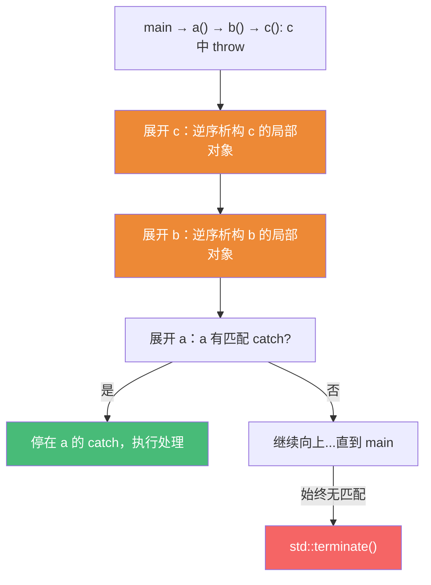

# 精通 C++ 异常与错误处理

> 课程编号：C26
> 路线图来源：现代 C++ 全栈深度课程 — 现代特性与工程化
> 难度：⭐⭐⭐⭐
> 预计阅读时间：60 分钟
> 📅 内容基准：**C++23** + GCC 14 / Clang 18 / MSVC 19.4x

---

## 引言：这段代码会泄漏吗？

```cpp
void f() {
    int* p = new int[100];        // 1) 裸 new
    do_work();                    // 2) 如果这里抛异常会怎样？
    delete[] p;                   // 3) 这行还会执行吗？
}

class Widget {
    std::string name_;
    std::vector<int> data_;
public:
    Widget& operator=(const Widget& o) {
        name_ = o.name_;          // 4) 若这里抛异常，data_ 还没改，对象状态如何？
        data_ = o.data_;
        return *this;
    }
};
```

答案：① 若 `do_work()` 抛异常，异常会**绕过** `delete[] p`——栈展开（stack unwinding）只析构**有析构函数的局部对象**，裸指针 `p` 不是对象、没有析构函数，所以 `delete[] p` 被跳过 → **内存泄漏**；② 修正是用 RAII（`std::vector<int> p(100)` 或智能指针），让析构自动释放；③ 对于 `operator=`：若 `name_ = o.name_` 成功但 `data_ = o.data_` 抛异常，对象会处于**name 已改、data 未改的不一致状态**——这违反"强异常保证"，正确做法是 copy-and-swap（见第五章）。

C++ 的异常机制把"错误检测"和"错误处理"在代码上**解耦**，配合 **RAII（C05）** 实现"出错时自动清理"。但异常用对的前提是理解三件事：**栈展开如何工作**、**异常安全的三个保证**、**`noexcept` 与移动/容器的关系**。本章还会对比异常 vs 错误码，并介绍 C++23 的现代错误处理工具 `std::expected`。

---

## 第一章：throw / try / catch 基础

```cpp
#include <stdexcept>

int parse(const std::string& s) {
    if (s.empty())
        throw std::invalid_argument("empty input");   // 抛出（构造异常对象）
    return std::stoi(s);                                // stoi 自己也可能抛
}

void caller() {
    try {
        int n = parse(userInput);
    }
    catch (const std::invalid_argument& e) {   // 按引用捕获（避免切片+拷贝）
        log(e.what());
    }
    catch (const std::exception& e) {          // 基类捕获兜底（顺序：派生在前）
        log(e.what());
    }
    catch (...) {                              // 捕获一切（最后兜底）
        log("unknown");
    }
}
```

要点：

- **按 `const&` 捕获**：避免对象切片（slicing）和不必要拷贝。`catch(Base e)` 会把派生异常切成基类。
- **catch 顺序从派生到基类**：编译器自上而下匹配第一个能捕获的，基类写前面会"吃掉"派生。
- 标准异常层次：`std::exception` → `logic_error`（`invalid_argument`/`out_of_range`/`length_error`...）、`runtime_error`（`overflow_error`/`system_error`...）、`bad_alloc`、`bad_cast` 等。**自定义异常应继承 `std::exception`**。
- `throw;`（无操作数）在 catch 块内**重新抛出当前异常**（保持原类型，不切片）。

```cpp
catch (const std::exception& e) {
    cleanup();
    throw;            // 重新抛出原异常（不是 throw e; 那会切片/拷贝）
}
```

---

## 第二章：栈展开（stack unwinding）

抛出异常后，运行时**沿调用栈逐层向上查找匹配的 catch**，沿途**逆序析构每一层已完整构造的局部对象**——这就是栈展开。



关键事实：

- **只有"完整构造完成"的对象才会被析构**。构造函数中途抛异常时，已构造的成员/基类会被析构，但该对象本身的析构函数**不会**调用（它从未构造完成）。
- **裸资源不会被清理**：`new`/`malloc`/`fopen`/锁——栈展开只调析构函数。所以必须用 **RAII** 包住一切资源（`unique_ptr`、`lock_guard`、`fstream`），让"出栈即清理"自动发生。
- 若展开到栈顶（如 `main` 外、或线程函数顶层）仍无匹配 catch → `std::terminate()`（默认 `abort`）。

**析构函数中抛异常 = 灾难**：如果栈展开过程中（已有一个异常在飞）某个析构函数又抛出新异常，会有两个异常同时存在 → 直接 `std::terminate`。所以**析构函数默认 `noexcept`，绝不应让异常逃逸**。

```cpp
~Foo() {                  // 析构函数隐式 noexcept
    try { risky(); }
    catch (...) { /* 吞掉或记录，绝不外泄 */ }
}
```

---

## 第三章：异常安全的三个保证

衡量一个函数"出异常时有多安全"，有三个递增级别（加一个最差的"无保证"）：

| 级别 | 含义 | 例子 |
|---|---|---|
| **不抛保证（nothrow）** | 承诺绝不抛异常 | 析构、swap、移动构造（应 noexcept） |
| **强保证（strong）** | 要么完全成功，要么**回滚到调用前状态**（事务语义，"提交或回滚"） | `vector::push_back`、copy-and-swap 的赋值 |
| **基本保证（basic）** | 不泄漏、不破坏不变式，但**状态可能改变**（合法但未指定） | 多数容器修改操作的底线 |
| （无保证） | 可能泄漏/破坏不变式——**不可接受** | 引言里的裸 new + 不一致赋值 |


目标通常是**至少基本保证**；对关键操作（赋值、配置更新）争取**强保证**；对底层原语（swap/移动/析构）提供**不抛保证**。三者环环相扣：强保证常常**依赖**底层操作的不抛保证（如 copy-and-swap 依赖 swap 不抛）。

---

## 第四章：noexcept 与移动

### 4.1 noexcept 是什么

`noexcept` 声明"此函数不会抛异常"。违背承诺（运行时真的抛了且逃逸）⇒ 直接 `std::terminate`（不再展开）。

```cpp
void f() noexcept;                  // 承诺不抛
void g() noexcept(false);           // 显式可能抛（等价不写）
template<class T>
void h(T x) noexcept(noexcept(x.foo()));  // 条件 noexcept：依赖 x.foo() 是否 noexcept

constexpr bool b = noexcept(expr);  // noexcept 运算符：编译期查询 expr 是否声明不抛
```

`noexcept` 不只是文档——它是**优化和正确性的开关**：编译器可省略异常处理的展开表，且标准库会**根据 noexcept 做出不同行为**。

### 4.2 移动构造为何必须 noexcept

`std::vector` 扩容（reallocate）时要把旧元素搬到新内存。它面临选择：

- 用**移动**：快，但若移动构造**可能抛异常**，搬到一半抛了，旧内存已被部分破坏、新内存也不完整 → **无法回滚**，破坏强异常保证。
- 用**拷贝**：慢，但拷贝失败时旧元素完好无损，可丢弃新内存、保持强保证。

所以 vector 用 `std::move_if_noexcept`：**只有移动构造声明 `noexcept` 时才移动，否则退回拷贝**。

```cpp
class Buffer {
public:
    Buffer(Buffer&&) noexcept;          // ✅ noexcept → vector 扩容用移动（快）
    Buffer& operator=(Buffer&&) noexcept;
};
// 若漏写 noexcept，vector 扩容会"安静地"退回拷贝 → 移动优化失效（见 C03）
```

**准则**：移动构造、移动赋值、swap、析构**都应 `noexcept`**。这既是性能（容器用移动），也是异常安全的基石（强保证依赖它们不抛）。

---

## 第五章：RAII 与强异常保证

### 5.1 RAII：异常安全的引擎

```cpp
void f() {
    auto p = std::make_unique<int[]>(100);   // RAII：析构自动 delete[]
    std::lock_guard lk(mtx);                  // RAII：析构自动 unlock
    do_work();                                // 即使抛异常，p 和 lk 析构照常运行 → 自动清理
}                                             // 栈展开调析构 → 零泄漏
```

RAII 把"清理"绑定到对象析构，而栈展开保证析构一定执行——这就是 C++ 实现异常安全的根本手段。**有了 RAII，多数函数自动获得基本保证。**

### 5.2 copy-and-swap：强保证的经典实现

回到引言的 `operator=` 问题。朴素写法在"改了一半时抛异常"会留下不一致状态。**copy-and-swap** 把"可能抛的操作（拷贝）"放在**修改自身之前**完成，再用**不抛的 swap** 一步提交：

```cpp
class Widget {
    std::string name_;
    std::vector<int> data_;
public:
    friend void swap(Widget& a, Widget& b) noexcept {   // 不抛的 swap
        using std::swap;
        swap(a.name_, b.name_);
        swap(a.data_, b.data_);
    }

    // 强异常保证的赋值：先拷贝（可能抛，但只动临时量），再 swap（不抛，提交）
    Widget& operator=(Widget other) {   // 按值传参：拷贝在这里发生（参数构造）
        swap(*this, other);             // 不抛地交换 → 此后 *this 是新值，other 持旧值
        return *this;                   // other 析构释放旧资源
    }
    // 若拷贝阶段抛异常：发生在构造实参 other 时，*this 尚未被触碰 → 完全回滚
};
```

机制拆解：

1. **拷贝先行**：所有"可能抛"的工作（深拷贝）在构造形参 `other` 时完成。若此时抛异常，`*this` **一个字节都没改** → 自动回滚到调用前状态。
2. **不抛提交**：`swap` 声明 `noexcept`，把已构造好的 `other` 与 `*this` 互换——这一步**保证成功**。
3. 函数返回，`other`（现持有旧资源）析构，释放旧内存。

这就是"**先在旁边把新状态准备好，确认无误后用不抛操作一步切换**"——强保证的通用配方，也是为什么强保证**依赖** swap/移动的不抛保证。

---

## 第六章：异常 vs 错误码

| 维度 | 异常 | 错误码 / 返回值 |
|---|---|---|
| 正常路径开销 | **零成本**（不抛时无开销，"zero-cost"模型） | 每次都要检查返回值（分支） |
| 异常路径开销 | 较高（栈展开、查表） | 低 |
| 易遗漏 | 不会被忽略（不处理就向上传播） | **容易忘记检查**返回码 |
| 跨层传递 | 自动逐层传播，中间层不必关心 | 需层层手动透传 |
| 适用 | **罕见的、真正的错误**（无法本地处理） | **可预期的、高频的"非异常"结果**（查找未命中、解析失败） |
| 受限场景 | 实时/内核/`-fno-exceptions`、ABI 边界 | 这些场景的首选 |

主流准则（C++ Core Guidelines）：**用异常报告"无法在本地处理的错误"，用返回值/`expected`/`optional` 表达"预期内的失败结果"**。例如：`map::at` 越界抛异常（编程错误），而 `map::find` 返回 end 迭代器（查找未命中是正常结果）。

C++ 的"**zero-cost exceptions**"模型：不抛异常时几乎无运行时开销（无需在每个调用点检查标志），代价集中在抛出时（栈展开 + 查异常表）。所以**异常应留给"真的异常"的罕见路径**——把它用在高频可预期失败上会很慢。

---

## 第七章：std::optional 与 std::expected

当"失败是预期内的正常结果"时，比错误码更类型安全的现代工具：

### 7.1 std::optional<T>（C++17）——有或没有

```cpp
#include <optional>

std::optional<int> find_user(int id) {
    if (exists(id)) return get(id);
    return std::nullopt;                 // 表示"没有值"，无需异常
}

if (auto u = find_user(42)) {            // 有值则进入
    use(*u);
}
int x = find_user(7).value_or(-1);       // 没有则给默认值
```

`optional` 表达"可能没有结果"，但**不携带失败原因**。

### 7.2 std::expected<T, E>（C++23）——值或错误

```cpp
#include <expected>

enum class ParseErr { Empty, NotANumber, OutOfRange };

std::expected<int, ParseErr> parse(std::string_view s) {
    if (s.empty()) return std::unexpected(ParseErr::Empty);   // 返回错误
    // ... 解析
    return value;                                              // 返回成功值
}

void use() {
    auto r = parse(input);
    if (r) {                              // 有值（成功）
        process(*r);                      // 解引用取值
    } else {
        handle(r.error());                // 取错误
    }
    int v = parse(input).value_or(0);     // 失败给默认
}
```

`expected<T,E>` 兼具"返回值无成本"和"携带错误信息"——是错误码的类型安全升级版。C++23 还支持**单子式链式**（`and_then` / `transform` / `or_else`），把一串可能失败的操作优雅串起来，避免层层 if：

```cpp
auto result = parse(s)
    .and_then(validate)        // 成功才继续，失败短路并保留错误
    .transform([](int x){ return x * 2; })
    .or_else(log_and_default);
```

**选型小结**：可能"没有" → `optional`；可能"失败且要知道原因"且失败属预期 → `expected`；**真正异常的、罕见的错误** → 抛异常。

---

## 第八章：常见陷阱清单

### ❌ 陷阱 1：裸资源 + 异常 = 泄漏

```cpp
int* p = new int[100];
risky();              // 抛异常 → delete[] 被跳过，泄漏
delete[] p;
```
用 RAII（`make_unique` / `vector`）。

### ❌ 陷阱 2：按值捕获导致切片

```cpp
catch (std::exception e) { }   // ❌ 派生异常被切成基类，丢信息。要 const&
```

### ❌ 陷阱 3：catch 基类写在派生之前

```cpp
catch (const std::exception&) { }      // 吃掉一切
catch (const std::out_of_range&) { }   // ❌ 永远到不了（死代码）
```

### ❌ 陷阱 4：析构函数让异常逃逸

```cpp
~Conn() { close(); }   // close 抛异常且在栈展开中 → std::terminate
```
析构内 try/catch 吞掉，或确保 close 不抛。

### ❌ 陷阱 5：移动构造漏写 noexcept

```cpp
Buf(Buf&&) { ... }     // 没 noexcept → vector 扩容退回拷贝（慢）+ 削弱强保证
```

### ❌ 陷阱 6：用异常处理高频可预期失败

```cpp
try { x = map.at(key); } catch (...) { x = 0; }   // ❌ 慢且滥用
// 应：if (auto it = map.find(key); it != map.end()) ... 或用 expected
```

---

## 第九章：练习题

**练习 1**：栈展开过程中会清理哪些东西？裸 `new` 出来的内存会被清理吗？为什么？

**练习 2**：异常安全的三个保证分别是什么？举一个达到"强保证"的例子。

**练习 3**：为什么 `std::vector` 扩容时只有移动构造 `noexcept` 才用移动？不 noexcept 会怎样？

**练习 4**：用 copy-and-swap 写出强异常保证的赋值运算符，并解释"可能抛的操作"放在哪一步、为什么能回滚。

**练习 5**：下面三种"失败"分别该用异常、`optional` 还是 `expected`？
(a) `vector::at` 下标越界；(b) 在哈希表里查一个可能不存在的 key；(c) 解析用户输入的配置文件，需要返回具体的出错原因。

---

## 参考答案与解析

**练习 1**：栈展开会**逆序析构每一层栈帧上已完整构造的、有析构函数的局部对象**。裸 `new` 的内存**不会**被清理——指针本身是个普通变量（无析构函数），栈展开只调用析构函数，不会替你 `delete`。所以异常绕过后续的 `delete` 语句 → 泄漏。解决：用 RAII（智能指针/容器）持有资源。

**练习 2**：**不抛保证**（承诺绝不抛，如 swap/移动/析构）；**强保证**（要么成功要么回滚到调用前状态，事务语义）；**基本保证**（不泄漏、不变式不被破坏，但状态可能改变）。强保证例子：copy-and-swap 实现的 `operator=`，或 `vector::push_back`（扩容失败时原 vector 不变）。

**练习 3**：扩容要把旧元素搬到新内存。若用移动且移动构造可能抛异常，搬到一半抛出时，旧内存已被破坏（资源已被偷走）、新内存又不完整，**无法回滚**，破坏强异常保证。所以 vector 用 `move_if_noexcept`：移动构造 `noexcept` 才移动，否则退回**拷贝**（拷贝失败时旧元素完好，可丢弃新内存回滚）。漏写 noexcept ⇒ 安静退回拷贝，移动优化失效（性能下降）。

**练习 4**：
```cpp
friend void swap(T& a, T& b) noexcept { /* 逐成员 std::swap */ }
T& operator=(T other) {     // 按值传参 → 拷贝发生在构造 other 时
    swap(*this, other);     // 不抛地提交
    return *this;
}
```
"可能抛的操作"是**深拷贝**，发生在**构造形参 `other`** 这一步——此时 `*this` 尚未被改动。若拷贝抛异常，函数还没进入函数体，`*this` 原封不动 → 自动回滚。拷贝成功后，`swap`（`noexcept`）保证不抛地把新状态换入 `*this`，旧资源随 `other` 析构释放。

**练习 5**：(a) `vector::at` 越界是**编程错误/契约违反**，用**异常**（标准就抛 `out_of_range`）。(b) 哈希表查未命中是**预期内的正常结果**，用 **`optional`**（或返回 end 迭代器，像 `find`），不携带原因。(c) 解析失败需要**返回具体原因**且属预期失败，用 **`std::expected<Config, ParseError>`**——既无异常开销又带错误信息，还能链式 `and_then`。

---

## 小结

| 知识点 | 关键记忆 |
|---|---|
| try/catch | 按 `const&` 捕获；派生在前；`throw;` 重抛不切片；自定义异常继承 `std::exception` |
| 栈展开 | 逆序析构**已构造的局部对象**；**裸资源不清理** → 必须 RAII |
| 析构与异常 | 析构默认 noexcept；异常逃逸析构（展开中）⇒ terminate |
| 三保证 | 不抛 ⊂ 强 ⊂ 基本；强保证常依赖底层不抛 |
| noexcept | 性能+正确性开关；移动/swap/析构都应 noexcept |
| 移动与容器 | vector 扩容靠 `move_if_noexcept`：noexcept 才移动否则拷贝 |
| 强保证配方 | **copy-and-swap**：拷贝先行（可回滚）+ 不抛 swap 提交 |
| 异常 vs 码 | 异常给罕见真错误（zero-cost）；预期失败用 optional/expected |
| C++23 | `std::expected<T,E>` + 单子式 `and_then/transform/or_else` |

---

## 📅 2026 现状/更新

- C++23 的 **`std::expected`** 已在 GCC 14 / Clang 18 / MSVC 19.4x 可用，成为"可预期失败"的主流表达，逐步替代手写错误码与滥用异常。
- "**zero-cost exception**"模型（不抛无开销）仍是主流实现；但游戏/嵌入式/HFT 常 `-fno-exceptions`，更依赖 `expected`/错误码。
- C++26 **契约（Contracts）** 进展中（`pre`/`post`/`assert`），用于表达前置/后置条件，与异常/错误码互补（C32）。
- 实践准则：**RAII 包住一切资源** → 自动获得基本保证；关键操作用 **copy-and-swap** 上强保证；移动/swap/析构标 **noexcept**；预期失败用 **expected/optional**，异常只留给真正罕见的错误。

---

> 🔁 下一篇 **C27 — 精通 C++ constexpr 编译期编程**：`constexpr`/`consteval`/`constinit` 的区别、编译期能做什么（编译期容器、编译期字符串）、立即函数、以及如何把运行期计算搬到编译期。
>
> 反馈：把"栈展开只清理有析构的对象（→ RAII）"和"copy-and-swap 拿强保证"两条钉死——它们是写出异常安全代码的全部秘诀。
