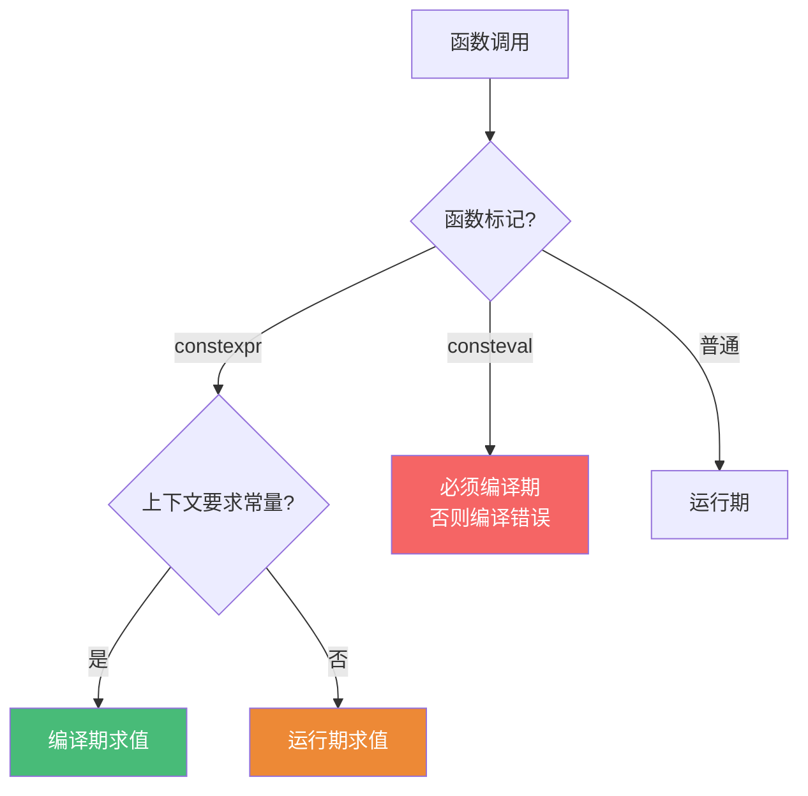
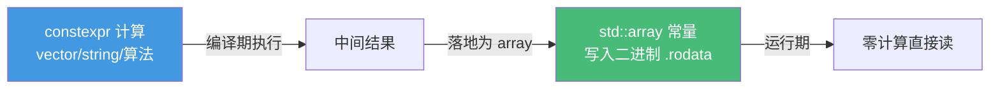

# 精通 C++ constexpr 编译期编程

> 课程编号：C27
> 路线图来源：现代 C++ 全栈深度课程 — 编译期编程
> 难度：⭐⭐⭐⭐⭐
> 预计阅读时间：60 分钟
> 📅 内容基准：**C++23**（ISO/IEC 14882:2024）+ GCC 14 / Clang 18 / MSVC 19.4x

---

## 引言：这段代码在编译期还是运行期算？

```cpp
#include <array>

constexpr int factorial(int n) {            // constexpr 函数
    return n <= 1 ? 1 : n * factorial(n - 1);
}

int main() {
    constexpr int a = factorial(5);         // 1) 在哪算？
    std::array<int, factorial(5)> arr;      // 2) 这能编过吗？
    int n = 5;
    int b = factorial(n);                   // 3) 这又在哪算？
    return a + b + (int)arr.size();
}
```

三个问题，能立刻回答吗？

1. `constexpr int a = factorial(5)` 在**编译期**算——结果 `120` 直接写进二进制，运行期没有任何函数调用。
2. `std::array<int, factorial(5)>` **能编过**——模板实参必须是常量表达式，`factorial(5)` 在编译期求值为 `120`。
3. `factorial(n)`（`n` 是运行期变量）在**运行期**算——`constexpr` 函数**既能编译期也能运行期**调用，取决于上下文是否要求常量表达式。

答案的关键：**`constexpr` 修饰的函数是"可以"在编译期求值，不是"必须"**。它把"能否在编译期算"变成函数的一种能力。要"必须编译期"用 `consteval`（立即函数）；要"必须运行期初始化但放在编译期保证零初始化顺序"用 `constinit`。

编译期编程把计算从运行期挪到编译期——零运行时开销、提前发现错误、生成查找表、做类型级计算。C++11 引入 `constexpr` 后，C++14/17/20 不断放宽限制，到 C++20 你甚至能在编译期 `new`/用 `std::vector`/`std::string`。这一章讲清 `constexpr`/`consteval`/`constinit` 三兄弟、编译期容器与算法、以及非类型模板参数（NTTP）的类类型扩展。

---

## 第一章：constexpr 函数与变量

### 1.1 constexpr 变量：编译期常量

```cpp
constexpr int N = 100;              // 编译期常量，可做数组大小、模板实参
constexpr double PI = 3.14159;
int arr[N];                         // ✅ N 是常量表达式

const int M = compute();            // const 只表示"不可变"，未必编译期已知
// int arr2[M];                     // ❌ 若 compute() 非 constexpr，M 不是常量表达式
```

`const` 和 `constexpr` 的区别是初学者最大的混淆点：

| | `const` | `constexpr` |
|---|---|---|
| 含义 | 运行期"不可修改" | **编译期可求值**（同时也是 const） |
| 初值 | 可运行期决定 | **必须是常量表达式** |
| 用作数组大小/模板实参 | 仅当初值恰好是常量表达式 | 总是可以 |

**口诀**：`const` 是"只读"，`constexpr` 是"编译期已知"。

### 1.2 constexpr 函数

```cpp
constexpr int gcd(int a, int b) {           // C++14 起函数体可有循环、局部变量、多语句
    while (b != 0) {
        int t = b;
        b = a % b;
        a = t;
    }
    return a;
}

static_assert(gcd(48, 36) == 12);           // 编译期验证（见第六章）
```

**为什么 constexpr 函数能两栖**？编译器对它做"双重编译"：当调用处需要常量表达式（如模板实参、`constexpr` 变量初值、`static_assert`），就在编译期解释执行函数体；否则当普通函数生成机器码，运行期调用。

```cpp
constexpr int sq(int x) { return x * x; }

constexpr int a = sq(5);     // 编译期：a = 25 直接写入
int n = read();
int b = sq(n);               // 运行期：正常函数调用
```

### 1.3 限制的演进

| 标准 | constexpr 函数能做什么 |
|---|---|
| C++11 | 单条 `return`，无循环/局部变量（极其受限） |
| C++14 | 循环、局部变量、多语句、`if`/`switch` |
| C++17 | `constexpr` lambda、`if constexpr` |
| C++20 | `try`/`catch`（不能真抛）、虚函数、`new`/`delete`、`std::vector`/`std::string` |
| C++23 | `constexpr` 中可用 `goto`、放宽更多（如 `static constexpr` 局部变量） |

⚠️ constexpr 函数里仍**不能**做的：真正分配未释放的内存（编译期 `new` 必须在编译期 `delete`）、`reinterpret_cast`、调用非 constexpr 函数（在编译期路径上）、读未初始化的变量。

---

## 第二章：consteval —— 立即函数

`constexpr` 是"**可以**编译期"，`consteval`（C++20）是"**必须**编译期"——称为**立即函数（immediate function）**。每次调用都必须产生编译期常量，否则编译报错。

```cpp
consteval int square(int n) { return n * n; }

constexpr int a = square(5);     // ✅ 编译期求值
int n = 5;
// int b = square(n);            // ❌ 编译错误：n 不是常量表达式
```

### 2.1 典型用途：编译期校验输入

```cpp
consteval unsigned operator""_kib(unsigned long long n) {
    return static_cast<unsigned>(n * 1024);   // 字面量后缀，编译期算出字节数
}
constexpr auto buf_size = 4_kib;     // 编译期 = 4096

// 编译期格式串校验（std::format 内部就用 consteval 检查格式串，见 C29）
consteval int check_positive(int x) {
    return x > 0 ? x : throw "must be positive";  // 非常量参数会触发编译期错误
}
```

`consteval` 函数体里 `throw` 是合法的"编译期断言"技巧：只要走到 `throw` 分支，因为编译期不能抛异常，编译直接失败——把运行期错误提前到编译期。

### 2.2 constexpr vs consteval



| | `constexpr` 函数 | `consteval` 函数 |
|---|---|---|
| 编译期调用 | 可以 | **必须** |
| 运行期调用 | 可以 | **禁止** |
| 取函数地址 | 可以 | 不可以（没有运行期实体） |
| 典型场景 | 通用工具函数 | 字面量、编译期校验、强制常量 |

---

## 第三章：constinit —— 编译期初始化保证

`constinit`（C++20）保证一个**静态/线程存储期变量在编译期完成初始化**，但变量本身**不是 const**（之后可修改）。它解决的是著名的"**静态初始化顺序问题（static initialization order fiasco）**"。

```cpp
constinit int counter = 42;       // 编译期初始化，运行期可改
void f() { counter++; }           // ✅ 非 const，可修改

// 对比
constexpr int k = 42;             // 编译期初始化 + 永不可变（隐含 const）
```

### 3.1 为什么需要 constinit

跨 TU 的全局变量，**动态初始化的顺序未定义**——如果 A 的初始化依赖 B，而 B 还没初始化，就是 UB：

```cpp
// ❌ 危险：dynamic init，跨 TU 顺序未定
int slow_init() { return expensive(); }
int g = slow_init();          // 运行期动态初始化，顺序不可控

// ✅ constinit 强制编译期常量初始化（保证在任何动态初始化之前完成）
constinit int g2 = 42;        // 若初值不是常量表达式，编译直接报错
```

`constinit` 的核心价值是**编译期保证**："这个变量绝不会有运行期动态初始化"。如果你写 `constinit int g = slow_init();` 而 `slow_init` 非 constexpr，编译失败——而不是悄悄变成有顺序问题的动态初始化。

| | `const` | `constexpr` | `constinit` |
|---|---|---|---|
| 编译期初始化 | 不保证 | 保证 | **保证** |
| 之后可修改 | 否 | 否 | **可以** |
| 适用 | 任意 | 编译期常量 | 静态/线程存储期变量 |

---

## 第四章：if consteval 与编译期/运行期分派

有时同一个 `constexpr` 函数想在"编译期路径"和"运行期路径"走不同实现（编译期用纯算法，运行期用 SIMD/汇编内建）。C++23 的 `if consteval` 正是为此：

```cpp
constexpr int popcount(unsigned x) {
    if consteval {                       // 当前在编译期求值？
        // 编译期路径：纯 C++ 实现（编译期不能用内建汇编）
        int c = 0;
        while (x) { c += x & 1; x >>= 1; }
        return c;
    } else {
        // 运行期路径：用硬件指令（更快）
        return __builtin_popcount(x);
    }
}
```

C++20 时代用的是 `std::is_constant_evaluated()`（函数形式），C++23 的 `if consteval` 是语法糖，且更安全——`if consteval` 的真分支里能直接调用 `consteval` 函数。

⚠️ 陷阱：`if (std::is_constant_evaluated())` 写成普通 `if` 时，**它在运行期总是返回 false、编译期总是 true**，但**别**把它当条件用在非 constexpr 上下文里产生不一致的两套语义（容易写出"编译期和运行期结果不同"的 bug）。两条路径的可观察结果应当一致，仅性能不同。

---

## 第五章：编译期容器与算法（C++20）

C++20 是分水岭：允许在 `constexpr` 上下文里**编译期 `new`/`delete`**，从而 `std::vector`、`std::string` 可在编译期使用——前提是**所有分配的内存必须在编译期结束前释放**（不能"泄漏"到运行期）。

### 5.1 编译期 vector

```cpp
#include <vector>
#include <algorithm>

constexpr int sum_of_evens(int limit) {
    std::vector<int> v;                   // 编译期分配！
    for (int i = 0; i < limit; ++i)
        if (i % 2 == 0) v.push_back(i);
    int s = 0;
    for (int x : v) s += x;
    return s;                              // v 在函数结束时析构（释放编译期内存）
}

static_assert(sum_of_evens(10) == 20);    // 0+2+4+6+8
```

⚠️ **不能把编译期分配的内存带出来**：

```cpp
// ❌ 编译错误：返回的 vector 持有编译期分配的内存，无法持久化到运行期
// constexpr std::vector<int> bad() { return {1,2,3}; }   // C++20 不允许

// ✅ 编译期算好，导出固定大小的 std::array（无堆分配）
constexpr auto make_table() {
    std::array<int, 5> a{};
    for (int i = 0; i < 5; ++i) a[i] = i * i;
    return a;                              // array 无堆分配，可持久化
}
constexpr auto squares = make_table();    // {0,1,4,9,16}
```

**规律**：编译期可以用 `vector`/`string` 做"中间计算"，但**结果要落地成 `std::array` 等无分配类型**才能带到运行期。

### 5.2 编译期算法

绝大多数 `<algorithm>` 算法在 C++20 起标了 `constexpr`，可直接在编译期用：

```cpp
constexpr bool is_sorted_table() {
    std::array a{3, 1, 4, 1, 5, 9, 2, 6};
    std::sort(a.begin(), a.end());        // 编译期排序！
    return std::is_sorted(a.begin(), a.end());
}
static_assert(is_sorted_table());

// 编译期生成查找表（运行期零计算）
constexpr auto sine_table = [] {
    std::array<double, 360> t{};
    for (int i = 0; i < 360; ++i)
        t[i] = /* 编译期可算的近似 */ i / 360.0;
    return t;
}();                                       // 立即调用 lambda（IIFE）初始化
```



---

## 第六章：static_assert —— 编译期断言

`static_assert` 在编译期检查常量表达式，失败则编译报错并打印消息：

```cpp
static_assert(sizeof(int) == 4, "本代码假设 int 是 4 字节");
static_assert(factorial(5) == 120);          // C++17 起消息可省略

template<class T>
struct Wrapper {
    static_assert(std::is_trivially_copyable_v<T>,
                  "Wrapper 只支持可平凡拷贝的类型");
    T value;
};
```

`static_assert` 是编译期编程的"测试框架"：把不变量、类型约束、计算结果直接钉死在编译期。配合 `constexpr` 函数，你可以为编译期逻辑写"单元测试"——编译过 = 测试通过。

```cpp
constexpr int fib(int n) { return n < 2 ? n : fib(n-1) + fib(n-2); }
static_assert(fib(0) == 0 && fib(1) == 1 && fib(10) == 55);  // 编译期"测试"
```

---

## 第七章：NTTP —— 非类型模板参数的类类型扩展

非类型模板参数（NTTP）传统上只能是整数、枚举、指针、引用。C++20 起允许**字面量类类型（literal class type）** 作为 NTTP——只要它是"结构化类型"（所有成员 public、可在编译期构造）。

```cpp
template<int N>                        // 传统：整数 NTTP
struct Buffer { char data[N]; };

// C++20：类类型 NTTP —— 编译期字符串模板参数！
template<size_t N>
struct FixedString {
    char value[N]{};
    constexpr FixedString(const char (&s)[N]) {   // 从字面量构造
        std::copy_n(s, N, value);
    }
};

template<FixedString S>               // 用字符串当模板参数
struct Named {
    static constexpr auto name = S;
};

Named<"hello"> h;                     // ✅ "hello" 作为 NTTP！
```

这把"编译期字符串"带进模板系统——`std::format` 的编译期格式串校验（C29）、强类型的编译期标签、反射雏形都依赖它。

⚠️ 类类型 NTTP 要求该类是**结构化类型**：无私有/protected 非静态成员、无 mutable 成员、所有基类和成员也是结构化类型，且有 constexpr 构造能力。浮点数从 C++20 起也允许作 NTTP。

---

## 第八章：常见陷阱清单

### ❌ 陷阱 1：把 const 当 constexpr

```cpp
const int n = get_runtime_value();
int arr[n];                  // ❌ n 不是常量表达式（VLA，非标准 C++）
constexpr int m = 10;
int arr2[m];                 // ✅
```
`const` 只表示不可变，不保证编译期已知。要编译期常量用 `constexpr`。

### ❌ 陷阱 2：以为 constexpr 函数总在编译期算

```cpp
constexpr int sq(int x){ return x*x; }
int n = read();
int r = sq(n);               // 运行期调用！constexpr 只是"可以"编译期
```
要"必须编译期"用 `consteval`，或用 `constexpr` 变量/`static_assert` 强制常量上下文。

### ❌ 陷阱 3：编译期分配的内存逃逸到运行期

```cpp
// constexpr std::vector<int> v = {1,2,3};  // ❌ C++20 不允许 vector 持久化
```
编译期 `new` 必须编译期 `delete`。结果落地成 `std::array`。

### ❌ 陷阱 4：constinit 误以为是 const

```cpp
constinit int g = 42;
g = 100;                     // ✅ 合法！constinit 不是 const
```
`constinit` 只保证"编译期初始化"，变量仍可修改。要不可变叠加 `const constinit` 或直接用 `constexpr`。

### ❌ 陷阱 5：consteval 函数取地址

```cpp
consteval int f(int x){ return x; }
// auto p = &f;              // ❌ consteval 无运行期实体，不能取地址
```

### ❌ 陷阱 6：is_constant_evaluated 写出两套不一致语义

```cpp
constexpr double bad(double x){
    if (std::is_constant_evaluated()) return x;     // 编译期返回 x
    else return x * 2;                              // 运行期返回 2x —— 结果不一致！
}
```
两条路径的**可观察结果必须一致**，只允许性能不同。否则编译期/运行期结果不同，极难调试。

---

## 第九章：练习题

**练习 1**：`const`、`constexpr`、`constinit` 三者的核心区别是什么？

**练习 2**：下面能编过吗？为什么？
```cpp
constexpr int f(int x){ return x*2; }
int n = 5;
std::array<int, f(n)> a;
```

**练习 3**：`consteval` 和 `constexpr` 的本质区别？各举一个典型用途。

**练习 4**：C++20 能在编译期用 `std::vector`，为什么不能 `constexpr std::vector<int> v = {1,2,3};`？怎么把编译期算的结果带到运行期？

**练习 5**：找问题：
```cpp
constexpr int compute(){
    std::vector<int> v{1,2,3};
    return v.size();
}
static_assert(compute() == 3);
```

---

## 参考答案与解析

**练习 1**：`const` = 运行期不可变（初值可运行期决定，不保证编译期已知）；`constexpr` = 编译期可求值且不可变（初值必须是常量表达式）；`constinit` = 保证编译期初始化但**可修改**（用于静态/线程存储期变量，解决静态初始化顺序问题）。

**练习 2**：**不能**。`f(n)` 中 `n` 是运行期变量，`f(n)` 不是常量表达式，而 `std::array` 的大小是 NTTP，必须是常量表达式。改成 `constexpr int n = 5;` 即可。`constexpr` 函数能否编译期求值取决于**实参是否是常量表达式**。

**练习 3**：`constexpr` 是"可以编译期"（实参是常量时编译期算，否则运行期算）；`consteval` 是"必须编译期"（立即函数，每次调用都必须产生常量，不能运行期调用、不能取地址）。`constexpr` 典型用途：通用工具函数（`gcd`、`sq`）。`consteval` 典型用途：字面量后缀、编译期格式串/输入校验、强制结果为常量。

**练习 4**：因为编译期 `new` 分配的内存**必须在编译期结束前 `delete`**——`vector` 持有堆内存，若让它持久化到运行期，相当于把编译期分配的内存带到运行期，标准不允许。做法：在 constexpr 函数里用 `vector` 做中间计算，最终 `return` 一个 `std::array`（无堆分配，可写入二进制 `.rodata`）。

**练习 5**：**没问题，能编过**。`v` 是函数内的局部 `vector`，在编译期分配、在函数结束（`compute` 返回前）析构释放——内存没有逃逸，`v.size()`（值 3）是普通 `int` 返回值。`static_assert(compute() == 3)` 在编译期求值通过。

---

## 小结

| 知识点 | 关键记忆 |
|---|---|
| const vs constexpr | const=只读；constexpr=编译期已知（且 const） |
| constexpr 函数 | "可以"编译期，取决于实参/上下文是否要常量；C++14 起几乎全功能 |
| consteval | "必须"编译期（立即函数）；不能运行期调用/取地址；用于字面量、校验 |
| constinit | 保证编译期初始化但可修改；治静态初始化顺序问题 |
| if consteval | C++23；编译期/运行期分派；两路结果须一致 |
| 编译期容器 | C++20 可用 vector/string 做中间计算；结果落地成 array |
| static_assert | 编译期断言，是编译期逻辑的"测试框架" |
| NTTP 类类型 | C++20 字面量类（含 FixedString）可作模板参数；要结构化类型 |

---

## 📅 2026 现状/更新

- C++20 的 `constexpr new`、constexpr 容器/算法在 GCC 14 / Clang 18 / MSVC 19.4x 上支持已较完整；编译期生成查找表、编译期解析配置已是常见技法。
- C++23 进一步放宽 constexpr 限制（`if consteval`、constexpr 中的 `goto`/`static constexpr` 局部变量、更多标准库 constexpr 化），编译期可做的事持续扩大。
- **C++26 反射**将与 constexpr 深度结合——编译期遍历类成员、生成代码，constexpr 编程会成为元编程的主战场（取代大量 SFINAE/模板递归，见 C32）。
- 实用准则：能编译期算的常量/查找表就 `constexpr`；要强制编译期用 `consteval`；全局静态变量优先 `constinit`/`constexpr` 避免初始化顺序问题。

---

> 🔁 下一篇 **C28 — 精通 C++ Modules**：模块 vs 头文件、`export module`/`import`、模块分区与全局模块片段、BMI 如何加速编译、与 `#include` 互操作、header units 以及 CMake 的 Modules 支持现状。
>
> 反馈：把"constexpr 是能力不是命令、consteval 是强制、constinit 是初始化保证"三句话钉死——编译期编程的一切分歧都源于此。
