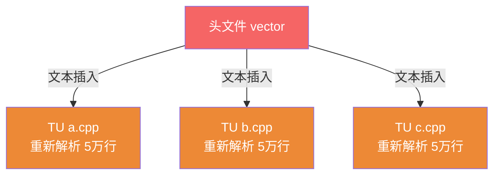
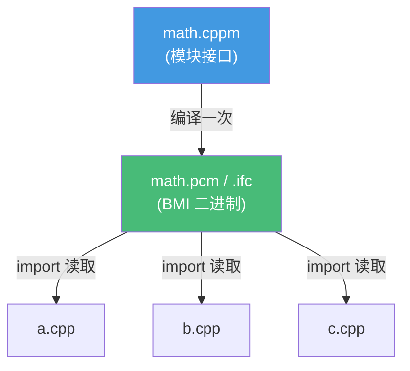
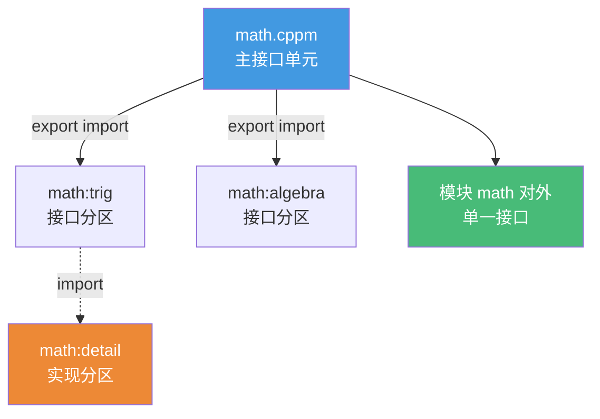
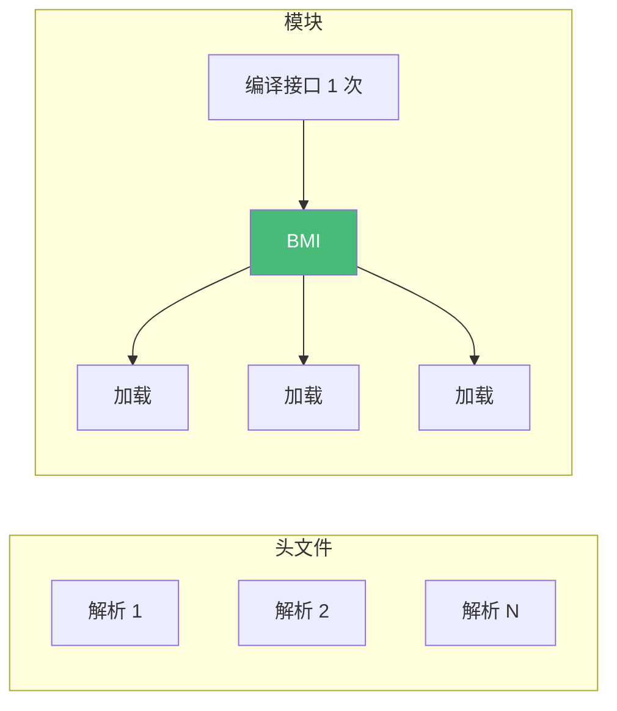

# 精通 C++ Modules

> 课程编号：C28
> 路线图来源：现代 C++ 全栈深度课程 — 模块
> 难度：⭐⭐⭐⭐
> 预计阅读时间：55 分钟
> 📅 内容基准：**C++23**（ISO/IEC 14882:2024）+ GCC 14 / Clang 18 / MSVC 19.4x

---

## 引言：为什么 #include 这么慢？

```cpp
// 一个最简单的 hello world
#include <iostream>            // 这一行展开后有多少行代码？
int main() {
    std::cout << "hello\n";
}
```

```bash
$ g++ -E hello.cpp | wc -l
50000+                        # 预处理后超过 5 万行！
```

三个问题，能立刻回答吗？

1. 为什么 `#include <iostream>` 一行会膨胀成几万行？这对编译时间意味着什么？
2. 如果 100 个 `.cpp` 都 `#include <vector>`，`vector` 的内容被编译器解析几次？
3. 在头文件里 `#define max(a,b) ...` 这种宏，会不会"污染"包含它的所有文件？Modules 怎么解决？

答案：① `#include` 是**纯文本插入**（C01）——头文件递归包含的全部内容被复制进当前 TU；② `vector` 被解析 **100 次**（每个 TU 各自重新解析整个头文件），这是 C++ 编译慢的根源；③ 宏是预处理器层面的文本替换，**会泄漏**到所有包含者，造成命名冲突（如 Windows 的 `min`/`max` 宏臭名昭著）。Modules 从根本上消除了这两个问题。

**Modules（C++20）** 是 40 年来 C++ 编译模型最大的变革——用"导入已编译的模块接口"取代"文本插入头文件"。它带来：编译加速、宏隔离、更清晰的接口边界、消除 ODR 陷阱。这一章讲清模块语法、BMI 加速原理、与 `#include` 的互操作、以及 2026 年的工具链现状。

---

## 第一章：模块 vs 头文件

### 1.1 头文件模型的三宗罪



1. **重复解析**：N 个 TU 包含同一头文件 → 解析 N 次（编译时间随包含次数线性增长）。
2. **宏污染**：头文件的 `#define` 泄漏给所有包含者，包含顺序影响语义。
3. **ODR 脆弱**：依赖每个 TU 看到逐字节相同的定义，宏/包含顺序不同会悄悄破坏。

### 1.2 模块模型

模块把接口**编译一次**，产出**二进制模块接口（BMI，Binary Module Interface）**，其他 TU 直接 `import`——读取已解析好的结构，不再重新解析源码：



| | 头文件 `#include` | 模块 `import` |
|---|---|---|
| 机制 | 文本插入（预处理） | 导入已编译 BMI |
| 解析次数 | 每个 TU 各一次 | 接口只编译一次 |
| 宏 | 泄漏到包含者 | **不导出**（隔离） |
| 顺序敏感 | 是 | 否（import 顺序无关） |
| 私有实现 | 全暴露在头里 | 可只导出接口 |

---

## 第二章：基本语法 export module / import

### 2.1 模块接口单元

模块接口文件（常见扩展名 `.cppm` / `.ixx`，因编译器而异）声明模块并用 `export` 标记对外可见的实体：

```cpp
// math.cppm —— 模块接口单元
export module math;             // 声明这是模块 math 的接口

export int add(int a, int b) {  // export：对 import 者可见
    return a + b;
}

int helper(int x) {             // 无 export：模块内部私有，import 者看不见
    return x * 2;
}

export namespace mymath {       // 可导出整个命名空间
    int square(int x) { return x * x; }
}
```

### 2.2 使用模块

```cpp
// main.cpp
import math;                    // 导入模块 math（不是文本插入！）

int main() {
    return add(1, 2);          // ✅ add 被 export
    // helper(3);              // ❌ helper 未导出，不可见
}
```

```bash
# 以 Clang 为例（语法因编译器而异，见第八章）
clang++ -std=c++20 --precompile math.cppm -o math.pcm   # 编译模块接口 → BMI
clang++ -std=c++20 -fmodule-file=math=math.pcm main.cpp math.pcm -o app
```

### 2.3 export 的粒度

```cpp
export module geometry;

export struct Point { double x, y; };      // 导出整个类

export {                                    // 导出一组
    double dist(Point a, Point b);
    double area(Point a, Point b, Point c);
}

double internal_eps() { return 1e-9; }      // 不导出：实现细节
```

**关键**：模块只导出你显式 `export` 的东西。未导出的函数、类、宏全部留在模块内部——这就是接口边界的清晰来源。

---

## 第三章：模块分区（partitions）

大模块可拆成**分区**，便于组织且避免单文件过大。分区对外是一个整体模块，对内是多个单元。

### 3.1 接口分区

```cpp
// math-trig.cppm —— 接口分区 math:trig
export module math:trig;        // 模块 math 的分区 trig
export double sin_approx(double x);

// math-algebra.cppm —— 接口分区 math:algebra
export module math:algebra;
export int gcd(int a, int b);

// math.cppm —— 主接口单元，聚合分区
export module math;
export import :trig;            // 重新导出分区 trig
export import :algebra;         // 重新导出分区 algebra
```

`import :trig` 只能在同模块内用（分区导入用 `:` 前缀）。`export import :trig` 把分区接口**再导出**给模块的使用者。

### 3.2 实现分区

```cpp
// math-impl.cppm —— 实现分区（无 export，仅供模块内部）
module math:detail;
double sin_approx(double x) { return x - x*x*x/6; }  // 实现，不对外
```



---

## 第四章：实现单元与全局模块片段

### 4.1 实现单元

接口和实现可以分离：接口单元放声明（`export`），**实现单元**放定义（不重复 `export`）：

```cpp
// math.cppm —— 接口
export module math;
export int add(int a, int b);   // 只声明

// math.cpp —— 实现单元
module math;                    // 注意：没有 export 关键字 = 实现单元
int add(int a, int b) {         // 定义（自动可见，无需再 export）
    return a + b;
}
```

实现单元修改时**不会触发依赖该模块的 TU 重新编译**（只要接口 BMI 没变）——这是模块相比头文件的另一大编译加速来源。

### 4.2 全局模块片段（global module fragment）

模块里若要用旧式 `#include`（很多 C 库、还没模块化的头），必须放在**全局模块片段**——位于 `module;` 和 `export module` 之间：

```cpp
module;                         // 全局模块片段开始
#include <cstdio>               // 传统头文件只能放这里
#include <cmath>

export module mymath;           // 模块声明（片段结束）

export double rooted(double x) {
    return std::sqrt(x);        // 用全局片段里 include 的内容
}
```

⚠️ 全局模块片段里**只能有预处理指令**（`#include`/`#define` 等），不能有普通声明。它包含的东西**不会被你的模块导出**——`#include <cmath>` 的 `std::sqrt` 对 `import mymath` 的人不可见（要可见得自己 `export using std::sqrt;`）。

---

## 第五章：编译加速原理（BMI）

### 5.1 BMI 是什么

**BMI（Binary Module Interface）** 是模块接口编译后的产物——一个**已经解析好的、序列化的 AST/符号表**。`import` 时编译器直接**反序列化加载**，跳过词法、语法、语义分析。

| 阶段 | `#include` | `import`（已有 BMI） |
|---|---|---|
| 预处理 | 文本插入全部内容 | 无 |
| 词法/语法分析 | 每次重新做 | **跳过**（读 BMI） |
| 语义分析/模板预处理 | 每次重新做 | **跳过** |
| 结果 | N 个 TU 重复 N 次 | 接口编译 1 次，import 廉价 |

BMI 的文件名因编译器而异：Clang `.pcm`、GCC `.gcm`、MSVC `.ifc`。**BMI 不是跨编译器/跨版本可移植的**——它绑定编译器实现，要随源码一起重新生成，不能当二进制分发。

### 5.2 为什么快



- **解析一次**：接口只在生成 BMI 时解析；所有 `import` 复用。
- **增量友好**：改实现单元不影响接口 BMI，依赖者不重编。
- **模板更省**：头文件里模板每个 TU 重新实例化预处理；模块接口的模板信息已在 BMI 里结构化存好。

⚠️ **依赖顺序约束**：因为 `import math;` 需要 `math` 的 BMI 已存在，构建系统必须**先编译被依赖模块**——模块引入了 TU 之间的编译顺序依赖（头文件时代各 TU 可任意并行）。这正是 Modules 难以集成进现有构建系统的核心难点（见第八章）。

---

## 第六章：与 #include 互操作 + header units

### 6.1 渐进迁移

现实中无法一次性全模块化。两种过渡手段：

**① 模块里 include 旧头**（全局模块片段，见 4.2）：

```cpp
module;
#include "legacy_lib.h"        // 旧库还没模块化
export module myapp;
```

**② header units（头文件单元）**：把一个**现成头文件**当模块导入，无需改写它：

```cpp
import <vector>;               // 把标准头 <vector> 作为 header unit 导入
import "my_header.h";          // 把自己的头作为 header unit 导入
```

### 6.2 header unit vs 命名模块

| | header unit `import <vector>;` | 命名模块 `import std;` |
|---|---|---|
| 来源 | 现成头文件，不改源码 | 专门写的模块接口 |
| 宏 | **会导出**头里的宏 | 不导出宏 |
| 性质 | 过渡方案（"半模块"） | 终态 |
| 编译产物 | header unit BMI | 模块 BMI |

⚠️ header unit 仍**导出宏**（不像命名模块隔离宏），是迁移的折中。终极目标是命名模块。

### 6.3 import std;（C++23）

C++23 标准化了 `import std;`——把**整个标准库**作为一个模块导入：

```cpp
import std;                    // C++23：一次导入整个标准库！

int main() {
    std::vector<int> v{1, 2, 3};
    std::println("size = {}", v.size());   // C++23 std::println
}
```

`import std;` 替代一大堆 `#include <vector>`/`<string>`/`<iostream>`...，且编译远快于逐个包含——这是 Modules 对日常开发最直接的收益。

---

## 第七章：常见陷阱清单

### ❌ 陷阱 1：忘了 export，符号不可见

```cpp
export module m;
int add(int,int){return 0;}   // ❌ 没 export → import m 的人看不见 add
```
对外接口必须显式 `export`。

### ❌ 陷阱 2：在全局模块片段外用 #include

```cpp
export module m;
#include <vector>             // ❌ #include 必须在 module; 与 export module 之间
```
`#include` 只能放全局模块片段，或改用 `import <vector>;`。

### ❌ 陷阱 3：以为模块会导出宏

```cpp
// math.cppm
export module math;
#define PI 3.14              // 即使写在这，PI 也不会被 import 者看到
```
命名模块**绝不导出宏**——这是特性不是 bug（宏隔离）。要传常量用 `export constexpr double PI = 3.14;`。

### ❌ 陷阱 4：BMI 当二进制分发

```bash
# ❌ 把 math.pcm 拷给用不同编译器/版本的人 → 无法加载
```
BMI 不可移植，绑定编译器实现+版本+编译选项，必须随源码重新生成。

### ❌ 陷阱 5：实现单元里重复 export

```cpp
// math.cpp
module math;
export int add(int,int){...}  // ❌ 实现单元不能再 export（接口单元已声明）
```

### ❌ 陷阱 6：循环 import

```cpp
// a.cppm: import b;   b.cppm: import a;   // ❌ 模块不允许循环依赖
```
模块依赖必须是 DAG（有向无环图），用分区或重构打破循环。

---

## 第八章：练习题

**练习 1**：`#include` 和 `import` 在机制上最本质的区别是什么？为什么 `import` 编译更快？

**练习 2**：模块的命名空间外、`#define FOO` 写在模块接口里，`import` 它的人能用 `FOO` 吗？为什么？

**练习 3**：什么是 BMI？它能不能像 `.so` 那样当二进制分发给别人？

**练习 4**：接口单元（`export module m;`）和实现单元（`module m;`）有什么区别？改实现单元会不会让所有 import 者重新编译？

**练习 5**：`import <vector>;`（header unit）和 `import std;`（命名模块）有什么区别？哪个会导出宏？

---

## 参考答案与解析

**练习 1**：`#include` 是**预处理器文本插入**——头文件全部内容被复制进 TU，每个包含它的 TU 都要重新词法/语法/语义分析。`import` 加载已编译好的 **BMI**（序列化的 AST/符号表），跳过解析阶段。接口只在生成 BMI 时解析一次，所有 import 者复用 → 编译更快，且不重复实例化模板。

**练习 2**：**不能**。命名模块**不导出宏**——宏是预处理层面的，模块接口只导出 `export` 的声明，`#define` 留在模块内部。这是 Modules 解决宏污染的核心设计。要传常量改用 `export constexpr` 变量。

**练习 3**：BMI（Binary Module Interface）是模块接口编译后的产物——已解析的 AST/符号表序列化文件（Clang `.pcm`、GCC `.gcm`、MSVC `.ifc`）。**不能当二进制分发**——它绑定编译器实现、版本、编译选项，跨编译器/版本不兼容，必须随源码重新生成（不像 `.so` 是稳定的机器码 + ABI）。

**练习 4**：接口单元 `export module m;` 声明模块接口、用 `export` 暴露符号、生成 BMI；实现单元 `module m;`（无 export）放定义。**改实现单元不会**触发 import 者重编——只要接口 BMI 没变，依赖者无需重新编译（这是模块的增量编译优势）。只有改接口才会级联重编。

**练习 5**：`import <vector>;` 是 **header unit**——把现成头文件当模块导入，无需改头源码，但**会导出头里的宏**（过渡方案）。`import std;` 是 C++23 标准化的**命名模块**，导入整个标准库，**不导出宏**，编译更快，是终态。header unit 是迁移折中，命名模块是目标。

---

## 小结

| 知识点 | 关键记忆 |
|---|---|
| 模块 vs 头文件 | import 加载 BMI（解析一次）；#include 文本插入（每 TU 重复解析） |
| export module / import | `export module m;` 定义接口；`export` 标记可见；`import m;` 导入 |
| 模块分区 | `module:partition`；`export import :p` 聚合；分区导入用 `:` 前缀 |
| 实现单元 | `module m;`（无 export）放定义；改它不触发 import 者重编 |
| 全局模块片段 | `module;` 与 `export module` 之间，只放 #include/#define |
| BMI | 序列化 AST，加速来源；不可移植，随源码重生成 |
| 宏隔离 | 命名模块不导出宏（特性）；header unit 会导出宏 |
| import std; | C++23 一次导入整个标准库；编译快、宏隔离 |

---

## 📅 2026 现状/更新

- 三大编译器对 C++20 Modules 的支持在 2026 已基本可用：MSVC 最成熟，GCC 14 / Clang 18 持续完善；`import std;`（C++23）在新版本中逐步落地。
- **构建系统是最大瓶颈**：模块引入 TU 编译顺序依赖，CMake 3.28+ 才正式支持 `CXX_MODULES` 文件集（需 Ninja 1.11+ / 较新生成器），但用法仍偏复杂、生态库迁移缓慢。
- BMI 不可移植 + 构建复杂，导致大量现存项目仍以 `#include` 为主，Modules 的全面普及处于"早期采用"阶段。
- 实用建议：新项目可在内部模块化（尤其用 `import std;` 享受编译加速）；与外部库交互仍靠全局模块片段 `#include` 或 header units 过渡；关注 CMake/构建工具的成熟度再大规模迁移。

---

> 🔁 下一篇 **C29 — 精通 C++ 字符串与 format**：`std::string`/`std::string_view`（悬空陷阱）、SSO 小字符串优化、`std::format`（C++20）/`std::print`（C++23）、格式说明与自定义 `formatter`、`char8_t` 与 UTF-8、以及 `to_chars`/`from_chars` 数字转换。
>
> 反馈：把"import 加载 BMI 而非文本插入、命名模块隔离宏、BMI 不可移植"三点记牢——它们解释了 Modules 为什么快、为什么干净、为什么难集成。
