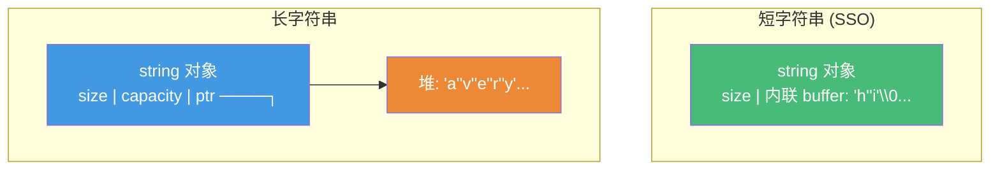
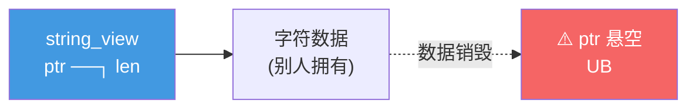

# 精通 C++ 字符串与 format

> 课程编号：C29
> 路线图来源：现代 C++ 全栈深度课程 — 字符串与格式化
> 难度：⭐⭐⭐
> 预计阅读时间：55 分钟
> 📅 内容基准：**C++23**（ISO/IEC 14882:2024）+ GCC 14 / Clang 18 / MSVC 19.4x

---

## 引言：这段字符串代码有什么问题？

```cpp
#include <string>
#include <string_view>

std::string_view get_name() {
    std::string s = "Alice";
    return s;                      // 1) 返回 string_view，安全吗？
}

void demo() {
    std::string a = "hello";
    std::string_view sv = a + " world";   // 2) 这个 sv 安全吗？
    char buf[16];
    std::string s = "hello";
    auto sv2 = std::string_view(s).substr(0, 3);  // 3) 这个呢？
}
```

三个问题，能立刻回答吗？

1. `get_name` 返回 `string_view` 指向局部 `s`，函数返回后 `s` 销毁 → **悬空（dangling）**，UB。
2. `a + " world"` 产生**临时 string**，`sv` 绑定后临时立即销毁 → **悬空**，UB。
3. `s` 还活着，`substr` 返回的 `string_view` 指向 `s` 的内存 → **安全**（只要 `s` 不被修改/销毁）。

答案的核心：**`string_view` 不拥有数据，只是"指针 + 长度"**——它绝不能比所指向的数据活得久。这是现代 C++ 最常见的悬空陷阱来源。

字符串看似简单，背后藏着 SSO（小字符串优化）、`string_view` 的所有权陷阱、UTF-8/Unicode 的复杂性、以及 C++20/23 终于带来的现代格式化（`std::format`/`std::print`，告别 `printf` 的不安全和 `iostream` 的啰嗦）。这一章把这些讲透。

---

## 第一章：std::string 与 SSO

### 1.1 string 的内部结构

`std::string` 管理一段堆上的字符缓冲（动态扩容，类似 `vector<char>`），但有一个关键优化：**SSO（Small String Optimization，小字符串优化）**。

短字符串（通常 ≤ 15 字节，libstdc++）**直接存在 string 对象内部的缓冲里，不分配堆内存**：

```cpp
std::string s1 = "hi";                  // 短 → 存在对象内部（栈/SSO buffer），无堆分配
std::string s2 = "a very long string exceeding the SSO threshold...";  // 长 → 堆分配
```



### 1.2 为什么有 SSO

绝大多数程序里的字符串都很短（名字、键、标识符）。SSO 让短字符串**零堆分配**——构造/拷贝/析构无需 `malloc`/`free`，大幅提升性能、改善缓存局部性。

```cpp
std::string key = "id";          // 无堆分配（SSO），拷贝就是按字节复制对象
// 一个 string 通常 24-32 字节（含内联 buffer），sizeof 比你想的大
```

| | 短字符串（SSO） | 长字符串 |
|---|---|---|
| 存储 | 对象内部 buffer | 堆 |
| 堆分配 | **无** | 有 |
| 拷贝成本 | 按字节复制对象（廉价） | 分配 + 复制内容 |
| 阈值 | 实现定义（libstdc++ 15 字节、MSVC 15、libc++ 22） |

⚠️ SSO 阈值因标准库而异。别依赖具体数字写代码，但要知道"短字符串很便宜，长字符串有堆分配"。

---

## 第二章：std::string_view 与悬空陷阱

### 2.1 string_view 是什么

`std::string_view`（C++17）是一个**非拥有（non-owning）** 的字符串视图——本质是 `{ const char* ptr; size_t len; }`。它**不复制、不拥有**数据，只是"看"一段已存在的字符序列。

```cpp
void print(std::string_view sv) {    // 接受 string / 字面量 / char* 都不拷贝
    std::cout << sv << '\n';
}

std::string s = "hello";
print(s);                            // 无拷贝
print("world");                      // 无拷贝（字面量）
print(s.substr(0,3));                // ⚠️ substr 返回临时 string，这里有拷贝
```

`string_view` 作函数参数是"只读字符串"的理想类型：避免拷贝、统一接受多种来源。

### 2.2 悬空陷阱（核心）

`string_view` 不延长所指数据的生命周期——**所指数据死了，view 就悬空**：

```cpp
// ❌ 陷阱 1：指向局部变量
std::string_view bad1() {
    std::string s = "tmp";
    return s;                        // s 销毁 → 返回的 view 悬空
}

// ❌ 陷阱 2：绑定临时量
std::string a = "x";
std::string_view sv = a + "y";       // 临时 string 立即销毁 → 悬空

// ❌ 陷阱 3：从返回 string 的函数构造
std::string make();
std::string_view sv2 = make();       // make() 临时销毁 → 悬空

// ✅ 安全：所指数据活得比 view 久
std::string s = "hello";
std::string_view ok = s;             // s 活着，OK（别在用 ok 期间销毁/重分配 s）
```



### 2.3 还有两个坑

```cpp
// 坑：string_view 不保证 null 结尾！
void use_c_api(std::string_view sv) {
    // strlen(sv.data());            // ❌ sv.data() 可能不是 \0 结尾
    std::string s(sv);               // ✅ 要传 C API 先拷成 string（保证 \0）
    c_func(s.c_str());
}
```

`string_view` **不保证 null 结尾**（它可能是更大字符串的一段切片），传给需要 C 字符串的 API 前要先转成 `std::string`。

---

## 第三章：std::format（C++20）

C++20 引入 `std::format`——类型安全、可扩展，融合了 Python `str.format` 的简洁和 `printf` 的紧凑，没有 `printf` 的类型不安全、也没有 `iostream` 的啰嗦。

### 3.1 基本用法

```cpp
#include <format>

std::string s = std::format("{} + {} = {}", 1, 2, 3);   // "1 + 2 = 3"
std::string t = std::format("{0} {1} {0}", "a", "b");   // "a b a" 位置参数
// ⚠️ 标准 std::format 不支持命名参数：写 "{name}" 会编译期报错（format 串经 consteval 校验）
// 只能用自动/手动位置索引：
std::string u = std::format("{0} 和 {0}", "x");          // "x 和 x"
```

`std::format` **编译期检查格式串**——参数个数/类型不匹配会在**编译期**报错（内部用 `consteval`，见 C27），而 `printf("%d", "str")` 这类错误要等运行期甚至悄无声息：

```cpp
// std::format("{} {}", 1);          // ❌ 编译错误：格式串需要 2 个参数，只给 1 个
// printf("%d %d", 1);               // ⚠️ 编译可能不报，运行期读垃圾值（UB）
```

### 3.2 格式说明（format spec）

格式说明语法：`{[索引][:[填充对齐][符号][#][0][宽度][.精度][类型]]}`

```cpp
std::format("{:5}", 42);          // "   42"      宽度 5，右对齐
std::format("{:<5}", 42);         // "42   "      左对齐
std::format("{:^5}", 42);         // " 42  "      居中
std::format("{:*^7}", 42);        // "**42***"    填充 '*' 居中
std::format("{:05}", 42);         // "00042"      补零
std::format("{:+}", 42);          // "+42"        强制符号
std::format("{:.2f}", 3.14159);   // "3.14"       两位小数
std::format("{:x}", 255);         // "ff"         十六进制
std::format("{:#x}", 255);        // "0xff"       带前缀
std::format("{:b}", 5);           // "101"        二进制
std::format("{:e}", 12345.0);     // "1.234500e+04" 科学计数
std::format("{:.3}", "hello");    // "hel"        字符串截断
```

| 类型说明 | 含义 |
|---|---|
| `d` / `b` / `o` / `x` | 十/二/八/十六进制整数 |
| `f` / `e` / `g` | 定点 / 科学 / 通用浮点 |
| `s` | 字符串 |
| `<` / `>` / `^` | 左 / 右 / 居中对齐 |

---

## 第四章：std::print（C++23）与自定义 formatter

### 4.1 std::print / std::println

C++23 加了 `std::print`/`std::println`——直接把 `format` 的结果输出，无需先建 string 再 `cout`：

```cpp
#include <print>

std::print("{} + {} = {}\n", 1, 2, 3);     // 输出到 stdout
std::println("size = {}", 42);             // 自动加换行
std::print(std::cerr, "error: {}", msg);   // 指定流
```

`std::print` 比 `std::cout << std::format(...)` 更高效、更安全（直接写、正确处理 Unicode），是现代 C++ 输出的首选——告别 `printf` 和 `<<` 链。

### 4.2 自定义类型的 formatter

让自己的类型支持 `std::format`，特化 `std::formatter`：

```cpp
struct Point { int x, y; };

template<>
struct std::formatter<Point> {
    // 解析格式说明（这里忽略，直接返回）
    constexpr auto parse(std::format_parse_context& ctx) {
        return ctx.begin();
    }
    // 格式化输出
    auto format(const Point& p, std::format_context& ctx) const {
        return std::format_to(ctx.out(), "({}, {})", p.x, p.y);
    }
};

std::println("{}", Point{3, 4});           // "(3, 4)"
```

更进阶的 formatter 可在 `parse` 里读取自定义格式说明，或**委托给已有 formatter**：

```cpp
template<>
struct std::formatter<Point> : std::formatter<std::string> {
    auto format(const Point& p, auto& ctx) const {
        return std::formatter<std::string>::format(
            std::format("({}, {})", p.x, p.y), ctx);   // 复用 string formatter，继承其对齐/宽度
    }
};
```

---

## 第五章：char8_t、Unicode 与 UTF-8

### 5.1 字符类型一览

```cpp
char     c = 'a';        // 字节，编码未指定（常是 UTF-8 的一字节）
char8_t  u = u8'a';      // C++20：明确表示 UTF-8 码元（1 字节）
char16_t w = u'中';       // UTF-16 码元（2 字节）
char32_t W = U'中';       // UTF-32 码点（4 字节，1 码点 = 1 个 char32_t）
wchar_t  L = L'中';       // 宽字符，宽度平台相关（Windows 2 字节，Linux 4 字节）
```

| 类型 | 字面量 | 编码 | 字符串类型 |
|---|---|---|---|
| `char` | `'a'` | 实现定义（常 UTF-8） | `std::string` |
| `char8_t` | `u8'a'` | UTF-8 码元 | `std::u8string` |
| `char16_t` | `u'a'` | UTF-16 码元 | `std::u16string` |
| `char32_t` | `U'a'` | UTF-32 码点 | `std::u32string` |

### 5.2 UTF-8 的关键认知

```cpp
std::string s = "中文";          // UTF-8 下：每个汉字 3 字节
s.size();                        // 6（字节数，不是字符数！）
s[0];                            // 一个字节（'中' 的第一字节），不是 '中'
```

⚠️ **`std::string::size()` 返回字节数，不是字符（码点/字形）数**。对 UTF-8 字符串：

- 一个码点可能占 1-4 字节。
- 一个"用户感知字符"（grapheme，如带音标的字母、emoji）可能由多个码点组成。
- 索引 `s[i]` 取的是字节，不是字符——随意切片会切断多字节序列。

C++ 标准库**没有完整的 Unicode 处理**（无 grapheme 分割、规范化、大小写折叠）。需要这些用 ICU 等专门库。`std::format`/`std::print`（C++23）对输出宽度做了 Unicode 感知的估算（基于码点的显示宽度）。

```cpp
// char8_t 字面量明确是 UTF-8
std::u8string greeting = u8"你好";    // 明确 UTF-8 编码的字符串
std::println("{}", "café");           // C++23 print 正确处理 UTF-8 输出
```

---

## 第六章：to_chars / from_chars —— 高性能数字转换

`std::to_chars`/`std::from_chars`（C++17，头 `<charconv>`）是**最快、无分配、无 locale、无异常**的数字↔字符串转换——远优于 `std::stoi`/`std::to_string`/`stringstream`。

```cpp
#include <charconv>

// 数字 → 字符串（写入用户提供的 buffer，零分配）
char buf[32];
auto [ptr, ec] = std::to_chars(buf, buf + sizeof(buf), 3.14159);
if (ec == std::errc{})
    std::string_view result(buf, ptr);   // 转换成功，[buf, ptr) 是结果

// 字符串 → 数字
std::string_view sv = "42abc";
int value;
auto [p, e] = std::from_chars(sv.data(), sv.data() + sv.size(), value);
// value == 42，p 指向 'a'（停在第一个非数字处），e == errc{} 表示成功
```

| 方式 | 分配 | locale | 异常 | 速度 |
|---|---|---|---|---|
| `to_chars`/`from_chars` | 无 | 无（始终 C locale） | 无（返回 `errc`） | **最快** |
| `to_string`/`stoi` | 有 | stoi 受 locale 影响弱 | stoi **抛异常** | 中 |
| `stringstream` | 有 | 受 locale 影响 | 设标志位 | **最慢** |

为什么 `to_chars`/`from_chars` 快：它们**不分配内存**（写进你给的 buffer）、**不查 locale**（始终用 C 风格）、**不抛异常**（用 `std::errc` 报错）、且对浮点用了高精度往返算法（Ryu/Grisu），保证 `to_chars` → `from_chars` 往返无损。性能敏感的解析/序列化（JSON、CSV）首选它们。

---

## 第七章：常见陷阱清单

### ❌ 陷阱 1：string_view 悬空

```cpp
std::string_view sv = std::string("tmp");   // 临时 string 销毁 → 悬空 UB
```
`string_view` 不拥有数据，绝不能比所指数据活得久。

### ❌ 陷阱 2：string_view 当 null 结尾的 C 字符串用

```cpp
void f(std::string_view sv){ strlen(sv.data()); }  // ❌ 可能无 \0 结尾
```
传 C API 前先 `std::string(sv)`。

### ❌ 陷阱 3：用 size() 当字符数（UTF-8）

```cpp
std::string s = "中文";
s.size();                    // 6（字节），不是 2（字符）
```

### ❌ 陷阱 4：printf 风格的类型不安全

```cpp
printf("%d", 3.14);          // ❌ 类型不匹配，UB（用 std::format/print 编译期检查）
```

### ❌ 陷阱 5：用 stringstream 做高频数字转换

```cpp
std::stringstream ss; ss << n;   // 慢 + 分配 + locale；热路径用 to_chars
```

### ❌ 陷阱 6：忘了检查 from_chars 的 errc

```cpp
int v; std::from_chars(p, end, v);   // ❌ 没查 ec，转换失败时 v 未被赋值
```
必须检查返回的 `ec == std::errc{}`。

---

## 第八章：练习题

**练习 1**：`std::string_view` 为什么高效？它最大的危险是什么？举一个悬空例子。

**练习 2**：什么是 SSO？为什么短字符串拷贝比长字符串便宜？

**练习 3**：`std::string s = "中文";` 后 `s.size()` 是多少？为什么不是 2？

**练习 4**：`std::format` 相比 `printf` 和 `cout <<` 各有什么优势？

**练习 5**：为什么 `std::from_chars` 比 `std::stoi` 快？解析大量数字时该选哪个？

---

## 参考答案与解析

**练习 1**：`string_view` 是非拥有视图（指针 + 长度），传参/切片**不拷贝**，统一接受 string/字面量/char*，故高效。最大危险是**悬空**——它不延长所指数据生命周期，数据销毁后 view 变野指针（UB）。例子：`std::string_view sv = a + "b";`（临时 string 立即销毁）或返回指向局部 string 的 view。

**练习 2**：SSO（小字符串优化）= 短字符串（实现定义阈值，约 15-22 字节）**直接存在 string 对象内部缓冲，不分配堆内存**。短字符串拷贝只是按字节复制对象本身（无 `malloc`），长字符串拷贝要分配新堆 + 复制内容，所以短的便宜得多。

**练习 3**：**6**。UTF-8 下每个汉字占 3 字节，"中文" = 6 字节。`size()` 返回**字节数**不是字符数。一个码点 1-4 字节，C++ 标准库不做码点/字形计数，需 ICU 等库。

**练习 4**：相比 `printf`：`std::format` **类型安全**（编译期检查格式串与参数匹配，consteval），不会因 `%d` 配错类型而 UB，且支持自定义类型。相比 `cout <<`：更**简洁**（一行写完，不用 `<<` 链和 `std::setw`/`std::setprecision` 操纵符），格式说明集中可读。C++23 的 `std::print` 进一步直接高效输出。

**练习 5**：`from_chars` **不分配内存**（不构造 string）、**不查 locale**（始终 C 风格）、**不抛异常**（返回 `errc`），且只解析必要部分。`stoi` 要构造/解析、可能受 locale 影响、失败抛异常（开销大）。解析大量数字（JSON/CSV 热路径）选 `from_chars`——更快、可预测、无异常开销。

---

## 小结

| 知识点 | 关键记忆 |
|---|---|
| std::string + SSO | 短字符串存对象内部（无堆分配）；长的才上堆；阈值实现定义 |
| string_view | 非拥有视图（ptr+len），传只读字符串高效；**绝不能比所指数据活得久** |
| 悬空陷阱 | 别绑临时量/局部 string；别当 null 结尾 C 串用 |
| std::format | C++20；类型安全、编译期检查格式串；`{:格式说明}` |
| std::print | C++23；直接高效输出，取代 cout<</printf；自定义 formatter 特化 |
| char8_t/UTF-8 | char8_t=UTF-8 码元；size() 是字节数非字符数；标准库不做完整 Unicode |
| to_chars/from_chars | C++17；无分配/无 locale/无异常，最快；记得查 errc |

---

## 📅 2026 现状/更新

- `std::format`（C++20）在 GCC 14 / Clang 18 / MSVC 19.4x 均已可用；`std::print`/`std::println`（C++23）在新版本陆续完整支持，逐渐成为输出首选。
- `to_chars`/`from_chars` 的浮点支持（最难的部分）在三大标准库均已完整，是高性能序列化的基础。
- Unicode 仍是短板：标准库只做基础码点处理，grapheme 分割/规范化/大小写折叠需 ICU；C++26 在讨论更多文本处理设施。
- 实用准则：只读字符串参数用 `string_view`（注意生命周期）；输出用 `std::print`/`std::format`；高频数字转换用 `<charconv>`；处理真正的 Unicode 用专门库。

---

> 🔁 下一篇 **C30 — 精通 C++ 内存管理进阶**：自定义分配器、`placement new`、对齐（`alignas`/`alignof`）、`std::pmr`（多态内存资源）、内存池，以及如何为容器定制内存策略。
>
> 反馈：把"string_view 不拥有数据、size() 是字节数、用 format/print 取代 printf/cout"三条记牢——它们覆盖了字符串日常 90% 的坑与最佳实践。
