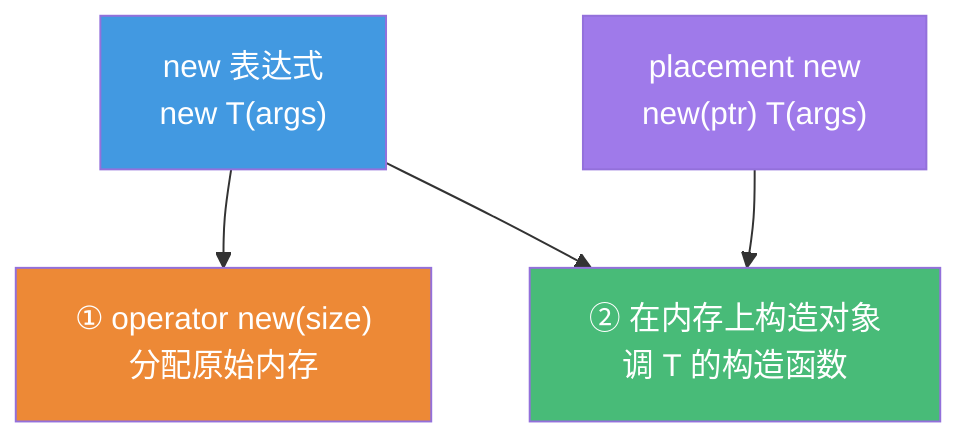
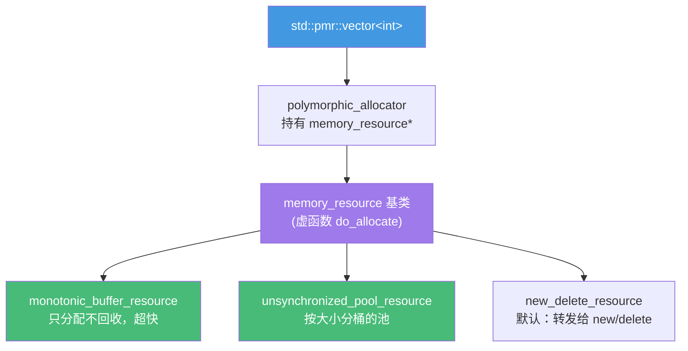

# 精通 C++ 内存管理进阶

> 课程编号：C30
> 路线图来源：现代 C++ 全栈深度课程 — 内存管理进阶
> 难度：⭐⭐⭐⭐⭐
> 预计阅读时间：65 分钟
> 📅 内容基准：**C++23**（ISO/IEC 14882:2024）+ GCC 14 / Clang 18 / MSVC 19.4x

---

## 引言：new 到底做了几件事？

```cpp
#include <new>
#include <cstdlib>

struct Widget {
    int x;
    Widget(int v) : x(v) {}
};

void demo() {
    Widget* w = new Widget(42);     // 1) 这一行做了几件事？
    delete w;                        // 2) 这一行又做了几件事？

    void* p = ::operator new(sizeof(Widget));   // 3) 这只分配内存，没构造对象
    Widget* w2 = new (p) Widget(7);             // 4) placement new：在 p 上构造
    w2->~Widget();                              // 5) 为什么要手动调析构？
    ::operator delete(p);
}
```

三个问题，能立刻回答吗？

1. `new Widget(42)` 究竟是一个操作还是两个？谁负责分配内存、谁负责构造对象？
2. 为什么 `::operator new` / `placement new` / `new 表达式`是三个不同的东西？
3. 想自定义内存分配策略（内存池、对齐分配、调试追踪），该重载哪个？

答案：① `new Widget(42)`（**new 表达式**）做**两件事**——先调 `operator new` 分配原始内存，再在该内存上**构造对象**（调构造函数）；`delete` 反过来——先调**析构函数**，再调 `operator delete` 释放内存；② `operator new` 只管"要一块字节"，`placement new` 只管"在已有内存上构造"，new 表达式把两者打包；③ 想换分配策略就重载 `operator new`/`operator delete`（全局或类内），想精细控制构造/析构时机就直接用 `placement new` + 显式析构。

C++ 把**内存分配**和**对象生命周期**彻底分离——这是它区别于带 GC 语言的根本，也是高性能（内存池、自定义分配器、`std::pmr`）的基础。这一章拆开 `new`，讲清分配器、对齐、`std::pmr`、内存池与 `std::launder`，是 C31 性能优化的前置。

---

## 第一章：拆开 new —— 分配与构造分离

### 1.1 三个层次

`new` 这个词在 C++ 里有三个不同含义，混淆它们是一切困惑的根源：



| 名称 | 形式 | 做什么 | 可重载 |
|---|---|---|---|
| **new 表达式** | `new T(args)` | 分配 + 构造（两步） | 否（语言构造） |
| **operator new** | `operator new(size_t)` | 只分配原始字节 | **是** |
| **placement new** | `new (ptr) T(args)` | 只在 ptr 上构造 | 一般不重载 |

```cpp
// new 表达式约等于：
void* mem = operator new(sizeof(T));   // ① 分配
T* p = new (mem) T(args);              // ② 构造（placement new）
// ...
// delete 约等于：
p->~T();                               // ① 析构
operator delete(mem);                  // ② 释放
```

### 1.2 为什么要分离

把"拿内存"和"造对象"拆开，能做到带 GC 语言做不到的事：

- **容器**：`std::vector` 一次性分配一大块内存（`operator new`），随 `push_back` 逐个 `placement new` 构造元素——避免每个元素单独分配。
- **内存池**：预分配一大块，按需在其中构造对象，O(1) 分配。
- **延迟构造**：`std::optional`、`std::variant` 预留内存但不一定构造对象。

---

## 第二章：operator new / operator delete

### 2.1 全局重载

```cpp
#include <cstdio>
#include <cstdlib>
#include <new>

// 全局 operator new：所有 new 表达式都会走这里
void* operator new(std::size_t n) {
    void* p = std::malloc(n);
    if (!p) throw std::bad_alloc{};      // 失败必须抛 bad_alloc（契约）
    std::printf("alloc %zu bytes @ %p\n", n, p);
    return p;
}

void operator delete(void* p) noexcept {  // delete 必须 noexcept
    std::printf("free @ %p\n", p);
    std::free(p);
}

// C++14 起的"带大小"版本：释放时拿到 size，便于池分配器
void operator delete(void* p, std::size_t n) noexcept {
    std::free(p);
}
```

⚠️ `operator new` 失败必须**抛 `std::bad_alloc`**（除非是 `nothrow` 版本，返回 `nullptr`）；`operator delete` 必须 `noexcept`——这是语言契约，违反会出问题。

### 2.2 类内重载

只想给某个类换分配策略时，在类里重载：

```cpp
struct Node {
    int value;
    Node* next;

    static void* operator new(std::size_t n) {
        return pool_alloc(n);            // 走自己的内存池
    }
    static void operator delete(void* p) noexcept {
        pool_free(p);
    }
};

Node* n = new Node;      // 调 Node::operator new（不是全局的）
delete n;                // 调 Node::operator delete
```

类内 `operator new`/`operator delete` 隐式是 `static`（它们在对象存在之前就被调用，没有 `this`）。

### 2.3 nothrow 与定位形式

```cpp
Widget* w = new (std::nothrow) Widget;   // 失败返回 nullptr 而非抛异常
if (!w) { /* 处理分配失败 */ }
```

---

## 第三章：placement new 与显式析构

### 3.1 在已有内存上构造

`placement new` 接收一个已分配好的地址，只**调构造函数**，不分配内存：

```cpp
#include <new>

alignas(Widget) char buffer[sizeof(Widget)];   // 栈上的一块原始内存

Widget* w = new (buffer) Widget(42);   // 在 buffer 上构造 Widget，不分配堆内存
// ... 使用 w ...
w->~Widget();                          // ⚠️ 必须手动调析构！（placement new 没有配对的 delete）
```

关键点：placement new **没有对应的 placement delete** 给你调用——你必须**手动调析构函数** `w->~Widget()`。内存本身由 buffer 拥有（这里是栈，自动回收）。

### 3.2 应用：容器的实现骨架

这正是 `std::vector` 等容器的底层做法：

```cpp
template <class T>
class MiniVector {
    T* data_ = nullptr;
    std::size_t size_ = 0, cap_ = 0;
public:
    void push_back(const T& v) {
        if (size_ == cap_) grow();
        new (data_ + size_) T(v);      // placement new：在已分配内存上构造第 size_ 个元素
        ++size_;
    }
    void pop_back() {
        --size_;
        data_[size_].~T();             // 显式析构最后一个元素（内存不释放）
    }
    void grow() {
        std::size_t nc = cap_ ? cap_ * 2 : 4;
        void* raw = ::operator new(nc * sizeof(T));   // 只分配原始内存，不构造
        T* nd = static_cast<T*>(raw);
        for (std::size_t i = 0; i < size_; ++i) {
            new (nd + i) T(std::move(data_[i]));      // 移动构造到新内存
            data_[i].~T();                            // 析构旧元素
        }
        ::operator delete(data_);
        data_ = nd; cap_ = nc;
    }
    ~MiniVector() {
        for (std::size_t i = 0; i < size_; ++i) data_[i].~T();
        ::operator delete(data_);
    }
};
```

注意：分配（`operator new`）和构造（`placement new`）完全分开——这是容器能高效管理内存的根本。

---

## 第四章：对齐分配

### 4.1 为什么需要对齐

每个类型有**对齐要求（alignment）**——它的地址必须是某个值的倍数。普通 `new` 只保证 `__STDCPP_DEFAULT_NEW_ALIGNMENT__`（通常 16）的对齐。但 SIMD 类型、缓存行对齐结构需要更强对齐：

```cpp
#include <new>

struct alignas(64) CacheLine {   // 要求 64 字节对齐（一个缓存行）
    int data[16];
};

static_assert(alignof(CacheLine) == 64);
```

### 4.2 C++17 的对齐感知 new

C++17 起，对**过对齐类型**（over-aligned，对齐大于默认值）`new` 会自动调用带 `std::align_val_t` 的 `operator new`：

```cpp
CacheLine* p = new CacheLine;    // 自动调 operator new(size, align_val_t{64})
delete p;                        // 自动调对齐版 operator delete

// 可重载对齐版本：
void* operator new(std::size_t n, std::align_val_t a) {
    return ::operator new(n, a);  // 转发给默认对齐分配
}
```

### 4.3 手动对齐分配

```cpp
#include <cstdlib>
#include <memory>

// C++17: std::aligned_alloc（来自 C11，<cstdlib>）
// ⚠️ MSVC 不提供 std::aligned_alloc，Windows 上需 _aligned_malloc + _aligned_free
void* p = std::aligned_alloc(64, 128);   // 64 对齐、128 字节；size 须是 align 的倍数
std::free(p);                            // 注意：用 free 释放

// C++ 标准方式：operator new 的对齐版本
void* q = ::operator new(128, std::align_val_t{64});
::operator delete(q, std::align_val_t{64});

// 运行期调整对齐：std::align（在缓冲区里找对齐点）
char buf[256];
void* ptr = buf;
std::size_t space = sizeof(buf);
void* aligned = std::align(64, sizeof(double), ptr, space);  // 返回 buf 中首个 64 对齐地址
```

| 工具 | 头文件 | 用途 |
|---|---|---|
| `alignas(N)` | 语言 | 声明类型/变量对齐 |
| `alignof(T)` | 语言 | 查询类型对齐 |
| `std::align_val_t` | `<new>` | 对齐版 operator new 的标签 |
| `std::aligned_alloc` | `<cstdlib>` | C 风格对齐分配（free 释放） |
| `std::align` | `<memory>` | 在缓冲区内对齐指针 |

⚠️ 缓存行对齐（`alignas(64)`）是消除 **false sharing** 的关键手段（C31 详解）。

---

## 第五章：std::pmr —— 多态分配器

### 5.1 痛点：分配器是类型的一部分

传统 STL 的分配器写进**类型模板参数**：`std::vector<int, MyAlloc>` 和 `std::vector<int>` 是**不同类型**，无法互相赋值、无法存进同一容器。C++17 的 `std::pmr`（polymorphic memory resource）用**运行期多态**解决：分配策略藏在一个 `memory_resource*` 后面，类型不变。

```cpp
#include <memory_resource>
#include <vector>

void demo() {
    std::pmr::vector<int> a;   // 等价 std::vector<int, std::pmr::polymorphic_allocator<int>>
    std::pmr::vector<int> b;
    // a 和 b 类型相同，但可以使用不同的 memory_resource！
}
```



### 5.2 monotonic_buffer_resource —— 最快的分配器

"单调缓冲"：从一块大缓冲区里**只往前分配，从不单独回收**，整体一次性释放。分配就是移动一个指针，极快——适合"一帧/一次请求内大量短命对象"的场景：

```cpp
#include <memory_resource>
#include <vector>
#include <array>

void process_request() {
    std::array<std::byte, 64 * 1024> buf;            // 栈上 64KB 缓冲（零堆分配）
    std::pmr::monotonic_buffer_resource pool{
        buf.data(), buf.size()                       // 用栈缓冲作为内存来源
    };

    std::pmr::vector<int> v{&pool};                  // 这个 vector 从 pool 分配
    std::pmr::vector<std::pmr::string> names{&pool}; // string 也从同一个 pool 分配
    for (int i = 0; i < 1000; ++i) v.push_back(i);   // 全程不碰堆
    // 离开作用域：pool 析构，一次性释放所有内存（不逐个回收）
}
```

要点：`monotonic_buffer_resource` 的 `deallocate` 是**空操作**——它不回收单个对象，只在自己析构时整体释放。这换来了极致的分配速度。

### 5.3 pool_resource —— 池分配器

按对象大小**分桶**，每桶维护空闲链表，回收的块可复用。适合"频繁分配/释放同样大小的小对象"：

```cpp
std::pmr::unsynchronized_pool_resource pool;   // 单线程版（无锁，更快）
// std::pmr::synchronized_pool_resource        // 多线程安全版
std::pmr::vector<int> v{&pool};
```

### 5.4 嵌套：池之上叠缓冲

`memory_resource` 可以链式组合——上游耗尽时向下游要内存：

```cpp
std::array<std::byte, 1 << 20> buf;
std::pmr::monotonic_buffer_resource upstream{buf.data(), buf.size()};
std::pmr::unsynchronized_pool_resource pool{&upstream};  // 池从单调缓冲取内存
std::pmr::vector<int> v{&pool};
```

| memory_resource | 分配 | 回收 | 适用 |
|---|---|---|---|
| `monotonic_buffer_resource` | 指针前移，最快 | 整体一次释放 | 一帧/一次请求的临时对象 |
| `unsynchronized_pool_resource` | 分桶空闲链表 | 单块可复用 | 频繁分配同尺寸小对象（单线程） |
| `synchronized_pool_resource` | 同上 + 加锁 | 同上 | 多线程 |
| `new_delete_resource()` | 转发 new/delete | 转发 | 默认 |

---

## 第六章：自己实现一个内存池

理解了原理，写一个最简单的固定大小块内存池（free list 风格）：

```cpp
#include <cstddef>
#include <cstdlib>
#include <new>

class FixedPool {
    union Slot {            // 用 union：空闲时存"下一个空闲块"指针，占用时存对象
        Slot* next;
        // 实际对象就构造在这块内存上
    };
    Slot* free_list_ = nullptr;
    std::size_t block_size_;
    void* chunk_ = nullptr;

public:
    explicit FixedPool(std::size_t block_size, std::size_t count)
        : block_size_(block_size < sizeof(Slot*) ? sizeof(Slot*) : block_size)
    {
        chunk_ = ::operator new(block_size_ * count);   // 一次性分配一大块
        char* p = static_cast<char*>(chunk_);
        for (std::size_t i = 0; i < count; ++i) {       // 串成空闲链表
            auto* slot = reinterpret_cast<Slot*>(p + i * block_size_);
            slot->next = free_list_;
            free_list_ = slot;
        }
    }
    ~FixedPool() { ::operator delete(chunk_); }

    void* allocate() {                  // O(1)：摘下链表头
        if (!free_list_) throw std::bad_alloc{};
        Slot* s = free_list_;
        free_list_ = s->next;
        return s;
    }
    void deallocate(void* p) noexcept { // O(1)：挂回链表头
        auto* s = static_cast<Slot*>(p);
        s->next = free_list_;
        free_list_ = s;
    }
};
```


分配 = 摘链表头，释放 = 挂回链表头，都是 O(1) 且无系统调用。代价：固定块大小、需预估容量。实战中优先用 `std::pmr`（久经测试），自己写池仅在极致性能或特殊场景。

---

## 第七章：std::launder 与对象生命周期

### 7.1 问题：编译器可能"记住"旧对象

C++ 的对象模型很严格：在一块内存上**销毁旧对象、构造新对象后**，原来的指针/引用在某些情况下**不能直接复用**——编译器可能基于"这里还是旧对象"做了优化（尤其涉及 `const` 成员或引用成员）：

```cpp
#include <new>

struct X { const int n; };   // const 成员

X x{1};
new (&x) X{2};               // 在 x 上构造新对象（n 现在是 2）
// int v = x.n;              // ⚠️ UB！编译器可能认为 x.n 还是 1（const 不变）
int v = std::launder(&x)->n; // ✅ std::launder：告诉编译器"重新看这块内存"
```

### 7.2 launder 是什么

`std::launder`（C++17，`<new>`）返回一个指向**同一地址**的指针，但**剥离了编译器对"这里是哪个对象"的假设**——强制它重新读取内存里的实际对象。

何时需要：在已有内存上 placement new 构造**新对象**后，若该类型含 `const`/引用成员，要通过旧地址访问新对象，就需要 `std::launder`。日常写容器拿 placement new 的**返回值**用就好（返回值已指向新对象，无需 launder）；只有"复用旧指针"时才需要。

```cpp
// 实践中常见的安全写法：直接用 placement new 的返回值
X* p = new (&x) X{2};        // p 已正确指向新对象，无需 launder
int v = p->n;                // ✅
```

---

## 第八章：栈 vs 堆

| | 栈（stack） | 堆（heap / free store） |
|---|---|---|
| 分配方式 | 移动栈指针，几乎零成本 | `operator new`/`malloc`，要找空闲块 |
| 速度 | 极快 | 慢（可能加锁、系统调用） |
| 生命周期 | 作用域结束自动回收 | 手动 `delete`（或智能指针） |
| 大小 | 有限（通常 1–8 MB） | 大（受物理内存限制） |
| 局部性 | 好（连续、热缓存） | 差（碎片化） |
| 典型用法 | 局部变量、小对象 | 大对象、生命周期跨作用域、运行期决定大小 |

```cpp
void f() {
    int a[1000];                       // 栈：快，自动回收，但别放太大（爆栈）
    auto v = std::vector<int>(1000);   // vector 对象在栈，元素数据在堆
    auto p = std::make_unique<Big>();  // 堆：跨作用域所有权，RAII 自动释放
}   // a、v、p 自动析构；v 和 p 管理的堆内存也随之释放
```

**准则**：优先栈（快、自动、局部性好）；只在"对象大、生命周期超出作用域、大小运行期决定"时用堆，且用智能指针（C05）/容器管理，不裸 `new/delete`。`std::pmr` 让你能把"堆"的灵活和"栈缓冲"的速度结合（第五章）。

---

## 第九章：常见陷阱清单

### ❌ 陷阱 1：placement new 后忘记手动析构

```cpp
char buf[sizeof(Widget)];
Widget* w = new (buf) Widget;
// 忘了 w->~Widget(); → 析构函数没跑，资源泄漏（如里面有 vector/文件句柄）
```

### ❌ 陷阱 2：对 placement new 的对象用 delete

```cpp
char buf[sizeof(Widget)];
Widget* w = new (buf) Widget;
delete w;   // ❌ buf 不是 operator new 来的，delete 它是 UB
```
placement new 配对的是**显式析构**，不是 delete。

### ❌ 陷阱 3：operator new 失败返回 nullptr

```cpp
void* operator new(std::size_t n) {
    return std::malloc(n);   // ❌ malloc 失败返回 nullptr，但 operator new 该抛 bad_alloc
}
```

### ❌ 陷阱 4：std::aligned_alloc 的 size 不是 align 的倍数

```cpp
void* p = std::aligned_alloc(64, 100);   // ❌ 100 不是 64 的倍数 → UB（应为 128）
```

### ❌ 陷阱 5：pmr 容器的 memory_resource 先于容器析构

```cpp
std::pmr::vector<int>* make() {
    std::pmr::monotonic_buffer_resource pool;   // 局部！
    return new std::pmr::vector<int>{&pool};    // ❌ pool 析构后，vector 还指着它 → 悬空
}
```
memory_resource 的生命周期**必须长于**所有用它的容器。

### ❌ 陷阱 6：混用分配/释放接口

```cpp
void* p = std::aligned_alloc(64, 128);
::operator delete(p);   // ❌ aligned_alloc 要用 std::free 释放，不能混用
```

---

## 第十章：练习题

**练习 1**：`new Widget(42)` 做了哪两件事？`delete` 又做了哪两件事？

**练习 2**：`operator new`、`placement new`、`new 表达式`三者有什么区别？

**练习 3**：用 placement new 在一块栈缓冲上构造对象，使用后应如何"销毁"它？为什么不能 `delete`？

**练习 4**：什么场景适合 `monotonic_buffer_resource`？它的 `deallocate` 做了什么？

**练习 5**：找 bug：
```cpp
std::pmr::vector<int> build() {
    std::array<std::byte, 1024> buf;
    std::pmr::monotonic_buffer_resource pool{buf.data(), buf.size()};
    std::pmr::vector<int> v{&pool};
    v.push_back(1);
    return v;
}
```

---

## 参考答案与解析

**练习 1**：`new Widget(42)`：① 调 `operator new(sizeof(Widget))` 分配原始内存；② 在该内存上调 `Widget` 的构造函数。`delete`：① 调 `~Widget()` 析构；② 调 `operator delete` 释放内存。分配与构造、析构与释放**总是成对但分离**。

**练习 2**：`operator new(size_t)` 只分配原始字节（可重载，换分配策略）；`placement new`（`new(ptr) T`）只在已有内存 `ptr` 上构造对象，不分配；`new 表达式`（`new T`）把"分配 + 构造"打包，是语言构造、不可直接重载（但它调用的 `operator new` 可重载）。

**练习 3**：显式调析构函数 `w->~Widget()`。不能 `delete`，因为 `delete` 会调 `operator delete` 释放内存，但这块内存来自栈缓冲（不是 `operator new` 分配的），释放它是 UB。placement new 只负责构造，内存的归还由内存的真正拥有者（这里是栈/缓冲区）负责。

**练习 4**："一帧/一次请求内产生大量短命对象、最后整体丢弃"的场景（游戏帧、HTTP 请求处理、解析临时结构）。它的 `deallocate` 是**空操作**——不回收单个对象，只在 resource 自身析构时把整块缓冲一次性释放。换来分配只是"指针前移"的极致速度。

**练习 5**：**悬空内存来源（dangling memory_resource）**。`buf` 和 `pool` 都是局部变量，函数返回时它们析构销毁；但返回的 `v`（按值返回，元素数据仍由 `pool` 提供的内存承载）在调用方继续存活，却指向已销毁的 `pool`/`buf` → UB。pmr 容器**不会**复制其 memory_resource，只持有指针。修正：让 resource 的生命周期覆盖容器（如调用方传入 resource，或用 `new_delete_resource`）。

---

## 小结

| 知识点 | 关键记忆 |
|---|---|
| new 三层 | new 表达式 = operator new（分配）+ 构造；delete = 析构 + operator delete |
| operator new | 可重载换分配策略；失败抛 `bad_alloc`；delete 必 `noexcept` |
| placement new | 在已有内存构造，**配对显式析构** `p->~T()`，不是 delete |
| 对齐 | `alignas`/`alignof`；过对齐走 `align_val_t` 版 new；`aligned_alloc` 用 free |
| std::pmr | 运行期多态分配器；类型不变，策略可换；resource 生命周期要够长 |
| monotonic | 指针前移最快，deallocate 空操作，整体释放；适合临时对象 |
| pool | 分桶空闲链表，小对象频繁分配/释放复用 |
| 内存池 | 一次大分配 + free list，分配/释放 O(1) 无系统调用 |
| std::launder | 复用旧指针访问 placement new 的新对象（含 const/引用成员）时需要 |
| 栈 vs 堆 | 栈快/自动/局部性好；堆灵活但慢；优先栈 + RAII |

---

## 📅 2026 现状/更新

- `std::pmr`（C++17）在 GCC 14 / Clang 18 / MSVC 19.4x 上已稳定可用，是工程里"局部高性能分配"的首选——比手写池更安全、可组合。
- 高性能服务/游戏引擎广泛用 `monotonic_buffer_resource` + 栈缓冲消除热路径上的堆分配；缓存行对齐（`alignas(64)`）消除 false sharing 仍是并发性能要点（C31）。
- C++23 起标准库容器、`std::format` 等对 pmr 的支持更完整；C++26 方向上，分配器接口与 `std::execution` 的内存管理整合是讨论热点。
- 准则：日常用 RAII/容器/智能指针，**别裸 new/delete**；要极致性能再上 pmr；自己写 `operator new` 仅用于调试追踪或特殊嵌入式场景。

---

> 🔁 下一篇 **C31 — 精通 C++ 性能优化**：缓存友好（局部性 / cache line / false sharing）、拷贝消除（RVO/NRVO / 保证的拷贝消除）、内联、分支预测、UB 与优化、数据导向设计（SoA vs AoS）、profiling（perf/valgrind）与"测量驱动"。
>
> 反馈：把"分配与构造分离""placement new 配显式析构""pmr 的 resource 生命周期"这三条钉死——它们是 C++ 高性能内存管理的全部根基。
