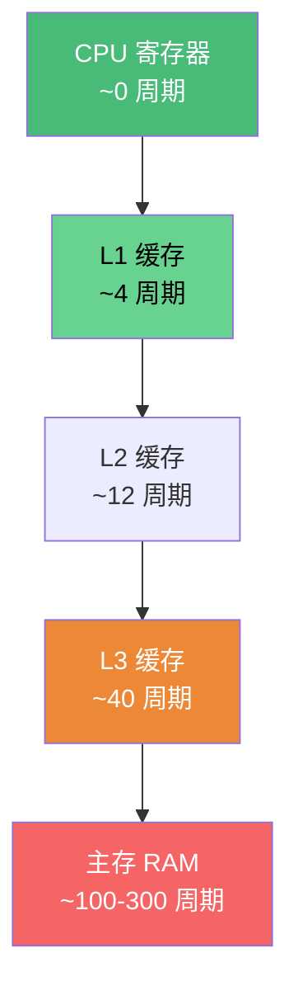
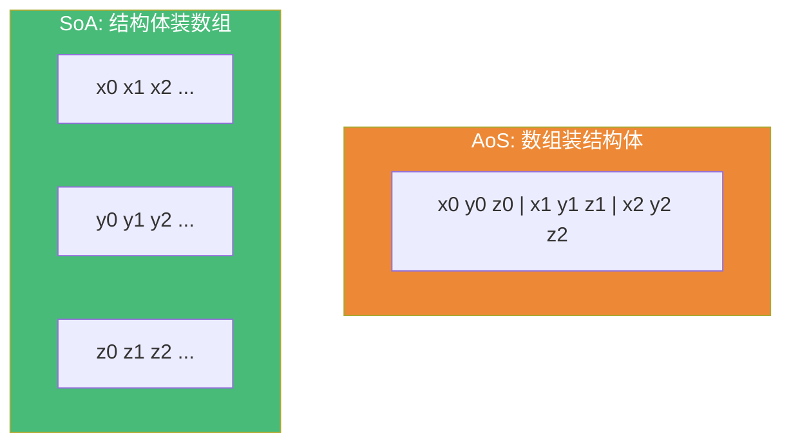

# 精通 C++ 性能优化

> 课程编号：C31
> 路线图来源：现代 C++ 全栈深度课程 — 性能优化
> 难度：⭐⭐⭐⭐⭐
> 预计阅读时间：65 分钟
> 📅 内容基准：**C++23**（ISO/IEC 14882:2024）+ GCC 14 / Clang 18 / MSVC 19.4x

---

## 引言：哪个更快？为什么差 10 倍？

```cpp
#include <vector>

// A：按行遍历二维数组
long sum_row(const std::vector<std::vector<int>>& m) {
    long s = 0;
    for (auto& row : m)
        for (int x : row) s += x;
    return s;
}

// B：同样规模，但按列遍历一个一维"扁平"数组
long sum_col(const std::vector<int>& m, int rows, int cols) {
    long s = 0;
    for (int c = 0; c < cols; ++c)
        for (int r = 0; r < rows; ++r)
            s += m[r * cols + c];      // 跨行跳着访问
    return s;
}
```

三个问题，能回答吗？

1. 同样是加 N 个 `int`，为什么访问模式不同会差好几倍？CPU 到底慢在哪？
2. `return big_object;` 会拷贝那个大对象吗？什么是"保证的拷贝消除"？
3. 为什么"写一个 UB 的代码，开 `-O2` 后行为突然变了"？UB 和优化有什么关系？

答案：① 性能瓶颈常常**不是 CPU 算得慢，而是等内存**——B 跨行访问（`m[r*cols+c]` 每次跳 `cols` 个 int）导致**缓存不命中**，每次都从主存取（约 100 倍于 L1 延迟）；A 顺序访问，缓存友好；② `return big_object`（prvalue 临时量）在 C++17 起是**保证的拷贝消除**——零拷贝零移动，直接在调用方构造；具名局部变量是 NRVO（非强制但普遍）；③ 编译器**假设你的程序没有 UB**，并基于此优化——一旦有 UB，优化可能让程序行为"看起来变了"（其实是 UB 本就无定义）。

性能优化的第一原则是**测量驱动**——别猜，用 profiler 找真正的热点。这一章讲缓存、拷贝消除、内联、分支预测、UB 与优化、数据导向设计，以及怎么测。它把前面 C03（移动）、C07（布局）、C30（内存）的知识串成"如何写快的 C++"。

---

## 第一章：测量驱动 —— 别猜，去量

性能优化最大的错误是**凭直觉优化**。真实程序的热点常常出人意料（90% 时间花在 10% 代码上，但那 10% 往往不是你以为的地方）。


```bash
# Linux perf：采样找热点
perf record -g ./app          # 采集（-g 含调用栈）
perf report                   # 看哪个函数最热

# 统计型指标：缓存命中、分支预测
perf stat -e cache-misses,branch-misses ./app

# valgrind/callgrind：精确指令计数（慢但准）
valgrind --tool=callgrind ./app
kcachegrind callgrind.out.*   # 可视化

# 微基准：Google Benchmark
```

```cpp
#include <benchmark/benchmark.h>
static void BM_sum(benchmark::State& s) {
    std::vector<int> v(1000, 1);
    for (auto _ : s) {
        long total = 0;
        for (int x : v) total += x;
        benchmark::DoNotOptimize(total);   // 阻止编译器把整个循环优化掉
    }
}
BENCHMARK(BM_sum);
```

⚠️ 微基准的最大坑：编译器把"没有副作用的计算"整段删掉。用 `benchmark::DoNotOptimize` / `ClobberMemory` 防止。**始终在 `-O2`/`-O3` 下测**（debug 构建的性能数据毫无意义）。

---

## 第二章：缓存友好 —— 性能的头号杠杆

### 2.1 内存层级与延迟

现代 CPU 算得飞快，但**等内存很慢**。延迟（粗略量级）：



| 层级 | 延迟（约） | 大小（约） |
|---|---|---|
| L1 | 4 周期 | 32–64 KB |
| L2 | 12 周期 | 256KB–1MB |
| L3 | 40 周期 | 几 MB–几十 MB |
| 主存 | 100–300 周期 | GB 级 |

一次 L1 命中 vs 一次主存访问，差距**几十到上百倍**。性能优化很大程度上就是"让数据待在缓存里"。

### 2.2 cache line 与局部性

CPU 不按字节取内存，而是按 **cache line**（通常 **64 字节**）整块取。两个原则：

- **空间局部性**：访问 `a[i]` 会顺带把 `a[i+1..i+15]`（同一 cache line）拉进缓存——所以**顺序访问**几乎免费。
- **时间局部性**：刚访问的数据很可能还在缓存——重复用刚碰过的数据。

```cpp
// ❌ 缓存不友好：列优先访问行优先存储的数组，每次跳一行
for (int c = 0; c < N; ++c)
    for (int r = 0; r < N; ++r)
        sum += a[r][c];     // 每次访问跨 N 个元素，cache line 几乎不复用

// ✅ 缓存友好：行优先访问，顺序碰内存
for (int r = 0; r < N; ++r)
    for (int c = 0; c < N; ++c)
        sum += a[r][c];     // 连续访问，每条 cache line 用满 16 个 int
```

仅仅交换两层循环顺序，大矩阵上能快**数倍**——这就是引言里的现象。

### 2.3 false sharing —— 并发性能杀手

多个线程修改**同一 cache line 上的不同变量**时，缓存一致性协议会让这条 line 在核间反复"弹来弹去"，性能暴跌——即使逻辑上无竞争：

```cpp
// ❌ false sharing：两个计数器挨在一起，同一 cache line
struct Counters { long a; long b; };   // a、b 大概率在同一 64 字节 line
// 线程 1 改 a、线程 2 改 b → cache line 在两核间反复失效

// ✅ 用对齐把它们分到不同 cache line
struct alignas(64) Padded { long v; };  // 每个独占一条 line
struct Counters2 { Padded a; Padded b; };

// C++17 提供常量
#include <new>
// std::hardware_destructive_interference_size  // 避免 false sharing 的最小间距
```

⚠️ false sharing 是"看不见的"性能黑洞——逻辑正确、无数据竞争，但慢得离谱。用 `alignas(64)` 或 `std::hardware_destructive_interference_size` 隔开高频写的并发数据。

---

## 第三章：数据导向设计 —— AoS vs SoA

### 3.1 两种布局

- **AoS（Array of Structs）**：`struct{x,y,z}` 的数组——面向对象的自然写法。
- **SoA（Struct of Arrays）**：每个字段一个独立数组——缓存友好。



```cpp
// AoS：只想累加所有 x，却把 y、z 也拉进缓存（浪费 2/3 的 cache line）
struct Particle { float x, y, z; };
std::vector<Particle> ps;
float sx = 0; for (auto& p : ps) sx += p.x;   // 每条 line 只用 1/3

// SoA：只读 x 数组，cache line 全是有用数据；还利于 SIMD 自动向量化
struct Particles {
    std::vector<float> x, y, z;
};
Particles ps2;
float sx2 = 0; for (float v : ps2.x) sx2 += v;  // 顺序、密集、可向量化
```

### 3.2 何时用哪个

| | AoS | SoA |
|---|---|---|
| 代码可读性 | 高（对象内聚） | 低（字段分散） |
| 整对象操作（用全部字段） | 好 | 差 |
| 单字段批量操作 | 差（拉无关字段） | **好** |
| SIMD 向量化 | 难 | **易** |
| 典型场景 | 业务对象 | 数值计算、ECS、游戏粒子 |

准则：**热路径上只批量处理少数字段时用 SoA**（数值密集、游戏引擎 ECS）；一般业务代码用 AoS（可读性优先）。这就是"数据导向设计（DOD）"的核心：**按硬件访问模式组织数据**，而非按概念建模。

---

## 第四章：拷贝消除 —— RVO / NRVO

### 4.1 三种"返回大对象"的命运

```cpp
struct Big { int data[10000]; };

Big make1() { return Big{}; }            // 返回 prvalue 临时量
Big make2() { Big b; /*...*/ return b; } // 返回具名局部变量
Big make3(bool c) {
    Big a, b;
    return c ? a : b;                     // 条件返回不同变量
}
```

- `make1`：返回 prvalue → **保证的拷贝消除（C++17）**，零拷贝零移动，直接在调用方的 `Big x = make1();` 处构造。
- `make2`：返回具名局部 → **NRVO（命名返回值优化）**，编译器**可以**省略拷贝/移动（极普遍，但非强制）。
- `make3`：返回多个候选之一 → NRVO 难以应用，通常退化为**移动**（C++11 起返回局部变量自动当右值）。

### 4.2 保证的拷贝消除（C++17）

C++17 把"返回 prvalue / 用 prvalue 初始化"的拷贝消除从"允许"升级为"**强制**"——prvalue 不再是"一个临时对象"，而是"构造对象的配方"，直到真正需要时才物化（materialize）：

```cpp
Big x = make1();           // 保证：没有任何拷贝/移动，x 直接被 make1 内部构造
// 即使 Big 删除了拷贝和移动构造，这行也能编译通过！
```

### 4.3 别画蛇添足 std::move 返回值

```cpp
Big make() {
    Big b;
    return std::move(b);   // ❌ 反而禁用 NRVO！返回的是右值引用表达式而非具名局部
}
// ✅ 直接 return b; —— 编译器自动 NRVO 或移动，效果更好
```

`-Wpessimizing-move` 会警告这种多余的 `std::move`（呼应 C03 的结论）。

| 写法 | 结果 |
|---|---|
| `return Big{};`（prvalue） | 保证拷贝消除（零成本） |
| `return b;`（具名局部） | NRVO（普遍省略）或移动 |
| `return std::move(b);` | 禁用 NRVO，最多移动（更差） |
| `return cond ? a : b;` | 通常移动 |

---

## 第五章：内联

### 5.1 内联消除的成本

函数调用有开销：压栈参数、跳转、建栈帧、返回。**内联**把函数体直接展开到调用点，消除这些开销，更重要的是**打开后续优化的大门**（常量传播、死代码消除跨过了函数边界）：

```cpp
inline int sq(int x) { return x * x; }
int y = sq(5);     // 内联后等价于 int y = 25;（常量折叠）
```

### 5.2 inline 关键字 ≠ 内联展开

呼应 C01：`inline` 关键字的**语义是"允许多 TU 定义（ODR 豁免）"**，**是否真正展开由编译器决定**。影响内联决策的真正因素：

- 函数大小（小函数更可能内联）。
- 是否在同一 TU 可见（跨 TU 需要 **LTO**，见 5.3）。
- `-O` 级别、`[[gnu::always_inline]]` / `[[gnu::noinline]]` 提示。

```cpp
[[gnu::always_inline]] inline int hot(int x) { return x + 1; }  // 强制（GCC/Clang）
```

### 5.3 LTO —— 跨 TU 内联

默认编译器只能内联**同一 TU 内**可见的函数。**LTO（链接期优化）**让优化器在链接时跨 TU 工作，把别的 `.cpp` 里的函数也内联进来：

```bash
g++ -O2 -flto a.cpp b.cpp -o app   # 开启 LTO，跨文件内联/优化
```

⚠️ 别过度内联：内联大函数会让代码膨胀，反而挤爆指令缓存（i-cache）。让编译器自己决定，热点再手动提示。

---

## 第六章：分支预测

### 6.1 CPU 会"赌"分支走向

现代 CPU 流水线很深，遇到 `if` 时会**预测**走哪条路并提前执行。预测对了几乎免费，**预测错**要清空流水线（约 10–20 周期惩罚）。**可预测的分支**（几乎总走一条）很快，**随机分支**很慢：

```cpp
// 经典实验：对随机数组求和，"先排序再求 if(x>128)" 比不排序快数倍
// 不是因为加法变快，而是排序后分支变得"可预测"（前半全 false，后半全 true）
long sum = 0;
for (int x : data)
    if (x > 128) sum += x;   // data 随机 → 分支预测频繁失败 → 慢
```

### 6.2 优化手段

```cpp
// ① 用 [[likely]]/[[unlikely]]（C++20）给编译器提示
if (ptr) [[likely]] { use(ptr); }
else [[unlikely]] { handle_error(); }

// ② 无分支化：用算术/位运算替代不可预测的分支
sum += (x > 128) * x;        // 把分支变成乘法，无预测失败

// ③ 重排数据让分支可预测（如先分区/排序）
```

准则：**只优化被 profiler 证实的、不可预测的热点分支**。大多数分支高度可预测，不值得为它牺牲可读性。

---

## 第七章：UB 与优化 —— 一把双刃剑

### 7.1 编译器假设你没有 UB

编译器优化的**根本前提**是"程序不含未定义行为"。它据此做激进优化——一旦你的代码真有 UB，行为可能"诡异变化"（其实是 UB 本就无定义）：

```cpp
int f(int x) {
    return x + 1 > x;        // 有符号溢出是 UB → 编译器假设永不溢出 → 直接返回 true！
}
// 即使 x == INT_MAX（实际溢出），优化后也可能返回 true，与"环绕"直觉不符
```

```cpp
int* p = nullptr;
if (p) use(p);
*p = 1;                      // 解引用 p → UB → 编译器推断"p 非空"→ 可能删掉上面的 if(p)！
```

### 7.2 这是为什么"-O2 后行为变了"

很多人遇到"-O0 正常、-O2 崩溃/结果不对"，根因几乎总是**代码里有 UB**——低优化级别恰好"碰巧正确"，高优化级别暴露了它。常见 UB：有符号溢出、越界、解引用空/野指针、未初始化读取、违反严格别名、数据竞争。

### 7.3 用 Sanitizer 抓 UB

```bash
g++ -fsanitize=address,undefined -g a.cpp   # ASan 抓内存错误 + UBSan 抓未定义行为
g++ -fsanitize=thread a.cpp                  # TSan 抓数据竞争
```

⚠️ **UB 不是"实现定义"或"未指定"**——它是"标准不保证任何行为"。优化器有权假设它不发生。写正确代码（没有 UB）+ 用 Sanitizer 验证，是性能优化的安全前提：你不能在错误的程序上谈性能。

---

## 第八章：其他实用手段

```cpp
// ① reserve：避免 vector 反复扩容/重分配
std::vector<int> v;
v.reserve(n);                // 一次到位，省去多次拷贝/移动

// ② emplace_back：原地构造，省一次移动
v.emplace_back(args);        // 直接在容器内构造，vs push_back(T(args)) 多一次移动

// ③ string_view / span：传只读视图，零拷贝
void parse(std::string_view sv);   // 不拷贝字符串（C29）

// ④ 避免不必要的堆分配：小对象用栈/SBO、pmr（C30）

// ⑤ constexpr：把计算挪到编译期（C27）
constexpr int t = expensive_compile_time();   // 运行期零成本
```

| 手段 | 收益 |
|---|---|
| `reserve` | 消除 vector 多次重分配 |
| `emplace_back` | 省一次构造/移动 |
| `string_view`/`span` | 传参零拷贝 |
| 移动语义 + noexcept | 容器扩容用移动（C03） |
| pmr / 内存池 | 消除热路径堆分配（C30） |
| constexpr | 计算挪到编译期（C27） |
| `-O2 -march=native -flto` | 全局优化 + 用上本机指令集 |

---

## 第九章：常见陷阱清单

### ❌ 陷阱 1：在 debug 构建上测性能

```cpp
// -O0 的性能数据毫无参考价值；优化必须在 -O2/-O3 下测量
```

### ❌ 陷阱 2：凭直觉优化，不测量

```cpp
// 花一周优化一个占总时间 1% 的函数 → 整体快不到 1%（Amdahl 定律）
```

### ❌ 陷阱 3：微基准被编译器优化掉

```cpp
for (auto _ : state) { int r = compute(); }   // r 没被用 → 整个 compute 可能被删
// 修正：benchmark::DoNotOptimize(r);
```

### ❌ 陷阱 4：返回值多余的 std::move

```cpp
Big f() { Big b; return std::move(b); }   // 禁用 NRVO，更慢（-Wpessimizing-move）
```

### ❌ 陷阱 5：忽视缓存，盲目改算法

```cpp
// 链表 O(n) 遍历常比 vector O(n) 慢几倍 —— 链表缓存不友好（节点散落堆上）
// 现实中 vector 常胜过"理论更优"但缓存差的结构
```

### ❌ 陷阱 6：在有 UB 的代码上优化

```cpp
// 代码有越界/溢出/数据竞争 → 开 -O2 行为不可预测；先用 Sanitizer 清干净再优化
```

---

## 第十章：练习题

**练习 1**：为什么"列优先访问行优先存储的二维数组"会比"行优先访问"慢好几倍？

**练习 2**：什么是 false sharing？怎么避免？

**练习 3**：`Big f() { return Big{}; }` 和 `Big f() { Big b; return b; }`，拷贝消除上有何不同？返回时该不该 `std::move`？

**练习 4**：为什么"对随机数据先排序、再做条件求和"反而更快？

**练习 5**：判断真假——"程序在 -O0 正常、-O2 崩溃，说明编译器有 bug。"

---

## 参考答案与解析

**练习 1**：数组行优先存储（同一行连续）。列优先访问时，每访问一个元素就跨 `cols` 个 int 跳到下一行——几乎每次都落在不同的 cache line 上，**cache line 几乎不复用**，每次都从更慢的层级取。行优先访问则顺序碰内存，一条 cache line（64 字节≈16 个 int）被用满才换下一条，缓存命中率高。瓶颈是内存延迟，不是加法。

**练习 2**：多个线程修改**位于同一 cache line 上的不同变量**时，缓存一致性协议让这条 line 在核间反复失效/同步，性能骤降——尽管逻辑上没有数据竞争。避免：用 `alignas(64)`（或 `std::hardware_destructive_interference_size`）把高频写的并发变量隔到不同 cache line。

**练习 3**：`return Big{}`（prvalue）是 **C++17 保证的拷贝消除**——零拷贝零移动，强制。`return b`（具名局部）是 **NRVO**——非强制但编译器普遍会做的省略，否则退化为移动。两者都**不该** `std::move`：对 prvalue 多余，对具名局部会**禁用 NRVO**（反而更慢）。直接返回即可。

**练习 4**：排序让分支 `if (x > threshold)` 变得**高度可预测**（前半段几乎全 false，后半段几乎全 true），CPU 分支预测几乎不失败；随机数据时分支预测频繁失败，每次错预测清空流水线（约 10–20 周期）。变快的是分支预测，不是加法本身。（排序本身有成本，此例是为说明分支预测效应。）

**练习 5**：**假**（绝大多数情况）。这几乎总是**你的代码含 UB**（有符号溢出、越界、未初始化读、解引用野指针、数据竞争等）。编译器优化以"无 UB"为前提，-O0 碰巧掩盖了问题，-O2 的激进优化暴露了它。用 `-fsanitize=address,undefined` 几乎一定能定位到真正的 UB。

---

## 小结

| 知识点 | 关键记忆 |
|---|---|
| 测量驱动 | 别猜，用 perf/valgrind/benchmark 找热点；在 -O2 下测 |
| 缓存层级 | L1→主存差几十到上百倍；瓶颈常是等内存非算力 |
| cache line | 64 字节整块取；顺序访问几乎免费（空间局部性） |
| false sharing | 并发改同一 line 的不同变量 → 暴跌；`alignas(64)` 隔开 |
| AoS vs SoA | 单字段批处理用 SoA（缓存友好 + SIMD）；业务用 AoS |
| 拷贝消除 | prvalue 保证消除（C++17）；具名局部 NRVO；别 `std::move` 返回值 |
| 内联 | 消除调用开销 + 开启跨边界优化；`inline`≠展开；跨 TU 用 LTO |
| 分支预测 | 可预测分支快；`[[likely]]`、无分支化、重排数据 |
| UB 与优化 | 编译器假设无 UB；-O2 行为变 = 代码有 UB；用 Sanitizer |
| 实用手段 | reserve/emplace/string_view/span/pmr/constexpr/-march=native -flto |

---

## 📅 2026 现状/更新

- `[[likely]]`/`[[unlikely]]`（C++20）、保证的拷贝消除（C++17）在 GCC 14 / Clang 18 / MSVC 19.4x 上已成熟；`-flto`、PGO（基于剖析的优化 `-fprofile-generate/-use`）是发布构建标配。
- Sanitizer（ASan/UBSan/TSan）已是性能工作的"安全网"——优化前先用它确认无 UB；CI 里常驻 Sanitizer 构建。
- 数据导向设计（SoA/ECS）在游戏引擎、数值计算、数据库领域持续主流；自动向量化（SIMD）+ `std::simd`（计划中）让 SoA 收益更大。
- 准则：**先正确（无 UB）、再测量、后优化热点**；80% 的收益来自"缓存友好 + 消除分配 + 用对移动/消除"，而非微观位运算技巧。

---

> 🔁 下一篇 **C32 — 精通 C++ C++23/26 新特性与现状**：C++23（`std::expected`/`std::print`/deducing this/`mdspan`/`flat_map`/ranges 增强/`std::generator`）、C++26 进展（反射/契约 contracts/`std::execution` sender-receiver/模式匹配/`static_assert` 增强）、编译器支持现状与生态。
>
> 反馈：把"测量驱动""缓存友好是头号杠杆""UB 让优化失控"这三条刻进肌肉记忆——它们决定了你能不能写出真正快的 C++。
