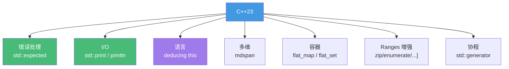
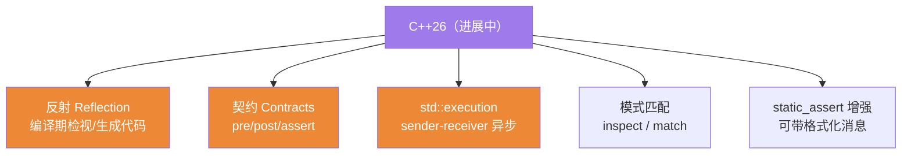

# 精通 C++ C++23/26 新特性与现状

> 课程编号：C32
> 路线图来源：现代 C++ 全栈深度课程 — C++23/26 新特性与现状
> 难度：⭐⭐⭐⭐
> 预计阅读时间：60 分钟
> 📅 内容基准：**C++23**（ISO/IEC 14882:2024）+ GCC 14 / Clang 18 / MSVC 19.4x；展望 C++26

---

## 引言：这些代码现在能编译吗？

```cpp
#include <print>
#include <expected>

std::expected<int, std::string> parse(std::string_view s);  // 成功返回 int，失败返回错误

int main() {
    std::print("Hello, {}!\n", "C++23");      // 1) 还要 iostream 吗？还要 \n 吗？

    auto r = parse("42");
    if (r)
        std::print("got {}\n", *r);            // 2) expected 怎么比 optional 多了"错误信息"？
    else
        std::print("error: {}\n", r.error());
}
```

三个问题，能回答吗？

1. C++23 之后，"打印一行字"还需要 `std::cout << ... << std::endl` 吗？`std::print` 好在哪？
2. `std::expected<T, E>` 和 `std::optional<T>`、异常相比，错误处理上各占什么位置？
3. C++26 的"反射""契约""`std::execution`"现在能用吗？编译器支持到什么程度？

答案：① 不再需要——`std::print("...{}\n", x)` 用 `std::format` 的语法，类型安全、比 `iostream` 快、无需手动 `<<` 链，`std::println` 还自动加换行；② `std::expected<T,E>` 在"失败是预期的、想携带错误信息、又不想用异常"时最合适——它是返回值（无异常开销），又能带错误详情（比 `optional` 多了 `E`）；③ C++26 仍在制定中——反射、契约、`std::execution` 已进入或接近草案，编译器**部分实现、实验性可用**，生产慎用。

这是本系列的**最后一篇**——盘点 C++23 已落地的好东西、C++26 正在来的重磅特性，以及"现在到底能不能用"。它把前面所有章节连成一条"现代 C++ 演进"的时间线。

---

## 第一章：C++23 全景

C++23（ISO/IEC 14882:2024）是一次"打磨与补全"的版本，没有 C++20 那样的四大支柱，但实用特性密集：



| 特性 | 头文件 | 解决什么 |
|---|---|---|
| `std::expected<T,E>` | `<expected>` | 带错误值的返回（异常的替代） |
| `std::print`/`println` | `<print>` | 简单、安全、快的格式化输出 |
| deducing this | 语言 | 显式 `this` 参数，消除成员函数重复 |
| `std::mdspan` | `<mdspan>` | 多维数组的非拥有视图 |
| `std::flat_map`/`flat_set` | `<flat_map>` | 缓存友好的有序关联容器 |
| ranges 增强 | `<ranges>` | `zip`/`enumerate`/`chunk`/`slide` 等 |
| `std::generator` | `<generator>` | 标准协程生成器 |

---

## 第二章：std::expected —— 错误处理的新选择

### 2.1 比 optional 多一个"为什么失败"

```cpp
#include <expected>
#include <string>
#include <string_view>
#include <charconv>

std::expected<int, std::string> parse_int(std::string_view s) {
    int value{};
    auto [ptr, ec] = std::from_chars(s.data(), s.data() + s.size(), value);
    if (ec != std::errc{})
        return std::unexpected("invalid number: " + std::string(s));  // 失败：带错误信息
    return value;                                                      // 成功：返回值
}
```

`optional<T>` 只能说"有没有值"，`expected<T,E>` 还能说"为什么没有"——`E` 携带错误详情，而且**不用异常**（无栈展开开销，错误是普通返回值）。

### 2.2 单子式链式调用

`std::expected` 支持 `and_then` / `transform` / `or_else`，把"成功路径"串起来，错误自动短路：

```cpp
auto result = parse_int("42")
    .transform([](int x) { return x * 2; })          // 成功才执行，把 42→84
    .and_then([](int x) -> std::expected<int, std::string> {
        if (x > 100) return std::unexpected("too big");
        return x;
    });
// 任一步失败，后续自动跳过，错误向下传递
```

### 2.3 三种错误处理对比

| 方式 | 开销 | 适用 |
|---|---|---|
| 异常 | 抛出时栈展开（昂贵），不抛时近零 | **真正异常**的、罕见的错误（C26） |
| `std::expected` | 普通返回值，可预测 | **预期会发生**的失败（解析、查找、IO） |
| `std::optional` | 同上，但无错误信息 | 只需"有/无"，无需原因 |
| 错误码 | 极低，但易被忽略 | 底层/C 互操作 |

呼应 C26：`expected` 让"失败是正常流程一部分"的代码既高效又清晰，是异常的有力补充（不是替代）。

---

## 第三章：std::print / std::println

### 3.1 告别 iostream 的繁琐

```cpp
#include <print>

int x = 42;
std::println("x = {}, hex = {:#x}", x, x);   // x = 42, hex = 0x2a
std::print("no newline");                     // 不换行
std::println(stderr, "error: {}", "oops");   // 输出到 stderr
```

相比 `std::cout << "x = " << x << std::endl`：

- **类型安全**：格式串在编译期检查（参数类型/个数不匹配直接编译错）。
- **更快**：避免 iostream 的同步/locale 开销，直接格式化写入。
- **更简洁**：Python 风格的 `{}` 占位，无需 `<<` 链和手动 `std::hex` 等操纵符。

### 3.2 与 std::format 的关系

`std::print` 用的就是 `std::format`（C++20，C29）的语法。`format` 返回字符串，`print` 直接输出：

```cpp
std::string s = std::format("{:>8.2f}", 3.14159);  // 格式化成字符串（右对齐宽8、2位小数）
std::print("{}", s);                                // 输出
// 等价于 std::print("{:>8.2f}", 3.14159);
```

---

## 第四章：deducing this（显式对象参数）

### 4.1 消除 const/非const 重复

过去为了同时支持 const 和非 const、左值和右值，要写多份几乎相同的成员函数。C++23 的"deducing this"让 `this` 成为**显式模板参数**，一份代码搞定全部：

```cpp
struct Widget {
    std::string data;

    // 旧写法：要写 4 个重载（const&、&、const&&、&&）才能完美转发返回
    // 新写法：一个模板搞定
    template <class Self>
    auto&& get(this Self&& self) {          // this 作为显式参数
        return std::forward<Self>(self).data;  // 自动保持 const 和值类别
    }
};

Widget w;
auto& a = w.get();                  // 返回 string&
const Widget cw;
const auto& b = cw.get();           // 返回 const string&
auto&& c = Widget{}.get();          // 返回 string&&（可移动）
```

### 4.2 其他用途

- **递归 lambda**：lambda 终于能引用自己。
- **CRTP 简化**：`this` 直接拿到派生类型，不再需要 CRTP 模板基类的样板（C09）。

```cpp
auto fib = [](this auto self, int n) -> int {   // lambda 通过 self 递归自己
    return n < 2 ? n : self(n - 1) + self(n - 2);
};
```

---

## 第五章：mdspan / flat_map / ranges 增强 / generator

### 5.1 std::mdspan —— 多维视图

`mdspan` 是多维数组的**非拥有视图**（像 `span` 之于一维），把一维内存按多维下标访问，不拷贝数据：

```cpp
#include <mdspan>
#include <vector>

std::vector<int> data(12);
std::mdspan m(data.data(), 3, 4);    // 把 12 个元素看作 3×4 矩阵
m[1, 2] = 7;                          // C++23 多维下标运算符 operator[](i, j)
```

### 5.2 std::flat_map —— 缓存友好的有序 map

`flat_map` 用**有序数组**（而非红黑树）存储，查找用二分。优点：**缓存友好**（连续内存，呼应 C31）、迭代极快、内存紧凑；代价：插入/删除 O(n)。适合"建好后大量查询、很少改"的场景：

```cpp
#include <flat_map>
std::flat_map<int, std::string> fm;   // 接口同 std::map，但底层是排序的连续数组
fm[1] = "one";                        // 查找快、遍历快、对缓存友好
```

| | `std::map`（红黑树） | `std::flat_map`（有序数组） |
|---|---|---|
| 查找 | O(log n)，缓存差（指针跳） | O(log n)，缓存好（连续） |
| 插入/删除 | O(log n) | O(n)（要移动元素） |
| 内存 | 每节点额外指针开销 | 紧凑 |
| 适用 | 频繁增删 | 读多写少 |

### 5.3 Ranges 增强

C++23 给 ranges（C19）补了大量实用视图与算法：

```cpp
#include <ranges>
namespace rv = std::views;

std::vector<int> v{10, 20, 30};
for (auto [i, x] : v | rv::enumerate)        // enumerate：带下标遍历
    std::println("{}: {}", i, x);

std::vector<char> a{'a','b'}; std::vector<int> b{1,2};
for (auto [c, n] : rv::zip(a, b)) { /* 配对遍历两个范围 */ }   // zip

// 还有 chunk / slide / chunk_by / join_with / ranges::to 等
auto squared = v | rv::transform([](int x){ return x*x; })
                 | std::ranges::to<std::vector>();   // ranges::to 直接收集成容器
```

### 5.4 std::generator —— 标准协程生成器

C++20 有协程机制（C25）但缺标准生成器，自己写 `promise_type` 很繁琐。C++23 的 `std::generator` 让协程生成器开箱即用：

```cpp
#include <generator>

std::generator<int> fibonacci() {
    int a = 0, b = 1;
    while (true) {
        co_yield a;                 // 惰性产出，无需手写 promise_type
        std::tie(a, b) = std::make_tuple(b, a + b);
    }
}

for (int x : fibonacci() | std::views::take(10))
    std::print("{} ", x);           // 0 1 1 2 3 5 8 13 21 34
```

---

## 第六章：C++26 进展 —— 正在来的重磅特性

C++26 仍在制定（预计 2026 年定稿），但几大特性已进入或接近草案，是未来几年的方向：



### 6.1 反射（Reflection）

C++26 最受期待的特性——**编译期**检视类型结构、生成代码，无需宏或外部代码生成器。语法用 `^^`（reflexpr 运算符）和 `[: :]`（splice）：

```cpp
// 提案语法（可能变动）：编译期拿到类型成员，自动生成序列化/枚举转字符串等
// 当前在 P2996 等提案中，实验性实现已出现（Clang 实验分支、EDG）
// 将取代大量 SFINAE/宏/手写样板（C13），是 C++ 元编程的范式升级
```

### 6.2 契约（Contracts）

把前置条件、后置条件、断言写进语言，编译期/运行期可检查：

```cpp
// 提案语法（C++26 方向）：
int divide(int a, int b)
    pre(b != 0)              // 前置条件：调用前 b 不为 0
    post(r: r * b == a)      // 后置条件：返回值 r 满足关系
{
    return a / b;
}
```

契约比 `assert` 更强大——可分级（观察/强制）、能用于库接口约束，是"防御式编程"的语言级支持。

### 6.3 std::execution（sender-receiver）

标准化的**异步/并行执行框架**（P2300）——用 sender/receiver/scheduler 抽象描述异步计算，可组合、可调度到线程池/GPU。它是 C++ 并发（C21–C24）的未来统一模型：

```cpp
// 提案风格：
// auto work = schedule(pool) | then([]{ return compute(); }) | then(use_result);
// 把"在哪执行""做什么""结果给谁"解耦，组合异步管线
```

### 6.4 模式匹配 / static_assert 增强

```cpp
// 模式匹配（提案）：比 switch/visit 更强，可解构
// inspect (v) { <int> i => ...; <std::string> s => ...; };

// static_assert 带格式化消息（C++26）：
// static_assert(sizeof(T) == 8, std::format("bad size: {}", sizeof(T)));
```

---

## 第七章：编译器支持现状（2026）

⚠️ "标准里有"不等于"现在能用"。新特性需要编译器和标准库都实现。2026 年的大致状况：

| 特性 | GCC 14 | Clang 18 | MSVC 19.4x | 备注 |
|---|---|---|---|---|
| `std::expected` | ✅ | ✅ | ✅ | 可放心用 |
| `std::print`/`println` | ✅ | ✅(较新) | ✅ | 库支持逐步完善 |
| deducing this | ✅ | ✅ | ✅ | 语言特性已广泛可用 |
| `std::mdspan` | ✅ | ✅ | ✅ | |
| `std::flat_map` | 部分 | 部分 | ✅ | 标准库实现进度不一 |
| ranges 增强 | 大部分 | 大部分 | 大部分 | 个别视图仍在补 |
| `std::generator` | ✅ | 部分 | ✅ | |
| C++26 反射 | 实验 | 实验分支 | 实验 | **生产勿用** |
| C++26 契约 | 实验 | 实验 | 实验 | 方向仍可能变 |
| `std::execution` | 实验/第三方 | 实验/第三方 | 实验 | 可用 stdexec 参考实现 |

查询权威现状：[cppreference 编译器支持表](https://en.cppreference.com/w/cpp/compiler_support)。用 [godbolt](https://godbolt.org) 实测某编译器版本是否支持某特性最可靠。

```bash
g++ -std=c++23 a.cpp        # C++23 已是各编译器稳定选项
g++ -std=c++2c a.cpp        # C++26（实验，特性不全）
```

---

## 第八章：常见陷阱清单

### ❌ 陷阱 1：以为标准发布 = 立刻能用

```cpp
#include <flat_map>   // 标准里有，但你的 libstdc++ 版本可能还没实现 → 编译失败
```
查 cppreference 支持表、用 godbolt 实测，再用。

### ❌ 陷阱 2：用 expected 又到处 .value() 不检查

```cpp
auto r = parse("x");
int v = r.value();   // ❌ 失败时 .value() 会抛 bad_expected_access —— 退化成异常
```
要么 `if (r)` 判断，要么用 `value_or` / `and_then`。

### ❌ 陷阱 3：在生产代码用 C++26 实验特性

```cpp
// 反射/契约语法在定稿前可能变；实验实现有 bug —— 仅用于学习/原型
```

### ❌ 陷阱 4：flat_map 当频繁增删的容器

```cpp
std::flat_map<int,int> m;
for (...) m.insert(...);   // ❌ 每次插入 O(n)，大量插入退化严重；它适合读多写少
```

### ❌ 陷阱 5：std::print 与 cout 混用顺序混乱

```cpp
std::cout << "a";
std::print("b");   // 两套缓冲，输出顺序可能不符直觉；混用时注意 flush
```

### ❌ 陷阱 6：deducing this 里忘了 std::forward

```cpp
template<class Self> auto& get(this Self&& self) { return self.data; }  // 丢了值类别
// 应 return std::forward<Self>(self).data; 才能正确转发左/右值
```

---

## 第九章：练习题

**练习 1**：`std::expected<T,E>` 相比 `std::optional<T>` 和异常，各适合什么场景？

**练习 2**：`std::print` 比 `std::cout << ...` 好在哪三点？

**练习 3**：deducing this 解决了什么重复问题？写它时要注意什么？

**练习 4**：`std::flat_map` 和 `std::map` 在性能特征上有何不同？各适合什么场景？

**练习 5**：判断真假——"C++26 已发布反射，现在可以在生产项目里用了。"

---

## 参考答案与解析

**练习 1**：`optional<T>` 只表达"有/无值"，无错误原因；`expected<T,E>` 在此基础上携带错误信息 `E`，适合"失败是**预期**的、想知道**为什么**失败、又不想付异常开销"的场景（解析、查找、IO）。异常适合"**罕见的、真正异常**的"错误（构造失败、不变量被破坏），抛出时栈展开成本高但不抛时近零。三者互补：预期失败用 expected，纯有无用 optional，真异常用异常。

**练习 2**：① **类型安全**——格式串编译期检查，参数不匹配直接编译错；② **更快**——绕开 iostream 的 locale/同步开销，直接格式化输出；③ **更简洁**——`{}` 占位 + Python 风格格式规格，无需 `<<` 链和 `std::hex`/`setw` 等操纵符；`println` 还自动换行。

**练习 3**：消除了为支持 **const/非const、左值/右值** 而写多份几乎相同成员函数的重复。把 `this` 作为显式模板参数 `this Self&& self`，一个模板自动推导出调用者的 const 性和值类别。注意：返回时要 `std::forward<Self>(self)` 才能正确保持值类别（否则丢失移动语义）。

**练习 4**：`std::map` 是红黑树——增删查都 O(log n)，但节点散落堆上、指针跳转**缓存不友好**，每节点有额外指针开销。`std::flat_map` 是**有序连续数组**——查找仍 O(log n) 但**缓存友好、遍历极快、内存紧凑**，代价是插入/删除 O(n)（要移动元素）。flat_map 适合"建好后读多写少"，map 适合"频繁增删"。

**练习 5**：**假**。截至 2026，C++26 仍在制定（未正式发布），反射（P2996 等）尚在提案/草案阶段，语法可能变动，编译器只有**实验性**实现且可能有 bug。可用于学习和原型，**不应**用于生产。用 godbolt/cppreference 确认特性的实际可用状态。

---

## 小结

| 知识点 | 关键记忆 |
|---|---|
| C++23 主题 | 打磨补全：expected/print/deducing this/mdspan/flat_map/ranges/generator |
| std::expected | 带错误值的返回；预期失败用它，比 optional 多 `E`，比异常省开销 |
| std::print | 类型安全 + 快 + 简洁；用 format 语法；println 自动换行 |
| deducing this | 显式 this 参数，一份代码覆盖 const/值类别；记得 forward |
| mdspan/flat_map | 多维非拥有视图；有序数组 map（缓存友好、读多写少） |
| ranges 增强 | zip/enumerate/chunk/slide/ranges::to 等 |
| generator | 标准协程生成器，免手写 promise_type |
| C++26 进展 | 反射/契约/std::execution/模式匹配/static_assert 增强——实验阶段 |
| 现状判断 | 标准有 ≠ 能用；查 cppreference 支持表 + godbolt 实测 |

---

## 📅 2026 现状/更新

- **C++23**（ISO/IEC 14882:2024）在 GCC 14 / Clang 18 / MSVC 19.4x 上已大体可用——`std::expected`、`std::print`、deducing this、`mdspan` 已可放心使用；`flat_map`、个别 ranges 视图的标准库实现仍在补齐。
- **C++26** 处于制定收尾期（预计 2026 定稿）：反射、契约、`std::execution`、模式匹配是焦点；编译器/标准库提供**实验性**实现（如 stdexec 参考实现），适合学习与原型，生产慎用。
- 生态：CMake + vcpkg/Conan + Ninja 仍是主流工程链（C01）；Modules（C28）的工具链在 2026 趋于可用但迁移仍在路上；Sanitizer（C31）已是标配安全网。
- 准则：**紧跟标准但按编译器实际支持落地**——cppreference 支持表 + godbolt 实测，是判断"现在能不能用"的最可靠方法。

---

> 🎉 全系列完结！32 篇从编译模型到 C++26 的深度旅程到此结束。回到 [总目录](./INDEX.md) 复盘整张知识地图，或按其中的「学习路径」二刷查漏补缺。
>
> 反馈：现代 C++ 在快速演进，但底层原理（ODR、移动语义、对象模型、缓存、UB）是不变的根。把根扎牢，新特性都只是水到渠成的语法糖。把每段代码丢进 [godbolt](https://godbolt.org) 看汇编与支持情况——这是从"会写"到"精通"的最后一公里。
