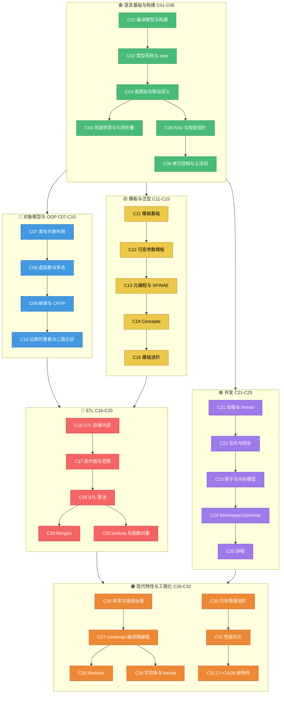
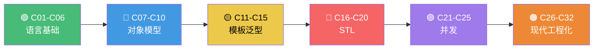
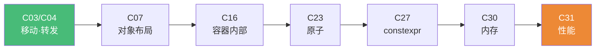

# 现代 C++ 全栈深度课程 · 学习路线图

> 32 篇深度课程的可视化学习路线图，按 6 大模块组织，标注依赖关系、难度与学习顺序。
> 📅 内容基准：**C++23**（ISO/IEC 14882:2024）+ GCC 14 / Clang 18 / MSVC 19.4x
> 配套：[总目录 INDEX.md](./INDEX.md) · [测验题库 QUIZ.md](./QUIZ.md)

---

## 🗺️ 全景依赖图

下图展示 C01–C32 的模块分组与学习顺序。箭头表示推荐的学习依赖（前置 → 后续），颜色区分 6 大模块。

> Mermaid 的 `click` 在多数 Markdown 渲染器中不生效，章节链接见下方表格。

---

## 🔗 章节链接速查

| # | 课程 | 模块 | 难度 |
|---|---|---|---|
| C01 | [编译模型与构建](./C01-精通-C++-编译模型与构建.md) | 🟢 语言基础 | ⭐⭐⭐⭐ |
| C02 | [类型系统与 auto](./C02-精通-C++-类型系统与-auto.md) | 🟢 语言基础 | ⭐⭐⭐⭐ |
| C03 | [值类别与移动语义](./C03-精通-C++-值类别与移动语义.md) | 🟢 语言基础 | ⭐⭐⭐⭐⭐ |
| C04 | [完美转发与引用折叠](./C04-精通-C++-完美转发与引用折叠.md) | 🟢 语言基础 | ⭐⭐⭐⭐⭐ |
| C05 | [RAII 与智能指针](./C05-精通-C++-RAII-与智能指针.md) | 🟢 语言基础 | ⭐⭐⭐⭐ |
| C06 | [拷贝控制与五法则](./C06-精通-C++-拷贝控制与五法则.md) | 🟢 语言基础 | ⭐⭐⭐⭐ |
| C07 | [类与对象布局](./C07-精通-C++-类与对象布局.md) | 🔵 对象模型 | ⭐⭐⭐⭐ |
| C08 | [虚函数与多态](./C08-精通-C++-虚函数与多态.md) | 🔵 对象模型 | ⭐⭐⭐⭐⭐ |
| C09 | [继承与 CRTP](./C09-精通-C++-继承与-CRTP.md) | 🔵 对象模型 | ⭐⭐⭐⭐ |
| C10 | [运算符重载与三路比较](./C10-精通-C++-运算符重载与三路比较.md) | 🔵 对象模型 | ⭐⭐⭐⭐ |
| C11 | [模板基础](./C11-精通-C++-模板基础.md) | 🟡 模板泛型 | ⭐⭐⭐⭐ |
| C12 | [可变参数模板](./C12-精通-C++-可变参数模板.md) | 🟡 模板泛型 | ⭐⭐⭐⭐⭐ |
| C13 | [模板元编程与 SFINAE](./C13-精通-C++-模板元编程与-SFINAE.md) | 🟡 模板泛型 | ⭐⭐⭐⭐⭐ |
| C14 | [Concepts](./C14-精通-C++-Concepts.md) | 🟡 模板泛型 | ⭐⭐⭐⭐ |
| C15 | [模板进阶](./C15-精通-C++-模板进阶.md) | 🟡 模板泛型 | ⭐⭐⭐⭐⭐ |
| C16 | [STL 容器内部](./C16-精通-C++-STL-容器内部.md) | 🔴 STL | ⭐⭐⭐⭐ |
| C17 | [迭代器与范围](./C17-精通-C++-迭代器与范围.md) | 🔴 STL | ⭐⭐⭐⭐ |
| C18 | [STL 算法](./C18-精通-C++-STL-算法.md) | 🔴 STL | ⭐⭐⭐ |
| C19 | [Ranges](./C19-精通-C++-Ranges.md) | 🔴 STL | ⭐⭐⭐⭐ |
| C20 | [lambda 与函数对象](./C20-精通-C++-lambda-与函数对象.md) | 🔴 STL | ⭐⭐⭐⭐ |
| C21 | [线程与 std::thread](./C21-精通-C++-线程与-thread.md) | 🟣 并发 | ⭐⭐⭐⭐ |
| C22 | [互斥与同步](./C22-精通-C++-互斥与同步.md) | 🟣 并发 | ⭐⭐⭐⭐⭐ |
| C23 | [原子与内存模型](./C23-精通-C++-原子与内存模型.md) | 🟣 并发 | ⭐⭐⭐⭐⭐ |
| C24 | [future / async / promise](./C24-精通-C++-future-async-promise.md) | 🟣 并发 | ⭐⭐⭐⭐ |
| C25 | [协程](./C25-精通-C++-协程.md) | 🟣 并发 | ⭐⭐⭐⭐⭐ |
| C26 | [异常与错误处理](./C26-精通-C++-异常与错误处理.md) | 🟠 现代特性 | ⭐⭐⭐⭐ |
| C27 | [constexpr 编译期编程](./C27-精通-C++-constexpr-编译期编程.md) | 🟠 现代特性 | ⭐⭐⭐⭐⭐ |
| C28 | [Modules](./C28-精通-C++-Modules.md) | 🟠 现代特性 | ⭐⭐⭐⭐ |
| C29 | [字符串与 format](./C29-精通-C++-字符串与-format.md) | 🟠 现代特性 | ⭐⭐⭐ |
| C30 | [内存管理进阶](./C30-精通-C++-内存管理进阶.md) | 🟠 现代特性 | ⭐⭐⭐⭐⭐ |
| C31 | [性能优化](./C31-精通-C++-性能优化.md) | 🟠 现代特性 | ⭐⭐⭐⭐⭐ |
| C32 | [C++23/26 新特性与现状](./C32-精通-C++-C++23-26-新特性与现状.md) | 🟠 现代特性 | ⭐⭐⭐⭐ |

---

## 🎯 四条学习路径

### 路径 A · 从零到精通（4–6 个月）

按编号顺序通读，每周 2–3 篇，地基模块务必扎实。

### 路径 B · 面试突击（4 周）

聚焦高频面试考点，跳过工程化细节。

1. C03 移动语义 → C05 智能指针 → C06 五法则
2. C08 虚函数 → C11 模板
3. C16 容器内部 → C22 锁/同步 → C23 原子
4. C26 异常 → C31 性能

### 路径 C · 性能特化（6 周）

围绕"零开销 + 缓存友好 + 编译期计算"。

### 路径 D · 现代 C++ 升级（3 周）

已有 C++11/14 基础，快速补齐 C++20/23 新范式。

1. C14 Concepts
2. C19 Ranges
3. C25 协程
4. C28 Modules
5. C29 std::format
6. C32 C++23/26 新特性

---

## 📊 难度与前置依赖说明

| 模块 | 章节 | 平均难度 | 关键前置 |
|---|---|---|---|
| 🟢 语言基础 | C01–C06 | ⭐⭐⭐⭐ | 无（起点）；C04 需先学 C03 |
| 🔵 对象模型 | C07–C10 | ⭐⭐⭐⭐ | C01（编译/链接）、C06（拷贝控制） |
| 🟡 模板泛型 | C11–C15 | ⭐⭐⭐⭐⭐ | C02（类型推导）、C04（转发） |
| 🔴 STL | C16–C20 | ⭐⭐⭐⭐ | C03（移动）、C11（模板）、C09（CRTP 助理解迭代器） |
| 🟣 并发 | C21–C25 | ⭐⭐⭐⭐⭐ | C05（RAII 管锁）、C20（lambda 任务）；C23 最硬核 |
| 🟠 现代工程化 | C26–C32 | ⭐⭐⭐⭐ | 视章节而定；C30/C31 需 C07/C16 |

**特别提示**：
- C03 / C04 / C08 / C12 / C13 / C15 / C22 / C23 / C25 / C27 / C30 / C31 为 ⭐⭐⭐⭐⭐ 硬核章，建议预留双倍时间并配合 [godbolt](https://godbolt.org) 看汇编。
- C23（原子与内存模型）是全课最难，强烈建议先掌握 C21/C22。

---

## 🏁 里程碑检查点

| 里程碑 | 完成章节 | 自检标准 |
|---|---|---|
| ✅ M1 地基达成 | C01–C06 | 能解释 ODR、写出正确的五法则（noexcept 移动）、用智能指针实践零法则 |
| ✅ M2 看穿对象 | C07–C10 | 画出含虚函数类的内存布局、解释 vtable/vptr、实现 `<=>` |
| ✅ M3 泛型自由 | C11–C15 | 用 Concepts 约束模板、用 SFINAE/if constexpr 做编译期分支 |
| ✅ M4 标准库精通 | C16–C20 | 说清 vector/unordered_map 迭代器失效规则、用 Ranges 管道改写循环 |
| ✅ M5 并发可控 | C21–C25 | 用 memory_order 写无锁计数器、用协程写生成器、避免死锁 |
| ✅ M6 工程落地 | C26–C32 | 区分 constexpr/consteval/constinit、用 std::expected 做错误处理、列举 C++23 新特性 |

> 🔁 学习准则：C++ 的深度在"机制背后的为什么"。每段代码都丢进 [godbolt](https://godbolt.org) 看汇编，理解会深一个量级。
</content>
</invoke>
