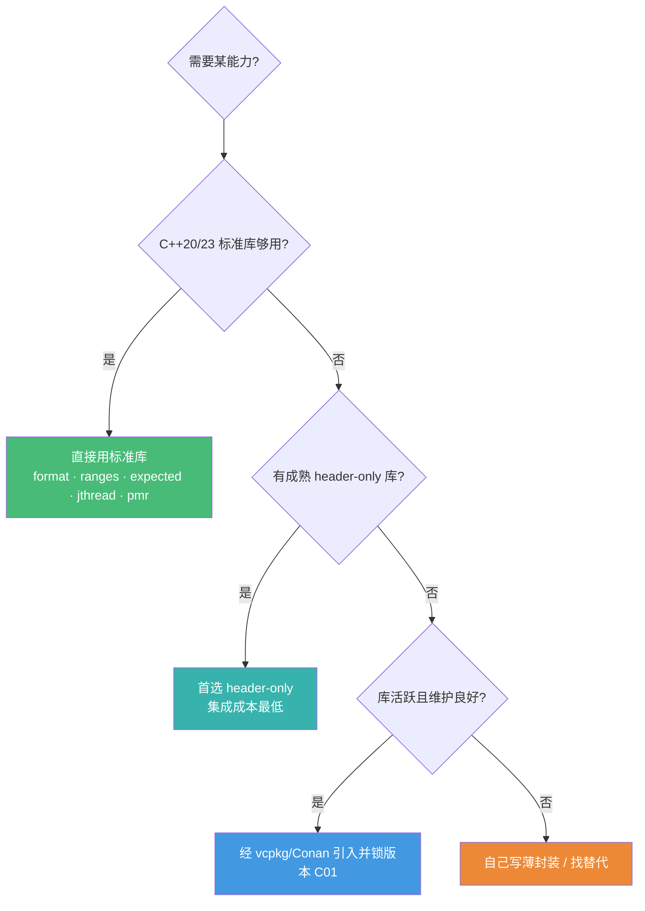

# C++ 生态库选型地图 · 2026 实战精选

> 配套《现代 C++ 全栈深度课程》的生态补充篇
> **📅 内容基准：C++23**（ISO/IEC 14882:2024）+ GCC 14 / Clang 18 / MSVC 19.4x · 覆盖 C++26 进展 · 标注每个库的活跃度与选型建议
> 本课程主体讲透了**语言机制与标准库**，这一篇补上"真实 C++ 项目里到底该用哪些第三方库、怎么把它们装进来"。

---

## C++ 选型的第一难题：没有官方包管理

和 Go「一个 `go.mod` 走天下」不同，C++ **没有官方包管理器**，依赖如何引入本身就是工程难点。所以本篇把**构建/包管理放在最前面**——它是其他一切的地基。一个新 C++ 项目的正确开局顺序是：

1. **先定工具链**：`CMake`（事实标准构建系统）+ `vcpkg` 或 `Conan 2.x`（包管理）。这一步决定了后面所有库怎么装、怎么锁版本。
2. **优先 header-only 库**：C++ 库的集成成本主要在「编译与链接」。header-only 库（nlohmann/json、spdlog、Catch2、Eigen、CLI11…）`#include` 即用，对包管理友好，是降低集成成本的首选。
3. **新代码先看标准库有没有**：C++20/23 正在快速吸收明星第三方库——`std::format` 来自 {fmt}（C29）、`ranges` 来自 range-v3（C19）、`std::execution` 来自 stdexec（C25/C32）、`std::expected` 取代很多自造 Result（C26）。**引入第三方库前，先确认标准库是否已经覆盖。**

> 📐 **黄金法则**：标准库能做的别引依赖，能用 header-only 别用要编译的，要编译的就交给 vcpkg/Conan 管理并锁版本。**C++ 的依赖是真实成本——每个库都意味着一段编译期、一套 ABI 风险。**

---

## 1. 构建系统与包管理（C++ 特有重点）

| 库/工具 | 用途 | 选型建议 | 2026 现状 |
|---|---|---|---|
| **CMake** | 构建系统 | **事实标准**，几乎所有库都提供 `find_package`/CMake 集成；新项目无脑选它（C01）。配 Ninja 生成器构建最快 | 主导，持续演进 |
| **vcpkg**（Microsoft） | 包管理 | 本身用 C++ 写、**无 Python 依赖**，装好编译器即可用；与 CMake/MSVC 集成最顺、Windows 首选。用 `vcpkg.json` manifest 模式锁依赖 | 活跃，registry 巨大 |
| **Conan 2.x**（JFrog） | 包管理 | 更灵活：**per-project 版本 + lockfile + 自定义 profile**，私有仓库与复杂跨平台/多构建系统场景更强；需 Python | 活跃，大型项目首选 |
| **Meson** | 构建系统 | 比 CMake 语法干净、构建快，但生态与库覆盖远不及 CMake；新项目若无特殊理由仍选 CMake | 活跃，小众 |
| **Bazel** | 构建系统 | 超大单体仓库（monorepo）、强可复现、远程缓存场景才值得；学习与接入成本高，普通项目过重 | 活跃，重型场景 |

**一句话选型**：**CMake + vcpkg** 是最省心的默认组合（尤其 Windows / 中小项目）；需要每项目独立版本、私有包仓库、非 CMake 构建或精细 profile 控制 → **Conan 2.x**。两者都务必用 manifest/lockfile 锁版本、开启二进制缓存加速 CI。库的 `find_package` 接口让你换包管理器时改动最小。

---

## 2. 测试框架

| 库 | 用途 | 选型建议 | 2026 现状 |
|---|---|---|---|
| **GoogleTest**（gtest + gmock） | 单测 + mock | 生态最大、文档最全、**自带 mock 框架**，团队/大型项目事实标准 | 活跃 |
| **Catch2** | 单测 | header-only（v2）/单头，`REQUIRE` 表达式自动展开、BDD 风格友好；v3 改为编译库提速 | 活跃 |
| **doctest** | 单测 | **极轻、编译极快**，可与生产代码同文件写测试；想要最低开销选它 | 活跃 |
| **Boost.Test** | 单测 | 功能全但偏重；已深度用 Boost 的项目顺手用，否则没必要单独引入 | 维护中 |

**一句话选型**：要 mock、要大生态 → **GoogleTest**；想要 header-only、表达力强 → **Catch2**；在意编译速度的小库 → **doctest**。多数新项目从 GoogleTest 或 Catch2 起步。

---

## 3. 基准测试（Benchmark）

| 库 | 用途 | 选型建议 | 2026 现状 |
|---|---|---|---|
| **Google Benchmark** | 微基准 | 事实标准，统计稳健、防优化消除（`DoNotOptimize`）、与 gtest 同源；性能工作（C31）标配 | 活跃 |
| **nanobench** | 微基准 | **单头、极简**，自动估算误差与每周期指令数，快速验证一段代码够用 | 活跃 |

**一句话选型**：正经性能回归/CI 基准 → **Google Benchmark**；随手量一段热点 → **nanobench**。配合 C31 的 perf/缓存分析使用——**先测量再优化**。

---

## 4. JSON

| 库 | 用途 | 选型建议 | 2026 现状 |
|---|---|---|---|
| **nlohmann/json** | 通用 JSON | **易用之王**：单头、STL 风格、文档极佳；开发效率优先选它，但吞吐是几者中最低 | 活跃 |
| **simdjson** | 极速解析 | SIMD 加速，解析 GB/s 级、运行时自选 CPU 指令集；**只读/校验大文件首选**。注意：键乱序或缺失时性能下降、不支持自定义分配器 | 活跃，被 Meta Velox/Node.js 等采用 |
| **Glaze** | 极速读写 + 反射 | header-only，**编译期反射 struct ↔ JSON 零宏**，往返吞吐顶级；现代新项目强力候选 | 活跃，上升期 |
| **RapidJSON** | DOM/SAX | 老牌、DOM+SAX+原位解析、可控分配器；均衡之选，但 API 偏底层、活跃度一般 | 维护中 |

**一句话选型**：图省事、字段不在热点 → **nlohmann/json**；只读海量大 JSON → **simdjson**；要 struct 自动序列化又要快 → **Glaze**。别盲目换"高性能"库——先用 Google Benchmark 证明 JSON 是瓶颈（C31）。

---

## 5. 日志与格式化

| 库 | 用途 | 选型建议 | 课程 |
|---|---|---|---|
| **std::format / std::print**（标准库） | 格式化 | **新代码首选**：C++20 `std::format`、C++23 `std::print`/`println`，零依赖、类型安全、编译期检查格式串 | C29 |
| **{fmt}** | 格式化 | **std::format 的来源**。需要标准库尚缺的功能（彩色输出、`fmt::print`、命名参数、`operator<<` 适配、ranges/chrono 格式化）或要旧编译器/全平台一致行为时用它 | C29 |
| **spdlog** | 日志 | **C++ 日志事实标准**：基于 {fmt}、header-only 可选、异步/多 sink/滚动文件，性能与易用兼顾 | C29/C30 |
| **glog**（Google） | 日志 | 老牌，被很多 Google 系库依赖；新项目优先 spdlog，遇到依赖它的库再说 | 维护中 |

**一句话选型**：格式化新代码直接 **std::format/std::print**（C29），缺功能或要跨平台一致再上 **{fmt}**；日志一律 **spdlog**（底层就是 {fmt}，无缝）。

---

## 6. 网络 / HTTP / 异步 I/O

| 库 | 用途 | 选型建议 | 2026 现状 |
|---|---|---|---|
| **Asio**（standalone / Boost.Asio） | 异步网络底座 | **事实标准的异步 I/O 库**，支持 C++20 协程（`co_await`，呼应 C25）；standalone 版无需整个 Boost。绝大多数高性能网络代码的地基 | 活跃 |
| **cpp-httplib** | HTTP 服务/客户端 | **单头**、同步阻塞、起一个 HTTP 服务/客户端最快；适合工具、内嵌服务，不适合超高并发 | 活跃 |
| **cpr** | HTTP 客户端 | libcurl 的现代 C++ 封装，"像 Python requests 一样"调 HTTP；写第三方 API 集成省事 | 活跃 |
| **Boost.Beast** | HTTP/WebSocket | 基于 Asio 的底层 HTTP/1 与 WebSocket，要在 Asio 异步模型里精细控制协议时用 | 活跃 |
| **libuv** | 跨平台事件循环 | C 库（Node.js 同款），需要裸事件循环或跨语言时用；纯 C++ 项目多数直接用 Asio | 活跃 |
| **Seastar** | 高性能异步框架 | share-nothing、每核一线程的极致吞吐框架（ScyllaDB 同源）；**重型专用**，普通服务别上 | 活跃，重型 |

**一句话选型**：要自己写异步网络底座 → **Asio**（C25 协程的实战落地）；快速起 HTTP 服务/客户端 → **cpp-httplib**；只是调别人 API → **cpr**；要 HTTP/WebSocket 精细控制 → **Beast**。

---

## 7. 通用基础库

| 库 | 用途 | 选型建议 | 2026 现状 |
|---|---|---|---|
| **Abseil**（Google） | 基础设施 | flat_hash_map（比 std 快很多）、字符串工具、时间、status 等；**有正式支持政策 + LTS**，稳定性优先选它 | 活跃，官方维护承诺 |
| **{fmt}** | 格式化 | 见 §5；基础库里最值得单独引入的之一 | 活跃 |
| **range-v3** | 范围 | C++20 `ranges`（C19）的来源；标准库 ranges 不够用（如 `to`、更多 view）时补充，否则优先标准库 | 活跃 |
| **Boost** | 巨型工具箱 | C++ 标准的"试验田"（filesystem/optional/variant 都源于此）。**按需取单个库**（Asio/Beast/Cobalt/PFR…），别整包依赖；很多组件标准库已覆盖 | 活跃，1.9x 持续发布 |
| **folly**（Meta） | 高性能组件 | Facebook 内部高性能并发/内存组件；**不保证 ABI 稳定（建议静态链接）**，依赖重，非 Meta 系项目谨慎引入 | 活跃但 ABI 不稳 |

**一句话选型**：要稳定的通用基础设施 → **Abseil**；缺啥单独从 **Boost** 取那一个库；**folly 一般不作为新项目默认**（ABI 与依赖成本高）。能用标准库 ranges/format 就别引 range-v3/{fmt}。

---

## 8. 命令行解析（CLI）

| 库 | 用途 | 选型建议 |
|---|---|---|
| **CLI11** | CLI 框架 | 功能全（子命令、校验、配置文件、补全）、单头、文档好；**复杂 CLI 首选** |
| **cxxopts** | 选项解析 | 单头、轻量，简单 `--flag` 解析够用 |
| **argparse** | 选项解析 | 单头，仿 Python argparse，API 直观，小工具友好 |

**一句话选型**：需要子命令/校验/配置 → **CLI11**；只是几个参数 → **cxxopts** 或 **argparse**。全都 header-only，集成零成本。

---

## 9. 序列化 / RPC

| 库 | 用途 | 选型建议 | 2026 现状 |
|---|---|---|---|
| **Protocol Buffers**（protobuf） | 跨语言序列化 | 跨语言 schema 标准、生态最大，配 gRPC 的默认；有代码生成与运行时开销 | 活跃 |
| **gRPC C++** | RPC 框架 | 跨语言 RPC 事实标准，配 protobuf；微服务首选 | 活跃 |
| **FlatBuffers** | 零拷贝序列化 | **访问时无需解析**（直接读 buffer），低延迟/游戏/嵌入场景强 | 活跃 |
| **Cap'n Proto** | 零拷贝 + RPC | 类 FlatBuffers 的零拷贝 + 自带 RPC，设计现代；生态比 protobuf 小 | 活跃 |
| **Cereal** | C++ 原生序列化 | **header-only**，纯 C++ 对象 ↔ 二进制/JSON/XML，无需 schema、无跨语言时最省事 | 维护中 |

**一句话选型**：跨语言/微服务 → **protobuf + gRPC**；要零拷贝低延迟 → **FlatBuffers / Cap'n Proto**；只在 C++ 内部存档对象、不要 schema → **Cereal**。

---

## 10. 并发工具

| 库 | 用途 | 选型建议 | 课程 |
|---|---|---|---|
| **Intel TBB**（oneTBB） | 并行算法/任务 | 成熟的任务并行、并发容器、`parallel_for`/流水线；CPU 密集并行计算首选，也是标准并行算法的常见后端 | C18/C21 |
| **Taskflow** | 任务图并行 | **header-only**，用任务依赖图（DAG）表达并行，API 现代、可视化好；构建复杂任务依赖时优雅 | C21 |
| **moodycamel::ConcurrentQueue** | 无锁队列 | 单头、高性能 MPMC 无锁队列；生产者-消费者标配，省去自己写无锁结构（C23） | C23 |

**一句话选型**：通用 CPU 并行 → **oneTBB**；任务有复杂依赖关系 → **Taskflow**；要个快的并发队列 → **moodycamel**。标准并行算法（`std::execution::par`，C18）够用时优先标准库。

---

## 11. 协程 / 异步模型（对应 C25）

| 库 | 用途 | 选型建议 | 2026 现状 |
|---|---|---|---|
| **stdexec**（NVIDIA） | std::execution 参考实现 | **`std::execution`（P2300）的参考实现**——该提案已于 2024 年并入 **C++26**。header-only、无依赖、算法丰富（`then`/`when_all`/`bulk`）、含 GPU/线程池调度器。**面向未来的结构化并发首选** | 活跃，成熟可用 |
| **Boost.Cobalt** | 协程框架 | 基于 Asio 的 C++20 协程高层封装（类 node.js/asyncio），与 Beast/MySQL/Redis 协作好；**三者中维护最积极、最适合生产** | 活跃 |
| **libunifex**（Meta） | sender/receiver 原型 | sender/receiver 早期原型，命名空间与 P2300 已有差异；实验性、API/ABI 不稳——新项目优先 **stdexec** | 实验性 |
| **cppcoro** | 协程原语 | 历史上极具影响力，但**已停止维护多年**、Linux 端 io 未完成。**不推荐用于新项目**，仅作学习参考 | ⚠️ 已停更 |

**一句话选型**：想用标准化方向的结构化并发 → **stdexec**（即未来的 `std::execution`，C25/C32）；要在 Asio 生态里写协程业务 → **Boost.Cobalt**。**避开 cppcoro**（已死），libunifex 仅做实验。

---

## 12. 数据库客户端

| 库 | 用途 | 选型建议 | 2026 现状 |
|---|---|---|---|
| **libpqxx** | PostgreSQL | PG 官方推荐的 C++ 客户端，事务/预处理/管道齐全；PG 项目首选 | 活跃 |
| **SQLiteCpp** | SQLite | SQLite C API 的 RAII 风格 C++ 封装，header 友好；嵌入式/本地存储省心 | 活跃 |
| **redis-plus-plus** | Redis | 功能全的 C++ Redis 客户端（基于 hiredis），支持 Cluster/Pipeline/Pub-Sub | 活跃 |
| **mongocxx** | MongoDB | MongoDB 官方 C++ 驱动 | 活跃 |

**一句话选型**：PG → **libpqxx**；本地嵌入 → **SQLiteCpp**；Redis → **redis-plus-plus**；Mongo → 官方 **mongocxx**。注意用 RAII（C05）管理连接、用预处理语句防注入。

---

## 13. 数值 / 科学计算

| 库 | 用途 | 选型建议 | 2026 现状 |
|---|---|---|---|
| **Eigen** | 线性代数 | **header-only 之王**：矩阵/向量/分解，表达式模板做编译期优化、零额外依赖；线代默认选它 | 活跃 |
| **xtensor** | N 维数组 | NumPy 风格的多维数组与广播，做张量/数组运算且要 Python 风格 API 时用 | 活跃 |
| **libtorch** | 深度学习 | PyTorch 的 C++ 前端，做推理/训练落地；依赖重，仅深度学习场景引入 | 活跃 |

**一句话选型**：线性代数 → **Eigen**（header-only，几乎无脑选）；NumPy 风格数组 → **xtensor**；深度学习 → **libtorch**。

---

## 14. 反射 / 元编程辅助

| 库 | 用途 | 选型建议 | 课程 |
|---|---|---|---|
| **magic_enum** | enum 反射 | **单头**，编译期拿到 enum 名字/遍历枚举值，无需宏；enum ↔ string 必备 | C13/C27 |
| **Boost.PFR** | 聚合体反射 | 对简单聚合 struct 做"无宏静态反射"（遍历字段、打印、比较），序列化/调试利器 | C13 |

**一句话选型**：枚举反射 → **magic_enum**；struct 字段反射 → **Boost.PFR**。注意 **C++26 将带来语言级反射**（C32），届时这些库的很多用途会被标准吸收——属于"过渡期实用工具"。

---

## 15. 内存分配器（对应 C30）

| 库 | 用途 | 选型建议 | 2026 现状 |
|---|---|---|---|
| **mimalloc**（Microsoft） | 通用分配器 | **现代首选**：小巧、快、多线程友好，链接即换全局 `malloc`，立竿见影 | 活跃 |
| **jemalloc** | 通用分配器 | 老牌、抗碎片、profiling 强，长跑大内存服务经典选择 | 活跃 |
| **tcmalloc**（Google） | 通用分配器 | 线程缓存分配器，多线程高并发分配场景强；常与 Abseil 同栈使用 | 活跃 |

**一句话选型**：默认试 **mimalloc**（最易接入、收益明显）；长生命周期大服务关注碎片/profiling → **jemalloc**；Google 系/高并发 → **tcmalloc**。换分配器属于全局优化，**先用 C30/C31 的工具确认分配是瓶颈**再换。

---

## 🗺️ 场景 → 首选 速查

| 场景 | 2026 首选 | 备选 |
|---|---|---|
| 构建系统 | **CMake** | Meson / Bazel |
| 包管理 | **vcpkg**（易）/ **Conan 2.x**（灵活）| — |
| 单元测试 | GoogleTest / Catch2 | doctest |
| 基准测试 | Google Benchmark | nanobench |
| JSON（易用）| nlohmann/json | — |
| JSON（极速）| simdjson（只读）/ Glaze（读写）| RapidJSON |
| 格式化 | **std::format / std::print** | {fmt} |
| 日志 | **spdlog** | glog |
| 异步网络底座 | **Asio** | libuv |
| HTTP 服务/客户端 | cpp-httplib | Beast |
| HTTP 客户端 | cpr | — |
| 通用基础库 | Abseil | Boost（按需）|
| CLI | CLI11 | cxxopts / argparse |
| 跨语言 RPC | gRPC + protobuf | Cap'n Proto |
| 零拷贝序列化 | FlatBuffers | Cap'n Proto |
| 并行计算 | oneTBB | Taskflow |
| 无锁队列 | moodycamel | — |
| 结构化并发/协程 | **stdexec**（=C++26 std::execution）| Boost.Cobalt |
| PG 客户端 | libpqxx | — |
| 线性代数 | **Eigen** | xtensor |
| enum 反射 | magic_enum | — |
| 分配器 | mimalloc | jemalloc / tcmalloc |

---

## ⚠️ 选型避坑清单

- ❌ **不定工具链就开干**：先搭好 CMake + vcpkg/Conan，别手动拷头文件、手动写链接命令——那是不可复现的灾难（C01）。
- ❌ **用 cppcoro 写新协程代码**：已停更多年、Linux io 残缺。新项目用 **stdexec**（标准方向）或 **Boost.Cobalt**。
- ❌ **盲目把 folly 当默认基础库**：依赖重、**不保证 ABI 稳定**。要稳定基础设施用 **Abseil**。
- ❌ **整包依赖 Boost**：体积与编译成本大，且很多组件标准库已有。**只取你要的那一个 Boost 库**。
- ❌ **能用标准库还引第三方**：`std::format`(C29)、`ranges`(C19)、`std::expected`(C26)、`jthread`(C21)、`pmr`(C30) 已覆盖大量旧库的功能——**先看标准库**。
- ❌ **不做 benchmark 就换"高性能"库**：换 simdjson/mimalloc/Glaze 前，先用 Google Benchmark + perf（C31）证明那里真是瓶颈。
- ❌ **simdjson 用在键乱序/需改写的场景**：它擅长顺序只读大文件，乱序访问会显著掉速——这类场景用 Glaze/RapidJSON。
- ❌ **不锁版本**：用 `vcpkg.json` / Conan lockfile 固定版本，否则构建不可复现。
- ❌ **优先选要编译的库而非 header-only**：同等条件下 header-only 集成成本最低（nlohmann/json、spdlog、Eigen、CLI11、Catch2…）。

---

## 📌 与课程章节的对应

| 课程章节 | 相关生态库 |
|---|---|
| C01 编译模型与构建 | CMake / vcpkg / Conan / Meson / Bazel |
| C05 RAII 与智能指针 | SQLiteCpp / libpqxx（RAII 管理连接资源）|
| C13/C27 元编程·constexpr | magic_enum / Boost.PFR（编译期反射）|
| C18 STL 算法（并行）| oneTBB（`std::execution::par` 后端）|
| C19 Ranges | range-v3（标准 ranges 的来源与补充）|
| C21 线程 | TBB / Taskflow |
| C23 原子与无锁 | moodycamel::ConcurrentQueue |
| C25 协程 | stdexec / Boost.Cobalt / Asio（co_await）/ libunifex |
| C26 异常·expected | （std::expected 取代自造 Result 类型）|
| C29 字符串与 format | std::format / {fmt} / spdlog |
| C30 内存管理 | mimalloc / jemalloc / tcmalloc（自定义分配器）|
| C31 性能优化 | Google Benchmark / nanobench / simdjson / Glaze |
| C32 C++23/26 现状 | stdexec（std::execution 入 C++26）/ magic_enum（语言反射前的过渡）|

---

> 🔁 **原则复述**：**先定 CMake + vcpkg/Conan 工具链 → 新代码先看标准库（C++20/23 在吸收 fmt/ranges/execution）→ 缺了优先 header-only 库 → 要编译的库交给包管理并锁版本 → 用 benchmark 而非传说选"高性能"库。** 生态会变，但"先标准库、优先 header-only、控制依赖与 ABI、用数据说话"这套方法不变。
>
> 📅 库的活跃度会随时间变化，引入前请上 GitHub 看最近提交与 issue 响应、确认是否仍维护，本篇基准为 2026-06。
