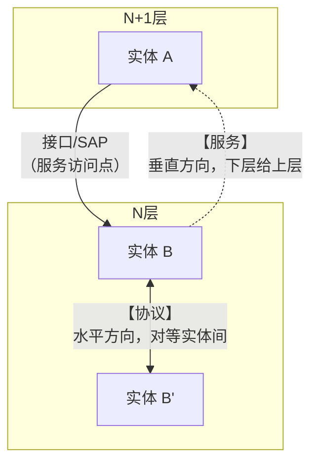
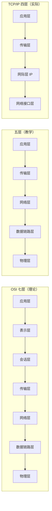
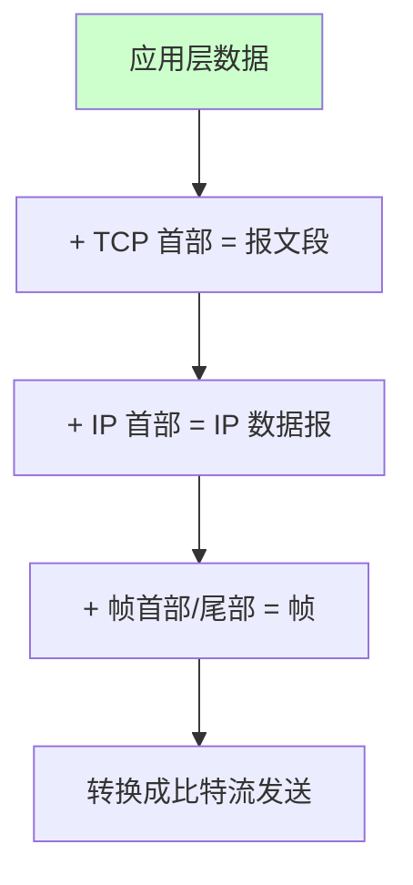
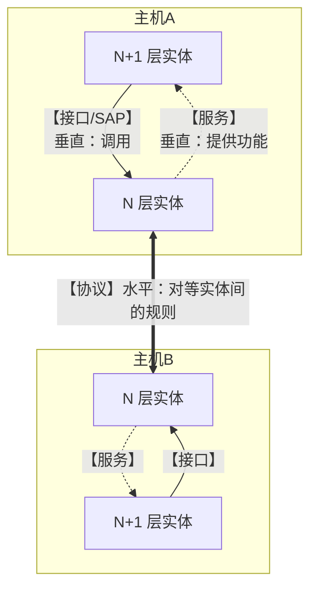

# 精通网络体系结构与性能指标：分层模型、时延分析与带宽时延积

> 课程编号：CN01
> 路线图来源：计算机基础四大件 · 计算机网络（408 第 1 章）
> 难度：⭐⭐⭐
> 预计阅读时间：75 分钟
> 内容基准：2026 年 8 月（408 考纲计算机网络第 1 章「计算机网络体系结构」）
> **代码语言：Go**。本章用 Go 实测各项性能指标，并观察分层在代码中的体现。

---

## 引言：100 Gbps 的网卡，为什么传一个文件还是很慢

一台服务器配了 **100 Gbps** 的网卡，从北京传一个 **1 KB** 的文件到纽约。理论上：

$$
\text{发送时延} = \frac{1\ \text{KB}}{100\ \text{Gbps}} = \frac{8192\ \text{bit}}{10^{11}\ \text{bit/s}} = 0.08\ \mu s
$$

**0.08 微秒——快得像不存在。**

但实测的往返时间（RTT）是 **约 200 ms**。**慢了 250 万倍。**

时间都去哪了？

```
北京 → 纽约的物理距离约 11,000 km
光纤中的光速约 2×10⁸ m/s（比真空光速慢 1/3）

传播时延 = 11,000,000 m / (2×10⁸ m/s) = 0.055 秒 = 55 ms
往返 = 110 ms（还没算路由器转发和排队）
```

**传播时延 55 ms，发送时延 0.08 μs——相差 68 万倍。**

这个数字揭示了网络性能最反直觉的一点：

> **对于短消息和长距离，决定速度的不是"带宽"，而是"光速"。**
>
> **带宽决定"一秒能塞进去多少数据"，光速决定"第一个比特多久能到"。这是两个完全独立的维度。**

再看一个"带宽根本用不上"的例子：

```
北京 ↔ 纽约，RTT = 110 ms，带宽 100 Gbps

若用"发一个包 → 等确认 → 再发下一个"的停等协议：
  每个 RTT 只能传 1 个包（假设 1500 B）
  
  吞吐量 = 1500 B / 0.11 s = 13.6 KB/s = 0.109 Mbps
  
  【只用上了 100 Gbps 的百万分之一】❌
```

**要填满这条链路，必须让"在途的数据"足够多**——这就是**时延带宽积**：

$$
\text{时延带宽积} = 110\ \text{ms} \times 100\ \text{Gbps} = 1.375\ \text{GB}
$$

**这条链路像一根"管道"，必须同时有 1.375 GB 的数据在里面飞，才能跑满带宽。**

本章把这些量拆开讲清楚，同时建立整个课程的骨架——**分层模型**。

读完你应该能：

- 说清网络分层的动机与"协议 / 服务 / 接口"三个概念的关系
- 默写 OSI 七层、TCP/IP 四层、五层模型的对应关系与各层 PDU
- **准确计算四种时延**，并说清哪种在什么场景下占主导
- **计算时延带宽积**，解释它为什么决定了协议设计
- 区分速率、带宽、吞吐量三个易混概念

---

## 第一章 计算机网络的基本概念

### 1.1 定义与组成

**计算机网络**：由**通信线路**互相连接的、**自治的**计算机集合。

> ⚠️ **"自治"是关键词**——每台计算机独立工作，没有主从关系。这排除了"一台主机 + 多个终端"的分时系统。

**从组成看**：

| 组成 | 内容 |
|---|---|
| **硬件** | 主机、通信链路、交换设备、通信处理机 |
| **软件** | 各种网络应用、协议实现 |
| **协议** | **网络的核心** |

**从工作方式看**：

| 部分 | 组成 | 作用 |
|---|---|---|
| **边缘部分** | 所有连在网络上的**主机** | 用户直接使用，进行**通信和资源共享** |
| **核心部分** | 大量**网络**和连接它们的**路由器** | 为边缘部分**提供连通性和交换服务** |

### 1.2 三种交换方式（重要）

| 方式 | 原理 | 特点 |
|---|---|---|
| **电路交换** | 通信前**建立专用物理通路**，全程独占 | ✅ 时延小、有序<br/>❌ **建立连接时间长**、**线路利用率低** |
| **报文交换** | 整个报文作为一个单位**存储转发** | ✅ 无需建立连接、线路利用率高<br/>❌ **时延大**（要等整个报文收完） |
| **分组交换** ⭐ | 报文拆成**分组**，逐个存储转发 | ✅ **时延小**（流水线式转发）、利用率高<br/>❌ 有**分组头开销**、可能**失序** |

**为什么分组交换时延更小**（关键洞察）：

```
假设报文 3000 bit，链路速率 1 Mbps，经过 2 个路由器（3 段链路）

【报文交换】每个节点必须收完整个报文才能转发：
  主机 → R1: 3 ms（收完）
  R1  → R2: 3 ms
  R2  → 目的: 3 ms
  总计 = 9 ms

【分组交换】拆成 3 个 1000 bit 的分组，【流水线式并行】：
  时刻 0-1ms:  主机发分组1 → R1
  时刻 1-2ms:  R1 转分组1 → R2   |  主机发分组2 → R1  ★ 并行！
  时刻 2-3ms:  R2 转分组1 → 目的 |  R1 转分组2       |  主机发分组3
  时刻 3-4ms:                      R2 转分组2 → 目的  |  R1 转分组3
  时刻 4-5ms:                                          R2 转分组3 → 目的
  总计 = 5 ms  ⭐
```

> ⭐ **分组交换的核心优势是"流水线"**——把大报文切小，让多个节点**同时**在传输不同的分组。这与 [CO07](../computer-organization/CO07-精通-中央处理器.md) 的指令流水线是**完全相同的思想**。
>
> **通用公式**（k 段链路，报文 M bit，分组 P bit，速率 b）：
>
> $$T_{分组交换} = \frac{M}{b} + (k-1)\cdot\frac{P}{b}$$
>
> 第一项是"发完整个报文"，第二项是"流水线填充"。

---

## 第二章 分层结构

### 2.1 为什么要分层

**问题**：网络通信要处理的事情太多——比特编码、差错检测、路由选择、可靠传输、数据格式转换、应用逻辑…全部揉在一起会导致：

- 无法分工协作
- 改一处影响全局
- 无法互操作（不同厂商的设备无法通信）

**分层的三大好处**：

| 好处 | 说明 |
|---|---|
| **① 各层独立** | 每层只需知道**下层提供什么服务**、**向上层提供什么服务**，**不必关心实现** |
| **② 灵活性好** | 某层实现改变（如把以太网换成 WiFi），**其他层不受影响** |
| **③ 易于实现和维护** | 把大问题分解成若干可管理的小问题 |

### 2.2 三个核心概念（必须分清）



| 概念 | 定义 | 方向 |
|---|---|---|
| **实体（Entity）** | 任何**可发送或接收信息的硬件或软件进程** | —— |
| **协议（Protocol）** | **对等实体**之间**数据交换**必须遵守的**规则** | **水平**（同层之间） |
| **服务（Service）** | **下层**为紧邻的**上层**提供的**功能调用** | **垂直**（层间） |
| **接口 / SAP** | 相邻两层交换信息的**逻辑接口**（服务访问点） | 垂直 |

> ⚠️ **三个高频陷阱**：
>
> 1. **协议是"水平"的，服务是"垂直"的**
> 2. **协议是"对等层"之间的**，同一台机器的相邻层之间**不是协议，是接口**
> 3. **下层向上层提供服务，但上层看不到协议的实现细节**——上层只知道"我调用这个接口能得到什么"

**协议的三要素**：

| 要素 | 含义 |
|---|---|
| **语法** | 数据与控制信息的**结构或格式**（比特怎么排） |
| **语义** | 需要发出何种**控制信息**、完成何种**动作**（这些比特是什么意思） |
| **同步（时序）** | 事件实现**顺序**的详细说明（先做什么后做什么） |

### 2.3 三种分层模型



**三者的对应关系**：

| OSI 七层 | 五层模型 | TCP/IP 四层 |
|---|---|---|
| **应用层** | **应用层** | **应用层** |
| **表示层** | ↑ 合并 | ↑ |
| **会话层** | ↑ 合并 | ↑ |
| **传输层** | **传输层** | **传输层** |
| **网络层** | **网络层** | **网际层** |
| **数据链路层** | **数据链路层** | **网络接口层** |
| **物理层** | **物理层** | ↑ 合并 |

> ⚠️ **TCP/IP 的"网络接口层"并没有具体定义**——它只说"要能把 IP 分组发到物理网络上"，具体怎么做交给以太网、WiFi、PPP 等去实现。**这种"不管下面怎么实现"的设计，正是 IP 能在各种物理网络上通用的原因（"IP over everything"）。**

### 2.4 各层的功能与 PDU（必背）

| 层 | 主要功能 | PDU（协议数据单元） | 典型设备/协议 |
|---|---|---|---|
| **应用层** | 为**特定应用程序**提供服务 | **报文（Message）** | HTTP、DNS、FTP、SMTP |
| **表示层** | **数据格式转换**、加密解密、压缩 | —— | JPEG、ASCII |
| **会话层** | 建立、管理、终止**会话**；同步（校验点） | —— | —— |
| **传输层** | **端到端**通信、**进程间**通信、可靠传输、流量控制 | **报文段（Segment）**/ 用户数据报 | **TCP、UDP** |
| **网络层** | **路由选择**、**分组转发**、拥塞控制、异构网互联 | **分组 / 数据报（Packet）** | **IP**、ICMP、路由器 |
| **数据链路层** | **成帧**、差错控制、流量控制、**介质访问控制** | **帧（Frame）** | 以太网、**交换机、网桥** |
| **物理层** | 透明传输**比特流**、定义**机械/电气/功能/规程**特性 | **比特（Bit）** | **中继器、集线器** |

> ⭐ **两个最关键的区分**：
>
> **① 网络层是"主机到主机"，传输层是"进程到进程"**
> ```
> 网络层（IP）：把分组从【主机 A】送到【主机 B】—— 靠 IP 地址
> 传输层（TCP/UDP）：把数据从【A 上的进程 X】送到【B 上的进程 Y】—— 靠端口号
> ```
>
> **② 网络层是"点到点"，传输层是"端到端"**
> ```
> 点到点：相邻节点之间（主机↔路由器、路由器↔路由器）
> 端到端：两个通信终端之间（源主机↔目的主机），中间路由器【不参与】
> ```

### 2.5 数据封装与解封装



**每层都给数据加上自己的首部（有的还加尾部）**，接收方逐层剥离。

**关键性质**：

```
每一层只"认识"自己的首部，把上层的一切（含上层首部）
都当作【不透明的数据】——这就是"封装"的含义
     ↓
这保证了各层的【独立性】：
  网络层换协议（IPv4 → IPv6），传输层完全不用改
  物理介质换了（网线 → WiFi），IP 层完全不用改
```

### 2.6 用 Go 看分层

```go
package main

import (
    "fmt"
    "io"
    "net"
    "net/http"
)

func main() {
    // ① 【应用层】：HTTP —— 我只关心"请求一个 URL"
    resp, _ := http.Get("http://example.com")
    body, _ := io.ReadAll(resp.Body)
    resp.Body.Close()
    fmt.Println("应用层收到", len(body), "字节")

    // ② 【传输层】：TCP —— 我只关心"连到某个 IP:端口"
    conn, _ := net.Dial("tcp", "example.com:80")
    fmt.Fprintf(conn, "GET / HTTP/1.0\r\n\r\n")
    conn.Close()

    // ③ 【网络层】：IP —— 我只关心"这个域名对应哪个 IP"
    ips, _ := net.LookupIP("example.com")
    fmt.Println("网络层地址:", ips)

    // ④ 【数据链路层】：MAC —— 我只关心"本机网卡的物理地址"
    ifaces, _ := net.Interfaces()
    for _, i := range ifaces {
        if i.HardwareAddr != nil {
            fmt.Printf("链路层: %s MAC=%s\n", i.Name, i.HardwareAddr)
        }
    }
}
```

> 💡 **这段代码完美体现了分层的价值**：
>
> - 写 `http.Get` 时，**完全不需要知道** TCP 三次握手、IP 路由、以太网帧格式
> - 写 `net.Dial("tcp", ...)` 时，**完全不需要知道** IP 分片、ARP 解析、CSMA/CD
>
> **每一层都只面对下层提供的"服务"，看不到下层的"协议"实现。**

---

## 第三章 性能指标（核心计算考点）

### 3.1 速率、带宽、吞吐量（三个易混概念）

| 概念 | 定义 | 单位 | 关键区别 |
|---|---|---|---|
| **速率（数据率）** | 数据的**传送速率** | **b/s**（比特每秒） | 通常指**额定速率** |
| **带宽** | 网络的**最高数据率** | b/s | **理论上限**（"能力"） |
| **吞吐量** | 单位时间内**实际通过**的数据量 | b/s | **实际值**（受各种因素限制，**≤ 带宽**） |

> ⚠️ **网络中的 K/M/G 是 $10^3/10^6/10^9$，不是 $2^{10}/2^{20}/2^{30}$！**
>
> $$1\ \text{Mb/s} = 10^6\ \text{b/s}$$
>
> **但存储容量中的 KB/MB/GB 用的是 $2^{10}$**。同一道题里两套进制并存是 408 的经典陷阱（与 [CO01](../computer-organization/CO01-精通-计算机系统概述与性能指标.md) §4.2 的坑完全一致）。
>
> **记忆**：**速率用十进制，容量用二进制。**

### 3.2 四种时延（必背公式）

$$
\boxed{\text{总时延} = \text{发送时延} + \text{传播时延} + \text{处理时延} + \text{排队时延}}
$$

#### ① 发送时延（传输时延）

**把数据"推"到链路上所需的时间。**

$$
\boxed{T_{发送} = \frac{\text{数据长度（bit）}}{\text{发送速率（b/s）}}}
$$

> 💡 **与"距离无关"**，只与数据量和网卡速率有关。

#### ② 传播时延

**电磁波在信道上传播一段距离所需的时间。**

$$
\boxed{T_{传播} = \frac{\text{信道长度（m）}}{\text{传播速率（m/s）}}}
$$

**传播速率的典型值**：

| 介质 | 传播速率 |
|---|---|
| 自由空间（真空） | $3 \times 10^8$ m/s |
| **铜线** | $\approx 2.3 \times 10^8$ m/s |
| **光纤** | $\approx 2 \times 10^8$ m/s |

> ⚠️ **传播时延与"数据量无关"**，只与距离和介质有关。**这是它与发送时延最本质的区别。**

#### ③ 处理时延

主机或路由器收到分组后，**分析首部、查找路由表、差错检验**所花的时间。

#### ④ 排队时延

分组在路由器的**输入/输出队列中排队等待**的时间。**与网络拥塞程度密切相关**。

> ⭐ **408 通常只考虑发送时延和传播时延**（处理和排队时延难以量化）。**看清题目是否说"忽略处理和排队时延"。**

### 3.3 发送时延 vs 传播时延（最重要的辨析）

| | **发送时延** | **传播时延** |
|---|---|---|
| **决定因素** | **数据量** ÷ **速率** | **距离** ÷ **传播速率** |
| **与数据量** | ✅ **有关**（数据越多越久） | ❌ **无关** |
| **与距离** | ❌ **无关** | ✅ **有关** |
| **与带宽** | ✅ **有关**（带宽越大越快） | ❌ **无关** ⭐ |
| **物理意义** | "把数据挤上路"的时间 | "第一个比特跑到对面"的时间 |

**类比**：

> **发送时延** = 一列火车**全部驶出车站**所需的时间（车越长越久，车速越快越短）
> **传播时延** = 火车**头**从起点跑到终点的时间（距离越远越久，与车长无关）

**哪个占主导？**

| 场景 | 主导因素 |
|---|---|
| **短距离 + 大数据量**（局域网传大文件） | **发送时延** |
| **长距离 + 小数据量**（跨洋发一个 ping 包） | **传播时延** ⭐ |

**引言的例子正是后者**：1 KB 数据在 100 Gbps 链路上，发送时延 0.08 μs，传播时延 55 ms——**传播时延占 99.9999%**。

### 3.4 时延带宽积 ⭐

$$
\boxed{\text{时延带宽积} = \text{传播时延} \times \text{带宽}}
$$

**物理意义：链路上"正在传播的比特数"——把链路看作一根管道，它的"容积"。**


**例**：传播时延 20 ms，带宽 100 Mb/s。

$$
\text{时延带宽积} = 20 \times 10^{-3}\ \text{s} \times 100 \times 10^6\ \text{b/s} = 2 \times 10^6\ \text{bit} = 2\ \text{Mbit} = 250\ \text{KB}
$$

**含义：这条链路上可以同时容纳 200 万个比特"在路上飞"。**

> ⭐ **时延带宽积决定了协议设计**：
>
> **要跑满带宽，发送方必须有能力"不等确认就连续发出"至少一个时延带宽积的数据。**
>
> 这直接推导出：
> - **停等协议**（发一个等一个）在长肥管道上**几乎跑不出带宽**
> - TCP 的**滑动窗口**必须足够大（详见 [CN05](./CN05-精通-传输层.md)）
> - TCP 的**窗口缩放选项（Window Scale）**就是为了突破 64 KB 的窗口上限而设计的

**"长肥管道（LFN, Long Fat Network）"**：时延带宽积很大的链路（跨洋光纤、卫星链路）。

### 3.5 往返时延 RTT

**从发送方发出数据，到收到接收方确认，总共经历的时间。**

$$
RTT \approx 2 \times T_{传播} + \text{处理时延} + \text{排队时延} + \text{对方的发送时延}
$$

> 💡 **RTT 是网络性能最重要的实用指标**——`ping` 命令测的就是它。它决定了：
> - TCP 建立连接的时间（三次握手 = 1.5 RTT）
> - HTTP 请求的最小延迟
> - 滑动窗口协议的吞吐量上限

### 3.6 信道利用率与时延的关系

$$
\boxed{D = \frac{D_0}{1 - U}}
$$

- $D_0$：网络**空闲时**的时延
- $D$：当前时延
- $U$：**信道利用率**（0 ~ 1）

| 利用率 U | 时延 D |
|---|---|
| 0 | $D_0$ |
| 50% | $2 D_0$ |
| 80% | $5 D_0$ |
| **90%** | **$10 D_0$** |
| **99%** | **$100 D_0$** |
| → 1 | **→ ∞** ⚠️ |

> ⚠️ **利用率并非越高越好**！信道利用率接近 1 时，**时延急剧趋于无穷大**。
>
> **工程实践：链路利用率通常控制在 50~70%**。超过 80% 就要考虑扩容——因为排队时延会指数级恶化。
>
> 这与 [OS03](../operating-system/OS03-精通-CPU-调度.md) 的"CPU 利用率高不代表系统好"、[OS07](../operating-system/OS07-精通-虚拟内存.md) 的"内存用到 90% 就在抖动悬崖边"是同一类现象——**排队论的普遍规律**。

### 3.7 用 Go 实测

```go
package main

import (
    "fmt"
    "io"
    "net"
    "time"
)

func main() {
    const host = "example.com:80"

    // ① 测 RTT（TCP 握手时间近似 1 个 RTT）
    var total time.Duration
    const n = 5
    for i := 0; i < n; i++ {
        start := time.Now()
        conn, err := net.DialTimeout("tcp", host, 5*time.Second)
        if err != nil {
            fmt.Println("连接失败:", err)
            return
        }
        rtt := time.Since(start)
        total += rtt
        conn.Close()
    }
    avgRTT := total / n
    fmt.Printf("平均 RTT（≈TCP 握手）: %v\n", avgRTT)

    // ② 测吞吐量
    conn, _ := net.Dial("tcp", host)
    defer conn.Close()
    fmt.Fprintf(conn, "GET / HTTP/1.0\r\nHost: example.com\r\n\r\n")

    start := time.Now()
    n2, _ := io.Copy(io.Discard, conn)
    elapsed := time.Since(start)

    throughput := float64(n2*8) / elapsed.Seconds() / 1e6
    fmt.Printf("接收 %d 字节，耗时 %v\n", n2, elapsed)
    fmt.Printf("吞吐量: %.2f Mb/s\n", throughput)

    // ③ 估算时延带宽积（假设带宽 100 Mb/s）
    const bandwidth = 100e6                        // 100 Mb/s
    propDelay := avgRTT.Seconds() / 2              // 单程传播时延 ≈ RTT/2
    bdp := propDelay * bandwidth / 8               // 转成字节
    fmt.Printf("\n单程传播时延 ≈ %.1f ms\n", propDelay*1000)
    fmt.Printf("时延带宽积 ≈ %.1f KB\n", bdp/1024)
    fmt.Printf("→ 要跑满 100Mb/s，滑动窗口至少要 %.1f KB\n", bdp/1024)
}
```

**典型输出**：

```
平均 RTT（≈TCP 握手）: 168ms
接收 1256 字节，耗时 172ms
吞吐量: 0.06 Mb/s

单程传播时延 ≈ 84.0 ms
时延带宽积 ≈ 1025.4 KB
→ 要跑满 100Mb/s，滑动窗口至少要 1025.4 KB
```

> ⚠️ **注意吞吐量只有 0.06 Mb/s**——因为只传了 1256 字节，**几乎全部时间花在 RTT 上**，带宽根本没用上。
>
> **而计算出的时延带宽积是 1 MB**——这意味着：**要跑满这条链路，必须同时有 1 MB 的数据在途**。
>
> **TCP 默认的初始窗口只有约 10 个 MSS（约 14 KB）**，离 1 MB 差 70 倍——这就是为什么**跨洋传输必须启用窗口缩放（Window Scale）选项**，也是 BBR 等新拥塞控制算法要解决的问题。

---

## 第四章 408 高频考点与陷阱清单

### 4.1 考点分布

第 1 章通常是 **2 道选择题（4 分）+ 常见于大题的计算部分**。

最常考：

1. **各种时延的计算**（尤其发送时延 vs 传播时延）
2. **时延带宽积的计算与意义**
3. OSI / TCP-IP 分层与各层功能、PDU
4. 协议、服务、接口的辨析
5. 分组交换 vs 电路交换 vs 报文交换

### 4.2 十六个陷阱

**陷阱 1：网络速率的 M 是 $2^{20}$**

**错**。**网络速率用十进制**：$1\ \text{Mb/s} = 10^6$ b/s。**存储容量才用二进制**（$1\ \text{MB} = 2^{20}$ B）。

**陷阱 2：传播时延与数据量有关**

**错**。传播时延 = 距离 ÷ 传播速率，**与数据量完全无关**。**发送时延**才与数据量有关。

**陷阱 3：带宽越大，传播时延越小**

**错**。**带宽只影响发送时延**，**对传播时延没有任何影响**（传播速率由介质决定，不是带宽）。

**陷阱 4：吞吐量可以大于带宽**

**错**。**吞吐量 ≤ 带宽**。带宽是理论上限，吞吐量是实际值。

**陷阱 5：信道利用率越高越好**

**错**。$D = \dfrac{D_0}{1-U}$，利用率趋近 1 时**时延趋于无穷**。工程上通常控制在 **50~70%**。

**陷阱 6：协议是相邻层之间的规则**

**错**。**协议是【对等层】（水平方向）之间的规则**；相邻层之间是**接口/服务**（垂直方向）。

**陷阱 7：服务是水平方向的**

**错，反了**。**服务是垂直的**（下层给上层），**协议是水平的**（对等实体间）。

**陷阱 8：OSI 七层中传输层的 PDU 叫"分组"**

**错**。**传输层的 PDU 是"报文段（Segment）"**；**网络层**才是"分组/数据报（Packet）"。

**陷阱 9：网络层实现"进程到进程"的通信**

**错**。**网络层是"主机到主机"**（靠 IP 地址）；**传输层才是"进程到进程"**（靠端口号）。

**陷阱 10：传输层是"点到点"的**

**错**。**传输层是"端到端"**（源主机 ↔ 目的主机，中间路由器不参与）；**网络层及以下是"点到点"**（相邻节点之间）。

**陷阱 11：TCP/IP 模型有五层**

**错**。**TCP/IP 是四层**（网络接口层、网际层、传输层、应用层）。**五层模型是教学用的折中**。

**陷阱 12：路由器工作在数据链路层**

**错**。**路由器工作在网络层**；**交换机/网桥**在数据链路层；**集线器/中继器**在物理层。

**陷阱 13：报文交换的时延比分组交换小**

**错，反了**。**分组交换时延更小**——因为可以**流水线式并行转发**，不用等整个报文收完。

**陷阱 14：电路交换的线路利用率高**

**错**。电路交换**全程独占线路**，即使不传数据也占着，**利用率低**。分组交换的利用率高。

**陷阱 15：时延带宽积的单位是秒**

**错**。$\text{时延（s）} \times \text{带宽（b/s）} = \text{比特数}$，**单位是 bit（或 Byte）**。

**陷阱 16：RTT 就是两倍的传播时延**

**不准确**。RTT ≈ 2×传播时延 + 处理时延 + 排队时延 + 对方的发送时延。**只有在忽略其他因素时才约等于 2 倍传播时延**。

### 4.3 速查卡

```
【三种交换】
电路交换：独占线路，时延小但【利用率低】、建立连接慢
报文交换：整个报文存储转发，【时延大】
分组交换：拆成分组【流水线转发】，时延小、利用率高 ⭐
  T = M/b + (k-1)·P/b     （k 段链路，报文 M，分组 P，速率 b）

【三个概念】
协议：对等实体间，【水平】方向，三要素=语法+语义+同步
服务：下层给上层，【垂直】方向
接口/SAP：相邻层交换信息的逻辑接口

【分层与 PDU】
应用层    报文 Message      HTTP/DNS/FTP
传输层    报文段 Segment    TCP/UDP    ← 【端到端】【进程到进程】
网络层    分组 Packet       IP、路由器  ← 【点到点】【主机到主机】
链路层    帧 Frame          以太网、交换机
物理层    比特 Bit          中继器、集线器

【四种时延】
发送时延 = 数据长度 / 发送速率     ← 与【距离无关】
传播时延 = 信道长度 / 传播速率     ← 与【数据量无关】、与【带宽无关】
处理时延、排队时延（通常忽略）

传播速率：真空 3×10⁸、铜线 2.3×10⁸、光纤 2×10⁸ m/s

【时延带宽积】
= 传播时延 × 带宽    单位是【bit】
物理意义：链路上"正在飞"的比特数（管道容积）
★ 决定了滑动窗口必须多大才能跑满带宽

【利用率与时延】
D = D₀ / (1 - U)
U→1 时 D→∞；工程上控制在 50~70%

【单位陷阱】
网络速率：K/M/G = 10³/10⁶/10⁹  ← 十进制
存储容量：K/M/G = 2¹⁰/2²⁰/2³⁰  ← 二进制
```

---

## 第五章 Go ↔ C 对照

| 场景 | C（BSD Socket） | Go | 说明 |
|---|---|---|---|
| 创建 TCP 连接 | `socket()` + `connect()` | **`net.Dial("tcp", addr)`** | Go 把三步合成一步 |
| 监听 | `socket`+`bind`+`listen`+`accept` | `net.Listen` + `ln.Accept()` | |
| 设置超时 | `setsockopt(SO_RCVTIMEO)` | `conn.SetDeadline(t)` | |
| DNS 解析 | `getaddrinfo()` | `net.LookupIP` | |
| 获取本机网卡 | `getifaddrs()` | `net.Interfaces()` | |
| 发送数据 | `send()` / `write()` | `conn.Write()` | |
| 关闭 | `close()` | `conn.Close()` | |
| 并发处理连接 | `fork` / 线程池 / `epoll` | **`go handleConn(c)`** ⭐ | Go 用同步写法拿到异步性能 |

```go
// Go 的经典 TCP 服务器：每连接一个 goroutine
ln, _ := net.Listen("tcp", ":8080")
for {
    conn, _ := ln.Accept()
    go handleConn(conn)   // ★ 一行搞定并发
}
```

> 💡 **C 语言里"每连接一个线程"在上万连接时会崩溃**（见 [OS02](../operating-system/OS02-精通-进程与线程.md) 引言），所以必须用 `epoll` + 事件循环，代码复杂度陡增。
>
> **Go 的运行时把 `epoll` 藏在了 netpoller 里**——你写的是"每连接一个 goroutine"的简单同步代码，运行时自动转成 epoll 事件驱动。**这是"多对多线程模型"在网络编程上的直接红利。**

---

## 第六章 练习题

### 选择题

**1.** 关于计算机网络的定义，"自治"的含义是：
A. 网络可以自动配置
B. 各计算机独立工作，没有主从关系
C. 网络能自动恢复故障
D. 用户可以自由接入

**2.** 下列关于分组交换的说法，**正确**的是：
A. 分组交换需要建立专用物理通路
B. 分组交换的时延比报文交换大
C. 分组交换可以流水线式并行转发，时延比报文交换小
D. 分组交换的线路利用率比电路交换低

**3.** 计算机网络体系结构中，"协议"是：
A. 相邻层之间的接口规则
B. 对等层实体之间的通信规则
C. 下层向上层提供的功能
D. 用户与网络之间的约定

**4.** 传输层的 PDU 称为：
A. 比特　B. 帧　C. 分组　D. 报文段

**5.** 下列关于网络层和传输层的说法，**正确**的是：
A. 网络层实现进程到进程的通信
B. 传输层实现主机到主机的通信
C. 网络层是端到端的
D. 传输层是端到端的，网络层是点到点的

**6.** 传播时延与下列哪个因素**无关**：
A. 信道长度　B. 传播速率　C. 数据长度　D. 传输介质

**7.** 某链路带宽为 100 Mb/s，传播时延为 5 ms，则其时延带宽积为：
A. 500 bit　B. 500 kbit　C. 500 Mbit　D. 5×10⁵ bit

**8.** 若信道利用率从 50% 提高到 90%，则时延将变为原来的：
A. 1.8 倍　B. 2 倍　C. 5 倍　D. 10 倍

**9.** 下列设备中，工作在网络层的是：
A. 中继器　B. 集线器　C. 交换机　D. 路由器

**10.** 关于吞吐量和带宽，**正确**的是：
A. 吞吐量总是等于带宽
B. 吞吐量可能大于带宽
C. 吞吐量不会超过带宽
D. 两者是同一个概念

### 应用题

**11.** 主机 A 通过一条**长度 2000 km**、**带宽 1 Gb/s** 的光纤链路向主机 B 发送数据。光纤中信号传播速率为 **2×10⁸ m/s**。**忽略处理时延和排队时延**。

（1）若发送一个 **1000 字节**的分组，求发送时延、传播时延和总时延。
（2）若发送一个 **10 MB** 的文件，求发送时延、传播时延和总时延。
（3）对比（1）（2），说明什么情况下发送时延占主导，什么情况下传播时延占主导。
（4）求这条链路的**时延带宽积**，并说明其物理意义。

**12.** 某报文长 **8000 bit**，从源主机经过 **3 个路由器**（共 4 段链路）到达目的主机。每段链路速率均为 **2 Mb/s**，**忽略传播时延、处理时延和排队时延**。

（1）用**报文交换**，总时延是多少？
（2）用**分组交换**，把报文分成 **8 个 1000 bit** 的分组（忽略分组首部开销），总时延是多少？
（3）若分成 **16 个 500 bit** 的分组呢？
（4）分组是不是越小越好？说明理由。

**13.** 某公司北京总部与纽约分部之间的专线：**带宽 1 Gb/s**，**RTT = 200 ms**。

（1）求单程传播时延和时延带宽积。
（2）若使用**停等协议**（发一个 1500 字节的分组，等确认后再发下一个），求信道利用率和实际吞吐量。
（3）若要让信道利用率达到 **90%**，发送窗口至少要多大（以字节计）？
（4）解释为什么 TCP 需要"窗口缩放（Window Scale）"选项。

**14.** 详细说明 **OSI 七层模型**与 **TCP/IP 四层模型**：

（1）画出两者的对应关系表。
（2）说明各层的主要功能和对应的 PDU。
（3）为什么实际互联网采用的是 TCP/IP 而不是 OSI？

**15.** 解释**协议、服务、接口**三个概念的关系：

（1）三者的定义和方向（水平/垂直）。
（2）为什么说"上层可以使用下层的服务，但看不到下层的协议"？
（3）用 Go 的网络编程代码举例说明分层带来的好处。

### 答案与解析

<details>
<summary>点击展开</summary>

**1. B**

**"自治"指各计算机独立工作，没有主从关系**——每台机器都有自己的 CPU、内存、OS，能独立完成计算任务。

这个定义排除了"一台大型机 + 多个哑终端"的分时系统——那些终端没有独立的计算能力，不构成"计算机网络"。

**2. C**

**分组交换的核心优势是"流水线式并行转发"**：

```
报文交换：每个节点必须【收完整个报文】才能转发 → 串行
分组交换：收完【一个分组】就能转发 → 多个节点同时在传不同分组 → 【并行】
```

A 错（那是电路交换）；B 错（反了）；D 错（分组交换利用率**更高**）。

**3. B**

| 概念 | 定义 | 方向 |
|---|---|---|
| **协议** | **对等层实体之间**的通信规则 | **水平** |
| **服务** | 下层为上层提供的功能 | **垂直** |
| **接口/SAP** | 相邻层交换信息的逻辑接口 | 垂直 |

A、C 描述的是接口和服务。

**4. D**

| 层 | PDU |
|---|---|
| 应用层 | 报文（Message） |
| **传输层** | **报文段（Segment）** |
| 网络层 | 分组/数据报（Packet） |
| 数据链路层 | 帧（Frame） |
| 物理层 | 比特（Bit） |

**5. D**

| | 通信范围 | 点到点/端到端 | 靠什么寻址 |
|---|---|---|---|
| **网络层** | **主机到主机** | **点到点**（相邻节点） | **IP 地址** |
| **传输层** | **进程到进程** | **端到端**（源↔目的主机） | **端口号** |

**"端到端"的含义**：源主机的传输层直接与目的主机的传输层对话，**中间的路由器完全不参与**（路由器只到网络层）。

**6. C**

$$
T_{传播} = \frac{\text{信道长度}}{\text{传播速率}}
$$

**只与距离和传播速率（由介质决定）有关，与数据长度完全无关。**

**数据长度影响的是【发送时延】。**

**7. B**

$$
\text{时延带宽积} = 5 \times 10^{-3}\ \text{s} \times 100 \times 10^6\ \text{b/s} = 5 \times 10^5\ \text{bit} = 500\ \text{kbit}
$$

> ⚠️ D 选项 $5\times10^5$ bit 与 B 选项 500 kbit **数值相同**，但注意网络中 $1\ \text{k} = 10^3$，所以 $500\ \text{kbit} = 5\times10^5$ bit——**两者其实是一个答案**。408 实际出题会避免这种歧义，这里保留是为了强调**单位换算**。标准答案取 **B**。

**8. C**

$$
D = \frac{D_0}{1-U}
$$

$$
U = 50\% \implies D_1 = \frac{D_0}{0.5} = 2D_0
$$
$$
U = 90\% \implies D_2 = \frac{D_0}{0.1} = 10D_0
$$

$$
\frac{D_2}{D_1} = \frac{10D_0}{2D_0} = 5\ \text{倍}
$$

**9. D**

| 设备 | 工作层次 |
|---|---|
| 中继器、集线器 | **物理层** |
| 网桥、交换机 | **数据链路层** |
| **路由器** | **网络层** |
| 网关 | 传输层及以上 |

**10. C**

**吞吐量 ≤ 带宽**：

- **带宽**：理论**最高**数据率（"能力"）
- **吞吐量**：单位时间**实际**通过的数据量

吞吐量受协议开销、拥塞、对端处理能力等因素限制，**总是小于等于带宽**。

**11.**

**（1）发送 1000 字节**

```
数据量 = 1000 B × 8 = 8000 bit

发送时延 = 8000 bit / (1 × 10⁹ b/s) = 8 × 10⁻⁶ s = 8 μs

传播时延 = 2,000,000 m / (2 × 10⁸ m/s) = 0.01 s = 10 ms

总时延 = 8 μs + 10 ms ≈ 10.008 ms
```

---

**（2）发送 10 MB 文件**

```
数据量 = 10 × 10⁶ B × 8 = 8 × 10⁷ bit
      （注意：网络中 M = 10⁶）

发送时延 = 8 × 10⁷ bit / (1 × 10⁹ b/s) = 0.08 s = 80 ms

传播时延 = 10 ms  （★ 与数据量无关，不变！）

总时延 = 80 + 10 = 90 ms
```

---

**（3）对比分析**

| | 发送时延 | 传播时延 | 占比 |
|---|---|---|---|
| **1000 字节** | **8 μs** | **10 ms** | **传播时延占 99.92%** |
| **10 MB** | **80 ms** | **10 ms** | **发送时延占 88.9%** |

**结论**：

```
【传播时延占主导】：数据量小 + 距离远
  → 典型场景：跨洋 ping、HTTP 请求头、DNS 查询、短消息
  → 优化方向：【减少往返次数】（HTTP/2 多路复用、连接复用、CDN 就近部署）

【发送时延占主导】：数据量大 + 距离近
  → 典型场景：局域网传大文件、数据中心内部同步
  → 优化方向：【提高带宽】（升级网卡、多网卡绑定）
```

> ⭐ **这个结论极其重要**：**CDN 的本质就是"把内容搬到离用户近的地方，从而砍掉传播时延"**——因为对于小文件（网页、图片、API 响应），**传播时延才是瓶颈，加带宽毫无用处**。

---

**（4）时延带宽积**

$$
\text{时延带宽积} = T_{传播} \times \text{带宽} = 0.01\ \text{s} \times 10^9\ \text{b/s} = 10^7\ \text{bit} = 10\ \text{Mbit} = 1.25\ \text{MB}
$$

**物理意义**：

```
把这条链路想象成一根【管道】：
  管道的"长度"= 2000 km
  管道的"粗细"= 1 Gb/s

【时延带宽积 = 管道的容积】
  = 在任意时刻，链路上正在"飞行"的比特数
  = 10,000,000 bit = 1.25 MB
```

**工程含义**：

```
要让这条链路【满负荷运转】，发送方必须能够
【不等确认就连续发出至少 1.25 MB 的数据】

若发送窗口 < 1.25 MB → 发完就得停下来等确认 → 带宽被浪费
```

**12.**

报文 8000 bit，4 段链路，每段 2 Mb/s。

---

**（1）报文交换**

每个节点必须**收完整个报文**才能转发：

```
每段链路的传输时间 = 8000 bit / (2 × 10⁶ b/s) = 4 ms

4 段链路，全部串行：
总时延 = 4 段 × 4 ms = 16 ms
```

---

**（2）分组交换：8 个 1000 bit 的分组**

```
每个分组每段的传输时间 = 1000 bit / (2 × 10⁶ b/s) = 0.5 ms

【流水线分析】：
  最后一个分组要等前 7 个分组都发出源主机 → 7 × 0.5 = 3.5 ms
  然后它自己要走 4 段链路 → 4 × 0.5 = 2 ms
  
总时延 = 3.5 + 2 = 5.5 ms
```

**用通用公式验证**：

$$
T = \frac{M}{b} + (k-1) \times \frac{P}{b}
$$

其中 $M = 8000$ bit（报文），$P = 1000$ bit（分组），$k = 4$（链路段数），$b = 2$ Mb/s：

$$
T = \frac{8000}{2\times10^6} + 3 \times \frac{1000}{2\times10^6} = 4\ \text{ms} + 1.5\ \text{ms} = 5.5\ \text{ms} \quad ✅
$$

**相比报文交换的 16 ms，节省了 65%。**

---

**（3）分组交换：16 个 500 bit 的分组**

$$
T = \frac{8000}{2\times10^6} + 3 \times \frac{500}{2\times10^6} = 4\ \text{ms} + 0.75\ \text{ms} = 4.75\ \text{ms}
$$

**比 8 个分组时又快了 0.75 ms。**

---

**（4）分组是不是越小越好？**

**不是。** 分组变小有收益也有代价：

**收益**（本题体现的）：

$$
T = \underbrace{\frac{M}{b}}_{\text{固定}} + \underbrace{(k-1)\frac{P}{b}}_{\text{随 P 减小而减小}}
$$

分组越小，**流水线的"填充时间"越短**，总时延越接近理论下界 $\frac{M}{b}$。

**代价**（本题忽略了，实际必须考虑）：

| 代价 | 说明 |
|---|---|
| **① 首部开销** | 每个分组都要加首部（IP 首部 20 B + TCP 首部 20 B = 40 B）<br/>分组越小，**首部占比越高** |
| **② 处理开销** | 每个分组都要被每个路由器**查路由表、校验、排队**<br/>分组数翻倍 → 路由器负担翻倍 |
| **③ 失序与重组开销** | 分组越多，乱序和重组的复杂度越高 |

**定量分析**（考虑 40 字节首部）：

```
分组数据部分 1000 bit = 125 B，加 40 B 首部 → 有效载荷率 = 125/165 = 75.8%
分组数据部分 500 bit  = 62.5 B，加 40 B 首部 → 有效载荷率 = 62.5/102.5 = 61.0%
分组数据部分 100 bit  = 12.5 B，加 40 B 首部 → 有效载荷率 = 12.5/52.5 = 23.8% ❌
```

**存在一个最优分组长度**——太大则流水线填充慢，太小则首部开销爆炸。

> 💡 **以太网的 MTU 定为 1500 字节**，正是这个权衡的工程结果：
> - 足够大，让 40 字节首部的占比控制在 2.7%
> - 又足够小，让流水线填充和重传代价可接受
>
> **巨型帧（Jumbo Frame，9000 字节）** 在数据中心内部使用——那里距离短（流水线填充不是问题）、丢包率极低（重传代价小），所以可以用更大的分组降低首部开销。

**13.**

**（1）单程传播时延与时延带宽积**

```
RTT = 200 ms
单程传播时延 ≈ RTT / 2 = 100 ms = 0.1 s

时延带宽积 = 0.1 s × 1 × 10⁹ b/s = 1 × 10⁸ bit = 100 Mbit = 12.5 MB
```

---

**（2）停等协议的利用率与吞吐量**

```
分组大小 = 1500 B = 12,000 bit

发送时延 = 12,000 bit / (1 × 10⁹ b/s) = 12 × 10⁻⁶ s = 12 μs

一个完整周期 = 发送时延 + RTT
            = 0.012 ms + 200 ms
            = 200.012 ms
```

**信道利用率**：

$$
U = \frac{T_{发送}}{T_{发送} + RTT} = \frac{0.012}{200.012} \approx 0.006\% 
$$

**实际吞吐量**：

$$
\text{吞吐量} = \frac{1500\ \text{B}}{200.012\ \text{ms}} = 7500\ \text{B/s} = 7.5\ \text{KB/s} = 0.06\ \text{Mb/s}
$$

> ⚠️ **1 Gb/s 的链路，实际只跑出 0.06 Mb/s——利用率 0.006%，浪费了 99.994%！**

---

**（3）达到 90% 利用率所需的窗口大小**

**思路**：要让利用率达到 U，发送方必须在一个周期（$T_{发送} + RTT$）内**连续发出足够多的数据**。

设窗口大小为 $W$ 字节（即一次可以连续发 $W$ 字节而不等确认）：

$$
U = \frac{\text{发送 W 字节的时间}}{\text{发送 W 字节的时间} + RTT}
$$

令 $U = 0.9$：

$$
0.9 = \frac{W \times 8 / 10^9}{W \times 8/10^9 + 0.2}
$$

$$
0.9 \times \left(\frac{8W}{10^9} + 0.2\right) = \frac{8W}{10^9}
$$

$$
0.18 = \frac{8W}{10^9}(1 - 0.9) = \frac{0.8W}{10^9}
$$

$$
W = \frac{0.18 \times 10^9}{0.8} = 2.25 \times 10^8\ \text{B} = 225\ \text{MB}
$$

**验算**（用更直观的方法）：

```
要达到 90% 利用率，意味着"发送时间"占周期的 90%：
  发送时间 : RTT = 90 : 10 = 9 : 1
  → 发送时间 = 9 × RTT = 9 × 0.2 = 1.8 s
  → W = 1.8 s × 1 Gb/s / 8 = 225 MB  ✅
```

> 💡 **一个更常用的近似**：**窗口 ≈ 时延带宽积**时，利用率约 50%（发送时间 ≈ RTT）。要达到 90%，需要约 **9 倍**的时延带宽积。
>
> 本题时延带宽积 = 12.5 MB（单程）或 25 MB（按 RTT 算），**225 MB ≈ 9 × 25 MB** ✅

---

**（4）为什么 TCP 需要窗口缩放选项**

**问题的根源：TCP 首部中的"窗口大小"字段只有 16 位。**

```
TCP 首部的窗口字段 = 16 bit
     ↓
最大窗口 = 2¹⁶ − 1 = 65,535 字节 ≈ 64 KB
```

**在本题的链路上会怎样？**

```
最大窗口 64 KB，RTT = 200 ms

最大吞吐量 = 64 KB / 0.2 s = 320 KB/s = 2.56 Mb/s

而链路带宽是 1 Gb/s
     ↓
【只能用上 0.256%】❌
```

**窗口缩放选项（Window Scale，RFC 1323/7323）的解法**：

```
在【三次握手】时协商一个"缩放因子" S（0 ~ 14）

实际窗口 = 窗口字段值 × 2^S

S = 14 时：最大窗口 = 65535 × 2¹⁴ = 1,073,725,440 B ≈ 【1 GB】
```

**这样就能覆盖本题需要的 225 MB 了。**

> ⭐ **窗口缩放是"长肥管道（LFN）"问题的直接解药**。
>
> **判断一条链路是不是"长肥管道"**：
> $$\text{时延带宽积} > 64\ \text{KB}$$
>
> 本题：25 MB ≫ 64 KB → **是典型的长肥管道**，必须启用窗口缩放。
>
> **现代系统默认都开启了**：
> ```bash
> sysctl net.ipv4.tcp_window_scaling   # 应为 1
> ```
>
> 但要注意：**窗口缩放只在三次握手时协商**，如果中间有老旧的防火墙/NAT 设备剥掉了这个选项，连接就会退回 64 KB 上限——这是跨国传输"带宽明明很大却跑不快"的经典排查点。

**14.**

**（1）对应关系表**

| **OSI 七层** | **五层模型（教学）** | **TCP/IP 四层（实际）** |
|---|---|---|
| **7. 应用层** | **5. 应用层** | **4. 应用层** |
| **6. 表示层** | ↑ 合并到应用层 | ↑ 合并 |
| **5. 会话层** | ↑ 合并到应用层 | ↑ 合并 |
| **4. 传输层** | **4. 传输层** | **3. 传输层** |
| **3. 网络层** | **3. 网络层** | **2. 网际层（IP 层）** |
| **2. 数据链路层** | **2. 数据链路层** | **1. 网络接口层** |
| **1. 物理层** | **1. 物理层** | ↑ 合并 |

---

**（2）各层功能与 PDU**

| 层 | 主要功能 | **PDU** | 典型协议/设备 |
|---|---|---|---|
| **应用层** | 为特定应用程序提供服务，直接面向用户 | **报文 Message** | HTTP、DNS、FTP、SMTP、SSH |
| **表示层** | **数据格式转换**、加密解密、压缩解压 | —— | JPEG、ASCII、TLS（部分） |
| **会话层** | 建立/管理/终止**会话**，提供同步（校验点） | —— | RPC、NetBIOS |
| **传输层** | **端到端**、**进程到进程**通信；可靠传输、流量控制、拥塞控制、**复用与分用** | **报文段 Segment**（TCP）/ 用户数据报（UDP） | **TCP、UDP** |
| **网络层** | **路由选择**、分组转发、**异构网络互联**、拥塞控制 | **分组 / 数据报 Packet** | **IP、ICMP、ARP、OSPF**；**路由器** |
| **数据链路层** | **成帧**、差错控制、流量控制、**介质访问控制（MAC）** | **帧 Frame** | 以太网、PPP；**交换机、网桥** |
| **物理层** | 透明传输**比特流**；定义**机械/电气/功能/规程**特性 | **比特 Bit** | RS-232、光纤；**中继器、集线器** |

**记忆口诀**（从上到下）：

```
应 表 会 传 网 数 物
"应用表示会话传输网络数据链路物理"

PDU（从上到下）：
报文 → 报文段 → 分组 → 帧 → 比特
```

---

**（3）为什么实际互联网采用 TCP/IP 而不是 OSI**

**① 时机：TCP/IP 抢先落地**

```
1974：TCP/IP 论文发表
1983：ARPANET 全面切换到 TCP/IP，【已有大量实际部署】
1984：OSI 标准才正式发布

→ 等 OSI 出来时，TCP/IP 已经成为事实标准
→ "先做出来的往往赢"
```

**② 复杂度：OSI 过于臃肿**

```
OSI 七层中：
  【会话层】和【表示层】在实践中很少被单独实现
       ↓
  它们的功能要么被应用层吸收（如 HTTP 自己处理内容协商）
  要么被库/框架吸收（如 TLS 处理加密）
  
→ 分了但没必要，增加了实现负担
```

**③ 设计哲学：TCP/IP 是"自底向上"的实践总结**

| | **OSI** | **TCP/IP** |
|---|---|---|
| 产生方式 | **先设计标准，再实现** | **先实现，再总结成标准** |
| 结果 | 理论完备但**难以实现** | 实现优先，**经过实战检验** |
| 灵活性 | 严格规定每层做什么 | **网络接口层不作规定**，任何底层技术都能接 |

**④ 关键设计：IP 的"沙漏模型"**

```
        应用层：HTTP、DNS、FTP、SMTP、SSH... （很多）
             ↓
        传输层：TCP、UDP （少数几个）
             ↓
        网际层：★★★ IP ★★★  （只有一个！）
             ↓
        链路层：以太网、WiFi、PPP、5G... （很多）
```

**"IP over everything, everything over IP"**：

- **向下**：IP 不规定底层用什么（以太网、WiFi、卫星、5G 都行）
- **向上**：所有应用都跑在 IP 之上

**这个"细腰"设计让 IP 成了整个互联网的唯一交汇点**——底层技术换了几代（10M 以太网 → 万兆 → WiFi 6 → 5G），上层应用换了几代（FTP → HTTP → 视频流），**中间的 IP 几乎没变**。

**⑤ 商业与政治**

OSI 由 ISO 等国际标准组织推动，流程冗长；TCP/IP 由 UNIX 免费捆绑分发（BSD Socket API），**开发者用脚投票**。

---

**但 OSI 并非失败**：

> **OSI 作为【教学和分析的参考模型】仍然是标准**——它的七层划分在讨论网络问题时提供了精确的词汇（"这是二层交换机还是三层交换机"、"这是四层负载均衡还是七层负载均衡"）。
>
> **实践用 TCP/IP，思考用 OSI**——这是业界的共识。

**15.**

**（1）三个概念的定义与方向**



| 概念 | 定义 | **方向** | 关键点 |
|---|---|---|---|
| **协议 Protocol** | **对等层实体**之间进行数据交换必须遵守的**规则** | **水平** ⭐ | 存在于**两台机器的同一层**之间 |
| **服务 Service** | **下层**为紧邻的**上层**提供的**功能** | **垂直** ⭐ | 存在于**同一台机器的相邻层**之间 |
| **接口 / SAP** | 相邻两层交换信息的**逻辑接口**（服务访问点） | **垂直** | 是"服务"的具体调用点 |

**协议的三要素**：

| 要素 | 含义 | 例子（HTTP） |
|---|---|---|
| **语法** | 数据与控制信息的**格式** | `GET /path HTTP/1.1\r\n` 的字节排列 |
| **语义** | 需要发出何种控制信息、完成何种**动作** | `GET` 表示"获取资源"，`404` 表示"未找到" |
| **同步/时序** | 事件实现**顺序**的说明 | 先发请求行，再发首部，再发空行，最后发实体 |

---

**（2）为什么"上层能用下层的服务，但看不到下层的协议"**

**核心：这正是分层的价值所在——【封装】。**

**具体解释**：

```
【N 层向 N+1 层提供服务】
  N 层说："你把数据给我，我保证送到对面的 N+1 层"
  
【但 N 层【怎么】送到，是 N 层自己和对面 N 层之间的事】
  它们之间约定了一套【协议】（首部格式、确认机制、重传策略…）
  
  这套协议对 N+1 层【完全不可见】
```

**为什么必须不可见（三个理由）**：

| 理由 | 说明 |
|---|---|
| **① 独立演进** | N 层的协议可以随时改（IPv4 → IPv6），只要**服务接口不变**，N+1 层一行代码都不用改 |
| **② 降低复杂度** | N+1 层的开发者不必理解 N 层的实现细节 |
| **③ 互操作性** | 只要双方的 N 层实现了同一协议，**上层可以是任何实现** |

**一个具体的例子**：

```
【传输层向应用层提供的服务】：
  "给我一个字节流，我保证【按序、无差错、不重复】地送到对面进程"

【应用层看得到的】：
  conn.Write(data)   /   conn.Read(buf)
  → 就这两个接口，简单得像操作文件

【应用层看不到的（TCP 协议的内部）】：
  - 三次握手建立连接
  - 序号与确认号机制
  - 滑动窗口流量控制
  - 超时重传、快速重传
  - 慢启动、拥塞避免、快恢复
  - 四次挥手关闭连接
  
  ★ 这几十页的复杂机制，应用层【完全不需要知道】
```

---

**（3）Go 代码中分层带来的好处**

```go
package main

import (
    "crypto/tls"
    "fmt"
    "io"
    "net"
    "net/http"
)

func main() {
    // ═══════════════════════════════════════════
    // 【应用层】只关心"我要这个资源"
    // ═══════════════════════════════════════════
    resp, _ := http.Get("https://example.com/api/data")
    body, _ := io.ReadAll(resp.Body)
    resp.Body.Close()
    fmt.Println("拿到数据:", len(body), "字节")
    
    // ★ 这一行代码背后发生了什么？
    //   DNS 查询（应用层 UDP/TCP）
    //   TCP 三次握手（传输层）
    //   TLS 握手（表示层，4 次消息交换）
    //   IP 路由（网络层，可能经过 15 个路由器）
    //   ARP 解析（链路层）
    //   以太网帧封装、CSMA/CD（链路层 + 物理层）
    //   ...
    //   ★ 我一个都不用管 ✅

    // ═══════════════════════════════════════════
    // 【传输层】只关心"连到这个 IP:端口"
    // ═══════════════════════════════════════════
    conn, _ := net.Dial("tcp", "example.com:443")
    defer conn.Close()
    // ★ 不需要知道：路由怎么选、经过哪些路由器、
    //   底层是光纤还是 WiFi

    // ═══════════════════════════════════════════
    // 换一层实现，上层完全不受影响
    // ═══════════════════════════════════════════
    tlsConn, _ := tls.Dial("tcp", "example.com:443", nil)
    defer tlsConn.Close()
    // ★ tlsConn 和 conn 都实现了 net.Conn 接口
    //   上层代码可以【完全一样】地使用它们
}

// ★ 这个函数既能处理明文 TCP，也能处理 TLS 加密连接
//   因为它只依赖 net.Conn 这个【接口（服务）】
func handle(c net.Conn) {
    c.Write([]byte("hello"))
    buf := make([]byte, 1024)
    c.Read(buf)
}
```

**分层带来的四个具体好处**：

| 好处 | 代码中的体现 |
|---|---|
| **① 抽象与简化** | 一行 `http.Get` 隐藏了七层的全部复杂度 |
| **② 可替换性** | `net.Conn` 是接口，TCP / TLS / Unix Socket 都实现它，**上层代码不用改** |
| **③ 独立演进** | HTTP/1.1 → HTTP/2 → HTTP/3（换了传输层协议！），`http.Get` 的用法**完全不变** |
| **④ 便于测试** | 可以用内存中的假 `net.Conn` 替代真实网络，**不需要真的联网就能测试** |

**最能说明问题的例子——HTTP/3**：

```
HTTP/1.1 和 HTTP/2 跑在 【TCP】 上
HTTP/3        跑在 【QUIC/UDP】 上   ★ 传输层协议完全换了！

但 Go 里的用法：
    resp, _ := http.Get(url)     // ★ 一模一样
```

**传输层协议从 TCP 换成了 QUIC，应用层代码一个字符都不用改**——这就是分层的终极价值。

</details>

---

## 小结

| 要点 | 一句话 |
|---|---|
| 网络的"自治" | 各计算机**独立工作，无主从关系** |
| 分组交换的优势 | **流水线式并行转发**；$T = \frac{M}{b} + (k-1)\frac{P}{b}$ |
| 电路交换 | 独占线路，**利用率低**、建立慢 |
| **协议** | **对等层实体**之间，**水平**方向；三要素 = **语法 + 语义 + 同步** |
| **服务** | 下层给上层，**垂直**方向 |
| 分层的价值 | 各层独立、灵活性好、易于实现维护 |
| OSI 七层 | 应用/表示/会话/传输/网络/数据链路/物理 |
| TCP/IP 四层 | 应用/传输/网际/**网络接口**（不作具体规定） |
| **PDU** | 报文 → **报文段** → **分组** → **帧** → **比特** |
| 网络层 vs 传输层 | 网络层**主机到主机、点到点**；传输层**进程到进程、端到端** |
| 设备与层次 | 集线器/中继器（物理）、交换机/网桥（链路）、**路由器（网络）** |
| 速率单位 | 网络用 **10³/10⁶/10⁹**；存储用 $2^{10}/2^{20}/2^{30}$ |
| **发送时延** | 数据长度 ÷ 发送速率；**与距离无关** |
| **传播时延** | 信道长度 ÷ 传播速率；**与数据量、带宽都无关** |
| 传播速率 | 真空 $3\times10^8$、铜线 $2.3\times10^8$、**光纤 $2\times10^8$** m/s |
| 谁占主导 | **短数据 + 长距离 → 传播时延**；长数据 + 短距离 → 发送时延 |
| **时延带宽积** | $T_{传播} \times$ 带宽，单位 **bit**；= 链路上"正在飞"的比特数 |
| 时延带宽积的意义 | **决定滑动窗口要多大才能跑满带宽** |
| 长肥管道 LFN | 时延带宽积 > 64 KB → **必须启用窗口缩放** |
| 利用率与时延 | $D = \frac{D_0}{1-U}$；**U→1 时 D→∞**，工程控制在 50~70% |
| 吞吐量 vs 带宽 | **吞吐量 ≤ 带宽**（实际 vs 理论上限） |
| CDN 的本质 | **砍掉传播时延**（对小文件，加带宽毫无用处） |

**下一章** → CN02 物理层与数据链路层，从比特编码讲到差错控制与可靠传输。

---

## 延伸阅读

- 《计算机网络》（谢希仁，第 8 版）第 1 章 —— 408 指定教材
- 《计算机网络：自顶向下方法》（Kurose）第 1 章 —— **时延分析讲得最透**，含大量交互式动画
- [High Performance Browser Networking](https://hpbn.co/) —— 免费在线书，**时延带宽积与 TCP 优化的最佳实践读物**
- 本仓库对照：
  - [CO01 系统概述与性能指标](../computer-organization/CO01-精通-计算机系统概述与性能指标.md) —— 同样的"速率用十进制、容量用二进制"陷阱
  - [backend/B01 互联网工作原理](../../backend/B01-精通互联网工作原理.md) —— 应用层视角的完整链路
  - [golang/G27 net/http](../../golang/G27-精通-Go-net-http.md) —— Go 网络编程的分层实现
