# 精通局域网与介质访问控制：CSMA/CD、以太网、CSMA/CA 与 VLAN

> 课程编号：CN03
> 路线图来源：计算机基础四大件 · 计算机网络（408 第 3 章局域网部分）
> 难度：⭐⭐⭐⭐
> 预计阅读时间：85 分钟
> 内容基准：2026 年 8 月（408 考纲计算机网络第 3 章「局域网」与「介质访问控制」）
> **代码语言：Go**。本章用 Go 模拟 CSMA/CD 退避算法与 CDMA 码片解码。

---

## 引言：为什么以太网帧最小是 64 字节

抓一个以太网包，你会发现即使只发 1 个字节的数据，帧长也是 **64 字节**（不含前导码）——不足的部分用 0 填充。

**这个 64 不是随便定的，它是被【光速】和【线缆长度】算出来的。**

考虑最经典的 10BASE-5 以太网：

```
最大网段长度（含 4 个中继器）：2500 m
信号传播速率：              约 2×10⁸ m/s
数据率：                     10 Mb/s
```

**灾难场景**：主机 A 在最左端，主机 B 在最右端。

```
t=0      A 检测到信道空闲，开始发送
t=τ⁻     信号还没传到 B（τ = 单程传播时延）
t=τ⁻     B 检测到信道"空闲"（其实 A 的信号在路上），也开始发送 ❌
t=τ      两个信号在中间某处【碰撞】
t=2τ     碰撞的信号传回 A —— 【A 此时才知道发生了冲突】
```

**关键：A 必须在【发完最后一个比特之前】就得知冲突**，否则它会以为发送成功，不再重发——数据就丢了。

$$
T_{发送} \ge 2\tau \implies \frac{L_{\min}}{C} \ge 2\tau \implies L_{\min} \ge 2\tau \times C
$$

代入数据：

```
单程传播时延 τ = 2500 m / (2×10⁸ m/s) = 12.5 μs
（实际标准取 τ ≈ 25.6 μs，含中继器的转发延迟）

最小帧长 = 2τ × C = 2 × 25.6 μs × 10 Mb/s
         = 51.2 μs × 10⁷ b/s
         = 512 bit = 【64 字节】✅
```

> ⭐ **64 字节 = 光速 × 线缆长度 × 数据率的产物。**
>
> **它揭示了一个深刻的约束：在共享信道上，"检测冲突"的能力受限于信号往返一趟的时间。**

这个约束还带来一个反直觉的后果：

```
数据率从 10 Mb/s 提到 1000 Mb/s（100 倍）
     ↓
若保持 64 字节最小帧长不变
     ↓
最大网段长度必须缩短到 【1/100】= 25 米   ❌ 完全不实用
```

**千兆以太网的解决办法**：引入**载波延伸**（把最小帧长扩到 512 字节）和**帧突发**。**而万兆以太网干脆彻底放弃了 CSMA/CD**——因为它只工作在**全双工**模式，根本不会有冲突。

本章讲清楚：共享信道上"谁什么时候能发"这个问题的各种解法。

```
信道划分（静态分配）：FDM / TDM / WDM / CDM
随机访问（动态争用）：ALOHA / CSMA / CSMA-CD / CSMA-CA  ← 重点
轮询访问（有序轮流）：令牌传递
```

读完你应该能：

- **计算 CSMA/CD 的争用期与最小帧长**（408 必考）
- 手工模拟**二进制指数退避**算法
- 说清 CSMA/CD 与 CSMA/CA 的区别及各自的适用原因
- **完成 CDMA 的码片序列编解码计算**
- 说清以太网 MAC 帧格式与交换机的自学习过程
- 区分冲突域与广播域，说清 VLAN 的作用

---

## 第一章 局域网的基本概念

### 1.1 局域网的特点

| 特点 | 说明 |
|---|---|
| **地理范围小** | 一栋楼、一个园区 |
| **数据率高** | 10 Mb/s ~ 100 Gb/s |
| **误码率低** | 距离短、环境可控 |
| **通常为一个单位所有** | 便于管理 |

### 1.2 IEEE 802 体系结构

**局域网只对应 OSI 的下两层**，且数据链路层被拆成两个子层：

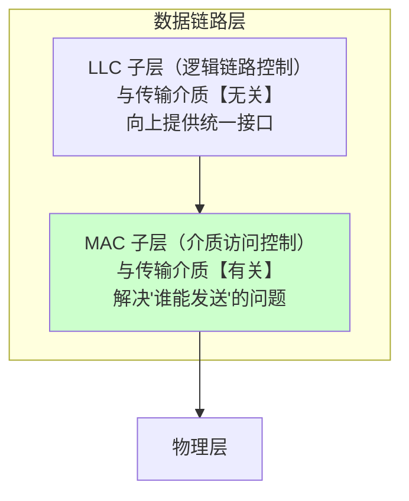

| 子层 | 职责 | 与介质的关系 |
|---|---|---|
| **LLC（逻辑链路控制）** | 向上层提供**统一接口**，屏蔽下层差异 | **无关** |
| **MAC（介质访问控制）** | **解决"谁能占用信道"**、成帧、寻址（MAC 地址） | **有关** |

> ⚠️ **LLC 子层现在基本被淘汰了**。因为以太网一统天下，不再需要"屏蔽多种局域网技术的差异"。**但 408 仍然考这个划分**——重点是记住 **MAC 与介质有关，LLC 与介质无关**。

### 1.3 三大类介质访问控制方法

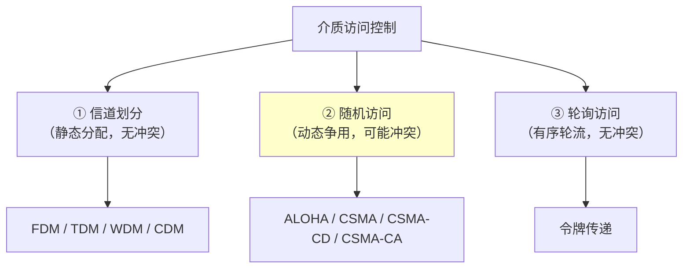

| 类别 | 思想 | 特点 |
|---|---|---|
| **信道划分** | 把信道**静态地分成若干份**，各用各的 | ✅ **无冲突**<br/>❌ **利用率低**（有人不发时也占着） |
| **随机访问** | 想发就发，**冲突了再处理** | ✅ **负载轻时效率高**<br/>❌ 负载重时冲突剧增 |
| **轮询访问** | **轮流**获得发送权 | ✅ 无冲突、**公平**<br/>❌ 有轮询开销、单点故障 |

---

## 第二章 信道划分介质访问控制

### 2.1 四种复用技术

| 技术 | 划分维度 | 说明 |
|---|---|---|
| **FDM（频分复用）** | **频率** | 各路信号占用**不同频段**，同时传输 |
| **TDM（时分复用）** | **时间** | 各路信号轮流占用**全部带宽**的一个时隙 |
| **STDM（统计时分复用）** | 时间（动态） | **按需分配时隙**，不发的不占——**利用率比 TDM 高** |
| **WDM（波分复用）** | 波长 | **光纤上的频分复用**（不同颜色的光） |
| **CDM（码分复用）** ⭐ | **码型** | 各站用**正交的码片序列**，可**同时同频**发送 |

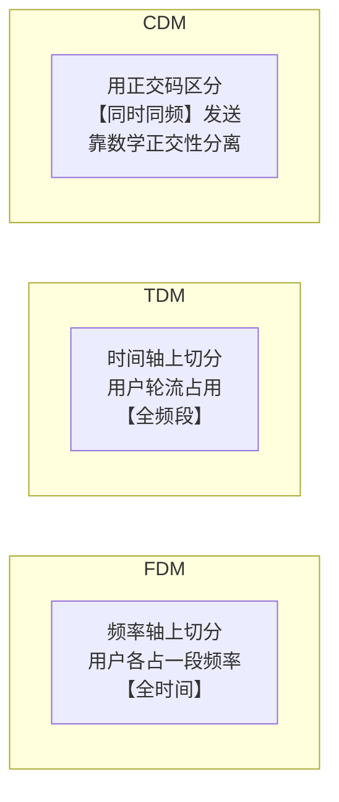

> ⚠️ **TDM vs STDM 的关键区别**：
>
> **TDM**：时隙**固定分配**，某用户没数据发时，**它的时隙也空着浪费**。
> **STDM**：**按需动态分配**，谁有数据谁用——**利用率显著更高**。

### 2.2 CDMA 码分多址（高频计算题）

**核心思想：给每个站分配一个 $m$ 位的【码片序列（chip sequence）】，各站的序列两两【正交】。**

**规则**：

```
发送比特 1 → 发送【本站的码片序列 S】
发送比特 0 → 发送【码片序列的反码 S̄】（每位取反）
不发送     → 发送全 0
```

**正交的数学定义**（用 ±1 表示，0→−1，1→+1）：

$$
\boxed{S \cdot T = \frac{1}{m}\sum_{i=1}^{m} S_i T_i = 0 \quad (\text{两个不同站的码片，规格化内积为 0})}
$$

$$
\boxed{S \cdot S = \frac{1}{m}\sum_{i=1}^{m} S_i S_i = 1 \quad (\text{自己和自己的内积为 1})}
$$

$$
\boxed{S \cdot \bar{S} = -1}
$$

**解码过程**：接收方把收到的**叠加信号**与**目标站的码片序列**做内积。

```
结果 = +1  → 该站发送了【1】
结果 = −1  → 该站发送了【0】
结果 =  0  → 该站【没有发送】
```

#### 完整例题

**站 A 的码片序列**：`(-1 -1 -1 +1 +1 -1 +1 +1)`
**站 B 的码片序列**：`(-1 -1 +1 -1 +1 +1 +1 -1)`

**问题一：验证 A 和 B 正交。**

```
A · B = (1/8)[(-1)(-1) + (-1)(-1) + (-1)(+1) + (+1)(-1)
              + (+1)(+1) + (-1)(+1) + (+1)(+1) + (+1)(-1)]
      = (1/8)[1 + 1 - 1 - 1 + 1 - 1 + 1 - 1]
      = (1/8)(0) = 0  ✅ 正交
```

**问题二：A 发送 1，B 发送 0，求信道上的叠加信号。**

```
A 发 1 → 发送 A 的码片：      (-1 -1 -1 +1 +1 -1 +1 +1)
B 发 0 → 发送 B 的【反码】：  (+1 +1 -1 +1 -1 -1 -1 +1)

叠加（逐位相加）：
   (-1 -1 -1 +1 +1 -1 +1 +1)
 + (+1 +1 -1 +1 -1 -1 -1 +1)
 ─────────────────────────────
 =  ( 0  0 -2 +2  0 -2  0 +2)
```

**问题三：接收方如何还原出 A 发送的数据？**

```
用叠加信号与 A 的码片序列做内积：

结果 = (1/8)[(0)(-1) + (0)(-1) + (-2)(-1) + (+2)(+1)
             + (0)(+1) + (-2)(-1) + (0)(+1) + (+2)(+1)]
     = (1/8)[0 + 0 + 2 + 2 + 0 + 2 + 0 + 2]
     = (1/8)(8) = 【+1】

→ A 发送的是【1】✅
```

**问题四：还原 B 发送的数据？**

```
用叠加信号与 B 的码片序列做内积：

结果 = (1/8)[(0)(-1) + (0)(-1) + (-2)(+1) + (+2)(-1)
             + (0)(+1) + (-2)(+1) + (0)(+1) + (+2)(-1)]
     = (1/8)[0 + 0 - 2 - 2 + 0 - 2 + 0 - 2]
     = (1/8)(-8) = 【−1】

→ B 发送的是【0】✅
```

> ⭐ **CDMA 的精妙之处**：**所有站【同时、同频】发送，信号在空中直接叠加**——但因为码片序列**两两正交**，接收方用不同的码片做内积，就能像"滤波器"一样把各站的数据分离出来。
>
> **正交性把"干扰"变成了"0"**——这是数学在通信中最漂亮的应用之一。

> 💡 **CDMA 是 3G 的核心技术**（CDMA2000、WCDMA），也用于 GPS。**它的优点是抗干扰强、保密性好、不需要精确的时间/频率同步**。

### 2.3 用 Go 实现 CDMA

```go
package main

import "fmt"

type Chip []int // 码片序列，用 ±1 表示

// 规格化内积
func inner(a, b Chip) float64 {
    sum := 0
    for i := range a {
        sum += a[i] * b[i]
    }
    return float64(sum) / float64(len(a))
}

// 取反码
func invert(c Chip) Chip {
    r := make(Chip, len(c))
    for i, v := range c {
        r[i] = -v
    }
    return r
}

// 叠加多个信号
func superpose(signals ...Chip) Chip {
    r := make(Chip, len(signals[0]))
    for _, s := range signals {
        for i, v := range s {
            r[i] += v
        }
    }
    return r
}

func main() {
    A := Chip{-1, -1, -1, +1, +1, -1, +1, +1}
    B := Chip{-1, -1, +1, -1, +1, +1, +1, -1}
    C := Chip{-1, +1, -1, +1, +1, +1, -1, -1}

    fmt.Printf("A·A = %.0f （自己和自己 = 1）\n", inner(A, A))
    fmt.Printf("A·B = %.0f （正交 = 0）\n", inner(A, B))
    fmt.Printf("A·Ā = %.0f （和反码 = -1）\n\n", inner(A, invert(A)))

    // A 发 1，B 发 0，C 不发
    sig := superpose(A, invert(B))
    fmt.Println("信道上的叠加信号:", sig)

    fmt.Printf("\n解码结果：\n")
    for name, chip := range map[string]Chip{"A": A, "B": B, "C": C} {
        v := inner(sig, chip)
        var msg string
        switch v {
        case 1:
            msg = "发送了 1"
        case -1:
            msg = "发送了 0"
        case 0:
            msg = "未发送"
        }
        fmt.Printf("  站 %s: 内积 = %+.0f → %s\n", name, v, msg)
    }
}
```

**输出**：

```
A·A = 1 （自己和自己 = 1）
A·B = 0 （正交 = 0）
A·Ā = -1 （和反码 = -1）

信道上的叠加信号: [0 0 -2 2 0 -2 0 2]

解码结果：
  站 A: 内积 = +1 → 发送了 1
  站 B: 内积 = -1 → 发送了 0
  站 C: 内积 = +0 → 未发送
```

---

## 第三章 随机访问介质访问控制（核心考点）

### 3.1 演进路线

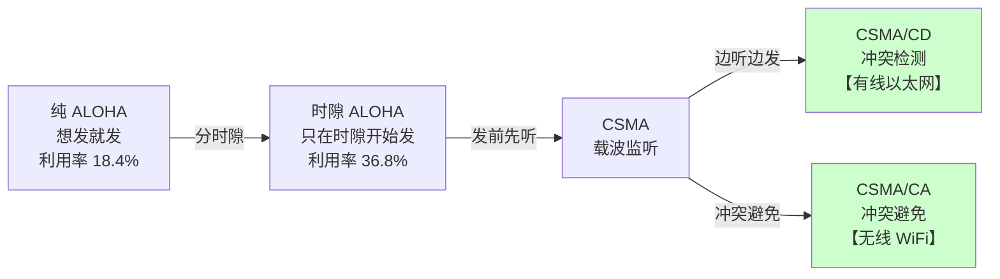

### 3.2 ALOHA

| 类型 | 规则 | 最大信道利用率 |
|---|---|---|
| **纯 ALOHA** | **想发就发**，冲突了随机等待后重发 | **18.4%**（$1/2e$） |
| **时隙 ALOHA** | 时间分成时隙，**只能在时隙开始时发送** | **36.8%**（$1/e$） |

> 💡 **时隙 ALOHA 的利用率翻倍**——因为它把"冲突窗口"从 2 个帧时缩短到 1 个帧时。

### 3.3 CSMA（载波监听多路访问）

**"发送前先听信道"**——但听到忙时怎么办？三种策略：

| 类型 | 规则 | 特点 |
|---|---|---|
| **1-坚持 CSMA** | 信道忙 → **持续监听**，一空闲**立即发送**（概率 1） | ✅ 及时<br/>❌ **冲突概率大**（多个站同时在等，一空闲就一起发） |
| **非坚持 CSMA** | 信道忙 → **放弃监听**，随机等待一段时间后重试 | ✅ 冲突少<br/>❌ **可能信道空闲了也没人发**，延迟大 |
| **p-坚持 CSMA** | 信道空闲 → **以概率 p 发送**，以 (1−p) 推迟到下一时隙 | **折中**方案 |

> ⭐ **三者的取舍**：
>
> | | 1-坚持 | 非坚持 | p-坚持 |
> |---|---|---|---|
> | **信道利用率** | 中（冲突多） | 中（空闲浪费） | **最高** |
> | **延迟** | **最小** | **最大** | 中 |
> | **冲突概率** | **最大** | **最小** | 中 |

### 3.4 CSMA/CD（带冲突检测）⭐ —— 有线以太网

**16 字口诀**：

$$
\boxed{\textbf{先听后发，边听边发，冲突停发，随机重发}}
$$

| 步骤 | 说明 |
|---|---|
| **① 先听后发** | 发送前监听信道，忙则等待 |
| **② 边听边发** | **发送过程中持续监听**——这是"CD"的核心 |
| **③ 冲突停发** | 检测到冲突**立即停止发送**，并发一个**强化冲突的干扰信号（jam）** |
| **④ 随机重发** | 用**二进制指数退避**算法等待随机时间后重试 |

#### 争用期（冲突窗口）

$$
\boxed{\text{争用期} = 2\tau \quad (\tau = \text{单程端到端传播时延})}
$$

**含义**：**一个站发送后，最多经过 $2\tau$ 就能确定是否发生了冲突**。

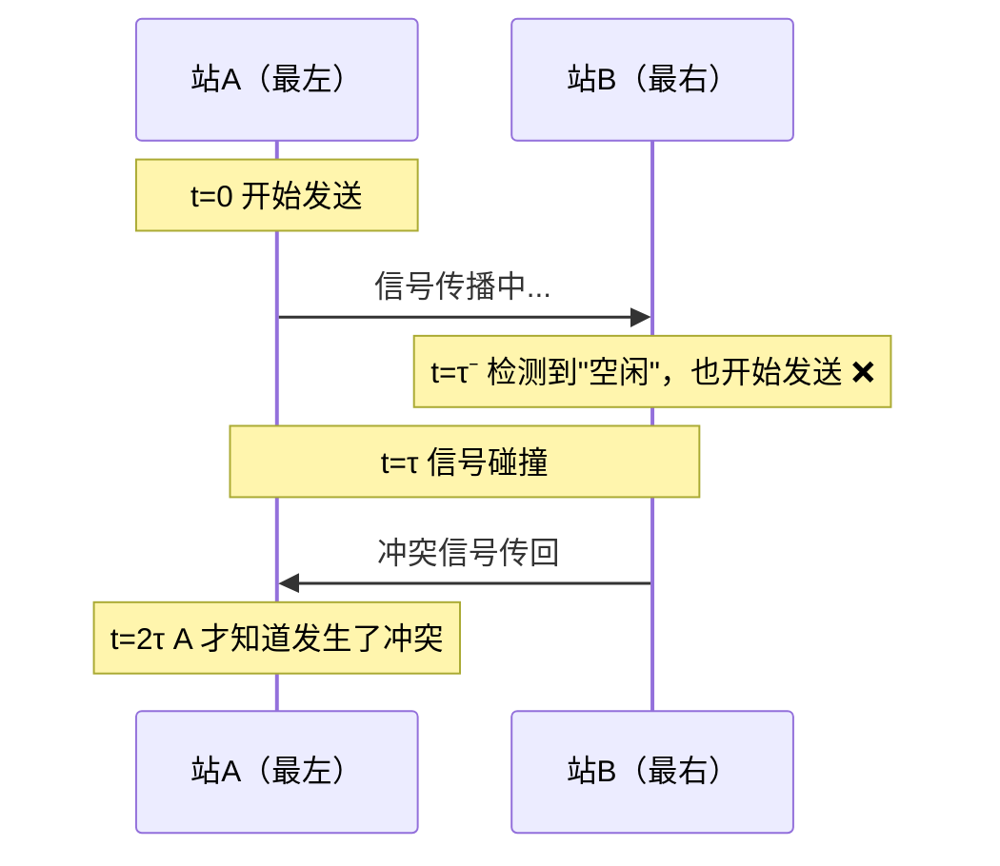

> ⚠️ **以太网的争用期规定为 51.2 μs**（对应 10 Mb/s 下的 512 bit）。

#### 最小帧长（必考公式）

$$
\boxed{L_{\min} = 2\tau \times C}
$$

- $\tau$：单程传播时延
- $C$：数据率

**为什么必须这样**：

```
若帧太短（发送时间 < 2τ）：
  站 A 发完了最后一个比特，认为"发送成功"
       ↓
  但冲突信号还在路上，此时才传回来
       ↓
  A 已经不再监听了 → 【不知道冲突发生】❌
       ↓
  数据丢失且不会重传
```

**以太网的具体值**：

| 参数 | 值 |
|---|---|
| 争用期 | **51.2 μs** |
| 数据率 | 10 Mb/s |
| **最小帧长** | $51.2\ \mu s \times 10\ \text{Mb/s} = 512\ \text{bit} = $ **64 字节** |

> ⚠️ **凡是长度小于 64 字节的帧，都是【无效帧】**（由冲突导致的中断传输），接收方**直接丢弃**。
>
> 发送方若数据不足 46 字节（64 − 18 字节首尾），必须**填充（padding）**到 46 字节。

#### 二进制指数退避算法（必考）

**检测到冲突后，退避多久再重发？**

```
① 确定基本退避时间 = 【争用期 2τ】

② 设已经重传了 n 次，取 k = min(n, 10)

③ 从集合 {0, 1, 2, ..., 2ᵏ − 1} 中【随机】取一个数 r

④ 退避时间 = r × 2τ

⑤ 若重传【16 次】仍失败 → 丢弃该帧，向高层报错
```

**退避范围随重传次数的变化**：

| 重传次数 n | k = min(n,10) | 随机数取值范围 | 可能的最大退避 |
|---|---|---|---|
| 1 | 1 | {0, 1} | 1 × 2τ |
| 2 | 2 | {0,1,2,3} | 3 × 2τ |
| 3 | 3 | {0,...,7} | 7 × 2τ |
| ... | ... | ... | ... |
| **10** | **10** | **{0,...,1023}** | **1023 × 2τ** |
| 11~15 | **10（封顶）** | {0,...,1023} | 1023 × 2τ |
| **16** | —— | **放弃，丢弃帧** | —— |

> ⭐ **为什么用"指数"退避？**
>
> **冲突次数越多，说明网络越拥挤 → 退避范围应该越大，避免再次冲突。**
>
> 这是一个**自适应**机制：轻载时退避短（响应快），重载时退避长（减少冲突）。**TCP 的超时重传也用同样的指数退避思想。**

> ⚠️ **两个易错点**：
> 1. **k 的上限是 10**（不是 16）——退避范围最大 $2^{10}-1 = 1023$
> 2. **重传上限是 16 次**（不是 10 次）——超过就丢帧

### 3.5 用 Go 模拟二进制指数退避

```go
package main

import (
    "fmt"
    "math/rand"
)

// 模拟一次帧发送，返回重传次数（-1 表示放弃）
func transmit(collisionProb float64) int {
    for n := 1; n <= 16; n++ {
        if rand.Float64() >= collisionProb {
            return n - 1 // 成功，返回之前失败的次数
        }
        if n == 16 {
            return -1 // 16 次都冲突 → 放弃
        }
        k := n
        if k > 10 {
            k = 10 // ★ k 最大为 10
        }
        r := rand.Intn(1 << uint(k)) // 从 {0, ..., 2^k - 1} 随机取
        _ = r                        // 退避时间 = r × 2τ
    }
    return -1
}

func main() {
    fmt.Printf("%-12s %-12s %-12s %s\n", "冲突概率", "平均重传次数", "放弃率", "说明")
    for _, p := range []float64{0.1, 0.3, 0.5, 0.7, 0.9} {
        var totalRetry, dropped int
        const trials = 100000
        for i := 0; i < trials; i++ {
            r := transmit(p)
            if r < 0 {
                dropped++
            } else {
                totalRetry += r
            }
        }
        note := "正常"
        if p >= 0.7 {
            note = "★ 网络严重拥塞"
        }
        fmt.Printf("%-12.0f%% %-12.2f %-12.4f%% %s\n",
            p*100, float64(totalRetry)/float64(trials-dropped),
            float64(dropped)/trials*100, note)
    }

    // 展示退避范围的增长
    fmt.Println("\n=== 退避范围随重传次数增长 ===")
    fmt.Printf("%-10s %-8s %s\n", "重传次数n", "k", "随机数范围")
    for _, n := range []int{1, 2, 3, 5, 10, 11, 15} {
        k := n
        if k > 10 {
            k = 10
        }
        fmt.Printf("%-10d %-8d {0, ..., %d}\n", n, k, (1<<uint(k))-1)
    }
}
```

**典型输出**：

```
冲突概率     平均重传次数   放弃率       说明
10        % 0.11         0.0000     % 正常
30        % 0.43         0.0000     % 正常
50        % 1.00         0.0010     % 正常
70        % 2.33         0.3400     % ★ 网络严重拥塞
90        % 8.99         18.5300    % ★ 网络严重拥塞

=== 退避范围随重传次数增长 ===
重传次数n   k        随机数范围
1          1        {0, ..., 1}
2          2        {0, ..., 3}
3          3        {0, ..., 7}
5          5        {0, ..., 31}
10         10       {0, ..., 1023}
11         10       {0, ..., 1023}    ← k 封顶在 10
15         10       {0, ..., 1023}
```

> ⚠️ **冲突概率 90% 时，18.5% 的帧被直接丢弃**——这就是共享式以太网在重载下的崩溃点。**这正是集线器被交换机取代的根本原因**（交换机每个端口一个冲突域，从根源上消除了竞争）。

### 3.6 CSMA/CA（带冲突避免）—— 无线 WiFi

**问题：无线网络为什么不能用 CSMA/CD？**

| 原因 | 说明 |
|---|---|
| **① 无法"边听边发"** | 无线网卡是**半双工**的——**发送时无法接收**（自己的信号功率远大于收到的信号，会淹没一切） |
| **② 隐蔽站问题** | A 和 C 都能听到 B，但**A 和 C 互相听不到** → 它们会同时向 B 发送，在 B 处冲突 |
| **③ 暴露站问题** | B 在向 A 发送，C 听到了就不敢发 → 但 C 其实可以安全地向 D 发送 |

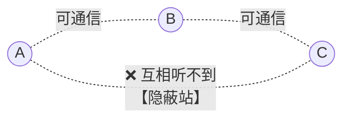

**CSMA/CA 的解法**：

| 机制 | 说明 |
|---|---|
| **① 冲突避免（而非检测）** | 用**帧间间隔（IFS）+ 退避**，在**发送前**就尽量错开 |
| **② 必须有 ACK** | 收到帧后**必须回确认**，没收到 ACK 就重传（因为无法检测冲突） |
| **③ RTS/CTS 握手（可选）** | 发送前先发**请求发送 RTS**，对方回**允许发送 CTS**——**解决隐蔽站问题** |

**RTS/CTS 如何解决隐蔽站**：

```
A 想给 B 发数据：
  ① A → B：RTS（请求发送，含预计占用时长）
  ② B → 所有邻居：CTS（允许发送，含时长）
       ↓
  ★ C 虽然听不到 A，但【能听到 B 的 CTS】
       ↓
  ③ C 得知"信道将被占用 T 时长" → 在这段时间内【不发送】✅
       ↓
  ④ A → B：数据
  ⑤ B → A：ACK
```

**CSMA/CD vs CSMA/CA 对比**：

| 维度 | **CSMA/CD** | **CSMA/CA** |
|---|---|---|
| **应用** | **有线以太网** | **无线 WiFi（802.11）** |
| **核心** | 冲突**检测**（发生后处理） | 冲突**避免**（发生前预防） |
| **能否边听边发** | ✅ **能**（全双工线缆） | ❌ **不能**（半双工无线） |
| **是否需要 ACK** | ❌ **不需要**（检测到冲突即知） | ✅ **必须**（无法检测冲突） |
| **是否有 RTS/CTS** | ❌ | ✅（可选，解决隐蔽站） |
| **退避时机** | **检测到冲突后**退避 | **发送前就先退避** |

> ⭐ **一句话区别**：**CD 是"撞了再说"，CA 是"提前躲开"。**
>
> **根本原因**：有线网能"边发边听"，所以可以撞了再处理；无线网做不到，只能事前预防 + 事后确认。

### 3.7 轮询访问：令牌传递

**令牌环网（Token Ring）**：一个特殊的**令牌帧**在环上循环，**拿到令牌的站才能发送**。

| 优点 | 缺点 |
|---|---|
| ✅ **无冲突** | ❌ **令牌维护开销**（丢失/重复要处理） |
| ✅ **公平**，有确定的最大等待时间 | ❌ **单点故障**（一个站坏了环就断） |
| ✅ 重载下**性能优于 CSMA/CD** | ❌ 轻载下有**不必要的等待** |

> 💡 **令牌环已被淘汰**——因为交换式以太网既消除了冲突，又没有令牌维护的复杂性。但**"令牌"的思想在现代系统中广泛存在**（分布式锁、限流的令牌桶算法）。

---

## 第四章 以太网

### 4.1 MAC 帧格式（IEEE 802.3）

```
┌──────────┬──────┬────────┬────────┬──────┬──────────────┬──────┐
│ 前导码    │ SFD  │ 目的MAC │ 源MAC   │ 类型 │   数据        │ FCS  │
│  7 B     │ 1 B  │  6 B   │  6 B   │ 2 B  │  46~1500 B   │ 4 B  │
└──────────┴──────┴────────┴────────┴──────┴──────────────┴──────┘
 └────── 物理层加的 ──────┘└──────── MAC 帧（64~1518 B）────────┘
```

| 字段 | 长度 | 作用 |
|---|---|---|
| **前导码** | 7 B | `10101010`×7，用于**同步时钟** |
| **SFD（帧开始定界符）** | 1 B | `10101011`，标志帧的开始 |
| **目的 MAC 地址** | **6 B** | 48 位物理地址 |
| **源 MAC 地址** | **6 B** | |
| **类型/长度** | 2 B | 指明上层协议（0x0800 = IPv4，0x0806 = ARP） |
| **数据** | **46 ~ 1500 B** | 不足 46 字节要**填充** |
| **FCS** | **4 B** | **CRC-32 校验** |

**关键数字**：

$$
\text{最小帧长} = 6 + 6 + 2 + 46 + 4 = \boxed{64\ \text{字节}}
$$

$$
\text{最大帧长} = 6 + 6 + 2 + 1500 + 4 = \boxed{1518\ \text{字节}}
$$

$$
\textbf{MTU} = 1500\ \text{字节}\ (\text{数据部分的最大值})
$$

> ⚠️ **前导码和 SFD 不算在 MAC 帧长度内**（它们由物理层添加）。所以"最小帧长 64 字节"指的是**从目的 MAC 到 FCS**。

### 4.2 MAC 地址

```
48 位 = 6 字节，通常写成 00:1A:2B:3C:4D:5E

┌──────────────┬──────────────┐
│  OUI（厂商）  │  厂商自定义   │
│   24 位      │    24 位     │
└──────────────┴──────────────┘
```

**第一字节的最低位**：

| 值 | 含义 |
|---|---|
| **0** | **单播地址**（发给一个站） |
| **1** | **多播地址**（发给一组站） |
| 全 1（`FF:FF:FF:FF:FF:FF`） | **广播地址** |

### 4.3 以太网的服务特点

> ⚠️ **以太网提供的是【无确认的无连接服务】**：
>
> - **不建立连接**，直接发
> - **不确认**：收到帧只做 CRC 校验，**出错就丢弃，不通知发送方，不重传**
> - **可靠性交给上层（TCP）**
>
> 这是 408 的高频考点。

---

## 第五章 链路层设备

### 5.1 冲突域与广播域（核心概念）

| 概念 | 定义 |
|---|---|
| **冲突域** | **同一时刻只能有一个站发送**的范围（会发生冲突的区域） |
| **广播域** | **广播帧能到达**的范围 |

**各设备的隔离能力**：

| 设备 | 层次 | 隔离冲突域 | 隔离广播域 |
|---|---|---|---|
| **中继器 / 集线器** | 物理层 | ❌ | ❌ |
| **网桥 / 交换机** | 数据链路层 | ✅ **能** | ❌ **不能** |
| **路由器** | 网络层 | ✅ 能 | ✅ **能** |

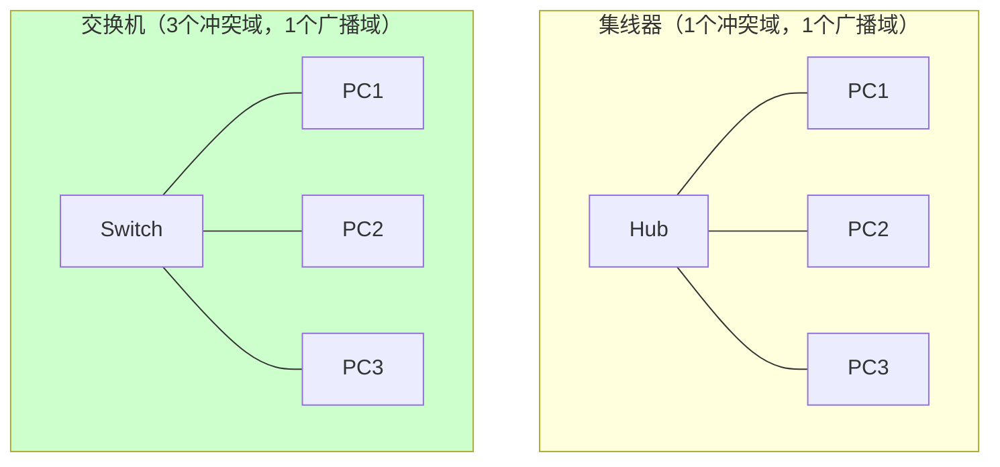

> ⭐ **交换机的核心价值：每个端口是一个独立的冲突域。**
>
> ```
> 集线器：N 个端口共享一个冲突域 → 总带宽被 N 个站【平分】
> 交换机：N 个端口 = N 个冲突域 → 每个站【独享】端口带宽
>         且支持【全双工】→ 根本不会冲突 → CSMA/CD 失效（也不需要）
> ```
>
> **这就是为什么现代以太网基本用不到 CSMA/CD 了**——全双工交换式以太网从物理上消除了冲突。

**计算冲突域和广播域的数量**（408 常考）：

```
规则：
  ① 【路由器】的每个接口 → 一个独立的广播域
  ② 【交换机/网桥】的每个端口 → 一个独立的冲突域
  ③ 【集线器】不隔离任何东西，整个集线器及其下连设备算【一个】冲突域
```

### 5.2 交换机的自学习（必考）

**交换机通过观察经过的帧，自动建立"MAC 地址 → 端口"的映射表。**

**算法**：

```
收到一个帧：
① 【学习】：把【源 MAC 地址】和【进入端口】记入转发表
② 【转发】：查表找【目的 MAC】
     ├─ 表中有 → 【只转发到对应端口】（精确转发）
     ├─ 表中没有 → 【向除来源外的所有端口广播】（泛洪 flooding）
     └─ 目的端口 = 来源端口 → 【丢弃】（同一网段，不用转发）
```

#### 完整例题

**交换机 4 个端口，初始转发表为空。**

```
初始转发表：空

【事件1】A（端口1）→ B
  ① 学习：记录 A → 端口1
  ② 查表：B 不在表中 → 【泛洪】到端口 2,3,4
  转发表：{A: 1}

【事件2】B（端口2）→ A
  ① 学习：记录 B → 端口2
  ② 查表：A 在表中（端口1）→ 【只转发到端口1】✅
  转发表：{A: 1, B: 2}

【事件3】C（端口3）→ A
  ① 学习：记录 C → 端口3
  ② 查表：A 在端口1 → 只转发到端口1
  转发表：{A: 1, B: 2, C: 3}

【事件4】A（端口1）→ C
  ① 学习：A → 端口1（已存在，刷新时间戳）
  ② 查表：C 在端口3 → 只转发到端口3
  转发表：{A: 1, B: 2, C: 3}
```

> 💡 **转发表的表项有【老化时间】**（通常 300 秒）。超时未更新的表项会被删除——这样设备换端口后能自动适应。

### 5.3 VLAN（虚拟局域网）

**问题**：交换机不隔离广播域，一个大型交换网络中，**一个广播帧会传遍所有主机**——广播风暴、安全隐患、管理困难。

**VLAN 的解法**：**在一台物理交换机上，用软件划分出多个逻辑上独立的广播域。**

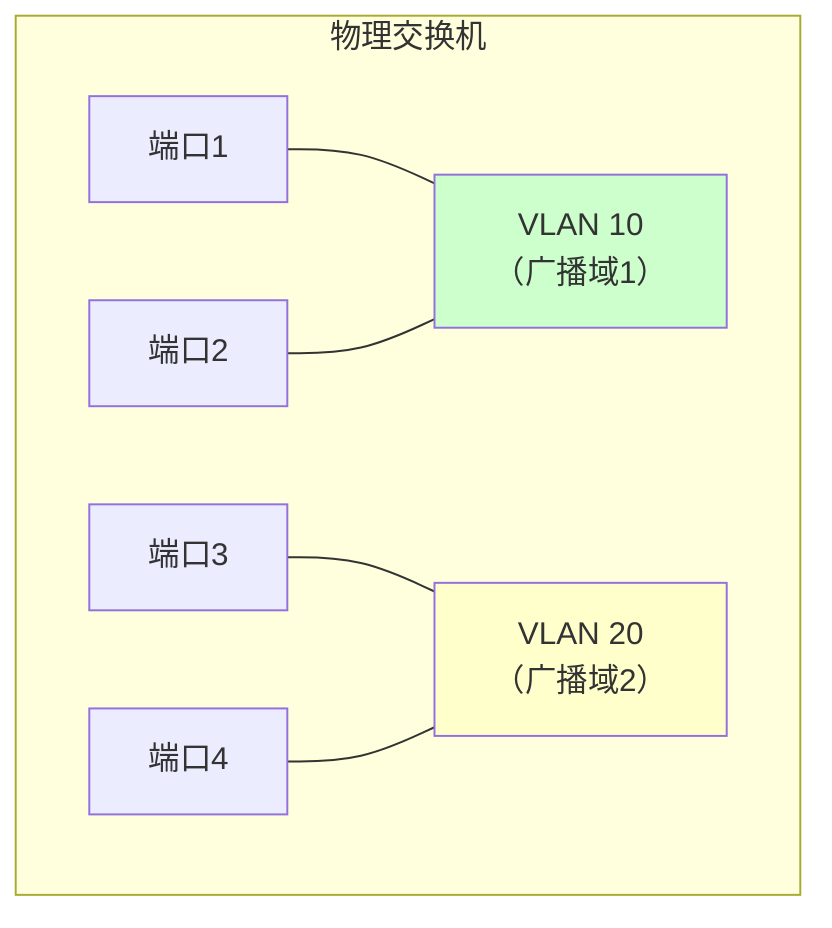

**关键性质**：

| 性质 | 说明 |
|---|---|
| **同一 VLAN 内** | 可以直接通信（二层） |
| **不同 VLAN 之间** | **必须经过路由器（或三层交换机）** ⭐ |
| **广播隔离** | VLAN 内的广播**不会**传到其他 VLAN |

**802.1Q 标签**：在以太网帧中插入 **4 字节的 VLAN 标签**（含 12 位 VLAN ID，最多 4094 个 VLAN）。

```
┌────────┬────────┬─────────────┬──────┬──────┬──────┐
│ 目的MAC │ 源MAC  │ 802.1Q 标签 │ 类型 │ 数据 │ FCS  │
│  6 B   │  6 B   │    4 B      │ 2 B  │      │ 4 B  │
└────────┴────────┴─────────────┴──────┴──────┴──────┘
                    ↑ 插入的 VLAN 标签
```

> ⭐ **VLAN 的价值**：
> - **隔离广播域**，减少广播风暴
> - **提高安全性**（不同部门的流量隔离）
> - **灵活组网**（物理位置不同的主机可以在同一 VLAN）

---

## 第六章 408 高频考点与陷阱清单

### 6.1 考点分布

本章通常是 **2 道选择题 + 常见计算题**。

最常考：

1. **CSMA/CD 的最小帧长与争用期计算**（必考）
2. **CDMA 码片序列的编解码**
3. 二进制指数退避
4. 冲突域与广播域的数量计算
5. CSMA/CD 与 CSMA/CA 的区别

### 6.2 十六个陷阱

**陷阱 1：MAC 子层与传输介质无关**

**错，反了**。**MAC 与介质有关**（不同介质的访问控制方式不同）；**LLC 与介质无关**。

**陷阱 2：TDM 的信道利用率比 STDM 高**

**错，反了**。**STDM（统计时分复用）按需分配时隙**，不发数据的用户不占时隙，**利用率更高**。

**陷阱 3：CDMA 中各站必须使用不同的频率**

**错**。CDMA 的精髓正是**各站同时、同频发送**，靠**正交的码片序列**分离。

**陷阱 4：CDMA 码片序列的内积规格化后，自己和自己是 0**

**错**。$S \cdot S = 1$，$S \cdot T = 0$（不同站），$S \cdot \bar{S} = -1$。

**陷阱 5：纯 ALOHA 的信道利用率比时隙 ALOHA 高**

**错**。纯 ALOHA **18.4%**，时隙 ALOHA **36.8%**（翻倍）。

**陷阱 6：1-坚持 CSMA 的冲突概率最小**

**错**。**1-坚持冲突概率最大**（所有等待的站会在信道一空闲时同时发送）。**非坚持**冲突最少。

**陷阱 7：CSMA/CD 的争用期是 τ**

**错，是 $2\tau$**（信号往返一趟的时间）。

**陷阱 8：最小帧长与传播时延无关**

**大错**。$L_{\min} = 2\tau \times C$，**与传播时延和数据率都成正比**。

**陷阱 9：二进制指数退避中 k 的最大值是 16**

**错，k 最大是 10**（$k = \min(n, 10)$）。**16 是重传次数的上限**。

**陷阱 10：无线网络也用 CSMA/CD**

**错**。无线网卡**半双工，无法边听边发**，所以用 **CSMA/CA**。

**陷阱 11：CSMA/CA 不需要确认帧**

**错，必须要 ACK**。因为无法检测冲突，只能靠"是否收到 ACK"判断成功与否。

**陷阱 12：RTS/CTS 解决的是暴露站问题**

**错，主要解决【隐蔽站】问题**。

**陷阱 13：交换机能隔离广播域**

**错**。**交换机只隔离冲突域**（每个端口一个冲突域），**不隔离广播域**。**路由器**才能隔离广播域。

**陷阱 14：集线器的每个端口是一个冲突域**

**错**。**集线器不隔离任何东西**——整个集线器及其下连设备是**一个**冲突域。**交换机**才是每端口一个冲突域。

**陷阱 15：以太网提供可靠传输**

**错**。以太网是**无确认的无连接服务**——只做 CRC 检错，**出错就丢弃，不重传**。

**陷阱 16：不同 VLAN 之间可以直接通过交换机通信**

**错**。**不同 VLAN 之间必须经过路由器（或三层交换机）**——VLAN 的本质就是隔离广播域。

### 6.3 速查卡

```
【IEEE 802 分层】
LLC 子层：与介质【无关】，向上提供统一接口
MAC 子层：与介质【有关】，解决"谁能发"

【三类访问控制】
信道划分：FDM/TDM/STDM/WDM/CDM —— 无冲突但利用率低
随机访问：ALOHA/CSMA/CD/CA —— 轻载高效
轮询访问：令牌传递 —— 无冲突、公平

【CDMA】
S·S = 1    S·T = 0（不同站）   S·S̄ = −1
发1→发码片S，发0→发反码S̄，不发→全0
解码：叠加信号 · 目标码片 → +1(发1) / −1(发0) / 0(未发)

【ALOHA 利用率】
纯 ALOHA：18.4%（1/2e）
时隙 ALOHA：36.8%（1/e）

【CSMA 三种坚持】
1-坚持：延迟最小，【冲突最多】
非坚持：冲突最少，【延迟最大】
p-坚持：折中

【CSMA/CD】★★★
口诀：先听后发、边听边发、冲突停发、随机重发
争用期 = 【2τ】
最小帧长 = 【2τ × C】= 以太网 64 字节（512 bit）
二进制指数退避：k = min(n, 10)，从 {0,...,2^k−1} 随机取 r
                退避 = r × 2τ；重传【16 次】失败则丢弃

【CSMA/CA】（无线）
原因：无线【半双工】，无法边听边发；有【隐蔽站】问题
特点：冲突【避免】、【必须 ACK】、RTS/CTS 解决隐蔽站
      发送前就先退避

【以太网帧】
前导码7B + SFD 1B ┃ 目的MAC 6B + 源MAC 6B + 类型2B + 数据46~1500B + FCS 4B
最小帧长 64 B，最大 1518 B，【MTU = 1500 B】

【设备与域】
集线器/中继器：不隔离任何域
交换机/网桥：隔离【冲突域】（每端口一个），不隔离广播域
路由器：【两个都隔离】（每接口一个广播域）

【VLAN】
在一台交换机上划分多个【广播域】
不同 VLAN 之间【必须经过路由器】
802.1Q 标签 4 字节，VLAN ID 12 位（最多 4094 个）
```

---

## 第七章 Go ↔ C 对照

| 场景 | C | Go | 说明 |
|---|---|---|---|
| 获取网卡 MAC | `ioctl(SIOCGIFHWADDR)` | **`iface.HardwareAddr`** | |
| 解析 MAC 字符串 | 手写 | `net.ParseMAC("00:1a:2b:3c:4d:5e")` | |
| 获取 MTU | `ioctl(SIOCGIFMTU)` | `iface.MTU` | |
| 原始套接字（收发链路层帧） | `socket(AF_PACKET, SOCK_RAW, ...)` | `syscall.Socket(AF_PACKET, ...)` | **需要 root** |
| 抓包解析 | libpcap | `github.com/google/gopacket` | |
| 判断多播/广播地址 | 手写位运算 | `addr[0]&1 != 0` | 第一字节最低位 |

```go
package main

import (
    "fmt"
    "net"
)

func main() {
    ifaces, _ := net.Interfaces()
    for _, i := range ifaces {
        if i.HardwareAddr == nil || i.Flags&net.FlagUp == 0 {
            continue
        }
        mac := i.HardwareAddr
        kind := "单播"
        if mac[0]&0x01 != 0 { // ★ 第一字节最低位 = 1 表示多播
            kind = "多播"
        }
        fmt.Printf("%-10s MAC=%s  OUI=%02X:%02X:%02X  %s  MTU=%d\n",
            i.Name, mac, mac[0], mac[1], mac[2], kind, i.MTU)
    }

    // 解析并检查广播地址
    bcast, _ := net.ParseMAC("ff:ff:ff:ff:ff:ff")
    isBroadcast := true
    for _, b := range bcast {
        if b != 0xff {
            isBroadcast = false
        }
    }
    fmt.Printf("\nff:ff:ff:ff:ff:ff 是广播地址: %v\n", isBroadcast)
}
```

**典型输出**：

```
eth0       MAC=02:42:ac:11:00:02  OUI=02:42:AC  单播  MTU=1500
docker0    MAC=02:42:8f:3c:1a:be  OUI=02:42:8F  单播  MTU=1500

ff:ff:ff:ff:ff:ff 是广播地址: true
```

> 💡 **`02:42:...` 开头的 MAC 是 Docker 自动生成的**——第一字节 `0x02` 的**第二低位是 1**，表示"**本地管理地址（Locally Administered）**"，不是厂商分配的全球唯一地址。这也是判断"虚拟网卡"的一个线索。

---

## 第八章 练习题

### 选择题

**1.** IEEE 802 标准中，与传输介质**有关**的子层是：
A. LLC 子层　B. MAC 子层　C. 网络层　D. 两个子层都无关

**2.** 下列复用技术中，各用户可以**同时使用全部带宽**的是：
A. FDM　B. TDM　C. WDM　D. CDM

**3.** 在 CDMA 中，若站 A 的码片序列与站 B 的码片序列做规格化内积，结果应为：
A. 1　B. −1　C. 0　D. 不确定

**4.** 纯 ALOHA 和时隙 ALOHA 的最大信道利用率分别约为：
A. 18.4%, 36.8%
B. 36.8%, 18.4%
C. 18.4%, 18.4%
D. 50%, 100%

**5.** 下列 CSMA 协议中，**冲突概率最大**的是：
A. 1-坚持 CSMA　B. 非坚持 CSMA　C. p-坚持 CSMA　D. 三者相同

**6.** CSMA/CD 中的"争用期"是指：
A. τ　B. 2τ　C. 4τ　D. τ/2

**7.** 以太网规定最小帧长为 64 字节，其主要目的是：
A. 提高传输效率
B. 保证发送站在发送完毕前能检测到冲突
C. 减少帧首部开销
D. 兼容旧设备

**8.** 二进制指数退避算法中，参数 k 的取值为：
A. k = n　B. k = min(n, 10)　C. k = min(n, 16)　D. k = 16

**9.** 无线局域网采用 CSMA/CA 而非 CSMA/CD 的主要原因是：
A. 无线速率低
B. 无线网卡无法在发送时同时检测信道（半双工）
C. 无线传输距离远
D. 无线设备成本高

**10.** RTS/CTS 机制主要解决的问题是：
A. 暴露站问题　B. 隐蔽站问题　C. 冲突检测问题　D. 功耗问题

**11.** 一台 8 端口的交换机连接 8 台主机，则冲突域和广播域的数量分别是：
A. 1, 1　B. 8, 1　C. 1, 8　D. 8, 8

**12.** 关于 VLAN，**正确**的是：
A. 同一 VLAN 内的主机必须在同一物理位置
B. 不同 VLAN 之间可以通过二层交换机直接通信
C. VLAN 用于隔离广播域
D. 一台交换机只能配置一个 VLAN

### 应用题

**13.** 某 CSMA/CD 网络的数据率为 **100 Mb/s**，信号传播速率为 **2×10⁸ m/s**，最小帧长为 **64 字节**。

（1）求该网络的争用期。
（2）求最大网段长度（端到端）。
（3）若数据率提高到 **1 Gb/s**，保持最小帧长不变，最大网段长度变为多少？
（4）说明千兆以太网是如何解决这个问题的。

**14.** 三个站 A、B、C 使用 CDMA，码片序列长度为 8：

- A: `(-1 -1 -1 +1 +1 -1 +1 +1)`
- B: `(-1 -1 +1 -1 +1 +1 +1 -1)`
- C: `(-1 +1 -1 +1 +1 +1 -1 -1)`

（1）验证 A、B、C 三者两两正交。
（2）若 A 发送 1，B 发送 0，C 不发送，求信道上的叠加信号。
（3）接收方分别用 A、B、C 的码片序列解码，写出计算过程和结果。
（4）若接收到的叠加信号为 `(0 -2 0 0 0 -2 +2 +2)`，判断三个站各发送了什么。

**15.** 某以太网使用 CSMA/CD，某站在第 **1、2、3** 次发送时都发生了冲突。

（1）写出每次退避时，随机数 r 的取值范围。
（2）若三次的随机数分别取到最大值，且争用期 2τ = 51.2 μs，求三次退避的总时间。
（3）若该站一直冲突，最多重传多少次后放弃？此时 k 的值是多少？

**16.** 某交换机有 4 个端口，分别连接主机 A（端口1）、B（端口2）、C（端口3）、D（端口4）。初始转发表为空。依次发生下列通信：

```
① A → D
② D → A
③ B → C
④ C → B
⑤ A → B
```

（1）写出每一步之后的转发表内容。
（2）指出每一步中交换机采取的动作（泛洪 / 精确转发 / 丢弃）。

**17.** 详细对比 **CSMA/CD** 与 **CSMA/CA**：

（1）从六个维度列表对比。
（2）解释无线网络为什么无法使用 CSMA/CD。
（3）说明什么是隐蔽站和暴露站问题，RTS/CTS 如何解决隐蔽站问题。

### 答案与解析

<details>
<summary>点击展开</summary>

**1. B**

| 子层 | 与介质的关系 | 职责 |
|---|---|---|
| **LLC（逻辑链路控制）** | **无关** | 向上层提供统一接口，屏蔽下层差异 |
| **MAC（介质访问控制）** | **有关** ⭐ | 解决"谁能占用信道"，不同介质方式不同 |

**2. D**

| 技术 | 用户占用 |
|---|---|
| FDM | 一段**频率**，全部时间 |
| TDM | 全部频率，一段**时间** |
| WDM | 一段**波长**（光的频分） |
| **CDM** | **全部频率 + 全部时间**（靠正交码分离）⭐ |

**CDMA 的独特之处正是"同时同频"**，这是它与其他复用方式的本质区别。

**3. C**

$$
S \cdot T = 0 \quad (\text{不同站，正交})
$$
$$
S \cdot S = 1 \quad (\text{自己})
$$
$$
S \cdot \bar{S} = -1 \quad (\text{自己的反码})
$$

**4. A**

| 协议 | 最大信道利用率 |
|---|---|
| **纯 ALOHA** | $\frac{1}{2e} \approx$ **18.4%** |
| **时隙 ALOHA** | $\frac{1}{e} \approx$ **36.8%** |

时隙化把"冲突窗口"从 2 个帧时缩短到 1 个帧时，利用率**翻倍**。

**5. A**

| 协议 | 冲突概率 | 延迟 |
|---|---|---|
| **1-坚持** | **最大** ⚠️ | 最小 |
| **非坚持** | **最小** | 最大 |
| p-坚持 | 中 | 中 |

**1-坚持的问题**：所有等待的站都在"持续监听"，一旦信道空闲，**它们会同时发送** → 必然冲突。

**6. B**

$$
\text{争用期} = 2\tau
$$

含义：**信号往返一趟的时间**——发送方最多经过 $2\tau$ 就能确定是否冲突。

**7. B**

$$
L_{\min} = 2\tau \times C
$$

**目的：保证发送站在发送完最后一个比特之前，能够检测到冲突。**

若帧太短，站发完就不再监听了，冲突信号传回来时**它已经认为发送成功**——数据丢失且不会重传。

**8. B**

$$
k = \min(n, 10)
$$

随机数从 $\{0, 1, \ldots, 2^k - 1\}$ 中取。

> ⚠️ **k 封顶在 10**（最大范围 $2^{10}-1 = 1023$）；**16 是重传次数上限**，别混。

**9. B**

**无线网卡是半双工的——发送时无法接收**。

原因：自己发出的信号功率**远大于**从远处收到的信号（差几个数量级），**会完全淹没接收电路**，所以物理上无法"边听边发"。

既然检测不到冲突，就只能：
- 事前**避免**（CSMA/CA）
- 事后**确认**（必须有 ACK）

**10. B**

**RTS/CTS 主要解决【隐蔽站】问题**：

```
A 和 C 互相听不到，但都能听到 B
     ↓
A 给 B 发数据时，C 【听不到】，以为信道空闲，也给 B 发 → 在 B 处冲突 ❌

RTS/CTS 的解法：
  A → B: RTS
  B → 【所有邻居】: CTS（含占用时长）
       ↓
  C 【能听到 B 的 CTS】→ 得知信道将被占用 → 保持沉默 ✅
```

**11. B**

| 设备 | 冲突域 | 广播域 |
|---|---|---|
| **交换机** | **每个端口一个** | **整台交换机一个** |

```
8 端口交换机 + 8 台主机：
  冲突域 = 【8 个】（每个端口独立）
  广播域 = 【1 个】（交换机不隔离广播）
```

**12. C**

- A 错：VLAN 是**逻辑**划分，**物理位置可以不同**
- B 错：**不同 VLAN 之间必须经过路由器（或三层交换机）**
- **C 对**：VLAN 的核心作用就是**隔离广播域**
- D 错：一台交换机可配置多个 VLAN（802.1Q 支持最多 4094 个）

**13.**

**（1）争用期**

```
最小帧长 = 64 字节 = 512 bit
数据率 C = 100 Mb/s = 10⁸ b/s

争用期 = 最小帧长 / 数据率
       = 512 bit / (10⁸ b/s)
       = 5.12 × 10⁻⁶ s
       = 【5.12 μs】
```

---

**（2）最大网段长度**

```
争用期 = 2τ = 5.12 μs
     ↓
单程传播时延 τ = 2.56 μs

最大网段长度 = τ × 传播速率
            = 2.56 × 10⁻⁶ s × 2 × 10⁸ m/s
            = 512 m
```

$$
\boxed{L_{\max} = 512\ \text{m}}
$$

---

**（3）数据率提到 1 Gb/s**

```
最小帧长仍为 512 bit

争用期 = 512 bit / (10⁹ b/s) = 0.512 μs
     ↓
τ = 0.256 μs

最大网段长度 = 0.256 × 10⁻⁶ × 2 × 10⁸ = 51.2 m
```

$$
\boxed{L_{\max} = 51.2\ \text{m}}
$$

> ⚠️ **数据率提高 10 倍，最大网段长度缩短到 1/10**——因为在更短的时间内，信号跑的距离更短。**51.2 米在实际组网中远远不够**（一栋楼的一层都不止）。

---

**（4）千兆以太网的解决方案**

**方案一：载波延伸（Carrier Extension）**

```
把最小帧长从 512 bit 【扩展到 4096 bit（512 字节）】
     ↓
争用期 = 4096 / 10⁹ = 4.096 μs
τ = 2.048 μs
最大网段长度 = 2.048 × 10⁻⁶ × 2×10⁸ = 【409.6 m】✅

做法：帧长不足 512 字节时，在【MAC 帧后面】填充特殊字符
     （注意：不是填充在数据部分，接收方会剥离）
```

**代价**：发送小帧时**浪费带宽**（发 64 字节的帧要占 512 字节的时间，效率只有 12.5%）。

**方案二：帧突发（Frame Bursting）**

```
允许发送方【连续发送多个短帧】，中间不释放信道
     ↓
只有第一个帧需要载波延伸，后续帧直接跟上
     ↓
把"载波延伸"的开销摊薄到多个帧上 ✅
```

**方案三（最终方案）：全双工 + 交换机，彻底放弃 CSMA/CD** ⭐

```
现代千兆/万兆以太网：
  ① 全部使用【交换机】（不用集线器）
  ② 每个端口独占一个冲突域
  ③ 【全双工】—— 收发用不同的线对，物理上不可能冲突
       ↓
  ★ 【根本不需要 CSMA/CD】
       ↓
  最大距离只受【信号衰减】限制（双绞线 100 m，光纤可达数十公里）
```

> ⭐ **万兆以太网（10GbE）标准直接规定：只支持全双工，不支持 CSMA/CD。**
>
> **CSMA/CD 是"共享介质"时代的产物**——当每个站独占一条全双工链路时，这个协议就自然退场了。**理解它仍然重要**，因为它揭示了"共享信道"的本质约束，而这个约束在无线网络中依然存在。

**14.**

**（1）验证两两正交**

```
A · B = (1/8)[(-1)(-1) + (-1)(-1) + (-1)(+1) + (+1)(-1)
              + (+1)(+1) + (-1)(+1) + (+1)(+1) + (+1)(-1)]
      = (1/8)[1 + 1 - 1 - 1 + 1 - 1 + 1 - 1]
      = (1/8)(0) = 0  ✅

A · C = (1/8)[(-1)(-1) + (-1)(+1) + (-1)(-1) + (+1)(+1)
              + (+1)(+1) + (-1)(+1) + (+1)(-1) + (+1)(-1)]
      = (1/8)[1 - 1 + 1 + 1 + 1 - 1 - 1 - 1]
      = (1/8)(0) = 0  ✅

B · C = (1/8)[(-1)(-1) + (-1)(+1) + (+1)(-1) + (-1)(+1)
              + (+1)(+1) + (+1)(+1) + (+1)(-1) + (-1)(-1)]
      = (1/8)[1 - 1 - 1 - 1 + 1 + 1 - 1 + 1]
      = (1/8)(0) = 0  ✅

三者两两正交 ✅
```

---

**（2）叠加信号**

```
A 发 1 → 发送 A：          (-1 -1 -1 +1 +1 -1 +1 +1)
B 发 0 → 发送 B 的反码：   (+1 +1 -1 +1 -1 -1 -1 +1)
C 不发 → 全 0：            ( 0  0  0  0  0  0  0  0)

叠加（逐位相加）：
   (-1 -1 -1 +1 +1 -1 +1 +1)
 + (+1 +1 -1 +1 -1 -1 -1 +1)
 + ( 0  0  0  0  0  0  0  0)
 ──────────────────────────────
 = ( 0  0 -2 +2  0 -2  0 +2)
```

$$
\boxed{\text{叠加信号} = (0,\ 0,\ -2,\ +2,\ 0,\ -2,\ 0,\ +2)}
$$

---

**（3）解码**

**解码 A**：

```
叠加 · A = (1/8)[(0)(-1) + (0)(-1) + (-2)(-1) + (+2)(+1)
                 + (0)(+1) + (-2)(-1) + (0)(+1) + (+2)(+1)]
         = (1/8)[0 + 0 + 2 + 2 + 0 + 2 + 0 + 2]
         = (1/8)(8) = 【+1】 → A 发送了 【1】✅
```

**解码 B**：

```
叠加 · B = (1/8)[(0)(-1) + (0)(-1) + (-2)(+1) + (+2)(-1)
                 + (0)(+1) + (-2)(+1) + (0)(+1) + (+2)(-1)]
         = (1/8)[0 + 0 - 2 - 2 + 0 - 2 + 0 - 2]
         = (1/8)(-8) = 【−1】 → B 发送了 【0】✅
```

**解码 C**：

```
叠加 · C = (1/8)[(0)(-1) + (0)(+1) + (-2)(-1) + (+2)(+1)
                 + (0)(+1) + (-2)(+1) + (0)(-1) + (+2)(-1)]
         = (1/8)[0 + 0 + 2 + 2 + 0 - 2 + 0 - 2]
         = (1/8)(0) = 【0】 → C 【未发送】✅
```

---

**（4）叠加信号为 $(0, -2, 0, 0, 0, -2, +2, +2)$**

**解码 A**：

```
· A = (1/8)[(0)(-1) + (-2)(-1) + (0)(-1) + (0)(+1)
            + (0)(+1) + (-2)(-1) + (+2)(+1) + (+2)(+1)]
    = (1/8)[0 + 2 + 0 + 0 + 0 + 2 + 2 + 2]
    = (1/8)(8) = 【+1】 → A 发送 【1】
```

**解码 B**：

```
· B = (1/8)[(0)(-1) + (-2)(-1) + (0)(+1) + (0)(-1)
            + (0)(+1) + (-2)(+1) + (+2)(+1) + (+2)(-1)]
    = (1/8)[0 + 2 + 0 + 0 + 0 - 2 + 2 - 2]
    = (1/8)(0) = 【0】 → B 【未发送】
```

**解码 C**：

```
· C = (1/8)[(0)(-1) + (-2)(+1) + (0)(-1) + (0)(+1)
            + (0)(+1) + (-2)(+1) + (+2)(-1) + (+2)(-1)]
    = (1/8)[0 - 2 + 0 + 0 + 0 - 2 - 2 - 2]
    = (1/8)(-8) = 【−1】 → C 发送 【0】
```

**结论：A 发送 1，B 未发送，C 发送 0。**

---

**反推验证**（解 CDMA 题必做的一步）：

```
A 发 1 → 发 A：      (-1 -1 -1 +1 +1 -1 +1 +1)
B 未发 → 全 0：      ( 0  0  0  0  0  0  0  0)
C 发 0 → 发 C 的反码：(+1 -1 +1 -1 -1 -1 +1 +1)

叠加 = ( 0 -2  0  0  0 -2 +2 +2)  ✅ 与题给信号完全一致
```

> 💡 **反推验证是这类题的标准检查手段**：把解出的各站数据重新编码叠加，若与原信号一致，说明解码正确。**若对不上，要么计算错了，要么信号中还有第四个站的分量。**

**15.**

**（1）三次退避的随机数取值范围**

$$
k = \min(n, 10), \qquad r \in \{0, 1, \ldots, 2^k - 1\}
$$

| 冲突次数 n | k = min(n,10) | **r 的取值范围** |
|---|---|---|
| **第 1 次** | 1 | **{0, 1}** |
| **第 2 次** | 2 | **{0, 1, 2, 3}** |
| **第 3 次** | 3 | **{0, 1, ..., 7}** |

---

**（2）三次都取最大值时的总退避时间**

```
争用期 2τ = 51.2 μs

第1次：r = 1  → 退避 1 × 51.2 = 51.2 μs
第2次：r = 3  → 退避 3 × 51.2 = 153.6 μs
第3次：r = 7  → 退避 7 × 51.2 = 358.4 μs
──────────────────────────────────────
总退避时间 = 51.2 + 153.6 + 358.4 = 【563.2 μs】
```

---

**（3）最多重传次数与 k 值**

```
以太网规定：重传【16 次】仍不成功 → 【丢弃该帧】，向高层报错

此时 n = 16，但 k = min(16, 10) = 【10】
     ↓
从第 10 次冲突开始，k 就【封顶在 10】
随机数范围固定为 {0, 1, ..., 1023}
```

**关键数字**：

| 参数 | 值 |
|---|---|
| **k 的最大值** | **10** |
| **最大随机数范围** | **{0, ..., 1023}** |
| **最大重传次数** | **16**（超过则丢弃） |
| 最大单次退避 | $1023 \times 51.2\ \mu s \approx 52.4$ ms |

> ⚠️ **k 上限 10 和重传上限 16 是两个独立的数字**，408 经常在这里设混淆项。

**16.**

初始转发表：**空**

---

**① A → D**

```
学习：源 MAC = A，进入端口 = 1 → 记录 【A: 端口1】
查表：目的 MAC = D，【表中无】
动作：【泛洪】—— 向端口 2、3、4 广播

转发表：{A: 1}
```

---

**② D → A**

```
学习：源 MAC = D，进入端口 = 4 → 记录 【D: 端口4】
查表：目的 MAC = A，【在表中，端口1】
动作：【精确转发】—— 只发到端口1 ✅

转发表：{A: 1, D: 4}
```

---

**③ B → C**

```
学习：源 MAC = B，进入端口 = 2 → 记录 【B: 端口2】
查表：目的 MAC = C，【表中无】
动作：【泛洪】—— 向端口 1、3、4 广播

转发表：{A: 1, D: 4, B: 2}
```

---

**④ C → B**

```
学习：源 MAC = C，进入端口 = 3 → 记录 【C: 端口3】
查表：目的 MAC = B，【在表中，端口2】
动作：【精确转发】—— 只发到端口2 ✅

转发表：{A: 1, D: 4, B: 2, C: 3}
```

---

**⑤ A → B**

```
学习：源 MAC = A，进入端口 = 1 → 【已存在，刷新时间戳】
查表：目的 MAC = B，【在表中，端口2】
动作：【精确转发】—— 只发到端口2 ✅

转发表：{A: 1, D: 4, B: 2, C: 3}（不变）
```

---

**汇总表**：

| 步骤 | 通信 | 学习到 | 查表结果 | **动作** | 转发表 |
|---|---|---|---|---|---|
| ① | A→D | A:1 | D 未知 | **泛洪** | {A:1} |
| ② | D→A | D:4 | A 在端口1 | **精确转发** | {A:1, D:4} |
| ③ | B→C | B:2 | C 未知 | **泛洪** | {A:1, D:4, B:2} |
| ④ | C→B | C:3 | B 在端口2 | **精确转发** | {A:1, D:4, B:2, C:3} |
| ⑤ | A→B | A:1（刷新） | B 在端口2 | **精确转发** | 不变 |

> 💡 **规律**：**前两次通信必然泛洪**（表是空的），**之后随着表逐渐填满，泛洪越来越少**。这就是交换机"自学习"的价值——**运行一段时间后，绝大多数帧都能精确转发**，网络效率大幅提升。
>
> **补充规则**：若查表发现**目的端口 = 来源端口**（同一网段内的两台主机），交换机会**直接丢弃**该帧——因为目的主机已经在同一条线上收到了。

**17.**

**（1）六维对比**

| 维度 | **CSMA/CD** | **CSMA/CA** |
|---|---|---|
| **① 全称** | Collision **Detection**（冲突**检测**） | Collision **Avoidance**（冲突**避免**） |
| **② 应用场景** | **有线以太网**（IEEE 802.3） | **无线局域网**（IEEE 802.11 / WiFi） |
| **③ 核心思路** | **撞了再说**——发生冲突后检测并处理 | **提前躲开**——发送前就尽量避免冲突 |
| **④ 能否边听边发** | ✅ **能**（有线全双工，发送时可监听） | ❌ **不能**（无线半双工） |
| **⑤ 是否需要 ACK** | ❌ **不需要**（检测到冲突即知失败） | ✅ **必须有**（无法检测冲突，只能靠 ACK 判断） |
| **⑥ 退避时机** | **检测到冲突【之后】**才退避 | **发送【之前】**就先退避 |
| ⑦ 特有机制 | 干扰信号（jam）、争用期、最小帧长 | **IFS 帧间间隔**、**RTS/CTS**、**NAV 网络分配矢量** |

---

**（2）无线网络为什么无法使用 CSMA/CD**

**根本原因：无线网卡是【半双工】的，物理上无法在发送的同时接收。**

**技术细节**：

```
无线信号的功率随距离【平方衰减】

自己发送的信号功率：            ~100 mW（在天线处）
从 50 米外接收到的信号功率：     ~0.000001 mW

功率差 【8 个数量级以上】
     ↓
自己的发射信号会【完全淹没】接收电路
     ↓
★ 即使装了接收电路，也"听"不到别人的信号
     ↓
【无法检测冲突】
```

**对比有线**：

```
有线网络（双绞线）：
  收发使用【不同的线对】（1,2 发送；3,6 接收）
       ↓
  发送和接收在【物理上隔离】
       ↓
  可以边发边听 ✅
```

**另外两个加剧问题的因素**：

| 因素 | 说明 |
|---|---|
| **② 隐蔽站** | 冲突可能发生在**发送方听不到的地方**——即使能边听边发也检测不到 |
| **③ 信道质量多变** | 无线信道的衰落、干扰使"检测到的能量"不一定代表冲突 |

**所以 CSMA/CA 的设计逻辑是**：

```
既然【无法事后检测】
     ↓
就【事前尽量避免】（IFS + 随机退避 + RTS/CTS）
     ↓
再【事后用 ACK 确认】（没收到 ACK 就认为失败，重传）
```

---

**（3）隐蔽站与暴露站问题**

#### 隐蔽站问题（Hidden Station）

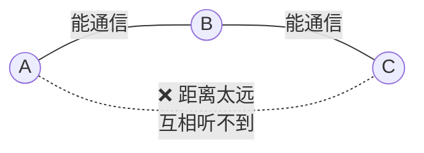

**场景**：

```
① A 正在向 B 发送数据
② C 【听不到 A 的信号】（距离太远）
③ C 检测信道 → 【认为空闲】
④ C 也向 B 发送
     ↓
⑤ 在 B 处，A 和 C 的信号【冲突】❌
     ↓
⑥ A 和 C 都不知道发生了冲突（它们互相听不到）
```

**危害**：冲突频繁发生且发送方无从察觉，吞吐量严重下降。

---

#### 暴露站问题（Exposed Station）

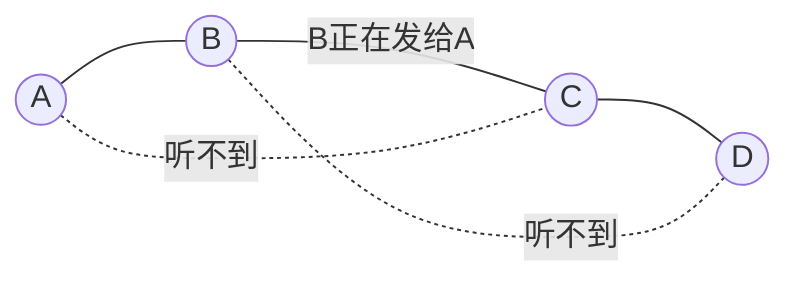

**场景**：

```
① B 正在向 A 发送数据
② C 【听到了 B 的信号】→ 认为信道忙 → 【不敢发送】
     ↓
③ 但实际上：C 想发给 D，而 D 【听不到 B】
     ↓
④ C → D 的传输【完全不会】干扰 B → A
     ↓
⑤ C 白白等待了 ❌ 【浪费了信道容量】
```

**危害**：不必要的等待，降低网络吞吐量。

---

#### RTS/CTS 如何解决隐蔽站问题

**核心思想：让"接收方"来宣告信道占用，而不是只靠"发送方"。**

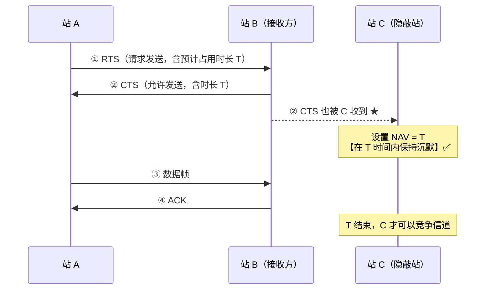

**逐步说明**：

```
① A 想发数据 → 先发一个很短的 【RTS 帧】
   RTS 内容：{源=A, 目的=B, 预计占用时长 T}

② B 收到 RTS，若信道空闲 → 回复 【CTS 帧】
   CTS 内容：{目的=A, 允许占用时长 T}
   
   ★★ 关键：CTS 是【B 广播出去的】
       → 所有能听到 B 的站（包括 C）都能收到 ✅

③ C 收到 CTS：
   - 发现目的不是自己
   - 读取其中的时长 T
   - 设置 【NAV（网络分配矢量）】= T
   - 在 T 时间内【不发送任何数据】✅

④ A 发送数据帧，B 回 ACK —— 全程无冲突
```

**为什么有效**：

| 问题 | RTS/CTS 的解法 |
|---|---|
| **C 听不到 A** | 但 **C 能听到 B**——而 B 就是接收方 |
| **谁最清楚"会不会冲突"** | **接收方 B**——冲突发生在接收端，B 的邻居才是威胁 |
| **如何通知 B 的邻居** | 让 **B 广播 CTS**，它的所有邻居都会收到并保持沉默 |

> ⭐ **RTS/CTS 的本质：把"信道预约"的宣告权，从【发送方】转移到【接收方】。**
>
> 因为**冲突发生在接收端**，所以应该由接收端来"清场"。这是一个非常漂亮的设计转换。

---

**RTS/CTS 的代价与实际使用**

| 代价 | 说明 |
|---|---|
| **额外开销** | 每次传输多两个帧（RTS + CTS） |
| **对短帧不划算** | 若数据帧本身就很短，RTS/CTS 的开销占比过高 |

**实际做法**：设置一个 **RTS 阈值（RTS Threshold）**

```
帧长 > 阈值（通常 2347 字节，即默认关闭）→ 使用 RTS/CTS
帧长 ≤ 阈值                              → 直接发送

★ 只对"值得保护"的长帧启用 RTS/CTS
```

> 💡 **暴露站问题 RTS/CTS 解决不了**（甚至可能加剧）——C 听到 CTS 后会更加确定要沉默。学术界有多种改进方案，但**802.11 标准并未采纳**，因为暴露站问题的实际危害远小于隐蔽站问题。

</details>

---

## 小结

| 要点 | 一句话 |
|---|---|
| IEEE 802 分层 | **LLC 与介质无关**，**MAC 与介质有关** |
| 三类访问控制 | 信道划分（无冲突但利用率低）/ 随机访问 / 轮询访问 |
| TDM vs STDM | **STDM 按需分配时隙，利用率更高** |
| **CDMA** | **同时同频**发送，靠**正交码片**分离 |
| CDMA 三个内积 | $S\cdot S = 1$，$S\cdot T = 0$，$S\cdot\bar{S} = -1$ |
| CDMA 解码 | 内积 **+1 → 发 1**；**−1 → 发 0**；**0 → 未发** |
| ALOHA 利用率 | 纯 **18.4%**，时隙 **36.8%** |
| CSMA 三种坚持 | **1-坚持冲突最多延迟最小**；非坚持相反 |
| **CSMA/CD 口诀** | **先听后发、边听边发、冲突停发、随机重发** |
| **争用期** | **$2\tau$**（信号往返一趟） |
| **最小帧长** | $L_{\min} = 2\tau \times C$；以太网 **64 字节（512 bit）** |
| 最小帧长的意义 | 保证**发完之前能检测到冲突** |
| **二进制指数退避** | $k = \min(n, \mathbf{10})$，$r \in \{0,\ldots,2^k-1\}$，重传 **16 次**放弃 |
| **CSMA/CA** | 无线用；**半双工无法边听边发**；**必须 ACK**；发送**前**退避 |
| **RTS/CTS** | 解决**隐蔽站**问题；本质是**让接收方来清场** |
| 以太网帧 | 最小 **64 B**，最大 **1518 B**，**MTU = 1500 B** |
| 以太网的服务 | **无确认的无连接**——只检错，**出错就丢** |
| 集线器 | **不隔离**任何域 |
| **交换机** | **隔离冲突域**（每端口一个），**不隔离广播域** |
| **路由器** | **两个域都隔离** |
| 交换机自学习 | 记**源 MAC → 端口**；目的未知则**泛洪** |
| **VLAN** | 在一台交换机上划分多个**广播域**；跨 VLAN **必须经路由器** |
| CSMA/CD 的退场 | **全双工交换式以太网**从物理上消除冲突，万兆以太网**只支持全双工** |

**下一章** → CN04 网络层，讲 IP 地址、子网划分、路由算法与 NAT。

---

## 延伸阅读

- 《计算机网络》（谢希仁）第 3 章 —— 408 指定教材
- 《计算机网络：自顶向下方法》第 6 章 —— **多路访问协议与以太网**讲得最系统
- [IEEE 802.3 标准](https://standards.ieee.org/standard/802_3-2022.html) —— 以太网的权威规范
- 本仓库对照：
  - [CN02 物理层与数据链路层](./CN02-精通-物理层与数据链路层.md) —— 组帧与差错控制
  - [CN04 网络层](./CN04-精通-网络层.md) —— 路由器如何隔离广播域
  - [backend/B01 互联网工作原理](../../backend/B01-精通互联网工作原理.md) —— 完整的端到端链路
  - [linux/L11 网络协议栈](../../linux/L11-精通-网络协议栈.md) —— Linux 的链路层实现
