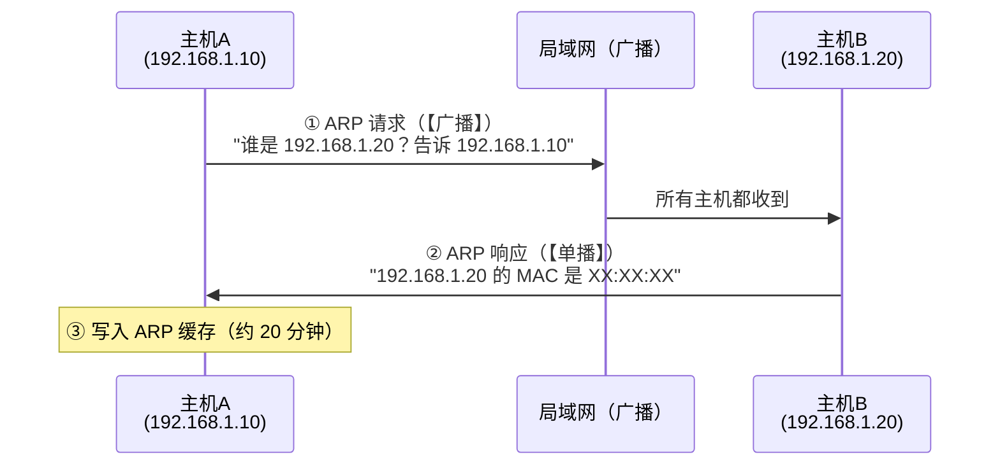
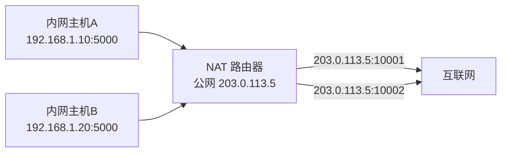

# 精通网络层：IP 地址、子网划分、路由算法与 NAT

> 课程编号：CN04
> 路线图来源：计算机基础四大件 · 计算机网络（408 第 4 章）
> 难度：⭐⭐⭐⭐⭐
> 预计阅读时间：100 分钟
> 内容基准：2026 年 8 月（408 考纲计算机网络第 4 章「网络层」）
> **代码语言：Go**。本章用 Go 实现子网计算、最长前缀匹配与路由表操作。

---

## 引言：`192.168.1.1` 这个地址，全世界有多少台设备在用

打开你家路由器的管理页面，地址是 `192.168.1.1`。你邻居家的路由器，地址**也是** `192.168.1.1`。全世界大概有**几亿台设备**在用这个地址。

**它们为什么不冲突？**

因为 `192.168.x.x` 是**私有地址**——它**只在局域网内有意义，永远不会出现在公网上**。你家路由器出口有一个**公网 IP**，所有内网设备共用它上网，靠的是 **NAT（网络地址转换）**。

这个设计解决了一个曾经的危机：

```
IPv4 地址总数 = 2³² ≈ 43 亿个
     ↓
1990 年代：全球联网设备增长，预计 2000 年前后耗尽
     ↓
【实际上 2011 年 IANA 才分配完最后一批】
```

**为什么能多撑 20 年？** 三项技术把 43 亿个地址"变多"了：

| 技术 | 作用 |
|---|---|
| **CIDR（无类别域间路由）** | 打破 A/B/C 类的僵化划分，**按需分配**任意长度前缀 |
| **NAT** | 让**成千上万台设备共用一个公网 IP** |
| **私有地址** | 内网自由使用，不占用公网地址空间 |

但这三项技术都是"续命"，不是"治本"。真正的解法是 **IPv6**——$2^{128}$ 个地址，**给地球上每一粒沙子都分一个还绰绰有余**。

网络层是整个网络体系的**最关键一层**，因为它是**"细腰"**：

```
        应用层：HTTP、DNS、FTP、SSH...    （很多）
             ↓
        传输层：TCP、UDP                  （少数）
             ↓
        网络层：★★★ IP ★★★              （只有一个！）
             ↓
        链路层：以太网、WiFi、5G、卫星...  （很多）
```

**IP 是所有网络技术的唯一交汇点**——上面的应用换了几代，下面的介质换了几代，**中间的 IP 几乎没变**。

本章讲清楚 IP 如何做到这一点：

```
① 编址：IP 地址怎么分配（分类 → 子网 → CIDR）
② 转发：路由器拿到分组怎么决定下一跳（最长前缀匹配）
③ 路由：路由表怎么自动建立（RIP / OSPF / BGP）
④ 辅助协议：ARP、DHCP、ICMP、NAT
```

读完你应该能：

- **完成子网划分与子网掩码计算**（408 必考大题）
- **用 CIDR 做路由聚合与最长前缀匹配**
- 说清 ARP、DHCP、ICMP、NAT 各自解决什么问题
- **手工模拟 RIP 的距离向量更新与 OSPF 的 Dijkstra**
- 计算 IP 分片
- 说清 IPv6 相对 IPv4 的改进

---

## 第一章 网络层的功能

| 功能 | 说明 |
|---|---|
| **① 异构网络互联** | 把以太网、WiFi、5G 等**不同的物理网络**连成一个逻辑上统一的网络 |
| **② 路由与转发** | **路由**：构建路由表（较慢，周期性）；**转发**：根据表决定下一跳（极快，逐包） |
| **③ 拥塞控制** | 避免网络过载（开环 / 闭环） |

> ⚠️ **"路由"和"转发"是两回事**：
>
> | | **路由（Routing）** | **转发（Forwarding）** |
> |---|---|---|
> | 做什么 | **构建/更新路由表** | **查表决定出口** |
> | 时间尺度 | 秒~分钟 | **纳秒级（每个分组）** |
> | 范围 | **全局**（与其他路由器交换信息） | **本地**（只看自己的表） |
> | 实现 | 软件（控制平面） | **硬件（数据平面）** |
>
> 这个划分正是 **SDN（软件定义网络）**的理论基础——把控制平面和数据平面彻底分离。

---

## 第二章 IPv4 地址与编址

### 2.1 IP 数据报格式

```
 0        4        8              16                            31
┌────────┬────────┬──────────────┬──────────────────────────────┐
│ 版本   │ 首部长度│  区分服务     │          总长度               │
├────────┴────────┴──────────────┼──────┬───────────────────────┤
│           标识                  │ 标志 │       片偏移           │
├────────┬───────────────────────┼──────┴───────────────────────┤
│  TTL   │        协议            │          首部检验和           │
├────────┴───────────────────────┴──────────────────────────────┤
│                        源 IP 地址                              │
├───────────────────────────────────────────────────────────────┤
│                        目的 IP 地址                            │
├───────────────────────────────────────────────────────────────┤
│                    可选字段（长度可变）+ 填充                    │
└───────────────────────────────────────────────────────────────┘
```

**关键字段**：

| 字段 | 长度 | 说明 |
|---|---|---|
| **版本** | 4 位 | IPv4 = 4 |
| **首部长度** | 4 位 | 以 **4 字节**为单位；最小 5（=20 字节），最大 15（=60 字节） |
| **总长度** | 16 位 | 首部 + 数据，**最大 65535 字节** |
| **标识** | 16 位 | **同一个数据报的所有分片有相同的标识** |
| **标志** | 3 位 | `DF`（不分片）、`MF`（还有更多分片） |
| **片偏移** | 13 位 | 以 **8 字节**为单位 ⭐ |
| **TTL** | 8 位 | **每经过一个路由器减 1**，减到 0 就丢弃 |
| **协议** | 8 位 | 上层协议（6=TCP，17=UDP，1=ICMP） |
| **首部检验和** | 16 位 | **只校验首部，不校验数据** |

> ⚠️ **三个"单位"陷阱**：
> - **首部长度**以 **4 字节**为单位
> - **片偏移**以 **8 字节**为单位
> - **总长度**以 **1 字节**为单位
>
> 408 计算题最爱在这里设坑。

### 2.2 IP 地址的分类编址

```
A 类: 0 网络号(7位) │ 主机号(24位)      1.0.0.0 ~ 127.255.255.255
B 类: 10 网络号(14位) │ 主机号(16位)    128.0.0.0 ~ 191.255.255.255
C 类: 110 网络号(21位) │ 主机号(8位)    192.0.0.0 ~ 223.255.255.255
D 类: 1110 组播地址                     224.0.0.0 ~ 239.255.255.255
E 类: 11110 保留                        240.0.0.0 ~ 255.255.255.255
```

| 类别 | 首字节范围 | 网络数 | 每网络主机数 |
|---|---|---|---|
| **A** | 1 ~ 126 | $2^7 - 2 = 126$ | $2^{24} - 2 = 16{,}777{,}214$ |
| **B** | 128 ~ 191 | $2^{14} = 16{,}384$ | $2^{16} - 2 = 65{,}534$ |
| **C** | 192 ~ 223 | $2^{21} = 2{,}097{,}152$ | $2^8 - 2 = 254$ |

> ⚠️ **为什么主机号要减 2**：
> - **主机号全 0** → 表示**该网络本身**（网络地址）
> - **主机号全 1** → 表示**该网络的广播地址**
>
> 这两个都不能分配给主机。

**特殊 IP 地址**：

| 地址 | 含义 |
|---|---|
| `0.0.0.0` | **本网络本主机**（只能作源地址，如 DHCP 请求时） |
| `255.255.255.255` | **受限广播**（本网络广播，**路由器不转发**） |
| `网络号 + 全 1` | **直接广播**（向指定网络广播） |
| `127.x.x.x` | **环回地址**（`127.0.0.1` = localhost） |

**私有地址**（**不会出现在公网**）：

| 类别 | 范围 | CIDR |
|---|---|---|
| A 类 | `10.0.0.0` ~ `10.255.255.255` | `10.0.0.0/8` |
| B 类 | `172.16.0.0` ~ `172.31.255.255` | `172.16.0.0/12` |
| C 类 | `192.168.0.0` ~ `192.168.255.255` | `192.168.0.0/16` |

### 2.3 子网划分（核心考点）⭐

**问题**：一个 B 类地址有 65534 个主机地址，但一个部门只有 200 台机器——**浪费巨大**，且**一个巨大的广播域无法管理**。

**解法**：**从主机号中借用若干位作为【子网号】**。

```
划分前：  网络号 │ 主机号
划分后：  网络号 │ 【子网号】 │ 主机号
```

**子网掩码**：用来标识"哪些位是网络号 + 子网号"。

```
IP 地址   ：  192.168.1.130   = 11000000.10101000.00000001.10000010
子网掩码  ：  255.255.255.192 = 11111111.11111111.11111111.11000000
                                                            └┬┘
                                                         借了 2 位做子网号

按位【与】运算 → 网络地址：
              192.168.1.128   = 11000000.10101000.00000001.10000000
```

$$
\boxed{\text{网络地址} = \text{IP 地址} \ \text{AND}\ \text{子网掩码}}
$$

#### 子网划分的完整计算流程

**已知**：网络 `192.168.10.0/24`，要划分成 **6 个子网**，求子网掩码及各子网的地址范围。

```
① 确定需要借几位：
   6 个子网 → 需要 n 位使 2ⁿ ≥ 6 → n = 3（2³ = 8 ≥ 6）✅

② 新的前缀长度：
   /24 + 3 = 【/27】
   
③ 子网掩码：
   /27 → 前 27 位为 1
   = 11111111.11111111.11111111.11100000
   = 【255.255.255.224】

④ 每个子网的地址数：
   主机位 = 32 − 27 = 5 位
   地址总数 = 2⁵ = 32
   【可用主机数 = 32 − 2 = 30】（去掉网络地址和广播地址）

⑤ 子网划分（步长 = 32）：
```

| 子网 | 网络地址 | 可用主机范围 | 广播地址 |
|---|---|---|---|
| 0 | `192.168.10.0/27` | `.1` ~ `.30` | `.31` |
| 1 | `192.168.10.32/27` | `.33` ~ `.62` | `.63` |
| 2 | `192.168.10.64/27` | `.65` ~ `.94` | `.95` |
| 3 | `192.168.10.96/27` | `.97` ~ `.126` | `.127` |
| 4 | `192.168.10.128/27` | `.129` ~ `.158` | `.159` |
| 5 | `192.168.10.160/27` | `.161` ~ `.190` | `.191` |
| （6） | `192.168.10.192/27` | `.193` ~ `.222` | `.223` |
| （7） | `192.168.10.224/27` | `.225` ~ `.254` | `.255` |

> ⭐ **解题套路（三步）**：
> 1. **算借位数**：$2^n \ge$ 子网数
> 2. **算新前缀**：原前缀 + n
> 3. **算步长**：$2^{32 - \text{新前缀}}$，就是每个子网的地址块大小

**反向题型**（已知主机数求掩码）：

```
某子网需容纳 100 台主机，求最小的子网掩码。

① 需要的主机位数 m：2^m − 2 ≥ 100 → m = 7（2⁷−2 = 126 ≥ 100）✅
② 前缀长度 = 32 − 7 = 【/25】
③ 子网掩码 = 255.255.255.128
```

### 2.4 CIDR（无类别域间路由）

**核心：彻底抛弃 A/B/C 类的划分，用【前缀长度】任意指定网络号的位数。**

```
记法：a.b.c.d/n     n = 网络前缀的位数

例：192.168.1.0/26   → 前 26 位是网络前缀，后 6 位是主机号
```

**CIDR 的两大价值**：

**① 按需分配，减少浪费**

```
分类编址：一个部门要 500 台主机
         C 类（254 台）不够 → 只能给 B 类（65534 台）→ 【浪费 65000 个】❌

CIDR：   给 /23（510 台）→ 【刚好够用】✅
```

**② 路由聚合（超网），缩小路由表**

```
四个连续的 C 类网络：
  200.24.16.0/24 = 11001000.00011000.00010000.00000000
  200.24.17.0/24 = 11001000.00011000.00010001.00000000
  200.24.18.0/24 = 11001000.00011000.00010010.00000000
  200.24.19.0/24 = 11001000.00011000.00010011.00000000
                                            └┬┘
                                        前 22 位【完全相同】

聚合成：200.24.16.0/22   ← 【路由表中 4 条变 1 条】✅
```

> ⭐ **路由聚合是互联网能扩展到今天的关键**。若没有 CIDR，核心路由器的路由表会有**数百万条**——现在通过层层聚合，控制在 **90 万条**左右（2026 年的 BGP 全表规模）。

### 2.5 最长前缀匹配（必考）

**规则：当多条路由都匹配目的地址时，选择【前缀最长】（最具体）的那条。**

**例**：路由表如下，求目的地址 `192.168.1.130` 的下一跳。

| 目的网络 | 下一跳 |
|---|---|
| `192.168.0.0/16` | A |
| `192.168.1.0/24` | B |
| `192.168.1.128/25` | C |
| `0.0.0.0/0`（默认路由） | D |

```
逐条检查：
  192.168.1.130 AND 255.255.0.0   = 192.168.0.0   ✅ 匹配 /16
  192.168.1.130 AND 255.255.255.0 = 192.168.1.0   ✅ 匹配 /24
  192.168.1.130 AND 255.255.255.128 = 192.168.1.128 ✅ 匹配 /25 ⭐最长
  0.0.0.0/0 总是匹配（默认路由）                    ✅

选【前缀最长】的 /25 → 【下一跳 = C】
```

> 💡 **为什么用最长前缀匹配**：前缀越长 = 网络越具体 = 路由信息越精确。**默认路由 `0.0.0.0/0` 前缀最短，所以永远是"最后的选择"**。

### 2.6 用 Go 实现子网计算与最长前缀匹配

```go
package main

import (
    "fmt"
    "net"
)

// 计算子网信息
func subnetInfo(cidr string) {
    ip, ipnet, err := net.ParseCIDR(cidr)
    if err != nil {
        fmt.Println("解析失败:", err)
        return
    }
    ones, bits := ipnet.Mask.Size()
    hostBits := bits - ones
    total := 1 << uint(hostBits)

    // 计算广播地址
    bcast := make(net.IP, len(ipnet.IP))
    copy(bcast, ipnet.IP)
    for i := range bcast {
        bcast[i] |= ^ipnet.Mask[i] // ★ 主机位全置 1
    }

    fmt.Printf("输入地址   : %s\n", ip)
    fmt.Printf("网络地址   : %s\n", ipnet.IP)
    fmt.Printf("子网掩码   : %s (/%d)\n", net.IP(ipnet.Mask), ones)
    fmt.Printf("广播地址   : %s\n", bcast)
    fmt.Printf("地址总数   : %d，可用主机数: %d\n", total, total-2)
}

// 最长前缀匹配
type Route struct {
    Net  *net.IPNet
    Next string
}

func longestPrefixMatch(routes []Route, dst string) string {
    ip := net.ParseIP(dst)
    best, bestLen := "无匹配", -1
    for _, r := range routes {
        if r.Net.Contains(ip) { // ★ 检查是否匹配
            ones, _ := r.Net.Mask.Size()
            if ones > bestLen { // ★ 前缀更长则更优
                bestLen, best = ones, r.Next
            }
        }
    }
    return fmt.Sprintf("%s（匹配前缀长度 /%d）", best, bestLen)
}

func main() {
    fmt.Println("=== 子网信息 ===")
    subnetInfo("192.168.10.130/27")

    fmt.Println("\n=== 最长前缀匹配 ===")
    mk := func(s string) *net.IPNet { _, n, _ := net.ParseCIDR(s); return n }
    routes := []Route{
        {mk("192.168.0.0/16"), "路由器A"},
        {mk("192.168.1.0/24"), "路由器B"},
        {mk("192.168.1.128/25"), "路由器C"},
        {mk("0.0.0.0/0"), "默认网关D"},
    }
    for _, dst := range []string{"192.168.1.130", "192.168.1.10", "192.168.5.1", "10.0.0.1"} {
        fmt.Printf("目的 %-16s → %s\n", dst, longestPrefixMatch(routes, dst))
    }
}
```

**输出**：

```
=== 子网信息 ===
输入地址   : 192.168.10.130
网络地址   : 192.168.10.128
子网掩码   : 255.255.255.224 (/27)
广播地址   : 192.168.10.159
地址总数   : 32，可用主机数: 30

=== 最长前缀匹配 ===
目的 192.168.1.130    → 路由器C（匹配前缀长度 /25）
目的 192.168.1.10     → 路由器B（匹配前缀长度 /24）
目的 192.168.5.1      → 路由器A（匹配前缀长度 /16）
目的 10.0.0.1         → 默认网关D（匹配前缀长度 /0）
```

> 💡 **注意最后一行**：`10.0.0.1` 不匹配任何具体路由，落到**默认路由**——这正是 `/0` 前缀最短、优先级最低的体现。

---

## 第三章 IP 分片

**问题**：不同链路的 **MTU 不同**（以太网 1500，PPPoE 1492，某些隧道更小）。IP 数据报超过 MTU 时必须**分片**。

**三个关键字段**：

| 字段 | 作用 |
|---|---|
| **标识（16 位）** | 同一原始数据报的所有分片**标识相同** |
| **MF（More Fragment）** | 1 = **后面还有分片**；0 = **最后一片** |
| **DF（Don't Fragment）** | 1 = **禁止分片**（超过 MTU 就丢弃并回 ICMP 差错） |
| **片偏移（13 位）** | 该片在原数据报中的位置，**以 8 字节为单位** ⭐ |

### 完整例题

**一个 IP 数据报总长 **3820 字节**（含 20 字节首部），要经过 MTU = **1420** 字节的链路。**

```
① 每片的数据部分最大 = MTU − 首部 = 1420 − 20 = 1400 字节
   ★ 但片偏移以 8 字节为单位，所以数据部分必须是 8 的倍数
   1400 ÷ 8 = 175 ✅ 正好是 8 的倍数

② 原数据部分总长 = 3820 − 20 = 3800 字节

③ 分片：
   3800 ÷ 1400 = 2 余 1000
   → 分成 3 片：1400 + 1400 + 1000
```

| 分片 | 总长度 | 数据长度 | **片偏移** | MF |
|---|---|---|---|---|
| 第 1 片 | 1420 | 1400 | **0** | **1** |
| 第 2 片 | 1420 | 1400 | **175**（=1400/8） | **1** |
| 第 3 片 | 1020 | 1000 | **350**（=2800/8） | **0** |

> ⚠️ **两个必查的点**：
> 1. **片偏移 = 前面所有分片的数据字节数 ÷ 8**
> 2. **每片的数据长度（除最后一片外）必须是 8 的倍数**

> 💡 **IPv6 取消了路由器分片**——只允许**源主机**分片。路由器遇到过大的包直接丢弃并回 ICMPv6 "Packet Too Big"，由源主机通过 **PMTUD（路径 MTU 发现）** 自行调小。**这大幅简化了路由器的处理逻辑。**

---

## 第四章 网络层的辅助协议

### 4.1 ARP（地址解析协议）

**作用：把 IP 地址解析成 MAC 地址。**

**为什么需要**：数据链路层只认 MAC 地址，但应用只知道 IP 地址。



> ⚠️ **两个高频考点**：
> 1. **ARP 请求是【广播】，ARP 响应是【单播】**
> 2. **ARP 只能在【同一个局域网内】使用**——跨网段时，源主机解析的是**默认网关的 MAC**，而不是目的主机的

**跨网段通信时的 ARP**：

```
A(192.168.1.10) 要访问 B(10.0.0.5)，网关是 192.168.1.1

① A 发现 B 不在同一网段（用子网掩码判断）
② A 用 ARP 解析【网关 192.168.1.1】的 MAC   ← ★ 不是 B 的！
③ A 发出的帧：
     目的 MAC = 【网关的 MAC】
     目的 IP  = 【10.0.0.5】（B 的 IP，不变）
④ 网关收到后，查路由表，换一个 MAC 继续转发
```

> ⭐ **关键规律**：**在整个传输过程中，【IP 地址始终不变】（除 NAT 外），【MAC 地址每一跳都变】。**

### 4.2 DHCP（动态主机配置协议）

**作用：自动为主机分配 IP 地址、子网掩码、默认网关、DNS。**

**四步握手（DORA）**：

```
① DISCOVER：客户端【广播】"有 DHCP 服务器吗？"
              （源 IP = 0.0.0.0，目的 IP = 255.255.255.255）
② OFFER   ：服务器【广播/单播】提供一个 IP 地址
③ REQUEST ：客户端【广播】"我要这个 IP"（广播是为了通知其他服务器）
④ ACK     ：服务器确认，并给出【租期】
```

> 💡 **DHCP 基于 UDP**（服务器端口 67，客户端端口 68）。**必须用广播**，因为客户端此时还没有 IP 地址。

### 4.3 ICMP（网际控制报文协议）

**作用：传递差错报告和网络探测信息。**

| 类型 | 报文 | 用途 |
|---|---|---|
| **差错报告** | 终点不可达、源点抑制、**时间超过**、参数问题、改变路由 | 报告转发中的问题 |
| **询问** | **回送请求/回答**（Echo）、时间戳请求/回答 | 网络诊断 |

**两个基于 ICMP 的经典工具**：

| 工具 | 原理 |
|---|---|
| **ping** | 发 **ICMP Echo 请求**，等 Echo 回答 → 测**连通性和 RTT** |
| **traceroute** | 发 **TTL 从 1 递增**的包，每个路由器丢弃时会回 **ICMP 时间超过**报文 → **逐跳发现路径** ⭐ |

**traceroute 的巧妙之处**：

```
发 TTL=1 的包 → 第 1 个路由器把 TTL 减到 0 → 丢弃 + 回 ICMP 超时 → 【得知第1跳】
发 TTL=2 的包 → 第 2 个路由器回 ICMP 超时                        → 【得知第2跳】
发 TTL=3 的包 → ...
直到收到目的主机的回复 → 路径探测完成
```

> ⚠️ **ICMP 差错报告报文不再产生 ICMP 差错报告**（否则会无限循环）。另外，**对组播地址、特殊地址（127.x、0.0.0.0）也不产生**。

### 4.4 NAT（网络地址转换）

**作用：让多台使用私有地址的主机共享少量公网 IP 上网。**



**NAT 转换表**：

| 内网地址:端口 | 公网地址:端口 |
|---|---|
| `192.168.1.10:5000` | `203.0.113.5:10001` |
| `192.168.1.20:5000` | `203.0.113.5:10002` |

> ⭐ **准确说这是 NAPT（网络地址端口转换）**——因为它同时转换 **IP 和端口**。正是"端口"这个维度，让一个公网 IP 能支撑**几万台**内网设备（端口号 16 位，理论上 65535 个并发连接）。

**NAT 的代价**：

| 问题 | 说明 |
|---|---|
| **破坏端到端原则** | 外网无法**主动**连接内网主机（需要端口映射/UPnP/打洞） |
| **修改了 IP 和端口** | 违反了"路由器不应修改分组内容"的分层原则 |
| **对 P2P 应用不友好** | 需要 STUN/TURN 等穿透技术 |

> 💡 **NAT 是"权宜之计"变成"既成事实"的典型**。它拯救了 IPv4，但也**永久地改变了互联网的架构**——从"每台设备都可达"变成了"客户端-服务器"的不对称结构。

---

## 第五章 路由算法（核心考点）

### 5.1 两大类

| 类别 | 代表 | 思想 |
|---|---|---|
| **距离向量（Distance Vector）** | **RIP** | **告诉邻居"我到各处的距离"** |
| **链路状态（Link State）** | **OSPF** | **向全网广播"我的邻居有哪些"**，各自算最短路 |

### 5.2 RIP（路由信息协议）

**核心：距离向量算法（Bellman-Ford）。**

| 特性 | 说明 |
|---|---|
| **度量** | **跳数（hop count）**，直连网络距离 = 1 |
| **最大跳数** | **15**；**16 表示不可达** ⭐ |
| **交换对象** | **仅与相邻路由器**交换 |
| **交换内容** | **自己的【完整路由表】** |
| **交换周期** | **每 30 秒**（或路由变化时） |
| **传输层** | **UDP**（端口 520） |
| **适用** | **小型网络** |

**距离向量更新算法**：

```
收到邻居 X 发来的路由表：
① 把表中每一项的【下一跳】改为 X，【距离 +1】
② 对修改后的每一项 (目的网络 N, 距离 d, 下一跳 X)：
     ├─ 若 N 【不在】自己的表中 → 【直接添加】
     ├─ 若表中该项的下一跳【就是 X】 → 【无条件更新】（邻居说了算）
     └─ 否则 → 【只有 d < 原距离才更新】
③ 若 3 分钟没收到某邻居的更新 → 把经过它的路由距离全设为 16（不可达）
```

#### 完整例题

**路由器 R1 的原路由表**：

| 目的网络 | 距离 | 下一跳 |
|---|---|---|
| Net1 | 3 | R2 |
| Net2 | 4 | R3 |
| Net3 | 2 | R4 |

**收到 R2 发来的路由表**：

| 目的网络 | 距离 |
|---|---|
| Net1 | 1 |
| Net2 | 2 |
| Net4 | 5 |

**更新过程**：

```
① 先把 R2 的表处理：距离 +1，下一跳全改为 R2

   Net1: 距离 2, 下一跳 R2
   Net2: 距离 3, 下一跳 R2
   Net4: 距离 6, 下一跳 R2

② 逐项对比：

   Net1: 原表【下一跳就是 R2】→ 【无条件更新】→ 距离 3 改为 2 ✅
   
   Net2: 原表下一跳是 R3（≠R2）→ 比较距离：3 < 4 → 【更新】✅
         → 距离 3，下一跳 R2
   
   Net3: R2 的表中没有 → 【保持不变】
   
   Net4: 原表中没有 → 【直接添加】→ 距离 6，下一跳 R2 ✅
```

**更新后的 R1 路由表**：

| 目的网络 | 距离 | 下一跳 |
|---|---|---|
| Net1 | **2** | R2 |
| Net2 | **3** | **R2** |
| Net3 | 2 | R4 |
| **Net4** | **6** | **R2** |

> ⚠️ **"下一跳就是 X 则无条件更新"是最容易错的规则**。即使新距离**更大**也要更新——因为**邻居 X 是权威**（它说到 Net1 变远了，那就是变远了，可能是链路故障）。

#### RIP 的致命问题：好消息传得快，坏消息传得慢

```
正常：  R1 ── Net1 ── R2 ── R3
        R1 到 Net1 距离 1，R2 距离 2，R3 距离 3

★ Net1 突然故障：
   R1 检测到 → 把距离设为 16（不可达）
   但在 R1 通知 R2 之前，R2 先向 R1 发了它的表："我到 Net1 距离 2"
        ↓
   R1 心想："哦，通过 R2 能到，距离 3" → 更新为 3 ❌ 【错误信息】
        ↓
   R1 告诉 R2："我到 Net1 距离 3"
   R2 更新为 4 → 告诉 R1 → R1 更新为 5 → ...
        ↓
   【一直加到 16 才停】—— 这个过程叫【计数到无穷】
```

**缓解措施**：

| 措施 | 做法 |
|---|---|
| **最大跳数限 16** | 让"计数到无穷"至少能**在有限步内结束** |
| **水平分割** | **不把从某接口学到的路由，再从该接口发回去** |
| **毒性逆转** | 从某接口学到的路由，从该接口发回时**把距离设为 16** |
| **触发更新** | 链路变化时**立即通知**，不等 30 秒周期 |

### 5.3 OSPF（开放最短路径优先）

**核心：链路状态算法 + Dijkstra 最短路。**

| 特性 | 说明 |
|---|---|
| **度量** | **链路开销（cost）**，可基于带宽等自定义 |
| **交换对象** | **向本自治系统内【所有】路由器洪泛** |
| **交换内容** | **只有自己【相邻链路的状态】**（不是整张表） |
| **交换时机** | **链路状态变化时**（不是周期性） |
| **传输层** | **直接封装在 IP 数据报中**（协议号 89），**不用 UDP/TCP** ⭐ |
| **算法** | 每台路由器用 **Dijkstra** 算最短路径树 |
| **适用** | **大型网络**（支持分区域） |

**工作流程**：

```
① 每台路由器发现自己的邻居（Hello 报文）
② 构造【链路状态通告 LSA】：{我是谁，我的邻居有哪些，链路开销多少}
③ 用【洪泛法】把 LSA 发给全网所有路由器
④ 每台路由器收集所有 LSA，构建【完整的全网拓扑图】（链路状态数据库 LSDB）
⑤ 各自用 【Dijkstra 算法】算出到各目的网络的最短路径 → 生成路由表
```

> ⭐ **关键区别**：
>
> **RIP**：我告诉邻居"**我到各处多远**"（传递的是**计算结果**）
> **OSPF**：我告诉全网"**我周围有谁**"（传递的是**原始数据**，各自计算）
>
> **这就是"传播结论"vs"传播事实"的区别。传播事实更可靠——不会因为某个节点算错而污染全网。**

### 5.4 RIP vs OSPF 全面对比

| 维度 | **RIP** | **OSPF** |
|---|---|---|
| **算法** | **距离向量**（Bellman-Ford） | **链路状态**（Dijkstra） |
| **度量** | **跳数**（最大 15） | **链路开销**（可自定义） |
| **交换范围** | **仅相邻路由器** | **全网洪泛** |
| **交换内容** | **完整路由表** | **仅相邻链路状态** |
| **交换时机** | **周期性（30 秒）** | **状态变化时** |
| **收敛速度** | **慢**（有计数到无穷问题） | **快** |
| **传输层** | **UDP**（端口 520） | **直接用 IP**（协议号 89） |
| **网络规模** | **小型** | **大型**（可分区域） |
| **是否支持负载均衡** | ❌ | ✅（等价多路径） |

### 5.5 BGP（边界网关协议）

| 特性 | 说明 |
|---|---|
| **定位** | **外部网关协议（EGP）**——用于**不同自治系统 AS 之间** |
| **算法** | **路径向量**（Path Vector） |
| **目标** | **不是找最短路，而是找一条【能用的、符合策略的】路径** ⭐ |
| **传输层** | **TCP**（端口 179） |

> ⭐ **BGP 与 RIP/OSPF 的本质区别**：
>
> **RIP/OSPF 是"技术问题"**——在一个组织内部，找最快的路。
> **BGP 是"政治/商业问题"**——AS 之间的路由取决于**商业合同、对等协议、流量成本**，而不是跳数。
>
> 比如：中国电信和中国联通之间的路由，可能宁可绕道香港，也不走直连——**因为结算价格**。

**三大路由协议定位**：

| 协议 | 类型 | 范围 |
|---|---|---|
| **RIP** | **IGP**（内部网关协议） | AS **内部**，小型 |
| **OSPF** | **IGP** | AS **内部**，大型 |
| **BGP** | **EGP**（外部网关协议） | AS **之间** |

---

## 第六章 IPv6

### 6.1 相对 IPv4 的改进

| 改进 | 说明 |
|---|---|
| **① 地址长度 128 位** | $2^{128} \approx 3.4\times10^{38}$ 个地址 |
| **② 首部固定 40 字节** | 去掉了首部长度字段，**转发更快** |
| **③ 取消首部检验和** | 交给链路层和传输层，**减少每跳的计算** |
| **④ 取消分片字段** | **路由器不再分片**，由源主机用 PMTUD 处理 |
| **⑤ 引入扩展首部** | 可选功能移到扩展首部，**基本首部保持简洁** |
| **⑥ 支持即插即用** | **无状态地址自动配置（SLAAC）**，不需要 DHCP |
| **⑦ 取消广播** | 用**组播**和**任播**代替 |

**地址表示**：

```
完整：2001:0DB8:0000:0000:0000:0000:1428:57AB
简写：2001:DB8::1428:57AB
      ★ 连续的全 0 组可以用 "::" 代替（只能出现【一次】）
```

> ⚠️ **`::` 在一个地址中只能出现一次**——否则无法确定各段省略了多少个 0。

---

## 第七章 408 高频考点与陷阱清单

### 7.1 考点分布

第 4 章是计算机网络**分值最高**的章节：**2-3 道选择题 + 几乎必有的大题**（子网划分 / 路由表）。

最常考：

1. **子网划分与子网掩码计算**（大题必考）
2. **最长前缀匹配**
3. **RIP 的距离向量更新**
4. IP 分片计算
5. ARP 的工作过程

### 7.2 十八个陷阱

**陷阱 1：IP 首部长度以字节为单位**

**错**，以 **4 字节**为单位。首部长度字段值 5 表示 20 字节。

**陷阱 2：片偏移以字节为单位**

**错**，以 **8 字节**为单位。

**陷阱 3：IP 首部检验和校验整个数据报**

**错**，**只校验首部，不校验数据**。数据的正确性由上层（TCP/UDP 的检验和）保证。

**陷阱 4：C 类网络可以容纳 256 台主机**

**错**，是 $2^8 - 2 = 254$ 台（要去掉**网络地址**和**广播地址**）。

**陷阱 5：255.255.255.255 会被路由器转发**

**错**。这是**受限广播**，**路由器绝不转发**（否则一个包会传遍全世界）。

**陷阱 6：ARP 请求和响应都是广播**

**错**。**ARP 请求是广播，ARP 响应是单播**。

**陷阱 7：跨网段通信时，源主机用 ARP 解析目的主机的 MAC**

**错**。跨网段时，源主机解析的是**默认网关的 MAC**。

**陷阱 8：数据传输过程中 MAC 地址不变**

**错，反了**。**IP 地址始终不变**（除 NAT），**MAC 地址每一跳都变**。

**陷阱 9：DHCP 使用 TCP**

**错**，用 **UDP**（服务器 67，客户端 68）。因为客户端此时还没有 IP，必须用广播。

**陷阱 10：ICMP 是传输层协议**

**错**，ICMP 是**网络层协议**（虽然它的报文封装在 IP 数据报中）。

**陷阱 11：ping 使用 UDP**

**错**，ping 用的是 **ICMP Echo 请求/回答**，不涉及传输层。

**陷阱 12：traceroute 靠端口不可达来发现路径**

**不完整**。**主要靠 TTL 递增**：每个路由器把 TTL 减到 0 时会回 **ICMP 时间超过**报文。（Unix 的实现在到达目的地时确实靠"端口不可达"判断结束。）

**陷阱 13：RIP 与所有路由器交换信息**

**错**。**RIP 只与【相邻】路由器交换**；**OSPF** 才是向全网洪泛。

**陷阱 14：RIP 交换的是链路状态**

**错**。**RIP 交换的是【完整的路由表】**；**OSPF 交换的才是【链路状态】**。

**陷阱 15：RIP 中距离为 16 表示直连**

**错**。**16 表示【不可达】**；**直连网络距离为 1**（有的教材算 0，看题目约定）。

**陷阱 16：OSPF 使用 UDP 传输**

**错**。**OSPF 直接封装在 IP 数据报中**（协议号 89），**不使用 UDP 或 TCP**。RIP 才用 UDP。

**陷阱 17：BGP 的目标是找最短路径**

**错**。BGP 是**路径向量**协议，目标是找**符合策略的可用路径**——路由决策取决于**商业策略**，不是跳数。

**陷阱 18：IPv6 的路由器可以分片**

**错**。**IPv6 取消了路由器分片**，只允许源主机分片（用 PMTUD 发现路径 MTU）。

### 7.3 速查卡

```
【IP 首部的三个单位】
首部长度：以【4 字节】为单位（最小5=20B，最大15=60B）
片偏移  ：以【8 字节】为单位
总长度  ：以【1 字节】为单位（最大 65535）
★ 首部检验和【只校验首部】

【地址分类】
A: 1~126    网络2⁷−2，主机2²⁴−2
B: 128~191  网络2¹⁴，  主机2¹⁶−2
C: 192~223  网络2²¹，  主机2⁸−2 = 254
D: 224~239  组播
私有：10.0.0.0/8、172.16.0.0/12、192.168.0.0/16

【子网划分三步】
① 借位数 n：2ⁿ ≥ 子网数
② 新前缀 = 原前缀 + n
③ 步长 = 2^(32−新前缀)
网络地址 = IP AND 掩码
可用主机数 = 2^主机位 − 2

【最长前缀匹配】
多条都匹配时选【前缀最长】的；0.0.0.0/0 优先级最低

【IP 分片】
每片数据长度（除最后一片）必须是【8 的倍数】
片偏移 = 前面所有片的数据字节数 ÷ 8
MF=1 表示后面还有片

【辅助协议】
ARP ：IP→MAC；【请求广播，响应单播】；只在同一局域网内
      跨网段时解析的是【网关的 MAC】
DHCP：UDP 67/68；四步 DISCOVER-OFFER-REQUEST-ACK
ICMP：网络层；ping 用 Echo；traceroute 用【TTL 递增】
NAT ：实为 NAPT，同时转换 IP 和【端口】

【路由协议对比】★★★
        RIP              OSPF              BGP
算法    距离向量          链路状态           路径向量
度量    跳数(max 15)      链路开销          【策略】
范围    仅【相邻】        【全网洪泛】       AS 之间
内容    【完整路由表】     【相邻链路状态】    路径属性
时机    周期30秒          状态变化时         变化时
传输    【UDP 520】       【直接用IP，89】    【TCP 179】
类型    IGP小型           IGP大型            EGP

【RIP 更新规则】
距离+1，下一跳改为X
① 新网络 → 添加
② 下一跳就是X → 【无条件更新】（即使变远）
③ 否则 → 【更近才更新】

【IPv6】
128位、首部固定40B、【无检验和】、【路由器不分片】、
无广播（用组播/任播）、支持SLAAC
"::" 只能出现【一次】
```

---

## 第八章 Go ↔ C 对照

| 场景 | C | Go | 说明 |
|---|---|---|---|
| 解析 CIDR | 手写位运算 | **`net.ParseCIDR`** | 返回 IP 和 IPNet |
| 判断 IP 是否在网段内 | 手写 AND 运算 | **`ipnet.Contains(ip)`** | |
| 获取掩码位数 | 手写 | `mask.Size()` | 返回 (ones, bits) |
| IP 字符串 ↔ 二进制 | `inet_pton` / `inet_ntop` | `net.ParseIP` / `ip.String()` | |
| 主机序 ↔ 网络序 | `htonl` / `ntohl` | `binary.BigEndian` | 网络序 = 大端 |
| 查询路由表 | 读 `/proc/net/route` | 同左，或用 `netlink` | |
| 发 ICMP | 原始套接字 | `golang.org/x/net/icmp` | 需要 root |

```go
package main

import (
    "fmt"
    "net"
)

func main() {
    // ① 判断两个 IP 是否在同一子网（这正是主机决定"要不要走网关"的逻辑）
    _, subnet, _ := net.ParseCIDR("192.168.1.0/26")
    for _, s := range []string{"192.168.1.10", "192.168.1.70", "10.0.0.1"} {
        ip := net.ParseIP(s)
        fmt.Printf("%-16s 在 %s 内: %v\n", s, subnet, subnet.Contains(ip))
    }

    // ② CIDR 路由聚合：找出多个网段的最长公共前缀
    nets := []string{"200.24.16.0/24", "200.24.17.0/24", "200.24.18.0/24", "200.24.19.0/24"}
    fmt.Println("\n=== 路由聚合 ===")
    var common net.IP
    for i, s := range nets {
        _, n, _ := net.ParseCIDR(s)
        if i == 0 {
            common = append(net.IP(nil), n.IP...)
            continue
        }
        for j := range common { // ★ 逐字节找公共位
            common[j] &= n.IP[j]
        }
    }
    // 计算公共前缀长度
    prefixLen := 0
outer:
    for _, s := range nets {
        _, n, _ := net.ParseCIDR(s)
        for bit := 0; bit < 32; bit++ {
            byteIdx, bitIdx := bit/8, 7-bit%8
            if (common[byteIdx]>>uint(bitIdx))&1 != (n.IP[byteIdx]>>uint(bitIdx))&1 {
                if bit < prefixLen || prefixLen == 0 {
                    prefixLen = bit
                }
                continue outer
            }
        }
        prefixLen = 32
    }
    fmt.Printf("聚合结果: %s/%d\n", common, prefixLen)
}
```

**输出**：

```
192.168.1.10     在 192.168.1.0/26 内: true
192.168.1.70     在 192.168.1.0/26 内: false
10.0.0.1         在 192.168.1.0/26 内: false

=== 路由聚合 ===
聚合结果: 200.24.16.0/22
```

> 💡 **第二行 `192.168.1.70` 不在 `/26` 内**——因为 `/26` 的步长是 64，`192.168.1.0/26` 只覆盖 `.0` ~ `.63`。**这正是主机判断"目的地址是否需要经过网关"的实际逻辑。**

---

## 第九章 练习题

### 选择题

**1.** IP 数据报首部中，"首部长度"字段以什么为单位：
A. 1 字节　B. 2 字节　C. 4 字节　D. 8 字节

**2.** IP 分片中，"片偏移"字段以什么为单位：
A. 1 字节　B. 4 字节　C. 8 字节　D. 16 字节

**3.** IP 首部检验和校验的范围是：
A. 整个 IP 数据报　B. 仅首部　C. 仅数据部分　D. 首部和数据的前 20 字节

**4.** 一个 C 类网络最多可以容纳的主机数是：
A. 254　B. 255　C. 256　D. 253

**5.** 关于地址 `255.255.255.255`，**正确**的是：
A. 是一个有效的主机地址
B. 是受限广播地址，路由器不转发
C. 是默认路由
D. 是环回地址

**6.** 主机 A 要与不同网段的主机 B 通信，A 发出的以太网帧中，目的 MAC 地址是：
A. B 的 MAC 地址
B. 默认网关的 MAC 地址
C. 广播地址 FF:FF:FF:FF:FF:FF
D. A 自己的 MAC 地址

**7.** 关于 ARP 协议，**正确**的是：
A. ARP 请求和响应都是广播
B. ARP 请求是广播，响应是单播
C. ARP 请求是单播，响应是广播
D. 两者都是单播

**8.** traceroute 工具主要利用了 IP 数据报中的哪个字段：
A. 标识　B. 片偏移　C. TTL　D. 协议

**9.** RIP 协议中，距离值 16 表示：
A. 直接连接　B. 16 跳可达　C. 不可达　D. 需要重新计算

**10.** 关于 RIP 和 OSPF，**正确**的是：
A. RIP 向全网洪泛，OSPF 只与邻居交换
B. RIP 交换链路状态，OSPF 交换路由表
C. RIP 使用 UDP，OSPF 直接封装在 IP 数据报中
D. 两者都使用 TCP

**11.** 路由表中有以下表项，目的地址 `172.16.5.100` 应该匹配哪一条：
A. `172.16.0.0/16`
B. `172.16.4.0/22`
C. `172.16.5.0/24`
D. `0.0.0.0/0`

**12.** 关于 IPv6，**错误**的是：
A. 地址长度为 128 位
B. 基本首部固定为 40 字节
C. 路由器可以对数据报进行分片
D. 取消了首部检验和

### 应用题

**13.** 某公司分配到网络地址 `172.16.0.0/16`，需要划分成 **10 个子网**，每个子网至少能容纳 **1000 台主机**。

（1）确定子网掩码（用点分十进制和 CIDR 两种表示）。
（2）每个子网实际可容纳多少台主机？
（3）写出前 3 个子网的网络地址、可用主机范围和广播地址。
（4）判断 `172.16.9.200` 属于第几个子网。

**14.** 某路由器的路由表如下：

| 目的网络 | 子网掩码 | 下一跳 |
|---|---|---|
| `192.168.0.0` | `255.255.0.0` | A |
| `192.168.16.0` | `255.255.240.0` | B |
| `192.168.16.0` | `255.255.255.0` | C |
| `192.168.16.128` | `255.255.255.192` | D |
| `0.0.0.0` | `0.0.0.0` | E |

分别确定下列目的地址的下一跳，并写出判断依据：

（1）`192.168.16.150`
（2）`192.168.16.50`
（3）`192.168.20.10`
（4）`192.168.100.5`
（5）`10.1.1.1`

**15.** 一个 IP 数据报总长度为 **4500 字节**（其中首部 20 字节），要通过 MTU = **1500 字节**的以太网传输。

（1）需要分成几片？
（2）写出每一片的总长度、数据长度、片偏移和 MF 标志。
（3）若其中第 2 片在传输中丢失，接收方会怎么处理？
（4）说明为什么 IPv6 取消了路由器分片功能。

**16.** 路由器 R1 的路由表如下：

| 目的网络 | 距离 | 下一跳 |
|---|---|---|
| N1 | 4 | R2 |
| N2 | 2 | R5 |
| N3 | 1 | 直接交付 |
| N4 | 5 | R4 |

现收到相邻路由器 R2 发来的路由表（R2 到各网络的距离）：

| 目的网络 | 距离 |
|---|---|
| N1 | 2 |
| N2 | 1 |
| N3 | 3 |
| N5 | 2 |

（1）写出 R1 更新后的路由表，并说明每一项的更新理由。
（2）解释"下一跳相同则无条件更新"这条规则的原因。

**17.** 详细对比 **RIP** 和 **OSPF**：

（1）从八个维度列表对比。
（2）解释什么是"计数到无穷"问题，RIP 用哪些措施缓解？
（3）为什么说 OSPF"传播事实"比 RIP"传播结论"更可靠？

### 答案与解析

<details>
<summary>点击展开</summary>

**1. C**

**首部长度以 4 字节为单位**。

```
字段值 5  → 5 × 4 = 20 字节（最小，无选项）
字段值 15 → 15 × 4 = 60 字节（最大）
```

**2. C**

**片偏移以 8 字节为单位**。

原因：片偏移只有 13 位，若以字节为单位最多表示 8191 字节，**不够表示 65535 字节的数据报**。以 8 字节为单位后，$8191 \times 8 = 65528$，刚好够用。

**3. B**

**IP 首部检验和只校验首部，不校验数据。**

原因：

```
① 数据的正确性由【上层】保证（TCP/UDP 有自己的检验和）
② 首部的 TTL 每跳都变 → 检验和【每跳都要重算】
     ↓
   若还要校验数据，每个路由器都要对整个数据报做校验 → 【开销巨大】❌
```

**4. A**

$$
2^8 - 2 = 256 - 2 = 254
$$

减 2 是因为：**主机号全 0**（网络地址）和**主机号全 1**（广播地址）不能分配给主机。

**5. B**

`255.255.255.255` 是**受限广播地址**：

- 向**本网络**广播
- **路由器绝对不转发** ⭐（否则一个包会传遍全世界，造成广播风暴）

**6. B**

**跨网段通信时，目的 MAC 是【默认网关的 MAC】。**

```
A 的判断过程：
① 用自己的子网掩码计算：目的 IP 与自己【不在同一网段】
② → 需要经过网关
③ 用 ARP 解析【网关】的 MAC（不是 B 的！）
④ 发出的帧：
     目的 MAC = 网关的 MAC   ← 变
     目的 IP  = B 的 IP       ← 不变 ★
```

> ⭐ **核心规律：整个传输过程中，IP 地址不变，MAC 地址每一跳都变。**

**7. B**

```
ARP 请求：【广播】—— 因为不知道对方的 MAC，只能问所有人
ARP 响应：【单播】—— 已经从请求中得知了提问者的 MAC，直接回给他
```

**8. C**

**traceroute 利用 TTL 字段**：

```
发 TTL=1 → 第1个路由器把 TTL 减到 0 → 丢弃 + 回【ICMP 时间超过】→ 得知第1跳
发 TTL=2 → 第2个路由器回 ICMP 超时                            → 得知第2跳
...逐跳递增，直到到达目的地
```

**9. C**

| 距离值 | 含义 |
|---|---|
| 1 | **直连网络** |
| 2 ~ 15 | 经过 1~14 个路由器 |
| **16** | **不可达** ⭐ |

RIP 用 16 作为"无穷大"，正是为了让"计数到无穷"问题能**在有限步内终止**。

**10. C**

| | RIP | OSPF |
|---|---|---|
| 交换范围 | **仅相邻** | **全网洪泛** |
| 交换内容 | **完整路由表** | **相邻链路状态** |
| **传输层** | **UDP（520）** | **直接用 IP（协议号 89）** ⭐ |

A、B 都说反了；D 错（BGP 才用 TCP）。

**11. C**

**最长前缀匹配**：

```
172.16.5.100 与各条比对：
  172.16.0.0/16   → 匹配 ✅（前16位相同）
  172.16.4.0/22   → 172.16.5.100 的前22位：
                     5 = 00000101，4 = 00000100
                     /22 覆盖 172.16.4.0 ~ 172.16.7.255
                     → 5.100 在范围内 ✅
  172.16.5.0/24   → 匹配 ✅（前24位相同）★ 最长
  0.0.0.0/0       → 总是匹配 ✅

选前缀最长的 → 【/24，下一跳 C】
```

**12. C**

**IPv6 取消了路由器分片**——只允许**源主机**分片。

路由器遇到超过 MTU 的包时：**直接丢弃 + 回 ICMPv6 "Packet Too Big"**，由源主机通过 **PMTUD（路径 MTU 发现）**自行调小包大小。

**好处**：大幅简化路由器的处理逻辑，提高转发速度。

**13.**

**（1）确定子网掩码**

**这道题有两个约束，必须同时满足**：

```
约束一：至少 10 个子网
  需要借 n 位：2ⁿ ≥ 10 → n = 4（2⁴ = 16 ≥ 10）✅

约束二：每个子网至少 1000 台主机
  需要主机位 m：2^m − 2 ≥ 1000 → m = 10（2¹⁰−2 = 1022 ≥ 1000）✅

验证是否兼容：
  原前缀 /16，总共 32 − 16 = 16 位可分配
  借 4 位做子网号 + 留 10 位做主机号 = 14 位 ≤ 16 ✅ 可行
  
  ★ 还剩 2 位机动，可以：
    - 多借位（更多子网）：借 6 位 → 64 个子网，每个 1022 台主机
    - 或多留主机位：借 4 位 → 16 个子网，每个 4094 台主机
    
  按题目"至少"的要求，取最紧凑的方案：
```

**方案（按主机数约束确定）**：

```
主机位 m = 10 → 前缀长度 = 32 − 10 = 【/22】
子网号位数 = 22 − 16 = 6 位 → 可划分 2⁶ = 64 个子网（≥10 ✅）
```

$$
\text{子网掩码} = \boxed{255.255.252.0} \quad = \boxed{/22}
$$

**验证掩码**：

```
/22 → 11111111.11111111.11111100.00000000
                            └─ 252
    = 255.255.252.0 ✅
```

---

**（2）每个子网可容纳的主机数**

```
主机位 = 32 − 22 = 10 位
地址总数 = 2¹⁰ = 1024
【可用主机数 = 1024 − 2 = 1022】✅（≥ 1000 满足要求）
```

---

**（3）前 3 个子网**

**步长 = $2^{32-22} = 2^{10} = 1024$ 个地址 = 第三字节每次 +4**

| 子网 | 网络地址 | 可用主机范围 | 广播地址 |
|---|---|---|---|
| **第 1 个** | `172.16.0.0/22` | `172.16.0.1` ~ `172.16.3.254` | `172.16.3.255` |
| **第 2 个** | `172.16.4.0/22` | `172.16.4.1` ~ `172.16.7.254` | `172.16.7.255` |
| **第 3 个** | `172.16.8.0/22` | `172.16.8.1` ~ `172.16.11.254` | `172.16.11.255` |

---

**（4）`172.16.9.200` 属于第几个子网**

```
方法一：直接看第三字节
  第三字节 = 9
  步长（第三字节）= 4
  9 ÷ 4 = 2 余 1
  → 落在第三字节为 8~11 的区间 → 【第 3 个子网】（172.16.8.0/22）

方法二：AND 运算
  172.16.9.200  = 10101100.00010000.00001001.11001000
  255.255.252.0 = 11111111.11111111.11111100.00000000
  AND           = 10101100.00010000.00001000.00000000
                = 172.16.8.0  ✅

→ 属于【第 3 个子网 172.16.8.0/22】
```

**14.**

**逐个分析（最长前缀匹配）**：

---

**（1）`192.168.16.150`**

```
与各条比对：
  192.168.0.0/16    → 192.168.x.x ✅ 匹配（前缀 16）
  192.168.16.0/20   → /20 覆盖 192.168.16.0 ~ 192.168.31.255 ✅（前缀 20）
  192.168.16.0/24   → 覆盖 192.168.16.0 ~ 192.168.16.255 ✅（前缀 24）
  192.168.16.128/26 → 覆盖 192.168.16.128 ~ 192.168.16.191
                       150 在 128~191 内 ✅（前缀 26）★ 最长
  0.0.0.0/0         → ✅（前缀 0）

【下一跳 = D】（前缀 /26 最长）
```

---

**（2）`192.168.16.50`**

```
  192.168.0.0/16    → ✅
  192.168.16.0/20   → ✅
  192.168.16.0/24   → ✅（前缀 24）★
  192.168.16.128/26 → 50 【不在】128~191 内 ❌
  0.0.0.0/0         → ✅

【下一跳 = C】（前缀 /24 最长）
```

---

**（3）`192.168.20.10`**

```
  192.168.0.0/16    → ✅
  192.168.16.0/20   → /20 覆盖 192.168.16.0 ~ 192.168.31.255
                       20 在 16~31 内 ✅（前缀 20）★
  192.168.16.0/24   → 只覆盖 192.168.16.x，20 ≠ 16 ❌
  192.168.16.128/26 → ❌
  0.0.0.0/0         → ✅

【下一跳 = B】（前缀 /20 最长）
```

---

**（4）`192.168.100.5`**

```
  192.168.0.0/16    → ✅（前缀 16）★
  192.168.16.0/20   → 100 【不在】16~31 内 ❌
  192.168.16.0/24   → ❌
  192.168.16.128/26 → ❌
  0.0.0.0/0         → ✅

【下一跳 = A】（前缀 /16 最长）
```

---

**（5）`10.1.1.1`**

```
  192.168.0.0/16    → ❌（第一字节就不匹配）
  其他 192.168.x    → ❌
  0.0.0.0/0         → ✅（前缀 0，默认路由）★ 唯一匹配

【下一跳 = E（默认路由）】
```

---

**汇总**：

| 目的地址 | 匹配的最长前缀 | **下一跳** |
|---|---|---|
| `192.168.16.150` | /26 | **D** |
| `192.168.16.50` | /24 | **C** |
| `192.168.20.10` | /20 | **B** |
| `192.168.100.5` | /16 | **A** |
| `10.1.1.1` | /0 | **E** |

> 💡 **规律**：这道题精心设计成"**从最具体到最一般**"的五个层次，正好演示了最长前缀匹配的完整逻辑。**默认路由永远是最后的兜底**。

**15.**

**（1）分片数量**

```
原数据部分 = 4500 − 20 = 4480 字节

每片数据部分最大 = MTU − 首部 = 1500 − 20 = 1480 字节
★ 必须是 8 的倍数：1480 ÷ 8 = 185 ✅

4480 ÷ 1480 = 3 余 40
→ 需要分成 【4 片】：1480 + 1480 + 1480 + 40
```

---

**（2）各片的参数**

| 分片 | 总长度 | 数据长度 | **片偏移** | **MF** |
|---|---|---|---|---|
| **第 1 片** | 1500 | 1480 | **0** | **1** |
| **第 2 片** | 1500 | 1480 | **185**（= 1480/8） | **1** |
| **第 3 片** | 1500 | 1480 | **370**（= 2960/8） | **1** |
| **第 4 片** | **60** | **40** | **555**（= 4440/8） | **0** |

**验证**：

```
片偏移计算（前面所有片的数据字节数 ÷ 8）：
  第1片：0 ÷ 8 = 0
  第2片：1480 ÷ 8 = 185
  第3片：(1480×2) ÷ 8 = 2960 ÷ 8 = 370
  第4片：(1480×3) ÷ 8 = 4440 ÷ 8 = 555

数据总和：1480 × 3 + 40 = 4480 ✅
第4片总长度：40 + 20 = 60 字节 ✅
所有片的【标识字段相同】（标记它们属于同一个原始数据报）
```

---

**（3）第 2 片丢失时的处理**

```
① 接收方收到第 1、3、4 片，开始【重组定时器】
② 等待第 2 片……
③ 超时（Linux 默认 30 秒）仍未收到
     ↓
④ 【丢弃已收到的所有分片】❌
⑤ 向源主机发送 【ICMP 时间超过（分片重组超时）】报文
     ↓
⑥ 【整个数据报都要重传】—— 不是只重传丢失的那一片
```

> ⚠️ **这是 IP 分片最大的问题**：**丢一片 = 整个数据报作废**。
>
> **量化影响**：若单片丢失率为 $p$，分成 $n$ 片后整个数据报的丢失率是：
> $$1 - (1-p)^n$$
>
> 例：$p = 1\%$，分 4 片 → 数据报丢失率 $1 - 0.99^4 = 3.94\%$（**放大近 4 倍**）
>
> **工程实践**：TCP 通过 **MSS 协商**主动避免分片（把段大小控制在 MTU 之内），这就是为什么**实际网络中 IP 分片很少见**。

---

**（4）IPv6 为什么取消路由器分片**

**四个理由**：

**① 分片严重拖慢路由器**

```
路由器每秒要转发数百万个包
     ↓
分片需要：读取原首部 → 计算切分点 → 生成多个新首部
        → 重算检验和 → 分别转发
     ↓
【转发路径上最耗时的操作之一】❌
```

**② 丢一片全完蛋（放大丢包率）**

如（3）所分析，分片让丢包的影响被放大 $n$ 倍。

**③ 增加了路由器的状态与复杂度**

分片本身是无状态的，但**重组需要缓存和定时器**——这与"路由器应尽量无状态"的设计原则冲突。

**④ 有更好的替代方案：PMTUD**

```
【路径 MTU 发现（Path MTU Discovery）】：

① 源主机先按本地 MTU 发送，并设置 DF 标志（IPv6 中隐含）
② 若路径上某路由器发现包太大：
     - 【直接丢弃】
     - 回 【ICMPv6 "Packet Too Big"】，其中【包含该链路的 MTU】
③ 源主机收到后，把发送的包调小到这个 MTU，重发
④ 重复直到成功 → 得知【整条路径的最小 MTU】
     ↓
★ 之后所有包都按这个大小发送，【全程无需分片】✅
```

**IPv6 的做法**：

| | IPv4 | IPv6 |
|---|---|---|
| **路由器能否分片** | ✅ 能 | ❌ **不能** |
| **源主机能否分片** | ✅ 能 | ✅ 能（用扩展首部） |
| **超大包的处理** | 路由器分片 | **丢弃 + ICMPv6 Packet Too Big** |
| **最小 MTU 要求** | 68 字节 | **1280 字节** ⭐ |

> ⭐ **IPv6 规定所有链路的 MTU 至少 1280 字节**——这个"地板"保证了即使不做 PMTUD，用 1280 字节发送也一定能通。**这是一个漂亮的工程简化。**

**16.**

**（1）R1 更新后的路由表**

**第一步：处理 R2 发来的表**（距离 +1，下一跳全改为 R2）

| 目的网络 | R2 报告的距离 | +1 后 | 下一跳 |
|---|---|---|---|
| N1 | 2 | **3** | R2 |
| N2 | 1 | **2** | R2 |
| N3 | 3 | **4** | R2 |
| N5 | 2 | **3** | R2 |

**第二步：逐项与原表对比**

```
【N1】原表：距离 4，下一跳 R2
      新的：距离 3，下一跳 R2
      ★ 下一跳【就是 R2】→ 【无条件更新】
      → 更新为：距离 3，下一跳 R2 ✅
      （这里恰好也是变近了）

【N2】原表：距离 2，下一跳 R5
      新的：距离 2，下一跳 R2
      ★ 下一跳不同（R5 ≠ R2）→ 比较距离
      ★ 2 < 2？【否】（不小于）→ 【不更新】
      → 保持：距离 2，下一跳 R5 ✅

【N3】原表：距离 1，下一跳【直接交付】
      新的：距离 4，下一跳 R2
      ★ 下一跳不同 → 比较距离：4 < 1？否 → 【不更新】
      → 保持：距离 1，直接交付 ✅
      （直连网络永远是最优的）

【N4】R2 的表中【没有 N4】→ 【保持不变】
      → 距离 5，下一跳 R4 ✅

【N5】原表中【没有】→ 【直接添加】
      → 距离 3，下一跳 R2 ✅
```

**更新后的 R1 路由表**：

| 目的网络 | 距离 | 下一跳 | **更新理由** |
|---|---|---|---|
| **N1** | **3** | R2 | **下一跳就是 R2 → 无条件更新**（4→3） |
| N2 | 2 | R5 | 下一跳不同，新距离 2 **不小于**原距离 2 → **不更新** |
| N3 | 1 | 直接交付 | 下一跳不同，新距离 4 > 原距离 1 → **不更新** |
| N4 | 5 | R4 | R2 的表中**没有此项** → **保持不变** |
| **N5** | **3** | **R2** | 原表中**没有** → **直接添加** |

---

**（2）为什么"下一跳相同则无条件更新"**

**核心原因：邻居 X 对"经过 X 的路径"拥有【最终解释权】。**

**详细论证**：

```
若我的路由表中写着 "到 N1，距离 4，下一跳 R2"
     ↓
这条信息的含义是：【我的包会交给 R2，然后 R2 负责后续转发】
     ↓
那么"我到 N1 的真实距离" = 1 + 【R2 到 N1 的距离】
     ↓
★ 而 R2 到 N1 的距离，只有 R2 自己最清楚！
     ↓
所以 R2 说什么，我就必须信什么 —— 【无条件更新】
```

**如果不无条件更新，会发生什么？**

**灾难场景**：

```
初始：R1 →（经 R2）→ N1，距离 4
      即 R2 到 N1 的距离是 3

★ 某天 N1 附近的链路故障，R2 到 N1 的距离变成了 10

若 R1 只在"更近时才更新"：
     ↓
R2 报告"我到 N1 距离 10" → R1 算出 11
     ↓
R1 发现 11 > 4 → 【不更新】❌
     ↓
R1 的表里仍写着"到 N1 距离 4，下一跳 R2"
     ↓
★ 这是一条【永久性的错误信息】
  - R1 会告诉它的邻居"我到 N1 只要 4 跳"（假的）
  - 邻居们据此计算，全网都被污染
  - 【错误信息永远不会被修正】❌
```

**无条件更新的效果**：

```
R2 报告距离变远 → R1 【立即更新】为 11
     ↓
R1 告诉它的邻居"我到 N1 距离 11"
     ↓
邻居们重新计算，可能找到更好的路径
     ↓
★ 【坏消息得以传播】，全网最终收敛到正确状态 ✅
```

> ⭐ **一句话**：**"下一跳相同则无条件更新"是【坏消息能够传播】的唯一保证。**
>
> 没有这条规则，距离向量算法就只能传播"好消息"（变近了），**永远无法感知链路故障**——整个协议就废了。

> 💡 **但这条规则也带来了副作用**：它正是"**计数到无穷**"问题的根源之一（见第 17 题）。**RIP 用最大跳数 16 + 水平分割 + 毒性逆转来缓解。**

**17.**

**（1）八维对比**

| 维度 | **RIP** | **OSPF** |
|---|---|---|
| **① 算法类型** | **距离向量**（Bellman-Ford） | **链路状态**（Dijkstra） |
| **② 度量标准** | **跳数**（最大 15，16 = 不可达） | **链路开销 cost**（可基于带宽、延迟自定义） |
| **③ 交换范围** | **仅与【相邻】路由器交换** | **向本 AS 内【所有】路由器洪泛** |
| **④ 交换内容** | **自己的【完整路由表】** | **仅【自己相邻链路】的状态（LSA）** |
| **⑤ 交换时机** | **周期性（每 30 秒）** | **仅在链路状态【发生变化】时** |
| **⑥ 传输层协议** | **UDP（端口 520）** | **直接封装在 IP 中（协议号 89）** |
| **⑦ 收敛速度** | **慢**（有计数到无穷问题） | **快**（洪泛 + 各自独立计算） |
| **⑧ 适用规模** | **小型网络**（≤15 跳） | **大型网络**（支持分区域 Area） |
| ⑨ 是否支持负载均衡 | ❌ | ✅ **等价多路径（ECMP）** |
| ⑩ 每台路由器掌握的信息 | **只知道"到各处多远"** | **拥有完整的全网拓扑图** |

---

**（2）计数到无穷问题**

**问题描述**：

```
拓扑：Net1 ── R1 ── R2 ── R3
      距离：  R1=1   R2=2   R3=3
```

**故障发生**：

```
① Net1 的链路故障，R1 检测到 → 把距离设为 16（不可达）

② ★ 但在 R1 通知 R2 之前，恰好 R2 的 30 秒周期到了
   R2 向 R1 发送它的路由表："我到 Net1 距离 2"

③ R1 收到后：
   - "经过 R2 能到 Net1，距离 = 2 + 1 = 3"
   - R1 的原下一跳就是"直连"，现在发现有条距离 3 的路
   - 【R1 更新为：到 Net1 距离 3，下一跳 R2】❌

   ★ 但这是【错误的】！R2 的那条路径本来就是【经过 R1 的】！
     现在 R1 → R2 → R1 → Net1，形成了【环路】

④ R1 告诉 R2："我到 Net1 距离 3"
   R2 的下一跳就是 R1 → 【无条件更新】→ 距离 4

⑤ R2 告诉 R1 → R1 更新为 5
   R1 告诉 R2 → R2 更新为 6
   ...
   
⑥ 【一直加到 16】才被判定为不可达
```

**为什么叫"计数到无穷"**：距离值一次次递增，直到达到"无穷大"（16）才停止。

**核心问题**：

> **距离向量算法的根本缺陷：路由器只知道"距离"，不知道"路径"。**
>
> R1 收到 R2 说"我到 Net1 距离 2"时，**它无法知道这条路径本身就要经过 R1**——所以形成了环路而不自知。

---

**RIP 的四种缓解措施**：

| 措施 | 做法 | 效果 |
|---|---|---|
| **① 限制最大跳数 = 16** | 把 16 定义为"无穷大" | ✅ **保证过程能在有限步内终止**（最多 16 次迭代）<br/>❌ 限制了网络规模 |
| **② 水平分割（Split Horizon）** | **从接口 X 学到的路由，不再从接口 X 发回去** | ✅ 能解决**两个路由器之间**的环路 |
| **③ 毒性逆转（Poison Reverse）** | 从接口 X 学到的路由，**从 X 发回时距离设为 16** | ✅ 比水平分割更主动（明确告诉对方"别走我这")|
| **④ 触发更新（Triggered Update）** | 链路变化时**立即发送更新**，不等 30 秒周期 | ✅ **大幅加快坏消息的传播** |

**水平分割的效果演示**：

```
有水平分割时：
  R2 从 R1 学到了"Net1 距离 1"
       ↓
  R2 【不会】把这条路由再发回给 R1 ✅
       ↓
  R1 收不到那条错误信息 → 【不会形成 R1↔R2 的环路】✅
```

> ⚠️ **但水平分割只能解决"两个路由器之间"的环路**。**三个及以上路由器构成的环路仍会出现计数到无穷**——这是距离向量算法的固有缺陷，无法根治。

---

**（3）为什么 OSPF"传播事实"比 RIP"传播结论"更可靠**

**两者传播的信息本质不同**：

```
【RIP 传播"结论"】
  R2 对 R1 说："我到 Net1 的距离是 2"
       ↓
  这是 R2 【计算出来的结果】
       ↓
  ★ R1 无法验证这个结论是否正确
  ★ R1 不知道这条路径【具体经过哪些节点】
  ★ 若 R2 算错了 → 【错误会传染给 R1，再传染给全网】❌

【OSPF 传播"事实"】
  R2 向全网广播："我的邻居是 R1（开销3）和 R3（开销5）"
       ↓
  这是 R2 【直接观测到的客观事实】
       ↓
  ★ 这个信息【不可能算错】（要么邻居在，要么不在）
  ★ 每台路由器收集【所有】这样的事实
       ↓
  ★ 各自构建【完整的全网拓扑图】
  ★ 各自用 Dijkstra 【独立计算】最短路径 ✅
```

**四个具体的可靠性优势**：

**① 不会形成路由环路**

```
OSPF 中每台路由器都有【完整的拓扑图】
     ↓
用 Dijkstra 算出的是【真实的最短路径树】
     ↓
★ 树结构【天然无环】✅
     ↓
【根本不存在"计数到无穷"问题】
```

**② 错误不会传染**

```
RIP：R2 算错 → R1 接受 R2 的结论 → R1 也错 → 全网污染 ❌

OSPF：R2 报告的是"我的邻居"这个事实
      即使 R2 的路由表算错了，它报告的【事实】仍是对的
      其他路由器用正确的事实【独立计算】→ 结果正确 ✅
```

**③ 收敛更快**

```
RIP：坏消息要【一跳一跳地传】，每跳等 30 秒
     n 跳的网络最坏要 30n 秒

OSPF：链路变化 → 【立即洪泛】LSA → 全网几秒内都知道
      各自重算 Dijkstra（毫秒级）
     ↓
     ★ 收敛时间与网络直径基本无关
```

**④ 支持更丰富的策略**

```
拥有完整拓扑图后，可以：
  - 计算【等价多路径】做负载均衡
  - 根据【带宽/延迟】自定义 cost（而不是只数跳数）
  - 划分【区域（Area）】做层次化路由，控制 LSA 洪泛范围
```

---

**代价**：

| | RIP | OSPF |
|---|---|---|
| **内存占用** | 小（只存路由表） | **大**（要存整个 LSDB） |
| **CPU 占用** | 小 | **大**（每次变化都要重跑 Dijkstra） |
| **实现复杂度** | **简单** | **复杂**（LSA 类型、区域、DR/BDR 选举…） |

> ⭐ **一句话总结**：
>
> **RIP 是"道听途说"——听邻居说哪条路近，自己也不知道为什么。**
> **OSPF 是"人手一张地图"——每人都掌握全网真相，各自算路。**
>
> **传播原始事实、让每个节点独立计算，是分布式系统设计的一条通用原则**——它在共识算法（Raft 传播日志而非状态）、分布式数据库（传播操作而非结果）中反复出现。

</details>

---

## 小结

| 要点 | 一句话 |
|---|---|
| 路由 vs 转发 | **路由**建表（慢、全局、软件）；**转发**查表（快、本地、硬件） |
| IP 首部三个单位 | 首部长度 **4 字节**、片偏移 **8 字节**、总长度 1 字节 |
| 首部检验和 | **只校验首部**，不校验数据 |
| 主机数 | $2^{\text{主机位}} - 2$（去掉网络地址和广播地址） |
| `255.255.255.255` | **受限广播**，**路由器不转发** |
| 私有地址 | `10/8`、`172.16/12`、`192.168/16` |
| **子网划分三步** | ① 借位 $2^n \ge$ 子网数 ② 新前缀 ③ 步长 $2^{32-\text{前缀}}$ |
| 网络地址 | **IP AND 掩码** |
| CIDR 的价值 | **按需分配** + **路由聚合**（缩小路由表） |
| **最长前缀匹配** | 多条匹配时选**前缀最长**的；`0.0.0.0/0` 优先级最低 |
| IP 分片 | 每片数据长度（除末片）必须是 **8 的倍数**；片偏移 = 前面数据字节数 ÷ 8 |
| 分片的代价 | **丢一片 = 整个数据报作废**；丢包率被放大 n 倍 |
| **ARP** | 请求**广播**、响应**单播**；跨网段解析的是**网关的 MAC** |
| 传输中的地址 | **IP 不变，MAC 每跳都变** |
| DHCP | **UDP 67/68**；DISCOVER-OFFER-REQUEST-ACK |
| ICMP | **网络层**协议；ping 用 Echo；**traceroute 用 TTL 递增** |
| NAT | 实为 **NAPT**（同时转换 IP 和**端口**）；破坏端到端原则 |
| **RIP** | **距离向量**；仅**相邻**交换；交换**完整路由表**；**UDP 520**；跳数 max **15**，**16 = 不可达** |
| **OSPF** | **链路状态**；**全网洪泛**；交换**相邻链路状态**；**直接用 IP（89）**；Dijkstra |
| RIP 更新规则 | ① 新网络→添加 ② **下一跳相同→无条件更新** ③ 否则更近才更新 |
| 无条件更新的原因 | **保证坏消息能传播**——邻居对"经过它的路径"有最终解释权 |
| 计数到无穷 | 距离向量的固有缺陷；缓解：**限 16 跳 + 水平分割 + 毒性逆转 + 触发更新** |
| OSPF 为何更可靠 | **传播事实（我的邻居）而非结论（我到各处多远）**，各自独立计算，天然无环 |
| **BGP** | **路径向量**；AS **之间**；**TCP 179**；目标是**符合策略**而非最短 |
| IPv6 | 128 位、首部固定 **40 字节**、**无检验和**、**路由器不分片**、最小 MTU **1280** |

**下一章** → CN05 传输层，讲 TCP 三次握手、可靠传输与拥塞控制。

---

## 延伸阅读

- 《计算机网络》（谢希仁）第 4 章 —— 408 指定教材
- 《计算机网络：自顶向下方法》第 4-5 章 —— **网络层的数据平面与控制平面**分开讲，思路清晰
- [RFC 791: Internet Protocol](https://www.rfc-editor.org/rfc/rfc791) —— IPv4 原始规范
- [RFC 4271: BGP-4](https://www.rfc-editor.org/rfc/rfc4271) —— BGP 规范
- [BGP 全表规模实时统计](https://bgp.potaroo.net/) —— 看互联网路由表的真实增长
- 本仓库对照：
  - [CN03 局域网与介质访问控制](./CN03-精通-局域网与介质访问控制.md) —— 路由器为什么能隔离广播域
  - [CN05 传输层](./CN05-精通-传输层.md) —— TCP 如何在不可靠的 IP 上实现可靠传输
  - [DS06 图](../data-structure/DS06-精通-图.md) —— OSPF 用的 Dijkstra 算法
  - [backend/B01 互联网工作原理](../../backend/B01-精通互联网工作原理.md) —— 完整的端到端链路
