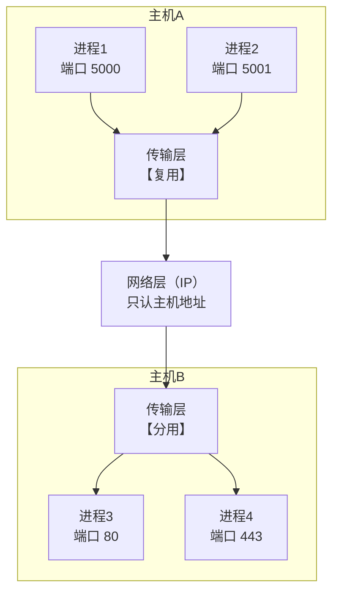
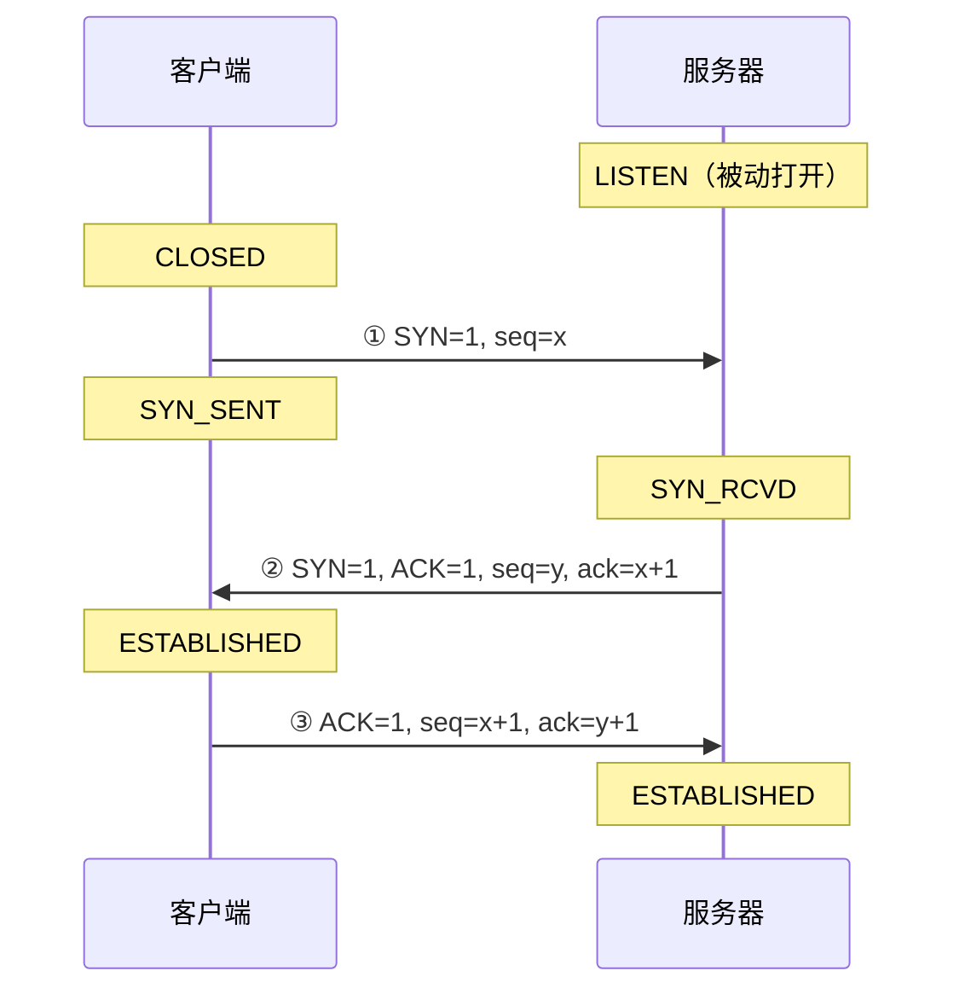
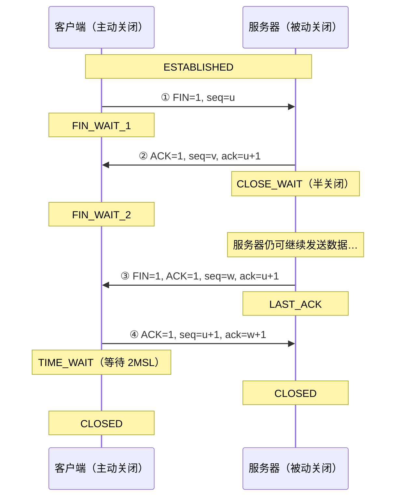
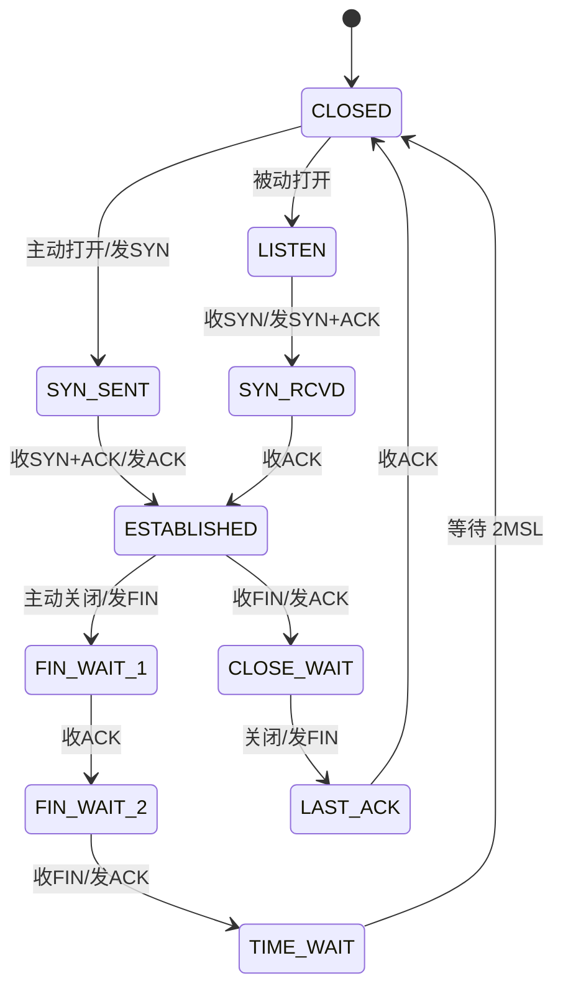
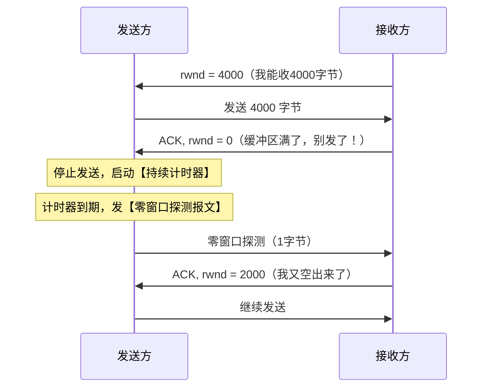
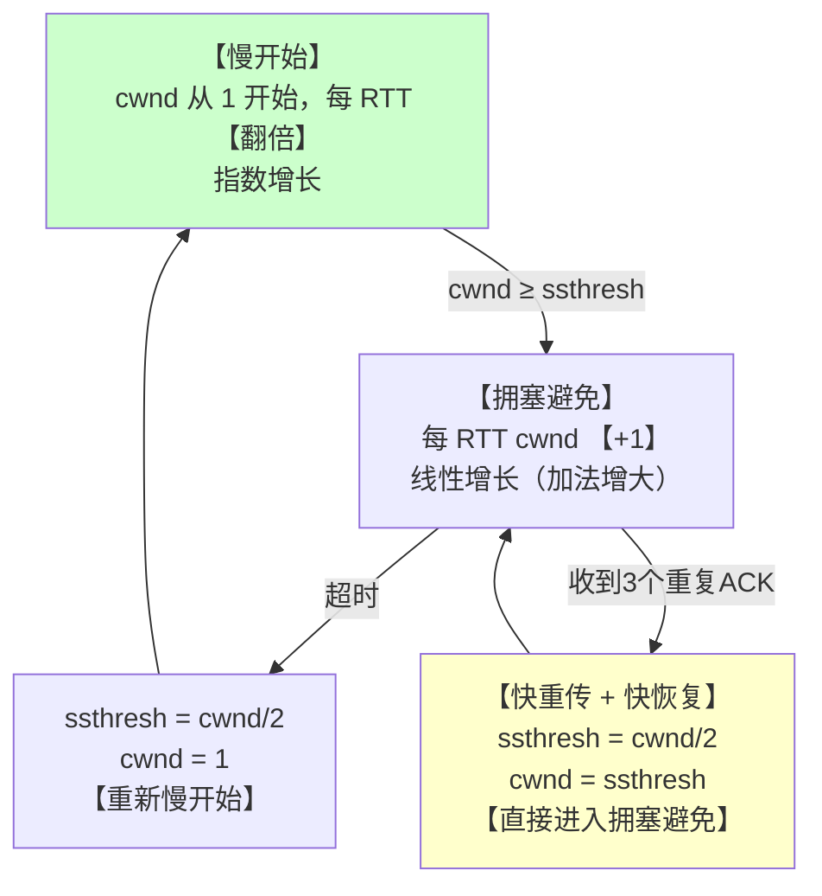
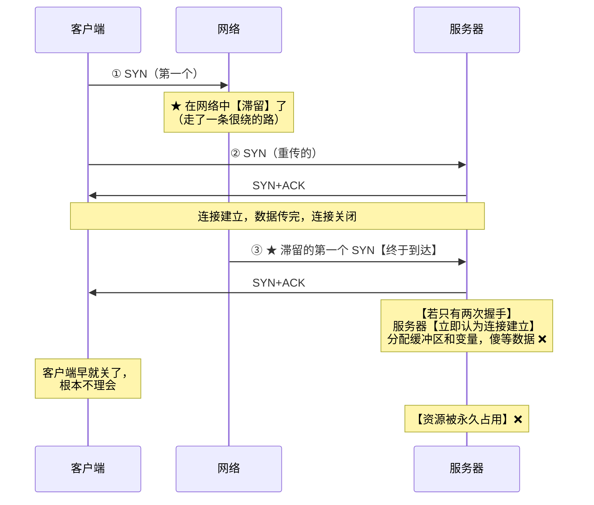
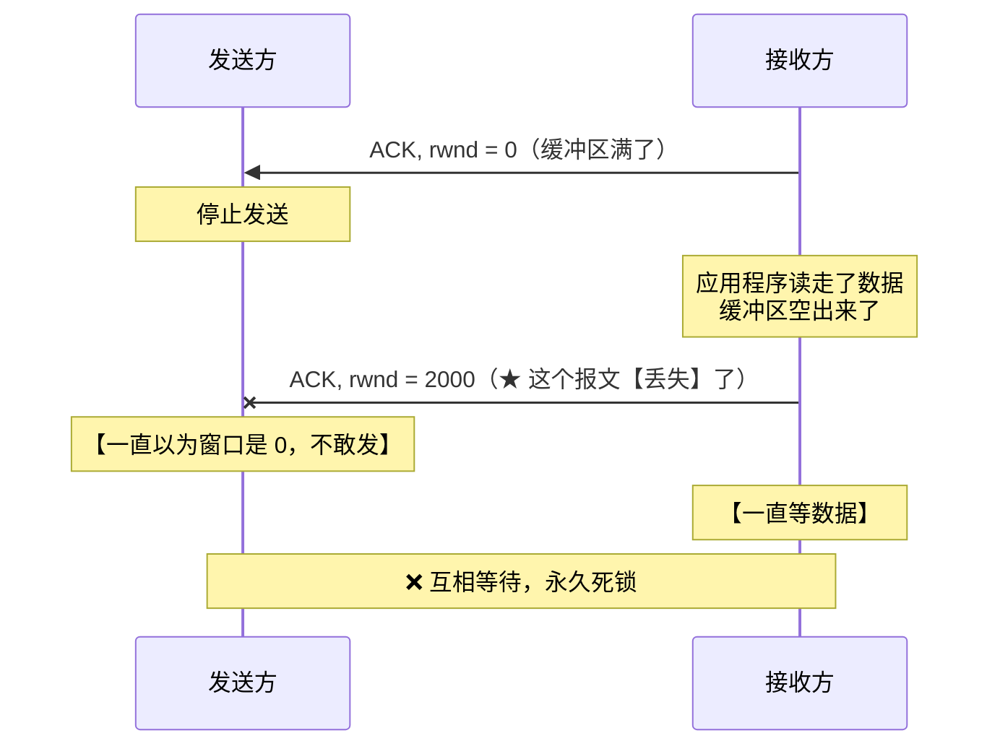
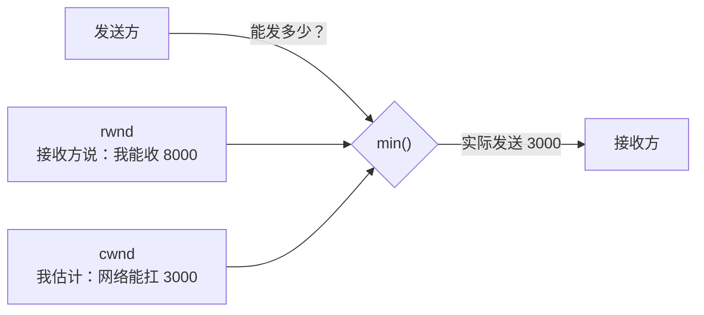

# 精通传输层：UDP、TCP 连接管理、可靠传输与拥塞控制

> 课程编号：CN05
> 路线图来源：计算机基础四大件 · 计算机网络（408 第 5 章）
> 难度：⭐⭐⭐⭐⭐
> 预计阅读时间：100 分钟
> 内容基准：2026 年 8 月（408 考纲计算机网络第 5 章「传输层」）
> **代码语言：Go**。本章用 Go 观察真实的 TCP 状态迁移与拥塞窗口变化。

---

## 引言：为什么关闭连接要"四次"，建立却只要"三次"

用 `netstat` 看一个刚关闭的连接：

```bash
$ ss -tan | grep 8080
TIME-WAIT  0  0  192.168.1.10:52341  93.184.216.34:8080
```

这个 `TIME_WAIT` 状态会**持续 60 秒**（Linux 的 2MSL）才消失。一台高并发的服务器上，可能有**几万个** TIME_WAIT 连接堆积，占着端口号。

**为什么要等这么久？直接关掉不行吗？**

答案藏在 TCP 连接管理的两个不对称设计里：

| | 建立连接 | 关闭连接 |
|---|---|---|
| **次数** | **三次**握手 | **四次**挥手 |
| **能否合并** | SYN 和 ACK **可以合并**（都是"我准备好了"） | FIN 和 ACK **不能合并** ⭐ |

**关键在于"半关闭"**：

```
客户端说"我发完了"（FIN）
     ↓
服务器回"知道了"（ACK）—— 但服务器【可能还有数据要发】！
     ↓
服务器继续发数据……（这段时间叫【半关闭】）
     ↓
服务器发完了，才说"我也发完了"（FIN）
     ↓
客户端回"知道了"（ACK）
```

**建立连接时不存在这个问题**——双方都还没数据要发，"我准备好了"和"知道你准备好了"可以合并成一个包。

而 **TIME_WAIT 等 2MSL** 是为了：

1. **保证最后那个 ACK 能到达**（若丢了，对方会重发 FIN，我还能再回一次）
2. **让本次连接的所有残留分组在网络中消失**（防止影响下一个用相同四元组的连接）

本章从这两个"为什么"出发，把传输层讲透：

```
① 传输层做什么：复用分用 + 端到端
② UDP：极简，只加了端口和检验和
③ TCP 连接管理：三次握手、四次挥手、状态机
④ TCP 可靠传输：序号、确认、重传
⑤ TCP 流量控制：滑动窗口（别把接收方撑爆）
⑥ TCP 拥塞控制：慢开始、拥塞避免、快重传、快恢复（别把网络撑爆）
```

读完你应该能：

- 说清传输层与网络层的分工（**端到端** vs 点到点）
- 对比 UDP 与 TCP 的六个维度差异
- **完整画出三次握手、四次挥手的报文与状态迁移**（408 必考）
- 解释"为什么是三次不是两次""为什么要等 2MSL"
- **手工模拟拥塞窗口的变化**（慢开始 / 拥塞避免 / 快恢复）
- 区分**流量控制**与**拥塞控制**

---

## 第一章 传输层的功能

### 1.1 两个核心职责

| 职责 | 说明 |
|---|---|
| **① 提供进程到进程的通信** | 网络层只到主机（IP），**传输层用【端口号】定位到具体进程** |
| **② 复用与分用** | **复用**：多个进程共用一个传输层<br/>**分用**：根据端口号把数据交给正确的进程 |



> ⭐ **网络层 vs 传输层的分工**：
>
> | | 网络层（IP） | 传输层（TCP/UDP） |
> |---|---|---|
> | 通信单位 | **主机到主机** | **进程到进程** |
> | 通信范围 | **点到点**（相邻节点） | **端到端**（源↔目的主机） |
> | 寻址 | **IP 地址** | **端口号** |
> | 中间路由器是否参与 | ✅ 参与 | ❌ **完全不参与** |

### 1.2 端口号

**16 位，范围 0 ~ 65535。**

| 范围 | 类别 | 说明 |
|---|---|---|
| **0 ~ 1023** | **熟知端口** | 由 IANA 分配（HTTP 80、HTTPS 443、DNS 53、FTP 21、SSH 22） |
| **1024 ~ 49151** | 登记端口 | 需向 IANA 登记（MySQL 3306、Redis 6379） |
| **49152 ~ 65535** | **短暂/客户端端口** | 客户端**临时使用**，用完释放 |

**必背的熟知端口**：

| 端口 | 协议 | 传输层 |
|---|---|---|
| **20/21** | FTP（数据/控制） | TCP |
| **22** | SSH | TCP |
| **23** | Telnet | TCP |
| **25** | SMTP | TCP |
| **53** | **DNS** | **UDP（主要）/ TCP** ⭐ |
| **67/68** | **DHCP** | **UDP** |
| **69** | TFTP | **UDP** |
| **80** | HTTP | TCP |
| **110** | POP3 | TCP |
| **161** | SNMP | **UDP** |
| **443** | HTTPS | TCP |
| **520** | **RIP** | **UDP** |

**唯一标识一条连接的"五元组"**：

$$
\boxed{(\text{协议},\ \text{源 IP},\ \text{源端口},\ \text{目的 IP},\ \text{目的端口})}
$$

> 💡 **TCP 常说"四元组"**（协议固定为 TCP 时）。这就是为什么一台服务器的 80 端口能同时服务几十万个连接——**每个连接的客户端 IP:端口组合都不同**。

---

## 第二章 UDP（用户数据报协议）

### 2.1 UDP 首部（只有 8 字节）

```
 0                16                31
┌────────────────┬────────────────┐
│    源端口       │    目的端口     │
├────────────────┼────────────────┤
│     长度        │    检验和       │
└────────────────┴────────────────┘
```

| 字段 | 长度 | 说明 |
|---|---|---|
| 源端口 / 目的端口 | 各 2 字节 | |
| **长度** | 2 字节 | **首部 + 数据**，最小 8（只有首部） |
| **检验和** | 2 字节 | **可选**（IPv4 中可为 0 表示不检验；**IPv6 中强制**） |

### 2.2 UDP 的特点

| 特点 | 说明 |
|---|---|
| **无连接** | 不需要握手，**直接发** |
| **不可靠** | 不确认、**不重传**、可能丢失/乱序 |
| **面向报文** | **应用层给多少就发多少**，既不拆分也不合并 ⭐ |
| **无拥塞控制** | 网络拥塞时**照发不误**（适合实时应用） |
| **首部开销小** | **仅 8 字节**（TCP 至少 20 字节） |
| **支持一对一、一对多、多对多** | 可以**广播、组播** |

> ⭐ **"面向报文"的准确含义**：
>
> ```
> 应用层调用 sendto() 发 100 字节 → UDP 就发一个【100 字节的数据报】
> 应用层调用 sendto() 发 5 字节  → UDP 就发一个【5 字节的数据报】
>      ↓
> 接收方调用一次 recvfrom() 就收到【完整的一个报文】
>      ↓
> ★ 【不存在"粘包"问题】—— 报文边界被完整保留
> ```
>
> 而 **TCP 是"面向字节流"**：应用层的 write 边界**完全不被保留**，这就是"粘包"的来源。

### 2.3 UDP 检验和的特殊之处：伪首部

**UDP（和 TCP）的检验和要加上一个【伪首部】一起计算**：

```
┌──────────────────────────────────┐
│           源 IP 地址（4B）         │
├──────────────────────────────────┤
│          目的 IP 地址（4B）        │
├──────┬──────────┬────────────────┤
│  0   │ 协议(17) │   UDP 长度      │
└──────┴──────────┴────────────────┘
        ↑ 伪首部，【仅用于计算检验和，不实际传输】
```

> ⭐ **伪首部的作用：验证数据报是否送达了正确的目的地。**
>
> 因为伪首部包含**源 IP 和目的 IP**，若 IP 层出错把包送错了地方，接收方计算检验和时会**发现不匹配**。
>
> ⚠️ **这是一个"跨层"设计**——传输层的检验和用到了网络层的信息，**违反了严格的分层原则**，但换来了端到端的正确性保证。

---

## 第三章 TCP 概述与首部

### 3.1 TCP 的特点

| 特点 | 说明 |
|---|---|
| **面向连接** | 必须先建立连接（三次握手） |
| **仅支持一对一** | **不能广播、组播** ⭐ |
| **可靠交付** | 无差错、不丢失、不重复、**按序** |
| **全双工** | 双方都可以随时发送 |
| **面向字节流** | 应用层的写边界**不被保留** |

### 3.2 TCP 首部（20 ~ 60 字节）

```
 0        4        8      10          16                        31
┌─────────────────┬─────────────────────────────────────────────┐
│     源端口       │              目的端口                        │
├─────────────────┴─────────────────────────────────────────────┤
│                        序号 seq (32位)                         │
├───────────────────────────────────────────────────────────────┤
│                       确认号 ack (32位)                        │
├────────┬────────┬────────┬────────────────────────────────────┤
│数据偏移│  保留   │ 标志位  │            窗口 rwnd               │
├────────┴────────┴────────┼────────────────────────────────────┤
│         检验和            │             紧急指针                │
├──────────────────────────┴────────────────────────────────────┤
│                   选项（长度可变）+ 填充                        │
└───────────────────────────────────────────────────────────────┘
```

**关键字段**：

| 字段 | 说明 |
|---|---|
| **序号 seq** | 本报文段**第一个字节**的序号（**字节流的编号**） |
| **确认号 ack** | **期望收到的下一个字节**的序号 ⭐ |
| **数据偏移** | 首部长度，以 **4 字节**为单位 |
| **窗口 rwnd** | **接收窗口**——告诉对方"我还能收多少字节" |
| **检验和** | 含**伪首部** |

**六个标志位**：

| 标志 | 全称 | 含义 |
|---|---|---|
| **URG** | Urgent | 紧急指针有效 |
| **ACK** | Acknowledgment | **确认号有效**（连接建立后必须为 1） |
| **PSH** | Push | 尽快交付给应用层 |
| **RST** | Reset | **重置连接**（出现严重错误） |
| **SYN** | Synchronize | **同步序号**（建立连接时用） |
| **FIN** | Finish | **发送方数据已发完**（关闭连接时用） |

> ⚠️ **确认号 ack 的含义是"我期望收到的下一个字节"**，不是"我收到的最后一个字节"。
>
> ```
> 收到 seq=1000，数据 100 字节（覆盖 1000~1099）
>      ↓
> 回复 ack = 1100  ← 【期望下一个是 1100】，不是 1099
> ```

---

## 第四章 TCP 连接管理（核心考点）

### 4.1 三次握手



**逐步说明**：

| 步 | 报文 | 状态变化 | 含义 |
|---|---|---|---|
| **①** | `SYN=1, seq=x` | 客户端 → **SYN_SENT** | "我要连接，我的初始序号是 x" |
| **②** | `SYN=1, ACK=1, seq=y, ack=x+1` | 服务器 → **SYN_RCVD** | "同意，我的初始序号是 y，我确认收到了你的 x" |
| **③** | `ACK=1, seq=x+1, ack=y+1` | 双方 → **ESTABLISHED** | "我确认收到了你的 y" |

> ⚠️ **三个易错点**：
> 1. **SYN 报文不携带数据，但要消耗一个序号**（所以确认号是 x+1）
> 2. **第三次握手可以携带数据**（前两次不能）
> 3. **服务器在收到第三次握手后才进入 ESTABLISHED**，客户端在发出第三次时就进入了

#### 为什么是三次，不是两次？

**核心原因：防止【已失效的连接请求报文】突然到达服务器，造成资源浪费。**

**灾难场景（假设只有两次握手）**：

```
① 客户端发出 SYN（第一个），但它在网络中【滞留】了（走了一条很绕的路）
② 客户端超时，重发 SYN（第二个）
③ 第二个 SYN 正常完成连接，数据传输完毕，连接关闭
④ ★ 此时，第一个滞留的 SYN 【终于到达】服务器
     ↓
⑤ 服务器以为客户端又要建连接，回复 SYN+ACK
     ↓
⑥ 【若只有两次握手】→ 服务器【立即认为连接已建立】
     ↓
⑦ 服务器分配缓冲区、变量，【傻等客户端发数据】
     ↓
⑧ 但客户端根本不想连接（它早就关了）→ 【服务器资源被白白占用】❌
```

**三次握手如何解决**：

```
⑥' 服务器回复 SYN+ACK 后，进入 SYN_RCVD 状态，【等待第三次握手】
⑦' 客户端收到这个莫名其妙的 SYN+ACK
     ↓
    发现"我没有发起过这个连接" → 【不回复 ACK】（或回 RST）
     ↓
⑧' 服务器等不到第三次握手 → 超时后【释放资源】✅
```

> ⭐ **一句话**：**第三次握手的作用是"让客户端有机会说'我不想连'"。**
>
> **更本质的表述**：三次握手让**双方都确认了"对方的发送能力和接收能力都正常"**：
>
> | 握手 | 客户端确认了 | 服务器确认了 |
> |---|---|---|
> | 第 1 次后 | —— | **客户端能发，我能收** |
> | 第 2 次后 | **我能发我能收，对方能发能收** | —— |
> | **第 3 次后** | —— | **我能发，客户端能收** ⭐ |
>
> **少了第三次，服务器无法确认"自己发的东西客户端能收到"。**

#### SYN 洪泛攻击

```
攻击者发送大量【伪造源 IP】的 SYN 报文
     ↓
服务器为每个 SYN 分配资源（半连接队列），回复 SYN+ACK
     ↓
但源 IP 是伪造的 → 【永远等不到第三次握手】
     ↓
半连接队列被占满 → 【正常用户无法连接】❌
```

**防御手段**：**SYN Cookie**——服务器**不立即分配资源**，而是把连接信息编码进初始序号 y 中，等收到第三次握手时再还原并建立连接。

### 4.2 四次挥手



**逐步说明**：

| 步 | 报文 | 状态 | 含义 |
|---|---|---|---|
| **①** | `FIN=1, seq=u` | 客户端 → **FIN_WAIT_1** | "我的数据发完了" |
| **②** | `ACK=1, ack=u+1` | 服务器 → **CLOSE_WAIT**<br/>客户端 → **FIN_WAIT_2** | "知道了"（**但我可能还有数据要发**） |
| **③** | `FIN=1, ACK=1, seq=w` | 服务器 → **LAST_ACK** | "我的数据也发完了" |
| **④** | `ACK=1, ack=w+1` | 客户端 → **TIME_WAIT**<br/>服务器 → **CLOSED** | "知道了" |

#### 为什么是四次，不是三次？

**核心原因：TCP 是【全双工】的，两个方向要【分别关闭】。**

```
客户端说"我不发了" ≠ 服务器也不发了
     ↓
服务器收到 FIN 后：
  - 必须【立即】回 ACK（TCP 要求及时确认）
  - 但它【可能还有数据没发完】
     ↓
★ 所以 ACK 和 FIN 【不能合并】
     ↓
中间这段"客户端不发、服务器还在发"的状态 = 【半关闭 half-close】
```

**对比三次握手**：

```
建立连接时：双方都还没数据要发
     ↓
"我同意连接"（ACK）和 "我也要连接"（SYN）
可以【合并成一个包】✅
     ↓
所以只要三次
```

> ⭐ **一句话**：**握手能合并是因为双方都"空手"；挥手不能合并是因为一方可能"手里还有货"。**

#### 为什么 TIME_WAIT 要等 2MSL？

**MSL（Maximum Segment Lifetime，最长报文段寿命）**：一个 TCP 报文段在网络中能存活的最长时间。RFC 建议 2 分钟，**Linux 实际用 30 秒（所以 2MSL = 60 秒）**。

**两个理由**：

**理由一：保证最后那个 ACK 能到达服务器**

```
若客户端发完第四次挥手（ACK）就立即关闭：
     ↓
★ 万一这个 ACK 【丢失】了
     ↓
服务器收不到 ACK，会【超时重传 FIN】
     ↓
但客户端已经关了 → 收到 FIN 会回 【RST】
     ↓
服务器认为"连接异常关闭"，无法正常释放资源 ❌

有 TIME_WAIT 的话：
     ↓
客户端在 TIME_WAIT 期间收到重传的 FIN
     ↓
【重发 ACK】，并【重置 2MSL 计时器】✅
```

**理由二：让本次连接的所有报文段在网络中消失**

```
若客户端立即关闭，并【立刻】用相同的四元组建立新连接：
     ↓
★ 上一个连接残留在网络中的【迟到报文】可能到达
     ↓
新连接会把它当成【自己的数据】接收 ❌ 【数据错乱】

等待 2MSL 后：
     ↓
所有旧连接的报文都已【超过 MSL 而被丢弃】
     ↓
新连接不会受到"上辈子"的干扰 ✅
```

> ⚠️ **为什么是 2 倍 MSL 而不是 1 倍**？
>
> ```
> 最坏情况：
>   客户端发出的最后一个 ACK，在网络中存活了【1 个 MSL】才到达（或丢失）
>   服务器超时重传的 FIN，又要在网络中存活【1 个 MSL】才到客户端
>        ↓
>   总共 【2 MSL】
> ```

**TIME_WAIT 的工程问题**：

```
高并发服务器（尤其是【主动关闭连接】的一方）会堆积大量 TIME_WAIT
     ↓
每个 TIME_WAIT 占用一个【端口号】（客户端侧）或一个【连接表项】
     ↓
端口耗尽（65535 上限）→ 无法建立新连接 ❌
```

**缓解手段**：

| 手段 | 说明 |
|---|---|
| `net.ipv4.tcp_tw_reuse = 1` | 允许**复用** TIME_WAIT 的连接（需配合时间戳选项） |
| **让客户端主动关闭** | 把 TIME_WAIT 的负担从服务器转移到客户端 |
| **连接复用（Keep-Alive）** | **根本解法**——减少连接的建立和关闭次数 |

### 4.3 TCP 状态机（必须能画）



**十一个状态的归属**：

| 状态 | 出现在 |
|---|---|
| `LISTEN`、`SYN_RCVD` | **服务器**（被动打开） |
| `SYN_SENT` | **客户端**（主动打开） |
| `ESTABLISHED` | 双方 |
| `FIN_WAIT_1`、`FIN_WAIT_2`、**`TIME_WAIT`** | **主动关闭方** ⭐ |
| `CLOSE_WAIT`、`LAST_ACK` | **被动关闭方** |

> 💡 **排查线上问题的经验**：
> - **大量 `CLOSE_WAIT`** → **你的程序收到 FIN 后没有调用 close()**（代码 bug！）
> - **大量 `TIME_WAIT`** → 你的程序是**主动关闭方**且连接创建过于频繁（正常但需优化）

---

## 第五章 TCP 可靠传输

### 5.1 三大机制

| 机制 | 说明 |
|---|---|
| **① 序号 + 确认** | 每个字节都有序号；接收方用 **ack 累积确认** |
| **② 超时重传** | 发出后启动定时器，超时未确认就重传 |
| **③ 快速重传** | 收到 **3 个重复 ACK** 就立即重传（不等超时）⭐ |

### 5.2 超时时间 RTO 的计算

**问题**：超时时间设多久？

- **太短** → 频繁误重传，加剧拥塞
- **太长** → 丢包后恢复慢

**Jacobson 算法**（TCP 实际使用）：

$$
RTT_S = (1-\alpha)\cdot RTT_S + \alpha \cdot RTT_{新样本} \quad (\alpha = 1/8)
$$

$$
RTT_D = (1-\beta)\cdot RTT_D + \beta \cdot |RTT_S - RTT_{新样本}| \quad (\beta = 1/4)
$$

$$
\boxed{RTO = RTT_S + 4 \times RTT_D}
$$

- $RTT_S$：**加权平均往返时间**（平滑值）
- $RTT_D$：**RTT 的偏差**（波动程度）

> ⭐ **为什么要加 $4 \times RTT_D$**：**网络越不稳定（波动越大），超时时间就该留越多余量**。这比"固定乘以 2"聪明得多。

**Karn 算法**：**重传的报文段，其 RTT 样本不计入统计**。

```
为什么？
  发出报文 → 超时 → 重传 → 收到 ACK
       ↓
  ★ 这个 ACK 是确认【原报文】还是【重传的报文】？无法区分
       ↓
  若算错，RTT 会严重失真
       ↓
  Karn：干脆【不采样重传的报文】

修正：每重传一次，把 RTO 【加倍】（指数退避）
```

### 5.3 快速重传

**问题**：等超时太慢（RTO 通常是 RTT 的好几倍）。

**快速重传的规则**：

```
接收方：
  收到【失序】的报文段 → 立即发送【重复的 ACK】
       （重复确认它期望的那个序号）

发送方：
  连续收到 【3 个重复 ACK】 → 【立即重传】那个丢失的段
       ↓
  不必等超时 ✅
```

**示意**：

```
发送方发出：seq=1000, 2000, 3000, 4000, 5000
                       ↑ 丢失

接收方：
  收到 1000 → ACK 2000
  收到 3000（失序）→ 【ACK 2000】（重复）  ← 第1个重复ACK
  收到 4000（失序）→ 【ACK 2000】（重复）  ← 第2个重复ACK
  收到 5000（失序）→ 【ACK 2000】（重复）  ← 第3个重复ACK
       ↓
发送方收到 3 个重复 ACK → 【立即重传 seq=2000】✅
```

> ⚠️ **为什么是 3 个而不是 1 个？**
>
> 因为**网络本身就可能造成乱序**。收到 1~2 个重复 ACK 可能只是**轻微乱序**（后面的包先到了）；**3 个**才足以判定"确实丢包了"。这是**误判率与响应速度的平衡点**。

---

## 第六章 TCP 流量控制

**目的：防止发送方发得太快，把【接收方】的缓冲区撑爆。**

**手段：接收方通过 `窗口 rwnd` 字段告诉发送方"我还能收多少"。**



### 死锁问题与零窗口探测

```
若接收方发出 rwnd = 0 后，稍后又发 rwnd = 2000
     ↓
★ 但这个"窗口更新"报文【丢失】了
     ↓
发送方：一直以为窗口是 0，不敢发
接收方：一直等数据
     ↓
【互相等待，死锁】❌
```

**解法：持续计时器（Persistence Timer）**

```
发送方收到 rwnd=0 后，启动【持续计时器】
     ↓
计时器到期 → 发送一个【零窗口探测报文】（仅 1 字节）
     ↓
接收方必须回复，报告【当前的窗口值】
     ↓
★ 打破死锁 ✅
```

> ⭐ **这是一个重要的设计模式**：**当协议依赖"对方主动通知"时，必须有一个"主动探测"的兜底机制**——因为通知本身也可能丢失。

---

## 第七章 TCP 拥塞控制（核心考点）

### 7.1 流量控制 vs 拥塞控制（必考辨析）

| 维度 | **流量控制** | **拥塞控制** |
|---|---|---|
| **目的** | 防止**接收方**被撑爆 | 防止**网络**被撑爆 |
| **考虑的对象** | **点对点**（两个端） | **全局**（整个网络） |
| **控制手段** | **接收窗口 rwnd**（接收方告知） | **拥塞窗口 cwnd**（发送方**自己估计**） |
| **信息来源** | 接收方**明确告知** | **推测**（靠丢包/延迟信号） |

**发送窗口的实际取值**：

$$
\boxed{\text{发送窗口} = \min(rwnd,\ cwnd)}
$$

> ⭐ **两个"瓶颈"，取更严格的那个**：接收方的能力（rwnd）和网络的能力（cwnd），哪个小听哪个。

### 7.2 四个算法



#### ① 慢开始（Slow Start）

```
初始：cwnd = 1（单位是 MSS，最大报文段长度）
每收到一个 ACK → cwnd += 1
     ↓
效果：【每经过一个 RTT，cwnd 翻倍】
     1 → 2 → 4 → 8 → 16 → ...  （指数增长）
```

> ⚠️ **"慢开始"这个名字有误导性**——它增长得**一点也不慢**（指数级）！"慢"指的是**起点低**（从 1 开始），而不是增速慢。

#### ② 拥塞避免（Congestion Avoidance）

```
当 cwnd ≥ ssthresh（慢开始门限）时，切换到拥塞避免：
     ↓
每经过一个 RTT → cwnd += 1
     ↓
效果：【线性增长】（加法增大 AI）
     16 → 17 → 18 → 19 → ...
```

#### ③ 超时的处理（乘法减小 MD）

```
发生【超时】（认为网络严重拥塞）：
     ssthresh = cwnd / 2      ← 【乘法减小】
     cwnd = 1                 ← 【回到起点】
     重新开始【慢开始】
```

#### ④ 快重传 + 快恢复

```
收到【3 个重复 ACK】（网络只是轻微拥塞，还能收到后续包）：
     ssthresh = cwnd / 2
     cwnd = ssthresh          ← ★ 【不回到 1】
     直接进入【拥塞避免】（线性增长）
```

> ⭐ **超时 vs 3个重复ACK 的区别**：
>
> | 信号 | 网络状况的推断 | 处理 |
> |---|---|---|
> | **超时** | **严重拥塞**（连续多个包都丢了，ACK 都收不到） | **cwnd = 1**，重新慢开始 |
> | **3 个重复 ACK** | **轻微拥塞**（只丢了个别包，后续包还能到达） | **cwnd = ssthresh**，直接拥塞避免 |
>
> **"还能收到重复 ACK" 本身就说明网络还通**——所以不必像超时那样从头再来。

### 7.3 完整的拥塞窗口演化例题

**初始 cwnd = 1，ssthresh = 8。在第 12 个 RTT 时发生超时，第 18 个 RTT 时收到 3 个重复 ACK。**

| RTT 轮次 | cwnd | ssthresh | 阶段 | 说明 |
|---|---|---|---|---|
| 1 | **1** | 8 | 慢开始 | 起点 |
| 2 | **2** | 8 | 慢开始 | 翻倍 |
| 3 | **4** | 8 | 慢开始 | 翻倍 |
| 4 | **8** | 8 | 慢开始 | 翻倍，**达到 ssthresh** |
| 5 | **9** | 8 | **拥塞避免** | 切换，开始 +1 |
| 6 | **10** | 8 | 拥塞避免 | |
| 7 | **11** | 8 | 拥塞避免 | |
| 8 | **12** | 8 | 拥塞避免 | |
| 9 | **13** | 8 | 拥塞避免 | |
| 10 | **14** | 8 | 拥塞避免 | |
| 11 | **15** | 8 | 拥塞避免 | |
| **12** | **16** | 8 | **超时！** | cwnd=16 时超时 |
| 13 | **1** | **8** | 慢开始 | **ssthresh = 16/2 = 8**，cwnd = 1 |
| 14 | **2** | 8 | 慢开始 | |
| 15 | **4** | 8 | 慢开始 | |
| 16 | **8** | 8 | 慢开始 | 达到 ssthresh |
| 17 | **9** | 8 | 拥塞避免 | |
| **18** | **10** | 8 | **3 个重复 ACK！** | cwnd=10 时快重传 |
| 19 | **5** | **5** | **快恢复** | **ssthresh = 10/2 = 5**，**cwnd = 5** |
| 20 | **6** | 5 | 拥塞避免 | **直接线性增长**（不回到 1）⭐ |
| 21 | **7** | 5 | 拥塞避免 | |

> ⚠️ **画拥塞窗口曲线时的三个关键点**：
> 1. **慢开始是指数（翻倍）**，拥塞避免是**线性（+1）**
> 2. **超时** → ssthresh 减半，**cwnd 回到 1**
> 3. **3 个重复 ACK** → ssthresh 减半，**cwnd = ssthresh**（不回 1）

### 7.4 用 Go 模拟拥塞窗口

```go
package main

import "fmt"

type TCPCongestion struct {
    cwnd     int
    ssthresh int
}

func (t *TCPCongestion) onACK() {
    if t.cwnd < t.ssthresh {
        t.cwnd *= 2 // ★ 慢开始：每 RTT 翻倍
    } else {
        t.cwnd++ // ★ 拥塞避免：每 RTT +1
    }
}

func (t *TCPCongestion) onTimeout() {
    t.ssthresh = t.cwnd / 2
    if t.ssthresh < 2 {
        t.ssthresh = 2
    }
    t.cwnd = 1 // ★ 超时：回到起点
}

func (t *TCPCongestion) onTripleDupACK() {
    t.ssthresh = t.cwnd / 2
    if t.ssthresh < 2 {
        t.ssthresh = 2
    }
    t.cwnd = t.ssthresh // ★ 快恢复：不回到 1
}

func main() {
    t := &TCPCongestion{cwnd: 1, ssthresh: 8}
    timeoutAt, dupACKAt := 12, 18

    fmt.Printf("%-6s %-8s %-10s %s\n", "RTT", "cwnd", "ssthresh", "阶段/事件")
    for rtt := 1; rtt <= 21; rtt++ {
        stage := "慢开始"
        if t.cwnd >= t.ssthresh {
            stage = "拥塞避免"
        }
        event := ""

        fmt.Printf("%-6d %-8d %-10d %s%s\n", rtt, t.cwnd, t.ssthresh, stage, event)

        switch rtt {
        case timeoutAt:
            t.onTimeout()
            fmt.Printf("       ★ 【超时】→ ssthresh=%d, cwnd=%d\n", t.ssthresh, t.cwnd)
        case dupACKAt:
            t.onTripleDupACK()
            fmt.Printf("       ★ 【3个重复ACK】→ ssthresh=%d, cwnd=%d（快恢复）\n", t.ssthresh, t.cwnd)
        default:
            t.onACK()
        }
    }
}
```

**输出**（与手算表格完全一致）：

```
RTT    cwnd     ssthresh   阶段/事件
1      1        8          慢开始
2      2        8          慢开始
3      4        8          慢开始
4      8        8          拥塞避免
5      9        8          拥塞避免
...
12     16       8          拥塞避免
       ★ 【超时】→ ssthresh=8, cwnd=1
13     1        8          慢开始
14     2        8          慢开始
15     4        8          慢开始
16     8        8          拥塞避免
17     9        8          拥塞避免
18     10       8          拥塞避免
       ★ 【3个重复ACK】→ ssthresh=5, cwnd=5（快恢复）
19     5        5          拥塞避免
20     6        5          拥塞避免
21     7        5          拥塞避免
```

### 7.5 用 Go 观察真实的 TCP 状态

```go
package main

import (
    "fmt"
    "net"
    "os/exec"
    "time"
)

func main() {
    // 起一个服务器
    ln, _ := net.Listen("tcp", "127.0.0.1:0")
    defer ln.Close()
    addr := ln.Addr().String()

    go func() {
        conn, _ := ln.Accept()
        buf := make([]byte, 1024)
        conn.Read(buf)
        conn.Write([]byte("hello"))
        conn.Close() // ★ 服务器主动关闭 → 服务器进入 TIME_WAIT
    }()

    conn, _ := net.Dial("tcp", addr)
    conn.Write([]byte("hi"))
    buf := make([]byte, 1024)
    conn.Read(buf)

    fmt.Println("=== 连接建立时的状态 ===")
    out, _ := exec.Command("ss", "-tan").Output()
    fmt.Println(string(out))

    conn.Close()
    time.Sleep(100 * time.Millisecond)

    fmt.Println("=== 关闭后的状态（注意 TIME_WAIT）===")
    out, _ = exec.Command("ss", "-tan").Output()
    fmt.Println(string(out))
}
```

**观察要点**：

```bash
# 统计各状态的连接数
ss -tan | awk 'NR>1 {print $1}' | sort | uniq -c

# 典型输出：
#   5 ESTAB
#  38 TIME-WAIT      ← 主动关闭方留下的
#   2 LISTEN
#   0 CLOSE-WAIT     ← 若这个数字持续增长，说明代码忘了 close()！
```

> ⚠️ **`CLOSE_WAIT` 堆积是一个明确的代码 bug 信号**：
>
> ```
> 对方发来 FIN → 你的 TCP 自动回 ACK → 进入 CLOSE_WAIT
>      ↓
> ★ 接下来必须由【你的程序】调用 close() 才能发出 FIN
>      ↓
> 若程序忘了调 close()（比如异常路径没有 defer conn.Close()）
>      ↓
> 【永远卡在 CLOSE_WAIT】→ 文件描述符泄漏 → 最终 "too many open files" ❌
> ```
>
> **Go 里的标准写法**：`defer conn.Close()`。

---

## 第八章 UDP vs TCP 全面对比

| 维度 | **UDP** | **TCP** |
|---|---|---|
| **是否连接** | **无连接** | **面向连接**（三次握手） |
| **可靠性** | **不可靠**（不确认、不重传） | **可靠**（确认、重传、排序、去重） |
| **数据边界** | **面向报文**（保留边界）⭐ | **面向字节流**（不保留边界） |
| **有序性** | ❌ 不保证 | ✅ **保证按序交付** |
| **流量控制** | ❌ 无 | ✅ **滑动窗口** |
| **拥塞控制** | ❌ **无**（网络拥塞照发） | ✅ **有**（四个算法） |
| **首部开销** | **8 字节** | **20 ~ 60 字节** |
| **通信方式** | 一对一、**一对多、多对多**（支持广播组播） | **仅一对一** ⭐ |
| **速度** | **快** | 较慢 |
| **典型应用** | **DNS、DHCP、TFTP、SNMP、视频直播、游戏** | **HTTP、FTP、SMTP、SSH** |

> ⭐ **选择依据**：
>
> | 需求 | 选择 |
> |---|---|
> | **必须可靠、有序** | **TCP** |
> | **要求低延迟，能容忍少量丢包** | **UDP**（实时音视频、游戏） |
> | **一次请求一次响应，数据量小** | **UDP**（DNS——重传的代价比握手还小） |
> | **需要广播/组播** | **UDP**（TCP 做不到） |

> 💡 **HTTP/3 用 UDP（QUIC）** 是个有趣的例子：它在 UDP 之上**用户态重新实现了可靠传输和拥塞控制**——为的是绕开 TCP 的队头阻塞和内核协议栈的僵化，同时保留可靠性。

---

## 第九章 408 高频考点与陷阱清单

### 9.1 考点分布

第 5 章是计算机网络**分值最高**的章节之一：**2-3 道选择题 + 几乎必有的大题**（握手挥手 / 拥塞控制）。

最常考：

1. **三次握手/四次挥手的报文序号与状态**（大题必考）
2. **拥塞窗口的变化计算与曲线**（大题必考）
3. 为什么三次握手、为什么 2MSL
4. 流量控制 vs 拥塞控制
5. UDP 与 TCP 的对比

### 9.2 十八个陷阱

**陷阱 1：UDP 完全不提供差错检测**

**错**。UDP **有检验和**（虽然在 IPv4 中是可选的，IPv6 中强制）。它只是**检错不重传**。

**陷阱 2：TCP 保留应用层的写边界**

**错**。**TCP 是面向字节流的**，`write` 的边界**完全不被保留**（这就是"粘包"）。**UDP 才是面向报文，保留边界**。

**陷阱 3：TCP 支持广播和组播**

**错**。**TCP 只支持一对一**。广播组播只能用 **UDP**。

**陷阱 4：确认号 ack 表示"已收到的最后一个字节"**

**错**。ack 表示**"期望收到的下一个字节的序号"**。

**陷阱 5：SYN 报文不消耗序号**

**错**。**SYN 和 FIN 虽然不携带数据，但都要消耗一个序号**。

**陷阱 6：三次握手的第三次不能携带数据**

**错**。**第三次握手可以携带数据**（前两次不能）。

**陷阱 7：两次握手就够了**

**错**。少了第三次，**服务器无法确认"自己发的东西客户端能收到"**，且**已失效的连接请求会导致服务器资源浪费**。

**陷阱 8：四次挥手中的 ACK 和 FIN 可以合并**

**通常不能**。因为被动关闭方收到 FIN 后**可能还有数据要发**（半关闭状态）。**只有当它恰好也没数据要发时，才可能合并成三次**（Linux 有此优化）。

**陷阱 9：TIME_WAIT 出现在被动关闭方**

**错**。**TIME_WAIT 只出现在【主动关闭方】**。被动关闭方是 `CLOSE_WAIT` 和 `LAST_ACK`。

**陷阱 10：TIME_WAIT 等待 1 个 MSL**

**错，是 2MSL**。因为最坏情况下"ACK 走 1 个 MSL + 重传的 FIN 走 1 个 MSL"。

**陷阱 11：快速重传需要收到 2 个重复 ACK**

**错，是 3 个**。1~2 个可能只是网络乱序。

**陷阱 12：重传报文的 RTT 样本要计入统计**

**错**。**Karn 算法规定：重传的报文段不采样 RTT**（无法区分 ACK 确认的是原报文还是重传的）。

**陷阱 13：慢开始的增长速度很慢**

**错**。**慢开始是指数增长（每 RTT 翻倍）**，非常快！"慢"指的是**起点低**（从 1 开始）。

**陷阱 14：拥塞避免阶段 cwnd 每收到一个 ACK 就 +1**

**错**。拥塞避免是**每经过一个 RTT，cwnd 才 +1**（不是每个 ACK）。

**陷阱 15：超时和 3 个重复 ACK 的处理相同**

**错**：

| 事件 | ssthresh | cwnd |
|---|---|---|
| **超时** | cwnd/2 | **1**（重新慢开始） |
| **3 个重复 ACK** | cwnd/2 | **ssthresh**（快恢复，直接拥塞避免） |

**陷阱 16：流量控制和拥塞控制是一回事**

**错**：

| | 流量控制 | 拥塞控制 |
|---|---|---|
| 防止谁被撑爆 | **接收方** | **网络** |
| 用什么窗口 | **rwnd**（接收方告知） | **cwnd**（发送方估计） |

**陷阱 17：发送窗口等于拥塞窗口**

**错**。$\text{发送窗口} = \min(rwnd, cwnd)$——**取两者的较小值**。

**陷阱 18：DNS 只使用 UDP**

**不准确**。DNS **主要用 UDP（53 端口）**，但在**响应超过 512 字节**或**区域传送**时**使用 TCP**。

### 9.3 速查卡

```
【端口】
0~1023 熟知端口   1024~49151 登记   49152~65535 短暂
必背：FTP 20/21、SSH 22、SMTP 25、【DNS 53】、【DHCP 67/68】、
      HTTP 80、POP3 110、HTTPS 443、【RIP 520】
四元组：(源IP, 源端口, 目的IP, 目的端口)

【UDP】
首部【8字节】；面向【报文】（保留边界）；无连接、不可靠、无拥塞控制
支持【广播组播】；检验和含【伪首部】

【TCP 首部关键字段】
seq：本段第一个字节的序号
ack：【期望收到的下一个字节】的序号
数据偏移：以【4字节】为单位
标志位：URG ACK PSH RST SYN FIN

【三次握手】
① SYN=1, seq=x                    → SYN_SENT
② SYN=1,ACK=1, seq=y, ack=x+1     → SYN_RCVD
③ ACK=1, seq=x+1, ack=y+1         → ESTABLISHED
★ SYN/FIN 不带数据但【消耗序号】
★ 第三次【可以携带数据】
★ 为什么三次：防止【已失效的连接请求】浪费服务器资源

【四次挥手】
① FIN=1, seq=u          → FIN_WAIT_1
② ACK, ack=u+1          → CLOSE_WAIT / FIN_WAIT_2  ★【半关闭】
③ FIN=1, seq=w          → LAST_ACK
④ ACK, ack=w+1          → 【TIME_WAIT】/ CLOSED
★ 为什么四次：全双工，两个方向【分别关闭】，被动方可能还有数据
★ TIME_WAIT 等【2MSL】：① 保证最后ACK到达 ② 让旧报文消失
★ TIME_WAIT 只在【主动关闭方】

【可靠传输】
RTO = RTT_S + 4×RTT_D
Karn：重传的报文【不采样 RTT】，每重传一次 RTO 加倍
快重传：收到【3个】重复 ACK 立即重传

【流量控制 vs 拥塞控制】
流量控制：防【接收方】撑爆，用【rwnd】（接收方告知）
拥塞控制：防【网络】撑爆，用【cwnd】（发送方估计）
发送窗口 = min(rwnd, cwnd)

【拥塞控制四算法】★★★
慢开始  ：cwnd 从1开始，每RTT【翻倍】（指数）
拥塞避免：cwnd ≥ ssthresh 后，每RTT【+1】（线性）
超时    ：ssthresh = cwnd/2，【cwnd = 1】，重新慢开始
3个重复ACK：ssthresh = cwnd/2，【cwnd = ssthresh】，直接拥塞避免
```

---

## 第十章 Go ↔ C 对照

| 场景 | C | Go | 说明 |
|---|---|---|---|
| 建立 TCP 连接 | `socket`+`connect` | `net.Dial("tcp", addr)` | |
| 监听 | `socket`+`bind`+`listen`+`accept` | `net.Listen` + `Accept` | |
| UDP | `socket(SOCK_DGRAM)` | `net.ListenPacket("udp", ...)` | |
| 关闭写方向（半关闭） | `shutdown(fd, SHUT_WR)` | **`conn.(*net.TCPConn).CloseWrite()`** ⭐ | 发 FIN 但仍能收 |
| 设置 Keep-Alive | `setsockopt(SO_KEEPALIVE)` | `conn.SetKeepAlive(true)` | |
| 禁用 Nagle 算法 | `setsockopt(TCP_NODELAY)` | `conn.SetNoDelay(true)` | 低延迟场景 |
| 查看拥塞窗口 | `getsockopt(TCP_INFO)` | `golang.org/x/sys/unix` | |
| 端口复用 | `setsockopt(SO_REUSEADDR)` | `net.ListenConfig{Control: ...}` | |

```go
package main

import (
    "fmt"
    "io"
    "net"
)

func main() {
    // ★ 演示"半关闭"—— 这正是四次挥手中间那个状态
    ln, _ := net.Listen("tcp", "127.0.0.1:0")
    defer ln.Close()

    go func() {
        conn, _ := ln.Accept()
        defer conn.Close()

        // 读到 EOF（对方 CloseWrite 发来了 FIN）
        data, _ := io.ReadAll(conn)
        fmt.Printf("服务器收到: %q（对方已半关闭）\n", data)

        // ★ 此时服务器【仍然可以】继续发送数据
        conn.Write([]byte("我还有话说"))
    }()

    conn, _ := net.Dial("tcp", ln.Addr().String())
    defer conn.Close()

    conn.Write([]byte("我说完了"))
    conn.(*net.TCPConn).CloseWrite() // ★ 只关闭写方向，发出 FIN

    // ★ 仍然可以继续读
    reply, _ := io.ReadAll(conn)
    fmt.Printf("客户端收到: %q\n", reply)
}
```

**输出**：

```
服务器收到: "我说完了"（对方已半关闭）
客户端收到: "我还有话说"
```

> ⭐ **`CloseWrite()` 就是四次挥手中"半关闭"的直接体现**：
>
> - 客户端发出 FIN（"我不发了"）
> - 但**仍然保持接收能力**
> - 服务器收到 FIN 后，**依然能继续发数据**
>
> **这正是"为什么挥手要四次"的最直观演示**——如果 ACK 和 FIN 合并，服务器就没机会发这句"我还有话说"了。

**观察拥塞窗口**：

```bash
# 实时查看连接的拥塞窗口和 RTT
ss -tin

# 输出示例：
# cubic wscale:7,7 rto:204 rtt:2.5/1.2 mss:1448 cwnd:10 ssthresh:7
#                                              ↑ 拥塞窗口  ↑ 慢开始门限
```

---

## 第十一章 练习题

### 选择题

**1.** 传输层实现的是：
A. 主机到主机的通信
B. 进程到进程的通信
C. 点到点的通信
D. 网络到网络的通信

**2.** DNS 协议主要使用的传输层协议和端口是：
A. TCP, 53　B. UDP, 53　C. TCP, 25　D. UDP, 67

**3.** 关于 UDP，**错误**的是：
A. 首部只有 8 字节
B. 面向报文，保留应用层的数据边界
C. 提供可靠交付
D. 支持一对多通信

**4.** TCP 首部中"确认号 ack = 1001"表示：
A. 已经收到序号为 1001 的字节
B. 已经收到序号 1000 及之前的所有字节，期望下一个是 1001
C. 已经收到 1001 个字节
D. 下一个要发送的字节序号是 1001

**5.** TCP 三次握手中，第二次握手报文的标志位设置是：
A. SYN=1, ACK=0
B. SYN=1, ACK=1
C. SYN=0, ACK=1
D. FIN=1, ACK=1

**6.** 采用三次握手而非两次握手的主要原因是：
A. 提高传输效率
B. 防止已失效的连接请求报文到达服务器，造成资源浪费
C. 便于协商窗口大小
D. 符合国际标准

**7.** TCP 连接中，TIME_WAIT 状态出现在：
A. 被动关闭方　B. 主动关闭方　C. 双方都有　D. 服务器端

**8.** TIME_WAIT 状态需要等待的时间是：
A. 1 个 MSL　B. 2 个 MSL　C. 1 个 RTT　D. 2 个 RTT

**9.** TCP 快速重传的触发条件是发送方收到：
A. 1 个重复 ACK
B. 2 个重复 ACK
C. 3 个重复 ACK
D. 超时

**10.** TCP 慢开始阶段，拥塞窗口 cwnd 的增长方式是：
A. 每个 RTT 增加 1
B. 每个 RTT 翻倍（指数增长）
C. 每收到一个 ACK 增加 1 个 RTT
D. 保持不变

**11.** 当 TCP 发生超时重传时，正确的处理是：
A. ssthresh = cwnd/2, cwnd = ssthresh
B. ssthresh = cwnd/2, cwnd = 1
C. ssthresh 不变, cwnd = 1
D. ssthresh = cwnd, cwnd = 1

**12.** TCP 发送窗口的大小应该取：
A. 接收窗口 rwnd
B. 拥塞窗口 cwnd
C. min(rwnd, cwnd)
D. max(rwnd, cwnd)

### 应用题

**13.** 主机 A 向主机 B 发起 TCP 连接，A 的初始序号为 **1000**，B 的初始序号为 **5000**。

（1）画出三次握手的完整过程，标明每个报文的 SYN、ACK 标志位、seq 和 ack 的值。
（2）握手完成后，A 向 B 发送 **200 字节**数据，写出该报文段的 seq，以及 B 的确认报文的 ack。
（3）接着 B 向 A 发送 **300 字节**数据，写出 seq 和 A 的确认 ack。
（4）之后 A 主动关闭连接，画出四次挥手的完整过程，标明各报文的标志位、seq 和 ack。

**14.** 某 TCP 连接的初始 **cwnd = 1**，**ssthresh = 16**（单位 MSS）。传输过程中：

- 第 **10** 个 RTT 时发生**超时**
- 第 **16** 个 RTT 时收到 **3 个重复 ACK**

（1）列表写出第 1 ~ 20 个 RTT 的 cwnd 和 ssthresh 值。
（2）指出每个阶段使用的算法。
（3）画出拥塞窗口随 RTT 变化的示意图。

**15.** 详细解释 TCP 连接管理中的两个"为什么"：

（1）为什么建立连接要三次握手而不是两次？画出两次握手会出问题的场景。
（2）为什么关闭连接要四次挥手而不是三次？
（3）为什么 TIME_WAIT 要等待 2MSL？两个理由分别是什么？
（4）线上服务出现大量 CLOSE_WAIT 状态，说明什么问题？

**16.** 对比 **流量控制** 与 **拥塞控制**：

（1）从四个维度列表对比。
（2）解释"零窗口探测"机制解决的是什么问题。
（3）为什么发送窗口要取 min(rwnd, cwnd)？

**17.** 详细对比 **UDP** 和 **TCP**：

（1）从八个维度列表对比。
（2）解释"面向报文"与"面向字节流"的区别，说明为什么 TCP 会有"粘包"而 UDP 没有。
（3）DNS 为什么主要用 UDP？什么情况下会改用 TCP？

### 答案与解析

<details>
<summary>点击展开</summary>

**1. B**

| 层 | 通信单位 | 通信范围 |
|---|---|---|
| **网络层** | **主机到主机** | 点到点 |
| **传输层** | **进程到进程** ⭐ | **端到端** |

传输层用**端口号**定位到具体的进程，这是它与网络层的本质区别。

**2. B**

**DNS 主要使用 UDP，端口 53**。

原因：DNS 查询通常**一问一答，数据量小**——用 UDP 省去了三次握手的开销。若查询失败，**重传一次的代价远小于建立 TCP 连接**。

**3. C**

UDP **不提供可靠交付**——不确认、不重传、不保证顺序。

A、B、D 都是 UDP 的正确特点。

**4. B**

**ack = 1001 表示"我已经正确收到了序号 1000 及之前的所有字节，期望下一个是 1001"。**

这是**累积确认**的语义。

**5. B**

第二次握手报文：`SYN=1, ACK=1`

- **SYN=1**：服务器也要**同步自己的初始序号**
- **ACK=1**：**确认**收到了客户端的 SYN

**这正是"三次握手能合并"的原因**——服务器的"我也要连接"和"我确认你的连接"合并成了一个包。

**6. B**

**防止已失效的连接请求报文突然到达服务器。**

若只有两次握手，服务器收到一个滞留的旧 SYN 后会**立即认为连接建立**，分配资源并傻等——而客户端根本不想连。

**7. B**

| 状态 | 出现在 |
|---|---|
| `FIN_WAIT_1`、`FIN_WAIT_2`、**`TIME_WAIT`** | **主动关闭方** |
| `CLOSE_WAIT`、`LAST_ACK` | **被动关闭方** |

**8. B**

**2MSL**。理由见第 15 题。

**9. C**

**收到 3 个重复 ACK** 才触发快速重传。

1~2 个可能只是**网络乱序**造成的；**3 个**是"误判率"与"响应速度"的平衡点。

**10. B**

**慢开始：每经过一个 RTT，cwnd 翻倍**（指数增长）。

```
1 → 2 → 4 → 8 → 16 → ...
```

> ⚠️ "慢开始"的"慢"指**起点低**（从 1 开始），**不是增速慢**。

**11. B**

**超时**（认为网络严重拥塞）：

```
ssthresh = cwnd / 2
cwnd = 1              ← 【回到起点】，重新慢开始
```

**A 描述的是"3 个重复 ACK"（快恢复）的处理。**

**12. C**

$$
\text{发送窗口} = \min(rwnd,\ cwnd)
$$

- **rwnd**：接收方的能力（防止撑爆接收方）
- **cwnd**：网络的能力（防止撑爆网络）

**两个瓶颈，取更严格的那个。**

**13.**

**（1）三次握手**

```
主机 A                                          主机 B
  │                                               │
  │──① SYN=1, seq=1000 ──────────────────────────>│
  │        （SYN 消耗一个序号）                     │
  │                                               │
  │<─② SYN=1, ACK=1, seq=5000, ack=1001 ──────────│
  │        （确认 A 的 1000，期望下一个 1001）        │
  │                                               │
  │──③ ACK=1, seq=1001, ack=5001 ────────────────>│
  │        （确认 B 的 5000，期望下一个 5001）        │
  │                                               │
  ▼           【连接建立 ESTABLISHED】               ▼
```

| 报文 | SYN | ACK | seq | ack |
|---|---|---|---|---|
| ① | **1** | 0 | **1000** | — |
| ② | **1** | **1** | **5000** | **1001** |
| ③ | 0 | **1** | **1001** | **5001** |

> ⚠️ **关键**：SYN 虽然不携带数据，但**消耗一个序号**——所以 B 确认的是 `ack = 1000 + 1 = 1001`。

---

**（2）A 向 B 发送 200 字节**

```
A → B：seq = 1001，数据 200 字节（覆盖序号 1001 ~ 1200）

B → A：ack = 1201     ← 期望下一个字节是 1201
```

| 报文 | seq | 数据长度 | 覆盖范围 |
|---|---|---|---|
| A 的数据 | **1001** | 200 | 1001 ~ 1200 |
| B 的确认 | — | — | **ack = 1201** |

---

**（3）B 向 A 发送 300 字节**

```
B → A：seq = 5001，数据 300 字节（覆盖序号 5001 ~ 5300）

A → B：ack = 5301
```

| 报文 | seq | 数据长度 | 覆盖范围 |
|---|---|---|---|
| B 的数据 | **5001** | 300 | 5001 ~ 5300 |
| A 的确认 | — | — | **ack = 5301** |

---

**（4）A 主动关闭，四次挥手**

**当前状态**：A 已发送到 1200，B 已发送到 5300。

```
主机 A（主动关闭）                              主机 B（被动关闭）
  │                                               │
  │──① FIN=1, ACK=1, seq=1201, ack=5301 ─────────>│
  │   【FIN_WAIT_1】                               │
  │                                               │
  │<─② ACK=1, seq=5301, ack=1202 ─────────────────│
  │   【FIN_WAIT_2】                    【CLOSE_WAIT】
  │                                               │
  │        ★ 半关闭：B 仍可继续发送数据             │
  │                                               │
  │<─③ FIN=1, ACK=1, seq=5301, ack=1202 ──────────│
  │                                    【LAST_ACK】│
  │                                               │
  │──④ ACK=1, seq=1202, ack=5302 ────────────────>│
  │   【TIME_WAIT】                        【CLOSED】
  │      等待 2MSL                                 │
  ▼   【CLOSED】                                   ▼
```

| 报文 | FIN | ACK | seq | ack | 说明 |
|---|---|---|---|---|---|
| ① | **1** | 1 | **1201** | 5301 | A 说"我发完了"（FIN 消耗序号 1201） |
| ② | 0 | **1** | 5301 | **1202** | B 确认（ack = 1201+1） |
| ③ | **1** | 1 | **5301** | 1202 | B 也发完了（假设期间无数据） |
| ④ | 0 | **1** | **1202** | **5302** | A 确认（ack = 5301+1） |

> ⚠️ **注意 FIN 也消耗一个序号**：
> - A 的 FIN 用了序号 1201，所以 B 确认 `ack = 1202`
> - B 的 FIN 用了序号 5301，所以 A 确认 `ack = 5302`

**14.**

**（1）（2）cwnd 与 ssthresh 演化表**

| RTT | **cwnd** | **ssthresh** | **算法阶段** | 事件 |
|---|---|---|---|---|
| 1 | **1** | 16 | 慢开始 | |
| 2 | **2** | 16 | 慢开始 | 翻倍 |
| 3 | **4** | 16 | 慢开始 | 翻倍 |
| 4 | **8** | 16 | 慢开始 | 翻倍 |
| 5 | **16** | 16 | 慢开始 | 翻倍，**达到 ssthresh** |
| 6 | **17** | 16 | **拥塞避免** | 切换，+1 |
| 7 | **18** | 16 | 拥塞避免 | |
| 8 | **19** | 16 | 拥塞避免 | |
| 9 | **20** | 16 | 拥塞避免 | |
| **10** | **21** | 16 | 拥塞避免 | **★ 超时！** |
| 11 | **1** | **10** | 慢开始 | ssthresh = 21/2 = **10**（取整），cwnd = **1** |
| 12 | **2** | 10 | 慢开始 | |
| 13 | **4** | 10 | 慢开始 | |
| 14 | **8** | 10 | 慢开始 | |
| 15 | **10** | 10 | 慢开始 | 达到 ssthresh（8×2=16 > 10，取 10） |
| **16** | **11** | 10 | 拥塞避免 | **★ 3 个重复 ACK！** |
| 17 | **5** | **5** | **快恢复** | ssthresh = 11/2 = **5**，cwnd = **5** |
| 18 | **6** | 5 | 拥塞避免 | **直接线性增长** ⭐ |
| 19 | **7** | 5 | 拥塞避免 | |
| 20 | **8** | 5 | 拥塞避免 | |

---

**（3）拥塞窗口示意图**

```
cwnd
 21 │                    ╱│                 ← 超时点
 20 │                  ╱  │
 18 │                ╱    │
 16 │        ╱‾‾‾‾‾‾      │
 14 │      ╱               │
 12 │     ╱                │           ╱│    ← 3个重复ACK
 11 │    ╱                 │         ╱  │
 10 │   ╱                  │       ╱‾‾  │
  8 │  ╱                   │     ╱      │      ╱
  6 │ ╱                    │   ╱        │    ╱
  5 │╱                     │  ╱         │  ╱  ← 快恢复：cwnd=ssthresh=5
  4 │                      │ ╱          │╱
  2 │                      │╱
  1 │                      ╱             
    └─┬──┬──┬──┬──┬──┬──┬──┬──┬──┬──┬──┬──┬──┬──┬──┬──┬──┬──┬──> RTT
      1  2  3  4  5  6  7  8  9 10 11 12 13 14 15 16 17 18 19 20
      └─慢开始─┘└─拥塞避免─┘  └─慢开始─┘└拥避┘  └─拥塞避免─┘
                          ↑超时              ↑3个重复ACK
                       cwnd→1              cwnd→ssthresh
```

**三段特征**：

| 阶段 | RTT 范围 | 特征 |
|---|---|---|
| **慢开始** | 1~5, 11~15 | **指数增长**（陡峭上升） |
| **拥塞避免** | 6~10, 16, 18~20 | **线性增长**（缓慢上升） |
| **超时** | 10→11 | **断崖式跌到 1** ⭐ |
| **快恢复** | 16→17 | **跌到 ssthresh（不到 1）** ⭐ |

> ⭐ **画图的三个要点**：
> 1. 慢开始是**指数**（曲线陡），拥塞避免是**线性**（直线缓）
> 2. **超时** → **垂直跌到 1**
> 3. **3 个重复 ACK** → **跌到 ssthresh，不到 1**

**15.**

**（1）为什么三次握手而不是两次**

**核心：防止【已失效的连接请求报文】到达服务器，造成资源浪费。**

**两次握手的失败场景**：



**三次握手如何解决**：

```
服务器发出 SYN+ACK 后，进入 【SYN_RCVD】 状态
     ↓
【等待第三次握手的 ACK】
     ↓
客户端收到这个莫名其妙的 SYN+ACK：
  → 发现自己没有发起过这个连接
  → 【不回复 ACK】（或直接回 RST）
     ↓
服务器等不到第三次握手 → 【超时后释放资源】✅
```

**更本质的解释：三次握手让双方都确认了"对方的收发能力都正常"**

| 时刻 | 客户端确认了 | 服务器确认了 |
|---|---|---|
| **第 1 次后** | — | **客户端能发，我能收** |
| **第 2 次后** | **我能发、我能收；对方能发、能收** | — |
| **第 3 次后** | — | **我能发，客户端能收** ⭐ |

**少了第三次，服务器无法确认"自己发出去的东西对方能收到"**——这才是根本原因。

---

**（2）为什么四次挥手而不是三次**

**核心：TCP 是【全双工】的，两个方向必须【分别关闭】。**

```
客户端说"我不发了"（FIN）
     ↓
★ 但这【不代表】服务器也不发了！
     ↓
服务器必须【立即】回 ACK（TCP 规定要及时确认）
     ↓
但服务器【可能还有数据没发完】
     ↓
所以 ACK 和 FIN 【不能合并】
     ↓
中间这段"客户端不发、服务器还在发"的状态 = 【半关闭 half-close】
```

**对比握手为什么能合并**：

```
建立连接时，双方【都还没有数据要发】
     ↓
服务器的"我确认你的连接"（ACK）和"我也要连接"（SYN）
     ↓
【可以合并成一个包】✅ → 所以只要三次
```

> ⭐ **一句话**：**握手能合并是因为双方都"空手"；挥手不能合并是因为一方"手里还有货"。**

**Go 代码验证**（本章 §10）：

```go
conn.(*net.TCPConn).CloseWrite()   // 只关闭写方向，发 FIN
// ★ 之后仍能继续 Read —— 这就是半关闭
```

> 💡 **特例**：若被动关闭方**恰好也没有数据要发**，Linux 会把 ACK 和 FIN 合并，变成**三次挥手**。但这是优化，不是标准流程。

---

**（3）为什么 TIME_WAIT 要等 2MSL**

**理由一：保证最后那个 ACK 能到达对方**

```
若客户端发完第四次挥手（ACK）就【立即关闭】：
     ↓
★ 万一这个 ACK 在网络中【丢失】了
     ↓
服务器收不到 ACK → 【超时重传 FIN】
     ↓
但客户端已经关闭，socket 不存在了
     ↓
客户端收到 FIN 会回 【RST】（复位）
     ↓
服务器认为"连接异常终止" → 【无法正常释放资源】❌

有 TIME_WAIT：
     ↓
客户端在 TIME_WAIT 期间【仍然保持 socket】
     ↓
收到重传的 FIN → 【重发 ACK】+ 【重置 2MSL 计时器】✅
```

**理由二：让本次连接的所有报文在网络中自然消失**

```
若客户端立即关闭，并【马上】用【相同的四元组】建立新连接：
     ↓
★ 上一个连接残留在网络中的【迟到报文】可能突然到达
     ↓
新连接会把它当作【自己的数据】接收 ❌
     ↓
【数据错乱】—— 而且这种 bug 极难排查

等待 2MSL 后：
     ↓
所有旧连接的报文都已【超过 MSL 而被网络丢弃】
     ↓
新连接不会受到"上辈子"的干扰 ✅
```

**为什么是 2 倍 MSL**：

```
最坏情况的时间线：
  t=0      客户端发出最后的 ACK
  t=MSL    这个 ACK 在网络中存活了整整 1 个 MSL 后【丢失】
           （服务器此时才超时，开始重传 FIN）
  t=2MSL   重传的 FIN 又在网络中走了 1 个 MSL 才到达客户端
     ↓
  ★ 客户端必须至少等到 2MSL，才能保证不会再收到任何东西
```

$$
\boxed{2\text{MSL} = \text{ACK 的最长存活时间} + \text{重传 FIN 的最长存活时间}}
$$

**Linux 的实际值**：MSL = 30 秒，**2MSL = 60 秒**（`net.ipv4.tcp_fin_timeout` 相关）。

---

**（4）大量 CLOSE_WAIT 说明什么**

**这是一个明确的【代码 bug】信号。**

**CLOSE_WAIT 的产生机制**：

```
对方发来 FIN
     ↓
你的 TCP 协议栈【自动】回复 ACK  ← 这一步是【内核】做的
     ↓
连接进入 【CLOSE_WAIT】 状态
     ↓
★ 接下来必须由【你的应用程序】调用 close()
   才能发出第三次挥手的 FIN
     ↓
若程序【忘了调 close()】
     ↓
【永远卡在 CLOSE_WAIT】❌
```

**危害**：

| 危害 | 说明 |
|---|---|
| **文件描述符泄漏** | 每个 CLOSE_WAIT 占一个 fd |
| **最终崩溃** | 达到 `ulimit -n` 上限 → `too many open files` |
| **内存泄漏** | 每个连接的内核缓冲区都占着 |

**常见的 bug 模式**：

```go
// ❌ 错误：异常路径没有关闭连接
func handle(conn net.Conn) {
    data, err := io.ReadAll(conn)
    if err != nil {
        return  // ★ 这里直接返回，conn 没关！→ CLOSE_WAIT
    }
    process(data)
    conn.Close()
}

// ✅ 正确：用 defer 保证任何路径都会关闭
func handle(conn net.Conn) {
    defer conn.Close()   // ★ 无论怎么退出都会执行
    data, err := io.ReadAll(conn)
    if err != nil {
        return
    }
    process(data)
}
```

**排查命令**：

```bash
# 统计各状态的连接数
ss -tan | awk 'NR>1 {print $1}' | sort | uniq -c

# 找出是哪个进程
ss -tanp | grep CLOSE-WAIT
```

> ⭐ **对比记忆**：
>
> | 状态堆积 | 原因 | 性质 |
> |---|---|---|
> | **CLOSE_WAIT 多** | **程序忘了 close()** | ❌ **代码 bug，必须修** |
> | **TIME_WAIT 多** | 你是**主动关闭方**，连接创建过于频繁 | ⚠️ **正常现象**，但需优化（连接复用） |

**16.**

**（1）四维对比**

| 维度 | **流量控制** | **拥塞控制** |
|---|---|---|
| **① 目的** | 防止**接收方**的缓冲区被撑爆 | 防止**整个网络**过载 |
| **② 作用范围** | **点对点**（发送方 ↔ 接收方两个端） | **全局**（涉及网络中所有节点） |
| **③ 控制窗口** | **接收窗口 rwnd** | **拥塞窗口 cwnd** |
| **④ 信息来源** | **接收方【明确告知】**（TCP 首部的窗口字段） | 发送方**【自己推测】**（靠丢包、超时等信号） |
| ⑤ 谁受害 | 接收方缓冲区溢出 → 丢包 | 路由器队列溢出 → **全网性能崩溃** |
| ⑥ 实现机制 | 滑动窗口 + 零窗口探测 | 慢开始、拥塞避免、快重传、快恢复 |

> ⭐ **最本质的区别**：**流量控制的信息是"确切知道的"（对方告诉你），拥塞控制的信息是"猜的"（网络不会告诉你它堵了）。**
>
> 这也解释了为什么拥塞控制算法如此复杂——**它要从"丢包"这个模糊信号中推断网络状态**。

---

**（2）零窗口探测解决什么问题**

**问题：窗口更新报文丢失导致的【死锁】。**



**为什么会死锁**：

```
TCP 的窗口更新是【接收方主动通知】的
     ↓
但这个通知报文【本身不可靠】（纯 ACK 不会被重传）
     ↓
一旦丢失，发送方【永远不知道】窗口已经打开了
     ↓
而接收方以为已经通知了，在等数据
     ↓
【双方都在等对方，死锁】
```

**解法：持续计时器 + 零窗口探测**

```
发送方收到 rwnd = 0 时：
① 【启动持续计时器】（persistence timer）
② 计时器到期 → 发送一个【零窗口探测报文】
     - 只携带 1 个字节的数据
     - 强制接收方必须回复
③ 接收方回复中携带【当前真实的窗口值】
     ↓
④ 若窗口仍为 0 → 重置计时器（间隔按指数退避增长）
   若窗口 > 0 → 【恢复发送】✅
```

> ⭐ **这是一个通用的设计模式**：
>
> **当协议依赖"对方主动通知"时，必须有一个"我主动探测"的兜底机制**——因为通知本身也可能丢失。
>
> **同类设计**：TCP Keep-Alive（探测连接是否还活着）、心跳包、健康检查。

---

**（3）为什么发送窗口取 min(rwnd, cwnd)**

**因为有两个独立的瓶颈，必须同时满足两个约束。**

```
【约束一】接收方的处理能力
  若发送量 > rwnd
       ↓
  接收方缓冲区溢出 → 【丢包】→ 重传 → 更慢 ❌

【约束二】网络的承载能力
  若发送量 > cwnd
       ↓
  路由器队列溢出 → 【丢包】→ 全网拥塞加剧 ❌
```

**取 min 的含义**：**木桶效应——受限于最短的那块板。**



**两个场景**：

| 场景 | rwnd | cwnd | 发送窗口 | 瓶颈在 |
|---|---|---|---|---|
| **接收方慢** | **1000** | 10000 | **1000** | **接收方**（可能是应用读得慢） |
| **网络拥堵** | 10000 | **500** | **500** | **网络** |

> 💡 **实际调优时的诊断思路**：
>
> ```bash
> ss -tin   # 看 cwnd 和对端的 rwnd
> ```
>
> - **cwnd 很小但 rwnd 很大** → 网络有丢包，查链路质量
> - **rwnd 很小甚至为 0** → 接收方应用**读取太慢**，查应用逻辑

**17.**

**（1）八维对比**

| 维度 | **UDP** | **TCP** |
|---|---|---|
| **① 连接** | **无连接**，直接发 | **面向连接**（三次握手） |
| **② 可靠性** | **不可靠**（不确认、不重传） | **可靠**（确认、重传、排序、去重） |
| **③ 数据边界** | **面向报文**——**保留边界** ⭐ | **面向字节流**——**不保留边界** |
| **④ 有序性** | ❌ 不保证 | ✅ **保证按序交付** |
| **⑤ 流量控制** | ❌ 无 | ✅ **滑动窗口** |
| **⑥ 拥塞控制** | ❌ **无**（网络拥塞也照发） | ✅ **有**（四个算法） |
| **⑦ 首部开销** | **8 字节** | **20 ~ 60 字节** |
| **⑧ 通信方式** | 一对一、**一对多、多对多**（支持广播/组播） | **仅一对一** ⭐ |
| ⑨ 速度 | **快** | 较慢 |
| ⑩ 典型应用 | **DNS、DHCP、TFTP、SNMP、直播、游戏** | **HTTP、FTP、SMTP、SSH** |

---

**（2）"面向报文" vs "面向字节流"**

**UDP：面向报文（保留边界）**

```
应用层调用：
  sendto(数据 100 字节)  → UDP 发出【一个 100 字节的数据报】
  sendto(数据  30 字节)  → UDP 发出【一个 30 字节的数据报】

接收方：
  recvfrom() 第一次 → 收到【完整的 100 字节】
  recvfrom() 第二次 → 收到【完整的 30 字节】

★ 报文边界【被完整保留】
★ 【既不拆分，也不合并】
★ 【不存在"粘包"问题】✅
```

**TCP：面向字节流（不保留边界）**

```
应用层调用：
  write(数据 100 字节)
  write(数据  30 字节)

★ TCP 眼里这就是【130 个连续的字节】，没有任何分界

接收方 read() 可能收到：
  情况1：130 字节（两次写的数据【粘在一起】）← 【粘包】
  情况2：先 50 字节，再 80 字节（【拆开】了）← 【拆包】
  情况3：先 100 字节，再 30 字节（碰巧对上）
  ...
  ★ 【完全不确定】
```

**为什么 TCP 会粘包**：

| 原因 | 说明 |
|---|---|
| **① 设计如此** | TCP 的抽象就是"**可靠的字节流管道**"，**没有"消息"的概念** |
| **② Nagle 算法** | 把多个小包**攒起来一起发**（减少小包数量） |
| **③ 接收缓冲区** | 多个报文段到达后**堆在缓冲区里**，应用一次 read 全取走 |

**解决办法（应用层自己定义消息边界）**：

```go
// 方法一：【固定长度】
buf := make([]byte, 1024)
io.ReadFull(conn, buf)   // 每条消息固定 1024 字节

// 方法二：【长度前缀】（最常用）⭐
var length uint32
binary.Read(conn, binary.BigEndian, &length)  // 先读 4 字节的长度
body := make([]byte, length)
io.ReadFull(conn, body)                        // 再读这么多字节

// 方法三：【分隔符】
reader := bufio.NewReader(conn)
line, _ := reader.ReadString('\n')  // 以 \n 分隔（HTTP、Redis 协议用这个）
```

> ⭐ **"粘包"其实是个误称**——TCP **从来就没有"包"的概念**，何谈"粘"？
>
> 准确的说法是：**应用层需要自己在字节流上定义消息边界**。这不是 TCP 的 bug，而是它的**设计**。

---

**（3）DNS 为什么主要用 UDP？什么时候用 TCP？**

**用 UDP 的四个理由**：

**① 查询-响应模式，数据量小**

```
典型的 DNS 查询：约 30~60 字节
典型的 DNS 响应：约 100~300 字节
     ↓
★ 一个 UDP 数据报就搞定
```

**② 避免三次握手的开销**

```
用 TCP：
  3 次握手（1.5 RTT）+ 查询响应（1 RTT）+ 4 次挥手
  ≈ 【至少 2.5 个 RTT】

用 UDP：
  查询 + 响应 = 【1 个 RTT】✅
     ↓
★ DNS 是【所有网络请求的第一步】，它的延迟直接叠加到每个请求上
```

**③ 重传的代价极低**

```
UDP 丢包了怎么办？
     ↓
客户端超时（通常 5 秒）→ 【重发查询】
     ↓
★ 重发一个 60 字节的包，比建立一次 TCP 连接还便宜
```

**④ 服务器压力小**

```
TCP：每个连接都要维护【状态】（序号、窗口、定时器…）
     ↓
根域名服务器每秒处理【百万级】查询 → 状态维护会压垮服务器

UDP：【无状态】，收到就处理，处理完就忘
     ↓
★ 同样的硬件能扛住高得多的 QPS ✅
```

---

**什么时候改用 TCP**：

| 场景 | 原因 |
|---|---|
| **① 响应超过 512 字节** | 传统 DNS 限制 UDP 响应 ≤ 512 字节。超过时**服务器设置 TC（Truncated）标志**，客户端改用 TCP 重查 |
| **② 区域传送（Zone Transfer）** | 主从 DNS 服务器同步整个区域数据，**数据量大且必须可靠** |
| **③ DNSSEC** | 带签名的响应**体积大**，容易超过 512 字节 |
| **④ DNS over TLS/HTTPS** | 加密 DNS（DoT 853、DoH 443）**必须基于 TCP** |

**流程示意**：

```
① 客户端 → 服务器：UDP 查询
② 服务器发现响应太大（> 512 字节）
     ↓
③ 服务器 → 客户端：UDP 响应，但【设置 TC 标志】，内容被截断
     ↓
④ 客户端看到 TC 标志 → 【改用 TCP 重新查询】
     ↓
⑤ 通过 TCP 获得完整响应 ✅
```

> 💡 **EDNS0 扩展（RFC 6891）** 让 UDP 响应可以超过 512 字节（协商到 4096 字节），**大幅减少了回退到 TCP 的情况**。这是现代 DNS 的标配。
>
> **验证**：
> ```bash
> dig +bufsize=4096 example.com    # 使用 EDNS0
> dig +tcp example.com             # 强制用 TCP
> ```

</details>

---

## 小结

| 要点 | 一句话 |
|---|---|
| 传输层的职责 | **进程到进程**通信 + **复用分用**；**端到端**（路由器不参与） |
| 四元组 | (源IP, 源端口, 目的IP, 目的端口) 唯一标识一条连接 |
| 熟知端口 | DNS **53(UDP)**、DHCP **67/68**、HTTP 80、HTTPS 443、RIP **520** |
| **UDP** | 首部 **8 字节**；**面向报文（保留边界）**；无连接、不可靠、**无拥塞控制**；**支持广播组播** |
| 伪首部 | 检验和包含**源/目的 IP** → 验证是否送对了地方 |
| **TCP** | 面向连接、**仅一对一**、可靠、全双工、**面向字节流** |
| 确认号 ack | **期望收到的下一个字节**的序号 |
| **三次握手** | SYN → SYN+ACK → ACK；**SYN 消耗序号**；**第三次可带数据** |
| 为什么三次 | 防止**已失效的连接请求**浪费服务器资源；让服务器确认"我发的对方能收到" |
| **四次挥手** | FIN → ACK →（**半关闭**）→ FIN → ACK |
| 为什么四次 | **全双工，两方向分别关闭**；被动方**可能还有数据要发** |
| **TIME_WAIT** | 只在**主动关闭方**；等 **2MSL** |
| 2MSL 的两个理由 | ① 保证**最后的 ACK 能到** ② 让**旧报文在网络中消失** |
| CLOSE_WAIT 堆积 | **程序忘了 close()** —— 明确的代码 bug ❌ |
| RTO 计算 | $RTO = RTT_S + 4RTT_D$；**Karn：重传不采样** |
| **快速重传** | 收到 **3 个重复 ACK** 立即重传（不等超时） |
| **流量控制** | 防**接收方**撑爆；用 **rwnd**（接收方**告知**） |
| **拥塞控制** | 防**网络**撑爆；用 **cwnd**（发送方**推测**） |
| 发送窗口 | $\min(rwnd, cwnd)$——**两个瓶颈取小** |
| **慢开始** | cwnd 从 1 开始，每 RTT **翻倍**（"慢"指起点低，不是增速慢） |
| **拥塞避免** | cwnd ≥ ssthresh 后，每 RTT **+1** |
| **超时** | ssthresh = cwnd/2，**cwnd = 1**，重新慢开始 |
| **3 个重复 ACK** | ssthresh = cwnd/2，**cwnd = ssthresh**，直接拥塞避免 |
| 零窗口探测 | 防止**窗口更新报文丢失**导致的死锁 |
| TCP 粘包 | **面向字节流的必然结果**；靠**长度前缀/分隔符/定长**在应用层划分边界 |

**下一章** → CN06 应用层，讲 DNS、HTTP、FTP、Email 的工作原理。

---

## 延伸阅读

- 《计算机网络》（谢希仁）第 5 章 —— 408 指定教材
- 《计算机网络：自顶向下方法》第 3 章 —— **可靠传输的推导过程**极其清晰（rdt1.0 → 3.0）
- 《TCP/IP 详解 卷 1》第 17-24 章 —— TCP 的权威参考
- [RFC 9293: Transmission Control Protocol](https://www.rfc-editor.org/rfc/rfc9293) —— 2022 年的 TCP 规范汇编
- [BBR: Congestion-Based Congestion Control](https://queue.acm.org/detail.cfm?id=3022184) —— Google 的新一代拥塞控制算法
- 本仓库对照：
  - [CN02 物理层与数据链路层](./CN02-精通-物理层与数据链路层.md) —— GBN/SR 是 TCP 可靠传输的理论基础
  - [CN01 网络体系结构与性能指标](./CN01-精通-网络体系结构与性能指标.md) —— 时延带宽积决定了窗口要多大
  - [backend/B03 TCP 与连接管理](../../backend/B03-精通-TCP-与连接管理.md) —— 工程视角的 TCP 调优
  - [golang/G27 net/http](../../golang/G27-精通-Go-net-http.md) —— Go 的 TCP 连接池与 Keep-Alive
