# 精通应用层：DNS、FTP、电子邮件与 HTTP

> 课程编号：CN06
> 路线图来源：计算机基础四大件 · 计算机网络（408 第 6 章）
> 难度：⭐⭐⭐
> 预计阅读时间：80 分钟
> 内容基准：2026 年 8 月（408 考纲计算机网络第 6 章「应用层」）
> **代码语言：Go**。本章用 Go 观察真实的 DNS 解析、HTTP 报文与连接复用。

---

## 引言：打开一个网页，背后发生了多少次网络交互

在浏览器输入 `https://example.com` 按回车，看似瞬间完成，实际的交互链条是：

```
① DNS 解析（可能 4 次查询：根 → .com → example.com 的权威服务器）
     ↓  每次一个 RTT
② TCP 三次握手                                    1.5 RTT
     ↓
③ TLS 握手（HTTPS）                               1~2 RTT
     ↓
④ HTTP 请求 + 响应                                1 RTT
     ↓
⑤ 解析 HTML，发现 30 个资源（CSS/JS/图片）
     ↓
⑥ 对每个资源重复 ①~④……
```

**假设 RTT = 50 ms，一次完整的首屏加载**：

```
DNS（有缓存时 0，无缓存时约 4 × 50 = 200 ms）
TCP 握手      75 ms
TLS 握手     100 ms
首个 HTTP     50 ms
─────────────────────
首字节时间（TTFB）≈ 425 ms
```

**而真正传输 HTML 的时间，可能只有 5 ms。**

这就是应用层性能优化的核心矛盾：

> **绝大多数时间花在"往返"上，而不是"传输"上。**

于是有了一系列针对性优化：

| 优化 | 消除了什么往返 |
|---|---|
| **DNS 缓存** | 消除 DNS 查询的 RTT |
| **HTTP 持久连接（Keep-Alive）** | 消除**每个资源都要三次握手**的开销 |
| **HTTP/2 多路复用** | 消除**队头阻塞**，一个连接并发传多个资源 |
| **HTTP/3（QUIC）** | 把 TCP+TLS 握手**合并成 1 个 RTT**（甚至 0-RTT） |
| **CDN** | 缩短物理距离，**直接砍掉传播时延** |

本章讲清楚应用层四大协议的工作原理，以及它们各自的设计取舍：

```
DNS   ：分布式数据库，把域名翻译成 IP
FTP   ：为什么要用【两个】连接
Email ：SMTP 发信、POP3/IMAP 收信，MIME 传附件
HTTP  ：无状态 + Cookie，从 1.0 到 3.0 的演进
```

读完你应该能：

- 说清 DNS 的层次结构与**递归/迭代查询**的区别
- 说清 FTP 为什么用两个连接，以及主动/被动模式的差异
- 说清 SMTP、POP3、IMAP 的分工与 MIME 的作用
- 说清 HTTP 的无状态性、Cookie 机制与持久连接
- 分析 HTTP/1.1、HTTP/2、HTTP/3 各解决了什么问题

---

## 第一章 网络应用模型

| 模型 | 特点 | 例子 |
|---|---|---|
| **客户/服务器（C/S）** | 服务器**always-on**，有固定 IP；客户端**不直接通信** | Web、Email、FTP |
| **P2P（对等）** | **每个节点既是客户又是服务器**；**没有固定的服务器** | BitTorrent、区块链 |

| 维度 | C/S | P2P |
|---|---|---|
| **可扩展性** | 差（服务器是瓶颈） | ✅ **好**（节点越多能力越强） |
| **可管理性** | ✅ **好**（集中控制） | 差 |
| **可靠性** | 服务器**单点故障** | ✅ 无单点 |
| **安全性** | ✅ 相对可控 | 难以管理 |

> 💡 **P2P 的可扩展性优势**：C/S 模式下，用户越多服务器越慢；**P2P 模式下，用户越多"上传能力"也越多**——这就是 BitTorrent 下载热门文件比冷门文件快的原因。

---

## 第二章 DNS（域名系统）

### 2.1 域名的层次结构

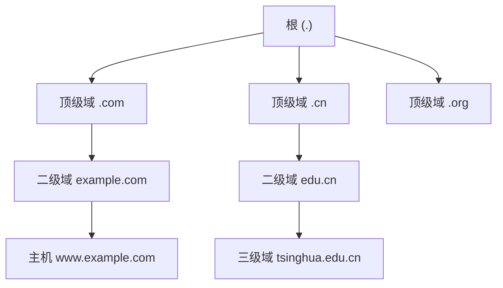

```
www.example.com.
│   │       │  │
│   │       │  └─ 根（通常省略）
│   │       └──── 顶级域 TLD
│   └──────────── 二级域
└──────────────── 主机名

★ 域名从右到左，级别【从高到低】
```

### 2.2 域名服务器的四个层次

| 层次 | 职责 |
|---|---|
| **根域名服务器** | **最重要**；知道所有**顶级域**服务器的地址；全球 **13 组**（逻辑上） |
| **顶级域（TLD）服务器** | 管理 `.com`、`.cn` 等，知道各二级域服务器的地址 |
| **权威域名服务器** | **保存某个区的实际记录**（一个域名的最终答案在这里） |
| **本地域名服务器** | **不属于层次结构**；离用户最近，**代替用户去查询**并缓存结果 |

> ⚠️ **本地域名服务器不在 DNS 的层次结构中**——它是运营商或组织提供的"代理"，是**用户配置的那个 DNS 服务器**（如 `8.8.8.8`、`114.114.114.114`）。408 常考这个点。

### 2.3 递归查询 vs 迭代查询（必考）

#### 递归查询

**"我帮你查到底，直接给你最终答案。"**

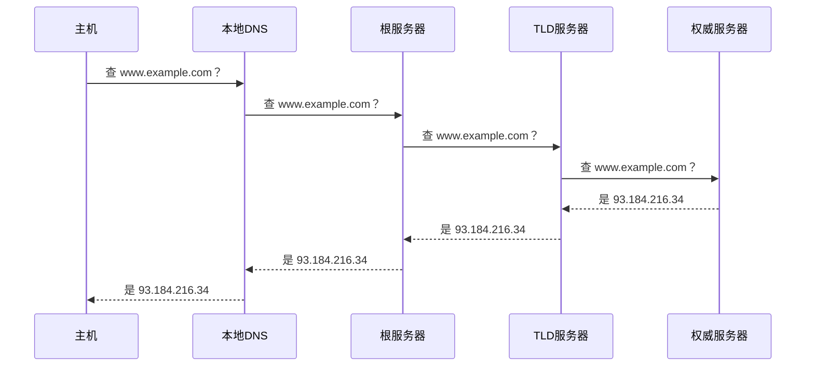

- **负担全压在被查询的服务器上**
- **根服务器不会用递归**（否则会被压垮）

#### 迭代查询 ⭐

**"我不知道，但你可以去问它。"**

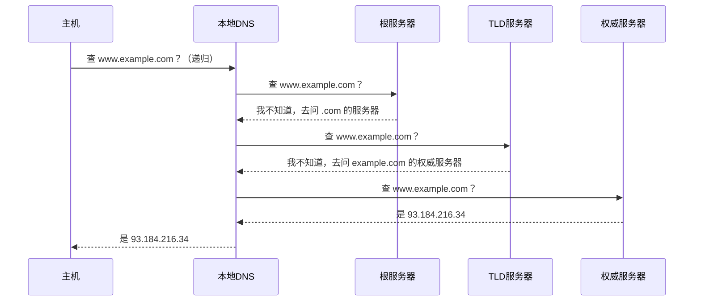

**实际的 DNS 查询是【混合模式】**：

$$
\boxed{\text{主机} \xrightarrow{\text{递归}} \text{本地 DNS} \xrightarrow{\text{迭代}} \text{根 / TLD / 权威}}
$$

> ⭐ **为什么这样设计**：
>
> - **主机 → 本地 DNS 用递归**：主机很"笨"，只想要一个答案，不想自己一步步查
> - **本地 DNS → 上层用迭代**：**减轻根服务器和 TLD 服务器的负担**——它们只需回答"去问谁"，不必代劳

### 2.4 DNS 缓存

**每一级都会缓存查询结果**（浏览器 → 操作系统 → 本地 DNS 服务器）。

```
缓存时间由记录的 【TTL】 决定（如 300 秒、86400 秒）
     ↓
★ 绝大多数 DNS 查询在【本地缓存】就命中了，根本不会走到根服务器
     ↓
这是根服务器能扛住全球查询量的关键
```

> ⚠️ **DNS 缓存也是"改域名后不立即生效"的原因**——必须等 TTL 过期。这就是为什么域名迁移前要**提前把 TTL 调小**。

### 2.5 常见的 DNS 记录类型

| 类型 | 作用 |
|---|---|
| **A** | 域名 → **IPv4** 地址 |
| **AAAA** | 域名 → **IPv6** 地址 |
| **CNAME** | 域名 → **另一个域名**（别名） |
| **MX** | **邮件服务器**地址 |
| **NS** | 该域的**权威域名服务器** |
| **PTR** | IP → 域名（**反向解析**） |

### 2.6 用 Go 观察 DNS

```go
package main

import (
    "context"
    "fmt"
    "net"
    "time"
)

func main() {
    // ① 基本解析（A/AAAA 记录）
    start := time.Now()
    ips, _ := net.LookupIP("example.com")
    fmt.Printf("A/AAAA 记录（耗时 %v）:\n", time.Since(start))
    for _, ip := range ips {
        kind := "IPv4 (A)"
        if ip.To4() == nil {
            kind = "IPv6 (AAAA)"
        }
        fmt.Printf("  %-40s %s\n", ip, kind)
    }

    // ② 第二次查询——命中缓存，快得多
    start = time.Now()
    net.LookupIP("example.com")
    fmt.Printf("\n第二次查询（命中缓存）耗时: %v\n", time.Since(start))

    // ③ 其他记录类型
    if mx, err := net.LookupMX("gmail.com"); err == nil {
        fmt.Println("\nMX 记录（邮件服务器）:")
        for _, m := range mx {
            fmt.Printf("  优先级 %-4d %s\n", m.Pref, m.Host)
        }
    }
    if ns, err := net.LookupNS("example.com"); err == nil {
        fmt.Println("\nNS 记录（权威服务器）:")
        for _, n := range ns {
            fmt.Printf("  %s\n", n.Host)
        }
    }

    // ④ 指定 DNS 服务器查询（绕过系统配置）
    r := &net.Resolver{
        PreferGo: true,
        Dial: func(ctx context.Context, network, _ string) (net.Conn, error) {
            return (&net.Dialer{}).DialContext(ctx, network, "8.8.8.8:53") // ★ UDP 53
        },
    }
    if addrs, err := r.LookupHost(context.Background(), "example.com"); err == nil {
        fmt.Println("\n通过 8.8.8.8 查询:", addrs)
    }
}
```

**典型输出**：

```
A/AAAA 记录（耗时 32.5ms）:
  93.184.216.34                            IPv4 (A)
  2606:2800:220:1:248:1893:25c8:1946       IPv6 (AAAA)

第二次查询（命中缓存）耗时: 87µs        ← ★ 快了 370 倍

MX 记录（邮件服务器）:
  优先级 5    gmail-smtp-in.l.google.com.
  优先级 10   alt1.gmail-smtp-in.l.google.com.

NS 记录（权威服务器）:
  a.iana-servers.net.
  b.iana-servers.net.

通过 8.8.8.8 查询: [93.184.216.34 2606:2800:220:1:...]
```

> ⭐ **注意第二次查询快了 370 倍**——这就是 DNS 缓存的价值。**首次访问的 DNS 延迟是首屏时间的重要组成部分**，这也是为什么 HTML 里会有 `<link rel="dns-prefetch">`。

---

## 第三章 FTP（文件传输协议）

### 3.1 两个连接的设计 ⭐

**FTP 使用【两个】TCP 连接**：

| 连接 | 端口 | 作用 | 生命周期 |
|---|---|---|---|
| **控制连接** | **21** | 传输**命令和响应**（`USER`、`LIST`、`RETR`） | **整个会话期间保持** |
| **数据连接** | **20**（主动模式） | 传输**文件内容和目录列表** | **每传一个文件建一次，传完就关** |

> ⭐ **为什么要分两个连接**：
>
> ```
> ① 【命令和数据分离】—— 传输大文件的过程中，仍能通过控制连接发送
>    "中止传输（ABOR）"等命令 ✅
>
> ② 【简化协议设计】—— 数据连接上是纯粹的字节流，
>    不需要在数据中嵌入命令的转义/边界
>
> ③ 【控制连接是带外的】—— 这是"带外控制（out-of-band control）"的经典设计
> ```
>
> **对比 HTTP**：HTTP 只用一个连接，命令（首部）和数据（实体）在同一条流上，靠 `Content-Length` 或 `chunked` 分隔——**这叫"带内控制"**。

### 3.2 主动模式 vs 被动模式（必考）

#### 主动模式（PORT）

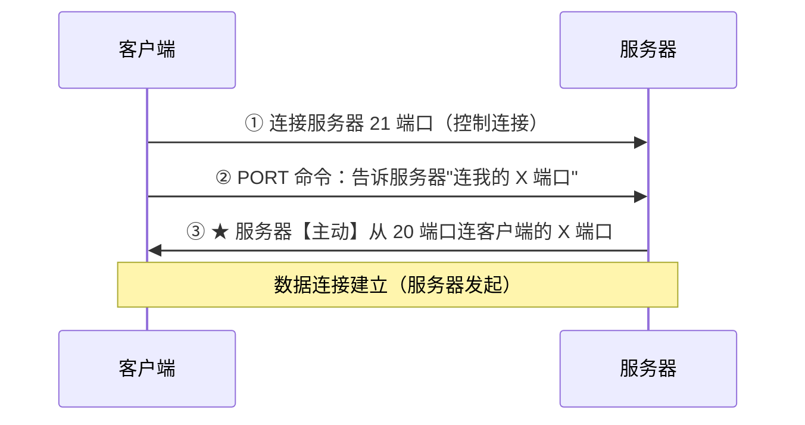

**问题**：**服务器主动连客户端** → 客户端的**防火墙/NAT 通常会拦截** ❌

#### 被动模式（PASV）⭐

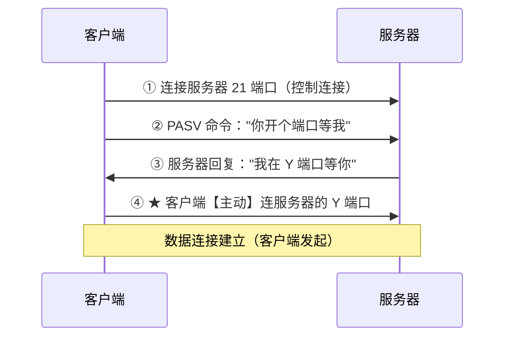

**优点**：**两个连接都由客户端发起** → **穿透 NAT 和防火墙无障碍** ✅

| | **主动模式（PORT）** | **被动模式（PASV）** |
|---|---|---|
| **数据连接的发起方** | **服务器** | **客户端** ⭐ |
| **服务器数据端口** | **固定 20** | **随机端口** |
| **对客户端防火墙** | ❌ **常被拦截** | ✅ **无障碍** |
| **对服务器防火墙** | ✅ 友好 | ❌ 需开放大量端口 |
| **实际使用** | 少 | **主流** |

> 💡 **今天几乎都用被动模式**——因为客户端几乎都在 NAT 后面。

---

## 第四章 电子邮件

### 4.1 三个协议的分工


| 协议 | 端口 | 方向 | 作用 |
|---|---|---|---|
| **SMTP** | **25** | **推（push）** | **发送**邮件（用户→服务器、服务器→服务器） |
| **POP3** | **110** | **拉（pull）** | **下载**邮件（通常下载后从服务器删除） |
| **IMAP** | **143** | **拉（pull）** | **在服务器上管理**邮件（多设备同步） |

> ⚠️ **SMTP 是"推"，POP3/IMAP 是"拉"**——这是最核心的区别。
>
> **为什么收信不能用 SMTP**：SMTP 需要接收方**一直在线**才能接收推送。而用户的电脑经常关机，所以邮件先推到**邮件服务器**（always-on），用户再从服务器**拉取**。

### 4.2 POP3 vs IMAP

| 维度 | **POP3** | **IMAP** |
|---|---|---|
| **邮件存储位置** | **下载到本地**（服务器上通常删除） | **保留在服务器** |
| **多设备同步** | ❌ **不支持**（手机下载了，电脑就看不到） | ✅ **支持** |
| **能否只下载首部** | ❌ 只能下载整封 | ✅ **可以先看首部再决定** |
| **服务器端文件夹管理** | ❌ | ✅ |
| **离线可用性** | ✅ 好 | 依赖网络 |
| **服务器存储压力** | 小 | **大** |

> 💡 **现代邮箱（Gmail、Outlook）都用 IMAP**——因为用户有手机、平板、电脑多个设备，必须同步。

### 4.3 MIME（多用途互联网邮件扩展）

**问题：SMTP 只能传输【7 位 ASCII 码】。**

```
① 无法传输【非 ASCII 字符】（中文、日文…）
② 无法传输【二进制文件】（图片、视频、可执行文件）
③ 邮件长度有限制
```

**MIME 的解法：不修改 SMTP，而是在【邮件内容】上做文章。**

```
MIME 增加了几个首部字段：
  MIME-Version: 1.0
  Content-Type: text/html; charset=utf-8    ← 声明内容类型
  Content-Transfer-Encoding: base64          ← 声明编码方式
```

**核心是编码转换**：

| 编码 | 做法 | 膨胀率 |
|---|---|---|
| **Base64** | 每 **3 字节**二进制 → **4 个 ASCII 字符** | **+33%** |
| **Quoted-Printable** | 只对非 ASCII 字符编码（`=E4=B8=AD`） | 取决于内容 |

> ⭐ **MIME 的设计哲学非常值得学习**：
>
> **它没有修改 SMTP 协议本身（那会导致全球邮件系统不兼容），而是在【应用数据层面】做编码转换——让二进制"伪装成" ASCII 通过。**
>
> **这是"向后兼容"的典范**：老的 SMTP 服务器完全不知道 MIME 的存在，照样能正确转发。

---

## 第五章 HTTP（超文本传输协议）

### 5.1 HTTP 报文格式

**请求报文**：

```
GET /index.html HTTP/1.1          ← 请求行：方法 + URL + 版本
Host: example.com                 ← 首部行
User-Agent: Mozilla/5.0
Accept: text/html
Connection: keep-alive
                                  ← 【空行】（分隔首部和实体）
（实体主体，GET 通常为空）
```

**响应报文**：

```
HTTP/1.1 200 OK                   ← 状态行：版本 + 状态码 + 短语
Content-Type: text/html
Content-Length: 1234
Set-Cookie: session=abc123
                                  ← 【空行】
<html>...</html>                  ← 实体主体
```

> ⚠️ **首部和实体之间必须有一个【空行】**——这是接收方判断"首部结束了"的唯一依据。

### 5.2 请求方法

| 方法 | 作用 | 安全 | 幂等 |
|---|---|---|---|
| **GET** | **获取**资源 | ✅ | ✅ |
| **POST** | **提交**数据（创建） | ❌ | ❌ |
| **PUT** | **上传/替换**资源 | ❌ | ✅ |
| **DELETE** | **删除**资源 | ❌ | ✅ |
| **HEAD** | 只要**首部**，不要实体 | ✅ | ✅ |
| **OPTIONS** | 查询服务器支持的方法 | ✅ | ✅ |

> 💡 **安全 vs 幂等**：
> - **安全**：不改变服务器状态（只读）
> - **幂等**：**执行 1 次和执行 N 次的效果相同**
>
> `DELETE` 不安全（会删东西）但幂等（删 1 次和删 5 次结果一样：资源没了）。
> `POST` 既不安全也不幂等（提交 5 次可能创建 5 条记录）——**这就是刷新页面会弹"确认重新提交"的原因**。

### 5.3 状态码

| 类别 | 含义 | 常见 |
|---|---|---|
| **1xx** | 信息性 | 100 Continue |
| **2xx** | **成功** | **200 OK**、201 Created、204 No Content |
| **3xx** | **重定向** | **301 永久重定向**、**302 临时重定向**、**304 Not Modified**（用缓存） |
| **4xx** | **客户端错误** | **400 Bad Request**、**401 未授权**、**403 禁止**、**404 Not Found** |
| **5xx** | **服务器错误** | **500 内部错误**、502 Bad Gateway、503 服务不可用 |

> ⚠️ **301 vs 302**：
> - **301 永久**：浏览器会**缓存这个重定向**，下次直接访问新地址（**SEO 权重会转移**）
> - **302 临时**：**每次都要问原地址**
>
> 用错会很麻烦——301 被浏览器缓存后**很难撤销**。

### 5.4 HTTP 的无状态性与 Cookie

**HTTP 是【无状态】的**：服务器**不保存**任何关于客户端的信息，每个请求都是独立的。

```
好处：服务器实现简单，易于水平扩展（任何一台服务器都能处理任何请求）
问题：无法实现"登录状态""购物车"等需要记住用户的功能 ❌
```

**Cookie 的解法**：

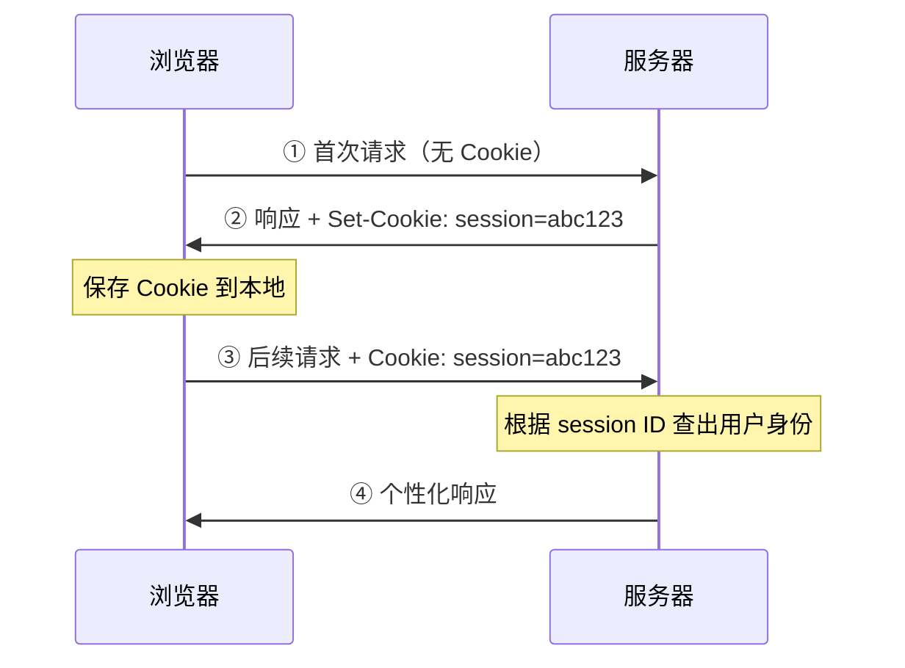

> ⭐ **Cookie 让"无状态的协议"承载了"有状态的应用"**——状态实际存在**客户端**（Cookie）和**服务器的会话存储**（Session）里，**HTTP 协议本身仍然是无状态的**。
>
> 这是一个漂亮的分层设计：**不修改协议，在应用层解决问题**（与 MIME 的思路相同）。

### 5.5 连接管理的演进（核心考点）

#### 非持久连接（HTTP/1.0 默认）

```
每请求一个对象，就建立一次 TCP 连接，传完立即关闭

请求一个含 1 个 HTML + 10 张图片的页面：
     ↓
需要 【11 次】TCP 三次握手 + 11 次四次挥手 ❌
     ↓
每个对象的耗时 = 2 × RTT（1 个握手 RTT + 1 个请求响应 RTT）
总耗时 ≈ 11 × 2 × RTT = 22 RTT
```

#### 持久连接（HTTP/1.1 默认）

**一个 TCP 连接上可以传输多个对象。**

| 类型 | 说明 | 耗时 |
|---|---|---|
| **非流水线方式** | **收到上一个响应才能发下一个请求** | 1 RTT（握手）+ **n × RTT** |
| **流水线方式（Pipelining）** ⭐ | **连续发出多个请求**，不等响应 | 1 RTT（握手）+ **1 × RTT**（理想情况） |

```
非流水线：请求1 → 响应1 → 请求2 → 响应2 → ...
流水线：  请求1 请求2 请求3 → 响应1 响应2 响应3    ← 一起发 ✅
```

> ⚠️ **HTTP/1.1 的流水线在实践中几乎没人用**，因为有**队头阻塞（Head-of-Line Blocking）**问题：
>
> ```
> 响应必须【按请求的顺序】返回
>      ↓
> 若响应 1 很慢（比如是个大文件）
>      ↓
> 响应 2、3 即使已经准备好了，也【必须排在后面等】❌
> ```

### 5.6 HTTP 版本演进

| 版本 | 关键改进 | 解决的问题 |
|---|---|---|
| **HTTP/1.0** | 基本的请求-响应 | — |
| **HTTP/1.1** | **持久连接**、`Host` 头（支持虚拟主机）、分块传输、缓存控制 | 减少握手开销 |
| **HTTP/2** | **二进制分帧**、**多路复用**、**首部压缩(HPACK)**、服务器推送 | **解决 HTTP 层的队头阻塞** |
| **HTTP/3** | 基于 **QUIC（UDP）** | **解决 TCP 层的队头阻塞** + 握手合并 |

#### HTTP/2 的多路复用

```
HTTP/1.1：一个连接同一时刻只能处理【一个】请求-响应
          → 浏览器只能开【6 个】并发连接绕过限制

HTTP/2：  把数据拆成【帧】，打上【流 ID】
          → 【一个连接】上多个流【交错传输】
          → 响应可以【乱序返回】，谁先好谁先发 ✅
```

> ⭐ **但 HTTP/2 仍有【TCP 层】的队头阻塞**：
>
> ```
> HTTP/2 的多个流跑在【同一个 TCP 连接】上
>      ↓
> ★ TCP 保证【字节流按序交付】
>      ↓
> 若某个 TCP 段丢了，【后面所有段都要等它重传】
>      ↓
> 即使这些段属于【不同的 HTTP/2 流】，也全部被阻塞 ❌
> ```

#### HTTP/3 用 QUIC 彻底解决

```
QUIC 基于 【UDP】，在用户态自己实现可靠传输
     ↓
★ 每个流【独立地】保证可靠性
     ↓
流 A 丢包，只影响流 A；流 B、C 继续传输 ✅
     ↓
【彻底消除队头阻塞】
```

**QUIC 的其他优势**：

| 优势 | 说明 |
|---|---|
| **握手更快** | **TCP 握手 + TLS 握手合并**，1 RTT 建连；重连可 **0-RTT** |
| **连接迁移** | 用 **Connection ID** 而非四元组标识连接 → **切换 WiFi/4G 不断连** ⭐ |
| **在用户态实现** | 可以**快速迭代**（不用等操作系统内核更新） |

### 5.7 用 Go 观察 HTTP

```go
package main

import (
    "fmt"
    "io"
    "net/http"
    "net/http/httptrace"
    "time"
)

func main() {
    // ★ 用 httptrace 观察一次请求的各阶段耗时
    var dnsStart, connStart, tlsStart, firstByte time.Time
    start := time.Now()

    trace := &httptrace.ClientTrace{
        DNSStart:  func(httptrace.DNSStartInfo) { dnsStart = time.Now() },
        DNSDone:   func(httptrace.DNSDoneInfo) { fmt.Printf("DNS 解析:   %v\n", time.Since(dnsStart)) },
        ConnectStart: func(_, _ string) { connStart = time.Now() },
        ConnectDone:  func(_, _ string, _ error) { fmt.Printf("TCP 握手:   %v\n", time.Since(connStart)) },
        TLSHandshakeStart: func() { tlsStart = time.Now() },
        TLSHandshakeDone:  func(_ tls.ConnectionState, _ error) { fmt.Printf("TLS 握手:   %v\n", time.Since(tlsStart)) },
        GotFirstResponseByte: func() { firstByte = time.Now(); fmt.Printf("首字节 TTFB: %v\n", firstByte.Sub(start)) },
        GotConn: func(info httptrace.GotConnInfo) {
            if info.Reused {
                fmt.Println("★ 复用了已有连接（Keep-Alive 生效）")
            }
        },
    }

    client := &http.Client{}
    for i := 1; i <= 2; i++ {
        fmt.Printf("\n=== 第 %d 次请求 ===\n", i)
        start = time.Now()
        req, _ := http.NewRequest("GET", "https://example.com", nil)
        req = req.WithContext(httptrace.WithClientTrace(req.Context(), trace))
        resp, err := client.Do(req)
        if err != nil {
            fmt.Println("请求失败:", err)
            return
        }
        io.Copy(io.Discard, resp.Body)
        resp.Body.Close()
        fmt.Printf("协议版本: %s，状态码: %d，总耗时: %v\n", resp.Proto, resp.StatusCode, time.Since(start))
    }
}
```

**典型输出**：

```
=== 第 1 次请求 ===
DNS 解析:   28ms
TCP 握手:   52ms
TLS 握手:   105ms
首字节 TTFB: 241ms
协议版本: HTTP/2.0，状态码: 200，总耗时: 243ms

=== 第 2 次请求 ===
★ 复用了已有连接（Keep-Alive 生效）
首字节 TTFB: 51ms                       ← ★ 只剩一个 RTT
协议版本: HTTP/2.0，状态码: 200，总耗时: 52ms
```

> ⭐ **第二次请求快了 4.7 倍**——**DNS、TCP 握手、TLS 握手全部被省掉了**。
>
> **这就是连接复用（Keep-Alive）的全部价值**，也印证了引言里"时间花在往返上而非传输上"的判断。

---

## 第六章 408 高频考点与陷阱清单

### 6.1 考点分布

第 6 章通常是 **1-2 道选择题（2-4 分）**，是**送分章节**。

最常考：

1. **DNS 的递归查询与迭代查询**
2. **FTP 的两个连接与主动/被动模式**
3. SMTP / POP3 / IMAP 的分工
4. HTTP 的无状态性与 Cookie
5. 持久连接与非持久连接

### 6.2 十六个陷阱

**陷阱 1：本地域名服务器属于 DNS 层次结构**

**错**。**本地域名服务器不在层次结构中**——它是用户配置的"代理"，不属于根/TLD/权威这个层次体系。

**陷阱 2：DNS 查询全部使用递归查询**

**错**。实际是**混合模式**：**主机→本地DNS 用递归**，**本地DNS→根/TLD/权威 用迭代**。

**陷阱 3：根域名服务器会用递归查询**

**错**。根服务器**只用迭代**（回答"去问谁"），否则会被全球查询压垮。

**陷阱 4：DNS 只使用 UDP**

**不准确**。主要用 **UDP 53**，但响应超过 512 字节或**区域传送**时用 **TCP**。

**陷阱 5：FTP 只用一个连接**

**错**。FTP 用**两个连接**：**控制连接（21）**和**数据连接（20 或随机）**。

**陷阱 6：FTP 的控制连接在传输完文件后关闭**

**错**。**控制连接在整个会话期间保持**；**数据连接**才是每传一个文件建一次、传完就关。

**陷阱 7：被动模式下服务器主动连接客户端**

**错，反了**。**主动模式（PORT）是服务器主动连客户端**；**被动模式（PASV）是客户端主动连服务器**。

**陷阱 8：SMTP 用于接收邮件**

**错**。**SMTP 只用于【发送】（推）**；**接收（拉）**用 **POP3 或 IMAP**。

**陷阱 9：POP3 支持多设备同步**

**错**。POP3 通常**下载后从服务器删除**，**不支持多设备同步**。**IMAP** 才支持（邮件保留在服务器）。

**陷阱 10：MIME 是一个新的邮件传输协议**

**错**。MIME **不是传输协议**，它只是**扩展了邮件的内容格式**（增加首部字段 + 编码转换），**SMTP 完全不变**。

**陷阱 11：Base64 编码会压缩数据**

**错，会膨胀**。Base64 把 **3 字节变 4 字符**，体积**增加约 33%**。

**陷阱 12：HTTP 是有状态的协议**

**错**。**HTTP 本身是无状态的**；**Cookie/Session 是在应用层实现的状态**，协议本身没变。

**陷阱 13：HTTP/1.1 默认使用非持久连接**

**错**。**HTTP/1.1 默认持久连接（Keep-Alive）**；**HTTP/1.0 默认非持久**。

**陷阱 14：HTTP/2 完全解决了队头阻塞**

**不准确**。HTTP/2 解决了 **HTTP 层**的队头阻塞（多路复用），但**仍有 TCP 层**的队头阻塞（一个段丢了，后面的都要等）。**HTTP/3（QUIC）才彻底解决**。

**陷阱 15：301 和 302 可以随便用**

**错**。**301 永久重定向会被浏览器缓存**，很难撤销；**302 临时**每次都问原地址。用错代价很大。

**陷阱 16：POST 是幂等的**

**错**。**POST 既不安全也不幂等**（提交多次可能创建多条记录）。**PUT 和 DELETE 是幂等的**。

### 6.3 速查卡

```
【应用模型】
C/S ：服务器 always-on，可管理性好，【服务器是瓶颈】
P2P ：节点对等，【可扩展性好】（用户越多能力越强）

【DNS】
层次：根 → 顶级域TLD → 权威域名服务器
     ★【本地域名服务器不在层次结构中】
查询：主机→本地DNS【递归】；本地DNS→上层【迭代】
     ★ 根服务器【只用迭代】（否则会被压垮）
记录：A(IPv4)、AAAA(IPv6)、CNAME(别名)、MX(邮件)、NS(权威)、PTR(反向)
端口：UDP 53（响应>512字节或区域传送时用 TCP）

【FTP】
★ 【两个连接】
  控制连接 21：传命令，【整个会话保持】
  数据连接 20：传文件，【每传一个建一次】
主动模式PORT：【服务器】主动连客户端，易被防火墙拦
被动模式PASV：【客户端】主动连服务器，穿NAT无障碍 ⭐

【电子邮件】
SMTP 25 ：【发送】（推 push）
POP3 110：【接收】（拉 pull），下载后删除，【不支持多设备】
IMAP 143：【接收】（拉 pull），保留在服务器，【支持多设备同步】
MIME：不改 SMTP，只做【内容编码转换】；Base64 膨胀【33%】

【HTTP】
无状态 → 用【Cookie】在应用层实现状态
方法：GET(安全幂等)、POST(都不是)、PUT/DELETE(幂等不安全)
状态码：2xx成功 3xx重定向 4xx客户端错 5xx服务器错
       ★ 301永久(会被缓存) vs 302临时
连接：HTTP/1.0 默认【非持久】；HTTP/1.1 默认【持久】
流水线：连续发请求不等响应，但有【队头阻塞】

【HTTP 版本演进】
1.1：持久连接、Host头、分块传输
2  ：二进制分帧、【多路复用】、首部压缩 → 解决【HTTP层】队头阻塞
3  ：基于【QUIC/UDP】→ 解决【TCP层】队头阻塞 + 握手合并 + 连接迁移
```

---

## 第七章 Go ↔ C 对照

| 场景 | C | Go | 说明 |
|---|---|---|---|
| DNS 解析 | `getaddrinfo()` | **`net.LookupIP`** | |
| 查 MX/NS 记录 | `res_query()` | `net.LookupMX` / `LookupNS` | |
| 指定 DNS 服务器 | 改 `/etc/resolv.conf` | **`net.Resolver{Dial: ...}`** ⭐ | Go 可在代码里指定 |
| HTTP 客户端 | libcurl | **`net/http`**（标准库） | |
| HTTP 服务器 | 第三方库 | **`http.ListenAndServe`** | 标准库自带 |
| 观察请求各阶段耗时 | curl `-w` 格式化输出 | **`httptrace`** ⭐ | Go 的更细致 |
| 连接池 | 手工管理 | **`http.Transport` 自动管理** | |
| 强制 HTTP/2 | 需要 nghttp2 | **默认开启**（HTTPS 时） | |

```go
// Go 的连接复用配置（生产环境必调）
client := &http.Client{
    Transport: &http.Transport{
        MaxIdleConns:        100,              // 全局最大空闲连接
        MaxIdleConnsPerHost: 10,               // ★ 每个 host 的空闲连接数
        IdleConnTimeout:     90 * time.Second, // 空闲连接存活时间
        ForceAttemptHTTP2:   true,             // 尝试 HTTP/2
    },
    Timeout: 10 * time.Second,
}
```

> ⚠️ **`MaxIdleConnsPerHost` 默认只有 2** —— 这是 Go HTTP 客户端**最常见的性能陷阱**。
>
> ```
> 高并发调用同一个下游服务时：
>   只有 2 个连接能被复用，其余请求都要【重新三次握手】❌
>        ↓
>   而且用完立即关闭 → 产生大量【TIME_WAIT】（见 CN05）
>        ↓
>   ★ 把它调到 100+，QPS 能提升数倍
> ```

**必须读完并关闭 Body**：

```go
resp, _ := client.Get(url)
defer resp.Body.Close()
io.Copy(io.Discard, resp.Body)  // ★ 必须读完，否则连接【无法复用】
```

> ⚠️ **只 `Close()` 不读完，连接会被直接丢弃而不是放回池子**——因为 Go 无法确定剩余数据的边界。这是另一个高频坑。

---

## 第八章 练习题

### 选择题

**1.** 下列关于本地域名服务器的说法，**正确**的是：
A. 属于 DNS 层次结构中的一级
B. 不属于 DNS 层次结构，但对 DNS 系统非常重要
C. 就是根域名服务器
D. 必须由 ICANN 统一管理

**2.** 在 DNS 查询中，主机向本地域名服务器的查询通常采用：
A. 递归查询　B. 迭代查询　C. 混合查询　D. 广播查询

**3.** 根域名服务器通常采用哪种查询方式响应：
A. 递归查询　B. 迭代查询　C. 两者都可以　D. 不响应查询

**4.** FTP 使用的两个端口 21 和 20 分别用于：
A. 数据连接、控制连接
B. 控制连接、数据连接
C. 都是控制连接
D. 都是数据连接

**5.** FTP 的被动模式（PASV）中，数据连接由谁发起：
A. 服务器　B. 客户端　C. 由协商决定　D. 中间代理

**6.** 用于**发送**电子邮件的协议是：
A. POP3　B. IMAP　C. SMTP　D. MIME

**7.** 下列关于 POP3 和 IMAP 的说法，**正确**的是：
A. POP3 支持多设备同步，IMAP 不支持
B. IMAP 将邮件保留在服务器，支持多设备同步
C. 两者都会把邮件下载后从服务器删除
D. POP3 可以只下载邮件首部

**8.** MIME 的主要作用是：
A. 替代 SMTP 协议
B. 在不改变 SMTP 的前提下，支持传输非 ASCII 内容
C. 加密邮件内容
D. 压缩邮件体积

**9.** Base64 编码后，数据体积大约：
A. 减少 33%　B. 增加 33%　C. 不变　D. 增加 100%

**10.** HTTP/1.1 默认采用的连接方式是：
A. 非持久连接
B. 持久连接
C. 每个对象一个连接
D. UDP 连接

**11.** 关于 HTTP 的无状态性，**正确**的是：
A. HTTP 协议本身是有状态的
B. HTTP 无状态，Cookie 在应用层实现了状态保持
C. Cookie 修改了 HTTP 协议使其变为有状态
D. HTTP/2 之后 HTTP 变成了有状态协议

**12.** HTTP/3 相对 HTTP/2 的最主要改进是：
A. 增加了多路复用
B. 基于 QUIC（UDP），解决了 TCP 层的队头阻塞
C. 增加了首部压缩
D. 提高了加密强度

### 应用题

**13.** 详细说明 DNS 的解析过程：

（1）画出主机查询 `www.example.com` 的完整流程（含递归和迭代）。
（2）说明为什么"主机→本地DNS"用递归，而"本地DNS→上层"用迭代。
（3）DNS 缓存在哪几个层次存在？它对系统有什么价值？
（4）若要把一个域名迁移到新 IP，为什么要提前调小 TTL？

**14.** 详细说明 FTP 的工作机制：

（1）为什么 FTP 要使用两个连接？列出三个理由。
（2）画出主动模式和被动模式的连接建立过程。
（3）对比两种模式在防火墙/NAT 环境下的表现，说明为什么现在主流用被动模式。

**15.** 某用户用 Outlook 收发邮件：

（1）画出一封邮件从发件人到收件人的完整传输路径，标明每一段使用的协议和端口。
（2）说明为什么"发信"和"收信"要用不同的协议。
（3）该用户在手机和电脑上都要能看到同一封邮件，应该配置 POP3 还是 IMAP？为什么？
（4）若邮件中含有一张 300 KB 的图片，说明 MIME 如何处理它，传输后体积约为多少。

**16.** 某网页包含 1 个 HTML 文件和 **10 个**小对象（图片）。RTT = **100 ms**，忽略传输时间。分别计算：

（1）**非持久连接**（HTTP/1.0，串行）所需时间。
（2）**非持久连接 + 5 个并行 TCP 连接**所需时间。
（3）**持久连接非流水线**所需时间。
（4）**持久连接 + 流水线**所需时间。
（5）对比四种方式，说明 HTTP/1.1 持久连接的价值。

**17.** 对比 **HTTP/1.1、HTTP/2、HTTP/3**：

（1）从五个维度列表对比。
（2）解释什么是"队头阻塞"，HTTP/1.1、HTTP/2 分别在哪一层遇到这个问题。
（3）说明 QUIC 如何彻底解决队头阻塞，以及它还带来了哪两个额外优势。

### 答案与解析

<details>
<summary>点击展开</summary>

**1. B**

**本地域名服务器不属于 DNS 的层次结构**（根 → TLD → 权威）。

它是**用户配置的那个 DNS 服务器**（如 `8.8.8.8`、运营商提供的），扮演"**代理查询者 + 缓存**"的角色。

**但它极其重要**——绝大多数 DNS 查询在它这里就命中缓存返回了，**根服务器和 TLD 服务器的负载因此降低了几个数量级**。

**2. A**

**主机 → 本地域名服务器：递归查询**。

主机很"笨"，它只想说"给我一个答案"，不想自己一步步去问根、TLD、权威服务器。

**3. B**

**根域名服务器只用迭代查询**。

原因：全球所有本地 DNS 服务器都可能查到根服务器。若根服务器用递归（帮你一路查到底），**它会被瞬间压垮**。

用迭代它只需回答"去问 `.com` 的服务器"，**一次查询的成本极低**。

**4. B**

| 端口 | 连接 | 说明 |
|---|---|---|
| **21** | **控制连接** | 传命令和响应，**整个会话保持** |
| **20** | **数据连接** | 传文件内容，**每传一个建一次**（仅主动模式用 20） |

**5. B**

| 模式 | 数据连接由谁发起 |
|---|---|
| **主动 PORT** | **服务器**（从 20 端口连客户端） |
| **被动 PASV** | **客户端**（连服务器的随机端口）⭐ |

**记忆法**：**"主动/被动"是站在【服务器】的角度说的**——服务器主动去连就是主动模式，服务器被动等着被连就是被动模式。

**6. C**

| 协议 | 方向 | 作用 |
|---|---|---|
| **SMTP** | **推 push** | **发送**邮件 |
| POP3 / IMAP | **拉 pull** | **接收**邮件 |
| MIME | — | **不是传输协议**，是内容格式扩展 |

**7. B**

| | POP3 | IMAP |
|---|---|---|
| 邮件存放 | **下载到本地**（服务器删除） | **保留在服务器** |
| **多设备同步** | ❌ | ✅ |
| 只下载首部 | ❌ | ✅ |

A、C、D 都说反了。

**8. B**

**MIME 不修改 SMTP，只在【邮件内容】上做扩展**：

```
① 增加首部字段（MIME-Version、Content-Type、Content-Transfer-Encoding）
② 把二进制数据【编码成 ASCII】（Base64 / Quoted-Printable）
     ↓
★ SMTP 完全不知道 MIME 的存在，照样正确转发 ✅
```

这是**向后兼容设计的典范**。

**9. B**

**Base64 把 3 字节二进制编码成 4 个 ASCII 字符**：

$$
\frac{4}{3} \approx 1.33 \implies \text{体积增加约 } 33\%
$$

**10. B**

| 版本 | 默认连接方式 |
|---|---|
| **HTTP/1.0** | **非持久**（每个对象一个连接） |
| **HTTP/1.1** | **持久（Keep-Alive）** ⭐ |

**11. B**

**HTTP 协议本身始终是无状态的**——服务器不保存任何客户端信息。

**Cookie 是在【应用层】实现的状态保持**：

```
状态实际存在：
  - 客户端的 Cookie（存 session ID）
  - 服务器的 Session 存储（存真实数据）
     ↓
★ HTTP 协议本身【一个字节都没改】
```

**12. B**

| 版本 | 解决的队头阻塞 |
|---|---|
| **HTTP/2** | **HTTP 层**（多路复用） |
| **HTTP/3（QUIC）** | **TCP 层** ⭐ |

A、C 是 HTTP/2 就有的特性。

**13.**

**（1）完整解析流程**

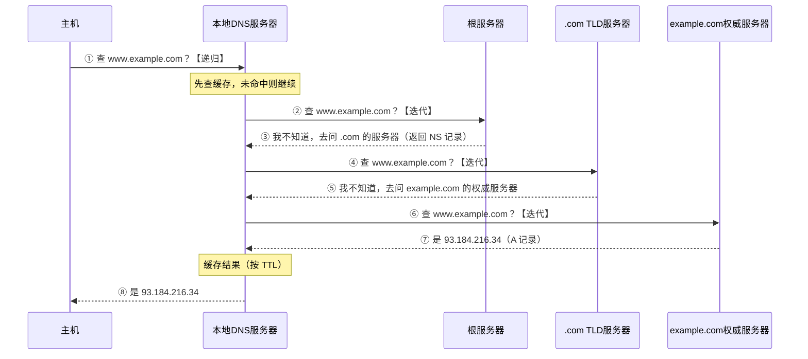

**关键点**：

- **①⑧ 之间是【递归】**：主机只问一次，本地 DNS 负责给出最终答案
- **②~⑦ 是【迭代】**：本地 DNS 逐级询问，每次得到"去问谁"的指引

---

**（2）为什么这样分工**

**主机 → 本地 DNS 用递归**：

```
主机（终端设备）的角色是"消费者"：
  - 只想要一个答案，不想懂 DNS 的层次结构
  - 实现简单（一次请求一次响应）
  - 手机、IoT 设备资源有限，不适合做多轮查询
     ↓
★ 把复杂度交给专业的本地 DNS 服务器 ✅
```

**本地 DNS → 上层用迭代**：

```
★ 核心原因：【保护根服务器和 TLD 服务器】

全球有【数百万台】本地 DNS 服务器
     ↓
若它们都对根服务器发起【递归】查询
     ↓
根服务器要为每个查询【一路代查到底】
  - 维护查询状态
  - 发起多次下游查询
  - 等待并转发结果
     ↓
★ 单次查询的成本高出【几十倍】→ 根服务器会被瞬间压垮 ❌

用迭代：
     ↓
根服务器只需回答"去问 .com 的服务器"
  - 无状态
  - 查一次本地数据就返回
  - 单次成本极低 ✅
```

> ⭐ **这是一个"把复杂度放在合适的地方"的经典设计**：
>
> - **复杂度下沉到本地 DNS**（数量多，每台压力小）
> - **根/TLD 保持极简**（数量少，但要扛全球流量）

---

**（3）DNS 缓存的层次与价值**

**缓存存在于四个层次**：

| 层次 | 位置 | 典型 TTL |
|---|---|---|
| **① 浏览器缓存** | 浏览器进程内 | 几十秒~几分钟 |
| **② 操作系统缓存** | 系统的 DNS 客户端（如 `systemd-resolved`、`nscd`） | 按记录的 TTL |
| **③ 本地 DNS 服务器缓存** | 运营商/组织的 DNS 服务器 ⭐ | 按记录的 TTL |
| **④ 权威服务器的上级缓存** | 各级 DNS 服务器 | 按 TTL |

**四个价值**：

| 价值 | 说明 |
|---|---|
| **① 大幅降低延迟** | 命中缓存 **< 1 ms**，未命中要 **几十~几百 ms**（见本章 §2.6 的实测：370 倍差距） |
| **② 保护上级服务器** | **90%+ 的查询在缓存层就返回了**，根服务器实际收到的流量只是冰山一角 |
| **③ 提高可用性** | 上级服务器暂时不可达时，缓存仍能提供服务 |
| **④ 节省带宽** | 减少大量重复的 DNS 报文 |

---

**（4）为什么域名迁移要提前调小 TTL**

**问题**：

```
假设 TTL = 86400 秒（24 小时）

你把域名从旧 IP 改到新 IP
     ↓
★ 全球各地的 DNS 缓存中，仍存着【旧 IP】
     ↓
这些缓存要等【最长 24 小时】才过期
     ↓
在这 24 小时内：
  - 部分用户访问【新服务器】✅
  - 部分用户仍访问【旧服务器】❌
     ↓
★ 必须【同时维护新旧两套服务】，且数据可能不一致 ❌
```

**正确的迁移流程**：

```
【第 1 步】迁移前 24~48 小时：把 TTL 从 86400 调到 【60 秒】
     ↓
     等待旧的 TTL（86400）自然过期，让全球缓存都换成"TTL=60"的记录

【第 2 步】执行迁移：修改 A 记录指向新 IP
     ↓
     ★ 因为 TTL 只有 60 秒，全球缓存在 【1 分钟内】 就会更新 ✅

【第 3 步】观察一段时间，确认流量全部切到新服务器

【第 4 步】把 TTL 调回 86400（减少 DNS 查询量）
```

> ⭐ **核心逻辑**：**TTL 决定了"变更生效的最大延迟"**。
>
> **TTL 大** → 查询少、负载低，但**变更慢**
> **TTL 小** → 变更快，但**查询多、负载高**
>
> **平时用大 TTL 省资源，变更前临时调小换取灵活性**——这是一个典型的"用运维流程弥补机制约束"的实践。

**14.**

**（1）为什么用两个连接（三个理由）**

**理由一：命令与数据分离，支持传输过程中的控制**

```
传一个 10 GB 的大文件（可能要几十分钟）
     ↓
若只有一个连接，数据把它占满了
     ↓
★ 用户想【中止传输（ABOR）】怎么办？发不出去 ❌

有独立的控制连接：
     ↓
数据连接在传文件的同时，控制连接【随时可用】
     ↓
★ 可以发 ABOR、STAT（查进度）等命令 ✅
```

**理由二：简化协议设计**

```
若命令和数据混在一条流上：
     ↓
必须设计一套【转义或分帧机制】来区分
  - "这段字节是命令还是文件内容？"
  - 文件内容中若恰好出现命令关键字怎么办？
     ↓
★ 协议复杂度陡增

分开后：
     ↓
数据连接上是【纯粹的字节流】，从头到尾都是文件内容
控制连接上是【纯粹的文本命令】
     ↓
★ 两边都极其简单 ✅
```

**理由三：这是"带外控制（out-of-band）"的经典设计**

```
【带内控制 in-band】：控制信息和数据走同一条通道
  例：HTTP（首部 + 实体在同一个连接，靠 Content-Length 分隔）

【带外控制 out-of-band】：控制信息走独立通道 ⭐
  例：FTP（控制连接 + 数据连接）
     ↓
★ 优点：控制信息不会被数据"淹没"，响应及时
★ 缺点：要维护两个连接，穿透防火墙麻烦
```

---

**（2）两种模式的连接建立过程**

**主动模式（PORT）**：

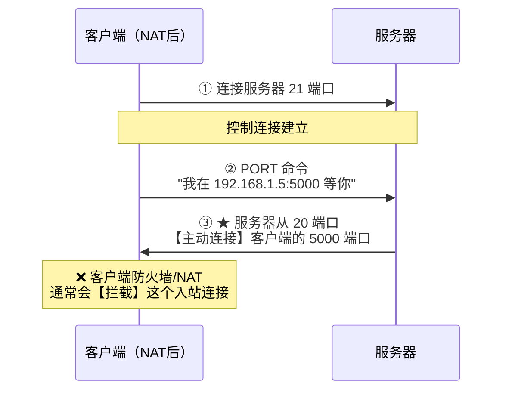

**被动模式（PASV）**：

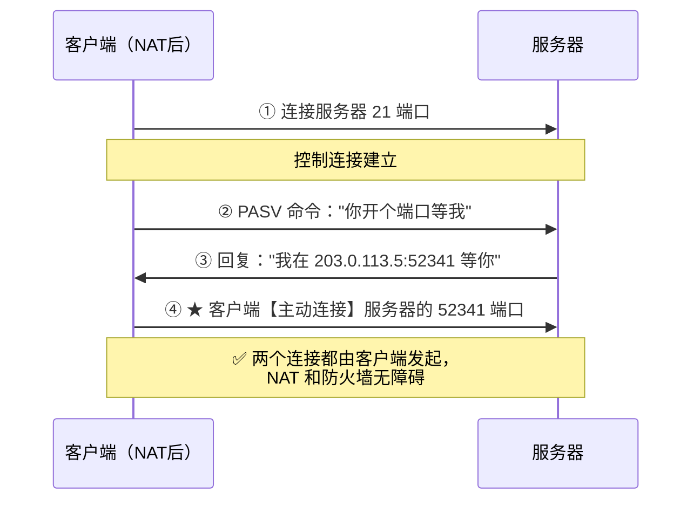

---

**（3）防火墙/NAT 环境下的表现对比**

| 维度 | **主动模式 PORT** | **被动模式 PASV** |
|---|---|---|
| **数据连接方向** | **服务器 → 客户端**（入站） | **客户端 → 服务器**（出站） |
| **客户端防火墙** | ❌ **拦截**（默认阻止入站连接） | ✅ **无障碍**（出站默认允许） |
| **客户端在 NAT 后** | ❌ **失败**（PORT 命令报的是**内网 IP**，服务器连不上） | ✅ **正常** |
| **服务器防火墙** | ✅ 只需开 20、21 | ❌ 需开放**大量高位端口** |
| **服务器在 NAT 后** | ✅ 正常 | ⚠️ 需配置 |

**为什么现在主流用被动模式**：

```
★ 核心原因：【几乎所有客户端都在 NAT 后面】

主动模式的致命问题：
  客户端发 PORT 命令时，报的是自己的【内网 IP】（如 192.168.1.5）
       ↓
  服务器拿到这个地址去连接
       ↓
  ★ 192.168.1.5 是【私有地址】，在公网上根本不可路由 ❌
       ↓
  连接必然失败

被动模式：
  服务器报的是自己的【公网 IP 和端口】
       ↓
  客户端【主动出站】连接
       ↓
  ★ NAT 会自动为出站连接建立映射 ✅
```

> 💡 **服务器侧的应对**：现代 FTP 服务器会配置一个**被动端口范围**（如 50000-51000），只在防火墙上开放这一段——**在安全性和可用性之间取平衡**。

**15.**

**（1）完整传输路径**


| 段 | 协议 | 端口 | 方向 | 说明 |
|---|---|---|---|---|
| **①** | **SMTP** | **25**（或 587 提交端口） | **推** | 发件人 → 自己的邮件服务器 |
| **②** | **SMTP** | **25** | **推** | 邮件服务器之间转发（可能经过多跳） |
| **③** | **IMAP / POP3** | **143 / 110** | **拉** | 收件人从自己的邮件服务器取信 |

> 💡 **②这一段可能不止一跳**——邮件可能经过多个中继服务器。每一跳都会在邮件首部加一行 `Received:`，所以看邮件源码能追溯完整路径。

---

**（2）为什么发信和收信用不同协议**

**核心原因：接收方的电脑【不是 always-on】。**

```
若收信也用 SMTP（推送模式）：
     ↓
发件服务器要【直接推送】到收件人的电脑
     ↓
★ 但收件人的电脑可能：
    - 关机了
    - 在移动网络下，IP 一直变
    - 在 NAT 后面，没有公网 IP
    - 防火墙不允许入站连接
     ↓
【推送必然失败】❌
```

**解决方案：引入 always-on 的中间人（邮件服务器）**

```
① 发件人 --SMTP推--> 发件服务器      （服务器 always-on ✅）
② 发件服务器 --SMTP推--> 收件服务器  （服务器 always-on ✅）
③ 收件服务器 <--POP3/IMAP拉-- 收件人  （★ 收件人【主动】来取）
     ↓
★ 第③步改成【拉模式】，收件人什么时候上线什么时候取 ✅
```

> ⭐ **一句话**：**"推"要求接收方在线，"拉"不要求。邮件服务器充当了"永远在线的信箱"。**
>
> 这与 [OS09](../operating-system/OS09-精通-磁盘与-IO-管理.md) 的 **SPOOLing** 思想相同——**用一个 always-on 的中间存储，解耦收发双方的时间约束**。

---

**（3）手机和电脑都要看到同一封邮件，选哪个？**

**必须选 IMAP。**

**理由**：

| | **POP3** | **IMAP** |
|---|---|---|
| **邮件存放位置** | **下载到本地**，服务器上**删除** | **保留在服务器** ⭐ |
| **多设备场景** | 手机先收了 → **电脑上就没有了** ❌ | 两个设备都能看到**同一份** ✅ |
| **已读/删除状态** | **各设备独立**，不同步 | **服务器统一维护，全设备同步** ✅ |
| **文件夹管理** | ❌ 只有收件箱 | ✅ **服务器端文件夹，多设备一致** |

**IMAP 的工作方式**：

```
邮件【始终存在服务器上】
     ↓
各设备只是"查看服务器上的邮件"（类似远程文件系统）
     ↓
★ 在手机上标记"已读" → 服务器状态更新 → 电脑上也显示已读 ✅
★ 在电脑上移到"重要"文件夹 → 手机上也在那个文件夹 ✅
```

**代价**：

- 服务器**存储压力大**（所有邮件都留着）
- **依赖网络**（离线时只能看已缓存的部分）

> 💡 **这就是为什么 Gmail、Outlook、iCloud 邮箱默认都用 IMAP**——多设备是现代用户的常态。POP3 只在"单一设备 + 想节省服务器空间"的场景才有意义。

---

**（4）300 KB 图片的 MIME 处理**

**处理流程**：

```
① 邮件客户端发现要附加一个二进制文件（JPEG 图片）

② 添加 MIME 首部：
     MIME-Version: 1.0
     Content-Type: multipart/mixed; boundary="----boundary123"
     
   邮件被分成多个"部分"：
     ----boundary123
     Content-Type: text/plain; charset=utf-8
     （正文文本）
     
     ----boundary123
     Content-Type: image/jpeg; name="photo.jpg"
     Content-Transfer-Encoding: base64        ← ★ 关键
     Content-Disposition: attachment; filename="photo.jpg"
     
     /9j/4AAQSkZJRgABAQEAYABgAAD/2wBDAAgGBgcGBQgHBwcJCQgKDBQNDAsL
     DBkSEw8UHRofHh0aHBwgJC4nICIsIxwcKDcpLDAxNDQ0Hyc5PTgyPC4zNDL/
     ...（Base64 编码的图片数据）
     ----boundary123--

③ Base64 编码：每 3 字节二进制 → 4 个 ASCII 字符
```

**体积计算**：

```
原始大小 = 300 KB = 307,200 字节

Base64 编码后 = 307,200 × 4/3 = 409,600 字节

★ 还要加上【换行符】：Base64 通常每 76 字符一行，加 CRLF（2字节）
  行数 = 409,600 / 76 ≈ 5,390 行
  换行开销 = 5,390 × 2 = 10,780 字节

总计 ≈ 409,600 + 10,780 = 420,380 字节 ≈ 【410 KB】
```

$$
\boxed{300\ \text{KB} \xrightarrow{\text{Base64}} \approx 410\ \text{KB}\quad(\text{膨胀约 } 37\%)}
$$

> ⚠️ **这就是"邮件附件限制 25 MB，但实际只能发 18 MB 文件"的原因**——**限制是对编码后的大小算的**。
>
> $$25\ \text{MB} \div 1.37 \approx 18.2\ \text{MB}$$

> 💡 **为什么不用更省的编码？**
>
> **Quoted-Printable** 对**文本**更省（只编码非 ASCII 字符），但对**二进制**会更糟（几乎每个字节都要编码成 `=XX` 三个字符，膨胀 200%）。
>
> **所以规则是**：**文本用 Quoted-Printable，二进制用 Base64。**

**16.**

**已知**：1 个 HTML + 10 个对象，RTT = 100 ms，忽略传输时间。

---

**（1）非持久连接（串行）**

```
每获取一个对象需要：
  ① TCP 三次握手：1 RTT
  ② HTTP 请求 + 响应：1 RTT
  ─────────────────────
  共 【2 RTT】

获取 HTML：           2 RTT
获取 10 个对象（串行）：10 × 2 RTT = 20 RTT
─────────────────────────────────
总计 = 22 RTT = 22 × 100 ms = 【2200 ms = 2.2 秒】
```

---

**（2）非持久连接 + 5 个并行连接**

```
获取 HTML：2 RTT（必须先拿到才知道有哪些对象）

获取 10 个对象，每次并行 5 个：
  第 1 批（5 个）：2 RTT
  第 2 批（5 个）：2 RTT
  ────────────────
  共 4 RTT

总计 = 2 + 4 = 6 RTT = 【600 ms】
```

**相比（1）快了 3.7 倍。**

---

**（3）持久连接，非流水线**

```
① TCP 三次握手：1 RTT（★ 只需一次！）
② 获取 HTML：  1 RTT
③ 获取 10 个对象（非流水线，一个一个来）：10 × 1 RTT = 10 RTT
─────────────────────────────────────────
总计 = 1 + 1 + 10 = 12 RTT = 【1200 ms】
```

---

**（4）持久连接 + 流水线**

```
① TCP 三次握手：1 RTT
② 获取 HTML：  1 RTT
③ 获取 10 个对象（流水线，一次性发出全部请求）：1 RTT ⭐
─────────────────────────────────────────
总计 = 1 + 1 + 1 = 3 RTT = 【300 ms】
```

---

**（5）四种方式对比**

| 方式 | RTT 数 | 时间 | 相对（1）的加速 |
|---|---|---|---|
| **① 非持久串行** | **22** | **2200 ms** | 1× |
| **② 非持久 + 5 并行** | 6 | 600 ms | **3.7×** |
| **③ 持久非流水线** | 12 | 1200 ms | 1.8× |
| **④ 持久 + 流水线** | **3** | **300 ms** | **7.3×** ⭐ |

**HTTP/1.1 持久连接的价值**：

**① 消除了重复的握手开销**

```
非持久：11 次三次握手 = 11 RTT 纯浪费
持久：  1 次三次握手 = 1 RTT
     ↓
★ 省下 【10 RTT = 1 秒】
```

**② 避免了大量 TIME_WAIT**

```
非持久：11 个连接建了又关 → 产生 11 个 TIME_WAIT（见 CN05）
     ↓
高并发服务器会堆积【几万个】TIME_WAIT，耗尽端口 ❌

持久：1 个连接复用 → 几乎没有 TIME_WAIT ✅
```

**③ 让 TCP 的拥塞窗口能"长大"**

```
★ 这一点最容易被忽略但极其重要：

TCP 每次新建连接，cwnd 都要从【慢开始】的初始值重新开始（约 10 MSS）
     ↓
非持久连接：每个对象都在【慢开始阶段】就传完了
     ↓
【永远跑不到高带宽】❌

持久连接：cwnd 在同一个连接上【持续增长】
     ↓
后面的对象能享受【已经长大的窗口】→ 传输更快 ✅
```

> ⭐ **这解释了为什么"持久连接 + 流水线"（3 RTT）远优于"非持久 + 5 并行"（6 RTT）**——即使并行度更低，**复用连接的收益更大**。

> ⚠️ **但 HTTP/1.1 的流水线在实践中几乎没人用**（见第 17 题的队头阻塞），所以**真实的 HTTP/1.1 性能接近方案③（12 RTT）**。浏览器的应对是**开 6 个并行的持久连接**，这才有了 HTTP/2 多路复用的必要性。

**17.**

**（1）五维对比**

| 维度 | **HTTP/1.1** | **HTTP/2** | **HTTP/3** |
|---|---|---|---|
| **① 传输层** | **TCP** | **TCP** | **QUIC（基于 UDP）** ⭐ |
| **② 数据格式** | **文本**（人可读） | **二进制分帧** | 二进制分帧 |
| **③ 并发模型** | **一个连接一次一个请求**<br/>（流水线有队头阻塞） | **多路复用**（一个连接多个流交错） | 多路复用 + **流间独立** |
| **④ 队头阻塞** | ❌ **HTTP 层有** | ⚠️ **HTTP 层解决，TCP 层仍有** | ✅ **彻底解决** |
| **⑤ 首部压缩** | ❌ 无（每次都发完整首部） | ✅ **HPACK** | ✅ **QPACK** |
| ⑥ 握手开销 | TCP(1.5RTT) + TLS(1~2RTT) | 同左 | **合并，1 RTT**；重连 **0-RTT** ⭐ |
| ⑦ 连接迁移 | ❌（换网络就断） | ❌ | ✅ **Connection ID** |
| ⑧ 服务器推送 | ❌ | ✅ | ✅（但已被弃用） |

---

**（2）什么是队头阻塞，各版本在哪一层遇到**

**队头阻塞（Head-of-Line Blocking）的定义**：

> **队列中的第一个元素被阻塞，导致后面所有元素即使已经就绪也必须等待。**

---

**HTTP/1.1：【HTTP 应用层】的队头阻塞**

```
HTTP/1.1 的流水线要求：【响应必须按请求的顺序返回】

浏览器发出：请求1（大图片 5MB）、请求2（小 CSS）、请求3（小 JS）
     ↓
服务器：
  响应1 需要 2 秒（大文件）
  响应2 已经准备好了（0.01 秒）
  响应3 已经准备好了（0.01 秒）
     ↓
★ 但必须【按顺序】返回：先发完响应1，才能发响应2、3
     ↓
【响应2、3 白白等了 2 秒】❌
```

**根本原因**：HTTP/1.1 的报文**没有标识符**，接收方只能靠**顺序**来对应请求和响应。

**浏览器的应对**：**开 6 个并行的 TCP 连接**（绕过而非解决）。

---

**HTTP/2：解决了 HTTP 层，但【TCP 传输层】仍有**

**HTTP/2 如何解决 HTTP 层的队头阻塞**：

```
把数据拆成【帧（Frame）】，每帧带一个【流 ID】
     ↓
     ┌─────┬─────┬─────┬─────┬─────┐
     │流1帧│流2帧│流3帧│流1帧│流2帧│  ← 交错传输
     └─────┴─────┴─────┴─────┴─────┘
     ↓
接收方按流 ID 重组 → 【响应可以乱序返回】✅
     ↓
小的 CSS 可以【插队】先返回 ✅
```

**但 TCP 层的队头阻塞仍在**：

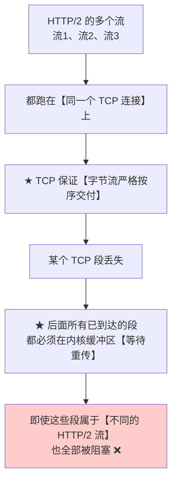

**具体场景**：

```
TCP 段序号：  100  101  102  103  104
所属 HTTP/2 流：流1  流1  流2  流3  流3
                      ↑ 【丢失】
     ↓
段 102、103、104 都已到达接收方内核
但 TCP 必须【按序交付】→ 它们被扣在内核缓冲区
     ↓
★ 流2、流3 的数据明明完好，却因为【流1 的段丢了】而无法交付 ❌
```

> ⚠️ **讽刺的是**：在**丢包率高的网络**（移动网络）下，**HTTP/2 可能比 HTTP/1.1 还慢**——因为 HTTP/1.1 用 6 个连接，一个连接丢包只影响 1/6 的资源；而 HTTP/2 只用 1 个连接，**一丢包全部受影响**。

---

**（3）QUIC 如何彻底解决 + 两个额外优势**

**QUIC 的解法：把"可靠传输"从内核的 TCP 搬到用户态，并【按流独立】实现。**

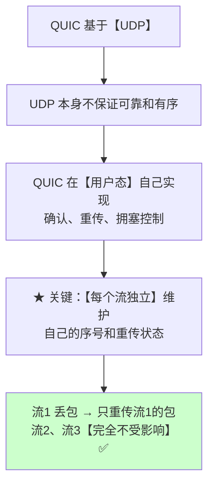

**对比**：

| | TCP + HTTP/2 | QUIC + HTTP/3 |
|---|---|---|
| **可靠性实现在** | **内核的 TCP**（全局一个字节流） | **用户态的 QUIC**（每流独立） |
| **一个包丢失** | **所有流都被阻塞** ❌ | **只影响该流** ✅ |

---

**额外优势一：握手更快（1-RTT 甚至 0-RTT）**

```
【HTTP/2 over TCP + TLS 1.3】
  TCP 三次握手：      1 RTT
  TLS 1.3 握手：      1 RTT
  ────────────────────────
  首次建连共 【2 RTT】

【HTTP/3 over QUIC】
  ★ QUIC 把【传输层握手】和【加密握手】合并
  ────────────────────────
  首次建连 【1 RTT】✅
  
  ★ 若之前连接过（有缓存的会话票据）：
  重连 【0-RTT】—— 第一个数据包就能带业务数据！⭐
```

**收益量化**（RTT = 100 ms）：

| 场景 | HTTP/2 | HTTP/3 | 节省 |
|---|---|---|---|
| 首次建连 | 200 ms | **100 ms** | **50%** |
| 重连 | 200 ms | **0 ms** | **100%** ⭐ |

---

**额外优势二：连接迁移（Connection Migration）**

**问题**：

```
TCP 用【四元组】(源IP, 源端口, 目的IP, 目的端口) 标识一个连接
     ↓
★ 手机从 WiFi 切换到 4G → 【源 IP 变了】
     ↓
四元组变了 → TCP 认为这是【另一个连接】
     ↓
原连接【断开】，必须重新握手 ❌
     ↓
表现：视频卡一下、下载中断、需要重新登录
```

**QUIC 的解法**：

```
QUIC 用一个独立的 【Connection ID】 标识连接
     ↓
★ 与 IP 地址、端口【完全解耦】
     ↓
手机从 WiFi 切到 4G：
  - IP 变了
  - 但 Connection ID 【没变】
     ↓
★ 服务器认出"还是那个连接"→ 【无缝继续】✅
     ↓
用户完全无感知：视频不卡、下载不断、登录态保持
```

> ⭐ **这个特性对移动互联网价值巨大**——用户在地铁上、走出办公室时网络切换是常态。

---

**三个改进的总结**：

| 改进 | 解决的问题 | 收益 |
|---|---|---|
| **每流独立可靠传输** | **TCP 层队头阻塞** | 弱网下性能大幅提升 |
| **握手合并（1-RTT / 0-RTT）** | 建连延迟 | 首屏时间减少 100~200 ms |
| **连接迁移（Connection ID）** | 网络切换断连 | 移动场景无缝体验 |

> 💡 **代价**：QUIC 在**用户态**实现，**CPU 开销高于内核态的 TCP**（数据要多几次用户态-内核态拷贝）。这也是为什么高吞吐的服务器间通信仍然用 TCP——**QUIC 主要优化的是"高延迟、易丢包、会切网"的终端用户场景**。

</details>

---

## 小结

| 要点 | 一句话 |
|---|---|
| 应用层的性能瓶颈 | **往返次数（RTT）远超传输时间** |
| C/S vs P2P | C/S **服务器是瓶颈**；P2P **用户越多能力越强** |
| DNS 层次 | 根 → TLD → 权威；**本地 DNS 不在层次结构中** |
| **DNS 查询模式** | 主机→本地 DNS **递归**；本地 DNS→上层 **迭代** |
| 为什么根用迭代 | **保护根服务器**——只回答"去问谁"，成本极低 |
| DNS 缓存 | 四层缓存；**90%+ 查询在缓存命中** |
| TTL 与迁移 | **提前调小 TTL**，让变更能快速生效 |
| **FTP 两个连接** | **控制 21（全程保持）** + **数据 20（每传一个建一次）** |
| **主动 vs 被动** | 主动 **服务器**发起数据连接；**被动客户端**发起 ⭐（穿 NAT） |
| **SMTP** | **端口 25**，**推（push）**，**只发不收** |
| **POP3 vs IMAP** | POP3 **下载后删除、不同步**；IMAP **保留在服务器、多设备同步** ⭐ |
| 为什么收信用"拉" | 接收方**不是 always-on**；邮件服务器充当"永远在线的信箱" |
| **MIME** | **不改 SMTP**，只做内容编码；**Base64 膨胀 33%** |
| **HTTP 无状态** | 协议本身无状态；**Cookie 在应用层实现状态** |
| 安全 vs 幂等 | GET 都是；**DELETE/PUT 幂等不安全**；**POST 都不是** |
| 301 vs 302 | **301 永久会被浏览器缓存**（难撤销）；302 临时 |
| 连接方式 | **HTTP/1.0 非持久**；**HTTP/1.1 持久（Keep-Alive）** |
| 持久连接的三个价值 | 省握手 RTT、**避免 TIME_WAIT**、**让 cwnd 长大** |
| **HTTP/2** | 二进制分帧 + **多路复用** + HPACK → 解决 **HTTP 层**队头阻塞 |
| **HTTP/3** | 基于 **QUIC/UDP** → 解决 **TCP 层**队头阻塞 + **1/0-RTT 握手** + **连接迁移** |
| Go 的坑 | `MaxIdleConnsPerHost` **默认只有 2**；Body **必须读完再关**才能复用 |

**全部完结** —— 计算机网络 CN01–CN06 六篇齐了，**计算机基础四大件 31 篇全部完成**。

---

## 延伸阅读

- 《计算机网络》（谢希仁）第 6 章 —— 408 指定教材
- 《计算机网络：自顶向下方法》第 2 章 —— **从应用层开始讲**，最适合建立直觉
- 《HTTP 权威指南》—— HTTP/1.1 的百科全书
- [High Performance Browser Networking](https://hpbn.co/) —— **免费在线书**，HTTP/2、QUIC 讲得最好
- [RFC 9114: HTTP/3](https://www.rfc-editor.org/rfc/rfc9114) / [RFC 9000: QUIC](https://www.rfc-editor.org/rfc/rfc9000)
- 本仓库对照：
  - [CN05 传输层](./CN05-精通-传输层.md) —— 持久连接为什么能避免 TIME_WAIT
  - [CN04 网络层](./CN04-精通-网络层.md) —— DNS 解析出的 IP 如何用于路由
  - [backend/B02 HTTP 语义](../../backend/B02-精通-HTTP-语义.md) —— 工程视角的 HTTP 深入
  - [golang/G27 net/http](../../golang/G27-精通-Go-net-http.md) —— Go 的 HTTP 客户端与连接池调优
