# 计算机网络（408）路线图 · Mermaid 可视化

> 配合 [INDEX.md](./INDEX.md) 与 [QUIZ.md](./QUIZ.md) 使用
>
> **📅 内容基准：2026 年 7 月**

---

## 🗺️ 全景路线图

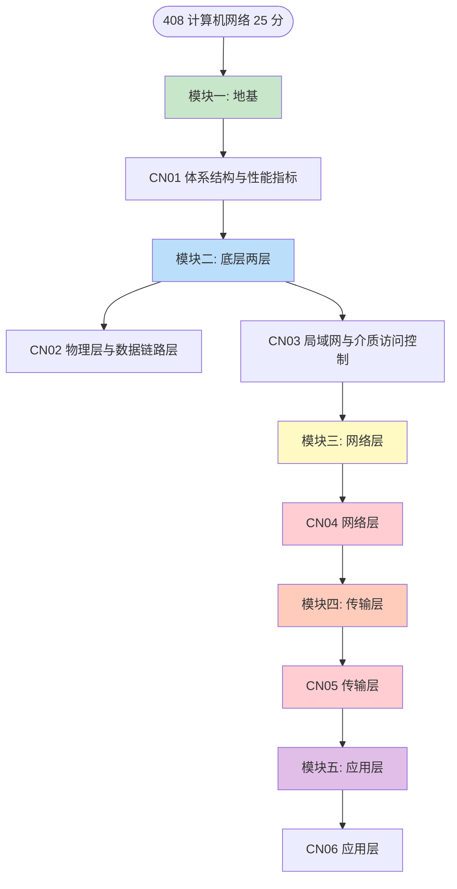

> 红色 = 大题最高频（子网划分与路由表、握手挥手与拥塞窗口）。
> 网络这一科**必须自底向上学**：上层协议的每个设计决策，都是在补下层的短板。

---

## 🧅 五层模型与封装（CN01）

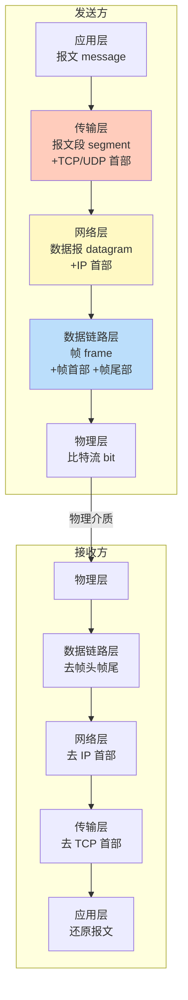

| 层 | PDU | 典型设备 | 典型协议 | 地址 |
|---|---|---|---|---|
| 应用层 | 报文 | 主机 | HTTP / DNS / FTP / SMTP | 域名 |
| 传输层 | 报文段 / 用户数据报 | 主机 | TCP / UDP | **端口号** |
| 网络层 | **IP 数据报**（分组） | **路由器** | IP / ICMP / ARP / OSPF | **IP 地址** |
| 数据链路层 | **帧** | **交换机 / 网桥** | 以太网 / PPP | **MAC 地址** |
| 物理层 | **比特** | **集线器 / 中继器** | RJ45 / 光纤标准 | 无 |

**陷阱**：ARP 的分层归属在不同教材有分歧——谢希仁版把 **ARP 划在网络层**，408 按此答。

---

## ⏱️ 四种时延与时延带宽积（CN01 必考）


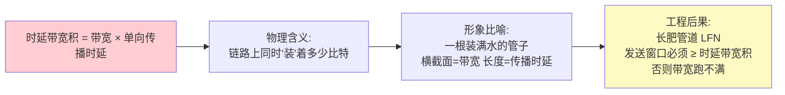

**最重要的辨析**：

| | 发送时延 | 传播时延 |
|---|---|---|
| 公式 | `数据长度 / 发送速率` | `信道长度 / 电磁波传播速度` |
| 与**带宽** | **成反比**（带宽越大越小） | **无关** ⭐ |
| 与**数据长度** | 成正比 | **无关** ⭐ |
| 发生位置 | 发送方网卡 | 链路上 |

> **"升级到千兆宽带后 ping 值没变"**，原因就是 ping 值主要由传播时延与排队时延决定，而带宽只影响发送时延。

---

## 🔀 三种交换方式（CN01）

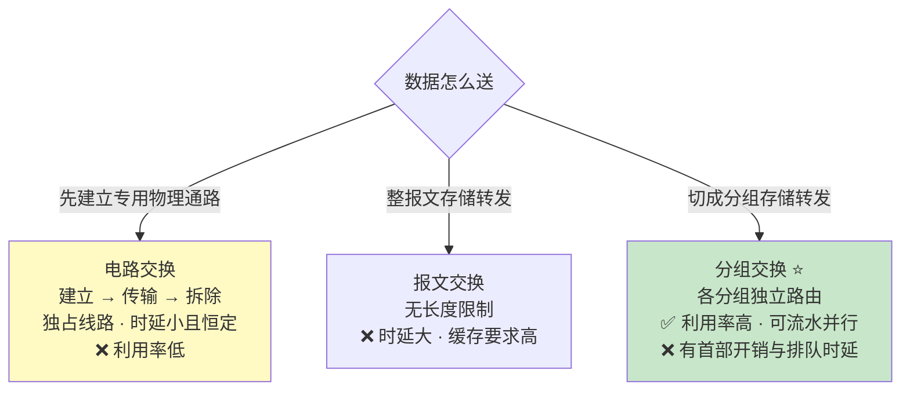

**总时延对比**（`n` 段链路、`p` 个分组、每分组发送时延 `t`）：

- 报文交换：`n × T`（每跳都要收完整个报文）
- 分组交换：`(p + n - 1) × t` —— **流水线效应**，这与 [CO07 流水线](../computer-organization/CO07-精通-中央处理器.md) 的 `(k + n - 1) × Δt` 是同一个公式

---

## 📶 信道极限：奈奎斯特与香农（CN02）

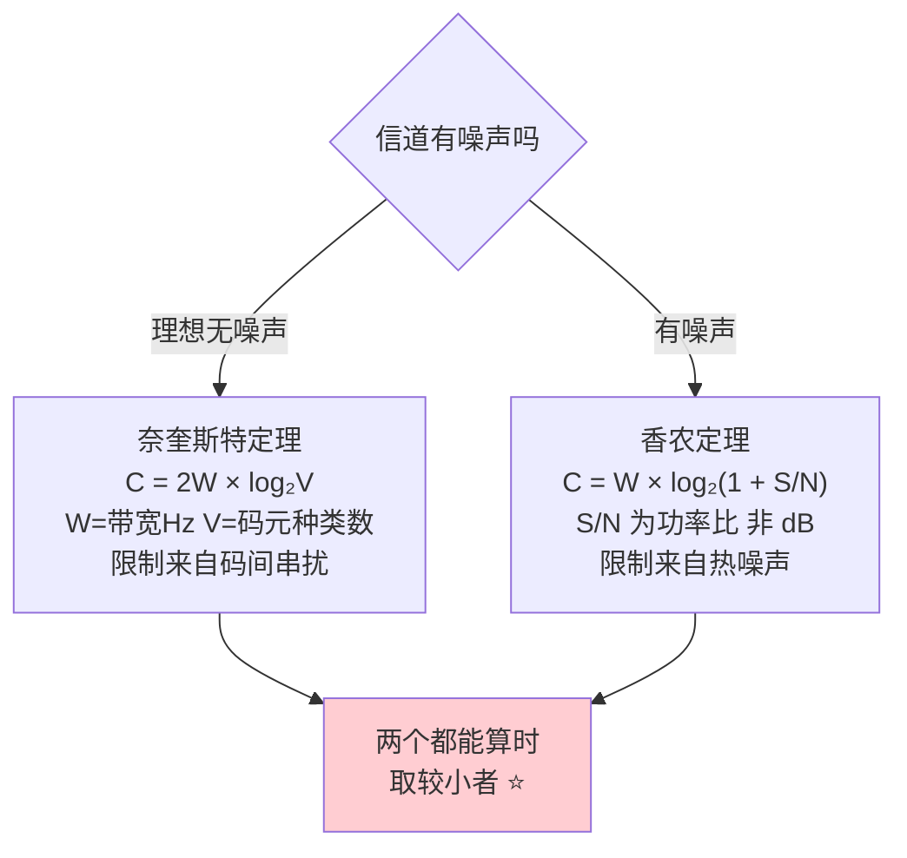

**三个必踩陷阱**：

1. **信噪比单位换算**：题目常给 dB，`S/N(dB) = 10·log₁₀(S/N)` → `30 dB` 对应功率比 **1000**，不是 30。
2. **比特率 vs 波特率**：`比特率(bps) = 波特率(Baud) × log₂V`。**只有二进制（V=2）时两者数值才相等**。
3. **香农定理与码元种类无关**——提高 V 能突破奈氏极限，但**永远突破不了香农极限**。

---

## 🛡️ 差错控制三级（CN02）

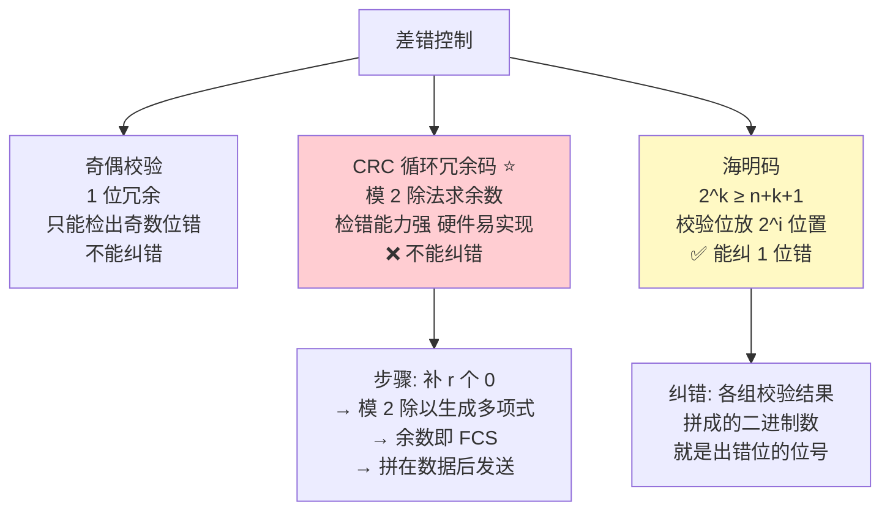

**关键结论**：**链路层的 CRC 只检错不纠错，检出错误直接丢弃**——可靠传输由上层（TCP）或链路层的重传协议负责。408 常考「以太网提供的是**无连接、不可靠**的服务」。

---

## 🪟 三种可靠传输协议（CN02）

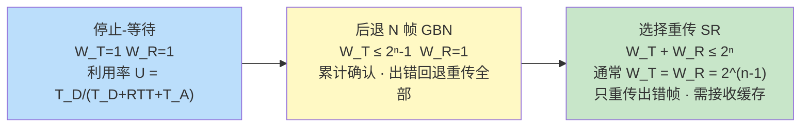

| | 停止-等待 | GBN | SR |
|---|---|---|---|
| 发送窗口 | 1 | `≤ 2ⁿ - 1` | `≤ 2^(n-1)` |
| 接收窗口 | 1 | **1** | `= 发送窗口` |
| 确认方式 | 逐个 | **累计确认** | 逐个 / 累计 |
| 出错重传 | 重传该帧 | **重传出错帧及其后全部** | **只重传出错帧** |
| 缓存需求 | 最小 | 小 | **大** |

**速记**：**接收窗口为 1 → 必须按序接收 → 是 GBN**；序号位数 `n` 决定序号空间 `2ⁿ`，窗口约束是每年选择题的常客。

---

## 📡 介质访问控制全景（CN03）

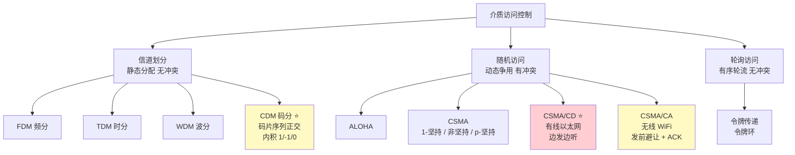

---

## 🚦 CSMA/CD 与最小帧长（CN03 必考）

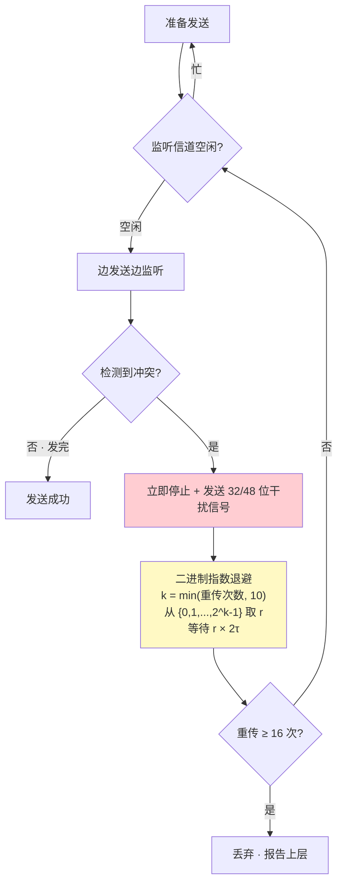

**最小帧长的由来**（每年必考的推导）：

```
要能检测到冲突，帧还没发完时冲突信号就得回来
→ 发送时延 ≥ 2τ（争用期 / 冲突窗口）
→ 最小帧长 = 2τ × 数据率
```

- 10 Mbps 以太网：`2τ = 51.2 μs` → `51.2μs × 10Mbps = 512 bit = **64 字节**`
- **不足 64 字节要填充**；**收到的小于 64 字节的帧一律视为无效帧丢弃**
- 数据率提高 10 倍而帧长不变时，**网段最大长度要缩短 10 倍**（这是千兆以太网引入"载波延伸"的原因）

---

## 🌐 冲突域与广播域（CN03 高频）

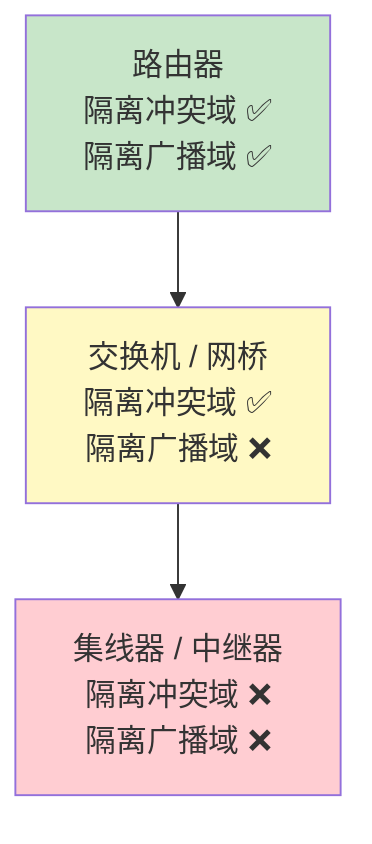

| 设备 | 工作层 | 冲突域 | 广播域 |
|---|---|---|---|
| 集线器 / 中继器 | 物理层 | **不隔离**（所有端口一个冲突域） | 不隔离 |
| 交换机 / 网桥 | 链路层 | **每个端口一个冲突域** | 不隔离（**除非划 VLAN**） |
| 路由器 | 网络层 | 隔离 | **隔离** |

**数数口诀**：**交换机有几个端口就有几个冲突域**；**路由器有几个接口就有几个广播域**；集线器整个是**一个**冲突域。

---

## 🔢 子网划分与最长前缀匹配（CN04 必考）

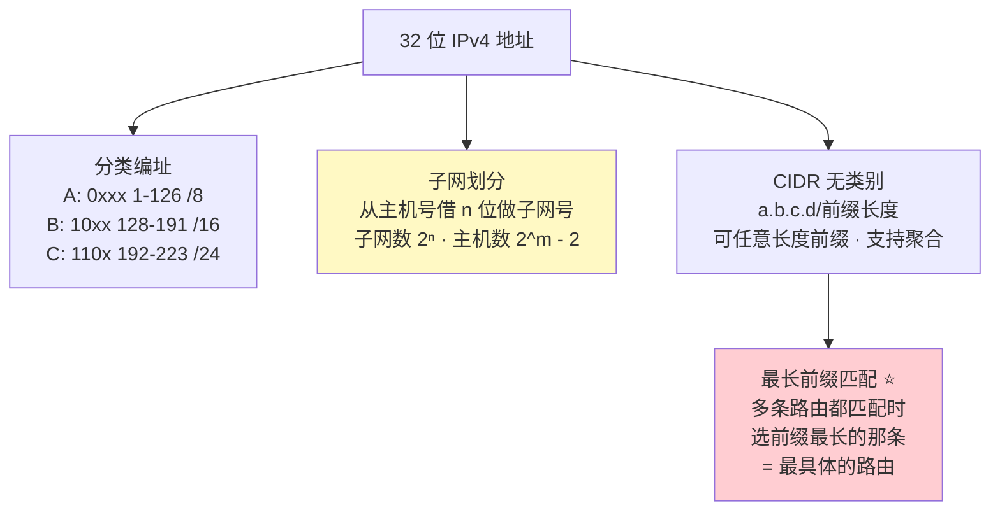

**三个必记的"减 2"与"不减 2"**：

- 一个子网的**可用主机数 = 2^主机位数 − 2**（减掉全 0 的网络地址与全 1 的广播地址）
- **子网数不减 2**（现代 CIDR 允许全 0 和全 1 子网；老教材可能要求减 2，**看题目说明**）
- **点对点链路用 /31 或 /30**：/30 只有 2 个可用地址，正好一端一个

**解题四步**：① 由前缀长度写出子网掩码 → ② `IP AND 掩码` = 网络地址 → ③ 主机位全置 1 = 广播地址 → ④ 中间即可用范围。

---

## ✂️ IP 分片（CN04）

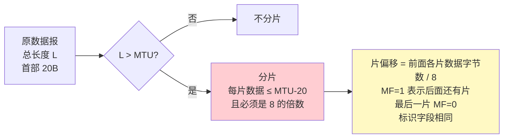

**三条铁律**：① **片偏移以 8 字节为单位**；② **除最后一片外，每片的数据部分必须是 8 的倍数**；③ **每一片都要带 20 字节 IP 首部**，所以分片会放大总流量。
**DF = 1 时不允许分片**——超过 MTU 只能丢弃并回 ICMP 差错报文，这正是 **PMTU 发现**的工作方式。

---

## 🤝 TCP 三次握手与四次挥手（CN05 必考）

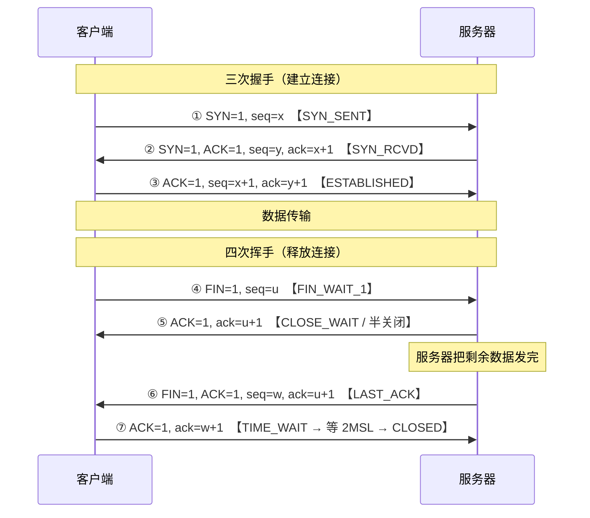

| 问题 | 答案 |
|---|---|
| 为什么握手不是**两次** | 防止**已失效的连接请求**突然到达服务器，导致服务器白白建立连接并等待，浪费资源 |
| 为什么挥手要**四次** | TCP 是**全双工**的，一方 FIN 只表示"我没数据发了"，另一方**可能还有数据要发**，所以 ACK 与 FIN 不能合并 |
| TIME_WAIT 为什么等 **2MSL** | ① 保证**最后一个 ACK 能到达**（丢了对方会重发 FIN，自己还能补发 ACK）；② 让本连接的**所有报文在网络中消散**，不干扰下一个同四元组的连接 |
| 第三次握手能否携带数据 | **可以**（前两次不行——尚未确认对方存在，携带数据会成为攻击面） |

**排障对照**：`CLOSE_WAIT` 大量堆积 = **应用层收到 FIN 后没调用 close()**（代码 bug）；`TIME_WAIT` 大量堆积 = 本机是**主动关闭方**（如短连接压测的客户端、每请求新建连接的反向代理）。

---

## 📈 TCP 拥塞控制（CN05 必考）

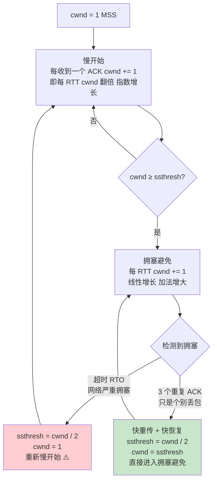

**两种拥塞信号的处理差异是最高频考点**：

| 触发 | ssthresh | cwnd | 后续阶段 |
|---|---|---|---|
| **超时** | `cwnd / 2` | **1** | 慢开始 |
| **三个重复 ACK** | `cwnd / 2` | `ssthresh`（即 `cwnd/2`） | **直接拥塞避免** |

**流量控制 vs 拥塞控制**：

| | 流量控制 | 拥塞控制 |
|---|---|---|
| 解决什么 | **接收方**处理不过来 | **网络**承载不了 |
| 作用范围 | 点对点（**两端之间**） | **全局**（所有主机、路由器） |
| 依据的窗口 | 接收窗口 **rwnd**（对方在 TCP 首部里告诉你） | 拥塞窗口 **cwnd**（发送方自己算） |

**实际发送窗口 = min(rwnd, cwnd)** —— 这个公式必背。

---

## 🔍 DNS 查询流程（CN06）

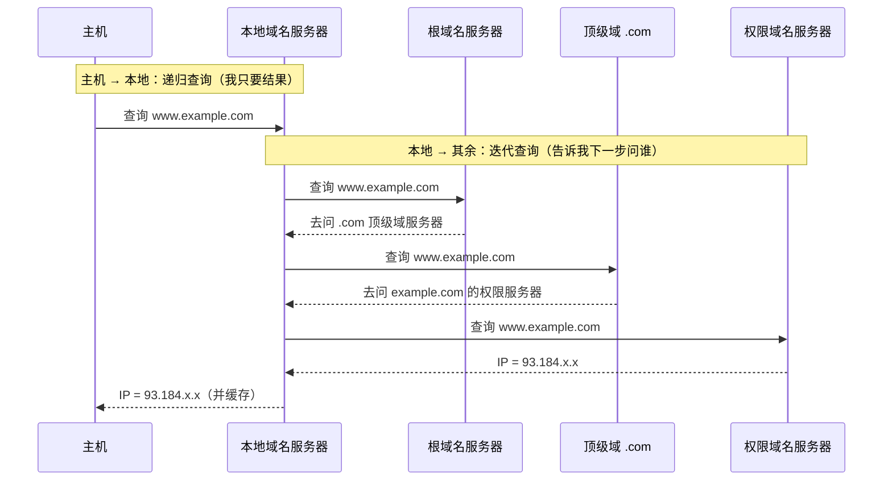

| | 递归查询 | 迭代查询 |
|---|---|---|
| 谁替谁跑腿 | **被问的服务器负责查到底** | 被问的服务器**只回复"下一步问谁"** |
| 典型用在 | **主机 → 本地域名服务器** | **本地域名服务器 → 根/顶级/权限** |
| 负担 | 落在被查询的服务器 | 落在**本地域名服务器** |

**陷阱**：本地域名服务器→根服务器**也可以**用递归（协议允许），但根服务器出于负载考虑**一律只做迭代**，408 按"本地之后全是迭代"作答。命令行验证：`dig +trace www.example.com` 打印的就是完整的迭代过程。

---

## 🌍 HTTP 连接管理与 RTT 计算（CN06）

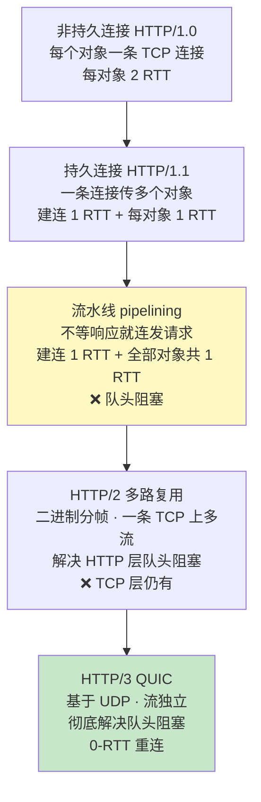

**RTT 计算模板**（请求 1 个 HTML + `n` 个内嵌对象，忽略传输时延）：

| 方式 | 总 RTT |
|---|---|
| 非持久、非并行 | `2 × (n + 1)` |
| 非持久、并行 `m` 条 | `2 + 2 × ⌈n / m⌉` |
| 持久、非流水线 | `2 + n` |
| **持久 + 流水线** | **`2 + 1 = 3`** |

> "2" = 建立 TCP 连接的 1 个 RTT + 请求 HTML 的 1 个 RTT。**若题目还要求 DNS 解析，再加 1 个 RTT**。

---

## 🎓 建议学习顺序


本科 25 分应当作**满分目标**——协议细节明确、计算套路固定。计算题清单见 [INDEX.md 路径 C](./INDEX.md#路径-c只突击计算题3-天)。
