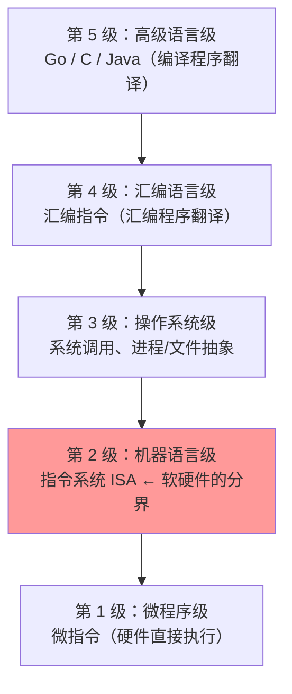
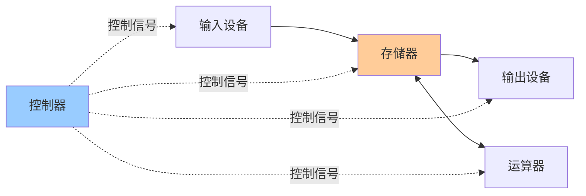
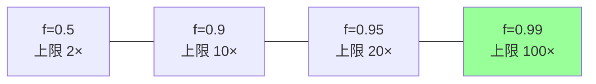

# 精通计算机系统概述与性能指标：冯·诺依曼结构、指令周期与 Amdahl 定律

> 课程编号：CO01
> 路线图来源：计算机基础四大件 · 计算机组成原理（408 第 1 章）
> 难度：⭐⭐
> 预计阅读时间：70 分钟
> 内容基准：2026 年 8 月（408 考纲组成原理第 1 章「计算机系统概述」）
> **代码语言：Go**。本章代码用于**验证概念**（字长、字节序、性能公式），不是考场答题代码。

---

## 引言：为什么 3.0 GHz 的 CPU 可能比 4.0 GHz 的快

买电脑时最常被拿来比较的是主频。但下面这个场景每天都在发生：

```
CPU A：主频 4.0 GHz，运行程序 P 的平均 CPI = 4.0
CPU B：主频 3.0 GHz，运行程序 P 的平均 CPI = 2.0

同一个程序 P 共 10⁹ 条指令：

CPU A 执行时间 = 10⁹ × 4.0 / (4.0 × 10⁹) = 1.00 秒
CPU B 执行时间 = 10⁹ × 2.0 / (3.0 × 10⁹) = 0.67 秒
```

**主频低 25% 的 B，反而快 33%。**

原因藏在一个公式里，它是整个第 1 章的核心：

$$
\boxed{\text{CPU 执行时间} = \frac{\text{指令条数} \times CPI}{\text{主频}}}
$$

三个因子，主频只是其中之一：

| 因子 | 由谁决定 |
|---|---|
| **指令条数** | 指令系统设计 + 编译器优化水平 |
| **CPI** | 指令系统 + CPU 微架构（流水线、乱序执行、缓存） |
| **主频** | 制造工艺 + 功耗墙 |

2005 年之后**主频基本停滞在 3–5 GHz**（功耗墙），厂商全部转向降低 CPI（更深的流水线、更宽的发射、更大的缓存）和增加核心数。所以"看主频比性能"在今天几乎总是错的。

第二个反直觉的东西是 **Amdahl 定律**：

```
一个程序 90% 的时间花在函数 F 上。你把 F 优化到「无限快」（耗时归零）。
总加速比是多少？

答案：10 倍。不是 100 倍，也不是无限倍。
因为剩下那 10% 一秒都没少。
```

这条定律解释了为什么"加核心数"的收益会迅速饱和——**串行部分决定了并行的天花板**。

本章拆开这些：系统层次结构、冯·诺依曼模型、指令执行过程、性能指标公式、Amdahl 定律。**这一章计算题多、概念题少，公式必须能默写并正确套用。**

读完你应该能：

- 画出冯·诺依曼机的五大部件与数据流向，说清"以运算器为中心"到"以存储器为中心"的演变
- 说清 CPU 内每个寄存器（PC / IR / MAR / MDR / ACC）的作用与位数含义
- 完整叙述一条指令的取指-译码-执行过程，以及每步的数据通路
- 熟练套用 CPU 执行时间、CPI、MIPS、MFLOPS 公式做计算题
- 说清 MIPS 为什么不能跨指令系统比较
- 用 Amdahl 定律算加速比上限

---

## 第一章 计算机系统的层次结构

### 1.1 从硬件到应用的五层



**最关键的一层是第 2 级——指令系统（ISA）**。它是**软件和硬件的分界面**：

- 往下，硬件设计者可以任意改变实现方式（流水线、乱序、多发射），只要指令的**行为**不变
- 往上，软件只需要面对稳定的指令集，不必关心底层怎么实现

这就是为什么 Intel 从 Pentium 到今天的酷睿，微架构换了十几代，但 20 年前编译的 x86 程序仍然能跑。

### 1.2 三种翻译程序

| 翻译程序 | 输入 → 输出 | 特点 |
|---|---|---|
| **汇编程序** | 汇编语言 → 机器语言 | 一对一翻译 |
| **编译程序** | 高级语言 → 汇编/机器语言 | **一次翻译，多次执行**；执行快 |
| **解释程序** | 高级语言 → 边翻译边执行 | **每次都要翻译**；执行慢但灵活 |

> ⚠️ **陷阱**：「编译程序把高级语言翻译成机器语言」不完全准确——很多编译器（含 Go）先翻译成汇编，再交给汇编器。408 里两种说法都算对，但要知道区别。

### 1.3 软件与硬件的逻辑等价性

**任何由软件实现的功能，都可以用硬件实现；反之亦然。**

例子：乘法运算

- 早期 CPU 没有乘法指令 → **软件**用循环加法实现
- 后来加入乘法器 → **硬件**一条指令搞定

**取舍**：硬件实现**快但贵、不灵活**；软件实现**慢但便宜、易修改**。这条原则贯穿整个组成原理——每一个设计决策都是在这条轴上选点。

---

## 第二章 冯·诺依曼结构

### 2.1 三个核心思想

1941 年 ENIAC 靠**插线板**编程，改一个程序要重新接几千根线。冯·诺依曼 1945 年提出的方案彻底改变了这一点：

1. **存储程序（Stored Program）**——把程序像数据一样存进存储器
2. **指令和数据同等地位**——都用二进制表示，存在同一个存储器里，靠**执行时机**区分
3. **按地址访问、顺序执行**——PC 自动加 1，除非遇到转移指令

> 💡 **"指令和数据在存储器中无法区分"是冯·诺依曼结构的本质特征**，也是缓冲区溢出攻击能把数据当代码执行的根源。**哈佛结构**把指令和数据分开存储（分离的存储器和总线），常见于 DSP 和单片机；现代 CPU 在 **Cache 层**采用哈佛结构（L1 分成 I-Cache 和 D-Cache），但主存层面仍是冯·诺依曼。

### 2.2 五大部件



**现代计算机以存储器为中心**（上图）。早期冯·诺依曼机**以运算器为中心**——所有数据都要经过运算器中转，包括输入设备到存储器的传输，效率极低。

**主机 = CPU + 主存储器**；**CPU = 运算器 + 控制器**。

> ⚠️ **陷阱**：I/O 设备**不属于主机**。「主机」这个词在 408 里有严格定义，别按日常语感理解。

### 2.3 运算器与控制器的内部寄存器

| 寄存器 | 全称 | 属于 | 作用 |
|---|---|---|---|
| **ACC** | Accumulator 累加器 | 运算器 | 存放操作数或运算结果 |
| **MQ** | Multiplier-Quotient 乘商寄存器 | 运算器 | 乘除运算时存放乘数/商 |
| **X** | 通用操作数寄存器 | 运算器 | 存放另一个操作数 |
| **ALU** | Arithmetic Logic Unit | 运算器 | 实际做算术/逻辑运算的电路 |
| **PSW** | Program Status Word 程序状态字 | 运算器 | 存放标志位（进位、溢出、零、负） |
| **PC** | Program Counter 程序计数器 | 控制器 | **存放下一条指令的地址**，有自动加 1 功能 |
| **IR** | Instruction Register 指令寄存器 | 控制器 | 存放**当前正在执行**的指令 |
| **CU** | Control Unit 控制单元 | 控制器 | 译码 IR，发出控制信号 |
| **MAR** | Memory Address Register | **主存储器** | 存放要访问的**主存地址** |
| **MDR** | Memory Data Register | **主存储器** | 存放**从主存读出或要写入主存的数据** |

> ⚠️ **MAR 和 MDR 在逻辑上属于主存储器**，但现代 CPU 把它们**物理上集成在 CPU 芯片内**。408 问"属于哪个部件"时按逻辑归属答**主存**；问"物理位置"时答 CPU 内。

### 2.4 两个位数关系（计算题高频）

$$
\text{MAR 的位数} = \text{地址线根数} \Rightarrow \text{存储单元个数} = 2^{\text{MAR位数}}
$$

$$
\text{MDR 的位数} = \text{数据线根数} = \text{存储字长}
$$

$$
\text{主存容量} = \text{存储单元个数} \times \text{存储字长}
$$

**例**：MAR 32 位，MDR 8 位 → 主存容量 = $2^{32} \times 8\text{bit} = 4\text{G} \times 1\text{B} = 4\text{GB}$。

**例**：MAR 16 位，MDR 32 位 → 主存容量 = $2^{16} \times 32\text{bit} = 64\text{K} \times 4\text{B} = 256\text{KB}$。

> ⚠️ **单位陷阱**：MDR 位数给的是 **bit**，容量常用 **Byte**，别忘了除以 8。这是丢分重灾区。

---

## 第三章 指令的执行过程

### 3.1 三个阶段


### 3.2 取指令的完整数据通路

这是 408 要求能**逐步写出**的：

```
① (PC) → MAR          把 PC 里的地址送到 MAR
② M(MAR) → MDR        按 MAR 的地址访存，数据送 MDR
③ (MDR) → IR          指令送到 IR
④ (PC) + 1 → PC       PC 自增，指向下一条指令
⑤ (IR) → CU           操作码送控制单元译码
```

> 💡 **第 ④ 步"PC + 1"里的"1"指的是「一条指令的长度」，不是字面的 1 字节**。若指令定长 4 字节且按字节编址，实际是 PC + 4。408 表述统一写 "(PC)+1→PC"。

### 3.3 完整例子：执行 `a = a + b`

假设是单地址指令的累加器结构机器，编译后的三条指令：

```
指令1: LOAD  a      ; 取 a 到 ACC
指令2: ADD   b      ; ACC = ACC + b
指令3: STORE a      ; ACC 存回 a
```

**执行 `ADD b` 的完整过程**：

```
【取指阶段】
  (PC) → MAR
  M(MAR) → MDR
  (MDR) → IR
  (PC)+1 → PC
【分析阶段】
  OP(IR) → CU              操作码 ADD 送译码
【执行阶段】
  Ad(IR) → MAR             ★ 地址码送 MAR（b 的地址）
  M(MAR) → MDR             ★ 访存取出 b
  (MDR) → X                b 送到运算器的 X 寄存器
  (ACC) + (X) → ACC        ALU 做加法，结果回 ACC
```

**关键观察**：`ADD b` 这一条指令**访存了两次**——一次取指令，一次取操作数。这就是为什么指令的**寻址方式**（第 CO06 章）对性能影响巨大：立即寻址只访存 1 次，间接寻址要访存 3 次。

---

## 第四章 性能指标（计算题核心）

### 4.1 基础量

| 指标 | 定义 | 备注 |
|---|---|---|
| **机器字长** | CPU **一次能处理**的二进制位数 | 通常 = 通用寄存器位数 = ALU 位数 |
| **存储字长** | 一个存储单元的位数 | = MDR 位数 |
| **指令字长** | 一条指令的位数 | 通常是存储字长的整数倍 |
| **数据通路带宽** | 数据总线一次能传的位数 | ≤ 机器字长 |

> ⚠️ **这四个"字长"互相独立，可以都不相等**。408 常出的判断题：「机器字长一定等于存储字长」→ **错**。

### 4.2 核心公式组

**时钟周期与主频**：

$$
\text{时钟周期 } T = \frac{1}{\text{主频 } f}
$$

**CPI（Clock cycle Per Instruction，每条指令的平均时钟周期数）**：

$$
CPI = \frac{\text{执行程序所需的总时钟周期数}}{\text{指令条数}}
$$

**多类指令混合时的平均 CPI**（加权平均）：

$$
CPI_{平均} = \sum_{i} (CPI_i \times \text{该类指令占比}_i)
$$

**CPU 执行时间**（最重要的一个）：

$$
T_{CPU} = \text{总时钟周期数} \times T = \frac{\text{指令条数} \times CPI}{f}
$$

**MIPS（Million Instructions Per Second，每秒百万条指令）**：

$$
MIPS = \frac{\text{指令条数}}{\text{执行时间} \times 10^6} = \frac{f}{CPI \times 10^6}
$$

**MFLOPS / GFLOPS / TFLOPS（每秒浮点操作次数）**：

$$
MFLOPS = \frac{\text{浮点操作次数}}{\text{执行时间} \times 10^6}
$$

> ⚠️ **MIPS 和 MFLOPS 的单位换算用的是 10⁶ 不是 2²⁰**。而**存储容量**里的 K/M/G 用的是 2¹⁰/2²⁰/2³⁰。**同一道题里两套进制并存**是 408 最阴险的坑之一。
>
> 记忆法：**速度用十进制（10⁶），容量用二进制（2²⁰）**。

### 4.3 完整计算例题

**例题**：某程序在主频 1.2 GHz 的机器上运行，程序由 4 类指令组成：

| 指令类型 | 占比 | CPI |
|---|---|---|
| 算术运算 | 45% | 1 |
| Load/Store | 32% | 2 |
| 转移 | 15% | 3 |
| 其他 | 8% | 4 |

程序共 10⁶ 条指令。求：（1）平均 CPI （2）CPU 执行时间 （3）MIPS。

**解**：

（1）加权平均：

$$
CPI = 0.45 \times 1 + 0.32 \times 2 + 0.15 \times 3 + 0.08 \times 4 = 0.45 + 0.64 + 0.45 + 0.32 = 1.86
$$

（2）执行时间：

$$
T = \frac{10^6 \times 1.86}{1.2 \times 10^9} = \frac{1.86 \times 10^6}{1.2 \times 10^9} = 1.55 \times 10^{-3}\text{ 秒} = 1.55\text{ ms}
$$

（3）MIPS：

$$
MIPS = \frac{1.2 \times 10^9}{1.86 \times 10^6} = \frac{1200}{1.86} \approx 645
$$

### 4.4 MIPS 的三个致命缺陷

MIPS 看起来是个好指标（越大越快），但 408 反复考它的局限：

**① 不能跨指令系统比较**

CISC 的一条指令可能顶 RISC 的好几条。RISC 机器 MIPS 高，不代表跑得快——它执行的指令条数更多。

```
完成同一任务：
  CISC 机器：执行 1 亿条指令，MIPS = 100  → 耗时 1.0 秒
  RISC 机器：执行 3 亿条指令，MIPS = 200  → 耗时 1.5 秒
  
MIPS 高的反而慢。
```

**② 同一台机器上，不同程序的 MIPS 也不同**

因为不同程序的指令构成不同，平均 CPI 不同。

**③ MIPS 可能与实际性能反向变化**

若编译器优化把浮点运算替换成更多条但更简单的整数指令，MIPS 上升而实际速度下降。

> 💡 **正确的性能评价方法是「基准程序（benchmark）」**——用一组有代表性的真实程序测实际执行时间。SPEC CPU 是工业标准。但基准程序也能被"针对性优化"作弊，所以要看程序集是否有代表性。

### 4.5 用 Go 验证机器字长与字节序

```go
package main

import (
    "encoding/binary"
    "fmt"
    "math/bits"
    "unsafe"
)

func main() {
    // ① 机器字长：Go 的 int 与平台字长一致
    fmt.Printf("机器字长: %d 位\n", bits.UintSize)         // 64
    fmt.Printf("int 占用: %d 字节\n", unsafe.Sizeof(int(0))) // 8
    fmt.Printf("指针占用: %d 字节\n", unsafe.Sizeof(uintptr(0)))

    // ② 字节序：把 0x01020304 的内存布局打出来
    var x uint32 = 0x01020304
    b := (*[4]byte)(unsafe.Pointer(&x))
    fmt.Printf("内存布局: % X\n", *b)
    if b[0] == 0x04 {
        fmt.Println("→ 小端序 (Little-Endian)：低字节存低地址，x86/ARM 常见")
    } else {
        fmt.Println("→ 大端序 (Big-Endian)：网络字节序")
    }

    // ③ 网络字节序永远是大端
    buf := make([]byte, 4)
    binary.BigEndian.PutUint32(buf, x)
    fmt.Printf("网络字节序: % X\n", buf) // 01 02 03 04
}
```

典型输出（x86-64）：

```
机器字长: 64 位
int 占用: 8 字节
指针占用: 8 字节
内存布局: 04 03 02 01
→ 小端序 (Little-Endian)：低字节存低地址，x86/ARM 常见
网络字节序: 01 02 03 04
```

> 💡 **字节序是 408 的常考点**（CO02 数据表示会细讲）。小端序的好处：类型转换时不用改地址（把 `int32` 当 `int8` 读，取低地址就是低字节）；大端序的好处：内存 dump 出来的顺序和人读的顺序一致。**网络传输统一用大端**，所以叫"网络字节序"。

---

## 第五章 Amdahl 定律

### 5.1 公式

系统中某部分占总执行时间的比例为 $f$，把这部分加速 $n$ 倍，则**总加速比**：

$$
\boxed{S = \frac{1}{(1 - f) + \dfrac{f}{n}}}
$$

**极限情况**（$n \to \infty$，即把可优化部分加速到耗时归零）：

$$
S_{max} = \frac{1}{1 - f}
$$

### 5.2 为什么"优化 90% 只能快 10 倍"

代回公式，$f = 0.9$：

$$
S_{max} = \frac{1}{1 - 0.9} = 10
$$

不管你把那 90% 优化到多快，剩下的 10% 一秒都没少，总时间最多降到原来的 10%。

**加速比随 n 的变化**（f = 0.9）：

| 加速倍数 n | 总加速比 S |
|---|---|
| 2 | 1.82 |
| 4 | 3.08 |
| 10 | 5.26 |
| 100 | 9.17 |
| ∞ | **10.00** |

从 10 倍加速到 100 倍加速（10 倍的努力），总加速比只从 5.26 提到 9.17。**边际收益急剧衰减**。



### 5.3 工程含义

**① 优化前必须先测量**

不知道 f 是多少就优化，可能把力气花在只占 2% 时间的代码上——上限只有 1.02 倍。**先 profile，再优化**。

**② 多核的收益有硬上限**

把 n 理解成核心数，f 理解成"可并行部分的比例"：

```
f = 0.95（95% 可并行）：
  4 核  → S = 3.48
  16 核 → S = 9.14
  64 核 → S = 15.4
  ∞ 核  → S = 20.0   ← 天花板
```

**5% 的串行代码，就把 64 核的收益锁死在 15 倍**。这是并行计算最根本的约束，也是为什么"堆核心数"到一定程度就没用了。

> 💡 与 Amdahl 定律对偶的是 **Gustafson 定律**：如果问题规模随核心数一起增长（比如更高分辨率的渲染），可并行部分的比例 f 会上升，加速比就能接近线性。**Amdahl 适用于固定问题规模，Gustafson 适用于可扩展问题**。408 只考 Amdahl。

---

## 第六章 408 高频考点与陷阱清单

### 6.1 考点分布

第 1 章通常是 **1-2 道选择题（2-4 分）**，偶尔在综合题里出现性能计算。属于**性价比高**的章节——公式就那么几个，练熟必得分。

最常考：

1. **CPU 执行时间 / CPI / MIPS 的计算**
2. MAR / MDR 位数与主存容量的换算
3. 冯·诺依曼结构的特点判断
4. MIPS 的局限性
5. Amdahl 定律算加速比

### 6.2 十二个陷阱

**陷阱 1：主机包括 I/O 设备**

**错**。主机 = **CPU + 主存储器**，不含 I/O。

**陷阱 2：MAR 和 MDR 属于 CPU**

**逻辑上属于主存储器**，物理上集成在 CPU 芯片内。看题目问的是逻辑归属还是物理位置。

**陷阱 3：机器字长 = 存储字长 = 指令字长**

**错**。三者相互独立，可以都不相等。

**陷阱 4：主频越高，机器速度越快**

**错**。执行时间 = 指令条数 × CPI / 主频，主频只是三个因子之一。

**陷阱 5：MIPS 值可以跨不同指令系统比较机器性能**

**错**。CISC 一条指令顶 RISC 多条，MIPS 高不代表快。

**陷阱 6：速度单位和容量单位用同一套进制**

**错**。**速度**（MIPS、MFLOPS、主频）用 **10⁶**；**容量**（KB、MB、GB）用 **2¹⁰**。

**陷阱 7：CPI 是固定值**

**错**。CPI 依赖**程序的指令构成**，同一台机器跑不同程序 CPI 不同。

**陷阱 8：冯·诺依曼结构中指令和数据能通过存储位置区分**

**错**。两者在存储器中**完全无法区分**，只能靠 CPU 的**执行时机**（取指周期取出的当指令，执行周期取出的当数据）。

**陷阱 9：哈佛结构在现代 CPU 中完全没用**

**错**。现代 CPU 的 **L1 Cache 就是哈佛结构**（分 I-Cache 和 D-Cache），主存层面才是冯·诺依曼。

**陷阱 10：Amdahl 定律说明优化没有意义**

**错**。它说明的是**要优化占比大的部分**，且**收益有上限**——这是指导优化方向的工具，不是否定优化。

**陷阱 11：软件功能不能用硬件实现**

**错**。**软硬件逻辑等价**——任何软件功能都可用硬件实现，反之亦然，区别只在成本、速度、灵活性。

**陷阱 12：编译程序和解释程序的区别是「快慢」**

不准确。本质区别是**是否生成目标代码**：编译一次翻译多次执行；解释每次执行都要翻译。速度差异是结果不是定义。

### 6.3 公式速查卡

```
时钟周期 T = 1 / f

CPI = 总时钟周期数 / 指令条数
CPI平均 = Σ(CPIᵢ × 占比ᵢ)

CPU 执行时间 = 指令条数 × CPI × T = 指令条数 × CPI / f

MIPS = 指令条数 / (执行时间 × 10⁶) = f / (CPI × 10⁶)

MFLOPS = 浮点操作次数 / (执行时间 × 10⁶)

主存容量 = 2^(MAR位数) × MDR位数

Amdahl:  S = 1 / ((1-f) + f/n)
         S上限 = 1 / (1-f)
```

---

## 第七章 Go ↔ C 对照

本章代码用于验证概念，不涉及考场答题。但有几处 Go 和 C 的差异值得知道：

| 场景 | C | Go | 说明 |
|---|---|---|---|
| 机器字长相关的整数 | `int` 通常 32 位（即使 64 位平台） | `int` **等于平台字长**（64 位平台是 64 位） | Go 的 `int` 才真正对应"机器字长" |
| 定长整数 | `int32_t`（需 `<stdint.h>`） | `int32` 内建 | |
| 取变量大小 | `sizeof(x)` 编译期 | `unsafe.Sizeof(x)` | Go 需要 `unsafe` 包 |
| 指针运算 | `p + 1` 合法 | **默认禁止**，需 `unsafe.Pointer` + `uintptr` | Go 有 GC，裸指针运算不安全 |
| 类型双关（看内存布局） | `union` 或指针强转 | `(*[4]byte)(unsafe.Pointer(&x))` | Go 必须显式走 `unsafe` |
| 字节序转换 | `htonl` / `ntohl` | `binary.BigEndian.PutUint32` | Go 标准库直接提供，不依赖平台 |

> ⚠️ **最大的认知差异**：C 的 `int` 在几乎所有 64 位平台上**仍是 32 位**（LP64 模型），而 Go 的 `int` 是 64 位。写跨语言接口时这是经典 bug 源。408 讨论"机器字长"时按 Go 的语义理解更直观。

---

## 第八章 练习题

### 选择题

**1.** 下列关于冯·诺依曼结构的说法，**错误**的是：
A. 指令和数据都用二进制表示
B. 指令和数据存放在同一个存储器中
C. 指令和数据在存储器中可以通过存储位置区分
D. 程序执行前需先存入存储器

**2.** 计算机的「主机」包括：
A. CPU 和 I/O 设备　B. CPU 和主存储器　C. CPU、主存和外存　D. 运算器和控制器

**3.** 存放当前正在执行的指令的寄存器是：
A. PC　B. IR　C. MAR　D. MDR

**4.** 某机器 MAR 为 24 位，MDR 为 32 位，则该机器主存容量为：
A. 24 MB　B. 32 MB　C. 64 MB　D. 96 MB

**5.** 某 CPU 主频 2 GHz，执行某程序共 2×10⁸ 条指令，平均 CPI = 2.5，则程序执行时间为：
A. 0.1 s　B. 0.25 s　C. 0.4 s　D. 1.0 s

**6.** 下列关于 MIPS 的说法，**正确**的是：
A. MIPS 越大，机器执行任何程序都越快
B. MIPS 可以跨不同指令系统比较机器性能
C. 同一台机器执行不同程序的 MIPS 值可能不同
D. MIPS = 主频 × CPI / 10⁶

**7.** 某程序中 60% 的时间花在模块 M 上。若把 M 加速 3 倍，则整个程序的加速比约为：
A. 1.25　B. 1.50　C. 1.67　D. 3.00

**8.** 若某程序 80% 的部分可以并行化，则使用无限多个处理器时，加速比的上限是：
A. 4　B. 5　C. 8　D. 无上限

**9.** 下列说法中，体现「软硬件逻辑等价性」的是：
A. 软件比硬件便宜
B. 乘法既可以用乘法器实现，也可以用循环加法实现
C. 硬件执行速度一定比软件快
D. 编译程序必须用硬件实现

**10.** 关于存储容量与运算速度的单位，**正确**的是：
A. 1 MB = 10⁶ B，1 MIPS = 10⁶ 条指令/秒
B. 1 MB = 2²⁰ B，1 MIPS = 2²⁰ 条指令/秒
C. 1 MB = 2²⁰ B，1 MIPS = 10⁶ 条指令/秒
D. 1 MB = 10⁶ B，1 MIPS = 2²⁰ 条指令/秒

### 应用题

**11.** 某计算机主频 500 MHz，其指令分为 4 类，各类指令的占比和 CPI 如下：

| 指令类型 | 占比 | CPI |
|---|---|---|
| A | 40% | 1 |
| B | 20% | 2 |
| C | 30% | 4 |
| D | 10% | 8 |

（1）求该机器的平均 CPI。
（2）求该机器的 MIPS 值。
（3）若通过优化把 C 类指令的 CPI 从 4 降到 2，新的平均 CPI 和 MIPS 是多少？整体加速比是多少？

**12.** 某程序在机器 M1（主频 1 GHz）上运行需要 10 秒，其中 4 秒花在浮点运算上。现有机器 M2，主频 2 GHz，且浮点部件速度是 M1 的 4 倍，其余部分速度与 M1 相同（按主频折算）。

（1）用 Amdahl 定律分析：仅把浮点部件加速 4 倍（主频不变），程序运行时间是多少？
（2）M2 上程序运行时间是多少？
（3）M2 相对 M1 的加速比是多少？

**13.** 写出指令 `ADD R1, (R2)`（把 R2 所指内存单元的内容加到 R1）在取指和执行阶段的完整数据通路操作序列。

### 答案与解析

<details>
<summary>点击展开</summary>

**1. C**

冯·诺依曼结构的本质特征之一就是**指令和数据在存储器中完全无法区分**——两者都是二进制串，存储位置也没有硬性划分。区分它们的唯一依据是 **CPU 的执行时机**：取指周期从存储器取出的当作指令，执行周期取出的当作数据。

这也是缓冲区溢出攻击能把注入的数据当成代码执行的根本原因。

**2. B**

主机 = **CPU + 主存储器**。I/O 设备和外存都是外部设备，不属于主机。

D 说的是 CPU 的组成，不是主机。

**3. B**

- **PC**：存放**下一条**指令的地址
- **IR**：存放**当前正在执行**的指令
- MAR：存放要访问的主存地址
- MDR：存放从主存读出/要写入的数据

**4. C**

$$
\text{容量} = 2^{24} \times 32\ \text{bit} = 16\text{M} \times 4\ \text{B} = 64\ \text{MB}
$$

**注意 MDR 给的是 32 bit = 4 Byte**，忘记除以 8 就会选 B（把 32 当字节数算成 512MB）或算错。

**5. B**

$$
T = \frac{\text{指令条数} \times CPI}{f} = \frac{2\times10^8 \times 2.5}{2\times10^9} = \frac{5\times10^8}{2\times10^9} = 0.25\ \text{秒}
$$

**6. C**

- A 错：MIPS 高不代表跑任何程序都快，取决于程序的指令构成
- B 错：**不能跨指令系统比较**，CISC 一条顶 RISC 多条
- C 对：不同程序的指令构成不同 → CPI 不同 → MIPS 不同
- D 错：公式是 $MIPS = f / (CPI \times 10^6)$，是**除以** CPI 不是乘

**7. C**

Amdahl 定律，$f = 0.6$，$n = 3$：

$$
S = \frac{1}{(1-0.6) + \frac{0.6}{3}} = \frac{1}{0.4 + 0.2} = \frac{1}{0.6} \approx 1.67
$$

> ⚠️ 常见错解是直接答 3.00——那是**模块 M 自己**的加速倍数，不是整个程序的。剩下 40% 的时间一点没变。

**8. B**

$$
S_{max} = \frac{1}{1 - f} = \frac{1}{1 - 0.8} = \frac{1}{0.2} = 5
$$

20% 的串行部分把上限锁死在 5 倍——这就是"堆核心数"收益饱和的原因。

**9. B**

软硬件逻辑等价性：**同一功能既可用软件实现也可用硬件实现**。乘法是最经典的例子——早期机器无乘法指令，用循环加法（软件）；后来加入硬件乘法器。

A、C 是关于成本和速度的**倾向性描述**，不是"等价性"；D 明显错误。

**10. C**

**容量用二进制**（1 MB = 2²⁰ B），**速度用十进制**（1 MIPS = 10⁶ 条/秒）。这是 408 最常混的一组单位。

**11.**

（1）平均 CPI：

$$
CPI = 0.4\times1 + 0.2\times2 + 0.3\times4 + 0.1\times8 = 0.4 + 0.4 + 1.2 + 0.8 = 2.8
$$

（2）MIPS：

$$
MIPS = \frac{f}{CPI \times 10^6} = \frac{500 \times 10^6}{2.8 \times 10^6} = \frac{500}{2.8} \approx 178.6
$$

（3）C 类 CPI 从 4 降到 2：

$$
CPI_{新} = 0.4\times1 + 0.2\times2 + 0.3\times2 + 0.1\times8 = 0.4+0.4+0.6+0.8 = 2.2
$$

$$
MIPS_{新} = \frac{500}{2.2} \approx 227.3
$$

**加速比**（指令条数和主频不变，所以时间比 = CPI 比）：

$$
S = \frac{T_{旧}}{T_{新}} = \frac{CPI_{旧}}{CPI_{新}} = \frac{2.8}{2.2} \approx 1.27
$$

> 💡 **验证一下 Amdahl**：C 类指令占用的时钟周期比例 $f = \frac{0.3\times4}{2.8} = \frac{1.2}{2.8} \approx 0.4286$，加速 $n=2$ 倍：
> $$S = \frac{1}{(1-0.4286) + \frac{0.4286}{2}} = \frac{1}{0.5714+0.2143} = \frac{1}{0.7857} \approx 1.27 \quad ✓$$
> 两种算法一致。

**12.**

（1）**仅加速浮点部件 4 倍**（主频仍 1 GHz）：

$f = 4/10 = 0.4$，$n = 4$：

$$
S = \frac{1}{(1-0.4) + \frac{0.4}{4}} = \frac{1}{0.6+0.1} = \frac{1}{0.7} \approx 1.4286
$$

$$
T = \frac{10}{1.4286} = 7\ \text{秒}
$$

**直接验算**：浮点部分 4 秒 → 4/4 = 1 秒，其余 6 秒不变，总计 **7 秒** ✓

（2）**M2 上的时间**：主频翻倍（所有部分时间减半）+ 浮点再快 4 倍。

```
非浮点部分：6 秒 ÷ 2（主频） = 3 秒
浮点部分：  4 秒 ÷ 2（主频） ÷ 4（部件） = 0.5 秒
总计：3 + 0.5 = 3.5 秒
```

（3）加速比：

$$
S = \frac{10}{3.5} \approx 2.86
$$

> 💡 注意主频翻倍（2 倍）和浮点加速（4 倍）**不是简单相乘**得 8 倍。串行的非浮点部分限制了总加速比。

**13.**

指令 `ADD R1, (R2)`——寄存器间接寻址：

```
【取指阶段】（所有指令都一样）
① (PC) → MAR
② M(MAR) → MDR
③ (MDR) → IR
④ (PC)+1 → PC

【分析阶段】
⑤ OP(IR) → CU          译码识别出是 ADD、寄存器间接寻址

【执行阶段】
⑥ (R2) → MAR           ★ R2 里存的是地址，送 MAR
⑦ M(MAR) → MDR         ★ 访存取出操作数
⑧ (MDR) → X            操作数送运算器
⑨ (R1) + (X) → R1      ALU 做加法，结果写回 R1
```

**访存次数**：取指 1 次 + 取操作数 1 次 = **2 次**。

若改成 `ADD R1, R2`（寄存器直接寻址），执行阶段无需访存，总访存 1 次；若改成 `ADD R1, @(R2)`（多级间接），每多一级间接就多一次访存。**这正是 CO06 讨论寻址方式性能时的核心度量。**

</details>

---

## 小结

| 要点 | 一句话 |
|---|---|
| 系统层次 | **ISA（机器语言级）是软硬件分界面**，向下可任意改实现，向上保持稳定 |
| 软硬件等价 | 任何功能都能用软件或硬件实现，取舍在**速度 / 成本 / 灵活性** |
| 冯·诺依曼三要点 | **存储程序** / 指令数据同等地位 / 按地址顺序执行 |
| 指令 vs 数据 | 在存储器中**无法区分**，只靠 CPU 的**执行时机**判定 |
| 现代结构 | **以存储器为中心**（早期以运算器为中心）；L1 Cache 是**哈佛结构** |
| 主机 | = **CPU + 主存**，**不含 I/O** |
| PC vs IR | PC 存**下一条**指令地址，IR 存**当前**指令 |
| MAR / MDR | 逻辑属**主存**，物理在 CPU 内；MAR 位数定单元数，MDR 位数 = 存储字长 |
| 主存容量 | $2^{\text{MAR位数}} \times \text{MDR位数}$，注意 **bit → Byte 要除以 8** |
| 四种字长 | 机器字长 / 存储字长 / 指令字长 / 数据通路带宽，**互相独立** |
| 核心公式 | $T_{CPU} = \dfrac{\text{指令条数} \times CPI}{f}$ |
| 平均 CPI | 各类指令 CPI 的**加权平均** |
| MIPS | $= f / (CPI \times 10^6)$；**不能跨指令系统比较** |
| 单位陷阱 | **速度用 10⁶，容量用 2²⁰** |
| 主频不等于性能 | 执行时间由**指令条数 × CPI ÷ 主频**三者共同决定 |
| Amdahl 定律 | $S = \dfrac{1}{(1-f) + f/n}$，上限 $\dfrac{1}{1-f}$ |
| Amdahl 工程含义 | **先测量再优化**；串行部分决定并行天花板 |

**下一章** → CO02 数据的表示，从原码补码到 IEEE 754 浮点数，本科计算量最大的一章。

---

## 延伸阅读

- 《计算机组成原理》唐朔飞 第 1 章 —— 408 指定教材之一
- 《计算机组成与设计：硬件/软件接口》（Patterson & Hennessy）第 1 章 —— 性能指标讲得最透，Amdahl 定律的原始语境
- [冯·诺依曼 1945 年的 EDVAC 报告草案](https://web.mit.edu/STS.035/www/PDFs/edvac.pdf) —— 存储程序思想的源头文献
- 本仓库对照：
  - [CO05 Cache 与虚拟存储器](./CO05-精通-Cache-与虚拟存储器.md) —— 存储层次如何影响实际 CPI
  - [linux/L18 性能诊断](../../linux/L18-精通-性能诊断方法论与工具.md) —— 真实系统上怎么测 IPC、缓存命中率
  - [golang/G22 pprof 性能剖析](../../golang/G22-精通-Go-pprof-性能剖析.md) —— Amdahl 定律的实践版：先 profile 找出那个 f
