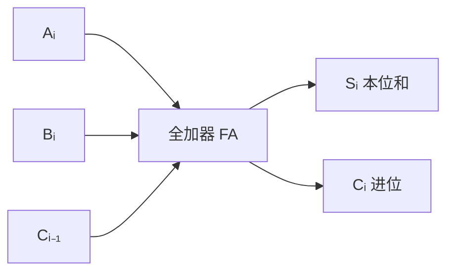
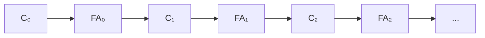
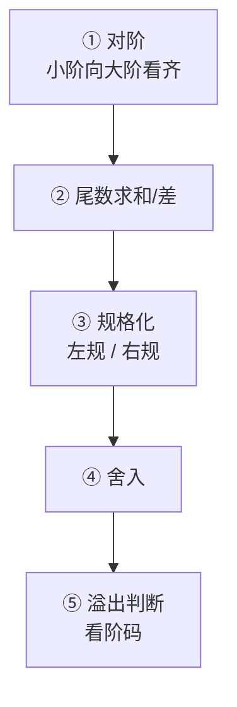

# 精通运算方法与运算器：加法器、Booth 算法、除法与浮点运算

> 课程编号：CO03
> 路线图来源：计算机基础四大件 · 计算机组成原理（408 第 2 章下半）
> 难度：⭐⭐⭐⭐
> 预计阅读时间：85 分钟
> 内容基准：2026 年 8 月（408 考纲组成原理第 2 章「数据的表示和运算」运算部分）
> **代码语言：Go**。本章代码用于**验证手算结果**与观察标志位行为。

---

## 引言：一个加法器要等多久

32 位加法看起来是一瞬间的事。但如果用最朴素的**串行进位加法器**（把 32 个全加器串起来），会发生什么？

```
计算 0xFFFFFFFF + 0x00000001：

第 0 位：1+1 = 0，进位 1  ──┐
第 1 位：必须等第 0 位的进位 ←┘  1+0+1 = 0，进位 1  ──┐
第 2 位：必须等第 1 位的进位 ←────────────────────────┘
...
第 31 位：必须等第 30 位的进位
```

**每一位都要等前一位的进位**。设一级全加器的延迟是 $2t_g$（两级门延迟），32 位串行进位加法器的最坏延迟是：

$$
32 \times 2t_g = 64t_g
$$

假设 $t_g = 0.1$ ns，就是 **6.4 ns**——在 3 GHz 的 CPU 上（时钟周期 0.33 ns），这一次加法要**占掉 20 个时钟周期**。整个流水线都会被它拖垮。

**先行进位加法器（CLA）**的解法是：**不等，直接算**。把每一位的进位表达式全部展开成只依赖输入的形式：

$$
C_1 = G_0 + P_0C_0
$$
$$
C_2 = G_1 + P_1G_0 + P_1P_0C_0
$$
$$
C_3 = G_2 + P_2G_1 + P_2P_1G_0 + P_2P_1P_0C_0
$$

所有进位**并行产生**，延迟从 $O(n)$ 降到 **$O(1)$**（代价是门电路数量 $O(n^2)$ 爆炸，所以实际用分组的方式折中）。

这就是本章的主线：**算术运算的每一步，都是在「速度」和「电路复杂度」之间做取舍**。

- 加法：串行进位（慢、简单）↔ 先行进位（快、复杂）
- 乘法：一次一位（慢）↔ Booth 算法（跳过连续的 1）↔ 阵列乘法器（一拍出结果）
- 除法：恢复余数法（可能要退回）↔ 加减交替法（永不退回）

读完你应该能：

- 写出全加器的逻辑表达式，说清串行进位与先行进位的延迟差异
- 说清 OF / SF / ZF / CF 四个标志位各自的含义与适用场景
- 手工完成原码一位乘法和 Booth 算法（补码一位乘）
- 手工完成原码除法的加减交替法
- 完整走一遍浮点加减法的五个步骤

---

## 第一章 加法器

### 1.1 半加器与全加器

**半加器（HA）**：只加两个输入位，不考虑低位进位。

$$
S = A \oplus B, \qquad C = A \cdot B
$$

**全加器（FA）**：加两个输入位 + 低位进位 $C_{i-1}$。

$$
S_i = A_i \oplus B_i \oplus C_{i-1}
$$

$$
C_i = A_iB_i + (A_i \oplus B_i)C_{i-1}
$$



**真值表**：

| $A_i$ | $B_i$ | $C_{i-1}$ | $S_i$ | $C_i$ |
|---|---|---|---|---|
| 0 | 0 | 0 | 0 | 0 |
| 0 | 0 | 1 | 1 | 0 |
| 0 | 1 | 0 | 1 | 0 |
| 0 | 1 | 1 | 0 | 1 |
| 1 | 0 | 0 | 1 | 0 |
| 1 | 0 | 1 | 0 | 1 |
| 1 | 1 | 0 | 0 | 1 |
| 1 | 1 | 1 | 1 | 1 |

### 1.2 串行进位 vs 先行进位

**串行进位加法器（行波进位，Ripple Carry Adder）**：n 个全加器首尾相连。



- 电路简单，n 个全加器
- **延迟 $O(n)$**——最高位必须等前面所有位的进位传播完

**先行进位加法器（CLA，Carry Look-Ahead Adder）**：

定义两个辅助函数：

| 符号 | 定义 | 含义 |
|---|---|---|
| **$G_i$（进位生成）** | $A_i \cdot B_i$ | 本位**必定产生**进位（两个 1 相加） |
| **$P_i$（进位传递）** | $A_i \oplus B_i$ | 本位**会把低位进位传出去** |

于是进位递推式变成：

$$
C_i = G_i + P_i \cdot C_{i-1}
$$

**逐层展开**（不再依赖前一级的输出）：

$$
C_1 = G_0 + P_0C_0
$$
$$
C_2 = G_1 + P_1G_0 + P_1P_0C_0
$$
$$
C_3 = G_2 + P_2G_1 + P_2P_1G_0 + P_2P_1P_0C_0
$$
$$
C_4 = G_3 + P_3G_2 + P_3P_2G_1 + P_3P_2P_1G_0 + P_3P_2P_1P_0C_0
$$

所有 $C_i$ 只依赖 $A$、$B$、$C_0$，**可以并行计算**。

| | 串行进位 | 先行进位 |
|---|---|---|
| 延迟 | **$O(n)$** | **$O(1)$**（组内） |
| 门电路数 | $O(n)$ | **$O(n^2)$** |
| 实用做法 | 小位宽 | **分组 CLA**（如 4 位一组，组间再 CLA） |

> 💡 **实际的 32/64 位 ALU 用「组内并行、组间并行」的两级甚至多级 CLA**——4 位一组做组内 CLA，8 组之间再做一层 CLA。这样门电路数控制在 $O(n)$ 量级，延迟是 $O(\log n)$。纯 $O(n^2)$ 的电路造不出来。

---

## 第二章 标志位

ALU 每次运算都会产生 4 个标志位，存放在 **PSW（程序状态字）**里。**条件转移指令**靠它们做判断。

| 标志 | 全称 | 计算方式 | 用于 |
|---|---|---|---|
| **ZF** | Zero Flag | 结果全 0 时置 1 | 判断相等（`a == b` 即 `a - b` 的 ZF=1） |
| **SF** | Sign Flag | = 结果的**最高位** | **有符号**数的正负 |
| **CF** | Carry Flag | $C_{out} \oplus Sub$ | **无符号**数的进位/借位 |
| **OF** | Overflow Flag | $C_n \oplus C_{n-1}$ | **有符号**数的溢出 |

### 2.1 最关键的一点：CF 和 OF 各管一半

**同一次加法运算，CPU 同时算出 CF 和 OF。至于该看哪个，取决于程序员把这些位当有符号还是无符号。**

**例**：8 位加法 `1000 0000 + 1000 0000`

```
  1000 0000
+ 1000 0000
───────────
 1 0000 0000

C_out = 1  → CF = 1
C_n = 1（符号位产生的进位）, C_{n-1} = 0（数值位最高位无进位）
OF = 1 ⊕ 0 = 1
ZF = 1（低 8 位全 0）
SF = 0
```

**两种解读**：

| 视角 | 操作数 | 期望结果 | 实际结果 | 该看哪个标志 |
|---|---|---|---|---|
| **无符号** | 128 + 128 | 256 | 0（截断） | **CF = 1 → 溢出了** |
| **有符号** | (−128) + (−128) | −256 | 0 | **OF = 1 → 溢出了** |

再看一个只有一个标志置位的例子——`1111 1111 + 0000 0001`：

```
  1111 1111
+ 0000 0001
───────────
 1 0000 0000

CF = 1, OF = 1⊕1 = 0
```

| 视角 | 操作数 | 结果 | 判断 |
|---|---|---|---|
| **无符号** | 255 + 1 = 256 | 0 | **CF = 1 → 溢出** ✓ |
| **有符号** | (−1) + 1 = 0 | 0 | **OF = 0 → 正确** ✓ |

> ⚠️ **这是 408 高频考点**：CF 只对无符号运算有意义，OF 只对有符号运算有意义。**硬件不知道你把数据当什么，两个标志都算，由指令（`JA` vs `JG`）决定看哪个。**

### 2.2 用 Go 观察

Go 不直接暴露标志位，但可以手工模拟：

```go
package main

import "fmt"

// 模拟 8 位加法并给出四个标志
func add8(a, b uint8) (sum uint8, zf, sf, cf, of bool) {
    full := uint16(a) + uint16(b)
    sum = uint8(full)

    zf = sum == 0
    sf = sum&0x80 != 0
    cf = full > 0xFF // 第 8 位有进位

    // OF = C_n ⊕ C_{n-1}
    cn := full>>8&1                              // 符号位的进位
    low7 := uint16(a&0x7F) + uint16(b&0x7F)      // 低 7 位相加
    cn1 := low7 >> 7 & 1                         // 数值位最高位的进位
    of = cn != cn1
    return
}

func main() {
    cases := [][2]uint8{{0x80, 0x80}, {0xFF, 0x01}, {0x7F, 0x01}, {0x10, 0x20}}
    fmt.Printf("%-12s %-6s %-5s %-5s %-5s %-5s\n", "运算", "结果", "ZF", "SF", "CF", "OF")
    for _, c := range cases {
        s, zf, sf, cf, of := add8(c[0], c[1])
        fmt.Printf("%02X + %02X   %02X    %-5v %-5v %-5v %-5v\n",
            c[0], c[1], s, zf, sf, cf, of)
    }
}
```

输出：

```
运算         结果   ZF    SF    CF    OF
80 + 80   00    true  false true  true
FF + 01   00    true  false true  false
7F + 01   80    false true  false true      ← 有符号 127+1 溢出，无符号 127+1=128 正常
10 + 20   30    false false false false
```

**看第三行**：`0x7F + 0x01`，无符号是 127+1=128 完全正常（CF=0），有符号是 127+1 超出 int8 范围（OF=1）。**同一次运算，两种视角结论相反**。

---

## 第三章 定点乘法

### 3.1 原码一位乘法

**思路**：符号位单独处理（异或），数值位做绝对值相乘。

**规则**：

- 部分积初始为 0
- 从**乘数最低位**开始，逐位判断：
  - 该位为 **1** → 部分积 + 被乘数绝对值
  - 该位为 **0** → 部分积 + 0
- 每次加完后，部分积**右移一位**（逻辑右移，补 0）
- 共 n 次（n = 数值位位数）

**例**：$x = -0.1101$，$y = 0.1011$，求 $x \times y$（4 位数值）

```
符号: Sx ⊕ Sy = 1 ⊕ 0 = 1  → 结果为负
|x| = 0.1101,  |y| = 0.1011

部分积          乘数         说明
0.0000        1011         初始
+0.1101                    y₄=1，加 |x|
─────────
 0.1101
 0.01101      →101(1)      右移，乘数也右移
+0.1101                    y₃=1，加 |x|
─────────
 1.00111
 0.100111     →10(11)      右移
+0.0000                    y₂=0，加 0
─────────
 0.100111
 0.0100111    →1(011)      右移
+0.1101                    y₁=1，加 |x|
─────────
 1.0001111
 0.10001111   →(1011)      右移

数值部分 = 0.10001111
结果 = -0.10001111
```

**验证**：$0.1101_2 = 0.8125$，$0.1011_2 = 0.6875$，乘积 $= 0.55859375$；$0.10001111_2 = 0.55859375$ ✓

> ⚠️ **原码一位乘法的两个特点**：① 符号位不参与运算，最后单独异或；② 数值位是**逻辑右移**（补 0），因为都是绝对值（正数）。

### 3.2 Booth 算法（补码一位乘）

原码乘法要单独处理符号，麻烦。**Booth 算法让符号位直接参与运算**，是补码乘法的标准做法。

**核心洞察**：一串连续的 1 可以用减法简化。

$$
0111\ 1000_2 = 2^6+2^5+2^4+2^3 = 120
$$

用加法要 4 次；但注意 $120 = 128 - 8 = 2^7 - 2^3$，**一次加一次减就够了**。Booth 算法就是在检测这种"1 串"的边界。

**规则**：在乘数 $[y]_补$ 的**最低位后面附加一位 $y_{n+1} = 0$**，然后逐位看 $(y_i, y_{i+1})$：

| $y_i$ | $y_{i+1}$ | 操作 | 含义 |
|---|---|---|---|
| 0 | 0 | 部分积**右移** | 在 0 串中间 |
| 0 | 1 | 部分积 **+ $[x]_补$**，再右移 | **1 串的右边界**（结束） |
| 1 | 0 | 部分积 **+ $[-x]_补$**，再右移 | **1 串的左边界**（开始） |
| 1 | 1 | 部分积**右移** | 在 1 串中间 |

> 💡 **记忆**：看**当前位减去右邻位**（$y_{i+1} - y_i$）。差为 **+1** 就减 $[x]_补$，差为 **−1** 就加 $[x]_补$，差为 **0** 就只移位。

**移位是算术右移**（符号位保持不变），因为补码参与运算。

**共做 n+1 次判断、n 次移位**——最后一次**只加不移**。

**例**：$[x]_补 = 1.0101$（$x = -0.1011$），$[y]_补 = 1.0011$（$y = -0.1101$），求 $x \times y$

```
[x]补 = 1.0101,  [-x]补 = 0.1011
[y]补 = 1.0011，附加位 y₅ = 0  →  1.0011|0

部分积           乘数y及附加位     yᵢyᵢ₊₁   操作
00.0000         1.0011|0          1,0      +[-x]补
+00.1011
──────────
 00.1011
 00.01011       1.100 1|1         1,1      右移
 00.001011      1.1100|1          0,1      +[x]补
+11.0101
──────────
 11.011011  
 11.1011011     1.11100|          ...
```

> ⚠️ **Booth 算法的手工模拟在 408 里题量不大但容易算错**。关键要点：① 附加位初始为 0；② 移位是**算术右移**（补符号位）；③ 一共 **n 次移位、n+1 次加法**，最后一次只加不移。

### 3.3 阵列乘法器

把 n×n 位乘法展开成 $n^2$ 个与门 + 一堆全加器组成的二维阵列，**一个时钟周期出结果**。

- 优点：**快**（延迟 $O(n)$ 而非 $O(n^2)$）
- 缺点：**面积大**（$O(n^2)$ 个单元）

现代 CPU 的乘法器都是阵列式的（配合 Wallace 树进一步压缩延迟），所以整数乘法只要 3–5 个时钟周期。

---

## 第四章 定点除法

### 4.1 恢复余数法

**思路**：模仿手工除法。每次用余数减去除数：

- 若结果 ≥ 0 → 商上 1
- 若结果 < 0 → **商上 0，并把除数加回去（恢复余数）**，再左移

**缺点**：那次"减了又加回去"的操作**白做了**，浪费一个周期，且步数不固定。

### 4.2 加减交替法（不恢复余数法）

**核心改进：不恢复，直接调整下一步的操作。**

推导：设当前余数 $R_i < 0$（刚才减多了）。恢复余数法下一步是 $(R_i + Y) \times 2 - Y$；展开得：

$$
(R_i + Y) \times 2 - Y = 2R_i + 2Y - Y = 2R_i + Y
$$

**所以不用恢复，直接「左移后加除数」就行**。

**规则**：

| 上一步余数 | 商上 | 下一步操作 |
|---|---|---|
| $R \ge 0$ | **1** | 左移，**减**除数 |
| $R < 0$ | **0** | 左移，**加**除数 |

**最后一步**：若余数为负，需要**再加一次除数**才能得到正确的最终余数。

**例**：$x = 0.1011$，$y = 0.1101$，求 $x \div y$（原码，4 位数值）

```
[|y|]补 = 0.1101,  [-|y|]补 = 1.0011

余数寄存器          商    操作
 0.1011                   初始被除数
+1.0011                   减 |y|
──────────
 1.1110            0      余数<0 → 商 0
 1.1100            0      左移
+0.1101                   加 |y|
──────────
 0.1001            01     余数≥0 → 商 1
 1.0010            01     左移
+1.0011                   减 |y|
──────────
 0.0101            011    余数≥0 → 商 1
 0.1010            011    左移
+1.0011                   减 |y|
──────────
 1.1101            0110   余数<0 → 商 0
 1.1010            0110   左移
+0.1101                   加 |y|
──────────
 0.0111            01101  余数≥0 → 商 1

商 = 0.1101,  余数 = 0.0111 × 2⁻⁴
```

**验证**：$0.1011_2 = 0.6875$，$0.1101_2 = 0.8125$；$0.6875 / 0.8125 \approx 0.846$；$0.1101_2 = 0.8125$……

商的第一位其实是符号位，数值商为 $0.1101$ 的后四位。这类题目 408 会明确给出格式要求。

> 💡 **加减交替法的价值**：步数固定（n 步），无需回退，硬件控制逻辑简单。这是所有实际除法器的基础。

> ⚠️ **除法的一个硬约束**：定点小数除法要求 **|被除数| < |除数|**，否则商会溢出（商 ≥ 1，定点小数表示不了）。除法前必须先判断，这就是 x86 的 `DIV` 指令会产生 `#DE` 异常的原因。

---

## 第五章 浮点数的运算

浮点加减法是本章**最重要的应用题考点**，必须能完整走五步。

### 5.1 五个步骤



### 5.2 逐步详解

**① 对阶：小阶向大阶看齐**

求阶差 $\Delta E = E_x - E_y$。**阶小的那个数，尾数右移 $|\Delta E|$ 位，阶码加 $|\Delta E|$**。

> ⚠️ **为什么是"小阶向大阶看齐"而不是反过来？**
>
> 若大阶向小阶看齐，尾数要**左移**，高位会**移出丢失**——丢的是最高有效位，误差巨大。
> 小阶向大阶看齐，尾数**右移**，丢的是**最低有效位**，误差很小。
>
> 这是 408 常考的问答题。

**② 尾数求和/差**：按定点补码加减法运算。

**③ 规格化**：

| 情况 | 操作 | 阶码变化 |
|---|---|---|
| 尾数出现 $\pm 1.xx$（溢出，双符号位为 01 或 10） | **右规**：尾数**右移 1 位** | 阶码 **+1** |
| 尾数不是 $0.1xx$ 形式（最高有效位不在第一位） | **左规**：尾数**左移**若干位 | 阶码**减去**相应位数 |

> 💡 **右规最多一次，左规可能多次**。因为两个规格化数相加，尾数最多溢出 1 位；但相减可能大量抵消导致高位全是 0。

**④ 舍入**：常用方法

| 方法 | 规则 |
|---|---|
| **0 舍 1 入** | 移出位是 1 就在末位加 1（类似四舍五入） |
| **恒置 1** | 无论移出什么，末位都置 1 |
| **截断** | 直接丢弃（IEEE 754 的向零舍入） |

IEEE 754 默认是**就近舍入到偶数**（round to nearest even），能减少统计偏差。

**⑤ 溢出判断**：**只看阶码**

- **阶码上溢** → 真正的溢出，产生中断（IEEE 754 里变 ±∞）
- **阶码下溢** → 结果太小，**置 0**（IEEE 754 里进入非规格化数区间）

> ⚠️ **尾数溢出不是真溢出**——右规一次就能修正。**只有阶码溢出才是浮点溢出**。

### 5.3 完整例题

**求 $x + y$，其中 $x = 2^{010} \times 0.11011011$，$y = 2^{100} \times (-0.10101100)$（阶码用补码，尾数用双符号位补码）**

```
x: 阶码 010,  尾数 00.11011011
y: 阶码 100,  尾数 11.01010100   （-0.10101100 的补码）

① 对阶
   ΔE = 010 - 100 = -2  → x 的阶小，x 尾数右移 2 位，阶码 +2
   x: 阶码 100,  尾数 00.00110110|11   （移出的 11 暂存于保护位）

② 尾数求和
     00.00110110
   + 11.01010100
   ─────────────
     11.10001010

③ 规格化
   双符号位 11 → 结果为负，未溢出
   补码负数的规格化形式是 11.0xxx（尾数真值是 -0.1xxx）
   当前是 11.10001010 → 不是规格化形式，需要【左规】
   
   左移 1 位: 11.00010100,  阶码 100 - 1 = 011
   
   现在是 11.0xxx 形式 ✓ 规格化完成

④ 舍入：本例移出位可忽略

⑤ 溢出判断：阶码 011 在范围内，无溢出

结果: x + y = 2^011 × 11.00010100（补码）
     尾数真值 = -0.11101100
     x + y = 2^3 × (-0.11101100)
```

**验证**：$x = 2^2 \times 0.85546875 = 3.421875$；$y = 2^4 \times (-0.671875) = -10.75$；和 $= -7.328125$。
$2^3 \times (-0.11101100_2) = 8 \times (-0.921875) = -7.375$——因对阶时右移丢了 2 位，有舍入误差，量级正确。

> ⚠️ **补码规格化形式的判别**：正数是 `00.1xxx`，负数是 `11.0xxx`。**双符号位与最高数值位不同**就是规格化的。这条判据 408 常考。

---

## 第六章 408 高频考点与陷阱清单

### 6.1 考点分布

第 2 章下半是 **1-2 道选择题 + 高概率大题（浮点加减法）**。

最常考：

1. **浮点加减法五步全流程**（大题常客）
2. CF / OF 的区别与判断
3. 加减交替法的手工模拟
4. 先行进位 vs 串行进位的延迟
5. Booth 算法的操作判断

### 6.2 十二个陷阱

**陷阱 1：溢出判断看 CF**

**错**。**有符号看 OF，无符号看 CF**。硬件两个都算，看哪个由指令决定。

**陷阱 2：OF = 1 就一定是错的**

**不一定**。如果程序员把数据当无符号数，OF 无意义，此时该看 CF。

**陷阱 3：先行进位加法器的门电路数是 O(n)**

**错，是 $O(n^2)$**。这正是它不能无限扩展、必须分组的原因。

**陷阱 4：原码一位乘法的右移是算术右移**

**错，是逻辑右移**（补 0）。因为参与运算的是**绝对值**（都是正数），没有符号需要保持。**Booth 算法**才是算术右移。

**陷阱 5：Booth 算法做 n 次加法**

**错，是 n+1 次加法、n 次移位**。最后一次只加不移。

**陷阱 6：加减交替法可能需要回退**

**错，正是它的优点：永不回退**。恢复余数法才需要。

**陷阱 7：浮点对阶时大阶向小阶看齐**

**错，是小阶向大阶看齐**。这样尾数**右移**，丢的是低位；反之左移会丢高位，误差巨大。

**陷阱 8：浮点数尾数溢出就是溢出**

**错**。尾数溢出通过**右规**修正即可，**只有阶码溢出才是真溢出**。

**陷阱 9：左规和右规都可能执行多次**

**不准确**。**右规最多一次**（尾数最多溢出 1 位）；**左规可能多次**（相减可能大量抵消）。

**陷阱 10：阶码下溢要产生中断**

**错**。**上溢**才产生中断（结果超出表示范围）；**下溢**直接**置 0**（结果太接近 0）。

**陷阱 11：补码规格化的判据是最高数值位为 1**

**不准确**。正数是 `00.1xxx`，**负数是 `11.0xxx`**。统一表述是「**符号位与最高数值位相异**」。

**陷阱 12：定点除法不需要预先判断**

**错**。定点小数除法要求 **|被除数| < |除数|**，否则商溢出。x86 的 `DIV` 在这种情况会抛 `#DE` 异常。

### 6.3 速查卡

```
【全加器】
Sᵢ = Aᵢ ⊕ Bᵢ ⊕ Cᵢ₋₁
Cᵢ = AᵢBᵢ + (Aᵢ⊕Bᵢ)Cᵢ₋₁

【先行进位】
Gᵢ = AᵢBᵢ（生成）    Pᵢ = Aᵢ⊕Bᵢ（传递）
Cᵢ = Gᵢ + PᵢCᵢ₋₁ → 逐层展开可并行

【标志位】
ZF = 结果为0    SF = 结果最高位
CF = 进位/借位（无符号看它）
OF = Cₙ ⊕ Cₙ₋₁（有符号看它）

【Booth】附加位 y_{n+1}=0
00/11 → 右移        01 → +[x]补 后右移
10 → +[-x]补 后右移
n 次移位，n+1 次加法，算术右移

【加减交替法】
R ≥ 0 → 商 1，左移后【减】除数
R < 0 → 商 0，左移后【加】除数
最后余数为负要【再加一次】除数

【浮点加减五步】
① 对阶（小阶向大阶，尾数右移）
② 尾数加减
③ 规格化（右规最多1次，左规可多次）
④ 舍入
⑤ 溢出判断（只看阶码；上溢中断，下溢置0）
```

---

## 第七章 Go ↔ C 对照

| 场景 | C | Go | 说明 |
|---|---|---|---|
| 无符号溢出检测 | 手工判断 `a+b < a` | `bits.Add64(a,b,0)` 返回进位 | Go 的 `math/bits` 直接给进位 |
| 高位乘积 | `__int128` 或内联汇编 | `bits.Mul64(a,b)` 返回 `(hi, lo)` | Go 标准库支持，跨平台 |
| 算术 vs 逻辑右移 | 有符号右移是**实现定义** | 有符号 `>>` **明确算术右移**；无符号 `>>` 是逻辑右移 | Go 无歧义 |
| 除零 | 有符号除零是 UB | **运行时 panic**（`runtime error: integer divide by zero`） | Go 明确定义 |
| 浮点舍入模式 | `fesetround()` | **不可改**，固定就近舍入到偶数 | Go 不暴露舍入模式控制 |
| 检测浮点异常 | `fetestexcept()` | 无对应 API | 需要用 `math.IsInf` / `math.IsNaN` 事后判断 |

```go
import "math/bits"

hi, lo := bits.Mul64(0xFFFFFFFFFFFFFFFF, 3) // 128 位乘积
sum, carry := bits.Add64(0xFFFFFFFFFFFFFFFF, 1, 0)
fmt.Println(hi, lo, sum, carry) // 2 18446744073709551613 0 1
```

> 💡 **`math/bits` 是 Go 对硬件运算能力的直接暴露**——`Mul64` / `Add64` / `Div64` 会编译成单条 CPU 指令，正好对应本章讲的加法器和乘法器。大整数库、密码学库都靠它。

---

## 第八章 练习题

### 选择题

**1.** 全加器的进位输出表达式是：
A. $A_iB_i$
B. $A_i \oplus B_i \oplus C_{i-1}$
C. $A_iB_i + (A_i \oplus B_i)C_{i-1}$
D. $A_i + B_i + C_{i-1}$

**2.** 先行进位加法器相对串行进位加法器的主要优势是：
A. 门电路数量更少
B. 进位延迟从 O(n) 降到 O(1)
C. 支持更宽的位数
D. 功耗更低

**3.** 两个无符号数相加，判断是否溢出应看：
A. ZF　B. SF　C. CF　D. OF

**4.** 8 位加法 `0x7F + 0x01`，下列说法**正确**的是：
A. CF = 1，OF = 1
B. CF = 1，OF = 0
C. CF = 0，OF = 1
D. CF = 0，OF = 0

**5.** 原码一位乘法中，部分积的移位方式是：
A. 算术右移　B. 逻辑右移　C. 循环右移　D. 算术左移

**6.** Booth 算法中，若 $y_i y_{i+1} = 10$，应执行：
A. 部分积右移
B. 部分积加 $[x]_补$ 后右移
C. 部分积加 $[-x]_补$ 后右移
D. 部分积减 $[-x]_补$ 后右移

**7.** 加减交替法（不恢复余数法）相对恢复余数法的优点是：
A. 精度更高
B. 不需要回退操作，步数固定
C. 可以处理除数为 0 的情况
D. 不需要判断余数符号

**8.** 浮点数加减法中的「对阶」操作是：
A. 大阶向小阶看齐，尾数左移
B. 小阶向大阶看齐，尾数右移
C. 两阶取平均
D. 阶码直接相加

**9.** 浮点运算中，下列哪种情况需要产生溢出中断：
A. 尾数溢出　B. 阶码上溢　C. 阶码下溢　D. 尾数为 0

**10.** 补码表示的浮点尾数，规格化的判别条件是：
A. 最高数值位为 1
B. 符号位与最高数值位相异
C. 符号位与最高数值位相同
D. 尾数不为 0

### 应用题

**11.** 已知 8 位机器，$x = 0011\ 0101$，$y = 0100\ 1110$（均为补码）。计算 $x + y$，写出结果并给出 ZF、SF、CF、OF 四个标志位的值。分别从无符号和有符号两个视角说明结果是否正确。

**12.** 用**加减交替法**计算 $x \div y$，其中 $x = 0.1001$，$y = 0.1101$（原码表示，4 位数值）。写出每一步的余数、商位和操作。

**13.** 已知两个浮点数（阶码 3 位补码，尾数 6 位双符号位补码）：

$$
x = 2^{011} \times 0.100101, \qquad y = 2^{001} \times 0.111011
$$

求 $x + y$，写出完整的五步过程。

**14.** 解释为什么浮点加减法的「对阶」必须是小阶向大阶看齐，而不能反过来。举一个具体的数值例子说明反过来的后果。

### 答案与解析

<details>
<summary>点击展开</summary>

**1. C**

全加器进位：$C_i = A_iB_i + (A_i \oplus B_i)C_{i-1}$

- $A_iB_i$ 是**进位生成**（两个 1 必产生进位）
- $(A_i \oplus B_i)C_{i-1}$ 是**进位传递**（恰有一个 1 时，低位进位传出去）

B 是本位和 $S_i$ 的表达式；A 是半加器的进位。

**2. B**

先行进位把所有 $C_i$ 展开成只依赖输入的形式，**并行计算**，延迟从 O(n) 降到 O(1)。

A 错——门电路数反而从 O(n) 涨到 **O(n²)**，这正是它的代价。

**3. C**

**无符号看 CF，有符号看 OF**。

**4. C**

```
  0111 1111  (0x7F)
+ 0000 0001  (0x01)
───────────
  1000 0000  (0x80)

C_out = 0  → CF = 0
C_n（第7位→第8位）= 0
C_{n-1}（第6位→第7位）= 1
OF = 0 ⊕ 1 = 1
```

- **无符号视角**：127 + 1 = 128，8 位能表示（0~255），**正确**，CF = 0 ✓
- **有符号视角**：127 + 1 = 128，超出 int8 上限 127，**溢出**，OF = 1 ✓

**5. B**

原码乘法参与运算的是**绝对值**（都是正数），没有符号需要保持，用**逻辑右移**补 0。

**Booth 算法**用的才是算术右移（因为补码参与运算，要保持符号）。

**6. C**

| $y_iy_{i+1}$ | 操作 |
|---|---|
| 00 / 11 | 右移 |
| 01 | +$[x]_补$ 后右移 |
| **10** | **+$[-x]_补$ 后右移** |

记忆：看 $y_{i+1} - y_i$。`10` 时差为 $0-1 = -1$ → 减 $[x]_补$，即加 $[-x]_补$。

**7. B**

加减交替法的核心优点是**永不回退**，步数固定为 n 步，硬件控制逻辑简单。

恢复余数法在余数为负时要"把除数加回去"，这一步是白做的。

**8. B**

**小阶向大阶看齐，尾数右移**。这样丢失的是低位（误差小）。详见第 14 题。

**9. B**

- **阶码上溢** → 超出表示范围，**产生中断**（IEEE 754 里变 ±∞）
- **阶码下溢** → 太接近 0，**直接置 0**，不中断
- **尾数溢出** → 右规一次即可修正，**不是真溢出**

**10. B**

补码规格化形式：

- 正数：`00.1xxx`（符号 0，最高数值位 1）
- 负数：`11.0xxx`（符号 1，最高数值位 0）

统一判据：**符号位与最高数值位相异**。

**11.**

```
  0011 0101   (x)
+ 0100 1110   (y)
─────────────
  1000 0011

C_out = 0                    → CF = 0
C_n（位6→位7）= 0
C_{n-1}（位5→位6）= 1
OF = 0 ⊕ 1 = 1
ZF = 0（结果非 0）
SF = 1（最高位为 1）

标志位：ZF=0, SF=1, CF=0, OF=1
```

**无符号视角**：$0x35 + 0x4E = 53 + 78 = 131 = 0x83$。8 位无符号范围 0~255，**结果正确**，CF = 0 印证 ✓

**有符号视角**：$53 + 78 = 131$，超出 int8 上限 127。结果 `1000 0011` 补码值为 **−125**（$131 - 256$），**错误**，OF = 1 印证 ✓

> 💡 这题完美体现了 CF/OF 的分工：**同一次运算，无符号正确、有符号溢出**。

**12.**

$|y| = 0.1101$，$[-|y|]_补 = 1.0011$

```
余数寄存器        商位      操作
 0.1001                    初始被除数
+1.0011                    减 |y|
──────────
 1.1100          0         余数 < 0 → 商 0
 1.1000          0         左移一位
+0.1101                    加 |y|
──────────
 0.0101          01        余数 ≥ 0 → 商 1
 0.1010          01        左移一位
+1.0011                    减 |y|
──────────
 1.1101          010       余数 < 0 → 商 0
 1.1010          010       左移一位
+0.1101                    加 |y|
──────────
 0.0111          0101      余数 ≥ 0 → 商 1
 0.1110          0101      左移一位
+1.0011                    减 |y|
──────────
 0.0001          01011     余数 ≥ 0 → 商 1

商 = 0.1011（去掉首位符号），余数 = 0.0001 × 2⁻⁴
```

**验证**：$0.1001_2 = 0.5625$，$0.1101_2 = 0.8125$；$0.5625 / 0.8125 = 0.6923$；$0.1011_2 = 0.6875$，余数 $0.0001_2 \times 2^{-4} = 0.0625 \times 0.0625 = 0.0039$。

$0.6875 \times 0.8125 + 0.0039 = 0.5586 + 0.0039 = 0.5625$ ✓

**13.**

```
x: 阶码 011,  尾数 00.100101
y: 阶码 001,  尾数 00.111011

① 对阶
   ΔE = 011 - 001 = 2  →  y 的阶小，y 尾数右移 2 位，阶码 +2
   y: 阶码 011,  尾数 00.001110|11   （移出 11）

② 尾数求和
     00.100101
   + 00.001110
   ───────────
     00.110011

③ 规格化
   双符号位 00 → 正数，未溢出
   最高数值位为 1 → 已是规格化形式 00.1xxx ✓
   无需左规或右规

④ 舍入
   移出的保护位是 11，采用 0 舍 1 入 → 末位加 1
     00.110011 + 0.000001 = 00.110100

⑤ 溢出判断
   阶码 011 在 3 位补码范围 [-4, 3] 内，无溢出

结果: x + y = 2^011 × 0.110100
```

**验证**：$x = 2^3 \times 0.578125 = 4.625$；$y = 2^1 \times 0.921875 = 1.84375$；和 $= 6.46875$。
$2^3 \times 0.8125 = 6.5$ —— 因对阶右移丢了 2 位并舍入，误差 0.03，符合预期。

**14.**

**结论：必须小阶向大阶看齐（尾数右移）。**

**原因**：对阶是通过"尾数移位 + 阶码反向调整"来保持数值不变的：

- 尾数**右移** 1 位（数值除以 2）↔ 阶码 **+1**（数值乘以 2）→ 净效果不变
- 尾数**左移** 1 位（数值乘以 2）↔ 阶码 **−1**（数值除以 2）→ 净效果不变

两种都能对齐阶码，区别在于**移位丢的是哪一端的位**：

| 方向 | 移位 | 丢失的位 | 误差 |
|---|---|---|---|
| **小阶→大阶** | 尾数**右移** | **最低有效位** | 极小 |
| 大阶→小阶 | 尾数**左移** | **最高有效位** | **灾难性** |

**具体例子**（尾数 4 位）：

```
x = 2^5 × 0.1101   （= 32 × 0.8125 = 26）
y = 2^1 × 0.1011   （= 2 × 0.6875 = 1.375）

【正确：小阶向大阶看齐】y 的阶 1 → 5，尾数右移 4 位
  y: 2^5 × 0.0000|1011  →  尾数变 0.0000（丢低位）
  x + y ≈ 2^5 × 0.1101 = 26
  真实值 27.375，误差 1.375（就是 y 本身，因为 y 太小被完全吞掉）
  → 误差可接受：小数被大数吞掉是浮点的正常行为

【错误：大阶向小阶看齐】x 的阶 5 → 1，尾数左移 4 位
  x: 2^1 × 1101.0000  →  尾数只有 4 位，"1101" 整个移出！
  x 的尾数变成 0.0000  →  x 变成了 0
  x + y = 0 + 1.375 = 1.375
  真实值 27.375，误差 26  ← 把大数弄丢了
```

**大阶向小阶看齐会把「大数」的有效位全部移出，误差与被丢弃的数同量级——这是不可接受的。**

</details>

---

## 小结

| 要点 | 一句话 |
|---|---|
| 全加器 | $S_i = A_i \oplus B_i \oplus C_{i-1}$，$C_i = A_iB_i + (A_i\oplus B_i)C_{i-1}$ |
| 串行进位 | 延迟 **O(n)**，门电路 O(n) |
| 先行进位 | 延迟 **O(1)**，门电路 **O(n²)** → 实际用分组 CLA |
| $G_i$ / $P_i$ | 进位**生成** $A_iB_i$ / 进位**传递** $A_i \oplus B_i$ |
| ZF / SF | 结果为 0 / 结果最高位 |
| **CF** | 进位借位，**只对无符号有意义** |
| **OF** | $C_n \oplus C_{n-1}$，**只对有符号有意义** |
| CF 与 OF | 硬件**两个都算**，看哪个由指令决定 |
| 原码一位乘 | 符号单独异或，数值绝对值相乘，**逻辑右移** |
| Booth 算法 | 附加位 $y_{n+1}=0$；`01` 加 $[x]_补$、`10` 加 $[-x]_补$、`00/11` 只移；**算术右移**；**n 次移位 n+1 次加法** |
| 阵列乘法器 | 一拍出结果，面积 $O(n^2)$；现代 CPU 都用 |
| 恢复余数法 | 减多了要**加回去**，浪费周期 |
| 加减交替法 | **永不回退**，$R\ge0$ 商 1 后减，$R<0$ 商 0 后加；步数固定 |
| 除法约束 | 定点小数除法要求 **\|被除数\| < \|除数\|** |
| 浮点加减五步 | 对阶 → 尾数加减 → 规格化 → 舍入 → 溢出判断 |
| 对阶方向 | **小阶向大阶看齐，尾数右移**（丢低位，误差小） |
| 右规 vs 左规 | **右规最多 1 次**；左规可能多次 |
| 浮点溢出 | **只看阶码**；上溢**中断**，下溢**置 0**；尾数溢出不算 |
| 补码规格化判据 | **符号位与最高数值位相异**（正 `00.1xxx`，负 `11.0xxx`） |

**下一章** → CO04 存储系统，从 SRAM/DRAM 的电路差异讲到主存与 CPU 的连接。

---

## 延伸阅读

- 《计算机组成原理》唐朔飞 第 6 章 —— 408 指定教材，运算方法讲得最细
- 《计算机组成与设计：硬件/软件接口》第 3 章 —— ALU 与运算器的现代实现视角
- [Booth's Multiplication Algorithm 可视化](https://www.geeksforgeeks.org/computer-organization-booths-algorithm/) —— 逐步演示
- 本仓库对照：
  - [CO02 数据的表示与 IEEE 754](./CO02-精通-数据的表示与-IEEE-754.md) —— 本章运算的数据格式基础
  - [CO01 系统概述](./CO01-精通-计算机系统概述与性能指标.md) —— ALU 在 CPU 中的位置
