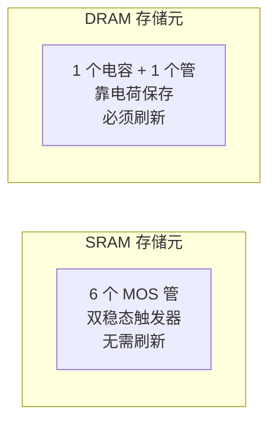
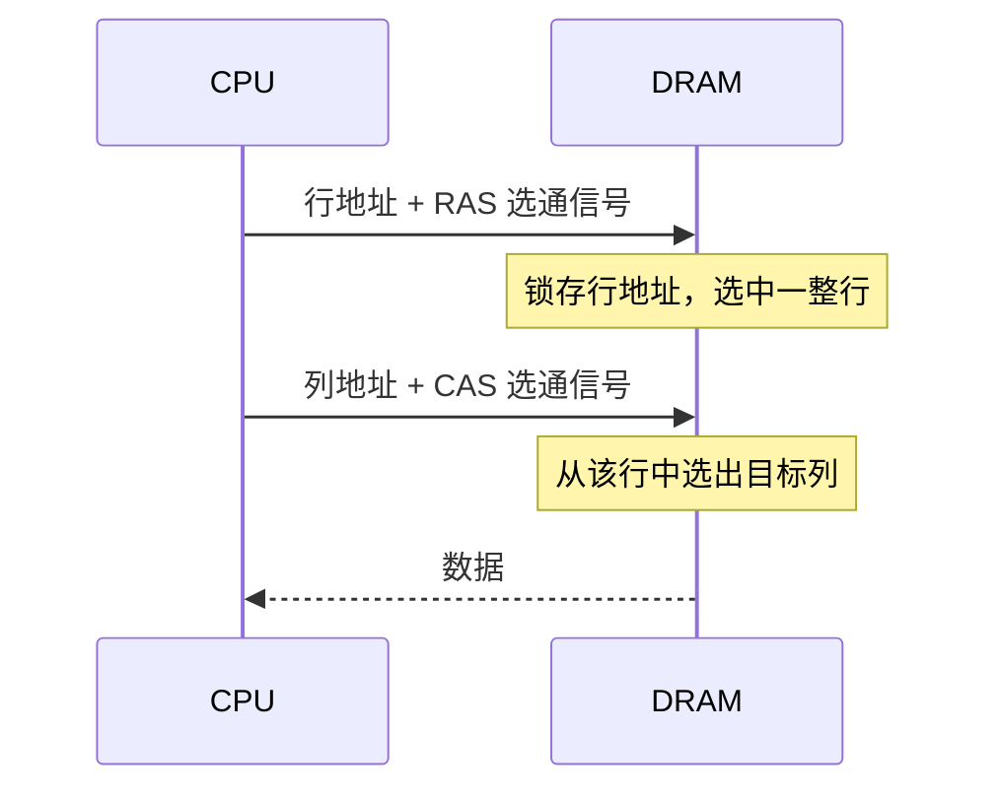
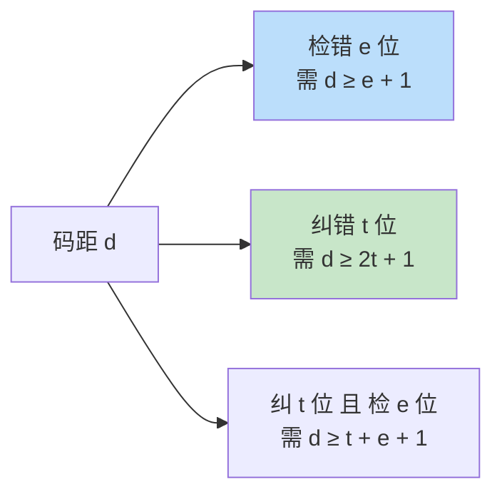
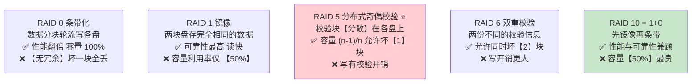

# 精通存储系统：层次结构、SRAM/DRAM 与主存扩展

> 课程编号：CO04
> 路线图来源：计算机基础四大件 · 计算机组成原理（408 第 3 章上半）
> 难度：⭐⭐⭐
> 预计阅读时间：80 分钟
> 内容基准：2026 年 8 月（408 考纲组成原理第 3 章「存储器层次结构」）
> **代码语言：Go**。本章代码用于**实测存储层次的真实延迟差异**。

---

## 引言：一次内存访问，CPU 要空转 200 个周期

写一段 Go 代码，用两种顺序遍历同一个二维数组：

```go
const N = 4096
var a [N][N]byte

// 版本 A：按行遍历（内存连续）
for i := 0; i < N; i++ {
    for j := 0; j < N; j++ {
        a[i][j]++
    }
}

// 版本 B：按列遍历（每次跳 4096 字节）
for j := 0; j < N; j++ {
    for i := 0; i < N; i++ {
        a[i][j]++
    }
}
```

**完全相同的 1600 万次自增，B 比 A 慢 8–20 倍。**

指令条数一样、CPU 一样、数据量一样，差在哪？差在**每次访问是不是命中 Cache**。

```
访问位置        典型延迟        相当于 3 GHz CPU 的多少个周期
────────────────────────────────────────────────────────
寄存器          ~0.3 ns        1 个周期
L1 Cache        ~1 ns          ~4 个周期
L2 Cache        ~4 ns          ~12 个周期
L3 Cache        ~15 ns         ~45 个周期
主存 DRAM       ~70 ns         ~200 个周期     ← 差 200 倍
SSD             ~100 μs        ~300,000 个周期
机械硬盘        ~10 ms         ~30,000,000 个周期
```

**主存比 L1 慢 70 倍，比寄存器慢 200 倍。** 版本 B 每访问一个字节都要跨一整行（4096 字节），远超一个 Cache 行（64 字节），于是每次都是 Cache miss，CPU 大部分时间在**空等 DRAM**。

这个巨大的速度鸿沟，正是**存储层次结构**存在的全部理由：

> **没有一种存储介质能同时做到「快 + 大 + 便宜」。所以用多级层次，让 90% 以上的访问落在最快的那一级。**

| 层次 | 介质 | 速度 | 容量 | 每 GB 成本 |
|---|---|---|---|---|
| 寄存器 | 触发器 | 最快 | 几百字节 | 最贵 |
| Cache | **SRAM** | 快 | MB 级 | 贵 |
| 主存 | **DRAM** | 中 | GB 级 | 中 |
| 辅存 | SSD / 磁盘 | 慢 | TB 级 | 便宜 |

本章讲清楚这个层次的**下半部分**：SRAM 与 DRAM 的电路差异、DRAM 为什么要刷新、主存怎么用小芯片拼成大容量、多体并行怎么提高带宽、**内存出错了怎么发现和纠正（校验码）**、**多块磁盘怎么组成更快更可靠的阵列（RAID）**。Cache 的替换算法与映射方式留到 [CO05](./CO05-精通-Cache-与虚拟存储器.md)。

读完你应该能：

- 说清存取时间与存取周期的区别，以及为什么后者更大
- 对比 SRAM 与 DRAM 的六个维度差异，说清各自用在哪
- 计算 DRAM 三种刷新方式的刷新次数与开销
- 做主存容量扩展题（位扩展、字扩展、字位同时扩展）
- 完成地址译码与片选信号的设计
- 计算低位交叉存储器的连续访问时间
- **算出海明码需要几位校验位，并说明码距与检错纠错能力的关系**
- **对比 RAID 0/1/5/6/10 的容量、容错能力与适用场景**

---

## 第一章 存储器的分类与性能指标

### 1.1 三种分类维度

**① 按存储介质**

| 类型 | 例子 |
|---|---|
| 半导体存储器 | SRAM、DRAM、ROM、Flash |
| 磁表面存储器 | 磁盘、磁带 |
| 光存储器 | CD、DVD |

**② 按存取方式**（408 重点）

| 类型 | 特点 | 例子 |
|---|---|---|
| **随机存取（RAM）** | 存取时间**与地址无关** | 主存、Cache |
| **顺序存取（SAM）** | 必须从头顺序找 | 磁带 |
| **直接存取（DAM）** | 先定位到区域，再顺序找 | **磁盘**（先寻道，再等扇区转过来） |
| **相联存取（CAM）** | **按内容**访问，不按地址 | **快表 TLB**、Cache 的标记比较 |

> ⚠️ **磁盘是「直接存取」不是「随机存取」**。它先做寻道（直接定位到磁道），再等旋转（顺序找扇区），是两者的混合。408 常考这个分类。

> 💡 **相联存储器（CAM）按内容查**——给一个数据，它并行地和所有存储单元比较，返回匹配项的地址。TLB 就是典型的 CAM，这也是它能一拍出结果的原因。

**③ 按信息可保存性**

- **易失性**：断电丢失（SRAM、DRAM）
- **非易失性**：断电保留（ROM、Flash、磁盘）
- **破坏性读出**：读出后原信息被破坏，需**重写**（**DRAM**、磁芯存储器）
- 非破坏性读出：读出不影响原信息（SRAM、ROM）

### 1.2 三个性能指标

**① 存储容量** = 存储字数 × 字长

**② 单位成本**：每位价格 = 总成本 / 总位数

**③ 存储速度**——三个易混的量：

| 术语 | 定义 |
|---|---|
| **存取时间 $T_a$** | 从**启动一次存储器操作**到**完成该操作**所需时间 |
| **存取周期 $T_m$** | **连续两次**独立存储器操作所需的**最小间隔** |
| **主存带宽 $B_m$** | 每秒能传输的数据量，$B_m = \dfrac{\text{数据宽度}}{T_m}$ |

**核心关系**：

$$
\boxed{T_m = T_a + \text{恢复时间} > T_a}
$$

> ⚠️ **存取周期 > 存取时间**，因为读出之后还需要"恢复时间"（DRAM 尤其明显——破坏性读出，读完必须把数据写回去）。408 常考这两者的大小关系。

**例**：某存储器存取周期 200 ns，每次读出 4 字节，则带宽：

$$
B_m = \frac{4\ \text{B}}{200 \times 10^{-9}\ \text{s}} = 20 \times 10^6\ \text{B/s} = 20\ \text{MB/s}
$$

### 1.3 用 Go 实测存储层次

```go
package main

import (
    "fmt"
    "time"
)

// 以不同的步长遍历同一块内存，观察 Cache 的影响
func stride(buf []byte, step int) time.Duration {
    start := time.Now()
    for round := 0; round < 100; round++ {
        for i := 0; i < len(buf); i += step {
            buf[i]++
        }
    }
    return time.Since(start)
}

func main() {
    const size = 64 << 20 // 64 MB，远大于 L3
    buf := make([]byte, size)

    fmt.Printf("%-10s %-14s %s\n", "步长", "耗时", "每次访问")
    for _, s := range []int{1, 2, 4, 8, 16, 32, 64, 128, 256, 4096} {
        d := stride(buf, s)
        n := 100 * (len(buf) / s)
        fmt.Printf("%-10d %-14v %.2f ns\n", s, d, float64(d.Nanoseconds())/float64(n))
    }
}
```

典型结果的形状（具体数值随机器而变）：

```
步长        耗时           每次访问
1          ...            ~0.3 ns     ← 一个 Cache 行服务 64 次访问
2          ...            ~0.5 ns
4          ...            ~0.9 ns
8          ...            ~1.8 ns
16         ...            ~3.5 ns
32         ...            ~7 ns
64         ...            ~14 ns      ← 步长 = Cache 行大小，每次都 miss
128        ...            ~15 ns      ← 再增大步长，每次访问代价不再上升
4096       ...            ~20 ns      ← 但会开始 TLB miss
```

**拐点出现在步长 = 64 字节**——正是 Cache 行的大小。步长小于 64 时，一次 miss 拉进来的整行会被后续访问复用；超过 64 之后，每次访问都独占一次 miss，代价不再随步长增长。

> 💡 **这个实验能直接测出你机器的 Cache 行大小**。它也解释了引言里"按行遍历比按列快 8-20 倍"的原因——按列遍历的步长是 4096 字节，每次都 miss。

---

## 第二章 SRAM 与 DRAM

### 2.1 电路原理差异

**SRAM（Static RAM，静态随机存储器）**

- 存储元：**六管双稳态触发器**（6 个 MOS 管）
- 只要**不断电**，信息就保持，**无需刷新**
- **非破坏性读出**

**DRAM（Dynamic RAM，动态随机存储器）**

- 存储元：**一个电容 + 一个晶体管**
- 靠**电容存电荷**表示 0/1，电容会**漏电** → **必须周期性刷新**
- **破坏性读出**——读的时候电容放电，读完必须**重写**



### 2.2 六维对比（必背）

| 维度 | SRAM | DRAM |
|---|---|---|
| **存储元** | 六管触发器 | **单管 + 电容** |
| **是否刷新** | **否** | **是**（周期性） |
| **读出性质** | 非破坏性 | **破坏性**（需重写） |
| **速度** | **快** | 慢 |
| **集成度/容量** | 低 | **高** |
| **成本/功耗** | 高 | **低** |
| **用途** | **Cache** | **主存** |
| **地址线** | 不复用 | **行列地址复用** |

> 💡 **一句话记忆**：**SRAM 快而贵做 Cache，DRAM 慢而省做主存**。

### 2.3 DRAM 的地址复用

DRAM 容量大，地址线会很多。为了**减少芯片引脚**，DRAM 把地址**分成行地址和列地址分两次送入**：



**效果**：$2^{20}$ 个单元的 DRAM，本来需要 20 根地址线，复用后只要 **10 根**（行 10 位 + 列 10 位，分两次送）。

> 💡 **地址复用是 DRAM 独有的**，SRAM 不复用。这也是 DRAM 访问延迟高的原因之一——要两次选通。**行缓冲命中（同一行的连续访问只需 CAS）**是 DRAM 优化的关键，也是"顺序访问比随机访问快"在 DRAM 层面的又一重原因。

### 2.4 DRAM 的三种刷新方式

**刷新的本质**：把一行读出再写回，补充电容电荷。**以「行」为单位**——刷新一行的时间 = 一个存取周期。

**典型约束**：电容大约 **2 ms** 内必须刷新一次（这个 2ms 叫**刷新周期**）。

设 DRAM 有 **128 行**，存取周期 **0.5 μs**：

#### ① 集中刷新

在 2 ms 的最后，**集中把 128 行全刷一遍**。

```
|←──────── 2 ms ────────→|
|─── 正常读写 ───|─刷新─|
                  ↑ 128 × 0.5μs = 64 μs 的「死区」
```

- **优点**：读写期间不受干扰
- **缺点**：有 **64 μs 的死区（死时间）**，期间无法访问存储器

**死区率** = $\dfrac{64\ \mu s}{2000\ \mu s} = 3.2\%$

#### ② 分散刷新

**每个存取周期后都跟一次刷新**——把存取周期人为拉长一倍。

```
|读写|刷新|读写|刷新|读写|刷新| ...
 0.5μ 0.5μ
 └──── 实际存取周期变成 1 μs ────┘
```

- **优点**：**无死区**
- **缺点**：**存取周期加倍**，性能腰斩；且刷新过于频繁（远超需要）

**刷新一遍全部 128 行只需** $128 \times 1\ \mu s = 128\ \mu s \ll 2\ ms$ —— 刷得太勤了，纯浪费。

#### ③ 异步刷新（实际采用）

把 2 ms 均分给 128 行，**每隔一段时间刷新一行**。

$$
\text{刷新间隔} = \frac{2\ \text{ms}}{128\ \text{行}} = 15.6\ \mu s
$$

```
|←15.6μs→|←15.6μs→|←15.6μs→| ...
    ↑刷1行     ↑刷1行     ↑刷1行
```

- **优点**：死区被打散成 128 个 0.5 μs 的小片段，**几乎无感**
- **实际系统全部采用这种方式**

**进一步优化**：把每次刷新安排在 **CPU 译码指令的时段**（此时不访存），可以做到**完全没有死区**。

### 2.5 三种刷新方式对比

| 方式 | 死区 | 存取周期 | 刷新次数（2ms 内） | 实用性 |
|---|---|---|---|---|
| **集中刷新** | **有**（长死区） | 不变 | 128 次集中做完 | 少用 |
| **分散刷新** | **无** | **加倍** ⚠️ | 极多（浪费） | 少用 |
| **异步刷新** | 打散，几乎无感 | 不变 | 128 次均匀分布 | **实际采用** |

> ⚠️ **408 高频计算题**：给出行数和存取周期，求异步刷新的**刷新间隔**。公式就是 $\dfrac{\text{刷新周期(2ms)}}{\text{行数}}$。注意别把"刷新周期(2ms)"和"存取周期"搞混。

### 2.6 ROM 家族

| 类型 | 全称 | 可编程性 |
|---|---|---|
| **MROM** | 掩模 ROM | 出厂固化，**不可改** |
| **PROM** | 可编程 ROM | **只能写一次** |
| **EPROM** | 可擦除 PROM | 紫外线擦除，可多次 |
| **EEPROM** | 电可擦除 PROM | **电擦除**，可按字节改 |
| **Flash** | 闪存 | 电擦除，**按块擦除**，速度快、容量大 |

> 💡 **Flash 是 EEPROM 的改进**：EEPROM 可以按字节擦写，Flash 必须**按块擦除**（所以有"写放大"问题），但换来了更高的密度和速度。SSD、U 盘、手机存储都是 Flash。
>
> ⚠️ **ROM 也是随机存取的**——"ROM"这个名字只说明它**只读**，不说明存取方式。408 常出这个陷阱。

---

## 第三章 主存与 CPU 的连接

单个存储芯片容量有限，要拼成需要的主存容量。**三种扩展方式**。

记号约定：芯片规格写作 **「字数 × 位数」**，如 `16K×8位` 表示 16384 个单元、每单元 8 位。

### 3.1 位扩展：增加字长

**场景**：芯片字长不够（比如需要 8 位，芯片只有 1 位）。

**做法**：多片**并联**，**地址线、片选、读写信号全部共用**，各片提供数据的不同位。

**例**：用 `8K×1位` 芯片构成 `8K×8位` 存储器

```
需要芯片数 = (8K×8) / (8K×1) = 8 片

     ┌─────┬─────┬─────┬─────┬─────┬─────┬─────┬─────┐
地址→│片0  │片1  │片2  │片3  │片4  │片5  │片6  │片7  │←地址(13根,全部共用)
     └──┬──┴──┬──┴──┬──┴──┬──┴──┬──┴──┬──┴──┬──┴──┬──┘
        D7    D6    D5    D4    D3    D2    D1    D0
```

- **地址线**：13 根（$2^{13} = 8K$），**8 片共用**
- **数据线**：每片 1 根，共 8 根，**分别接 D0~D7**
- **片选**：8 片**同时选中**

### 3.2 字扩展：增加字数

**场景**：芯片字长够了，但**单元数不够**。

**做法**：多片**串联**，**数据线共用**，用**高位地址经译码器**产生各片的片选信号。

**例**：用 `16K×8位` 芯片构成 `64K×8位` 存储器

```
需要芯片数 = 64K / 16K = 4 片

地址 16 位: A15 A14 | A13 ... A0
            └──┬──┘   └───┬───┘
          2-4译码器      片内地址(14根，共用)
               │
        ┌──────┼──────┬──────┐
       CS0    CS1    CS2    CS3
       片0    片1    片2    片3
```

**地址分配**：

| 芯片 | A15 A14 | 地址范围 |
|---|---|---|
| 片 0 | 00 | `0000H ~ 3FFFH` |
| 片 1 | 01 | `4000H ~ 7FFFH` |
| 片 2 | 10 | `8000H ~ BFFFH` |
| 片 3 | 11 | `C000H ~ FFFFH` |

- **低 14 位 A13~A0**：片内地址，4 片共用
- **高 2 位 A15A14**：送 2-4 译码器，产生 4 个片选信号
- **任一时刻只有一片被选中**

### 3.3 字位同时扩展

既不够字长又不够字数，**两种都做**。

**例**：用 `16K×4位` 芯片构成 `64K×8位` 存储器

```
需要芯片数 = (64K×8) / (16K×4) = 8 片

组织成 4 组 × 每组 2 片：
  - 组内 2 片做【位扩展】：4位 + 4位 = 8位
  - 4 组做【字扩展】：16K × 4 = 64K

       组0        组1        组2        组3
    ┌────┬────┐┌────┬────┐┌────┬────┐┌────┬────┐
    │片0 │片1 ││片2 │片3 ││片4 │片5 ││片6 │片7 │
    └────┴────┘└────┴────┘└────┴────┘└────┴────┘
     D7-4 D3-0
       ↑CS0        ↑CS1      ↑CS2      ↑CS3
       └────── 2-4 译码器（A15 A14）──────┘
```

> 💡 **做扩展题的三步套路**：
> 1. **算芯片数** = 目标容量 ÷ 单片容量（按位算）
> 2. **算片内地址线** = $\log_2$(单片字数)
> 3. **算片选地址线** = 总地址线 − 片内地址线，接译码器

### 3.4 地址译码与地址范围

**例题**：某机器地址总线 16 位，用 `4K×8位` RAM 芯片，要在地址 `6000H~7FFFH` 范围内配置存储器。

**解**：

```
地址范围 6000H ~ 7FFFH
容量 = 7FFF - 6000 + 1 = 2000H = 8192 = 8K

芯片数 = 8K / 4K = 2 片

4K = 2^12 → 片内地址 12 根 (A11~A0)
片选地址 = A15 A14 A13 A12

  6000H = 0110 0000 0000 0000
  7FFFH = 0111 1111 1111 1111
          ─┬── 
       A15..A12 = 0110 或 0111

片 0: A15A14A13A12 = 0110 → 6000H ~ 6FFFH
片 1: A15A14A13A12 = 0111 → 7000H ~ 7FFFH
```

---

## 第四章 提高访存速度

CPU 越来越快，DRAM 却没跟上。除了加 Cache，还有三条路。

### 4.1 双端口 RAM

**同一个存储体，有两组独立的地址线、数据线、控制线**，可以被两个 CPU（或 CPU 和 I/O）**同时访问**。

**冲突处理**：当两个端口同时访问**同一地址**且至少一个是写时，产生冲突，由 `BUSY` 信号让其中一个等待。

### 4.2 多模块存储器

#### 单体多字

一个存储体，**一次读出多个字**（如一次读 4 个字）。

- 优点：简单
- 缺点：只对**连续访问**有效，遇到转移指令就浪费

#### 多体并行 —— 高位交叉编址

**高位地址**选体号，**低位地址**是体内地址。

```
4 个体，每体 8 个单元（体号 = 高 2 位）

体 0: 地址 0~7
体 1: 地址 8~15
体 2: 地址 16~23
体 3: 地址 24~31
```

**问题**：连续地址落在**同一个体**里，无法并行 → **对提升带宽几乎无用**，主要用于扩容。

#### 多体并行 —— 低位交叉编址 ⭐

**低位地址**选体号，**高位地址**是体内地址。

```
4 个体（体号 = 低 2 位）

体 0: 地址 0, 4, 8,  12, ...
体 1: 地址 1, 5, 9,  13, ...
体 2: 地址 2, 6, 10, 14, ...
体 3: 地址 3, 7, 11, 15, ...
```

**连续地址分散在不同体上** → 可以**流水线式并行访问**！

```mermaid
gantt
    dateFormat X
    axisFormat %s
    title 低位交叉的流水访问（存取周期 T，总线传输 r）
    section 体0
    访问地址0 :0, 4
    section 体1
    访问地址1 :1, 5
    section 体2
    访问地址2 :2, 6
    section 体3
    访问地址3 :3, 7
```



**关键公式**（408 计算题）：

设存储体数 $m$，存取周期 $T$，总线传输周期 $r$，且满足**流水线不断流的条件** $T = m \cdot r$。

**连续读取 n 个字所需时间**：

$$
\boxed{t = T + (n-1) \cdot r}
$$

**对比顺序访问**（单体）：$t' = n \cdot T$

**例**：4 体低位交叉，存取周期 $T = 200$ ns，总线传输周期 $r = 50$ ns。连续读 4 个字。

$$
t_{交叉} = 200 + (4-1) \times 50 = 350\ \text{ns}
$$
$$
t_{顺序} = 4 \times 200 = 800\ \text{ns}
$$

**加速比 = 800 / 350 ≈ 2.3 倍**。

> ⚠️ **必须满足 $T = m \cdot r$（或 $m \ge T/r$）流水线才不断流**。若体数太少，第 0 体还没恢复完就又要访问它，会产生等待。
>
> 这题的另一个常见问法是"**为使流水线不间断，至少需要多少个体**"，答案就是 $m \ge T/r$，向上取整。

> 💡 **低位交叉是现代内存"多通道"技术的思想源头**。双通道 / 四通道内存正是把连续地址打散到多个通道并行访问。

---

## 第五章 存储器的校验：海明码与 CRC

> 408 考纲「存储器层次结构」要求掌握**存储器的差错检测与纠正**。同一套编码理论在 [CN02](../computer-network/CN02-精通-物理层与数据链路层.md) 里是"链路传输纠错"，这里是"**内存位翻转纠错**"——**原理相同，应用场景不同**。

### 5.1 为什么内存需要校验

DRAM 的一个存储单元就是**一个电容里的少量电荷**。宇宙射线、α 粒子、电路噪声都可能让电荷量跨过阈值，把 `1` 变成 `0`——这叫**软错误（soft error）**，硬件没坏，但数据错了。

服务器领域的经验数据是：**每 GB 内存每年约发生几次到几十次可纠正错误**。对一台 512 GB 内存的数据库服务器，**静默的位翻转是必然事件而非意外**——这就是服务器内存一律用 **ECC** 而消费级 PC 通常不用的原因。

### 5.2 码距与检错纠错能力（必背）

**码距（海明距离）**：一种编码方案中，**任意两个合法码字之间不同位数的最小值**。



| 码距 | 能力 |
|---|---|
| **1** | 无检错能力 |
| **2** | 检 1 位错，**不能纠错**（奇偶校验） |
| **3** | **纠 1 位错**，或检 2 位错（**海明码 SEC**） |
| **4** | **纠 1 位错 + 同时检 2 位错**（**SEC-DED**，实际 ECC 内存用的就是这个） |

> ⭐ **直觉解释**：要"发现错了"，只需保证出错后的码字**不等于任何合法码字**（距离 ≥ e+1）；要"知道错成了什么"，还要保证它**离原码字比离其他任何码字都近**（距离 ≥ 2t+1）——纠错就是"找最近的合法码字"。

### 5.3 海明码：校验位个数与放置

**校验位个数 `k` 必须满足**：

$$
2^k \ge n + k + 1
$$

（`n` 个信息位 + `k` 个校验位共 `n+k` 位，每一位都可能出错，再加上"无错"这一种状态，共 `n+k+1` 种情况要用 `k` 位表示。）

| 信息位 n | 4 | 8 | 16 | 32 | 64 |
|---|---|---|---|---|---|
| **校验位 k** | **3** | **4** | **5** | **6** | **7** |

> 💡 **这解释了 ECC 内存的位宽**：64 位数据需要 **7 位**做 SEC，再加 1 位做 DED（检双错）共 **8 位** —— 所以 **ECC 内存条是 72 位而普通内存是 64 位**，"多出的那一颗颗粒"就是干这个的。

**校验位放在 2 的幂次位置**（第 1、2、4、8、16…位），信息位填其余位置。分组规则：

| 校验位 | 负责校验哪些位号 | 规律 |
|---|---|---|
| `P₁`（第 1 位） | 1, 3, 5, 7, 9, 11… | 位号二进制**第 0 位为 1** |
| `P₂`（第 2 位） | 2, 3, 6, 7, 10, 11… | 位号二进制**第 1 位为 1** |
| `P₄`（第 4 位） | 4, 5, 6, 7, 12… | 位号二进制**第 2 位为 1** |
| `P₈`（第 8 位） | 8~15 | 位号二进制**第 3 位为 1** |

**纠错原理**：接收方对每组重新做偶校验，把结果按 `S₈S₄S₂S₁` 拼成二进制数——**这个数的值就是出错位的位号**（全 0 表示无错）。例如结果 `0101` = 5 → 第 5 位出错，**取反即可纠正**。

> ⚠️ **为什么校验位要放 2 的幂次位置**：这样每个校验位**只出现在自己负责的那一组里**（位号 1、2、4、8 的二进制各只有一个 1），各组相互独立，症状码才能直接拼出位号。放别的位置就不成立了。

**完整例题**：`n = 4`，信息位 `D₄D₃D₂D₁ = 1010`，构造海明码。

```
k=3（2³=8 ≥ 4+3+1=8 ✅），码长 7 位：
位号  1    2    3    4    5    6    7
内容  P₁   P₂   D₁   P₄   D₂   D₃   D₄
             0        1    0    1        ← 信息位（低位在前）

P₁ = D₁⊕D₂⊕D₄ = 0⊕1⊕1 = 0      （校验位 1,3,5,7）
P₂ = D₁⊕D₃⊕D₄ = 0⊕0⊕1 = 1      （校验位 2,3,6,7）
P₄ = D₂⊕D₃⊕D₄ = 1⊕0⊕1 = 0      （校验位 4,5,6,7）

海明码 = 0 1 0 0 1 0 1
```

### 5.4 三种校验方式对比

| | 奇偶校验 | **海明码** | **CRC 循环冗余码** |
|---|---|---|---|
| 冗余位 | **1 位** | `2^k ≥ n+k+1` | 生成多项式最高次 `r` 位 |
| 码距 | 2 | **3（或 4）** | 取决于多项式 |
| 检错能力 | 只能检**奇数**位错 | 检 2 位 | **强**（尤其突发错误） |
| **纠错能力** | ❌ **不能纠** | ✅ **能纠 1 位** | ❌ 通常只检不纠 |
| 硬件复杂度 | 最简单 | 中等 | 简单（移位+异或） |
| **典型应用** | 早期内存、串口 | **ECC 内存**、Cache | **磁盘、网络链路**（[CN02](../computer-network/CN02-精通-物理层与数据链路层.md)） |

> ⚠️ **408 最爱考的一句**：**奇偶校验只能检错不能纠错，且只能检出奇数位错**（偶数位同时出错会互相抵消，校验位看起来仍然正确）。

---

## 第六章 磁盘阵列 RAID

> 考纲「存储器层次结构」中的外存部分。**RAID 的核心思想是：用多块廉价磁盘的组合，换取单块昂贵磁盘给不了的性能或可靠性。**

**RAID（Redundant Array of Independent Disks，独立磁盘冗余阵列）** 把多块物理磁盘组织成一个逻辑磁盘，通过**条带化（striping）**提升并行度、通过**冗余**提升可靠性。

### 6.1 五种基本级别



| 级别 | 最少盘数 | **可用容量** | **容错能力** | 读性能 | 写性能 | 典型场景 |
|---|---|---|---|---|---|---|
| **RAID 0** | 2 | **n**（100%） | ❌ **0 块** | **最好** | **最好** | 临时数据、视频编辑缓存 |
| **RAID 1** | 2 | **n/2**（50%） | ✅ 坏 1 块（同组） | 好 | 一般 | 系统盘、小型关键数据 |
| **RAID 5** | **3** | **n−1** | ✅ **坏 1 块** | 好 | 一般（写惩罚） | **通用文件服务器** |
| **RAID 6** | **4** | **n−2** | ✅ **坏 2 块** | 好 | 较差 | 大容量归档 |
| **RAID 10** | **4** | **n/2**（50%） | ✅ 每组各坏 1 块 | **很好** | **很好** | **数据库** |

### 6.2 三个必考要点

**① RAID 0 不是真正的 RAID**——它没有任何冗余（名字里的 R = Redundant 名不副实）。**可靠性反而比单块盘更差**：任何一块盘坏掉，整个阵列的数据全部丢失。`n` 块盘的阵列，故障概率是单盘的 `n` 倍。

**② RAID 5 的奇偶校验怎么工作**：

```
校验块 P = D1 ⊕ D2 ⊕ D3      （对应位异或）
若 D2 所在盘损坏，可反推：
D2 = P ⊕ D1 ⊕ D3
```

**异或的自反性**（`a ⊕ a = 0`，`a ⊕ 0 = a`）是全部原理——只要缺失的块不超过 1 个，就一定能算回来。**校验块分散存放在各盘上**（而不是像 RAID 4 那样集中在一块专用盘上），避免了校验盘成为写操作的瓶颈。

**③ 写惩罚（write penalty）**：RAID 5 修改**一个数据块**，实际要做 **2 次读 + 2 次写**（读旧数据、读旧校验、写新数据、写新校验）。所以 **RAID 5 的随机写性能明显差于 RAID 10**——这是数据库通常选 RAID 10 而不选 RAID 5 的根本原因，尽管后者更省盘。

> ⚠️ **RAID 不能替代备份**。它防的是**硬件故障**，防不了：误删、勒索软件、文件系统损坏、机房失火。这些情况下 RAID 会**忠实地把错误同步到所有盘上**。

### 6.3 2026 年的现状

| 变化 | 说明 |
|---|---|
| **RAID 5 在大容量盘上已不推荐** | 单盘 20 TB 时代，重建阵列要跑十几个小时，**重建期间第二块盘故障的概率不可忽略**（且重建的高负载正是最容易触发故障的时刻）。生产环境改用 **RAID 6 或 RAID 10** |
| **软件 RAID 取代硬件 RAID 卡** | Linux `mdadm`、**ZFS 的 RAID-Z**、Btrfs 内建冗余。软件方案能做**端到端校验**（发现静默数据损坏），硬件卡做不到 |
| **分布式存储替代单机 RAID** | Ceph、HDFS 等用**跨节点的副本或纠删码（Erasure Coding）**，思想与 RAID 5/6 一脉相承（纠删码就是推广到 `n+m` 的 RAID 6），但容错域从"一块盘"扩大到"一台机器 / 一个机架" |

> **考试与工程的分界**：408 考的是**五种 RAID 级别的容量、容错能力与原理**（尤其 RAID 0/1/5 的对比）。上面的现状是为了让你知道"为什么教材讲 RAID 5，而生产上大家用 RAID 10"。

---

## 第七章 408 高频考点与陷阱清单

### 7.1 考点分布

第 3 章上半是 **1-2 道选择题 + 常见于大题**（主存扩展、地址译码）。

最常考：

1. **主存容量扩展与地址范围计算**（大题常客）
2. DRAM 刷新方式与刷新间隔计算
3. SRAM vs DRAM 的特性对比
4. **低位交叉存储器的访问时间计算**
5. 存取时间 vs 存取周期
6. **海明码校验位个数与码距的检错纠错能力**
7. **RAID 各级别的容量与容错能力**

### 7.2 十八个陷阱

**陷阱 1：存取周期 = 存取时间**

**错**。$T_m = T_a + \text{恢复时间} > T_a$。DRAM 因破坏性读出，恢复时间尤其长。

**陷阱 2：磁盘是随机存取存储器**

**错**。磁盘是**直接存取（DAM）**——先寻道（直接定位），再等旋转（顺序）。

**陷阱 3：ROM 不是随机存取的**

**错**。ROM 是**随机存取**的，"只读"和"存取方式"是两个正交的维度。

**陷阱 4：SRAM 需要刷新**

**错**。只有 **DRAM** 需要刷新。SRAM 只要不断电就保持。

**陷阱 5：DRAM 的刷新是按存储单元进行的**

**错，是按「行」进行的**。刷新一行 = 一个存取周期。

**陷阱 6：分散刷新有死区**

**错，分散刷新无死区**（它把刷新塞进每个存取周期）。**集中刷新才有死区**。

**陷阱 7：分散刷新是最好的方案**

**错**。分散刷新虽无死区，但**存取周期加倍**，性能腰斩，且刷新过频。**异步刷新才是实际采用的**。

**陷阱 8：刷新周期就是存取周期**

**错**。「刷新周期」指电容必须被刷新一次的最大间隔（典型 **2 ms**），和存取周期（ns 级）差了几个数量级。

**陷阱 9：位扩展需要译码器**

**错**。**位扩展不需要译码器**（所有芯片同时选中）；**字扩展才需要**（用高位地址译码产生片选）。

**陷阱 10：高位交叉编址能提高访存带宽**

**错**。高位交叉的连续地址落在同一个体，**无法并行**，主要用于**扩容**。**低位交叉**才能提高带宽。

**陷阱 11：低位交叉的连续访问时间是 n × T**

**错**。是 $T + (n-1)r$。$n \times T$ 是**顺序访问**（单体）的时间。

**陷阱 12：低位交叉的体数可以任意**

**错**。要不断流必须 $m \ge T/r$。体数不够会产生等待。

**陷阱 13：Flash 就是 EEPROM**

**不准确**。Flash 是 EEPROM 的改进：EEPROM 可**按字节**擦写，Flash 必须**按块擦除**，换来更高密度和速度。

**陷阱 14：DRAM 的地址线数量等于 log₂(单元数)**

**错**。DRAM 有**地址复用**——行列地址分两次送，地址线只需一半。$2^{20}$ 单元只要 10 根地址线。

**陷阱 15：奇偶校验能纠正一位错**

**错**。奇偶校验**码距为 2，只能检错不能纠错**，且**只能检出奇数位错**——偶数位同时出错会互相抵消，校验位看起来仍然正确。**能纠 1 位错的是码距 3 的海明码**。

**陷阱 16：海明码的校验位可以放在任意位置**

**错**。**必须放在 2 的幂次位置**（第 1、2、4、8…位）。因为这些位号的二进制表示中**只有一个 1**，保证每个校验位只属于自己那一组，各组独立，症状码才能直接拼出出错位的位号。

**陷阱 17：RAID 0 提高了可靠性**

**错，反而更差**。RAID 0 **没有任何冗余**，`n` 块盘中任何一块损坏都会导致**全部数据丢失**，故障概率是单盘的 `n` 倍。它只提升性能和容量。

**陷阱 18：RAID 5 最少两块盘 / 能坏两块**

**都错**。RAID 5 **最少 3 块盘**（要有数据盘 + 分布式校验），**只允许坏 1 块**；能坏 2 块的是 **RAID 6**（最少 4 块）。另外 RAID 5 的校验块是**分散在各盘上**的，不是集中在一块专用校验盘（那是 RAID 4）。

### 7.3 速查卡

```
【三个速度量】
存取时间 Ta < 存取周期 Tm = Ta + 恢复时间
带宽 Bm = 数据宽度 / Tm

【SRAM vs DRAM】
SRAM: 六管触发器、无需刷新、非破坏读出、快、贵、Cache
DRAM: 单管电容、需刷新、破坏性读出、慢、便宜、主存、地址复用

【三种刷新】
集中刷新：有死区，读写不受扰
分散刷新：无死区，但存取周期【加倍】
异步刷新：刷新间隔 = 2ms / 行数    ← 实际采用

【扩展】
芯片数 = 目标容量 ÷ 单片容量（按位算）
位扩展：数据线分开，地址+片选共用，【不需译码器】
字扩展：数据线共用，高位地址【经译码器】产生片选
片内地址线 = log₂(单片字数)

【低位交叉】
连续读 n 个字：t = T + (n-1)·r
不断流条件：m ≥ T / r
高位交叉 → 扩容；低位交叉 → 提带宽

【存储器校验】
码距 d：检 e 位需 d ≥ e+1；纠 t 位需 d ≥ 2t+1；纠t检e 需 d ≥ t+e+1
奇偶校验：码距 2，只检【奇数位】错，【不能纠错】
海明码：码距 3 纠 1 位；校验位数 2^k ≥ n+k+1
        校验位放【2 的幂次位】(1,2,4,8...)
        症状码 S8S4S2S1 的值 = 【出错位的位号】
        n=8 → k=4；n=64 → k=7（+1位检双错 = ECC 内存 72 位）
CRC：检错强（尤其突发错），通常【只检不纠】，用于磁盘与链路

【RAID】
RAID 0 条带  ≥2 盘 容量 n    容错【0】  ★无冗余 可靠性反而更差
RAID 1 镜像  ≥2 盘 容量 n/2  容错 1 块
RAID 5 分布校验 ≥【3】盘 容量 n-1 容错【1】块  ★校验块分散 有写惩罚
RAID 6 双校验  ≥【4】盘 容量 n-2 容错【2】块
RAID 10 镜像+条带 ≥4 盘 容量 n/2  性能可靠兼顾 ← 数据库首选
RAID 5 恢复原理：D2 = P ⊕ D1 ⊕ D3（异或自反性）
★ RAID 防硬件故障，【不能替代备份】（误删/勒索会被同步到所有盘）
```

---

## 第八章 Go ↔ C 对照

本章偏硬件，Go/C 差异主要在**内存访问模式**的可观测性上：

| 场景 | C | Go | 说明 |
|---|---|---|---|
| 分配大块连续内存 | `malloc(n)` | `make([]byte, n)` | Go 的切片保证底层连续 |
| 强制内存屏障 | `__sync_synchronize()` | `sync/atomic` 或 channel | Go 不暴露裸屏障 |
| 预取指令 | `__builtin_prefetch(p)` | **无对应** | Go 不提供预取，靠硬件预取器 |
| 对齐分配 | `posix_memalign` | 无直接 API，可用 `unsafe` 手工对齐 | |
| 查看 Cache 行大小 | 读 `/sys/devices/.../coherency_line_size` | 同上（读文件） | 两者都要靠 OS |
| 避免伪共享 | `__attribute__((aligned(64)))` | 手工填充 `_ [64]byte` | Go 常见写法见下 |

**Go 里避免伪共享的标准写法**：

```go
type Counter struct {
    v   int64
    _   [56]byte // ★ 填充到 64 字节（一个 Cache 行），避免与相邻 Counter 共享行
}

var counters [8]Counter // 8 个 goroutine 各自计数，互不干扰
```

> 💡 **伪共享（False Sharing）**：两个变量落在同一个 Cache 行里，被不同核心分别修改时，Cache 一致性协议会让这一行在核心间反复失效弹跳，性能暴跌。填充到 Cache 行边界是标准解法。这属于 CO05 Cache 一致性的内容，但工程上极常见。

---

## 第九章 练习题

### 选择题

**1.** 下列存储器中，属于「直接存取」的是：
A. 主存　B. Cache　C. 磁盘　D. 磁带

**2.** 关于存取时间 $T_a$ 与存取周期 $T_m$，**正确**的是：
A. $T_a = T_m$　B. $T_a > T_m$　C. $T_a < T_m$　D. 两者无固定关系

**3.** 下列关于 DRAM 的说法，**错误**的是：
A. 靠电容存储电荷保存信息
B. 读出后需要重写
C. 集成度比 SRAM 高
D. 不需要刷新

**4.** DRAM 的刷新是以什么为单位进行的：
A. 位　B. 字节　C. 行　D. 整个芯片

**5.** 某 DRAM 有 256 行，刷新周期为 2 ms，采用异步刷新，则刷新间隔为：
A. 2 μs　B. 7.8 μs　C. 15.6 μs　D. 128 μs

**6.** 下列刷新方式中，会使存取周期加倍的是：
A. 集中刷新　B. 分散刷新　C. 异步刷新　D. 都不会

**7.** 用 `1K×4位` 的芯片构成 `4K×8位` 的存储器，需要芯片数为：
A. 4 片　B. 6 片　C. 8 片　D. 16 片

**8.** 存储器进行**字扩展**时，通常用什么产生片选信号：
A. 低位地址直接连接
B. 高位地址经译码器
C. 数据线
D. 读写控制信号

**9.** 关于高位交叉编址和低位交叉编址，**正确**的是：
A. 高位交叉可以提高访存带宽
B. 低位交叉主要用于扩充存储容量
C. 低位交叉的连续地址分布在不同存储体上
D. 两者效果相同

**10.** 4 体低位交叉存储器，存取周期 $T$ = 400 ns，总线传输周期 $r$ = 100 ns。连续读取 8 个字所需时间为：
A. 800 ns　B. 1100 ns　C. 1600 ns　D. 3200 ns

### 应用题

**11.** 某机器主存地址总线 16 位，数据总线 8 位，按字节编址。现有 `2K×4位` 的 SRAM 芯片若干。要求在地址空间 `8000H~8FFFH` 内配置存储器。

（1）需要多少片芯片？如何组织（画出连接示意）？
（2）片内地址线是哪几根？片选地址线是哪几根？
（3）写出每组芯片的地址范围。

**12.** 某 DRAM 芯片容量为 `64K×1位`，采用地址复用。

（1）该芯片需要多少根地址引脚？
（2）若该芯片内部组织为 256×256 的存储矩阵，存取周期为 0.5 μs，刷新周期为 2 ms。分别计算集中刷新的死区时间与死区率、异步刷新的刷新间隔。

**13.** 某存储器采用低位交叉编址，存取周期 $T$ = 500 ns，总线传输周期 $r$ = 100 ns。

（1）为使流水线不间断，至少需要多少个存储体？
（2）在满足（1）的条件下，连续读取 16 个字需要多长时间？
（3）与单体顺序访问相比，加速比是多少？

**14.** 解释为什么"按行遍历二维数组比按列遍历快"，从存储层次和 Cache 行的角度分析。

### 答案与解析

<details>
<summary>点击展开</summary>

**1. C**

| 存储器 | 存取方式 |
|---|---|
| 主存、Cache | **随机存取（RAM）** |
| **磁盘** | **直接存取（DAM）** |
| 磁带 | 顺序存取（SAM） |

磁盘先**寻道**（直接定位到磁道，与位置无关），再**等待旋转**（顺序找扇区），是两者的混合，故称"直接存取"。

**2. C**

$$
T_m = T_a + \text{恢复时间} > T_a
$$

存取周期是**连续两次独立操作的最小间隔**，除了完成操作本身，还要等存储器恢复到可再次访问的状态。

**3. D**

DRAM **必须刷新**（电容会漏电）。A、B、C 都是 DRAM 的正确特征。

**4. C**

刷新**以行为单位**——刷新一行的时间正好是一个存取周期。这也是刷新间隔计算公式 $\dfrac{2\text{ms}}{\text{行数}}$ 的由来。

**5. B**

$$
\text{刷新间隔} = \frac{2\ \text{ms}}{256\ \text{行}} = \frac{2000\ \mu s}{256} = 7.8125\ \mu s
$$

**6. B**

**分散刷新**在每个存取周期后都跟一次刷新，使实际存取周期**加倍**。这是它虽然无死区却不实用的原因。

**7. C**

$$
\text{芯片数} = \frac{4\text{K} \times 8}{1\text{K} \times 4} = \frac{32768}{4096} = 8\ \text{片}
$$

组织方式：**2 片位扩展**（4+4=8 位）× **4 组字扩展**（1K×4=4K）。

**8. B**

**字扩展**用**高位地址经译码器**产生片选信号，保证任一时刻只选中一片。

**位扩展**不需要译码器——所有芯片同时被选中。

**9. C**

- A 错：高位交叉的连续地址落在**同一个体**，无法并行，主要用于**扩容**
- B 错：反了，低位交叉用于**提高带宽**
- **C 对**：低位交叉用低位地址选体，连续地址正好分散到不同体
- D 错：两者效果完全不同

**10. B**

$$
t = T + (n-1) \cdot r = 400 + (8-1) \times 100 = 400 + 700 = 1100\ \text{ns}
$$

> 顺序访问需要 $8 \times 400 = 3200$ ns（选项 D 是这个），加速比约 2.9 倍。

**11.**

**（1）芯片数**

```
地址范围 8000H ~ 8FFFH
容量 = 8FFF - 8000 + 1 = 1000H = 4096 = 4K 字节 = 4K×8 位

芯片数 = (4K × 8) / (2K × 4) = 32768 / 8192 = 4 片
```

**组织方式**：**2 片位扩展 × 2 组字扩展**

```
        组 0                    组 1
   ┌────────┬────────┐    ┌────────┬────────┐
   │ 片0    │ 片1    │    │ 片2    │ 片3    │
   │2K×4位  │2K×4位  │    │2K×4位  │2K×4位  │
   └────────┴────────┘    └────────┴────────┘
     D7~D4    D3~D0         D7~D4    D3~D0
        ↑ CS0                  ↑ CS1
        └──── 译码器（A12）────┘
```

**（2）地址线分配**

```
2K = 2^11  →  片内地址 11 根：A10 ~ A0
片选：A12（区分两组）
高位 A15 A14 A13 = 100（固定，用于选中 8000H 段）
```

**（3）地址范围**

| 组 | A12 | 地址范围 |
|---|---|---|
| 组 0（片 0+1） | 0 | `8000H ~ 87FFH` |
| 组 1（片 2+3） | 1 | `8800H ~ 8FFFH` |

**12.**

**（1）地址引脚数**

```
64K = 2^16 个单元，需要 16 位地址
DRAM 采用【地址复用】，行列各占一半：16 / 2 = 8

需要 8 根地址引脚（分两次送入：先行地址后列地址）
```

**（2）刷新计算**

存储矩阵 256×256，即 **256 行**。

**集中刷新**：

```
死区时间 = 256 行 × 0.5 μs = 128 μs
死区率 = 128 μs / 2000 μs = 6.4%
```

**异步刷新**：

$$
\text{刷新间隔} = \frac{2\ \text{ms}}{256} = \frac{2000\ \mu s}{256} = 7.8125\ \mu s
$$

即每隔约 7.8 μs 刷新一行，2 ms 内正好刷完 256 行。

**13.**

**（1）最少体数**

流水线不断流的条件：$m \ge T / r$

$$
m \ge \frac{500}{100} = 5
$$

**至少需要 5 个存储体**。

**（2）连续读 16 个字**

$$
t = T + (n-1) \cdot r = 500 + (16-1) \times 100 = 500 + 1500 = 2000\ \text{ns}
$$

**（3）加速比**

单体顺序访问：

$$
t' = 16 \times 500 = 8000\ \text{ns}
$$

$$
\text{加速比} = \frac{8000}{2000} = 4\ \text{倍}
$$

> 💡 注意加速比（4）小于体数（5）——因为第一个字仍需完整的 $T$，流水线有"填充"开销。n 越大，加速比越接近 $T/r = 5$。

**14.**

**核心原因：Cache 行（Cache Line）的粒度是 64 字节，而不是 1 字节。**

设二维数组 `a[4096][4096]`（byte），**行优先**存储（C/Go 都是），即 `a[i][j]` 和 `a[i][j+1]` 在内存中相邻。

**按行遍历** `a[i][j]`（j 变化最快）：

```
访问 a[0][0] → Cache miss → 从主存拉进整个 64 字节的 Cache 行
             （这一行包含 a[0][0] ~ a[0][63]）
访问 a[0][1] ~ a[0][63] → 全部 Cache hit！

→ 每 64 次访问只有 1 次 miss，命中率 63/64 ≈ 98.4%
```

**按列遍历** `a[i][j]`（i 变化最快）：

```
访问 a[0][0] → miss → 拉进 a[0][0]~a[0][63]
访问 a[1][0] → 地址相差 4096 字节，不在刚才那行里 → 又 miss
访问 a[2][0] → 又 miss
...

→ 每次访问都 miss，命中率接近 0
```

**代价对比**：

| | 按行 | 按列 |
|---|---|---|
| Cache 命中率 | ~98% | ~0% |
| 平均访问延迟 | ~1 ns（L1） | ~70 ns（主存） |
| 相对速度 | 1× | **慢 8–20 倍** |

（实测差距通常小于 70 倍，因为硬件预取器能识别固定步长并提前拉取，部分掩盖了延迟。）

**额外的 TLB 因素**：按列遍历每次跳 4096 字节，正好跨越一个页（4KB），会导致**TLB miss** 也大幅增加，雪上加霜。

**工程结论**：**遍历多维数组时，让最内层循环沿着内存连续的方向走。** 矩阵乘法优化的第一步就是调整循环顺序（`ikj` 而不是 `ijk`），能带来数倍加速。

</details>

---

## 小结

| 要点 | 一句话 |
|---|---|
| 存储层次存在的理由 | **没有介质能同时做到快 + 大 + 便宜** |
| 主存 vs 寄存器 | 延迟差 **200 倍**（~70 ns vs ~0.3 ns） |
| 存取方式四分类 | 随机（主存/Cache）/ 顺序（磁带）/ **直接（磁盘）** / 相联（TLB） |
| 存取时间 vs 周期 | $T_m = T_a + $ 恢复时间 **> $T_a$** |
| 带宽 | $B_m = $ 数据宽度 / $T_m$ |
| SRAM | 六管触发器、**无需刷新**、非破坏读出、快贵、**Cache** |
| DRAM | 单管电容、**需刷新**、**破坏性读出**、慢便宜、**主存**、**地址复用** |
| 刷新单位 | **按行**，刷一行 = 一个存取周期 |
| 集中刷新 | **有死区**，读写不受扰 |
| 分散刷新 | **无死区**，但**存取周期加倍** |
| 异步刷新 | **刷新间隔 = 2ms / 行数**，实际采用 |
| ROM | **也是随机存取的**；Flash 是**按块擦除**的 EEPROM |
| 位扩展 | 加字长；地址+片选共用；**不需译码器** |
| 字扩展 | 加字数；数据线共用；**高位地址经译码器**产生片选 |
| 芯片数 | 目标容量 ÷ 单片容量（**按位算**） |
| 高位交叉 | 连续地址在**同一体** → 只能**扩容** |
| **低位交叉** | 连续地址在**不同体** → **提带宽**，可流水 |
| 低位交叉时间 | $t = T + (n-1)r$；不断流要求 $m \ge T/r$ |
| 遍历顺序 | **让最内层循环沿内存连续方向走**，命中率从 0 提到 98% |

**下一章** → CO05 Cache 与虚拟存储器，本科难度最高的一章：三种映射方式、替换算法、写策略、页表与 TLB。

---

## 延伸阅读

- 《计算机组成原理》唐朔飞 第 3 章 —— 408 指定教材
- [What Every Programmer Should Know About Memory](https://people.freebsd.org/~lstewart/articles/cpumemory.pdf) —— Ulrich Drepper 的经典长文，DRAM 时序与 Cache 行为讲得最透
- [Latency Numbers Every Programmer Should Know](https://gist.github.com/jboner/2841832) —— 各级存储延迟的数量级对照
- 本仓库对照：
  - [CO01 系统概述](./CO01-精通-计算机系统概述与性能指标.md) —— MAR/MDR 与主存容量的关系
  - [golang/G20 Go 内存管理](../../golang/G20-精通-Go-内存管理.md) —— Go 运行时怎么管理这块主存
  - [golang/G05 Struct 内存布局](../../golang/G05-精通-Go-Struct-内存布局与嵌入.md) —— 对齐与伪共享
  - [DS03 栈队列与数组](../data-structure/DS03-精通-栈队列与数组.md) —— 二维数组的行优先存储
