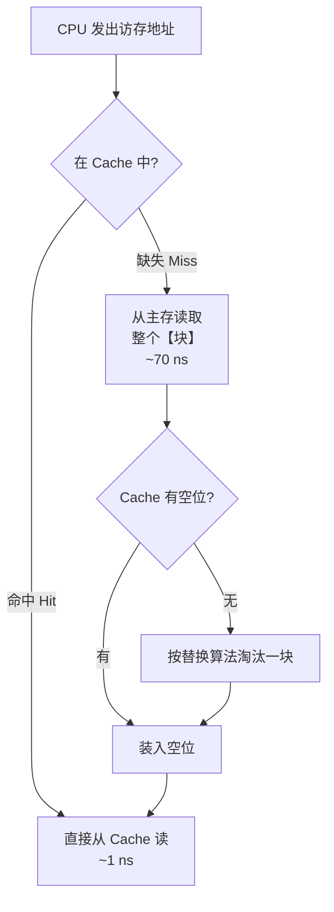
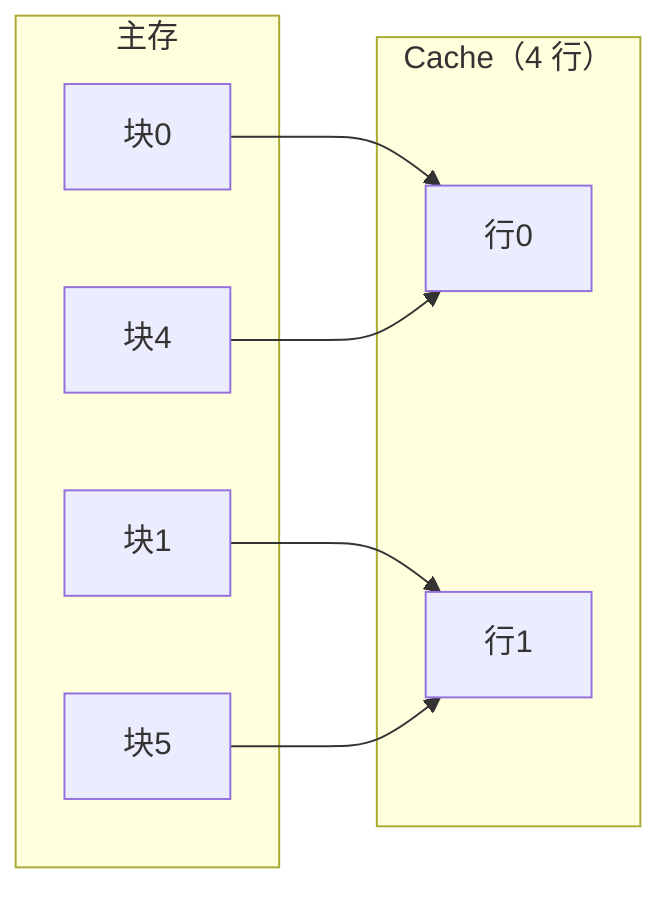
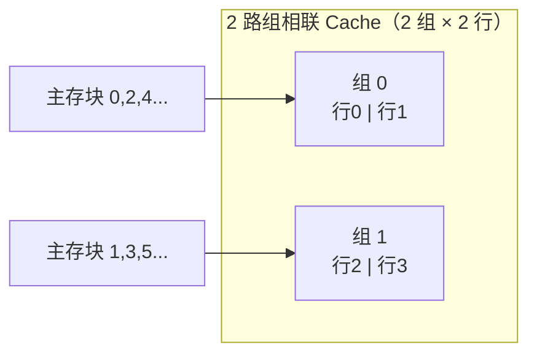
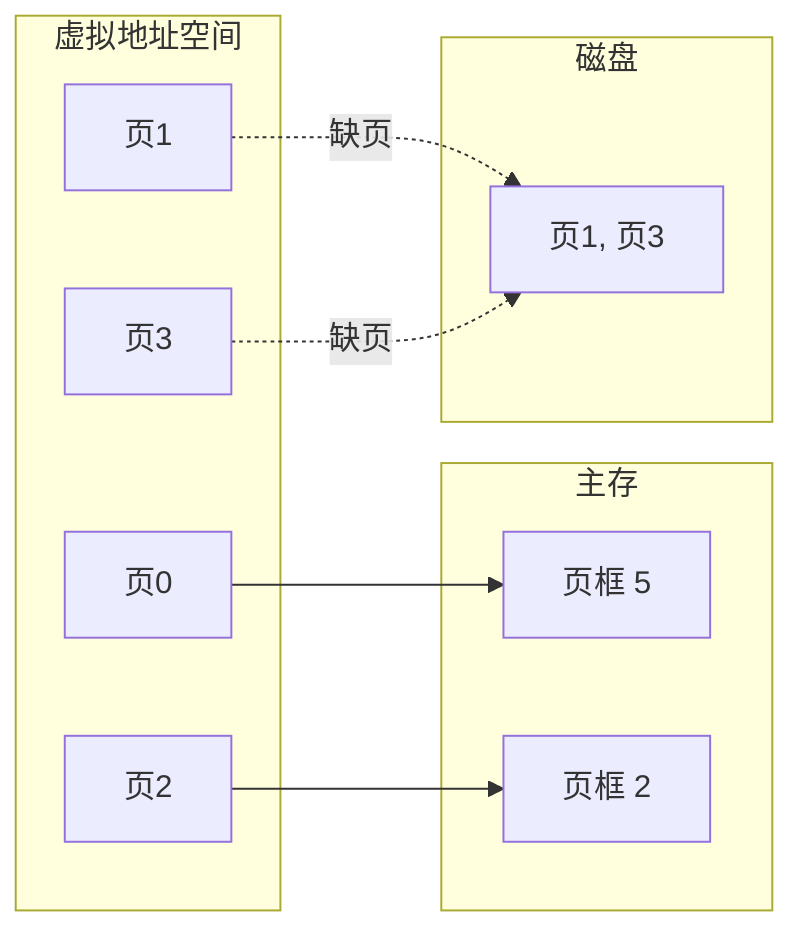
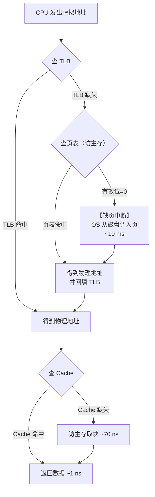
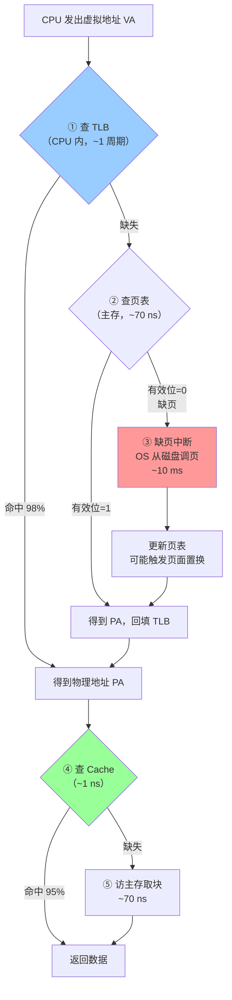

# 精通 Cache 与虚拟存储器：映射方式、替换算法、页表与 TLB

> 课程编号：CO05
> 路线图来源：计算机基础四大件 · 计算机组成原理（408 第 3 章下半）
> 难度：⭐⭐⭐⭐⭐
> 预计阅读时间：100 分钟
> 内容基准：2026 年 8 月（408 考纲组成原理第 3 章「高速缓冲存储器」与「虚拟存储器」）
> **代码语言：Go**。本章代码用于**实测 Cache 行为**与模拟地址转换。

---

## 引言：两个 100 MB 的循环，为什么差 10 倍

```go
// 版本 A：顺序访问
for i := 0; i < n; i++ {
    sum += data[i]
}

// 版本 B：随机访问（下标事先打乱）
for i := 0; i < n; i++ {
    sum += data[perm[i]]
}
```

同样访问 n 次、同样的加法次数，**B 慢 5–10 倍**。

原因在 [CO04](./CO04-精通-存储系统.md) 已经点到了：主存比 L1 慢 70 倍。但真正的问题是——**既然主存这么慢，为什么加个 Cache 就能救回来？** 毕竟 Cache 只有几 MB，主存有几十 GB，**命中率凭什么能到 95% 以上？**

答案是**程序的局部性原理**：

| 局部性 | 含义 | 例子 |
|---|---|---|
| **时间局部性** | 刚被访问的数据，**很可能马上再被访问** | 循环变量 `i`、循环体内的指令 |
| **空间局部性** | 刚被访问的数据，**它旁边的数据很可能马上被访问** | 数组顺序遍历、指令顺序执行 |

这不是巧合，是程序结构的必然结果——**循环带来时间局部性，数组和顺序执行带来空间局部性**。

有多有效？算一笔账。设 Cache 访问 1 ns，主存 70 ns：

$$
T_{平均} = H \times 1 + (1-H) \times 70
$$

| 命中率 H | 平均访问时间 | 相对纯主存的加速 |
|---|---|---|
| 0% | 70 ns | 1× |
| 50% | 35.5 ns | 2× |
| 90% | 7.9 ns | 8.9× |
| **95%** | **4.45 ns** | **15.7×** |
| 99% | 1.69 ns | 41× |

**命中率从 90% 提到 95%，平均时间几乎减半。** 这就是为什么 Cache 设计的每一个细节（映射方式、块大小、替换算法）都值得死磕——命中率的每 1% 都是真金白银。

本章讲两件事，它们**结构完全同构**：

```
Cache ↔ 主存 ：解决「主存太慢」   —— 硬件全权管理，对 OS 透明
主存  ↔ 辅存 ：解决「主存太小」   —— OS + 硬件协同（虚拟存储器）
```

读完你应该能：

- 计算 Cache 命中率、平均访问时间与效率
- 完成三种映射方式的**地址划分**（这是本章最核心的计算题）
- 手工模拟 LRU / FIFO 替换过程
- 说清全写法与写回法的差异，以及脏位的作用
- 完成虚拟地址 → 物理地址的转换
- 画出 TLB + Cache 组合的完整访问流程

---

## 第一章 Cache 的基本原理

### 1.1 工作流程



**关键点：Cache 与主存之间以「块（block / line）」为单位交换数据**，不是按字节。典型块大小 **64 字节**。

**为什么按块？** 因为空间局部性——既然访问了 `a[0]`，多半马上要访问 `a[1]`，一次把整块拉进来，后续访问全部命中。

### 1.2 性能指标

**命中率**：

$$
H = \frac{N_c}{N_c + N_m}
$$

其中 $N_c$ = 命中次数，$N_m$ = 缺失次数。**缺失率** $M = 1 - H$。

**平均访问时间**，两种模型：

**模型一（先查 Cache，miss 再查主存）**：

$$
T_a = H \cdot T_c + (1-H) \cdot (T_c + T_m)= T_c + (1-H) \cdot T_m
$$

**模型二（Cache 与主存同时启动）**：

$$
T_a = H \cdot T_c + (1-H) \cdot T_m
$$

> ⚠️ **408 题目会明确说明用哪种模型**。若题干说"未命中时需要先访问 Cache 再访问主存"，用模型一；若说"命中时间 $T_c$，缺失时间 $T_m$"，用模型二。**看清题干**。

**访问效率**：

$$
e = \frac{T_c}{T_a}
$$

**例**：$T_c = 1$ ns，$T_m = 70$ ns，$H = 95\%$（模型二）：

$$
T_a = 0.95 \times 1 + 0.05 \times 70 = 0.95 + 3.5 = 4.45\ \text{ns}
$$
$$
e = \frac{1}{4.45} \approx 22.5\%
$$

> 💡 **效率只有 22.5%，但相对纯主存已经快了 15.7 倍**。这两个数不矛盾——效率衡量的是"离理想 Cache 有多远"，加速比衡量的是"比没 Cache 好多少"。

---

## 第二章 三种映射方式（核心考点）

**问题**：主存有 $2^{20}$ 块，Cache 只有 $2^{7}$ 块。**主存的某一块该放到 Cache 的哪个位置？**

三种答案，对应三种映射方式。

### 2.1 通用的地址划分框架

主存地址被拆成三段（全相联只有两段）：

```
┌──────────┬──────────┬────────────┐
│   标记    │  行/组号  │  块内地址   │
│   Tag    │  Index   │   Offset   │
└──────────┴──────────┴────────────┘
```

- **块内地址（Offset）**：$\log_2(\text{块大小})$ 位——定位块内的具体字节
- **行号/组号（Index）**：决定放在 Cache 的哪一行/组
- **标记（Tag）**：剩下的高位，用于**判断是不是要找的那一块**

### 2.2 直接映射（Direct Mapped）

**规则**：主存块号 **mod** Cache 总行数 = 该块唯一能放的 Cache 行。

$$
\text{Cache 行号} = \text{主存块号} \bmod 2^c \quad (\text{Cache 有 } 2^c \text{ 行})
$$



主存块 0、4、8、12… 都只能放 Cache 行 0。

**地址划分**：

```
┌──────────┬────────────┬────────────┐
│   Tag    │ Cache行号   │  块内地址   │
└──────────┴────────────┴────────────┘
```

| 特点 | 说明 |
|---|---|
| ✅ **实现简单** | 只需比较**一个**标记 |
| ✅ **速度最快** | 无需并行比较 |
| ❌ **冲突严重** | 块 0 和块 4 交替访问 → **每次都缺失**（抖动） |
| ❌ **利用率低** | 其他行空着也不能用 |

### 2.3 全相联映射（Fully Associative）

**规则**：主存的任何一块**可以放到 Cache 的任何一行**。

**地址划分**（**没有行号字段**）：

```
┌───────────────────────┬────────────┐
│         Tag           │  块内地址   │
└───────────────────────┴────────────┘
```

| 特点 | 说明 |
|---|---|
| ✅ **冲突最少** | 只要 Cache 没满就不会冲突 |
| ✅ **利用率最高** | |
| ❌ **比较器昂贵** | 要**并行比较所有行**的标记 |
| ❌ **只适合小容量** | 实际只用于 **TLB** 等几十项的场合 |

### 2.4 组相联映射（Set Associative）⭐

**折中方案**：把 Cache 分成若干**组**，**组间用直接映射，组内用全相联**。

**n 路组相联**：每组 n 行。

$$
\text{组号} = \text{主存块号} \bmod \text{组数}
$$



主存块 0、2、4… 映射到组 0，但**组内两行任选**——比直接映射灵活。

**地址划分**：

```
┌──────────┬────────────┬────────────┐
│   Tag    │   组号      │  块内地址   │
└──────────┴────────────┴────────────┘
```

**三种方式的统一视角**：

| 方式 | 等价描述 |
|---|---|
| 直接映射 | **1 路**组相联（每组 1 行） |
| n 路组相联 | 一般情况 |
| 全相联 | **1 组**（所有行在同一组） |

### 2.5 三种方式对比

| | 直接映射 | 组相联 | 全相联 |
|---|---|---|---|
| 主存块的位置 | **唯一** | 组内任选 | **任意** |
| 比较器数量 | **1** | **n**（路数） | **Cache 行数** |
| 标记位数 | **最少** | 中 | **最多** |
| 冲突缺失 | **最多** | 中 | **最少** |
| 硬件成本 | **最低** | 中 | **最高** |
| 是否需要替换算法 | **不需要** ⚠️ | 需要 | 需要 |
| 实际应用 | 早期 / L3 部分 | **主流（4~16 路）** | **TLB** |

> ⚠️ **直接映射不需要替换算法**——因为位置唯一，新块来了就直接覆盖那一行，没得选。这是常考的判断题。

### 2.6 地址划分计算（必练）

**例题**：主存容量 **1 MB**，Cache 容量 **16 KB**，块大小 **64 B**，按字节编址。求三种映射方式下的地址划分。

**先算三个基本量**：

```
主存地址位数 = log₂(1M) = 20 位
块内地址位数 = log₂(64) = 6 位
Cache 行数   = 16KB / 64B = 256 行
主存块数     = 1MB / 64B = 16384 块
```

**① 直接映射**

```
Cache 行号位数 = log₂(256) = 8 位
Tag 位数 = 20 - 8 - 6 = 6 位

┌────────┬──────────┬──────────┐
│ Tag 6  │ 行号 8   │ 块内 6   │
└────────┴──────────┴──────────┘
```

**② 全相联映射**

```
无行号字段
Tag 位数 = 20 - 6 = 14 位

┌────────────────┬──────────┐
│    Tag 14      │ 块内 6   │
└────────────────┴──────────┘
```

**③ 4 路组相联**

```
组数 = 256 行 / 4 路 = 64 组
组号位数 = log₂(64) = 6 位
Tag 位数 = 20 - 6 - 6 = 8 位

┌────────┬──────────┬──────────┐
│ Tag 8  │ 组号 6   │ 块内 6   │
└────────┴──────────┴──────────┘
```

> 💡 **规律：相联度越高，Tag 越长**。直接映射 6 位 → 4 路 8 位 → 全相联 14 位。因为行号字段变短甚至消失，位数都挪给了 Tag。**Tag 也要占存储空间**，这是全相联的隐藏成本。

### 2.7 用 Go 实测相联度的影响

```go
package main

import (
    "fmt"
    "time"
)

// 以固定步长循环访问 n 个位置，测试冲突缺失
// 步长选为 Cache 大小的约数时，会集中冲突到少数几组
func conflictTest(stride, count int) time.Duration {
    buf := make([]byte, stride*count)
    start := time.Now()
    for r := 0; r < 100000; r++ {
        for i := 0; i < count; i++ {
            buf[i*stride]++
        }
    }
    return time.Since(start)
}

func main() {
    const stride = 4096 // 4KB 步长：所有地址映射到同一组附近
    fmt.Printf("%-8s %s\n", "访问位置数", "耗时")
    for _, c := range []int{2, 4, 8, 12, 16, 20, 32} {
        fmt.Printf("%-8d %v\n", c, conflictTest(stride, c))
    }
}
```

**预期形状**：耗时在"访问位置数"超过 **L1 的相联度**（典型 8 路）时**陡然上升**——超过路数后，同组的块开始互相驱逐，命中率崩塌。这个拐点直接测出了 L1 的相联度。

---

## 第三章 替换算法

Cache 满了要淘汰一块（**直接映射除外**）。

| 算法 | 规则 | 特点 |
|---|---|---|
| **随机 RAND** | 随便挑一块 | 实现最简单，命中率不稳定 |
| **先进先出 FIFO** | 淘汰**最早装入**的块 | 简单，但可能淘汰掉常用块 |
| **最近最少使用 LRU** | 淘汰**最久未被访问**的块 | **命中率最高**，符合局部性；实现较复杂 |
| **最不经常使用 LFU** | 淘汰**访问次数最少**的块 | 对"曾经很热但已冷却"的块不友好 |

### 3.1 LRU 手工模拟

**例**：3 行 Cache（全相联），访问序列 `1 2 3 4 1 2 5 1 2 3 4 5`

```
访问  1    2    3    4    1    2    5    1    2    3    4    5
─────────────────────────────────────────────────────────────
      1    1    1    4    4    4    5    5    5    3    3    3
           2    2    2    1    1    1    1    1    1    4    4
                3    3    3    2    2    2    2    2    2    5
─────────────────────────────────────────────────────────────
      M    M    M    M    M    M    M    H    H    M    M    M

命中 2 次，缺失 10 次，命中率 = 2/12 ≈ 16.7%
```

**逐步说明**（栈顶 = 最近使用）：

```
访问1: [1]           miss
访问2: [2,1]         miss
访问3: [3,2,1]       miss
访问4: 满→淘汰最久未用的1 → [4,3,2]  miss
访问1: 淘汰2 → [1,4,3]              miss
访问2: 淘汰3 → [2,1,4]              miss
访问5: 淘汰4 → [5,2,1]              miss
访问1: 命中！→ [1,5,2]               HIT
访问2: 命中！→ [2,1,5]               HIT
访问3: 淘汰5 → [3,2,1]              miss
访问4: 淘汰1 → [4,3,2]              miss
访问5: 淘汰2 → [5,4,3]              miss
```

### 3.2 FIFO 的 Belady 异常

**直觉**：Cache 越大，命中率越高。

**反例（Belady 异常）**：FIFO 算法下，**增大 Cache 容量反而可能降低命中率**。

访问序列 `1 2 3 4 1 2 5 1 2 3 4 5`：

| Cache 行数 | FIFO 缺失次数 |
|---|---|
| **3 行** | **9 次** |
| **4 行** | **10 次** ⚠️ |

**容量变大，缺失反而更多**。

> ⚠️ **LRU 不会有 Belady 异常**（LRU 属于"栈算法"，满足包含性：n 行 Cache 的内容始终是 n+1 行 Cache 内容的子集）。**FIFO 和 OPT 之外的很多算法会有**。408 常考"哪种算法会出现 Belady 异常"→ **FIFO**。

---

## 第四章 写策略

读缺失好办（从主存拉块），**写操作**麻烦：Cache 改了，主存怎么办？

### 4.1 写命中时

| 策略 | 做法 | 优缺点 |
|---|---|---|
| **全写法（写直通 Write Through）** | **同时写 Cache 和主存** | ✅ 一致性好、实现简单<br/>❌ 写操作慢（每次都访主存） |
| **写回法（Write Back）** | **只写 Cache**，置**脏位**；该块被替换时才写回主存 | ✅ 写操作快<br/>❌ 一致性差（多核/DMA 要额外协议） |

**全写法的优化：写缓冲（Write Buffer）**

CPU 把数据写进 Cache 和一个 FIFO 写缓冲就返回，由写缓冲**异步**写主存。CPU 不必等主存。

> 💡 **脏位（Dirty Bit）是写回法的核心**——每个 Cache 行加一位标记"是否被修改过"。替换时：
> - 脏位 = 0 → 直接丢弃（主存里有一模一样的副本）
> - 脏位 = 1 → **必须先写回主存**再替换

### 4.2 写缺失时

| 策略 | 做法 | 通常搭配 |
|---|---|---|
| **写分配（Write Allocate）** | 先把块调入 Cache，再写 | **写回法** |
| **非写分配（Not Write Allocate）** | **直接写主存**，不调入 Cache | **全写法** |

**为什么这样搭配？**

- 写回法 + 写分配：既然要在 Cache 里改，就把块调进来，后续的写都能命中
- 全写法 + 非写分配：反正每次写都要写主存，调进 Cache 没好处

### 4.3 四种组合速查

| 组合 | 场景 |
|---|---|
| **全写法 + 非写分配** | 简单、一致性好，适合写少的场景 |
| **写回法 + 写分配** | **主流**，写性能好 |
| 全写法 + 写分配 | 少见 |
| 写回法 + 非写分配 | 少见 |

---

## 第五章 虚拟存储器

Cache 解决"主存太慢"，虚拟存储器解决**"主存太小"**。

**核心思想**：给每个进程一个**巨大的虚拟地址空间**（如 64 位 = 16 EB），实际只把**正在用的部分**装入主存，其余留在磁盘。



### 5.1 与 Cache 的同构关系

| 维度 | Cache ↔ 主存 | 主存 ↔ 辅存（虚存） |
|---|---|---|
| 交换单位 | **块 / 行**（~64 B） | **页**（~4 KB） |
| 缺失代价 | ~70 ns（100 倍） | **~10 ms（10 万倍）** |
| 管理者 | **纯硬件** | **OS + 硬件（MMU）** |
| 对谁透明 | 对 OS 和程序员透明 | 对**程序员**透明，OS 参与 |
| 映射方式 | 直接 / 组相联为主 | **全相联**（任何页可放任何页框） |
| 替换算法 | 硬件实现的近似 LRU | **软件实现**（OS 的 LRU/Clock） |
| 写策略 | 全写法或写回法 | **必须写回法** |

> 💡 **为什么虚存必须用全相联 + 写回法？** 因为缺页代价是 10 ms（比 Cache 缺失贵 10 万倍），**必须不惜一切代价降低缺页率**。全相联把冲突缺失降到 0；写回法避免每次写都碰磁盘。硬件成本在这个量级下可以忽略——因为页表本来就在内存里，用软件查。

### 5.2 页式虚拟存储器

**地址结构**：

```
虚拟地址（逻辑地址）:
┌──────────────┬──────────────┐
│   虚页号 VPN  │  页内偏移     │
└──────────────┴──────────────┘

物理地址:
┌──────────────┬──────────────┐
│  物理页框号   │  页内偏移     │
└──────────────┴──────────────┘
       ↑ 只有这部分要转换，页内偏移【直接复制】
```

**页表**：每个进程一张，记录虚页 → 页框的映射。

| 字段 | 作用 |
|---|---|
| **有效位 / 装入位** | 该页是否在主存中（0 → **缺页**） |
| **物理页框号** | 在主存的哪个页框 |
| **修改位（脏位）** | 是否被写过（换出时决定要不要写回磁盘） |
| **访问位** | 用于替换算法（Clock 算法用它） |
| **权限位** | 读 / 写 / 执行权限 |

**地址转换流程**：

```
① 虚拟地址拆成 (VPN, offset)
② 用 VPN 查页表 → 得到页框号 PFN 和有效位
③ 若有效位 = 0 → 【缺页中断】，OS 从磁盘调入
④ 物理地址 = PFN || offset   （直接拼接）
```

**例**：虚拟地址 32 位，页大小 4 KB，物理地址 30 位。

```
页内偏移 = log₂(4K) = 12 位
虚页号   = 32 - 12 = 20 位  →  页表有 2²⁰ = 1M 项
页框号   = 30 - 12 = 18 位
```

> ⚠️ **页内偏移在虚拟地址和物理地址中位数相同**（都由页大小决定），转换时**原样复制**。只有页号部分需要查表。

### 5.3 TLB（快表）

**问题**：每次访存都要先查页表（在主存里），**访存次数翻倍**！

**解法**：**TLB（Translation Lookaside Buffer，快表）**——页表项的 Cache，做在 CPU 里。

| | 页表（慢表） | TLB（快表） |
|---|---|---|
| 位置 | **主存** | **CPU 内（SRAM）** |
| 容量 | 全部页表项 | 几十~几百项 |
| 访问速度 | 一次访存 | **~1 个周期** |
| 映射方式 | —— | **全相联或高相联组相联** |

**TLB 命中率通常 > 98%**——同样靠局部性（一个页 4KB，能装很多连续访问）。

### 5.4 TLB + Cache 的完整访问流程

这是本章**最重要的流程图**：



**三次可能的"查找"，共有几种组合？**

| TLB | 页表 | Cache | 可能吗 | 说明 |
|---|---|---|---|---|
| 命中 | — | 命中 | ✅ | 最快路径 |
| 命中 | — | 缺失 | ✅ | 地址转换快，数据要从主存取 |
| 缺失 | 命中 | 命中 | ✅ | 需查页表，但数据恰在 Cache |
| 缺失 | 命中 | 缺失 | ✅ | 最慢的"正常"路径 |
| 缺失 | **缺页** | 缺失 | ✅ | 要访问磁盘 |
| **命中** | **缺页** | — | ❌ **不可能** | TLB 是页表的子集，TLB 命中说明页一定在主存 |
| — | 缺页 | **命中** | ❌ **不可能** | 页都不在主存，数据不可能在 Cache |

> ⚠️ **上面两个"不可能"是 408 高频考点**：
> 1. **TLB 命中 → 页一定在主存**（TLB 只缓存有效的页表项）
> 2. **缺页 → Cache 必然缺失**（Cache 缓存的是主存内容，页不在主存则数据不在 Cache）

### 5.5 段式与段页式

| 方式 | 划分依据 | 长度 | 地址结构 | 优点 | 缺点 |
|---|---|---|---|---|---|
| **页式** | **物理**划分（固定大小） | **固定** | 一维（虚拟地址是线性的） | 无外部碎片、管理简单 | **有内部碎片**；不利于共享保护 |
| **段式** | **逻辑**划分（代码段/数据段/栈） | **可变** | **二维**（段号 + 段内偏移，需显式给出） | 便于**共享与保护**、无内部碎片 | **有外部碎片** |
| **段页式** | 先分段，段内再分页 | 段可变、页固定 | 段号 + 页号 + 页内偏移 | 兼具两者优点 | **需两次查表**，开销大 |

> 💡 **一维 vs 二维的区别**：页式的虚拟地址是**一个连续的数**，硬件自动拆成页号和偏移，程序员感觉不到分页。段式的地址是**（段号，段内偏移）二元组**，程序员必须显式指定段——这是"二维"的含义。

---

## 第六章 408 高频考点与陷阱清单

### 6.1 考点分布

第 3 章下半是组成原理**分值最高**的部分之一：**2-3 道选择题 + 几乎必有的大题**。

最常考：

1. **三种映射方式的地址划分计算**（大题必考）
2. **TLB + Cache + 页表的组合访问分析**
3. Cache 命中率与平均访问时间计算
4. LRU / FIFO 的手工模拟
5. 写策略的选择与脏位作用

### 6.2 十六个陷阱

**陷阱 1：Cache 与主存之间按字节交换数据**

**错**。按**块（行）**交换，典型 64 字节。这是利用空间局部性的关键。

**陷阱 2：直接映射需要替换算法**

**错**。直接映射的位置**唯一**，新块来了直接覆盖，**不需要替换算法**。

**陷阱 3：全相联的标记位数最少**

**错，最多**。全相联没有行号字段，位数全给了 Tag。**相联度越高，Tag 越长**。

**陷阱 4：组相联中"组号 = 主存块号 mod Cache 行数"**

**错**。是 **mod 组数**，不是 mod 行数。组数 = 行数 / 路数。

**陷阱 5：LRU 会出现 Belady 异常**

**错**。**FIFO 才会**。LRU 是栈算法，满足包含性，不会出现"容量增大反而缺失更多"。

**陷阱 6：全写法需要脏位**

**错**。**写回法**才需要脏位（判断替换时是否要写回）。全写法主存始终是最新的，不需要脏位。

**陷阱 7：写回法一致性更好**

**错，反了**。**全写法**一致性好（主存实时同步）；写回法一致性差，多核和 DMA 场景需要额外的一致性协议（如 MESI）。

**陷阱 8：写分配通常配全写法**

**错**。通常是**写回法 + 写分配**、**全写法 + 非写分配**。

**陷阱 9：虚拟存储器用组相联映射**

**错**。虚存用**全相联**——因为缺页代价是 Cache 缺失的 10 万倍，必须把冲突缺失降到 0。

**陷阱 10：虚拟存储器可以用全写法**

**错**。虚存**必须用写回法**。全写法意味着每次写都要碰磁盘（10 ms），完全不可接受。

**陷阱 11：页内偏移在虚拟地址和物理地址中位数不同**

**错，位数相同**，且转换时**原样复制**。位数由页大小决定。

**陷阱 12：TLB 命中但可能缺页**

**错，不可能**。TLB 缓存的是**有效**页表项，TLB 命中 → 该页一定在主存。

**陷阱 13：缺页时 Cache 可能命中**

**错，不可能**。Cache 缓存主存内容，页都不在主存，数据不可能在 Cache 里。

**陷阱 14：页式存储的虚拟地址是二维的**

**错**。**页式是一维**（一个线性地址，硬件自动拆分）；**段式才是二维**（需显式给出段号+偏移）。

**陷阱 15：分页会产生外部碎片**

**错**。**分页产生内部碎片**（最后一页用不满）；**分段产生外部碎片**（段长可变，回收后留下不连续的空隙）。

**陷阱 16：Cache 对程序员和 OS 都不透明**

**错**。Cache **对 OS 和程序员都透明**（纯硬件管理）；虚拟存储器对**程序员**透明，但 **OS 要参与**（处理缺页中断、管理页表）。

### 6.3 速查卡

```
【性能】
H = Nc / (Nc + Nm)
Ta = H·Tc + (1-H)·Tm        （模型二：并行）
Ta = Tc + (1-H)·Tm          （模型一：串行）
效率 e = Tc / Ta

【地址划分】
块内地址位数 = log₂(块大小)
直接映射:  Tag | 行号 | 块内     行号位数 = log₂(Cache行数)
组相联:    Tag | 组号 | 块内     组号位数 = log₂(组数)，组数=行数/路数
全相联:    Tag |      | 块内     无行号字段
Tag 位数 = 主存地址位数 - 行/组号位数 - 块内位数

【替换算法】
直接映射【不需要】替换算法
FIFO 会有 Belady 异常，LRU 不会

【写策略】
全写法 + 非写分配 ：一致性好，无脏位
写回法 + 写分配   ：性能好，【需要脏位】，主流

【虚存 vs Cache】
虚存：页(4KB)、全相联、写回法、OS参与、缺页 10ms
Cache：块(64B)、组相联、两种写法、纯硬件、缺失 70ns

【不可能的组合】
TLB命中 + 缺页        ← 不可能
缺页   + Cache命中    ← 不可能
```

---

## 第七章 Go ↔ C 对照

| 场景 | C | Go | 说明 |
|---|---|---|---|
| 获取页大小 | `sysconf(_SC_PAGESIZE)` | `os.Getpagesize()` | 通常 4096 |
| 分配页对齐内存 | `posix_memalign` / `mmap` | `syscall.Mmap` | Go 也可用 `unsafe` 手工对齐 |
| 锁定页不换出 | `mlock()` | `syscall.Mlock` | 防止敏感数据被换到磁盘 |
| 预取 | `__builtin_prefetch` | **无** | Go 依赖硬件预取器 |
| 避免伪共享 | `__attribute__((aligned(64)))` | 手工填充 `_ [56]byte` | 见 CO04 |
| 观察缺页 | `getrusage()` 的 `ru_minflt/ru_majflt` | `syscall.Getrusage` | 区分次缺页和主缺页 |

```go
package main

import (
    "fmt"
    "os"
    "syscall"
)

func main() {
    fmt.Println("页大小:", os.Getpagesize()) // 4096

    var ru syscall.Rusage
    syscall.Getrusage(syscall.RUSAGE_SELF, &ru)
    fmt.Printf("次缺页(不访盘): %d\n", ru.Minflt)
    fmt.Printf("主缺页(要访盘): %d\n", ru.Majflt)
}
```

> 💡 **次缺页（minor fault）**：页不在页表里但**在主存中**（如共享库已被别的进程载入），只需修改页表，不访问磁盘。
> **主缺页（major fault）**：页确实不在主存，**必须访问磁盘**，代价 ~10 ms。
> 线上服务如果 `majflt` 持续增长，说明内存不足开始换页，性能会断崖下跌。

---

## 第八章 练习题

### 选择题

**1.** Cache 与主存之间的数据交换单位是：
A. 字节　B. 字　C. 块　D. 页

**2.** 下列映射方式中，**不需要**替换算法的是：
A. 直接映射　B. 2 路组相联　C. 4 路组相联　D. 全相联

**3.** 在三种映射方式中，标记（Tag）位数最多的是：
A. 直接映射　B. 组相联　C. 全相联　D. 三者相同

**4.** 某 Cache 采用 4 路组相联，共 128 行，则组数为：
A. 4　B. 32　C. 128　D. 512

**5.** 下列替换算法中，可能出现 Belady 异常的是：
A. LRU　B. FIFO　C. OPT　D. LFU

**6.** 采用写回法的 Cache，每个 Cache 行必须增加的标志位是：
A. 有效位　B. 脏位　C. 访问位　D. 权限位

**7.** 全写法（写直通）通常搭配的写缺失策略是：
A. 写分配　B. 非写分配　C. 两者均可　D. 不需要策略

**8.** 虚拟存储器采用的映射方式是：
A. 直接映射　B. 组相联映射　C. 全相联映射　D. 随机映射

**9.** 下列情况中，**不可能**发生的是：
A. TLB 命中，Cache 缺失
B. TLB 缺失，Cache 命中
C. TLB 命中，缺页
D. TLB 缺失，缺页

**10.** 关于分页和分段，**正确**的是：
A. 分页会产生外部碎片
B. 分段的地址空间是一维的
C. 分页对程序员透明，分段需要程序员显式指定段
D. 分段的段长固定

### 应用题

**11.** 某计算机主存容量 **4 MB**，Cache 容量 **32 KB**，块大小 **64 B**，按字节编址。分别求下列三种映射方式的地址划分（各字段位数）：

（1）直接映射
（2）全相联映射
（3）8 路组相联映射

**12.** 某 Cache 系统，命中时访问时间 $T_c$ = 2 ns，缺失时需要访问主存 $T_m$ = 80 ns（缺失时先查 Cache 再查主存）。

（1）若命中率为 90%，求平均访问时间和访问效率。
（2）若要使平均访问时间不超过 5 ns，命中率至少是多少？

**13.** 某 Cache 有 4 行（全相联），初始为空。访问序列为：`1, 2, 3, 4, 1, 2, 5, 1, 2, 3, 4, 5`

（1）用 **LRU** 算法，写出每步的 Cache 状态与命中/缺失，统计命中率。
（2）用 **FIFO** 算法做同样的统计。
（3）若 Cache **减少**到 3 行，FIFO 的缺失次数是多少？与（2）对比说明这体现了什么现象。

**14.** 某系统虚拟地址 **32 位**，物理地址 **28 位**，页大小 **4 KB**，页表项 4 字节。

（1）虚页号和页内偏移各多少位？
（2）单级页表共有多少项？占多大空间？
（3）说明为什么实际系统要用多级页表。

**15.** 画出完整的"CPU 发出虚拟地址 → 取到数据"的流程，标出 TLB、页表、Cache、主存、磁盘各自的位置，并说明哪两种组合是不可能出现的。

### 答案与解析

<details>
<summary>点击展开</summary>

**1. C**

Cache 与主存以**块（block / line）**为单位交换，典型 64 字节。这是利用**空间局部性**的关键设计。

D（页）是主存与辅存之间的交换单位。

**2. A**

**直接映射的位置唯一**——主存块号 mod Cache 行数就确定了唯一的行，新块来了直接覆盖，**没有选择余地**，所以不需要替换算法。

组相联和全相联都有多个候选位置，需要算法决定淘汰谁。

**3. C**

**相联度越高，Tag 越长**：

| 方式 | 地址划分 |
|---|---|
| 直接映射 | Tag（短）+ 行号 + 块内 |
| 组相联 | Tag（中）+ 组号 + 块内 |
| **全相联** | **Tag（最长）** + 块内 |

全相联没有行号字段，那部分位数全部并入 Tag。

**4. B**

$$
\text{组数} = \frac{\text{行数}}{\text{路数}} = \frac{128}{4} = 32
$$

**5. B**

**FIFO 会出现 Belady 异常**（容量增大反而缺失更多）。

**LRU 不会**——它是"栈算法"，满足包含性：n 行 Cache 的驻留集始终是 n+1 行的子集。OPT（最优算法）也不会。

**6. B**

**写回法**需要**脏位**标记该行是否被修改过：

- 脏位 = 0 → 替换时直接丢弃
- 脏位 = 1 → 替换前必须先写回主存

全写法主存始终最新，不需要脏位。

**7. B**

**全写法 + 非写分配**是标准搭配。理由：全写法每次写都要写主存，把块调入 Cache 没有额外好处。

对应的另一组是 **写回法 + 写分配**（主流方案）。

**8. C**

虚拟存储器用**全相联**——任何虚页可放入任何物理页框。

原因：**缺页代价 ~10 ms，是 Cache 缺失（~70 ns）的 10 万倍**，必须不惜代价把冲突缺失降到 0。硬件成本的顾虑在这个量级下可以忽略，因为页表本来就在内存里用软件查。

**9. C**

**TLB 命中 → 缺页是不可能的**。TLB 缓存的是**有效的**页表项（有效位=1），TLB 命中就意味着该页**一定在主存中**。

另一个不可能的组合是"**缺页 + Cache 命中**"——页都不在主存，数据不可能在缓存主存内容的 Cache 里。

A、B、D 都是可能的正常情况。

**10. C**

- A 错：**分页产生内部碎片**（最后一页用不满），分段才产生外部碎片
- B 错：**分页是一维**（线性地址硬件自动拆分），**分段是二维**（需显式给段号）
- **C 对**：这正是一维/二维的实际含义
- D 错：**分段的段长可变**（按逻辑单位划分），分页的页长固定

**11.**

**基本量**：

```
主存地址位数 = log₂(4M) = 22 位
块内地址位数 = log₂(64) = 6 位
Cache 行数   = 32KB / 64B = 512 行
```

**（1）直接映射**

```
行号位数 = log₂(512) = 9 位
Tag = 22 - 9 - 6 = 7 位

┌────────┬──────────┬──────────┐
│ Tag 7  │ 行号 9   │ 块内 6   │
└────────┴──────────┴──────────┘
```

**（2）全相联映射**

```
无行号字段
Tag = 22 - 6 = 16 位

┌──────────────────┬──────────┐
│      Tag 16      │ 块内 6   │
└──────────────────┴──────────┘
```

**（3）8 路组相联**

```
组数 = 512 / 8 = 64 组
组号位数 = log₂(64) = 6 位
Tag = 22 - 6 - 6 = 10 位

┌─────────┬──────────┬──────────┐
│ Tag 10  │ 组号 6   │ 块内 6   │
└─────────┴──────────┴──────────┘
```

**验证规律**：Tag 位数 7 → 10 → 16，**相联度越高 Tag 越长** ✓

**12.**

题干说"缺失时**先查 Cache 再查主存**"，用**模型一**：

$$
T_a = T_c + (1-H) \cdot T_m
$$

**（1）H = 90%**

$$
T_a = 2 + 0.1 \times 80 = 2 + 8 = 10\ \text{ns}
$$

$$
e = \frac{T_c}{T_a} = \frac{2}{10} = 20\%
$$

**（2）要求 $T_a \le 5$ ns**

$$
2 + (1-H) \times 80 \le 5
$$
$$
(1-H) \times 80 \le 3
$$
$$
1 - H \le 0.0375
$$
$$
H \ge 96.25\%
$$

> 💡 命中率从 90% 提到 96.25%，平均时间从 10 ns 降到 5 ns——**减半**。这就是引言里说的"命中率的每 1% 都是真金白银"。

**13.**

**（1）LRU，4 行**

```
访问   1    2    3    4    1    2    5    1    2    3    4    5
────────────────────────────────────────────────────────────
栈顶   1    2    3    4    1    2    5    1    2    3    4    5
       .    1    2    3    4    1    2    5    1    2    3    4
       .    .    1    2    3    4    1    2    5    1    2    3
       .    .    .    1    2    3    4    4    4    5    1    2
────────────────────────────────────────────────────────────
结果   M    M    M    M    H    H    M    H    H    M    M    M

命中 4 次，缺失 8 次，命中率 = 4/12 ≈ 33.3%
```

**（2）FIFO，4 行**

```
访问   1    2    3    4    1    2    5    1    2    3    4    5
────────────────────────────────────────────────────────────
队列  [1] [12] [123][1234][1234][1234][2345][2345][2345][3451][4512][4512]
────────────────────────────────────────────────────────────
结果   M    M    M    M    H    H    M    M    M    M    M    H

命中 3 次，缺失 9 次，命中率 = 3/12 = 25%
```

**（3）FIFO，3 行**

```
访问   1    2    3    4    1    2    5    1    2    3    4    5
────────────────────────────────────────────────────────────
      [1] [12] [123][234][341][412][125][125][125][253][534][534]
────────────────────────────────────────────────────────────
结果   M    M    M    M    M    M    M    H    H    M    M    H

缺失 9 次，命中 3 次
```

**对比（2）**：

| Cache 行数 | FIFO 缺失次数 |
|---|---|
| **3 行** | **9 次** |
| **4 行** | **10 次** ⚠️ |

**容量从 3 行增加到 4 行，缺失反而从 9 次涨到 10 次**——这就是 **Belady 异常（Belady's Anomaly）**。

**根本原因**：FIFO **不满足"包含性（inclusion property）"**。4 行 Cache 在某些时刻的驻留集，**不是** 3 行 Cache 驻留集的超集——因为 FIFO 只看"进来的先后"，与"是否常用"无关，多一行可能恰好把一个即将被用到的块推迟淘汰到更糟的时刻。

**LRU 永远不会出现这个现象**。LRU 属于**栈算法（stack algorithm）**：任意时刻，n 行 LRU 的驻留集**必然是** n+1 行驻留集的子集。所以容量增大，命中率**单调不降**。

> 💡 顺带一提：本题（1）（2）里 4 行时 LRU（8 次缺失）优于 FIFO（10 次缺失），但在 3 行时 LRU 是 10 次、FIFO 是 9 次——**FIFO 反超**。这说明**替换算法的优劣依赖具体访问序列**，LRU 只是"平均而言"更好，不是每个序列都更好。

**14.**

**（1）位数划分**

```
页大小 4 KB = 2¹²  →  页内偏移 = 12 位
虚页号 = 32 - 12 = 20 位
（物理页框号 = 28 - 12 = 16 位）
```

**（2）单级页表规模**

```
页表项数 = 2²⁰ = 1,048,576 项 ≈ 1M 项
页表大小 = 1M × 4 B = 4 MB
```

**（3）为什么要多级页表**

**问题一：单级页表太大且必须连续。**

每个进程一张 4 MB 的页表，且必须**在主存中连续存放**。100 个进程就是 400 MB 纯页表开销——比很多程序本身还大。

**问题二：绝大部分页表项是空的。**

一个典型进程只用到虚拟地址空间的极小一部分（代码几 MB、堆几十 MB、栈几 MB），32 位地址空间的 4 GB 里，**99% 以上的页表项有效位都是 0**——却仍然占着 4 MB 空间。

**多级页表的解法**：把页表本身也分页，**只为实际用到的部分分配二级页表**。

```
32 位地址，4KB 页，两级页表：
┌──────────┬──────────┬──────────────┐
│ 一级页号  │ 二级页号  │  页内偏移 12  │
│   10位    │   10位    │              │
└──────────┴──────────┴──────────────┘

一级页表：2¹⁰ = 1024 项 × 4 B = 4 KB（正好一页！）
二级页表：每张 1024 项 × 4 B = 4 KB

若进程只用 3 个二级页表：
  总开销 = 4 KB（一级） + 3 × 4 KB（二级） = 16 KB
  
对比单级的 4 MB → 节省 99.6%
```

**代价**：地址转换需要**多次访存**（两级就是 2 次查表 + 1 次取数 = 3 次访存）。这正是 **TLB 存在的意义**——TLB 命中就跳过所有查表，直接得到物理地址。

> 💡 64 位系统用 **4 级或 5 级页表**（x86-64 的 4 级：PML4 → PDPT → PD → PT）。没有 TLB 的话，一次访存要变成 5 次，完全不可用。TLB 命中率 98%+ 才让多级页表在工程上可行。

**15.**



**各部件的位置与代价**：

| 步骤 | 部件 | 位置 | 典型延迟 | 命中率 |
|---|---|---|---|---|
| ① | **TLB** | CPU 内 SRAM | ~1 周期 | ~98% |
| ② | **页表** | 主存 | ~70 ns（多级更久） | —— |
| ③ | **磁盘** | 外存 | **~10 ms** | —— |
| ④ | **Cache** | CPU 内 SRAM | ~1 ns | ~95% |
| ⑤ | **主存** | DRAM | ~70 ns | —— |

**两种不可能的组合**：

**① TLB 命中 + 缺页 —— 不可能**

TLB 是页表的**高速缓存**，只缓存**有效位 = 1** 的页表项。TLB 命中意味着找到了一个有效的映射，**该页必然已在主存中**，不可能同时缺页。

**② 缺页 + Cache 命中 —— 不可能**

Cache 缓存的是**主存的内容**。缺页说明**该页根本不在主存**，那么它的数据也就不可能出现在 Cache 里。

> 💡 反过来的组合都是可能的：
> - TLB 缺失 + Cache 命中 ✅（地址转换要查页表，但数据碰巧还在 Cache 里——这在页表刚被换出 TLB 但数据仍热时会发生）
> - TLB 命中 + Cache 缺失 ✅（最常见的"正常缺失"路径）

</details>

---

## 小结

| 要点 | 一句话 |
|---|---|
| 局部性原理 | **时间局部性**（刚访问的还会访问）+ **空间局部性**（旁边的会访问） |
| 交换单位 | Cache↔主存 按**块**（~64B）；主存↔辅存 按**页**（~4KB） |
| 命中率的价值 | 90% → 95%，平均访问时间**几乎减半** |
| 平均访问时间 | 串行 $T_c + (1-H)T_m$；并行 $HT_c + (1-H)T_m$。**看题干** |
| 直接映射 | 位置唯一；比较器 1 个；**不需要替换算法**；冲突最多 |
| 全相联 | 位置任意；比较器 = 行数；**Tag 最长**；只用于 TLB |
| 组相联 | 组间直接、组内全相联；**主流（4~16 路）** |
| 组号计算 | **mod 组数**（不是 mod 行数）；组数 = 行数 / 路数 |
| Tag 位数 | = 主存地址位 − 行/组号位 − 块内位；**相联度越高 Tag 越长** |
| Belady 异常 | **FIFO 会**，LRU 不会（LRU 是栈算法，满足包含性） |
| 全写法 | 同时写 Cache 和主存；一致性好；**不需脏位**；配**非写分配** |
| 写回法 | 只写 Cache 置**脏位**；性能好；配**写分配**；**主流** |
| 虚存映射 | **全相联**（缺页代价 10 万倍于 Cache 缺失，必须消除冲突） |
| 虚存写策略 | **必须写回法**（全写法每次写都碰磁盘，不可接受） |
| 页内偏移 | 虚拟地址与物理地址中**位数相同**，转换时**原样复制** |
| TLB | 页表项的 Cache，在 CPU 内，**全相联**，命中率 98%+ |
| 不可能组合 ① | **TLB 命中 + 缺页** |
| 不可能组合 ② | **缺页 + Cache 命中** |
| 分页 vs 分段 | 分页**一维、固定长、内部碎片**；分段**二维、可变长、外部碎片** |
| 多级页表 | 只为用到的部分分配二级表，省 99%+ 空间；代价是多次访存，靠 **TLB** 补救 |
| 透明性 | Cache 对 OS 和程序员**都透明**；虚存对**程序员**透明但 **OS 参与** |

**下一章** → CO06 指令系统，从指令格式、寻址方式讲到 CISC 与 RISC 之争。

---

## 延伸阅读

- 《计算机组成原理》唐朔飞 第 3 章 —— 408 指定教材
- 《深入理解计算机系统》(CSAPP) 第 6 章「存储器层次结构」、第 9 章「虚拟内存」—— **本章最好的补充读物**，含大量可运行实验
- [What Every Programmer Should Know About Memory](https://people.freebsd.org/~lstewart/articles/cpumemory.pdf) —— Cache 一致性与预取的深入讨论
- 本仓库对照：
  - [CO04 存储系统](./CO04-精通-存储系统.md) —— SRAM/DRAM 的物理基础
  - [linux/L04 内存管理](../../linux/L04-精通-虚拟内存与分页.md) —— Linux 页表与缺页处理的真实实现
  - [golang/G20 Go 内存管理](../../golang/G20-精通-Go-内存管理.md) —— 运行时如何与虚存交互
  - [DS07 查找](../data-structure/DS07-精通-查找.md) —— 散列表与相联存储器的思想同源
