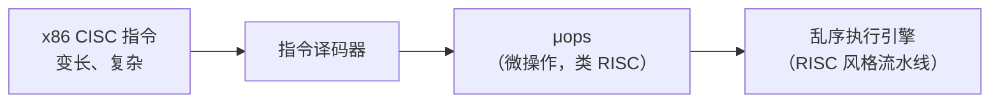

# 精通指令系统：指令格式、寻址方式与 CISC/RISC

> 课程编号：CO06
> 路线图来源：计算机基础四大件 · 计算机组成原理（408 第 4 章）
> 难度：⭐⭐⭐⭐
> 预计阅读时间：85 分钟
> 内容基准：2026 年 8 月（408 考纲组成原理第 4 章「指令系统」）
> **代码语言：Go**。本章用 `go tool objdump` 观察真实的机器指令与寻址方式。

---

## 引言：一行 Go 代码变成了几条指令

写一个最简单的函数：

```go
func add(a, b int) int {
    return a + b
}
```

用 `go build -gcflags="-N -l"` 编译后反汇编（x86-64）：

```asm
add:
    MOVQ  AX, 0x8(SP)      ; 参数 a 存到栈
    MOVQ  BX, 0x10(SP)     ; 参数 b 存到栈
    MOVQ  0x8(SP), AX      ; 取出 a
    ADDQ  0x10(SP), AX     ; a + b
    RET                    ; 返回
```

五条指令。里面出现了**三种不同的寻址方式**：

| 指令片段 | 寻址方式 | 含义 |
|---|---|---|
| `AX` | **寄存器寻址** | 操作数就在寄存器里 |
| `0x8(SP)` | **基址/变址寻址** | 地址 = SP 寄存器的值 + 偏移 8 |
| `RET` | **隐含寻址 + 堆栈寻址** | 返回地址隐含在栈顶 |

**为什么需要这么多种寻址方式？** 因为指令字长有限。

假设指令 32 位，操作码占 8 位，剩下 24 位给地址码。若用**直接寻址**（地址码就是内存地址），最多只能访问 $2^{24}$ = 16 MB 内存。可现代程序的地址空间是 $2^{48}$ 甚至更大——**直接寻址根本不够用**。

寻址方式的本质就是：**用有限的地址码位数，撬动巨大的地址空间**。

```
直接寻址：   EA = A                能访问 2^24
间接寻址：   EA = (A)              能访问整个内存（代价：多一次访存）
基址寻址：   EA = (BR) + A         64 位基址 + 24 位偏移
寄存器间接： EA = (Ri)             64 位寄存器全覆盖，且不访存
```

这就是本章的主线：**指令设计是在「表达能力」「指令长度」「执行速度」三者之间做取舍**。CISC 和 RISC 之争，本质上就是在这个三角上选了不同的点。

读完你应该能：

- 设计定长操作码和**扩展操作码**，并算出各类指令的条数上限
- 说清零/一/二/三地址指令的适用场景与访存次数
- 默写十种数据寻址方式的有效地址公式与访存次数
- 说清相对寻址、基址寻址、变址寻址的区别与各自用途
- 对比 CISC 与 RISC 的六个维度差异

---

## 第一章 指令格式

### 1.1 基本结构

```
┌──────────────┬─────────────────────────┐
│   操作码 OP   │       地址码 A          │
│  （做什么）    │      （对谁做）          │
└──────────────┴─────────────────────────┘
```

- **操作码（OP）**：指明操作类型（加、减、转移、传送…）
- **地址码（A）**：指明操作数的位置

### 1.2 按地址码个数分类

| 类型 | 格式 | 含义 | 典型指令 |
|---|---|---|---|
| **零地址** | `OP` | 无操作数，或操作数隐含 | `NOP`、`HALT`、堆栈运算 `ADD`（栈顶两个数） |
| **一地址** | `OP A1` | ① 单目运算 `A1 ← OP(A1)`<br/>② 隐含累加器 `ACC ← ACC OP A1` | `INC A`、`ADD A` |
| **二地址** | `OP A1, A2` | `A1 ← A1 OP A2` | `ADD A1, A2` |
| **三地址** | `OP A1, A2, A3` | `A3 ← A1 OP A2` | `ADD A1, A2, A3` |
| **四地址** | `OP A1,A2,A3,A4` | `A3 ← A1 OP A2`，A4 = 下条指令地址 | 极少用（PC 已经能自增） |

**访存次数分析**（以二地址指令、直接寻址为例）：

```
ADD A1, A2   （A1 ← A1 + A2）

① 取指令        → 1 次访存
② 取操作数 A1   → 1 次访存
③ 取操作数 A2   → 1 次访存
④ 存结果到 A1   → 1 次访存
────────────────────────
共 4 次访存
```

| 指令类型 | 取指 | 取操作数 | 存结果 | 总访存 |
|---|---|---|---|---|
| 零地址（堆栈） | 1 | 0（隐含） | 0 | **1** |
| 一地址（隐含 ACC） | 1 | 1 | 0（在 ACC） | **2** |
| 二地址 | 1 | 2 | 1 | **4** |
| 三地址 | 1 | 2 | 1 | **4** |

> 💡 **四地址指令为什么被淘汰？** 因为 PC 的自增功能已经免费提供了"下一条指令地址"，专门用一个地址码去存它是浪费。**四地址 → 三地址的演进，正是 PC 寄存器带来的**。

### 1.3 定长操作码

**操作码占固定 n 位** → 最多 $2^n$ 条指令。

```
指令字长 16 位，操作码固定 4 位，两个地址码各 6 位：

┌────────┬──────────┬──────────┐
│ OP  4  │  A1  6   │  A2  6   │
└────────┴──────────┴──────────┘

最多 2⁴ = 16 条二地址指令
```

- ✅ 译码简单快速
- ❌ 指令条数受限，且**浪费编码空间**（很多指令不需要那么多地址码）

### 1.4 扩展操作码（变长操作码）⭐

**核心思想**：**地址码少的指令，用多出来的位扩展操作码**。

**经典例题**：指令字长 16 位，每个地址码 4 位。要求设计 **15 条三地址指令、15 条二地址指令、15 条一地址指令、16 条零地址指令**。

```
【三地址指令】OP 4位 + A1 4位 + A2 4位 + A3 4位
  0000 xxxx yyyy zzzz
  ...                     用 0000 ~ 1110 → 15 条
  1110 xxxx yyyy zzzz
  1111 ←────────────────  【留作扩展标志】

【二地址指令】OP 8位 + A1 4位 + A2 4位
  1111 0000 yyyy zzzz
  ...                     用 1111 0000 ~ 1111 1110 → 15 条
  1111 1110 yyyy zzzz
  1111 1111 ←───────────  【留作扩展标志】

【一地址指令】OP 12位 + A1 4位
  1111 1111 0000 zzzz
  ...                     用 1111 1111 0000 ~ 1111 1111 1110 → 15 条
  1111 1111 1110 zzzz
  1111 1111 1111 ←──────  【留作扩展标志】

【零地址指令】OP 16位
  1111 1111 1111 0000
  ...                     用 ...0000 ~ ...1111 → 16 条
  1111 1111 1111 1111
```

**验算**：三地址 15 + 二地址 15 + 一地址 15 + 零地址 16 = 61 条。

> ⚠️ **扩展操作码的设计原则**：**任何一条指令的操作码，都不能是另一条指令操作码的前缀**（否则译码时会有歧义）。这就是**前缀码**，和哈夫曼编码的要求一模一样。

**通用公式**：若 n 地址指令有 $K$ 条，操作码长 $L$ 位，则 (n−1) 地址指令最多有：

$$
(2^L - K) \times 2^{\text{地址码位数}}
$$

**例**：指令字长 16 位，地址码 4 位。若三地址指令有 **12** 条，则二地址指令最多有多少条？

$$
(2^4 - 12) \times 2^4 = 4 \times 16 = 64\ \text{条}
$$

（剩下 4 个 4 位编码，每个可以扩展出 $2^4 = 16$ 个 8 位操作码）

### 1.5 指令字长与机器字长

| 术语 | 定义 |
|---|---|
| **指令字长** | 一条指令的总位数 |
| **机器字长** | CPU 一次能处理的位数 |
| **存储字长** | 一个存储单元的位数 |

三者**可以不相等**。指令字长通常是**存储字长的整数倍**：

- **单字长指令**：指令字长 = 存储字长 → 取指 1 次访存
- **双字长指令**：指令字长 = 2 × 存储字长 → 取指 **2 次访存**

> ⚠️ **多字长指令会增加取指的访存次数**，这是 CISC 变长指令的一个隐性成本。RISC 坚持定长指令正是为了避免这个问题。

---

## 第二章 指令寻址

**指令寻址 = 怎么找到下一条指令。** 只有两种。

### 2.1 顺序寻址

`(PC) + 1 → PC`，自动指向下一条。

> ⚠️ **这个"1"是"一条指令的长度"**。若按字节编址、指令定长 4 字节，实际是 `PC + 4`。

### 2.2 跳跃寻址

转移指令直接给出目标地址，写入 PC。

| 方式 | 计算 | 特点 |
|---|---|---|
| **绝对转移** | `PC ← A` | 目标地址固定 |
| **相对转移** | `PC ← (PC) + A` | **A 是偏移量**，支持程序浮动 |

---

## 第三章 数据寻址（核心考点）

**数据寻址 = 怎么找到操作数。** 指令中需要一个**寻址特征位**说明用哪种方式：

```
┌──────────┬────────────┬──────────────┐
│  操作码   │  寻址特征   │   形式地址 A  │
└──────────┴────────────┴──────────────┘
```

**形式地址 A**：指令中直接给出的地址字段。
**有效地址 EA**：经过寻址方式计算后，操作数的真实地址。

### 3.1 十种寻址方式总表

| 方式 | 有效地址 EA | 取操作数的访存次数 | 特点 |
|---|---|---|---|
| **隐含寻址** | 隐含在操作码中 | 0 | 缩短指令长度 |
| **立即寻址** | **无 EA**，A 就是操作数 | **0** | **最快**；数值范围受 A 位数限制 |
| **直接寻址** | $EA = A$ | 1 | 简单；寻址范围受 A 位数限制 |
| **间接寻址** | $EA = (A)$ | **2** | 寻址范围大；可实现子程序返回 |
| **寄存器寻址** | $EA = R_i$（操作数在寄存器） | **0** | **快**；不占内存带宽 |
| **寄存器间接寻址** | $EA = (R_i)$ | 1 | 寻址范围 = 寄存器位数 |
| **相对寻址** | $EA = (PC) + A$ | 1 | **程序浮动**、转移指令 |
| **基址寻址** | $EA = (BR) + A$ | 1 | **程序重定位**；BR 由 **OS** 管理 |
| **变址寻址** | $EA = (IX) + A$ | 1 | **数组/循环**；IX 由**用户**管理 |
| **堆栈寻址** | EA = 栈顶（SP 隐含） | 1 | 零地址指令、保存现场 |

> 💡 **访存次数只算"取操作数"，不含取指令那一次**。408 问"完成该指令共需几次访存"时要**加上取指的 1 次**。

### 3.2 三个最易混的：相对 / 基址 / 变址

这三个都是"**某寄存器 + 形式地址**"，但用途完全不同：

| | 相对寻址 | 基址寻址 | 变址寻址 |
|---|---|---|---|
| 公式 | $EA = (PC) + A$ | $EA = (BR) + A$ | $EA = (IX) + A$ |
| **谁变** | PC 随执行变 | **BR 固定**（一个程序内） | **IX 可变**（循环中递增） |
| **A 的角色** | 偏移量（可正可负） | **偏移量** | **基准地址** |
| **谁管理** | 硬件 | **操作系统** | **用户/程序员** |
| **典型用途** | **转移指令**、程序浮动 | **程序重定位**（多道程序） | **数组访问、循环** |

**记忆要点**：

> **基址寻址**：BR 存"程序在内存的起始位置"（由 OS 分配），A 存"数据在程序内的偏移"。程序被加载到任何位置都能跑 → **重定位**。
>
> **变址寻址**：IX 存"数组下标"（用户改），A 存"数组首地址"。IX 递增就能遍历数组 → **循环**。
>
> **两者的 A 和寄存器角色恰好相反**——这是最常考的辨析点。

**代码对照**：

```go
// 变址寻址的典型场景
for i := 0; i < n; i++ {
    sum += arr[i]      // EA = 数组首地址(A) + i(IX)
}                      // IX 每次循环递增，A 不变

// 基址寻址的典型场景（OS 视角）
// 程序被加载到物理地址 0x400000
// 指令里写的都是"相对程序开头的偏移"
// BR = 0x400000，EA = BR + 偏移
```

### 3.3 间接寻址的多级形式

```
一次间接： EA = (A)          取操作数需 2 次访存
两次间接： EA = ((A))        取操作数需 3 次访存
```

**多级间接寻址**用指针单元的最高位作标志：最高位 = 1 表示还要再间接一次。

> ⚠️ **间接寻址的最大价值是「可以在不修改指令的前提下改变操作数地址」**——只需改内存里那个指针单元。这是实现**子程序返回地址**和**指针**的硬件基础。代价是访存次数翻倍。

### 3.4 完整例题

**例**：指令 `ADD R1, @(R2)`，其中 `@` 表示寄存器间接后再间接一次。分析访存次数。

```
① 取指令                → 1 次
② 读 R2（寄存器，不访存）→ 0 次
③ 按 (R2) 取出指针      → 1 次
④ 按该指针取出操作数    → 1 次
⑤ 结果存 R1（寄存器）    → 0 次
────────────────────────────
共 3 次访存
```

### 3.5 用 Go 观察真实寻址方式

```go
// addr.go
package main

var global int64 = 42

func demo(arr []int64, i int) int64 {
    return arr[i] + global
}

func main() { println(demo([]int64{1, 2, 3}, 1)) }
```

```bash
go build -gcflags="-N -l" -o addr addr.go
go tool objdump -s "main.demo" addr
```

典型输出（节选，x86-64）：

```asm
main.demo:
  MOVQ  0x8(SP), AX          ; 基址寻址：SP + 8 取 slice 指针
  MOVQ  0x20(SP), CX         ; 基址寻址：取下标 i
  MOVQ  0(AX)(CX*8), DX      ; 【变址寻址】：基址 AX + 变址 CX × 比例因子 8
  MOVQ  main.global(SB), BX  ; 直接寻址（相对静态基址）
  ADDQ  BX, DX               ; 寄存器寻址
  MOVQ  DX, 0x28(SP)         ; 基址寻址
  RET
```

**`0(AX)(CX*8)` 是最典型的变址寻址**：

- `AX` = 数组首地址（基址）
- `CX` = 下标 i（变址寄存器）
- `*8` = 比例因子（元素大小 8 字节）
- 有效地址 = `AX + CX × 8`

**这正是 §3.2 说的"IX 存下标、A 存首地址"的硬件实现**，x86 还多给了一个比例因子，让编译器不用生成额外的乘法指令。

---

## 第四章 CISC 与 RISC

### 4.1 历史动因

**CISC（Complex Instruction Set Computer，复杂指令集）**

1970 年代的背景：

- 内存**极贵**（1 MB 要几千美元）→ 程序越小越好 → **一条指令干更多事**
- 编译器技术不成熟 → 汇编手写多 → 指令要贴近高级语言
- 微程序控制流行 → 加复杂指令的成本低

**RISC（Reduced Instruction Set Computer，精简指令集）**

1980 年代的反思（Patterson & Ditzel 1980）：

- 统计发现：**80% 的时间在执行 20% 的简单指令**（二八定律）
- 复杂指令拖慢了整体时钟频率，且**难以流水线化**
- 内存变便宜，编译器变强 → 用多条简单指令替代一条复杂指令完全可接受

### 4.2 六维对比

| 维度 | CISC | RISC |
|---|---|---|
| **指令数量** | 多（几百条） | **少（几十条）** |
| **指令长度** | **变长** | **定长**（如全部 32 位） |
| **寻址方式** | 多（十几种） | **少（几种）** |
| **访存指令** | **任何指令都可访存** | **只有 Load/Store 访存** ⭐ |
| **通用寄存器** | 少 | **多**（32 个起） |
| **控制器实现** | **微程序**为主 | **硬布线**为主 |
| **流水线** | 难（指令长度和执行时间不一） | **容易**（定长、单周期） |
| **CPI** | 高（2~15） | **低（接近 1）** |
| **编译优化** | 难 | **容易** |
| **代表** | x86 | ARM、MIPS、RISC-V |

> ⭐ **RISC 最本质的特征是「Load/Store 架构」**：只有 `LOAD` 和 `STORE` 两条指令能访问内存，所有运算指令的操作数都必须在寄存器中。这一条约束带来了定长指令、单周期执行、易流水线的连锁好处。

### 4.3 现代的融合

**今天的 x86 CPU 内部是 RISC 的**：



Intel/AMD 的前端把 CISC 指令**拆成类 RISC 的微操作（μops）**，后端用 RISC 式的乱序流水线执行。**外表 CISC，内核 RISC。**

反过来，ARM 也在加入越来越多的复杂指令（SIMD、加密指令、矩阵指令）。**两者在收敛。**

> 💡 **408 只考经典的 CISC/RISC 对比表**，但知道这个融合趋势能帮你理解为什么"x86 慢"这个说法在今天已经不成立——差异主要来自实现质量而非指令集哲学。

---

## 第五章 408 高频考点与陷阱清单

### 5.1 考点分布

第 4 章通常是 **2 道选择题（4 分）+ 常见于大题的一部分**（配合 CPU 数据通路）。

最常考：

1. **扩展操作码的设计与条数计算**
2. **各种寻址方式的有效地址与访存次数**
3. 相对/基址/变址寻址的辨析
4. CISC vs RISC 特征判断
5. 指令字长与存储字长的关系

### 5.2 十四个陷阱

**陷阱 1：操作码越长，能表示的指令越少**

**错，反了**。操作码 n 位能表示 $2^n$ 条指令，**越长越多**。

**陷阱 2：扩展操作码可以任意分配编码**

**错**。必须满足**前缀码**条件——任一指令的操作码不能是另一条的前缀，否则译码有歧义。

**陷阱 3：立即寻址需要访存取操作数**

**错**。立即寻址的操作数**就在指令里**，取指时已经带进来了，**取操作数 0 次访存**。

**陷阱 4：寄存器寻址需要 1 次访存**

**错，0 次**。操作数在寄存器里，不访问主存。

**陷阱 5：间接寻址访存 1 次**

**错，2 次**（一次取地址，一次取操作数）。这是它最大的代价。

**陷阱 6：相对寻址的基准是某个通用寄存器**

**错，是 PC**。$EA = (PC) + A$。

**陷阱 7：基址寻址的基址寄存器由用户设置**

**错，由操作系统设置**。用户能改的是**变址寄存器**。

**陷阱 8：变址寻址中，形式地址 A 是偏移量**

**错**。变址寻址中 **A 是基准地址（如数组首地址）**，**IX 才是可变的偏移（下标）**。基址寻址正好相反。

**陷阱 9：四地址指令比三地址指令强**

**不准确**。四地址的第四个地址存"下一条指令地址"，但 **PC 自增已经免费提供了这个功能**，所以四地址被淘汰。

**陷阱 10：指令字长必须等于机器字长**

**错**。三个"字长"（指令字长、机器字长、存储字长）相互独立。指令字长通常是存储字长的**整数倍**。

**陷阱 11：RISC 的指令数量少，所以程序更短**

**错，反了**。RISC 指令简单，完成同一任务需要**更多条指令**，程序**更长**（但每条更快、更易流水）。

**陷阱 12：RISC 的所有指令都能访存**

**错**。RISC 的核心特征是 **Load/Store 架构**——**只有 Load 和 Store 能访存**。

**陷阱 13：CISC 用硬布线控制器**

**错，反了**。CISC 指令复杂多变，用**微程序**控制；RISC 指令规整，用**硬布线**（速度更快）。

**陷阱 14：现代 x86 是纯 CISC**

**不准确**。现代 x86 前端译码成类 RISC 的 μops，后端是 RISC 式流水线。**外 CISC 内 RISC**。

### 5.3 速查卡

```
【指令格式】
零地址：OP           1 次访存（仅取指）
一地址：OP A1        2 次访存
二/三地址：           4 次访存（取指1+取数2+存结果1）

【扩展操作码】
必须是【前缀码】
n 地址有 K 条 → (n-1) 地址最多 (2^L - K) × 2^地址码位数

【十种寻址方式的取操作数访存次数】
隐含 0    立即 0    寄存器 0
直接 1    寄存器间接 1    相对 1    基址 1    变址 1    堆栈 1
间接 2    二次间接 3

【三个易混的】
相对：EA = (PC) + A   转移指令、程序浮动
基址：EA = (BR) + A   OS 管 BR，A 是偏移 → 重定位
变址：EA = (IX) + A   用户管 IX，A 是基准 → 数组循环

【CISC vs RISC】
CISC：指令多、变长、寻址多、任何指令可访存、寄存器少、微程序、CPI高
RISC：指令少、定长、寻址少、【只有Load/Store访存】、寄存器多、硬布线、CPI≈1
```

---

## 第六章 Go ↔ C 对照

本章的"代码"是汇编。Go 汇编与 AT&T/Intel 汇编的差异值得知道：

| 项 | Intel 语法 | AT&T 语法（gcc） | Go 汇编 |
|---|---|---|---|
| 操作数顺序 | `mov dst, src` | `mov src, dst` | **`MOV src, dst`**（同 AT&T） |
| 寄存器 | `rax` | `%rax` | **`AX`**（无前缀，且是伪寄存器名） |
| 立即数 | `mov rax, 1` | `mov $1, %rax` | `MOVQ $1, AX` |
| 变址寻址 | `[rax+rcx*8]` | `(%rax,%rcx,8)` | **`0(AX)(CX*8)`** |
| 取符号地址 | `mov rax, offset g` | `mov $g, %rax` | `MOVQ $main.g(SB), AX` |
| 伪寄存器 | 无 | 无 | **`SB`（静态基址）、`FP`（帧指针）、`PC`、`SP`** |

**查看 Go 生成的汇编**：

```bash
# 方式一：编译时输出
go build -gcflags="-S" ./main.go 2>&1 | head -40

# 方式二：反汇编已编译的二进制（更接近真实机器码）
go build -o prog main.go
go tool objdump -s "main.myfunc" prog
```

> 💡 **Go 汇编的 `SB`、`FP`、`SP` 是「伪寄存器」**，不对应真实硬件寄存器，由汇编器翻译成实际的寻址方式：
> - `main.global(SB)` → 相对静态基址的**直接寻址**
> - `arg+8(FP)` → 相对帧指针的**基址寻址**
>
> 这层抽象让 Go 汇编能跨架构复用大部分代码。

---

## 第七章 练习题

### 选择题

**1.** 某机器指令字长 16 位，有 3 个地址码字段，每个 4 位。若采用定长操作码，则最多可以有多少条指令：
A. 8　B. 15　C. 16　D. 64

**2.** 采用扩展操作码时，必须满足的条件是：
A. 操作码长度相同
B. 任一指令的操作码不能是另一指令操作码的前缀
C. 地址码长度相同
D. 指令条数是 2 的幂

**3.** 下列寻址方式中，取操作数**不需要**访问主存的是：
A. 直接寻址　B. 间接寻址　C. 寄存器间接寻址　D. 立即寻址

**4.** 间接寻址取操作数需要访问主存的次数是：
A. 0 次　B. 1 次　C. 2 次　D. 3 次

**5.** 相对寻址的有效地址计算公式是：
A. EA = A　B. EA = (A)　C. EA = (PC) + A　D. EA = (IX) + A

**6.** 变址寻址主要用于：
A. 程序重定位　B. 数组元素访问与循环　C. 子程序返回　D. 转移指令

**7.** 基址寻址中，基址寄存器的内容通常由谁决定：
A. 用户程序　B. 操作系统　C. 编译器　D. 硬件自动

**8.** 下列关于 RISC 的说法，**错误**的是：
A. 指令长度固定
B. 只有 Load/Store 指令访问主存
C. 通用寄存器数量少
D. 大多采用硬布线控制器

**9.** 指令字长为存储字长 2 倍的双字长指令，取指阶段需要访问主存：
A. 1 次　B. 2 次　C. 3 次　D. 4 次

**10.** 关于 CISC 和 RISC，**正确**的是：
A. RISC 完成同一任务所需指令条数比 CISC 少
B. CISC 更容易实现流水线
C. RISC 的 CPI 通常接近 1
D. 现代 x86 处理器内部完全是 CISC 实现

### 应用题

**11.** 某机器指令字长 **16 位**，每个操作数地址码占 **6 位**。要求设计：**3 条二地址指令、若干条一地址指令、若干条零地址指令**。

（1）二地址指令的操作码占多少位？
（2）一地址指令最多可以有多少条？
（3）在（2）取最大值的情况下，零地址指令最多有多少条？

**12.** 某机器字长 16 位，主存按字编址，指令格式如下：

```
┌────────┬──────┬──────────┐
│ OP 6位  │ M 2位 │  A 8位   │
└────────┴──────┴──────────┘
```

其中 M 为寻址方式特征位。指令 `LOAD` 的操作码为 `000101`。设 (PC) = 1234H，(R1) = 5678H，(1234H) = 9ABCH。

对于指令 `LOAD` 且 A = 20H，分别求下列寻址方式的**有效地址**：

（1）M = 00：直接寻址
（2）M = 01：相对寻址（A 为补码偏移）
（3）M = 10：寄存器间接寻址（用 R1）
（4）M = 11：间接寻址

**13.** 指令 `MOV R1, @(R2)` 表示：把 R2 的内容作为地址，从该地址取出一个指针，再按这个指针取出数据，存入 R1。

（1）分析这条指令从取指到执行完成的**全部访存次数**。
（2）写出完整的数据通路操作序列。

**14.** 对比说明**基址寻址**和**变址寻址**的区别，并各举一个具体的应用场景说明为什么要用那一种。

### 答案与解析

<details>
<summary>点击展开</summary>

**1. C**

```
指令字长 16 位 = 操作码 + 3 × 4 位地址码
操作码位数 = 16 - 12 = 4 位
最多指令数 = 2⁴ = 16 条
```

**2. B**

扩展操作码必须满足**前缀码**条件：任一操作码不能是另一操作码的前缀。

否则译码时会有歧义——比如若 `1111` 是一条指令的完整操作码，同时 `1111 0000` 也是另一条指令的操作码，译码器读到 `1111` 时无法判断该停下还是继续读。

这和**哈夫曼编码**的要求完全一致。

**3. D**

| 方式 | 取操作数访存次数 |
|---|---|
| 立即寻址 | **0**（操作数在指令里） |
| 寄存器寻址 | **0**（在寄存器里） |
| 直接寻址 | 1 |
| 寄存器间接 | 1 |
| 间接寻址 | 2 |

**4. C**

间接寻址 $EA = (A)$：

```
① 按 A 访存，取出的内容是【地址】     → 1 次
② 按这个地址再访存，取出【操作数】     → 1 次
共 2 次
```

**5. C**

$$
EA = (PC) + A
$$

A 是相对当前 PC 的**偏移量**（通常用补码，可正可负）。

**6. B**

**变址寻址**：$EA = (IX) + A$，其中 **A 是数组首地址**（不变），**IX 是下标**（循环中递增）。

程序重定位（A）是**基址寻址**的用途；子程序返回（C）常用间接寻址或堆栈；转移指令（D）用相对寻址。

**7. B**

**基址寄存器由操作系统设置**——OS 把程序加载到某个内存位置后，把起始地址填进 BR。用户程序不能改（否则就能访问别的进程的内存）。

**变址寄存器 IX 才是用户可改的**。

**8. C**

RISC 的通用寄存器**数量多**（通常 32 个起），这是为了减少访存——因为 RISC 只有 Load/Store 能访存，运算全在寄存器里做，寄存器不够就要频繁 spill 到内存。

A、B、D 都是 RISC 的正确特征。

**9. B**

双字长指令 = 2 个存储字，每次访存取一个存储字 → **取指需要 2 次访存**。

这是 CISC 变长指令的一个隐性成本，也是 RISC 坚持定长指令的原因之一。

**10. C**

- A 错：**RISC 需要更多指令**完成同一任务（指令更简单）
- B 错：**RISC 更容易流水线**（定长、执行时间一致）
- **C 对**：RISC 的 CPI 接近 1，这是它的核心优势
- D 错：现代 x86 前端把 CISC 指令译码成类 RISC 的 **μops**，后端是 RISC 式流水线

**11.**

**（1）二地址指令的操作码位数**

```
指令字长 16 位 = OP + A1(6位) + A2(6位)
OP 位数 = 16 - 12 = 4 位
```

**（2）一地址指令最多条数**

```
4 位操作码共有 2⁴ = 16 种编码
二地址指令用掉 3 种（题目要求 3 条）
剩余 16 - 3 = 13 种编码可用于扩展

一地址指令格式：OP(10位) + A1(6位)
  高 4 位从剩余 13 种中取，低 6 位是扩展的操作码位
  
一地址指令最多 = 13 × 2⁶ = 13 × 64 = 832 条
```

**（3）零地址指令最多条数**

```
若一地址指令用满 832 条，则没有剩余编码用于扩展
→ 零地址指令 0 条

若要留出零地址指令，必须少用一些一地址编码。
题目问"在（2）取最大值的情况下"→ 一地址用满 832 条
→ 零地址指令最多 0 条
```

> 💡 这道题的关键是理解**扩展操作码是一个"此消彼长"的资源分配问题**：给高地址数指令留的编码越多，能扩展出的低地址数指令就越少。408 通常会明确指定每类的条数，让你验证是否可行。

**12.**

已知：A = 20H，(PC) = 1234H，(R1) = 5678H，(1234H) = 9ABCH

**（1）直接寻址**（M = 00）

$$
EA = A = \textbf{0020H}
$$

**（2）相对寻址**（M = 01）

$$
EA = (PC) + A = 1234H + 20H = \textbf{1254H}
$$

> ⚠️ 严格说，PC 在取指后已经自增指向下一条指令。408 题目若未特别说明，一般按题给的 (PC) 值直接算。若题干强调"取指后 PC 已加 1"，则 EA = 1235H + 20H = 1255H。**看清题干**。

**（3）寄存器间接寻址**（M = 10）

$$
EA = (R_1) = \textbf{5678H}
$$

（R1 里存的就是有效地址，不需要再加 A）

**（4）间接寻址**（M = 11）

$$
EA = (A) = (0020H)
$$

题目未给出 (0020H) 的内容，故 EA = 存储单元 0020H 中存放的值。

> 💡 若题目给出 (0020H) = 3456H，则 EA = **3456H**。

**13.**

指令 `MOV R1, @(R2)`——**寄存器间接 + 再间接一次**

**（1）访存次数**

```
① 取指令                      → 1 次访存
② 读 R2 的内容（寄存器）       → 0 次
③ 按 (R2) 访存，取出【指针】   → 1 次访存
④ 按该指针访存，取出【操作数】 → 1 次访存
⑤ 结果存入 R1（寄存器）        → 0 次

共 3 次访存
```

**（2）数据通路操作序列**

```
【取指阶段】
① (PC) → MAR
② M(MAR) → MDR
③ (MDR) → IR
④ (PC) + 1 → PC

【分析阶段】
⑤ OP(IR) → CU              译码：MOV，寄存器间接+间接

【执行阶段】
⑥ (R2) → MAR               ★ R2 的内容作为地址
⑦ M(MAR) → MDR             ★ 第一次间接：取出指针
⑧ (MDR) → MAR              ★ 把指针再送 MAR
⑨ M(MAR) → MDR             ★ 第二次间接：取出真正的操作数
⑩ (MDR) → R1               存入目标寄存器
```

**14.**

**核心区别**：两者都是"寄存器 + 形式地址"，但**谁是基准、谁是偏移、谁能变**完全相反。

| | 基址寻址 | 变址寻址 |
|---|---|---|
| 公式 | $EA = (BR) + A$ | $EA = (IX) + A$ |
| **寄存器的角色** | **基准地址**（程序起始位置） | **偏移量**（数组下标） |
| **形式地址 A 的角色** | **偏移量**（程序内的位移） | **基准地址**（数组首地址） |
| **谁修改寄存器** | **操作系统** | **用户程序** |
| **执行期间是否变** | **不变**（一个程序内固定） | **常变**（循环中递增） |

**场景一：基址寻址 —— 程序重定位**

多道程序环境下，同一个程序可能被加载到内存的任何位置：

```
编译时：程序假定自己从地址 0 开始
        指令写成 LOAD  100     （取偏移 100 处的数据）

运行时：OS 把程序加载到物理地址 0x400000
        OS 设置 BR = 0x400000
        执行时 EA = 0x400000 + 100

若下次被加载到 0x800000，OS 只需改 BR，
【指令一个字节都不用改】→ 这就是重定位
```

**为什么必须用基址而不是变址**：BR 由 OS 管理且用户不可见，保证了**内存保护**——用户程序无法通过修改 BR 越权访问其他进程的内存。

**场景二：变址寻址 —— 数组遍历**

```go
for i := 0; i < 1000; i++ {
    sum += arr[i]
}
```

编译成（简化）：

```asm
    MOV  IX, 0              ; 下标清零
loop:
    ADD  ACC, arr(IX)       ; EA = arr首地址 + IX   ← 变址寻址
    INC  IX                 ; 下标 +1
    CMP  IX, 1000
    JL   loop
```

**为什么必须用变址而不是基址**：数组首地址 `arr` 在整个循环中**不变**（作为形式地址 A 写死在指令里），变的是**下标 IX**，而下标必须由**用户程序**控制。若用基址寻址，程序就要在每次循环里修改 BR——而 BR 是 OS 管的，用户改不了。

**一句话总结**：

> **基址寻址解决"程序放在哪"（OS 关心），变址寻址解决"访问第几个元素"（程序员关心）。**

**补充：两者可以组合**——x86 的 `[base + index*scale + disp]` 就是"基址 + 变址 + 位移"三合一，`0(AX)(CX*8)` 正是这种形式。

</details>

---

## 小结

| 要点 | 一句话 |
|---|---|
| 指令组成 | **操作码 OP（做什么）+ 地址码 A（对谁做）** |
| 四地址被淘汰 | **PC 自增**免费提供了"下一条指令地址" |
| 二/三地址访存 | **4 次**（取指 1 + 取数 2 + 存结果 1） |
| 定长操作码 | n 位 → $2^n$ 条指令；简单但浪费 |
| 扩展操作码 | **必须是前缀码**；地址码少的指令用多余位扩展操作码 |
| 扩展公式 | (n−1) 地址最多 $(2^L - K) \times 2^{\text{地址码位数}}$ |
| 指令寻址 | 只有**顺序**（PC+1）和**跳跃**（绝对/相对）两种 |
| 形式地址 vs 有效地址 | A 是指令里写的，**EA 是计算后的真实地址** |
| **0 次访存** | 隐含、**立即**、**寄存器**寻址 |
| **2 次访存** | **间接寻址**（先取地址再取数） |
| 相对寻址 | $EA = (PC) + A$，**转移指令、程序浮动** |
| 基址寻址 | $EA = (BR) + A$，**BR 由 OS 管**，A 是偏移 → **重定位** |
| 变址寻址 | $EA = (IX) + A$，**IX 由用户管**，A 是基准 → **数组循环** |
| 基址 vs 变址 | **寄存器与 A 的角色恰好相反**，这是最常考的辨析 |
| 间接寻址的价值 | **不改指令就能改操作数地址** → 指针、子程序返回 |
| RISC 本质特征 | **Load/Store 架构**——只有这两条指令能访存 |
| CISC vs RISC | 多/少、变长/定长、寻址多/少、任意访存/仅LS、寄存器少/多、微程序/硬布线、CPI高/≈1 |
| 指令条数 | **RISC 程序更长**（指令更简单），但每条更快更易流水 |
| 现代 x86 | 前端译码成 **μops**，后端 RISC 式流水线——**外 CISC 内 RISC** |

**下一章** → CO07 中央处理器，把本章的指令放进数据通路，讲控制器设计与流水线。

---

## 延伸阅读

- 《计算机组成原理》唐朔飞 第 7 章 —— 408 指定教材
- 《计算机组成与设计：硬件/软件接口》第 2 章 —— MIPS 指令集的完整教学，RISC 思想的最佳载体
- [Patterson & Ditzel, "The Case for the Reduced Instruction Set Computer" (1980)](https://dl.acm.org/doi/10.1145/641914.641917) —— RISC 的开山论文
- [RISC-V 指令集手册](https://riscv.org/technical/specifications/) —— 现代 RISC 设计，比 MIPS 更干净
- [Go 汇编快速指南](https://go.dev/doc/asm) —— 理解 `SB`/`FP`/`SP` 伪寄存器
- 本仓库对照：
  - [CO01 系统概述](./CO01-精通-计算机系统概述与性能指标.md) —— 指令执行的三阶段
  - [CO05 Cache 与虚拟存储器](./CO05-精通-Cache-与虚拟存储器.md) —— 访存次数为什么这么重要
  - [golang/G21 逃逸分析](../../golang/G21-精通-Go-逃逸分析.md) —— 编译器如何决定变量在寄存器还是内存
