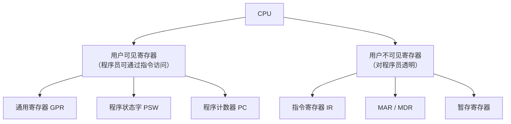
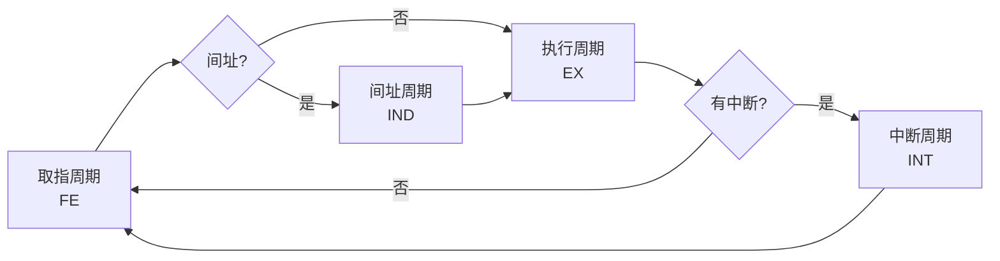
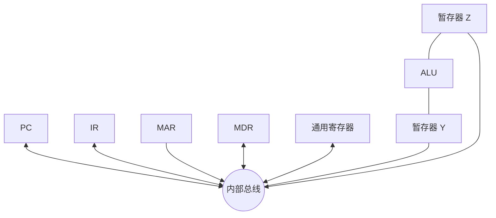
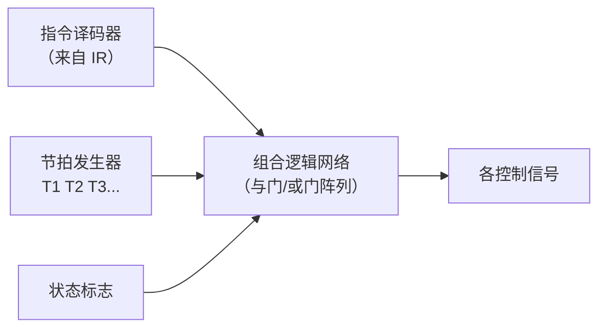
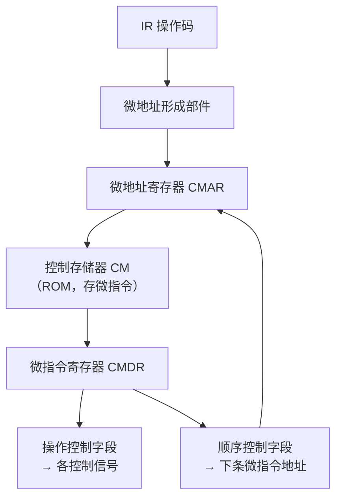
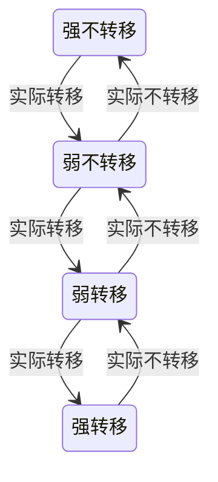

# 精通中央处理器：数据通路、控制器与指令流水线

> 课程编号：CO07
> 路线图来源：计算机基础四大件 · 计算机组成原理（408 第 5 章）
> 难度：⭐⭐⭐⭐⭐
> 预计阅读时间：100 分钟
> 内容基准：2026 年 8 月（408 考纲组成原理第 5 章「中央处理器」）
> **代码语言：Go**。本章代码用于**实测流水线冒险的真实代价**。

---

## 引言：一个 if 判断，为什么能让程序慢 3 倍

跑这段 Go 代码：

```go
data := make([]int, 32768)
for i := range data {
    data[i] = rand.Intn(256)   // 0~255 的随机数
}

// 版本 A：数组未排序
sum := 0
for i := 0; i < len(data); i++ {
    if data[i] >= 128 {        // ← 就是这一行
        sum += data[i]
    }
}

// 版本 B：先 sort.Ints(data) 排序，再跑同样的循环
```

**B 比 A 快 3 倍左右。** 指令条数完全相同，数据完全相同，只是顺序不同。

原因是**分支预测**。现代 CPU 的流水线有 15–20 级，遇到 `if` 时，它不能等条件算出来再取下一条指令——那样流水线要空转十几拍。它会**猜**：

```
数组已排序：  前一半全 false，后一半全 true
              → 分支模式高度规律 → 预测准确率 ~99%

数组未排序：  true/false 随机交替
              → 预测准确率 ~50% → 每两次就猜错一次
```

**每次猜错，整条流水线要清空重来**，浪费 15–20 个周期。3 万次循环里错 1.6 万次，每次赔 15 拍——这就是 3 倍差距的来源。

这个例子把本章三个主题串了起来：

| 主题 | 对应的问题 |
|---|---|
| **数据通路** | 一条指令在 CPU 内部怎么"走" |
| **控制器** | 谁在每个节拍发出控制信号 |
| **流水线** | 怎么让多条指令重叠执行，以及**重叠带来的三种冒险** |

读完你应该能：

- 说清 CPU 的四类寄存器与各自作用，区分用户可见与不可见
- 画出单总线数据通路，写出一条指令的完整微操作序列
- 对比硬布线控制器与微程序控制器的六个维度
- 设计微指令格式，计算微指令字长
- 画流水线时空图，计算吞吐率、加速比、效率
- 识别三种流水线冒险并给出解决方案

---

## 第一章 CPU 的功能与结构

### 1.1 CPU 的五大功能

| 功能 | 说明 |
|---|---|
| **指令控制** | 保证指令按顺序执行（PC 自增、转移） |
| **操作控制** | 产生各部件所需的控制信号 |
| **时间控制** | 对各操作施加时间上的定时 |
| **数据加工** | 算术和逻辑运算 |
| **中断处理** | 响应并处理异常和外部中断 |

### 1.2 寄存器分类（高频考点）



| 寄存器 | 可见性 | 作用 |
|---|---|---|
| **PC** | **可见** | 下一条指令的地址；转移指令可修改 |
| **通用寄存器 GPR** | **可见** | 存操作数、地址 |
| **PSW** | **可见** | 标志位（OF/SF/ZF/CF）+ 状态位 |
| **IR** | **不可见** | 当前指令 |
| **MAR / MDR** | **不可见** | 访存地址 / 数据 |
| **暂存寄存器** | **不可见** | 暂存中间结果（如从主存读来的数） |

> ⚠️ **PC 是用户可见的**——转移指令、调用指令都在改它。IR、MAR、MDR、暂存寄存器**对程序员不可见**，无法通过指令直接访问。这是 408 常考的判断题。

---

## 第二章 指令周期

### 2.1 四个子周期

**指令周期 = 取出并执行一条指令所需的全部时间。**



| 周期 | 做什么 | 何时出现 |
|---|---|---|
| **取指周期 FE** | 取指令、PC+1 | **每条指令必有** |
| **间址周期 IND** | 取有效地址 | **仅间接寻址时** |
| **执行周期 EX** | 执行操作 | **每条指令必有** |
| **中断周期 INT** | 保存断点、转中断服务程序 | **仅响应中断时** |

**用 4 个触发器（FE、IND、EX、INT）标记当前处于哪个周期**——这就是 CPU 的"状态机"。

> 💡 **中断周期做的事**（必须记住顺序）：
> ```
> ① 关中断
> ② 保存断点（PC 压栈或存入指定单元）
> ③ 引出中断服务程序（中断向量 → PC）
> ```
> **关中断必须在保存断点之前**，否则保存过程被打断，断点就丢了。

### 2.2 三级时序系统

```
指令周期 ⊃ 机器周期（CPU 周期）⊃ 时钟周期（节拍 / T 周期）
```

| 层次 | 定义 |
|---|---|
| **时钟周期（节拍）** | 最小时间单位，= 1/主频；**一个节拍完成一个或几个微操作** |
| **机器周期** | 完成一个基本操作（如一次访存）所需时间，包含若干节拍 |
| **指令周期** | 完整执行一条指令，包含若干机器周期 |

> ⚠️ **不同指令的指令周期长度不同**（取决于寻址方式和操作复杂度）。这正是 CISC 难以流水线化的根本原因，也是 RISC 追求"所有指令单周期"的动机。

---

## 第三章 数据通路

**数据通路 = 数据在各功能部件之间传送的路径。**

### 3.1 单总线结构

所有部件挂在**一条内部总线**上。



**关键约束**：**同一时刻总线上只能有一个数据**。所以：

- ALU 的两个输入不能同时来自总线 → 必须先把一个操作数存到**暂存器 Y**
- ALU 的输出不能直接回总线（会和输入冲突）→ 必须先存到**暂存器 Z**

**这就是暂存器 Y 和 Z 存在的唯一理由**——绕开单总线的冲突。

### 3.2 微操作序列（必须能写）

**例：`ADD R0, R1`（R0 ← R0 + R1），单总线结构**

```
【取指周期】
① (PC) → MAR，1 → R          PC 送 MAR，发读命令
② M(MAR) → MDR，(PC)+1 → PC   访存取指令，PC 自增
③ (MDR) → IR                  指令送 IR
④ OP(IR) → CU                 译码

【执行周期】
⑤ (R1) → Y                    ★ 先把一个操作数送暂存器 Y
⑥ (R0) + (Y) → Z              ★ ALU 运算，结果送暂存器 Z
⑦ (Z) → R0                    ★ 结果回写
```

**为什么⑤⑥⑦要分三步？** 因为单总线一次只能传一个数据：

- ⑤ 占用总线传 R1 → Y
- ⑥ **不占用总线**（R0 和 Y 直接进 ALU，结果直接进 Z）
- ⑦ 占用总线传 Z → R0

**例：`ADD R0, (R1)`（间接寻址）**

```
【取指周期】同上 ①~④

【间址周期】
⑤ (R1) → MAR，1 → R
⑥ M(MAR) → MDR
⑦ (MDR) → Y                  ★ 操作数送 Y

【执行周期】
⑧ (R0) + (Y) → Z
⑨ (Z) → R0
```

### 3.3 三总线结构

用**三条独立总线**（两条输入、一条输出），ALU 的两个操作数可以**同时传送**：

```
① (R1) → ALU入A，(R0) → ALU入B，ALU结果 → R0    ← 一步完成
```

- ✅ **速度快**（一个节拍完成）
- ❌ **成本高**（总线数量翻倍）

| | 单总线 | 双总线 | 三总线 |
|---|---|---|---|
| 一次运算的节拍数 | **3** | 2 | **1** |
| 成本 | 低 | 中 | 高 |

---

## 第四章 控制器

控制器的任务：**在每个节拍发出正确的控制信号**。两种实现路线。

### 4.1 硬布线控制器（组合逻辑控制器）

用**组合逻辑电路**直接产生控制信号：

$$
\text{控制信号} = f(\text{指令操作码},\ \text{当前节拍},\ \text{状态标志})
$$



- ✅ **速度最快**（纯组合逻辑，无需访问控制存储器）
- ❌ **难设计、难修改**（改一条指令要重新设计电路）
- **RISC 首选**

### 4.2 微程序控制器

**核心思想**：**把控制信号"存起来"**——每条机器指令对应一段**微程序**，存在**控制存储器（CM）**里。



**三个层次的概念（必须分清）**：

| 概念 | 定义 |
|---|---|
| **微命令** | 控制部件发出的**最基本**控制信号（如"打开某个门"） |
| **微操作** | 微命令**控制下执行的操作**（微命令与微操作一一对应） |
| **微指令** | 若干**同时执行**的微命令的集合，存在 CM 的一个单元里 |
| **微周期** | 执行一条微指令的时间 |
| **微程序** | 完成一条机器指令所需的**全部微指令序列** |

> ⚠️ **一条机器指令 ↔ 一段微程序**；**一条微指令 ↔ 若干微命令**。层次关系别搞反。

**关键数量关系**：

$$
\text{CM 的容量} \ge \text{所有机器指令的微指令总数}
$$

$$
\text{CM 的字长} = \text{微指令字长}
$$

### 4.3 微指令的编码方式

微指令的**操作控制字段**怎么编码？三种方案：

| 方式 | 做法 | 微指令字长 | 并行性 | 译码速度 |
|---|---|---|---|---|
| **直接编码（不译码）** | **一位对应一个微命令** | **最长** | **最高** | **最快**（无需译码） |
| **字段直接编码** | 分若干字段，**互斥的微命令编在同一字段** | 短 | 中 | 需译码 |
| **字段间接编码** | 一个字段的含义**由另一字段解释** | **最短** | **最低** | 最慢 |

**字段直接编码的设计要点**：

1. **互斥性微命令**（不能同时出现）编在**同一字段**
2. **相容性微命令**（可以同时出现）编在**不同字段**
3. 每个字段要留一个编码表示"**本字段不发出任何微命令**"（通常是全 0）

**例题**：某微指令有 3 个互斥类，分别含 7、3、12 个微命令。求字段直接编码所需的操作控制字段位数。

```
字段 1: 7 个微命令 + 1 个"不操作" = 8 种 → ⌈log₂8⌉ = 3 位
字段 2: 3 个微命令 + 1 个"不操作" = 4 种 → ⌈log₂4⌉ = 2 位
字段 3: 12 个微命令 + 1 个"不操作" = 13 种 → ⌈log₂13⌉ = 4 位

操作控制字段共 3 + 2 + 4 = 9 位
```

**对比直接编码**：7 + 3 + 12 = **22 位**。字段编码省了 13 位。

> ⚠️ **每个字段必须留出"不操作"编码**——这是最常忘的一步，会导致位数算少。

### 4.4 微指令格式

| 类型 | 特点 |
|---|---|
| **水平型微指令** | 一条微指令能定义**多个并行的**微命令；**字长长、微程序短、执行快** |
| **垂直型微指令** | 类似机器指令，一条只能定义**1~2 个**微命令；**字长短、微程序长、执行慢** |
| **混合型** | 折中 |

> 💡 **记忆**：水平型"横向宽"（一条指令干很多事），垂直型"纵向长"（要很多条指令）。

### 4.5 两种控制器对比

| 维度 | 硬布线 | 微程序 |
|---|---|---|
| **实现方式** | 组合逻辑电路 | **控制存储器（ROM）** |
| **速度** | **快** | 慢（要读 CM） |
| **规整性** | 差（电路杂乱） | **好**（结构清晰） |
| **可修改性** | **差**（要改电路） | **好**（改 ROM 内容） |
| **适用** | **RISC** | **CISC** |
| **应用趋势** | **现代主流** | 早期主流 |

---

## 第五章 指令流水线

### 5.1 基本思想

**把指令执行分成若干段，让多条指令的不同段重叠进行**——像工厂流水线。

经典**五段流水线**：

```
IF（取指） → ID（译码/取数） → EX（执行） → MEM（访存） → WB（写回）
```

**时空图**（横轴时间，纵轴流水段）：

```
        t1   t2   t3   t4   t5   t6   t7   t8   t9
指令1   IF   ID   EX   MEM  WB
指令2        IF   ID   EX   MEM  WB
指令3             IF   ID   EX   MEM  WB
指令4                  IF   ID   EX   MEM  WB
指令5                       IF   ID   EX   MEM  WB
             └─填充─┘         └── 稳定 ──┘
```

**关键观察**：

- 前 k−1 拍是**流水线填充**（未满载）
- 之后**每拍出一条指令**的结果

### 5.2 三个性能指标（必背公式）

设 **k 段**流水线，执行 **n 条**指令，每段耗时 **Δt**：

**总时间**：

$$
\boxed{T = (k + n - 1) \cdot \Delta t}
$$

**吞吐率 TP**（单位时间完成的指令数）：

$$
TP = \frac{n}{T} = \frac{n}{(k + n - 1)\Delta t}
$$

**最大吞吐率**（$n \to \infty$）：

$$
TP_{max} = \frac{1}{\Delta t}
$$

**加速比 S**（相对不用流水线）：

$$
S = \frac{T_{非流水}}{T_{流水}} = \frac{n \cdot k \cdot \Delta t}{(k+n-1)\Delta t} = \frac{nk}{k+n-1}
$$

**最大加速比**（$n \to \infty$）：

$$
S_{max} = k
$$

**效率 E**（时空图中有效面积占总面积的比例）：

$$
E = \frac{n \cdot k \cdot \Delta t}{k \cdot (k+n-1)\Delta t} = \frac{n}{k+n-1} = \frac{S}{k}
$$

**例**：5 段流水线，Δt = 1 ns，执行 100 条指令。

$$
T = (5 + 100 - 1) \times 1 = 104\ \text{ns}
$$
$$
TP = \frac{100}{104} \approx 0.96\ \text{条/ns}
$$
$$
S = \frac{100 \times 5}{104} \approx 4.81
$$
$$
E = \frac{100}{104} \approx 96.2\%
$$

> 💡 **n 越大，S 越接近 k，E 越接近 1**。流水线的价值在**长指令流**上才能体现，这也是为什么频繁的分支和中断对性能伤害极大。

### 5.3 三种流水线冒险（核心考点）

流水线让指令重叠，但重叠会带来冲突。

#### ① 结构冒险（资源冲突）

**多条指令在同一拍争用同一个硬件资源。**

**典型场景**：指令 1 在 MEM 段访存取数据，指令 4 在 IF 段访存取指令——**同时访问存储器**。

**解决**：

- **暂停（阻塞）**一拍
- **分离指令 Cache 和数据 Cache**（哈佛结构）← 现代做法
- 增加硬件资源（多端口存储器）

#### ② 数据冒险（数据相关）

**后一条指令需要用到前一条指令还没算出来的结果。**

三种数据相关：

| 类型 | 全称 | 说明 | 在顺序流水线中 |
|---|---|---|---|
| **RAW** | Read After Write | 后读前写（**真相关**） | **会发生** |
| WAR | Write After Read | 后写前读（反相关） | 顺序流水线不会 |
| WAW | Write After Write | 后写前写（输出相关） | 顺序流水线不会 |

**例（RAW）**：

```asm
ADD  R1, R2, R3     ; R1 ← R2 + R3
SUB  R4, R1, R5     ; R4 ← R1 - R5   ← 需要 R1，但 ADD 还没写回！
```

```
        t1   t2   t3   t4   t5   t6
ADD     IF   ID   EX   MEM  WB          ← R1 在 WB(t5) 才写回
SUB          IF   ID   EX   MEM  WB
                  ↑ ID(t3) 就要读 R1，此时还是旧值！
```

**解决方案**：

| 方案 | 做法 | 代价 |
|---|---|---|
| **暂停（气泡 / stall）** | 插入空操作，等前一条写回 | **损失 2-3 拍** |
| **数据转发（旁路 forwarding）** ⭐ | **直接把 EX 段的结果送给下一条的 EX 输入**，不等 WB | **无损失**（大多数情况） |
| 编译器调度 | 重排指令顺序，把无关指令插到中间 | 无硬件成本 |

**转发的效果**：

```
        t1   t2   t3   t4   t5
ADD     IF   ID   EX   MEM  WB
                  ╰──┐          ← EX 结束就把结果转发出去
SUB          IF   ID │EX   MEM  WB
                     ↑ 直接用转发来的值
```

> ⚠️ **转发不能解决所有 RAW**。经典的例外是 **Load-Use 冒险**：
> ```asm
> LW   R1, 0(R2)      ; 数据要到 MEM 段末尾才拿到
> ADD  R3, R1, R4     ; 下一拍的 EX 就要用
> ```
> 数据在 MEM 段才可用，而下一条的 EX 段和它同拍——**转发也来不及**，**必须暂停 1 拍**。这是 408 常考的点。

#### ③ 控制冒险（转移冒险）

**遇到转移指令时，不知道下一条该取哪里的指令。**

```asm
BEQ  R1, R2, label    ; 条件转移，要到 EX 段才知道转不转
ADD  ...              ; 已经被取进流水线了，可能白取
```

**解决方案**：

| 方案 | 做法 |
|---|---|
| **暂停** | 等转移条件算出来（损失几拍） |
| **分支预测** ⭐ | **猜**一个方向，猜错就清空流水线 |
| **延迟槽** | 转移指令后固定放几条**无论如何都要执行**的指令（MIPS 用过） |
| **提前判断转移** | 把转移条件的判断电路提前到 ID 段 |

**分支预测的两类**：

| 类型 | 做法 | 准确率 |
|---|---|---|
| **静态预测** | 固定策略（如"总是不转移"、"向后转移就预测转移"） | ~60-70% |
| **动态预测** | 根据**历史行为**预测（1 位/2 位预测器、BHT、BTB） | **95%+** |

**2 位饱和计数器**（经典的动态预测器）：



**关键设计：要连续错两次才改变预测方向**。这让循环的"最后一次跳出"不会破坏整个循环的预测——引言里"排序后快 3 倍"正是这个机制在起作用。

### 5.4 用 Go 实测分支预测

```go
package main

import (
    "fmt"
    "math/rand"
    "sort"
    "time"
)

func bench(data []int) time.Duration {
    start := time.Now()
    sum := 0
    for r := 0; r < 1000; r++ {
        for i := 0; i < len(data); i++ {
            if data[i] >= 128 { // ★ 这个分支的可预测性决定一切
                sum += data[i]
            }
        }
    }
    _ = sum
    return time.Since(start)
}

func main() {
    const n = 32768
    data := make([]int, n)
    for i := range data {
        data[i] = rand.Intn(256)
    }

    unsorted := append([]int(nil), data...)
    sorted := append([]int(nil), data...)
    sort.Ints(sorted)

    fmt.Println("未排序:", bench(unsorted))
    fmt.Println("已排序:", bench(sorted))
}
```

**典型输出**：

```
未排序: 95ms
已排序: 30ms      ← 快约 3 倍
```

**指令条数完全相同，数据完全相同**——差异 100% 来自分支预测命中率。

> 💡 **工程含义**：热点循环里的不可预测分支代价极高。优化手段包括：
> - **无分支编程**：`sum += data[i] & -((data[i] - 128) >> 31)` 之类的位运算技巧
> - **数据预排序**：让分支模式变规律
> - **查表替代分支**

### 5.5 流水线的进阶形态

| 技术 | 做法 | 效果 |
|---|---|---|
| **超标量（Superscalar）** | **每个时钟周期并发发射多条**指令（多套流水线） | CPI < 1 |
| **超流水（Superpipelined）** | **把流水段划得更细**（如 20 级），提高时钟频率 | 单周期更短 |
| **超长指令字（VLIW）** | 编译器把多条无关指令**打包成一条超长指令** | 硬件简单，依赖编译器 |

> ⚠️ **超标量靠"加宽"，超流水靠"加深"，VLIW 靠"编译器"**。三者可以组合——现代 CPU 通常是"超标量 + 超流水 + 乱序执行"。

---

## 第六章 多处理器基本概念

### 6.1 Flynn 分类

按**指令流**和**数据流**的多少分四类：

| 类型 | 指令流 | 数据流 | 例子 |
|---|---|---|---|
| **SISD** | 单 | 单 | 传统单核 CPU |
| **SIMD** | 单 | **多** | **向量处理器、GPU、SSE/AVX 指令** |
| **MISD** | 多 | 单 | **实际不存在** |
| **MIMD** | 多 | 多 | **多核 CPU、多处理器系统** |

> ⚠️ **MISD 在现实中不存在**——这是 408 的送分题。

### 6.2 多核与共享存储

| 类型 | 特点 |
|---|---|
| **UMA（均匀存储访问）** | 所有处理器访问主存的**延迟相同**；典型是 SMP（对称多处理） |
| **NUMA（非均匀存储访问）** | 访问**本地内存快**，访问其他节点内存慢；大规模服务器常见 |

**硬件多线程**：

| 类型 | 做法 |
|---|---|
| 细粒度多线程 | **每个时钟周期**切换线程 |
| 粗粒度多线程 | 只在**长阻塞**（如 Cache miss）时切换 |
| **同时多线程 SMT** | **同一周期内**发射多个线程的指令（Intel 的**超线程**） |

---

## 第七章 408 高频考点与陷阱清单

### 7.1 考点分布

第 5 章是组成原理**最重要的一章**：**2-3 道选择题 + 几乎必有的大题**（数据通路 / 流水线）。

最常考：

1. **流水线的吞吐率、加速比、效率计算**（大题必考）
2. **数据通路的微操作序列**
3. 三种冒险的识别与解决
4. 微指令字长计算（字段直接编码）
5. 硬布线 vs 微程序对比

### 7.2 十六个陷阱

**陷阱 1：PC 是用户不可见寄存器**

**错**。PC **用户可见**（转移、调用指令都在改它）。不可见的是 **IR、MAR、MDR、暂存器**。

**陷阱 2：每条指令都有间址周期**

**错**。间址周期**仅在间接寻址时出现**；中断周期仅在响应中断时出现。只有**取指和执行**是每条必有。

**陷阱 3：中断周期先保存断点再关中断**

**错，反了**。**必须先关中断**，否则保存断点的过程被打断，断点丢失。

**陷阱 4：所有指令的指令周期长度相同**

**错**。取决于寻址方式和操作复杂度。这正是 CISC 难流水的原因。

**陷阱 5：单总线结构中 ALU 的两个输入可以同时来自总线**

**错**。单总线一次只能传一个数据，所以需要**暂存器 Y** 先存一个操作数。

**陷阱 6：微命令和微指令是一回事**

**错**。**微指令 ⊃ 微命令**——一条微指令包含若干个同时执行的微命令。

**陷阱 7：一条微指令对应一条机器指令**

**错**。**一段微程序**对应一条机器指令；一条微指令只是其中一步。

**陷阱 8：字段直接编码时不需要留"不操作"编码**

**错**。每个字段都**必须留一个编码表示"本字段不发微命令"**，否则位数会算少。

**陷阱 9：水平型微指令的微程序更长**

**错，反了**。水平型**并行度高**，一条能干很多事 → **微程序短**、字长长。垂直型才是微程序长。

**陷阱 10：硬布线控制器易于修改**

**错，反了**。**微程序**易修改（改 ROM 内容）；硬布线要重新设计电路。

**陷阱 11：流水线的最大加速比可以超过段数 k**

**错**。$S_{max} = k$，永远达不到也不会超过。

**陷阱 12：流水线效率 E 可以等于 1**

**理论上不能**。$E = \dfrac{n}{k+n-1} < 1$，只有 $n \to \infty$ 时才趋近 1。

**陷阱 13：数据转发能解决所有 RAW 冒险**

**错**。**Load-Use 冒险**转发也来不及（数据 MEM 段才可用），**必须暂停 1 拍**。

**陷阱 14：顺序流水线会发生 WAR 和 WAW 冒险**

**错**。**顺序**流水线只会有 **RAW**。WAR/WAW 出现在**乱序执行**的处理器中。

**陷阱 15：超标量是把流水段划得更细**

**错，那是超流水**。**超标量是每周期发射多条指令**（多套流水线并行）。

**陷阱 16：MISD 是常见的并行结构**

**错**。**MISD 现实中不存在**。

### 7.3 速查卡

```
【指令周期】
取指FE（必有）→ 间址IND（仅间接寻址）→ 执行EX（必有）→ 中断INT（仅有中断）
中断周期顺序：① 关中断 ② 保存断点 ③ 引出中断服务程序

【单总线微操作】
ADD R0,R1:  (R1)→Y；(R0)+(Y)→Z；(Z)→R0     ← 需要 Y 和 Z 绕开总线冲突

【微指令层次】
微程序（一条机器指令）⊃ 微指令（一个 CM 单元）⊃ 微命令（一个控制信号）

【字段直接编码位数】
每个字段：⌈log₂(该类微命令数 + 1)⌉      ← 那个 +1 是"不操作"

【流水线公式】k段，n条指令，每段Δt
T = (k + n - 1)Δt
TP = n / T          TPmax = 1/Δt
S = nk / (k+n-1)    Smax = k
E = n / (k+n-1) = S/k

【三种冒险】
结构冒险：争资源 → 分离 I-Cache/D-Cache
数据冒险：RAW → 【转发】；Load-Use 必须暂停1拍
控制冒险：转移 → 【分支预测】（2位饱和计数器，连错2次才改向）

【进阶形态】
超标量：加宽（每周期发射多条）
超流水：加深（流水段更细）
VLIW：靠编译器打包
```

---

## 第八章 Go ↔ C 对照

| 场景 | C | Go | 说明 |
|---|---|---|---|
| 查看生成的汇编 | `gcc -S` | `go build -gcflags="-S"` | 观察编译器如何调度指令 |
| 反汇编二进制 | `objdump -d` | `go tool objdump` | 更接近真实机器码 |
| 阻止内联（看清调用） | `__attribute__((noinline))` | `//go:noinline` | 便于观察指令边界 |
| 分支预测提示 | `__builtin_expect(x, 1)` | **无对应** | Go 不暴露 likely/unlikely |
| 内存屏障 | `__sync_synchronize()` | `sync/atomic` 隐含 | Go 不提供裸屏障 |
| 性能计数器（IPC、分支误预测） | `perf stat` | **同样用 `perf stat`** | Go 二进制也能被 perf 分析 |

**用 perf 观察分支预测**（Linux）：

```bash
go build -o bench bench.go
perf stat -e branches,branch-misses ./bench
```

典型输出对比：

```
未排序版本：
    3,000,000,000  branches
    1,480,000,000  branch-misses     #  49.33% of all branches   ← 几乎全靠猜

已排序版本：
    3,000,000,000  branches
       30,000,000  branch-misses     #   1.00% of all branches   ← 预测器学会了
```

**误预测率从 49% 降到 1%**，这就是 3 倍性能差距的直接证据。

> 💡 `perf stat` 还能看 `instructions` 和 `cycles`，两者相除得到 **IPC（每周期指令数）**——正是本章 CPI 的倒数。IPC 越接近超标量的发射宽度（现代 CPU 是 4~6），说明流水线跑得越满。

---

## 第九章 练习题

### 选择题

**1.** 下列寄存器中，用户**不可见**的是：
A. PC　B. 通用寄存器　C. PSW　D. IR

**2.** 中断周期中，下列操作的正确顺序是：
A. 保存断点 → 关中断 → 引出中断服务程序
B. 关中断 → 保存断点 → 引出中断服务程序
C. 引出中断服务程序 → 关中断 → 保存断点
D. 关中断 → 引出中断服务程序 → 保存断点

**3.** 在单总线数据通路中，设置暂存器 Y 的目的是：
A. 提高运算速度
B. 避免 ALU 的两个输入同时占用总线
C. 保存运算结果
D. 存放地址

**4.** 一条机器指令对应：
A. 一条微指令　B. 一个微命令　C. 一段微程序　D. 一个微操作

**5.** 某微指令有 4 个互斥类，分别含 5、8、3、15 个微命令。采用字段直接编码，操作控制字段至少需要：
A. 12 位　B. 13 位　C. 14 位　D. 31 位

**6.** 关于水平型和垂直型微指令，**正确**的是：
A. 水平型微指令字长短，微程序长
B. 垂直型微指令并行性高
C. 水平型微指令并行性高，微程序短
D. 两者微程序长度相同

**7.** 5 段流水线，每段 2 ns，执行 20 条指令所需时间为：
A. 40 ns　B. 48 ns　C. 50 ns　D. 200 ns

**8.** k 段流水线执行 n 条指令，其最大加速比为：
A. n　B. k　C. n/k　D. nk/(k+n-1)

**9.** 下列冒险中，数据转发（旁路）**无法完全解决**的是：
A. ADD 后紧跟 SUB 使用其结果
B. LW 后紧跟 ADD 使用其结果
C. 两条无关指令
D. 转移指令

**10.** 关于超标量和超流水，**正确**的是：
A. 超标量是把流水段划分得更细
B. 超流水是每周期发射多条指令
C. 超标量每个时钟周期可以发射多条指令
D. 两者不能同时使用

### 应用题

**11.** 某单总线结构的 CPU，执行指令 `SUB R1, (R2)`（R1 ← R1 − (R2)，其中 (R2) 表示 R2 内容所指的主存单元）。写出从取指到执行完成的**完整微操作序列**，并标注每步属于哪个周期。

**12.** 某微程序控制器，控制存储器容量 **512 × 40 位**。微指令格式为：

```
┌──────────────┬──────────────┬──────────────┐
│  操作控制字段  │  判别测试字段  │ 下地址字段    │
└──────────────┴──────────────┴──────────────┘
```

已知微命令分为 5 个互斥类，各含 8、12、5、20、3 个微命令；判别测试字段 3 位。

（1）操作控制字段至少多少位（字段直接编码）？
（2）下地址字段至少多少位？
（3）三个字段总位数是否满足 40 位的要求？

**13.** 某 6 段流水线，各段执行时间均为 1 ns。

（1）连续执行 10 条指令，求总时间、吞吐率、加速比、效率。
（2）连续执行 1000 条指令，重新计算上述四个量。
（3）对比（1）（2）说明流水线性能与指令条数的关系。

**14.** 分析下列指令序列在 5 段流水线（IF/ID/EX/MEM/WB）中的冒险情况，指出冒险类型，并说明用转发能否解决：

```asm
I1:  LW    R1, 0(R2)
I2:  ADD   R3, R1, R4
I3:  SUB   R5, R3, R6
I4:  BEQ   R5, R0, label
I5:  OR    R7, R8, R9
```

**15.** 解释为什么"数组排序后，含 `if` 的循环会快 3 倍"，并说明 2 位饱和计数器为什么比 1 位预测器更适合循环。

### 答案与解析

<details>
<summary>点击展开</summary>

**1. D**

| 可见 | 不可见 |
|---|---|
| **PC**、通用寄存器、PSW | **IR**、MAR、MDR、暂存器 |

PC 虽然是"控制用"的，但**转移指令、调用指令都在直接修改它**，所以是用户可见的。

**2. B**

```
① 关中断         ← 必须最先！防止保存断点的过程被新中断打断
② 保存断点       （PC 压栈或存入指定单元）
③ 引出中断服务程序（中断向量 → PC）
```

若先保存断点再关中断，在两者之间来了新中断，会覆盖刚保存的断点，导致**无法返回原程序**。

**3. B**

单总线**同一时刻只能传输一个数据**。ALU 需要两个输入，不可能同时从总线取，所以必须先把一个操作数存到**暂存器 Y**。

同理，ALU 的输出也不能直接回总线（会与输入冲突），要先存到**暂存器 Z**。

**4. C**

层次关系：

$$
\text{一条机器指令} \to \text{一段微程序} \to \text{若干条微指令} \to \text{每条含若干微命令}
$$

**5. B**

字段直接编码，**每个字段都要留一个"不操作"编码**：

```
字段1: 5  + 1 = 6  种 → ⌈log₂6⌉  = 3 位
字段2: 8  + 1 = 9  种 → ⌈log₂9⌉  = 4 位
字段3: 3  + 1 = 4  种 → ⌈log₂4⌉  = 2 位
字段4: 15 + 1 = 16 种 → ⌈log₂16⌉ = 4 位

共 3 + 4 + 2 + 4 = 13 位
```

> ⚠️ 忘记 +1 会算成 3+3+2+4 = 12 位（选 A）。D（31 位）是直接编码的位数（5+8+3+15=31）。

**6. C**

| | 水平型 | 垂直型 |
|---|---|---|
| 并行性 | **高** | 低 |
| 微指令字长 | **长** | 短 |
| 微程序长度 | **短** | **长** |
| 执行速度 | **快** | 慢 |

记忆："水平"→ 横向宽 → 一条干很多事 → 微程序短。

**7. B**

$$
T = (k + n - 1) \cdot \Delta t = (5 + 20 - 1) \times 2 = 24 \times 2 = 48\ \text{ns}
$$

> D（200 ns）是**不用流水线**的时间：$20 \times 5 \times 2 = 200$ ns。加速比 200/48 ≈ 4.17。

**8. B**

$$
S = \frac{nk}{k+n-1}, \qquad \lim_{n \to \infty} S = k
$$

**最大加速比等于流水段数 k**，永远达不到也不会超过。

D 是加速比的一般公式（不是最大值）。

**9. B**

**Load-Use 冒险**：

```
        t1   t2   t3   t4   t5
LW      IF   ID   EX   MEM  WB
                       ↑ 数据到 MEM 段【末尾】才拿到
ADD          IF   ID   EX   ...
                       ↑ EX 段【开始】就要用
```

数据在 MEM 段末尾才可用，而下一条的 EX 段与之同拍——**转发也来不及**，**必须暂停 1 拍**。

A（ADD → SUB）的结果在 EX 段末尾就有了，转发完全能解决。

**10. C**

| 技术 | 做法 |
|---|---|
| **超标量** | **每周期发射多条指令**（多套流水线并行）→ "加宽" |
| **超流水** | 流水段划分更细，提高时钟频率 → "加深" |

D 错——现代 CPU 通常**同时使用**超标量 + 超流水 + 乱序执行。

**11.**

指令 `SUB R1, (R2)`——寄存器间接寻址，需要**间址周期**。

```
【取指周期 FE】
① (PC) → MAR，1 → R                 PC 送地址寄存器，发读命令
② M(MAR) → MDR，(PC) + 1 → PC       访存取指令，PC 自增
③ (MDR) → IR                        指令送指令寄存器
④ OP(IR) → CU                       操作码送控制单元译码

【间址周期 IND】
⑤ (R2) → MAR，1 → R                 ★ R2 的内容是操作数地址
⑥ M(MAR) → MDR                      ★ 访存取出操作数
⑦ (MDR) → Y                         ★ 操作数送暂存器 Y

【执行周期 EX】
⑧ (R1) − (Y) → Z                    ★ ALU 做减法，结果送暂存器 Z
⑨ (Z) → R1                          ★ 结果写回 R1
```

**访存次数**：取指 1 次 + 间址取操作数 1 次 = **2 次**。

**为什么⑦要送 Y 而不直接进 ALU**：单总线结构下，ALU 的两个输入不能同时占用总线，必须先把一个存到 Y。

**12.**

**（1）操作控制字段位数**

```
类1: 8  + 1 = 9  种 → ⌈log₂9⌉  = 4 位
类2: 12 + 1 = 13 种 → ⌈log₂13⌉ = 4 位
类3: 5  + 1 = 6  种 → ⌈log₂6⌉  = 3 位
类4: 20 + 1 = 21 种 → ⌈log₂21⌉ = 5 位
类5: 3  + 1 = 4  种 → ⌈log₂4⌉  = 2 位

操作控制字段 = 4 + 4 + 3 + 5 + 2 = 18 位
```

**（2）下地址字段位数**

控制存储器容量 512 个单元 → 需要 $\log_2 512 = 9$ 位微地址。

$$
\text{下地址字段} = \textbf{9 位}
$$

**（3）总位数验证**

```
操作控制字段  18 位
判别测试字段   3 位
下地址字段     9 位
──────────────────
合计          30 位  ≤  40 位  ✓ 满足要求

还剩 10 位可用于扩展（如更多微命令、更长的判别字段）
```

**13.**

**（1）n = 10，k = 6，Δt = 1 ns**

$$
T = (6 + 10 - 1) \times 1 = 15\ \text{ns}
$$
$$
TP = \frac{10}{15} \approx 0.667\ \text{条/ns}
$$
$$
S = \frac{10 \times 6}{15} = 4
$$
$$
E = \frac{10}{15} \approx 66.7\%
$$

**（2）n = 1000**

$$
T = (6 + 1000 - 1) \times 1 = 1005\ \text{ns}
$$
$$
TP = \frac{1000}{1005} \approx 0.995\ \text{条/ns}
$$
$$
S = \frac{1000 \times 6}{1005} \approx 5.97
$$
$$
E = \frac{1000}{1005} \approx 99.5\%
$$

**（3）对比与结论**

| | n = 10 | n = 1000 | 理论极限 |
|---|---|---|---|
| 吞吐率 TP | 0.667 | 0.995 | **1.0**（= 1/Δt） |
| 加速比 S | 4.0 | 5.97 | **6**（= k） |
| 效率 E | 66.7% | 99.5% | **100%** |

**结论**：

流水线有 **k − 1 = 5 拍的"填充"开销**，这部分开销是**固定的**。指令条数 n 越大，这个固定开销被摊薄得越薄：

$$
E = \frac{n}{k+n-1} = \frac{1}{1 + \frac{k-1}{n}}
$$

- n 小时，$\frac{k-1}{n}$ 大，效率低
- n → ∞ 时，$\frac{k-1}{n} \to 0$，效率 → 100%

**工程含义**：**流水线怕的是"断流"**。每次分支误预测、中断、Cache miss 都会清空或阻塞流水线，相当于把一段长指令流切成很多短指令流，效率从 99% 掉回 66%。这正是为什么分支预测准确率如此关键。

**14.**

```asm
I1:  LW    R1, 0(R2)      ; R1 ← M[R2]
I2:  ADD   R3, R1, R4     ; 用 R1
I3:  SUB   R5, R3, R6     ; 用 R3
I4:  BEQ   R5, R0, label  ; 用 R5，且是转移指令
I5:  OR    R7, R8, R9     ; 与前面无关
```

**冒险分析**：

| 编号 | 冒险 | 类型 | 转发能否解决 |
|---|---|---|---|
| **I1 → I2** | I2 要用 I1 加载的 R1 | **RAW 数据冒险（Load-Use）** | ❌ **不能**，必须**暂停 1 拍** |
| **I2 → I3** | I3 要用 I2 算出的 R3 | **RAW 数据冒险** | ✅ **能**（EX→EX 转发） |
| **I3 → I4** | I4 要用 I3 算出的 R5 | **RAW 数据冒险** | ✅ **能**（EX→EX 转发） |
| **I4 → I5** | I4 是转移指令，I5 是否该执行未知 | **控制冒险** | ❌ 需**分支预测**或暂停 |
| I5 | 与前面无关 | 无 | —— |

**时空图（含暂停）**：

```
        t1   t2   t3   t4   t5   t6   t7   t8   t9   t10
I1(LW)  IF   ID   EX   MEM  WB
I2(ADD)      IF   ID   ⊗    EX   MEM  WB          ← ⊗ 是暂停（气泡）
                        ╰────↑ MEM 结果转发给 EX
I3(SUB)           IF   ⊗    ID   EX   MEM  WB
                                 ╰──↑ EX→EX 转发
I4(BEQ)                     IF   ID   EX   MEM  WB
                                      ╰──↑ EX→EX 转发
I5(OR)                            IF?  ← 取决于分支预测
```

**关键说明**：

**① I1 → I2 是 Load-Use 冒险，转发也救不了。**

`LW` 的数据要到 **MEM 段末尾**才从存储器拿到，而 `ADD` 的 **EX 段**与 `LW` 的 MEM 段同拍——转发的数据"还没出炉"。**必须暂停 1 拍**，把 ADD 的 EX 推迟到 LW 的 WB 那一拍，此时可以用 MEM→EX 转发。

**② I2 → I3、I3 → I4 是普通 RAW，转发完全够用。**

`ADD` 的结果在 **EX 段末尾**就出来了，直接转发给 `SUB` 的 EX 输入，**零损失**。

**③ I4 是控制冒险。**

`BEQ` 要到 EX 段才知道转不转。此时 I5 已经被取进流水线了。解决方案：

- **分支预测**：猜一个方向，猜错清空（现代做法）
- **提前判断**：把比较电路提前到 ID 段，只损失 1 拍
- **延迟槽**：把一条必然执行的指令放在 BEQ 后面

**④ 编译器优化的机会**：

I5（`OR R7, R8, R9`）与前面**完全无关**，编译器可以把它调度到 I1 和 I2 之间：

```asm
I1:  LW    R1, 0(R2)
I5:  OR    R7, R8, R9     ; ← 挪上来，正好填补 Load-Use 的空档
I2:  ADD   R3, R1, R4
I3:  SUB   R5, R3, R6
I4:  BEQ   R5, R0, label
```

这样 Load-Use 的那一拍暂停就被**有用的指令填满了**，零损失。**这就是编译器的指令调度（instruction scheduling）**。

**15.**

**为什么排序后快 3 倍**

现代 CPU 流水线有 15–20 级。遇到 `if (data[i] >= 128)` 时，条件要到 EX 段才算出来，但 IF 段每拍都要取指令——**不能等**。CPU 于是**预测**一个方向继续取指。

```
未排序（随机数据）：
  data[i] >= 128 的结果 true/false 随机交替
  → 预测器无规律可循，准确率 ≈ 50%
  → 平均每 2 次循环错 1 次
  → 每次错误清空流水线，赔 15~20 个周期

已排序：
  前一半全 < 128（全 false），后一半全 >= 128（全 true）
  → 只在中间"拐点"处错一次
  → 准确率 ≈ 99.99%
```

**代价估算**（32768 个元素）：

```
未排序：约 16384 次误预测 × 15 周期 ≈ 245,760 个浪费周期
已排序：约 1 次误预测 × 15 周期 ≈ 15 个浪费周期

而循环本身的有用工作约 32768 × 3 ≈ 98,304 周期

未排序总周期 ≈ 98,304 + 245,760 = 344,064
已排序总周期 ≈ 98,304 + 15      =  98,319
比值 ≈ 3.5 倍   ✓ 与实测吻合
```

**为什么 2 位饱和计数器比 1 位好**

**1 位预测器**只记"上一次是否转移"，**错一次就立刻改变方向**。

考虑一个执行 1000 次的循环：

```
for i := 0; i < 1000; i++ { ... }     ← 循环末尾的转移指令
```

转移模式：`T T T ... T N`（999 次转移，最后 1 次不转移）

```
【1 位预测器】
  第 1 次进入循环：预测器状态 N（上次是 N）→ 预测不转移 → 【错】→ 改为 T
  第 2~999 次：预测 T → 对
  第 1000 次（跳出）：预测 T → 【错】→ 改为 N
  
  下次再进入这个循环时，预测器还停在 N → 【第一次又错】
  
  每次执行循环错 2 次
```

**2 位饱和计数器**有四个状态，**必须连续错两次才改变方向**：

```
强不转移 ⇄ 弱不转移 ⇄ 弱转移 ⇄ 强转移
   00        01        10        11
```

```
【2 位预测器】
  循环内 999 次转移 → 状态爬到【强转移 11】
  第 1000 次跳出（不转移）→ 【错】→ 状态降到【弱转移 10】，但预测方向仍是"转移"
  
  下次再进入循环，第一次就预测"转移" → 【对】！
  
  每次执行循环只错 1 次
```

**核心价值：2 位预测器对"偶发的反例"有免疫力**。循环的"最后一次跳出"是一个孤立的反例，不应该让预测器彻底改变对整个循环的判断。这个"迟滞（hysteresis）"设计让循环嵌套场景的准确率大幅提升。

> 💡 现代 CPU 用的是更复杂的**两级自适应预测器**（结合全局历史 GHR 和局部历史 BHT）、**TAGE 预测器**等，准确率可达 98%+。但 2 位饱和计数器是所有这些的基础思想。

</details>

---

## 小结

| 要点 | 一句话 |
|---|---|
| 用户可见寄存器 | **PC**、通用寄存器、PSW |
| 用户不可见 | **IR、MAR、MDR、暂存器** |
| 指令周期 | 取指（必有）→ 间址（仅间接）→ 执行（必有）→ 中断（仅有中断） |
| 中断周期顺序 | **① 关中断 ② 保存断点 ③ 引出中断服务程序** |
| 单总线的 Y 和 Z | 为了**绕开"一次只能传一个数据"**的限制 |
| 单总线运算 | 需要 **3 个节拍**；三总线只要 1 个 |
| 微程序层次 | **微程序**（一条机器指令）⊃ **微指令**（一个 CM 单元）⊃ **微命令** |
| 字段直接编码 | 每字段 $\lceil\log_2(\text{微命令数}+1)\rceil$，**那个 +1 是"不操作"** |
| 水平型 vs 垂直型 | 水平**并行度高、字长长、微程序短、快** |
| 硬布线 vs 微程序 | 硬布线**快但难改**（RISC）；微程序**易改但慢**（CISC） |
| 流水线总时间 | $T = (k+n-1)\Delta t$ |
| 吞吐率 | $TP = n/T$，$TP_{max} = 1/\Delta t$ |
| 加速比 | $S = nk/(k+n-1)$，$S_{max} = k$ |
| 效率 | $E = n/(k+n-1) = S/k$，**永远 < 1** |
| 结构冒险 | 争资源 → **分离 I-Cache / D-Cache** |
| 数据冒险 | 顺序流水线只有 **RAW**；**转发**解决大部分 |
| Load-Use 冒险 | **转发也救不了，必须暂停 1 拍** |
| 控制冒险 | 转移 → **分支预测**（准确率决定实际性能） |
| 2 位饱和计数器 | **连错两次才改向**，对循环的"最后一次跳出"免疫 |
| 超标量 vs 超流水 | 超标量**加宽**（每周期多发射）；超流水**加深**（段更细） |
| Flynn 分类 | SISD / **SIMD（GPU、向量）** / MISD（**不存在**）/ MIMD（多核） |

**下一章** → CO08 总线与输入输出系统，把 CPU 之外的世界接进来：中断、DMA 与 I/O 接口。

---

## 延伸阅读

- 《计算机组成原理》唐朔飞 第 8、9 章 —— 408 指定教材
- 《计算机组成与设计：硬件/软件接口》第 4 章「处理器」—— 五段流水线的完整推导，含冒险处理电路
- [Why is processing a sorted array faster than an unsorted array?](https://stackoverflow.com/questions/11227809/) —— StackOverflow 史上票数最高的问题之一，就是引言那个例子
- [Agner Fog 的微架构手册](https://www.agner.org/optimize/microarchitecture.pdf) —— 各代 x86 流水线的实测细节
- 本仓库对照：
  - [CO06 指令系统](./CO06-精通-指令系统.md) —— 流水线处理的就是这些指令
  - [CO05 Cache 与虚拟存储器](./CO05-精通-Cache-与虚拟存储器.md) —— Cache miss 是流水线断流的主因之一
  - [golang/G22 pprof 性能剖析](../../golang/G22-精通-Go-pprof-性能剖析.md) —— 用 perf 观察 IPC 与分支误预测
  - [linux/L18 性能诊断](../../linux/L18-精通-性能诊断方法论与工具.md) —— 生产环境的流水线效率排查
