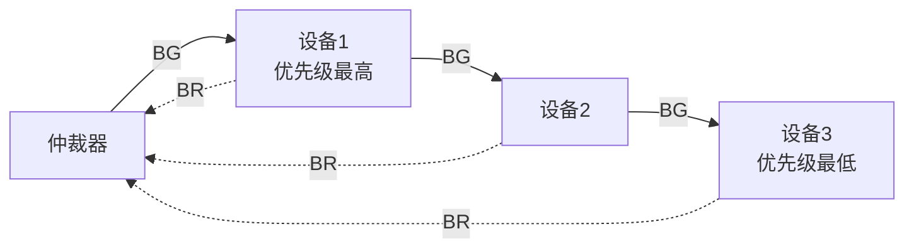
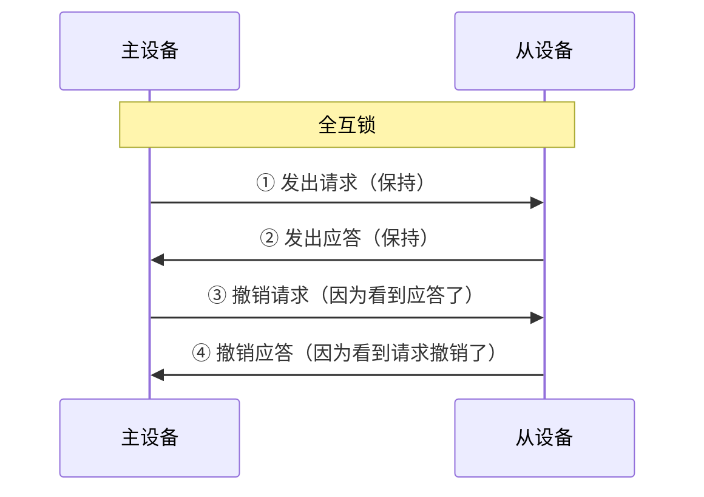
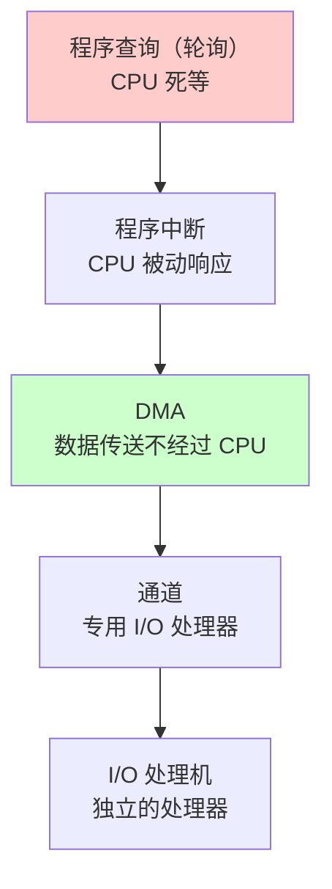
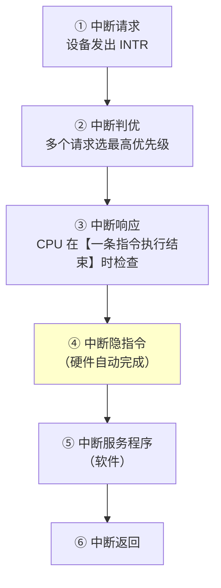
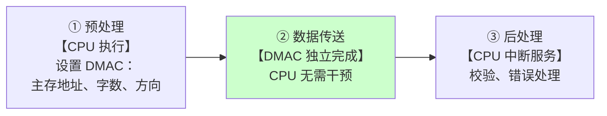

# 精通总线与输入输出系统：总线仲裁、中断与 DMA

> 课程编号：CO08
> 路线图来源：计算机基础四大件 · 计算机组成原理（408 第 6-7 章）
> 难度：⭐⭐⭐⭐
> 预计阅读时间：85 分钟
> 内容基准：2026 年 8 月（408 考纲组成原理第 6 章「总线」与第 7 章「输入输出系统」）
> **代码语言：Go**。本章代码用于**实测 I/O 方式的性能差异**。

---

## 引言：拷贝 1 GB 文件，CPU 该忙成什么样

从磁盘读 1 GB 数据到内存，有三种做法：

**做法一：程序查询（轮询）**

```
CPU: 问磁盘"好了吗？" → 没好 → 再问 → 再问 → ... → 好了 → 搬 4 字节 → 重复
```

磁盘一次传输准备时间约 **10 ms**，CPU 在 3 GHz 下这段时间能执行 **3000 万条指令**——全部浪费在"问好了吗"上。**CPU 利用率接近 0%**。

**做法二：程序中断**

```
CPU: 发起读请求 → 去干别的活
磁盘: 准备好了 → 发中断
CPU: 停下手头工作 → 保存现场 → 搬 4 字节 → 恢复现场 → 继续原工作
```

CPU 不用空等了，但**每传 4 字节就要中断一次**。1 GB = 2.68 亿次中断，每次中断的保存/恢复现场约 **100 个周期**——光中断开销就 **268 亿个周期**，约 9 秒。**还是不可接受**。

**做法三：DMA**

```
CPU: 告诉 DMA 控制器"从磁盘 X 读 1GB 到内存 Y" → 去干别的活
DMA: 【自己】搬完整 1 GB，全程不打扰 CPU
DMA: 搬完了 → 发一次中断
CPU: 收到"搬完了" → 继续
```

**整个 1 GB 只中断一次**。CPU 唯一的开销是启动 DMA（几十个周期）和最后处理一次中断。

```
方式        CPU 参与程度              1GB 的 CPU 开销
──────────────────────────────────────────────────
程序查询    全程死等                  ~100%（全部时间）
程序中断    每 4 字节中断一次          268 亿周期（~9 秒）
DMA        只启动 + 最后一次中断      ~200 周期（微秒级）
```

这就是本章的核心线索：**I/O 方式的演进史，就是「把 CPU 从数据搬运中解放出来」的历史**。

而"解放"的代价是：**多个设备要抢总线**——于是需要**总线仲裁**；**设备随时可能打断 CPU**——于是需要**中断优先级和屏蔽机制**。

读完你应该能：

- 计算总线带宽，说清同步定时与异步定时的差异
- 对比三种集中仲裁方式的优先级灵活性与响应速度
- 计算磁盘的平均存取时间
- 完整叙述中断响应与处理流程，说清中断隐指令做了什么
- 用中断屏蔽字分析多重中断的执行顺序
- 对比 DMA 的三种数据传送方式，说清 DMA 与中断的五点区别

---

## 第一章 总线

### 1.1 什么是总线

**总线是多个部件共享的一组公共信息传送线路。**

**核心特征：分时 + 共享**

- **共享**：多个部件都挂在同一组线上
- **分时**：**同一时刻只能有一个部件发送**（否则信号冲突）

> 💡 **总线的价值是"降低连线复杂度"**。n 个部件两两直连需要 $\frac{n(n-1)}{2}$ 组线；用总线只要 1 组。代价是并发度下降——这是典型的"成本 vs 性能"取舍。

### 1.2 总线分类

**按连接部件分**：

| 类型 | 位置 | 连接 |
|---|---|---|
| **片内总线** | CPU 芯片内部 | ALU、寄存器之间 |
| **系统总线** | 主机内部 | CPU、主存、I/O 接口 |
| **通信总线** | 系统之间 | 计算机与计算机、计算机与外设 |

**系统总线按传输内容分（三大类）**：

| 总线 | 传什么 | 方向 | 位数决定什么 |
|---|---|---|---|
| **数据总线 DB** | 数据 | **双向** | **机器字长 / 存储字长** |
| **地址总线 AB** | 地址 | **单向**（CPU → 主存/IO） | **最大寻址空间** |
| **控制总线 CB** | 控制信号、状态 | **每根单向，整体双向** | —— |

> ⚠️ **地址总线是单向的**（只有 CPU 发地址），**数据总线是双向的**（读写都要用）。这是常考的判断题。

### 1.3 总线性能指标

| 指标 | 定义 |
|---|---|
| **总线宽度** | 数据总线的**根数**（位数） |
| **总线工作频率** | 每秒传输多少次 |
| **总线带宽** | **每秒传输的数据量** |
| **总线复用** | 同一组线**分时**传不同信息（如地址/数据复用），**减少引脚** |

**核心公式**：

$$
\boxed{\text{总线带宽} = \text{总线宽度（字节）} \times \text{总线工作频率}}
$$

**例**：总线宽度 32 位，工作频率 66 MHz。

$$
\text{带宽} = \frac{32}{8} \times 66 \times 10^6 = 4 \times 66\ \text{MB/s} = 264\ \text{MB/s}
$$

> ⚠️ **单位陷阱**：总线宽度给的是**位**，带宽通常用 **MB/s**——记得除以 8。

**若一个总线周期需要多个时钟周期**：

$$
\text{带宽} = \frac{\text{总线宽度（字节）} \times \text{时钟频率}}{\text{一个总线周期的时钟数}}
$$

### 1.4 总线仲裁

**问题**：多个设备同时想用总线，谁先用？

**术语**：想用总线的设备叫**主设备（主方）**，被访问的叫**从设备（从方）**。

#### 集中仲裁的三种方式

**① 链式查询（菊花链）**

总线响应信号 **BG** 串行地从一个设备"串"到下一个：



| 特点 | 说明 |
|---|---|
| **优先级** | **离仲裁器越近优先级越高**，**固定不可改** |
| **控制线数** | **最少**（3 根：BR、BG、BS） |
| **扩展性** | **最好**（加设备只需串在链上） |
| **可靠性** | **最差**（链上任一设备故障，后面全瘫） |
| **速度** | **最慢**（信号要逐级传递） |

**② 计数器定时查询**

仲裁器有一个计数器，收到请求后开始计数，把计数值通过**设备地址线**广播，与自己地址相符的设备获得总线。

| 特点 | 说明 |
|---|---|
| **优先级** | **可变**（计数器可从 0 开始 = 固定优先级；可从上次位置开始 = 循环优先级） |
| **控制线数** | 中等（$\log_2 n$ 根地址线） |
| **速度** | 中等 |

**③ 独立请求**

**每个设备有独立的 BR 和 BG 线**，仲裁器内部排优先级。

| 特点 | 说明 |
|---|---|
| **优先级** | **最灵活**（仲裁器可任意编程） |
| **控制线数** | **最多**（$2n$ 根） |
| **速度** | **最快**（无需查询，直接判优） |
| **扩展性** | **最差**（加设备要加线） |

#### 三种方式对比（必背）

| | 链式查询 | 计数器定时查询 | 独立请求 |
|---|---|---|---|
| **控制线数** | **最少（3）** | 中（$\log_2 n$+2） | **最多（2n）** |
| **速度** | **最慢** | 中 | **最快** |
| **优先级灵活性** | **固定** | 可变 | **最灵活** |
| **对故障敏感** | **最敏感** | 中 | 最不敏感 |
| **扩展性** | **最好** | 中 | **最差** |

> 💡 **记忆法**：**线越少 → 越慢越死板越怕故障，但越好扩展**。三个指标是一条轴上的两端。

### 1.5 总线定时

**问题**：主从设备怎么知道对方准备好了？

#### 同步定时

**用统一的时钟信号**划分总线周期，各设备在固定的时钟沿动作。

```
CLK    ┌─┐ ┌─┐ ┌─┐ ┌─┐
      ─┘ └─┘ └─┘ └─┘ └─
       T1  T2  T3  T4
       ↑发地址 ↑发数据 ↑读取
```

| 优点 | 缺点 |
|---|---|
| **规定明确、统一，控制简单** | **必须按最慢的设备设计周期**，快设备被拖累 |
| 适合**短距离、速度接近**的设备 | 不能适应速度差异大的设备 |

#### 异步定时

**没有统一时钟，靠"请求-应答"握手**。

三种互锁程度：

| 类型 | 请求与应答的关系 | 可靠性 |
|---|---|---|
| **不互锁** | 主设备发请求后**不等应答**，过一段时间自动撤销 | **最低** |
| **半互锁** | 主设备**等到应答**才撤销请求；从设备不等 | 中 |
| **全互锁** | 主设备等应答才撤请求，从设备**等请求撤销**才撤应答 | **最高**，速度最慢 |



> 💡 **异步定时能适应速度差异极大的设备**（快设备不必等慢设备的固定周期），代价是握手信号的开销。USB、以太网这类连接速度不确定设备的接口都用异步。

---

## 第二章 外部设备：磁盘

### 2.1 磁盘的物理结构

```
盘片 (Platter) → 磁道 (Track) → 扇区 (Sector)
   ↓
柱面 (Cylinder)：所有盘面上【相同半径】的磁道的集合
```

**容量公式**：

$$
\text{磁盘容量} = \text{记录面数} \times \text{每面磁道数} \times \text{每道扇区数} \times \text{扇区大小}
$$

### 2.2 存取时间（核心公式）

$$
\boxed{T_{存取} = T_{寻道} + T_{旋转延迟} + T_{传输}}
$$

| 分量 | 含义 | 典型值 |
|---|---|---|
| **寻道时间** $T_s$ | 磁头移到目标**磁道** | **~5-10 ms**（机械动作，最慢） |
| **旋转延迟** $T_r$ | 等目标**扇区**转到磁头下 | **平均 = 半圈时间** |
| **传输时间** $T_t$ | 读写数据本身 | 很短 |

**平均旋转延迟**：

$$
T_r = \frac{1}{2} \times \frac{60}{\text{转速(rpm)}}\ \text{秒} = \frac{30}{\text{rpm}}\ \text{秒}
$$

**传输时间**：

$$
T_t = \frac{\text{传输字节数}}{\text{每道字节数}} \times \frac{60}{\text{rpm}}
$$

**例**：磁盘转速 **7200 rpm**，平均寻道时间 **8 ms**，每道 **512 KB**，读取 **4 KB**。

```
① 平均旋转延迟 = 30 / 7200 秒 = 4.17 ms

② 传输时间 = (4 KB / 512 KB) × (60/7200) 秒
           = (1/128) × 8.33 ms = 0.065 ms

③ 平均存取时间 = 8 + 4.17 + 0.065 ≈ 12.24 ms
```

> ⚠️ **注意量级**：寻道 8 ms + 旋转 4.17 ms = **12.17 ms 是"找到位置"的开销**，真正传输只要 0.065 ms——**开销占 99.5%**。
>
> **这就是为什么"顺序读写比随机读写快几十倍"**：顺序读写可以摊薄寻道和旋转开销，随机读写每次都要付一遍。也是数据库把索引组织成 B+ 树（减少 I/O 次数）、日志系统用顺序写（append-only）的根本原因。

---

## 第三章 I/O 方式（核心考点）

### 3.1 五种方式总览



**CPU 参与度递减，硬件成本递增。**

### 3.2 程序查询方式

```go
// 伪代码：CPU 反复轮询设备状态
for {
    status := readStatusRegister(device)
    if status.Ready {
        data := readDataRegister(device)
        store(data)
        break
    }
    // ★ 什么都不干，纯浪费
}
```

| 优点 | 缺点 |
|---|---|
| 硬件最简单 | **CPU 与 I/O 完全串行**，CPU 利用率极低 |

**独占查询**：CPU 100% 时间在等。
**定时查询**：CPU 隔一段时间来查一次，中间干别的（但可能错过数据）。

### 3.3 程序中断方式

#### 中断的完整流程



#### 中断响应的三个条件

CPU 响应中断必须同时满足：

1. **有中断请求**
2. **CPU 允许中断**（中断允许触发器 EINT = 1，即"开中断"状态）
3. **一条指令执行结束**（在指令周期的最后一个机器周期检查）

> ⚠️ **第 3 条是关键**：中断只能在**指令之间**响应，不能在指令中间。这保证了中断时的机器状态是"干净"的（一条指令要么全做完要么没开始）。
>
> **例外**：某些复杂指令（如 x86 的字符串操作 `REP MOVSB`）可以在指令中间响应中断，但会保存额外的状态以便恢复。

#### 中断隐指令（硬件自动做的三件事）

**中断隐指令不是一条真正的指令**，而是 CPU 在响应中断时**硬件自动完成**的一系列操作：

```
① 关中断         （置 EINT = 0）
② 保存断点       （PC 的值存起来）
③ 引出中断服务程序（中断向量 → PC）
```

> ⚠️ **顺序绝对不能变**。若先保存断点再关中断，在这两步之间来了新中断，会覆盖刚保存的断点 → **永远回不去原程序**。

#### 中断服务程序的五个步骤

```
① 保护现场       （保存通用寄存器、PSW —— 用【软件】压栈）
② 【开中断】     （允许更高级中断打断自己 → 实现多重中断）
③ 执行中断服务    （真正处理设备）
④ 关中断         （准备恢复现场，防止被打断）
⑤ 恢复现场 + 中断返回
```

> ⚠️ **"保护现场"和"保存断点"是两回事**：
> - **保存断点**：保存 **PC**，由**硬件**（中断隐指令）完成
> - **保护现场**：保存**通用寄存器和 PSW**，由**软件**（中断服务程序）完成
>
> 这是 408 高频辨析点。

#### 多重中断与中断屏蔽

**单重中断**：处理中断时**不响应**新中断（服务程序里不开中断）。
**多重中断（中断嵌套）**：处理中断时**允许更高优先级**的中断打断（服务程序里开中断）。

**中断屏蔽字**：每个中断源有一个屏蔽字，规定它执行时**屏蔽哪些中断**。

- 屏蔽字某位 = **1** → **屏蔽**对应中断
- 屏蔽字某位 = **0** → **开放**对应中断

**例题**：4 个中断源 A、B、C、D，屏蔽字如下（1 = 屏蔽）：

| 中断源 | 对 A | 对 B | 对 C | 对 D |
|---|---|---|---|---|
| **A** | 1 | 1 | 1 | 1 |
| **B** | 0 | 1 | 1 | 1 |
| **C** | 0 | 0 | 1 | 1 |
| **D** | 0 | 0 | 0 | 1 |

**分析**：

- **A 屏蔽所有**（包括自己）→ A 优先级**最高**
- B 屏蔽 B、C、D，**不屏蔽 A** → A 能打断 B
- D 只屏蔽自己 → 优先级**最低**

**处理优先级：A > B > C > D**

> 💡 **每个中断源都屏蔽自己**（对角线全 1）——防止同一中断重复嵌套导致死循环。

**响应优先级 vs 处理优先级**（易混）：

| | 含义 | 由什么决定 |
|---|---|---|
| **响应优先级** | 多个中断同时到达时，**先响应谁** | **硬件排队线路**，固定 |
| **处理优先级** | 正在处理某中断时，**谁能打断它** | **中断屏蔽字**，可用软件改变 |

**改变屏蔽字可以改变处理优先级，但改变不了响应优先级。**

### 3.4 DMA 方式

**核心思想**：**在数据传送阶段完全不需要 CPU 参与**，由 **DMA 控制器（DMAC）**直接在设备与主存之间搬运。

#### DMA 传送的三个阶段



**关键：只有阶段 ② 是 DMA 的价值所在**——整个数据块传完才中断一次。

#### DMA 的三种传送方式

DMA 和 CPU 都要访问主存，怎么协调？

| 方式 | 做法 | CPU 效率 | 传输速度 |
|---|---|---|---|
| **停止 CPU 访存** | DMA 传输期间，**CPU 完全让出总线** | **最低**（CPU 停摆） | **最快** |
| **周期挪用（周期窃取）** ⭐ | DMA **只在需要时"偷"一个存取周期** | 中 | 中 |
| **DMA 与 CPU 交替访存** | 把一个存取周期分成两段，**CPU 和 DMA 各用一段** | **最高**（互不干扰） | 中 |

**周期挪用的三种情况**：

```
① CPU 此时不访存        → DMA 直接用，【无冲突】
② CPU 正在访存          → DMA 【等】当前存取周期结束
③ CPU 与 DMA 同时请求   → DMA 【优先】（因为 I/O 设备不等人，数据会丢）
```

> ⚠️ **第 ③ 条是重点**：**DMA 的优先级高于 CPU**。因为磁盘、网卡的数据是"流"过来的，不及时取走就会丢失；而 CPU 晚一个周期访存只是慢一点，不会出错。

#### DMA vs 中断（五点区别，必背）

| 维度 | 程序中断 | DMA |
|---|---|---|
| **数据传送** | **由 CPU 执行程序**完成 | **由 DMA 控制器**完成，**不经过 CPU** |
| **响应时机** | **一条指令执行结束**时 | **一个存取周期结束**时（更及时） |
| **对 CPU 的影响** | 需保存/恢复现场，开销大 | **不需要保存现场** |
| **优先级** | 低于 DMA | **高于中断** |
| **适用场景** | **低速设备**、异常处理 | **高速设备**、大批量数据 |

> 💡 **DMA 响应更及时的原因**：中断要等整条指令结束（一条指令可能有多个存取周期），DMA 只要等一个存取周期结束。这符合"高速设备等不起"的需求。
>
> ⚠️ **DMA 完成后仍然要发一次中断**（进入后处理阶段）。所以 DMA **不是完全不用中断**，而是把"每字节一次中断"降到"每数据块一次中断"。

### 3.5 用 Go 感受 I/O 方式的差异

Go 的 `io.Copy` 底层在 Linux 上会尝试用 `sendfile` / `splice` 系统调用——这正是"**零拷贝**"，思想上等价于 DMA：

```go
package main

import (
    "fmt"
    "io"
    "os"
    "time"
)

func copyNaive(dst, src *os.File, bufSize int) time.Duration {
    start := time.Now()
    buf := make([]byte, bufSize)
    for {
        n, err := src.Read(buf) // ← 用户态缓冲，数据要经过 CPU
        if n > 0 {
            dst.Write(buf[:n])
        }
        if err == io.EOF {
            break
        }
    }
    return time.Since(start)
}

func main() {
    // 小缓冲 = "每次搬一点"，类比程序中断方式
    // 大缓冲 = "一次搬一大块"，类比 DMA
    for _, size := range []int{64, 512, 4096, 65536, 1 << 20} {
        src, _ := os.Open("bigfile.bin")
        dst, _ := os.Create("/tmp/out.bin")
        d := copyNaive(dst, src, size)
        fmt.Printf("缓冲区 %-8d 耗时 %v\n", size, d)
        src.Close()
        dst.Close()
    }
}
```

**典型结果的形状**：

```
缓冲区 64       耗时 2.8s      ← 系统调用次数极多，每次开销固定
缓冲区 512      耗时 400ms
缓冲区 4096     耗时 90ms      ← 一个页大小，拐点
缓冲区 65536    耗时 45ms
缓冲区 1048576  耗时 42ms      ← 收益饱和
```

**规律**：**每次搬运的数据量越大，固定开销被摊得越薄**——这正是 DMA 相对程序中断的价值所在。缓冲区从 64 字节增到 4 KB，耗时降了 30 倍。

> 💡 `io.Copy` 加上 `ReadFrom`/`WriteTo` 优化后（Linux 的 `sendfile`），数据**完全不进用户态**，由内核和 DMA 直接搬——那才是真正的"零拷贝"。

---

## 第四章 408 高频考点与陷阱清单

### 4.1 考点分布

第 6-7 章通常是 **2-3 道选择题（4-6 分）**，偶尔在大题里考中断流程或 DMA。

最常考：

1. **中断屏蔽字与多重中断的执行顺序**（高频大题）
2. **DMA 与中断的区别**
3. 磁盘平均存取时间计算
4. 总线带宽计算
5. 三种仲裁方式对比

### 4.2 十六个陷阱

**陷阱 1：地址总线是双向的**

**错**。**地址总线单向**（只有 CPU 发地址），**数据总线双向**。

**陷阱 2：总线带宽 = 总线宽度 × 频率，单位直接是 MB/s**

**注意单位**。总线宽度给的是**位**，要**除以 8** 转成字节。

**陷阱 3：链式查询的优先级可以改变**

**错**。链式查询的优先级**由物理连接位置决定，固定不可改**。计数器定时查询和独立请求才能改。

**陷阱 4：独立请求方式的控制线最少**

**错，最多（2n 根）**。**链式查询最少（3 根）**。

**陷阱 5：同步定时能适应速度差异大的设备**

**错，反了**。同步定时**必须按最慢的设备设计周期**；**异步定时**才能适应速度差异。

**陷阱 6：磁盘存取时间主要是数据传输时间**

**错**。**寻道 + 旋转延迟占 99% 以上**，传输时间很短。这正是"顺序读写远快于随机读写"的原因。

**陷阱 7：平均旋转延迟 = 转一圈的时间**

**错，是半圈**：$T_r = \dfrac{1}{2} \times \dfrac{60}{rpm}$。

**陷阱 8：CPU 可以在指令执行过程中响应中断**

**基本错误**。中断只在**一条指令执行结束**时响应（DMA 才是存取周期结束时）。

**陷阱 9：中断隐指令是一条真正的机器指令**

**错**。它是 CPU **硬件自动完成**的一系列操作，**不是指令系统里的指令**，程序员写不出来。

**陷阱 10：保存断点和保护现场是一回事**

**错**：

- **保存断点**：保存 **PC**，**硬件**（中断隐指令）完成
- **保护现场**：保存**通用寄存器 + PSW**，**软件**（中断服务程序）完成

**陷阱 11：中断服务程序里不能开中断**

**错**。**多重中断（嵌套）就是靠在服务程序里开中断实现的**。单重中断才不开。

**陷阱 12：改变中断屏蔽字可以改变响应优先级**

**错**。屏蔽字改变的是**处理优先级**（谁能打断谁）；**响应优先级由硬件排队线路决定，不能改**。

**陷阱 13：DMA 传送完全不需要中断**

**错**。DMA 传送**结束后仍要发一次中断**做后处理。它省的是"每字节一次中断"，不是"完全无中断"。

**陷阱 14：DMA 的优先级低于中断**

**错，DMA 优先级更高**。因为高速设备的数据不及时取走会丢失。

**陷阱 15：周期挪用时 CPU 完全停止工作**

**错**。周期挪用只"偷"一个存取周期，**CPU 不访存时完全不受影响**。"停止 CPU 访存"方式才是让 CPU 停摆。

**陷阱 16：DMA 方式中 CPU 完全不参与**

**不准确**。DMA 的**预处理**（设置 DMAC）和**后处理**（中断服务）仍需 CPU。只有**数据传送阶段**不需要。

### 4.3 速查卡

```
【总线】
带宽 = 总线宽度(位)/8 × 工作频率
地址总线【单向】，数据总线【双向】

【三种仲裁】
链式查询：线最少(3)、最慢、优先级【固定】、最怕故障、最好扩展
计数器：  线中等、速度中等、优先级可变
独立请求：线最多(2n)、最快、优先级【最灵活】、最难扩展

【定时】
同步：统一时钟，按【最慢设备】设计，控制简单
异步：请求-应答握手，适应速度差异大；不互锁 < 半互锁 < 全互锁

【磁盘】
存取时间 = 寻道 + 旋转延迟 + 传输
平均旋转延迟 = (1/2) × (60/rpm)
【寻道+旋转占 99%】→ 顺序读写远快于随机

【中断】
响应条件：① 有请求 ② 允许中断 ③【一条指令结束】
中断隐指令（硬件）：① 关中断 ② 保存断点(PC) ③ 引出服务程序
中断服务（软件）：① 保护现场 ② 开中断 ③ 服务 ④ 关中断 ⑤ 恢复现场+返回
保存断点=硬件保PC；保护现场=软件保寄存器
屏蔽字 1=屏蔽，改屏蔽字改【处理优先级】，改不了【响应优先级】

【DMA】
三阶段：预处理(CPU) → 数据传送(DMAC) → 后处理(CPU中断)
三方式：停止CPU访存 / 周期挪用 / 交替访存
DMA vs 中断：
  传送由谁做   ：CPU程序 vs DMAC
  响应时机     ：指令结束 vs【存取周期结束】
  是否保护现场 ：要 vs 【不要】
  优先级       ：低 vs 【高】
  适用         ：低速设备 vs 高速大批量
```

---

## 第五章 Go ↔ C 对照

| 场景 | C | Go | 说明 |
|---|---|---|---|
| 零拷贝文件传输 | `sendfile(out, in, ...)` | `io.Copy(dst, src)` | Go 自动尝试 sendfile/splice |
| 内存映射文件 | `mmap()` | `syscall.Mmap` | 绕过读写缓冲，让 MMU + DMA 直接干活 |
| 直接 I/O（绕过页缓存） | `open(..., O_DIRECT)` | `syscall.Open` + `O_DIRECT` | 需要对齐的缓冲区 |
| 异步 I/O | `io_uring` / `aio` | goroutine + 阻塞调用（运行时用 epoll） | **Go 用同步写法拿到异步性能** |
| 信号（软件中断） | `signal()` / `sigaction()` | `os/signal` + channel | Go 把信号转成 channel 消息 |
| 高精度计时 | `clock_gettime()` | `time.Now()` | |

**Go 的 I/O 模型与本章的对应关系**：

```go
// 你写的是【同步阻塞】代码
n, err := conn.Read(buf)

// Go 运行时实际做的：
// ① 尝试非阻塞读
// ② 若无数据 → 把当前 goroutine 挂起（不阻塞 OS 线程）
// ③ 把 fd 注册到 epoll（类比"启动 DMA + 等中断"）
// ④ 数据就绪时 epoll 通知 → 唤醒 goroutine（类比"中断服务"）
```

> 💡 **Go 的 netpoller 在架构上就是本章"中断驱动"思想的软件版**：不轮询（那是程序查询方式），而是**注册后挂起、就绪时被唤醒**。它把"每个连接一个线程"的高开销模型，换成了"一个线程管上万连接"——这和 DMA 把 CPU 从数据搬运中解放出来是同一个思路。

---

## 第六章 练习题

### 选择题

**1.** 下列关于系统总线的说法，**正确**的是：
A. 地址总线是双向的
B. 数据总线是单向的
C. 地址总线的位数决定最大寻址空间
D. 控制总线只能单向传输

**2.** 总线宽度 64 位，工作频率 133 MHz，则总线带宽为：
A. 133 MB/s　B. 532 MB/s　C. 1064 MB/s　D. 8512 MB/s

**3.** 在三种集中仲裁方式中，控制线数量**最少**的是：
A. 链式查询　B. 计数器定时查询　C. 独立请求　D. 三者相同

**4.** 采用链式查询方式，设备的优先级：
A. 可以由软件动态设置
B. 由设备在链上的物理位置决定，离仲裁器越近优先级越高
C. 由设备编号决定
D. 所有设备优先级相同

**5.** 某磁盘转速为 10000 rpm，则平均旋转延迟约为：
A. 3 ms　B. 6 ms　C. 10 ms　D. 12 ms

**6.** CPU 响应中断的时机是：
A. 任意时刻
B. 一个机器周期结束时
C. 一条指令执行结束时
D. 一个存取周期结束时

**7.** 中断隐指令完成的操作**不包括**：
A. 关中断　B. 保存断点　C. 保护现场　D. 引出中断服务程序

**8.** 改变中断屏蔽字可以改变：
A. 响应优先级　B. 处理优先级　C. 两者都能改　D. 两者都不能改

**9.** 关于 DMA 方式，**错误**的是：
A. 数据传送不经过 CPU
B. DMA 请求的优先级高于中断请求
C. DMA 传送结束后不需要中断
D. DMA 响应发生在一个存取周期结束时

**10.** DMA 的三种数据传送方式中，对 CPU 效率影响**最小**的是：
A. 停止 CPU 访存　B. 周期挪用　C. DMA 与 CPU 交替访存　D. 三者相同

### 应用题

**11.** 某总线在一个总线周期内并行传送 4 字节数据，一个总线周期占用 2 个时钟周期，总线时钟频率为 100 MHz。求总线带宽。若改为在一个总线周期内传送 8 字节，带宽变为多少？

**12.** 某磁盘组有 **10 个盘面**，每面 **1000 个磁道**，每道 **64 个扇区**，每扇区 **512 字节**。磁盘转速 **6000 rpm**，平均寻道时间 **9 ms**。

（1）磁盘总容量是多少？
（2）平均旋转延迟是多少？
（3）读取一个扇区的平均存取时间是多少？
（4）若连续读取同一磁道上的 32 个扇区，总时间约为多少？与随机读取 32 个扇区对比。

**13.** 某系统有 4 个中断源 A、B、C、D，其**响应优先级**为 A > B > C > D。现要求**处理优先级**改为 **D > A > C > B**。

（1）写出各中断源的中断屏蔽字（1 表示屏蔽，位序为 A B C D）。
（2）若在执行主程序时，A、B、C、D 同时发出中断请求，写出中断处理的完整顺序。

**14.** 详细对比**程序中断方式**与 **DMA 方式**的区别，从五个维度分析，并说明各自适用什么场景。

**15.** 解释为什么"顺序读写磁盘比随机读写快几十倍"，并说明这对数据库和日志系统的设计有什么影响。

### 答案与解析

<details>
<summary>点击展开</summary>

**1. C**

- A 错：**地址总线单向**（只有 CPU 往外发地址）
- B 错：**数据总线双向**（读和写都要用）
- **C 对**：n 位地址总线 → 最大寻址 $2^n$
- D 错：控制总线中每根线单向，但**整体是双向的**（有 CPU 发出的控制信号，也有设备返回的状态信号）

**2. C**

$$
\text{带宽} = \frac{64}{8} \times 133 \times 10^6 = 8 \times 133\ \text{MB/s} = 1064\ \text{MB/s}
$$

> 选 D（8512）的错误是忘了除以 8（直接用了 64 位）。

**3. A**

| 方式 | 控制线数 |
|---|---|
| **链式查询** | **3 根**（BR、BG、BS） |
| 计数器定时查询 | $\log_2 n + 2$ 根 |
| 独立请求 | **2n 根** |

**4. B**

链式查询中，总线响应信号 BG **串行地从近到远传递**，离仲裁器越近的设备越先拿到 BG，所以**优先级由物理位置固定决定**，无法用软件改变。

**5. A**

$$
T_r = \frac{1}{2} \times \frac{60}{10000}\ \text{秒} = \frac{30}{10000}\ \text{秒} = 3\ \text{ms}
$$

**6. C**

CPU 只在**一条指令执行结束**时检查并响应中断。这保证了中断发生时机器状态是"干净"的。

**D（存取周期结束）是 DMA 的响应时机**——比中断更及时，因为高速设备等不起。

**7. C**

中断隐指令（**硬件**自动完成）三件事：

```
① 关中断
② 保存断点（PC）
③ 引出中断服务程序
```

**保护现场（保存通用寄存器和 PSW）是软件做的**，属于中断服务程序的第一步。

**8. B**

- **响应优先级**：由**硬件排队线路**决定，**固定不可改**
- **处理优先级**：由**中断屏蔽字**决定，**可以用软件改变**

**9. C**

**DMA 传送结束后仍然要发一次中断**，进入后处理阶段（校验数据、错误处理、通知上层）。

DMA 省的是"每传一个字就中断一次"，降到"整个数据块传完中断一次"，**不是完全不用中断**。

**10. C**

| 方式 | CPU 效率 |
|---|---|
| 停止 CPU 访存 | **最低**（CPU 完全停摆） |
| 周期挪用 | 中（偶尔被偷一个周期） |
| **DMA 与 CPU 交替访存** | **最高**（一个存取周期分两段，各用各的，互不干扰） |

**11.**

**（1）4 字节/总线周期**

```
总线周期 = 2 个时钟周期
总线工作频率 = 100 MHz / 2 = 50 MHz（每秒 50M 个总线周期）

带宽 = 4 B × 50 × 10⁶ = 200 × 10⁶ B/s = 200 MB/s
```

**（2）8 字节/总线周期**

```
带宽 = 8 B × 50 × 10⁶ = 400 MB/s
```

**结论**：总线宽度翻倍，带宽翻倍。

> 💡 通用公式：$\text{带宽} = \dfrac{\text{每周期字节数} \times \text{时钟频率}}{\text{每总线周期的时钟数}}$

**12.**

**（1）磁盘总容量**

$$
10 \times 1000 \times 64 \times 512 = 327,680,000\ \text{B} \approx 312.5\ \text{MB}
$$

（按 $1\text{MB} = 2^{20}$ 算：$327680000 / 1048576 = 312.5$ MB）

**（2）平均旋转延迟**

$$
T_r = \frac{1}{2} \times \frac{60}{6000}\ \text{秒} = \frac{30}{6000} = 0.005\ \text{秒} = 5\ \text{ms}
$$

**（3）读一个扇区的平均存取时间**

```
转一圈时间 = 60 / 6000 = 10 ms
一个扇区的传输时间 = 10 ms / 64 扇区 = 0.156 ms

平均存取时间 = 寻道 + 旋转延迟 + 传输
            = 9 + 5 + 0.156
            ≈ 14.16 ms
```

**（4）连续 32 个扇区 vs 随机 32 个扇区**

**连续读**（同一磁道，只需寻道一次）：

```
寻道             : 9 ms（只有一次）
平均旋转延迟      : 5 ms（只有一次，等第一个扇区转来）
传输 32 个扇区   : 32 × 0.156 = 5 ms
────────────────────────────────
总计 ≈ 19 ms
```

**随机读 32 个扇区**（每次都要重新寻道 + 等旋转）：

```
32 × 14.16 ≈ 453 ms
```

**对比**：

$$
\frac{453}{19} \approx \textbf{23.8 倍}
$$

> 💡 这个数字直接回答了第 15 题——**顺序读写快 20 倍以上，本质是"寻道 + 旋转"这两笔固定开销被 32 次访问摊薄了**。

**13.**

**（1）中断屏蔽字**

要求**处理优先级 D > A > C > B**（D 最高，B 最低）。

规则：**每个中断源屏蔽自己和所有比自己处理优先级低的中断，开放比自己高的**。

| 中断源 | 处理优先级 | 屏蔽自己+更低的 | A | B | C | D |
|---|---|---|---|---|---|---|
| **D** | 第 1（最高） | 屏蔽 D、A、C、B（全部） | 1 | 1 | 1 | 1 |
| **A** | 第 2 | 屏蔽 A、C、B（开放 D） | 1 | 1 | 1 | **0** |
| **C** | 第 3 | 屏蔽 C、B（开放 D、A） | **0** | 1 | 1 | **0** |
| **B** | 第 4（最低） | 只屏蔽 B（开放 D、A、C） | **0** | 1 | **0** | **0** |

**屏蔽字表**（位序 A B C D）：

```
A 的屏蔽字：1 1 1 0
B 的屏蔽字：0 1 0 0
C 的屏蔽字：0 1 1 0
D 的屏蔽字：1 1 1 1
```

**（2）四个中断同时请求时的处理顺序**

**关键：响应优先级（硬件，A>B>C>D）决定"先响应谁"；处理优先级（屏蔽字，D>A>C>B）决定"谁能打断谁"。**

```
① 主程序执行中，A B C D 同时请求
   → 按【响应优先级】，先响应 A

② 进入 A 的服务程序，置 A 的屏蔽字 1110
   → D 未被屏蔽（第4位=0），且 D 有请求
   → D 打断 A，进入 D 的服务程序

③ 进入 D 的服务程序，置 D 的屏蔽字 1111（屏蔽全部）
   → 无人能打断 D
   → D 执行完毕，返回 A

④ 回到 A 的服务程序（屏蔽字仍为 1110）
   → B、C 被屏蔽，无法打断
   → A 执行完毕，返回主程序

⑤ 主程序恢复，屏蔽字清空
   → B、C 仍有请求，按【响应优先级】B > C，先响应 B

⑥ 进入 B 的服务程序，置 B 的屏蔽字 0100
   → C 未被屏蔽（第3位=0），且 C 有请求
   → C 打断 B，进入 C 的服务程序

⑦ C 的屏蔽字 0110，屏蔽 B 和 C 自己
   → C 执行完毕，返回 B

⑧ B 执行完毕，返回主程序
```

**完整执行顺序**：

$$
\text{主程序} \to A \to D \to A(\text{续}) \to \text{主程序} \to B \to C \to B(\text{续}) \to \text{主程序}
$$

> ⚠️ **最容易错的地方**：以为"处理优先级 D 最高"就应该先响应 D。**不是的**——响应优先级由硬件固定为 A>B>C>D，所以**先响应 A**，然后 A 在自己的服务程序里被 D 打断。

**14.**

| 维度 | 程序中断方式 | DMA 方式 |
|---|---|---|
| **① 数据传送的执行者** | **CPU 执行中断服务程序**，用指令一个字一个字搬 | **DMA 控制器（硬件）**直接在设备与主存间搬，**不经过 CPU** |
| **② 响应时机** | **一条指令执行结束**时 | **一个存取周期结束**时（**更及时**） |
| **③ 是否保护现场** | **必须**保护/恢复现场（保存寄存器、PSW），开销大 | **不需要**（CPU 根本没被打断执行流） |
| **④ 优先级** | **低于 DMA** | **高于中断** |
| **⑤ 中断频率** | **每传一个字（或几个字）就中断一次** | **整个数据块传完才中断一次** |

**为什么 DMA 响应更及时？**

中断要等**整条指令**结束，而一条指令可能包含多个存取周期（如间接寻址的指令要访存 3 次）。DMA 只等**一个存取周期**结束，粒度细得多。

这个设计是必要的：磁盘、网卡的数据像"流水"一样过来，**不及时取走就丢了**；而 CPU 晚一个周期访存只是慢一点，不会出错。

**适用场景**：

| 方式 | 适合 | 理由 |
|---|---|---|
| **程序查询** | 极简单的嵌入式、CPU 无事可做时 | 硬件最省 |
| **程序中断** | **低速设备**（键盘、鼠标、串口）、**异常处理** | 数据量小，中断开销可接受；异常必须由 CPU 处理 |
| **DMA** | **高速设备**（磁盘、网卡、显卡）、**大批量数据** | 数据量大，逐字节中断的开销无法承受 |
| **通道 / IOP** | 大型机的复杂 I/O 子系统 | 连"启动 DMA"这件事都交给专用处理器 |

**一句话**：**中断适合"事件少但需要 CPU 判断"，DMA 适合"数据多但操作单一"。**

**15.**

**为什么顺序快几十倍**

磁盘存取时间的三个分量：

$$
T = \underbrace{T_{寻道}}_{\sim 9\ ms} + \underbrace{T_{旋转}}_{\sim 5\ ms} + \underbrace{T_{传输}}_{\sim 0.15\ ms}
$$

**前两项是"定位开销"，占 99%；第三项才是真正干活。**

| | 随机读 32 个扇区 | 顺序读 32 个扇区 |
|---|---|---|
| 寻道次数 | **32 次** | **1 次** |
| 旋转等待 | **32 次** | **1 次** |
| 传输 | 32 × 0.15 ms | 32 × 0.15 ms |
| **总时间** | **~453 ms** | **~19 ms** |

**顺序访问把"定位开销"从 32 份摊到 1 份**——这就是 20 多倍差距的全部来源。

**对数据库的影响**

**① 索引用 B+ 树而不是二叉树**

见 [DS07 引言](../data-structure/DS07-精通-查找.md)：AVL 树查 1000 万条要 24 次 I/O，B+ 树只要 3 次。**减少 I/O 次数比减少比较次数重要几个数量级**。

**② B+ 树的叶子结点串成链表**

范围查询（`WHERE age BETWEEN 20 AND 30`）可以**沿叶子链顺序扫描**，把随机 I/O 变成顺序 I/O。

**③ 预读（read-ahead）**

数据库发现你在顺序扫描时，会**提前把后续的页读进缓冲池**，让磁盘一直在顺序传输。

**④ 页大小的选择**

InnoDB 默认页 16 KB，远大于一个扇区（512 B）。因为**定位开销固定，一次多读点几乎不额外花钱**——16 KB 的传输时间只比 512 B 多 0.5 ms，却能减少 32 次定位。

**对日志系统的影响**

**① 一切皆 append-only**

WAL（预写日志）、Kafka 的分区日志、LSM-Tree 的 SSTable——全都是**只追加不修改**。因为追加写就是纯顺序写，能跑满磁盘带宽。

**② LSM-Tree 用"顺序写"换"读放大"**

传统 B+ 树更新是**原地随机写**；LSM-Tree 把所有更新都变成**内存排序 + 顺序刷盘**，代价是读的时候要查多层。**在写多读少的场景，这个交换极其划算**。

**③ 组提交（Group Commit）**

多个事务的日志**攒一批一起 fsync**，把 N 次随机 I/O 变成 1 次顺序 I/O。

> 💡 **SSD 时代这个差距缩小了但没消失**。SSD 没有机械寻道，随机读接近顺序读；但**随机写**仍然慢——因为 Flash 必须**按块擦除**，随机写会引发"写放大"和垃圾回收。所以 append-only 的设计在 SSD 上依然正确。

</details>

---

## 小结

| 要点 | 一句话 |
|---|---|
| 总线本质 | **分时 + 共享**；同一时刻只能一个部件发送 |
| 三大总线 | 数据总线**双向**、地址总线**单向**、控制总线各线单向整体双向 |
| 总线带宽 | **宽度(位)/8 × 频率**；注意除以 8 |
| 链式查询 | 线**最少**、**最慢**、优先级**固定**、最怕故障、**最好扩展** |
| 独立请求 | 线**最多**、**最快**、优先级**最灵活**、最难扩展 |
| 同步定时 | 统一时钟，按**最慢设备**设计 |
| 异步定时 | 请求-应答握手，**适应速度差异大**；全互锁最可靠最慢 |
| 磁盘存取时间 | **寻道 + 旋转延迟 + 传输** |
| 平均旋转延迟 | **半圈** = $\frac{1}{2}\times\frac{60}{rpm}$ |
| 磁盘的关键事实 | **寻道+旋转占 99%** → 顺序读写快 20 倍以上 |
| 中断响应条件 | ① 有请求 ② 允许中断 ③ **一条指令执行结束** |
| 中断隐指令（硬件） | **① 关中断 ② 保存断点(PC) ③ 引出服务程序** |
| 中断服务（软件） | ① **保护现场** ② 开中断 ③ 服务 ④ 关中断 ⑤ 恢复现场返回 |
| 断点 vs 现场 | **断点 = PC，硬件保**；**现场 = 寄存器+PSW，软件保** |
| 中断屏蔽字 | 1 = 屏蔽；改屏蔽字改**处理优先级**，改不了**响应优先级** |
| 响应优先级 | 硬件排队线路决定，**固定** |
| DMA 三阶段 | 预处理(CPU) → **数据传送(DMAC)** → 后处理(CPU 中断) |
| DMA 三方式 | 停止 CPU 访存 / **周期挪用** / 交替访存（CPU 效率最高） |
| DMA vs 中断 | 传送者不同、**响应时机更细（存取周期）**、**不需保护现场**、**优先级更高**、**整块才中断一次** |
| DMA 仍需中断 | 传送**结束后**要发一次中断做后处理 |

**本科完结** —— 计算机组成原理 CO01–CO08 八篇齐了。接下来是操作系统 OS01–OS09。

---

## 延伸阅读

- 《计算机组成原理》唐朔飞 第 4、5 章 —— 408 指定教材
- 《计算机组成与设计：硬件/软件接口》第 5 章附录、第 6 章 —— I/O 与存储系统的现代视角
- [PCI Express Base Specification](https://pcisig.com/specifications) —— 现代总线标准（了解即可）
- 本仓库对照：
  - [CO07 中央处理器](./CO07-精通-中央处理器.md) —— 中断如何打断流水线
  - [CO04 存储系统](./CO04-精通-存储系统.md) —— DMA 与主存的交互
  - [linux/L09 块设备与 I/O 调度](../../linux/L10-精通-块设备与IO调度.md) —— Linux 的磁盘 I/O 栈
  - [DS07 查找](../data-structure/DS07-精通-查找.md) —— 为什么数据库索引用 B+ 树
