# 计算机组成原理（408）路线图 · Mermaid 可视化

> 配合 [INDEX.md](./INDEX.md) 与 [QUIZ.md](./QUIZ.md) 使用
>
> **📅 内容基准：2026 年 7 月**

---

## 🗺️ 全景路线图

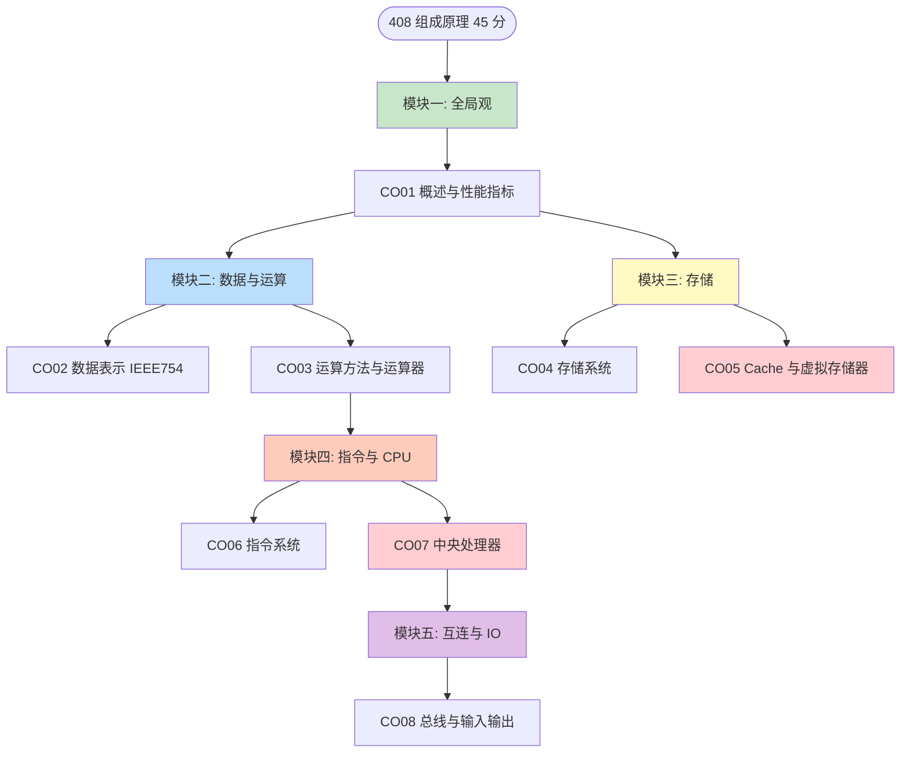

> 红色 = 大题最高频（Cache 地址划分、流水线时空图）。

---

## 🏛️ 冯·诺依曼结构与指令执行（CO01）

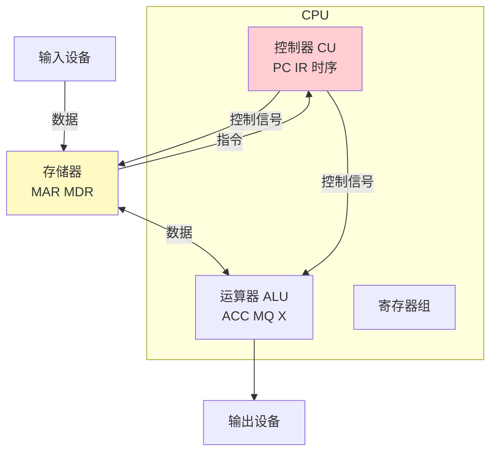

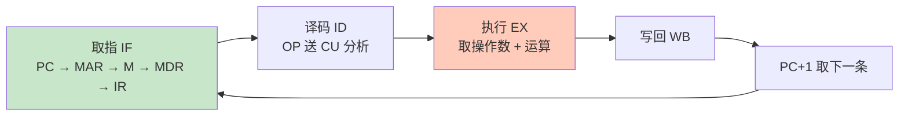

---

## 🔢 机器数与浮点（CO02）

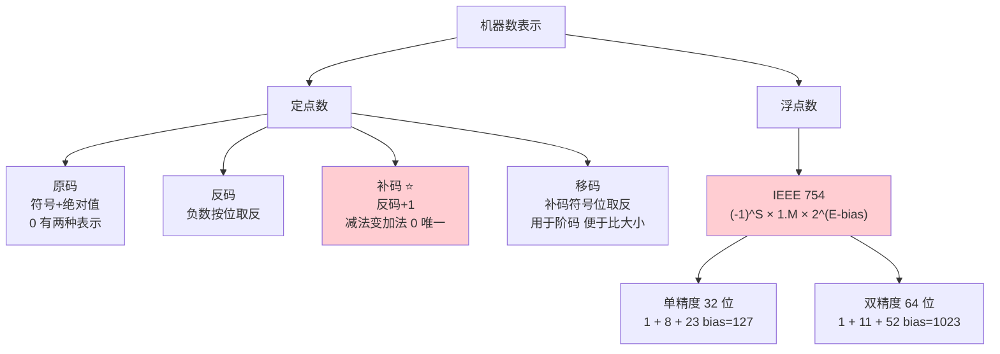

### IEEE 754 特殊值判定

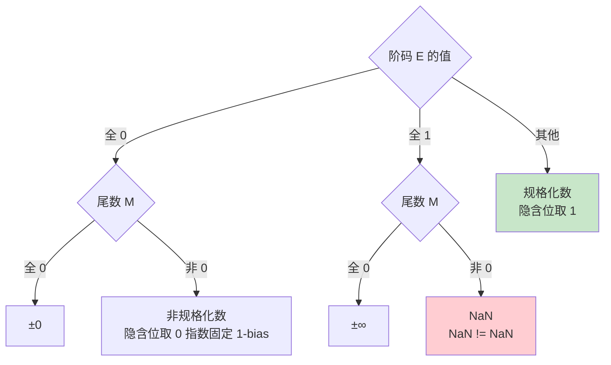

---

## ➕ 标志位与溢出判断（CO03）

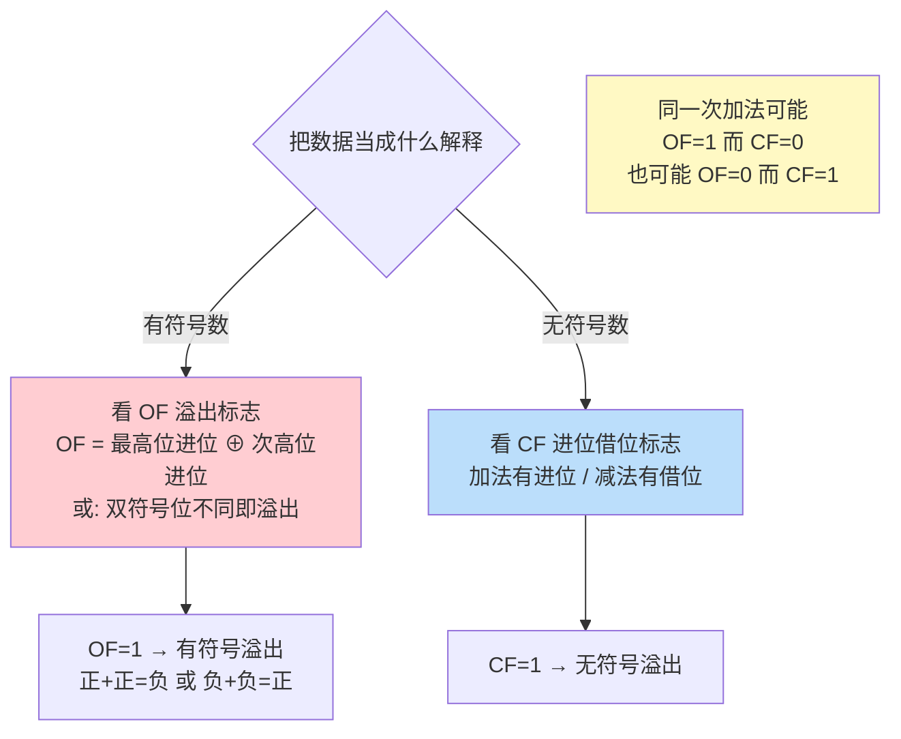

---

## 🗄️ 存储器层次（CO04-CO05）

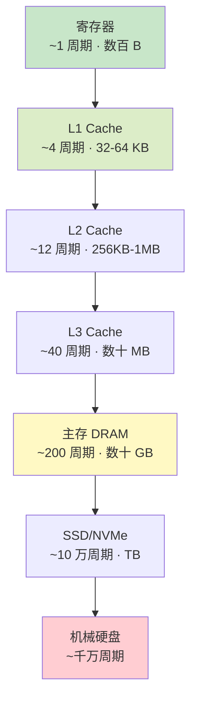

> 「越快 → 越贵 → 越小」。上层是下层的**缓存**，靠**时间局部性 + 空间局部性**才有效。

---

## 🎯 Cache 三种映射与地址划分（CO05 必考）

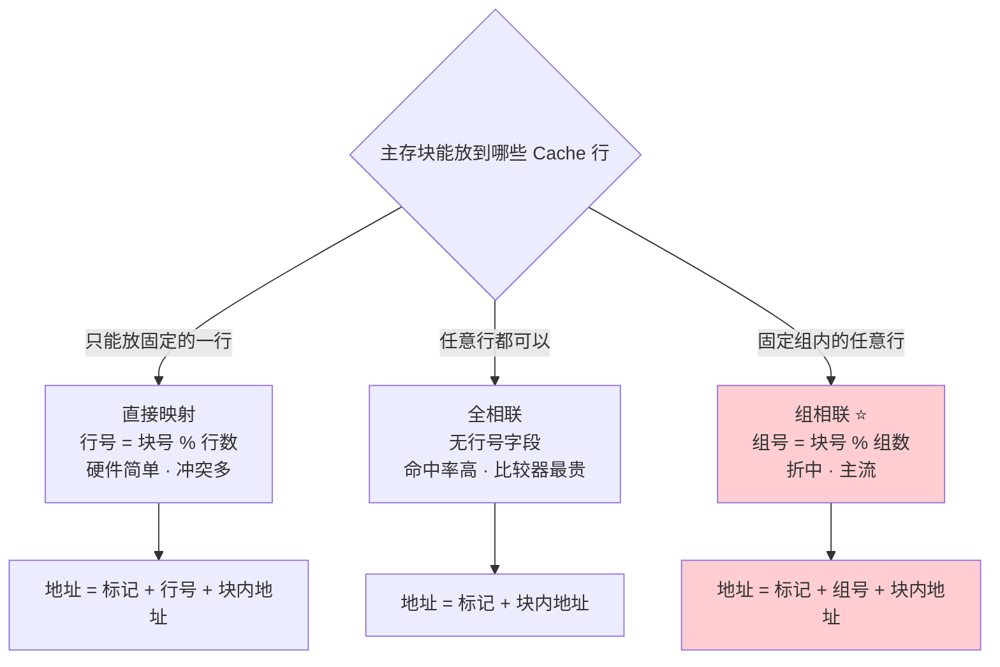

**解题三步**：① 块内地址位数 = log₂(块大小)；② 行号/组号位数 = log₂(行数 或 组数)；③ 标记位 = 物理地址总位数 − 前两者。

---

## ✍️ Cache 写策略（CO05）

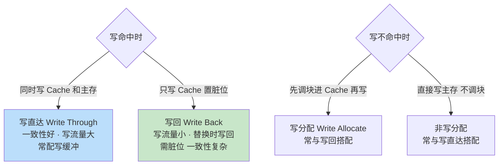

---

## 🧭 十种寻址方式（CO06）

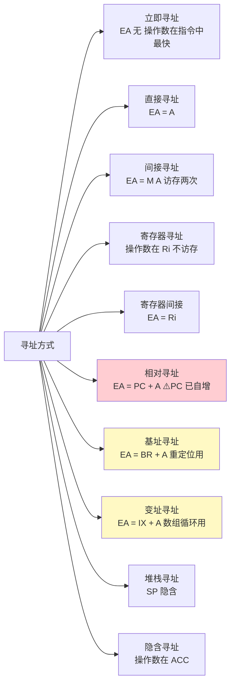

**基址 vs 变址易混点**：基址寄存器由**操作系统**填、面向**程序重定位**，形式地址是偏移；变址寄存器由**用户程序**改、面向**数组循环**，形式地址是数组首址。

---

## ⏱️ 指令周期与流水线（CO07）

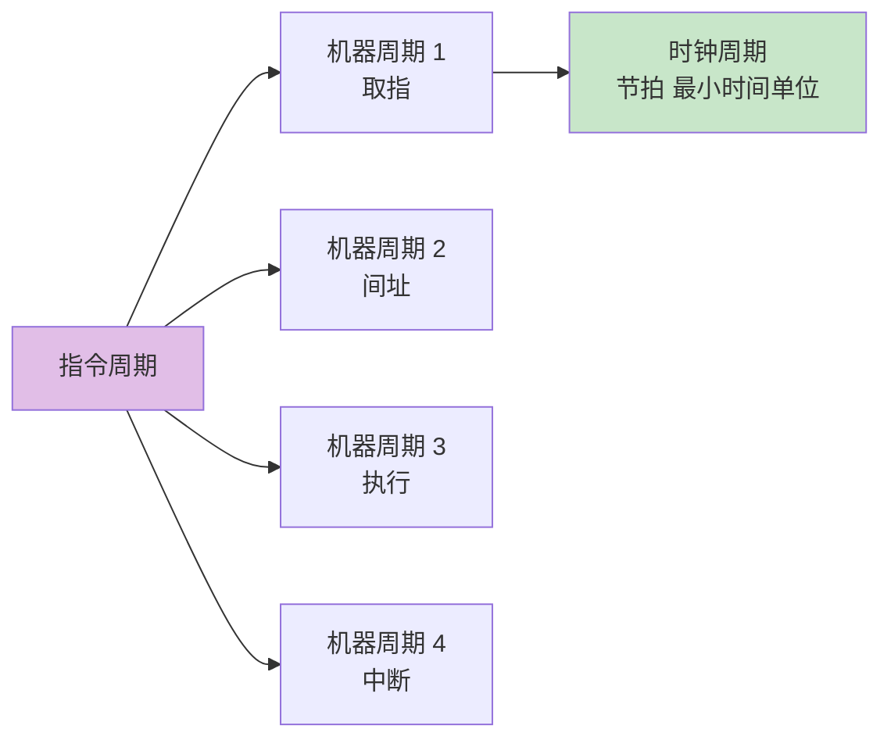

```mermaid
gantt
    title 五段流水线时空图（4 条指令）
    dateFormat X
    axisFormat %s
    section 指令1
    IF :0, 1
    ID :1, 2
    EX :2, 3
    MEM:3, 4
    WB :4, 5
    section 指令2
    IF :1, 2
    ID :2, 3
    EX :3, 4
    MEM:4, 5
    WB :5, 6
    section 指令3
    IF :2, 3
    ID :3, 4
    EX :4, 5
    MEM:5, 6
    WB :6, 7
    section 指令4
    IF :3, 4
    ID :4, 5
    EX :5, 6
    MEM:6, 7
    WB :7, 8
```

**公式**：`k` 段流水线执行 `n` 条指令，`T流水 = (k + n - 1) × Δt`；`加速比 S = (n × k × Δt) / T流水`；`效率 E = S / k`。

---

## ⚠️ 流水线三大冒险（CO07）

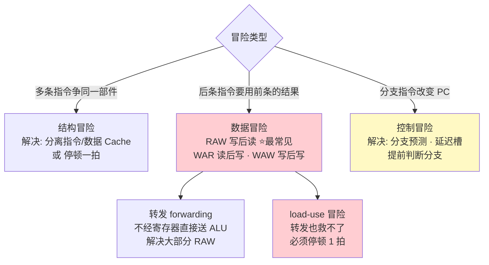

---

## 🔌 三种 I/O 方式对比（CO08）

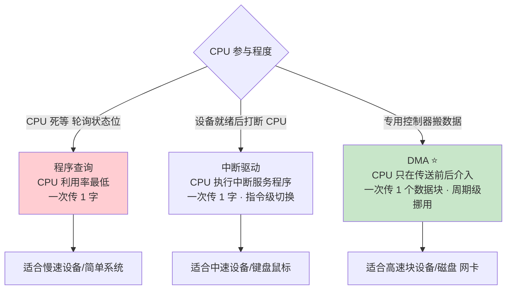

| 维度 | 中断 | DMA |
|---|---|---|
| 数据通路 | 经过 CPU 寄存器 | **不经过 CPU**，设备 ↔ 主存直连 |
| 传送单位 | 字 / 字节 | 数据块 |
| 响应时机 | 一条**指令执行结束**后 | 一个**机器周期结束**后（更快） |
| CPU 介入 | 每次传送都要执行中断服务程序 | 只在传送**开始与结束**时 |
| 优先级 | 低于 DMA | **高于中断** |

---

## 🎓 建议学习顺序

本科的关键不是"读懂"而是"**算对**"——计算题清单见 [INDEX.md 路径 C](./INDEX.md#路径-c只突击计算题1-周)。
