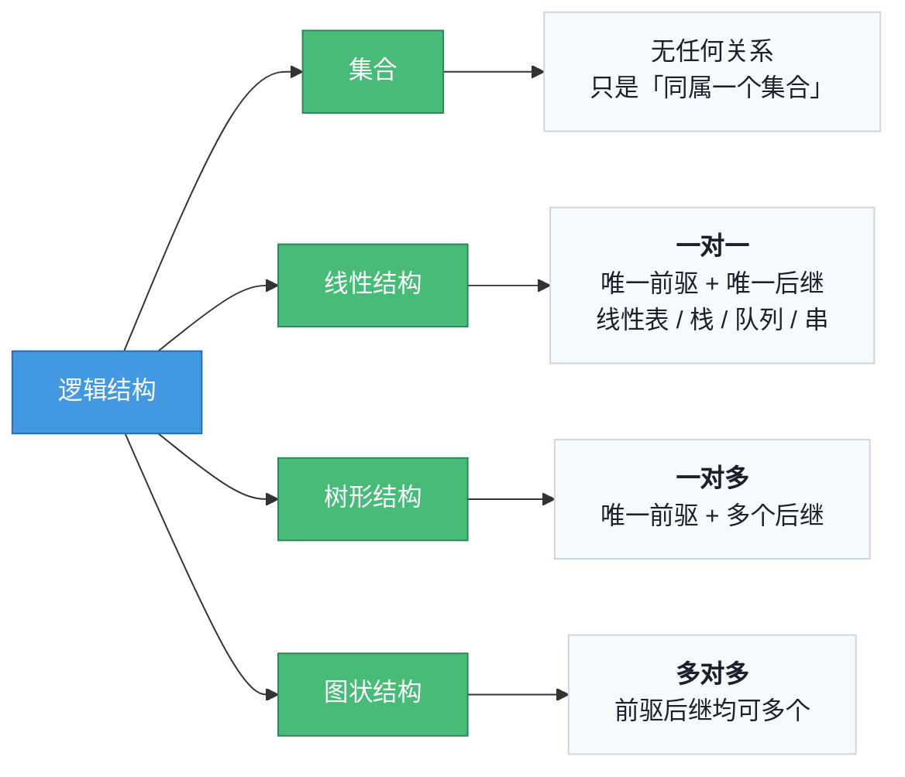
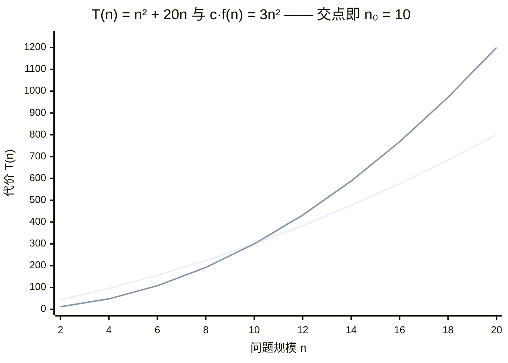
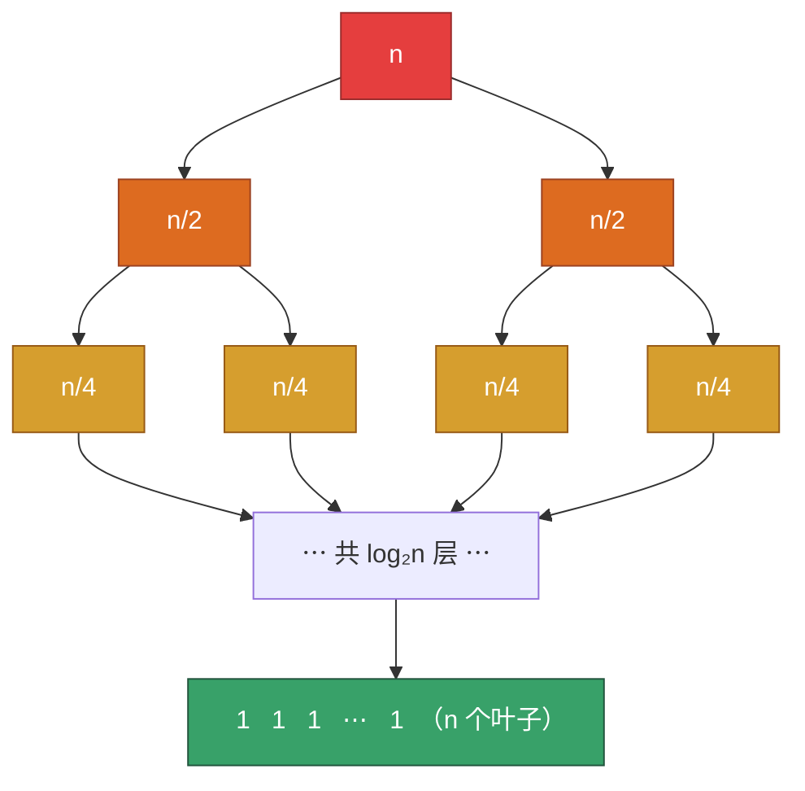

# 精通数据结构绪论与复杂度分析：抽象数据类型、渐进记号、递推求解与主定理

> 课程编号：DS01
> 路线图来源：计算机基础四大件 · 数据结构（408 第 1 章）
> 难度：⭐⭐
> 预计阅读时间：50 分钟
> 内容基准：2026 年 8 月（408 考纲第 1 章「数据结构基本概念」+「算法与算法评价」）
> **代码语言：Go**。408 考场要求用 C/C++ 描述算法，本系列用 Go 讲清逻辑，涉及两者差异处（指针、内存释放、泛型）会单独标注。

---

## 引言：两段代码，同样的答案，一万倍的差距

先看一个具体问题：给定一个整数数组，求「和最大的连续子数组的和」（力扣 53）。

最直白的写法——枚举所有区间，逐个求和：

```go
func maxSubArrayV1(a []int) int {
    best := a[0]
    for i := range a {
        for j := i; j < len(a); j++ {
            sum := 0
            for k := i; k <= j; k++ { // 第三层循环
                sum += a[k]
            }
            if sum > best {
                best = sum
            }
        }
    }
    return best
}
```

一个换了思路的写法——只扫一遍：

```go
func maxSubArrayV2(a []int) int {
    best, cur := a[0], a[0]
    for _, v := range a[1:] {
        if cur > 0 {
            cur += v // 前缀有正贡献，接着累加
        } else {
            cur = v // 前缀是负担，丢弃重开
        }
        if cur > best {
            best = cur
        }
    }
    return best
}
```

两段代码输出完全一致。但在 n = 10000 时：

| 版本 | 基本操作次数（量级） | 实测（`go test -bench`，n=10000） |
|---|---|---|
| v1 三层循环 | ≈ n³/6 ≈ 1.7 × 10¹¹ | 约 55 秒 |
| v2 单层循环 | ≈ n = 10⁴ | 约 0.00001 秒 |

差了 **200 万倍**。而且这个差距会随 n 增长继续扩大：n 翻一倍，v1 的耗时变 8 倍，v2 只变 2 倍。

这就是本章要建立的核心能力：**在写完代码之前，就能判断它在数据规模变大时会不会炸**。不是靠跑一遍试试，而是靠对代码结构的静态分析。

读完你应该能：

- 分清「数据结构」的三个层次：逻辑结构、存储结构、数据的运算
- 用 ADT（抽象数据类型）的语言描述一个数据结构，而不陷进实现细节
- 熟练用 O / Ω / Θ 记号描述算法的时间与空间复杂度，知道它们的严格定义而不是「大概就是最坏情况」
- 分析循环、递归、分治程序的复杂度，会用递推式和主定理
- 区分最好 / 最坏 / 平均 / 摊还复杂度，知道 408 默认问的是哪一种
- 避开 408 复杂度题里最常见的六个陷阱

---

## 第一章 数据结构的三个层次

### 1.1 一个绕不开的定义

408 考纲的第一句话就是数据结构的基本概念。教材（严蔚敏《数据结构》）的定义拆开看是三件事：

```
数据结构 = (D, R) + 存储 + 运算

   D  ：数据元素的有限集合
   R  ：D 上关系的有限集合          ← 逻辑结构
   存储：D 和 R 在计算机里怎么放      ← 物理结构 / 存储结构
   运算：在这个结构上能做什么         ← 数据的运算
```

这三层的关系是「同一个逻辑结构可以有多种存储结构，不同存储结构导致同一运算的效率完全不同」。选择题最爱考这一句的各种变形。

### 1.2 逻辑结构：四种



三个必须记住的细节，都是选择题原题：

- **栈和队列是线性结构**，不是「特殊结构」。它们只是限制了插入删除位置的线性表。
- **树是图的特例吗？** 从数学上，树是无环连通图；但在 408 的分类里，树形结构和图状结构是并列的两类，考试按教材分类答。
- **逻辑结构与存储无关**。线性表可以用链式存储，树可以用顺序存储（完全二叉树的数组表示），这不改变它们的逻辑结构。

### 1.3 存储结构：四种

| 存储结构 | 元素怎么放 | 关系怎么表示 | 典型代价 |
|---|---|---|---|
| **顺序存储** | 地址连续 | 靠地址相邻**隐含**表示 | 随机访问 O(1)，插删 O(n)，需要预分配 |
| **链式存储** | 地址任意 | 靠**指针显式**表示 | 插删 O(1)（已定位），访问 O(n)，指针有空间开销 |
| **索引存储** | 元素任意 + 附加索引表 | 索引项 (关键字, 地址) | 检索快，索引表占额外空间，增删要维护索引 |
| **散列存储** | 由关键字经散列函数直接算出地址 | 无需存关系 | 平均 O(1)，冲突处理是全部难点（见 [DS07](./DS07-精通-查找.md)） |

**顺序 vs 链式是全书最重要的一组对照**，后面每一章都会重复它：顺序表 vs 链表、顺序栈 vs 链栈、二叉树顺序存储 vs 二叉链表、图的邻接矩阵 vs 邻接表。

记一句话就够用：**顺序存储把「关系」编码进地址，省了指针但绑定了连续内存；链式存储把「关系」编码进指针，换来了插删灵活但丢了随机访问。**

### 1.4 抽象数据类型（ADT）

ADT = 数据对象 + 数据关系 + 基本操作，**只说「能做什么」，不说「怎么做」**。

408 常用的 ADT 伪代码写法（Go 里对应一个 interface）：

```
ADT Stack {
  数据对象：D = {a_i | a_i ∈ ElemType, i = 1..n, n ≥ 0}
  数据关系：R = {<a_{i-1}, a_i> | i = 2..n}   // 线性关系，a_n 为栈顶
  基本操作：
    InitStack(&S)          初始化空栈
    StackEmpty(S)          判空
    Push(&S, x)            入栈，若栈满返回 false
    Pop(&S, &x)            出栈并用 x 返回栈顶元素
    GetTop(S, &x)          读栈顶不删除
    DestroyStack(&S)       销毁
}
```

同一个 ADT 在 Go 里就是一个接口，底下可以是切片实现也可以是链表实现：

```go
type Stack[T any] interface {
    Push(x T)
    Pop() (T, bool)   // Go 用多返回值代替 C 的「传出参数 + bool 返回」
    Top() (T, bool)
    Empty() bool
    Len() int
}
```

为什么要有 ADT 这一层？因为它把「接口」和「实现」分开了：`Push/Pop` 的语义不变，底下可以是切片（顺序栈）也可以是链表（链栈）。这个思想在现代工程里就是 interface/trait；408 里则用来解释「同一 ADT 不同实现效率不同」。

> **工程对照**：Go 的 `sort.Interface`、C++ 的 concept、Rust 的 trait，本质都是 ADT 的落地。参见 [golang/G08 接口 itab](../../golang/G08-精通-Go-接口-itab-与类型断言.md)、[cpp/C14 Concepts](../../cpp/C14-精通-C++-Concepts.md)。

### 1.5 算法的五个特性

408 会直接考这五个词，必须能默写：

| 特性 | 含义 | 反例 |
|---|---|---|
| **有穷性** | 有限步内结束，且每步在有限时间内完成 | `while(1){}` 不是算法 |
| **确定性** | 每条指令含义唯一，相同输入必得相同输出 | 依赖随机数的严格来说是「随机算法」，另类讨论 |
| **可行性** | 每步都能由已实现的基本运算执行有限次完成 | 「求任意实数的精确值」不可行 |
| **输入** | 零个或多个输入 | 输入**可以为零个**（如打印固定图案） |
| **输出** | 一个或多个输出 | 输出**不能为零个**——没有输出的算法没有意义 |

**高频陷阱**：「算法必须有输入」是**错的**（可以是 0 个）；「算法必须有输出」是**对的**（至少 1 个）。这一对经常出现在判断题里。

好算法的目标：正确性、可读性、健壮性、高效率与低存储量。前三个靠工程习惯，后两个靠本章的分析工具。

---

## 第二章 渐进复杂度：严格定义

### 2.1 为什么不数「具体多少条指令」

同一段代码在不同机器、不同编译器、不同数据上耗时都不同。我们要的是**与机器无关、随规模增长的趋势**。做法是：

1. 选定**基本操作**（通常是最深层循环里那条语句）
2. 统计它作为问题规模 n 的函数执行了多少次，得到 T(n)
3. 只保留 T(n) 的增长数量级，丢弃常数和低阶项

例如 T(n) = 3n² + 5n + 100，当 n 很大时 3n² 占绝对主导，我们说它是 **O(n²)**。

### 2.2 三个记号的严格定义

这是 408 大题会要求写定义的地方，必须精确：

**大 O（上界，最常用）**

```
T(n) = O(f(n))   ⟺   ∃ c > 0, n₀ > 0, 使得 ∀ n ≥ n₀ 有 0 ≤ T(n) ≤ c·f(n)
```

读作「T(n) 的增长不超过 f(n) 的常数倍」。注意它是**上界**，所以 `3n² = O(n³)` 也是**正确的**（只是不够紧）。

**大 Ω（下界）**

```
T(n) = Ω(f(n))   ⟺   ∃ c > 0, n₀ > 0, 使得 ∀ n ≥ n₀ 有 0 ≤ c·f(n) ≤ T(n)
```

**大 Θ（同阶，上下界都成立）**

```
T(n) = Θ(f(n))   ⟺   T(n) = O(f(n)) 且 T(n) = Ω(f(n))
                 ⟺   ∃ c₁, c₂ > 0, n₀, 使得 ∀ n ≥ n₀ 有 c₁·f(n) ≤ T(n) ≤ c₂·f(n)
```

图上直观看。取 T(n) = n² + 20n，f(n) = n²，c = 3，则：

```
T(n) ≤ 3·f(n)  ⟺  n² + 20n ≤ 3n²  ⟺  20n ≤ 2n²  ⟺  n ≥ 10
```

所以 n₀ = 10。画出来：



读图的三个要点：

- **n < 10（交点左侧）**：`T(n)` 反而在 `3n²` **上面**——定义里的 `∀n ≥ n₀` 就是为了把这一段排除掉
- **n = 10**：两线相交，这就是 n₀
- **n > 10（交点右侧）**：`3n²` 彻底甩开 `T(n)` 并越拉越远，上界从此永久成立 → `T(n) = O(n²)` 成立

**关键理解**：渐进记号完全不关心 n 小的时候谁快。所以「O(n log n) 的快排在 n=10 时可能慢于 O(n²) 的插入排序」不矛盾——这正是工业排序库在小数组上切换到插入排序的原因（见 [DS08](./DS08-精通-排序.md)）。

### 2.3 常见复杂度的量级感

```
O(1) < O(log n) < O(√n) < O(n) < O(n log n) < O(n²) < O(n³) < O(2ⁿ) < O(n!)
```

装进脑子里的一张表（假设机器每秒做 10⁸ 次基本操作，这是现代 CPU 上一个保守但好用的估算）：

| n | O(log n) | O(n) | O(n log n) | O(n²) | O(2ⁿ) |
|---|---|---|---|---|---|
| 10 | 3 | 10 | 33 | 100 | 1024 |
| 1 000 | 10 | 10³ | 10⁴ | 10⁶ | 天文数字 |
| 10⁶ | 20 | 10⁶ | 2×10⁷ | 10¹² ≈ **3 小时** | — |
| 10⁹ | 30 | 10⁹ ≈ **10 秒** | 3×10¹⁰ | — | — |

**刷题用的反查表**（力扣/竞赛通用，1 秒时限）：

| 数据规模 n | 能接受的复杂度 | 典型解法 |
|---|---|---|
| n ≤ 10 | O(n!)、O(2ⁿ·n) | 全排列、暴搜 |
| n ≤ 20 | O(2ⁿ) | 状压 DP、子集枚举 |
| n ≤ 100 | O(n³) | Floyd、区间 DP |
| n ≤ 1 000 | O(n²) | 朴素 DP、双重循环 |
| n ≤ 10⁵ | O(n log n) | 排序、堆、二分、线段树 |
| n ≤ 10⁶ | O(n) | 单调栈、前缀和、哈希 |
| n ≥ 10⁸ | O(log n) / O(1) | 数学公式、快速幂 |

这张表比任何背诵都实用：拿到题先看 n 的范围，直接反推该往哪个复杂度想。

### 2.4 复杂度的运算法则

```
加法（顺序执行）：   O(f) + O(g) = O(max(f, g))
乘法（嵌套执行）：   O(f) × O(g) = O(f·g)
常数吸收：           O(c·f) = O(f)，  O(c) = O(1)
对数底数无关：       O(log₂ n) = O(log₁₀ n) = O(ln n) = O(log n)
```

**对数底数为什么无关**：log_a n = log_b n / log_b a，而 1/log_b a 是常数，被 O 吸收了。所以 408 里写 O(log n) 不标底数是规范的；但**指数的底数不能省**：O(2ⁿ) ≠ O(3ⁿ)。

---

## 第三章 分析非递归程序

### 3.1 基本方法：数最内层语句

```go
// 例 1：T(n) = O(n)
for i := 0; i < n; i++ { x++ }

// 例 2：T(n) = O(n²)
for i := 0; i < n; i++ {
    for j := 0; j < n; j++ { x++ }
}

// 例 3：内层依赖外层 —— T(n) = n(n+1)/2 = O(n²)
for i := 1; i <= n; i++ {
    for j := 1; j <= i; j++ { x++ }
}

// 例 4：内层与外层无关 —— 循环体执行 n × 100 次 = O(n)
for i := 0; i < n; i++ {
    for j := 0; j < 100; j++ { x++ }
}
```

### 3.2 乘除型循环 → 对数

```go
// 例 5：i 每次翻倍，执行次数 k 满足 2^k ≥ n → k = log₂n → O(log n)
for i := 1; i <= n; i *= 2 { x++ }

// 例 6：i 每次减半，同样 O(log n)
for i := n; i > 0; i /= 2 { x++ }

// 例 7：外层 O(n)、内层 O(log n) → O(n log n)
for i := 0; i < n; i++ {
    for j := 1; j <= n; j *= 2 { x++ }
}
```

**判据**：循环变量做**加减法** → 线性级；做**乘除法** → 对数级。这是最快的判断方式。

### 3.3 两道 408 经典原题

**原题一**（考过多次的变形）：

```go
i := 1
for i <= n {
    i = i * 3
}
```

`i` 的取值序列是 1, 3, 9, ..., 3^k。循环在 3^k > n 时停，故执行次数 = ⌊log₃ n⌋ + 1，**T(n) = O(log₃ n) = O(log n)**。

**原题二**（易错，答案不是 O(n³)）：

```go
m := 0
for i := 1; i <= n; i++ {
    for j := 1; j <= 2*i; j++ {
        m++
    }
}
```

内层次数：2·1 + 2·2 + ... + 2·n = 2 · n(n+1)/2 = n² + n，**T(n) = O(n²)**。这题的坑在于「2*i」会让人误以为变成 O(n³)——系数不改变阶。

**原题三**（真正的难点，2019 年真题风格）：

```go
count := 0
for i := 1; i <= n; i++ {
    for j := 1; j <= n/i; j++ { // 注意上界是 n/i
        count++
    }
}
```

总次数 = n/1 + n/2 + ... + n/n = n · (1 + 1/2 + ... + 1/n) = n · H(n) ≈ n·ln n。

**T(n) = O(n log n)**。这里用到了调和级数 H(n) ≈ ln n + γ 的结论——408 大题里出现「累加 n/i」形式时几乎都是这个套路（筛法、约数枚举都是）。

### 3.4 while 循环与两个指针

```go
// 双指针：i 和 j 各自单调移动，各最多走 n 步 → O(n)，不是 O(n²)
i, j := 0, len(a)-1
for i < j {
    if a[i]+a[j] > target {
        j--
    } else {
        i++
    }
}
```

**看嵌套层数会得出错误答案**。正确方法是**总量分析（amortized counting）**：`i` 单调增、`j` 单调减，两者总移动量 ≤ n，所以 O(n)。滑动窗口、单调栈的复杂度全靠这个论证。

> 这个分析思路在 [algorithm/04 双指针](../../algorithm/04-精通-双指针.md) 和 [algorithm/05 滑动窗口](../../algorithm/05-精通-滑动窗口.md) 里有大量应用。

---

## 第四章 分析递归程序

### 4.1 从代码到递推式

递归程序的复杂度用**递推式（recurrence）**表达，然后求解。

```go
// 阶乘：T(n) = T(n-1) + O(1)
func fact(n int) int {
    if n <= 1 {
        return 1
    }
    return n * fact(n-1)
}

// 二分查找：T(n) = T(n/2) + O(1)
func bsearch(a []int, lo, hi, key int) int {
    if lo > hi {
        return -1
    }
    mid := lo + (hi-lo)/2 // 防溢出写法，别写 (lo+hi)/2
    switch {
    case a[mid] == key:
        return mid
    case a[mid] < key:
        return bsearch(a, mid+1, hi, key)
    default:
        return bsearch(a, lo, mid-1, key)
    }
}

// 归并排序：T(n) = 2T(n/2) + O(n)
// 斐波那契（朴素）：T(n) = T(n-1) + T(n-2) + O(1)
```

### 4.2 方法一：展开（迭代）法

以归并排序 T(n) = 2T(n/2) + n，T(1) = 1 为例：

```
T(n) = 2T(n/2)   + n
     = 2[2T(n/4) + n/2] + n           = 4T(n/4)   + 2n
     = 4[2T(n/8) + n/4] + 2n          = 8T(n/8)   + 3n
     ...
     = 2^k · T(n/2^k) + k·n

令 n/2^k = 1 ⟹ k = log₂n：
T(n) = n·T(1) + n·log₂n = n + n·log₂n = O(n log n)
```

**展开法的三步**：反复代入 → 找到通项中 k 的规律 → 用边界条件确定 k。

### 4.3 方法二：递归树

把 T(n) = 2T(n/2) + n 画成树，每个节点标「该子问题**自己**花的代价」（不含子调用）：



逐层把代价加起来：

| 层级 | 节点数 | 每节点代价 | **该层总代价** |
|---|---|---|---|
| 0 | 1 | n | **n** |
| 1 | 2 | n/2 | **n** |
| 2 | 4 | n/4 | **n** |
| … | … | … | … |
| log₂n | n | 1 | **n** |
| | | 合计 | **n × (log₂n + 1) = O(n log n)** |

递归树的价值在于**一眼看出「每层代价」的分布**：

- 每层相等（如上）→ 总代价 = 层数 × 每层 = O(n log n)
- 逐层递减成等比 → 总代价由**根**主导
- 逐层递增成等比 → 总代价由**叶**主导

这正是主定理三种情况的直观来源。

### 4.4 方法三：主定理（Master Theorem）

对形如

```
T(n) = a·T(n/b) + f(n)        （a ≥ 1, b > 1）
```

的递推式，比较 f(n) 与 n^(log_b a)：

| 情况 | 条件 | 结论 | 直观 |
|---|---|---|---|
| 1 | f(n) = O(n^(log_b a − ε))，ε>0 | T(n) = Θ(n^(log_b a)) | 叶子主导 |
| 2 | f(n) = Θ(n^(log_b a)) | T(n) = Θ(n^(log_b a) · log n) | 每层相等 |
| 3 | f(n) = Ω(n^(log_b a + ε))，且 a·f(n/b) ≤ c·f(n)（c<1） | T(n) = Θ(f(n)) | 根主导 |

**用法就是算一个数 log_b a，再和 f(n) 比大小。** 四个例子：

| 递推式 | a, b | n^(log_b a) | f(n) | 情况 | 结果 |
|---|---|---|---|---|---|
| T(n)=2T(n/2)+n | 2, 2 | n¹ = n | n | 2 | **Θ(n log n)**（归并排序） |
| T(n)=T(n/2)+1 | 1, 2 | n⁰ = 1 | 1 | 2 | **Θ(log n)**（二分查找） |
| T(n)=4T(n/2)+n | 4, 2 | n² | n | 1 | **Θ(n²)** |
| T(n)=2T(n/2)+n² | 2, 2 | n | n² | 3 | **Θ(n²)** |

**主定理不适用的情形**（408 里出现就要改用展开法）：

- T(n) = T(n−1) + n 这类**减法**递推（不是 n/b 形式）→ 展开得 O(n²)
- T(n) = 2T(n/2) + n log n，f(n) 恰好只比 n^(log_b a) 大一个 log 因子，落在情况 2 和 3 的**缝隙**里 → 结果是 Θ(n log²n)，需用扩展主定理或递归树

**Strassen 矩阵乘法**是主定理的漂亮应用：T(n) = 7T(n/2) + O(n²)，log₂7 ≈ 2.807 > 2，情况 1，得 Θ(n^2.807) —— 打破了朴素三重循环的 Θ(n³)。

### 4.5 递归的空间复杂度：别忘了栈

```go
func sum(n int) int {
    if n == 0 {
        return 0
    }
    return n + sum(n-1)
}
// 时间 O(n)，空间 O(n) —— 递归深度 n 层，每层一个栈帧
```

**递归的空间复杂度 = 递归深度 × 单帧大小**。这是 408 高频考点，也是工程里爆栈的根源：

| 算法 | 时间 | 空间 | 空间来源 |
|---|---|---|---|
| 归并排序 | O(n log n) | **O(n)** | 辅助数组 O(n) 支配递归栈 O(log n) |
| 快速排序 | O(n log n) 平均 | **O(log n)** 平均，最坏 O(n) | 纯递归栈；有序输入退化成 n 层 |
| 二分查找（递归） | O(log n) | O(log n) | 递归栈 |
| 二分查找（迭代） | O(log n) | **O(1)** | 无栈 |

**尾递归**（递归调用是函数最后一个动作）理论上可优化成循环、空间降为 O(1)，但 **Go 明确不做尾调用优化**（GCC/Clang 在 -O2 下常做，但也不是语言保证）。408 答题按「递归深度」算空间，工程里则该手动改写成循环。

> **Go 特有的一点**：goroutine 栈是**可增长**的（初始 2 KB，按需翻倍拷贝，上限默认 1 GB / 64 位）。所以 Go 里深递归不像 C 那样固定 8 MB 就爆，而是先变慢（栈拷贝）再触发 `goroutine stack exceeds limit` panic。这不改变 O(n) 的空间分析，但改变了「爆栈」的表现形式。细节见 [golang/G11 GMP 调度](../../golang/G11-精通-Goroutines-与-GMP-调度.md)。

---

## 第五章 最好 / 最坏 / 平均 / 摊还

### 5.1 四个概念

以顺序查找为例（在长度 n 的无序切片里找 key）：

```go
func search(a []int, key int) int {
    for i, v := range a {
        if v == key {
            return i
        }
    }
    return -1
}
```

| 类型 | 定义 | 顺序查找 |
|---|---|---|
| **最好** | 最有利输入下的复杂度 | O(1)（第一个就是） |
| **最坏** | 最不利输入下的复杂度 | O(n)（在末尾或不存在） |
| **平均** | 各输入按概率加权的期望 | (1+2+...+n)/n = (n+1)/2 = O(n) |
| **摊还** | 一系列操作的总代价 ÷ 操作数 | 不适用（单次操作） |

**408 的默认约定**：不特别说明时，「时间复杂度」指**最坏情况**。但排序算法的复杂度表会同时列最好/最坏/平均，需要分别记。

### 5.2 摊还分析：动态数组扩容

摊还（amortized）分析是最容易被误解的一个。看动态数组的追加操作——Go 里就是 `append`，把它的内部逻辑手写出来：

```go
type Vector struct {
    data []int // 底层数组
    size int   // 已用元素数
}

func (v *Vector) PushBack(x int) {
    if v.size == cap(v.data) { // 满了就扩容
        newCap := cap(v.data) * 2
        if newCap == 0 {
            newCap = 1
        }
        grown := make([]int, newCap)  // 申请新数组
        copy(grown, v.data[:v.size])  // ★ 拷贝全部旧元素 —— O(n)
        v.data = grown
    }
    v.data = v.data[:v.size+1]
    v.data[v.size] = x
    v.size++
}
```

单次 `PushBack` 的**最坏**复杂度是 O(n)（触发扩容要拷贝全部元素）。但连续 n 次 `PushBack` 的**总**代价：

```
拷贝发生在 size = 1, 2, 4, 8, ..., 2^k ≤ n 时，各拷贝对应元素个数：
总拷贝量 = 1 + 2 + 4 + ... + 2^k < 2n = O(n)

n 次操作总代价 = O(n) 拷贝 + O(n) 写入 = O(n)
摊还到每次操作 = O(n)/n = O(1)
```

**结论：动态数组追加的摊还复杂度是 O(1)。**

**为什么必须是「翻倍」而不是「每次 +1」**：若每次只加 1 个容量，拷贝量 = 1+2+...+n = O(n²)，摊还成 O(n)。这就是所有动态数组都用**成倍扩容**的原因。

> **Go 的真实策略比翻倍更细**：`runtime.growslice` 在旧容量 < 256 时约翻倍，≥ 256 后按约 1.25 倍渐进增长（`newcap += (newcap + 3*256)/4`），在「少拷贝」和「少浪费内存」之间折中。倍率只要是**大于 1 的常数**，摊还就是 O(1)——1.25 和 2 都满足，只是常数不同。完整推导见 [golang/G03 切片扩容机制](../../golang/G03-精通-Go-切片-底层结构与扩容机制.md)。
>
> 顺带一个实用结论：**已知最终长度时用 `make([]T, 0, n)` 预分配**，可以把 O(n) 次拷贝彻底消掉。这是 Go 代码 review 里最常见的性能建议之一。

**摊还 ≠ 平均**：

| | 依赖什么 | 保证强度 |
|---|---|---|
| **平均复杂度** | 输入的**概率分布**假设 | 概率意义上的期望，可能失效 |
| **摊还复杂度** | 操作**序列**的确定性总量 | 确定性上界，任何序列都成立 |

摊还是更强的保证——它不假设输入分布，是对任意 n 次操作序列的严格上界。

### 5.3 空间复杂度：原地与否

**空间复杂度只算「辅助空间」，不算输入本身占的空间。**

```go
// S(n) = O(1) —— 原地算法（in-place）
func reverse(a []int) {
    for i, j := 0, len(a)-1; i < j; i, j = i+1, j-1 {
        a[i], a[j] = a[j], a[i] // Go 的多重赋值，不需要临时变量
    }
}

// S(n) = O(n) —— 需要等长辅助切片
func reverseCopy(a []int) []int {
    b := make([]int, len(a)) // ← 这 n 个元素就是辅助空间
    for i := range a {
        b[i] = a[len(a)-1-i]
    }
    return b
}
```

408 排序章的「是否原地」直接来自这个定义：冒泡/插入/选择/堆排 O(1)，快排 O(log n)（栈），归并 O(n)，基数排序 O(n+r)。

---

## 第六章 408 高频考点与陷阱清单

### 6.1 考点分布

第 1 章在 408 里通常是 **2 道选择题（4 分）**，外加大题里「分析你写的算法的时空复杂度」这一问（3–5 分）。考法固定：

1. 给一段带循环/递归的代码，问时间复杂度
2. 给数据结构的概念判断（逻辑结构 vs 存储结构、算法五特性）
3. 大题末尾必问「说明你所设计算法的时间和空间复杂度」——**这一问是白送分，千万不要漏答**

### 6.2 陷阱清单

**陷阱 1：把「嵌套层数」当复杂度**

```go
for i := 0; i < n; i++ {
    for j := 0; j < n; j++ {
        if j > i {
            break // 内层实际只走 i+1 次以内
        }
    }
}
```
两层循环，但实际是 O(n²)/2 → 仍是 O(n²)。反过来双指针虽是一层 for 却容易被数成 O(n²)。**必须数「基本操作总执行次数」，不是数缩进层数。**

**陷阱 2：忘记递归的栈空间**

「快速排序的空间复杂度是 O(1)」——**错**。它不用辅助数组，但递归栈平均 O(log n)、最坏 O(n)。

**陷阱 3：以为 O 是「最坏情况」的同义词**

O 是**上界**记号，可以用于描述任何情况。「平均时间复杂度是 O(n log n)」是完全合法的表述。「最坏情况」是对**输入**的限定，「大 O」是对**函数增长**的限定，两者是不同维度。

**陷阱 4：认为对数底数重要**

O(log₂n) = O(log₁₀n) = O(log n)。但 **O(2ⁿ) ≠ O(3ⁿ)**，指数底数不可省。同理 O(n^2) ≠ O(n^3)。

**陷阱 5：忽略输入规模的定义**

判断「n 是不是素数」的试除法：

```go
func isPrime(n int) bool {
    if n < 2 {
        return false
    }
    for i := 2; i*i <= n; i++ { // 只需试到 √n
        if n%i == 0 {
            return false
        }
    }
    return true
}
```
按**数值 n** 算是 O(√n)；但按**输入位数** m = log n 算是 O(2^(m/2))，即**指数级**。这是「伪多项式时间」，也是 0-1 背包 O(nW) 被称作伪多项式的原因。408 一般按数值算 O(√n)，但概念要清楚。

**陷阱 6：常数项在工程里其实很重要**

O(n) 的链表遍历常常慢于 O(n log n) 的数组排序——因为链表每次跳转都可能 cache miss，而数组顺序访问对预取器友好。渐进分析故意忽略常数，工程上不能忽略。

> 这层「理论 vs 硬件」的落差，见 [CO05 Cache 与虚拟存储器](../computer-organization/CO05-精通-Cache-与虚拟存储器.md)。数据结构里最典型的体现：B+ 树用 O(log_B n) 打败 O(log₂ n) 的 AVL 树，靠的不是阶数而是每次 I/O 拿一整块（见 [DS07](./DS07-精通-查找.md)）。

### 6.3 一张必背复杂度速查表

| 操作 / 算法 | 时间 | 空间 |
|---|---|---|
| 数组随机访问 | O(1) | — |
| 数组中间插入/删除 | O(n) | O(1) |
| 链表按位查找 | O(n) | O(1) |
| 链表已定位插删 | O(1) | O(1) |
| 顺序查找 | O(n) | O(1) |
| 二分查找（有序） | O(log n) | O(1) 迭代 |
| BST 查找（平衡 / 退化） | O(log n) / O(n) | O(h) |
| 散列表查找（平均 / 最坏） | O(1) / O(n) | O(n) |
| 冒泡/插入/选择排序 | O(n²) | O(1) |
| 快速排序（平均 / 最坏） | O(n log n) / O(n²) | O(log n) / O(n) |
| 归并排序 | O(n log n) | O(n) |
| 堆排序 | O(n log n) | O(1) |
| 建堆（自底向上） | **O(n)** | O(1) |
| 图 DFS/BFS（邻接表） | O(V + E) | O(V) |
| Dijkstra（堆优化） | O((V+E) log V) | O(V) |
| Floyd | O(V³) | O(V²) |

**「建堆是 O(n) 而不是 O(n log n)」是高频考点**，证明见 [DS08 排序](./DS08-精通-排序.md)。

---

## 第七章 力扣实战题单

复杂度分析不是纸上功夫。下面这批题的共同点是：**同一题有多个复杂度层级的解法，正好用来练「看 n 猜复杂度」**。

### 必刷档（5 题，务必手写到 AC）

| 题号 | 题目 | 练什么 | 目标复杂度 |
|---|---|---|---|
| 53 | [最大子数组和](https://leetcode.cn/problems/maximum-subarray/) | 从 O(n³) → O(n²) → O(n) 的完整降阶过程 | O(n) / O(1) |
| 704 | [二分查找](https://leetcode.cn/problems/binary-search/) | 递推式 T(n)=T(n/2)+1，边界与防溢出 | O(log n) / O(1) |
| 26 | [删除有序数组中的重复项](https://leetcode.cn/problems/remove-duplicates-from-sorted-array/) | 双指针的总量分析、原地即 O(1) 空间 | O(n) / O(1) |
| 121 | [买卖股票的最佳时机](https://leetcode.cn/problems/best-time-to-buy-and-sell-stock/) | 暴力 O(n²) vs 一次遍历 O(n) | O(n) / O(1) |
| 283 | [移动零](https://leetcode.cn/problems/move-zeroes/) | 原地操作、写指针技巧 | O(n) / O(1) |

**53 题的 Go 参考实现**（对应上文 v2）：

```go
func maxSubArray(nums []int) int {
    best, cur := nums[0], nums[0]
    for _, v := range nums[1:] {
        if cur > 0 {
            cur += v
        } else {
            cur = v          // 前缀是负担，丢掉重新开始
        }
        if cur > best {
            best = cur
        }
    }
    return best
}
// 时间 O(n)，空间 O(1)
```

### 进阶档（4 题）

| 题号 | 题目 | 练什么 |
|---|---|---|
| 509 | [斐波那契数](https://leetcode.cn/problems/fibonacci-number/) | 朴素递归 O(2ⁿ) → 记忆化 O(n) → 迭代 O(1) 空间 → 矩阵快速幂 O(log n) |
| 50 | [Pow(x, n)](https://leetcode.cn/problems/powx-n/) | 快速幂：T(n)=T(n/2)+1 → O(log n)，注意 n 为负与 INT_MIN |
| 240 | [搜索二维矩阵 II](https://leetcode.cn/problems/search-a-2d-matrix-ii/) | 从右上角走：O(m+n)，用总量分析证明 |
| 215 | [数组中的第 K 个最大元素](https://leetcode.cn/problems/kth-largest-element-in-an-array/) | 堆 O(n log k) vs 快速选择平均 O(n)（主定理 T(n)=T(n/2)+n） |

**[509 斐波那契](https://leetcode.cn/problems/fibonacci-number/) 的四层复杂度**，是理解递推式最好的单题：

```go
// v1 朴素递归：T(n) = T(n-1) + T(n-2) + O(1) → O(φⁿ) ≈ O(1.618ⁿ)
func fib1(n int) int {
    if n < 2 { return n }
    return fib1(n-1) + fib1(n-2)
}

// v2 记忆化：每个状态算一次 → O(n) 时间，O(n) 空间
func fib2(n int) int {
    memo := make([]int, n+1)
    var f func(int) int
    f = func(k int) int {
        if k < 2 { return k }
        if memo[k] != 0 { return memo[k] }
        memo[k] = f(k-1) + f(k-2)
        return memo[k]
    }
    return f(n)
}

// v3 迭代滚动：O(n) 时间，O(1) 空间 —— 只留两个变量
func fib3(n int) int {
    a, b := 0, 1
    for i := 0; i < n; i++ {
        a, b = b, a+b
    }
    return a
}

// v4 矩阵快速幂：O(log n) —— [[1,1],[1,0]]^n 的推论
```

v1 → v3 的路径（暴搜 → 记忆化 → 递推 → 滚动数组）就是**动态规划的标准演化路线**，见 [algorithm/15 动态规划基础](../../algorithm/15-精通-动态规划基础.md)。

### 挑战档（2 题）

| 题号 | 题目 | 练什么 |
|---|---|---|
| 4 | [寻找两个正序数组的中位数](https://leetcode.cn/problems/median-of-two-sorted-arrays/) | 硬性要求 O(log(m+n))，二分「割点」而非二分值 |
| 84 | [柱状图中最大的矩形](https://leetcode.cn/problems/largest-rectangle-in-histogram/) | 单调栈 O(n)：每个元素最多进出栈一次的摊还论证 |

**[84 题](https://leetcode.cn/problems/largest-rectangle-in-histogram/)的摊还论证**（正是 §5.2 的思想）：单调栈里每个下标最多入栈一次、出栈一次，总操作 ≤ 2n，虽然代码里 while 套在 for 里，**仍是 O(n) 而非 O(n²)**。这个论证套路在 [algorithm/10 栈与队列](../../algorithm/10-精通-栈与队列.md) 有完整推导。

### 题单进度自查

刷完回来对一下——能对每题回答这三问，本章才算过：

1. 我的解法的**基本操作**是什么？它执行了多少次？
2. 换成 n = 10⁶ 会怎样？对照 §2.3 的反查表，我的复杂度够用吗？
3. 空间用了多少？**递归栈算进去了吗**？

---

## 第八章 练习题

### 选择题

**1.** 以下说法正确的是：
A. 数据的逻辑结构与存储结构一一对应
B. 算法必须有输入和输出
C. 栈是一种非线性结构
D. 同一逻辑结构可以有多种存储结构

**2.** 下列程序段的时间复杂度是：
```go
i, s := 0, 0
for s < n {
    i++
    s += i
}
```
A. O(log n)　B. O(√n)　C. O(n)　D. O(n log n)

**3.** T(n) = 3T(n/3) + n 的解是：
A. Θ(n)　B. Θ(n log n)　C. Θ(n log₃n) 与 B 不同阶　D. Θ(n²)

**4.** 关于摊还复杂度，正确的是：
A. 摊还复杂度就是平均复杂度
B. 摊还分析需要假设输入的概率分布
C. 动态数组 push_back 的摊还复杂度是 O(1)，单次最坏是 O(n)
D. 摊还复杂度总是等于最坏复杂度

**5.** 下列排序算法中，空间复杂度为 O(n) 的是：
A. 堆排序　B. 快速排序　C. 归并排序　D. 希尔排序

### 计算题

**6.** 分析下列程序段的时间复杂度，写出推导过程：
```go
count := 0
for i := 1; i <= n; i *= 2 {
    for j := 1; j <= i; j++ {
        count++
    }
}
```

**7.** 用递归树和主定理两种方法求解 T(n) = 3T(n/4) + n²。

**8.** 某算法的递推式为 T(n) = T(n−1) + n，T(1) = 1。求 T(n) 的精确表达式与渐进复杂度。说明为什么不能用主定理。

### 答案与解析

<details>
<summary>点击展开</summary>

**1. D**

A 错：同一逻辑结构可有多种存储结构（线性表既可顺序也可链式），不是一一对应。
B 错：算法可以有 **0 个输入**，但必须有 ≥1 个输出。
C 错：栈是线性结构（限定了插删位置的线性表）。
D 对。

**2. B**

`s` 的值序列是 1, 1+2, 1+2+3, ..., 即第 k 次迭代后 s = k(k+1)/2。循环在 k(k+1)/2 ≥ n 时停止，故 k ≈ √(2n)，**T(n) = O(√n)**。

这题的坑：看到 `i++` 容易答 O(n)，但控制循环的是 `s` 的**平方级增长**。

**3. B**

a=3, b=3, log₃3 = 1, n^1 = n = f(n) → 主定理情况 2 → **Θ(n log n)**。

C 是干扰项：Θ(n log₃n) 与 Θ(n log n) **同阶**（底数差异被常数吸收），所以「与 B 不同阶」的说法错误。

**4. C**

摊还 ≠ 平均：摊还是对操作**序列**总代价的确定性分摊，不假设概率分布（排除 A、B）。也不总等于最坏（push_back 单次最坏 O(n)，摊还 O(1)，排除 D）。

**5. C**

堆排序 O(1)；快速排序 O(log n)（递归栈，最坏 O(n)）；**归并排序 O(n)**（辅助数组）；希尔排序 O(1)。

**6. O(n)**

外层 i 取 1, 2, 4, ..., 2^k（k = ⌊log₂n⌋），内层执行 i 次。总次数：

```
1 + 2 + 4 + ... + 2^k = 2^(k+1) − 1 < 2·2^k ≤ 2n
```

等比数列求和，**T(n) = O(n)**。

这是经典易错题：看到「双重循环 + 一层是 log」，很多人答 O(n log n)。但内层次数随外层**等比增长**，等比数列的和由**最后一项**主导，所以是 O(n)。对比 §3.2 例 7（内层固定 log n 次）才是 O(n log n)。

**7. Θ(n²)**

*主定理*：a=3, b=4, log₄3 ≈ 0.79，n^0.79。f(n) = n² = Ω(n^(0.79+ε))，且正则条件 3·(n/4)² = 3n²/16 ≤ c·n²（取 c = 3/16 < 1）成立 → 情况 3 → **Θ(n²)**。

*递归树*：第 i 层有 3^i 个节点，每个规模 n/4^i，代价 (n/4^i)²，该层总代价 = 3^i · n²/16^i = n²·(3/16)^i。

```
总代价 = n² · Σ(3/16)^i ≤ n² · 1/(1 − 3/16) = (16/13)·n² = Θ(n²)
```

等比公比 3/16 < 1，**根节点主导**，与主定理情况 3 的直观一致。

**8. T(n) = n(n+1)/2，即 Θ(n²)**

展开：

```
T(n) = T(n-1) + n
     = T(n-2) + (n-1) + n
     = ...
     = T(1) + 2 + 3 + ... + n
     = 1 + (2 + 3 + ... + n)
     = n(n+1)/2
```

**不能用主定理的原因**：主定理只适用于 T(n) = a·T(n/b) + f(n) 形式，即子问题规模是原问题的**常数分之一**（除法递推）。这里是 T(n−1)，规模只**减 1**（减法递推），不满足形式要求。减法递推要用展开法，或查「减法递推的三种情形」结论。

</details>

---

## 小结

| 要点 | 一句话 |
|---|---|
| 三个层次 | 逻辑结构（关系）→ 存储结构（怎么放）→ 运算（能做什么） |
| 顺序 vs 链式 | 关系编码进地址 vs 编码进指针，全书反复出现的主线 |
| 大 O 定义 | ∃c,n₀, ∀n≥n₀: T(n) ≤ c·f(n)。上界，不等于最坏情况 |
| 循环判据 | 变量加减 → 线性；变量乘除 → 对数；等比累加 → 由最后项主导 |
| 递归三法 | 展开法（万能）、递归树（看分布）、主定理（快，但只管 n/b 形式） |
| 空间别漏栈 | 递归空间 = 深度 × 帧；快排 O(log n) 不是 O(1) |
| 摊还 ≠ 平均 | 摊还是序列总量的确定性分摊；平均依赖概率分布 |
| 408 默认 | 不说明时「复杂度」= 最坏情况；大题末尾必答时空复杂度 |

**下一章** → [DS02 线性表：顺序表与链表](./DS02-精通-线性表.md)，把本章的「顺序 vs 链式」落到第一个具体结构上。

---

## 延伸阅读

- 《数据结构（C 语言版）》严蔚敏 第 1 章 —— 408 指定教材，ADT 描述法的来源
- 《算法导论》第 3 章（渐进记号）、第 4 章（分治与主定理）、第 17 章（摊还分析）—— 主定理的完整证明与摊还分析的三种方法（聚合、记账、势能）
- [Big-O Cheat Sheet](https://www.bigocheatsheet.com/) —— 常见结构与算法复杂度速查
- [VisuAlgo](https://visualgo.net/zh) —— 数据结构与算法动画，本系列每章都推荐配合使用
- 本仓库对照：[algorithm/01 复杂度分析与算法面试方法论](../../algorithm/01-精通-复杂度分析与算法面试方法论.md) —— 同一主题的**面试视角**版本，侧重「怎么在白板上说清复杂度」
