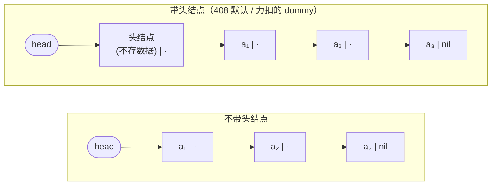
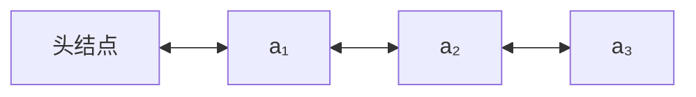

# 精通线性表：顺序表与链表的存储、运算与代价权衡

> 课程编号：DS02
> 路线图来源：计算机基础四大件 · 数据结构（408 第 2 章）
> 难度：⭐⭐⭐
> 预计阅读时间：60 分钟
> 内容基准：2026 年 7 月（408 考纲第 2 章「线性表」）
> **代码语言：Go**。408 考场要求用 C/C++ 描述算法，本章用 Go 讲清逻辑，两者的关键差异（指针语法、内存释放）在 §6.4 单独对照。

---

## 引言：为什么「链表插入 O(1)」这句话有一半是错的

几乎所有教材都会给出这张对照表：

| | 顺序表 | 链表 |
|---|---|---|
| 插入删除 | O(n) | **O(1)** |

于是很多人得出结论「频繁插删就该用链表」。但下面这段代码——在链表中间插入一个元素——真的是 O(1) 吗？

```go
// 在第 i 个位置插入元素 e（带头结点的单链表）
func (l *LinkList) Insert(i int, e int) bool {
    p := l.head
    for j := 0; p != nil && j < i-1; j++ { // ← 这一步是 O(n)
        p = p.Next
    }
    if p == nil {
        return false
    }
    s := &LNode{Data: e}   // ← 还有一次堆分配
    s.Next = p.Next        // ← 这两行才是 O(1)
    p.Next = s
    return true
}
```

真实成本 = **O(n) 的定位** + O(1) 的指针改写 + 一次堆分配。整体仍是 **O(n)**。

那 O(1) 从哪来？它成立的前提是**你已经握着那个位置的指针**——比如你正在遍历过程中删除、或者你从别处（map、LRU 的索引）拿到了节点指针。这个前提在教材表格里被省略了，于是这句话被无数人误用。

反过来看顺序表：它的插入虽是 O(n) 次移动，但这 n 次移动在 Go 里是一次 `copy()`（底层是 `memmove`），一次能搬一整个 cache line，实测常数极小。所以工程上有个反直觉的结论：

> **在中小规模、元素较小的场景下，切片的中间插入常常比链表更快。** 顺序访问对 CPU 预取器友好，而链表每跳一个节点就可能一次 cache miss。这也是 Go 标准库**没有**提供泛型链表容器（只有 `container/list`，且很少有人用）的原因之一——`[]T` 在绝大多数场景里就是更好的选择。

本章把线性表拆到底：两种存储方式各自的结构定义、全套基本运算、代价的精确来源，以及 408 大题最爱考的那几类「用 O(1) 空间在链表上做点什么」。

读完你应该能：

- 手写顺序表和单链表的完整基本运算（插入、删除、查找、逆置），不看书
- 说清「按位查找」与「按值查找」在两种结构上的复杂度差异及原因
- 区分带头结点 / 不带头结点，知道它就是力扣题解里的「哨兵节点」
- 熟练用双指针（快慢指针）解决链表的中点、环、倒数第 k 个问题
- 手写单链表原地逆置的迭代与递归两版
- 说清静态链表、双链表、循环链表各自解决什么问题
- 避开链表代码里最常见的四类指针错误

---

## 第一章 线性表的定义与基本运算

### 1.1 定义

**线性表**是具有相同数据类型的 n（n ≥ 0）个数据元素的**有限序列**。记作：

```
L = (a₁, a₂, ..., aᵢ, ..., aₙ)
```

四个必须记住的术语：

- **表长** n：元素个数，n = 0 时称**空表**
- **位序**：aᵢ 是第 i 个元素，位序**从 1 开始**（注意与切片下标从 0 开始的区别，这是 408 代码题的高频错点）
- **直接前驱 / 直接后继**：a₁ 无前驱，aₙ 无后继，其余每个元素有且仅有一个前驱和一个后继
- **有限、有序**：元素个数有限，且**次序是本质属性**——(1,2,3) 与 (3,2,1) 是不同的线性表

### 1.2 ADT 描述

408 的 ADT 伪代码：

```
ADT List {
  数据对象：D = {aᵢ | aᵢ ∈ ElemType, i = 1..n, n ≥ 0}
  数据关系：R = {<aᵢ₋₁, aᵢ> | i = 2..n}
  基本操作：
    InitList(&L)            初始化空表
    Length(L)               求表长
    LocateElem(L, e)        按值查找：返回值为 e 的元素的位序
    GetElem(L, i)           按位查找：返回第 i 个元素的值
    ListInsert(&L, i, e)    在第 i 个位置插入 e，表长 +1
    ListDelete(&L, i, &e)   删除第 i 个元素并用 e 返回，表长 −1
    Empty(L)                判空
    DestroyList(&L)         销毁，释放空间
}
```

翻译成 Go 接口，顺序表和链表都要实现它：

```go
type List interface {
    Len() int
    Get(i int) (int, bool)       // 按位查找。Go 用多返回值代替 C 的「传出参数」
    Locate(e int) int            // 按值查找，返回位序，0 表示失败
    Insert(i int, e int) bool
    Delete(i int) (int, bool)
    Empty() bool
}
```

**这里就能看出 ADT 的价值**：上面这一套接口，顺序表和链表都能实现，但 `Get` 和 `Insert` 的效率天差地别。整章的内容其实就是在回答「同一套接口，两种实现，代价分别落在哪」。

> Go 的 `DestroyList` 不需要——GC 会在最后一个引用消失后回收。但**「不需要手动释放」不等于「不会泄漏」**，见 §6.3 陷阱 4。

---

## 第二章 顺序表

### 2.1 结构定义

顺序表用**一组地址连续的存储单元**依次存放线性表的元素。位序 i 的元素存在 `data[i-1]`。

```go
// 定长版本 —— 对应 408 的「静态分配」
const MaxSize = 50

type SqList struct {
    data   [MaxSize]int // 定长数组，长度是【类型的一部分】
    length int          // 当前表长
}

// 变长版本 —— 对应 408 的「动态分配」，Go 里就是切片
type SeqList struct {
    data []int // 切片自带 len 和 cap
}

func NewSeqList(capHint int) *SeqList {
    return &SeqList{data: make([]int, 0, capHint)} // 预分配容量，避免反复扩容
}

func (l *SeqList) Len() int   { return len(l.data) }
func (l *SeqList) Empty() bool { return len(l.data) == 0 }
```

**Go 特有的一点**：`[MaxSize]int` 是**数组**（值类型，赋值即整体拷贝），`[]int` 是**切片**（引用底层数组的三元组：指针 + len + cap）。408 的「静态分配 / 动态分配」正好对上这两者。

**静态分配 vs 动态分配的关键差别**：定长数组的表长一旦定义就不可变，满了只能报错；切片可以 `append` 自动扩容。但**动态分配不等于「链式存储」**——切片底下仍是一整块连续内存，仍是顺序存储。这是判断题的经典陷阱。

### 2.2 内存布局与地址计算

```
   LOC(a₁) = base
   ┌──────┬──────┬──────┬──────┬──────┬─────┬─────┐
   │  a₁  │  a₂  │  a₃  │  a₄  │  a₅  │     │     │  ← len=5, cap=7
   └──────┴──────┴──────┴──────┴──────┴─────┴─────┘
   data[0] data[1] data[2] ...                        每格 sizeof(ElemType) 字节
     ↑
   位序 1 ↔ 下标 0

   第 i 个元素的地址：LOC(aᵢ) = LOC(a₁) + (i − 1) × sizeof(ElemType)
```

这个地址公式是顺序表**随机存取 O(1)** 的全部秘密：给出 i，一次乘加就算出地址，与 n 无关。408 选择题常给出「首地址 + 每元素占几字节」让你算某元素地址，套公式即可，注意位序从 1 开始。

> Go 里 `unsafe.Sizeof` 能验证这一点，但正常代码用不着——切片索引 `data[i]` 由编译器生成同样的乘加，外加一次**边界检查**（bounds check）。这次检查是 Go 相对 C 多付的安全成本，编译器在能证明安全时会消除它（BCE, bounds check elimination）。见 [golang/G31 性能相关章节](../../golang/INDEX.md)。

### 2.3 插入

在第 i 个位置插入 e：把第 i 个及之后的元素**从后往前**依次后移一位。

```go
func (l *SeqList) Insert(i int, e int) bool {
    n := len(l.data)
    if i < 1 || i > n+1 { // 位序合法范围：1 ~ n+1
        return false
    }
    l.data = append(l.data, 0) // 先扩一格（可能触发扩容，摊还 O(1)）
    for j := n; j >= i; j-- {  // ★ 必须从后往前！
        l.data[j] = l.data[j-1]
    }
    l.data[i-1] = e
    return true
}
```

```
插入前  [a₁][a₂][a₃][a₄][  ][  ]     在 i=2 处插入 e
                                       ↓ 从后往前移
        [a₁][a₂][a₃][a₄][  ][  ]
                  └───┘└───┘  j=4,3,2 依次 data[j]=data[j-1]
插入后  [a₁][ e][a₂][a₃][a₄][  ]
```

**为什么必须从后往前**：若从前往后，`data[1] = data[0]` 会先把 a₂ 覆盖掉，后面的元素就全丢了。这是代码题最常见的扣分点。

**Go 的地道写法**是用 `copy` 代替手写循环——一次 `memmove`，比逐个赋值快一个量级：

```go
func (l *SeqList) InsertFast(i int, e int) bool {
    if i < 1 || i > len(l.data)+1 {
        return false
    }
    l.data = append(l.data, 0)
    copy(l.data[i:], l.data[i-1:]) // 整段后移，重叠区间 copy 会正确处理
    l.data[i-1] = e
    return true
}
```

**复杂度不变**（还是 O(n) 次元素移动），但**常数小得多**。这正是引言里说的「顺序表的 O(n) 移动很便宜」。

| 情况 | 移动次数 | 复杂度 |
|---|---|---|
| 最好（表尾 i = n+1） | 0 | O(1) |
| 最坏（表头 i = 1） | n | O(n) |
| 平均 | 假设各位置等概率 p = 1/(n+1)，移动 Σ(n−i+1)/(n+1) = **n/2** | O(n) |

平均移动次数 **n/2** 是必背结论。

### 2.4 删除

删除第 i 个元素：把第 i+1 个及之后的元素**从前往后**依次前移一位。

```go
func (l *SeqList) Delete(i int) (int, bool) {
    n := len(l.data)
    if i < 1 || i > n { // ★ 删除的合法范围是 1 ~ n，比插入少 1
        return 0, false
    }
    e := l.data[i-1]
    copy(l.data[i-1:], l.data[i:]) // 从前往后前移一位
    l.data = l.data[:n-1]          // 表长 −1
    return e, true
}
```

**插入与删除的位序范围不同**，这是最容易写错的一处：

| 操作 | 合法 i 范围 | 原因 |
|---|---|---|
| 插入 | 1 ≤ i ≤ **n + 1** | 允许在表尾追加 |
| 删除 | 1 ≤ i ≤ **n** | 不存在「删除第 n+1 个」 |

**平均移动次数** = (n−1)/2，同样是必背结论。

> **Go 的一个内存陷阱**：`l.data = l.data[:n-1]` 只是缩短了 len，被「删掉」的那个元素**仍在底层数组里**。如果元素是指针或含指针的结构体，它引用的对象**不会被 GC 回收**。要真正释放得先置零：
>
> ```go
> l.data[n-1] = nil          // 元素是指针类型时，先断开引用
> l.data = l.data[:n-1]
> ```
>
> 这就是 C 的 `free` 在 Go 里的等价关切。详见 [golang/G03 切片](../../golang/G03-精通-Go-切片-底层结构与扩容机制.md)。

### 2.5 查找

```go
// 按位查找 —— O(1)，靠地址公式直接算
func (l *SeqList) Get(i int) (int, bool) {
    if i < 1 || i > len(l.data) {
        return 0, false
    }
    return l.data[i-1], true
}

// 按值查找 —— O(n)，最好 1 次、最坏 n 次、平均 (n+1)/2 次
func (l *SeqList) Locate(e int) int {
    for i, v := range l.data {
        if v == e {
            return i + 1 // 返回位序，不是下标
        }
    }
    return 0 // 0 表示查找失败
}
```

**按位查找 O(1) 是顺序表相对链表最大的优势**，也是「随机存取（random access）」这个术语的含义。

### 2.6 顺序表的三个特点

1. **随机存取**：按位查找 O(1)
2. **存储密度高**：每个结点只存数据，不存指针，无额外开销
3. **插删要移动元素**：平均移动约一半元素

**存储密度**的定义（408 会考）：

```
存储密度 = 结点数据本身占的空间 / 结点总共占的空间
```

顺序表存储密度 = 1（100%）。单链表的 `LNode{Data int; Next *LNode}` 在 64 位平台占 16 字节（8 + 8），其中数据只占 8 字节，**存储密度 = 50%**。若数据是 `int32`，因为对齐填充仍占 16 字节，密度掉到 **25%**——存一个 4 字节整数要花 16 字节。这是链表被低估的成本。

---

## 第三章 单链表

### 3.1 结构定义

```go
type LNode struct {
    Data int    // 数据域
    Next *LNode // 指针域，指向后继
}

type LinkList struct {
    head *LNode // 指向头结点（见 §3.2）
}
```

Go 没有 `malloc`，创建结点用复合字面量取址，**编译器通过逃逸分析决定它在栈还是堆上**：

```go
s := &LNode{Data: e}          // 等价于 C 的 malloc + 赋值，且自动零值初始化 Next = nil
```

比 C 少了三件事：不用算 `sizeof`、不用判 `malloc` 是否返回 NULL、不用手动把 `Next` 置空（Go 的零值就是 `nil`）。

### 3.2 带头结点 vs 不带头结点



| | 不带头结点 | 带头结点 |
|---|---|---|
| 空表判断 | `head == nil` | `head.Next == nil` |
| 第一个数据结点 | `head` | `head.Next` |
| 在表头插入 | 要**改 head 本身**，函数需能修改调用方的指针 | 与其他位置**统一处理** |
| 头结点的 Data | — | 通常闲置，也可存表长 |

**带头结点的唯一目的：让「在表头操作」和「在中间操作」的代码统一**，不用为第一个结点写特判。

> **这就是力扣题解里的哨兵节点（dummy node）**：
>
> ```go
> dummy := &ListNode{Next: head}
> // ... 操作 ...
> return dummy.Next
> ```
>
> 408 的「带头结点」和力扣的 `dummy` 是同一个东西，只是命名不同。408 大题**默认带头结点**，题目若说「不带头结点」一定会明确写出——审题时这一句必须看到。

```go
func NewLinkList() *LinkList {
    return &LinkList{head: &LNode{}} // 分配头结点，Data 零值、Next 为 nil
}

func (l *LinkList) Empty() bool { return l.head.Next == nil }
```

### 3.3 按位查找与按值查找

```go
// 按位查找：返回第 i 个结点的指针，O(n)
func (l *LinkList) GetNode(i int) *LNode {
    if i < 0 {
        return nil
    }
    p := l.head // p 指向头结点，此时 j = 0
    for j := 0; p != nil && j < i; j++ {
        p = p.Next
    }
    return p // i=0 时返回头结点，这是有用的性质
}

// 按值查找，O(n)
func (l *LinkList) Locate(e int) *LNode {
    for p := l.head.Next; p != nil; p = p.Next {
        if p.Data == e {
            return p
        }
    }
    return nil
}
```

**`GetNode(0)` 返回头结点**这个约定很有用：插入时要找第 i−1 个结点，当 i=1 时正好返回头结点，插入逻辑无需特判。

### 3.4 插入：后插与前插

```go
// 后插操作：在 p 结点之后插入 e —— O(1)
func InsertNext(p *LNode, e int) bool {
    if p == nil {
        return false
    }
    s := &LNode{Data: e}
    s.Next = p.Next // ① 先让 s 接上后面
    p.Next = s      // ② 再让 p 接上 s
    return true
}
```

**①② 的顺序不能反！** 若先执行 `p.Next = s`，原来的 `p.Next` 就丢了，后半条链**在 C 里是内存泄漏，在 Go 里是被 GC 静默回收**——同样是数据丢失的 bug，只是不泄漏内存而已。

```
插入前：  p ──→ q ──→ ...

        ① s.Next = p.Next
                 ┌──────┐
          p ──→ q ←─ s  │       s 已指向 q
                 └──────┘
        ② p.Next = s
          p ──→ s ──→ q ──→ ...   完成
```

**前插的两种写法**是 408 的经典考点：

```go
// 写法一：找前驱 —— O(n)，需要从头遍历
// 写法二：偷天换日 —— O(1)！先后插，再交换数据
func InsertPrior(p *LNode, e int) bool {
    if p == nil {
        return false
    }
    s := &LNode{}
    s.Next = p.Next
    p.Next = s
    s.Data = p.Data // 把 p 的数据搬到新结点 s
    p.Data = e      // p 变成「新插入的结点」
    return true
}
```

**写法二的精妙之处**：物理上是在 p 之后插入，但通过交换数据域，**逻辑上等价于在 p 之前插入**，复杂度 O(1)。这个技巧同样用于「O(1) 删除指定结点」。

### 3.5 删除

```go
// 删除第 i 个结点 —— O(n)（定位是瓶颈）
func (l *LinkList) Delete(i int) (int, bool) {
    p := l.GetNode(i - 1) // 找前驱
    if p == nil || p.Next == nil {
        return 0, false
    }
    q := p.Next // q 是待删结点
    e := q.Data
    p.Next = q.Next // 摘链
    q.Next = nil    // ★ 断开 q 对后继的引用，帮助 GC（详见下方说明）
    return e, true
}

// 删除指定结点 p —— O(1)，同样是「偷天换日」
func DeleteNode(p *LNode) bool {
    if p == nil || p.Next == nil { // ★ 尾结点无法用此法删除
        return false
    }
    q := p.Next
    p.Data = q.Data // 把后继的数据搬到 p
    p.Next = q.Next // 摘掉后继
    q.Next = nil
    return true
}
```

**关于 `q.Next = nil` 这行**：

| | C | Go |
|---|---|---|
| 摘链后 | **必须 `free(q)`**，否则内存泄漏，408 阅卷扣分 | GC 自动回收，无需 free |
| 为什么还写 `q.Next = nil` | — | 若外部仍持有 `q`（比如遍历中保存了它），`q` 会**继续引用整条后半链**，导致本该回收的结点全部存活 |

这是 Go 里内存泄漏的典型形态：**不是忘了释放，而是意外持有引用**。写 408 大题时记得 C 版本要 `free`，写 Go 工程时记得断开引用——两种语言的关切不同但都要处理。

**`DeleteNode` 的致命限制**：如果 p 是**最后一个结点**，`p.Next == nil`，没有后继可以「搬」，此法失效——这时只能从头遍历找前驱，退化成 O(n)。力扣 [237 删除链表中的节点](https://leetcode.cn/problems/delete-node-in-a-linked-list/) 就是这个技巧，且题目明确保证「不是尾节点」。

### 3.6 建立单链表：头插法与尾插法

```go
// 头插法：每次插到头结点之后 —— 结果与输入顺序【相反】
func CreateByHead(a []int) *LinkList {
    l := NewLinkList()
    for _, v := range a {
        s := &LNode{Data: v}
        s.Next = l.head.Next
        l.head.Next = s
    }
    return l
}

// 尾插法：维护尾指针，每次接到表尾 —— 结果与输入顺序【相同】
func CreateByTail(a []int) *LinkList {
    l := NewLinkList()
    r := l.head // r 始终指向当前尾结点
    for _, v := range a {
        s := &LNode{Data: v}
        r.Next = s
        r = s
    }
    return l // Go 无需手动置尾 nil —— &LNode{} 的 Next 零值已是 nil
}
```

| 方法 | 结果顺序 | 需要尾指针 | 天然用途 |
|---|---|---|---|
| 头插法 | **逆序** | 否 | **单链表逆置**的标准解法 |
| 尾插法 | 正序 | 是 | 正常建表 |

**头插法 = 逆置**，这个等价关系要牢记：把原链表的结点一个个摘下来头插到新链表，就完成了逆置——这正是 §5.1 迭代逆置的思想来源。

> 写 C 版时，尾插法**必须**在循环后补 `r->next = NULL`，头插法**必须**在循环前写 `L->next = NULL`，漏了就是野指针。Go 的零值语义把这两个坑天然填掉了——但 408 考场上写 C，这两行不能省。

---

## 第四章 双链表、循环链表与静态链表

### 4.1 双链表

单链表的硬伤：**只能单向遍历，找前驱要 O(n)**。双链表加一个 `Prior` 指针解决它。

```go
type DNode struct {
    Data  int
    Prior *DNode
    Next  *DNode
}
```



```go
// 在 p 之后插入 s —— 四条指针，顺序有讲究
func InsertNextD(p, s *DNode) bool {
    if p == nil || s == nil {
        return false
    }
    s.Next = p.Next
    if p.Next != nil { // ★ p 可能是尾结点，必须判 nil
        p.Next.Prior = s
    }
    s.Prior = p
    p.Next = s
    return true
}

// 删除 p 的后继结点
func DeleteNextD(p *DNode) bool {
    if p == nil || p.Next == nil {
        return false
    }
    q := p.Next
    p.Next = q.Next
    if q.Next != nil { // ★ 同样要判 q 是否为尾结点
        q.Next.Prior = p
    }
    q.Prior, q.Next = nil, nil // 断开双向引用，帮助 GC
    return true
}
```

**双链表代码的两个必查点**：赋值顺序（同单链表，先接后面再改前面）、以及**尾结点的 nil 判断**——漏掉 `if p.Next != nil` 会 panic（Go 是 `nil pointer dereference` panic，C 是段错误，都是崩）。

> Go 标准库的 `container/list` 就是**循环双链表**，`Element` 结构与上面几乎一样。它是 Go 里少数值得直接用的链表实现（LRU 常用它 + map 组合）。

### 4.2 循环链表

| | 循环单链表 | 循环双链表 |
|---|---|---|
| 尾结点 Next | 指向**头结点**（不是 nil） | 指向头结点 |
| 头结点 Prior | — | 指向**尾结点** |
| 判空 | `head.Next == head` | `head.Next == head` |
| 判尾 | `p.Next == head` | `p.Next == head` |

**循环单链表的一个实用技巧**：如果只设**尾指针 r**（不设头指针），则：

- 找尾结点：`r`，O(1)
- 找头结点：`r.Next`，O(1)

而只设头指针时找尾结点要 O(n)。所以**「对表头表尾都频繁操作」的场景（如约瑟夫环、循环队列）应该只留尾指针**。这是 408 选择题原题。

### 4.3 静态链表

用**数组**模拟链表：`Next` 域存的不是指针，而是**数组下标**（称为游标）。

```go
type SNode struct {
    Data int
    Next int // 游标：下一个元素的数组下标，-1 表示结束
}

type SLinkList [MaxSize]SNode
```

```
下标   0      1      2      3      4      5
     ┌────┬─────┬─────┬─────┬─────┬─────┐
Data │ —  │  a₁ │  a₃ │  a₂ │     │     │
Next │ 1  │  3  │ -1  │  2  │     │     │
     └────┴─────┴─────┴─────┴─────┴─────┘
      头结点        逻辑顺序：0 → 1 → 3 → 2 → 结束
                            即 a₁ → a₂ → a₃
```

**为什么还需要它**：

1. 不支持指针的语言/环境（早期 BASIC、FORTRAN）
2. 需要把整个链表**序列化到文件或共享内存**——指针跨进程无意义，下标可以
3. 避免频繁分配的开销，所有结点预分配在一块连续内存里（**内存池**思想），并且**对 cache 友好**

第 3 点在现代 Go 工程里活得很好：用 `[]Node` + `int32` 索引代替 `*Node`，能同时拿到三个好处——少一次指针解引用、连续内存对 cache 友好、**GC 不用扫描内部指针**（切片里没有指针，GC 只需标记这一整块）。高性能 Go 库（如各种 trie、图算法实现）常用这个技巧，代价是失去类型安全和易读性。

> 这正是 §6.3 陷阱 6 说的「理论 vs 硬件」在 Go 里的具体体现，也和 [golang/G20 内存管理](../../golang/G20-精通-Go-内存管理.md) 里的 GC 扫描成本直接相关。

### 4.4 四种线性表实现的横向对比

| | 顺序表 | 单链表 | 双链表 | 静态链表 |
|---|---|---|---|---|
| 按位查找 | **O(1)** | O(n) | O(n) | O(n) |
| 按值查找 | O(n) | O(n) | O(n) | O(n) |
| 已定位插删 | O(n) 移动 | **O(1)** | **O(1)** | **O(1)** |
| 找前驱 | O(1) | **O(n)** | **O(1)** | O(n) |
| 空间是否连续 | 是 | 否 | 否 | 是 |
| 存储密度 | **1** | ≤ 50% | ≤ 33% | < 1 |
| 是否需预分配 | 是（可扩容） | 否 | 否 | 是 |
| cache 友好 | **好** | 差 | 差 | 好 |
| Go 里的对应物 | `[]T` | 手写 / — | `container/list` | `[]Node` + 索引 |

---

## 第五章 链表算法的三大套路

408 大题里的链表题，几乎全部落在下面三个套路内。

### 5.1 套路一：原地逆置

```go
// 迭代版 —— 三指针，O(n) 时间，O(1) 空间（推荐）
func (l *LinkList) Reverse() {
    var prev *LNode
    cur := l.head.Next
    for cur != nil {
        next := cur.Next // ① 先存后继，否则改指针后就找不到了
        cur.Next = prev  // ② 反转
        prev = cur       // ③ 双指针右移
        cur = next       // ④
    }
    l.head.Next = prev // ★ 头结点重新指向新的第一个结点
}
```

```
初始:  L → a → b → c → nil      prev=nil, cur=a
第1轮: L  nil ← a   b → c → nil  prev=a, cur=b
第2轮: L  nil ← a ← b   c → nil  prev=b, cur=c
第3轮: L  nil ← a ← b ← c        prev=c, cur=nil → 循环结束
收尾:  L → c → b → a → nil       l.head.Next = prev
```

**四行的顺序是死的**：先存 next，再改指针，最后移动两个指针。少存 next 是最常见的错误——`cur.Next` 一改，后半条链就丢了。

**Go 的多重赋值可以把四行压成一行**，但初学时别这么写——先把顺序练熟：

```go
cur.Next, prev, cur = prev, cur, cur.Next
// 右侧【全部先求值】再统一赋给左侧，所以 cur.Next 被改前，cur.Next 已被取走
```

这行能成立完全依赖 Go「右值先全部求值」的语义。C 里没有这个保证，所以 C 版必须写显式的 `next` 临时变量。

```go
// 递归版 —— O(n) 时间，O(n) 空间（递归栈）
func reverseRec(head *LNode) *LNode {
    if head == nil || head.Next == nil { // 边界：空或只剩一个
        return head
    }
    newHead := reverseRec(head.Next) // 先递归到底
    head.Next.Next = head            // 让后继指回自己
    head.Next = nil                  // ★ 断开原方向，否则成环
    return newHead
}
```

**递归版必须写 `head.Next = nil`**，否则最后两个结点会互指形成环，遍历时死循环。

### 5.2 套路二：快慢指针

一个指针走一步、另一个走两步，是链表上的「二分」。

```go
// (a) 找中间结点 —— 偶数个时 slow 停在【后】中位（力扣 876 的定义）
func FindMiddle(head *LNode) *LNode {
    slow, fast := head, head
    for fast != nil && fast.Next != nil {
        slow = slow.Next
        fast = fast.Next.Next
    }
    return slow
}

// (b) 判环 —— Floyd 判圈算法
func HasCycle(head *LNode) bool {
    slow, fast := head, head
    for fast != nil && fast.Next != nil {
        slow = slow.Next
        fast = fast.Next.Next
        if slow == fast { // 有环则必相遇。比较的是【指针】
            return true
        }
    }
    return false
}

// (c) 找环的入口 —— 相遇后，一个指针回到头，两个同速走
func FindCycleEntry(head *LNode) *LNode {
    slow, fast := head, head
    for fast != nil && fast.Next != nil {
        slow = slow.Next
        fast = fast.Next.Next
        if slow == fast { // 相遇
            p := head        // p 从头出发
            for p != slow {  // slow 从相遇点出发，同速
                p = p.Next
                slow = slow.Next
            }
            return p // 再次相遇处即环入口
        }
    }
    return nil
}

// (d) 倒数第 k 个结点 —— 快指针先走 k 步
func FindKthFromEnd(head *LNode, k int) *LNode {
    fast, slow := head, head
    for i := 0; i < k; i++ {
        if fast == nil { // k 大于表长
            return nil
        }
        fast = fast.Next
    }
    for fast != nil {
        fast = fast.Next
        slow = slow.Next
    }
    return slow
}
```

**(c) 找环入口的数学证明**（408 大题要求写出推导）：

设头到环入口距离 a，环入口到相遇点距离 b，相遇点绕回环入口距离 c（环长 = b + c）。

```
相遇时：slow 走了 a + b
        fast 走了 a + b + n(b + c)      （n ≥ 1，fast 多绕了 n 圈）
        fast 速度是 slow 的 2 倍：
        2(a + b) = a + b + n(b + c)
     ⟹  a + b = n(b + c)
     ⟹  a = n(b + c) − b = (n−1)(b + c) + c
```

`a = (n−1)·环长 + c` 的含义是：**从头走 a 步**与**从相遇点走 c 步（外加绕 n−1 圈）**会到达同一点，即环入口。所以让两个指针分别从头和相遇点同速前进，必在入口相遇。

### 5.3 套路三：归并 / 拆分

```go
// 归并两个递增有序链表，结果仍递增（尾插法，就地复用结点，不新建）
func MergeSorted(la, lb *LinkList) *LinkList {
    pa, pb := la.head.Next, lb.head.Next
    rc := la.head // 复用 la 的头结点，rc 为结果表尾指针
    rc.Next = nil
    for pa != nil && pb != nil {
        if pa.Data <= pb.Data { // ★ <= 保证【稳定性】：相等时先取 la 的
            rc.Next, rc, pa = pa, pa, pa.Next
        } else {
            rc.Next, rc, pb = pb, pb, pb.Next
        }
    }
    if pa != nil { // 接上剩余部分
        rc.Next = pa
    } else {
        rc.Next = pb
    }
    lb.head = nil // 断开 lb，让它的头结点可被回收
    return la
}
```

**若要求结果递减**，把尾插改成**头插**即可——不需要先归并再逆置。这个变形是 408 高频改编题。

---

## 第六章 408 高频考点与陷阱清单

### 6.1 考点分布

第 2 章在 408 里通常是 **2 道选择题（4 分）+ 极高概率的一道 13 分算法大题**。大题的出题模式高度固定：

> 「已知一个带头结点的单链表 L，设计一个**时间上尽可能高效**的算法，完成 XXX。要求：①给出算法的基本设计思想；②用 C 或 C++ 描述算法；③说明你所设计算法的时间复杂度和空间复杂度。」

**三问必须全答**，只写代码最多拿一半分。「时间上尽可能高效」这句话是暗示——通常意味着**要求 O(n) 一趟扫描**，用双指针或哈希，而不是嵌套循环。

### 6.2 六大陷阱

**陷阱 1：位序 vs 下标**

位序从 **1** 开始，切片下标从 **0** 开始。`data[i-1]` 里的 −1 漏掉是最高频的低级错误。

**陷阱 2：插入与删除的合法范围不同**

插入 `1 ≤ i ≤ n+1`，删除 `1 ≤ i ≤ n`。混用会漏判边界。

**陷阱 3：链表操作的指针赋值顺序**

`s.Next = p.Next` 必须在 `p.Next = s` **之前**。反了就断链。逆置里的 `next := cur.Next` 同理。

**陷阱 4：内存该断的引用没断**

| | C 里的形态 | Go 里的形态 |
|---|---|---|
| 删除结点 | 忘记 `free(q)` → **内存泄漏**，408 扣分 | 忘记 `q.Next = nil` → 意外持有整条后半链 |
| 切片删元素 | — | `s = s[:n-1]` 后旧元素仍被底层数组引用 |
| 建表收尾 | 忘记 `r->next = NULL` → **野指针** | 零值即 `nil`，天然安全 |

**Go 不会内存泄漏，但会「内存滞留」**——GC 无法回收仍被引用的对象。表现和泄漏一样：内存涨上去不下来。

**陷阱 5：判空顺序**

```go
for p != nil            // 遍历到最后一个结点【之后】，p 最终为 nil
for p.Next != nil       // 停在最后一个结点上，p 最终指向尾结点
```

要找尾结点用后者，要遍历全部用前者。**若 p 本身可能为 nil，`p.Next` 会直接 panic**——判空顺序必须是 `p != nil && p.Next != nil`（Go 的 `&&` 同样是短路求值）。

**陷阱 6：以为链表插入总是 O(1)**

回到引言：O(1) 的前提是**已经持有位置指针**。「在第 i 个位置插入」包含 O(n) 的定位。408 让你分析复杂度时，答案是 **O(n)**。

### 6.3 一张必背复杂度表

| 操作 | 顺序表 | 单链表 | 双链表 |
|---|---|---|---|
| 按位查找 Get(i) | **O(1)** | O(n) | O(n) |
| 按值查找 Locate(e) | O(n) | O(n) | O(n) |
| 表头插入/删除 | O(n) | **O(1)** | **O(1)** |
| 表尾插入/删除 | **O(1)** / O(1) | O(n)（无尾指针） | O(n)（无尾指针） |
| 第 i 位插入/删除 | O(n) 移动 | O(n) 定位 | O(n) 定位 |
| 已知结点 p，前插 | — | **O(1)**（换数据法） | **O(1)** |
| 已知结点 p，删 p | — | **O(1)**（非尾结点） | **O(1)** |
| 求前驱 | O(1) | **O(n)** | **O(1)** |

### 6.4 考场用 C 答题：Go ↔ C 对照表

本章代码是 Go，但 408 要求用 C/C++ 作答。差异集中在五处：

| | Go | C（考场写法） |
|---|---|---|
| 结点定义 | `type LNode struct { Data int; Next *LNode }` | `typedef struct LNode { int data; struct LNode *next; } LNode;` |
| 创建结点 | `s := &LNode{Data: e}` | `LNode *s = (LNode*)malloc(sizeof(LNode)); s->data = e;` |
| 空指针 | `nil` | `NULL` |
| 成员访问 | `p.Next`（Go 自动解引用） | `p->next` |
| 删除结点 | GC 自动，可选 `q.Next = nil` | **必须 `free(q)`** |
| 多返回值 | `func Delete(i int) (int, bool)` | `bool Delete(LinkList L, int i, ElemType *e)` —— 用**指针传出参数** |
| 交换 | `a, b = b, a` | `t = a; a = b; b = t;`（**必须临时变量**） |

**三条最容易在考场丢分的**：漏 `free`、漏 `r->next = NULL`、用 Go 的多重赋值语法写 C 的交换。

---

## 第七章 力扣实战题单

线性表是链表题的主战场。下面题目**全部能用本章的三大套路解决**，建议按顺序刷。力扣的 `ListNode` 就是本章的 `LNode`，且力扣**不带头结点**——所以大部分题解第一行都是 `dummy := &ListNode{Next: head}`，手动加一个。

### 必刷档（8 题）

| 题号 | 题目 | 对应套路 | 目标复杂度 |
|---|---|---|---|
| 203 | [移除链表元素](https://leetcode.cn/problems/remove-linked-list-elements/) | 哨兵结点（= 带头结点） | O(n) / O(1) |
| 206 | [反转链表](https://leetcode.cn/problems/reverse-linked-list/) | §5.1 迭代逆置，必须手写到不假思索 | O(n) / O(1) |
| 876 | [链表的中间结点](https://leetcode.cn/problems/middle-of-the-linked-list/) | §5.2(a) 快慢指针 | O(n) / O(1) |
| 141 | [环形链表](https://leetcode.cn/problems/linked-list-cycle/) | §5.2(b) Floyd 判圈 | O(n) / O(1) |
| 21 | [合并两个有序链表](https://leetcode.cn/problems/merge-two-sorted-lists/) | §5.3 归并 | O(m+n) / O(1) |
| 83 | [删除排序链表中的重复元素](https://leetcode.cn/problems/remove-duplicates-from-sorted-list/) | 单指针扫描 | O(n) / O(1) |
| 160 | [相交链表](https://leetcode.cn/problems/intersection-of-two-linked-lists/) | 双指针换道，走 a+b = b+a | O(m+n) / O(1) |
| 237 | [删除链表中的节点](https://leetcode.cn/problems/delete-node-in-a-linked-list/) | §3.5「偷天换日」O(1) 删除 | O(1) / O(1) |

**206 反转链表**（对应 §5.1）：

```go
func reverseList(head *ListNode) *ListNode {
    var prev *ListNode
    cur := head
    for cur != nil {
        next := cur.Next // ① 先存后继
        cur.Next = prev  // ② 反转
        prev = cur       // ③
        cur = next       // ④
    }
    return prev // prev 是新的头
}
// 时间 O(n)，空间 O(1)
```

**203 移除链表元素**——哨兵结点消灭表头特判的最小示例：

```go
func removeElements(head *ListNode, val int) *ListNode {
    dummy := &ListNode{Next: head} // ← 这就是 408 的「头结点」
    for p := dummy; p.Next != nil; {
        if p.Next.Val == val {
            p.Next = p.Next.Next // 删除后 p 不动，处理连续相同值
        } else {
            p = p.Next
        }
    }
    return dummy.Next
}
```

**注意 `p` 在删除后不移动**——这正是第八章第 8 题的采分点，连续相同元素会漏删。

### 进阶档（7 题）

| 题号 | 题目 | 练什么 |
|---|---|---|
| 142 | [环形链表 II](https://leetcode.cn/problems/linked-list-cycle-ii/) | §5.2(c) 找环入口，能默写 `a = (n−1)L + c` 的推导 |
| 19 | [删除链表的倒数第 N 个结点](https://leetcode.cn/problems/remove-nth-node-from-end-of-list/) | §5.2(d) + 哨兵，删倒数第 n 个要找倒数第 n+1 个 |
| 24 | [两两交换链表中的节点](https://leetcode.cn/problems/swap-nodes-in-pairs/) | 三指针 + 哨兵，画图确认顺序 |
| 82 | [删除排序链表中的重复元素 II](https://leetcode.cn/problems/remove-duplicates-from-sorted-list-ii/) | 重复元素**一个不留**，必须用哨兵 + 前驱指针 |
| 234 | [回文链表](https://leetcode.cn/problems/palindrome-linked-list/) | 快慢找中点 + 后半段逆置 + 比较，O(1) 空间的经典组合 |
| 143 | [重排链表](https://leetcode.cn/problems/reorder-list/) | 找中点 → 逆置后半 → 交替合并，三个套路叠加 |
| 707 | [设计链表](https://leetcode.cn/problems/design-linked-list/) | 把本章全部基本运算实现一遍，最好的自测题 |

**234 回文链表就是本章三套路的合成**：

```go
func isPalindrome(head *ListNode) bool {
    if head == nil || head.Next == nil {
        return true
    }

    // ① 快慢指针找中点（§5.2a）
    slow, fast := head, head
    for fast.Next != nil && fast.Next.Next != nil {
        slow, fast = slow.Next, fast.Next.Next
    }

    // ② 逆置后半段（§5.1）
    var prev *ListNode
    cur := slow.Next
    for cur != nil {
        cur.Next, prev, cur = prev, cur, cur.Next
    }

    // ③ 双指针比较
    for p, q := head, prev; q != nil; p, q = p.Next, q.Next {
        if p.Val != q.Val {
            return false
        }
    }
    return true
}
// 时间 O(n)，空间 O(1)
```

### 挑战档（4 题）

| 题号 | 题目 | 练什么 |
|---|---|---|
| 25 | [K 个一组翻转链表](https://leetcode.cn/problems/reverse-nodes-in-k-group/) | 分组逆置，指针管理的地狱难度，大厂高频 |
| 148 | [排序链表](https://leetcode.cn/problems/sort-list/) | 链表归并排序，要求 O(n log n) 时间 O(1) 空间 → 自底向上归并 |
| 138 | [随机链表的复制](https://leetcode.cn/problems/copy-list-with-random-pointer/) | 交织复制法：O(1) 空间搞定 random 指针 |
| 146 | [LRU 缓存](https://leetcode.cn/problems/lru-cache/) | **map + 双向链表**，本章双链表的终极应用，面试出现率第一 |

**146 LRU 是「链表 O(1) 插删」真正成立的场景**：map 提供 O(1) 定位，双链表提供 O(1) 摘除与移动——这正是引言里说的「已经握着那个位置的指针」。

```go
type LRUCache struct {
    cap   int
    m     map[int]*node       // ← O(1) 定位，补上链表缺的「随机访问」
    head  *node               // 哨兵头：head.next 是最近使用的
    tail  *node               // 哨兵尾：tail.prev 是最久未用的
}

type node struct {
    key, val   int
    prev, next *node
}
// Get：m 查到 node → 摘下 → 移到头部，全程 O(1)
// Put 超容：摘 tail.prev（最久未用）→ 从 m 删 key，O(1)
```

**两个哨兵结点（head/tail）让「摘除」和「插头」都不用判边界**——又一次印证 §3.2 带头结点的价值。工程上 Redis 的 LRU 近似算法、Linux 的 page cache LRU 都是这个结构的变体（见 [redis/](../../redis/INDEX.md)、[linux/L05 物理内存管理与回收](../../linux/L05-精通-物理内存管理与回收.md)）。Go 生态里 `hashicorp/golang-lru` 就是这个实现，内部正是 `container/list` + `map`。

### 题单进度自查

1. 206、142、25 能不看题解手写吗？（指针顺序是链表题的全部）
2. 每道题我用了哨兵结点吗？没用的话，表头特判写对了吗？
3. 我的解法是 O(1) 空间吗？（大部分链表题都可以做到）

---

## 第八章 练习题

### 选择题

**1.** 关于顺序表和链表，下列说法正确的是：
A. 顺序表的存储密度小于链表
B. 链表的插入操作时间复杂度总是 O(1)
C. 顺序表支持随机存取，链表不支持
D. 链表比顺序表更节省空间

**2.** 在一个长度为 n 的顺序表中删除第 i 个元素（1 ≤ i ≤ n），需要向前移动的元素个数是：
A. n − i　B. n − i + 1　C. n − i − 1　D. i

**3.** 若某链表最常用的操作是在最后一个结点之后插入、以及删除第一个结点，则采用哪种存储方式最节省时间：
A. 单链表　B. 只设头指针的循环单链表　C. 只设尾指针的循环单链表　D. 带头结点的双链表

**4.** 带头结点的单链表 L 为空的判定条件是（Go 语法）：
A. `L.head == nil`　B. `L.head.Next == nil`　C. `L.head.Next == L.head`　D. `L.head != nil`

**5.** 已知指针 p 指向单链表中某结点（非首非尾），要在 p 之前插入结点 s，下列做法中时间复杂度为 O(1) 的是：
A. 从头遍历找 p 的前驱后插入
B. `s.Next = p; p = s`
C. 先把 s 插到 p 之后，再交换 s 和 p 的数据域
D. 无法在 O(1) 时间完成

### 算法设计题（408 大题风格）

**6.**（2012 年真题改编）已知两个单链表 str1 和 str2（带头结点）存储两个字符串，若它们有公共后缀（如 "loading" 和 "being" 共享后缀 "ing"），请设计一个**时间上尽可能高效**的算法，找出并返回公共后缀的起始位置。要求：①给出设计思想；②给出代码；③说明时空复杂度。

**7.** 设带头结点的单链表 L 中数据元素递增有序，设计算法删除表中所有值**大于 min 且小于 max** 的元素（min < max）。

**8.** 设 L 是带头结点的单链表，设计一个**空间复杂度为 O(1) 且时间上尽可能高效**的算法，删除链表中所有值等于 x 的结点。

### 答案与解析

<details>
<summary>点击展开</summary>

**1. C**

A 错：顺序表存储密度 = 1，是**最高**的；链表因为要存指针，密度 ≤ 50%。
B 错：链表**已定位**时插入才是 O(1)，「在第 i 个位置插入」含 O(n) 定位。
C 对：随机存取是顺序表独有的（靠地址公式）。
D 错：链表的指针域是额外开销；只有在「预分配容量远大于实际元素数」时链表才更省。

**2. A**

删除第 i 个元素，需要把第 i+1 到第 n 个元素前移，共 **n − i** 个。

对比记忆：**插入**第 i 个位置需后移 **n − i + 1** 个（第 i 到第 n 个）。两个公式差 1，正是因为插入要给新元素腾位置。

**3. C**

「在尾结点之后插入」需要 O(1) 拿到尾结点，「删除第一个结点」需要 O(1) 拿到头结点。

- 只设**尾指针 r** 的循环单链表：尾结点就是 `r`（O(1)），头结点是 `r.Next`（O(1)）→ **两个操作都是 O(1)**
- 只设头指针的循环单链表：找尾要遍历，O(n)
- 单链表 / 双链表（无尾指针）：找尾 O(n)

**4. B**

带头结点时 `head` 永远指向头结点（非 nil），判空看头结点的 Next。
A 是**不带**头结点的判空条件；C 是**循环**单链表的判空条件。三者要能分辨。

**5. C**

即 §3.4 的「偷天换日」：物理后插 + 交换数据 = 逻辑前插，O(1)。
A 是 O(n)；B 会断链且没接上前驱（而且 Go 里改形参 `p` 对调用方无影响）；D 错误。

**6.**

**①设计思想**：两个链表若有公共后缀，则从公共起点开始**完全重合**（同一批物理结点），因此两表长度差就是「非公共部分」的长度差。

先分别求出两表长度 m、n，让**较长的表先走 |m−n| 步**，此时两个指针到表尾的距离相等；然后两指针同步前进，**第一次指向同一结点**即为公共后缀起点。

**②代码**：

```go
func length(l *LinkList) int {
    n := 0
    for p := l.head.Next; p != nil; p = p.Next {
        n++
    }
    return n
}

func FindCommonSuffix(str1, str2 *LinkList) *LNode {
    m, n := length(str1), length(str2)
    p, q := str1.head.Next, str2.head.Next

    for ; m > n; m-- { // 长的先走 m−n 步
        p = p.Next
    }
    for ; n > m; n-- {
        q = q.Next
    }

    for p != nil && p != q { // 同步前进，比较【指针】而非数据
        p = p.Next
        q = q.Next
    }
    return p // 无公共后缀时自然返回 nil
}
```

**③复杂度**：时间 O(m + n)（两次求长 + 一次同步遍历），空间 **O(1)**。

**关键点**：`p != q` 比较的是**指针地址**不是 `Data`。公共后缀意味着共享同一批结点，若比 Data 会把「值相同但物理不同」的结点误判为公共起点。这一点是本题的采分点。

> 力扣 [160 相交链表](https://leetcode.cn/problems/intersection-of-two-linked-lists/) 是同一题。它还有个更漂亮的双指针写法——两个指针各自走完自己的链表后跳到对方链表头，走过的总长都是 a+b+c，必在交点相遇，不需要先求长度：
>
> ```go
> func getIntersectionNode(headA, headB *ListNode) *ListNode {
>     pa, pb := headA, headB
>     for pa != pb {
>         if pa == nil { pa = headB } else { pa = pa.Next }
>         if pb == nil { pb = headA } else { pb = pb.Next }
>     }
>     return pa   // 不相交时两者同时为 nil，返回 nil
> }
> ```

**7.**

**设计思想**：链表**递增有序**，所以待删元素是**连续的一段**。找到第一个 > min 的结点的**前驱** p，然后从 `p.Next` 开始连续删除，直到遇到 ≥ max 的结点为止。

```go
func DeleteBetween(l *LinkList, min, max int) {
    p := l.head // p 是待删段的前驱
    for p.Next != nil && p.Next.Data <= min {
        p = p.Next // 定位到第一个 > min 的前驱
    }

    q := p.Next
    for q != nil && q.Data < max { // 连续删除 (min, max) 区间
        next := q.Next
        q.Next = nil // 断开引用（C 版此处应为 free(q)）
        q = next
    }
    p.Next = q // 一次性接上剩余部分
}
```

时间 O(n)，空间 O(1)。

**易错点**：C 版本里删除后 `q` 要重新指向 `p->next`，且访问已 `free` 的 `q->next` 是 UB——必须先存 `next` 再 `free`。Go 版同样先存 `next`（虽然不会 UB，但逻辑一致）。若表**无序**，则必须逐个判断，仍是 O(n) 但不能提前退出。

**8.**

**设计思想**：一趟扫描，用**前驱指针 pre + 当前指针 p**。因为有头结点，第一个数据结点也有前驱，无需特判。

```go
func DeleteX(l *LinkList, x int) {
    pre, p := l.head, l.head.Next
    for p != nil {
        if p.Data == x {
            pre.Next = p.Next // 摘链，★ pre 不动
            next := p.Next
            p.Next = nil // 断开引用（C 版为 free(p)）
            p = next
        } else {
            pre = p // 不删才移动 pre
            p = p.Next
        }
    }
}
```

时间 O(n)，空间 **O(1)**。

**这题的两个采分点**：

1. **删除后 pre 不能移动**——很多人写成无脑 `pre = p; p = p.Next`，会导致连续相同元素漏删
2. **C 版必须 free**——空间复杂度 O(1) 的前提是及时释放，否则是内存泄漏。Go 版靠 GC，但断开 `p.Next` 是好习惯

**另一种解法（递归）**空间是 O(n)（栈），不满足题目「空间 O(1)」的要求，会被扣分。这也说明审题时「空间复杂度要求」必须先看。

</details>

---

## 小结

| 要点 | 一句话 |
|---|---|
| 位序 vs 下标 | 位序从 1 开始，`data[i-1]`，别漏 −1 |
| 顺序表核心优势 | 地址公式 → 随机存取 O(1) + 存储密度 1 + cache 友好 |
| 顺序表平均移动 | 插入 n/2，删除 (n−1)/2；Go 里用 `copy` 而非手写循环 |
| 带头结点 = 哨兵 | 408 的「头结点」就是力扣的 `dummy`，作用是消灭表头特判 |
| 链表 O(1) 的前提 | **已持有位置指针**；「在第 i 位插入」含 O(n) 定位，整体 O(n) |
| 指针赋值顺序 | 永远「先接后面，再改前面」；逆置里先存 next |
| 偷天换日 | 交换数据域，让物理后插/删后继 = 逻辑前插/删自身，O(1) |
| 三大套路 | 原地逆置（三指针）、快慢指针（中点/判环/倒数 k）、归并拆分 |
| 环入口公式 | a = (n−1)·L + c，所以头指针与相遇点同速走必在入口相遇 |
| 尾指针循环链表 | 表头表尾都 O(1)，「频繁操作两端」的最优选择 |
| Go vs C | Go 无需 free 但要**断开引用**防滞留；考场写 C 必须 free + 置 NULL |

**下一章** → [DS03 栈、队列与数组](./DS03-精通-栈队列与数组.md)，把线性表的插删位置**限制在两端**，会得到两个威力惊人的结构。

---

## 延伸阅读

- 《数据结构（C 语言版）》严蔚敏 第 2 章 —— 408 指定教材
- [Bjarne Stroustrup: Why you should avoid Linked Lists](https://www.youtube.com/watch?v=YQs6IC-vgmo) —— C++ 之父用实测讲「为什么 vector 常常打败 list」，本章引言的出处
- [Go 源码 `container/list`](https://cs.opensource.google/go/go/+/refs/tags/go1.24.0:src/container/list/list.go) —— 标准库的循环双链表，约 200 行，值得通读一遍
- 本仓库对照：
  - [algorithm/03 链表技巧](../../algorithm/03-精通-链表技巧.md) —— 同一批题的**刷题技巧**视角
  - [golang/G03 切片底层结构与扩容机制](../../golang/G03-精通-Go-切片-底层结构与扩容机制.md) —— 顺序表在 Go 里的工业实现
  - [golang/G07 指针与方法接收者](../../golang/G07-精通-Go-指针-与方法接收者.md) —— 为什么本章的方法都用 `*LinkList` 接收者
