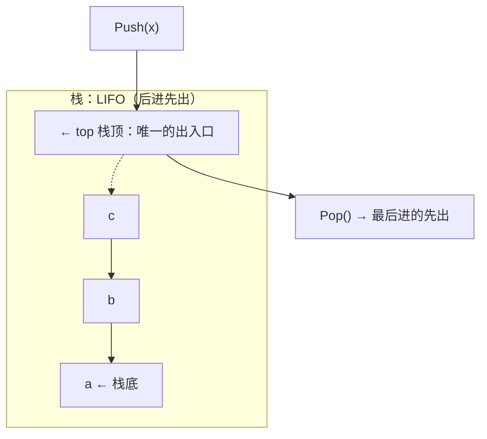
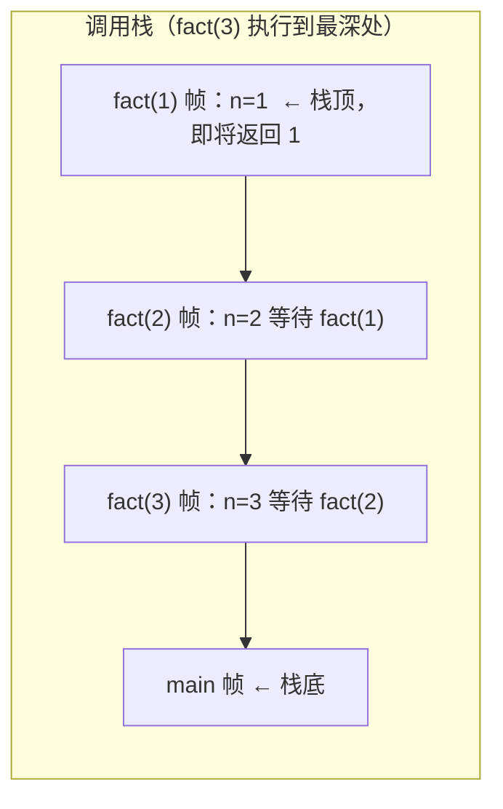
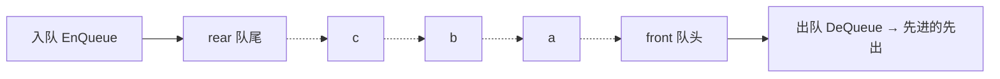
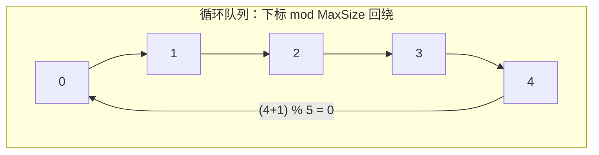

# 精通栈、队列与数组：受限线性表、循环队列判满、特殊矩阵压缩

> 课程编号：DS03
> 路线图来源：计算机基础四大件 · 数据结构（408 第 3 章）
> 难度：⭐⭐⭐
> 预计阅读时间：65 分钟
> 内容基准：2026 年 7 月（408 考纲第 3 章「栈、队列和数组」）
> **代码语言：Go**。408 考场要求 C/C++，差异见 [DS02 §6.4 对照表](./DS02-精通-线性表.md)。

---

## 引言：一个循环队列，三种判满方案，考了二十年

先看一段有 bug 的循环队列。数组容量 5，`front` 指向队头元素，`rear` 指向队尾元素的**下一个**位置：

```go
type Queue struct {
    data        [5]int
    front, rear int
}

func (q *Queue) Empty() bool { return q.front == q.rear }
func (q *Queue) Full() bool  { return q.front == q.rear } // ← 和判空一模一样？
```

问题一目了然：**队空和队满的条件完全相同**，无法区分。

```
队空：front == rear                队满：front == rear
   ┌───┬───┬───┬───┬───┐             ┌───┬───┬───┬───┬───┐
   │   │   │   │   │   │             │ a │ b │ c │ d │ e │
   └───┴───┴───┴───┴───┘             └───┴───┴───┴───┴───┘
     ↑front,rear                       ↑front,rear
```

这不是一道人为编造的谜题——它是循环队列的**固有矛盾**：`front` 和 `rear` 两个下标共有 n 种相对位置，却要表示 n+1 种状态（元素个数 0 到 n）。鸽巢原理保证了必然有两种状态撞在一起。

408 二十年来反复考它的三种解法（牺牲一个单元、加计数器、加标志位），以及每种解法下「队列长度公式」怎么写。本章会把三种方案全部推导一遍——不是背公式，而是理解为什么必须付出这个代价。

顺带一个真实工程的对照：**Go channel 的底层 `hchan` 就是一个循环队列**，它选的是「加计数器」方案（`qcount` 字段），因为它本来就需要一个计数来判断阻塞条件。设计取舍在教材和工业代码里是同一套逻辑。

读完你应该能：

- 手写顺序栈、链栈、循环队列、链队列的完整实现，处理好所有边界
- 默写循环队列三种判满方案的判空/判满/求长公式，并说清各自代价
- 用共享栈把两个栈塞进一个数组，说清它的判满条件
- 解释栈在括号匹配、表达式求值、递归中的作用，手写中缀转后缀
- 说清「n 个不同元素入栈，出栈序列有多少种」及卡特兰数的由来
- 计算对称矩阵、三角矩阵、三对角矩阵的压缩下标映射
- 避开循环队列和矩阵压缩题里的下标陷阱

---

## 第一章 栈

### 1.1 定义与特性

**栈（Stack）**是只允许在**一端**进行插入和删除的线性表。



| 术语 | 含义 |
|---|---|
| **栈顶（top）** | 允许插入删除的那一端 |
| **栈底（bottom）** | 固定不动的另一端 |
| **入栈 Push** | 插入元素，也叫压栈、进栈 |
| **出栈 Pop** | 删除元素，也叫弹栈、退栈 |
| **LIFO** | Last In First Out，后进先出——栈的本质特征 |

**栈是线性结构**，不是「特殊结构」——这是选择题原题。它只是把线性表的插删位置限制到了一端。

### 1.2 顺序栈

```go
const MaxSize = 50

type SqStack struct {
    data [MaxSize]int
    top  int // 栈顶【指针】，实际是数组下标
}
```

**`top` 的两种约定**是 408 的核心考点，会导致所有公式变化：

| | 约定 A：top 指向栈顶元素 | 约定 B：top 指向栈顶的下一个位置 |
|---|---|---|
| 初始化 | `top = -1` | `top = 0` |
| 判空 | `top == -1` | `top == 0` |
| 判满 | `top == MaxSize-1` | `top == MaxSize` |
| 入栈 | `top++; data[top] = x` | `data[top] = x; top++` |
| 出栈 | `x = data[top]; top--` | `top--; x = data[top]` |
| 元素个数 | `top + 1` | `top` |

```go
// 约定 A（408 教材默认）：top 指向栈顶元素，初值 -1
func NewSqStack() *SqStack { return &SqStack{top: -1} }

func (s *SqStack) Empty() bool { return s.top == -1 }
func (s *SqStack) Len() int    { return s.top + 1 }

func (s *SqStack) Push(x int) bool {
    if s.top == MaxSize-1 { // 栈满，上溢
        return false
    }
    s.top++
    s.data[s.top] = x
    return true
}

func (s *SqStack) Pop() (int, bool) {
    if s.top == -1 { // 栈空，下溢
        return 0, false
    }
    x := s.data[s.top]
    s.top--
    return x, true
}

func (s *SqStack) Top() (int, bool) { // 读栈顶不删除
    if s.top == -1 {
        return 0, false
    }
    return s.data[s.top], true
}
```

**审题提醒**：408 题目会明确写「设 top 指向栈顶元素」或「top 指向栈顶元素的下一个位置」，这一句决定了全部公式。看漏它，答案必错。

> **Go 里的地道写法**：直接用切片，`top` 就是 `len(s)`，约定 B 天然成立：
>
> ```go
> type Stack []int
>
> func (s *Stack) Push(x int) { *s = append(*s, x) }
> func (s *Stack) Pop() (int, bool) {
>     if len(*s) == 0 {
>         return 0, false
>     }
>     x := (*s)[len(*s)-1]
>     *s = (*s)[:len(*s)-1]
>     return x, true
> }
> func (s Stack) Top() (int, bool) {
>     if len(s) == 0 { return 0, false }
>     return s[len(s)-1], true
> }
> ```
>
> 这是刷题时该用的版本——切片自动扩容，不会栈满。但 408 大题要按定长数组答，**必须判 `top == MaxSize-1`**。

### 1.3 共享栈（两栈共享空间）

两个栈共用一个数组，从**两端向中间**增长。

```
        栈 1 →                            ← 栈 2
   ┌────┬────┬────┬────┬────┬────┬────┬────┐
   │ a  │ b  │    │    │    │    │ y  │ x  │
   └────┴────┴────┴────┴────┴────┴────┴────┘
     0    1                        6    7
          ↑top1                    ↑top2      MaxSize = 8
```

```go
type SharedStack struct {
    data       [MaxSize]int
    top1, top2 int
}

func NewSharedStack() *SharedStack {
    return &SharedStack{top1: -1, top2: MaxSize} // 分别从两端外侧开始
}

func (s *SharedStack) Empty1() bool { return s.top1 == -1 }
func (s *SharedStack) Empty2() bool { return s.top2 == MaxSize }

// ★ 判满条件：两个栈顶相邻
func (s *SharedStack) Full() bool { return s.top1+1 == s.top2 }

func (s *SharedStack) Push1(x int) bool {
    if s.Full() {
        return false
    }
    s.top1++
    s.data[s.top1] = x
    return true
}

func (s *SharedStack) Push2(x int) bool {
    if s.Full() {
        return false
    }
    s.top2--
    s.data[s.top2] = x
    return true
}
```

**判满条件 `top1 + 1 == top2` 是必背结论**。共享栈的价值：两个栈**此消彼长**时空间利用率远高于各分一半——只有两者同时接近满才真正溢出。

### 1.4 链栈

用链表实现，**在头部插删**（因为头部插删是 O(1)）。

```go
type LinkStack struct {
    top *LNode // 直接指向栈顶结点，【不需要头结点】
    n   int
}

func (s *LinkStack) Push(x int) {
    s.top = &LNode{Data: x, Next: s.top} // 头插
    s.n++
}

func (s *LinkStack) Pop() (int, bool) {
    if s.top == nil {
        return 0, false
    }
    x := s.top.Data
    s.top = s.top.Next // 摘掉头结点
    s.n--
    return x, true
}

func (s *LinkStack) Empty() bool { return s.top == nil }
```

**链栈不需要头结点**——栈只在一端操作，没有「表头特判」的问题，加头结点纯属多余。这与 DS02 的链表形成对照，是选择题考点。

| | 顺序栈 | 链栈 |
|---|---|---|
| 是否会满 | **会**（上溢） | 只受内存限制 |
| 空间 | 预分配，可能浪费 | 按需分配，有指针开销 |
| Push/Pop | O(1) | O(1) |
| 适用 | 元素数量可预估 | 数量波动大、多栈并存 |

### 1.5 栈的应用一：括号匹配

```go
func isValid(s string) bool {
    pairs := map[byte]byte{')': '(', ']': '[', '}': '{'} // 右括号 → 左括号
    stack := []byte{}
    for i := 0; i < len(s); i++ {
        c := s[i]
        if left, isRight := pairs[c]; isRight {
            // 右括号：栈顶必须是【匹配的】左括号
            if len(stack) == 0 || stack[len(stack)-1] != left {
                return false
            }
            stack = stack[:len(stack)-1]
        } else {
            stack = append(stack, c) // 左括号入栈
        }
    }
    return len(stack) == 0 // ★ 最后必须栈空，否则有未匹配的左括号
}
```

**三种失败情形**都要处理，漏一个就 WA：

1. 遇到右括号但**栈空** → `((` 后面来了 `)))`
2. 遇到右括号但**栈顶不匹配** → `([)]`
3. 扫描结束但**栈非空** → `(((`

### 1.6 栈的应用二：表达式求值

**三种表达式**：

| 形式 | 例子 | 特点 |
|---|---|---|
| 中缀 | `a + b * c` | 人类可读，但求值要考虑优先级和括号 |
| **后缀（逆波兰 RPN）** | `a b c * +` | **无需括号**，从左到右一遍扫描即可求值 |
| 前缀（波兰） | `+ a * b c` | 同样无需括号，从右向左扫描 |

**中缀转后缀的手工方法**（408 常考填空）：给每个运算加上完整括号，然后把运算符移到对应右括号处。

```
a + b * c - d
= ((a + (b * c)) - d)
→  a b c *  +  d  -
```

**中缀转后缀的算法（调度场算法）**：

```go
// 优先级：数字越大越优先
func prec(op byte) int {
    switch op {
    case '+', '-':
        return 1
    case '*', '/':
        return 2
    }
    return 0
}

func infixToPostfix(s string) string {
    var out []byte
    var ops []byte // 运算符栈
    for i := 0; i < len(s); i++ {
        c := s[i]
        switch {
        case c >= '0' && c <= '9': // 操作数直接输出
            out = append(out, c)
        case c == '(': // 左括号无条件入栈
            ops = append(ops, c)
        case c == ')': // 右括号：弹到左括号为止
            for len(ops) > 0 && ops[len(ops)-1] != '(' {
                out = append(out, ops[len(ops)-1])
                ops = ops[:len(ops)-1]
            }
            ops = ops[:len(ops)-1] // 丢弃左括号，★ 括号不输出
        default: // 运算符：弹出所有【优先级 ≥ 当前】的
            for len(ops) > 0 && prec(ops[len(ops)-1]) >= prec(c) {
                out = append(out, ops[len(ops)-1])
                ops = ops[:len(ops)-1]
            }
            ops = append(ops, c)
        }
    }
    for len(ops) > 0 { // 收尾：栈中剩余全部输出
        out = append(out, ops[len(ops)-1])
        ops = ops[:len(ops)-1]
    }
    return string(out)
}
```

**为什么是「优先级 ≥」而不是「>」**：保证同级运算符**左结合**。`a-b-c` 必须转成 `ab-c-`（即 `(a-b)-c`），若用 `>` 会得到 `abc--`（即 `a-(b-c)`），结果错误。

**后缀表达式求值**——遇到运算符就弹两个操作数：

```go
func evalRPN(tokens []string) int {
    stack := []int{}
    for _, t := range tokens {
        switch t {
        case "+", "-", "*", "/":
            b := stack[len(stack)-1] // ★ 先弹的是【右】操作数
            a := stack[len(stack)-2]
            stack = stack[:len(stack)-2]
            var r int
            switch t {
            case "+":
                r = a + b
            case "-":
                r = a - b // 顺序错了这里就错
            case "*":
                r = a * b
            case "/":
                r = a / b
            }
            stack = append(stack, r)
        default:
            n, _ := strconv.Atoi(t)
            stack = append(stack, n)
        }
    }
    return stack[0]
}
```

**最易错的一行**：先弹出的是**右**操作数。对 `-` 和 `/` 这种不满足交换律的运算，弄反就是错的。

### 1.7 栈的应用三：递归

**递归的本质就是栈**。每次函数调用，系统把返回地址、实参、局部变量打包成**活动记录（栈帧）**压入调用栈。



这解释了 [DS01 §4.5](./DS01-精通-绪论与复杂度分析.md) 的结论：**递归的空间复杂度 = 递归深度 × 单帧大小**。

**任何递归都能用栈手动改写成迭代**。以二叉树中序遍历为例（DS05 会展开）：

```go
// 递归版
func inorder(root *TreeNode, out *[]int) {
    if root == nil {
        return
    }
    inorder(root.Left, out)
    *out = append(*out, root.Val)
    inorder(root.Right, out)
}

// 迭代版 —— 用显式栈模拟系统调用栈
func inorderIter(root *TreeNode) []int {
    var out []int
    var stack []*TreeNode
    cur := root
    for cur != nil || len(stack) > 0 {
        for cur != nil { // 一路向左压栈
            stack = append(stack, cur)
            cur = cur.Left
        }
        cur = stack[len(stack)-1] // 弹出并访问
        stack = stack[:len(stack)-1]
        out = append(out, cur.Val)
        cur = cur.Right // 转向右子树
    }
    return out
}
```

### 1.8 栈的经典结论：出栈序列有多少种

**n 个不同元素依次入栈，出栈序列共有多少种？**

答案是**卡特兰数（Catalan number）**：

```
C(n) = (1/(n+1)) · C(2n, n) = (2n)! / (n! · (n+1)!)
```

| n | 1 | 2 | 3 | 4 | 5 | 6 |
|---|---|---|---|---|---|---|
| 出栈序列种数 | 1 | 2 | **5** | 14 | 42 | 132 |

**n=3 的 5 种**（入栈序列 1,2,3）：

```
123  132  213  231  321          ← 合法
312                              ← 【不合法】！
```

**为什么 312 不可能**：要先出 3，说明 1、2、3 全部入栈了，此时栈内自底向上是 1、2、3。出 3 后栈顶是 2，下一个必须能出 2，不可能跳到 1。

**判定一个序列是否合法的规则**：若在出栈序列中，元素 i 出现在 j 之前（i < j 是入栈顺序），则**所有比 j 大的、在 i 和 j 之间入栈的元素都不能夹在它们中间**。实战中最快的方法是**直接模拟**：

```go
// 判断 popped 是��是 pushed 的合法出栈序列（力扣 946）
func validateStackSequences(pushed, popped []int) bool {
    stack := []int{}
    j := 0
    for _, v := range pushed {
        stack = append(stack, v)
        for len(stack) > 0 && j < len(popped) && stack[len(stack)-1] == popped[j] {
            stack = stack[:len(stack)-1] // 能出就出，贪心
            j++
        }
    }
    return len(stack) == 0
}
```

**卡特兰数在 408 里还会出现三次**：n 个结点的**不同二叉树形态**数（DS05）、n 个结点的**不同 BST** 数（DS07）、以及 n 对括号的**合法组合**数——它们本质是同一个计数问题。

---

## 第二章 队列

### 2.1 定义

**队列（Queue）**是只允许在**一端插入、另一端删除**的线性表。



**FIFO**（First In First Out，先进先出）是队列的本质特征，与栈的 LIFO 正好相反。

### 2.2 顺序队列的假溢出问题

```go
type SqQueue struct {
    data        [MaxSize]int
    front, rear int
}
```

若简单地让 `front` 只增不减、`rear` 只增不减：

```
初始:  front=0, rear=0
   ┌───┬───┬───┬───┬───┐
   │   │   │   │   │   │
   └───┴───┴───┴───┴───┘

入队 a,b,c,d,e 后出队 a,b,c:
   ┌───┬───┬───┬───┬───┐
   │ / │ / │ / │ d │ e │      front=3, rear=5
   └───┴───┴───┴───┴───┘
                        ↑rear == MaxSize
   → 判满条件 rear == MaxSize 成立，无法再入队
   → 但前面 3 个位置是空的！这叫【假溢出】
```

**解决方案：循环队列**——把数组首尾相接成环，下标用 `% MaxSize` 回绕。



### 2.3 循环队列的三种判满方案

**核心矛盾**（引言里的那个）：`front == rear` 既可能是空也可能是满。三种解法：

#### 方案一：牺牲一个存储单元（408 默认）

**约定**：`rear` 指向队尾元素的**下一个**位置。**故意浪费一个单元**，让「满」的定义提前一格。

```go
type CircQueue struct {
    data        [MaxSize]int
    front, rear int
}

func (q *CircQueue) Empty() bool { return q.front == q.rear }

// ★ 判满：rear 的下一个位置就是 front
func (q *CircQueue) Full() bool { return (q.rear+1)%MaxSize == q.front }

// ★ 队列长度：加 MaxSize 再取模，避免负数
func (q *CircQueue) Len() int { return (q.rear - q.front + MaxSize) % MaxSize }

func (q *CircQueue) EnQueue(x int) bool {
    if q.Full() {
        return false
    }
    q.data[q.rear] = x
    q.rear = (q.rear + 1) % MaxSize // ★ 取模回绕
    return true
}

func (q *CircQueue) DeQueue() (int, bool) {
    if q.Empty() {
        return 0, false
    }
    x := q.data[q.front]
    q.front = (q.front + 1) % MaxSize
    return x, true
}
```

```
队空：front == rear                 队满：(rear+1) % 5 == front
   ┌───┬───┬───┬───┬───┐              ┌───┬───┬───┬───┬───┐
   │   │   │   │   │   │              │ a │ b │ c │ d │ / │  ← 最后一格【永远空着】
   └───┴───┴───┴───┴───┘              └───┴───┴───┴───┴───┘
     ↑front,rear                        ↑front            ↑rear
                                     实际只能存 MaxSize-1 = 4 个元素
```

**三条必背公式**（考试直接用）：

| | 公式 |
|---|---|
| 判空 | `front == rear` |
| 判满 | `(rear + 1) % MaxSize == front` |
| 长度 | `(rear − front + MaxSize) % MaxSize` |
| 最大容量 | **MaxSize − 1** |

**长度公式里的 `+ MaxSize` 不能省**：当 `rear < front`（已回绕）时 `rear − front` 是负数，Go 和 C 的 `%` 对负数都返回负值，必须先加 `MaxSize` 变正。这是最高频的代码错误。

#### 方案二：增设计数器

```go
type CountQueue struct {
    data        [MaxSize]int
    front, rear int
    size        int // 元素个数
}

func (q *CountQueue) Empty() bool { return q.size == 0 }
func (q *CountQueue) Full() bool  { return q.size == MaxSize } // ★ 能用满全部空间
func (q *CountQueue) Len() int    { return q.size }
```

**代价**：多一个 int 的空间 + 每次入队出队都要维护它。**收益**：能用满 MaxSize 个单元，且求长度是 O(1) 不用取模。

> **Go channel 选的就是这个方案**。`runtime.hchan` 里同时有 `qcount`（当前元素数）、`dataqsiz`（容量）、`sendx`/`recvx`（就是 rear/front）。因为 channel 本来就要靠 `qcount` 判断「该不该阻塞发送者」，计数器不是额外开销而是必需品。见 [golang/G12 Channels](../../golang/G12-精通-Go-Channels-与-select.md)。

#### 方案三：增设标志位

```go
type FlagQueue struct {
    data        [MaxSize]int
    front, rear int
    tag         int // 0 = 最后一次操作是【删除】，1 = 最后一次是【插入】
}

// 只有「删除」能导致队空
func (q *FlagQueue) Empty() bool { return q.front == q.rear && q.tag == 0 }

// 只有「插入」能导致队满
func (q *FlagQueue) Full() bool { return q.front == q.rear && q.tag == 1 }
```

**思路**：`front == rear` 时到底是空还是满，取决于**是怎么走到这一步的**——插入走到的是满，删除走到的是空。

#### 三方案对照

| | 方案一 牺牲单元 | 方案二 计数器 | 方案三 标志位 |
|---|---|---|---|
| 额外空间 | 1 个元素 | 1 个 int | 1 个 bool |
| 可用容量 | MaxSize − 1 | **MaxSize** | **MaxSize** |
| 求长度 | O(1) 但要取模 | **O(1) 直接读** | O(1) 但要取模 |
| 408 默认 | **是** | — | — |
| 工程常见 | — | **是**（Go channel） | 少见 |

**408 不特别说明时用方案一**，题目若给了 `size` 或 `tag` 字段就按对应方案答。

### 2.4 链队列

```go
type LinkQueue struct {
    front, rear *LNode // front 指向【头结点】，rear 指向尾结点
    n           int
}

func NewLinkQueue() *LinkQueue {
    head := &LNode{} // ★ 带头结点，让入队出队无需特判空队
    return &LinkQueue{front: head, rear: head}
}

func (q *LinkQueue) Empty() bool { return q.front == q.rear }

func (q *LinkQueue) EnQueue(x int) {
    s := &LNode{Data: x}
    q.rear.Next = s // 尾插
    q.rear = s
    q.n++
}

func (q *LinkQueue) DeQueue() (int, bool) {
    if q.Empty() {
        return 0, false
    }
    p := q.front.Next // 头结点之后的第一个才是队头元素
    x := p.Data
    q.front.Next = p.Next
    if q.rear == p { // ★★ 删的是最后一个元素，rear 会成为悬空指针
        q.rear = q.front // 必须让 rear 退回头结点
    }
    p.Next = nil
    q.n--
    return x, true
}
```

**`if q.rear == p` 这个判断是链队列最容易漏的一行**。若删除的是最后一个元素而不修正 `rear`，`rear` 就指向了已删除的结点——后续入队会把元素挂到一条已经脱离队列的链上，数据静默丢失。

**链队列不会「满」**，也就不需要三种判满方案——这是它相对循环队列的优势。

### 2.5 双端队列

**双端队列（deque）**：两端都能插入和删除。

| 变体 | 限制 |
|---|---|
| 双端队列 | 两端都可插可删 |
| **输入受限**双端队列 | 只允许一端插入，两端都可删除 |
| **输出受限**双端队列 | 两端都可插入，只允许一端删除 |

408 考法固定：给出一个输入序列和一个输出序列，问「能否由某种受限双端队列得到」。**做法就是手工模拟**，没有巧办法。

**关键认知**：双端队列既能当栈用（只用一端）也能当队列用（一端进一端出），所以**栈和队列能生成的序列，双端队列全都能生成**。

> Go 里没有标准 deque，用切片两端操作即可（左端 `append` 到新切片较慢，高频场景用环形缓冲）。滑动窗口最大值（力扣 239）用的**单调队列**就是双端队列的典型应用。

---

## 第三章 数组与特殊矩阵压缩

### 3.1 一维与多维数组的地址计算

**一维数组** `a[0..n-1]`，每元素占 L 字节：

```
LOC(aᵢ) = LOC(a₀) + i × L
```

**二维数组** `a[0..m-1][0..n-1]`，两种存储顺序：

| 顺序 | 含义 | 地址公式 | 采用者 |
|---|---|---|---|
| **行优先** | 一行存完再存下一行 | `LOC(a[i][j]) = LOC(a[0][0]) + (i × n + j) × L` | **C / C++ / Go / 408 默认** |
| 列优先 | 一列存完再存下一列 | `LOC(a[i][j]) = LOC(a[0][0]) + (j × m + i) × L` | FORTRAN / MATLAB / Julia |

**408 默认行优先**，题目若说「列优先」会明确写出。

> **这不只是考点**：行优先意味着**按行遍历二维数组比按列遍历快得多**（cache 命中率差异可达 5-10 倍）。矩阵乘法优化的第一步就是调整循环顺序让内层访问连续。见 [CO05 Cache](../computer-organization/CO05-精通-Cache-与虚拟存储器.md)。

**下标不从 0 开始时**（408 爱考这种）：`a[c1..d1][c2..d2]`，行优先：

```
LOC(a[i][j]) = LOC(a[c1][c2]) + [(i − c1) × (d2 − c2 + 1) + (j − c2)] × L
                                                ↑ 每行元素个数
```

### 3.2 对称矩阵的压缩

**对称矩阵**：n 阶方阵满足 `a[i][j] == a[j][i]`。只需存**下三角 + 主对角线**，共 `n(n+1)/2` 个元素。

```
      j=1  2   3   4                     压缩到一维数组 B（下标从 1 开始）
i=1 │  1               │
i=2 │  2   3           │   → B = [a₁₁, a₂₁, a₂₂, a₃₁, a₃₂, a₃₃, a₄₁, ...]
i=3 │  4   5   6       │       k =   1    2    3    4    5    6    7
i=4 │  7   8   9  10   │
      （数字表示存储的序号 k）
```

**映射公式**（1-based，408 标准写法）：

```
        ┌  i(i−1)/2 + j        当 i ≥ j （下三角）
   k =  ┤
        └  j(j−1)/2 + i        当 i < j （上三角，交换 i j 后套同一公式）
```

**推导**：要存 `a[i][j]`（i ≥ j），它前面有完整的 i−1 行，元素数 = 1+2+...+(i−1) = `i(i−1)/2`；再加上本行的第 j 个，得 `i(i−1)/2 + j`。

```go
// 0-based 的 Go 实现（注意与 408 的 1-based 公式差异）
type SymMatrix struct {
    n int
    b []int // 长度 n(n+1)/2
}

func NewSymMatrix(n int) *SymMatrix {
    return &SymMatrix{n: n, b: make([]int, n*(n+1)/2)}
}

func (m *SymMatrix) idx(i, j int) int { // i, j 从 0 开始
    if i < j {
        i, j = j, i // 上三角映射到下三角
    }
    return i*(i+1)/2 + j // 0-based 公式：前 i 行共 i(i+1)/2 个
}

func (m *SymMatrix) Get(i, j int) int  { return m.b[m.idx(i, j)] }
func (m *SymMatrix) Set(i, j, v int)   { m.b[m.idx(i, j)] = v }
```

**0-based 和 1-based 的公式不同**（`i(i+1)/2 + j` vs `i(i−1)/2 + j`），408 答题用 1-based，写 Go 代码用 0-based。这是本节最容易搞混的地方——**推导一遍比背两个公式可靠**。

### 3.3 三角矩阵

| 类型 | 定义 | 存储量 |
|---|---|---|
| **下三角矩阵** | 上三角全为同一常数 c | `n(n+1)/2 + 1`（+1 存那个常数 c） |
| **上三角矩阵** | 下三角全为同一常数 c | `n(n+1)/2 + 1` |

**下三角矩阵**（1-based，行优先）：

```
        ┌  i(i−1)/2 + j        i ≥ j
   k =  ┤
        └  n(n+1)/2 + 1        i < j （所有上三角元素都指向存常数的那一格）
```

**上三角矩阵**（1-based，行优先）稍复杂——第 i 行有 `n − i + 1` 个元素：

```
   k = (i−1)(2n − i + 2)/2 + (j − i + 1)        i ≤ j
```

**这个公式建议现场推导而不是背**：前 i−1 行的元素数 = n + (n−1) + ... + (n−i+2) = `(i−1)(2n−i+2)/2`，本行内 `a[i][j]` 是第 `j−i+1` 个。

### 3.4 三对角矩阵（带状矩阵）

**三对角矩阵**：只有主对角线及其上下各一条对角线非零，即 `|i − j| > 1` 时 `a[i][j] = 0`。

```
      j=1  2   3   4   5
i=1 │  ●   ●   0   0   0 │       非零元素总数 = 3n − 2
i=2 │  ●   ●   ●   0   0 │
i=3 │  0   ●   ●   ●   0 │
i=4 │  0   0   ●   ●   ● │
i=5 │  0   0   0   ●   ● │
```

**映射公式**（1-based，行优先，`|i−j| ≤ 1`）：

```
   k = 2i + j − 2
```

**推导**：第 1 行有 2 个元素，第 2 到 n−1 行各有 3 个，第 n 行有 2 个。存 `a[i][j]` 前面有 `2 + 3(i−2) = 3i − 4` 个元素（i ≥ 2），本行内 `a[i][j]` 是第 `j − i + 2` 个，相加得 `3i − 4 + j − i + 2 = 2i + j − 2`。i=1 时直接验证也符合。

**反向公式**（给 k 求 i、j，408 也考）：

```
   i = ⌊(k + 1)/3⌋ + 1        j = k − 2i + 2
```

### 3.5 稀疏矩阵

**稀疏矩阵**：非零元素远少于零元素（通常密度 < 5%）。

**三元组表示法**：

```go
type Triple struct {
    Row, Col, Val int
}

type SparseMatrix struct {
    rows, cols int
    data       []Triple // 按行优先排序存储非零元素
}
```

```
原矩阵                      三元组表（按行优先）
┌ 0  0  3  0 ┐              (0, 2, 3)
│ 0  0  0  0 │       →      (2, 1, 5)
│ 0  5  0  0 │              (3, 3, 7)
└ 0  0  0  7 ┘
```

**其他表示法**：

| 方法 | 结构 | 优势 |
|---|---|---|
| 三元组表 | `[]{row, col, val}` | 简单，空间最省 |
| **十字链表** | 每个非零元素同时在行链表和列链表中 | 插删非零元素 O(1)，适合矩阵运算 |
| CSR/CSC | 值数组 + 列索引 + 行指针 | 工业标准（SciPy、Eigen 都用） |

**十字链表的结点结构**（408 会考画图）：

```go
type OLNode struct {
    Row, Col, Val int
    Right, Down   *OLNode // 同一行的下一个 / 同一列的下一个
}
```

**压缩存储的共同代价**：**失去随机存取**。三元组表里找 `a[i][j]` 要 O(非零元素数) 或 O(log) 二分，不再是 O(1)。这是所有压缩方案的通病——用时间换空间。

---

## 第四章 408 高频考点与陷阱清单

### 4.1 考点分布

第 3 章在 408 里通常是 **2-3 道选择题（4-6 分）**，偶尔出现在算法大题里（用栈/队列辅助解决其他问题）。三个必考点：

1. **循环队列判空判满求长**——出现率最高，几乎年年有
2. **栈的出栈序列合法性 / 卡特兰数**
3. **特殊矩阵的下标映射计算**

### 4.2 七大陷阱

**陷阱 1：没看清 top 的约定**

「top 指向栈顶元素」（初值 −1）和「top 指向栈顶下一位置」（初值 0）的所有公式都不同。审题第一件事就是找这句话。

**陷阱 2：循环队列长度公式漏了 `+ MaxSize`**

```go
(q.rear - q.front + MaxSize) % MaxSize   // ✓ 正确
(q.rear - q.front) % MaxSize             // ✗ rear < front 时得负数
```

Go 和 C 的 `%` 对负数都返回负值（`-2 % 5 == -2`），必须先加 `MaxSize`。

**陷阱 3：搞混三种判满方案的容量**

- 牺牲单元：可用 **MaxSize − 1**
- 计数器 / 标志位：可用 **MaxSize**

题目问「最多能存多少元素」时，先确认是哪种方案。

**陷阱 4：链队列出队忘了修正 rear**

删除最后一个元素时必须 `q.rear = q.front`，否则 `rear` 悬空。这是链队列唯一的特殊情况。

**陷阱 5：后缀表达式求值时操作数顺序反了**

先弹出的是**右**操作数。`a - b` 要写成 `a := 次栈顶; b := 栈顶; r = a - b`。

**陷阱 6：矩阵压缩混用 0-based 和 1-based 公式**

408 的 `i(i−1)/2 + j` 是 **1-based**；写 Go 代码要用 **0-based** 的 `i(i+1)/2 + j`。**推导比背诵可靠**：想清楚「前 i−1 行（或前 i 行）一共有多少个元素」即可。

**陷阱 7：以为压缩存储还能随机存取**

对称矩阵、三角矩阵、三对角矩阵**仍能 O(1) 随机存取**（有闭式公式）；但**稀疏矩阵的三元组表和十字链表不能**——只能顺序查找。这个区别是选择题考点。

### 4.3 必背公式汇总

| 结构 | 公式 |
|---|---|
| 循环队列（牺牲单元）判空 | `front == rear` |
| 循环队列（牺牲单元）判满 | `(rear+1) % MaxSize == front` |
| 循环队列长度 | `(rear − front + MaxSize) % MaxSize` |
| 共享栈判满 | `top1 + 1 == top2` |
| n 元素出栈序列数 | 卡特兰数 `C(2n,n)/(n+1)` |
| 二维数组行优先 | `LOC + (i × n + j) × L` |
| 对称矩阵（1-based, i≥j） | `k = i(i−1)/2 + j` |
| 上三角矩阵（1-based, i≤j） | `k = (i−1)(2n−i+2)/2 + (j−i+1)` |
| 三对角矩阵（1-based） | `k = 2i + j − 2` |
| 三对角矩阵非零元素数 | `3n − 2` |

---

## 第五章 力扣实战题单

### 必刷档（8 题）

| 题号 | 题目 | 练什么 | 目标复杂度 |
|---|---|---|---|
| 20 | [有效的括号](https://leetcode.cn/problems/valid-parentheses/) | §1.5 括号匹配，三种失败情形 | O(n) / O(n) |
| 155 | [最小栈](https://leetcode.cn/problems/min-stack/) | 辅助栈同步压入当前最小值 | 全 O(1) |
| 232 | [用栈实现队列](https://leetcode.cn/problems/implement-queue-using-stack/) | 双栈倒腾，摊还 O(1) 的经典论证 | 摊还 O(1) |
| 225 | [用队列实现栈](https://leetcode.cn/problems/implement-stack-using-queues/) | 反向操作，理解 LIFO 与 FIFO 的转换 | O(n) / O(1) |
| 622 | [设计循环队列](https://leetcode.cn/problems/design-circular-queue/) | **§2.3 的直接实现**，本章最该做的题 | 全 O(1) |
| 150 | [逆波兰表达式求值](https://leetcode.cn/problems/evaluate-reverse-polish-notation/) | §1.6 后缀求值，操作数顺序 | O(n) / O(n) |
| 946 | [验证栈序列](https://leetcode.cn/problems/validate-stack-sequences/) | §1.8 出栈序列合法性，贪心模拟 | O(n) / O(n) |
| 739 | [每日温度](https://leetcode.cn/problems/daily-temperatures/) | **单调栈**入门，摊还 O(n) | O(n) / O(n) |

**622 设计循环队列**——把 §2.3 方案一抄进去就能 AC：

```go
type MyCircularQueue struct {
    data        []int
    front, rear int
}

func Constructor(k int) MyCircularQueue {
    return MyCircularQueue{data: make([]int, k+1)} // ★ 多分配一格用于牺牲
}

func (q *MyCircularQueue) EnQueue(value int) bool {
    if q.IsFull() {
        return false
    }
    q.data[q.rear] = value
    q.rear = (q.rear + 1) % len(q.data)
    return true
}

func (q *MyCircularQueue) DeQueue() bool {
    if q.IsEmpty() {
        return false
    }
    q.front = (q.front + 1) % len(q.data)
    return true
}

func (q *MyCircularQueue) Front() int {
    if q.IsEmpty() { return -1 }
    return q.data[q.front]
}

func (q *MyCircularQueue) Rear() int {
    if q.IsEmpty() { return -1 }
    return q.data[(q.rear-1+len(q.data))%len(q.data)] // ★ 同样要 +len 防负
}

func (q *MyCircularQueue) IsEmpty() bool { return q.front == q.rear }
func (q *MyCircularQueue) IsFull() bool  { return (q.rear+1)%len(q.data) == q.front }
```

**232 用栈实现队列的摊还分析**（呼应 [DS01 §5.2](./DS01-精通-绪论与复杂度分析.md)）：

```go
type MyQueue struct {
    in, out []int // in 负责入队，out 负责出队
}

func (q *MyQueue) Push(x int) { q.in = append(q.in, x) }

func (q *MyQueue) Pop() int {
    q.transfer()
    x := q.out[len(q.out)-1]
    q.out = q.out[:len(q.out)-1]
    return x
}

func (q *MyQueue) transfer() {
    if len(q.out) == 0 { // ★ 只在 out 空时才倒，这是摊还 O(1) 的关键
        for len(q.in) > 0 {
            q.out = append(q.out, q.in[len(q.in)-1])
            q.in = q.in[:len(q.in)-1]
        }
    }
}
```

**每个元素最多被搬运一次**（in → out），n 次操作总搬运量 O(n)，**摊还 O(1)**。若每次 Pop 都倒回去，就退化成 O(n)——`if len(q.out) == 0` 这个条件是全部关键。

### 进阶档（6 题）

| 题号 | 题目 | 练什么 |
|---|---|---|
| 84 | [柱状图中最大的矩形](https://leetcode.cn/problems/largest-rectangle-in-histogram/) | 单调栈的巅峰，哨兵技巧 |
| 42 | [接雨水](https://leetcode.cn/problems/trapping-rain-water/) | 单调栈 / 双指针两解法对比 |
| 239 | [滑动窗口最大值](https://leetcode.cn/problems/sliding-window-maximum/) | **单调队列** = 双端队列的应用 |
| 71 | [简化路径](https://leetcode.cn/problems/simplify-path/) | 栈处理 `..` 回退，字符串分割 |
| 394 | [字符串解码](https://leetcode.cn/problems/decode-string/) | 双栈（数字栈 + 字符串栈）处理嵌套 |
| 227 | [基本计算器 II](https://leetcode.cn/problems/basic-calculator-ii/) | §1.6 中缀求值，优先级处理 |

**239 滑动窗口最大值**——双端队列存**下标**且保持单调递减：

```go
func maxSlidingWindow(nums []int, k int) []int {
    dq := []int{} // 存【下标】，对应值单调递减
    out := []int{}
    for i, v := range nums {
        // ① 队头超出窗口，从左端弹出
        if len(dq) > 0 && dq[0] <= i-k {
            dq = dq[1:]
        }
        // ② 从右端弹出所有比当前值小的（它们永远不可能是最大值了）
        for len(dq) > 0 && nums[dq[len(dq)-1]] <= v {
            dq = dq[:len(dq)-1]
        }
        dq = append(dq, i)
        if i >= k-1 {
            out = append(out, nums[dq[0]]) // 队头即窗口最大值
        }
    }
    return out
}
// 时间 O(n)：每个下标最多入队一次、出队一次（摊还论证）
```

**两端都要操作**——这就是为什么必须用双端队列而不是普通队列。

### 挑战档（3 题）

| 题号 | 题目 | 练什么 |
|---|---|---|
| 224 | [基本计算器](https://leetcode.cn/problems/basic-calculator/) | 带括号 + 负号的中缀求值，边界极多 |
| 316 | [去除重复字母](https://leetcode.cn/problems/remove-duplicate-letters/) | 单调栈 + 贪心 + 剩余计数，三重思路叠加 |
| 862 | [和至少为 K 的最短子数组](https://leetcode.cn/problems/shortest-subarray-with-sum-at-least-k/) | 前缀和 + 单调队列，含负数的难点 |

### 题单进度自查

1. 622 我是用哪种判满方案写的？三种都能写出来吗？
2. 232 的 `transfer` 为什么要判 `len(out) == 0`？摊还论证能说清吗？
3. 单调栈题（739、84、42）我能说出「栈里存的是什么、为什么弹出」吗？

---

## 第六章 练习题

### 选择题

**1.** 若栈的输入序列是 1,2,3,4，则下列**不可能**是出栈序列的是：
A. 1,2,3,4　B. 4,3,2,1　C. 1,4,3,2　D. 4,1,3,2

**2.** 循环队列存储在数组 `A[0..n-1]` 中，`front` 指向队头元素，`rear` 指向队尾元素的下一位置，牺牲一个单元。则队列长度为：
A. `rear - front`　B. `(rear - front + n) % n`　C. `(front - rear + n) % n`　D. `rear - front + 1`

**3.** 设有一个 10 阶的对称矩阵 A，采用压缩存储方式（行优先，只存下三角，`a[1][1]` 为第 1 个元素），则 `a[8][5]` 的存储位置是第几个：
A. 33　B. 28　C. 23　D. 13

**4.** 三对角矩阵 A（n 阶）按行优先压缩存储在一维数组 B 中，`a[1][1]` 存于 `B[1]`。则 `a[5][6]` 存于 B 的第几个位置：
A. 13　B. 14　C. 15　D. 16

**5.** 关于栈和队列，下列说法**错误**的是：
A. 链栈不需要头结点
B. 链队列通常带头结点，以简化入队出队
C. 循环队列的假溢出问题通过取模运算解决
D. 顺序栈和链栈的入栈操作时间复杂度都是 O(1)，但链栈不会溢出

**6.** n 个不同元素依次入栈，出栈序列的种数是：
A. n!　B. 2ⁿ　C. `C(2n,n)/(n+1)`　D. n²

### 计算与设计题

**7.** 将中缀表达式 `A + B * (C - D) - E / F` 转换为后缀表达式，写出栈的变化过程。

**8.** 设循环队列的容量为 M（采用「牺牲一个单元」方案），队列中有 `k` 个元素。已知 `front = f`，求 `rear` 的值。

**9.** 用一个数组 `data[0..MaxSize-1]` 实现两个栈，要求空间利用率尽可能高。给出结构定义、判满条件和两个栈的 Push 操作（Go 代码）。

### 答案与解析

<details>
<summary>点击展开</summary>

**1. D**

逐一模拟：

- A：入1出1，入2出2，入3出3，入4出4 ✓
- B：1234全入栈，依次出 ✓
- C：入1出1，入2入3入4，出4出3出2 ✓
- **D：4,1,3,2** —— 要先出 4，说明 1,2,3,4 全部入栈，栈内自底向上 1,2,3,4。出 4 后栈顶是 3，下一个只能出 3，**不可能出 1** ✗

**通用判据**：出栈序列中若 `a` 在 `b` 之前出栈且 `a` 的入栈序号 < `b`，那么在 a、b 之间入栈的所有元素必须以**递减序**出栈。D 中 4 之后接 1，跳过了 3、2，非法。

**2. B**

`(rear - front + n) % n`。`+ n` 是为了处理 `rear < front`（已回绕）的情况，避免负数取模。

C 是反的；A 在回绕时得负数；D 是「rear 指向队尾元素」时的公式（且未考虑回绕）。

**3. A**

1-based 下三角公式：`k = i(i−1)/2 + j`，i ≥ j。

`a[8][5]`：i=8 ≥ j=5，代入 `k = 8×7/2 + 5 = 28 + 5 = 33`。

**易错点**：选 B（28）的人漏加了 `j`——28 只是前 7 行的元素总数。

**4. B**

1-based 三对角公式：`k = 2i + j − 2`。

`a[5][6]`：先验证 `|5−6| = 1 ≤ 1`，是非零元素。代入 `k = 2×5 + 6 − 2 = 14`。

**验证思路**（比背公式可靠）：第 1 行 2 个（k=1,2），第 2、3、4 行各 3 个（k=3..11），第 5 行从 k=12 开始，依次是 `a[5][4]`（k=12）、`a[5][5]`（k=13）、`a[5][6]`（**k=14**）。✓

**5. C**

C **错误**：取模运算解决的是**下标回绕**（让数组首尾相接），但**并没有解决队空队满无法区分的问题**——那需要额外的三种方案（牺牲单元/计数器/标志位）。「假溢出」的解决靠循环利用空间，而循环队列本身又引入了新矛盾。这个区分是本题的考点。

A、B、D 都正确：链栈只在一端操作无需头结点；链队列带头结点可省掉空队特判；链栈只受内存限制。

**6. C**

卡特兰数 `C(2n,n)/(n+1)`。n=3 时为 5，n=4 时为 14。

A（n!）是**所有排列**数，但很多排列不是合法出栈序列（如上题的 4,1,3,2）。

**7.**

目标：`A + B * (C - D) - E / F`

| 步骤 | 读入 | 运算符栈 | 输出 |
|---|---|---|---|
| 1 | A | 空 | `A` |
| 2 | + | `+` | `A` |
| 3 | B | `+` | `A B` |
| 4 | * | `+ *`（* 优先级高于 +，不弹） | `A B` |
| 5 | ( | `+ * (` | `A B` |
| 6 | C | `+ * (` | `A B C` |
| 7 | − | `+ * ( −` | `A B C` |
| 8 | D | `+ * ( −` | `A B C D` |
| 9 | ) | `+ *`（弹到 `(` 为止，输出 `−`，丢弃 `(`） | `A B C D −` |
| 10 | − | `−`（弹出 `*` 和 `+`，因优先级 ≥ −） | `A B C D − * +` |
| 11 | E | `−` | `A B C D − * + E` |
| 12 | / | `− /`（/ 优先级高于 −） | `A B C D − * + E` |
| 13 | F | `− /` | `A B C D − * + E F` |
| 14 | 结束 | 空（依次弹出 `/`、`−`） | `A B C D − * + E F / −` |

**结果**：`A B C D − * + E F / −`

**验算**：`ABCD-*+` = `A + B*(C-D)` ✓，再 `EF/` = `E/F`，最后 `−` 得 `A + B*(C-D) - E/F` ✓

**8.** `rear = (f + k) % M`

推导：由长度公式 `k = (rear − front + M) % M`，代入 `front = f`：

```
k = (rear − f + M) % M
⟹ rear − f ≡ k  (mod M)
⟹ rear = (f + k) % M
```

**注意**：因为采用牺牲一个单元的方案，`k` 的取值范围是 `0 ≤ k ≤ M − 1`，所以这个映射是唯一的（若 k 能取到 M，`rear` 会与 `front` 重合而无法区分）。

**9. 共享栈**（§1.3）

```go
type SharedStack struct {
    data       [MaxSize]int
    top1, top2 int // 栈1 从左往右增长，栈2 从右往左增长
}

func NewSharedStack() *SharedStack {
    return &SharedStack{top1: -1, top2: MaxSize}
}

// ★ 判满：两栈顶相邻，中间已无空位
func (s *SharedStack) Full() bool { return s.top1+1 == s.top2 }

func (s *SharedStack) Push1(x int) bool {
    if s.Full() {
        return false
    }
    s.top1++
    s.data[s.top1] = x
    return true
}

func (s *SharedStack) Push2(x int) bool {
    if s.Full() {
        return false
    }
    s.top2--
    s.data[s.top2] = x
    return true
}
```

**为什么空间利用率高**：两个独立数组各分 MaxSize/2 时，一个栈满了另一个还空着也会溢出。共享栈让两者**此消彼长**，只有总元素数达到 MaxSize 才溢出。

**关键判满条件是 `top1 + 1 == top2`**——不是 `top1 == top2`（那时已经越界写坏数据了）。

</details>

---

## 小结

| 要点 | 一句话 |
|---|---|
| 栈的本质 | LIFO，限制在一端插删的线性表；递归的底层就是栈 |
| top 两种约定 | 指向栈顶元素（初值 −1）/ 指向下一位置（初值 0），公式全不同，审题必看 |
| 链栈无需头结点 | 只在一端操作，没有表头特判问题 |
| 共享栈判满 | `top1 + 1 == top2` |
| 出栈序列种数 | 卡特兰数；同一公式还管二叉树形态数、BST 数、括号组合数 |
| 中缀转后缀 | 同级用「≥」弹出以保证左结合；括号不输出 |
| 后缀求值 | **先弹的是右操作数**，`−` 和 `/` 弄反必错 |
| 假溢出 | 顺序队列的 front 只增不减导致；解法是循环队列（取模回绕） |
| 循环队列三方案 | 牺牲单元（容量 M−1，408 默认）/ 计数器（Go channel 用）/ 标志位 |
| 长度公式 | `(rear − front + MaxSize) % MaxSize`，`+ MaxSize` 不能省 |
| 链队列出队 | 删最后一个元素时必须 `rear = front`，否则悬空 |
| 行优先 vs 列优先 | C/Go/408 默认行优先；按行遍历比按列快数倍（cache） |
| 压缩公式 | 对称 `i(i−1)/2+j`、三对角 `2i+j−2`（均 1-based）；**推导比背可靠** |
| 压缩的代价 | 特殊矩阵仍 O(1) 随机存取；**稀疏矩阵的三元组表不能** |

**下一章** → [DS04 串与 KMP 模式匹配](./DS04-精通-串与KMP.md)，线性表的元素限定为字符后，会产生一个专门的算法家族。

---

## 延伸阅读

- 《数据结构（C 语言版）》严蔚敏 第 3 章 —— 408 指定教材
- [Go 源码 `runtime/chan.go`](https://cs.opensource.google/go/go/+/refs/tags/go1.24.0:src/runtime/chan.go) —— `hchan` 就是「计数器方案」的循环队列，`sendx`/`recvx`/`qcount` 三个字段对应本章的 rear/front/size
- [Catalan number（OEIS A000108）](https://oeis.org/A000108) —— 卡特兰数的 60+ 种组合解释
- 本仓库对照：
  - [algorithm/10 栈与队列](../../algorithm/10-精通-栈与队列.md) —— 单调栈/单调队列的**刷题技巧**视角
  - [golang/G12 Channels 与 select](../../golang/G12-精通-Go-Channels-与-select.md) —— 循环队列的工业实现
  - [cpp/C16 STL 容器内部](../../cpp/C16-精通-C++-STL-容器内部.md) —— `deque` 的分段数组实现，比本章的环形缓冲更复杂
