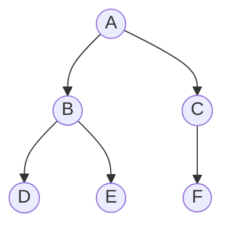
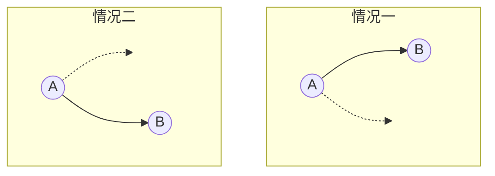
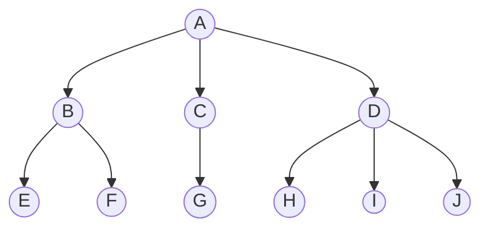
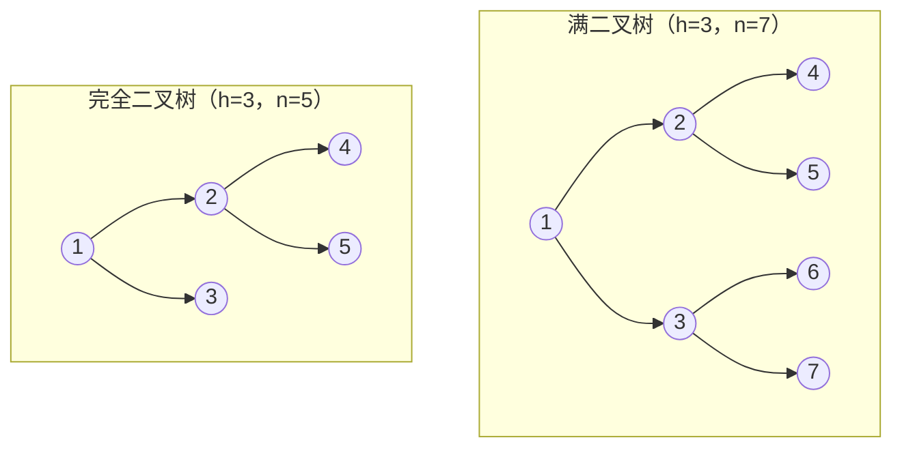
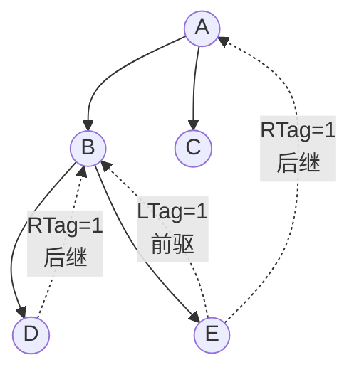
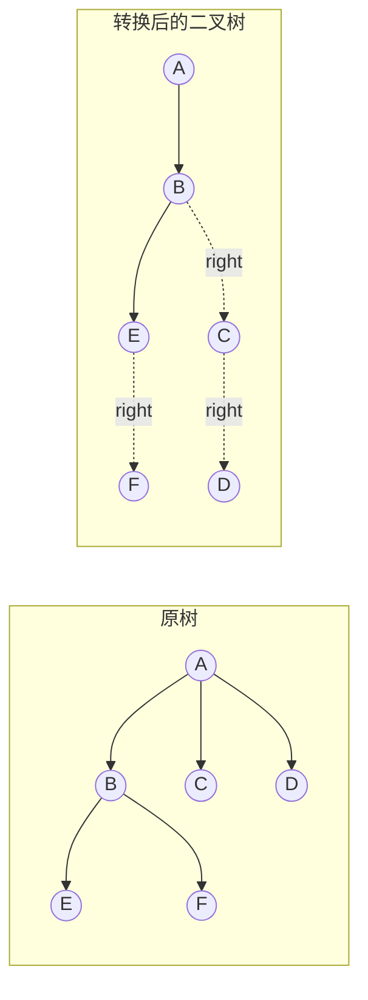
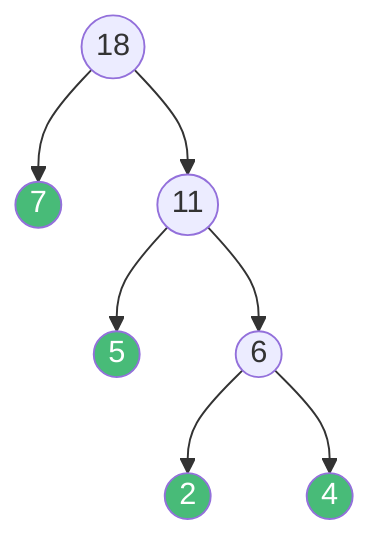
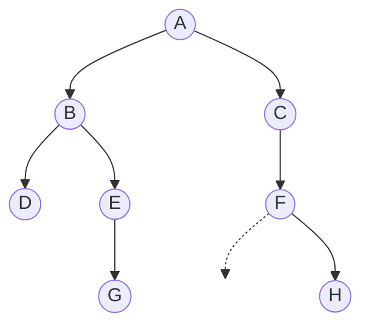

# 精通树与二叉树：性质推导、五种遍历、线索化、哈夫曼与并查集

> 课程编号：DS05
> 路线图来源：计算机基础四大件 · 数据结构（408 第 5 章）
> 难度：⭐⭐⭐⭐
> 预计阅读时间：80 分钟
> 内容基准：2026 年 8 月（408 考纲第 5 章「树与二叉树」，本章是数据结构分值最高的一章）
> **代码语言：Go**。408 考场要求 C/C++，差异见 [DS02 §6.4 对照表](./DS02-精通-线性表.md)。

---

## 引言：为什么「两个遍历序列能否唯一确定一棵二叉树」是个真问题

给你一棵二叉树的两个遍历序列，能还原出原树吗？

```
前序：A B D E C F
中序：D B E A C F
```

可以。**前序的第一个 `A` 是根**，在中序里找到 `A`，左边 `D B E` 是左子树、右边 `C F` 是右子树，递归下去唯一确定：



但换一组：

```
前序：A B
后序：B A
```

**无法确定**。B 是 A 的左孩子还是右孩子？两种情况的前序都是 `A B`、后序都是 `B A`：



**根源**：前序和后序都只能告诉你「谁是根」，但**没人告诉你左右子树的分界在哪**。而中序序列的作用恰恰就是——根把它劈成左右两半。

这个结论（**必须含中序才能唯一确定**）是 408 年年考的选择题。但比记住结论更重要的是理解它背后的信息论视角：一棵有 n 个结点的二叉树共有 **卡特兰数 C(n)** 种形态，两个遍历序列提供的信息量必须足够区分这么多种可能。

本章覆盖 408 数据结构分值最高的一块，从二叉树的五条性质推导，一路到线索二叉树、哈夫曼编码、并查集。

读完你应该能：

- 推导（而非死记）二叉树的五条性质，尤其是 `n₀ = n₂ + 1` 和完全二叉树的高度公式
- 手写前中后序遍历的递归与迭代版，以及层序遍历
- 由两个遍历序列还原二叉树，并说清为什么必须含中序
- 说清线索二叉树解决什么问题，手写中序线索化
- 手工构造哈夫曼树、计算 WPL 和哈夫曼编码
- 掌握树、森林与二叉树的相互转换（孩子兄弟表示法）
- 实现带路径压缩和按秩合并的并查集，说清它的复杂度

---

## 第一章 树的基本概念

### 1.1 定义与术语

**树**是 n（n ≥ 0）个结点的有限集合。n = 0 时称**空树**；n > 0 时：

1. 有且仅有一个特定的称为**根**的结点
2. 其余结点可分为 m 个**互不相交**的有限集，每个集合本身又是一棵树，称为根的**子树**



| 术语 | 定义 | 上图中的例子 |
|---|---|---|
| **结点的度** | 该结点的**孩子个数** | A 的度 = 3，B 的度 = 2，E 的度 = 0 |
| **树的度** | 树中所有结点度的**最大值** | 3（A 和 D 都是 3） |
| **叶结点/终端结点** | 度为 0 的结点 | E, F, G, H, I, J |
| **分支结点** | 度不为 0 的结点 | A, B, C, D |
| **孩子 / 双亲** | 结点的直接后继 / 直接前驱 | B 是 A 的孩子，A 是 B 的双亲 |
| **兄弟** | 同一双亲的结点 | B、C、D 互为兄弟 |
| **祖先 / 子孙** | 根到该结点路径上的所有结点 / 反之 | A 是 E 的祖先 |
| **层次（深度）** | 根为第 1 层，其孩子为第 2 层 | E 在第 3 层 |
| **高度** | 树中结点的**最大层数** | 3 |
| **路径 / 路径长度** | 结点序列 / 路径上的**边数** | A→B→E 的路径长度 = 2 |

**三个高频陷阱**：

1. **路径长度是边数不是结点数**。A→B→E 经过 3 个结点、2 条边，路径长度 = **2**。
2. **树的路径只能自上而下**（从祖先到子孙），不存在从 E 到 F 的路径。
3. **度为 m 的树** ≠ **m 叉树**。前者要求「至少有一个结点度为 m」，后者只是「每个结点度 ≤ m」，且 m 叉树可以为空。

### 1.2 树的性质

| # | 性质 | 说明 |
|---|---|---|
| 1 | 结点数 = **所有结点的度之和 + 1** | 每个结点（除根）都对应一条指向它的边 |
| 2 | 度为 m 的树，第 i 层**至多** m^(i−1) 个结点 | i ≥ 1 |
| 3 | 高度为 h 的 m 叉树**至多** (m^h − 1)/(m−1) 个结点 | 等比数列求和 |
| 4 | n 个结点的 m 叉树**最小高度** = ⌈log_m(n(m−1)+1)⌉ | 由性质 3 反解 |

**性质 1 的推导**（也是最常用的一条）：

```
树中每条边都恰好连接一个双亲和一个孩子。
每个结点（除根外）都有唯一双亲 → 边数 = n − 1
每条边又对应双亲的一个「度」   → 边数 = Σ(所有结点的度)
∴  n − 1 = Σ度   ⟹   n = Σ度 + 1
```

**典型应用**：「一棵树有 4 个度为 2 的结点、2 个度为 3 的结点，其余为叶子，问叶子有几个？」

```
设叶子数为 n₀，总结点数 n = n₀ + 4 + 2
Σ度 = 4×2 + 2×3 + n₀×0 = 14
由 n = Σ度 + 1：n₀ + 6 = 14 + 1 = 15
∴ n₀ = 9
```

---

## 第二章 二叉树

### 2.1 定义与五条性质

**二叉树**是 n（n ≥ 0）个结点的有限集合，或为空，或由根和两棵**互不相交**的、分别称为**左子树**和**右子树**的二叉树组成。

**二叉树与度为 2 的树的三点区别**（选择题原题）：

| | 二叉树 | 度为 2 的树 |
|---|---|---|
| 可以为空吗 | **可以**（空二叉树） | 不可以（至少 3 个结点） |
| 子树有序吗 | **有序**（左右不能颠倒） | 无序 |
| 结点度上限 | ≤ 2 | ≤ 2，且**至少有一个结点度为 2** |

**只有一个孩子时**，二叉树必须区分它是左孩子还是右孩子——这是「有序」的含义，也是二叉树形态数是卡特兰数而非其他值的原因。

#### 五条性质

**性质 1**：非空二叉树的**叶结点数 = 度为 2 的结点数 + 1**，即 `n₀ = n₂ + 1`

**推导**（必须会，408 大题会要求）：

```
设 n₀、n₁、n₂ 分别为度 0、1、2 的结点数
① 从结点总数看：n = n₀ + n₁ + n₂
② 从边数看：    每个度为 1 的结点贡献 1 条边，度为 2 的贡献 2 条
                边数 = n₁ + 2n₂
   又因为每个非根结点都有唯一入边：边数 = n − 1
③ 联立：n − 1 = n₁ + 2n₂
        (n₀ + n₁ + n₂) − 1 = n₁ + 2n₂
        n₀ = n₂ + 1   ∎
```

**这条性质与 n₁ 无关**——无论有多少个单孩子结点，`n₀ = n₂ + 1` 恒成立。这是它最好用的地方。

**性质 2**：二叉树第 i 层至多 `2^(i−1)` 个结点（i ≥ 1）

**性质 3**：高度为 h 的二叉树至多 `2^h − 1` 个结点（满二叉树时取等）

**性质 4**：完全二叉树中，对编号为 i 的结点（1-based，从上到下、从左到右编号）：

```
双亲：⌊i/2⌋           （i > 1 时）
左孩子：2i             （2i ≤ n 时存在）
右孩子：2i + 1         （2i+1 ≤ n 时存在）
所在层次：⌊log₂ i⌋ + 1
```

**性质 5**：n 个结点的完全二叉树高度 `h = ⌈log₂(n+1)⌉ = ⌊log₂ n⌋ + 1`

### 2.2 满二叉树与完全二叉树



| | 满二叉树 | 完全二叉树 |
|---|---|---|
| 定义 | 高度 h 且有 `2^h − 1` 个结点 | 编号与同高度满二叉树**一一对应**（只在最后一层右侧缺结点） |
| 叶子位置 | 全在最后一层 | 集中在最后两层 |
| 度为 1 的结点 | **0 个** | **至多 1 个** |
| 关系 | 满二叉树**是**完全二叉树 | 完全二叉树不一定是满的 |

**完全二叉树的三条重要推论**（408 高频）：

1. **度为 1 的结点至多 1 个**（且若存在，它只有左孩子）
2. 若 `n` 为**奇数**，则 `n₁ = 0`；若 `n` 为**偶数**，则 `n₁ = 1`
3. 由 `n₀ = n₂ + 1` 和 `n = n₀ + n₁ + n₂` 可解：**`n₀ = ⌈n/2⌉`，`n₂ = ⌊n/2⌋ − (n 为偶数 ? 0 : 0)`**

推论 2 的理由：完全二叉树按层序紧密排列，只有当结点总数为偶数时，最后一个分支结点才会只有左孩子。

**典型计算**：「完全二叉树有 768 个结点，问叶子结点有几个？」

```
n = 768（偶数）⟹ n₁ = 1
n₀ = n₂ + 1，且 n₀ + n₁ + n₂ = 768
n₀ + 1 + (n₀ − 1) = 768
2n₀ = 768  ⟹  n₀ = 384
```

**速算法**：完全二叉树的叶子数 = `⌈n/2⌉`。768/2 = **384** ✓

### 2.3 二叉树的存储

**顺序存储**：按完全二叉树的编号存入数组，`i` 的孩子在 `2i` 和 `2i+1`（1-based）。

```go
// 顺序存储：下标 0 闲置，从 1 开始
type SqBiTree struct {
    data [MaxSize]int
    n    int
}

func left(i int) int   { return 2 * i }
func right(i int) int  { return 2*i + 1 }
func parent(i int) int { return i / 2 }
```

**顺序存储的致命问题**：对非完全二叉树，必须用空位补齐，**最坏情况（单支树）需要 `2^h − 1` 个空间存 h 个结点**——存 20 层的单链需要 100 万个格子。

```
       A            单支树 A→B→C，只有 3 个结点
        \           但按完全二叉树编号：A=1, B=3, C=7
         B          需要 7 个数组格子，浪费 4 个
          \
           C
```

**所以顺序存储只适合完全二叉树**（堆就是这么存的，见 [DS08 排序](./DS08-精通-排序.md)）。

**链式存储**（通用方案）：

```go
type TreeNode struct {
    Val         int
    Left, Right *TreeNode
}
```

**空指针的数量**：n 个结点的二叉链表共有 `2n` 个指针域，其中 `n − 1` 个指向孩子，故**空指针数 = `2n − (n−1) = n + 1`**。

**这 n+1 个空指针是浪费**——线索二叉树（§4）正是要利用它们。

---

## 第三章 遍历

### 3.1 四种遍历方式


| 遍历 | 顺序 | 上图结果 |
|---|---|---|
| **先序（前序）** | 根 → 左 → 右 | `A B D E C F` |
| **中序** | 左 → 根 → 右 | `D B E A F C` |
| **后序** | 左 → 右 → 根 | `D E B F C A` |
| **层序** | 从上到下、从左到右 | `A B C D E F` |

**记法**：「先/中/后」指的是**根**被访问的时机，左子树永远在右子树之前。

### 3.2 递归实现

```go
func preorder(root *TreeNode, out *[]int) {
    if root == nil {
        return
    }
    *out = append(*out, root.Val) // 根
    preorder(root.Left, out)      // 左
    preorder(root.Right, out)     // 右
}

func inorder(root *TreeNode, out *[]int) {
    if root == nil {
        return
    }
    inorder(root.Left, out)
    *out = append(*out, root.Val) // 根在中间
    inorder(root.Right, out)
}

func postorder(root *TreeNode, out *[]int) {
    if root == nil {
        return
    }
    postorder(root.Left, out)
    postorder(root.Right, out)
    *out = append(*out, root.Val) // 根在最后
}
```

**三个函数只有 append 的位置不同**——这就是「先/中/后」的全部含义。

**复杂度**：时间 O(n)（每结点访问一次），空间 **O(h)**（递归栈，h 为树高）。最坏（单支树）O(n)，平衡时 O(log n)。

### 3.3 迭代实现

**中序迭代**（最常用，也是 §4 线索化的基础）：

```go
func inorderIter(root *TreeNode) []int {
    var out []int
    var stack []*TreeNode
    cur := root
    for cur != nil || len(stack) > 0 {
        for cur != nil { // ① 一路向左，全部压栈
            stack = append(stack, cur)
            cur = cur.Left
        }
        cur = stack[len(stack)-1] // ② 弹出并访问
        stack = stack[:len(stack)-1]
        out = append(out, cur.Val)
        cur = cur.Right // ③ 转向右子树
    }
    return out
}
```

**先序迭代**（更简单，右孩子先入栈）：

```go
func preorderIter(root *TreeNode) []int {
    if root == nil {
        return nil
    }
    var out []int
    stack := []*TreeNode{root}
    for len(stack) > 0 {
        node := stack[len(stack)-1]
        stack = stack[:len(stack)-1]
        out = append(out, node.Val)
        if node.Right != nil { // ★ 先压右，后压左 —— 出栈时才是左先右后
            stack = append(stack, node.Right)
        }
        if node.Left != nil {
            stack = append(stack, node.Left)
        }
    }
    return out
}
```

**后序迭代的偷懒解法**：后序是「左右根」，而「根右左」正好是它的逆序。把先序迭代的左右互换，再把结果反转：

```go
func postorderIter(root *TreeNode) []int {
    if root == nil {
        return nil
    }
    var out []int
    stack := []*TreeNode{root}
    for len(stack) > 0 {
        node := stack[len(stack)-1]
        stack = stack[:len(stack)-1]
        out = append(out, node.Val)
        if node.Left != nil { // ★ 与先序相反：先压左，后压右
            stack = append(stack, node.Left)
        }
        if node.Right != nil {
            stack = append(stack, node.Right)
        }
    }
    // 此时 out 是「根右左」，反转得「左右根」
    for i, j := 0, len(out)-1; i < j; i, j = i+1, j-1 {
        out[i], out[j] = out[j], out[i]
    }
    return out
}
```

**真正的后序迭代**（不用反转，408 可能要求）需要记录「上一个访问的结点」来判断右子树是否已处理：

```go
func postorderIterTrue(root *TreeNode) []int {
    var out []int
    var stack []*TreeNode
    var lastVisited *TreeNode
    cur := root
    for cur != nil || len(stack) > 0 {
        for cur != nil {
            stack = append(stack, cur)
            cur = cur.Left
        }
        top := stack[len(stack)-1]
        // ★ 右子树为空，或右子树刚被访问过 → 可以访问当前结点
        if top.Right == nil || top.Right == lastVisited {
            out = append(out, top.Val)
            stack = stack[:len(stack)-1]
            lastVisited = top
        } else {
            cur = top.Right // 否则先去右子树
        }
    }
    return out
}
```

### 3.4 层序遍历

用**队列**（呼应 [DS03](./DS03-精通-栈队列与数组.md)）：

```go
func levelOrder(root *TreeNode) [][]int {
    if root == nil {
        return nil
    }
    var out [][]int
    queue := []*TreeNode{root}
    for len(queue) > 0 {
        size := len(queue) // ★ 先记录本层结点数，才能分层输出
        level := make([]int, 0, size)
        for i := 0; i < size; i++ {
            node := queue[0]
            queue = queue[1:]
            level = append(level, node.Val)
            if node.Left != nil {
                queue = append(queue, node.Left)
            }
            if node.Right != nil {
                queue = append(queue, node.Right)
            }
        }
        out = append(out, level)
    }
    return out
}
```

**`size := len(queue)` 是分层的关键**——不记录本层数量就无法知道一层在哪结束。

**空间复杂度 O(w)**，w 是树的最大宽度。完全二叉树的最后一层有约 n/2 个结点，所以层序遍历的空间是 **O(n)**，比 DFS 的 O(h) 更费。

### 3.5 由遍历序列还原二叉树

**结论表**（408 必考选择题）：

| 已知序列组合 | 能否唯一确定 | 原因 |
|---|---|---|
| **前序 + 中序** | ✅ 能 | 前序定根，中序分左右 |
| **后序 + 中序** | ✅ 能 | 后序定根（最后一个），中序分左右 |
| **层序 + 中序** | ✅ 能 | 层序定根（第一个），中序分左右 |
| 前序 + 后序 | ❌ **不能** | 都只能定根，无法分左右 |

**记忆口诀**：**必须有中序**。前/后/层序负责「找根」，中序负责「劈成左右两半」，缺一不可。

**特例**：若已知这是一棵**满二叉树**（或每个结点度均为 0 或 2 的**正则二叉树**），则前序 + 后序**可以**唯一确定——因为不存在「只有一个孩子」的歧义。

**前序 + 中序还原的代码**：

```go
func buildTree(preorder, inorder []int) *TreeNode {
    if len(preorder) == 0 {
        return nil
    }
    rootVal := preorder[0] // ① 前序第一个是根
    root := &TreeNode{Val: rootVal}

    i := 0 // ② 在中序里找根的位置
    for ; inorder[i] != rootVal; i++ {
    }

    // ③ 左子树有 i 个结点，右子树有 len-i-1 个
    root.Left = buildTree(preorder[1:i+1], inorder[:i])
    root.Right = buildTree(preorder[i+1:], inorder[i+1:])
    return root
}
```

**切片区间的推导**（最易错处）：

```
preorder: [ root | 左子树的前序（i 个） | 右子树的前序 ]
             0      1 .. i                i+1 .. end

inorder:  [ 左子树的中序（i 个） | root | 右子树的中序 ]
             0 .. i-1              i      i+1 .. end
```

**用 map 优化查找**可把 O(n²) 降到 O(n)：

```go
func buildTreeFast(preorder, inorder []int) *TreeNode {
    idx := make(map[int]int, len(inorder))
    for i, v := range inorder {
        idx[v] = i // ★ 预处理，O(1) 查根位置
    }
    var build func(pl, pr, il, ir int) *TreeNode
    build = func(pl, pr, il, ir int) *TreeNode {
        if pl > pr {
            return nil
        }
        root := &TreeNode{Val: preorder[pl]}
        i := idx[preorder[pl]]
        leftSize := i - il
        root.Left = build(pl+1, pl+leftSize, il, i-1)
        root.Right = build(pl+leftSize+1, pr, i+1, ir)
        return root
    }
    return build(0, len(preorder)-1, 0, len(inorder)-1)
}
```

---

## 第四章 线索二叉树

### 4.1 要解决什么问题

普通二叉链表有 `n+1` 个空指针（§2.3），同时有个不便：**中序遍历时想知道某个结点的前驱/后继，必须重新遍历整棵树 O(n)**。

**线索二叉树**：把空指针利用起来，指向遍历序列中的前驱或后继。

```go
type ThreadNode struct {
    Val         int
    Left, Right *ThreadNode
    LTag, RTag  int // 0 = 指向孩子，1 = 指向【线索】
}
```

| Tag 值 | Left 的含义 | Right 的含义 |
|---|---|---|
| 0 | 左孩子 | 右孩子 |
| **1** | **中序前驱** | **中序后继** |



### 4.2 中序线索化

```go
var pre *ThreadNode // 全局变量：记录刚访问过的结点

func inThread(p *ThreadNode) {
    if p == nil {
        return
    }
    inThread(p.Left) // 递归左子树

    // ★ 访问 p 时建立线索
    if p.Left == nil { // 左空 → 指向前驱
        p.Left = pre
        p.LTag = 1
    }
    if pre != nil && pre.Right == nil { // 前驱的右空 → 指向后继（即 p）
        pre.Right = p
        pre.RTag = 1
    }
    pre = p // 更新 pre

    inThread(p.Right) // 递归右子树
}

func createInThread(root *ThreadNode) {
    pre = nil
    if root != nil {
        inThread(root)
        if pre.Right == nil { // ★ 处理最后一个结点
            pre.RTag = 1
        }
    }
}
```

**两个关键点**：

1. **建立线索的时机就是「访问结点」的时机**——中序线索化就在中序遍历的访问位置插入建线索的代码
2. **后继线索要「回头」建立**：处理结点 p 时，能确定的是 `pre` 的后继是 p，而 p 的后继要等下一轮才知道

### 4.3 在中序线索树上遍历

```go
// 找中序遍历的第一个结点：一路向左
func firstNode(p *ThreadNode) *ThreadNode {
    for p.LTag == 0 {
        p = p.Left
    }
    return p
}

// 求中序后继
func nextNode(p *ThreadNode) *ThreadNode {
    if p.RTag == 1 { // 有线索，直接返回
        return p.Right
    }
    return firstNode(p.Right) // 否则是右子树的最左结点
}

// 中序遍历：无需栈，无需递归！
func inorderThread(root *ThreadNode) []int {
    var out []int
    for p := firstNode(root); p != nil; p = nextNode(p) {
        out = append(out, p.Val)
    }
    return out
}
```

**这就是线索化的收益**：中序遍历的空间复杂度从 **O(h) 降到 O(1)**，不需要栈也不需要递归。

### 4.4 三种线索树的能力对比

| | 求前驱 | 求后继 | 说明 |
|---|---|---|---|
| **中序线索树** | ✅ O(1)~O(h) | ✅ O(1)~O(h) | 最实用 |
| **先序线索树** | ❌ 难 | ✅ 可以 | 求前驱需知道双亲 |
| **后序线索树** | ✅ 可以 | ❌ 难 | 求后继需知道双亲 |

**为什么先序线索树求前驱难**：先序是「根左右」，一个结点的前驱可能是它的双亲，也可能是双亲的左子树中最后访问的结点——而二叉链表**没有指向双亲的指针**。

**408 常考的一句话**：「在先序线索二叉树中，查找指定结点的先序后继很方便，但查找先序前驱不方便（需要知道双亲）」。后序反之。

---

## 第五章 树、森林与二叉树的转换

### 5.1 树的三种存储

| 存储方式 | 结构 | 优势 | 劣势 |
|---|---|---|---|
| **双亲表示法** | 数组，每元素存 `{data, parent下标}` | 求双亲 O(1) | 求孩子要遍历整个数组 |
| **孩子表示法** | 每结点一个孩子链表 | 求孩子方便 | 求双亲要遍历 |
| **孩子兄弟表示法** | 二叉链表：`firstChild` + `nextSibling` | **可转成二叉树**，最常用 | 求双亲不便 |

```go
// 双亲表示法
type PTNode struct {
    Data   int
    Parent int // 双亲在数组中的下标，根的 parent = -1
}

// 孩子兄弟表示法 —— 树转二叉树的基础
type CSNode struct {
    Data        int
    FirstChild  *CSNode // 指向【第一个孩子】
    NextSibling *CSNode // 指向【右兄弟】
}
```

### 5.2 树 → 二叉树

**口诀：左孩子，右兄弟**



**三步法**：

1. 所有**兄弟结点之间加连线**
2. 对每个结点，**只保留与第一个孩子的连线**，删去与其他孩子的连线
3. 以根为轴心**顺时针转 45°**

**关键性质**：树转成的二叉树，**根结点一定没有右子树**（因为根没有兄弟）。

### 5.3 森林 → 二叉树

1. 把每棵树各自转成二叉树
2. 从第二棵开始，依次作为**前一棵二叉树根的右子树**

**反过来**（二叉树 → 森林）：不断把根的右子树拆下来作为新树。

### 5.4 遍历的对应关系

**这是 408 的必考点**：

| 树的遍历 | 对应二叉树的遍历 |
|---|---|
| 树的**先根**遍历 | 二叉树的**先序**遍历 |
| 树的**后根**遍历 | 二叉树的**中序**遍历 |

| 森林的遍历 | 对应二叉树的遍历 |
|---|---|
| 森林的**先序**遍历 | 二叉树的**先序**遍历 |
| 森林的**中序**（后序）遍历 | 二叉树的**中序**遍历 |

**记忆**：树/森林**没有「中序」概念**（孩子数不定，根无法插在中间），所以只有两种对应。「后根 ↔ 中序」是最容易记反的一对。

---

## 第六章 哈夫曼树与哈夫曼编码

### 6.1 定义

**带权路径长度 WPL**：

```
WPL = Σ (第 i 个叶结点的权值 wᵢ × 它到根的路径长度 lᵢ)
```

**哈夫曼树（最优二叉树）**：WPL 最小的二叉树。

### 6.2 构造算法

**每次取权值最小的两棵树合并**：

```
给定权值 {7, 5, 2, 4}

步骤 1：取最小的 2 和 4 → 合并成权值 6 的新结点
        剩余 {7, 5, 6}
步骤 2：取最小的 5 和 6 → 合并成权值 11
        剩余 {7, 11}
步骤 3：合并 7 和 11 → 根，权值 18
```



**WPL 计算**（绿色为叶结点）：

```
WPL = 7×1 + 5×2 + 2×3 + 4×3 = 7 + 10 + 6 + 12 = 35
```

**另一种算法**（更快）：**WPL = 所有非叶结点权值之和** = 18 + 11 + 6 = 35 ✓

这个速算法的原理：每次合并产生的新结点权值，恰好等于它下面所有叶子在这一层的贡献。408 考场用它验算最快。

### 6.3 代码实现

```go
import "container/heap"

type HuffNode struct {
    Weight      int
    Left, Right *HuffNode
}

// 用小顶堆（优先队列）实现，见 DS08
func buildHuffman(weights []int) *HuffNode {
    h := &nodeHeap{}
    heap.Init(h)
    for _, w := range weights {
        heap.Push(h, &HuffNode{Weight: w})
    }
    for h.Len() > 1 {
        a := heap.Pop(h).(*HuffNode) // 最小
        b := heap.Pop(h).(*HuffNode) // 次小
        heap.Push(h, &HuffNode{
            Weight: a.Weight + b.Weight,
            Left:   a,
            Right:  b,
        })
    }
    return heap.Pop(h).(*HuffNode)
}
```

**复杂度 O(n log n)**：n 次插入 + n 次取最小，每次 O(log n)。

### 6.4 哈夫曼编码

**左分支标 0，右分支标 1**，从根到叶的路径就是该字符的编码。

用上例（权值即字符频率）：

| 字符 | 权值 | 编码 | 长度 |
|---|---|---|---|
| A | 7 | `0` | 1 |
| B | 5 | `10` | 2 |
| C | 2 | `110` | 3 |
| D | 4 | `111` | 3 |

**前缀编码**：**没有一个编码是另一个编码的前缀**。这保证了解码时**无歧义**——因为所有字符都在**叶结点**上，从根往下走遇到叶子就是一个完整字符。

**若编码不是前缀码**会怎样：假设 A=`0`、B=`01`，那么 `01` 无法判断是「A 后跟别的」还是「B」。

**平均编码长度** = WPL / 总权值 = 35/18 ≈ 1.94 位/字符，而定长编码需要 ⌈log₂4⌉ = 2 位。**压缩率取决于频率分布的不均匀程度**——分布越倾斜，哈夫曼收益越大。

### 6.5 三个易错点

1. **哈夫曼树不唯一**：权值相同的结点谁做左孩子谁做右孩子没有规定，但 **WPL 唯一**
2. **哈夫曼树没有度为 1 的结点**（每次都是合并两棵），所以 `n₀ = n₂ + 1`，**n 个叶子的哈夫曼树共有 `2n − 1` 个结点**
3. **权值大的离根近**——这是 WPL 最小的直观解释

---

## 第七章 并查集

### 7.1 用途与结构

**并查集（Disjoint Set Union, DSU）**维护一组不相交集合，支持两个操作：

- `Find(x)`：查 x 属于哪个集合（返回代表元）
- `Union(x, y)`：合并 x 和 y 所在的集合

**存储**：用**双亲表示法的树**（森林），每个集合是一棵树，根是代表元。

```go
type UnionFind struct {
    parent []int
    rank   []int // 秩：树高的上界
}

func NewUnionFind(n int) *UnionFind {
    uf := &UnionFind{parent: make([]int, n), rank: make([]int, n)}
    for i := range uf.parent {
        uf.parent[i] = i // 初始每个元素自成一个集合
    }
    return uf
}
```

### 7.2 两个优化

**优化一：路径压缩**——Find 时把路径上所有结点直接挂到根下：

```go
func (uf *UnionFind) Find(x int) int {
    if uf.parent[x] != x {
        uf.parent[x] = uf.Find(uf.parent[x]) // ★ 递归回来时顺便改指向
    }
    return uf.parent[x]
}
```

```
压缩前          压缩后（Find(4) 之后）
   1                1
   |              / | \
   2             2  3  4
   |
   3
   |
   4
```

**优化二：按秩合并**——总是把矮树挂到高树下，避免树长高：

```go
func (uf *UnionFind) Union(x, y int) bool {
    rx, ry := uf.Find(x), uf.Find(y)
    if rx == ry {
        return false // 已在同一集合
    }
    if uf.rank[rx] < uf.rank[ry] {
        rx, ry = ry, rx // 保证 rx 是较高的树
    }
    uf.parent[ry] = rx
    if uf.rank[rx] == uf.rank[ry] {
        uf.rank[rx]++ // 只有等高合并才会长高
    }
    return true
}
```

### 7.3 复杂度

| 优化 | 单次操作复杂度 |
|---|---|
| 无优化 | O(n) 最坏（退化成链） |
| 只路径压缩 | 摊还 O(log n) |
| 只按秩合并 | O(log n) |
| **两者都用** | **摊还 O(α(n))**，α 是反阿克曼函数 |

**α(n) 在任何实际输入下都 ≤ 4**（n 小于宇宙原子数时 α(n) ≤ 4），所以**实践中可视为 O(1)**。

**408 只要求知道「路径压缩后接近 O(1)」**，不要求证明。但要能手写带路径压缩的 Find。

---

## 第八章 408 高频考点与陷阱清单

### 8.1 考点分布

第 5 章是数据结构**分值最高**的一章：**3-4 道选择题（6-8 分）+ 高概率的算法大题（13 分）**。

大题常考类型：

1. 求二叉树的高度/宽度/叶子数
2. 判断是否为完全二叉树 / 二叉排序树
3. 求两个结点的最近公共祖先
4. 层序遍历的变形（之字形、每层最大值）
5. 由遍历序列还原树

### 8.2 八大陷阱

**陷阱 1：路径长度数成了结点数**

路径长度 = **边数** = 结点数 − 1。

**陷阱 2：混淆「度为 2 的树」和「二叉树」**

二叉树可以为空、子树有序；度为 2 的树不能空、子树无序。

**陷阱 3：前序 + 后序能确定二叉树**

**不能**（除非是满二叉树/正则二叉树）。必须含**中序**。

**陷阱 4：树的后根遍历对应二叉树的后序遍历**

**错**！树的后根遍历 ↔ 二叉树的**中序**遍历。这是最容易记反的一对。

**陷阱 5：完全二叉树叶子数算错**

速记：`n₀ = ⌈n/2⌉`。n=768 → 384；n=767 → 384。

**陷阱 6：以为哈夫曼树唯一**

**树形不唯一，但 WPL 唯一**。左右孩子交换、等权值结点的选择顺序都会产生不同树形。

**陷阱 7：二叉链表空指针数算错**

n 个结点 → `2n` 个指针域 → `n−1` 个指向孩子 → 空指针 **`n+1`** 个。

**陷阱 8：线索二叉树中还有空指针吗**

**有**：中序线索树中，**第一个结点的 Left 和最后一个结点的 Right 仍为空**（它们没有前驱/后继）。除非加头结点构成循环。

### 8.3 必背公式速查

| 项目 | 公式 |
|---|---|
| 树：结点数与度 | `n = Σ度 + 1` |
| 二叉树性质 1 | `n₀ = n₂ + 1` |
| 二叉树第 i 层最多 | `2^(i−1)` |
| 高 h 的二叉树最多 | `2^h − 1` |
| 完全二叉树高度 | `⌈log₂(n+1)⌉ = ⌊log₂ n⌋ + 1` |
| 完全二叉树叶子数 | `⌈n/2⌉` |
| 完全二叉树 n₁ | n 为偶数时 1，奇数时 0 |
| 完全二叉树孩子编号 | 左 `2i`，右 `2i+1`，双亲 `⌊i/2⌋` |
| 二叉链表空指针数 | `n + 1` |
| n 个结点的不同二叉树形态数 | 卡特兰数 `C(2n,n)/(n+1)` |
| 哈夫曼树结点总数 | `2n − 1`（n 个叶子） |
| 哈夫曼树 WPL 速算 | **所有非叶结点权值之和** |

---

## 第九章 力扣实战题单

树是力扣题量最大的板块之一，**递归思维**在这里被训练得最充分。

### 必刷档（10 题）

| 题号 | 题目 | 练什么 | 目标复杂度 |
|---|---|---|---|
| 144 | [二叉树的前序遍历](https://leetcode.cn/problems/binary-tree-preorder-traversal/) | §3.2/3.3 递归 + 迭代都写一遍 | O(n) / O(h) |
| 94 | [二叉树的中序遍历](https://leetcode.cn/problems/binary-tree-inorder-traversal/) | 迭代版是线索化的基础 | O(n) / O(h) |
| 145 | [二叉树的后序遍历](https://leetcode.cn/problems/binary-tree-postorder-traversal/) | 反转法 + 真后序两种迭代 | O(n) / O(h) |
| 102 | [二叉树的层序遍历](https://leetcode.cn/problems/binary-tree-level-order-traversal/) | §3.4 队列 + `size` 分层 | O(n) / O(w) |
| 104 | [二叉树的最大深度](https://leetcode.cn/problems/maximum-depth-of-binary-tree/) | 最简单的树形递归，理解「自底向上」 | O(n) / O(h) |
| 226 | [翻转二叉树](https://leetcode.cn/problems/invert-binary-tree/) | 递归的威力，3 行解决 | O(n) / O(h) |
| 101 | [对称二叉树](https://leetcode.cn/problems/symmetric-tree/) | 双指针递归，需要辅助函数 | O(n) / O(h) |
| 110 | [平衡二叉树](https://leetcode.cn/problems/balanced-binary-tree/) | 自底向上剪枝，为 DS07 的 AVL 铺垫 | O(n) / O(h) |
| 112 | [路径总和](https://leetcode.cn/problems/path-sum/) | 根到叶路径的回溯 | O(n) / O(h) |
| 105 | [从前序与中序遍历序列构造二叉树](https://leetcode.cn/problems/construct-binary-tree-from-preorder-and-inorder-traversal/) | **§3.5 的直接落地** | O(n) / O(n) |

**104 最大深度**——树形递归的最小范例：

```go
func maxDepth(root *TreeNode) int {
    if root == nil {
        return 0
    }
    l, r := maxDepth(root.Left), maxDepth(root.Right)
    return max(l, r) + 1 // 「我的深度 = 更深的那个孩子 + 1」
}
```

**110 平衡二叉树的剪枝技巧**——用 −1 表示「已不平衡」，避免重复计算高度：

```go
func isBalanced(root *TreeNode) bool {
    return height(root) != -1
}

func height(root *TreeNode) int {
    if root == nil {
        return 0
    }
    l := height(root.Left)
    if l == -1 { // ★ 左子树已不平衡，直接向上传递
        return -1
    }
    r := height(root.Right)
    if r == -1 {
        return -1
    }
    if abs(l-r) > 1 {
        return -1
    }
    return max(l, r) + 1
}
```

**朴素写法是 O(n²)**（每个结点都重新算一遍高度），这个版本**自底向上一次遍历 O(n)**。区别在于：朴素版「自顶向下判断」，优化版「自底向上返回」。

### 进阶档（8 题）

| 题号 | 题目 | 练什么 |
|---|---|---|
| 236 | [二叉树的最近公共祖先](https://leetcode.cn/problems/lowest-common-ancestor-of-a-binary-tree/) | **LCA 经典**，后序递归的精妙应用 |
| 543 | [二叉树的直径](https://leetcode.cn/problems/diameter-of-binary-tree/) | 「经过某点的最长路径」与「返回值」分离 |
| 199 | [二叉树的右视图](https://leetcode.cn/problems/binary-tree-right-side-view/) | 层序取每层最后一个 |
| 103 | [二叉树的锯齿形层序遍历](https://leetcode.cn/problems/binary-tree-zigzag-level-order-traversal/) | 层序 + 奇偶层反转 |
| 114 | [二叉树展开为链表](https://leetcode.cn/problems/flatten-binary-tree-to-linked-list/) | 原地改指针，O(1) 空间解法用 Morris 思想 |
| 297 | [二叉树的序列化与反序列化](https://leetcode.cn/problems/serialize-and-deserialize-binary-tree/) | 前序 + `#` 占位，呼应「空指针」概念 |
| 124 | [二叉树中的最大路径和](https://leetcode.cn/problems/binary-tree-maximum-path-sum/) | 543 的加权版，负值剪枝 |
| 662 | [二叉树最大宽度](https://leetcode.cn/problems/maximum-width-of-binary-tree/) | **用完全二叉树编号 `2i`/`2i+1`**，§2.1 性质 4 的应用 |

**236 最近公共祖先**——后序遍历的经典应用：

```go
func lowestCommonAncestor(root, p, q *TreeNode) *TreeNode {
    if root == nil || root == p || root == q {
        return root // 找到目标或到底了
    }
    left := lowestCommonAncestor(root.Left, p, q)
    right := lowestCommonAncestor(root.Right, p, q)

    if left != nil && right != nil {
        return root // ★ 两边各找到一个 → 当前结点就是 LCA
    }
    if left != nil {
        return left // 都在左边
    }
    return right // 都在右边（或都没找到，返回 nil）
}
```

**这题的精妙之处**：返回值有**双重含义**——要么是「找到的目标结点」，要么是「已确定的 LCA」。后序遍历保证子树信息先汇总上来，才能做判断。

**662 最大宽度**用到了 §2.1 的性质 4：

```go
func widthOfBinaryTree(root *TreeNode) int {
    type item struct {
        node *TreeNode
        idx  int // ★ 按完全二叉树编号
    }
    ans := 0
    queue := []item{{root, 0}}
    for len(queue) > 0 {
        // 本层宽度 = 最右编号 − 最左编号 + 1
        w := queue[len(queue)-1].idx - queue[0].idx + 1
        if w > ans {
            ans = w
        }
        var next []item
        base := queue[0].idx // 减去基准防溢出
        for _, it := range queue {
            if it.node.Left != nil {
                next = append(next, item{it.node.Left, 2 * (it.idx - base)})
            }
            if it.node.Right != nil {
                next = append(next, item{it.node.Right, 2*(it.idx-base) + 1})
            }
        }
        queue = next
    }
    return ans
}
```

**「减去基准」是防止编号指数爆炸的关键**——深树的编号会超过 int64。

### 挑战档（4 题）

| 题号 | 题目 | 练什么 |
|---|---|---|
| 99 | [恢复二叉搜索树](https://leetcode.cn/problems/recover-binary-search-tree/) | 中序遍历找逆序对，O(1) 空间要用 **Morris 遍历** |
| 968 | [监控二叉树](https://leetcode.cn/problems/binary-tree-cameras/) | 树形 DP + 贪心，状态设计极难 |
| 337 | [打家劫舍 III](https://leetcode.cn/problems/house-robber-iii/) | 树形 DP 入门，「选/不选」两状态 |
| 547 | [省份数量](https://leetcode.cn/problems/number-of-provinces/) | **§7 并查集**的直接应用（也可 DFS） |

**547 省份数量**——并查集模板题：

```go
func findCircleNum(isConnected [][]int) int {
    n := len(isConnected)
    uf := NewUnionFind(n)
    count := n // 初始 n 个独立集合
    for i := 0; i < n; i++ {
        for j := i + 1; j < n; j++ {
            if isConnected[i][j] == 1 && uf.Union(i, j) {
                count-- // ★ 每成功合并一次，集合数减 1
            }
        }
    }
    return count
}
```

**Morris 遍历**（99 题的 O(1) 空间解法）值得单独一提——它是**线索二叉树思想的临时版**：遍历时临时建立线索，用完就拆掉，从而实现 O(1) 空间的中序遍历。理解了 §4 的线索化，Morris 就不难懂。

### 题单进度自查

1. 前中后序的**递归和迭代**我都能默写吗？
2. 105（前序+中序建树）的切片区间我能推导而不是背吗？
3. 236 的返回值双重含义我能说清吗？
4. 110 的 O(n) 剪枝和 O(n²) 朴素版差在哪？

---

## 第十章 练习题

### 选择题

**1.** 一棵二叉树有 100 个度为 2 的结点、20 个度为 1 的结点，则叶结点的个数是：
A. 100　B. 101　C. 120　D. 121

**2.** 若一棵完全二叉树有 1000 个结点，则它有多少个叶结点：
A. 250　B. 499　C. 500　D. 501

**3.** 下列遍历序列组合中，**不能**唯一确定一棵二叉树的是：
A. 前序 + 中序　B. 后序 + 中序　C. 前序 + 后序　D. 层序 + 中序

**4.** 已知一棵树的先根遍历序列为 `ABCDEF`，其转换成的二叉树的**中序**遍历序列是这棵树的：
A. 先根遍历序列　B. 后根遍历序列　C. 层序遍历序列　D. 无对应关系

**5.** 有 5 个叶结点、权值分别为 1、2、3、4、5 的哈夫曼树，其 WPL 为：
A. 33　B. 15　C. 30　D. 35

**6.** n 个结点的二叉链表中，空指针域的个数是：
A. n−1　B. n　C. n+1　D. 2n

**7.** 在中序线索二叉树中，**仍然为空**的指针域个数是：
A. 0　B. 1　C. 2　D. n+1

### 计算与设计题

**8.** 已知二叉树的前序遍历为 `ABDEGCFH`，中序遍历为 `DBGEAFHC`，画出这棵二叉树，并给出后序遍历序列。

**9.** 给定权值集合 `{5, 29, 7, 8, 14, 23, 3, 11}`，构造哈夫曼树并求 WPL。

**10.**（408 大题风格）设计一个算法，求任意给定二叉树中**值为 x 的结点的所有祖先**。要求：①给出设计思想；②给出代码；③说明时空复杂度。

**11.** 设计一个算法判断给定二叉树是否为**完全二叉树**。

### 答案与解析

<details>
<summary>点击展开</summary>

**1. B**

由性质 1：`n₀ = n₂ + 1 = 100 + 1 = 101`。

**注意 n₁ = 20 是干扰项**——性质 1 与 n₁ 完全无关。选 D 的人可能算成了 `n₀ = n₂ + n₁ + 1`。

**2. C**

完全二叉树叶子数 = `⌈n/2⌉ = ⌈1000/2⌉ = 500`。

**详细推导**（若忘了速算公式）：

```
n = 1000（偶数）⟹ n₁ = 1
n₀ = n₂ + 1
n₀ + n₁ + n₂ = 1000
n₀ + 1 + (n₀ − 1) = 1000  ⟹  n₀ = 500 ✓
```

**3. C**

前序和后序**都只能定根，无法确定左右子树的分界**。见引言的反例：`前序 AB / 后序 BA` 对应两棵不同的树。

**特例提醒**：若已知是满二叉树或正则二叉树（每个结点度为 0 或 2），前序+后序**可以**确定。

**4. B**

**树的后根遍历 ↔ 二叉树的中序遍历**。这是 §5.4 的对应关系表，也是最容易记反的一对。

A 是干扰项（先根 ↔ 先序，这条是对的，但问的是中序）。

**5. A**

构造过程：

```
初始 {1, 2, 3, 4, 5}
① 取 1、2 → 合并成 3        剩余 {3, 3, 4, 5}
② 取 3、3 → 合并成 6        剩余 {4, 5, 6}
③ 取 4、5 → 合并成 9        剩余 {6, 9}
④ 取 6、9 → 合并成 15（根）
```

**WPL 速算 = 所有非叶结点权值之和** = 3 + 6 + 9 + 15 = **33** ✓

**逐叶验算**：叶子 1、2 在第 4 层（路径长 3），叶子 3、4、5 均在第 3 层（路径长 2）。

```
WPL = 1×3 + 2×3 + 3×2 + 4×2 + 5×2 = 3 + 6 + 6 + 8 + 10 = 33 ✓
```

B（15）是根的权值即总权值，不是 WPL。

**6. C**

n 个结点 → `2n` 个指针域；除根外每个结点有一个入边 → `n−1` 个指针指向孩子。

**空指针数 = `2n − (n−1) = n + 1`** ✓

**7. C**

中序线索化后，只剩**两个**空指针：

- **第一个结点的 Left**（它没有中序前驱）
- **最后一个结点的 Right**（它没有中序后继）

其余 `n+1−2 = n−1` 个空指针全部变成了线索。

> 若在树上加一个**头结点**并让首尾相连（构成循环线索链表），这两个空指针也能消除——这是教材里「带头结点的线索二叉树」的做法。

**8.**

**还原过程**：

```
前序 ABDEGCFH，中序 DBGEAFHC

① 前序首字符 A 是根，中序中 A 的左边 DBGE 是左子树，右边 FHC 是右子树
② 左子树：前序 BDEG，中序 DBGE
   → B 是根，中序里 B 左边 D 是左子树，右边 GE 是右子树
   → 右子树：前序 EG，中序 GE → E 是根，G 是 E 的左孩子
③ 右子树：前序 CFH，中序 FHC
   → C 是根，中序里 C 左边 FH 是左子树（无右子树）
   → 左子树：前序 FH，中序 FH → F 是根，H 是 F 的右孩子
```



**后序遍历**（左 → 右 → 根）：`D G E B H F C A`

**验算**：后序最后一个必是根 A ✓；中序中 A 左边有 4 个结点 `DBGE`，后序前 4 个也应是左子树 `DGEB` ✓

**9.**

权值 `{5, 29, 7, 8, 14, 23, 3, 11}`，总和 = 100。

**构造过程**（每次取两个最小）：

| 步骤 | 取出 | 合并成 | 剩余集合 |
|---|---|---|---|
| ① | 3, 5 | **8** | {7, 8, 8, 11, 14, 23, 29} |
| ② | 7, 8 | **15** | {8, 11, 14, 15, 23, 29} |
| ③ | 8, 11 | **19** | {14, 15, 19, 23, 29} |
| ④ | 14, 15 | **29** | {19, 23, 29, 29} |
| ⑤ | 19, 23 | **42** | {29, 29, 42} |
| ⑥ | 29, 29 | **58** | {42, 58} |
| ⑦ | 42, 58 | **100** | {100} ← 根 |

**WPL = 所有非叶结点权值之和** = 8 + 15 + 19 + 29 + 42 + 58 + 100 = **271**

**注意步骤 ④**：此时集合中有原始权值 29 和新合成的 29。**取哪个都可以**（WPL 相同，但树形不同）——这就是「哈夫曼树不唯一，WPL 唯一」的具体体现。

**10.**

**①设计思想**：用**后序遍历**的非递归算法。后序遍历的特点是——**当访问到结点 p 时，栈中保存的恰好是从根到 p 的路径上的所有祖先**。因此只要在后序遍历中找到值为 x 的结点，此时栈内元素即为答案。

**②代码**：

```go
type stackItem struct {
    node *TreeNode
    tag  int // 0 = 左子树未访问完，1 = 左右都访问完
}

func findAncestors(root *TreeNode, x int) []int {
    var stack []stackItem
    p := root
    for p != nil || len(stack) > 0 {
        for p != nil { // 一路向左压栈
            stack = append(stack, stackItem{p, 0})
            p = p.Left
        }
        for len(stack) > 0 && stack[len(stack)-1].tag == 1 {
            top := stack[len(stack)-1]
            if top.node.Val == x { // ★ 找到了，栈中剩余即为祖先
                ans := make([]int, 0, len(stack)-1)
                for i := 0; i < len(stack)-1; i++ {
                    ans = append(ans, stack[i].node.Val)
                }
                return ans
            }
            stack = stack[:len(stack)-1]
        }
        if len(stack) > 0 {
            stack[len(stack)-1].tag = 1
            p = stack[len(stack)-1].node.Right
        }
    }
    return nil
}
```

**更简洁的递归写法**（同样正确，408 也接受）：

```go
func findAncestorsRec(root *TreeNode, x int, path *[]int) bool {
    if root == nil {
        return false
    }
    if root.Val == x {
        return true // 找到目标，不把自己加入路径
    }
    *path = append(*path, root.Val) // 先假设当前结点在路径上
    if findAncestorsRec(root.Left, x, path) || findAncestorsRec(root.Right, x, path) {
        return true
    }
    *path = (*path)[:len(*path)-1] // ★ 回溯：不在路径上就弹出
    return false
}
```

**③复杂度**：时间 **O(n)**（最坏遍历整棵树），空间 **O(h)**（栈深度 = 树高，最坏 O(n)）。

**关键点**：递归版的**回溯（弹栈）**不能漏——否则不在路径上的结点会残留在结果里。

**11.**

**设计思想**：**层序遍历**，且**把空结点也入队**。完全二叉树的特点是——按层序排列时，所有非空结点连续出现在前面，一旦遇到第一个空结点，**其后必须全是空**。

```go
func isCompleteTree(root *TreeNode) bool {
    if root == nil {
        return true
    }
    queue := []*TreeNode{root}
    metNil := false // 是否已遇到过空结点
    for len(queue) > 0 {
        node := queue[0]
        queue = queue[1:]
        if node == nil {
            metNil = true // ★ 标记：从此以后不允许再有非空结点
            continue
        }
        if metNil {
            return false // 空结点之后又出现非空 → 不是完全二叉树
        }
        // ★ 空孩子也入队，这是本算法的关键
        queue = append(queue, node.Left, node.Right)
    }
    return true
}
```

**时间 O(n)，空间 O(w)**（w 为最大宽度）。

**为什么必须把空结点入队**：只入队非空结点的话，无法区分「缺口在哪」。例如：

```
      1                 1
     / \               / \
    2   3             2   3
   /                   \
  4                     4
  ✓ 完全二叉树         ✗ 不是（2 缺左孩子）
```

两者的非空层序序列都是 `1 2 3 4`，只有把空结点也记录下来才能区分。

</details>

---

## 小结

| 要点 | 一句话 |
|---|---|
| 路径长度 | **边数**不是结点数 |
| 树 vs 二叉树 | 二叉树可空、子树有序；度为 2 的树不能空、无序 |
| 性质 1 | `n₀ = n₂ + 1`，**与 n₁ 无关** |
| 完全二叉树 | 叶子数 `⌈n/2⌉`；n 为偶数时 n₁=1，奇数时 n₁=0 |
| 顺序存储 | 只适合完全二叉树，单支树最坏要 `2^h − 1` 空间 |
| 空指针数 | `n + 1`，线索化后只剩 **2** 个 |
| 遍历三兄弟 | 只差 append 的位置；空间 O(h)，层序是 O(w) |
| 唯一确定二叉树 | **必须含中序**；前序+后序不行（满二叉树除外） |
| 树↔二叉树 | 左孩子右兄弟；**树的后根 ↔ 二叉树的中序**（最易记反） |
| 线索二叉树 | 利用 n+1 个空指针；中序遍历降到 **O(1) 空间** |
| 哈夫曼 | WPL = **非叶结点权值之和**；树不唯一但 WPL 唯一；`2n−1` 个结点 |
| 前缀编码 | 所有字符在叶子上 → 无歧义解码 |
| 并查集 | 路径压缩 + 按秩合并 → 摊还 **O(α(n)) ≈ O(1)** |

**下一章** → [DS06 图](./DS06-精通-图.md)，把「一对多」放宽到「多对多」，408 数据结构里最难的一章。

---

## 延伸阅读

- 《数据结构（C 语言版）》严蔚敏 第 6 章 —— 408 指定教材
- 《算法导论》第 12 章（二叉搜索树）、第 21 章（并查集）—— 并查集复杂度 O(α(n)) 的完整证明
- [Morris Traversal 详解](https://www.geeksforgeeks.org/inorder-tree-traversal-without-recursion-and-without-stack-using-morris-traversal/) —— O(1) 空间遍历，线索化思想的临时版
- 本仓库对照：
  - [algorithm/12 二叉树](../../algorithm/12-精通-二叉树.md) —— 同一批题的**刷题技巧**视角
  - [algorithm/13 堆与 TopK](../../algorithm/13-精通-堆与TopK.md) —— 完全二叉树的顺序存储应用
  - [DS07 查找](./DS07-精通-查找.md) —— BST、AVL、B 树，二叉树的有序化延伸
  - [DS08 排序](./DS08-精通-排序.md) —— 堆排序，本章「完全二叉树顺序存储」的落地
