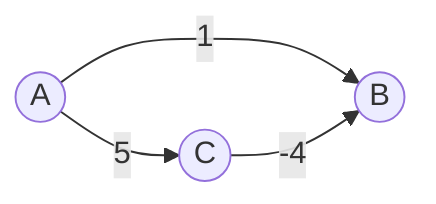
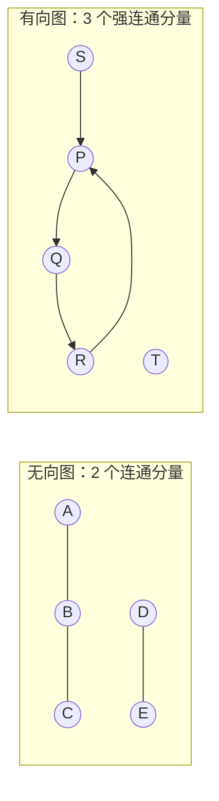
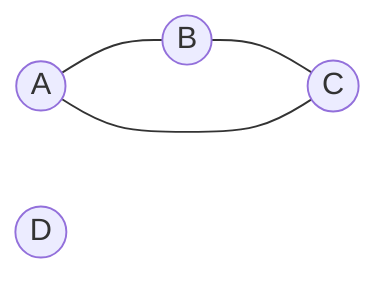
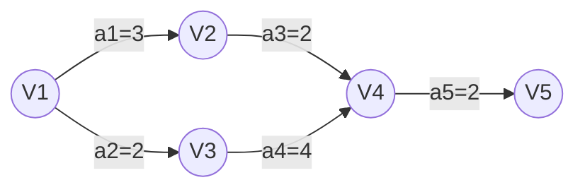

# 精通图：存储结构、遍历、最小生成树、最短路径、拓扑排序与关键路径

> 课程编号：DS06
> 路线图来源：计算机基础四大件 · 数据结构（408 第 6 章）
> 难度：⭐⭐⭐⭐⭐
> 预计阅读时间：90 分钟
> 内容基准：2026 年 8 月（408 考纲第 6 章「图」，本章算法最多、手工模拟题最难）
> **代码语言：Go**。408 考场要求 C/C++，差异见 [DS02 §6.4 对照表](./DS02-精通-线性表.md)。

---

## 引言：为什么 Dijkstra 遇到负权边就崩

Dijkstra 是最短路径算法里名气最大的一个。看这张只有 3 个顶点的图：



从 A 出发求最短路。Dijkstra 的执行过程：

```
初始：dist[A]=0, dist[B]=∞, dist[C]=∞
① 选 dist 最小的未确定顶点 A（dist=0），松弛它的邻居：
   dist[B] = 1,  dist[C] = 5
② 选 dist 最小的未确定顶点 B（dist=1）→ 【标记 B 为已确定，dist[B] = 1 锁定】
③ 选 C（dist=5），松弛 C 的邻居：dist[B] = 5 + (−4) = 1
   但 B 已经确定了，不再更新
最终 dist[B] = 1
```

结果 `dist[B] = 1`。但真实的最短路是 **A→C→B = 5 + (−4) = 1**……这次碰巧相等。把边权改一下：


Dijkstra 在第 ② 步就锁死 `dist[B] = 1`，而真实最短路是 `A→C→B = 2 − 5 = −3`。**答案错了**。

**根本原因**：Dijkstra 建立在一个贪心假设上——**当前 dist 最小的顶点，其最短路已经确定，不会再变短**。这个假设成立的前提是**所有边权非负**（走更多的边只会让路径更长）。负权边直接摧毁了这个前提。

这就是为什么 408 反复强调「Dijkstra 不能有负权边，Floyd 可以（但不能有负权回路）」。**理解为什么，比记住结论重要得多**——因为考试会考「下列哪种情况可以用 Dijkstra」这类判断。

本章是 408 数据结构算法密度最高的一章：两种存储、两种遍历、两个 MST 算法、两个最短路算法、拓扑排序与关键路径，共 9 个必须会手工模拟的算法。

读完你应该能：

- 说清图的十余个术语，尤其是连通分量 / 强连通分量 / 生成树的区别
- 手写邻接矩阵和邻接表，说清各自的空间与操作复杂度
- 手工模拟 BFS/DFS，写出遍历序列与生成树
- 手工模拟 Prim 和 Kruskal，画出 MST 的构造过程
- 手工模拟 Dijkstra 的 dist/path 数组变化表（408 最爱考的题型）
- 手工模拟 Floyd 的三个矩阵迭代
- 求拓扑排序序列，并判断是否唯一
- 求 AOE 网的关键路径、事件的最早/最迟发生时间

---

## 第一章 基本概念

### 1.1 定义与分类

**图 G = (V, E)**，V 是顶点集（**不能为空**），E 是边集（**可以为空**）。

> **图的顶点集 V 一定非空**，这与「树可以为空」不同。这是选择题原题。

| 分类 | 定义 |
|---|---|
| **无向图** | 边无方向，用 `(v, w)` 表示 |
| **有向图** | 边有方向，用 `<v, w>` 表示弧，v 是弧尾，w 是弧头 |
| **简单图** | 无重边、无自环。408 讨论的都是简单图 |
| **多重图** | 允许重边或自环 |

### 1.2 完全图与边数

| 类型 | 边数范围 | 完全图边数 |
|---|---|---|
| 无向图 | 0 ~ `n(n−1)/2` | `n(n−1)/2` |
| 有向图 | 0 ~ `n(n−1)` | `n(n−1)` |

**推导**：无向完全图中任意两顶点之间有一条边，即从 n 个顶点中取 2 个的组合数 `C(n,2) = n(n−1)/2`。有向图每对顶点有两条弧，故翻倍。

### 1.3 度

| | 定义 | 关系 |
|---|---|---|
| **无向图的度** | 依附于该顶点的边数 | **Σ度 = 2 × 边数** |
| **有向图的入度 ID(v)** | 以 v 为**终点**的弧数 | **Σ入度 = Σ出度 = 弧数** |
| **有向图的出度 OD(v)** | 以 v 为**起点**的弧数 | 度 = 入度 + 出度 |

**「Σ度 = 2E」是握手定理**——每条边贡献 2 个度。这条在计算题里用得极多。

### 1.4 连通性（本章最易混的一组概念）

| 术语 | 适用 | 定义 |
|---|---|---|
| **连通** | 无向图 | 顶点 v 到 w **有路径** |
| **连通图** | 无向图 | **任意两顶点**都连通 |
| **连通分量** | 无向图 | **极大**连通子图 |
| **强连通** | 有向图 | v 到 w **且** w 到 v 都有路径 |
| **强连通图** | 有向图 | 任意两顶点都强连通 |
| **强连通分量** | 有向图 | **极大**强连通子图 |

**「极大」的含义**：不能再加入任何顶点，否则就不连通了。**注意与「极小」区分**：

```
连通分量 —— 极大连通子图（顶点尽可能多）
生成树   —— 极小连通子图（边尽可能少，n−1 条）
```



上图右侧：`{P,Q,R}` 互相可达是一个强连通分量，`{S}`（S 能到 P 但 P 回不来）和 `{T}` 各自成一个。

### 1.5 生成树与生成森林

**生成树**：包含图中**全部顶点**的**极小连通子图**，有且仅有 **n − 1 条边**。

**三个关键推论**：

1. 生成树**砍掉一条边**就不连通（极小性）
2. 生成树**加上一条边**必定形成回路
3. **只有连通图才有生成树**；非连通图有**生成森林**

**n 个顶点、n−1 条边的图一定是树吗**？——**不一定**！可能有回路且不连通：



3 条边、4 个顶点，但有回路且 D 孤立。**「n 个顶点 n−1 条边」+「连通」才能推出是树**。

### 1.6 其他术语

| 术语 | 定义 |
|---|---|
| **路径长度** | 路径上**边的数目**（带权图中是权值之和，称**带权路径长度**） |
| **回路/环** | 第一个和最后一个顶点相同的路径 |
| **简单路径** | 顶点不重复出现的路径 |
| **简单回路** | 除首尾外顶点不重复的回路 |
| **距离** | v 到 w 的**最短路径长度**，不存在路径时记为 ∞ |
| **稠密图 / 稀疏图** | `E > n log n` 视为稠密，反之稀疏（无严格界限） |
| **有向树** | 一个顶点入度为 0、其余入度为 1 的有向图 |

---

## 第二章 存储结构

### 2.1 邻接矩阵

用二维数组存边：`A[i][j]` 表示顶点 i 到 j 是否有边（或边权）。

```go
const INF = math.MaxInt32 // 表示不可达

type MGraph struct {
    vertices []string      // 顶点信息
    edges    [][]int       // 邻接矩阵
    n, e     int           // 顶点数、边数
}

func NewMGraph(n int) *MGraph {
    edges := make([][]int, n)
    for i := range edges {
        edges[i] = make([]int, n)
        for j := range edges[i] {
            if i != j {
                edges[i][j] = INF // 带权图：无边为 ∞
            }
        }
    }
    return &MGraph{edges: edges, n: n}
}
```

```
无向图                    邻接矩阵（对称）
A --- B                      A  B  C  D
|     |                   A [ 0  1  1  0 ]
C --- D                   B [ 1  0  0  1 ]
                          C [ 1  0  0  1 ]
                          D [ 0  1  1  0 ]
```

**四个必须记住的性质**：

1. **无向图的邻接矩阵是对称矩阵**，可用[压缩存储](./DS03-精通-栈队列与数组.md)只存下三角，省一半空间
2. **无向图第 i 行（或第 i 列）非零元素个数 = 顶点 i 的度**
3. **有向图第 i 行非零元素个数 = 出度**，**第 i 列非零元素个数 = 入度**
4. **空间复杂度 O(n²)**，**与边数无关**——这是它对稀疏图的致命缺点

**邻接矩阵的一个漂亮性质**（408 会考）：

> `A^k[i][j]` 的值 = 从顶点 i 到顶点 j 长度为 **k** 的路径条数。

例如 `A²[i][j] = Σ A[i][m] × A[m][j]`，就是「i 先走一步到某个 m，再走一步到 j」的所有走法数。

### 2.2 邻接表

每个顶点一个链表，存它的所有邻接点。

```go
type ArcNode struct {
    adjvex int      // 邻接点在顶点数组中的下标
    weight int      // 边权
    next   *ArcNode // 下一条边
}

type VNode struct {
    data  string
    first *ArcNode // 第一条边
}

type ALGraph struct {
    vertices []VNode
    n, e     int
}
```

```
有向图                    邻接表（出边表）
A → B                  A │ → B → C
A → C                  B │ → D
B → D                  C │ → D
C → D                  D │ ∧
```

**四个性质**：

1. **空间复杂度**：无向图 `O(n + 2E)`（每条边存两次），有向图 `O(n + E)`
2. **求有向图顶点的出度容易**（数链表长度），**求入度困难**（要遍历所有链表）
3. **邻接表不唯一**——边的插入顺序不同，链表顺序就不同（**这直接导致 DFS/BFS 序列不唯一**）
4. 求入度需要**逆邻接表**（存入边）

### 2.3 十字链表与邻接多重表

| 结构 | 适用 | 解决什么 |
|---|---|---|
| **十字链表** | **有向图** | 同时方便求入度和出度 |
| **邻接多重表** | **无向图** | 每条边只存**一份**，方便删边 |

**十字链表的结点**：

```go
type CrossArcNode struct {
    tailvex, headvex int           // 弧尾、弧头
    hlink, tlink     *CrossArcNode // 弧头相同的下一条弧、弧尾相同的下一条弧
}
```

**记忆**：**十字链表管有向图，邻接多重表管无向图**。这一对经常在选择题里对调来考。

### 2.4 存储结构对比

| | 邻接矩阵 | 邻接表 |
|---|---|---|
| 空间 | **O(n²)**，与边数无关 | O(n + E)（有向）/ O(n + 2E)（无向） |
| 适用 | **稠密图** | **稀疏图** |
| 判断 (i,j) 是否有边 | **O(1)** | O(该顶点的度) |
| 找顶点 i 的所有邻接点 | O(n) | **O(该顶点的度)** |
| 求无向图顶点的度 | O(n) | **O(度)** |
| 求有向图的入度 | O(n)（扫一列） | **O(n + E)**（扫全部链表） |
| 是否唯一 | **唯一** | **不唯一** |

---

## 第三章 图的遍历

### 3.1 BFS 广度优先搜索

**用队列**，像水波一样一层层扩散。

```go
func BFS(g *ALGraph, start int) []int {
    visited := make([]bool, g.n)
    var order []int
    queue := []int{start}
    visited[start] = true

    for len(queue) > 0 {
        v := queue[0]
        queue = queue[1:]
        order = append(order, v)
        for p := g.vertices[v].first; p != nil; p = p.next {
            if !visited[p.adjvex] {
                visited[p.adjvex] = true // ★ 入队时就标记，不是出队时
                queue = append(queue, p.adjvex)
            }
        }
    }
    return order
}

// 处理非连通图：对每个未访问顶点都启动一次 BFS
func BFSTraverse(g *ALGraph) [][]int {
    visited := make([]bool, g.n)
    var components [][]int
    for i := 0; i < g.n; i++ {
        if !visited[i] {
            components = append(components, bfsFrom(g, i, visited))
        }
    }
    return components // 每个元素是一个连通分量
}
```

**`visited[p.adjvex] = true` 必须在入队时执行**，不能等出队时才标记——否则同一个顶点可能被多次入队。

**BFS 的关键应用：求单源最短路径（无权图）**

```go
func bfsShortestPath(g *ALGraph, start int) []int {
    d := make([]int, g.n)
    for i := range d {
        d[i] = -1 // -1 表示不可达
    }
    d[start] = 0
    queue := []int{start}
    for len(queue) > 0 {
        v := queue[0]
        queue = queue[1:]
        for p := g.vertices[v].first; p != nil; p = p.next {
            if d[p.adjvex] == -1 {
                d[p.adjvex] = d[v] + 1 // ★ 层数即最短距离
                queue = append(queue, p.adjvex)
            }
        }
    }
    return d
}
```

**为什么 BFS 能求无权图最短路**：BFS 严格按层扩展，第一次到达某顶点时经过的边数必然最少。**这个性质在带权图上不成立**（需要 Dijkstra）。

**复杂度**：

| 存储 | 时间 |
|---|---|
| 邻接表 | **O(V + E)** |
| 邻接矩阵 | **O(V²)** |

**空间 O(V)**（队列 + visited 数组）。

### 3.2 DFS 深度优先搜索

**用递归（或栈）**，一条路走到黑再回头。

```go
func DFS(g *ALGraph, v int, visited []bool, order *[]int) {
    visited[v] = true
    *order = append(*order, v)
    for p := g.vertices[v].first; p != nil; p = p.next {
        if !visited[p.adjvex] {
            DFS(g, p.adjvex, visited, order)
        }
    }
}

// 非递归版本 —— 用栈显式模拟
func DFSIter(g *ALGraph, start int) []int {
    visited := make([]bool, g.n)
    var order []int
    stack := []int{start}
    for len(stack) > 0 {
        v := stack[len(stack)-1]
        stack = stack[:len(stack)-1]
        if visited[v] {
            continue
        }
        visited[v] = true
        order = append(order, v)
        // ★ 逆序入栈，才能保证出栈顺序与递归版一致
        var neighbors []int
        for p := g.vertices[v].first; p != nil; p = p.next {
            neighbors = append(neighbors, p.adjvex)
        }
        for i := len(neighbors) - 1; i >= 0; i-- {
            if !visited[neighbors[i]] {
                stack = append(stack, neighbors[i])
            }
        }
    }
    return order
}
```

**复杂度与 BFS 相同**：邻接表 O(V+E)，邻接矩阵 O(V²)。空间 **O(V)**（递归栈最深 V 层）。

### 3.3 遍历序列的唯一性

**这是 408 高频考点**：

| 存储结构 | 遍历序列是否唯一 |
|---|---|
| **邻接矩阵** | **唯一**（扫描顺序固定为 0,1,2,...,n−1） |
| **邻接表** | **不唯一**（取决于边的插入顺序） |

**记忆**：邻接矩阵唯一 → 遍历序列唯一；邻接表不唯一 → 遍历序列不唯一。

### 3.4 生成树与生成森林

- **BFS 生成树**：BFS 过程中经过的边构成的树，**树高最小**（因为按层扩展）
- **DFS 生成树**：DFS 过程中经过的边构成的树，通常**又高又窄**

**对非连通图**，遍历会产生**生成森林**，森林中树的棵数 = **连通分量个数**。

**由此得到一个重要结论**：`BFSTraverse` 或 `DFSTraverse` 中**外层循环启动遍历的次数 = 连通分量数**。这是求连通分量数的标准做法。

---

## 第四章 最小生成树（MST）

**最小生成树**：带权连通无向图中，**边权之和最小**的生成树。

**三个必知性质**：

1. MST **不唯一**（当存在权值相同的边时），但 **MST 的权值之和唯一**
2. MST 的边数恒为 **n − 1**
3. **若图中所有边权互不相同，则 MST 唯一**

### 4.1 Prim 算法（加点法）

**思想**：从一个顶点出发，每次把「距离当前树最近的顶点」加进来。

```go
// 邻接矩阵版，返回 MST 权值和
func Prim(g *MGraph, start int) int {
    n := g.n
    lowcost := make([]int, n) // lowcost[i]: 顶点 i 到当前树的最小边权
    inTree := make([]bool, n)

    for i := 0; i < n; i++ {
        lowcost[i] = g.edges[start][i]
    }
    inTree[start] = true
    total := 0

    for k := 1; k < n; k++ { // 还要加入 n−1 个顶点
        // ① 找不在树中、且 lowcost 最小的顶点
        minv, minw := -1, INF
        for i := 0; i < n; i++ {
            if !inTree[i] && lowcost[i] < minw {
                minv, minw = i, lowcost[i]
            }
        }
        if minv == -1 {
            break // 图不连通
        }
        inTree[minv] = true
        total += minw

        // ② 用新加入的顶点更新其他顶点的 lowcost
        for i := 0; i < n; i++ {
            if !inTree[i] && g.edges[minv][i] < lowcost[i] {
                lowcost[i] = g.edges[minv][i]
            }
        }
    }
    return total
}
```

**复杂度 O(n²)**，**与边数无关** → **适合稠密图**。用堆优化可降到 O(E log V)。

### 4.2 Kruskal 算法（加边法）

**思想**：把所有边按权值排序，从小到大选，**只要不构成回路就加入**。

```go
type Edge struct{ u, v, w int }

func Kruskal(n int, edges []Edge) int {
    sort.Slice(edges, func(i, j int) bool { // ① 按权值升序排序
        return edges[i].w < edges[j].w
    })
    uf := NewUnionFind(n) // ★ 用并查集判断是否成环（见 DS05 §7）
    total, count := 0, 0
    for _, e := range edges {
        if uf.Union(e.u, e.v) { // ② 不在同一集合 → 加这条边不成环
            total += e.w
            count++
            if count == n-1 { // 已有 n−1 条边，MST 完成
                break
            }
        }
    }
    return total
}
```

**复杂度 O(E log E)**（排序主导），**与顶点数关系不大** → **适合稀疏图**。

**「判断是否成环」用并查集**是 Kruskal 的精髓——这也是 [DS05 §7 并查集](./DS05-精通-树与二叉树.md) 最重要的应用场景。

### 4.3 Prim vs Kruskal

| | Prim | Kruskal |
|---|---|---|
| 思想 | **加点**：从树长出去 | **加边**：全局选最小边 |
| 数据结构 | lowcost 数组（或堆） | 排序 + **并查集** |
| 复杂度 | **O(n²)** / O(E log V) 堆优化 | **O(E log E)** |
| 适合 | **稠密图**（边多） | **稀疏图**（边少） |
| 中间状态 | 始终是**一棵树** | 可能是**森林** |

**「中间状态」这一行是选择题考点**：Prim 执行过程中已选的边始终构成一棵连通的树；Kruskal 中间可能有多个互不相连的片段。

---

## 第五章 最短路径

### 5.1 三种场景

| 场景 | 算法 | 复杂度 |
|---|---|---|
| 无权图，单源 | **BFS** | O(V + E) |
| 带权图（**非负**），单源 | **Dijkstra** | O(V²) / O(E log V) 堆优化 |
| 带权图（可含负权，无负环），**多源** | **Floyd** | O(V³) |

### 5.2 Dijkstra

**核心思想**：维护一个「已确定最短路的顶点集合 S」，每次从未确定的顶点中选 `dist` 最小的加入 S，然后用它松弛邻居。

```go
func Dijkstra(g *MGraph, start int) (dist, path []int) {
    n := g.n
    dist = make([]int, n)  // dist[i]: start 到 i 的当前最短距离
    path = make([]int, n)  // path[i]: i 的前驱顶点，用于回溯路径
    final := make([]bool, n) // final[i]: i 的最短路是否已确定

    for i := 0; i < n; i++ {
        dist[i] = g.edges[start][i]
        if dist[i] < INF && i != start {
            path[i] = start
        } else {
            path[i] = -1
        }
    }
    dist[start] = 0
    final[start] = true

    for k := 1; k < n; k++ {
        // ① 从未确定的顶点中选 dist 最小的
        v, minDist := -1, INF
        for i := 0; i < n; i++ {
            if !final[i] && dist[i] < minDist {
                v, minDist = i, dist[i]
            }
        }
        if v == -1 {
            break
        }
        final[v] = true // ★ 此刻起 dist[v] 被【锁定】—— 负权边会让这步出错

        // ② 松弛：经过 v 到达 i 是否更近？
        for i := 0; i < n; i++ {
            if !final[i] && g.edges[v][i] < INF && dist[v]+g.edges[v][i] < dist[i] {
                dist[i] = dist[v] + g.edges[v][i]
                path[i] = v
            }
        }
    }
    return dist, path
}
```

**408 最爱考的是手工模拟**，要求填出每一轮的 `dist` 和 `path` 数组。**做法是画表**：

```
图：  A --4--> B         求 A 到各点的最短路
      A --8--> C
      B --3--> C
      B --6--> D
      C --2--> D

轮次   选中   final          dist[A] dist[B] dist[C] dist[D]   path
初始    —     {A}              0       4       8       ∞      [—,A,A,—]
 1      B     {A,B}            0       4      7(←4+3)  10     [—,A,B,B]
 2      C     {A,B,C}          0       4       7      9(←7+2) [—,A,B,C]
 3      D     {A,B,C,D}        0       4       7       9      [—,A,B,C]

最终：A→D 的最短路 = 9，路径回溯 path[D]=C ← path[C]=B ← path[B]=A
      即 A → B → C → D
```

**注意 dist[C] 的变化**：初始是直达的 8，第 1 轮经过 B 松弛成 4+3=7。这种「初值被后来松弛更新」的情形是考点。

**复杂度**：邻接矩阵 O(V²)；用优先队列（堆）优化可到 **O(E log V)**，适合稀疏图。

**Dijkstra 不能处理负权边**——原因见引言。

### 5.3 Floyd

**核心思想**：动态规划。`A^(k)[i][j]` 表示「只允许经过前 k 个顶点作为中转」时 i 到 j 的最短距离。

```go
func Floyd(g *MGraph) (dist [][]int, path [][]int) {
    n := g.n
    dist = make([][]int, n)
    path = make([][]int, n)
    for i := range dist {
        dist[i] = make([]int, n)
        path[i] = make([]int, n)
        copy(dist[i], g.edges[i])
        for j := range path[i] {
            path[i][j] = -1
        }
    }

    // ★★ 三重循环，k 必须在最外层
    for k := 0; k < n; k++ { // 中转点
        for i := 0; i < n; i++ {
            for j := 0; j < n; j++ {
                if dist[i][k] < INF && dist[k][j] < INF &&
                    dist[i][k]+dist[k][j] < dist[i][j] {
                    dist[i][j] = dist[i][k] + dist[k][j]
                    path[i][j] = k // 记录中转点
                }
            }
        }
    }
    return dist, path
}
```

**`k` 必须在最外层**——这是 Floyd 最容易写错的地方。若把 k 放到内层，就变成了「每对 (i,j) 独立尝试所有中转点」，无法保证已经计算出的最优子结构被正确复用，结果会错。

**DP 的递推式**：

```
A^(k)[i][j] = min( A^(k−1)[i][j],  A^(k−1)[i][k] + A^(k−1)[k][j] )
                    不经过 k          经过 k 中转
```

**手工模拟**要求写出 `A^(−1)`（初始邻接矩阵）、`A^(0)`、`A^(1)`、……、`A^(n−1)` 共 n+1 个矩阵。408 通常给 3-4 个顶点。

**Floyd 的能力边界**：

| | 能否处理 |
|---|---|
| 负权边 | ✅ **可以** |
| **负权回路** | ❌ **不能**（最短路无定义，会无限变小） |
| 多源最短路 | ✅ 一次算出所有点对 |

**检测负环的方法**：Floyd 结束后若存在 `dist[i][i] < 0`，则有负环。

### 5.4 Dijkstra vs Floyd

| | Dijkstra | Floyd |
|---|---|---|
| 求什么 | **单源**最短路 | **所有点对**最短路 |
| 负权边 | ❌ 不允许 | ✅ 允许（无负环） |
| 复杂度 | O(V²)，跑 V 次得全源 O(V³) | **O(V³)** |
| 代码量 | 较多 | **极短（三重循环）** |
| 思想 | 贪心 | 动态规划 |

**跑 V 次 Dijkstra 也是 O(V³)**，与 Floyd 同阶。但 Floyd 代码短得多，且能处理负权边——所以求全源最短路时通常直接用 Floyd。

---

## 第六章 拓扑排序与关键路径

### 6.1 AOV 网与拓扑排序

**AOV 网**（Activity On Vertex）：用**顶点**表示活动、**弧**表示活动间的先后关系的**有向无环图（DAG）**。

**拓扑排序**：把 AOV 网的所有顶点排成一个线性序列，使得每条弧 `<u,v>` 都满足 u 排在 v 前面。

```go
func TopologicalSort(g *ALGraph) ([]int, bool) {
    indegree := make([]int, g.n)
    for i := 0; i < g.n; i++ { // ① 统计入度
        for p := g.vertices[i].first; p != nil; p = p.next {
            indegree[p.adjvex]++
        }
    }

    var queue []int
    for i := 0; i < g.n; i++ { // ② 所有入度为 0 的顶点入队
        if indegree[i] == 0 {
            queue = append(queue, i)
        }
    }

    var order []int
    for len(queue) > 0 {
        v := queue[0]
        queue = queue[1:]
        order = append(order, v)
        for p := g.vertices[v].first; p != nil; p = p.next {
            indegree[p.adjvex]-- // ③ 删除 v 及其出边
            if indegree[p.adjvex] == 0 {
                queue = append(queue, p.adjvex)
            }
        }
    }

    // ★ 若输出的顶点数 < n，说明有环
    return order, len(order) == g.n
}
```

**三步口诀**：**找入度为 0 → 输出并删除 → 更新入度，重复**。

**两个重要结论**：

1. **拓扑序列不唯一**（当同时有多个入度为 0 的顶点时）
2. **拓扑排序能检测环**：若无法输出所有顶点，则图中有回路

**拓扑序列唯一的充要条件**：每一步都**只有一个**入度为 0 的顶点。等价于该 DAG 存在一条包含所有顶点的**哈密顿路径**。

**逆拓扑排序**：用 DFS，**在退出递归时输出**，得到的序列反转即为拓扑序列。

### 6.2 AOE 网与关键路径

**AOE 网**（Activity On Edge）：用**顶点表示事件**、**弧表示活动**、**弧上权值表示活动持续时间**的带权 DAG。

- **源点**：入度为 0 的顶点（**唯一**，表示工程开始）
- **汇点**：出度为 0 的顶点（**唯一**，表示工程结束）
- **关键路径**：从源点到汇点的**最长路径**
- **关键活动**：关键路径上的活动

**为什么关键路径是最长路径**：工程完成需要所有活动都完成，所以总耗时取决于**最长的那条依赖链**。缩短非关键活动不会加快工程；只有缩短关键活动才有用。

#### 四个量的计算

| 符号 | 名称 | 计算方法 |
|---|---|---|
| **ve(k)** | 事件 k 的**最早**发生时间 | 从源点**正向**推：`ve(k) = max{ve(j) + weight(j,k)}` |
| **vl(k)** | 事件 k 的**最迟**发生时间 | 从汇点**逆向**推：`vl(k) = min{vl(j) − weight(k,j)}` |
| **e(i)** | 活动 aᵢ=`<j,k>` 的**最早**开始时间 | `e(i) = ve(j)`（弧尾事件的最早发生时间） |
| **l(i)** | 活动 aᵢ=`<j,k>` 的**最迟**开始时间 | `l(i) = vl(k) − weight(j,k)` |

**关键活动的判定**：`l(i) == e(i)`，即**时间余量 d(i) = l(i) − e(i) = 0**。

#### 完整计算流程

```
① 拓扑排序，按拓扑序【正向】计算所有 ve：
   ve(源点) = 0
   ve(k) = max{ ve(j) + weight<j,k> }，j 是 k 的所有前驱

② 按逆拓扑序【逆向】计算所有 vl：
   vl(汇点) = ve(汇点)
   vl(j) = min{ vl(k) − weight<j,k> }，k 是 j 的所有后继

③ 对每条弧 <j,k> 算 e 和 l：
   e = ve(j)
   l = vl(k) − weight<j,k>

④ l == e 的活动即关键活动，它们构成关键路径
```

**举例**：



```
① 正向算 ve：
   ve(V1) = 0
   ve(V2) = 0 + 3 = 3
   ve(V3) = 0 + 2 = 2
   ve(V4) = max{ve(V2)+2, ve(V3)+4} = max{5, 6} = 6    ← 取 max
   ve(V5) = 6 + 2 = 8

② 逆向算 vl：
   vl(V5) = ve(V5) = 8
   vl(V4) = 8 − 2 = 6
   vl(V3) = 6 − 4 = 2
   vl(V2) = 6 − 2 = 4
   vl(V1) = min{vl(V2)−3, vl(V3)−2} = min{1, 0} = 0    ← 取 min

③ 逐活动算 e、l、d：

活动   弧      e=ve(弧尾)  l=vl(弧头)−w   d=l−e   关键？
a1   <V1,V2>      0        4−3=1          1       否
a2   <V1,V3>      0        2−2=0          0      【是】
a3   <V2,V4>      3        6−2=4          1       否
a4   <V3,V4>      2        6−4=2          0      【是】
a5   <V4,V5>      6        8−2=6          0      【是】

④ 关键路径：V1 → V3 → V4 → V5，长度 2+4+2 = 8
```

**验算**：关键路径长度应等于 `ve(汇点)` = 8 ✓

#### 三个易错点

1. **ve 取 max，vl 取 min**——记反了全盘皆错。理解：事件最早发生要等**所有**前驱完成（取 max），最迟发生不能拖累**任何**后继（取 min）
2. **关键路径可能不唯一**——多条最长路径并存时
3. **缩短关键活动不一定能缩短工期**：缩短后它可能不再是关键活动，另一条路径变成关键路径。若有多条关键路径，**必须同时缩短所有关键路径上的公共活动**才有效

---

## 第七章 408 高频考点与陷阱清单

### 7.1 考点分布

第 6 章通常是 **2-3 道选择题（4-6 分）+ 大概率的应用题（手工模拟算法）**。

**手工模拟题是本章的核心考法**，最常考：

1. Dijkstra 的 dist/path 数组变化表
2. Prim/Kruskal 的 MST 构造过程
3. 关键路径的 ve/vl/e/l 表
4. 拓扑序列（问有几种）

### 7.2 十大陷阱

**陷阱 1：图的顶点集可以为空**

**错**。V 一定非空，E 可以为空（此时是 n 个孤立顶点）。

**陷阱 2：n 个顶点 n−1 条边一定是树**

**错**。必须加上「连通」条件。见 §1.5 的反例。

**陷阱 3：混淆「极大」与「极小」**

- 连通分量：**极大**连通子图（顶点尽可能多）
- 生成树：**极小**连通子图（边尽可能少）

**陷阱 4：Dijkstra 能处理负权边**

**不能**。见引言的反例。**但 Floyd 可以**（只要没有负权回路）。

**陷阱 5：Floyd 的 k 循环位置**

`k` **必须在最外层**。放内层会得到错误结果。

**陷阱 6：MST 唯一性**

MST **不唯一**（权值相同的边可换），但**权值之和唯一**。若所有边权互不相同，则 MST 唯一。

**陷阱 7：邻接表的遍历序列唯一**

**不唯一**。邻接矩阵才唯一。

**陷阱 8：关键路径的 ve 和 vl 取反**

**ve 取 max，vl 取 min**。

**陷阱 9：缩短任一关键活动就能缩短工期**

**不一定**。若有多条关键路径，只缩短其中一条上的活动无效。

**陷阱 10：BFS 能求带权图最短路**

**不能**。BFS 只对**无权图**（或所有边权相等）成立。带权图要用 Dijkstra。

### 7.3 复杂度速查表

| 算法 | 邻接矩阵 | 邻接表 | 空间 |
|---|---|---|---|
| BFS / DFS | O(V²) | **O(V + E)** | O(V) |
| Prim | **O(V²)** | O(E log V)（堆） | O(V) |
| Kruskal | — | **O(E log E)** | O(V + E) |
| Dijkstra | **O(V²)** | O(E log V)（堆） | O(V) |
| Floyd | **O(V³)** | — | O(V²) |
| 拓扑排序 | O(V²) | **O(V + E)** | O(V) |
| 关键路径 | O(V²) | **O(V + E)** | O(V) |

---

## 第八章 力扣实战题单

图论题在力扣上以 **DFS/BFS/并查集** 为主，Dijkstra 和拓扑排序也有经典题。

### 必刷档（8 题）

| 题号 | 题目 | 练什么 | 目标复杂度 |
|---|---|---|---|
| 200 | [岛屿数量](https://leetcode.cn/problems/number-of-islands/) | **DFS/BFS 求连通分量**，最经典的入门题 | O(mn) / O(mn) |
| 547 | [省份数量](https://leetcode.cn/problems/number-of-provinces/) | 并查集 or DFS，§1.4 连通分量 | O(n²·α) / O(n) |
| 733 | [图像渲染](https://leetcode.cn/problems/flood-fill/) | Flood Fill 模板 | O(mn) / O(mn) |
| 994 | [腐烂的橘子](https://leetcode.cn/problems/rotting-oranges/) | **多源 BFS**，§3.1 层数即时间 | O(mn) / O(mn) |
| 207 | [课程表](https://leetcode.cn/problems/course-schedule/) | **§6.1 拓扑排序判环** | O(V+E) / O(V+E) |
| 210 | [课程表 II](https://leetcode.cn/problems/course-schedule-ii/) | 输出拓扑序列 | O(V+E) / O(V+E) |
| 133 | [克隆图](https://leetcode.cn/problems/clone-graph/) | DFS + map 记录已克隆结点 | O(V+E) / O(V) |
| 743 | [网络延迟时间](https://leetcode.cn/problems/network-delay-time/) | **Dijkstra 模板题** | O(E log V) / O(V+E) |

**200 岛屿数量**——「求连通分量数」的直接落地：

```go
func numIslands(grid [][]byte) int {
    m, n := len(grid), len(grid[0])
    count := 0
    var dfs func(i, j int)
    dfs = func(i, j int) {
        if i < 0 || i >= m || j < 0 || j >= n || grid[i][j] != '1' {
            return
        }
        grid[i][j] = '0' // ★ 原地标记已访问，省掉 visited 数组
        dfs(i-1, j)
        dfs(i+1, j)
        dfs(i, j-1)
        dfs(i, j+1)
    }
    for i := 0; i < m; i++ {
        for j := 0; j < n; j++ {
            if grid[i][j] == '1' {
                count++ // ★ 每启动一次 DFS = 一个连通分量
                dfs(i, j)
            }
        }
    }
    return count
}
```

**`count++` 的位置就是 §3.4 的结论**：外层循环启动遍历的次数 = 连通分量数。

**207 课程表**——拓扑排序判环：

```go
func canFinish(numCourses int, prerequisites [][]int) bool {
    graph := make([][]int, numCourses)
    indegree := make([]int, numCourses)
    for _, p := range prerequisites {
        graph[p[1]] = append(graph[p[1]], p[0]) // p[1] → p[0]
        indegree[p[0]]++
    }

    var queue []int
    for i, d := range indegree {
        if d == 0 {
            queue = append(queue, i)
        }
    }

    finished := 0
    for len(queue) > 0 {
        v := queue[0]
        queue = queue[1:]
        finished++
        for _, w := range graph[v] {
            indegree[w]--
            if indegree[w] == 0 {
                queue = append(queue, w)
            }
        }
    }
    return finished == numCourses // ★ 能全部输出 = 无环
}
```

**743 网络延迟时间**——堆优化 Dijkstra：

```go
func networkDelayTime(times [][]int, n, k int) int {
    type edge struct{ to, w int }
    graph := make([][]edge, n+1)
    for _, t := range times {
        graph[t[0]] = append(graph[t[0]], edge{t[1], t[2]})
    }

    dist := make([]int, n+1)
    for i := range dist {
        dist[i] = math.MaxInt32
    }
    dist[k] = 0

    h := &pairHeap{{k, 0}} // 小顶堆，按距离排序
    heap.Init(h)
    for h.Len() > 0 {
        p := heap.Pop(h).(pair)
        if p.d > dist[p.v] { // ★ 过期条目，跳过
            continue
        }
        for _, e := range graph[p.v] {
            if nd := dist[p.v] + e.w; nd < dist[e.to] {
                dist[e.to] = nd
                heap.Push(h, pair{e.to, nd})
            }
        }
    }

    ans := 0
    for i := 1; i <= n; i++ {
        if dist[i] == math.MaxInt32 {
            return -1 // 有节点不可达
        }
        if dist[i] > ans {
            ans = dist[i]
        }
    }
    return ans
}
```

**`if p.d > dist[p.v] { continue }` 这一行是堆优化 Dijkstra 的标配**——Go 的 `container/heap` 不支持 decrease-key，所以采用「懒删除」：允许同一顶点多次入堆，出堆时丢弃过期条目。

### 进阶档（6 题）

| 题号 | 题目 | 练什么 |
|---|---|---|
| 130 | [被围绕的区域](https://leetcode.cn/problems/surrounded-regions/) | **反向思维**：从边界 DFS 标记安全区 |
| 417 | [太平洋大西洋水流问题](https://leetcode.cn/problems/pacific-atlantic-water-flow/) | 双向 DFS 求交集 |
| 684 | [冗余连接](https://leetcode.cn/problems/redundant-connection/) | **并查集找成环边** = Kruskal 的核心判断 |
| 787 | [K 站中转内最便宜的航班](https://leetcode.cn/problems/cheapest-flights-within-k-stops/) | **Bellman-Ford**（Dijkstra 处理不了带限制的最短路） |
| 1584 | [连接所有点的最小费用](https://leetcode.cn/problems/min-cost-to-connect-all-points/) | **Kruskal/Prim 求 MST 模板题** |
| 269 | [火星词典](https://leetcode.cn/problems/alien-dictionary/) | 拓扑排序的巧妙建图（会员题，可看题解） |

**1584 最小费用连接所有点**——MST 模板题：

```go
func minCostConnectPoints(points [][]int) int {
    n := len(points)
    type edge struct{ u, v, w int }
    var edges []edge
    for i := 0; i < n; i++ { // 完全图：任意两点间都有边
        for j := i + 1; j < n; j++ {
            w := abs(points[i][0]-points[j][0]) + abs(points[i][1]-points[j][1])
            edges = append(edges, edge{i, j, w})
        }
    }
    sort.Slice(edges, func(a, b int) bool { return edges[a].w < edges[b].w })

    uf := NewUnionFind(n)
    total, count := 0, 0
    for _, e := range edges {
        if uf.Union(e.u, e.v) {
            total += e.w
            if count++; count == n-1 {
                break
            }
        }
    }
    return total
}
```

**注意这是稠密图**（完全图，E = n²/2），按 §4.3 应该用 Prim（O(n²)）而不是 Kruskal（O(n² log n)）。这题 n ≤ 1000 两者都能过，但**理解「稠密用 Prim，稀疏用 Kruskal」的取舍**才是重点。

### 挑战档（4 题）

| 题号 | 题目 | 练什么 |
|---|---|---|
| 332 | [重新安排行程](https://leetcode.cn/problems/reconstruct-itinerary/) | **欧拉路径**（Hierholzer 算法） |
| 127 | [单词接龙](https://leetcode.cn/problems/word-ladder/) | BFS 求最短路 + 建图技巧，**双向 BFS 优化** |
| 1631 | [最小体力消耗路径](https://leetcode.cn/problems/path-with-minimum-effort/) | Dijkstra 变形（最小化路径上的最大边权） |
| 847 | [访问所有节点的最短路径](https://leetcode.cn/problems/shortest-path-visiting-all-nodes/) | **状压 BFS**，状态 = (当前点, 已访问集合) |

### 题单进度自查

1. 200 里 `count++` 为什么放在那个位置？（连通分量的定义）
2. 743 的「懒删除」为什么必要？
3. 1584 用 Prim 还是 Kruskal 更好？为什么？
4. 207 和 210 的区别只在返回值吗？

---

## 第九章 练习题

### 选择题

**1.** 具有 n 个顶点的无向连通图，其边数至少是：
A. n−1　B. n　C. n(n−1)/2　D. 2n

**2.** 下列关于最小生成树的说法**错误**的是：
A. 最小生成树的权值之和唯一
B. 最小生成树不一定唯一
C. 若图中所有边权互不相同，则最小生成树唯一
D. Kruskal 算法适合稠密图

**3.** 用 Dijkstra 算法求下图中 V1 到各顶点的最短路径，**第 3 个被确定最短路径的顶点**（源点 V1 算作第 1 个）是：

```
V1 → V2 (10)    V1 → V4 (30)    V1 → V5 (100)
V2 → V3 (50)    V3 → V5 (10)    V4 → V3 (20)    V4 → V5 (60)
```
A. V2　B. V3　C. V4　D. V5

**4.** 关于拓扑排序，正确的是：
A. 有向图一定存在拓扑序列
B. 拓扑序列唯一
C. 若拓扑排序无法输出全部顶点，则图中存在回路
D. 无向图也可以拓扑排序

**5.** 在 AOE 网中，关于关键路径下列说法**正确**的是：
A. 关键路径是从源点到汇点的最短路径
B. 关键路径唯一
C. 缩短任一关键活动的持续时间一定能缩短工期
D. 关键活动的时间余量 `l(i) − e(i) = 0`

**6.** n 个顶点的有向图，其邻接矩阵中非零元素个数等于：
A. 顶点数　B. 弧数　C. 顶点度数之和　D. 弧数的两倍

### 应用题

**7.** 对下图（无向带权图）：

```
顶点：A, B, C, D, E
边：A-B(6), A-C(1), A-D(5), B-C(5), C-D(5), B-E(3), C-E(6), D-E(2)
```

①用 Prim 算法（从 A 开始）求最小生成树，写出加入顶点的顺序和每步选中的边；
②用 Kruskal 算法求最小生成树，写出选边顺序；
③MST 的权值之和是多少？

**8.** 对下面的 AOE 网求关键路径，列出 ve、vl、e、l、d 表：

```
V1 →a1(6)→ V2      V1 →a2(4)→ V3      V1 →a3(5)→ V4
V2 →a4(1)→ V5      V3 →a5(1)→ V5      V4 →a6(2)→ V6
V5 →a7(9)→ V7      V5 →a8(7)→ V6      V6 →a9(4)→ V7
```

**9.** 设计一个算法，判断一个无向图是否为**树**。要求：①给出设计思想；②给出代码；③说明复杂度。

### 答案与解析

<details>
<summary>点击展开</summary>

**1. A**

无向连通图至少需要 **n−1** 条边（此时它就是一棵生成树）。少于 n−1 条边必然不连通。

C（n(n−1)/2）是完全图的边数，即**最多**的情况。

**2. D**

**Kruskal 适合稀疏图**（复杂度 O(E log E) 由边数主导），**Prim 适合稠密图**（O(n²) 与边数无关）。

A、B、C 都正确：MST 权值和唯一但树形可能不唯一；边权互不相同时 MST 唯一。

**3. C**

Dijkstra 执行过程：

```
初始：dist = [0, 10, ∞, 30, 100]     final = {V1}
轮 1：选 dist 最小的 V2（10）→ final = {V1,V2}
      松弛：dist[V3] = 10 + 50 = 60
      dist = [0, 10, 60, 30, 100]
轮 2：选 V4（30）→ final = {V1,V2,V4}          ← 第 3 个确定的是 V4
      松弛：dist[V3] = min(60, 30+20) = 50
            dist[V5] = min(100, 30+60) = 90
      dist = [0, 10, 50, 30, 90]
轮 3：选 V3（50）→ 松弛 dist[V5] = min(90, 50+10) = 60
轮 4：选 V5（60）
```

**确定顺序：V1 → V2 → V4 → V3 → V5**，第 3 个是 **V4** ✓

**审题提醒**：题干明确「源点 V1 算作第 1 个」。若题目问的是「第 3 个被确定的**非源点**顶点」，答案就变成 V3 了——这类计数起点的差异是 Dijkstra 模拟题最常见的失分点。

**4. C**

A 错：**只有有向无环图（DAG）** 才存在拓扑序列，有环的有向图没有。
B 错：拓扑序列**通常不唯一**。
C 对：输出顶点数 < n 说明剩余顶点入度都 > 0，必然构成环。
D 错：拓扑排序只对有向图有意义。

**5. D**

D 对：关键活动的定义就是**时间余量为 0**。

A 错：关键路径是**最长**路径（决定工期下限）。
B 错：关键路径**可能不唯一**。
C 错：若有多条关键路径，只缩短其中一条上的活动无效；且缩短过多会使它不再是关键活动。

**6. B**

有向图的邻接矩阵中，`A[i][j] ≠ 0` 当且仅当存在弧 `<i,j>`，所以**非零元素个数 = 弧数**。

D（弧数的两倍）是**无向图**的情形（每条边在矩阵中出现两次）。

**7.**

**①Prim（从 A 开始）**：

| 步骤 | 已在树中 | 各顶点到树的最小边权 | 选中的边 | 加入顶点 |
|---|---|---|---|---|
| 初始 | {A} | B:6, C:1, D:5, E:∞ | — | — |
| 1 | {A} | C 最小（1） | **A-C (1)** | C |
| 2 | {A,C} | B:5(经C), D:5, E:6(经C) | **B-C (5)** 或 A-D(5)/C-D(5) | B |
| 3 | {A,C,B} | D:5, E:3(经B) | **B-E (3)** | E |
| 4 | {A,C,B,E} | D:2(经E) | **D-E (2)** | D |

**加入顺序：A → C → B → E → D**
**选边：A-C(1), B-C(5), B-E(3), D-E(2)**

> 步骤 2 有三条权值均为 5 的边可选（B-C、A-D、C-D），**任选一条都得到合法 MST**——这正是「MST 不唯一」的体现。这里选 B-C。

**②Kruskal**（按权值升序，用并查集判环）：

| 边 | 权 | 是否成环 | 是否选中 |
|---|---|---|---|
| A-C | 1 | 否 | ✅ |
| D-E | 2 | 否 | ✅ |
| B-E | 3 | 否 | ✅ |
| A-D | 5 | 否 | ✅（此时已有 4 条边，MST 完成） |
| B-C | 5 | — | — |
| C-D | 5 | — | — |
| A-B | 6 | — | — |
| C-E | 6 | — | — |

**选边顺序：A-C(1) → D-E(2) → B-E(3) → A-D(5)**

**③权值之和**：

- Prim 结果：1 + 5 + 3 + 2 = **11**
- Kruskal 结果：1 + 2 + 3 + 5 = **11** ✓

**两种算法得到的树形不同（Prim 选了 B-C，Kruskal 选了 A-D），但权值之和相同** —— 完美印证了 §4「MST 不唯一但权值和唯一」。

**8.**

**①正向算 ve**（按拓扑序 V1,V2,V3,V4,V5,V6,V7）：

```
ve(V1) = 0
ve(V2) = 0 + 6 = 6
ve(V3) = 0 + 4 = 4
ve(V4) = 0 + 5 = 5
ve(V5) = max{ve(V2)+1, ve(V3)+1} = max{7, 5} = 7
ve(V6) = max{ve(V4)+2, ve(V5)+7} = max{7, 14} = 14
ve(V7) = max{ve(V5)+9, ve(V6)+4} = max{16, 18} = 18
```

**②逆向算 vl**：

```
vl(V7) = ve(V7) = 18
vl(V6) = 18 − 4 = 14
vl(V5) = min{vl(V7)−9, vl(V6)−7} = min{9, 7} = 7
vl(V4) = 14 − 2 = 12
vl(V3) = 7 − 1 = 6
vl(V2) = 7 − 1 = 6
vl(V1) = min{vl(V2)−6, vl(V3)−4, vl(V4)−5} = min{0, 2, 7} = 0
```

**③活动表**：

| 活动 | 弧 | 权 | e = ve(尾) | l = vl(头) − 权 | d = l − e | 关键？ |
|---|---|---|---|---|---|---|
| a1 | `<V1,V2>` | 6 | 0 | 6−6 = 0 | **0** | ✅ |
| a2 | `<V1,V3>` | 4 | 0 | 6−4 = 2 | 2 | ❌ |
| a3 | `<V1,V4>` | 5 | 0 | 12−5 = 7 | 7 | ❌ |
| a4 | `<V2,V5>` | 1 | 6 | 7−1 = 6 | **0** | ✅ |
| a5 | `<V3,V5>` | 1 | 4 | 7−1 = 6 | 2 | ❌ |
| a6 | `<V4,V6>` | 2 | 5 | 14−2 = 12 | 7 | ❌ |
| a7 | `<V5,V7>` | 9 | 7 | 18−9 = 9 | 2 | ❌ |
| a8 | `<V5,V6>` | 7 | 7 | 14−7 = 7 | **0** | ✅ |
| a9 | `<V6,V7>` | 4 | 14 | 18−4 = 14 | **0** | ✅ |

**④关键路径**：`V1 →a1→ V2 →a4→ V5 →a8→ V6 →a9→ V7`

**长度** = 6 + 1 + 7 + 4 = **18** = ve(V7) ✓

**⑤易错点提醒**：a7 `<V5,V7>` 的 d = 2，**不是关键活动**——虽然它是 V5 到汇点的直达弧，但绕道 V6 反而更慢（7+4=11 > 9），所以真正的瓶颈在 a8+a9 这条链上。

**9.**

**①设计思想**：无向图 G 是树，当且仅当同时满足：

1. **连通**（一次 DFS/BFS 能访问到所有顶点）
2. **边数恰好为 n − 1**

这两条等价于「连通且无环」——因为连通图有 n−1 条边就必然无环（多一条边就成环，少一条就不连通）。

**②代码**：

```go
func isTree(g *ALGraph) bool {
    if g.n == 0 {
        return false // 树至少有一个顶点（空图不算树）
    }

    // ① 检查边数是否为 n−1
    edgeCount := 0
    for i := 0; i < g.n; i++ {
        for p := g.vertices[i].first; p != nil; p = p.next {
            edgeCount++
        }
    }
    edgeCount /= 2 // ★ 无向图邻接表中每条边存了两次
    if edgeCount != g.n-1 {
        return false
    }

    // ② 检查连通性：从 0 号顶点 DFS，看能否访问全部
    visited := make([]bool, g.n)
    count := 0
    var dfs func(v int)
    dfs = func(v int) {
        visited[v] = true
        count++
        for p := g.vertices[v].first; p != nil; p = p.next {
            if !visited[p.adjvex] {
                dfs(p.adjvex)
            }
        }
    }
    dfs(0)

    return count == g.n
}
```

**③复杂度**：时间 **O(V + E)**（数边一次 + DFS 一次），空间 **O(V)**（visited 数组 + 递归栈）。

**关键点**：

1. **`edgeCount /= 2`** —— 无向图邻接表里每条边出现两次，漏除 2 是最常见错误
2. **两个条件缺一不可**：只查边数不够（可能不连通且有环，见 §1.5 反例）；只查连通也不够（连通图可能有多余的边）

**另一种解法**：DFS 时检测是否遇到「已访问且非父结点」的邻接点（即有环），同时统计访问数。这种解法只需一次 DFS，但代码要小心处理「父结点」的排除。

</details>

---

## 小结

| 要点 | 一句话 |
|---|---|
| 顶点集 V | **一定非空**，E 可以为空 |
| 完全图边数 | 无向 `n(n−1)/2`，有向 `n(n−1)` |
| 握手定理 | Σ度 = 2E |
| 极大 vs 极小 | 连通分量是**极大**，生成树是**极小** |
| n−1 条边 | 必须加「连通」才能推出是树 |
| 邻接矩阵 | O(n²) 与边数无关，**稠密图**，遍历序列**唯一** |
| 邻接表 | O(n+E)，**稀疏图**，遍历序列**不唯一**，求入度难 |
| 十字链表/邻接多重表 | 前者管**有向图**，后者管**无向图** |
| BFS | 队列；无权图最短路；生成树**树高最小** |
| DFS | 递归/栈；连通分量数 = 外层启动次数 |
| Prim | **加点**，O(n²)，**稠密图**，中间态是一棵树 |
| Kruskal | **加边** + **并查集**，O(E log E)，**稀疏图**，中间态是森林 |
| MST | 不唯一但**权值和唯一**；边权互异时唯一 |
| Dijkstra | 贪心，**不能有负权边**；O(V²) / 堆 O(E log V) |
| Floyd | DP，**k 必须在最外层**；允许负权边但不能有负环 |
| 拓扑排序 | 入度为 0 入队；**输出不全 = 有环**；序列通常不唯一 |
| 关键路径 | **最长**路径；**ve 取 max，vl 取 min**；d = l − e = 0 为关键活动 |

**下一章** → [DS07 查找](./DS07-精通-查找.md)，BST、AVL、B 树与散列表，把「查找」这件事做到极致。

---

## 延伸阅读

- 《数据结构（C 语言版）》严蔚敏 第 7 章 —— 408 指定教材
- 《算法导论》第 22-25 章 —— 图算法的完整理论，含 Bellman-Ford、强连通分量（Tarjan/Kosaraju）
- [Dijkstra 原始论文（1959）](https://www-m3.ma.tum.de/foswiki/pub/MN0506/WebHome/dijkstra.pdf) —— 两页半的经典
- 本仓库对照：
  - [algorithm/14 图论](../../algorithm/14-精通-图论.md) —— 同一批算法的**刷题技巧**视角，含 Tarjan、二分图等 408 不考的内容
  - [DS05 §7 并查集](./DS05-精通-树与二叉树.md) —— Kruskal 的基础设施
  - [DS08 排序](./DS08-精通-排序.md) —— Kruskal 依赖的排序，以及堆优化 Dijkstra 用的堆
