# 精通查找：折半查找、BST、AVL、红黑树、B/B+ 树与散列表

> 课程编号：DS07
> 路线图来源：计算机基础四大件 · 数据结构（408 第 7 章）
> 难度：⭐⭐⭐⭐⭐
> 预计阅读时间：95 分钟
> 内容基准：2026 年 8 月（408 考纲第 7 章「查找」，2023 年起红黑树纳入考纲）
> **代码语言：Go**。408 考场要求 C/C++，差异见本章 [§8 Go ↔ C 对照表](#第八章-go--c-对照表)。

---

## 引言：为什么数据库索引不用 AVL 树

AVL 树查找是 O(log n)，红黑树也是 O(log n)，B+ 树还是 O(log n)。三个都是对数级别——那为什么全世界的数据库索引，从 MySQL 的 InnoDB 到 PostgreSQL 的 B-tree 索引，一个都不用 AVL 树？

算一笔账。1000 万条记录建索引：

```
AVL 树（二叉，每个结点 1 个关键字）：
  树高 ≈ log₂(10⁷) ≈ 23.3  →  24 层
  每层一个结点，结点散落在磁盘各处
  → 最坏 24 次磁盘 I/O

B+ 树（阶数 m = 500，这是 16KB 页装下的典型值）：
  树高 ≈ log₅₀₀(10⁷) ≈ 2.67  →  3 层
  → 最多 3 次磁盘 I/O
```

**24 次 vs 3 次**。一次机械磁盘随机 I/O 约 10 ms，SSD 约 0.1 ms。按 SSD 算，2.4 ms 对 0.3 ms——**8 倍差距**。按机械盘算差 210 ms，是灾难级的。

关键不在「几次比较」，而在**几次 I/O**。AVL 树每比较一次就要访问一个新结点，而结点只有 8 字节大小——为了读这 8 字节，磁盘要搬运整整一个 4KB 或 16KB 的页，**99.8% 的带宽被浪费**。B+ 树反过来：把一整页塞满关键字（500 个），一次 I/O 换来 500 路分支。

这就是本章最重要的一条主线：

> **树的形态由存储介质决定。内存中比较代价主导 → 二叉树够用；磁盘上 I/O 代价主导 → 必须用多路平衡树。**

408 第 7 章把五种查找结构放在一起考，正是要你分清它们各自的适用边界：

| 结构 | 静态/动态 | 适用场景 | 核心复杂度 |
|---|---|---|---|
| 顺序查找 | 静态 | 无序、数据量小 | O(n) |
| 折半查找 | **静态**（有序数组） | 有序、不常增删 | O(log n) |
| 分块查找 | 静态为主 | 块间有序、块内无序 | O(√n) |
| BST / AVL / 红黑树 | 动态 | 内存中频繁增删改查 | O(log n) |
| B / B+ 树 | 动态 | **磁盘**上的大规模索引 | O(log_m n) 次 I/O |
| 散列表 | 动态 | 等值查找、不要求有序 | **O(1)** 平均 |

读完你应该能：

- 画出折半查找的判定树，算出成功与失败的 ASL
- 手工模拟 BST 的插入与三种删除情况
- 判断 AVL 失衡类型（LL/RR/LR/RL）并画出旋转后的树
- 说清红黑树五条性质，以及"最长路径 ≤ 2 倍最短路径"的推导
- 手工模拟 m 阶 B 树的插入分裂与删除合并
- 说清 B 树与 B+ 树的四点区别，以及数据库为什么选 B+ 树
- 用除留余数法建散列表，处理线性探测/平方探测/拉链法的冲突，并算出 ASL

---

## 第一章 查找的基本概念与 ASL

### 1.1 术语

| 术语 | 含义 |
|---|---|
| **查找表** | 同一类型数据元素构成的集合 |
| **关键字** | 数据元素中唯一标识该元素的数据项 |
| **静态查找表** | 只做查找，不做插入删除 |
| **动态查找表** | 查找的同时可能插入或删除 |
| **平均查找长度 ASL** | 查找过程中**比较关键字的平均次数** |

### 1.2 ASL 的定义

$$
ASL = \sum_{i=1}^{n} P_i \cdot C_i
$$

- $P_i$：查找第 i 个元素的概率，通常假设**等概率**，即 $P_i = 1/n$
- $C_i$：找到第 i 个元素所需的**比较次数**

> ⚠️ **ASL 数的是「比较关键字的次数」，不是「访问结点的次数」**。在二叉树里两者恰好相等（访问一个结点比较一次），但在 B 树里差别很大——B 树一个结点里有多个关键字，访问一次结点可能比较多次。408 里 B 树的题一般问「查找需要多少次**磁盘存取**」，那才是数结点。

### 1.3 成功 ASL vs 失败 ASL

这是 408 最容易漏的一半分。

- **查找成功的 ASL**：对每个**存在**的元素求平均比较次数
- **查找失败的 ASL**：对每个**失败区间**求平均比较次数

「失败区间」的概念要靠**判定树的失败结点（外部结点）**来理解。n 个内部结点的判定树有 **n+1 个失败结点**——因为 n 个有序元素把数轴切成了 n+1 段。

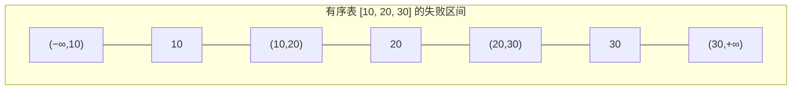

3 个元素 → **4 个失败区间**。这个 n+1 在折半查找、BST、散列表的失败 ASL 里反复出现。

---

## 第二章 线性表的查找

### 2.1 顺序查找

从头扫到尾，最朴素的做法。

```go
// 带哨兵的顺序查找：把待查关键字放到 0 号位置当哨兵
// 好处是循环里不用判 i >= 0，少一次比较
type SSTable struct {
    elem []int // elem[0] 是哨兵，数据存在 elem[1..n]
    n    int
}

func (t *SSTable) Search(key int) int {
    t.elem[0] = key // ★ 哨兵
    i := t.n
    for t.elem[i] != key { // 不需要判越界——一定会在 i=0 处停下
        i--
    }
    return i // 返回 0 表示查找失败
}
```

**ASL 分析**（等概率，n 个元素）：

$$
ASL_{成功} = \frac{1 + 2 + \cdots + n}{n} = \frac{n+1}{2}
$$

$$
ASL_{失败} = n + 1
$$

失败要比较 n+1 次：n 个元素全比一遍，再加上和哨兵比较的那一次。

**优化**：若各元素查找概率不等，把**概率大的放前面**能降低 ASL。若查找概率未知，可用「自组织」策略——每次找到就把该元素前移一位。

**顺序查找的唯一优点**：对表的存储结构和有序性**没有任何要求**。链表也能用，无序也能用。

### 2.2 折半查找（二分查找）

**前提：顺序存储 + 关键字有序。** 链表不能折半（无法 O(1) 定位中点）。

```go
func BinarySearch(a []int, key int) int {
    low, high := 0, len(a)-1
    for low <= high {
        mid := low + (high-low)/2 // ★ 防溢出写法；408 通常写 (low+high)/2
        switch {
        case a[mid] == key:
            return mid
        case a[mid] < key:
            low = mid + 1
        default:
            high = mid - 1
        }
    }
    return -1
}
```

> ⚠️ **`mid = ⌊(low+high)/2⌋` 是向下取整**。408 的手工模拟题严格按这个规则走，向上取整会算出不同的判定树。个别教材用向上取整，看清题干说明。

#### 判定树

把折半查找的比较过程画成树，就是**判定树**（也叫二叉判定树）：

以有序表 `[7, 10, 13, 16, 19, 29, 32, 33, 37, 41, 43]`（n = 11，下标 0-10）为例：

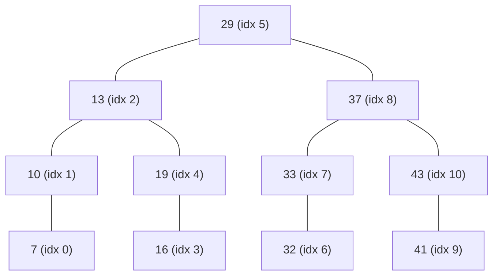

**判定树的三条性质**（408 高频）：

1. **判定树是一棵平衡二叉树**——任一结点左右子树高度差 ≤ 1。这是 `mid` 取中点的直接结果。
2. **树高 $h = \lceil \log_2(n+1) \rceil$**（不含失败结点）。
3. 失败结点有 n+1 个，都在**最下面两层**。

#### ASL 计算

**成功 ASL**：第 i 层的结点需要比较 i 次。上图 n = 11：

```
第 1 层：1 个结点（29）        → 1 次
第 2 层：2 个结点（13, 37）     → 2 次
第 3 层：4 个结点（10,19,33,43）→ 3 次
第 4 层：4 个结点（7,16,32,41） → 4 次
```

$$
ASL_{成功} = \frac{1{\times}1 + 2{\times}2 + 4{\times}3 + 4{\times}4}{11} = \frac{1+4+12+16}{11} = \frac{33}{11} = 3
$$

**失败 ASL**：把 12 个失败结点挂到判定树上。上图中，第 4 层有 4 个内部结点各带 2 个失败结点（共 8 个，位于第 5 层，比较 4 次），第 3 层剩下的位置带 4 个失败结点（位于第 4 层，比较 3 次）。

$$
ASL_{失败} = \frac{4{\times}3 + 8{\times}4}{12} = \frac{12 + 32}{12} = \frac{44}{12} \approx 3.67
$$

> 💡 **失败结点在第 k 层，比较次数是 k−1**（因为失败结点本身不做比较，它代表的是"已经走到空处"）。上面第 4 层的失败结点比较 3 次，第 5 层的比较 4 次。

一般结论：

$$
ASL_{成功} \approx \log_2(n+1) - 1
$$

#### 折半查找的致命限制

- **必须顺序存储**——链表做不了
- **必须有序**——排序本身是 O(n log n)
- **插入删除是 O(n)**——要移动元素维持有序

所以折半查找**只适合静态查找表**：一次建好、多次查询、极少修改。需要频繁增删就得上 BST/AVL。

### 2.3 分块查找（索引顺序查找）

折衷方案：**块间有序，块内无序**。

```
索引表：
  ┌────────┬────────┬────────┐
  │ max=22 │ max=48 │ max=86 │   ← 各块最大关键字
  │ start=0│ start=5│ start=10│  ← 各块起始下标
  └────────┴────────┴────────┘
        ↓        ↓        ↓
主表： [22 12 13 8 9 | 48 32 21 24 33 | 86 53 73 55 63]
        └── 块 1 ──┘  └── 块 2 ────┘  └── 块 3 ────┘
```

查找分两步：

1. 在**索引表**中查（可折半可顺序），确定在哪一块
2. 在**块内顺序查找**

$$
ASL = L_{索引} + L_{块内}
$$

**均分成 b 块、每块 s 个元素（n = b·s）时**：

$$
ASL = \frac{b+1}{2} + \frac{s+1}{2} = \frac{s^2 + 2s + n}{2s}
$$

对 s 求导取极值，当 $s = \sqrt{n}$ 时 ASL 最小：

$$
ASL_{min} = \sqrt{n} + 1
$$

> ⚠️ **陷阱**：「块内有序、块间无序」是**错的**，反了。分块查找要求**块间有序**（第 i 块所有关键字 < 第 i+1 块所有关键字），块内可以无序。

### 2.4 三种线性查找对比

| | 顺序查找 | 折半查找 | 分块查找 |
|---|---|---|---|
| 存储要求 | 顺序 / 链式 | **仅顺序** | 顺序 / 链式 |
| 有序要求 | 无 | **必须全有序** | 块间有序 |
| ASL 成功 | (n+1)/2 | ≈ log₂(n+1)−1 | √n + 1（最优） |
| 插入删除 | O(1)（尾插） | O(n) | O(1)~O(s) |
| 适用 | 小规模 / 无序 | 静态有序表 | 中等规模 + 偶尔增删 |

---

## 第三章 二叉排序树（BST）

### 3.1 定义

**二叉排序树**（Binary Search Tree，也叫二叉查找树）满足：

- 若左子树非空，则**左子树上所有结点的值均小于根结点的值**
- 若右子树非空，则**右子树上所有结点的值均大于根结点的值**
- 左右子树各自也是二叉排序树

**核心性质：中序遍历 BST 得到一个递增有序序列。** 这条性质是无数题目的突破口。

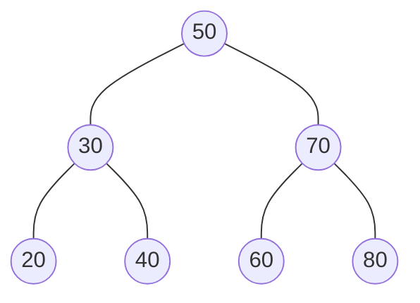

中序遍历：`20 30 40 50 60 70 80` ✓

### 3.2 查找与插入

```go
type BSTNode struct {
    Key         int
    Left, Right *BSTNode
}

// 查找：非递归版，408 常考
func (t *BSTNode) Search(key int) *BSTNode {
    p := t
    for p != nil && p.Key != key {
        if key < p.Key {
            p = p.Left
        } else {
            p = p.Right
        }
    }
    return p // nil 表示未找到
}

// 插入：新结点一定成为叶子
func Insert(t **BSTNode, key int) bool {
    if *t == nil {
        *t = &BSTNode{Key: key}
        return true
    }
    if key == (*t).Key {
        return false // ★ BST 不允许重复关键字
    }
    if key < (*t).Key {
        return Insert(&(*t).Left, key)
    }
    return Insert(&(*t).Right, key)
}
```

> 💡 **插入的新结点总是叶结点**——沿着查找路径走到空位置，直接挂上去，不需要移动任何已有结点。这是 BST 相对有序数组的最大优势（数组插入要 O(n) 移动）。

> ⚠️ **不同的插入顺序会构造出不同形态的 BST**。`[45, 24, 53, 12, 37, 93]` 和 `[12, 24, 37, 45, 53, 93]` 插入的结果完全不同——后者退化成一条右斜链。

### 3.3 删除（408 重点）

删除要保持 BST 性质，分三种情况：

**情况 1：被删结点是叶子** → 直接删。

**情况 2：被删结点只有一棵子树** → 用**该子树顶替**被删结点的位置。

**情况 3：被删结点有两棵子树** → 用它的**直接前驱**（左子树中最右下的结点）或**直接后继**（右子树中最左下的结点）替换其值，然后转为删除那个前驱/后继结点（该结点最多只有一棵子树，退化为情况 1 或 2）。

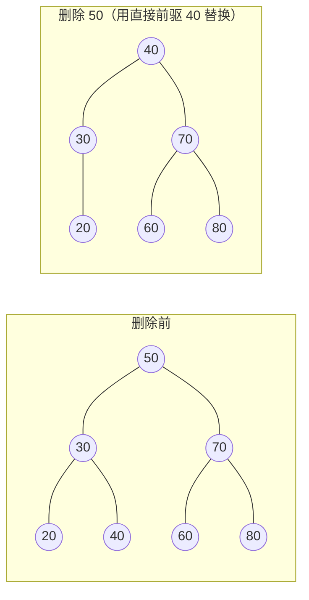

```go
func Delete(t **BSTNode, key int) bool {
    if *t == nil {
        return false
    }
    switch {
    case key < (*t).Key:
        return Delete(&(*t).Left, key)
    case key > (*t).Key:
        return Delete(&(*t).Right, key)
    }
    // 找到了
    switch {
    case (*t).Left == nil: // 情况 1、2：无左子树 → 右子树顶替
        *t = (*t).Right
    case (*t).Right == nil: // 情况 2：无右子树 → 左子树顶替
        *t = (*t).Left
    default: // 情况 3：两棵子树都在
        // 找直接前驱：左子树中最右下的结点
        pre := (*t).Left
        for pre.Right != nil {
            pre = pre.Right
        }
        (*t).Key = pre.Key           // ★ 只搬值，不动结构
        Delete(&(*t).Left, pre.Key)  // ★ 再去左子树里删掉那个前驱
    }
    return true
}
```

> ⚠️ **陷阱**：情况 3 用前驱还是后继，**两种都对**，但会得到不同的树。408 题目若不指明，通常约定用**直接前驱**；看清题干。

### 3.4 ASL 与退化

BST 的查找效率取决于**树高**：

- **最好情况**：树平衡，$h = \lceil\log_2(n+1)\rceil$，ASL = O(log n)
- **最坏情况**：**退化成单链**（按有序序列插入），h = n，ASL = (n+1)/2 = O(n)

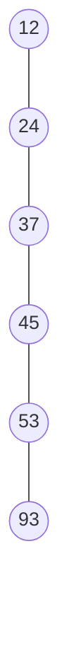

有序插入 `12,24,37,45,53,93` → 退化成右单链，查找变成顺序查找。

**这就是引出 AVL 树的动机**：必须在插入删除时主动维持平衡。

---

## 第四章 平衡二叉树（AVL）

### 4.1 平衡因子

**平衡因子（Balance Factor）= 左子树高度 − 右子树高度**。

**AVL 树**：任一结点的平衡因子只能是 **−1、0、1**。

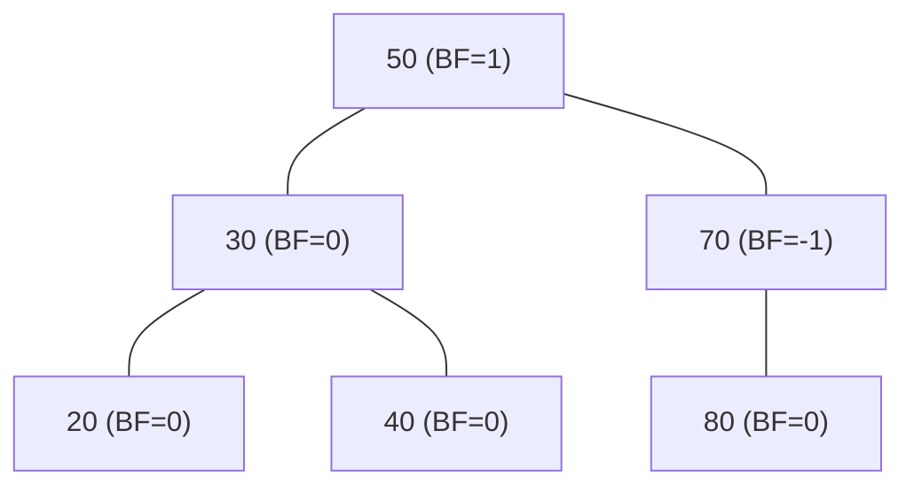

> ⚠️ **符号方向别记反**：BF = 左高 − 右高。BF = 2 表示**左边太高**，BF = −2 表示右边太高。

### 4.2 四种失衡与旋转

插入一个结点后若失衡，找到**最小不平衡子树**（从插入点往上第一个 |BF| > 1 的结点，记为 A），根据插入位置分四类：

| 类型 | 插入在哪 | 调整 |
|---|---|---|
| **LL** | A 的**左**孩子的**左**子树 | **右单旋** |
| **RR** | A 的**右**孩子的**右**子树 | **左单旋** |
| **LR** | A 的**左**孩子的**右**子树 | **先左旋后右旋** |
| **RL** | A 的**右**孩子的**左**子树 | **先右旋后左旋** |

#### LL 型 —— 右单旋

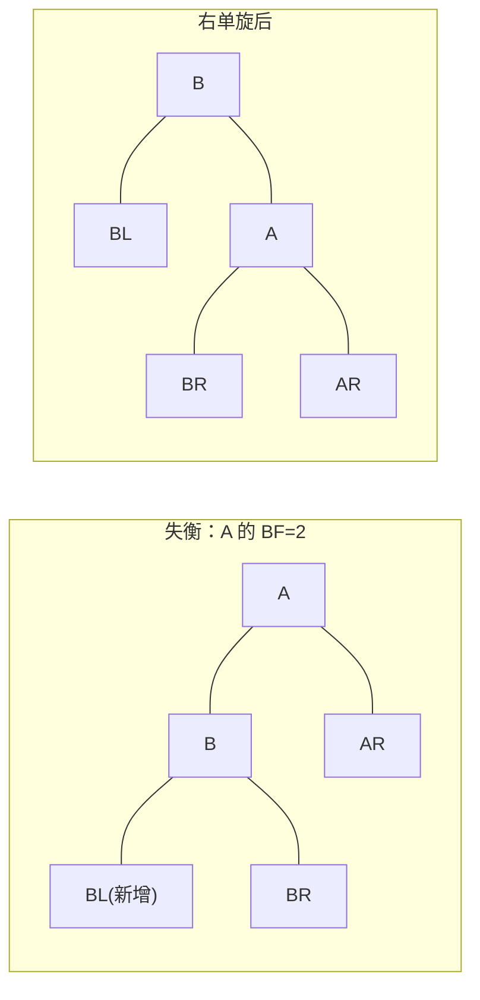

**口诀：B 上位当根，A 变成 B 的右孩子，B 原来的右子树 BR 挂到 A 的左边。**

```go
// 右单旋：处理 LL 型
func rightRotate(A *AVLNode) *AVLNode {
    B := A.Left
    A.Left = B.Right // ★ BR 挂到 A 的左边
    B.Right = A      // ★ A 成为 B 的右孩子
    updateHeight(A)  // 先更新 A（现在是子结点）
    updateHeight(B)
    return B // B 成为新的子树根
}

// 左单旋：处理 RR 型，与上面完全对称
func leftRotate(A *AVLNode) *AVLNode {
    B := A.Right
    A.Right = B.Left
    B.Left = A
    updateHeight(A)
    updateHeight(B)
    return B
}
```

#### LR 型 —— 先左旋后右旋

新结点插在 A 的左孩子 B 的**右**子树 C 上。**先对 B 左旋，转成 LL 型，再对 A 右旋**。

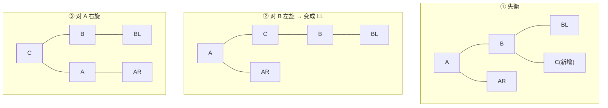

**结果：C 上位当根，B 和 A 分列左右。** RL 型完全对称。

```go
func insertAVL(node *AVLNode, key int) *AVLNode {
    if node == nil {
        return &AVLNode{Key: key, Height: 1}
    }
    if key < node.Key {
        node.Left = insertAVL(node.Left, key)
    } else if key > node.Key {
        node.Right = insertAVL(node.Right, key)
    } else {
        return node // 重复不插
    }
    updateHeight(node)

    bf := balanceFactor(node)
    switch {
    case bf > 1 && key < node.Left.Key: // LL
        return rightRotate(node)
    case bf < -1 && key > node.Right.Key: // RR
        return leftRotate(node)
    case bf > 1 && key > node.Left.Key: // LR
        node.Left = leftRotate(node.Left)
        return rightRotate(node)
    case bf < -1 && key < node.Right.Key: // RL
        node.Right = rightRotate(node.Right)
        return leftRotate(node)
    }
    return node
}

func height(n *AVLNode) int {
    if n == nil {
        return 0
    }
    return n.Height
}
func updateHeight(n *AVLNode)     { n.Height = 1 + max(height(n.Left), height(n.Right)) }
func balanceFactor(n *AVLNode) int { return height(n.Left) - height(n.Right) }
```

### 4.3 插入 vs 删除的调整次数

这是 408 的一个精准考点：

| 操作 | 旋转次数 |
|---|---|
| **插入** | **最多 1 次**（单旋算 1 次，双旋也算 1 次） |
| **删除** | **可能需要 O(log n) 次**，一路调整到根 |

**为什么？** 插入后，最小不平衡子树旋转完，**其高度会恢复到插入前的值**，上层不受影响，所以调整一次就够。删除后，子树高度可能**减 1**，这个减少会向上传播，导致祖先接连失衡。

### 4.4 AVL 树的高度界

**问题：高度为 h 的 AVL 树，最少有多少个结点？**

设 $N_h$ 为高度 h 的 AVL 树的最少结点数。要让结点最少，根的两棵子树高度必须差 1（差 0 结点更多），所以：

$$
N_h = N_{h-1} + N_{h-2} + 1, \quad N_0 = 0,\ N_1 = 1
$$

```
h:   0   1   2   3   4   5   6   7    8    9
Nh:  0   1   2   4   7   12  20  33   54   88
```

> 💡 这个递推和斐波那契几乎一样（$N_h = F_{h+2} - 1$）。408 常考「高度为 5 的 AVL 树最少多少结点」→ **12**。
>
> 反过来：n 个结点的 AVL 树，最大高度约 $1.44\log_2 n$——只比理想的 $\log_2 n$ 高 44%。

---

## 第五章 红黑树

AVL 树的平衡条件太严格，导致**插入删除时旋转频繁**。红黑树放宽了平衡要求，用**更少的旋转**换取略高的树。

> 📌 红黑树自 **2023 年起纳入 408 考纲**。考法以**性质判断**和**插入调整**为主，删除调整一般不作为重点。

### 5.1 五条性质

1. 每个结点或是**红色**，或是**黑色**
2. **根结点是黑色**
3. **叶结点（外部结点 / NIL 结点）都是黑色**——注意这里的"叶结点"指虚拟的空结点
4. **不存在两个相邻的红结点**（红结点的父与子必为黑）
5. **对每个结点，从该结点到其所有后代叶结点的简单路径上，黑结点数目相同**

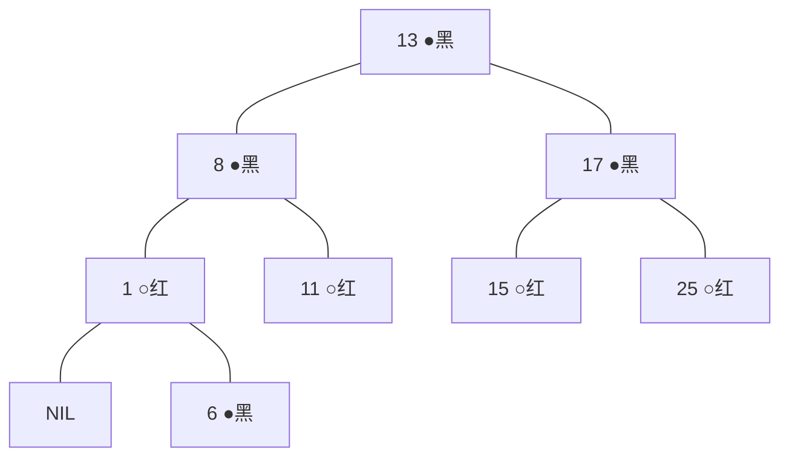

**黑高（black-height）**：从某结点出发（**不含该结点本身**）到达任一叶结点路径上的黑结点数。性质 5 保证黑高是良定义的。

### 5.2 为什么最长路径 ≤ 2 × 最短路径

这是红黑树"近似平衡"的核心论证：

- **最短路径**：全是黑结点，长度 = 黑高 bh
- **最长路径**：红黑交替，且不能有两个连续红（性质 4），所以红结点最多和黑结点一样多，长度 ≤ 2·bh

$$
\text{最长} \le 2 \times \text{最短}
$$

由此推出**高度界**：含 n 个内部结点的红黑树，高度

$$
h \le 2\log_2(n+1)
$$

比 AVL 的 $1.44\log_2 n$ 松，但仍是 O(log n)。

### 5.3 插入调整

**新插入的结点一律染红。** 为什么？染红只可能违反性质 4（连续红），而染黑必然违反性质 5（黑高改变）——违反性质 4 更容易修。

设新结点为 z，父结点 p，祖父 g，叔叔 u：

| 情况 | 条件 | 调整 |
|---|---|---|
| **Case 0** | p 是黑 | **无需调整** |
| **Case 1** | u 是**红** | p、u 染黑，g 染红，**把 g 当作新的 z 继续向上检查** |
| **Case 2** | u 是黑，z 与 p 方向**不同**（LR / RL） | 对 p 旋转，转成 Case 3 |
| **Case 3** | u 是黑，z 与 p 方向**相同**（LL / RR） | p 染黑、g 染红，对 g 旋转 |

> 💡 **Case 1 只染色不旋转**，问题向上传播；**Case 2/3 旋转后立即结束**。所以红黑树插入**最多旋转 2 次**（Case 2 + Case 3），而染色可能一路到根。

### 5.4 AVL vs 红黑树

| | AVL 树 | 红黑树 |
|---|---|---|
| 平衡条件 | 高度差 ≤ 1（**严格**） | 最长 ≤ 2×最短（**宽松**） |
| 树高 | ≈ 1.44 log₂n | ≤ 2 log₂n |
| **查找** | 更快（树更矮） | 略慢 |
| **插入旋转** | 最多 1 次 | 最多 2 次 |
| **删除旋转** | **O(log n) 次** | **最多 3 次** |
| 适用 | 查多改少 | **增删频繁** |
| 工业应用 | 较少 | Linux CFS 调度器、Java TreeMap、C++ std::map、Nginx 定时器 |

**一句话**：**AVL 为查找优化，红黑树为增删优化**。真实系统里增删远比想象中频繁，所以红黑树胜出。

---

## 第六章 B 树与 B+ 树

### 6.1 m 阶 B 树的定义

一棵 **m 阶 B 树**（也叫多路平衡查找树）满足：

1. 每个结点**至多 m 棵子树**（即至多 **m−1** 个关键字）
2. **根结点**若不是叶结点，则**至少 2 棵子树**
3. **除根以外的所有非叶结点**至少有 $\lceil m/2 \rceil$ 棵子树（即至少 $\lceil m/2 \rceil - 1$ 个关键字）
4. **所有叶结点都在同一层**，且不带信息（可视为查找失败的外部结点）
5. 有 n 个关键字的非叶结点，恰有 **n+1 棵子树**

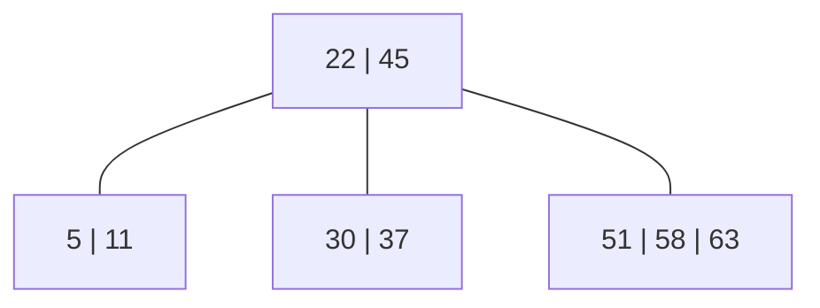

这是一棵 4 阶 B 树的一部分：根有 2 个关键字 3 棵子树；非根结点至少 $\lceil 4/2 \rceil - 1 = 1$ 个关键字。

> ⚠️ **最易错的一组数**：m 阶 B 树中，非根非叶结点的关键字数范围是 $[\lceil m/2 \rceil - 1,\ m-1]$，子树数范围是 $[\lceil m/2 \rceil,\ m]$。**关键字数 = 子树数 − 1**，别记混。

### 6.2 插入：分裂

插入总是发生在**最底层的非叶结点**。若插入后关键字数超过 m−1，就**分裂**：

```
以 5 阶 B 树（最多 4 个关键字）为例，向 [3, 14, 25, 30] 插入 26：

① 插入后：[3, 14, 25, 26, 30]  —— 5 个关键字，超了
② 找中间位置 ⌈m/2⌉ = 3，即第 3 个关键字 25
③ 分裂：25 上移到父结点，左右各成一个新结点
       父结点 ← 25
       [3, 14]    [26, 30]
```

> 💡 **分裂可能级联向上**：若父结点也满了，父结点继续分裂。若一路裂到根，**树高 +1**——这是 B 树**唯一**长高的方式，也保证了所有叶子始终在同一层。

### 6.3 删除：合并

删除分两步：

**第一步：转化为删除最底层结点。** 若被删关键字在非叶结点，用其**直接前驱或直接后继**（在最底层）替换，转为删除底层结点。

**第二步：处理下溢。** 若删除后关键字数 < $\lceil m/2 \rceil - 1$：

| 情况 | 操作 |
|---|---|
| **兄弟够借**（兄弟关键字数 > 最小值） | **借一个**：兄弟的一个关键字上移到父，父的一个关键字下移到本结点（"父子换位"） |
| **兄弟不够借** | **合并**：本结点 + 父的一个关键字 + 兄弟，合并成一个结点；父结点关键字数 −1，可能引发级联合并 |

### 6.4 B 树的高度

含 n 个关键字的 m 阶 B 树，高度 h（**不含**叶结点层）：

**最小高度**（每个结点都塞满 m−1 个关键字）：

$$
h \ge \log_m(n+1)
$$

**最大高度**（每个结点都只有最少的关键字）：

$$
h \le \log_{\lceil m/2 \rceil}\left(\frac{n+1}{2}\right) + 1
$$

### 6.5 B+ 树

B+ 树是 B 树的变体，为**磁盘索引**深度定制：

| | B 树 | B+ 树 |
|---|---|---|
| n 个关键字的结点 | **n+1** 棵子树 | **n** 棵子树 |
| 关键字出现次数 | **只出现一次** | 非叶结点的关键字**在叶子层重复出现** |
| 记录存放位置 | **每个结点都存记录** | **只有叶结点存记录**，非叶结点只做索引 |
| 叶结点 | 不含信息的外部结点 | 含**全部**关键字 + 记录指针，且**串成有序链表** |
| 查找 | 可能在非叶结点命中，**提前结束** | **必须走到叶结点**（等长查找） |
| 范围查询 | 需要中序遍历，跳来跳去 | **沿叶子链表顺序扫描**，极快 |

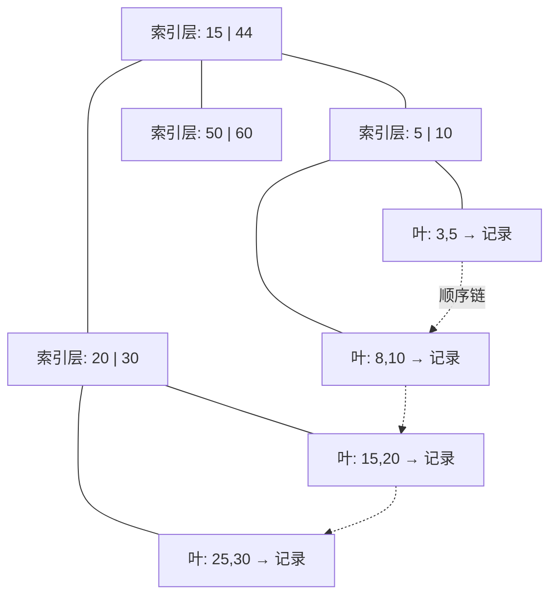

#### 为什么数据库选 B+ 树

三个理由，正好对应 B+ 树的三点改造：

1. **非叶结点不存记录 → 一个磁盘页能装下更多关键字 → 阶数 m 更大 → 树更矮 → I/O 更少**。回到引言的账：m 从 100 提到 500，1000 万记录的树高从 4 层降到 3 层。
2. **叶结点串成链表 → 范围查询（`WHERE age BETWEEN 20 AND 30`）只需定位起点后顺序扫描**。B 树做范围查询要反复回溯中序遍历。
3. **所有查找路径等长 → 查询性能稳定可预测**。B 树可能在第 1 层就命中，也可能走到最底层，性能方差大——对数据库的 P99 延迟不友好。

---

## 第七章 散列表

前面所有结构都靠**比较**定位，ASL 下界是 O(log n)。散列表换了一条路：**用关键字直接算出地址**，理想情况下 **O(1)**，一次比较都不用。

### 7.1 散列函数

**除留余数法**（408 几乎只考这个）：

$$
H(key) = key \bmod p
$$

**p 取不大于表长 m 的最大质数。** 为什么要质数？因为若 p 含小因子（如 p = 100 = 2²×5²），则所有 100 的倍数会全撞在 0 号位，分布不均。质数能把关键字的低位特征打散。

其他方法（了解即可）：直接定址法 $H(key)=a\cdot key+b$（不会冲突但空间浪费）、数字分析法、平方取中法。

### 7.2 处理冲突 ①：开放定址法

冲突时，按某个探测序列去找**表内的下一个空位**：

$$
H_i = (H(key) + d_i) \bmod m
$$

| 方法 | $d_i$ | 特点 |
|---|---|---|
| **线性探测** | $1, 2, 3, \ldots, m-1$ | 简单，但产生**堆积（聚集）** |
| **平方探测** | $1^2, -1^2, 2^2, -2^2, \ldots$ | 避免堆积，但**表长 m 必须是形如 4k+3 的质数**才能探测到全表 |
| **双散列** | $i \times H_2(key)$ | 探测序列由第二个散列函数决定，分布最好 |
| **伪随机序列** | 伪随机数列 | —— |

**线性探测的堆积问题**：一旦某个位置冲突，就占用下一个位置，导致**本不冲突的关键字也被挤走**，冲突像滚雪球一样堆积。

> ⚠️ **开放定址法不能随便删除元素**。若直接把某个位置置空，会**切断探测链**——后面本该沿着这条链找到的元素就找不到了。正确做法是打**删除标记（墓碑）**，查找时跳过、插入时可覆盖。这是 408 高频考点。

#### 例题：线性探测建表

关键字 `{19, 14, 23, 1, 68, 20, 84, 27, 55, 11, 10, 79}`，表长 m = 13，$H(key) = key \bmod 13$，线性探测。

```
19 % 13 = 6   → 位置 6
14 % 13 = 1   → 位置 1
23 % 13 = 10  → 位置 10
1  % 13 = 1   → 冲突！→ 位置 2
68 % 13 = 3   → 位置 3
20 % 13 = 7   → 位置 7
84 % 13 = 6   → 冲突！6→7→8，位置 8
27 % 13 = 1   → 冲突！1→2→3→4，位置 4
55 % 13 = 3   → 冲突！3→4→5，位置 5
11 % 13 = 11  → 位置 11
10 % 13 = 10  → 冲突！10→11→12，位置 12
79 % 13 = 1   → 冲突！1→2→3→4→5→6→7→8→9，位置 9

下标:  0   1   2   3   4   5   6   7   8   9  10  11  12
存值:  —  14   1  68  27  55  19  20  84  79  23  11  10
比较:  —   1   2   1   4   3   1   1   3   9   1   1   3
```

$$
ASL_{成功} = \frac{1+2+1+4+3+1+1+3+9+1+1+3}{12} = \frac{30}{12} = 2.5
$$

**失败 ASL**：对每个可能的散列地址 $0 \sim m-1$，算出探测到空位所需的比较次数：

```
地址 0：位置 0 空 → 1 次
地址 1：1,2,3,4,5,6,7,8,9,10,11,12,0 → 13 次
地址 2：2,...,0 → 12 次
...
地址 12：12, 0 → 2 次
```

$$
ASL_{失败} = \frac{1+13+12+11+10+9+8+7+6+5+4+3+2}{13} = \frac{91}{13} = 7
$$

> 💡 **失败 ASL 要对所有 m 个散列地址求平均，不是对 n 个元素**。这是最常错的一点。

### 7.3 处理冲突 ②：拉链法（链地址法）

把同义词串成一条链表挂在对应槽位上。

```
0 → ∅
1 → [14] → [1] → [27] → [79]
2 → ∅
3 → [68] → [55]
...
```

```go
type HashTable struct {
    buckets [][]int
    m       int
}

func NewHashTable(m int) *HashTable {
    return &HashTable{buckets: make([][]int, m), m: m}
}

func (h *HashTable) Insert(key int) {
    idx := key % h.m
    h.buckets[idx] = append(h.buckets[idx], key) // ★ Go 切片天然是变长链
}

func (h *HashTable) Search(key int) (int, bool) {
    idx := key % h.m
    for i, k := range h.buckets[idx] {
        if k == key {
            return i + 1, true // 返回比较次数
        }
    }
    return len(h.buckets[idx]) + 1, false
}
```

**拉链法的优点**：

- **删除方便**——直接摘链，不会切断探测链
- **不会堆积**——同义词不影响非同义词
- **装填因子可以 > 1**

### 7.4 装填因子与性能

$$
\alpha = \frac{\text{表中记录数 } n}{\text{散列表长度 } m}
$$

**关键结论：散列表的 ASL 只与 α 有关，与 n、m 各自的大小无关。**

近似公式（了解结论即可，408 一般直接给表让你手算）：

| 方法 | ASL 成功 | ASL 失败 |
|---|---|---|
| 线性探测 | $\frac{1}{2}\left(1 + \frac{1}{1-\alpha}\right)$ | $\frac{1}{2}\left(1 + \frac{1}{(1-\alpha)^2}\right)$ |
| 拉链法 | $1 + \frac{\alpha}{2}$ | $\alpha + e^{-\alpha}$ |

α = 0.5 时线性探测成功 ASL = 1.5，α = 0.9 时飙到 5.5——**开放定址法在 α > 0.7 后性能急剧恶化**，所以工业实现通常在 α 到 0.75 时扩容（Java HashMap 的默认负载因子正是 0.75）。

---

## 第八章 Go ↔ C 对照表

408 考场写 C，本章代码用 Go。这几处差异要能双向翻译：

| 场景 | C（考场写法） | Go（本章写法） | 说明 |
|---|---|---|---|
| 建结点 | `p = (BSTNode*)malloc(sizeof(BSTNode));` | `p := &BSTNode{Key: k}` | Go 有 GC，**无需 free** |
| 删结点 | `free(p);` | 置 `nil`，等 GC | Go 里写 `free` 是错的 |
| 空指针 | `NULL` | `nil` | |
| 传出参数（要改指针本身） | `void Insert(BSTNode **T, int k)` | `func Insert(t **BSTNode, k int)` | **两者都要二级指针**；Go 也可返回新根 |
| 交换两值 | `t=a; a=b; b=t;` | `a, b = b, a` | Go 右值**先全部求值**再赋值 |
| 数组/切片长度 | 需另传 `int n` | `len(a)` 自带 | |
| 结构体数组 | `BSTNode arr[MAXSIZE];` | `arr := make([]BSTNode, 0, cap)` | Go 切片会自动扩容（容量不足时**重新分配并拷贝**） |
| 取中点防溢出 | `mid = low + (high-low)/2;` | 同左 | 两边一样，`(low+high)/2` 在大数组上会溢出 int |

> ⚠️ **Go 的坑：切片扩容后底层数组换了地址**。如果你把某个元素的指针存下来，扩容后这个指针指向的是**旧数组**——数据不同步。408 不考这个，但工程里是真事故。写 BST/AVL 用**指针结点**而不是切片下标就没这个问题。

> ⚠️ **另一个 Go 特性**：`(*t).Left` 可以简写成 `t.Left`（Go 自动解引用），但 `Insert(&(*t).Left, key)` 里的 `&(*t).Left` **不能简写**——要取的是字段的地址。

---

## 第九章 408 高频考点与陷阱清单

### 9.1 考点分布

第 7 章通常是 **2-3 道选择题（4-6 分）+ 高频应用题**。应用题最常考：

1. **散列表建表 + 求 ASL 成功/失败**（几乎年年考）
2. **B 树的插入分裂 / 删除合并过程**
3. **AVL 树插入后的旋转**（画出调整后的树）
4. **折半查找判定树 + ASL**
5. BST 的删除

### 9.2 十二个陷阱

**陷阱 1：折半查找可以用于链表**

**错**。折半查找必须能 O(1) 定位中点，只能用**顺序存储**。

**陷阱 2：折半查找的判定树是完全二叉树**

**错**。判定树是**平衡二叉树**，不一定是完全二叉树（失败结点在最下两层，但内部结点的排布不满足完全二叉树的定义）。

**陷阱 3：分块查找要求块内有序**

**错，反了**。要求**块间有序**（第 i 块的最大关键字 < 第 i+1 块的最小关键字），块内可无序。

**陷阱 4：BST 的中序遍历一定有序**

**对**。这是 BST 的定义性质，也是判断一棵树是不是 BST 的最快方法。

**陷阱 5：不同插入顺序得到相同的 BST**

**错**。BST 的形态**完全由插入顺序决定**。有序插入会退化成单链。

**陷阱 6：AVL 树的平衡因子是「右高 − 左高」**

**错**。BF = **左高 − 右高**。

**陷阱 7：AVL 树删除最多旋转一次**

**错**。**插入**最多旋转 1 次；**删除**可能需要一路旋转到根，O(log n) 次。

**陷阱 8：红黑树的叶结点指的是最底层的实际结点**

**错**。红黑树性质里的"叶结点"指的是**虚拟的 NIL 外部结点**，它们都是黑色。

**陷阱 9：m 阶 B 树的非根结点至少有 ⌈m/2⌉−1 棵子树**

**错，混淆了关键字数和子树数**。至少 $\lceil m/2 \rceil$ 棵**子树**，对应 $\lceil m/2 \rceil - 1$ 个**关键字**。

**陷阱 10：B+ 树中 n 个关键字的结点有 n+1 棵子树**

**错**。**B 树**是 n+1 棵，**B+ 树**是 **n 棵**。

**陷阱 11：开放定址法可以直接删除元素**

**错**。直接置空会切断探测链，必须打**删除标记**。

**陷阱 12：散列表的 ASL 与表长 m 有关**

**错**。ASL 只与**装填因子 α = n/m** 有关。

### 9.3 复杂度速查表

| 结构 | 查找 | 插入 | 删除 | 有序遍历 |
|---|---|---|---|---|
| 顺序表（无序） | O(n) | O(1) | O(n) | 需排序 |
| 有序表 + 折半 | O(log n) | O(n) | O(n) | O(n) |
| 分块查找 | O(√n) | O(1)~O(s) | O(s) | 需排序 |
| BST（平均） | O(log n) | O(log n) | O(log n) | **O(n) 中序** |
| BST（最坏） | **O(n)** | O(n) | O(n) | O(n) |
| AVL / 红黑树 | O(log n) | O(log n) | O(log n) | **O(n) 中序** |
| B / B+ 树 | **O(log_m n) 次 I/O** | 同左 | 同左 | B+ 沿叶链 O(n) |
| 散列表（平均） | **O(1)** | O(1) | O(1) | **不支持**（无序） |
| 散列表（最坏） | O(n) | O(n) | O(n) | 不支持 |

> 💡 **散列表唯一的硬伤是不支持有序操作**——范围查询、找最大最小、按序遍历全都做不了。这就是为什么数据库主键索引用 B+ 树而不是散列表。

---

## 第十章 力扣实战题单

### 必刷档（8 题）

| 题号 | 题目 | 练什么 | 目标复杂度 |
|---|---|---|---|
| 704 | [二分查找](https://leetcode.cn/problems/binary-search/) | **§2.2 折半查找模板** | O(log n) / O(1) |
| 35 | [搜索插入位置](https://leetcode.cn/problems/search-insert-position/) | 二分的边界处理（返回 low） | O(log n) / O(1) |
| 700 | [二叉搜索树中的搜索](https://leetcode.cn/problems/search-in-a-binary-search-tree/) | **§3.2 BST 查找** | O(h) / O(1) |
| 701 | [二叉搜索树中的插入操作](https://leetcode.cn/problems/insert-into-a-binary-search-tree/) | §3.2 插入必成叶子 | O(h) / O(1) |
| 98 | [验证二叉搜索树](https://leetcode.cn/problems/validate-binary-search-tree/) | **§3.1 中序有序**，经典陷阱题 | O(n) / O(h) |
| 230 | [BST 中第 K 小的元素](https://leetcode.cn/problems/kth-smallest-element-in-a-bst/) | 中序遍历的第 k 个 | O(h+k) / O(h) |
| 1 | [两数之和](https://leetcode.cn/problems/two-sum/) | **§7 散列表最经典应用** | O(n) / O(n) |
| 242 | [有效的字母异位词](https://leetcode.cn/problems/valid-anagram/) | 散列计数 | O(n) / O(1) |

**98 验证二叉搜索树**——最经典的陷阱题，只比较父子是不够的：

```go
// ❌ 错误写法：只检查了直接父子关系
// 反例：root=[5,1,4,null,null,3,6]，4 的左孩子 3 < 5 但整棵树不是 BST

// ✅ 正解一：中序遍历必须严格递增
func isValidBST(root *TreeNode) bool {
    var prev *TreeNode
    var inorder func(*TreeNode) bool
    inorder = func(n *TreeNode) bool {
        if n == nil {
            return true
        }
        if !inorder(n.Left) {
            return false
        }
        if prev != nil && prev.Val >= n.Val { // ★ 必须严格递增
            return false
        }
        prev = n
        return inorder(n.Right)
    }
    return inorder(root)
}

// ✅ 正解二：上下界法，每个结点带着它的合法区间往下传
func isValidBST2(root *TreeNode) bool {
    var check func(n *TreeNode, lo, hi *int) bool
    check = func(n *TreeNode, lo, hi *int) bool {
        if n == nil {
            return true
        }
        if lo != nil && n.Val <= *lo {
            return false
        }
        if hi != nil && n.Val >= *hi {
            return false
        }
        return check(n.Left, lo, &n.Val) && check(n.Right, &n.Val, hi)
    }
    return check(root, nil, nil)
}
```

**1 两数之和**——散列表把 O(n²) 降到 O(n) 的典范：

```go
func twoSum(nums []int, target int) []int {
    seen := make(map[int]int, len(nums)) // ★ 预分配容量，减少扩容
    for i, v := range nums {
        if j, ok := seen[target-v]; ok { // ★ 边存边查，一趟搞定
            return []int{j, i}
        }
        seen[v] = i
    }
    return nil
}
```

### 进阶档（6 题）

| 题号 | 题目 | 练什么 |
|---|---|---|
| 34 | [排序数组中查找元素的首尾位置](https://leetcode.cn/problems/find-first-and-last-position-of-element-in-sorted-array/) | **二分找左右边界**，模板必背 |
| 33 | [搜索旋转排序数组](https://leetcode.cn/problems/search-in-rotated-sorted-array/) | 二分变形，判断哪半有序 |
| 450 | [删除二叉搜索树中的节点](https://leetcode.cn/problems/delete-node-in-a-bst/) | **§3.3 BST 删除三种情况** |
| 235 | [BST 的最近公共祖先](https://leetcode.cn/problems/lowest-common-ancestor-of-a-binary-search-tree/) | 利用 BST 有序性剪枝 |
| 108 | [有序数组转换为高度平衡 BST](https://leetcode.cn/problems/convert-sorted-array-to-binary-search-tree/) | **§2.2 判定树的逆过程** |
| 146 | [LRU 缓存](https://leetcode.cn/problems/lru-cache/) | **散列表 + 双向链表**，工业级经典 |

### 挑战档（4 题）

| 题号 | 题目 | 练什么 |
|---|---|---|
| 4 | [寻找两个正序数组的中位数](https://leetcode.cn/problems/median-of-two-sorted-arrays/) | O(log(m+n)) 的二分 |
| 315 | [计算右侧小于当前元素的个数](https://leetcode.cn/problems/count-of-smaller-numbers-after-self/) | BST / 树状数组 / 归并 |
| 460 | [LFU 缓存](https://leetcode.cn/problems/lfu-cache/) | 双散列表 + 双向链表 |
| 1206 | [设计跳表](https://leetcode.cn/problems/design-skiplist/) | 平衡树的概率替代方案 |

### 题单进度自查

- [ ] 必刷档 8 题全部一次通过
- [ ] 能默写二分查找的三种边界模板（找目标 / 找左边界 / 找右边界）
- [ ] 能手写 BST 的插入与删除（含三种删除情况）
- [ ] 理解 LRU 为什么必须"散列表 + 双向链表"两个结构配合

---

## 第十一章 练习题

### 选择题

**1.** 对长度为 12 的有序表进行折半查找，在等概率情况下，查找成功的平均查找长度为：
A. 37/12　B. 38/12　C. 39/12　D. 40/12

**2.** 下列关于二叉排序树的说法，**错误**的是：
A. 中序遍历得到递增有序序列
B. 插入的新结点一定是叶结点
C. 删除结点后，剩余结点构成的树仍是二叉排序树
D. 对同一组关键字，不同插入顺序得到的二叉排序树高度相同

**3.** 高度为 5 的 AVL 树，最少含有多少个结点？
A. 10　B. 11　C. 12　D. 13

**4.** 在一棵 5 阶 B 树中，除根结点外，每个非叶结点的关键字个数范围是：
A. [2, 5]　B. [2, 4]　C. [3, 5]　D. [3, 4]

**5.** 下列关于 B+ 树的说法，**正确**的是：
A. B+ 树中含 n 个关键字的结点有 n+1 棵子树
B. B+ 树的非叶结点也存储记录信息
C. B+ 树的所有叶结点串成一个有序链表
D. B+ 树的查找可能在非叶结点提前结束

**6.** 采用开放定址法处理冲突的散列表，删除一个元素时应该：
A. 直接将该位置置空
B. 将该位置做删除标记
C. 将后面的元素依次前移
D. 重建整个散列表

**7.** 设散列表长为 m，表中已有 n 个元素，装填因子 α = n/m。下列说法**正确**的是：
A. α 越大，冲突可能性越小
B. α 相同时，不同规模的散列表 ASL 大致相同
C. 拉链法要求 α ≤ 1
D. 开放定址法的 α 可以大于 1

**8.** 红黑树的下列性质中，**不属于**其定义的是：
A. 根结点是黑色
B. 红结点的孩子必为黑色
C. 从任一结点到其叶结点的路径上黑结点数相同
D. 任一结点的左右子树高度差不超过 1

### 应用题

**9.** 关键字序列 `{ 24, 15, 38, 27, 12, 45, 33 }`，依次插入一棵初始为空的二叉排序树。
（1）画出最终的 BST。
（2）求查找成功的 ASL。
（3）删除结点 24，用**直接前驱**替换，画出结果。

**10.** 依次将关键字 `{ 13, 24, 37, 90, 53 }` 插入初始为空的 AVL 树。画出每次插入后的树，并注明发生了哪种旋转。

**11.** 关键字 `{ 7, 8, 30, 11, 18, 9, 14 }`，散列表长 m = 11，散列函数 $H(key) = key \bmod 11$，用**线性探测**处理冲突。
（1）画出散列表。
（2）求 ASL 成功。
（3）求 ASL 失败。

**12.** 向一棵 3 阶 B 树（2-3 树）依次插入 `{ 20, 30, 50, 52, 60, 68, 70 }`，画出每一步的结果。

### 答案与解析

<details>
<summary>点击展开</summary>

**1. A**

n = 12 的判定树：树高 $h = \lceil\log_2 13\rceil = 4$。

前 3 层最多容纳 1+2+4 = 7 个结点，剩下的 5 个放在第 4 层：

$$
ASL = \frac{1{\times}1 + 2{\times}2 + 4{\times}3 + 5{\times}4}{12} = \frac{1+4+12+20}{12} = \frac{37}{12}
$$

> ⚠️ 这道题的关键是**别把第 4 层的结点数算错**：不是 8 个（那是满二叉树），而是 12 − 7 = **5** 个。

**2. D**

**不同插入顺序会得到不同形态、不同高度的 BST**。有序插入退化成单链（高度 n），而平衡插入高度约 log₂n。

A、B、C 都对：C 的意思是删除操作保持 BST 性质，这是删除算法的设计目标。

**3. C**

$N_h = N_{h-1} + N_{h-2} + 1$，$N_0 = 0, N_1 = 1$：

$$
N_2 = 1+0+1 = 2,\quad N_3 = 2+1+1 = 4,\quad N_4 = 4+2+1 = 7,\quad N_5 = 7+4+1 = \boxed{12}
$$

**4. B**

5 阶 B 树：$\lceil 5/2 \rceil = 3$ 棵子树 → $3 - 1 = 2$ 个关键字为下界；上界是 $m - 1 = 4$ 个关键字。所以范围 **[2, 4]**。

选 A 和 C 的是把子树数当成了关键字数。

**5. C**

- A 错：**B 树**是 n+1 棵子树，B+ 树是 **n** 棵
- B 错：B+ 树非叶结点**只做索引**，不存记录
- D 错：B+ 树**必须走到叶结点**才能确定，查找路径等长
- C 对：叶结点串成有序链表，这正是 B+ 树支持高效范围查询的原因

**6. B**

直接置空会**切断探测链**：假设 x 和 y 是同义词，y 因冲突被探测到后面的位置。若删除 x 时置空，再查 y 时探测到空位就会误判"不存在"。必须打删除标记。

**7. B**

散列表的 ASL 只与 α 有关，与 n、m 的绝对大小无关——这是散列表最重要的性质。

A 错（α 越大冲突越多）；C 错（**拉链法的 α 可以大于 1**，链表能无限接）；D 错（**开放定址法的 α 必然 ≤ 1**，因为元素都存在表内）。

**8. D**

「左右子树高度差 ≤ 1」是 **AVL 树**的定义，不是红黑树。红黑树的平衡是通过"最长路径 ≤ 2×最短路径"来保证的，比 AVL 宽松。

**9.**

（1）依次插入 24, 15, 38, 27, 12, 45, 33：

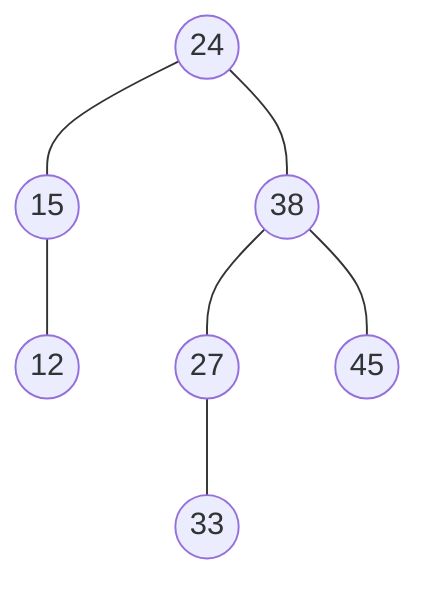

（2）各结点的比较次数：24→1，15→2，38→2，12→3，27→3，45→3，33→4

$$
ASL = \frac{1 + 2{\times}2 + 3{\times}3 + 4}{7} = \frac{1+4+9+4}{7} = \frac{18}{7} \approx 2.57
$$

（3）删除 24：它有两棵子树，直接前驱是**左子树中最右下的结点**，即 15 的右子树为空，所以前驱就是 **15**。用 15 替换 24，再删掉原来的 15（它只有左孩子 12，用 12 顶替）：

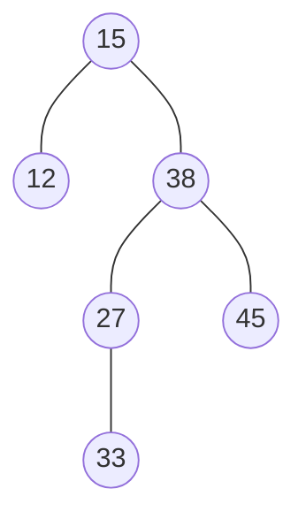

**10.**

```
插入 13：      13
插入 24：      13
                 \
                  24
插入 37：  失衡！13 的 BF = -2，插入在右孩子的右子树 → RR 型 → 左单旋
                  24
                 /  \
               13    37
插入 90：      24
              /  \
            13    37
                    \
                     90
插入 53：  失衡！37 的 BF = -2，53 插在 37 右孩子 90 的左子树 → RL 型
           → 先对 90 右旋，再对 37 左旋
                  24
                 /  \
               13    53
                    /  \
                  37    90
```

**11.**

（1）$H(key) = key \bmod 11$：

```
7  % 11 = 7   → 位置 7
8  % 11 = 8   → 位置 8
30 % 11 = 8   → 冲突！8→9，位置 9
11 % 11 = 0   → 位置 0
18 % 11 = 7   → 冲突！7→8→9→10，位置 10
9  % 11 = 9   → 冲突！9→10→0→1，位置 1
14 % 11 = 3   → 位置 3

下标:  0   1   2   3   4   5   6   7   8   9  10
存值: 11   9   —  14   —   —   —   7   8  30  18
比较:  1   4   —   1   —   —   —   1   1   2   4
```

（2）$ASL_{成功} = \frac{1+4+1+1+1+2+4}{7} = \frac{14}{7} = \boxed{2}$

（3）失败 ASL——对 11 个散列地址逐一探测到空位：

```
地址 0：0(11),1(9),2空        → 3
地址 1：1(9),2空              → 2
地址 2：2空                   → 1
地址 3：3(14),4空             → 2
地址 4：4空                   → 1
地址 5：5空                   → 1
地址 6：6空                   → 1
地址 7：7,8,9,10,0,1,2空      → 8
地址 8：8,9,10,0,1,2空        → 7
地址 9：9,10,0,1,2空          → 6
地址 10：10,0,1,2空           → 5
```

$$
ASL_{失败} = \frac{3+2+1+2+1+1+1+8+7+6+5}{11} = \frac{37}{11} \approx 3.36
$$

**12.**

3 阶 B 树：每个结点最多 2 个关键字，超过就分裂（中间的上移）。

```
插入 20：      [20]
插入 30：      [20,30]
插入 50：      [20,30,50] 溢出 → 中间 30 上移
                    [30]
                   /    \
               [20]      [50]
插入 52：           [30]
                   /    \
               [20]     [50,52]
插入 60：      [50,52,60] 溢出 → 52 上移
                  [30,52]
                 /   |   \
            [20]  [50]   [60]
插入 68：         [30,52]
                 /   |   \
            [20]  [50]   [60,68]
插入 70：      [60,68,70] 溢出 → 68 上移 → 父结点 [30,52,68] 也溢出 → 52 上移
                     [52]
                    /    \
              [30]        [68]
             /    \      /    \
        [20]  [50]  [60]      [70]
```

**树高从 2 增到 3**——B 树长高只发生在根分裂时。

</details>

---

## 小结

| 要点 | 一句话 |
|---|---|
| ASL | 比较**关键字**的平均次数；成功和失败要**分开算** |
| 失败结点数 | n 个内部结点 → **n+1** 个失败区间 |
| 顺序查找 | ASL 成功 (n+1)/2，失败 n+1；**唯一不挑存储结构的方法** |
| 折半查找 | **必须顺序存储 + 有序**；判定树是**平衡二叉树**，高 $\lceil\log_2(n+1)\rceil$ |
| mid 取值 | **向下取整** $\lfloor (low+high)/2 \rfloor$ |
| 分块查找 | **块间有序**块内无序；$s=\sqrt{n}$ 时 ASL 最优 = $\sqrt{n}+1$ |
| BST 核心性质 | **中序遍历有序** |
| BST 插入 | 新结点必为**叶子**；插入顺序决定树形 |
| BST 删除 | 两棵子树时用**直接前驱或后继**替换 |
| BST 最坏 | 有序插入 → 退化成**单链**，O(n) |
| 平衡因子 | **左高 − 右高**，取值 −1/0/1 |
| AVL 四种旋转 | LL 右单旋、RR 左单旋、LR 先左后右、RL 先右后左 |
| AVL 插入 vs 删除 | 插入**最多 1 次**旋转；删除**最多 O(log n)** 次 |
| AVL 最少结点 | $N_h = N_{h-1}+N_{h-2}+1$；h=5 → **12** |
| 红黑树五性质 | 非红即黑 / 根黑 / **NIL 叶黑** / 无连续红 / **黑高相同** |
| 红黑树高度 | 最长 ≤ 2×最短，$h \le 2\log_2(n+1)$ |
| AVL vs 红黑 | AVL 查得快，红黑**增删快**（删除最多 3 次旋转） |
| B 树关键字数 | 非根非叶 $[\lceil m/2 \rceil - 1,\ m-1]$；**子树数 = 关键字数 + 1** |
| B 树长高 | **只在根分裂时** +1，保证所有叶子同层 |
| B+ 树 | n 个关键字 → **n 棵子树**；**只有叶结点存记录**；叶子**串成链表** |
| 数据库选 B+ 树 | 阶数更大 → 树更矮 → I/O 更少；范围查询走叶链；路径等长性能稳 |
| 除留余数法 | p 取 ≤ m 的**最大质数** |
| 线性探测 | 会**堆积**；**删除必须打标记**，不能置空 |
| 平方探测 | 表长须为 **4k+3 型质数**才能探测全表 |
| 拉链法 | 删除方便、无堆积、**α 可以 > 1** |
| 装填因子 | ASL **只与 α 有关**，与 n、m 绝对值无关 |
| 散列表硬伤 | **不支持有序操作**——范围查询、找最值、有序遍历全不行 |

**下一章** → [DS08 排序](./DS08-精通-排序.md)，从插入排序到外部归并，把「有序」这件事做完。

---

## 延伸阅读

- 《数据结构（C 语言版）》严蔚敏 第 9 章 —— 408 指定教材
- 《算法导论》第 12-13 章（BST / 红黑树）、第 18 章（B 树）、第 11 章（散列表）—— 完整证明
- [Introduction to B-Trees（可视化）](https://www.cs.usfca.edu/~galles/visualization/BTree.html) —— 亲手点一遍分裂与合并
- [Red/Black Tree 可视化](https://www.cs.usfca.edu/~galles/visualization/RedBlack.html) —— 观察插入的三种 Case
- 本仓库对照：
  - [DS05 树与二叉树](./DS05-精通-树与二叉树.md) —— 二叉树的遍历与性质，本章的前置
  - [mysql/02 InnoDB 索引](../../mysql/02-精通-InnoDB-索引.md) —— B+ 树在真实存储引擎里的落地
  - [postgresql/04 B-tree 索引](../../postgresql/04-精通-B-tree-索引.md) —— 另一种实现视角
  - [algorithm/06 二分查找](../../algorithm/06-精通-二分查找.md) —— 折半查找的**刷题技巧**视角，含各种边界变形
  - [redis/01 数据结构内部](../../redis/01-精通-Redis-数据结构内部.md) —— 散列表 + 跳表的工业实现
