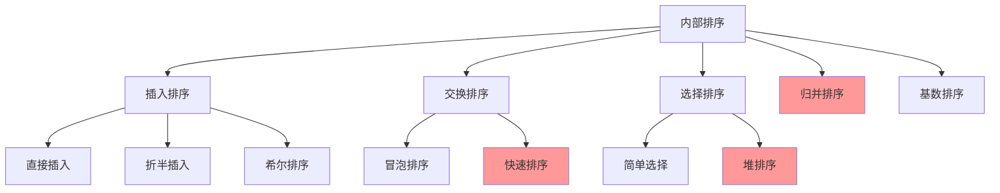
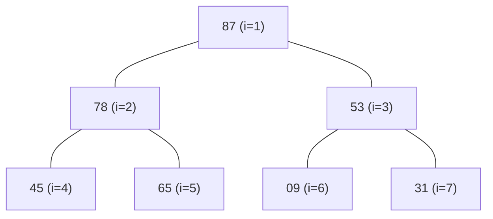
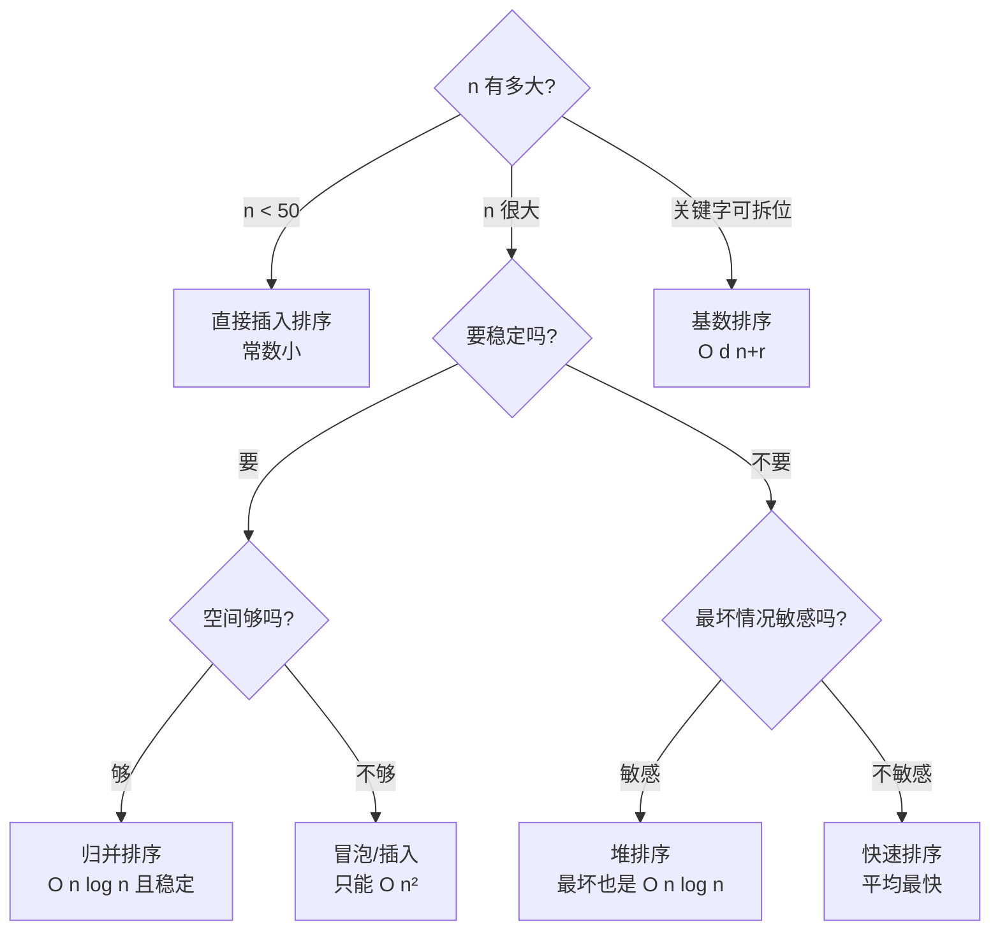
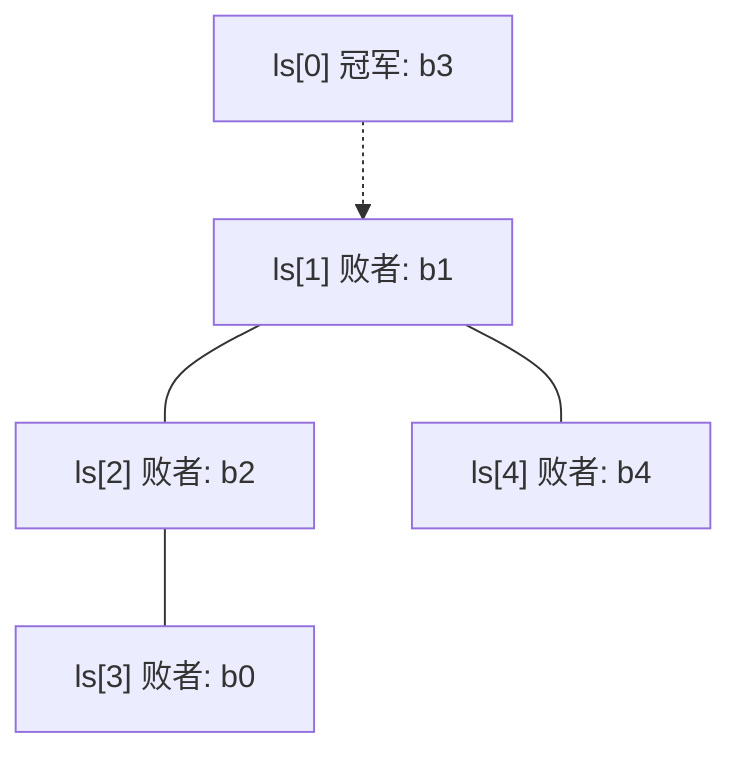

# 精通排序：插入、交换、选择、归并、基数与外部排序

> 课程编号：DS08
> 路线图来源：计算机基础四大件 · 数据结构（408 第 8 章）
> 难度：⭐⭐⭐⭐
> 预计阅读时间：90 分钟
> 内容基准：2026 年 8 月（408 考纲第 8 章「排序」，性质辨析题的重灾区）
> **代码语言：Go**。408 考场要求 C/C++，差异见本章 [§9 Go ↔ C 对照表](#第九章-go--c-对照表)。

---

## 引言：为什么工业排序库都是"缝合怪"

Go 标准库的 `sort.Sort` 不是快排，也不是堆排，而是**三种算法缝在一起**：

```
数据量 < 12                    →  插入排序
递归深度超过 2·⌈log₂n⌉          →  堆排序（防快排退化）
其余                           →  快速排序（三数取中选 pivot）
```

Java 的 `Arrays.sort` 对基本类型用**双轴快排**，对对象用 **TimSort**（归并 + 插入的混合）。C++ 的 `std::sort` 是 **introsort**（内省排序），思路和 Go 一样。

**没有一个工业库敢直接用课本上的单一算法。** 为什么？

| 算法 | 致命弱点 |
|---|---|
| 快速排序 | 最坏 **O(n²)**——有序输入 + 固定取首元素做 pivot 时必然触发 |
| 归并排序 | 需要 **O(n) 辅助空间** |
| 堆排序 | 常数因子大、**缓存不友好**（父子结点在数组里相距很远） |
| 插入排序 | O(n²)，但**小数组上常数极小，且近乎有序时接近 O(n)** |

于是工业方案就是取长补短：**大数组用快排分治，小数组切插入排序，递归太深切堆排序兜底最坏情况**。

这个"缝合"逻辑恰好把 408 第 8 章的所有考点串了起来——你必须同时知道每种算法的**时间、空间、稳定性、以及对初始序列的敏感度**，才能理解为什么这么缝。

而 408 最爱考的，正是这张表里那些**反直觉的格子**：

- 简单选择排序的比较次数**与初始序列完全无关**，恒为 n(n−1)/2
- 折半插入排序的**比较**次数降到 O(n log n)，但**移动**次数仍是 O(n²)，所以总体还是 O(n²)
- 堆排序**建堆只要 O(n)**，不是 O(n log n)
- 快排在**基本有序**时反而最慢
- 归并排序的移动次数**与初始序列无关**

读完你应该能：

- 手工模拟每种排序算法的每一趟结果（408 最高频的应用题）
- 背下八种内部排序的时间/空间/稳定性对照表，并说清每一格的理由
- 判断"一趟排序后哪些元素已到达最终位置"
- 计算外部排序的归并趟数、I/O 次数
- 构造最佳归并树，并算出需要补几个虚段

---

## 第一章 排序的基本概念

### 1.1 术语

| 术语 | 含义 |
|---|---|
| **内部排序** | 数据全部放在**内存**中完成 |
| **外部排序** | 数据太大，排序过程中需要在**内外存之间交换** |
| **稳定性** | 关键字相同的两个元素，排序后**相对次序不变**即为稳定 |
| **就地排序** | 辅助空间为 **O(1)** |
| **趟（pass）** | 对整个序列扫描一遍称为一趟 |

### 1.2 稳定性到底有什么用

课本上说"稳定性是排序算法的重要性质"，但很少解释为什么。看一个真实场景：

```
按「班级」排序，要求同班的学生仍按「学号」有序：

原始（已按学号排好）：
  [3班-01, 1班-02, 3班-03, 1班-04, 2班-05]

用稳定排序按班级排 →
  [1班-02, 1班-04, 2班-05, 3班-01, 3班-03]   ✅ 同班内学号仍有序

用不稳定排序按班级排 →
  [1班-04, 1班-02, 2班-05, 3班-03, 3班-01]   ❌ 同班内乱了
```

**稳定性让"多关键字排序"可以通过多趟单关键字排序实现**——先按次要关键字排，再按主要关键字稳定排序，结果就是双关键字有序。基数排序正是靠这个原理工作的。

> ⚠️ **不稳定的算法能不能改稳定？** 能，但要付出代价：给每个元素附加一个"原始下标"作为次关键字。408 里问"某算法是否稳定"时，指的是**算法的原始形式**。

### 1.3 排序算法全景



红色标注的三个是 **O(n log n)** 级别，也是考试重点。

---

## 第二章 插入排序

### 2.1 直接插入排序

**思想**：把待排序元素插入到**前面已排好序的部分**中的正确位置。像整理扑克牌。

```go
func InsertionSort(a []int) {
    for i := 1; i < len(a); i++ {
        if a[i] >= a[i-1] { // ★ 已经有序，不用动（这是"近乎有序时快"的原因）
            continue
        }
        tmp := a[i] // 暂存待插入元素
        j := i - 1
        for ; j >= 0 && a[j] > tmp; j-- {
            a[j+1] = a[j] // ★ 后移，不是交换
        }
        a[j+1] = tmp
    }
}
```

**手工模拟**（408 必考）`[49, 38, 65, 97, 76, 13, 27]`：

```
初始:  [49] 38  65  97  76  13  27
i=1:   [38  49] 65  97  76  13  27      38 插到 49 前
i=2:   [38  49  65] 97  76  13  27      65 已在位
i=3:   [38  49  65  97] 76  13  27      97 已在位
i=4:   [38  49  65  76  97] 13  27      76 插到 97 前
i=5:   [13  38  49  65  76  97] 27      13 插到最前
i=6:   [13  27  38  49  65  76  97]     27 插到 38 前
```

**性能分析**：

| 情况 | 比较次数 | 移动次数 | 时间 |
|---|---|---|---|
| 最好（已升序） | n−1 | **0** | **O(n)** |
| 最坏（逆序） | n(n−1)/2 | n(n−1)/2 | O(n²) |
| 平均 | ≈ n²/4 | ≈ n²/4 | O(n²) |

- 空间：**O(1)**
- 稳定性：**稳定**（`a[j] > tmp` 用的是严格大于，相等时不后移）

> 💡 **`a[j] > tmp` 里的 `>` 不能写成 `>=`**——写成 `>=` 会让相等元素也后移，算法就**变成不稳定的了**。这是一字之差改变性质的经典例子。

### 2.2 折半插入排序

既然前半部分已经有序，找插入位置可以用**折半查找**代替顺序查找：

```go
func BinaryInsertionSort(a []int) {
    for i := 1; i < len(a); i++ {
        tmp := a[i]
        low, high := 0, i-1
        for low <= high { // ★ 折半找插入位置
            mid := (low + high) / 2
            if a[mid] > tmp {
                high = mid - 1
            } else {
                low = mid + 1 // ★ 相等时往右找 → 保证稳定
            }
        }
        for j := i - 1; j >= low; j-- { // 统一后移
            a[j+1] = a[j]
        }
        a[low] = tmp
    }
}
```

**关键结论**（408 高频陷阱）：

| | 直接插入 | 折半插入 |
|---|---|---|
| **比较**次数 | O(n²) | **O(n log n)**，且**与初始序列无关** |
| **移动**次数 | O(n²) | **O(n²)**，与初始序列有关 |
| **总时间** | O(n²) | **仍是 O(n²)** ⚠️ |
| 稳定性 | 稳定 | **稳定** |

> ⚠️ **最常见的错误认知**：以为折半插入排序是 O(n log n)。**不是**。折半只优化了"找位置"，但"移动元素"这一步还是 O(n²)，而移动才是复杂度的瓶颈。

> 💡 为什么 `a[mid] > tmp` 时 high 左移、否则 low 右移（相等时也往右）？因为要把插入位置定在**所有相等元素之后**，这样才稳定。

### 2.3 希尔排序（缩小增量排序）

**动机**：直接插入排序对"近乎有序"的数组极快（O(n)），但对逆序数组极慢。希尔排序先用**大步长**做粗略排序让数组"基本有序"，再逐步缩小步长。

```go
func ShellSort(a []int) {
    n := len(a)
    for d := n / 2; d >= 1; d /= 2 { // ★ 增量序列 n/2, n/4, ..., 1
        for i := d; i < n; i++ { // 对每个子序列做直接插入排序
            tmp := a[i]
            j := i - d
            for ; j >= 0 && a[j] > tmp; j -= d {
                a[j+d] = a[j]
            }
            a[j+d] = tmp
        }
    }
}
```

**手工模拟** `[49, 38, 65, 97, 76, 13, 27, 49*]`（n=8，`49*` 表示第二个 49）：

```
d=4: 子序列 {49,76} {38,13} {65,27} {97,49*}
     各自排序后 → 49  13  27  49* 76  38  65  97
d=2: 子序列 {49,27,76,65} {13,49*,38,97}
     各自排序后 → 27  13  49  38  65  49* 76  97
d=1: 整体直接插入排序
     → 13  27  38  49  49* 65  76  97
```

> ⚠️ **注意 d=4 那一趟**：原序列里 `49` 在 `49*` 前面，排完 d=4 之后 `49` 仍在前。但看 d=2 那一趟的结果 —— `49` 和 `49*` 的相对位置在多趟跨步移动中**可能被打乱**。**希尔排序是不稳定的**，因为相同关键字可能被分到不同的子序列里各自移动。

**性能**：

- 时间：与增量序列有关。Hibbard 增量（$2^k-1$）下最坏 $O(n^{1.5})$；实用上约 **$O(n^{1.3})$**
- 空间：**O(1)**
- 稳定性：**不稳定**
- **只能用于顺序存储**（需要按下标跳跃访问）

---

## 第三章 交换排序

### 3.1 冒泡排序

**思想**：相邻元素两两比较，逆序就交换。每一趟把一个最大（或最小）元素"冒"到末尾。

```go
func BubbleSort(a []int) {
    n := len(a)
    for i := 0; i < n-1; i++ {
        swapped := false // ★ 提前退出的标志
        for j := 0; j < n-1-i; j++ {
            if a[j] > a[j+1] { // ★ 严格大于 → 稳定
                a[j], a[j+1] = a[j+1], a[j]
                swapped = true
            }
        }
        if !swapped { // ★ 一趟没交换 = 已经有序
            break
        }
    }
}
```

**性能**：

| 情况 | 比较 | 移动 | 时间 |
|---|---|---|---|
| 最好（已有序） | n−1 | **0** | **O(n)** |
| 最坏（逆序） | n(n−1)/2 | 3·n(n−1)/2 | O(n²) |

- 空间 **O(1)**，**稳定**
- **每一趟至少能确定一个元素的最终位置**——这是它和插入排序的关键区别

### 3.2 快速排序

**思想**：选一个基准（pivot），把序列分成"小于 pivot"和"大于 pivot"两部分，递归处理。

```go
// Hoare 划分的教材版本（408 用这个）
func partition(a []int, low, high int) int {
    pivot := a[low] // ★ 取第一个元素作枢轴
    for low < high {
        for low < high && a[high] >= pivot { // 从右往左找比 pivot 小的
            high--
        }
        a[low] = a[high]
        for low < high && a[low] <= pivot { // 从左往右找比 pivot 大的
            low++
        }
        a[high] = a[low]
    }
    a[low] = pivot // ★ pivot 归位——这个位置就是它的最终位置
    return low
}

func QuickSort(a []int, low, high int) {
    if low < high {
        p := partition(a, low, high)
        QuickSort(a, low, p-1)
        QuickSort(a, p+1, high)
    }
}
```

**手工模拟第一趟** `[49, 38, 65, 97, 76, 13, 27]`，pivot = 49：

```
初始: [49] 38  65  97  76  13  27     low=0, high=6
      ↑low                    ↑high

从右找 < 49：27 → a[0]=27
      27  38  65  97  76  13 [27]     low=0, high=6
从左找 > 49：65 → a[6]=65
      27  38 [65] 97  76  13  65      low=2, high=6
从右找 < 49：13 → a[2]=13
      27  38  13  97  76 [13] 65      low=2, high=5
从左找 > 49：97 → a[5]=97
      27  38  13 [97] 76  97  65      low=3, high=5
从右找 < 49：无（high 减到 3）        low=high=3
pivot 归位：a[3] = 49

结果: 27  38  13 |49| 97  76  65
                  ↑ 最终位置已确定
```

**性能分析**：

| 情况 | 划分 | 递归深度 | 时间 | 空间 |
|---|---|---|---|---|
| 最好 | 每次均分 | log₂n | **O(n log n)** | O(log n) |
| **最坏** | 每次分成 0 和 n−1 | n | **O(n²)** | **O(n)** |
| 平均 | —— | ≈1.39log₂n | O(n log n) | O(log n) |

> ⚠️ **最坏情况出现在「基本有序」或「基本逆序」时**——这非常反直觉。取首元素作 pivot 时，有序数组每次划分都把 pivot 放在最左边，另一侧有 n−1 个元素，递归树退化成一条链。
>
> **改进**：三数取中（取 low、mid、high 三个位置的中位数作 pivot）、随机化选 pivot。

- 稳定性：**不稳定**（划分时的长距离交换会打乱相同元素的相对位置）
- **快速排序是所有内部排序中平均性能最好的**——常数因子小、缓存友好

---

## 第四章 选择排序

### 4.1 简单选择排序

**思想**：每一趟从未排序部分选出最小的，放到已排序部分末尾。

```go
func SelectionSort(a []int) {
    n := len(a)
    for i := 0; i < n-1; i++ {
        min := i
        for j := i + 1; j < n; j++ { // ★ 无论如何都要全扫一遍
            if a[j] < a[min] {
                min = j
            }
        }
        if min != i {
            a[i], a[min] = a[min], a[i] // ★ 长距离交换 → 不稳定
        }
    }
}
```

**性能**（408 高频考点）：

- **比较次数恒为 $\frac{n(n-1)}{2}$，与初始序列完全无关** —— 因为每趟都必须扫完剩余全部元素才能确定最小值
- 移动次数：最好 0，最坏 3(n−1)
- 时间：**恒为 O(n²)**，最好最坏平均都一样
- 空间 O(1)
- 稳定性：**不稳定**

> ⚠️ **为什么简单选择排序不稳定？** 举反例：`[2, 2*, 1]`。第一趟找到最小值 1（下标 2），与下标 0 的 `2` 交换 → `[1, 2*, 2]`。原本在前的 `2` 跑到了 `2*` 后面。

> 💡 **"比较次数与初始序列无关"的算法只有三个**：简单选择排序、折半插入排序（仅指比较）、基数排序。这是选择题的送分点。

### 4.2 堆排序

**堆**是一棵**完全二叉树**，用数组顺序存储：

- **大根堆**：任一结点的值 ≥ 其左右孩子（根是最大值）
- **小根堆**：任一结点的值 ≤ 其左右孩子（根是最小值）

下标关系（**从 1 开始存**，408 教材约定）：结点 i 的左孩子 2i、右孩子 2i+1、父结点 ⌊i/2⌋。



#### 建堆：为什么是 O(n) 而不是 O(n log n)

**自下而上**从最后一个**非叶结点**（下标 ⌊n/2⌋）开始，依次向前对每个结点做"下沉调整"。

```go
// 下沉调整：把 a[i] 调整到合适位置（0-indexed 版本）
func siftDown(a []int, i, n int) {
    for {
        largest := i
        l, r := 2*i+1, 2*i+2 // 0-indexed 的左右孩子
        if l < n && a[l] > a[largest] {
            largest = l
        }
        if r < n && a[r] > a[largest] {
            largest = r
        }
        if largest == i {
            return // ★ 已满足堆序，停止
        }
        a[i], a[largest] = a[largest], a[i]
        i = largest // ★ 继续往下沉
    }
}

func HeapSort(a []int) {
    n := len(a)
    // ① 建堆：从最后一个非叶结点开始，O(n)
    for i := n/2 - 1; i >= 0; i-- {
        siftDown(a, i, n)
    }
    // ② 反复取堆顶（最大值）放到末尾，O(n log n)
    for i := n - 1; i > 0; i-- {
        a[0], a[i] = a[i], a[0] // 堆顶换到末尾
        siftDown(a, 0, i)       // ★ 堆规模缩小到 i
    }
}
```

**建堆为什么是 O(n)？** 关键在于**大部分结点都在底层，而底层结点下沉的距离很短**：

```
高度 h 的结点数约 n/2^(h+1)，每个下沉最多 h 步：

总代价 = Σ (n/2^(h+1)) × h  ≈  n × Σ (h/2^(h+1))  ≈  n × 1 = O(n)
         h=0..log n              h=0..∞
```

直观理解：**一半的结点是叶子（下沉 0 步），四分之一的结点下沉 1 步，八分之一下沉 2 步**……加权求和收敛到常数。

> ⚠️ **别把建堆和排序阶段搞混**：建堆 **O(n)**，排序阶段 n−1 次调整每次 O(log n) → **O(n log n)**。总体 O(n log n)。

**手工模拟建堆** `[49, 38, 65, 97, 76, 13, 27]`（n=7，1-indexed）：

```
初始完全二叉树：
              49
            /    \
          38      65
         /  \    /  \
       97   76  13   27

从 i=⌊7/2⌋=3 开始：
i=3 (65)：孩子 13, 27，最大 65 → 不动
i=2 (38)：孩子 97, 76，最大 97 → 交换 38↔97
              49                        49
            /    \                    /    \
          97      65      →         97      65
         /  \    /  \              /  \    /  \
       38   76  13   27          38   76  13   27
i=1 (49)：孩子 97, 65，最大 97 → 交换 49↔97
          → 49 沉到 i=2，其孩子 38, 76，最大 76 → 再交换
              97
            /    \
          76      65
         /  \    /  \
       38   49  13   27      ← 大根堆建成
```

**性能**：

- 时间：**恒为 O(n log n)**，最好最坏平均都一样
- 空间：**O(1)** —— 这是它相对归并排序的最大优势
- 稳定性：**不稳定**（堆顶与末尾的交换是长距离的）
- **适合"取前 k 大/小"**：不用全排，取 k 次堆顶即可，O(n + k log n)

---

## 第五章 归并排序与基数排序

### 5.1 归并排序

**思想**：分治。把序列一分为二，各自排好序，再**归并**两个有序序列。

```go
func MergeSort(a []int, low, high int, tmp []int) {
    if low >= high {
        return
    }
    mid := (low + high) / 2
    MergeSort(a, low, mid, tmp)
    MergeSort(a, mid+1, high, tmp)
    merge(a, low, mid, high, tmp)
}

func merge(a []int, low, mid, high int, tmp []int) {
    copy(tmp[low:high+1], a[low:high+1]) // ★ 复制到辅助数组
    i, j, k := low, mid+1, low
    for i <= mid && j <= high {
        if tmp[i] <= tmp[j] { // ★ 相等时取左边的 → 保证稳定
            a[k] = tmp[i]
            i++
        } else {
            a[k] = tmp[j]
            j++
        }
        k++
    }
    for i <= mid { // 左半剩余
        a[k] = tmp[i]
        i++
        k++
    }
    for j <= high { // 右半剩余
        a[k] = tmp[j]
        j++
        k++
    }
}
```

**手工模拟**（2 路归并）`[49, 38, 65, 97, 76, 13, 27]`：

```
初始:  [49] [38] [65] [97] [76] [13] [27]
第1趟: [38 49] [65 97] [13 76] [27]
第2趟: [38 49 65 97] [13 27 76]
第3趟: [13 27 38 49 65 76 97]
```

**性能**：

- 时间：**恒为 O(n log n)**（n 个元素归并 ⌈log₂n⌉ 趟，每趟 O(n)）
- 空间：**O(n)** —— 唯一需要线性辅助空间的常用排序
- 稳定性：**稳定**（`tmp[i] <= tmp[j]` 里的 `<=` 是关键）
- **移动次数与初始序列无关**

> 💡 **归并排序是唯一"既 O(n log n) 又稳定"的常用内部排序**。代价是 O(n) 空间。这就是 Java 对**对象数组**用 TimSort（归并系）而对**基本类型**用快排的原因——对象排序需要稳定性，基本类型不需要（值相同就是完全相同）。

> ⚠️ **归并排序不能保证"一趟后有元素到达最终位置"**。408 常考"下列排序算法中，每趟排序后都能确定至少一个元素最终位置的是"——答案是**交换类（冒泡、快排）和选择类（简单选择、堆排序）**，插入类和归并**不能**。

### 5.2 基数排序

**思想**：不比较关键字，而是按位分配 + 收集。**基于"多关键字排序"和稳定性**。

以 3 位十进制数为例，**从最低位开始**（LSD，最低位优先）：

```
初始: 278  109  063  930  589  184  505  269  008  083

第1趟（按个位分配到 0-9 号桶，再按序收集）:
  桶0: 930
  桶3: 063  083
  桶4: 184
  桶5: 505
  桶8: 278  008
  桶9: 109  589  269
收集: 930  063  083  184  505  278  008  109  589  269

第2趟（按十位）:
  桶0: 505  008  109
  桶6: 063  269
  桶7: 278
  桶8: 083  184  589
  桶3: 930
收集: 505  008  109  930  063  269  278  083  184  589

第3趟（按百位）:
  桶0: 008  063  083
  桶1: 109  184
  桶2: 269  278
  桶5: 505  589
  桶9: 930
收集: 008  063  083  109  184  269  278  505  589  930   ✅ 有序
```

**为什么能行？** 因为每趟"分配-收集"是**稳定**的。第 2 趟排十位时，十位相同的元素保持了第 1 趟排好的个位顺序。**基数排序的正确性完全建立在稳定性之上**。

```go
func RadixSort(a []int, d int) { // d = 最大位数
    n := len(a)
    tmp := make([]int, n)
    for exp, i := 1, 0; i < d; i, exp = i+1, exp*10 {
        var count [10]int
        for _, v := range a { // ① 统计每个桶的元素数
            count[(v/exp)%10]++
        }
        for k := 1; k < 10; k++ { // ② 前缀和 → 每个桶的结束位置
            count[k] += count[k-1]
        }
        for j := n - 1; j >= 0; j-- { // ★ 必须倒序遍历才能保证稳定
            digit := (a[j] / exp) % 10
            count[digit]--
            tmp[count[digit]] = a[j]
        }
        copy(a, tmp)
    }
}
```

**性能**（d 位、r 进制、n 个元素）：

- 时间：**O(d(n + r))** —— 与关键字的"位数"和"基数"有关，**与初始序列无关**
- 空间：**O(r)**（r 个桶）
- 稳定性：**稳定**
- 适用：关键字可以拆成若干位、且每位取值范围 r 不大（如身份证号、日期、定长字符串）

---

## 第六章 内部排序全对照

这张表是 408 第 8 章的**核心得分点**，必须默写。

| 算法 | 最好 | 平均 | 最坏 | 空间 | **稳定性** | 每趟定位 |
|---|---|---|---|---|---|---|
| **直接插入** | O(n) | O(n²) | O(n²) | O(1) | ✅ 稳定 | ❌ |
| **折半插入** | O(n²)※ | O(n²) | O(n²) | O(1) | ✅ 稳定 | ❌ |
| **希尔排序** | —— | O(n^1.3) | O(n²) | O(1) | ❌ 不稳定 | ❌ |
| **冒泡排序** | O(n) | O(n²) | O(n²) | O(1) | ✅ 稳定 | ✅ |
| **快速排序** | O(n log n) | **O(n log n)** | **O(n²)** | O(log n)~O(n) | ❌ 不稳定 | ✅ |
| **简单选择** | O(n²) | O(n²) | O(n²) | O(1) | ❌ 不稳定 | ✅ |
| **堆排序** | O(n log n) | O(n log n) | O(n log n) | **O(1)** | ❌ 不稳定 | ✅ |
| **归并排序** | O(n log n) | O(n log n) | O(n log n) | **O(n)** | ✅ 稳定 | ❌ |
| **基数排序** | O(d(n+r)) | O(d(n+r)) | O(d(n+r)) | O(r) | ✅ 稳定 | ❌ |

※ 折半插入的**比较**次数最好情况是 O(n log n)，但**移动**次数仍 O(n²)，所以总时间是 O(n²)。

### 6.1 三条速记口诀

**① 稳定性：「插冒归基」稳，「希快选堆」不稳**

```
稳定：  直接插入、折半插入、冒泡、归并、基数
不稳定：希尔、快速、简单选择、堆
```

记忆法：**「快些选堆」（快排、希尔、选择、堆）都不稳定**，剩下的都稳定。

**② 空间复杂度：只有归并是 O(n)，快排是 O(log n)，其余都是 O(1)**

（基数排序 O(r) 是桶的开销，r 通常是常数如 10）

**③ 时间与初始序列的关系**

| 特性 | 哪些算法 |
|---|---|
| **完全无关**（最好=最坏） | 简单选择、堆排序、归并排序、基数排序 |
| **有序时最快** | 直接插入、冒泡（都能到 O(n)） |
| **有序时最慢** ⚠️ | **快速排序**（退化到 O(n²)） |

### 6.2 怎么选



---

## 第七章 外部排序

### 7.1 问题：内存放不下

要排 8 GB 的文件，内存只有 1 GB。**外部排序**的基本流程：


**核心矛盾**：外部排序的时间**几乎全部消耗在 I/O 上**，内部排序的时间可以忽略。所以优化目标是**减少 I/O 次数**。

### 7.2 归并趟数与 I/O

设初始归并段有 **r 个**，做 **m 路归并**，则归并趟数：

$$
S = \lceil \log_m r \rceil
$$

**总读写次数** = 2 × n × (S + 1) 个记录（+1 是生成初始归并段那一趟的读写）。

**例**：r = 16 个初始段。

| 归并路数 m | 趟数 S = ⌈log_m 16⌉ |
|---|---|
| 2 路 | 4 |
| 4 路 | 2 |
| 8 路 | **2**（⌈log₈16⌉ = ⌈1.33⌉ = 2） |
| 16 路 | **1** |

**结论：增大 m 能显著减少归并趟数，从而减少 I/O。**

> ⚠️ **但 m 不能无限增大**。m 路归并每次选最小元素需要比较 **m−1** 次，m 越大内部比较越多。而且需要 m 个输入缓冲区，内存有限。

### 7.3 败者树：把 m 路归并的比较次数降到 log₂m

朴素 m 路归并每选一个元素要比较 m−1 次。**败者树**（一种特殊的完全二叉树）把它降到 $\lceil\log_2 m\rceil$ 次。

**规则**：内部结点记录**败者**（较大的那个）的段号，冠军（最小者）往上走。



**为什么记败者而不是胜者？** 因为冠军被取走后，只需要把它所在段的**下一个元素**放回原叶子位置，然后**沿着从该叶子到根的路径**重新比较——路径上记录的正好是这条路上的历史败者，一路比过去就能选出新冠军，只需 $\lceil\log_2 m\rceil$ 次比较。若记胜者，则需要重新比较兄弟子树，效率低。

**效果**：m 路归并选一个元素的比较次数从 **m−1** 降到 **⌈log₂m⌉**。m = 16 时，从 15 次降到 4 次。

### 7.4 置换-选择排序：生成更长的初始归并段

朴素做法：内存能装 w 个记录，就每次读 w 个内排一次 → 每个初始段长度恰为 w，段数 r = n/w。

**置换-选择排序**能生成**平均长度为 2w** 的归并段，直接把 r 砍半：

```
工作区大小 w = 3，输入 [17, 21, 05, 44, 10, 12, 56, 32, 29]

工作区: {17,21,05}  → 输出最小 05    段1: 05
读入 44 → {17,21,44} → 输出 17       段1: 05 17
读入 10 → {21,44,10}，10 < 17 已输出，标记为"下一段"
                     → 输出 21       段1: 05 17 21
读入 12 → {44,10*,12*} → 输出 44     段1: 05 17 21 44
读入 56 → {10*,12*,56} 
   工作区全是"下一段"标记 → 段1 结束，开始段2
                     → 输出 10       段2: 10
...
```

**关键**：新读入的记录若 **≥ 刚输出的记录**，就还能进当前段；否则标记为下一段。这样当前段能"顺路捡"很多元素，平均长度达到 2w。

### 7.5 最佳归并树

初始归并段**长度不等**时，归并顺序会影响总 I/O。这本质上是**哈夫曼树**问题——把段长当权值，构造 **m 叉哈夫曼树**，带权路径长度（WPL）最小的方案 I/O 最少。

#### 虚段的计算（408 高频）

m 叉哈夫曼树要求：每次归并**恰好合并 m 个结点**。若段数 r 不满足，需要补长度为 0 的**虚段**。

**规则**：m 叉树中，每次归并使结点数减少 m−1。要最终归到 1 个，必须满足：

$$
(r - 1) \bmod (m - 1) = 0
$$

若 $(r-1) \bmod (m-1) = u \neq 0$，则需补 **$m - 1 - u$** 个虚段。

**例**：8 个初始段，做 3 路归并。

$$
(8-1) \bmod (3-1) = 7 \bmod 2 = 1 \neq 0
$$

需补 $3 - 1 - 1 = 1$ 个虚段，共 9 个段参与归并。

**例**：9 个初始段，做 4 路归并。

$$
(9-1) \bmod (4-1) = 8 \bmod 3 = 2 \neq 0
$$

需补 $4 - 1 - 2 = 1$ 个虚段，共 10 个段。

> 💡 **虚段要放在树的最下层**（哈夫曼树里权值为 0 的结点自然会被最先合并，落在最深处），这样才不增加 WPL。

---

## 第八章 408 高频考点与陷阱清单

### 8.1 考点分布

第 8 章通常是 **2-3 道选择题（4-6 分）+ 偶尔的应用题**。选择题占比高，且**几乎全是对照表的辨析**。

最常考的五类：

1. **稳定性判断**（年年考）
2. **时间复杂度与初始序列的关系**（快排何时最坏、选择排序何时都一样）
3. **某算法第 k 趟后的序列状态**（手工模拟）
4. **哪些算法每趟能确定元素最终位置**
5. 外部排序的归并趟数、虚段数计算

### 8.2 十四个陷阱

**陷阱 1：折半插入排序的时间复杂度是 O(n log n)**

**错**。折半只优化了**比较**次数，**移动**次数仍是 O(n²)，总时间 **O(n²)**。

**陷阱 2：希尔排序是稳定的**

**错**。相同关键字可能被分到不同子序列，跨步移动会打乱相对次序。

**陷阱 3：快速排序在序列基本有序时最快**

**错，恰恰相反**。取首元素作 pivot 时，基本有序会导致划分极不均衡，退化到 **O(n²)**。

**陷阱 4：简单选择排序的比较次数与初始序列有关**

**错**。恒为 $\frac{n(n-1)}{2}$，因为每趟必须扫完剩余全部元素。

**陷阱 5：堆排序的建堆过程是 O(n log n)**

**错**。建堆是 **O(n)**，排序阶段才是 O(n log n)。

**陷阱 6：堆一定是完全二叉树**

**对**。堆的定义就要求是完全二叉树（这样才能用数组顺序存储）。

**陷阱 7：大根堆的中序遍历有序**

**错**。这是把堆和 BST 搞混了。堆只保证**父子有序**，兄弟之间无序，任何遍历都不保证有序。**只有 BST 的中序遍历有序**。

**陷阱 8：归并排序每趟后至少有一个元素到达最终位置**

**错**。归并和插入排序都**不能**保证。能保证的是**交换类**（冒泡、快排）和**选择类**（简单选择、堆排序）。

**陷阱 9：n 个元素的 2 路归并需要 n−1 趟**

**错**。是 **⌈log₂n⌉** 趟。

**陷阱 10：基数排序是基于比较的排序**

**错**。基数排序**不比较关键字大小**，靠分配-收集。这也是它能突破 O(n log n) 下界的原因（比较排序的信息论下界是 Ω(n log n)）。

**陷阱 11：基数排序必须从最高位开始**

**错**。LSD（最低位优先）和 MSD（最高位优先）都可以，但 **LSD 实现更简单**，408 教材讲的是 LSD。

**陷阱 12：外部排序增大归并路数 m 一定更好**

**错**。m 增大减少了归并趟数（I/O 少了），但**内部比较次数增加**（每次选最小要比较 m−1 次），且需要更多缓冲区。用**败者树**才能把比较次数降到 ⌈log₂m⌉，使增大 m 真正划算。

**陷阱 13：最佳归并树里虚段可以随便放**

**错**。虚段必须在**最下层**，否则 WPL 增大。

**陷阱 14：m 路归并时补虚段的公式是 (r) mod (m−1)**

**错**。是 **(r − 1) mod (m − 1)**，补 **m − 1 − u** 个。

### 8.3 特殊场景速查

| 需求 | 最佳选择 | 理由 |
|---|---|---|
| n 很小（< 50） | **直接插入** | 常数因子最小 |
| 数据基本有序 | **直接插入 / 冒泡** | 都能到 O(n)；**千万别用快排** |
| 要求稳定 + O(n log n) | **归并排序** | 唯一同时满足的 |
| 空间紧张 + 最坏情况敏感 | **堆排序** | O(1) 空间，最坏仍 O(n log n) |
| 求前 k 大 | **堆排序** | O(n + k log n)，不用全排 |
| 平均性能最优 | **快速排序** | 常数小、缓存友好 |
| 关键字定长可拆位 | **基数排序** | O(d(n+r))，可低于 O(n log n) |
| 数据量超内存 | **外部归并** | 置换-选择 + 败者树 + 最佳归并树 |

---

## 第九章 Go ↔ C 对照表

| 场景 | C（考场写法） | Go（本章写法） | 说明 |
|---|---|---|---|
| 交换两元素 | `t=a[i]; a[i]=a[j]; a[j]=t;` | `a[i], a[j] = a[j], a[i]` | Go **右值先全部求值**，无需临时变量 |
| 辅助数组 | `int *tmp = (int*)malloc(n*sizeof(int));` ... `free(tmp);` | `tmp := make([]int, n)` | Go 有 GC，**不要写 free** |
| 数组传参 | `void sort(int a[], int n)` | `func Sort(a []int)` | Go 切片自带长度 `len(a)`，**且是引用语义**——函数内修改会影响调用方 |
| 数组下标起点 | 教材常用 **1-indexed**（`a[0]` 当哨兵） | 本章用 **0-indexed** | 堆的下标公式随之变化：1-indexed 是 `2i / 2i+1`，0-indexed 是 `2i+1 / 2i+2` |
| 复制数组 | `memcpy(dst, src, n*sizeof(int));` | `copy(dst, src)` | `copy` 返回实际拷贝个数，取 `min(len(dst), len(src))` |
| 二维桶 | `int bucket[10][MAXN];` | `bucket := make([][]int, 10)` | Go 用切片的切片，各桶可变长 |

> ⚠️ **最容易翻车的是堆的下标公式**。408 教材普遍用 1-indexed（`a[1]` 是根），因为 `2i`、`2i+1`、`⌊i/2⌋` 三个公式最简洁。Go 习惯 0-indexed，公式变成 `2i+1`、`2i+2`、`⌊(i-1)/2⌋`。**考场上按教材的 1-indexed 写，本章代码看懂即可，别混用。**

> ⚠️ **Go 切片是引用语义**：`func Sort(a []int)` 里对 `a[i]` 的修改**会反映到调用方**，不需要传指针。但 `append` 可能触发扩容换底层数组，那时修改就**不会**反映回去——排序算法不 append，所以没这个问题。

---

## 第十章 力扣实战题单

### 必刷档（8 题）

| 题号 | 题目 | 练什么 | 目标复杂度 |
|---|---|---|---|
| 912 | [排序数组](https://leetcode.cn/problems/sort-an-array/) | **手写快排/归并/堆排的模板题** | O(n log n) |
| 88 | [合并两个有序数组](https://leetcode.cn/problems/merge-sorted-array/) | **§5.1 归并的 merge 步骤**，倒序填充 | O(m+n) / O(1) |
| 215 | [数组中的第K个最大元素](https://leetcode.cn/problems/kth-largest-element-in-an-array/) | **快速选择 / 堆**，§4.2 取前 k 大 | O(n) 平均 |
| 75 | [颜色分类](https://leetcode.cn/problems/sort-colors/) | 三路划分（荷兰国旗），快排的变体 | O(n) / O(1) |
| 148 | [排序链表](https://leetcode.cn/problems/sort-list/) | **链表只能归并排序**（无法随机访问） | O(n log n) / O(log n) |
| 56 | [合并区间](https://leetcode.cn/problems/merge-intervals/) | 排序是很多问题的预处理步骤 | O(n log n) |
| 347 | [前 K 个高频元素](https://leetcode.cn/problems/top-k-frequent-elements/) | **小根堆维护 top-k** | O(n log k) |
| 1122 | [数组的相对排序](https://leetcode.cn/problems/relative-sort-array/) | 计数排序思想 | O(n+r) |

**215 第K个最大元素**——快速选择：只递归**有目标的那一侧**，平均 O(n)：

```go
func findKthLargest(nums []int, k int) int {
    target := len(nums) - k // 第 k 大 = 升序下标 n-k
    low, high := 0, len(nums)-1
    for {
        p := partition(nums, low, high)
        switch {
        case p == target:
            return nums[p]
        case p < target:
            low = p + 1 // ★ 只往右找，抛弃左半——这是 O(n) 而非 O(n log n) 的关键
        default:
            high = p - 1
        }
    }
}
```

**148 排序链表**——为什么链表只能用归并：

```go
// 链表无法 O(1) 随机访问 → 快排的划分、堆排的下标计算都做不了
// 但归并排序只需要顺序访问，且链表归并不需要额外 O(n) 空间（改指针即可）
func sortList(head *ListNode) *ListNode {
    if head == nil || head.Next == nil {
        return head
    }
    // ★ 快慢指针找中点并断开
    slow, fast := head, head.Next
    for fast != nil && fast.Next != nil {
        slow, fast = slow.Next, fast.Next.Next
    }
    mid := slow.Next
    slow.Next = nil

    return mergeList(sortList(head), sortList(mid))
}

func mergeList(a, b *ListNode) *ListNode {
    dummy := &ListNode{}
    cur := dummy
    for a != nil && b != nil {
        if a.Val <= b.Val { // ★ <= 保证稳定
            cur.Next, a = a, a.Next
        } else {
            cur.Next, b = b, b.Next
        }
        cur = cur.Next
    }
    if a != nil {
        cur.Next = a
    } else {
        cur.Next = b
    }
    return dummy.Next
}
```

> 💡 **链表归并的空间是 O(log n) 而不是 O(n)** —— 只有递归栈的开销，归并过程靠改指针完成，不需要辅助数组。这是链表相对数组的一个真实优势。

### 进阶档（6 题）

| 题号 | 题目 | 练什么 |
|---|---|---|
| 315 | [计算右侧小于当前元素的个数](https://leetcode.cn/problems/count-of-smaller-numbers-after-self/) | **归并排序求逆序对**的变体 |
| 493 | [翻转对](https://leetcode.cn/problems/reverse-pairs/) | 归并 + 双指针统计 |
| 剑指51 | [数组中的逆序对](https://leetcode.cn/problems/shu-zu-zhong-de-ni-xu-dui-lcof/) | **归并排序最经典的应用** |
| 164 | [最大间距](https://leetcode.cn/problems/maximum-gap/) | **桶排序 / 基数排序**，要求 O(n) |
| 179 | [最大数](https://leetcode.cn/problems/largest-number/) | 自定义比较器排序 |
| 23 | [合并 K 个升序链表](https://leetcode.cn/problems/merge-k-sorted-lists/) | **k 路归并 + 小根堆**，对应 §7.3 败者树 |

### 挑战档（3 题）

| 题号 | 题目 | 练什么 |
|---|---|---|
| 面试17.14 | [最小K个数](https://leetcode.cn/problems/smallest-k-lcci/) | 快速选择 vs 堆的取舍 |
| 327 | [区间和的个数](https://leetcode.cn/problems/count-of-range-sum/) | 前缀和 + 归并排序 |
| 391 | [完美矩形](https://leetcode.cn/problems/perfect-rectangle/) | 排序 + 扫描线 |

### 题单进度自查

- [ ] 能默写快排、归并、堆排三套模板（不查资料）
- [ ] 理解快速选择为什么是 O(n) 而快排是 O(n log n)
- [ ] 能用归并排序求逆序对
- [ ] 说得清"链表为什么只能归并排序"

---

## 第十一章 练习题

### 选择题

**1.** 对 `[12, 5, 9, 20, 6, 31, 24]` 做直接插入排序，第 **4 趟**（即插入第 5 个元素后）的结果是：
A. 5 9 12 20 6 31 24
B. 5 6 9 12 20 31 24
C. 5 9 12 6 20 31 24
D. 5 6 9 12 20 24 31

**2.** 下列排序算法中，**不稳定**的是：
A. 直接插入排序　B. 冒泡排序　C. 希尔排序　D. 归并排序

**3.** 对 n 个元素做简单选择排序，**比较**次数是：
A. 与初始序列有关　B. n(n−1)/2　C. n log₂n　D. n−1

**4.** 快速排序在下列哪种情况下最坏？
A. 元素随机分布
B. 元素已按关键字有序
C. 元素取值范围很小
D. 元素个数为 2 的幂

**5.** 对 n 个元素建大根堆，时间复杂度是：
A. O(1)　B. O(n)　C. O(n log n)　D. O(n²)

**6.** 下列排序算法中，**每趟排序后都能确定至少一个元素最终位置**的是：
A. 直接插入排序　B. 归并排序　C. 堆排序　D. 希尔排序

**7.** 用 2 路归并排序对 n 个元素排序，需要归并的趟数是：
A. n　B. n−1　C. ⌈log₂n⌉　D. ⌈n/2⌉

**8.** 对 16 个初始归并段做 4 路归并，需要归并趟数为：
A. 1　B. 2　C. 3　D. 4

**9.** 有 10 个初始归并段，做 3 路归并，构造最佳归并树需要补几个虚段？
A. 0　B. 1　C. 2　D. 3

**10.** 下列关于基数排序的说法，**错误**的是：
A. 基数排序是稳定的
B. 基数排序不基于关键字比较
C. 基数排序的时间复杂度是 O(n log n)
D. 基数排序的正确性依赖于每趟分配-收集的稳定性

### 应用题

**11.** 序列 `[503, 87, 512, 61, 908, 170, 897, 275, 653, 426]`：
（1）写出**希尔排序**（增量 5, 3, 1）每趟的结果。
（2）写出**堆排序**建初始大根堆后的序列。
（3）写出**快速排序**第一趟划分（取首元素作 pivot）的结果。

**12.** 已知 8 个初始归并段的长度为 `{ 9, 30, 12, 18, 3, 17, 2, 6 }`，做 **3 路归并**。
（1）需要补几个虚段？
（2）构造最佳归并树，求带权路径长度 WPL。
（3）若每个记录的读写各算 1 次 I/O，总 I/O 次数是多少？

**13.** 说明为什么**基于比较的排序算法**时间复杂度下界是 $\Omega(n \log n)$，而基数排序可以突破这个下界。

### 答案与解析

<details>
<summary>点击展开</summary>

**1. B**

直接插入排序逐趟结果：

```
初始:  [12] 5   9   20  6   31  24
第1趟: [5  12] 9   20  6   31  24
第2趟: [5  9   12] 20  6   31  24
第3趟: [5  9   12  20] 6   31  24
第4趟: [5  6   9   12  20] 31  24     ← 插入第 5 个元素 6
```

**2. C**

「快些选堆」不稳定：**快**排、**希**尔、**选**择、**堆**排序。

**3. B**

简单选择排序每趟必须扫完剩余全部元素才能确定最小值，所以比较次数恒为：

$$
(n-1) + (n-2) + \cdots + 1 = \frac{n(n-1)}{2}
$$

**与初始序列完全无关**——这是它区别于其他 O(n²) 算法的关键特征。

**4. B**

取首元素作 pivot 时，有序序列每次划分都把 pivot 放在最左端，右侧剩 n−1 个元素，递归树退化成链，时间 **O(n²)**，且递归深度 n 导致栈空间 O(n)。

**5. B**

建堆是自下而上的，大部分结点在底层且下沉距离短：

$$
\sum_{h=0}^{\log n} \frac{n}{2^{h+1}} \cdot h \approx n \sum_{h=0}^{\infty} \frac{h}{2^{h+1}} = n \cdot 1 = O(n)
$$

**6. C**

**交换类**（冒泡、快排）和**选择类**（简单选择、堆排序）每趟能确定至少一个元素的最终位置。插入类和归并**不能**——插入排序中已排好的部分随时可能因新元素插入而整体后移。

**7. C**

2 路归并每趟把段数减半，从 n 个段归到 1 个段需要 **⌈log₂n⌉** 趟。

**8. B**

$$
S = \lceil \log_4 16 \rceil = \lceil 2 \rceil = 2
$$

**9. B**

$$
(r-1) \bmod (m-1) = (10-1) \bmod (3-1) = 9 \bmod 2 = 1 \neq 0
$$

补 $m - 1 - u = 3 - 1 - 1 = \boxed{1}$ 个虚段。

**10. C**

基数排序是 **O(d(n+r))**，**与 n log n 无关**。它不基于比较，所以不受比较排序 Ω(n log n) 下界的约束。

A、B、D 都正确——尤其 D，基数排序的正确性**完全建立在稳定性之上**。

**11.**

（1）**希尔排序**，序列 `503, 87, 512, 61, 908, 170, 897, 275, 653, 426`（n=10）：

```
d=5: 子序列 {503,170} {87,897} {512,275} {61,653} {908,426}
     各自排序 → 170  87  275  61  426  503  897  512  653  908

d=3: 子序列 {170,61,897,908} {87,426,512} {275,503,653}
     各自排序 → 61  87  275  170  426  503  897  512  653  908
     
     核对：位置 0,3,6,9 = {170,61,897,908} → 排序后 {61,170,897,908}
           位置 1,4,7   = {87,426,512}     → 已有序
           位置 2,5,8   = {275,503,653}    → 已有序
     结果 → 61  87  275  170  426  503  897  512  653  908

d=1: 整体直接插入排序
     → 61  87  170  275  426  503  512  653  897  908
```

（2）**建大根堆**（1-indexed，从 i=⌊10/2⌋=5 开始下沉）：

```
初始:  503  87  512  61  908  170  897  275  653  426
i=5 (908)：孩子 a[10]=426，908 > 426 → 不动
i=4 (61) ：孩子 a[8]=275, a[9]=653，最大 653 → 交换
       → 503  87  512  653  908  170  897  275  61  426
i=3 (512)：孩子 a[6]=170, a[7]=897，最大 897 → 交换
       → 503  87  897  653  908  170  512  275  61  426
i=2 (87) ：孩子 a[4]=653, a[5]=908，最大 908 → 交换
           87 沉到 i=5，孩子 a[10]=426，87 < 426 → 再交换
       → 503  908  897  653  426  170  512  275  61  87
i=1 (503)：孩子 a[2]=908, a[3]=897，最大 908 → 交换
           503 沉到 i=2，孩子 a[4]=653, a[5]=426，最大 653 → 交换
           503 沉到 i=4，孩子 a[8]=275, a[9]=61，均小于 503 → 停

初始大根堆: 908  653  897  503  426  170  512  275  61  87
```

（3）**快排第一趟**，pivot = 503：

```
从右找 < 503：426 → a[0]=426
从左找 > 503：512 → a[9]=512
从右找 < 503：61  → a[2]=61
从左找 > 503：908 → a[8]=908
从右找 < 503：275 → a[4]=275
从左找 > 503：897 → a[7]=897
从右找 < 503：170 → a[6]=170
low 与 high 相遇于位置 6，a[6]=503

结果: 426  87  61  275  170 | 503 | 897  908  653  512
                             ↑ 最终位置
```

**12.**

（1）$(8-1) \bmod (3-1) = 7 \bmod 2 = 1 \neq 0$，补 $3-1-1 = \boxed{1}$ 个虚段。

（2）9 个段（含 1 个长度为 0 的虚段）：`{0, 2, 3, 6, 9, 12, 17, 18, 30}`

构造 3 叉哈夫曼树（每次取最小的 3 个合并）：

```
① 取 0, 2, 3 → 合并成 5      剩: {5, 6, 9, 12, 17, 18, 30}
② 取 5, 6, 9 → 合并成 20     剩: {12, 17, 18, 20, 30}
③ 取 12,17,18 → 合并成 47    剩: {20, 30, 47}
④ 取 20,30,47 → 合并成 97    完成
```

各叶结点的带权路径长度（虚段权 0 不计入）：

```
层数 3（在①里）: 2, 3        →  (2+3) × 3 = 15
层数 2（在②里）: 6, 9        →  (6+9) × 2 = 30
层数 2（在③里）: 12, 17, 18  →  (12+17+18) × 2 = 94
层数 1（在④里）: 30          →  30 × 1 = 30
```

$$
WPL = 15 + 30 + 94 + 30 = \boxed{169}
$$

（3）归并过程中每个记录被**读一次写一次**，总 I/O = 2 × WPL = **338** 次。

**13.**

**比较排序的下界**：

任何基于比较的排序算法都可以用**决策树**建模——每个内部结点是一次比较，每条路径对应一种执行序列，每个叶结点是一种可能的排列结果。

- n 个元素有 **n!** 种排列，所以决策树至少有 n! 个叶结点
- 高度为 h 的二叉树最多有 $2^h$ 个叶结点，故 $2^h \ge n!$
- 取对数：$h \ge \log_2(n!)$
- 由斯特林公式 $n! \approx \sqrt{2\pi n}(n/e)^n$，得 $\log_2(n!) = \Theta(n\log n)$

所以**最坏情况下至少需要 $\Omega(n\log n)$ 次比较**。

**基数排序为什么能突破**：

因为它**根本不做关键字之间的比较**。它利用了关键字的**内部结构**（可以拆成 d 位、每位取值范围 r），通过"分配到桶 + 按序收集"来定位。决策树模型的前提是"只能通过比较获取信息"，基数排序获取信息的方式是**直接读取关键字的某一位**，跳出了这个模型。

**代价**：基数排序要求关键字必须**可拆位且位数有限**。对于任意的实数、字符串（不定长）等，基数排序就用不了或效率很差。

</details>

---

## 小结

| 要点 | 一句话 |
|---|---|
| 稳定性口诀 | **「快些选堆」不稳定**（快排、希尔、选择、堆），其余稳定 |
| 空间口诀 | 只有**归并 O(n)**，快排 O(log n)，其余 O(1) |
| 直接插入 | 最好 **O(n)**（已有序），稳定；`a[j] > tmp` 的 `>` 不能改成 `>=` |
| 折半插入 | **比较** O(n log n)，**移动** O(n²)，总体**仍是 O(n²)** |
| 希尔排序 | 增量缩小；**不稳定**；只能顺序存储；约 O(n^1.3) |
| 冒泡排序 | 最好 O(n)，**稳定**，每趟定位一个元素 |
| 快速排序 | 平均**最快**；**基本有序时最坏 O(n²)**；不稳定；空间 O(log n) |
| 简单选择 | 比较次数恒为 **n(n−1)/2，与初始序列无关**；不稳定 |
| 堆排序 | **建堆 O(n)**，排序 O(n log n)；**空间 O(1)**；不稳定；适合取前 k |
| 堆 ≠ BST | 堆只保证父子有序，**任何遍历都不有序** |
| 归并排序 | **唯一「O(n log n) 且稳定」**；空间 O(n)；**⌈log₂n⌉ 趟** |
| 基数排序 | **不比较**，靠分配-收集；O(d(n+r))；**正确性依赖稳定性** |
| 每趟定位 | **交换类 + 选择类**能保证；**插入类 + 归并不能** |
| 比较排序下界 | 决策树 → $\Omega(n\log n)$；基数排序不比较所以能突破 |
| 外部排序目标 | **减少 I/O**，内部比较时间可忽略 |
| 归并趟数 | $S = \lceil\log_m r\rceil$；增大 m 减少趟数 |
| 败者树 | 把 m 路选最小的比较从 **m−1 降到 ⌈log₂m⌉**；记**败者**不记胜者 |
| 置换-选择 | 生成**平均长度 2w** 的初始段，段数减半 |
| 最佳归并树 | m 叉**哈夫曼树**；虚段数 = $m-1-((r-1) \bmod (m-1))$；虚段放**最下层** |

**上一章** ← [DS07 查找](./DS07-精通-查找.md)，五种查找结构的适用边界。

**本科完结** —— 数据结构 DS01–DS08 八篇齐了。接下来是组成原理 CO01–CO08。

---

## 延伸阅读

- 《数据结构（C 语言版）》严蔚敏 第 10 章 —— 408 指定教材
- 《算法导论》第 6-8 章（堆排序 / 快排 / 线性时间排序）—— 含比较排序下界的完整证明
- [排序算法可视化](https://www.cs.usfca.edu/~galles/visualization/ComparisonSort.html) —— 逐步动画，手工模拟前先看一遍
- [Sorting Algorithms Animations](https://www.toptal.com/developers/sorting-algorithms) —— 不同初始分布下的性能对比动画，直观看到"快排在有序数据上退化"
- 本仓库对照：
  - [algorithm/03 排序](../../algorithm/07-精通-排序算法.md) —— 同一批算法的**刷题技巧**视角
  - [DS05 树与二叉树](./DS05-精通-树与二叉树.md) —— 堆的完全二叉树基础、哈夫曼树
  - [DS07 查找](./DS07-精通-查找.md) —— 排序是折半查找的前提
  - [DS06 图](./DS06-精通-图.md) —— Kruskal 算法依赖对边排序
