# 数据结构（408）路线图 · Mermaid 可视化

> 配合 [INDEX.md](./INDEX.md) 与 [QUIZ.md](./QUIZ.md) 使用
>
> **📅 内容基准：2026 年 7 月**

---

## 🗺️ 全景路线图

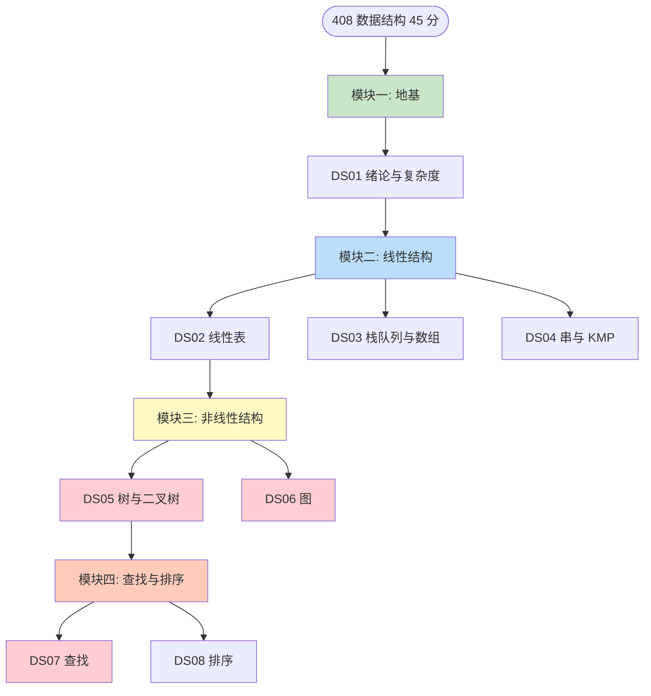

> 红色 = 大题高频命中区（树 / 图 / 查找）。

---

## 🧭 数据结构全景分类

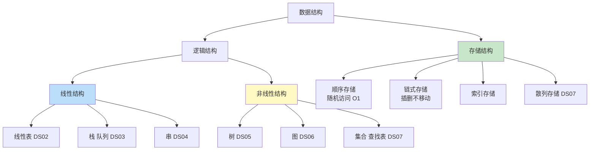

---

## 📈 复杂度分析决策树（DS01）

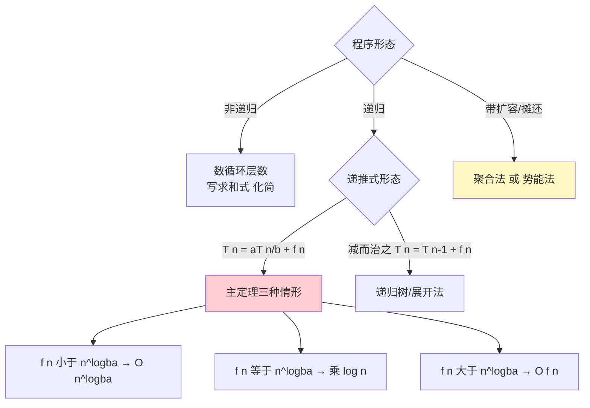

---

## 🔗 线性表选型（DS02）

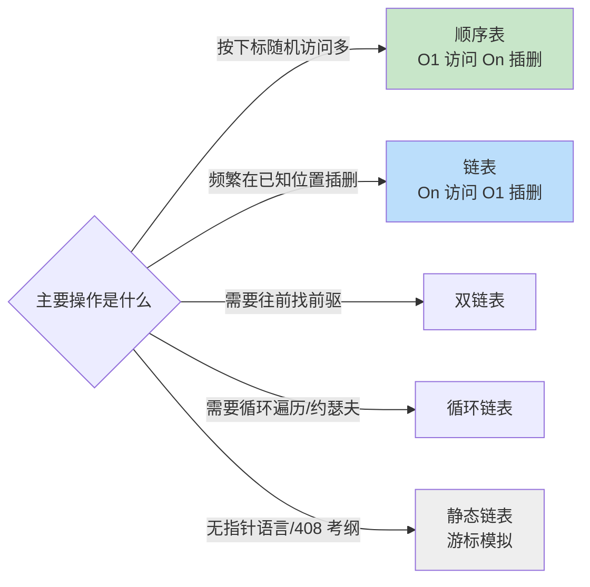

**易错点**：「链表插入 O(1)」的前提是**已经拿到前驱指针**；按位置插入仍要 O(n) 找位置。

---

## 🔄 循环队列三种判满方案（DS03 最高频）

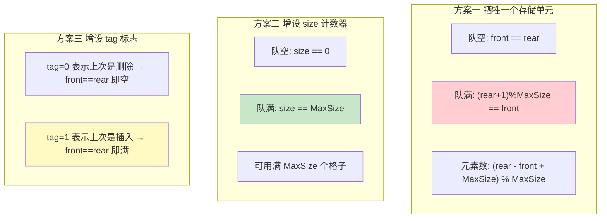

---

## 🌲 二叉树遍历与还原（DS05）

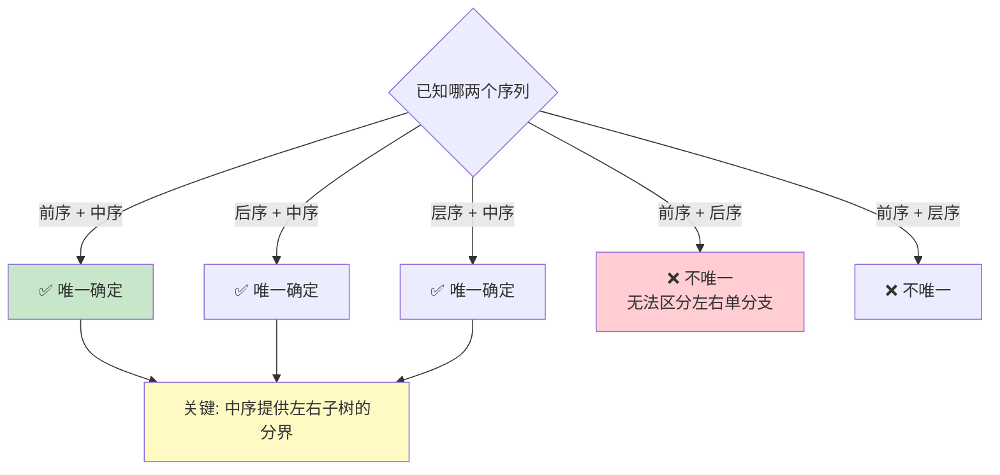

---

## 🕸️ 图算法选型（DS06）

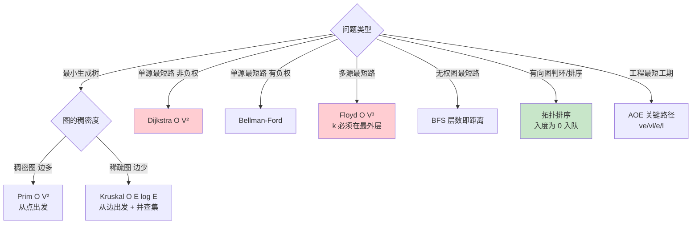

---

## 🔍 查找结构对比（DS07）

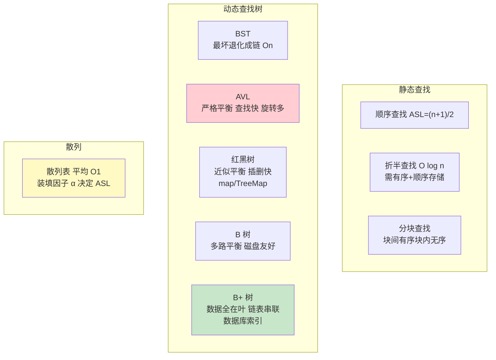

---

## 🔃 AVL 四种旋转（DS07 必考画图题）

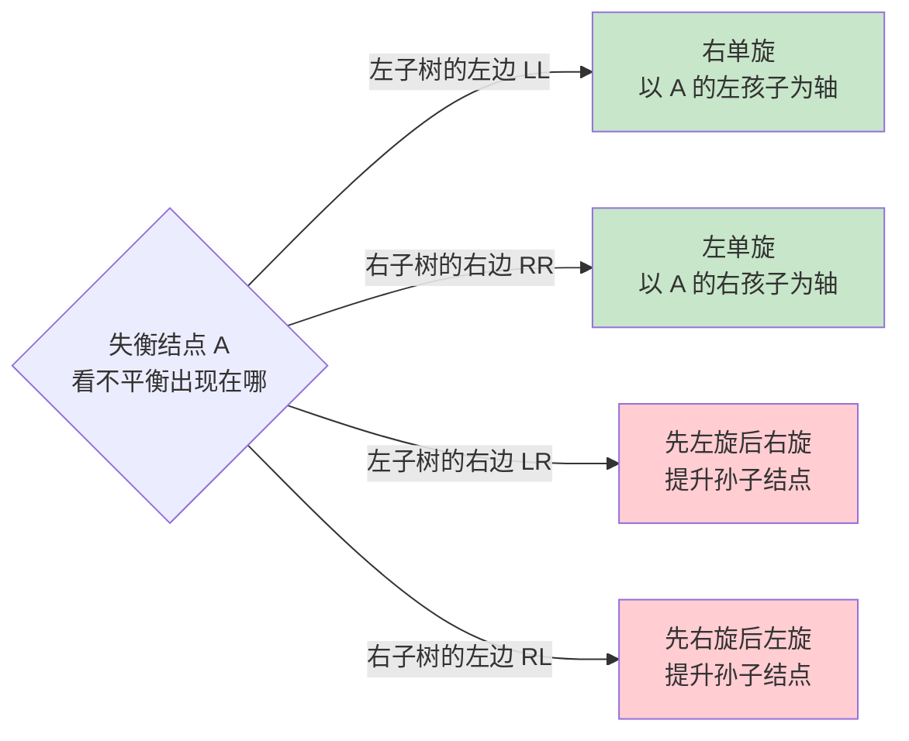

**口诀**：单旋提儿子，双旋提孙子。

---

## 📊 八大排序全景（DS08）

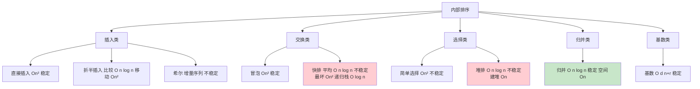

---

## 🎯 排序算法选型

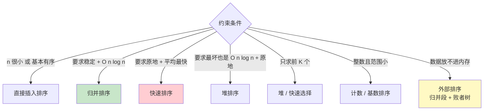

---

## 🎓 建议学习顺序

按顺序读 = 完整 408 数据结构能力；面试突击见 [INDEX.md](./INDEX.md) 的「路径 B」。
