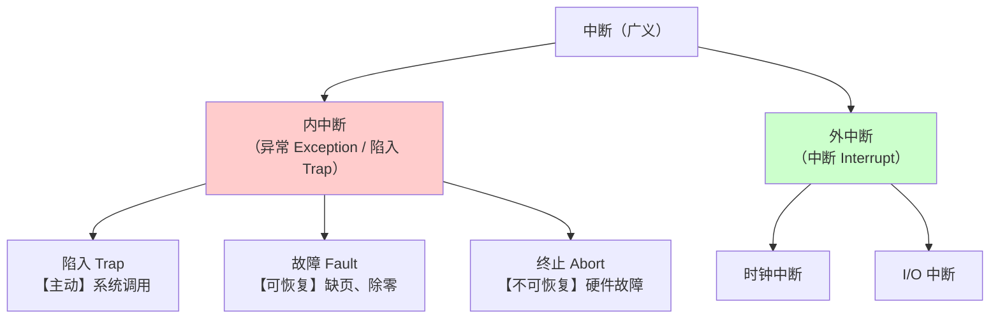
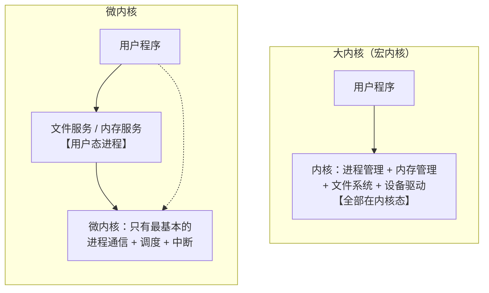
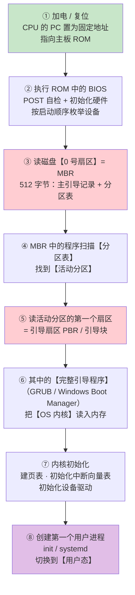
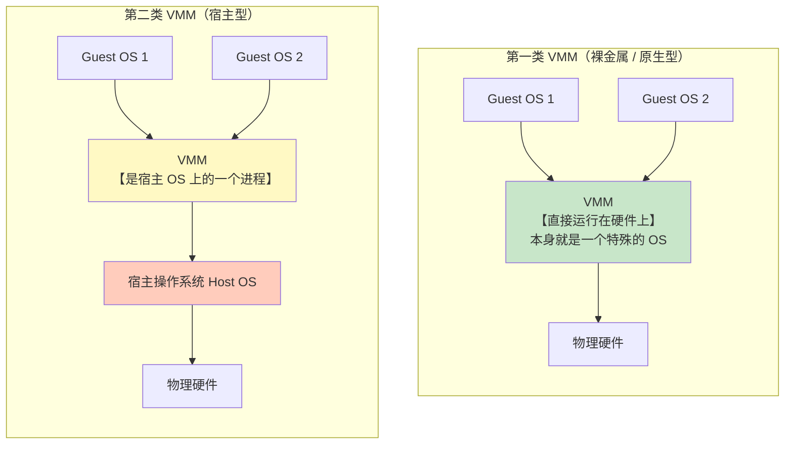

# 精通操作系统概述与运行环境：内核态、中断与系统调用

> 课程编号：OS01
> 路线图来源：计算机基础四大件 · 操作系统（408 第 1 章）
> 难度：⭐⭐⭐
> 预计阅读时间：75 分钟
> 内容基准：2026 年 8 月（408 考纲操作系统第 1 章「计算机系统概述」）
> **代码语言：Go**。本章用 `strace` 观察真实的系统调用与用户态/内核态切换。

---

## 引言：一个死循环，为什么没有卡死整台机器

写一个纯 CPU 死循环：

```go
func main() {
    for {
        // 什么都不做，就是空转
    }
}
```

跑起来，CPU 某个核跑满 100%。但是——**你的鼠标还能动，其他程序还在跑，Ctrl+C 还能杀掉它**。

这件事一点都不理所当然。这个程序**从来没有主动交出 CPU**，它没有调用任何函数、没有做任何 I/O、没有 sleep。**操作系统凭什么能把 CPU 抢回来？**

答案只有一个词：**时钟中断**。

```
每隔 ~4 ms（Linux 默认 250 Hz），硬件时钟发出一次中断
     ↓
CPU 强制暂停当前指令流，切到【内核态】
     ↓
内核的时钟中断处理程序运行，检查"这个进程跑够久了吗？"
     ↓
够久了 → 触发调度，切到别的进程
```

**中断是操作系统夺回 CPU 控制权的唯一手段。** 没有中断，一个死循环就能让整台机器瘫痪——这正是早期单道批处理系统的真实处境。

由此引出本章的三个核心机制：

| 机制 | 解决的问题 |
|---|---|
| **内核态 / 用户态** | 用户程序不能直接碰硬件（否则任何程序都能格式化磁盘） |
| **中断 / 异常** | OS 如何在"不主动交权"的情况下重新获得控制 |
| **系统调用** | 用户程序如何"合法地"请求 OS 帮它碰硬件 |

这三者构成了一个闭环：**用户态受限运行 → 需要特权操作时通过系统调用陷入内核 → 中断保证内核总能收回控制权**。

读完你应该能：

- 说清操作系统的四个特征，以及为什么"并发"和"共享"互为存在条件
- 区分特权指令与非特权指令，说清用户态/内核态的切换时机
- 完整分类中断与异常，说清"内中断"和"外中断"的判别依据
- 说清系统调用的完整流程与它和库函数的区别
- 对比大内核与微内核的取舍
- **说清从加电到 init 进程的完整引导流程，以及引导程序为什么分两段**
- **对比第一类与第二类 VMM，并说明容器为什么不是虚拟机**

---

## 第一章 操作系统的概念与特征

### 1.1 操作系统是什么

**三个视角**：

| 视角 | 定位 |
|---|---|
| **资源的管理者** | 管理 CPU、内存、文件、设备四大资源 |
| **用户与硬件之间的接口** | 提供命令接口（GUI/CLI）和程序接口（**系统调用**） |
| **最接近硬件的软件层** | 对硬件做**扩充与抽象**（把裸磁盘抽象成"文件"） |

### 1.2 四个特征（必考）


**① 并发（Concurrency）—— 最基本的特征**

**两个或多个事件在同一时间间隔内发生**。

> ⚠️ **并发 ≠ 并行**：
> - **并发（Concurrency）**：宏观同时、微观交替。**单核也能并发**
> - **并行（Parallelism）**：**真正同时**。必须有多个处理单元

**② 共享（Sharing）**

系统资源可供多个并发进程共同使用。两种方式：

| 方式 | 说明 | 例子 |
|---|---|---|
| **互斥共享** | 同一时刻只允许一个进程访问（**临界资源**） | 打印机、摄像头 |
| **同时共享** | 宏观上同时，微观上可能仍是交替 | 磁盘文件、只读数据 |

**③ 虚拟（Virtualization）**

把**物理实体**变成若干**逻辑对应物**：

| 虚拟技术 | 把什么变成什么 |
|---|---|
| **时分复用** | 1 个 CPU → n 个"虚拟 CPU"（每个进程觉得自己独占 CPU） |
| **空分复用** | 有限内存 → 巨大的**虚拟地址空间** |

**④ 异步（Asynchronism）**

进程的执行**不是一贯到底，而是走走停停**，推进速度不可预知。

> 💡 **异步是并发的必然结果，不是设计目标**。因为多个进程争抢资源，谁先谁后不确定，所以每个进程的推进速度都无法预测。这正是并发编程难的根源——**程序必须在任何调度顺序下都正确**。

### 1.3 并发与共享的关系（高频考点）

**两者互为存在条件**：

- **没有并发，共享无从谈起**——只有一个进程在跑，谈不上"共同使用"
- **没有共享，并发无法实现**——多个进程必须共享内存、CPU 等资源才能同时推进

> ⚠️ **并发是最基本的特征**——**没有并发，虚拟和异步都不存在**。408 常考"操作系统最基本的特征是什么"→ **并发**（有的教材说"并发和共享"，看题目选项）。

### 1.4 发展历程

| 阶段 | 特点 | 主要问题 |
|---|---|---|
| **手工操作** | 人工上机、纸带输入 | **人机速度矛盾**，资源利用率极低 |
| **单道批处理** | 一次一个作业，自动串行 | **CPU 与 I/O 串行**，仍然浪费 |
| **多道批处理** | **多个作业同时装入内存**，交替执行 | ✅ 资源利用率高<br/>❌ **无交互能力**，作业提交后只能等 |
| **分时系统** | **时间片轮转**，每个用户感觉独占 | ✅ **交互性、及时性** |
| **实时系统** | **严格的截止时间** | 硬实时（必须满足）/ 软实时（偶尔超时可接受） |

> 💡 **多道批处理的引入是操作系统真正诞生的标志**——它第一次需要处理"进程管理、内存管理、作业调度"这些核心问题。

---

## 第二章 运行机制：内核态与用户态

### 2.1 为什么要分两种状态

假如任何程序都能执行"关中断"指令：

```
恶意程序：
    CLI              ; 关中断
    while(1) { }     ; 死循环

结果：时钟中断被屏蔽 → OS 永远拿不回 CPU → 整台机器死机
```

**必须有一类指令，只允许 OS 执行。**

### 2.2 特权指令 vs 非特权指令

| 类型 | 例子 | 谁能执行 |
|---|---|---|
| **特权指令** | 开/关中断、置 PSW、I/O 指令、切换页表基址、停机 | **只有内核态** |
| **非特权指令** | 算术运算、数据传送、转移 | 用户态和内核态都行 |

**CPU 用 PSW 中的一位标志当前状态**：

```
PSW 的模式位 = 0  →  用户态（目态）
PSW 的模式位 = 1  →  内核态（核心态、管态）
```

**用户态执行特权指令 → CPU 产生"非法指令"异常 → 陷入内核 → OS 通常杀掉该进程。**

### 2.3 两种状态的切换


| 方向 | 触发方式 | 是否主动 |
|---|---|---|
| **用户态 → 内核态** | **中断 / 异常 / 系统调用**（本质都是中断机制） | 系统调用是主动，其余被动 |
| **内核态 → 用户态** | 执行**中断返回指令**（如 x86 的 `IRET`） | OS 主动放权 |

> ⚠️ **用户态 → 内核态的唯一途径是"中断机制"**（广义的中断，含异常和陷入）。**用户程序不能通过某条指令直接把自己切到内核态**——那样特权保护就形同虚设。
>
> **切换回用户态用的是特权指令**（中断返回指令），所以用户程序自己也做不到"提权后不还回去"。

### 2.4 用 Go 观察状态切换

```go
package main

import (
    "fmt"
    "os"
)

func main() {
    // ① 纯用户态计算 —— 不涉及任何切换
    sum := 0
    for i := 0; i < 1000000; i++ {
        sum += i
    }

    // ② 系统调用 —— 用户态 → 内核态 → 用户态
    fmt.Fprintln(os.Stdout, "hello") // 底层是 write(1, ...) 系统调用
}
```

用 `strace` 观察（Linux）：

```bash
go build -o demo demo.go
strace -c ./demo        # 统计系统调用次数
strace ./demo 2>&1 | tail -20   # 看具体调用
```

**关键观察**：那 100 万次循环加法**一次系统调用都不产生**——纯用户态运行。而一次 `fmt.Fprintln` 就触发了 `write` 系统调用。

```
% time     seconds  usecs/call     calls    errors syscall
------ ----------- ----------- --------- --------- ----------------
 32.14    0.000180          12        15           mmap
 17.86    0.000100          25         4           write        ← 我们的输出
 ...
```

---

## 第三章 中断与异常

### 3.1 为什么中断如此重要

> **中断是操作系统夺回 CPU 控制权的唯一手段。**

用户程序在用户态跑，CPU 完全在它手上。OS 此刻**没有在运行**（它不是一个一直在转的循环）。**只有中断发生时，CPU 才会强制跳到内核的中断处理程序，OS 才"活过来"。**

### 3.2 分类（408 核心考点）



**判别依据：中断信号的来源，以及是否与当前执行的指令相关。**

| | **内中断（异常）** | **外中断（中断）** |
|---|---|---|
| **信号来源** | **CPU 内部** | **CPU 外部**（I/O 设备、时钟） |
| **与当前指令** | **相关**（由当前指令引起） | **无关**（随机发生） |
| **检查时机** | 指令执行**过程中** | **每条指令执行结束**时 |
| **能否屏蔽** | **不能屏蔽** | 可屏蔽中断 / 不可屏蔽中断 |
| **例子** | 系统调用、缺页、除零、非法指令 | 时钟中断、键盘中断、磁盘完成中断 |

**内中断的三个子类**：

| 子类 | 特点 | 返回位置 | 例子 |
|---|---|---|---|
| **陷入 Trap** | **程序主动**引发 | **下一条**指令 | 系统调用（`int 0x80` / `syscall`） |
| **故障 Fault** | **可以恢复**，修复后重试 | **当前**指令（重新执行） | **缺页**、除零、保护错误 |
| **终止 Abort** | **无法恢复** | **不返回**（进程被杀） | 硬件故障、控制器出错 |

> ⚠️ **"故障返回当前指令重新执行"是 408 的高频考点**。缺页故障处理完（页调入内存）后，必须**重新执行那条访存指令**，否则数据还是取不到。而系统调用（陷入）返回的是**下一条**指令——因为该做的事已经做完了。

### 3.3 中断处理的一般流程

```
① 关中断
② 保存断点（PC、PSW）
③ 引出中断服务程序（查中断向量表）
④ 保护现场（保存通用寄存器）
⑤ 执行中断服务程序
⑥ 恢复现场
⑦ 开中断
⑧ 中断返回
```

> 💡 **①②③ 由硬件自动完成（中断隐指令），④~⑧ 由中断服务程序（软件）完成**。这与 [CO08](../computer-organization/CO08-精通-总线与输入输出系统.md) 讲的一致。

---

## 第四章 系统调用

### 4.1 系统调用是什么

**用户程序请求操作系统服务的唯一合法途径。**


### 4.2 为什么必须走系统调用

**凡是涉及"共享资源分配"或"可能影响其他进程"的操作，都必须由 OS 统一管理。**

```
若允许用户程序直接写磁盘：
  进程 A 写扇区 100
  进程 B 也写扇区 100      → 数据互相覆盖，文件系统崩溃

若允许用户程序直接分配内存：
  进程 A 声称"这 4GB 全是我的"  → 其他进程无法运行
```

### 4.3 系统调用的分类

| 类别 | 例子 |
|---|---|
| **设备管理** | 请求设备、释放设备、启动设备 |
| **文件管理** | `open`、`read`、`write`、`close` |
| **进程控制** | `fork`、`exec`、`exit`、`wait` |
| **进程通信** | 管道、消息队列、共享内存 |
| **内存管理** | `brk`、`mmap` |

### 4.4 系统调用 vs 库函数（高频辨析）

| | 库函数 | 系统调用 |
|---|---|---|
| **运行位置** | **用户态** | 进入**内核态** |
| **提供者** | 语言标准库 / 第三方库 | **操作系统** |
| **是否一定陷入内核** | **不一定** | **一定** |
| **例子** | `strlen`、`qsort`、Go 的 `sort.Ints` | `read`、`write`、`fork` |

**关键：很多库函数底层会调用系统调用，但不是全部。**

```go
// 纯用户态，不产生系统调用
s := strings.ToUpper("hello")
n := len(s)

// 底层调用 write 系统调用
fmt.Println(s)

// 首次调用会 mmap 向内核要内存；后续从 Go 自己的堆里分配，不再陷入内核
buf := make([]byte, 1024)
```

> 💡 **Go 的内存分配器是"批发-零售"模型**：向内核**批发**（`mmap` 一大块），然后在用户态**零售**给各个 `make`/`new`。这就是为什么百万次 `make([]byte, 64)` 可能只产生几次系统调用——**减少陷入内核的次数是性能优化的通用手法**。

### 4.5 用 Go 实测系统调用的开销

```go
package main

import (
    "fmt"
    "os"
    "time"
)

func main() {
    devNull, _ := os.OpenFile("/dev/null", os.O_WRONLY, 0)
    defer devNull.Close()
    buf := []byte("x")

    // ① 每次都真的写（每次一个系统调用）
    start := time.Now()
    for i := 0; i < 200000; i++ {
        devNull.Write(buf) // ← 每次都陷入内核
    }
    direct := time.Since(start)

    // ② 用户态先攒够再一次写（大幅减少系统调用）
    start = time.Now()
    big := make([]byte, 0, 200000)
    for i := 0; i < 200000; i++ {
        big = append(big, 'x') // ← 纯用户态
    }
    devNull.Write(big) // ← 只有 1 次系统调用
    buffered := time.Since(start)

    fmt.Printf("20 万次系统调用: %v\n", direct)
    fmt.Printf("用户态缓冲+1次:  %v\n", buffered)
    fmt.Printf("倍数: %.1fx\n", float64(direct)/float64(buffered))
}
```

**典型输出**：

```
20 万次系统调用: 152ms
用户态缓冲+1次:  1.2ms
倍数: 126.7x
```

**一次系统调用的固定开销约 500–1000 ns**（保存/恢复现场、切换页表权限、可能的 TLB 刷新）。200000 次就是 0.1–0.2 秒——**全是"切换"的开销，跟真正干的活无关**。

> 💡 **这就是 `bufio.Writer` 存在的全部理由**。所有语言的标准库都有缓冲 I/O，本质都是在**减少陷入内核的次数**。

---

## 第五章 操作系统体系结构

### 5.1 大内核 vs 微内核



| 维度 | 大内核（宏内核） | 微内核 |
|---|---|---|
| **内核包含** | 进程、内存、文件、设备驱动**全在内核** | **只有最基本功能**（IPC、调度、中断） |
| **其他服务** | 内核态 | **用户态进程** |
| **性能** | **高**（内核内部调用是函数调用） | **低**（服务间通信要多次**状态切换**） |
| **可靠性** | **差**（一个驱动崩溃 → 整个系统崩溃） | **好**（服务崩溃可单独重启） |
| **可扩展性** | 差 | **好** |
| **代表** | **Linux**、UNIX、Windows（混合） | Minix、QNX、L4、鸿蒙的部分设计 |

> ⚠️ **微内核性能低的根本原因**：一次文件读取在大内核里是 **1 次**用户态→内核态切换；在微内核里可能是"用户 → 微内核 → 文件服务进程 → 微内核 → 驱动进程 → 微内核 → 用户"，**4~6 次切换**。而每次切换 500~1000 ns。

### 5.2 其他结构

| 结构 | 特点 |
|---|---|
| **分层结构** | 每层只能调用**相邻下层**；易调试，但效率低（层层穿透） |
| **模块化** | 内核分模块，模块间可**任意调用**；Linux 的**内核模块（LKM）**就是这个思想 |
| **外核（Exokernel）** | 内核只做**资源分配与保护**，不做抽象；应用自己实现文件系统等 |

> 💡 **Linux 是"模块化的大内核"**——核心是宏内核，但支持**动态加载内核模块**（`insmod`/`rmmod`），兼顾了性能和可扩展性。这是工程上的最佳折中。

---

## 第六章 操作系统引导与虚拟机

> 这两个考点是 **2023 年 408 考纲新增**的（大纲第一章第 5、6 条），此后每年都以选择题形式出现。内容不难，但**不看就一定不会**。

### 6.1 操作系统引导：先有鸡还是先有蛋

一个绕不过去的悖论：

```
操作系统的代码存在【磁盘】上
读磁盘需要【设备驱动】
设备驱动是【操作系统】的一部分
     ↓
要读操作系统，先得有操作系统 ← 死循环
```

**破局点在硬件**：CPU 加电复位后，`PC` 被硬件强制置为一个**固定地址**，这个地址指向主板上的 **ROM**（只读存储器，断电不丢）。ROM 里烧死了一段**引导装入程序（Bootstrap Loader）**——它是唯一不需要"被装入"就能运行的代码。

#### 完整引导流程（经典 BIOS + MBR 方案）



#### 为什么引导程序要分成两段

| | ROM 中的引导装入程序 | 磁盘上的完整引导程序 |
|---|---|---|
| 存放位置 | 主板 **ROM**（只读，断电不丢） | 磁盘的**引导块**（0 号扇区 / 活动分区首扇区） |
| 大小 | **极小**（几百字节～几 KB） | 可以很大（GRUB 有几百 KB） |
| 能否修改 | **难**（要刷固件，有变砖风险） | **随时可改**（换个 OS 只需改磁盘） |
| 职责 | **只做一件事**：把磁盘引导块读进内存并跳过去 | 识别文件系统、找到内核文件、加载内核、传参数 |

**核心理由**：把"会变的部分"放在磁盘上，"不变的部分"放在 ROM 里。这样**换操作系统、升级内核、装双系统都不需要动主板固件**——这是典型的"用一层间接解耦"设计。

> ⚠️ **408 高频细节**：**磁盘的 0 号盘块（第一个扇区）就是引导块 / MBR**，它属于**磁盘管理**的内容（见 [OS09](./OS09-精通-磁盘与-IO-管理.md) §3.2），但引导流程本身在第 1 章考。**一块磁盘只有一个 MBR，但每个分区各有自己的引导扇区**。

#### 2026 年的工程现状：UEFI + GPT 已成主流

408 考的是经典的 **BIOS + MBR** 方案，但真机上它已基本退场：

| | 传统 BIOS + MBR | **UEFI + GPT**（2026 年新机默认） |
|---|---|---|
| 固件 | BIOS（16 位实模式） | **UEFI**（32/64 位，有自己的驱动模型与 Shell） |
| 分区表 | MBR（512 B，**最多 4 个主分区，磁盘上限 2 TB**） | **GPT**（128 个分区起步，磁盘上限 ZB 级） |
| 引导程序位置 | 藏在 512 字节扇区里，空间捉襟见肘 | **EFI 系统分区（ESP）上的普通 `.efi` 文件**，走 FAT32 文件系统 |
| 安全 | 无 | **Secure Boot**——固件校验引导程序的数字签名 |
| 启动速度 | 慢（要过实模式） | 快（可跳过大量自检） |

> 💡 **变的是形式，不变的是逻辑**：UEFI 依然是「**固件先跑 → 找到磁盘上的引导程序 → 由它加载内核**」这个两段式结构。理解了为什么要分两段，MBR 和 UEFI 就都懂了。**考试按 MBR 答，工程按 UEFI 认。**

Linux 上可以直接看引导链的证据：

```bash
# 查看是 UEFI 还是 Legacy BIOS 启动
[ -d /sys/firmware/efi ] && echo "UEFI 启动" || echo "Legacy BIOS 启动"

# 看内核是被谁、以什么参数加载的
cat /proc/cmdline
# BOOT_IMAGE=/boot/vmlinuz-6.x root=UUID=... ro quiet
#            ↑ 这行就是引导程序（GRUB）传给内核的参数

# 看 1 号进程（引导的最后一步）
ps -p 1 -o pid,comm
#   PID COMMAND
#     1 systemd
```

---

### 6.2 虚拟机：把一台机器变成多台

**虚拟机（Virtual Machine）**：用**虚拟化技术**，在一台物理机器上模拟出多台相互隔离的"计算机"，**每台都能运行自己独立的操作系统**。

实现虚拟化的软件叫 **VMM（Virtual Machine Monitor，虚拟机监控程序）**，也叫 **Hypervisor**。按它"站在哪一层"分成两类——**这个分类是 408 的核心考点**。



#### 两类 VMM 全面对比（必背表）

| 维度 | **第一类 VMM**（裸金属） | **第二类 VMM**（宿主型） |
|---|---|---|
| **运行位置** | **直接运行在硬件上** | 运行在**宿主操作系统之上** |
| **本质** | 它**本身就是一个操作系统** | 它是宿主 OS 上的**一个普通进程** |
| **对硬件的控制** | **直接控制**物理资源 | **必须通过宿主 OS** 才能碰硬件 |
| **资源分配** | VMM 直接把物理资源分给各虚拟机 | 宿主 OS 先分给 VMM，**VMM 再二次分配** |
| **运行模式** | **内核态** | 主体在**用户态**（通常配一个内核态驱动模块） |
| **性能** | **高**（少一层转发） | **低**（每次 I/O 多绕一圈宿主 OS） |
| **可支持的虚拟机数量** | **多** | 少 |
| **对宿主机的要求** | 需要专门的服务器硬件支持 | **在普通 PC 上装个软件就能用** |
| **典型产品** | **VMware ESXi、Xen、Microsoft Hyper-V** | **VMware Workstation、VirtualBox、Parallels** |

**记忆主线**：第一类**取代**了宿主 OS，第二类**依附**于宿主 OS。由此可以推出全部差异——取代者拿到全部控制权（快、能开更多虚拟机、但要求专用硬件），依附者事事求人（慢、但装起来方便）。

> ⚠️ **陷阱**：**KVM 是个边界情况**。它是一个 Linux **内核模块**，加载后就把整个 Linux 内核变成了 VMM——从架构看更接近第一类（VMM 在内核态、直接管硬件），但它又确实"寄生"在一个通用 OS 里。**408 若考到，KVM 按第一类处理**；命题人一般会用 ESXi / VMware Workstation 这种界限分明的例子。

#### 虚拟化技术的三种实现路线

| 路线 | 做法 | Guest OS 要改吗 | 性能 |
|---|---|---|---|
| **全虚拟化** | VMM 用**二进制翻译**拦截并模拟敏感指令 | **不用改** | 低（翻译开销大） |
| **半虚拟化（准虚拟化）** | Guest OS 主动调用 VMM 提供的 **hypercall**，不再执行敏感指令 | **必须改内核** | 较高 |
| **硬件辅助虚拟化** ⭐ | CPU 增加 **root / non-root 两种运行模式**（Intel **VT-x** / AMD **AMD-V**），敏感指令自动陷入 VMM | **不用改** | **最高** |

**为什么早期 x86 虚拟化这么难**——**Popek-Goldberg 定理**：一个体系结构可被高效虚拟化的充分条件是「**敏感指令 ⊆ 特权指令**」，即所有会影响系统状态的指令，在用户态执行时都必须**自动陷入**。

而早期 x86 有 **17 条敏感但非特权的指令**（如 `POPF` 在用户态修改中断标志位时**静默失败而不报错**）。VMM 根本感知不到 Guest OS 执行了它们 → 无法拦截 → 只能靠昂贵的二进制翻译。**Intel VT-x（2005）从硬件上补掉了这个洞**，这也是现代虚拟机性能能接近物理机的根本原因。

#### 2026 年的工程现状：虚拟机、容器与 microVM

408 只考虚拟机，但工程上"隔离"这件事已经分化成三层：

| 技术 | 隔离粒度 | 是否有独立内核 | 启动时间 | 典型用途 |
|---|---|---|---|---|
| **虚拟机**（ESXi / KVM） | **硬件级** | ✅ **每台 VM 一个完整内核** | 秒～分钟 | 多租户云主机、跑不同 OS |
| **容器**（Docker / containerd） | **操作系统级** | ❌ **共享宿主机内核**，靠 `namespace` + `cgroup` 隔离 | **毫秒** | 微服务、CI、K8s 工作负载 |
| **microVM**（Firecracker / Kata） | 硬件级但极简 | ✅ 精简内核 | **~125 ms** | Serverless（AWS Lambda 的底座） |

> ⚠️ **最容易混的一点**：**容器不是虚拟机，容器里没有 VMM，也没有 Guest OS 内核**。`docker run ubuntu` 跑起来的"Ubuntu"只是一套用户态文件系统，它执行的**系统调用全部由宿主机内核处理**。所以容器**启动快、开销小**，但**隔离性弱于虚拟机**（内核漏洞可以横向逃逸）——这正是 AWS 要发明 Firecracker microVM 的原因：**用虚拟机的隔离性 + 接近容器的启动速度**。
>
> 2026 年的另一条主线是**机密计算**（AMD **SEV-SNP**、Intel **TDX**、ARM **CCA**）：连宿主机的 VMM 和管理员都无法读取虚拟机的内存——把"防外部攻击"推进到了"防云厂商自己"。408 不考，但知道虚拟化仍在演进有助于理解它的价值。

---

## 第七章 408 高频考点与陷阱清单

### 7.1 考点分布

第 1 章通常是 **1-2 道选择题（2-4 分）**。概念题为主，是**送分章节**。

最常考：

1. **中断与异常的分类判断**
2. **用户态/内核态的切换时机**
3. 四个特征的辨析（尤其"并发 vs 并行"）
4. 系统调用 vs 库函数
5. 大内核 vs 微内核
6. **两类 VMM 的对比**（2023 年新增考点，此后高频）
7. **操作系统引导流程**（2023 年新增考点）

### 7.2 十九个陷阱

**陷阱 1：并发就是并行**

**错**。**并发**是宏观同时微观交替（单核也行）；**并行**是真正同时（必须多核）。

**陷阱 2：操作系统最基本的特征是虚拟**

**错，是并发**（或"并发和共享"）。**没有并发就没有虚拟和异步**。

**陷阱 3：并发和共享谁更基本**

**互为存在条件**——没有并发谈不上共享，没有共享无法实现并发。

**陷阱 4：异步是操作系统追求的目标**

**错**。异步是**并发的必然结果**，是需要应对的现实，不是设计目标。

**陷阱 5：用户程序可以通过某条指令直接切到内核态**

**错**。用户态→内核态**只能通过中断机制**（中断/异常/系统调用），且是**被动**陷入。若能主动提权，保护就失效了。

**陷阱 6：内核态→用户态也通过中断**

**错**。是通过执行**中断返回指令**（特权指令）。

**陷阱 7：系统调用属于外中断**

**错**。系统调用是**内中断中的"陷入（Trap）"**——它由 CPU 内部的陷入指令引发，与当前指令直接相关。

**陷阱 8：缺页是外中断**

**错**。缺页是**内中断中的"故障（Fault）"**——由访存指令本身引发。

**陷阱 9：所有中断都能被屏蔽**

**错**。**内中断（异常）不能屏蔽**；外中断分可屏蔽和不可屏蔽（NMI）。

**陷阱 10：故障处理完返回下一条指令**

**错**。**故障返回【当前】指令重新执行**（如缺页调入后要重新访存）。**陷入才返回下一条**。

**陷阱 11：库函数一定会产生系统调用**

**错**。`strlen`、`sort` 等纯计算的库函数完全在用户态运行。

**陷阱 12：系统调用是通过普通函数调用实现的**

**错**。系统调用必须通过**陷入指令（trap/syscall）**，产生一次内中断。

**陷阱 13：微内核性能比大内核好**

**错，反了**。微内核因为服务在用户态，**跨服务通信要多次状态切换**，性能更差。它换来的是**可靠性和可扩展性**。

**陷阱 14：Linux 是微内核**

**错**。Linux 是**模块化的大内核（宏内核）**。

**陷阱 15：时钟中断是可有可无的**

**错**。**时钟中断是 OS 实现"抢占式调度"的物理基础**——没有它，一个死循环就能独占 CPU。

**陷阱 16：多道批处理系统有交互能力**

**错**。多道批处理**无交互**（作业提交后只能等结果）。**分时系统**才有交互性。

**陷阱 17：第二类 VMM 性能比第一类好**

**错，反了**。第二类 VMM 是宿主 OS 上的一个进程，访问硬件要**多绕一层宿主 OS**，性能更低、能支持的虚拟机数量也更少。它的优势是**部署方便**（普通 PC 装个软件即可）。

**陷阱 18：容器就是轻量级虚拟机**

**错**。容器**共享宿主机内核**，没有 VMM，也没有 Guest OS 内核，属于**操作系统级虚拟化**；虚拟机是**硬件级虚拟化**，每台都有完整的独立内核。两者的隔离强度不在一个量级。

**陷阱 19：引导程序全部固化在 ROM 里**

**错**。ROM 里只有一段**极小的引导装入程序**，它的唯一任务是**把磁盘引导块（0 号扇区）读入内存并跳转过去**，真正完整的引导程序在磁盘上。这样换 OS 时**只改磁盘、不动固件**。

### 7.3 速查卡

```
【四个特征】
并发（最基本）⇄ 共享（互为存在条件）→ 虚拟 → 异步
并发 ≠ 并行：并发是宏观同时微观交替（单核可以）

【状态切换】
用户态 → 内核态：中断 / 异常 / 系统调用（都是【中断机制】，被动陷入）
内核态 → 用户态：中断返回指令（【特权指令】）

【中断分类】
内中断（异常）：CPU 内部，与当前指令【相关】，不可屏蔽
  ├ 陷入 Trap：主动，返回【下一条】—— 系统调用
  ├ 故障 Fault：可恢复，返回【当前条】重新执行 —— 缺页
  └ 终止 Abort：不可恢复，不返回
外中断（中断）：CPU 外部，与当前指令【无关】，指令结束时检查
  └ 时钟中断、I/O 中断

【系统调用 vs 库函数】
库函数在用户态，【不一定】陷入内核
系统调用【一定】进内核，通过陷入指令
减少系统调用次数 = 性能优化（bufio 的原理）

【体系结构】
大内核：性能【高】、可靠性差、Linux
微内核：性能【低】（多次切换）、可靠性好、可扩展

【操作系统引导】★2023 新增
加电 → ROM 中的 BIOS/UEFI（自检 + 初始化）
  → 读磁盘【0 号扇区 MBR】（含分区表）
  → 找【活动分区】→ 读其引导扇区
  → 完整引导程序（GRUB）把【内核】装入内存
  → 内核初始化 → 创建 init/systemd → 用户态
分两段的理由：ROM 难改，把会变的部分放【磁盘】上

【虚拟机 VMM】★2023 新增
第一类（裸金属）：直接跑在硬件上 · 本身就是 OS · 内核态
                  性能【高】· 虚拟机数量多 · ESXi / Xen / Hyper-V
第二类（宿主型）：宿主 OS 上的一个【进程】· 主体用户态
                  性能【低】· 数量少 · VMware Workstation / VirtualBox
容器 ≠ 虚拟机：容器【共享宿主机内核】，无 VMM，属 OS 级虚拟化
```

---

## 第八章 Go ↔ C 对照

| 场景 | C | Go | 说明 |
|---|---|---|---|
| 直接发起系统调用 | `syscall(SYS_write, ...)` | `syscall.Write(fd, buf)` | Go 也可用 `golang.org/x/sys/unix` |
| 缓冲 I/O | `fwrite`（stdio 自带缓冲） | `bufio.Writer` | 两者原理相同：**减少陷入内核** |
| 观察系统调用 | `strace ./prog` | **同样用 `strace`** | Go 二进制也是普通 ELF |
| 捕获信号 | `signal()` / `sigaction()` | `signal.Notify(ch, os.Interrupt)` | Go 把信号转成 channel 消息 |
| 获取进程 ID | `getpid()` | `os.Getpid()` | |
| 创建进程 | `fork()` + `exec()` | `os/exec` 或 `syscall.ForkExec` | **Go 不推荐裸 fork**（见下） |

> ⚠️ **Go 里不能安全地裸调 `fork()`**。因为 Go 运行时有多个 OS 线程（M）在跑 goroutine，而 `fork` 只复制**调用线程**——子进程里其他线程持有的锁会永远处于锁定状态，运行时随时可能死锁。**必须用 `os/exec`（内部是 `fork+exec` 的原子封装）**。
>
> 这是"OS 概念在语言运行时中的具体后果"的典型例子：多线程 + fork 的语义冲突，在 OS 课里是 `fork` 的边界条件，在 Go 里就是一条硬性工程约束。

**观察 Go 程序的用户态/内核态时间分配**：

```bash
/usr/bin/time -v ./demo
```

```
User time (seconds): 1.23        ← 用户态耗时
System time (seconds): 0.45      ← 内核态耗时（系统调用 + 中断处理）
Voluntary context switches: 12   ← 主动让出（如等 I/O）
Involuntary context switches: 89 ← 被动剥夺（时钟中断触发的抢占）★
```

**`Involuntary context switches` 就是引言里说的时钟中断抢占**——每一次都是 OS 用中断把 CPU 抢回来的证据。

---

## 第九章 练习题

### 选择题

**1.** 操作系统最基本的特征是：
A. 虚拟　B. 并发　C. 异步　D. 共享

**2.** 下列关于并发与并行的说法，**正确**的是：
A. 并发必须有多个处理器
B. 单核处理器无法实现并发
C. 并发是宏观同时、微观交替，单核也能实现
D. 并行和并发是同一个概念

**3.** 下列指令中，**必须**在内核态执行的是：
A. 加法指令　B. 数据传送指令　C. 关中断指令　D. 条件转移指令

**4.** 从用户态转到内核态的途径**不包括**：
A. 系统调用　B. 时钟中断　C. 缺页异常　D. 执行中断返回指令

**5.** 下列属于**内中断**的是：
A. 时钟中断　B. 键盘输入中断　C. 缺页　D. 磁盘读完成中断

**6.** 关于"故障（Fault）"类异常，处理完成后：
A. 返回下一条指令执行
B. 返回当前指令重新执行
C. 直接终止进程
D. 由用户决定

**7.** 下列关于系统调用的说法，**错误**的是：
A. 系统调用是用户程序请求 OS 服务的接口
B. 系统调用会导致 CPU 从用户态切换到内核态
C. 系统调用通过普通函数调用指令实现
D. 系统调用属于内中断中的陷入

**8.** 下列关于库函数的说法，**正确**的是：
A. 库函数一定会引发系统调用
B. 库函数运行在内核态
C. 部分库函数完全在用户态执行，不产生系统调用
D. 库函数由操作系统提供

**9.** 关于微内核结构，**错误**的是：
A. 内核只保留最基本的功能
B. 文件系统等服务运行在用户态
C. 性能通常优于大内核
D. 可靠性和可扩展性优于大内核

**10.** 多道批处理系统的主要缺点是：
A. 资源利用率低
B. 缺乏交互能力
C. 无法实现并发
D. 不支持多用户

### 应用题

**11.** 详细说明为什么"用户态到内核态的切换必须通过中断机制，而不能提供一条'切换到内核态'的指令"。若真的提供了这样一条指令，会有什么后果？

**12.** 一个程序执行下列操作，指出每步是否会引起用户态/内核态的切换，若会，属于哪种类型（中断/异常/系统调用）：

（1）执行 `a = b + c`
（2）调用 `strlen(s)`
（3）调用 `printf("hello")`
（4）访问一个已被换出到磁盘的页面
（5）时间片用完
（6）执行除法运算，除数为 0
（7）执行一条特权指令（在用户态）

**13.** 某程序在循环中调用 100 万次 `write(fd, buf, 1)`（每次写 1 字节）。已知一次系统调用的固定开销约 800 ns。

（1）估算光是系统调用开销就要多少时间？
（2）若改用用户态缓冲区，攒够 64 KB 再调用一次 `write`，系统调用次数变为多少？开销降到多少？
（3）说明这个优化的原理，并指出标准库中对应的组件。

**14.** 对比大内核和微内核，从五个维度分析。并说明为什么 Linux 选择了"模块化的大内核"而不是纯粹的大内核或微内核。

### 答案与解析

<details>
<summary>点击展开</summary>

**1. B**

**并发是最基本的特征**：

- 没有并发 → 只有一个程序在跑 → 谈不上**共享**
- 没有并发 → 不需要把 1 个 CPU 虚拟成 n 个 → 没有**虚拟**
- 没有并发 → 程序一贯到底 → 没有**异步**

有些教材表述为"并发和共享是两个最基本的特征"，因为两者互为存在条件。**若选项里只有一个，选并发**。

**2. C**

| | 并发 Concurrency | 并行 Parallelism |
|---|---|---|
| 定义 | 同一**时间间隔**内发生 | 同一**时刻**发生 |
| 硬件要求 | **单核即可** | **必须多核/多处理器** |
| 实现 | 时间片轮转，快速切换 | 真正同时执行 |

**3. C**

**关中断是典型的特权指令**——若用户程序能关中断，就能屏蔽时钟中断，独占 CPU 让系统死机。

A、B、D 都是普通的运算/传送/转移指令，用户态可执行。

**4. D**

**执行中断返回指令是"内核态 → 用户态"的途径**，方向相反。

用户态 → 内核态的三条途径：**系统调用（陷入）、中断（外中断）、异常（内中断）**。

**5. C**

| 中断类型 | 例子 |
|---|---|
| **内中断（异常）** | **缺页**、除零、非法指令、**系统调用** |
| **外中断（中断）** | 时钟中断、键盘中断、磁盘完成中断 |

**判别依据**：信号来自 CPU 内部还是外部、与当前指令是否相关。缺页由**访存指令本身**引发 → 内中断。

**6. B**

三类内中断的返回位置：

| 类型 | 返回位置 | 理由 |
|---|---|---|
| 陷入 Trap | **下一条** | 请求的服务已完成 |
| **故障 Fault** | **当前条重新执行** | 故障已修复（如页已调入），要重试才能拿到数据 |
| 终止 Abort | **不返回** | 无法恢复，进程被杀 |

**7. C**

系统调用**必须通过陷入指令**（如 x86 的 `int 0x80` 或 `syscall`），**不是普通函数调用**。

普通函数调用（`CALL`）只是跳转，**不改变 CPU 的特权级**；陷入指令会**主动产生一个内中断**，由硬件完成特权级切换。

**8. C**

库函数运行在**用户态**，是否引发系统调用取决于它干什么：

```go
strings.ToUpper("abc")  // 纯计算，无系统调用
len(s)                  // 纯计算，无系统调用
fmt.Println("abc")      // 底层调 write，有系统调用
```

D 错——库函数由**语言标准库/第三方库**提供，系统调用才由 OS 提供。

**9. C**

**微内核性能通常【差于】大内核**。

原因：微内核把文件系统、驱动等做成**用户态进程**，一次文件读取要经过"用户 → 微内核 → 文件服务 → 微内核 → 驱动服务 → 微内核 → 用户"，**4~6 次状态切换**；而大内核只要 1 次。每次切换 500~1000 ns，累积起来差距显著。

微内核换来的是 **A、B、D 描述的可靠性和可扩展性**。

**10. B**

多道批处理系统：

- ✅ 资源利用率高（多个作业交替，CPU 和 I/O 可重叠）
- ✅ 系统吞吐量大
- ❌ **无交互能力**——作业提交后进入后台批处理队列，用户无法干预，只能等结果
- ❌ 平均周转时间长

**分时系统**引入时间片轮转，才解决了交互问题。

**11.**

**核心矛盾：若用户程序能主动提权，特权保护就形同虚设。**

**假设提供一条 `ENTER_KERNEL` 指令**，任何程序都能执行：

```asm
恶意程序：
    ENTER_KERNEL      ; 提权到内核态
    CLI               ; 关中断（现在可以了）
    ; 或者
    MOV  [任意物理地址], 数据   ; 随意读写其他进程的内存
    ; 或者
    OUT  磁盘控制端口, 格式化命令
```

**后果**：

| 保护机制 | 被绕过的方式 |
|---|---|
| **内存保护** | 提权后可读写任意物理地址 → 窃取其他进程数据、篡改内核 |
| **CPU 时间保护** | 关中断后死循环 → 整机死机 |
| **I/O 保护** | 直接操作设备端口 → 绕过文件权限直接读写磁盘 |
| **一切安全边界** | 全部失效 |

**为什么中断机制没有这个问题**：

中断机制的关键在于——**提权和"去哪儿执行"是绑死的，且目标地址由 OS 控制**：

```
用户程序执行陷入指令
     ↓
CPU 硬件自动：① 切到内核态
             ② 从【中断向量表】取地址 → PC
                    ↑
              这张表在【内核内存】里，用户程序【改不了】
     ↓
执行的是【OS 预先写好的】中断处理程序
```

**用户程序能做的只有"敲门"（发起陷入），敲开门之后跑的代码完全由 OS 决定。** 它可以说"我要 read"，但 read 具体怎么执行、允不允许、检查什么权限，全是 OS 的事。

**类比**：

> 你可以按门铃（陷入指令），但**开门后进去的是主人（OS），不是你**。而 `ENTER_KERNEL` 相当于给每个人发了一把万能钥匙——门锁就没意义了。

**12.**

| 操作 | 是否切换 | 类型 | 说明 |
|---|---|---|---|
| **（1）`a = b + c`** | ❌ 否 | —— | 纯算术指令，非特权，用户态执行 |
| **（2）`strlen(s)`** | ❌ 否 | —— | 纯用户态库函数，只做内存读取和比较 |
| **（3）`printf("hello")`** | ✅ 是 | **系统调用（内中断-陷入）** | 底层调 `write`，通过陷入指令进内核 |
| **（4）访问已换出的页** | ✅ 是 | **异常（内中断-故障 Fault）** | 缺页故障，OS 调页后**重新执行**该指令 |
| **（5）时间片用完** | ✅ 是 | **外中断（时钟中断）** | 与当前指令无关，指令结束时检查 |
| **（6）除数为 0** | ✅ 是 | **异常（内中断-故障或终止）** | 由除法指令本身引发；多数系统作为致命错误终止进程 |
| **（7）用户态执行特权指令** | ✅ 是 | **异常（内中断-故障）** | "非法指令"异常，OS 通常发 SIGILL 杀掉进程 |

> 💡 注意 **（3）和（4）都是内中断，但子类不同**：
> - （3）是**陷入 Trap**——主动的，返回**下一条**指令
> - （4）是**故障 Fault**——被动的，返回**当前**指令重新执行

**13.**

**（1）100 万次系统调用的开销**

$$
10^6 \times 800\ \text{ns} = 8 \times 10^8\ \text{ns} = 0.8\ \text{秒}
$$

**这 0.8 秒完全是"切换"的开销**——保存/恢复现场、切换特权级、可能的 TLB 刷新，跟"写 1 个字节"这件事本身毫无关系。

**（2）用 64 KB 缓冲**

```
总数据量 = 100 万字节 = 1,000,000 B ≈ 976.6 KB
系统调用次数 = ⌈1,000,000 / 65536⌉ = ⌈15.26⌉ = 16 次

系统调用开销 = 16 × 800 ns = 12,800 ns ≈ 12.8 μs
```

**对比**：

$$
\frac{0.8\ \text{秒}}{12.8\ \mu s} = \frac{800{,}000{,}000}{12{,}800} = 62{,}500\ \text{倍}
$$

**开销降低了 6 万多倍**。

**（3）原理与对应组件**

**原理**：

系统调用的开销是**固定的**（约 800 ns），与传输的数据量几乎无关。写 1 字节和写 64 KB，切换开销一样。所以：

> **把 N 次小的系统调用合并成 1 次大的，就把固定开销从 N 份摊到 1 份。**

这与 [CO08](../computer-organization/CO08-精通-总线与输入输出系统.md) 里"DMA 把每字节一次中断降到每块一次中断"、[CO04](../computer-organization/CO04-精通-存储系统.md) 里"Cache 按块而不是按字节交换"是**完全同一个思想**——**摊薄固定开销**。

**对应的标准库组件**：

| 语言 | 组件 |
|---|---|
| **Go** | `bufio.Writer` / `bufio.Reader` |
| C | `stdio` 的 `FILE*`（`fwrite`/`fread` 自带缓冲） |
| Java | `BufferedOutputStream` / `BufferedWriter` |
| Python | `io.BufferedWriter`（`open()` 默认就带） |

```go
// ❌ 每次 Write 都是一次系统调用
f, _ := os.Create("out.txt")
for i := 0; i < 1000000; i++ {
    f.Write([]byte("x"))
}

// ✅ 攒满 4096 字节才真正 write 一次
f, _ := os.Create("out.txt")
w := bufio.NewWriter(f)
defer w.Flush()          // ★ 别忘了 Flush，否则最后一批数据留在缓冲里
for i := 0; i < 1000000; i++ {
    w.Write([]byte("x"))
}
```

> ⚠️ **`defer w.Flush()` 是最容易忘的一步**——缓冲区里的数据没 Flush 就退出，文件会缺尾部内容。

**14.**

**五维对比**：

| 维度 | 大内核（宏内核） | 微内核 |
|---|---|---|
| **① 内核包含什么** | 进程管理、内存管理、文件系统、设备驱动**全在内核态** | **只有最基本的**：IPC、基本调度、中断处理 |
| **② 其他服务在哪** | 内核态 | **用户态进程**（文件服务、内存服务、驱动服务…） |
| **③ 性能** | **高**——模块间是**函数调用**，无状态切换 | **低**——服务间通信要经过微内核转发，**4~6 次状态切换** |
| **④ 可靠性** | **差**——一个驱动的空指针能让整个内核 panic | **好**——服务是独立进程，崩溃可**单独重启**，不影响系统 |
| **⑤ 可扩展性/可维护性** | **差**——加功能要改内核、重新编译 | **好**——加服务就是加一个用户态进程 |

**性能差距的具体来源**：

```
读一个文件：

大内核：
  用户程序 --syscall--> 内核（文件系统 → 驱动 → 返回）--> 用户程序
  = 2 次状态切换

微内核：
  用户程序 --IPC--> 微内核 --IPC--> 文件服务进程
           --IPC--> 微内核 --IPC--> 磁盘驱动进程
           --IPC--> 微内核 --IPC--> 用户程序
  = 8~12 次状态切换
```

按每次切换 800 ns 算，微内核**每次文件读多花约 5~8 μs**。对于每秒几十万次 I/O 的服务器，这是致命的。

**为什么 Linux 选"模块化的大内核"**

**纯大内核的痛点**：

- 加一个新驱动 → 要改内核源码 → **重新编译整个内核** → **重启机器**
- 内核体积随支持的硬件线性膨胀（Linux 支持上万种设备，全编进去会有几百 MB）

**纯微内核的痛点**：

- 性能损失在 1990 年代是**不可接受的**（Linus 与 Tanenbaum 那场著名论战的核心分歧）

**Linux 的折中：可加载内核模块（LKM）**

```bash
insmod  mydriver.ko    # 运行时把驱动【装进内核态】
rmmod   mydriver       # 运行时卸载
lsmod                  # 查看已加载模块
```

**关键点**：模块加载后**运行在内核态**，和内核其他部分是**函数调用**关系——

| | 得到了 | 保留了 |
|---|---|---|
| **模块化** | ✅ 微内核的**可扩展性**（运行时增删功能，不用重编不用重启） | |
| **仍在内核态** | | ✅ 大内核的**性能**（无 IPC 开销） |
| **代价** | ❌ **可靠性仍是大内核的**——模块崩溃照样内核 panic | |

**一句话总结**：

> **Linux 用"模块化"拿到了微内核的可扩展性，用"模块跑在内核态"保住了大内核的性能，代价是没拿到微内核的可靠性。** 在通用操作系统的场景下，这个取舍被证明是对的——而在对可靠性要求极高的场景（航天、汽车、电信设备），QNX 这类微内核仍是主流。

</details>

---

## 小结

| 要点 | 一句话 |
|---|---|
| OS 的三个视角 | 资源管理者 / 用户与硬件的接口 / 最接近硬件的软件 |
| 四个特征 | **并发（最基本）** ⇄ 共享（互为条件）→ 虚拟 → 异步 |
| 并发 vs 并行 | 并发**宏观同时微观交替，单核可以**；并行必须多核 |
| 异步的定位 | **并发的必然结果**，不是设计目标 |
| 多道批处理 | 利用率高但**无交互**；分时系统才有交互 |
| 特权指令 | 关中断、置 PSW、I/O、切页表——**只有内核态能执行** |
| 用户态→内核态 | **只能通过中断机制**（中断/异常/系统调用），**被动陷入** |
| 内核态→用户态 | **中断返回指令**（本身是特权指令） |
| 中断的意义 | **OS 夺回 CPU 控制权的唯一手段** |
| 内中断（异常） | CPU **内部**，与当前指令**相关**，**不可屏蔽** |
| 外中断（中断） | CPU **外部**，与当前指令**无关**，指令结束时检查 |
| 陷入 Trap | **主动**，返回**下一条**——系统调用 |
| 故障 Fault | **可恢复**，返回**当前条重新执行**——缺页 |
| 终止 Abort | **不可恢复**，不返回 |
| 系统调用 | 通过**陷入指令**，**一定**进内核；是请求 OS 服务的唯一合法途径 |
| 库函数 | 在**用户态**，**不一定**产生系统调用 |
| 减少系统调用 | 固定开销 ~800 ns，合并调用能省几万倍——**bufio 的原理** |
| 大内核 | 全在内核态；**性能高**、可靠性差、Linux |
| 微内核 | 服务在用户态；**性能低**（多次切换）、可靠性好、可扩展 |
| Linux 的选择 | **模块化大内核**——拿到可扩展性，保住性能，放弃可靠性隔离 |

**下一章** → OS02 进程与线程，操作系统最核心的抽象。

---

## 延伸阅读

- 《操作系统概念》（恐龙书）第 1-2 章 —— 408 常用参考书
- 《现代操作系统》（Tanenbaum）第 1 章 —— 微内核观点的代表作
- 《深入理解计算机系统》(CSAPP) 第 8 章「异常控制流」—— **本章最好的补充**，把异常/中断/系统调用串成一条线
- [Linus vs. Tanenbaum 论战原文（1992）](https://www.oreilly.com/openbook/opensources/book/appa.html) —— 大内核 vs 微内核之争的一手史料
- 本仓库对照：
  - [CO08 总线与输入输出系统](../computer-organization/CO08-精通-总线与输入输出系统.md) —— 中断的硬件实现
  - [CO07 中央处理器](../computer-organization/CO07-精通-中央处理器.md) —— 中断如何打断流水线
  - [linux/L01 Linux 架构与系统调用](../../linux/L01-精通-Linux-架构与系统调用.md) —— Linux 内核的实际结构
  - [golang/G14 context 包](../../golang/G14-精通-Go-context-包.md) —— 用户态的"协作式中断"
