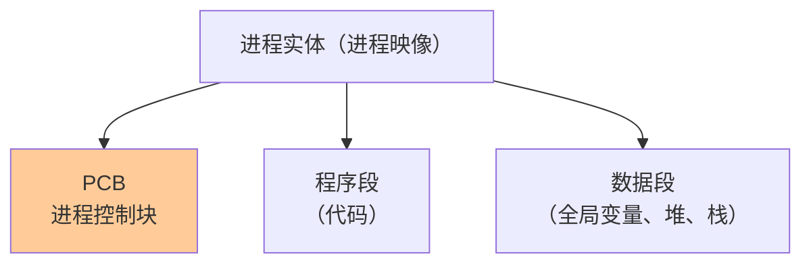
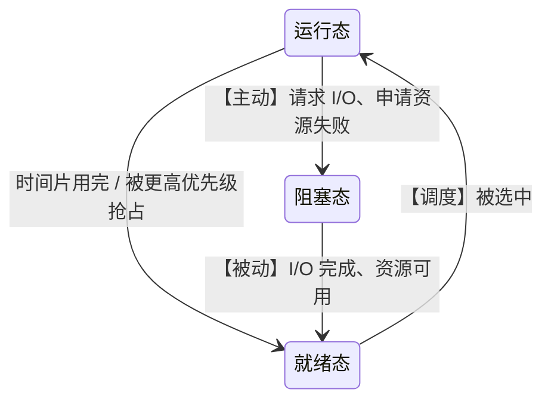
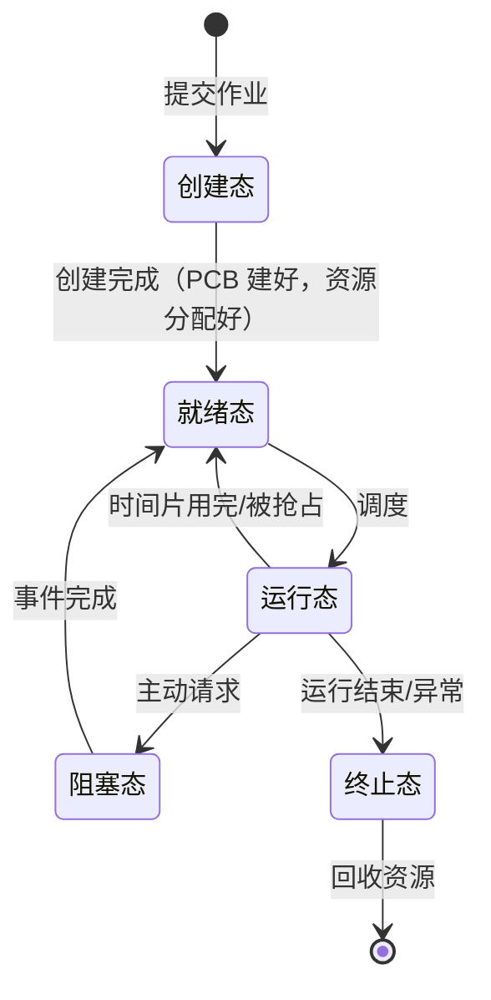
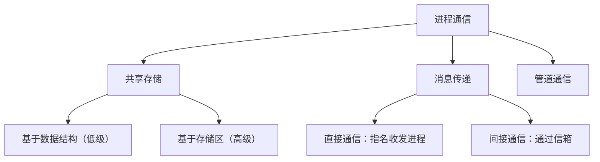
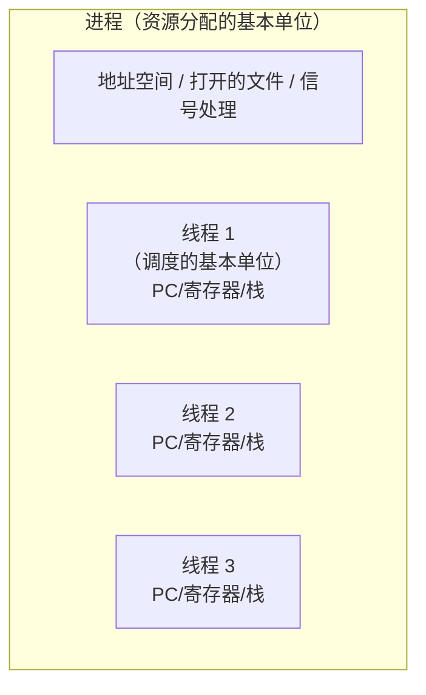
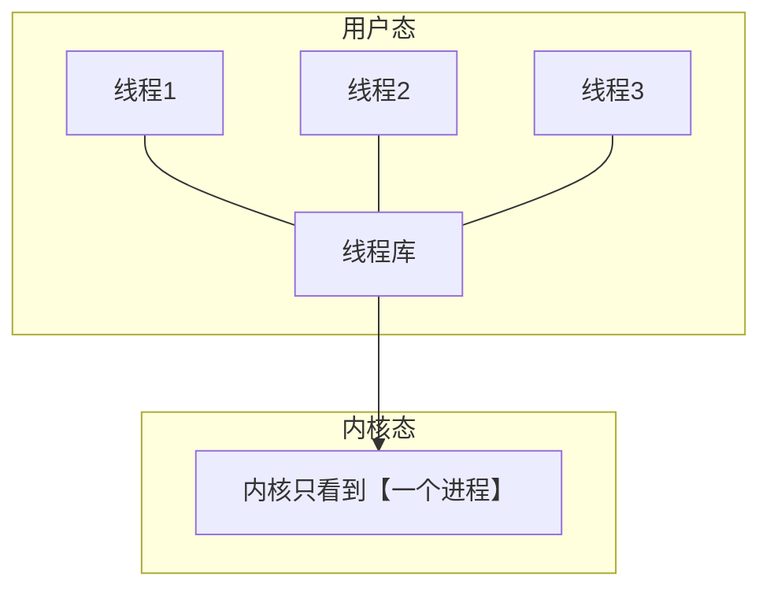
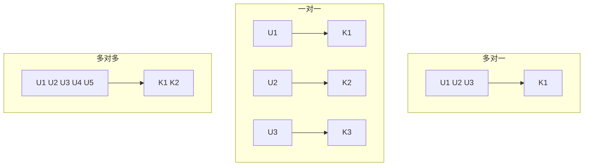
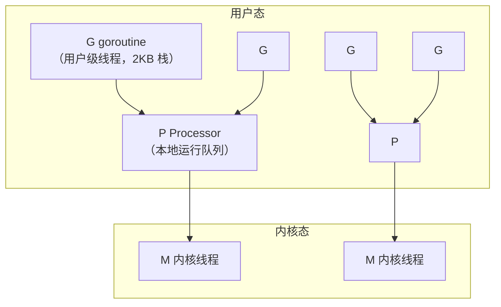
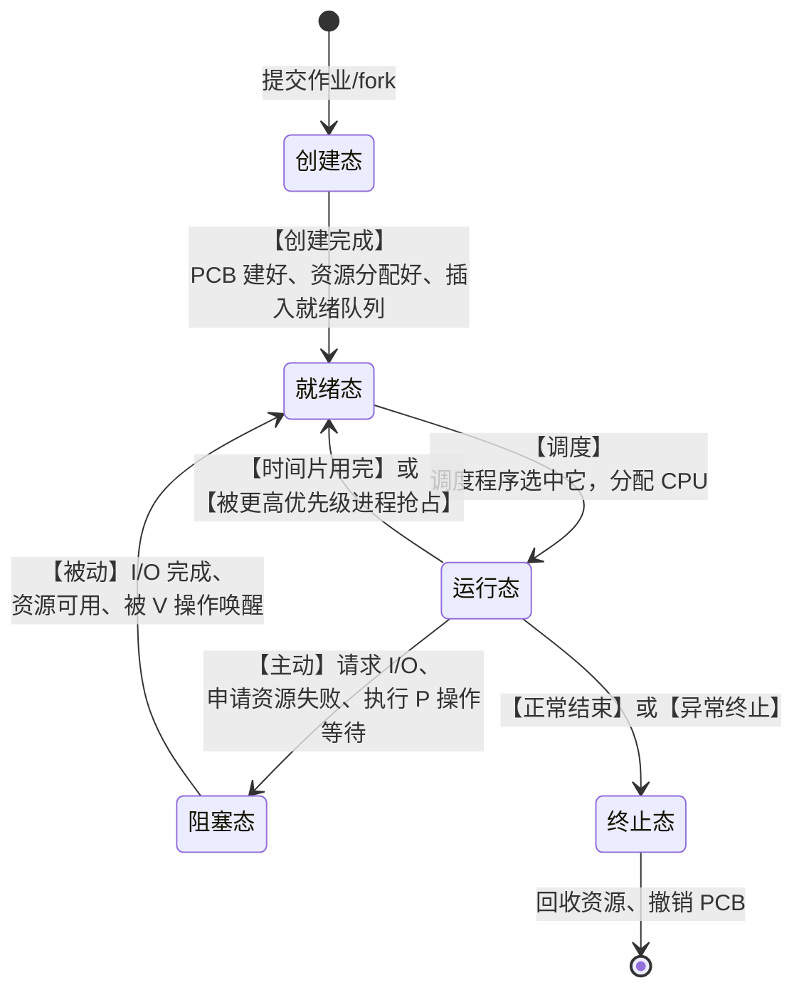
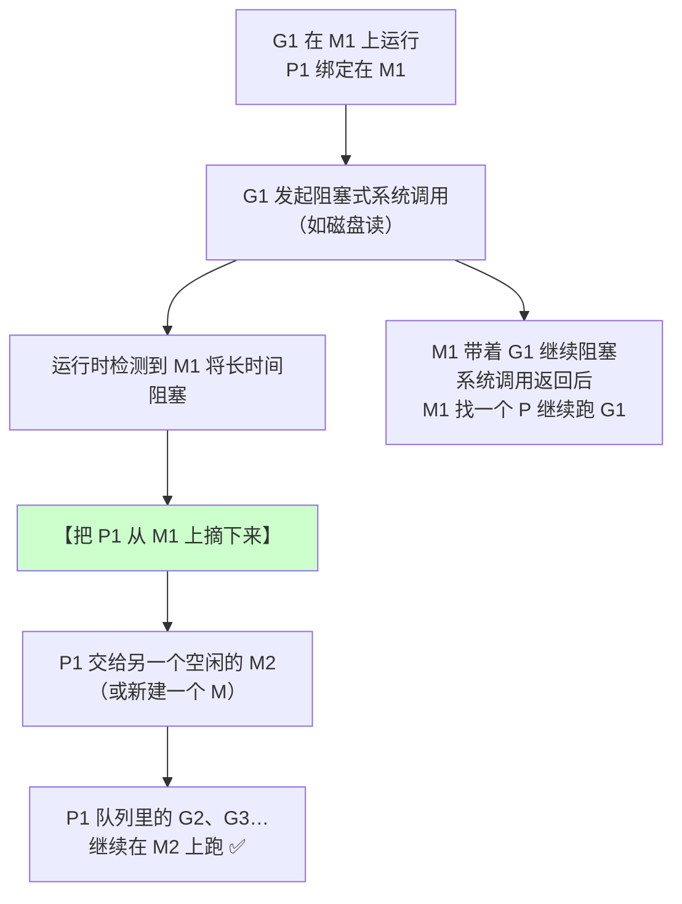

# 精通进程与线程：PCB、状态转换、进程通信与多线程模型

> 课程编号：OS02
> 路线图来源：计算机基础四大件 · 操作系统（408 第 2 章）
> 难度：⭐⭐⭐⭐
> 预计阅读时间：90 分钟
> 内容基准：2026 年 8 月（408 考纲操作系统第 2 章「进程与线程」）
> **代码语言：Go**。Go 的 GMP 调度器正好是教材「多对多线程模型」的现实实现。

---

## 引言：10 万个并发任务，为什么 Go 能扛住而线程不行

写两个功能完全相同的程序，都是并发跑 10 万个"睡 1 秒"的任务：

```go
// Go：10 万个 goroutine
var wg sync.WaitGroup
for i := 0; i < 100000; i++ {
    wg.Add(1)
    go func() { defer wg.Done(); time.Sleep(time.Second) }()
}
wg.Wait()
```

```c
// C：10 万个 pthread
for (int i = 0; i < 100000; i++)
    pthread_create(&tid[i], NULL, worker, NULL);
```

**结果**：

| | Go（goroutine） | C（pthread） |
|---|---|---|
| 内存占用 | **~200 MB** | **~800 GB**（申请不到，直接失败） |
| 创建耗时 | ~50 ms | 几十秒（如果能创建完） |
| 结果 | ✅ 正常跑完 | ❌ **`Resource temporarily unavailable`** |

差距来自哪？**一个内核级线程的默认栈是 8 MB**（Linux `ulimit -s`），10 万个就是 800 GB 虚拟内存。而**一个 goroutine 的初始栈只有 2 KB**，并且能按需增长。

更关键的是**切换代价**：

```
内核级线程切换：陷入内核 → 保存/恢复完整寄存器组 + 内核栈
               → 可能刷 TLB → 约 1000~2000 ns

goroutine 切换：纯用户态，只保存 3 个寄存器（PC、SP、DX）
               → 约 20~50 ns
```

**相差 20~100 倍。**

这个对比恰好是 408 第 2 章的两个核心问题：

| 问题 | 对应知识点 |
|---|---|
| 为什么线程比进程轻？ | **进程是资源分配单位，线程是调度单位** |
| 为什么 goroutine 比线程还轻？ | **用户级线程 vs 内核级线程**，以及**多对多模型** |

Go 的 GMP 调度器是教材上"多对多线程模型"最好的现实样本——**M 个 goroutine 复用 N 个内核线程**。学完本章再回头看 GMP，会发现它每一个设计都能在教材里找到对应。

读完你应该能：

- 说清进程的定义、特征，以及 PCB 为什么是"进程存在的唯一标志"
- 画出五状态模型，说清每条转换的触发条件和**哪些转换不可能发生**
- 区分进程切换与处理机模式切换
- 对比三种进程通信方式的适用场景
- 说清进程与线程的五点区别
- 对比用户级线程与内核级线程，理解三种多线程模型

---

## 第一章 进程的概念

### 1.1 为什么需要进程

**程序**是静态的指令集合（磁盘上的一个文件）。多道程序环境下，多个程序并发执行，需要一个东西来**描述"某次执行"的完整状态**：

```
同一个程序 /bin/ls 被同时执行 3 次
  → 3 个不同的【进程】
  → 各有各的 PC、寄存器、内存空间、打开的文件
```

**进程 = 程序的一次执行过程，是系统进行资源分配和调度的基本单位。**

### 1.2 进程的组成



**PCB（Process Control Block）是进程存在的唯一标志。**

> ⚠️ **"唯一标志"这四个字是考点**。创建进程 = 创建 PCB；撤销进程 = 撤销 PCB。OS 通过 PCB 感知进程的存在——没有 PCB，进程就不存在。

**PCB 里有什么**：

| 类别 | 内容 |
|---|---|
| **进程描述信息** | PID、UID、父进程指针 |
| **进程控制和管理信息** | **进程当前状态**、优先级、代码运行入口、程序外存地址 |
| **资源分配清单** | 内存地址空间、打开的文件列表、使用的 I/O 设备 |
| **处理机相关信息** | **各寄存器的值**（PC、PSW、通用寄存器）← **切换时保存到这里** |

### 1.3 进程的五个特征

| 特征 | 说明 |
|---|---|
| **动态性** | **最基本的特征**——进程是程序的一次执行，有生命周期 |
| **并发性** | 多个进程实体同存于内存，能在一段时间内同时运行 |
| **独立性** | 是独立获得资源和被调度的基本单位 |
| **异步性** | 各进程按各自独立、不可预知的速度推进 |
| **结构性** | 每个进程都有 PCB + 程序段 + 数据段 |

> ⚠️ **进程最基本的特征是"动态性"**（对比：操作系统最基本的特征是"并发"）。这两个"最基本"经常被混考。

---

## 第二章 进程的状态与转换（核心考点）

### 2.1 三状态模型



| 状态 | 含义 |
|---|---|
| **运行态（Running）** | 正在占用 CPU |
| **就绪态（Ready）** | **万事俱备，只差 CPU** |
| **阻塞态（Blocked / 等待态）** | 等待某个事件（I/O 完成、获得资源），**给 CPU 也没用** |

### 2.2 两条不可能的转换（必考）


**① 阻塞态 → 运行态：不可能**

阻塞的原因消失后，进程先变成**就绪态**，然后**排队等调度**。不能"插队"直接上 CPU——否则调度算法就失去意义了。

**② 就绪态 → 阻塞态：不可能**

就绪态的进程**没有在运行**，它不可能"主动请求 I/O"（发起请求这个动作本身就要占用 CPU）。**只有运行中的进程才能主动阻塞自己。**

> 💡 **记忆要点**：
> - **运行 → 阻塞是【主动】的**（进程自己请求 I/O）
> - **阻塞 → 就绪是【被动】的**（外部事件完成，OS 帮它改状态）

### 2.3 五状态模型

加上创建态和终止态：



### 2.4 七状态模型（含挂起）

内存不够时，OS 会把某些进程**换出到外存**（挂起）：

| 状态 | 位置 |
|---|---|
| 就绪态 | **内存** |
| **就绪挂起态** | **外存** |
| 阻塞态 | **内存** |
| **阻塞挂起态** | **外存** |

> ⚠️ **"挂起"和"阻塞"是两个正交的维度**：
> - **阻塞**：等事件（逻辑上不能运行）
> - **挂起**：被换到外存（物理上不在内存）
>
> 一个进程可以同时"阻塞 + 挂起"。

### 2.5 用 Go 观察进程状态

```bash
# Linux 上查看进程状态
ps -eo pid,stat,comm | head

# STAT 列的含义：
#   R  Running / Runnable   ← 运行态或就绪态
#   S  Interruptible sleep  ← 阻塞态（可被信号唤醒）
#   D  Uninterruptible sleep← 阻塞态（不可中断，通常在等磁盘 I/O）
#   Z  Zombie               ← 终止态但父进程还没回收
#   T  Stopped              ← 挂起（被 SIGSTOP）
```

```go
package main

import (
    "fmt"
    "os"
    "os/exec"
    "time"
)

func main() {
    fmt.Println("我的 PID:", os.Getpid())
    fmt.Println("用 ps -o pid,stat,comm -p", os.Getpid(), "观察状态")

    // ① 运行态：纯 CPU 计算 → ps 显示 R
    go func() {
        for {
        }
    }()

    // ② 阻塞态：等待 I/O → ps 显示 S
    time.Sleep(30 * time.Second)

    _ = exec.Command("true").Run()
}
```

> 💡 **Linux 的 `R` 状态同时包含"运行"和"就绪"**——因为从内核视角，两者都是"可运行（runnable）"，区别只在于此刻是否恰好被某个 CPU 选中。408 的三状态模型把它们分开，是**教学上的概念区分**。

---

## 第三章 进程控制

**进程控制 = 对进程的状态转换做管理**，用**原语**实现。

> ⚠️ **原语（Primitive）是"不可中断"的操作**——用**关中断指令**和**开中断指令**把一段代码包起来，保证执行期间不被打断。
>
> **为什么必须原子？** 因为状态转换要同时改多处数据（PCB 的状态字段、各种队列的指针）。若中途被打断，会出现"PCB 说是就绪态，但它还挂在阻塞队列上"这种不一致状态。

### 3.1 五种控制原语

| 原语 | 做什么 |
|---|---|
| **创建原语** | 申请 PCB → 分配资源 → 初始化 PCB → **插入就绪队列** |
| **撤销原语** | 找到 PCB → 若在运行则剥夺 CPU → 终止子进程 → **归还资源** → 删除 PCB |
| **阻塞原语** | 保护现场到 PCB → 状态改为阻塞 → **插入等待队列** → 调度新进程 |
| **唤醒原语** | 从等待队列移出 → 状态改为就绪 → **插入就绪队列** |
| **切换原语** | 保护现场 → PCB 状态更新 → 换新进程的 PCB → 恢复现场 |

> ⚠️ **阻塞原语和唤醒原语必须成对使用**。谁阻塞的，就应该由相应的事件来唤醒。

### 3.2 进程切换 vs 处理机模式切换（高频辨析）

| | **进程切换（上下文切换）** | **处理机模式切换** |
|---|---|---|
| 切什么 | **换一个进程执行** | 同一进程内，**用户态 ↔ 内核态** |
| 是否换 PCB | **是** | **否** |
| 是否换页表 | **是**（换地址空间，可能刷 TLB） | **否** |
| 开销 | **大**（微秒级） | 小（纳秒级，~800 ns） |
| 触发 | 调度决策 | 系统调用、中断、异常 |

> ⚠️ **一次系统调用只是"模式切换"，不是"进程切换"**——`read()` 之后回到的还是原来那个进程。只有当 `read` 需要等磁盘、进程被阻塞、调度器选了别人时，才发生进程切换。
>
> 这是 408 常考的辨析：**模式切换 ≠ 进程切换，前者便宜得多**。

---

## 第四章 进程通信（IPC）

进程有独立的地址空间，**不能直接读写对方的内存**——需要 OS 提供通信手段。

### 4.1 三种方式



#### ① 共享存储

两个进程**共享一块内存区域**，直接读写。

| 类型 | 说明 |
|---|---|
| **基于数据结构的共享** | 共享的是**固定的数据结构**（如一个长度 10 的数组）；速度慢、限制多，属**低级通信** |
| **基于存储区的共享** | 共享一块**存储区**，数据形式和位置由进程自己控制；速度快，属**高级通信** |

> ⚠️ **共享存储必须由进程自己保证互斥**（用 P/V 操作），OS 只负责把内存映射过去。这是它最快也最危险的地方。

#### ② 消息传递

进程间以**格式化的消息**为单位交换数据，通过 OS 提供的 `send` / `receive` 原语。

| 类型 | 说明 |
|---|---|
| **直接通信** | 消息直接挂到**接收进程的消息缓冲队列**，发送时要**指名接收者** |
| **间接通信** | 消息发到**中间实体（信箱）**，接收者从信箱取；**收发双方可以不知道对方是谁** |

**消息的结构**：消息头（发送/接收进程 ID、消息长度）+ 消息体。

#### ③ 管道通信

**管道 = 一个特殊的共享文件（pipe 文件），本质是内核中的一个固定大小的循环缓冲区。**


**管道的关键性质（408 高频）**：

| 性质 | 说明 |
|---|---|
| **半双工** | 同一时刻**只能单向**传输；要双向需**两个管道** |
| **写满则阻塞** | 缓冲区满时，写进程阻塞 |
| **读空则阻塞** | 缓冲区空时，读进程阻塞 |
| **数据一旦读出就丢弃** | **不能回退重读** |
| **多读进程时** | 数据被**随机一个**读走，不是每个都能读到 |
| **必须互斥访问** | 由 OS 保证 |

**Shell 里的管道就是它**：

```bash
cat file.txt | grep error | wc -l
#            ↑          ↑
#         管道1      管道2
```

### 4.2 用 Go 演示三种通信

```go
package main

import (
    "fmt"
    "os"
    "os/exec"
    "sync"
)

// ① 共享存储（同一进程内的多 goroutine 共享内存，需自己加锁）
func sharedMemory() {
    shared := 0
    var mu sync.Mutex // ★ 必须自己保证互斥
    var wg sync.WaitGroup
    for i := 0; i < 100; i++ {
        wg.Add(1)
        go func() {
            defer wg.Done()
            mu.Lock()
            shared++ // 共享存储区
            mu.Unlock()
        }()
    }
    wg.Wait()
    fmt.Println("共享存储结果:", shared) // 100
}

// ② 消息传递（Go 的 channel 就是"间接通信 + 信箱"）
func messagePassing() {
    ch := make(chan string, 1) // ★ 信箱，容量 1
    go func() { ch <- "hello from sender" }()
    fmt.Println("消息传递收到:", <-ch)
}

// ③ 管道通信（真正的 OS 管道）
func pipeComm() {
    r, w, _ := os.Pipe() // ★ 内核管道
    go func() {
        defer w.Close()
        fmt.Fprint(w, "data through kernel pipe")
    }()
    buf := make([]byte, 64)
    n, _ := r.Read(buf)
    fmt.Println("管道收到:", string(buf[:n]))
}

// ④ Shell 风格的管道：把一个进程的输出接到另一个进程的输入
func shellPipe() {
    c1 := exec.Command("echo", "hello\nworld\nhello")
    c2 := exec.Command("grep", "hello")
    c2.Stdin, _ = c1.StdoutPipe() // ★ c1 的 stdout 接到 c2 的 stdin
    c2.Stdout = os.Stdout
    c2.Start()
    c1.Run()
    c2.Wait()
}

func main() {
    sharedMemory()
    messagePassing()
    pipeComm()
    shellPipe()
}
```

> 💡 **Go 的 channel 是"消息传递"的用户态实现**——它不需要陷入内核（同进程内的 goroutine 之间），所以比真正的 OS 消息传递快几个数量级。Go 的口号 **"Don't communicate by sharing memory; share memory by communicating"**，正是在推荐"消息传递"而非"共享存储"——因为后者需要程序员自己保证互斥，容易出错。

---

## 第五章 线程

### 5.1 为什么需要线程

**问题**：进程切换开销大，且进程内部无法并发。

```
一个 Web 服务器进程处理 1000 个连接：
  只有进程 → 要么串行处理（慢），要么开 1000 个进程（内存爆炸，切换开销巨大）
```

**线程的引入**：把"资源分配"和"调度"两个职责**拆开**。



> ⭐ **一句话记住**：**进程是资源分配的基本单位，线程是 CPU 调度的基本单位。**

### 5.2 进程 vs 线程（五点区别，必背）

| 维度 | 进程 | 线程 |
|---|---|---|
| **① 定位** | **资源分配**的基本单位 | **CPU 调度**的基本单位 |
| **② 拥有资源** | 拥有独立的地址空间、文件表等 | **几乎不拥有资源**（只有 PC、寄存器、栈） |
| **③ 地址空间** | 各进程**独立** | **同进程的线程共享**地址空间 |
| **④ 通信** | 需要 **IPC**（管道、消息、共享内存） | **直接读写共享变量**（但要自己加锁） |
| **⑤ 切换开销** | **大**（换页表、可能刷 TLB） | **小**（同进程内切换**不换页表**） |
| **⑥ 健壮性** | 一个进程崩溃**不影响**其他进程 | **一个线程崩溃通常导致整个进程崩溃** |

> 💡 **③ 和 ⑤ 是因果关系**：正因为同进程的线程**共享地址空间**，切换时**不需要换页表、不需要刷 TLB**，所以开销才小。

### 5.3 线程的实现方式

#### ① 用户级线程（ULT）

**线程的管理（创建、切换、调度）全部在用户态由线程库完成，内核完全不知道线程的存在。**



| 优点 | 缺点 |
|---|---|
| ✅ **线程切换不需要陷入内核**，极快 | ❌ **一个线程阻塞，整个进程都阻塞**（内核不知道还有别的线程可跑） |
| ✅ 线程管理开销小 | ❌ **无法利用多核并行**（内核只调度那一个进程） |
| ✅ 可自定义调度算法 | |

#### ② 内核级线程（KLT）

**线程的管理全部由内核完成**，每个线程在内核中有对应的 TCB。

| 优点 | 缺点 |
|---|---|
| ✅ **一个线程阻塞，其他线程仍可运行** | ❌ **线程切换要陷入内核**，开销大 |
| ✅ **能真正利用多核并行** | ❌ 内核要维护大量 TCB，占内存 |

> ⚠️ **408 的关键判据**：
> - **用户级线程的切换不需要 CPU 变态**（不陷入内核）
> - **内核级线程才是 CPU 调度和分派的基本单位**
>
> 这两句话经常被拿来出判断题。

#### ③ 组合方式

用户级线程**映射到**内核级线程，两者的数量关系形成三种模型。

### 5.4 三种多线程模型

| 模型 | 映射关系 | 优缺点 | 例子 |
|---|---|---|---|
| **多对一** | n 个用户线程 → **1 个**内核线程 | ✅ 切换快<br/>❌ **一阻全阻**、**无法并行** | 早期 Java 绿色线程 |
| **一对一** | 1 个用户线程 → **1 个**内核线程 | ✅ **能并行、一阻不全阻**<br/>❌ 内核线程多、**切换开销大** | **Linux pthread、Windows 线程** |
| **多对多** | n 个用户线程 → **m 个**内核线程（n ≥ m） | ✅ **兼具两者优点**<br/>❌ 实现复杂 | **Go 的 GMP**、Solaris |



### 5.5 Go 的 GMP：多对多模型的现实样本



| GMP 组件 | 对应教材概念 |
|---|---|
| **G（goroutine）** | **用户级线程** |
| **M（machine）** | **内核级线程** |
| **P（processor）** | 调度上下文，数量 = `GOMAXPROCS`，决定**并行度** |

**GMP 如何解决"多对一"的两大缺点**：

| 多对一的缺点 | GMP 的解法 |
|---|---|
| **一个线程阻塞，全部阻塞** | **Handoff 机制**：某个 G 陷入系统调用阻塞时，运行时**把 P 从这个 M 上摘下来，交给另一个空闲的 M**，其他 G 继续跑 |
| **无法利用多核** | **多个 P 绑定多个 M**，真正并行；`GOMAXPROCS` 默认 = CPU 核数 |

**还额外加了两个优化**：

- **工作窃取（Work Stealing）**：P 的本地队列空了，去别的 P 那里"偷"一半 G 过来，负载均衡
- **栈可增长**：goroutine 初始栈 2 KB，不够时**自动扩容**（复制到更大的栈），而内核线程的 8 MB 栈是一次性预留的虚拟内存

```go
package main

import (
    "fmt"
    "runtime"
    "sync"
)

func main() {
    fmt.Println("GOMAXPROCS (P 的数量):", runtime.GOMAXPROCS(0))
    fmt.Println("CPU 核数:", runtime.NumCPU())

    var wg sync.WaitGroup
    for i := 0; i < 100000; i++ {
        wg.Add(1)
        go func() { defer wg.Done() }()
    }
    // 峰值 goroutine 数远大于 M 的数量 —— 这就是"多对多"
    fmt.Println("当前 goroutine 数:", runtime.NumGoroutine())
    wg.Wait()

    var ms runtime.MemStats
    runtime.ReadMemStats(&ms)
    fmt.Printf("10 万 goroutine 峰值内存: %.1f MB\n", float64(ms.TotalAlloc)/1024/1024)
}
```

> 💡 **回到引言的对比**：C 的 pthread 是**一对一**模型，10 万线程 = 10 万个内核 TCB + 10 万 × 8 MB 栈；Go 是**多对多**，10 万 G 只对应几个 M，栈还是 2 KB 起步。**模型选择直接决定了并发规模的上限**。

---

## 第六章 408 高频考点与陷阱清单

### 6.1 考点分布

第 2 章是操作系统**分值最高**的章节之一（含调度、同步、死锁）。本章（进程线程部分）通常 **1-2 道选择题**。

最常考：

1. **进程状态转换**（尤其两条不可能的转换）
2. **进程 vs 线程的区别**
3. 用户级线程 vs 内核级线程
4. 进程切换 vs 模式切换
5. 管道通信的性质

### 6.2 十六个陷阱

**陷阱 1：进程的最基本特征是并发**

**错，是动态性**。（操作系统的最基本特征才是并发）

**陷阱 2：程序段是进程存在的唯一标志**

**错，是 PCB**。创建进程 = 创建 PCB，撤销进程 = 撤销 PCB。

**陷阱 3：阻塞态可以直接转换到运行态**

**错**。必须先变成**就绪态**，再等调度。

**陷阱 4：就绪态可以直接转换到阻塞态**

**错**。就绪态没在运行，无法"主动请求 I/O"。

**陷阱 5：运行 → 阻塞是被动的**

**错，是主动的**（进程自己请求 I/O）。**阻塞 → 就绪才是被动的**。

**陷阱 6：挂起态就是阻塞态**

**错**。**阻塞**是"等事件"（逻辑），**挂起**是"被换到外存"（物理）。可以同时存在（阻塞挂起态）。

**陷阱 7：系统调用会引起进程切换**

**不一定**。系统调用只保证发生**模式切换**（用户态→内核态）；只有当进程被阻塞或调度器选了别人时才有**进程切换**。

**陷阱 8：进程切换和模式切换开销差不多**

**错**。进程切换要**换页表、可能刷 TLB**，开销大（微秒级）；模式切换只是改特权级，纳秒级（~800 ns）。

**陷阱 9：线程是资源分配的基本单位**

**错，反了**。**进程是资源分配单位，线程是调度单位**。

**陷阱 10：同一进程的线程切换需要切换页表**

**错**。同进程的线程**共享地址空间**，切换**不换页表**——这正是线程切换比进程切换快的根本原因。

**陷阱 11：线程不拥有任何资源**

**不准确**。线程拥有**少量必不可少的资源**：程序计数器、寄存器组、栈。它不拥有的是地址空间、打开的文件这些"进程级"资源。

**陷阱 12：用户级线程能利用多核并行**

**错**。内核只看到一个进程，**只会分配一个核**。

**陷阱 13：用户级线程切换需要陷入内核**

**错**。用户级线程切换**完全在用户态**完成，这正是它快的原因。

**陷阱 14：管道是全双工的**

**错，是半双工**。双向通信需要**两个管道**。

**陷阱 15：管道中的数据可以被多次读取**

**错**。数据**一旦被读走就从管道中删除**，不能回退重读。

**陷阱 16：一对一模型没有缺点**

**错**。一对一模型**每个用户线程都要一个内核线程**，创建开销大、内核 TCB 多、切换要陷入内核。这正是 Go 不用它的原因。

### 6.3 速查卡

```
【进程】
PCB 是进程存在的【唯一标志】
最基本特征：【动态性】

【三状态转换】
运行 → 就绪：时间片用完/被抢占
就绪 → 运行：调度
运行 → 阻塞：【主动】请求 I/O
阻塞 → 就绪：【被动】事件完成
❌ 阻塞 → 运行（不可能，要先到就绪）
❌ 就绪 → 阻塞（不可能，没在运行怎么主动请求）

【切换辨析】
进程切换：换 PCB、【换页表】、开销大（μs）
模式切换：同进程内用户态↔内核态、不换页表、开销小（~800ns）

【进程通信】
共享存储：快，但要【自己保证互斥】
消息传递：send/receive，直接（指名）/ 间接（信箱）
管道：【半双工】、满则阻塞、空则阻塞、【读走即删】

【进程 vs 线程】
进程 = 资源分配单位；线程 = 【CPU 调度单位】
同进程线程共享地址空间 → 切换【不换页表】→ 快

【线程实现】
用户级：切换【不陷入内核】、一阻全阻、【不能并行】
内核级：切换要陷入内核、一阻不全阻、【能并行】、是调度基本单位

【三种模型】
多对一：快但一阻全阻、不能并行
一对一：能并行但开销大（Linux pthread）
多对多：兼具优点（【Go 的 GMP】）
```

---

## 第七章 Go ↔ C 对照

| 场景 | C（pthread） | Go | 说明 |
|---|---|---|---|
| 创建并发单元 | `pthread_create` | `go func(){}` | Go 是**用户级**，开销小 3 个数量级 |
| 默认栈大小 | **8 MB**（可调） | **2 KB**（自动增长） | 这是并发规模差距的主因 |
| 线程模型 | **一对一** | **多对多（GMP）** | |
| 等待完成 | `pthread_join` | `sync.WaitGroup` | |
| 互斥 | `pthread_mutex_t` | `sync.Mutex` | |
| 通信 | 共享内存 + 锁 | **channel（推荐）** | Go 推荐消息传递而非共享存储 |
| 获取并行度 | `sysconf(_SC_NPROCESSORS_ONLN)` | `runtime.GOMAXPROCS(0)` | |
| 查看当前并发数 | 无直接 API | `runtime.NumGoroutine()` | |

> ⚠️ **Go 里不能安全地裸调 `fork()`**（见 [OS01](./OS01-精通-操作系统概述与运行环境.md) §7）。因为 Go 运行时有多个 M 在跑，`fork` 只复制调用线程，子进程里其他 M 持有的锁会永久锁死。**必须用 `os/exec`**。
>
> 这正是"进程 vs 线程"的语义冲突在工程上的具体体现：`fork` 的语义是"复制进程"，但它对**多线程进程**的行为是有缺陷的（POSIX 只保证 fork 后能安全调用 async-signal-safe 函数）。

**观察真实的线程数**：

```bash
go build -o demo demo.go
./demo &
ps -o nlwp,pid,comm -p $!     # nlwp = number of light-weight processes（线程数）
```

即使跑 10 万个 goroutine，`nlwp` 通常也只有**十几个**——这就是"多对多"最直观的证据。

---

## 第八章 练习题

### 选择题

**1.** 进程存在的唯一标志是：
A. 程序段　B. 数据段　C. PCB　D. 进程 ID

**2.** 进程最基本的特征是：
A. 并发性　B. 动态性　C. 独立性　D. 异步性

**3.** 下列进程状态转换中，**不可能**发生的是：
A. 运行态 → 就绪态
B. 就绪态 → 运行态
C. 阻塞态 → 运行态
D. 运行态 → 阻塞态

**4.** 进程从运行态变为阻塞态，通常是因为：
A. 时间片用完
B. 被更高优先级进程抢占
C. 主动请求 I/O 操作
D. 等待被调度

**5.** 关于进程切换和处理机模式切换，**正确**的是：
A. 两者开销相同
B. 进程切换必然伴随模式切换，反之不然
C. 模式切换需要切换页表
D. 系统调用一定引起进程切换

**6.** 下列关于线程的说法，**正确**的是：
A. 线程是资源分配的基本单位
B. 同一进程的线程切换需要切换页表
C. 线程是 CPU 调度的基本单位
D. 线程不拥有任何资源

**7.** 用户级线程的主要缺点是：
A. 切换开销大
B. 一个线程阻塞会导致整个进程阻塞
C. 需要内核支持
D. 无法自定义调度算法

**8.** 关于管道通信，**错误**的是：
A. 管道是半双工的
B. 管道满时写进程阻塞
C. 管道中的数据可以被重复读取
D. 双向通信需要两个管道

**9.** Linux 的 pthread 采用的多线程模型是：
A. 多对一　B. 一对一　C. 多对多　D. 一对多

**10.** 下列哪种情况会导致进程切换：
A. 执行 `strlen()` 函数
B. 执行加法指令
C. 进程时间片用完
D. 读取一个已在 Cache 中的变量

### 应用题

**11.** 画出进程的五状态模型转换图，标注每条转换的**触发条件**，并说明为什么"阻塞态 → 运行态"和"就绪态 → 阻塞态"这两条转换不存在。

**12.** 某系统采用三状态模型。现有进程 P1、P2、P3，初始时 P1 运行，P2、P3 就绪。依次发生下列事件，写出每步之后三个进程的状态：

（1）P1 请求读磁盘
（2）调度程序选中 P2
（3）P2 时间片用完
（4）磁盘读取完成
（5）调度程序选中 P1

**13.** 对比进程与线程，从**六个维度**分析。并说明为什么"同一进程内的线程切换比进程切换快"——从页表和 TLB 的角度解释。

**14.** 某服务器需要处理 10 万个并发连接，每个连接的处理逻辑包含一次磁盘读取（阻塞 10 ms）。分别分析下列三种方案的可行性：

（1）为每个连接创建一个进程
（2）为每个连接创建一个内核级线程（一对一模型，栈 8 MB）
（3）用 Go 的 goroutine（多对多模型，初始栈 2 KB）

**15.** 解释 Go 的 GMP 模型如何同时避免了"多对一"模型的两大缺点。

### 答案与解析

<details>
<summary>点击展开</summary>

**1. C**

**PCB 是进程存在的唯一标志**。OS 通过 PCB 感知和管理进程：

- 创建进程 = **创建 PCB**
- 撤销进程 = **撤销 PCB**

程序段和数据段是进程的组成部分，但没有 PCB，OS 就不知道这个进程的存在。

**2. B**

**进程最基本的特征是动态性**——进程是程序的一次**执行过程**，有创建、运行、消亡的生命周期。

> ⚠️ 别和"操作系统最基本的特征是**并发**"混了。这两个"最基本"是 408 常设的混淆点。

**3. C**

**阻塞态不能直接到运行态**。阻塞原因消失后，进程先变成**就绪态**，然后**排队等待调度**。

若允许阻塞态直接抢占 CPU，调度算法就形同虚设——任何 I/O 完成的进程都能插队。

**4. C**

**运行 → 阻塞是【主动】的**：进程自己执行了一个会阻塞的操作（请求 I/O、申请资源失败、等待信号量）。

A、B 是 **运行 → 就绪**；D 描述的是就绪态的处境。

**5. B**

- A 错：**进程切换开销大得多**（换页表、刷 TLB，微秒级 vs 纳秒级）
- **B 对**：进程切换必然经过内核（要在内核态改 PCB、换页表），所以必然伴随模式切换；但模式切换（如一次 `getpid()`）不一定引起进程切换
- C 错：模式切换**不换页表**，还是同一个进程的地址空间
- D 错：系统调用只保证模式切换

**6. C**

- A 错：**进程**是资源分配单位
- B 错：同进程的线程**共享地址空间**，**不需要换页表**
- **C 对**
- D 错：线程拥有**少量必不可少的资源**——程序计数器、寄存器组、**栈**

**7. B**

用户级线程的致命缺点：**内核不知道线程的存在，只看到一个进程**。所以：

- 某个线程发起阻塞式系统调用 → **内核阻塞整个进程** → 其他线程也跑不了
- 内核只给这个进程分配**一个核** → 无法利用多核

A 错——用户级线程切换**不陷入内核**，开销**小**。

**8. C**

**管道中的数据一旦被读走就从缓冲区删除，不能重复读取**。

管道本质是内核中的一个**循环缓冲区**，读操作会移动读指针并释放空间，没有"回退"机制。

A、B、D 都是管道的正确性质。

**9. B**

**Linux 的 pthread 是一对一模型**——每个 pthread 对应一个内核调度实体（在 Linux 里就是一个 task_struct，通过 `clone()` 创建）。

这带来了"能并行、一阻不全阻"的优点，代价是**每个线程都占内核资源**，10 万线程会撑爆系统。

**10. C**

**时间片用完会触发时钟中断 → 调度程序运行 → 选择新进程 → 进程切换**。

A、B、D 都是纯用户态操作（`strlen` 是纯计算的库函数，加法是普通指令，Cache 命中的读取不涉及 OS），**连模式切换都不会发生**。

**11.**



**为什么"阻塞态 → 运行态"不存在**

阻塞的原因消失（如磁盘读完了）时，进程**具备了继续运行的条件**，但：

1. **CPU 此刻正被别的进程占用**——不能直接抢过来
2. **是否上 CPU 是调度程序的决定**——它要综合优先级、调度算法来选

所以进程只能先进入**就绪队列**排队，等调度程序下一次选中它。

若允许阻塞直接到运行，会有两个严重问题：

- **破坏调度公平性**：任何 I/O 完成的进程都能插队，优先级失效
- **实现上不可能**：当前运行的进程正在用 CPU，你总得先把它换下来——而"换下来"这个动作本身就是调度

**为什么"就绪态 → 阻塞态"不存在**

阻塞是进程**主动**执行某个操作的结果：

```
运行中的进程执行：
    read(fd, buf, n)     ← 发现数据没准备好
        ↓
    执行阻塞原语：改自己的状态为阻塞，挂到等待队列
```

**"执行阻塞原语"这个动作本身需要占用 CPU**。而就绪态的进程**没有 CPU**，它什么指令都执行不了，自然也就无法"主动请求 I/O"。

**一句话**：**只有正在运行的进程才有能力阻塞自己。**

**12.**

| 步骤 | 事件 | P1 | P2 | P3 |
|---|---|---|---|---|
| 初始 | —— | **运行** | 就绪 | 就绪 |
| （1） | P1 请求读磁盘 | **阻塞** | 就绪 | 就绪 |
| （2） | 调度选中 P2 | 阻塞 | **运行** | 就绪 |
| （3） | P2 时间片用完 | 阻塞 | **就绪** | 就绪 |
| （4） | 磁盘读取完成 | **就绪** | 就绪 | 就绪 |
| （5） | 调度选中 P1 | **运行** | 就绪 | 就绪 |

**关键点说明**：

- **（1）**：P1 主动请求 I/O → **运行 → 阻塞**（主动）
- **（2）**：注意此时**没有进程在运行**，调度程序从就绪队列中选（P2 和 P3 都可以，题目说选中 P2）
- **（3）**：时间片用完 → **运行 → 就绪**（不是阻塞！P2 并没有等任何事件）
- **（4）**：磁盘完成 → P1 **阻塞 → 就绪**（被动）。⚠️ **不是直接到运行态**——此刻没有进程运行，但 P1 仍需等调度
- **（5）**：调度选中 P1 → **就绪 → 运行**

> ⚠️ 第（4）步是最容易错的：很多人会写"P1 → 运行"。但 **阻塞态必须先经过就绪态**，即使此刻 CPU 空闲，也要由调度程序做出决定。

**13.**

**六维对比**：

| 维度 | 进程 | 线程 |
|---|---|---|
| **① 定位** | **资源分配**的基本单位 | **CPU 调度**的基本单位 |
| **② 拥有的资源** | 地址空间、打开的文件表、信号处理程序、用户 ID… | **只有 PC、寄存器组、栈**（必不可少的最小集） |
| **③ 地址空间** | 各进程**独立、互相隔离** | 同进程的线程**共享**整个地址空间 |
| **④ 通信方式** | 必须用 **IPC**（管道、消息队列、共享内存），需 OS 介入 | **直接读写共享变量**，但需自己加锁 |
| **⑤ 切换开销** | **大**（微秒级） | **小**（纳秒~亚微秒级） |
| **⑥ 健壮性/隔离性** | 一个进程崩溃**不影响**其他进程 | **一个线程崩溃通常导致整个进程崩溃**（共享地址空间被破坏） |

**为什么线程切换更快 —— 页表与 TLB 视角**

**进程切换必须做的事**：

```
① 保存当前进程的寄存器组到 PCB
② 【切换页表基址寄存器（如 x86 的 CR3）】     ← 关键
③ 【TLB 中缓存的是旧进程的页表项，全部失效】  ← 致命
④ 加载新进程的寄存器组
⑤ 恢复执行
```

**第 ③ 步是真正昂贵的地方**：

TLB 缓存的是"虚页号 → 物理页框号"的映射。**不同进程的虚页号 0 映射到完全不同的物理页框**，所以切换进程后，TLB 里的条目**全部作废**。

后果：

```
切换后的一段时间内，几乎【每次访存都要 TLB miss】
     ↓
每次 TLB miss 要查【多级页表】（x86-64 是 4 级）
     ↓
一次地址转换从 ~1 周期 变成 【4 次访存】（~280 ns）
     ↓
直到 TLB 被新进程的页表项重新"焐热"（通常几百次访存之后）
```

**这就是所谓的"TLB 冷启动惩罚"**——它比"保存/恢复寄存器"的直接开销大得多，也是进程切换真实成本的主要来源。

**线程切换则完全不同**：

```
① 保存当前线程的寄存器组
② 【页表基址寄存器不变】          ← 同一个地址空间！
③ 【TLB 完全有效，一条都不用刷】   ← 这就是快的根源
④ 加载新线程的寄存器组
⑤ 恢复执行
```

**同进程的线程共享地址空间 → 页表相同 → TLB 全部有效。**

**量化对比**：

| | 进程切换 | 线程切换（同进程） |
|---|---|---|
| 保存/恢复寄存器 | ~100 ns | ~100 ns |
| 切换页表 | ~100 ns | **0** |
| **TLB 冷启动惩罚** | **~1000-3000 ns** | **0** |
| **总计** | **~1.5-3 μs** | **~100-200 ns** |

> 💡 现代 CPU 引入了 **ASID / PCID（地址空间标识符）**，给 TLB 条目打上进程标记，切换进程时不必全刷。这大幅降低了进程切换的成本，但**线程切换仍然更快**（它连"换页表基址"这一步都省了）。

**14.**

**（1）10 万个进程**

```
内存：每个进程独立的地址空间、页表、PCB
      即使代码段共享，每个进程的页表本身就要几十 KB
      10 万个进程 × (PCB 几 KB + 页表几十 KB + 各种内核结构)
      ≈ 数 GB 的【纯内核开销】，还没算用户数据

切换：每次切换 1.5-3 μs（含 TLB 冷启动）
      10 万进程轮转一遍 = 0.15-0.3 秒纯切换开销

创建：fork() 要复制页表（即使 COW 也要复制页表结构）
      10 万次 fork 耗时数十秒

❌ 完全不可行
```

**（2）10 万个内核级线程（一对一，栈 8 MB）**

```
虚拟内存：10 万 × 8 MB = 【800 GB】
          64 位系统虚拟地址空间够（128 TB），但：
          - 每个栈至少要 touch 一页 → 10 万 × 4 KB = 400 MB 物理内存（勉强）
          - 内核 task_struct 每个约 2-8 KB → 10 万 × 8 KB = 800 MB 内核内存

限制：Linux 默认 threads-max 通常几万到十几万
      /proc/sys/kernel/threads-max，还受 ulimit -u 限制

切换：线程切换 ~200 ns，但【10 万个线程的调度队列本身】
      让调度器的 O(log n) 操作也开始显现成本

❌ 勉强能创建但极不健康；实际会撞上 threads-max 或内存限制
   （引言里的实验就是直接失败）
```

**（3）10 万个 goroutine（多对多，初始栈 2 KB）**

```
内存：10 万 × 2 KB = 【200 MB】（且按需增长，多数 goroutine 用不满）

内核线程数：M 的数量由运行时管理，通常只有
            GOMAXPROCS + 少量因系统调用阻塞而额外创建的
            典型值：十几个到几十个

切换：goroutine 切换 ~20-50 ns（纯用户态，只保存 3 个寄存器）

阻塞处理：某个 G 陷入磁盘 I/O 阻塞时，运行时把 P 交给别的 M
          → 其他 G 继续在这个 P 上跑
          → 【一个 G 阻塞不影响其他 G】

✅ 完全可行，这正是 Go 做高并发服务器的核心优势
```

**三方案对比表**：

| | 进程 | 内核线程（1:1） | goroutine（M:N） |
|---|---|---|---|
| 内存开销 | 数 GB | ~800 MB + 800 GB 虚存 | **~200 MB** |
| 单个创建耗时 | ~100 μs | ~10 μs | **~0.3 μs** |
| 切换开销 | 1.5-3 μs | ~200 ns | **~20-50 ns** |
| 内核对象数 | 10 万 | 10 万 | **十几个** |
| 可行性 | ❌ | ❌ | ✅ |

**15.**

**"多对一"模型的两大缺点**：

1. **一个线程阻塞 → 整个进程阻塞**（内核只看到一个可调度实体）
2. **无法利用多核并行**（内核只给这一个实体分配一个核）

**GMP 的解法**：

**① 解决"一阻全阻" —— Handoff 机制**



**关键在于 P 这一层抽象**：

- 在"多对一"模型里，用户线程和内核线程是**死绑定**的，一荣俱荣一损俱损
- GMP 引入 **P（调度上下文）** 作为中间层，**P 可以在 M 之间转移**
- G 排在 P 的队列里，P 走到哪个 M，队列里的 G 就跟到哪个 M

**这正是"多对多"模型的精髓：解耦用户线程与内核线程的绑定关系。**

**② 解决"无法并行" —— 多 P 多 M**

```
GOMAXPROCS = N（默认 = CPU 核数）
    ↓
运行时维护 N 个 P
    ↓
每个 P 绑定一个 M（内核线程）
    ↓
N 个 M 被内核调度到 N 个核上 → 【真正并行】
```

```go
runtime.GOMAXPROCS(0)   // 查询 P 的数量，默认 = runtime.NumCPU()
```

`GOMAXPROCS` 直接控制了**并行度上限**——它决定了同时能有多少个 goroutine 真正在不同 CPU 核上跑。

**③ 额外的两个优化（教材没有，但值得知道）**

| 优化 | 解决的问题 |
|---|---|
| **工作窃取（Work Stealing）** | 某个 P 的本地队列空了 → 从别的 P 队列尾部"偷"一半 G 过来 → **负载均衡**，避免有的核闲有的核忙 |
| **可增长栈** | goroutine 初始栈 2 KB，函数调用时检查栈是否够用，不够就**分配更大的栈并复制过去** → 既省内存又不怕深递归 |

**一句话总结**：

> **GMP 用"P"这个中间层，把 goroutine 和内核线程解耦。P 可以在 M 间转移，于是"一个 G 阻塞"只是"一个 M 阻塞"，P 带着其余 G 换个 M 继续跑；多个 P 同时绑定多个 M，于是能真正并行。这就是教科书里"多对多模型兼具两者优点"的工程实现。**

</details>

---

## 小结

| 要点 | 一句话 |
|---|---|
| 进程定义 | 程序的**一次执行过程**，**资源分配和调度的基本单位** |
| **PCB** | **进程存在的唯一标志**；创建/撤销进程 = 创建/撤销 PCB |
| 进程最基本特征 | **动态性**（OS 最基本特征才是并发） |
| 三状态 | 运行 / 就绪（只差 CPU）/ 阻塞（给 CPU 也没用） |
| 运行→阻塞 | **主动**（自己请求 I/O） |
| 阻塞→就绪 | **被动**（事件完成） |
| **两条不可能** | ❌ **阻塞→运行**（要先到就绪排队）；❌ **就绪→阻塞**（没 CPU 无法主动请求） |
| 挂起 vs 阻塞 | 挂起是**换到外存**（物理），阻塞是**等事件**（逻辑），可同时存在 |
| 原语 | 用**关中断/开中断**包住，保证**不可中断** |
| 进程切换 | 换 PCB、**换页表**、**TLB 全失效** → 1.5-3 μs |
| 模式切换 | 同进程内用户↔内核，**不换页表** → ~800 ns |
| 共享存储 | 快，但**必须自己保证互斥** |
| 消息传递 | send/receive；直接（指名）/ 间接（信箱） |
| 管道 | **半双工**、满阻塞、空阻塞、**读走即删**、双向需两个 |
| 进程 vs 线程 | **进程分资源，线程被调度** |
| 线程为什么快 | 共享地址空间 → **不换页表 → TLB 不失效** |
| 用户级线程 | 切换**不陷入内核**（快）；**一阻全阻、不能并行** |
| 内核级线程 | 切换要陷入内核（慢）；**一阻不全阻、能并行**、是调度基本单位 |
| 多对一 | 快但一阻全阻、不能并行 |
| 一对一 | 能并行但开销大（**Linux pthread**） |
| **多对多** | 兼具优点（**Go 的 GMP**）；靠 **P 层解耦** G 与 M |

**下一章** → OS03 CPU 调度算法，决定"就绪队列里选谁上 CPU"。

---

## 延伸阅读

- 《操作系统概念》第 3-4 章 —— 进程与线程的经典论述
- 《现代操作系统》第 2 章 —— Tanenbaum 对线程模型的对比最清晰
- 《深入理解计算机系统》第 12 章「并发编程」—— 三种并发方式（进程/线程/I/O 多路复用）的对比
- [Go scheduler: Ms, Ps & Gs](https://povilasv.me/go-scheduler/) —— GMP 的图解
- 本仓库对照：
  - [OS01 概述与运行环境](./OS01-精通-操作系统概述与运行环境.md) —— 中断与系统调用是进程切换的触发者
  - [CO05 Cache 与虚拟存储器](../computer-organization/CO05-精通-Cache-与虚拟存储器.md) —— TLB 为什么在进程切换时失效
  - [golang/G11 Goroutines 与 GMP 调度](../../golang/G11-精通-Goroutines-与-GMP-调度.md) —— GMP 的完整机制
  - [linux/L02 进程与线程模型](../../linux/L02-精通-进程与线程模型.md) —— Linux 的 task_struct 与真实 PCB
