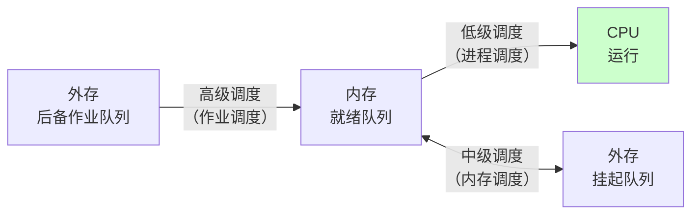
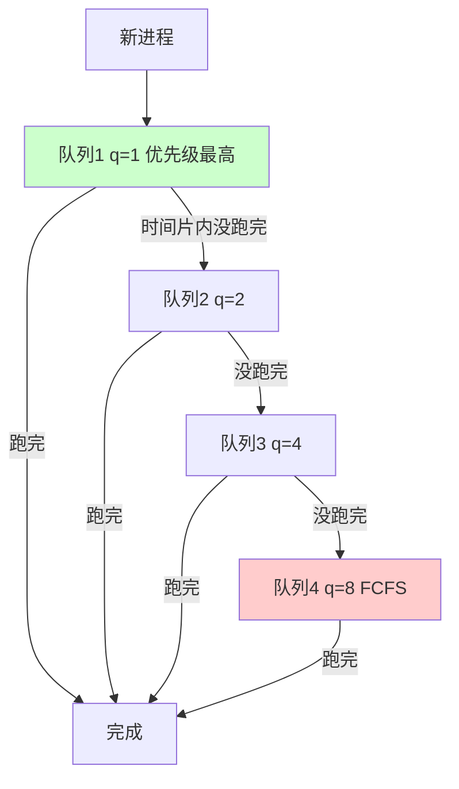

# 精通 CPU 调度：FCFS、SJF、HRRN、时间片轮转与多级反馈队列

> 课程编号：OS03
> 路线图来源：计算机基础四大件 · 操作系统（408 第 2 章调度部分）
> 难度：⭐⭐⭐
> 预计阅读时间：80 分钟
> 内容基准：2026 年 8 月（408 考纲操作系统第 2 章「处理机调度」）
> **代码语言：Go**。本章用 Go 模拟各调度算法，验证手算结果。

---

## 引言：谁该先上 CPU

就绪队列里躺着四个进程：

```
进程   到达时间   需要运行
P1      0         20 ms      ← 一个大型编译任务
P2      1          2 ms      ← 你按下的一次键盘响应
P3      2          3 ms      ← 一次网页请求
P4      3          1 ms      ← 一次心跳检测
```

**先来先服务（FCFS）** 的结果：

```
|————————— P1 (20) —————————|—P2(2)—|—P3(3)—|P4(1)|
0                          20      22      25    26

平均周转时间 = (20 + 21 + 23 + 23) / 4 = 21.75 ms
```

P4 只需要 **1 ms**，却等了 **22 ms** —— **带权周转时间 23**，用户体验是"点了没反应"。

**短作业优先（SJF）** 的结果（假设都已到达）：

```
|P4(1)|—P2(2)—|—P3(3)—|————————— P1 (20) —————————|
0     1       3       6                          26

平均周转时间 = (26 + 2 + 4 + 1) / 4 = 8.25 ms   ← 降了 62%
```

**平均周转时间从 21.75 降到 8.25**，仅仅因为换了个排队顺序。

但 SJF 有个致命问题：**如果短作业源源不断地来，P1 会永远排不上队**（饥饿）。而且——**OS 怎么知道每个进程"需要运行多久"？** 这个信息在现实中根本拿不到。

这就是本章的三个核心矛盾：

| 矛盾 | 表现 |
|---|---|
| **平均性能 vs 公平性** | SJF 平均周转最优，但长作业饥饿 |
| **吞吐量 vs 响应时间** | 少切换 → 吞吐高但响应慢；多切换 → 响应快但开销大 |
| **理论最优 vs 信息可得** | SJF 最优，但"运行时间"事先未知 |

真实系统的答案是**多级反馈队列**——它不需要预知运行时间，却能自动逼近 SJF 的效果，同时避免饥饿。Linux 的 CFS、Windows 的调度器本质上都是这个思路的演化。

读完你应该能：

- 说清三级调度的分工与发生频率
- 默写周转时间、带权周转时间、等待时间、响应比的公式
- 画出六种调度算法的甘特图并计算各项指标
- 说清每种算法的优缺点与适用场景
- 解释多级反馈队列如何"不预知运行时间也能逼近 SJF"

---

## 第一章 调度的层次



| 层次 | 别名 | 做什么 | 发生频率 | 状态变化 |
|---|---|---|---|---|
| **高级调度** | **作业调度** | 从**外存后备队列**选作业**调入内存**，创建进程 | **最低**（分钟级） | 无 → 创建态 → 就绪态 |
| **中级调度** | **内存调度** | 把暂时不用的进程**换出到外存**（挂起），或换回 | 中等 | 就绪 ⇄ 就绪挂起 |
| **低级调度** | **进程调度 / CPU 调度** | 从**就绪队列**选一个进程**上 CPU** | **最高**（毫秒级） | 就绪 → 运行 |

> ⚠️ **三级调度的频率差异是关键**：进程调度每几毫秒发生一次，所以**调度算法本身必须极快**（Linux CFS 是 O(log n)）；作业调度几分钟一次，可以用复杂算法。
>
> **408 常考"哪级调度发生频率最高"→ 低级调度（进程调度）**。

### 1.1 调度的时机

**什么时候需要重新调度？**

| 情况 | 是否需要调度 |
|---|---|
| 进程正常终止 / 异常终止 | ✅ 必须 |
| 进程主动阻塞（请求 I/O、等待信号量） | ✅ 必须 |
| 时间片用完 | ✅（抢占式） |
| 更高优先级进程进入就绪队列 | ✅（抢占式） |
| **进程在临界区中** | ❌ **不能调度**（除非特殊处理） |
| **在原语执行过程中** | ❌ **不能调度**（原语不可中断） |
| **在中断处理过程中** | ❌ 通常不能 |

> ⚠️ **临界区、原语、中断处理过程中不能进行进程调度**——这三个"不能"是 408 的高频考点。原因是这些代码段要么持有临界资源（切走会导致其他进程等待甚至死锁），要么必须原子完成。

### 1.2 两种调度方式

| 方式 | 规则 | 特点 |
|---|---|---|
| **非抢占式（非剥夺）** | 一旦进程上 CPU，**只有它自己主动放弃**（终止或阻塞）才切换 | 实现简单、开销小；**无法保证响应时间**，不适合分时/实时系统 |
| **抢占式（剥夺）** | 更重要/更紧迫的进程到来时，可以**强行剥夺** CPU | **响应及时**、适合分时与实时；开销大 |

---

## 第二章 评价指标

### 2.1 五个核心指标

| 指标 | 公式 | 越大越好还是越小 |
|---|---|---|
| **CPU 利用率** | $\dfrac{\text{CPU 忙碌时间}}{\text{总时间}}$ | 越大越好 |
| **系统吞吐量** | $\dfrac{\text{完成的作业数}}{\text{总时间}}$ | 越大越好 |
| **周转时间** | **完成时间 − 到达时间** | 越小越好 |
| **带权周转时间** | $\dfrac{\text{周转时间}}{\text{实际运行时间}}$ | 越小越好（**最小值 1**） |
| **等待时间** | **周转时间 − 实际运行时间** | 越小越好 |
| **响应时间** | 从提交请求到**首次产生响应**的时间 | 越小越好 |

### 2.2 为什么需要"带权周转时间"

**周转时间不公平地惩罚短作业**：

```
作业 A：需要 100 ms，周转 110 ms  →  带权周转 = 1.1   （多等了 10%，还行）
作业 B：需要   1 ms，周转  11 ms  →  带权周转 = 11    （多等了 1000%！）
```

两者的**周转时间之差只有 99 ms**，但**用户感受天差地别**——B 的用户会觉得系统卡死了。

**带权周转时间衡量的是"相对等待程度"**，更贴近用户体感。**它的最小值是 1**（完全没等，一来就跑完）。

> ⚠️ **等待时间的计算要注意"是否包含 I/O 时间"**。408 里通常只考虑 CPU 密集型作业（无 I/O），此时 **等待时间 = 周转时间 − 运行时间**。若有 I/O，等待时间指的是**在就绪队列中等待的时间总和**，不含 I/O 阻塞时间。

---

## 第三章 六种调度算法

统一用这组数据演示（**均为纯 CPU 作业，无 I/O**）：

| 进程 | 到达时间 | 运行时间 |
|---|---|---|
| P1 | 0 | 7 |
| P2 | 2 | 4 |
| P3 | 4 | 1 |
| P4 | 5 | 4 |

### 3.1 FCFS（先来先服务）

**规则**：按**到达顺序**排队，先到先服务。**非抢占式**。

```
甘特图：
|——— P1 (7) ———|—— P2 (4) ——|P3(1)|—— P4 (4) ——|
0              7            11    12           16
```

| 进程 | 到达 | 运行 | 完成 | 周转 | 带权周转 |
|---|---|---|---|---|---|
| P1 | 0 | 7 | 7 | 7 | 1.00 |
| P2 | 2 | 4 | 11 | 9 | 2.25 |
| P3 | 4 | 1 | 12 | 8 | **8.00** |
| P4 | 5 | 4 | 16 | 11 | 2.75 |

$$
\text{平均周转} = \frac{7+9+8+11}{4} = 8.75, \qquad \text{平均带权周转} = \frac{1+2.25+8+2.75}{4} = 3.50
$$

| 优点 | 缺点 |
|---|---|
| ✅ 公平（谁先来谁先服务）<br/>✅ 实现简单<br/>✅ **不会饥饿** | ❌ **对短作业极不友好**（P3 只跑 1 ms，带权周转却是 8）<br/>❌ 平均周转时间长 |

> 💡 **FCFS 对长作业有利，对短作业不利**——正好和 SJF 相反。

### 3.2 SJF / SPF（短作业优先）

**规则**：从**已到达**的进程中选**运行时间最短**的。默认**非抢占式**。

```
t=0：只有 P1 到达 → 运行 P1（0~7）
t=7：P2(4)、P3(1)、P4(4) 都已到达 → 选最短的 P3
t=8：P2(4) 和 P4(4) 相同 → 按到达顺序选 P2
t=12：运行 P4

甘特图：
|——— P1 (7) ———|P3(1)|—— P2 (4) ——|—— P4 (4) ——|
0              7     8            12           16
```

| 进程 | 到达 | 运行 | 完成 | 周转 | 带权周转 |
|---|---|---|---|---|---|
| P1 | 0 | 7 | 7 | 7 | 1.00 |
| P2 | 2 | 4 | 12 | 10 | 2.50 |
| P3 | 4 | 1 | 8 | 4 | 4.00 |
| P4 | 5 | 4 | 16 | 11 | 2.75 |

$$
\text{平均周转} = \frac{7+10+4+11}{4} = 8.00, \qquad \text{平均带权周转} = \frac{1+2.5+4+2.75}{4} = 2.5625
$$

**比 FCFS 好**（8.00 < 8.75，2.5625 < 3.50）。

### 3.3 SRTN（最短剩余时间优先）—— 抢占式 SJF

**规则**：每当有新进程到达，或当前进程完成时，**重新比较所有就绪进程的剩余时间**，选最短的。

```
t=0：P1 到达，剩余 7 → 运行 P1
t=2：P2 到达(4) vs P1 剩余(5) → P2 更短，【抢占】
t=4：P3 到达(1) vs P2 剩余(2) → P3 更短，【抢占】
t=5：P3 完成。P4 到达(4)，P2 剩余(2)，P1 剩余(5) → 选 P2
t=7：P2 完成。P4(4) vs P1 剩余(5) → 选 P4
t=11：P4 完成 → 运行 P1
t=16：P1 完成

甘特图：
|P1(2)|P2(2)|P3(1)|P2(2)|—— P4 (4) ——|——— P1 (5) ———|
0     2     4     5     7            11             16
```

| 进程 | 到达 | 运行 | 完成 | 周转 | 带权周转 |
|---|---|---|---|---|---|
| P1 | 0 | 7 | 16 | 16 | 2.29 |
| P2 | 2 | 4 | 7 | 5 | 1.25 |
| P3 | 4 | 1 | 5 | 1 | **1.00** |
| P4 | 5 | 4 | 11 | 6 | 1.50 |

$$
\text{平均周转} = \frac{16+5+1+6}{4} = 7.00, \qquad \text{平均带权周转} = \frac{2.29+1.25+1+1.5}{4} = 1.51
$$

**SRTN 的平均周转时间是理论最优的**（7.00 < 8.00 < 8.75）。

> ⚠️ **SJF/SRTN 的两大问题**：
>
> **① 饥饿**：源源不断的短作业会让长作业永远等待。
>
> **② 运行时间未知**：OS 事先不知道每个进程要跑多久，只能**估计**（如用历史平均值做指数平滑预测）。所以 **SJF 是理论最优但工程上无法直接实现**。

### 3.4 HRRN（高响应比优先）

**规则**：每次调度时计算所有就绪进程的**响应比**，选最高的。**非抢占式**。

$$
\boxed{\text{响应比} R = \frac{\text{等待时间} + \text{要求服务时间}}{\text{要求服务时间}} = 1 + \frac{\text{等待时间}}{\text{要求服务时间}}}
$$

**这个公式是 FCFS 和 SJF 的平衡**：

- **等待时间越长 → R 越大** → 照顾长期等待的进程（**避免饥饿**，这是 FCFS 的思想）
- **要求服务时间越短 → R 越大** → 照顾短作业（这是 SJF 的思想）

```
t=0：只有 P1 → 运行 P1（0~7）
t=7：计算响应比
     P2：等待 5，服务 4 → R = 1 + 5/4 = 2.25
     P3：等待 3，服务 1 → R = 1 + 3/1 = 4.00  ★最高
     P4：等待 2，服务 4 → R = 1 + 2/4 = 1.50
     → 选 P3

t=8：P2：等待 6，服务 4 → R = 1 + 6/4 = 2.50  ★
     P4：等待 3，服务 4 → R = 1 + 3/4 = 1.75
     → 选 P2

t=12：运行 P4

甘特图：
|——— P1 (7) ———|P3(1)|—— P2 (4) ——|—— P4 (4) ——|
0              7     8            12           16
```

本例结果与 SJF 相同（平均周转 8.00）。

> 💡 **HRRN 是 408 最爱考的"综合题"**——它把 FCFS 的公平性和 SJF 的效率结合起来，且**不会饥饿**（等得越久 R 越大，迟早会被选中）。

### 3.5 RR（时间片轮转）

**规则**：所有进程按到达顺序排成**循环队列**，每个进程运行**一个时间片**就被强制换下，排到队尾。**抢占式**。

**设时间片 q = 2**：

```
就绪队列演变（★表示当前运行）：

t=0：  [P1★]                     P1 运行 0~2
t=2：  P2 到达 → [P2★, P1]       P1 时间片用完排队尾
t=4：  P3 到达 → [P1★, P3]  
       （t=4 时 P2 时间片用完，P3 恰好到达。
         408 通常约定：新到达的进程先入队，然后是时间片用完的进程）
       实际队列：[P3, P1, P2] —— 顺序取决于约定
```

**⚠️ 时间片轮转的手工模拟对"入队顺序"极其敏感**。408 的通用约定：

> **同一时刻，「新到达的进程」先入队，「时间片用完被剥夺的进程」后入队。**

按此约定完整模拟（q = 2）：

```
t=0:  队列[P1]           运行 P1 (0-2)，剩余 5
t=2:  P2 到达先入队 → [P2]，P1 用完入队 → [P2, P1]
      运行 P2 (2-4)，剩余 2
t=4:  P3 到达先入队 → [P1, P3]，P2 用完入队 → [P1, P3, P2]
      运行 P1 (4-6)，剩余 3
t=5:  P4 到达 → [P3, P2, P4]（P1 还在运行）
t=6:  P1 用完入队 → [P3, P2, P4, P1]
      运行 P3 (6-7)，只需 1 → 完成
t=7:  [P2, P4, P1]  运行 P2 (7-9)，剩余 0 → 完成
t=9:  [P4, P1]      运行 P4 (9-11)，剩余 2
t=11: P4 用完入队 → [P1, P4]  运行 P1 (11-13)，剩余 1
t=13: P1 用完入队 → [P4, P1]  运行 P4 (13-15) → 完成
t=15: [P1]          运行 P1 (15-16) → 完成

甘特图：
|P1|P2|P1|P3|P2|—P4—|P1|—P4—|P1|
0  2  4  6  7  9   11 13   15 16
```

| 进程 | 到达 | 运行 | 完成 | 周转 | 带权周转 |
|---|---|---|---|---|---|
| P1 | 0 | 7 | 16 | 16 | 2.29 |
| P2 | 2 | 4 | 9 | 7 | 1.75 |
| P3 | 4 | 1 | 7 | 3 | 3.00 |
| P4 | 5 | 4 | 15 | 10 | 2.50 |

$$
\text{平均周转} = \frac{16+7+3+10}{4} = 9.00
$$

**时间片大小的取舍**：

| 时间片 | 效果 |
|---|---|
| **太大** | 退化成 **FCFS**（每个进程一次就跑完），响应时间变长 |
| **太小** | **切换开销占比过高**（切换要 1.5-3 μs，若时间片只有 10 μs，20% 时间在切换） |
| **合适** | 通常让 **80% 的进程能在一个时间片内完成**；Linux 默认几 ms 到几十 ms |

> 💡 **RR 的最大优点是"响应时间可预测"**：n 个进程、时间片 q，则任何进程**最多等 (n−1)·q** 就能上 CPU。这是分时系统的核心保证。

### 3.6 优先级调度

**规则**：每个进程有优先级，选**优先级最高**的。分抢占式和非抢占式。

| 优先级类型 | 说明 |
|---|---|
| **静态优先级** | 创建时确定，**运行期间不变**；简单但可能饥饿 |
| **动态优先级** | 运行中**动态调整**（如等待越久优先级越高）；能缓解饥饿 |

**通常的优先级规则**：

- 系统进程 > 用户进程
- 交互型进程 > 非交互型（批处理）进程
- **I/O 密集型 > 计算密集型**（I/O 型进程尽早上 CPU，才能尽早发起 I/O，让 I/O 设备忙起来）

> ⚠️ **静态优先级会导致饥饿**——低优先级进程可能永远等不到。解决办法是**老化（Aging）**：进程等待时间越长，优先级逐渐提升。

### 3.7 多级反馈队列（MLFQ）⭐

**这是真实操作系统的做法**。它同时解决了 SJF 的两个致命问题。

**规则**：

```
设置多个就绪队列，优先级从高到低，【时间片从小到大】

队列 1（最高优先级）：时间片 q  = 1
队列 2：              时间片 q  = 2
队列 3：              时间片 q  = 4
队列 4（最低优先级）：时间片 q  = 8  且采用 FCFS

① 新进程进入【队列 1】队尾
② 只有队列 1 空了，才调度队列 2；以此类推
③ 若进程在本队列的时间片内【没跑完】，降入【下一级队列】队尾
④ 若正在运行的进程被更高优先级队列的新进程【抢占】，
   它回到【原队列】队尾（不降级）
```



**为什么这个设计能"不预知运行时间也逼近 SJF"？**

| 进程类型 | 行为 | 结果 |
|---|---|---|
| **短作业** | 在队列 1 的 1 个时间片内就跑完 | **立即完成，响应极快**（等价于 SJF 优先调度它） |
| **交互型（I/O 密集）** | 跑一小会儿就阻塞等 I/O，**没用完时间片** | **一直留在高优先级队列**，响应快 |
| **长作业（CPU 密集）** | 每次都用完时间片 | **逐级下降到底层**，但底层时间片大，**一次能跑很久，减少切换** |

> ⭐ **核心洞察：OS 不需要"预知"作业长短，只需要"观察"它的行为。**
>
> 用完时间片 = 它是 CPU 密集型 → 降级
> 没用完就阻塞 = 它是交互型 → 保持高优先级
>
> **这是用"过去的行为"预测"未来的需求"** —— 和 Cache 的局部性原理、分支预测的历史记录，是同一个哲学。

**MLFQ 的优点**：

| 优点 | 如何实现 |
|---|---|
| **短作业响应快** | 从最高优先级队列开始 |
| **长作业不饥饿**（相对） | 最终会进入底层队列被执行；实际系统会加**定期提升（priority boost）** |
| **不需预知运行时间** | 靠观察行为动态调整 |
| **对 I/O 密集型友好** | 未用完时间片就不降级 |
| **减少切换开销** | 低优先级队列时间片大 |

> 💡 **Linux 的 CFS（完全公平调度器）虽然用红黑树 + 虚拟运行时间（vruntime）实现，但思想一脉相承**：跑得越多 vruntime 越大，越排到后面——本质还是"惩罚 CPU 密集型，照顾交互型"。

---

## 第四章 算法对比总表

| 算法 | 抢占 | 平均周转 | 短作业 | 长作业 | 饥饿 | 需预知运行时间 | 适用 |
|---|---|---|---|---|---|---|---|
| **FCFS** | ❌ | 差 | ❌ 不利 | ✅ 有利 | **不会** | 否 | 批处理 |
| **SJF** | ❌ | **好** | ✅ 有利 | ❌ 不利 | **会** | **是** ⚠️ | 批处理 |
| **SRTN** | ✅ | **最优** | ✅ 有利 | ❌ 不利 | **会** | **是** ⚠️ | 批处理 |
| **HRRN** | ❌ | 较好 | ✅ 兼顾 | ✅ 兼顾 | **不会** | 是 | 批处理 |
| **RR** | ✅ | 一般 | 一般 | 一般 | **不会** | 否 | **分时** |
| **优先级** | 两者皆可 | 取决于优先级 | —— | —— | **静态会** | 否 | 实时 |
| **多级反馈队列** | ✅ | 较好 | ✅ 有利 | 相对公平 | **基本不会** | **否** ⭐ | **通用** |

> 💡 **三个"最"**：
> - **平均周转时间最优**：SRTN（抢占式 SJF）
> - **响应时间最可预测**：RR
> - **工程上最实用**：多级反馈队列

---

## 第五章 用 Go 验证手算结果

```go
package main

import (
    "fmt"
    "sort"
)

type Proc struct {
    Name           string
    Arrive, Burst  int
    Remain, Finish int
}

func report(name string, ps []Proc) {
    var sumT, sumW float64
    fmt.Printf("\n=== %s ===\n%-4s %-6s %-6s %-6s %-6s %-8s\n",
        name, "进程", "到达", "运行", "完成", "周转", "带权周转")
    for _, p := range ps {
        t := float64(p.Finish - p.Arrive)
        w := t / float64(p.Burst)
        sumT, sumW = sumT+t, sumW+w
        fmt.Printf("%-4s %-6d %-6d %-6d %-6.0f %-8.2f\n",
            p.Name, p.Arrive, p.Burst, p.Finish, t, w)
    }
    n := float64(len(ps))
    fmt.Printf("平均周转 %.2f，平均带权周转 %.4f\n", sumT/n, sumW/n)
}

// FCFS：按到达时间排序，依次执行
func fcfs(ps []Proc) []Proc {
    sort.Slice(ps, func(i, j int) bool { return ps[i].Arrive < ps[j].Arrive })
    now := 0
    for i := range ps {
        if now < ps[i].Arrive {
            now = ps[i].Arrive // CPU 空闲，等待
        }
        now += ps[i].Burst
        ps[i].Finish = now
    }
    return ps
}

// SRTN：每个时刻选剩余时间最短的（抢占式）
func srtn(ps []Proc) []Proc {
    for i := range ps {
        ps[i].Remain = ps[i].Burst
    }
    done, now := 0, 0
    for done < len(ps) {
        best := -1
        for i := range ps {
            if ps[i].Arrive <= now && ps[i].Remain > 0 {
                if best == -1 || ps[i].Remain < ps[best].Remain {
                    best = i // ★ 选剩余时间最短的
                }
            }
        }
        if best == -1 {
            now++ // 无人可跑，时间推进
            continue
        }
        ps[best].Remain--
        now++
        if ps[best].Remain == 0 {
            ps[best].Finish = now
            done++
        }
    }
    return ps
}

func main() {
    data := []Proc{
        {Name: "P1", Arrive: 0, Burst: 7},
        {Name: "P2", Arrive: 2, Burst: 4},
        {Name: "P3", Arrive: 4, Burst: 1},
        {Name: "P4", Arrive: 5, Burst: 4},
    }
    cp := func() []Proc { c := make([]Proc, len(data)); copy(c, data); return c }

    report("FCFS", fcfs(cp()))
    report("SRTN（抢占式SJF）", srtn(cp()))
}
```

**输出**（与 §3.1 和 §3.3 的手算完全一致）：

```
=== FCFS ===
进程 到达   运行   完成   周转   带权周转
P1   0      7      7      7      1.00
P2   2      4      11     9      2.25
P3   4      1      12     8      8.00
P4   5      4      16     11     2.75
平均周转 8.75，平均带权周转 3.5000

=== SRTN（抢占式SJF） ===
进程 到达   运行   完成   周转   带权周转
P1   0      7      16     16     2.29
P2   2      4      7      5      1.25
P3   4      1      5      1      1.00
P4   5      4      11     6      1.50
平均周转 7.00，平均带权周转 1.5089
```

> 💡 **手算完用代码验一遍**，是发现"入队顺序理解错了"这类问题最快的方式。408 的时间片轮转题尤其容易在入队顺序上翻车。

---

## 第六章 408 高频考点与陷阱清单

### 6.1 考点分布

调度部分通常是 **1-2 道选择题 + 高概率的应用题**（画甘特图算指标）。

最常考：

1. **给定进程序列，用某算法画甘特图并算平均周转/带权周转**（大题必考）
2. HRRN 的响应比计算
3. 各算法的优缺点对比
4. 时间片轮转的入队顺序
5. 多级反馈队列的降级规则

### 6.2 十六个陷阱

**陷阱 1：三级调度中作业调度发生频率最高**

**错**。**进程调度（低级调度）频率最高**（毫秒级），作业调度最低（分钟级）。

**陷阱 2：中级调度就是进程调度**

**错**。**中级调度是内存调度**（挂起/激活，进程在内存和外存间移动）；进程调度是低级调度。

**陷阱 3：任何时刻都可以进行进程调度**

**错**。**临界区、原语执行、中断处理过程中不能调度**。

**陷阱 4：带权周转时间可以小于 1**

**错**。带权周转 = 周转 / 运行时间，而**周转时间 ≥ 运行时间**（至少要跑完），所以**带权周转 ≥ 1**。

**陷阱 5：FCFS 对短作业有利**

**错，反了**。FCFS **对长作业有利，对短作业不利**（短作业排在长作业后面，带权周转会很大）。

**陷阱 6：SJF 一定能得到最短的平均周转时间**

**不准确**。**非抢占的 SJF 只在"所有作业同时到达"时最优**；一般情况下**抢占式的 SRTN 才是理论最优**。

**陷阱 7：SJF 可以直接在真实系统中实现**

**错**。SJF 需要**预知每个进程的运行时间**，而这在实际中不可得，只能估计。

**陷阱 8：HRRN 会导致饥饿**

**错**。响应比 $R = 1 + \dfrac{\text{等待时间}}{\text{要求服务时间}}$，**等待越久 R 越大**，迟早会被选中，所以**不会饥饿**。

**陷阱 9：HRRN 是抢占式的**

**错，是非抢占式**。它只在当前进程结束时才重新计算响应比。

**陷阱 10：时间片越小越好**

**错**。时间片太小 → **切换开销占比过高**（切换要 1.5-3 μs）。要在响应时间和吞吐量间平衡。

**陷阱 11：时间片轮转会导致饥饿**

**错**。RR **不会饥饿**——每个进程最多等 (n−1)·q 就能上 CPU。

**陷阱 12：静态优先级不会饥饿**

**错**。**静态优先级会饥饿**（低优先级进程可能永远等不到）。解决办法是**老化（Aging）**。

**陷阱 13：优先级调度中，计算密集型进程应该优先**

**错，反了**。应该让 **I/O 密集型进程优先**——它们上 CPU 很快就会发起 I/O 然后阻塞，能让 I/O 设备忙起来，提高整体资源利用率。

**陷阱 14：多级反馈队列中，进程被抢占后要降级**

**错**。**只有"时间片用完还没跑完"才降级**。被更高优先级进程抢占的，回到**原队列**队尾。

**陷阱 15：多级反馈队列需要预知运行时间**

**错**。这正是它相对 SJF 的最大优势——**靠观察行为（是否用完时间片）动态推断**，不需要预知。

**陷阱 16：多级反馈队列的时间片是越高优先级越大**

**错，反了**。**优先级越高，时间片越小**（队列 1 时间片最小）。这样短作业能在高优先级队列快速完成，长作业下沉后用大时间片减少切换。

### 6.3 速查卡

```
【三级调度】
高级（作业）：外存→内存，频率【最低】
中级（内存）：内存⇄外存挂起，频率中
低级（进程）：就绪→运行，频率【最高】

【不能调度的三种情况】
临界区中 / 原语执行中 / 中断处理中

【四个公式】
周转时间     = 完成时间 - 到达时间
带权周转时间 = 周转时间 / 运行时间     【≥ 1】
等待时间     = 周转时间 - 运行时间
响应比 R    = 1 + 等待时间/要求服务时间

【算法特性】
FCFS ：不抢占、对【长作业】有利、不饥饿
SJF  ：不抢占、平均周转好、【会饥饿】、【需预知】
SRTN ：抢占、平均周转【最优】、会饥饿、需预知
HRRN ：不抢占、兼顾长短、【不饥饿】
RR   ：抢占、响应时间可预测（最多等(n-1)q）、不饥饿
优先级：静态【会饥饿】→ 用 Aging 解决；【I/O 密集型应优先】
MLFQ ：优先级越高【时间片越小】；只有【时间片用完】才降级；
       【不需预知运行时间】← 最大优势
```

---

## 第七章 Go ↔ C 对照

| 场景 | C / Linux | Go | 说明 |
|---|---|---|---|
| 查看调度策略 | `sched_getscheduler()` | `syscall` 调用 | Linux 有 SCHED_OTHER/FIFO/RR |
| 设置优先级 | `nice()` / `setpriority()` | `syscall.Setpriority` | |
| 主动让出 CPU | `sched_yield()` | **`runtime.Gosched()`** | Go 让出的是 **goroutine**，不是线程 |
| 绑定 CPU 核 | `sched_setaffinity()` | `golang.org/x/sys/unix` | Go 运行时不推荐手工绑核 |
| 查看上下文切换次数 | `getrusage()` | `syscall.Getrusage` | 区分自愿/非自愿 |
| 调整并行度 | 无（由 OS 调度） | **`runtime.GOMAXPROCS(n)`** | Go 特有的用户态并行度控制 |

```go
package main

import (
    "fmt"
    "runtime"
    "syscall"
)

func main() {
    // Go 的"用户态调度"：让出当前 goroutine，但不让出 OS 线程
    go func() {
        for i := 0; i < 3; i++ {
            fmt.Println("goroutine A", i)
            runtime.Gosched() // ★ 主动让出，类比 sched_yield
        }
    }()

    var ru syscall.Rusage
    syscall.Getrusage(syscall.RUSAGE_SELF, &ru)
    fmt.Printf("自愿切换（主动让出/等I/O）: %d\n", ru.Nvcsw)
    fmt.Printf("非自愿切换（被时间片抢占）: %d\n", ru.Nivcsw)
}
```

> 💡 **`Nivcsw`（非自愿上下文切换）就是本章"抢占式调度"的直接证据**——每一次都是时钟中断触发调度器把 CPU 抢走的记录。
>
> **Go 的调度器是"两层调度"**：
> - **上层**：Go 运行时调度 goroutine 到 P（用户态，类似本章的算法，但用的是简化的运行队列 + 工作窃取）
> - **下层**：OS 调度 M（内核线程）到 CPU 核（用的就是本章讲的 CFS）
>
> 所以一个 goroutine 要真正跑起来，要经过**两级调度**。

---

## 第八章 练习题

### 选择题

**1.** 三级调度中，发生频率**最高**的是：
A. 高级调度　B. 中级调度　C. 低级调度　D. 三者相同

**2.** 下列情况中，**不能**进行进程调度的是：
A. 进程正常结束
B. 进程主动阻塞
C. 进程正在执行临界区代码
D. 时间片用完

**3.** 带权周转时间的最小可能值是：
A. 0　B. 1　C. 取决于算法　D. 无下限

**4.** 下列调度算法中，**对短作业不利**的是：
A. SJF　B. HRRN　C. FCFS　D. 多级反馈队列

**5.** 关于 SJF 算法，**错误**的是：
A. 平均周转时间较短
B. 可能导致长作业饥饿
C. 需要预先知道进程的运行时间
D. 在任何情况下都能获得最短的平均周转时间

**6.** 高响应比优先算法中，响应比的计算公式是：
A. 等待时间 / 要求服务时间
B. (等待时间 + 要求服务时间) / 要求服务时间
C. 要求服务时间 / 等待时间
D. 周转时间 / 要求服务时间

**7.** 时间片轮转算法中，若时间片设置**过大**，则算法退化为：
A. SJF　B. FCFS　C. 优先级调度　D. 多级反馈队列

**8.** 在多级反馈队列调度中，进程降级的条件是：
A. 被更高优先级进程抢占
B. 在本队列的时间片内没有运行完
C. 发生了 I/O 请求
D. 等待时间超过阈值

**9.** 多级反馈队列中，各队列的时间片大小关系是：
A. 优先级越高，时间片越大
B. 优先级越高，时间片越小
C. 所有队列时间片相同
D. 随机分配

**10.** 优先级调度中，通常应该给予较高优先级的是：
A. 计算密集型进程
B. I/O 密集型进程
C. 长作业
D. 后台批处理作业

### 应用题

**11.** 有下列四个进程：

| 进程 | 到达时间 | 运行时间 |
|---|---|---|
| A | 0 | 8 |
| B | 1 | 4 |
| C | 2 | 9 |
| D | 3 | 5 |

分别用 **FCFS**、**SJF（非抢占）**、**SRTN（抢占式）** 三种算法调度：

（1）画出甘特图
（2）计算每个进程的周转时间和带权周转时间
（3）计算平均周转时间和平均带权周转时间
（4）对比三种算法

**12.** 用**高响应比优先（HRRN）**算法调度下列进程，写出每次调度时各进程的响应比计算过程和调度顺序：

| 进程 | 到达时间 | 运行时间 |
|---|---|---|
| P1 | 0 | 10 |
| P2 | 1 | 4 |
| P3 | 2 | 2 |
| P4 | 3 | 6 |

**13.** 用**时间片轮转（q = 3）**调度下列进程，画出甘特图并计算平均周转时间。约定：同一时刻，新到达的进程先入队，时间片用完的进程后入队。

| 进程 | 到达时间 | 运行时间 |
|---|---|---|
| P1 | 0 | 5 |
| P2 | 1 | 7 |
| P3 | 3 | 4 |

**14.** 详细解释**多级反馈队列**为什么"不需要预知进程运行时间，却能达到接近 SJF 的效果"，并说明它如何避免饥饿。

**15.** 某系统采用时间片轮转调度，进程切换开销为 1 ms。现有 10 个进程，每个需要 CPU 100 ms。分别计算时间片为 1 ms、10 ms、100 ms 时的：

（1）CPU 有效利用率（不含切换开销的时间占比）
（2）最坏情况下的响应时间（某进程从就绪到首次上 CPU）
（3）分析时间片大小的取舍

### 答案与解析

<details>
<summary>点击展开</summary>

**1. C**

| 层次 | 频率 |
|---|---|
| 高级调度（作业调度） | **最低**（分钟级） |
| 中级调度（内存调度） | 中等 |
| **低级调度（进程调度）** | **最高**（毫秒级） |

正因为进程调度频率最高，**调度算法本身必须极快**——这是 Linux CFS 用红黑树（O(log n)）而不是遍历所有进程的原因。

**2. C**

**临界区、原语执行、中断处理过程中不能进行进程调度**。

原因：临界区中的进程持有临界资源，若被切走，其他需要该资源的进程会长时间等待，甚至死锁。

**3. B**

$$
\text{带权周转} = \frac{\text{周转时间}}{\text{运行时间}} = \frac{\text{运行时间} + \text{等待时间}}{\text{运行时间}} = 1 + \frac{\text{等待时间}}{\text{运行时间}} \ge 1
$$

最小值 **1**，对应"一到就跑，完全没等"。

**4. C**

**FCFS 对短作业不利**——短作业若排在长作业后面，等待时间远大于自身运行时间，**带权周转时间会非常大**。

引言里的 P4 就是例子：只需 1 ms，却等了 22 ms，带权周转 23。

**5. D**

**非抢占的 SJF 只在"所有作业同时到达"时才能保证最优**。

若作业陆续到达，**抢占式的 SRTN 才是理论最优**——本章 §3.3 的例子里，SRTN 的平均周转 7.00 < SJF 的 8.00。

**6. B**

$$
R = \frac{\text{等待时间} + \text{要求服务时间}}{\text{要求服务时间}} = 1 + \frac{\text{等待时间}}{\text{要求服务时间}}
$$

这个公式同时体现了 FCFS（等待久的优先）和 SJF（服务时间短的优先）两种思想。

**7. B**

时间片过大 → 每个进程一次就能跑完 → **退化为 FCFS**。

反之时间片过小 → 切换开销占比过高。

**8. B**

**只有"在本队列的时间片内没有运行完"才降级**。

A 是错的：被更高优先级进程抢占的进程，回到**原队列**队尾，**不降级**。这个设计保护了那些"本来能跑完但被打断"的进程。

**9. B**

**优先级越高，时间片越小**：

```
队列1（最高）q=1  ← 短作业在这里就跑完了
队列2        q=2
队列3        q=4
队列4（最低）q=8  ← 长作业下沉到这里，大时间片减少切换
```

**10. B**

**I/O 密集型进程应该优先**。

理由：I/O 密集型进程上 CPU 后**很快就会发起 I/O 然后阻塞**，占用 CPU 时间极短。让它优先：

1. 它能**尽早发起 I/O**，让 I/O 设备忙起来 → 提高设备利用率
2. 它很快就让出 CPU → 不影响其他进程
3. 通常 I/O 密集型 = 交互型 → **响应快，用户体验好**

反之若让计算密集型优先，I/O 设备会长时间空闲。

**11.**

**（1）（2）（3）三种算法**

---

**① FCFS**

```
甘特图：
|——— A (8) ———|—— B (4) ——|———— C (9) ————|—— D (5) ——|
0             8           12              21          26
```

| 进程 | 到达 | 运行 | 完成 | 周转 | 带权周转 |
|---|---|---|---|---|---|
| A | 0 | 8 | 8 | 8 | 1.00 |
| B | 1 | 4 | 12 | 11 | 2.75 |
| C | 2 | 9 | 21 | 19 | 2.11 |
| D | 3 | 5 | 26 | 23 | 4.60 |

$$
\text{平均周转} = \frac{8+11+19+23}{4} = \frac{61}{4} = 15.25
$$
$$
\text{平均带权周转} = \frac{1+2.75+2.11+4.60}{4} = \frac{10.46}{4} \approx 2.62
$$

---

**② SJF（非抢占）**

```
t=0：只有 A 到达 → 运行 A（0~8）
t=8：B(4)、C(9)、D(5) 都已到达 → 选最短的 B
t=12：C(9) vs D(5) → 选 D
t=17：运行 C

甘特图：
|——— A (8) ———|—— B (4) ——|—— D (5) ——|———— C (9) ————|
0             8           12          17              26
```

| 进程 | 到达 | 运行 | 完成 | 周转 | 带权周转 |
|---|---|---|---|---|---|
| A | 0 | 8 | 8 | 8 | 1.00 |
| B | 1 | 4 | 12 | 11 | 2.75 |
| C | 2 | 9 | 26 | 24 | 2.67 |
| D | 3 | 5 | 17 | 14 | 2.80 |

$$
\text{平均周转} = \frac{8+11+24+14}{4} = \frac{57}{4} = 14.25
$$
$$
\text{平均带权周转} = \frac{1+2.75+2.67+2.80}{4} = \frac{9.22}{4} \approx 2.31
$$

---

**③ SRTN（抢占式）**

```
t=0：A 到达(8) → 运行 A，剩余 8
t=1：B 到达(4) vs A 剩余(7) → B 更短，【抢占】
t=2：C 到达(9) vs B 剩余(3) → B 继续
t=3：D 到达(5) vs B 剩余(2) → B 继续
t=5：B 完成。剩余 A(7)、C(9)、D(5) → 选 D
t=10：D 完成。A(7) vs C(9) → 选 A
t=17：A 完成 → 运行 C
t=26：C 完成

甘特图：
|A(1)|—— B (4) ——|—— D (5) ——|——— A (7) ———|———— C (9) ————|
0    1           5           10            17              26
```

| 进程 | 到达 | 运行 | 完成 | 周转 | 带权周转 |
|---|---|---|---|---|---|
| A | 0 | 8 | 17 | 17 | 2.13 |
| B | 1 | 4 | 5 | 4 | **1.00** |
| C | 2 | 9 | 26 | 24 | 2.67 |
| D | 3 | 5 | 10 | 7 | 1.40 |

$$
\text{平均周转} = \frac{17+4+24+7}{4} = \frac{52}{4} = 13.00
$$
$$
\text{平均带权周转} = \frac{2.13+1.00+2.67+1.40}{4} = \frac{7.20}{4} = 1.80
$$

---

**（4）三种算法对比**

| 算法 | 平均周转 | 平均带权周转 | 排名 |
|---|---|---|---|
| FCFS | 15.25 | 2.62 | 最差 |
| SJF | 14.25 | 2.31 | 中 |
| **SRTN** | **13.00** | **1.80** | **最优** |

**结论**：

- **SRTN 在两个指标上都最优**——因为它能在新进程到达时立即重新评估，把短作业（B）尽早完成
- **B 的带权周转从 FCFS/SJF 的 2.75 降到 SRTN 的 1.00**（几乎没等待），这是抢占带来的直接收益
- **代价**：SRTN 切换次数更多（本例 5 次 vs 4 次），且长作业 A 被推迟（周转从 8 涨到 17）

**12.**

**HRRN 调度过程**：

```
t=0：只有 P1 到达 → 运行 P1（0~10）

t=10：P1 完成。计算响应比（R = 1 + 等待时间/要求服务时间）
      P2：等待 = 10-1 = 9，服务 4  → R = 1 + 9/4 = 3.25
      P3：等待 = 10-2 = 8，服务 2  → R = 1 + 8/2 = 5.00  ★最高
      P4：等待 = 10-3 = 7，服务 6  → R = 1 + 7/6 ≈ 2.17
      → 选 P3，运行（10~12）

t=12：P3 完成。重新计算
      P2：等待 = 12-1 = 11，服务 4 → R = 1 + 11/4 = 3.75  ★最高
      P4：等待 = 12-3 = 9，服务 6  → R = 1 + 9/6 = 2.50
      → 选 P2，运行（12~16）

t=16：P2 完成。只剩 P4
      → 运行 P4（16~22）

调度顺序：P1 → P3 → P2 → P4
```

**甘特图**：

```
|———— P1 (10) ————|P3(2)|—— P2 (4) ——|———— P4 (6) ————|
0                 10    12           16               22
```

**指标计算**：

| 进程 | 到达 | 运行 | 完成 | 周转 | 带权周转 |
|---|---|---|---|---|---|
| P1 | 0 | 10 | 10 | 10 | 1.00 |
| P2 | 1 | 4 | 16 | 15 | 3.75 |
| P3 | 2 | 2 | 12 | 10 | 5.00 |
| P4 | 3 | 6 | 22 | 19 | 3.17 |

$$
\text{平均周转} = \frac{10+15+10+19}{4} = 13.5, \qquad \text{平均带权周转} = \frac{1+3.75+5+3.17}{4} \approx 3.23
$$

> 💡 **注意 t=12 时的关键转折**：P2 的响应比（3.75）超过了 P4（2.50），尽管 P4 的等待时间只比 P2 少 2。这是因为 **P2 的服务时间只有 4，分母小**——体现了"照顾短作业"。
>
> 而如果 P4 再等下去，它的 R 会持续增长，**迟早会超过后来者**——这就是"不会饥饿"的保证。

**13.**

**时间片 q = 3，约定：同一时刻新到达先入队，时间片用完后入队**

```
t=0：  P1 到达。队列 [P1]
       运行 P1（0~3），剩余 5-3 = 2

t=1：  P2 到达，入队 → [P2]（P1 还在运行）

t=3：  P1 时间片用完，剩余 2。
       此刻 P3 尚未到达（t=3 时到达，按约定新到达先入队）
       → P3 先入队：[P2, P3]
       → P1 后入队：[P2, P3, P1]
       运行 P2（3~6），剩余 7-3 = 4

t=6：  P2 时间片用完，入队 → [P3, P1, P2]
       运行 P3（6~9），剩余 4-3 = 1

t=9：  P3 时间片用完，入队 → [P1, P2, P3]
       运行 P1（9~11），剩余 2 → 只需 2，【完成】于 t=11

t=11： 队列 [P2, P3]
       运行 P2（11~14），剩余 4-3 = 1

t=14： P2 时间片用完，入队 → [P3, P2]
       运行 P3（14~15），剩余 1 → 【完成】于 t=15

t=15： 队列 [P2]
       运行 P2（15~16），剩余 1 → 【完成】于 t=16
```

**甘特图**：

```
|— P1 —|— P2 —|— P3 —|P1|— P2 —|P3|P2|
0      3      6      9  11     14 15 16
```

**指标计算**：

| 进程 | 到达 | 运行 | 完成 | 周转 | 带权周转 |
|---|---|---|---|---|---|
| P1 | 0 | 5 | 11 | 11 | 2.20 |
| P2 | 1 | 7 | 16 | 15 | 2.14 |
| P3 | 3 | 4 | 15 | 12 | 3.00 |

$$
\text{平均周转} = \frac{11+15+12}{3} = \frac{38}{3} \approx 12.67
$$

> ⚠️ **本题的关键在 t=3 的入队顺序**。P3 恰好在 t=3 到达，而 P1 也恰好在 t=3 时间片用完。按约定 **P3 先入队、P1 后入队**，得到 [P2, P3, P1]。若顺序反了（[P2, P1, P3]），后面的整个甘特图都会不同。**408 的题目通常会明确说明这个约定，一定要看清。**

**14.**

**核心问题：SJF 需要"预知未来"（每个进程要跑多久），这在真实系统中办不到。多级反馈队列如何绕过这个障碍？**

**答案：不预测未来，而是观察过去。**

**① 用"是否用完时间片"作为运行时间长短的代理指标**

```
新进程一律进入【队列 1】（最高优先级，时间片 q=1）
     ↓
   跑完了？
     ├─ 是 → 它是【短作业】，已经完成，响应极快 ✅
     └─ 否 → 它至少需要 > 1 个时间片 → 降到【队列 2】(q=2)
                ↓
              跑完了？
                ├─ 是 → 它是【中等长度】，也很快完成 ✅
                └─ 否 → 至少需要 > 3 个时间片 → 降到【队列 3】(q=4)
                          ↓
                        ... 以此类推
```

**每次降级都是一次"运行时间下界"的判定**：

| 进程当前所在队列 | 说明它至少已运行了多久 |
|---|---|
| 队列 1 | < 1 |
| 队列 2 | ≥ 1 |
| 队列 3 | ≥ 3（1 + 2） |
| 队列 4 | ≥ 7（1 + 2 + 4） |

**于是"优先级"天然地与"已运行时间"负相关**——已经跑了很久的进程自动排到后面，**这正是 SJF 的效果**，但完全不需要预知。

**② 为什么这能"接近 SJF"**

SJF 的本质是**让短作业先完成**。MLFQ 通过"高优先级队列时间片小"实现了同一效果：

```
一个只需 1 ms 的作业：在队列 1 就完成了，等待时间 ≈ 0
一个需要 100 ms 的作业：逐级下沉，最终在底层慢慢跑

→ 短作业的周转时间被压到最小，正是 SJF 追求的目标
```

**③ 对 I/O 密集型（交互型）的额外优待**

```
交互型进程的行为：跑一点点 → 阻塞等 I/O → 唤醒 → 再跑一点点
     ↓
它【每次都没用完时间片就阻塞了】
     ↓
按规则【不降级】，一直留在高优先级队列
     ↓
每次 I/O 完成后都能【立即上 CPU】→ 响应极快 ✅
```

**这是 MLFQ 最漂亮的地方**：它不需要知道"这是不是交互型程序"，行为自己会暴露身份。

**④ 如何避免饥饿**

**基础机制**：长作业最终会下沉到最低优先级队列，该队列采用 **FCFS**，所以只要高优先级队列空了，它就能运行——**不会永久饥饿**。

**但这不够**：若系统持续有新的短作业涌入，高优先级队列永远不空，底层的长作业仍会长期得不到 CPU。

**真实系统的补充机制**：

| 机制 | 做法 |
|---|---|
| **定期优先级提升（Priority Boost）** | 每隔一段时间 S（如 1 秒），把**所有进程重新放回最高优先级队列** |
| **计时（Accounting）** | 记录进程在**本队列**的累计运行时间，防止进程通过"故意在时间片结束前放弃 CPU"来赖在高优先级队列（这是一种攻击） |

**Priority Boost 的三重作用**：

1. **彻底消除饥饿**——每 S 秒长作业至少有一次进入最高队列的机会
2. **适应行为变化**——一个程序可能先做大量计算（应该低优先级），后转为交互（应该高优先级），提升机制让它能"改邪归正"
3. **修正误判**——如果一开始的降级判断错了，有机会纠正

**⑤ 总结对比**

| | SJF | 多级反馈队列 |
|---|---|---|
| 短作业优先 | ✅ 直接实现 | ✅ 通过"高优先级队列时间片小"间接实现 |
| **需要预知运行时间** | ❌ **需要（致命）** | ✅ **不需要** |
| 饥饿 | ❌ 会 | ✅ 靠 FCFS 底层 + Priority Boost 避免 |
| 对交互型友好 | ❌ 无特殊处理 | ✅ 未用完时间片不降级 |
| 切换开销 | 低 | 低（底层队列时间片大） |
| **工程可实现性** | ❌ | ✅ **真实系统都用它的变体** |

> 💡 **一句话**：**SJF 靠"预言"，MLFQ 靠"观察"。而观察是可行的，预言不是。**
>
> 这和 [CO05](../computer-organization/CO05-精通-Cache-与虚拟存储器.md) 的 LRU（用"最近用过"预测"马上还会用"）、[CO07](../computer-organization/CO07-精通-中央处理器.md) 的分支预测（用历史行为预测未来跳转）是**完全相同的哲学**——**用过去的行为预测未来的需求**。

**15.**

**已知**：切换开销 1 ms，10 个进程，每个需要 100 ms CPU 时间。总 CPU 需求 = 1000 ms。

---

**（1）CPU 有效利用率**

**时间片 q = 1 ms**

```
每个进程要被调度 100 / 1 = 100 次
总调度次数 = 10 × 100 = 1000 次
总切换开销 = 1000 × 1 ms = 1000 ms

有效利用率 = 1000 / (1000 + 1000) = 50%
```

**时间片 q = 10 ms**

```
每个进程要被调度 100 / 10 = 10 次
总调度次数 = 10 × 10 = 100 次
总切换开销 = 100 × 1 = 100 ms

有效利用率 = 1000 / (1000 + 100) ≈ 90.9%
```

**时间片 q = 100 ms**

```
每个进程一次就跑完 → 总调度次数 = 10 次
总切换开销 = 10 × 1 = 10 ms

有效利用率 = 1000 / (1000 + 10) ≈ 99.0%
```

---

**（2）最坏响应时间**（某进程从就绪到首次上 CPU）

最坏情况：它排在队尾，前面 9 个进程各跑一个时间片（含切换）。

$$
T_{响应} = (n-1) \times (q + \text{切换开销})
$$

| 时间片 q | 最坏响应时间 |
|---|---|
| **1 ms** | $9 \times (1+1) = \textbf{18 ms}$ |
| **10 ms** | $9 \times (10+1) = \textbf{99 ms}$ |
| **100 ms** | $9 \times (100+1) = \textbf{909 ms}$ |

---

**（3）取舍分析**

**汇总对比**：

| 时间片 | CPU 有效利用率 | 最坏响应时间 | 评价 |
|---|---|---|---|
| **1 ms** | **50%** ❌ | **18 ms** ✅ | 响应极快，但**一半 CPU 浪费在切换上** |
| **10 ms** | **90.9%** ✅ | **99 ms** ⚠️ | **平衡点** |
| **100 ms** | **99.0%** ✅ | **909 ms** ❌ | 吞吐量高，但**退化成 FCFS**，交互体验极差 |

**核心矛盾**：

```
时间片 ↓  →  切换次数 ↑  →  开销占比 ↑  →  【吞吐量下降】
                          →  轮转更快    →  【响应时间改善】

时间片 ↑  →  切换次数 ↓  →  开销占比 ↓  →  【吞吐量提升】
                          →  轮转变慢    →  【响应时间恶化】
```

**工程上的选择原则**：

**① 让切换开销占比控制在 1~5% 以内**

$$
\frac{\text{切换开销}}{q + \text{切换开销}} \le 5\% \implies q \ge 19 \times \text{切换开销}
$$

本例中切换 1 ms → **q ≥ 19 ms**。

**② 让 80% 的进程能在一个时间片内完成**

这样大部分进程只需一次调度，既保证响应又减少切换。

**③ 满足交互式系统的响应时间要求**

人机交互的心理学阈值约 **100 ms**（超过就感觉"卡"）。所以：

$$
(n-1) \times (q + \text{切换}) \le 100\ \text{ms}
$$

本例 n=10 时，$9(q+1) \le 100 \implies q \le 10.1$ ms。

**综合 ① 和 ③**：本例最优时间片在 **10~19 ms** 之间——**这正是 Linux 默认时间片的量级**（CFS 的最小粒度 `sched_min_granularity_ns` 默认约 0.75~3 ms，实际时间片随负载动态调整，典型值几毫秒到几十毫秒）。

> 💡 **现代 Linux CFS 已经不用固定时间片**，而是根据"进程数 + 权重"动态计算每个进程该跑多久，目标是让所有进程的 **vruntime（虚拟运行时间）** 尽量接近。但底层的取舍逻辑与本题分析完全一致。

</details>

---

## 小结

| 要点 | 一句话 |
|---|---|
| 三级调度 | 高级（作业，外存→内存，频率**最低**）/ 中级（内存，挂起）/ **低级（进程，频率最高）** |
| 不能调度的时机 | **临界区中 / 原语执行中 / 中断处理中** |
| 周转时间 | 完成时间 − 到达时间 |
| **带权周转时间** | 周转 / 运行时间，**最小值是 1** |
| 响应比 | $R = 1 + \dfrac{\text{等待时间}}{\text{要求服务时间}}$ |
| **FCFS** | 非抢占；**对长作业有利、短作业不利**；不饥饿 |
| **SJF** | 非抢占；平均周转好；**会饥饿**；**需预知运行时间** |
| **SRTN** | 抢占式 SJF；**平均周转理论最优**；会饥饿 |
| **HRRN** | 非抢占；**兼顾长短作业**；**不会饥饿** |
| **RR** | 抢占；**响应时间可预测**（最多等 $(n-1)q$）；不饥饿 |
| 时间片取舍 | 太大→退化成 **FCFS**；太小→**切换开销占比过高** |
| 优先级调度 | **静态会饥饿**（用 Aging 解决）；**I/O 密集型应优先** |
| **多级反馈队列** | **优先级越高时间片越小**；**只有时间片用完才降级**；被抢占回**原队列** |
| MLFQ 的核心优势 | **不需预知运行时间**——靠"是否用完时间片"观察行为 |
| MLFQ 防饥饿 | 底层 FCFS + **定期优先级提升（Priority Boost）** |
| 共同哲学 | MLFQ / LRU / 分支预测：**用过去的行为预测未来的需求** |

**下一章** → OS04 同步与互斥，从信号量到经典同步问题，本科最难的一章。

---

## 延伸阅读

- 《操作系统概念》第 5 章「CPU 调度」—— 各算法的经典论述
- 《操作系统导论》(OSTEP) 第 7-9 章 —— **多级反馈队列讲得最透**，含"游戏调度器"的攻防讨论
- [Linux CFS 调度器设计文档](https://www.kernel.org/doc/html/latest/scheduler/sched-design-CFS.html) —— vruntime 与红黑树
- 本仓库对照：
  - [OS02 进程与线程](./OS02-精通-进程与线程.md) —— 被调度的对象
  - [CO07 中央处理器](../computer-organization/CO07-精通-中央处理器.md) —— 时钟中断如何触发调度
  - [linux/L03 CPU 调度：CFS 到 EEVDF](../../linux/L03-精通-CPU-调度-CFS-到-EEVDF.md) —— CFS 的完整实现
  - [golang/G11 GMP 调度](../../golang/G11-精通-Goroutines-与-GMP-调度.md) —— 用户态调度器的算法选择
