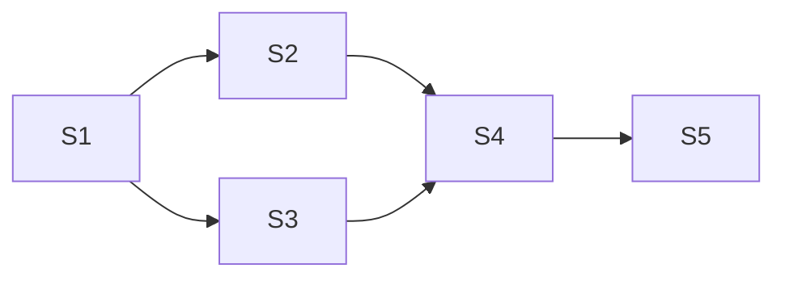

# 精通同步与互斥：信号量、管程与经典同步问题

> 课程编号：OS04
> 路线图来源：计算机基础四大件 · 操作系统（408 第 2 章同步部分）
> 难度：⭐⭐⭐⭐⭐
> 预计阅读时间：100 分钟
> 内容基准：2026 年 8 月（408 考纲操作系统第 2 章「同步与互斥」，全书最难的一章）
> **代码语言：Go**。用 `sync` 包和 channel 对照教材的信号量与管程。

---

## 引言：`count++` 为什么不是原子的

跑这段 Go 代码：

```go
package main

import (
    "fmt"
    "sync"
)

func main() {
    count := 0
    var wg sync.WaitGroup
    for i := 0; i < 1000; i++ {
        wg.Add(1)
        go func() {
            defer wg.Done()
            for j := 0; j < 1000; j++ {
                count++ // ← 就这一行
            }
        }()
    }
    wg.Wait()
    fmt.Println(count) // 期望 1000000，实际可能是 743821、856392……每次都不同
}
```

**1000 个 goroutine 各加 1000 次，结果远小于 100 万，而且每次运行都不一样。**

原因在于 `count++` 编译后是**三条机器指令**：

```asm
MOVQ  count, AX      ; ① 从内存读到寄存器
ADDQ  $1, AX         ; ② 寄存器加 1
MOVQ  AX, count      ; ③ 写回内存
```

**这三条指令之间随时可能被时钟中断打断**：

```
时间   goroutine A          goroutine B          count 内存值
────────────────────────────────────────────────────────────
t1     ① 读 count → AX=5                            5
t2     【被抢占】           ① 读 count → AX=5        5
t3                         ② AX = 6                 5
t4                         ③ 写回 count             6
t5     ② AX = 6                                     6
t6     ③ 写回 count                                 6   ← 应该是 7！
```

**两次自增，只加了 1。** 这就是**竞态条件（Race Condition）**——多个进程/线程**并发访问共享数据**，最终结果**取决于执行的相对时序**。

> ⚠️ **异步性（[OS01](./OS01-精通-操作系统概述与运行环境.md) §1.2）是并发的必然结果，而竞态条件是异步性的必然后果。** 本章要解决的，就是"如何在不可预知的执行顺序下，仍然保证正确性"。

**这不是"发生概率很小可以忽略"的问题**。上面的代码几乎 100% 出错。而更隐蔽的竞态可能几个月才复现一次——那才是真正的噩梦。

本章从"如何保护一行 `count++`"出发，一路建到能解决哲学家进餐、读者写者这类经典难题的工具：

```
临界区概念 → 软件方案（Peterson）→ 硬件方案（TestAndSet）
    → 信号量（P/V）→ 管程 → 五个经典同步问题
```

读完你应该能：

- 默写同步机制的四个准则，并判断某方案违反了哪一条
- 说清 Peterson 算法为什么正确、单标志法为什么不满足"空闲让进"
- 熟练用 P/V 操作实现互斥与同步
- 独立写出生产者-消费者、读者-写者、哲学家进餐的信号量解法
- 说清"P 操作顺序颠倒会死锁"的原因
- 对比信号量与管程，理解 Go 的 channel 属于哪一类

---

## 第一章 基本概念

### 1.1 两种制约关系

| 关系 | 定义 | 例子 |
|---|---|---|
| **同步（直接制约）** | 进程间有**先后顺序**要求 | 必须先写文件才能读文件 |
| **互斥（间接制约）** | 多个进程**不能同时**访问同一资源 | 两个进程不能同时用打印机 |

> 💡 **互斥是"不能同时"，同步是"必须按序"**。互斥可以看成同步的一种特例。

### 1.2 临界资源与临界区

| 术语 | 定义 |
|---|---|
| **临界资源** | 一次只允许**一个**进程使用的资源（打印机、共享变量） |
| **临界区** | 访问临界资源的那段**代码** |

**标准的临界区结构**：

```
do {
    进入区（entry section）      ← 检查能否进入，设置"正在访问"标志
        临界区（critical section）  ← 访问临界资源
    退出区（exit section）        ← 解除"正在访问"标志
        剩余区（remainder section）
} while (true)
```

### 1.3 同步机制应遵循的四个准则（必背）

| 准则 | 含义 | 违反的后果 |
|---|---|---|
| **① 空闲让进** | 临界区空闲时，**应允许**一个进程进入 | 资源浪费 |
| **② 忙则等待** | 已有进程在临界区时，**其他进程必须等待** | **数据不一致**（最严重） |
| **③ 有限等待** | 等待的进程应在**有限时间内**能进入 | **饥饿** |
| **④ 让权等待** | 进不去时应**立即释放 CPU**，避免忙等 | **忙等浪费 CPU** |

> ⚠️ **这四条是判断题的标准答案库**。408 常给一个方案，问"违反了哪条准则"——按上表逐条核对即可。
>
> **优先级**：② 忙则等待是**正确性**要求（必须满足）；①③④ 是**效率/公平性**要求。

---

## 第二章 互斥的软件实现

### 2.1 单标志法

```c
int turn = 0;  // 表示"轮到谁"

// P0                          // P1
while (turn != 0);  // 进入区   while (turn != 1);
    临界区;                        临界区;
turn = 1;         // 退出区     turn = 0;
```

**问题**：**违反"空闲让进"**。

```
若 turn = 0，但 P0 一直不进入临界区（比如它在做别的事）
     ↓
P1 即使想进也进不去 —— 临界区明明空闲，却不让进
```

**根本缺陷**：两个进程**必须交替进入**临界区，无法连续进入。

### 2.2 双标志先检查法

```c
bool flag[2] = {false, false};  // flag[i] = "Pi 想进入"

// P0                              // P1
while (flag[1]);   // ① 检查对方    while (flag[0]);
flag[0] = true;    // ② 设置自己    flag[1] = true;
    临界区;                            临界区;
flag[0] = false;                    flag[1] = false;
```

**问题**：**违反"忙则等待"**。

```
P0 执行完 ①（发现 flag[1]=false），【被抢占】
P1 执行 ①（发现 flag[0] 还是 false），执行 ②，进入临界区
P0 恢复，执行 ②，也进入临界区

→ 两个进程【同时在临界区】！
```

**根本缺陷**："检查"和"上锁"两个动作**之间可以被打断**——不是原子的。

### 2.3 双标志后检查法

把顺序换一下：**先上锁，再检查**。

```c
// P0                              // P1
flag[0] = true;    // ① 设置自己    flag[1] = true;
while (flag[1]);   // ② 检查对方    while (flag[0]);
    临界区;                            临界区;
flag[0] = false;                    flag[1] = false;
```

**解决了"忙则等待"**，但**违反"空闲让进"和"有限等待"**：

```
P0 执行 ① (flag[0]=true)，【被抢占】
P1 执行 ① (flag[1]=true)
两个都在 ② 处死等对方 → 【谁也进不去】
```

这就是**死锁**（准确说是活锁/饥饿——两者都在忙等）。

### 2.4 Peterson 算法 ⭐

**结合双标志和单标志的思想：既表达"我想进"，又表达"我谦让"。**

```c
bool flag[2] = {false, false};
int turn;

// Pi（i = 0 或 1，j = 1-i）
flag[i] = true;      // ① 我想进
turn = j;            // ② 【但我让你先】 ★ 关键
while (flag[j] && turn == j);   // ③ 对方想进 且 轮到对方 → 等
    临界区;
flag[i] = false;     // 退出区
```

**为什么正确？**

关键在第 ② 步：**`turn = j` 是"主动谦让"**。若两个进程都想进：

```
P0 设置 turn = 1（让 P1 先）
P1 设置 turn = 0（让 P0 先）

【后写的那个赢】—— turn 最终只有一个值
若最终 turn = 0：
    P0 的条件 (flag[1] && turn==1) → turn 不等于 1，条件假 → P0 进入 ✅
    P1 的条件 (flag[0] && turn==0) → 全真 → P1 等待 ✅
```

**turn 变量打破了对称性**，保证**恰好一个**进程能进。

| 准则 | Peterson 是否满足 |
|---|---|
| ① 空闲让进 | ✅ |
| ② 忙则等待 | ✅ |
| ③ 有限等待 | ✅ |
| **④ 让权等待** | ❌ **不满足**（`while` 是忙等，一直占着 CPU） |

> ⚠️ **所有纯软件方案都无法做到"让权等待"**——因为"释放 CPU"这个动作本身需要 OS 支持（阻塞原语）。这正是引出信号量的动机。

---

## 第三章 互斥的硬件实现

### 3.1 中断屏蔽法

```
关中断;
    临界区;
开中断;
```

- ✅ 简单高效
- ❌ **只适用于单处理器**（关中断只关本 CPU，多核下其他核照样能进临界区）
- ❌ **不适用于用户程序**（关中断是特权指令）

### 3.2 TestAndSet（TS 指令）

**硬件提供的原子指令**：读旧值 + 置 true，一气呵成不可中断。

```c
// 硬件实现，【整体原子】
bool TestAndSet(bool *lock) {
    bool old = *lock;
    *lock = true;
    return old;
}

// 使用
while (TestAndSet(&lock));   // 上锁：若原来是 true（已锁），继续循环
    临界区;
lock = false;                // 解锁
```

**为什么原子性能解决问题**：2.2 节的缺陷是"检查"和"上锁"可被打断。TS 指令把两者**硬件层面合并成一步**，中断插不进去。

### 3.3 Swap（Exchange）指令

```c
// 硬件原子交换
void Swap(bool *a, bool *b) { bool t = *a; *a = *b; *b = t; }

// 使用
bool key = true;
do {
    Swap(&lock, &key);       // 把 lock 的旧值换到 key
} while (key);               // key 为 true 说明原来已锁
    临界区;
lock = false;
```

**TS 和 Swap 逻辑等价**，都是"原子地读旧值并写新值"。

| 硬件方案 | 优点 | 缺点 |
|---|---|---|
| **中断屏蔽** | 简单 | 只适合单核、只能内核用 |
| **TS / Swap** | **适用于多处理器**、简单 | ❌ **不满足"让权等待"**（仍是忙等） |

> 💡 **现代 CPU 的原子指令**：x86 的 `CMPXCHG`（比较并交换，CAS）、`XCHG`、`LOCK` 前缀；ARM 的 `LDREX`/`STREX`。Go 的 `sync/atomic` 包和 `sync.Mutex` 的快路径都建立在它们之上。

---

## 第四章 信号量（Semaphore）

**Dijkstra 1965 年提出**。它是第一个**满足全部四条准则**的方案——关键在于它能**让权等待**。

### 4.1 记录型信号量

```c
typedef struct {
    int value;              // 剩余资源数
    struct process *L;      // 等待队列 ★ 关键
} semaphore;
```

**P 操作（wait，申请资源）**：

```c
void P(semaphore *S) {
    S->value--;                 // ① 先减
    if (S->value < 0) {         // ② 若不够
        block(S->L);            // ★ 【阻塞自己】，挂到等待队列 → 让权等待
    }
}
```

**V 操作（signal，释放资源）**：

```c
void V(semaphore *S) {
    S->value++;                 // ① 先加
    if (S->value <= 0) {        // ② 若还有进程在等
        wakeup(S->L);           // ★ 唤醒一个 → 让它进就绪队列
    }
}
```

> ⚠️ **P/V 操作本身必须是原语（不可中断）**——用关中断实现。否则 `value--` 本身就有竞态。

**`S.value` 的物理含义**：

| value | 含义 |
|---|---|
| **> 0** | **还剩多少个**可用资源 |
| **= 0** | 资源刚好用完，无进程等待 |
| **< 0** | **绝对值 = 等待队列中的进程数** |

### 4.2 用信号量实现互斥

```c
semaphore mutex = 1;        // ★ 互斥信号量初值 = 1

// 每个进程
P(mutex);
    临界区;
V(mutex);
```

**三条铁律**：

1. **互斥信号量初值必为 1**
2. **P、V 必须成对出现**，且在**同一个进程**中
3. **P(mutex) 和 V(mutex) 必须紧夹临界区**，中间不能有别的 P 操作（否则可能死锁，见 §5.1）

### 4.3 用信号量实现同步（前趋关系）

**要求：语句 S1 必须在 S2 之前执行。**

```c
semaphore S = 0;            // ★ 同步信号量初值 = 0

// 进程 P1                  // 进程 P2
S1;                         P(S);      // ★ 等 S1 完成
V(S);   // ★ 通知           S2;
```

**为什么初值是 0**：

```
若 P2 先跑：P(S) → value 变 -1 → 阻塞，等待
           P1 执行 S1，V(S) → value 变 0，唤醒 P2 → S2 执行 ✅

若 P1 先跑：S1 执行，V(S) → value 变 1
           P2 执行 P(S) → value 变 0，不阻塞 → S2 执行 ✅

两种顺序都能保证 S1 在 S2 之前 ✅
```

> 💡 **口诀：互斥信号量初值 = 1（资源数）；同步信号量初值 = 0（还没通知）。**

### 4.4 复杂前趋图



**解法：每条边设一个信号量，初值全为 0。**

```c
semaphore a=0, b=0, c=0, d=0, e=0;

P1: S1; V(a); V(b);
P2: P(a); S2; V(c);
P3: P(b); S3; V(d);
P4: P(c); P(d); S4; V(e);
P5: P(e); S5;
```

**规则**：**入边 → P 操作（等）；出边 → V 操作（通知）**。

---

## 第五章 五个经典同步问题

### 5.1 生产者-消费者问题 ⭐

**问题描述**：生产者往缓冲区放产品，消费者取产品。缓冲区大小 n。

- 缓冲区**满**时，生产者必须等
- 缓冲区**空**时，消费者必须等
- 缓冲区是**临界资源**，需互斥访问

**解法**：

```c
semaphore mutex = 1;    // 互斥访问缓冲区
semaphore empty = n;    // ★ 空闲缓冲区数量
semaphore full  = 0;    // ★ 产品数量

// 生产者                        // 消费者
while (true) {                  while (true) {
    生产一个产品;
    P(empty);   // ① 有空位吗       P(full);    // ① 有产品吗
    P(mutex);   // ② 加锁           P(mutex);   // ② 加锁
        放入缓冲区;                     取出产品;
    V(mutex);   // ③ 解锁           V(mutex);   // ③ 解锁
    V(full);    // ④ 产品+1         V(empty);   // ④ 空位+1
}                                   消费产品;
                                }
```

#### ⚠️ 核心陷阱：P 操作的顺序不能颠倒

**若把生产者写成 `P(mutex); P(empty);`**：

```
① 缓冲区已满（empty = 0）
② 生产者执行 P(mutex) → 拿到锁 ✅
③ 生产者执行 P(empty) → empty 变 -1 → 【阻塞，但手里还攥着 mutex！】
④ 消费者想取产品：执行 P(full) 通过，执行 P(mutex) → 【阻塞】
                                                     ↑
                     锁在生产者手里，而生产者在等消费者腾出空位

→ 【死锁】：生产者等空位，消费者等锁，互相等待
```

> ⭐ **记忆口诀：先同步，后互斥。**
>
> **同步信号量（empty/full）的 P 操作必须在互斥信号量（mutex）的 P 操作之前。**
>
> **原因**：若先拿锁再检查资源，一旦资源不足就会**"抱着锁睡觉"**，别人永远拿不到锁。

**V 操作的顺序则无所谓**——V 不会阻塞，不会造成死锁（但先 V(mutex) 能让别人早点进临界区，效率略高）。

#### Go 实现对照

```go
package main

import (
    "fmt"
    "sync"
    "time"
)

const N = 5

// 方式一：严格对照教材的信号量实现（用带缓冲 channel 模拟信号量）
func semaphoreStyle() {
    buffer := make([]int, 0, N)
    var mu sync.Mutex              // mutex = 1
    empty := make(chan struct{}, N) // empty = N
    full := make(chan struct{}, N)  // full = 0
    for i := 0; i < N; i++ {
        empty <- struct{}{} // 初始 N 个空位
    }

    go func() { // 生产者
        for i := 1; ; i++ {
            <-empty      // ★ P(empty) —— 先同步
            mu.Lock()    // ★ P(mutex) —— 后互斥
            buffer = append(buffer, i)
            mu.Unlock()  // V(mutex)
            full <- struct{}{} // V(full)
            time.Sleep(10 * time.Millisecond)
        }
    }()

    go func() { // 消费者
        for {
            <-full       // P(full)
            mu.Lock()    // P(mutex)
            v := buffer[0]
            buffer = buffer[1:]
            mu.Unlock()  // V(mutex)
            empty <- struct{}{} // V(empty)
            fmt.Println("消费:", v)
            time.Sleep(30 * time.Millisecond)
        }
    }()
    time.Sleep(500 * time.Millisecond)
}

// 方式二：Go 的地道写法 —— 一个 channel 搞定
func channelStyle() {
    ch := make(chan int, N) // ★ 带缓冲 channel 本身就是"有界缓冲区"

    go func() { // 生产者
        for i := 1; ; i++ {
            ch <- i // 满了自动阻塞（相当于 P(empty)）
            time.Sleep(10 * time.Millisecond)
        }
    }()

    for i := 0; i < 10; i++ {
        v := <-ch // 空了自动阻塞（相当于 P(full)）
        fmt.Println("消费:", v)
        time.Sleep(30 * time.Millisecond)
    }
}

func main() { channelStyle() }
```

> 💡 **Go 的带缓冲 channel 就是生产者-消费者问题的语言级封装**——`empty`、`full`、`mutex` 三个信号量全被内建了。这也是为什么 Go 里几乎不需要手写这套逻辑。

### 5.2 多生产者-多消费者问题

**变体：盘子里最多放一个水果，爸爸放苹果，妈妈放橘子，儿子吃橘子，女儿吃苹果。**

```c
semaphore plate  = 1;   // 盘子容量（互斥 + 同步二合一）
semaphore apple  = 0;   // 盘中苹果数
semaphore orange = 0;   // 盘中橘子数

// 爸爸                    // 妈妈
P(plate);                 P(plate);
  放苹果;                   放橘子;
V(apple);                 V(orange);

// 女儿（吃苹果）          // 儿子（吃橘子）
P(apple);                 P(orange);
  取苹果;                   取橘子;
V(plate);                 V(plate);
```

> 💡 **本题不需要单独的 mutex**！因为 `plate = 1` 已经保证了同一时刻只有一个人能操作盘子。
>
> ⚠️ **但如果盘子容量 > 1（比如能放 5 个水果），就必须加 mutex**——否则爸爸和妈妈可能同时往盘子里放，破坏数据结构。**408 常在这里设陷阱。**

### 5.3 读者-写者问题 ⭐

**问题描述**：

- **多个读者可以同时读**（读不改数据，无冲突）
- **写者必须独占**（写的时候谁也不能读或写）

#### 读者优先（可能饿死写者）

```c
semaphore rw = 1;        // 读写互斥
int count = 0;           // ★ 当前读者数量
semaphore mutex = 1;     // ★ 保护 count 本身

// 写者
P(rw);
    写文件;
V(rw);

// 读者
P(mutex);                    // 保护 count
    if (count == 0) P(rw);   // ★ 第一个读者负责"上锁"
    count++;
V(mutex);
    读文件;                   // ★ 多个读者可以同时在这里
P(mutex);
    count--;
    if (count == 0) V(rw);   // ★ 最后一个读者负责"解锁"
V(mutex);
```

**两个关键设计**：

1. **只有第一个读者 `P(rw)`，只有最后一个读者 `V(rw)`**——中间的读者直接进入，实现"多读者并发"
2. **`count` 本身是共享变量**，必须用 `mutex` 保护

**问题：写者饥饿**。只要读者源源不断，`count` 永不为 0，`rw` 永不释放，写者永远等不到。

#### 写者优先（读写公平）

加一个信号量 `w`，让读者和写者**排队**：

```c
semaphore rw = 1, mutex = 1, w = 1;   // ★ w：实现"先来先服务"
int count = 0;

// 写者
P(w);                    // ★ 排队
    P(rw);
        写文件;
    V(rw);
V(w);

// 读者
P(w);                    // ★ 排队 —— 关键改动
    P(mutex);
        if (count == 0) P(rw);
        count++;
    V(mutex);
V(w);                    // ★ 早早释放 w，让后续读者能排队
    读文件;
P(mutex);
    count--;
    if (count == 0) V(rw);
V(mutex);
```

**效果**：写者到达后 `P(w)`，后续的读者也要 `P(w)` 排在它后面 → **写者不会被无限推迟**。

> ⚠️ 严格说这是**"读写公平"**（按到达顺序），教材常称"写者优先"。真正的写者绝对优先需要更复杂的实现。

#### Go 对照

```go
var rw sync.RWMutex

// 读者：可以多个同时持有
rw.RLock()
_ = sharedData
rw.RUnlock()

// 写者：独占
rw.Lock()
sharedData = 42
rw.Unlock()
```

> 💡 **`sync.RWMutex` 就是读者-写者问题的标准库实现**，且 Go 的实现是**写者优先**的——一旦有写者在等，后续的 `RLock()` 会被阻塞，防止写者饥饿。

### 5.4 哲学家进餐问题 ⭐

**问题描述**：5 个哲学家围坐，每人左右各一根筷子（共 5 根）。哲学家要**同时拿到左右两根**才能吃饭。


**朴素解法（会死锁）**：

```c
semaphore chopstick[5] = {1,1,1,1,1};

// 哲学家 i
P(chopstick[i]);            // 拿左边
P(chopstick[(i+1)%5]);      // 拿右边
    吃饭;
V(chopstick[i]);
V(chopstick[(i+1)%5]);
```

**死锁场景**：**5 个哲学家同时拿起左边的筷子** → 每人手里一根，都在等右边 → **永久等待**。

> 💡 这是**死锁四个必要条件**的完美演示（详见 [OS05](./OS05-精通-死锁.md)）：互斥（筷子）、请求并保持（拿着左边等右边）、不可剥夺、**循环等待**（环形拓扑）。

**四种防死锁解法**：

| 方法 | 做法 | 破坏的条件 |
|---|---|---|
| **① 最多允许 4 人同时拿筷子** | 加信号量 `count = 4` | **循环等待**（至少一人能拿到两根） |
| **② 奇偶异序** | 奇数号先拿左，偶数号先拿右 | **循环等待** |
| **③ 仅当左右都可用时才拿** | 用 mutex 保护"拿筷子"这个复合动作 | **请求并保持** |
| **④ 资源有序分配** | 总是先拿编号小的筷子 | **循环等待** |

**方法 ③ 的实现（最常考）**：

```c
semaphore chopstick[5] = {1,1,1,1,1};
semaphore mutex = 1;        // ★ 保证"拿两根筷子"这个动作是原子的

// 哲学家 i
P(mutex);                       // ★ 进入区
    P(chopstick[i]);
    P(chopstick[(i+1)%5]);
V(mutex);                       // ★ 拿完两根就释放 mutex
    吃饭;
V(chopstick[i]);
V(chopstick[(i+1)%5]);
```

**为什么这样不死锁**：`mutex` 保证同一时刻**只有一个哲学家在拿筷子**。他要么两根都拿到（然后 V(mutex) 让下一个人来拿），要么在拿第二根时阻塞——但此时他**手里攥着 mutex**……

> ⚠️ **等等，这不是又"抱着锁睡觉"了吗？**
>
> 不会死锁。因为若哲学家 i 拿不到右边的筷子，说明**哲学家 i+1 正在吃饭**（他持有那根筷子）。i+1 吃完后会 `V` 释放筷子，i 就能继续。**总有人能推进，不构成循环等待。**
>
> 但这个方案**并发度低**（一次只有一人能拿筷子）。方法 ① 和 ④ 并发度更高。

**方法 ④ 资源有序分配（工程上最常用）**：

```c
// 哲学家 i：总是【先拿编号小的】
int first  = min(i, (i+1)%5);
int second = max(i, (i+1)%5);
P(chopstick[first]);
P(chopstick[second]);
```

哲学家 4 的左右筷子是 4 和 0，按规则他**先拿 0 再拿 4**——**打破了环**。

### 5.5 吸烟者问题

**问题描述**：三个抽烟者分别有**无限的**烟草、纸、胶水中的一种；供应者每次提供**另外两样**中的一组。

```c
semaphore offer1 = 0;   // 桌上有"纸+胶水"（给有烟草的人）
semaphore offer2 = 0;   // 桌上有"烟草+胶水"（给有纸的人）
semaphore offer3 = 0;   // 桌上有"烟草+纸"（给有胶水的人）
semaphore finish = 0;   // ★ 抽完的信号
int i = 0;

// 供应者
while (true) {
    i = (i + 1) % 3;
    if (i == 0)      V(offer1);
    else if (i == 1) V(offer2);
    else             V(offer3);
    P(finish);          // ★ 等这一轮抽完再放下一组
}

// 抽烟者1（有烟草）
while (true) { P(offer1); 卷烟并抽; V(finish); }
```

> 💡 **本题的核心是"轮流"**——`finish` 信号量保证供应者不会连续放两组材料。这是**同步**（而非互斥）的典型应用。

---

## 第六章 管程（Monitor）

### 6.1 为什么需要管程

信号量虽然强大，但**极易出错**：

```c
P(mutex);  ...  P(mutex);   // ❌ 写重了 → 死锁
V(mutex);  ...              // ❌ 忘了 P → 互斥失效
P(empty); P(mutex);         // ✅ 顺序对
P(mutex); P(empty);         // ❌ 顺序错 → 死锁
```

**问题：同步逻辑分散在各个进程里，全靠程序员自觉。**

**管程的思想：把共享数据和操作它的过程封装起来，由编译器保证互斥。**

### 6.2 管程的四个组成

```
monitor 缓冲区管理 {
    ① 共享数据结构：  int buffer[N]; int count = 0;
    ② 初始化语句
    ③ 一组过程（方法）：insert(x) { ... }  remove() { ... }
    ④ 条件变量：      condition full, empty;
}
```

**管程的关键特性**：

> **每次只允许一个进程进入管程内的过程执行——这由【编译器】保证，程序员不用写 P/V。**

### 6.3 条件变量

管程内用**条件变量**实现同步：

| 操作 | 含义 |
|---|---|
| `x.wait()` | **阻塞**当前进程，**释放管程**（让别人能进来） |
| `x.signal()` | **唤醒**一个等待 `x` 的进程 |

> ⚠️ **条件变量 vs 信号量的关键区别**：
>
> | | 信号量 | 条件变量 |
> |---|---|---|
> | 有无计数值 | **有**（value） | **无** |
> | `V`/`signal` 时无人等待 | **value++，记住了** | **信号丢失，什么也不做** |
>
> **这是最容易错的一点**。条件变量的 `signal` 是"通知"，不是"计数"。

### 6.4 用管程解决生产者-消费者

```
monitor ProducerConsumer {
    item buffer[N];
    int count = 0;
    condition notFull, notEmpty;

    void insert(item x) {
        if (count == N) notFull.wait();     // 满了就等
        buffer[count++] = x;
        notEmpty.signal();                   // 通知消费者
    }

    item remove() {
        if (count == 0) notEmpty.wait();    // 空了就等
        item x = buffer[--count];
        notFull.signal();                    // 通知生产者
        return x;
    }
}

// 生产者                    // 消费者
ProducerConsumer.insert(x);  x = ProducerConsumer.remove();
```

**对比信号量版本**：

| | 信号量 | 管程 |
|---|---|---|
| 互斥 | 程序员写 `P(mutex)`/`V(mutex)` | **编译器自动保证** |
| P/V 顺序 | **程序员必须写对**（否则死锁） | 不用操心 |
| 代码位置 | 分散在各进程 | **集中在管程内** |
| 出错概率 | **高** | 低 |

### 6.5 Go 的对应物

Go 没有 `monitor` 关键字，但有两套等价机制：

**① `sync.Cond` —— 直接对应条件变量**

```go
type Buffer struct {
    mu       sync.Mutex
    notFull  *sync.Cond
    notEmpty *sync.Cond
    data     []int
    capacity int
}

func (b *Buffer) Insert(x int) {
    b.mu.Lock()
    defer b.mu.Unlock()
    for len(b.data) == b.capacity { // ★ 必须用 for 不是 if（见下）
        b.notFull.Wait()            // 释放锁并阻塞
    }
    b.data = append(b.data, x)
    b.notEmpty.Signal()
}
```

> ⚠️ **必须用 `for` 而不是 `if` 重新检查条件**。因为被唤醒后到真正拿到锁之间，条件可能又被别人改了（**虚假唤醒 / 惊群**）。教材的伪代码写 `if` 是简化，**真实代码必须用 `while`/`for`**。

**② channel —— Go 更推崇的方式**

```go
ch := make(chan int, N)  // 一行搞定生产者-消费者
```

> 💡 **Go 的 channel 在概念上更接近"管程 + 消息传递"的混合体**：数据和同步逻辑被封装在 channel 内部，使用者不需要写任何 P/V 或加锁。这正是管程"把同步逻辑集中封装"思想的现代实现。

---

## 第七章 408 高频考点与陷阱清单

### 7.1 考点分布

同步互斥是操作系统**最难也最重要**的部分：**2-3 道选择题 + 极高概率的大题**（写信号量解法）。

最常考：

1. **用 P/V 操作解决一个新的同步问题**（大题必考）
2. 生产者-消费者的 P 操作顺序
3. 四个准则的判断
4. 读者-写者的 count 保护
5. 哲学家进餐的防死锁方法

### 7.2 十八个陷阱

**陷阱 1：互斥就是同步**

**错**。**互斥是"不能同时"（间接制约），同步是"必须按序"（直接制约）**。互斥可看作同步的特例。

**陷阱 2：单标志法违反"忙则等待"**

**错，它违反"空闲让进"**（两进程必须交替，临界区空闲也可能进不去）。**双标志先检查法**才违反"忙则等待"。

**陷阱 3：Peterson 算法满足全部四个准则**

**错**。它**不满足"让权等待"**——`while` 循环是忙等，一直占着 CPU。所有纯软件方案都做不到让权等待。

**陷阱 4：中断屏蔽法适用于多处理器**

**错**。关中断只关**本 CPU**，其他核照样能进临界区。

**陷阱 5：TestAndSet 满足"让权等待"**

**错**。TS 和 Swap 都是**忙等**，不满足让权等待。它们的优点是适用于多处理器。

**陷阱 6：P 操作是"增加"，V 操作是"减少"**

**错，反了**。**P 是申请（value--）**，**V 是释放（value++）**。记忆：P = Proberen（测试/申请），V = Verhogen（增加）。

**陷阱 7：S.value 的绝对值就是资源总数**

**不准确**。`value > 0` 时表示**剩余**资源数；`value < 0` 时**绝对值 = 等待进程数**。

**陷阱 8：互斥信号量初值可以是任意正数**

**错，必须是 1**。若初值为 2，就会允许两个进程同时进临界区。

**陷阱 9：同步信号量初值是 1**

**错，通常是 0**（表示"事件还没发生"）。互斥才是 1。

**陷阱 10：生产者中 P(mutex) 和 P(empty) 顺序无所谓**

**大错**。必须 **P(empty) 在前，P(mutex) 在后**。否则会"抱着锁睡觉"，造成**死锁**。

**陷阱 11：V 操作的顺序也会导致死锁**

**错**。**V 操作不会阻塞**，所以顺序颠倒不会死锁（只是效率略有差异）。

**陷阱 12：多生产者-多消费者问题一定需要 mutex**

**不一定**。若缓冲区容量为 1（如"盘子只能放一个水果"），`plate = 1` 已经保证互斥，**不需要额外的 mutex**。容量 > 1 时才需要。

**陷阱 13：读者-写者问题中 count 不需要保护**

**错**。`count` 是**共享变量**，`count++` 和 `count--` 都不是原子的，必须用 `mutex` 保护。

**陷阱 14：读者优先算法不会饿死任何进程**

**错**。读者优先会**饿死写者**——只要读者源源不断，`count` 永不归零。

**陷阱 15：哲学家问题中"最多允许 4 人拿筷子"破坏的是"互斥"条件**

**错**。它破坏的是**"循环等待"**——5 个位置只有 4 人竞争，至少有一人能同时拿到两根。

**陷阱 16：条件变量的 signal 操作有计数功能**

**错**。**条件变量没有值**，`signal` 时若无人等待，**信号直接丢失**。信号量的 V 操作才会累加计数。

**陷阱 17：管程需要程序员自己写 P/V 保证互斥**

**错**。**管程的互斥由编译器自动保证**，这正是它相对信号量的最大优势。

**陷阱 18：条件变量的 wait 之后用 if 重新检查条件就够了**

**工程上错**。必须用 **`while`/`for`** 循环重新检查——被唤醒到拿到锁之间条件可能又变了（虚假唤醒）。教材伪代码用 `if` 是简化。

### 7.3 速查卡

```
【四个准则】
① 空闲让进  ② 忙则等待（正确性）  ③ 有限等待  ④ 让权等待

【各方案违反的准则】
单标志法       ：违反【空闲让进】
双标志先检查   ：违反【忙则等待】← 最严重
双标志后检查   ：违反【空闲让进】【有限等待】
Peterson       ：只违反【让权等待】
TS / Swap      ：只违反【让权等待】
信号量         ：【全部满足】✅

【P/V】
P(S): S.value--; if (value < 0) block();     ← 申请
V(S): S.value++; if (value <= 0) wakeup();   ← 释放
value > 0：剩余资源数
value < 0：|value| = 等待进程数

【信号量初值】
互斥信号量 mutex = 1
同步信号量        = 0
资源信号量        = 资源总数

【生产者-消费者】
mutex=1, empty=n, full=0
生产者：P(empty) → P(mutex) → 放 → V(mutex) → V(full)
消费者：P(full)  → P(mutex) → 取 → V(mutex) → V(empty)
★★ 先同步后互斥！P(mutex) 绝不能在 P(empty)/P(full) 前面

【读者-写者】
rw=1（读写互斥）, mutex=1（保护count）, count=0
读者：第一个 P(rw)，最后一个 V(rw)
读者优先 → 【饿死写者】；加信号量 w 排队 → 读写公平

【哲学家】四种防死锁
① 最多 4 人拿筷子      → 破坏循环等待
② 奇偶异序             → 破坏循环等待
③ 用 mutex 包住拿两根  → 破坏请求并保持
④ 先拿编号小的         → 破坏循环等待（工程最常用）

【信号量 vs 管程】
信号量：有计数值、程序员写 P/V、易错
管程  ：编译器保证互斥、条件变量【无计数】、signal 无人等则丢失
```

---

## 第八章 Go ↔ C 对照

| 教材概念 | C / POSIX | Go | 说明 |
|---|---|---|---|
| **互斥信号量** | `pthread_mutex_t` | `sync.Mutex` | |
| **记录型信号量** | `sem_t` + `sem_wait`/`sem_post` | **带缓冲 channel** | `make(chan struct{}, n)` |
| **条件变量** | `pthread_cond_t` | `sync.Cond` | 都要用 `while` 重检条件 |
| **读者-写者锁** | `pthread_rwlock_t` | `sync.RWMutex` | Go 的实现**写者优先** |
| **管程** | 无（要自己封装） | **channel**（思想相近） | 数据+同步逻辑封装在一起 |
| **原子操作（TS/CAS）** | `__sync_bool_compare_and_swap` | `sync/atomic` | 底层都是 CPU 的 CAS 指令 |
| **只执行一次** | `pthread_once` | `sync.Once` | |
| **等待一组任务** | 手工用 cond 实现 | `sync.WaitGroup` | |

**用 Go 检测竞态**：

```bash
go run -race main.go     # ★ 竞态检测器，会打印出冲突的两处代码
go test -race ./...
```

引言里的例子加上 `-race` 会直接报：

```
WARNING: DATA RACE
Write at 0x00c0000a4008 by goroutine 8:
  main.main.func1()
      main.go:16 +0x64
Previous write at 0x00c0000a4008 by goroutine 7:
  main.main.func1()
      main.go:16 +0x64
```

> 💡 **`-race` 是发现竞态最有效的手段**。它在运行时记录每次内存访问的"happens-before"关系，能找出那些"几个月才复现一次"的隐蔽 bug。**生产代码上线前必须跑一遍。**

**三种解法对比**：

```go
// ① 互斥锁 —— 对应教材的信号量
var mu sync.Mutex
mu.Lock(); count++; mu.Unlock()

// ② 原子操作 —— 对应硬件的 TS/CAS 指令，无锁，最快
var count int64
atomic.AddInt64(&count, 1)

// ③ channel —— Go 推崇的方式：不共享内存，靠通信
ch := make(chan int)
go func() { for v := range ch { total += v } }() // 只有一个 goroutine 碰 total
```

> 💡 **Go 的哲学：「不要通过共享内存来通信，而要通过通信来共享内存」**。方式 ③ 把共享变量交给**唯一一个** goroutine 管理，其他人通过 channel 发消息——**根本不存在临界区，也就不需要互斥**。这是从"消除问题"而非"解决问题"的角度出发。

---

## 第九章 练习题

### 选择题

**1.** 同步机制应遵循的四个准则中，**最重要**（关系到正确性）的是：
A. 空闲让进　B. 忙则等待　C. 有限等待　D. 让权等待

**2.** 单标志法实现互斥，违反的准则是：
A. 空闲让进　B. 忙则等待　C. 有限等待　D. 让权等待

**3.** Peterson 算法**不满足**的准则是：
A. 空闲让进　B. 忙则等待　C. 有限等待　D. 让权等待

**4.** 关于 TestAndSet 指令，**错误**的是：
A. 是硬件提供的原子操作
B. 适用于多处理器系统
C. 满足"让权等待"准则
D. 会产生忙等

**5.** 信号量 S 的值为 −3，表示：
A. 有 3 个可用资源
B. 有 3 个进程在等待队列中
C. 系统出错
D. 有 3 个进程正在使用资源

**6.** 用于实现互斥的信号量，其初值应该是：
A. 0　B. 1　C. −1　D. 资源总数

**7.** 生产者-消费者问题中，生产者的正确 P 操作顺序是：
A. P(mutex); P(empty);
B. P(empty); P(mutex);
C. P(full); P(mutex);
D. P(mutex); P(full);

**8.** 若生产者写成 `P(mutex); P(empty);`，可能导致：
A. 数据不一致　B. 死锁　C. 饥饿　D. 效率降低但功能正确

**9.** 读者-写者问题中，变量 count 需要用 mutex 保护，因为：
A. count 是临界资源
B. count++ 和 count-- 不是原子操作
C. 防止写者修改 count
D. 提高效率

**10.** 关于条件变量与信号量，**正确**的是：
A. 两者都有计数值
B. 条件变量的 signal 在无进程等待时会累加计数
C. 信号量的 V 操作在无进程等待时会使 value 增加
D. 两者完全等价

**11.** 哲学家进餐问题中，"最多允许 4 个哲学家同时拿筷子"这一方案破坏的死锁必要条件是：
A. 互斥　B. 请求并保持　C. 不可剥夺　D. 循环等待

**12.** 管程相对信号量的最大优势是：
A. 效率更高
B. 互斥由编译器自动保证，程序员不易出错
C. 支持更多进程
D. 不需要操作系统支持

### 应用题

**13.** 分析下列互斥方案违反了哪条准则，并说明具体的失效场景：

```c
// 方案 A
int turn = 0;
// P0: while(turn != 0); 临界区; turn = 1;
// P1: while(turn != 1); 临界区; turn = 0;

// 方案 B
bool flag[2] = {false, false};
// Pi: while(flag[j]); flag[i] = true; 临界区; flag[i] = false;

// 方案 C
bool flag[2] = {false, false};
// Pi: flag[i] = true; while(flag[j]); 临界区; flag[i] = false;
```

**14.** 某系统有一个打印机和一个扫描仪，进程 P1 需要先用扫描仪再用打印机，进程 P2 需要先用打印机再用扫描仪。

（1）用信号量写出两个进程的代码。
（2）分析这样写是否会死锁，若会请给出解决方案。

**15.** 有一个仓库，可以存放 A、B 两种产品，但要求：

- 每次只能存入一种产品（A 或 B）
- 仓库最多能存 N 个产品（A 和 B 的总数 ≤ N）
- A 产品数量 − B 产品数量 < M（M 为常数）
- B 产品数量 − A 产品数量 < M

用信号量写出生产 A 和生产 B 两个进程的同步算法。

**16.** 桌上有一个盘子，可以放 **3 个**水果。爸爸专放苹果，妈妈专放橘子，儿子专等吃橘子，女儿专等吃苹果。用信号量实现四人的同步。

（注意：与 §5.2 的差别是盘子容量从 1 变成了 3）

**17.** 完整写出**读者优先**和**写者优先**（读写公平）两种读者-写者算法，并说明：

（1）为什么读者优先会饿死写者？
（2）写者优先方案中，信号量 `w` 起什么作用？为什么读者要在 `P(mutex)` 之外再套一层 `P(w)`/`V(w)`？

**18.** 解释为什么在生产者-消费者问题中，"P 操作顺序颠倒会死锁"，而"V 操作顺序颠倒不会"。

### 答案与解析

<details>
<summary>点击展开</summary>

**1. B**

**"忙则等待"是正确性要求**——违反它意味着多个进程同时进入临界区，**数据会被破坏**，这是不可接受的错误。

其余三条：
- **空闲让进**：违反导致资源浪费（效率问题）
- **有限等待**：违反导致饥饿（公平性问题）
- **让权等待**：违反导致忙等（效率问题）

**2. A**

单标志法要求两个进程**严格交替**进入临界区。若 turn = 0 而 P0 迟迟不进入（在做别的事），P1 即使急需进入也进不去——**临界区空闲却不让进**。

**3. D**

Peterson 算法用 `while (flag[j] && turn == j);` 忙等，**一直占着 CPU 空转**，违反"让权等待"。

它满足其余三条：空闲让进 ✅、忙则等待 ✅、有限等待 ✅。

> 💡 **所有纯软件方案都无法满足"让权等待"**——释放 CPU 需要调用 OS 的阻塞原语，纯用户态代码做不到。

**4. C**

TestAndSet 的使用方式是 `while (TestAndSet(&lock));`，这是**忙等**，**不满足"让权等待"**。

A、B、D 都正确——它是硬件原子指令，适用于多处理器（这是它相对"中断屏蔽"的优势），但会忙等。

**5. B**

$$
S.value < 0 \implies |S.value| = \text{等待队列中的进程数}
$$

所以 value = −3 表示**有 3 个进程被阻塞在这个信号量的等待队列上**。

若 value > 0，表示**还剩多少可用资源**。

**6. B**

**互斥信号量初值必须是 1**——表示"临界资源有 1 个，同一时刻只允许一个进程使用"。

若初值为 2，会允许两个进程同时进入临界区，互斥失效。

**7. B**

$$
\boxed{\text{先同步，后互斥}}
$$

生产者：**`P(empty)` 在前**（检查有没有空位），**`P(mutex)` 在后**（加锁）。

**8. B**

**死锁**。详细分析见第 18 题。

简要说：若缓冲区已满（empty = 0），生产者先拿到 mutex，再执行 P(empty) 时阻塞——**手里攥着锁睡着了**。消费者想取产品，执行 P(mutex) 时也被阻塞。两者互相等待，永远无法推进。

**9. B**

`count++` 编译后是"读-改-写"三条指令，**不是原子操作**（正如引言里的 `count++`）。多个读者同时执行会产生竞态，导致 count 值错误——进而使"第一个读者 P(rw)"和"最后一个读者 V(rw)"的判断失效。

A 的说法不够精确：count 是共享变量，但"临界资源"通常指打印机这类设备；这里的关键在于**操作的非原子性**。

**10. C**

| | 信号量 | 条件变量 |
|---|---|---|
| 有计数值 | **✅ 有（value）** | ❌ 无 |
| V/signal 时无人等待 | **value++，"记住"了** | **信号丢失** |

C 描述的正是信号量的正确行为。

B 错——条件变量**没有计数**，signal 时无人等待就什么也不做。

**11. D**

"最多允许 4 个哲学家同时拿筷子"：5 根筷子，只有 4 个人在竞争，**至少有一个人能同时拿到左右两根**，吃完后释放，其他人依次推进。

**这打破了"5 个人首尾相接互相等待"的环** → 破坏**循环等待**。

**12. B**

**管程的互斥由编译器自动保证**，程序员只需写业务逻辑，不用写 P/V，也不用担心：

- P/V 顺序写反
- 忘写 V 导致死锁
- 写重 P 导致死锁

这大幅降低了出错概率。

**13.**

---

**方案 A（单标志法）：违反「空闲让进」**

**失效场景**：

```
初始 turn = 0

t1：P0 进入临界区，出来后设 turn = 1
t2：P1 进入临界区，出来后设 turn = 0
t3：P0 又想进 → turn = 0，可以进 ✅
t4：P0 出来，设 turn = 1
t5：P0 【又想进】→ 但 turn = 1，必须等 P1 先进一次
    而 P1 此刻【根本不想进临界区】（在做别的计算）
    → P0 被无限期阻塞，尽管临界区完全空闲
```

**根本缺陷**：强制两进程**严格交替**，无法连续进入。

---

**方案 B（双标志先检查）：违反「忙则等待」** ← 最严重

**失效场景**：

```
t1：P0 执行 while(flag[1]) —— flag[1] = false，通过检查
t2：【P0 被时钟中断抢占】（还没来得及执行 flag[0] = true）
t3：P1 执行 while(flag[0]) —— flag[0] 仍是 false，通过检查
t4：P1 执行 flag[1] = true，进入临界区
t5：P0 恢复，执行 flag[0] = true，也进入临界区

→ 【两个进程同时在临界区】，数据被破坏 ❌
```

**根本缺陷**："检查对方"和"设置自己"是**两条独立指令，中间可被打断**——不满足原子性。

---

**方案 C（双标志后检查）：违反「空闲让进」和「有限等待」**

**失效场景**：

```
t1：P0 执行 flag[0] = true（我想进）
t2：【P0 被抢占】
t3：P1 执行 flag[1] = true（我也想进）
t4：P1 执行 while(flag[0]) —— flag[0] = true，【死等】
t5：P0 恢复，执行 while(flag[1]) —— flag[1] = true，【死等】

→ 两个进程都在忙等对方，谁也进不去（临界区空闲！）
→ 永久等待
```

**根本缺陷**：两个进程**都先表态"我要进"再检查**，导致互相谦让……不，是互相**不谦让**，形成僵持。

**Peterson 算法的修正**：加一个 `turn = j`（**我让你先**），**打破对称性** → 后写 turn 的那个进程"输"，另一个进程得以进入。

**14.**

**（1）信号量代码**

```c
semaphore printer = 1;   // 打印机
semaphore scanner = 1;   // 扫描仪

// 进程 P1：先扫描后打印        // 进程 P2：先打印后扫描
P(scanner);                    P(printer);
    使用扫描仪;                    使用打印机;
    P(printer);                    P(scanner);
        使用打印机;                    使用扫描仪;
    V(printer);                    V(scanner);
V(scanner);                    V(printer);
```

**（2）死锁分析**

**会死锁**。

```
t1：P1 执行 P(scanner) → 获得扫描仪 ✅
t2：P2 执行 P(printer) → 获得打印机 ✅
t3：P1 执行 P(printer) → 打印机被 P2 占用 → 【阻塞】
t4：P2 执行 P(scanner) → 扫描仪被 P1 占用 → 【阻塞】

→ P1 持有扫描仪等打印机
   P2 持有打印机等扫描仪
   → 【循环等待，死锁】
```

这满足死锁的四个必要条件（详见 [OS05](./OS05-精通-死锁.md)）：

| 条件 | 本例的体现 |
|---|---|
| 互斥 | 打印机和扫描仪都是独占设备 |
| 请求并保持 | P1 持有扫描仪的同时申请打印机 |
| 不可剥夺 | 不能强行从 P1 手中夺走扫描仪 |
| **循环等待** | P1 → 打印机 → P2 → 扫描仪 → P1 |

**解决方案**

**方案一：资源有序分配（最常用）**

给资源编号：**扫描仪 = 1，打印机 = 2**。规定**所有进程必须按编号递增的顺序申请**。

```c
// P1：先扫描后打印 —— 本来就符合顺序
P(scanner);   // 1
    P(printer);   // 2
        ...
    V(printer);
V(scanner);

// P2：需要"先打印后扫描"，但申请顺序必须是 1→2
P(scanner);   // ★ 先申请扫描仪（编号小），即使暂时不用
    P(printer);   // 2
        使用打印机;
    ...
        使用扫描仪;
    V(printer);
V(scanner);
```

**代价**：P2 提前占用了扫描仪，降低并发度。但**彻底消除循环等待**。

**方案二：一次性申请全部资源（破坏"请求并保持"）**

```c
semaphore mutex = 1;    // 保护"申请资源"这个复合动作

// 两个进程都这样写
P(mutex);
    P(scanner);
    P(printer);
V(mutex);
    使用设备...;
V(printer);
V(scanner);
```

**方案三：设置超时与回退（破坏"不可剥夺"）**

申请资源时设超时，超时后**释放已持有的全部资源**，随机等待后重试。这是数据库死锁检测的常见做法。

**15.**

**分析约束条件**：

| 约束 | 需要的信号量 |
|---|---|
| 仓库总容量 N | `empty = N` |
| 每次只能存一种（互斥） | `mutex = 1` |
| A − B < M | `sa = M − 1`（A 可以比 B 多存 M−1 个） |
| B − A < M | `sb = M − 1` |

> 💡 **理解 `sa` 的含义**：`sa` 表示"A 还能比 B 多存几个"。初始时 A = B = 0，A 最多能比 B 多 M−1 个，所以初值 M−1。
>
> **每存一个 A**：A−B 增加 1 → `P(sa)`（消耗一个"A 领先额度"），同时 B−A 减少 1 → `V(sb)`（B 的领先额度增加）。

```c
semaphore mutex = 1;        // 互斥访问仓库
semaphore empty = N;        // 空位数
semaphore sa = M - 1;       // A 还能比 B 多存的数量
semaphore sb = M - 1;       // B 还能比 A 多存的数量

// 生产 A 的进程                    // 生产 B 的进程
while (true) {                     while (true) {
    生产一个 A;                        生产一个 B;
    P(sa);      // ① A 领先额度        P(sb);      // ① B 领先额度
    P(empty);   // ② 有空位吗          P(empty);   // ② 有空位吗
    P(mutex);   // ③ 加锁              P(mutex);   // ③ 加锁
        存入 A;                            存入 B;
    V(mutex);   // ④ 解锁              V(mutex);   // ④ 解锁
    V(sb);      // ⑤ B 的额度+1        V(sa);      // ⑤ A 的额度+1
}                                  }
```

**关键点说明**：

**① 为什么 `V(sb)` 而不是 `V(sa)`？**

存了一个 A 之后：

- A − B **增加**了 1 → A 的领先额度**减少**（已在 P(sa) 中消耗）
- B − A **减少**了 1 → **B 的领先额度增加了** → `V(sb)`

**② P 操作的顺序**

三个 P 操作中，**`P(mutex)` 必须放在最后**（先同步后互斥）。

`P(sa)` 和 `P(empty)` 之间的顺序理论上可以互换，但**建议把限制更严格的放前面**（先检查数量差限制，再检查总容量）。

**③ 验证约束**

```
初始：A=0, B=0, sa=M-1, sb=M-1

连续存 M-1 个 A：
  每次 P(sa)，sa 从 M-1 降到 0
  每次 V(sb)，sb 从 M-1 涨到 2(M-1)
  此时 A-B = M-1 < M ✅

再存第 M 个 A：
  P(sa) → sa 变 -1 → 【阻塞】✅ 正确地阻止了 A-B ≥ M
  
只有当有人存入 B（执行 V(sa)）后，A 才能继续存 ✅
```

**16.**

**与 §5.2 的关键差别：盘子容量从 1 变成 3，`plate = 1` 不再能保证互斥，必须单独加 mutex。**

```c
semaphore plate  = 3;   // ★ 盘子容量 3（同步：控制总数）
semaphore mutex  = 1;   // ★ 必须单独加！保证同一时刻只有一人操作盘子
semaphore apple  = 0;   // 盘中苹果数
semaphore orange = 0;   // 盘中橘子数

// 爸爸（放苹果）                  // 妈妈（放橘子）
while (true) {                    while (true) {
    P(plate);   // ① 有空位吗        P(plate);
    P(mutex);   // ② 加锁            P(mutex);
        放入苹果;                        放入橘子;
    V(mutex);   // ③ 解锁            V(mutex);
    V(apple);   // ④ 苹果+1          V(orange);
}                                 }

// 女儿（吃苹果）                  // 儿子（吃橘子）
while (true) {                    while (true) {
    P(apple);   // ① 有苹果吗        P(orange);
    P(mutex);   // ② 加锁            P(mutex);
        取出苹果;                        取出橘子;
    V(mutex);   // ③ 解锁            V(mutex);
    V(plate);   // ④ 空位+1          V(plate);
    吃苹果;                           吃橘子;
}                                 }
```

**为什么必须加 mutex（这是本题的考点）**：

```
若不加 mutex，盘子容量 3：

t1：爸爸执行 P(plate)，plate 从 3 变 2，准备放苹果
t2：妈妈执行 P(plate)，plate 从 2 变 1，准备放橘子
t3：【爸爸和妈妈【同时】操作盘子的数据结构】
    比如都在执行 buffer[count++] = 水果
    → count 的读-改-写竞态 → 【数据结构被破坏】❌
```

**对比 §5.2（容量为 1）**：

```
plate = 1 时：
t1：爸爸 P(plate)，plate 从 1 变 0
t2：妈妈 P(plate)，plate 变 -1 → 【阻塞】
→ 同一时刻只有爸爸在操作盘子 → 天然互斥 ✅
```

> ⭐ **规律**：**当"资源数量信号量"的初值为 1 时，它同时起到了互斥的作用；初值 > 1 时，必须额外加 mutex。** 408 常在这里出陷阱。

**17.**

**① 读者优先算法**

```c
semaphore rw = 1;        // 读写互斥
semaphore mutex = 1;     // 保护 count
int count = 0;           // 当前正在读的读者数

// 写者
while (true) {
    P(rw);
        写文件;
    V(rw);
}

// 读者
while (true) {
    P(mutex);
        if (count == 0) P(rw);   // ★ 第一个读者上锁
        count++;
    V(mutex);

        读文件;                    // ★ 多个读者并发在这里

    P(mutex);
        count--;
        if (count == 0) V(rw);   // ★ 最后一个读者解锁
    V(mutex);
}
```

**② 写者优先（读写公平）算法**

```c
semaphore rw = 1;
semaphore mutex = 1;
semaphore w = 1;         // ★ 新增：实现"先来先服务"排队
int count = 0;

// 写者
while (true) {
    P(w);                    // ★ 排队
        P(rw);
            写文件;
        V(rw);
    V(w);
}

// 读者
while (true) {
    P(w);                    // ★ 排队 —— 核心改动
        P(mutex);
            if (count == 0) P(rw);
            count++;
        V(mutex);
    V(w);                    // ★ 尽早释放 w

        读文件;

    P(mutex);
        count--;
        if (count == 0) V(rw);
    V(mutex);
}
```

---

**（1）为什么读者优先会饿死写者？**

```
初始：读者 R1 到达
  R1: P(mutex) → count=0 → P(rw) 成功 → count=1 → V(mutex) → 开始读

写者 W 到达：
  W: P(rw) → rw 已被 R1 占用 → 【阻塞】

读者 R2 到达（W 之后）：
  R2: P(mutex) → count=1 ≠ 0 → 【不执行 P(rw)】→ count=2 → V(mutex) → 直接读 ✅
  
  ★ R2 完全绕过了 rw，即使 W 比它先到！

读者 R3、R4、R5… 陆续到达，同理直接读

结果：只要读者源源不断，count 永远 > 0
     → 永远不会有"最后一个读者"执行 V(rw)
     → W 永远阻塞在 P(rw) 上 → 【饿死】❌
```

**根本原因**：后到的读者可以**"插队"**——只要有读者在读，新读者就直接进入，完全不理会等待中的写者。

---

**（2）信号量 `w` 的作用**

**`w` 是一个"排队门"，保证读者和写者按到达顺序公平竞争。**

**加了 `w` 之后的场景**：

```
R1 到达：P(w) 成功 → 进入 → P(rw) 成功 → count=1 → V(w) → 读

W 到达：P(w) 成功（R1 已经 V(w) 了）→ P(rw) 阻塞（R1 在读）
        ★ 但 W 【持有 w】！

R2 到达：P(w) → w 被 W 持有 → 【阻塞】✅
        ★ 后到的读者被挡在门外，不能插队

R1 读完：count=0 → V(rw) → 唤醒 W
W 开始写 → 写完 V(rw) → V(w) → 唤醒 R2
R2 才能继续
```

**为什么读者要在 `P(mutex)` 之外再套一层 `P(w)`/`V(w)`？**

两个信号量的**职责完全不同**：

| 信号量 | 职责 | 作用范围 |
|---|---|---|
| **`mutex`** | 保护共享变量 **`count`** 的读写 | 只包住 `count++`/`count--` 那几行 |
| **`w`** | **排队**，保证公平（防止读者插队） | 包住"读者的整个准入过程" |

**如果只有 mutex 没有 w**：那就退化成读者优先算法——`mutex` 只保护 count 的原子性，**完全不管公平性**，新读者照样能在 `count > 0` 时直接进入。

**为什么读者的 `V(w)` 要放在"读文件"之前？**

```c
P(w);
    P(mutex); ... count++; ... V(mutex);
V(w);            // ★ 在这里释放，不是读完再释放
    读文件;       // ← 多个读者可以【同时】在这里
```

**如果把 `V(w)` 放到读文件之后**：

```
R1: P(w) → 开始读（还没 V(w)）
R2: P(w) → 【阻塞】
→ 读者之间也串行化了，完全失去了"多读者并发"的意义 ❌
```

**正确的做法**：读者只在"登记 count"这个短暂过程中持有 `w`，登记完立刻释放，然后**多个读者可以并发读文件**。`w` 只是一道"入场登记门"，不是"阅览室的门"。

**18.**

**核心原因：P 操作可能阻塞，V 操作永不阻塞。**

---

**为什么 P 操作顺序颠倒会死锁**

**正确顺序**（先同步后互斥）：

```c
P(empty);   // 先检查有没有空位
P(mutex);   // 再加锁
    放产品;
V(mutex);
V(full);
```

若缓冲区满：`P(empty)` 阻塞——**此时生产者手里没有任何锁**，消费者可以正常拿到 mutex 取产品，然后 `V(empty)` 唤醒生产者 ✅

**错误顺序**（先互斥后同步）：

```c
P(mutex);   // ❌ 先加锁
P(empty);   // ❌ 再检查空位
    放产品;
V(mutex);
V(full);
```

**死锁场景**：

```
① 缓冲区已满（empty = 0，full = n）

② 生产者：
   P(mutex) → mutex 从 1 变 0，【拿到锁】✅
   P(empty) → empty 从 0 变 -1 → 【阻塞】
   ★★ 关键：生产者【抱着 mutex 睡着了】

③ 消费者：
   P(full)  → full 从 n 变 n-1，通过 ✅
   P(mutex) → mutex 已是 0，变 -1 → 【阻塞】
   ★★ 消费者拿不到锁，无法取产品

④ 循环等待形成：
   生产者：持有 mutex，等 empty（需要消费者取走产品）
   消费者：等 mutex（需要生产者释放）
   
   → 两者互相等待，【永久死锁】❌
```

**一句话**：**"抱着锁睡觉"是所有并发 bug 中最经典的一类。**

---

**为什么 V 操作顺序颠倒不会死锁**

**V 操作的定义**：

```c
void V(semaphore *S) {
    S->value++;
    if (S->value <= 0) wakeup(S->L);
}
```

**注意：V 操作里没有 `block()` 调用**——它**永远不会让当前进程阻塞**，只会：

1. 把 value 加 1
2. 若有进程在等，唤醒一个

所以无论怎么排列：

```c
// 写法 A
V(mutex);
V(full);

// 写法 B
V(full);
V(mutex);
```

**两种写法的最终效果完全相同**——两个信号量的 value 都增加了 1，等待的进程都被唤醒了。执行 V 的进程**不会在任何一步停下来**，也就不可能形成"持有资源并等待"的局面。

---

**效率上的细微差异**

虽然都不会死锁，但**先 `V(mutex)` 略优**：

```c
// 稍好：先释放锁
V(mutex);   // ← 其他进程立刻可以进临界区
V(full);    // ← 再通知消费者

// 稍差：先通知
V(full);    // ← 唤醒了消费者，但它马上会被 P(mutex) 挡住
V(mutex);   // ← 才释放锁
```

**先 `V(full)` 的话**，被唤醒的消费者会立刻去 `P(mutex)`，但此刻锁还没释放，它又要**再阻塞一次**——多了一次无谓的"唤醒-再阻塞"，浪费两次上下文切换。

> 💡 **总结成一句口诀**：
>
> **P 操作：先同步（empty/full），后互斥（mutex）—— 顺序错了会死锁。**
> **V 操作：顺序随意，但先 V(mutex) 效率略高。**

</details>

---

## 小结

| 要点 | 一句话 |
|---|---|
| 竞态条件 | 结果**取决于执行时序**；`count++` 是三条指令，不是原子的 |
| 互斥 vs 同步 | 互斥="不能同时"（间接制约）；同步="必须按序"（直接制约） |
| **四个准则** | ① 空闲让进 ② **忙则等待（正确性）** ③ 有限等待 ④ 让权等待 |
| 单标志法 | 违反**空闲让进**（强制交替） |
| 双标志先检查 | 违反**忙则等待**（检查与上锁可被打断） |
| 双标志后检查 | 违反**空闲让进 + 有限等待**（互相死等） |
| Peterson | `turn = j` **主动谦让打破对称**；只违反**让权等待** |
| 中断屏蔽 | **只适合单核**，只能内核用 |
| TS / Swap | 硬件原子指令；适合多核；**仍是忙等** |
| **信号量** | **唯一满足全部四准则**的方案（靠 block/wakeup 实现让权等待） |
| P / V | P 是**申请**（value--），V 是**释放**（value++） |
| value 含义 | `>0` 剩余资源数；`<0` **绝对值 = 等待进程数** |
| 信号量初值 | **互斥 = 1**，**同步 = 0**，资源 = 总数 |
| 前趋关系 | **入边 P，出边 V**，每条边一个信号量初值 0 |
| **生产者-消费者** | `mutex=1, empty=n, full=0` |
| ⭐ **P 操作顺序** | **先同步后互斥**！`P(mutex)` 在前会**抱着锁睡觉 → 死锁** |
| V 操作顺序 | 随意（V 不阻塞）；先 `V(mutex)` 效率略高 |
| 容量为 1 的缓冲区 | **不需要额外 mutex**（资源信号量兼任互斥）；容量 > 1 **必须加** |
| 读者-写者 | 第一个读者 `P(rw)`，最后一个 `V(rw)`；**count 必须用 mutex 保护** |
| 读者优先 | **会饿死写者**（新读者可插队） |
| 写者优先 | 加信号量 `w` 排队；读者的 `V(w)` 要在**读文件之前**释放 |
| 哲学家四解法 | ① 最多 4 人 ② 奇偶异序 ③ mutex 包住拿筷子 ④ **先拿编号小的** |
| 管程 | **互斥由编译器保证**；条件变量**无计数**，signal 无人等则**丢失** |
| 条件变量 wait | 工程上**必须用 `while` 重检条件**（防虚假唤醒） |
| Go 的对应 | `sync.Mutex`↔互斥信号量、带缓冲 channel↔记录型信号量、`sync.Cond`↔条件变量、`sync.RWMutex`↔读者写者锁 |

**下一章** → OS05 死锁，把本章末尾反复出现的"循环等待"讲透。

---

## 延伸阅读

- 《操作系统概念》第 6-7 章 —— 经典同步问题的标准论述
- 《操作系统导论》(OSTEP) 第 26-32 章 —— **并发部分讲得最好**，含大量真实 bug 案例
- [Dijkstra, "Cooperating Sequential Processes" (1965)](https://www.cs.utexas.edu/users/EWD/transcriptions/EWD01xx/EWD123.html) —— 信号量的原始论文
- [The Go Memory Model](https://go.dev/ref/mem) —— Go 的 happens-before 规则
- 本仓库对照：
  - [OS02 进程与线程](./OS02-精通-进程与线程.md) —— 阻塞/唤醒原语是 P/V 的实现基础
  - [OS05 死锁](./OS05-精通-死锁.md) —— 哲学家问题的理论化
  - [golang/G12 Channels 与 select](../../golang/G12-精通-Go-Channels-与-select.md) —— channel 的实现原理
  - [golang/G13 sync 包](../../golang/G13-精通-Go-sync-包.md) —— Mutex/RWMutex/Cond 的源码剖析
