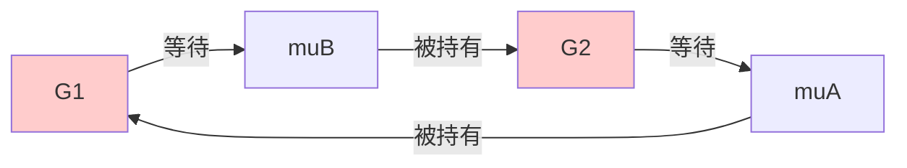
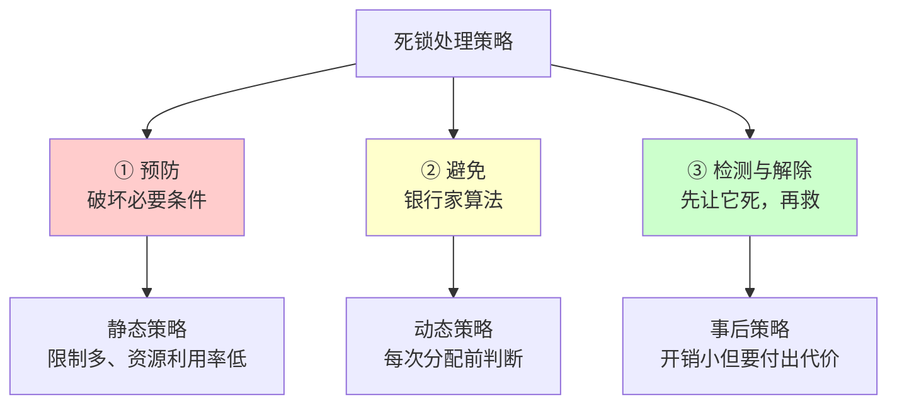
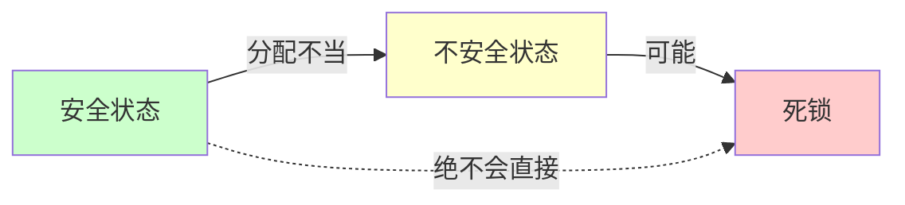
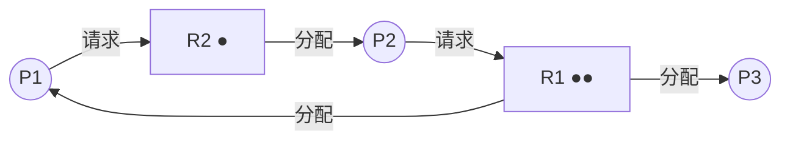
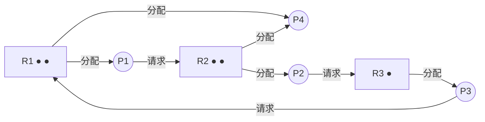
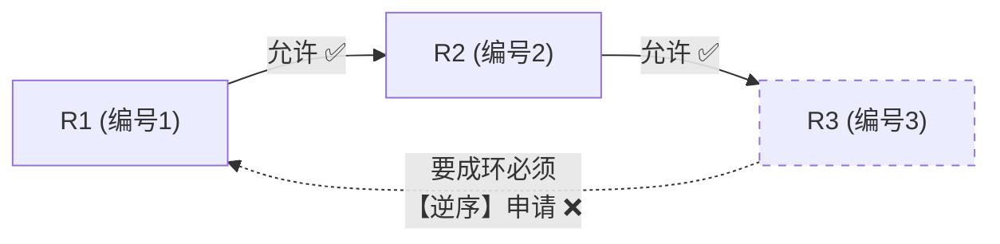

# 精通死锁：必要条件、银行家算法与资源分配图

> 课程编号：OS05
> 路线图来源：计算机基础四大件 · 操作系统（408 第 2 章死锁部分）
> 难度：⭐⭐⭐⭐
> 预计阅读时间：85 分钟
> 内容基准：2026 年 8 月（408 考纲操作系统第 2 章「死锁」）
> **代码语言：Go**。本章用 Go 复现死锁并用 `-race` / 死锁检测器观察。

---

## 引言：两把锁，四行代码，永久卡死

```go
package main

import (
    "fmt"
    "sync"
    "time"
)

func main() {
    var muA, muB sync.Mutex

    go func() { // goroutine 1
        muA.Lock()
        time.Sleep(10 * time.Millisecond) // 模拟做一点事
        muB.Lock() // ← 卡在这里
        fmt.Println("G1 拿到两把锁")
        muB.Unlock()
        muA.Unlock()
    }()

    go func() { // goroutine 2
        muB.Lock()
        time.Sleep(10 * time.Millisecond)
        muA.Lock() // ← 也卡在这里
        fmt.Println("G2 拿到两把锁")
        muA.Unlock()
        muB.Unlock()
    }()

    time.Sleep(time.Second)
    fmt.Println("主程序结束——但两个 goroutine 永远卡着")
}
```

**输出**：只有最后一行，两个 goroutine 的打印**永远不会出现**。

```
G1: 持有 muA，等 muB
G2: 持有 muB，等 muA
     ↓
互相等待，谁也不会先放手 → 【死锁】
```

这段代码有两个特别危险的地方：

**① 它不是每次都死锁。** 把 `time.Sleep` 去掉，大概率能正常跑完——因为 G1 往往在 G2 启动前就拿完了两把锁。**死锁是时序相关的**，可能在测试环境跑一万次都没事，上线后某个高负载的凌晨突然卡死。

**② 加锁顺序只差一个字。** G1 是 `A → B`，G2 是 `B → A`。把 G2 改成 `A → B`，死锁立刻消失。**这一个字的差别，就是[OS04](./OS04-精通-同步与互斥.md) 哲学家进餐问题里"先拿编号小的筷子"那条规则的全部含义。**

死锁与它的两个"近亲"经常被混淆：

| 现象 | 定义 | 能否自行解除 |
|---|---|---|
| **死锁（Deadlock）** | 多个进程**互相等待**对方持有的资源 | ❌ **永远不能**，必须外部干预 |
| **饥饿（Starvation）** | 某进程**长期得不到**资源（但别人在推进） | ✅ **理论上可能**（如优先级变化后） |
| **死循环（Infinite Loop）** | 程序逻辑错误，**一直在跑** | ❌ 但它**占着 CPU**，是 bug 不是资源问题 |

> ⚠️ **三者最关键的区别**：
> - **死锁**：涉及的进程**全部阻塞**，都不占 CPU，系统"安静地卡死"
> - **饥饿**：受害者阻塞，但**其他进程在正常推进**
> - **死循环**：进程**在运行**（占满 CPU），根本没被阻塞

本章讲清楚：死锁怎么产生（四个必要条件）、怎么防（预防 / 避免）、怎么查（检测）、怎么救（解除）。

读完你应该能：

- 默写死锁的四个必要条件，并判断某方案破坏了哪一条
- 对比死锁预防、避免、检测三种策略的代价与适用场景
- **熟练执行银行家算法**（408 必考大题）
- 用资源分配图化简法判断系统是否死锁
- 说清"安全状态"与"死锁"的关系

---

## 第一章 死锁的概念与必要条件

### 1.1 定义

**死锁**：多个进程因**竞争资源**而造成的一种**僵局**，若无外力作用，这些进程都将**永远无法向前推进**。

### 1.2 四个必要条件（必背）

**必须同时满足这四条，才可能发生死锁。**

| 条件 | 含义 | 引言例子中的体现 |
|---|---|---|
| **① 互斥** | 资源**一次只能被一个进程占用** | `sync.Mutex` 本身就是互斥的 |
| **② 请求并保持**（占有并等待） | 进程**已持有至少一个资源**，又**请求新资源**而阻塞时，**不释放已有的** | G1 持有 muA 的同时申请 muB |
| **③ 不可剥夺**（不可抢占） | 资源**只能由持有者主动释放**，不能被强行夺走 | 没人能从 G1 手里抢走 muA |
| **④ 循环等待** | 存在一个**进程-资源的环形等待链** | G1→muB→G2→muA→G1 |



> ⚠️ **"必要条件"不是"充分条件"**——四条都满足**不一定**死锁（可能刚好错开了时序）。但**只要破坏任意一条，就一定不会死锁**。这正是"死锁预防"的理论基础。

### 1.3 循环等待 vs 死锁

**这是最容易错的一点。**

> **循环等待是死锁的必要条件，但有循环等待不一定死锁。**

**反例**：

```
系统有 2 台打印机。
P1 持有打印机1，等打印机2
P2 持有打印机2，等打印机1
P3 持有打印机... 等等，只有 2 台，那确实死锁了。

换个例子：系统有 3 台打印机（同类资源）
P1 持有 1 台，还要 1 台
P2 持有 1 台，还要 1 台  
P3 持有 1 台，用完就还

→ 资源分配图上可能画出环，但 P3 完成后释放，P1 或 P2 就能推进
→ 【有环但不死锁】✅
```

**规律**：

| 情况 | 有环 ⟹ 死锁？ |
|---|---|
| **每类资源只有 1 个实例** | ✅ **有环必死锁** |
| **某类资源有多个实例** | ❌ **有环不一定死锁**（要用化简法判断） |

---

## 第二章 三种处理策略



| 策略 | 何时干预 | 资源利用率 | 系统开销 | 实现难度 |
|---|---|---|---|---|
| **预防** | **分配前就限制** | **低** | 小 | 简单 |
| **避免** | **每次分配时判断** | 中 | **大** | 中 |
| **检测与解除** | **事后** | **高** | 中 | 复杂 |
| **鸵鸟策略** | **不管** | 最高 | 0 | —— |

> 💡 **现代通用操作系统（Linux、Windows）基本采用"鸵鸟策略"**——假装看不见。因为死锁在实践中不常见，而预防/避免的开销太大。**数据库系统**则普遍采用**检测与解除**（发现死锁就回滚一个事务）。

---

## 第三章 死锁预防

**思路：破坏四个必要条件中的任意一个。**

### 3.1 破坏"互斥"

把独占资源改造成**可共享**的。

**例**：用 **SPOOLing 技术**把打印机改造成共享设备——进程的输出先写到磁盘的输出井，由专门的守护进程排队打印。**进程感觉自己独占了打印机，实际是共享的。**

> ⚠️ **局限性大**：很多资源**天生互斥**（打印机的物理打印过程、互斥锁保护的临界区），无法共享。**这条通常不可行。**

### 3.2 破坏"请求并保持"

**静态分配法**：进程**运行前一次性申请全部所需资源**，全部满足才开始运行；运行期间不再申请。

- ✅ 简单、绝对不死锁
- ❌ **资源利用率极低**——一个进程可能只在最后 5 分钟需要打印机，却要从头占到尾
- ❌ **可能饥饿**——需要资源多的进程可能永远凑不齐

### 3.3 破坏"不可剥夺"

两种做法：

| 做法 | 说明 |
|---|---|
| **主动释放** | 进程申请新资源被拒绝时，**主动释放已持有的全部资源**，之后重新申请 |
| **强行剥夺** | OS 从优先级低的进程手中**强行夺走**资源 |

- ❌ **实现复杂**——被剥夺的资源要能保存和恢复现场（打印机打到一半被抢走怎么办？）
- ❌ **可能造成前功尽弃**，反复申请释放导致系统开销大
- ❌ **可能饥饿**

**适用**：**状态易保存和恢复**的资源，如 CPU（时间片轮转就是在"剥夺 CPU"）、内存（换出到磁盘）。

### 3.4 破坏"循环等待" ⭐

**顺序资源分配法**：给所有资源**统一编号**，规定**进程必须按编号递增的顺序申请**。

**为什么能破坏环**：

```
若存在环 P1 → R_a → P2 → R_b → ... → Pn → R_z → P1

按规则：P1 持有 R_a 才能申请 R_b，说明 编号(R_a) < 编号(R_b)
       P2 持有 R_b 才能申请 R_c，说明 编号(R_b) < 编号(R_c)
       ...
       Pn 持有 R_z 才能申请 R_a，说明 编号(R_z) < 编号(R_a)

推出：编号(R_a) < 编号(R_b) < ... < 编号(R_z) < 编号(R_a)
     ↓
   编号(R_a) < 编号(R_a)   【矛盾！】
     ↓
   【环不可能存在】✅
```

- ✅ **资源利用率和系统吞吐量都比前两种高**
- ✅ **工程上最常用**（Linux 内核的锁排序规则、数据库的索引加锁顺序）
- ❌ 编号必须相对稳定，新增设备麻烦
- ❌ 可能造成**资源浪费**（提前申请编号小的资源）
- ❌ 用户编程麻烦（必须按序申请）

**回到引言的例子**：

```go
// ❌ 死锁版本
go func() { muA.Lock(); muB.Lock(); ... }()   // A → B
go func() { muB.Lock(); muA.Lock(); ... }()   // B → A  ← 顺序不同

// ✅ 修复：统一加锁顺序
go func() { muA.Lock(); muB.Lock(); ... }()   // A → B
go func() { muA.Lock(); muB.Lock(); ... }()   // A → B  ← 顺序一致
```

> 💡 **"永远按同一顺序加锁"是并发编程的第一条铁律**。工程上的做法是给锁定义全局顺序（如按地址排序、按名称字典序），并在代码 review 中强制检查。

### 3.5 四种预防方法对比

| 破坏的条件 | 方法 | 可行性 | 资源利用率 | 主要问题 |
|---|---|---|---|---|
| 互斥 | SPOOLing | **低**（很多资源天生互斥） | —— | 不通用 |
| 请求并保持 | 静态分配 | 中 | **最低** | 严重浪费、可能饥饿 |
| 不可剥夺 | 释放/剥夺 | 中 | 中 | 实现复杂、前功尽弃 |
| **循环等待** | **顺序分配** | **高** ⭐ | **较高** | 编程麻烦、编号难改 |

---

## 第四章 死锁避免：银行家算法

**思路：不限制申请方式，但在**每次分配前**判断"这次分配会不会导致系统进入不安全状态"。**

### 4.1 安全状态与安全序列

**安全序列**：一个进程序列 $\langle P_1, P_2, \ldots, P_n \rangle$，若对每个 $P_i$，它还需要的资源都能由"当前可用资源 + 前面所有进程释放的资源"满足，则称该序列是安全序列。

**安全状态**：系统**能找出至少一个安全序列**的状态。



> ⚠️ **三者关系（高频考点）**：
>
> - **安全状态 → 一定不死锁** ✅
> - **不安全状态 → 【可能】死锁，不一定死锁** ⚠️
> - **死锁状态 → 一定是不安全状态** ✅
>
> **银行家算法的策略是保守的：只要一次分配会导致进入不安全状态，就拒绝，哪怕它实际上不会死锁。** 这就是"避免"的代价。

### 4.2 数据结构

设 n 个进程、m 类资源：

| 矩阵 | 维度 | 含义 |
|---|---|---|
| **Available** | $1 \times m$ | 系统**当前可用**的各类资源数 |
| **Max** | $n \times m$ | 每个进程对各类资源的**最大需求** |
| **Allocation** | $n \times m$ | 每个进程**已分配**到的资源 |
| **Need** | $n \times m$ | 每个进程**还需要**的资源 |

**核心关系**：

$$
\boxed{Need[i][j] = Max[i][j] - Allocation[i][j]}
$$

### 4.3 算法流程

**当进程 $P_i$ 提出请求向量 $Request_i$ 时**：

```
① 若 Request_i ≤ Need_i        → 继续；否则【出错】（超出最大需求声明）
② 若 Request_i ≤ Available     → 继续；否则【阻塞等待】（资源不够）
③ 【试探性分配】：
     Available   -= Request_i
     Allocation_i += Request_i
     Need_i      -= Request_i
④ 执行【安全性算法】：
     ├─ 系统安全 → 【正式分配】✅
     └─ 系统不安全 → 【撤销试探分配，进程等待】❌
```

### 4.4 安全性算法

```
① 初始化：Work = Available，Finish[i] = false（所有进程）

② 找一个满足下列条件的进程 i：
     Finish[i] == false  且  Need_i ≤ Work

③ 若找到：
     Work += Allocation_i    ★ 假设它执行完并归还所有资源
     Finish[i] = true
     记录进入安全序列
     回到 ②

④ 若找不到：
     ├─ 所有 Finish[i] == true → 【系统安全】，得到安全序列 ✅
     └─ 存在 Finish[i] == false → 【系统不安全】❌
```

### 4.5 完整例题（408 标准题型）

**系统有 5 个进程 P0~P4，3 类资源 A(10)、B(5)、C(7)。当前状态**：

| 进程 | Allocation (A B C) | Max (A B C) | **Need (A B C)** |
|---|---|---|---|
| P0 | 0 1 0 | 7 5 3 | **7 4 3** |
| P1 | 2 0 0 | 3 2 2 | **1 2 2** |
| P2 | 3 0 2 | 9 0 2 | **6 0 0** |
| P3 | 2 1 1 | 2 2 2 | **0 1 1** |
| P4 | 0 0 2 | 4 3 3 | **4 3 1** |

**Available 计算**：

```
已分配总和 = (0+2+3+2+0, 1+0+0+1+0, 0+0+2+1+2) = (7, 2, 5)
Available = 总资源 − 已分配 = (10,5,7) − (7,2,5) = (3, 3, 2)
```

---

#### 问题一：当前状态是否安全？

**执行安全性算法**：

```
Work = (3, 3, 2)，所有 Finish = false

【第 1 轮】逐个检查 Need ≤ Work？
  P0: Need(7,4,3) ≤ (3,3,2)? → 7>3 ❌
  P1: Need(1,2,2) ≤ (3,3,2)? → ✅ 选中 P1
      Work = (3,3,2) + Allocation₁(2,0,0) = (5, 3, 2)
      Finish[1] = true，序列：<P1>

【第 2 轮】Work = (5,3,2)
  P0: (7,4,3) ≤ (5,3,2)? → 7>5 ❌
  P2: (6,0,0) ≤ (5,3,2)? → 6>5 ❌
  P3: (0,1,1) ≤ (5,3,2)? → ✅ 选中 P3
      Work = (5,3,2) + (2,1,1) = (7, 4, 3)
      序列：<P1, P3>

【第 3 轮】Work = (7,4,3)
  P0: (7,4,3) ≤ (7,4,3)? → ✅ 选中 P0
      Work = (7,4,3) + (0,1,0) = (7, 5, 3)
      序列：<P1, P3, P0>

【第 4 轮】Work = (7,5,3)
  P2: (6,0,0) ≤ (7,5,3)? → ✅ 选中 P2
      Work = (7,5,3) + (3,0,2) = (10, 5, 5)
      序列：<P1, P3, P0, P2>

【第 5 轮】Work = (10,5,5)
  P4: (4,3,1) ≤ (10,5,5)? → ✅ 选中 P4
      Work = (10,5,5) + (0,0,2) = (10, 5, 7)
      序列：<P1, P3, P0, P2, P4>

所有 Finish = true → 【系统安全】✅
安全序列：<P1, P3, P0, P2, P4>
```

> 💡 **安全序列可能不唯一**。本例中 `<P1, P3, P4, P0, P2>` 等也是合法的。**408 答题时写出一个即可**，但要写清完整的推导过程。

---

#### 问题二：P1 请求 Request₁ = (1, 0, 2)，是否分配？

```
① Request₁(1,0,2) ≤ Need₁(1,2,2)?  → ✅ 通过
② Request₁(1,0,2) ≤ Available(3,3,2)? → ✅ 通过

③ 试探性分配：
   Available   = (3,3,2) − (1,0,2) = (2, 3, 0)
   Allocation₁ = (2,0,0) + (1,0,2) = (3, 0, 2)
   Need₁       = (1,2,2) − (1,0,2) = (0, 2, 0)

④ 安全性检查：Work = (2,3,0)
   P0: Need(7,4,3) ≤ (2,3,0)? ❌
   P1: Need(0,2,0) ≤ (2,3,0)? ✅ 选中
       Work = (2,3,0) + (3,0,2) = (5, 3, 2)
   P2: Need(6,0,0) ≤ (5,3,2)? ❌ (6>5)
   P3: Need(0,1,1) ≤ (5,3,2)? ✅ 选中
       Work = (5,3,2) + (2,1,1) = (7, 4, 3)
   P0: Need(7,4,3) ≤ (7,4,3)? ✅ 选中
       Work = (7,4,3) + (0,1,0) = (7, 5, 3)
   P2: Need(6,0,0) ≤ (7,5,3)? ✅ 选中
       Work = (7,5,3) + (3,0,2) = (10, 5, 5)
   P4: Need(4,3,1) ≤ (10,5,5)? ✅ 选中
       Work = (10,5,7)

   全部 Finish = true → 【安全】✅
   安全序列：<P1, P3, P0, P2, P4>

⑤ 结论：【可以分配】✅
```

---

#### 问题三：接着 P4 请求 Request₄ = (3, 3, 0)，是否分配？

```
① Request₄(3,3,0) ≤ Need₄(4,3,1)? → ✅
② Request₄(3,3,0) ≤ Available(2,3,0)? → 3 > 2 ❌

结论：【Available 不足，P4 必须等待】
     （连试探分配都不用做）
```

---

#### 问题四：接着 P0 请求 Request₀ = (0, 2, 0)，是否分配？

```
① Request₀(0,2,0) ≤ Need₀(7,4,3)? → ✅
② Request₀(0,2,0) ≤ Available(2,3,0)? → ✅

③ 试探分配：
   Available   = (2,3,0) − (0,2,0) = (2, 1, 0)
   Allocation₀ = (0,1,0) + (0,2,0) = (0, 3, 0)
   Need₀       = (7,4,3) − (0,2,0) = (7, 2, 3)

④ 安全性检查：Work = (2,1,0)
   P0: Need(7,2,3) ≤ (2,1,0)? ❌
   P1: Need(0,2,0) ≤ (2,1,0)? → 2>1 ❌
   P2: Need(6,0,0) ≤ (2,1,0)? ❌
   P3: Need(0,1,1) ≤ (2,1,0)? → 1>0 ❌
   P4: Need(4,3,1) ≤ (2,1,0)? ❌
   
   【找不到任何可执行的进程】→ 系统【不安全】❌

⑤ 结论：【不能分配】，撤销试探，P0 阻塞等待
```

> ⚠️ **注意第四问的关键**：Available 是够的（(0,2,0) ≤ (2,3,0)），但分配后系统会进入**不安全状态**——**银行家算法宁可拒绝也不冒险**。这正是"避免"策略保守性的体现。

### 4.6 用 Go 实现银行家算法

```go
package main

import "fmt"

type Banker struct {
    n, m       int
    Available  []int
    Max        [][]int
    Allocation [][]int
    Need       [][]int
}

func lessOrEqual(a, b []int) bool {
    for i := range a {
        if a[i] > b[i] {
            return false
        }
    }
    return true
}

// 安全性算法：返回是否安全 + 安全序列
func (bk *Banker) isSafe() (bool, []int) {
    work := append([]int(nil), bk.Available...)
    finish := make([]bool, bk.n)
    var seq []int

    for len(seq) < bk.n {
        found := false
        for i := 0; i < bk.n; i++ {
            if !finish[i] && lessOrEqual(bk.Need[i], work) {
                for j := 0; j < bk.m; j++ {
                    work[j] += bk.Allocation[i][j] // ★ 假设它执行完归还资源
                }
                finish[i] = true
                seq = append(seq, i)
                found = true
                break
            }
        }
        if !found {
            return false, nil // 找不到可执行的进程 → 不安全
        }
    }
    return true, seq
}

// 处理进程 pid 的资源请求
func (bk *Banker) Request(pid int, req []int) bool {
    if !lessOrEqual(req, bk.Need[pid]) {
        fmt.Printf("P%d 请求 %v：超出最大需求声明，出错\n", pid, req)
        return false
    }
    if !lessOrEqual(req, bk.Available) {
        fmt.Printf("P%d 请求 %v：Available %v 不足，等待\n", pid, req, bk.Available)
        return false
    }

    // ★ 试探性分配
    for j := 0; j < bk.m; j++ {
        bk.Available[j] -= req[j]
        bk.Allocation[pid][j] += req[j]
        bk.Need[pid][j] -= req[j]
    }

    if safe, seq := bk.isSafe(); safe {
        fmt.Printf("P%d 请求 %v：允许 ✅ 安全序列 ", pid, req)
        for _, p := range seq {
            fmt.Printf("P%d ", p)
        }
        fmt.Println()
        return true
    }

    // ★ 不安全 → 回滚
    for j := 0; j < bk.m; j++ {
        bk.Available[j] += req[j]
        bk.Allocation[pid][j] -= req[j]
        bk.Need[pid][j] += req[j]
    }
    fmt.Printf("P%d 请求 %v：拒绝 ❌ 会进入不安全状态\n", pid, req)
    return false
}

func main() {
    bk := &Banker{
        n: 5, m: 3,
        Available:  []int{3, 3, 2},
        Allocation: [][]int{{0,1,0}, {2,0,0}, {3,0,2}, {2,1,1}, {0,0,2}},
        Need:       [][]int{{7,4,3}, {1,2,2}, {6,0,0}, {0,1,1}, {4,3,1}},
    }

    if safe, seq := bk.isSafe(); safe {
        fmt.Print("初始状态安全 ✅ 安全序列 ")
        for _, p := range seq {
            fmt.Printf("P%d ", p)
        }
        fmt.Println()
    }

    bk.Request(1, []int{1, 0, 2}) // 问题二
    bk.Request(4, []int{3, 3, 0}) // 问题三
    bk.Request(0, []int{0, 2, 0}) // 问题四
}
```

**输出**（与手算完全一致）：

```
初始状态安全 ✅ 安全序列 P1 P3 P0 P2 P4
P1 请求 [1 0 2]：允许 ✅ 安全序列 P1 P3 P0 P2 P4
P4 请求 [3 3 0]：Available [2 3 0] 不足，等待
P0 请求 [0 2 0]：拒绝 ❌ 会进入不安全状态
```

---

## 第五章 死锁检测与解除

**思路：不预防也不避免，让死锁发生，然后检测出来再处理。**

### 5.1 资源分配图

用**二分图**表示进程与资源的关系：

| 元素 | 表示 |
|---|---|
| **进程结点** | 圆圈 ○ |
| **资源结点** | 方框 □，框内的点表示**资源实例数** |
| **请求边** | 进程 → 资源（Pi 请求 Rj） |
| **分配边** | 资源 → 进程（Rj 已分配给 Pi） |



### 5.2 死锁检测算法（资源分配图化简法）

**化简步骤**：

```
① 找一个【既不阻塞又非孤立】的进程结点 Pi
     （即 Pi 请求的资源都能被满足）
② 消去 Pi 的【所有边】（请求边和分配边），使 Pi 成为【孤立结点】
     ★ 相当于假设 Pi 执行完毕，归还全部资源
③ 归还的资源可能让其他进程变得"不阻塞" → 回到 ①
④ 直到无法继续化简
```

**死锁定理**：

> **当且仅当资源分配图【不可完全化简】时，系统处于死锁状态。**
>
> （"完全化简" = 所有进程结点都变成了孤立结点）

### 5.3 化简实例

**例**：3 类资源 R1(2个)、R2(1个)、R3(1个)，进程 P1、P2、P3

```
当前状态：
  P1: 持有 R1 一个，请求 R2
  P2: 持有 R2，请求 R3
  P3: 持有 R3 和 R1 一个，无请求
```

**化简过程**：

```
【第 1 步】找不阻塞的进程
  P1 请求 R2 → R2 已被 P2 占用，R2 只有 1 个 → 【阻塞】
  P2 请求 R3 → R3 已被 P3 占用 → 【阻塞】
  P3 【无请求】→ 不阻塞 ✅ 选中 P3

【第 2 步】消去 P3 的所有边
  P3 归还 R3 和 1 个 R1
  现在 R3 空闲 1 个，R1 空闲 2 个

【第 3 步】重新找
  P2 请求 R3 → 现在 R3 空闲 ✅ 选中 P2
  消去 P2 的边，P2 归还 R2

【第 4 步】
  P1 请求 R2 → 现在 R2 空闲 ✅ 选中 P1
  消去 P1 的边

所有进程都成为孤立结点 → 【可完全化简】→ 【无死锁】✅
```

**若把 P3 改成"请求 R1 的第 2 个实例"**（而 R1 的两个实例都已分出去）：

```
P1 阻塞（等 R2）
P2 阻塞（等 R3）
P3 阻塞（等 R1）
→ 找不到任何不阻塞的进程 → 【不可化简】→ 【死锁】❌
涉及死锁的进程：{P1, P2, P3}
```

> 💡 **化简法的本质就是安全性算法**——都是"假设某进程能完成 → 归还资源 → 看能否带动其他进程"。两者是同一个思想的不同表述。

### 5.4 死锁解除

| 方法 | 做法 | 代价 |
|---|---|---|
| **① 资源剥夺法** | 挂起某些死锁进程，**抢走**它们的资源分给别人 | 被挂起的进程要能保存/恢复现场；可能饥饿 |
| **② 撤销进程法**（终止） | **强行杀掉**部分或全部死锁进程 | **简单粗暴**，前功尽弃 |
| **③ 进程回退法** | 让进程**回退到足以避开死锁**的检查点 | 需要**记录历史信息、设置还原点**，开销大 |

**选择"牺牲品"的原则**（撤销代价最小）：

- 进程**优先级**低的
- **已运行时间短**的（损失小）
- 已**占用资源少**的
- 剩余**执行时间长**的
- **交互式**进程优先保留（用户在等）

> 💡 **数据库的做法**：MySQL InnoDB 检测到死锁时，会**回滚"权重最小"的那个事务**（修改行数最少的），并返回 `ERROR 1213 (40001): Deadlock found`。应用层需要**捕获这个错误并重试**。

---

## 第六章 用 Go 观察死锁

### 6.1 Go 运行时的死锁检测

Go 运行时能检测**全局死锁**（所有 goroutine 都阻塞）：

```go
package main

import "sync"

func main() {
    var mu sync.Mutex
    mu.Lock()
    mu.Lock() // ★ 同一个 goroutine 重复加锁 —— Mutex 不可重入
}
```

**输出**：

```
fatal error: all goroutines are asleep - deadlock!

goroutine 1 [sync.Mutex.Lock]:
sync.(*Mutex).Lock(...)
main.main()
	/tmp/main.go:8 +0x45
```

> ⚠️ **`sync.Mutex` 不可重入**！C++ 的 `std::recursive_mutex`、Java 的 `ReentrantLock` 可以重复加锁，**Go 的 Mutex 不行**。这是 Go 的刻意设计——鼓励你重新审视代码结构，而不是靠可重入锁掩盖设计问题。

**但 Go 的检测器有严格局限**：

```go
func main() {
    var muA, muB sync.Mutex
    go func() { muA.Lock(); time.Sleep(time.Millisecond); muB.Lock() }()
    go func() { muB.Lock(); time.Sleep(time.Millisecond); muA.Lock() }()
    
    select {} // ★ 主 goroutine 也永久阻塞，才能触发检测
}
```

> ⚠️ **Go 只在"所有 goroutine 都阻塞"时才报 deadlock**。若主 goroutine 还在跑（比如引言的例子里主协程在 `time.Sleep`），**运行时不会报错**——死锁的两个 goroutine 会静静地泄漏掉。**这是真实生产环境中最常见的情形。**

### 6.2 排查手段

```bash
# ① 竞态检测（找数据竞争，不是死锁）
go run -race main.go

# ② 运行中 dump 所有 goroutine 栈（最有效的死锁排查手段）
kill -QUIT <pid>          # 或程序里注册 SIGQUIT

# ③ 通过 pprof 在线查看
import _ "net/http/pprof"
# 然后访问 http://localhost:6060/debug/pprof/goroutine?debug=2
```

**goroutine dump 里的死锁特征**：

```
goroutine 6 [sync.Mutex.Lock, 5 minutes]:     ← 阻塞了 5 分钟！
sync.(*Mutex).Lock(...)
main.main.func1()

goroutine 7 [sync.Mutex.Lock, 5 minutes]:     ← 同样阻塞很久
sync.(*Mutex).Lock(...)
main.main.func2()
```

> 💡 **`[sync.Mutex.Lock, N minutes]` 里的时间是关键线索**。正常的锁竞争是微秒级的；**阻塞几分钟以上基本可以断定是死锁或严重的锁竞争**。

### 6.3 工程上的防御手段

```go
// ① 统一加锁顺序（破坏循环等待）—— 最有效
type Account struct {
    id int
    mu sync.Mutex
    balance int
}

func Transfer(from, to *Account, amount int) {
    // ★ 永远按 id 从小到大加锁
    first, second := from, to
    if from.id > to.id {
        first, second = to, from
    }
    first.mu.Lock()
    defer first.mu.Unlock()
    second.mu.Lock()
    defer second.mu.Unlock()

    from.balance -= amount
    to.balance += amount
}

// ② 带超时的加锁（破坏"不可剥夺"）
func TryLock(mu *sync.Mutex, timeout time.Duration) bool {
    if mu.TryLock() { // Go 1.18+
        return true
    }
    deadline := time.Now().Add(timeout)
    for time.Now().Before(deadline) {
        time.Sleep(time.Millisecond)
        if mu.TryLock() {
            return true
        }
    }
    return false // 超时放弃，释放已持有的资源后重试
}
```

> ⭐ **方法 ① 是转账场景的标准解法**。若不排序，`Transfer(A, B)` 和 `Transfer(B, A)` 并发时必然死锁——这正是引言那个例子的现实版本，也是银行系统的经典 bug。

---

## 第七章 408 高频考点与陷阱清单

### 7.1 考点分布

死锁通常是 **1-2 道选择题 + 高概率的大题（银行家算法）**。

最常考：

1. **银行家算法的完整执行**（大题必考）
2. 四个必要条件的判断
3. 安全状态 / 不安全状态 / 死锁的关系
4. 资源分配图化简
5. 死锁预防各方法破坏的是哪个条件

### 7.2 十六个陷阱

**陷阱 1：死锁和饥饿是一回事**

**错**。**死锁**是互相等待、**永远无法解除**、涉及进程**全部阻塞**；**饥饿**是某进程长期得不到资源，但**其他进程在正常推进**，理论上可能自行解除。

**陷阱 2：死循环也是死锁**

**错**。死循环的进程**在运行**（占满 CPU），根本没被阻塞；死锁的进程**全部阻塞**，不占 CPU。

**陷阱 3：四个必要条件满足就一定死锁**

**错**。它们是**必要条件**不是充分条件。四条都满足只是"可能死锁"；**破坏任意一条则一定不死锁**。

**陷阱 4：资源分配图中出现环就一定死锁**

**错，要看资源实例数**：

| 情况 | 有环 ⟹ 死锁？ |
|---|---|
| 每类资源**只有 1 个**实例 | ✅ 必死锁 |
| 某类资源有**多个**实例 | ❌ **不一定**，要用化简法判断 |

**陷阱 5：不安全状态就是死锁状态**

**错**。**不安全状态只是"可能"死锁**，不一定死锁。而**死锁状态一定是不安全状态**。

**陷阱 6：安全状态可能死锁**

**错**。**安全状态一定不会死锁**——因为存在安全序列，按序执行即可。

**陷阱 7：银行家算法能保证资源利用率最高**

**错**。银行家算法**很保守**——只要可能不安全就拒绝，即使实际不会死锁。**资源利用率不如"检测与解除"策略**。

**陷阱 8：Need = Max + Allocation**

**错，是减法**：$Need = Max - Allocation$。

**陷阱 9：安全序列是唯一的**

**错**。一个安全状态可能有**多个**安全序列，写出一个即可。

**陷阱 10：Request ≤ Available 就可以分配**

**错**。这只是**第二步检查**。还必须做**试探分配 + 安全性检查**，安全才能真正分配。

**陷阱 11：SPOOLing 技术破坏的是"请求并保持"**

**错，破坏的是"互斥"**——它把独占的打印机变成了逻辑上可共享的设备。

**陷阱 12：静态分配法破坏的是"循环等待"**

**错，破坏的是"请求并保持"**——一次性申请全部资源，运行中不再申请。

**陷阱 13：顺序资源分配法破坏的是"不可剥夺"**

**错，破坏的是"循环等待"**——按编号递增申请，逻辑上不可能形成环。

**陷阱 14：死锁检测算法开销很小，可以频繁执行**

**不准确**。检测算法的复杂度与进程数和资源类数相关，**频繁执行开销大**。实际系统通常在"CPU 利用率异常低"或"定时"时才检测。

**陷阱 15：Go 的运行时能检测所有死锁**

**错**。Go **只在"所有 goroutine 都阻塞"时才报 deadlock**。若有任何一个 goroutine 还在运行（哪怕是在 `time.Sleep`），运行时**不会报错**，死锁的 goroutine 会静默泄漏。

**陷阱 16：sync.Mutex 是可重入的**

**错**。**Go 的 `sync.Mutex` 不可重入**，同一个 goroutine 重复 `Lock()` 会立即死锁。

### 7.3 速查卡

```
【四个必要条件】
① 互斥        ② 请求并保持（占有并等待）
③ 不可剥夺    ④ 循环等待
必要非充分：破坏任一条 ⟹ 一定不死锁

【死锁 / 饥饿 / 死循环】
死锁  ：互相等待，全部阻塞，【不能自解】
饥饿  ：长期得不到资源，【别人在推进】
死循环：在【运行】，占满 CPU，不阻塞

【三种策略】
预防：破坏必要条件，资源利用率【低】
避免：银行家算法，每次分配前判断，开销【大】
检测解除：事后处理，利用率【高】

【预防方法 → 破坏的条件】
SPOOLing        → 破坏【互斥】（可行性低）
静态分配        → 破坏【请求并保持】（利用率最低）
释放/剥夺       → 破坏【不可剥夺】（实现复杂）
顺序资源分配 ⭐ → 破坏【循环等待】（最实用）

【三态关系】
安全状态   ⟹ 一定不死锁 ✅
不安全状态 ⟹ 【可能】死锁（不一定）
死锁状态   ⟹ 一定不安全 ✅

【银行家算法】
Need = Max − Allocation
Available = 总资源 − Σ Allocation

请求处理四步：
① Request ≤ Need?      否 → 出错
② Request ≤ Available? 否 → 等待
③ 【试探分配】
④ 安全性算法 → 安全则分配，否则【回滚 + 等待】

安全性算法：
Work = Available；找 Need_i ≤ Work 的进程
找到 → Work += Allocation_i，标记 Finish，继续
全部 Finish → 安全；否则不安全

【死锁定理】
当且仅当资源分配图【不可完全化简】时，系统死锁
```

---

## 第八章 Go ↔ C 对照

| 场景 | C / POSIX | Go | 说明 |
|---|---|---|---|
| 互斥锁 | `pthread_mutex_t` | `sync.Mutex` | **Go 不可重入**，pthread 可配置为可重入 |
| 可重入锁 | `PTHREAD_MUTEX_RECURSIVE` | **无** | Go 刻意不提供 |
| 尝试加锁 | `pthread_mutex_trylock` | **`mu.TryLock()`**（Go 1.18+） | 用于实现超时退避 |
| 带超时加锁 | `pthread_mutex_timedlock` | 无内建，需自行封装 | |
| 死锁检测 | 无（靠工具如 helgrind） | **运行时部分检测**（全局阻塞时） | Go 的检测有严格局限 |
| 竞态检测 | `valgrind --tool=helgrind` | **`go run -race`** | Go 的更易用 |
| 查看阻塞栈 | `gdb` + `thread apply all bt` | **`kill -QUIT`** 或 pprof | Go 更方便 |

```go
// Go 1.18+ 的 TryLock，用来实现"破坏不可剥夺"
func transferWithRetry(from, to *Account, amount int) error {
    for attempt := 0; attempt < 3; attempt++ {
        if !from.mu.TryLock() {
            time.Sleep(time.Duration(rand.Intn(10)) * time.Millisecond) // ★ 随机退避
            continue
        }
        if !to.mu.TryLock() {
            from.mu.Unlock()   // ★ 拿不到第二把就【释放第一把】—— 破坏"请求并保持"
            time.Sleep(time.Duration(rand.Intn(10)) * time.Millisecond)
            continue
        }
        from.balance -= amount
        to.balance += amount
        to.mu.Unlock()
        from.mu.Unlock()
        return nil
    }
    return errors.New("转账失败：锁竞争过于激烈")
}
```

> 💡 **这段代码同时破坏了两个必要条件**：
> - `from.mu.Unlock()` 在拿不到第二把锁时释放第一把 → 破坏**请求并保持**
> - 随机退避避免了活锁（两个进程同步重试导致反复冲突）
>
> **但它比"统一加锁顺序"复杂得多，且有失败重试的成本**。工程上**优先选顺序加锁**，只在无法确定全局顺序时才用这种方案。

---

## 第九章 练习题

### 选择题

**1.** 下列**不属于**死锁必要条件的是：
A. 互斥　B. 请求并保持　C. 可剥夺　D. 循环等待

**2.** 关于死锁、饥饿和死循环，**正确**的是：
A. 三者都会导致进程阻塞
B. 死锁的进程都处于阻塞状态，死循环的进程在运行
C. 饥饿一定会发展成死锁
D. 死循环可以通过资源分配解决

**3.** 破坏"循环等待"条件的方法是：
A. SPOOLing 技术
B. 静态分配法（一次性申请全部资源）
C. 资源剥夺法
D. 顺序资源分配法

**4.** 静态分配法（进程运行前一次性申请全部资源）破坏的是：
A. 互斥　B. 请求并保持　C. 不可剥夺　D. 循环等待

**5.** 关于安全状态与死锁，**正确**的是：
A. 不安全状态一定死锁
B. 安全状态可能死锁
C. 死锁状态一定是不安全状态
D. 安全状态和不安全状态都可能死锁

**6.** 银行家算法中，Need 矩阵的计算方式是：
A. Max + Allocation
B. Max − Allocation
C. Available − Allocation
D. Max − Available

**7.** 进程 P 提出资源请求 Request，若 Request ≤ Available 但试探分配后系统不安全，则：
A. 立即分配
B. 拒绝分配，P 等待
C. 撤销进程 P
D. 分配部分资源

**8.** 若某类资源只有一个实例，则资源分配图中出现环：
A. 一定死锁　B. 一定不死锁　C. 可能死锁　D. 无法判断

**9.** 死锁检测中，"资源分配图可完全化简"意味着：
A. 系统处于死锁状态
B. 系统未处于死锁状态
C. 系统处于不安全状态
D. 无法判断

**10.** 现代通用操作系统（如 Linux）对死锁通常采用的策略是：
A. 死锁预防　B. 银行家算法　C. 死锁检测与解除　D. 忽略（鸵鸟策略）

### 应用题

**11.** 系统有 5 个进程 P0~P4，4 类资源 A(6)、B(3)、C(4)、D(2)。当前分配状态如下：

| 进程 | Allocation (A B C D) | Max (A B C D) |
|---|---|---|
| P0 | 3 0 1 1 | 4 1 1 1 |
| P1 | 0 1 0 0 | 0 2 1 2 |
| P2 | 1 1 1 0 | 4 2 1 0 |
| P3 | 1 1 0 1 | 1 1 1 1 |
| P4 | 0 0 0 0 | 2 1 1 0 |

（1）求 Need 矩阵和 Available 向量。
（2）判断当前状态是否安全，若安全给出一个安全序列。
（3）若 P2 提出请求 Request₂ = (1, 0, 0, 0)，能否分配？写出完整判断过程。
（4）在（3）的基础上，若 P1 提出请求 Request₁ = (0, 1, 0, 1)，能否分配？

**12.** 某系统有 3 类资源 R1(2个)、R2(2个)、R3(1个)，4 个进程 P1~P4，当前状态：

```
P1: 持有 R1×1，请求 R2×1
P2: 持有 R2×1，请求 R3×1
P3: 持有 R3×1，请求 R1×1
P4: 持有 R1×1 和 R2×1，无请求
```

（1）画出资源分配图。
（2）用化简法判断系统是否死锁。若死锁，指出涉及的进程。
（3）若把 P4 改为"请求 R3×1"，重新判断。

**13.** 分析下面的 Go 代码是否会死锁。若会，指出满足了哪四个必要条件，并给出**两种**不同的修复方案（分别破坏不同的条件）。

```go
type Resource struct {
    name string
    mu   sync.Mutex
}

func process(r1, r2 *Resource) {
    r1.mu.Lock()
    defer r1.mu.Unlock()
    time.Sleep(time.Millisecond)
    r2.mu.Lock()
    defer r2.mu.Unlock()
    fmt.Println("处理", r1.name, r2.name)
}

func main() {
    a := &Resource{name: "A"}
    b := &Resource{name: "B"}
    go process(a, b)
    go process(b, a)
    time.Sleep(time.Second)
}
```

**14.** 对比死锁的三种处理策略（预防、避免、检测与解除），从**四个维度**分析，并说明为什么：

（1）通用操作系统多采用"鸵鸟策略"
（2）数据库系统多采用"检测与解除"
（3）实时/嵌入式系统可能采用"预防"

**15.** 解释为什么"顺序资源分配法"能够破坏循环等待条件。用反证法给出严格证明。

### 答案与解析

<details>
<summary>点击展开</summary>

**1. C**

四个必要条件是：**互斥、请求并保持、不可剥夺、循环等待**。

C 说的是"**可**剥夺"——恰恰相反，必要条件是"**不可**剥夺"。若资源可以被剥夺，死锁就能通过强行抢夺资源解除。

**2. B**

| 现象 | 进程状态 | 占用 CPU | 能否自解 |
|---|---|---|---|
| **死锁** | **全部阻塞** | ❌ | ❌ 永远不能 |
| **饥饿** | 受害者阻塞，**其他进程在推进** | ❌（受害者） | ✅ 理论上可能 |
| **死循环** | **在运行** | ✅ **占满** | ❌（但不是资源问题） |

A 错——死循环的进程**不阻塞**，它在满负荷运行。
C 错——饥饿和死锁是不同的现象，饥饿不会"发展成"死锁。
D 错——死循环是**程序逻辑 bug**，与资源分配无关。

**3. D**

**顺序资源分配法**：给资源统一编号，规定必须**按编号递增顺序申请** → 逻辑上不可能形成环（证明见第 15 题）。

其余选项破坏的条件：

| 方法 | 破坏的条件 |
|---|---|
| SPOOLing | **互斥** |
| 静态分配法 | **请求并保持** |
| 资源剥夺法 | **不可剥夺** |
| **顺序资源分配法** | **循环等待** |

**4. B**

静态分配法要求进程**运行前一次性申请全部资源**，运行期间**不再申请新资源**——这就消除了"已持有资源的同时请求新资源"的情形，即破坏**请求并保持**。

**5. C**

三者关系：

```
安全状态   ──→ 一定不死锁 ✅
不安全状态 ──→ 【可能】死锁（不一定）
死锁状态   ──→ 一定是不安全状态 ✅
```

A 错——不安全**只是"可能"**死锁。
B 错——安全状态**一定不会**死锁（存在安全序列）。
D 错——安全状态不会死锁。

**6. B**

$$
Need = Max - Allocation
$$

含义：**还需要多少 = 最多需要多少 − 已经拿到多少**。

**7. B**

银行家算法的第四步：**试探分配后若系统不安全，必须撤销试探分配，让进程等待**。

这体现了"避免"策略的**保守性**——宁可拒绝一个实际上安全的请求，也不冒进入不安全状态的风险。

**8. A**

| 资源实例数 | 有环 ⟹ 死锁？ |
|---|---|
| **每类只有 1 个** | ✅ **一定死锁** |
| 某类有**多个** | ❌ 不一定，需化简判断 |

原因：单实例时，环上每个进程等待的资源都**唯一地**被环上的下一个进程持有，无人能推进。多实例时，环外可能还有该类资源的其他实例可用。

**9. B**

**死锁定理**：**当且仅当资源分配图不可完全化简时，系统处于死锁状态。**

所以"**可**完全化简" ⟹ **未死锁**。

**10. D**

**现代通用操作系统（Linux、Windows）基本采用"鸵鸟策略"**——假装看不见。

原因：

- 死锁在通用系统中**不常见**（应用层的锁死锁由应用自己负责）
- 预防/避免的**开销太大**，会显著降低资源利用率和系统性能
- 真出了问题，用户重启进程即可

**11.**

**（1）Need 矩阵与 Available**

$Need = Max - Allocation$：

| 进程 | Allocation | Max | **Need** |
|---|---|---|---|
| P0 | 3 0 1 1 | 4 1 1 1 | **1 1 0 0** |
| P1 | 0 1 0 0 | 0 2 1 2 | **0 1 1 2** |
| P2 | 1 1 1 0 | 4 2 1 0 | **3 1 0 0** |
| P3 | 1 1 0 1 | 1 1 1 1 | **0 0 1 0** |
| P4 | 0 0 0 0 | 2 1 1 0 | **2 1 1 0** |

**Available 计算**：

```
已分配总和 = (3+0+1+1+0, 0+1+1+1+0, 1+0+1+0+0, 1+0+0+1+0)
          = (5, 3, 2, 2)

Available = 总资源 − 已分配
          = (6,3,4,2) − (5,3,2,2)
          = (1, 0, 2, 0)
```

**（2）安全性判断**

```
Work = (1, 0, 2, 0)，Finish 全为 false

【第 1 轮】
  P0: Need(1,1,0,0) ≤ (1,0,2,0)? → B: 1>0 ❌
  P1: Need(0,1,1,2) ≤ (1,0,2,0)? → B: 1>0 ❌
  P2: Need(3,1,0,0) ≤ (1,0,2,0)? → A: 3>1 ❌
  P3: Need(0,0,1,0) ≤ (1,0,2,0)? → ✅ 选中 P3
      Work = (1,0,2,0) + Allocation₃(1,1,0,1) = (2, 1, 2, 1)
      序列：<P3>

【第 2 轮】Work = (2,1,2,1)
  P0: Need(1,1,0,0) ≤ (2,1,2,1)? → ✅ 选中 P0
      Work = (2,1,2,1) + (3,0,1,1) = (5, 1, 3, 2)
      序列：<P3, P0>

【第 3 轮】Work = (5,1,3,2)
  P1: Need(0,1,1,2) ≤ (5,1,3,2)? → ✅ 选中 P1
      Work = (5,1,3,2) + (0,1,0,0) = (5, 2, 3, 2)
      序列：<P3, P0, P1>

【第 4 轮】Work = (5,2,3,2)
  P2: Need(3,1,0,0) ≤ (5,2,3,2)? → ✅ 选中 P2
      Work = (5,2,3,2) + (1,1,1,0) = (6, 3, 4, 2)
      序列：<P3, P0, P1, P2>

【第 5 轮】Work = (6,3,4,2)
  P4: Need(2,1,1,0) ≤ (6,3,4,2)? → ✅ 选中 P4
      Work = (6,3,4,2) + (0,0,0,0) = (6, 3, 4, 2)
      序列：<P3, P0, P1, P2, P4>

全部 Finish = true → 【系统安全】✅
安全序列：<P3, P0, P1, P2, P4>
```

**（3）P2 请求 (1, 0, 0, 0)**

```
① Request₂(1,0,0,0) ≤ Need₂(3,1,0,0)? → ✅
② Request₂(1,0,0,0) ≤ Available(1,0,2,0)? → ✅

③ 试探分配：
   Available   = (1,0,2,0) − (1,0,0,0) = (0, 0, 2, 0)
   Allocation₂ = (1,1,1,0) + (1,0,0,0) = (2, 1, 1, 0)
   Need₂       = (3,1,0,0) − (1,0,0,0) = (2, 1, 0, 0)

④ 安全性检查：Work = (0,0,2,0)
   P0: Need(1,1,0,0) ≤ (0,0,2,0)? ❌
   P1: Need(0,1,1,2) ≤ (0,0,2,0)? ❌
   P2: Need(2,1,0,0) ≤ (0,0,2,0)? ❌
   P3: Need(0,0,1,0) ≤ (0,0,2,0)? → ✅ 选中 P3
       Work = (0,0,2,0) + (1,1,0,1) = (1, 1, 2, 1)
   P0: Need(1,1,0,0) ≤ (1,1,2,1)? → ✅ 选中 P0
       Work = (1,1,2,1) + (3,0,1,1) = (4, 1, 3, 2)
   P1: Need(0,1,1,2) ≤ (4,1,3,2)? → ✅ 选中 P1
       Work = (4,1,3,2) + (0,1,0,0) = (4, 2, 3, 2)
   P2: Need(2,1,0,0) ≤ (4,2,3,2)? → ✅ 选中 P2
       Work = (4,2,3,2) + (2,1,1,0) = (6, 3, 4, 2)
   P4: Need(2,1,1,0) ≤ (6,3,4,2)? → ✅ 选中 P4

   全部完成 → 【安全】✅
   安全序列：<P3, P0, P1, P2, P4>

⑤ 结论：【可以分配】✅
```

**（4）在（3）基础上，P1 请求 (0, 1, 0, 1)**

当前状态（（3）分配后）：`Available = (0, 0, 2, 0)`

```
① Request₁(0,1,0,1) ≤ Need₁(0,1,1,2)? → ✅
② Request₁(0,1,0,1) ≤ Available(0,0,2,0)? 
   → B 分量：1 > 0 ❌

结论：【Available 不足，P1 必须等待】
     （连试探分配都不需要做）
```

**12.**

**（1）资源分配图**



**资源占用统计**：

| 资源 | 总数 | 已分配 | 空闲 |
|---|---|---|---|
| R1 | 2 | P1×1, P4×1 | **0** |
| R2 | 2 | P2×1, P4×1 | **0** |
| R3 | 1 | P3×1 | **0** |

**（2）化简判断**

```
【第 1 步】找不阻塞的进程
  P1 请求 R2×1 → R2 空闲 0 个 → 【阻塞】
  P2 请求 R3×1 → R3 空闲 0 个 → 【阻塞】
  P3 请求 R1×1 → R1 空闲 0 个 → 【阻塞】
  P4 【无请求】→ 不阻塞 ✅ 选中 P4

【第 2 步】消去 P4 的所有边
  P4 归还 R1×1 和 R2×1
  空闲：R1 = 1，R2 = 1，R3 = 0

【第 3 步】重新找
  P1 请求 R2×1 → R2 空闲 1 ✅ 选中 P1
  消去 P1 的边，P1 归还 R1×1（并释放它申请到的 R2）
  空闲：R1 = 2，R2 = 2，R3 = 0

【第 4 步】
  P3 请求 R1×1 → R1 空闲 2 ✅ 选中 P3
  消去 P3 的边，P3 归还 R3×1
  空闲：R1 = 2，R2 = 2，R3 = 1

【第 5 步】
  P2 请求 R3×1 → R3 空闲 1 ✅ 选中 P2
  消去 P2 的边

所有进程都成为孤立结点 → 【可完全化简】
结论：【系统未处于死锁状态】✅
```

> 💡 **注意图上明明有环**（P1→R2→P2→R3→P3→R1→P1），但因为 **P4 持有 R1 和 R2 且无请求**，它能率先完成并释放资源，带动整个链条推进。**这就是"多实例资源下有环不一定死锁"的典型例子。**

**（3）P4 改为"请求 R3×1"**

```
【第 1 步】找不阻塞的进程
  P1 请求 R2 → 空闲 0 → 【阻塞】
  P2 请求 R3 → 空闲 0 → 【阻塞】
  P3 请求 R1 → 空闲 0 → 【阻塞】
  P4 请求 R3 → 空闲 0 → 【阻塞】

  ★ 找不到任何不阻塞的进程

→ 【不可化简】→ 【系统死锁】❌
涉及死锁的进程：{P1, P2, P3, P4}（全部）
```

**关键差异**：P4 从"无请求"变成"有请求且得不到满足"后，**唯一能推进的进程消失了**，整个系统卡死。

**13.**

**会死锁。**

**死锁场景**：

```
t1：goroutine 1 执行 process(a, b) → 锁住 a
t2：goroutine 2 执行 process(b, a) → 锁住 b
t3：两个 goroutine 都 Sleep 1ms
t4：goroutine 1 尝试锁 b → 被 goroutine 2 持有 → 【阻塞】
t5：goroutine 2 尝试锁 a → 被 goroutine 1 持有 → 【阻塞】
→ 永久互相等待
```

**四个必要条件的对应**：

| 条件 | 本例中的体现 |
|---|---|
| **① 互斥** | `sync.Mutex` 保证同一时刻只有一个 goroutine 持有锁 |
| **② 请求并保持** | G1 **持有 a 的同时**申请 b，且 `defer Unlock` 意味着**不会提前释放 a** |
| **③ 不可剥夺** | 没有任何机制能从 G1 手中抢走 a |
| **④ 循环等待** | G1 → b → G2 → a → G1，形成环 |

---

**修复方案一：统一加锁顺序（破坏「循环等待」）** ⭐ 推荐

```go
type Resource struct {
    id   int          // ★ 加一个全局唯一且有序的 id
    name string
    mu   sync.Mutex
}

func process(r1, r2 *Resource) {
    // ★ 永远按 id 从小到大加锁
    first, second := r1, r2
    if r1.id > r2.id {
        first, second = r2, r1
    }
    first.mu.Lock()
    defer first.mu.Unlock()
    time.Sleep(time.Millisecond)
    second.mu.Lock()
    defer second.mu.Unlock()
    fmt.Println("处理", r1.name, r2.name)
}

func main() {
    a := &Resource{id: 1, name: "A"}
    b := &Resource{id: 2, name: "B"}
    go process(a, b)  // 实际加锁顺序：a → b
    go process(b, a)  // 实际加锁顺序：a → b  ★ 一致了
    time.Sleep(time.Second)
}
```

**优点**：无额外开销、无重试、确定性地消除死锁。**这是工程首选方案。**

若资源没有天然的 id，可以用**内存地址**排序：

```go
if uintptr(unsafe.Pointer(r1)) > uintptr(unsafe.Pointer(r2)) {
    first, second = r2, r1
}
```

---

**修复方案二：TryLock + 回退（破坏「请求并保持」和「不可剥夺」）**

```go
func process(r1, r2 *Resource) {
    for attempt := 0; ; attempt++ {
        r1.mu.Lock()
        time.Sleep(time.Millisecond)

        if r2.mu.TryLock() { // ★ 尝试拿第二把锁
            fmt.Println("处理", r1.name, r2.name)
            r2.mu.Unlock()
            r1.mu.Unlock()
            return
        }

        // ★ 拿不到第二把 → 主动释放第一把（破坏"请求并保持"）
        r1.mu.Unlock()

        // ★ 随机退避，避免活锁
        time.Sleep(time.Duration(rand.Intn(10)+1) * time.Millisecond)
    }
}
```

**关键点**：

- `r1.mu.Unlock()` 在拿不到第二把锁时**主动释放已持有的资源** → 破坏**请求并保持**
- **随机退避是必需的**——若两个 goroutine 用固定间隔重试，可能反复同步冲突，形成**活锁**（都在忙着重试却谁也不成功）

**缺点**：有重试开销、非确定性、极端情况下可能长时间重试失败。

---

**两方案对比**：

| | 方案一（顺序加锁） | 方案二（TryLock 回退） |
|---|---|---|
| 破坏的条件 | **循环等待** | **请求并保持** |
| 确定性 | ✅ 完全消除 | ⚠️ 概率性成功 |
| 性能开销 | **几乎为 0** | 有重试成本 |
| 适用条件 | **需要能定义全局顺序** | 顺序无法确定时 |
| 工程推荐度 | ⭐⭐⭐⭐⭐ | ⭐⭐⭐ |

**14.**

**四维对比**：

| 维度 | 预防 | 避免（银行家） | 检测与解除 |
|---|---|---|---|
| **① 干预时机** | **分配前静态限制** | **每次分配时动态判断** | **事后**（死锁已发生） |
| **② 资源利用率** | **最低**（限制严格） | 中（保守拒绝） | **最高**（不做任何限制） |
| **③ 系统开销** | **小**（只需遵守规则） | **大**（每次分配都跑安全性算法，$O(n^2 m)$） | 中（定期检测 + 解除代价） |
| **④ 实现复杂度** | **简单** | 中（需预先知道 Max） | **复杂**（检测算法 + 回滚机制） |

---

**（1）为什么通用操作系统多采用"鸵鸟策略"**

**① 死锁在通用系统中并不常见**

内核自身的锁由内核开发者严格设计（Linux 内核有明确的锁排序规则文档），应用层的死锁由应用自己负责。真正影响整个系统的内核死锁极为罕见。

**② 预防/避免的代价太高**

- **银行家算法需要预知每个进程的 Max**——通用系统里进程会申请什么资源、申请多少，**事先根本无法知道**（用户可以运行任何程序）
- 每次分配都跑 $O(n^2 m)$ 的安全性算法，在有几千个进程的系统上是**灾难性的性能损耗**
- 静态分配法会让资源利用率暴跌

**③ 死锁的后果可接受**

通用系统里，即使某几个进程死锁，**其他进程仍在正常运行**。用户发现程序卡住，`kill` 掉即可。这个代价远小于"为了防死锁而让整个系统慢 30%"。

**④ 检测也不划算**

定期跑检测算法本身有开销，而收益（发现罕见的死锁）不成比例。

---

**（2）为什么数据库系统多采用"检测与解除"**

**① 死锁在数据库中很常见**

并发事务频繁争抢行锁、表锁、间隙锁，加锁顺序由 SQL 语句和索引决定，**应用开发者很难控制**：

```sql
-- 事务 A
UPDATE accounts SET balance = balance - 100 WHERE id = 1;
UPDATE accounts SET balance = balance + 100 WHERE id = 2;

-- 事务 B（并发）
UPDATE accounts SET balance = balance - 50 WHERE id = 2;   -- ← 顺序相反
UPDATE accounts SET balance = balance + 50 WHERE id = 1;
```

**这就是引言那个例子的 SQL 版本**，在生产环境每天都在发生。

**② 数据库天然具备"回滚"能力**

事务的 **ACID 特性中的原子性**，本来就要求能撤销一个事务的全部影响。**解除死锁所需的"进程回退"机制是现成的**——这是数据库相对通用 OS 的关键优势。

**③ 解除代价可控且明确**

InnoDB 检测到死锁后：

```
1. 计算每个事务的"权重"（通常是修改的行数、持有的锁数）
2. 回滚【权重最小】的那个事务（损失最小）
3. 返回 ERROR 1213 (40001): Deadlock found when trying to get lock
4. 应用层捕获错误并【重试】
```

**代价 = 一个小事务的回滚 + 重试**，完全可以接受。

**④ 预防/避免不可行**

- 无法预知一个事务会锁哪些行（取决于 WHERE 条件和执行计划）
- 顺序加锁会严重限制 SQL 的写法和并发度

---

**（3）为什么实时/嵌入式系统可能采用"预防"**

**① 确定性是硬要求**

实时系统的核心指标是**最坏情况执行时间（WCET）可预测**。汽车的刹车控制、飞机的飞控、心脏起搏器——**"偶尔死锁然后恢复"是绝对不能接受的**。

预防策略是**静态的、可在设计期验证的**：只要遵守规则，**数学上保证不会死锁**。

**② 任务集合是已知且固定的**

嵌入式系统的所有任务在**编译期就确定了**，每个任务需要哪些资源也是明确的。这让"静态分配"或"顺序资源分配"完全可行——而这在通用 OS 里做不到。

**③ 资源利用率不是首要目标**

嵌入式系统通常**资源规格是按最坏情况设计的**（宁可多配内存也不能跑不动），牺牲一些利用率换取确定性是划算的。

**④ 没有"重启"这个选项**

通用系统卡了可以重启，**飞机的飞控系统不能**。检测与解除依赖"事后补救"，而实时系统需要"事前保证"。

**典型做法**：

- **优先级天花板协议（Priority Ceiling Protocol）** —— 破坏循环等待
- **静态资源分配** —— 破坏请求并保持
- 在 RTOS（如 FreeRTOS、VxWorks）中，共享资源的访问顺序在**设计阶段就固定下来并做形式化验证**

---

**总结对照表**：

| 系统类型 | 策略 | 核心理由 |
|---|---|---|
| **通用 OS**（Linux/Windows） | **鸵鸟** | 死锁罕见 + 无法预知 Max + 开销不划算 + 后果可接受 |
| **数据库**（MySQL/PG） | **检测与解除** | 死锁常见 + **天然有回滚能力** + 解除代价小 |
| **实时/嵌入式** | **预防** | **确定性是硬要求** + 任务集固定 + 不能重启 |

**15.**

**命题**：若所有进程都按"资源编号递增"的顺序申请资源，则系统**不可能**出现循环等待。

**证明（反证法）**：

**假设**存在循环等待，即存在进程序列 $P_1, P_2, \ldots, P_n$ 和资源序列 $R_1, R_2, \ldots, R_n$，满足：

```
P₁ 持有 R₁，请求 R₂
P₂ 持有 R₂，请求 R₃
P₃ 持有 R₃，请求 R₄
...
Pₙ₋₁ 持有 Rₙ₋₁，请求 Rₙ
Pₙ 持有 Rₙ，请求 R₁          ← 环闭合
```

用 $f(R)$ 表示资源 R 的编号。

**根据"按编号递增申请"的规则**：

一个进程若已持有资源 $R_a$ 并正在申请 $R_b$，说明它是**先申请 $R_a$ 后申请 $R_b$** 的，因此必有：

$$
f(R_a) < f(R_b)
$$

**逐个应用到环上的每个进程**：

$$
\begin{aligned}
P_1 &: \text{持有 } R_1,\ \text{请求 } R_2 &&\implies f(R_1) < f(R_2) \\
P_2 &: \text{持有 } R_2,\ \text{请求 } R_3 &&\implies f(R_2) < f(R_3) \\
P_3 &: \text{持有 } R_3,\ \text{请求 } R_4 &&\implies f(R_3) < f(R_4) \\
&\ \ \vdots \\
P_{n-1} &: \text{持有 } R_{n-1},\ \text{请求 } R_n &&\implies f(R_{n-1}) < f(R_n) \\
P_n &: \text{持有 } R_n,\ \text{请求 } R_1 &&\implies f(R_n) < f(R_1)
\end{aligned}
$$

**串联前 n−1 个不等式**（小于关系具有传递性）：

$$
f(R_1) < f(R_2) < f(R_3) < \cdots < f(R_n)
$$

即：

$$
f(R_1) < f(R_n) \tag{1}
$$

**但最后一个不等式给出**：

$$
f(R_n) < f(R_1) \tag{2}
$$

**联立 (1) 和 (2)**：

$$
f(R_1) < f(R_n) < f(R_1) \implies f(R_1) < f(R_1)
$$

**这与"小于关系的反自反性"矛盾**（任何数不可能小于自己）。

$$
\therefore \text{假设不成立，循环等待不可能存在。} \qquad \blacksquare
$$

---

**直观理解**：

> **编号递增申请，相当于给资源图强加了一个"方向"——所有的"持有→请求"边都从小编号指向大编号。**
>
> **而一个环必然要"绕回来"，即必然存在一条从大编号指向小编号的边——这与规则矛盾。**



**工程含义**：

这个证明是**所有"锁排序"规范的理论基础**：

- **Linux 内核**：`Documentation/locking/lockdep-design.rst` 定义了锁的层次结构，`lockdep` 工具在运行时**动态检测是否违反了锁序**
- **数据库**：建议应用总是"按主键升序"访问多行，避免死锁
- **Go/Java 应用**：转账场景按账户 id 排序加锁（见第 13 题方案一）

**注意前提**：这个证明依赖"**每个进程申请资源的顺序严格递增**"。若某个进程违反规则（先申请编号大的再申请编号小的），**保证立即失效**——所以工程上需要 code review 或工具（如 lockdep）来强制执行。

</details>

---

## 小结

| 要点 | 一句话 |
|---|---|
| **死锁定义** | 多进程**互相等待**对方持有的资源，**无外力永远无法推进** |
| 死锁 vs 饥饿 vs 死循环 | 死锁**全部阻塞不能自解**；饥饿**别人在推进**；死循环**在运行占 CPU** |
| **四个必要条件** | ① **互斥** ② **请求并保持** ③ **不可剥夺** ④ **循环等待** |
| 必要非充分 | 四条都满足**不一定**死锁；破坏任一条**一定不**死锁 |
| 有环 ⟹ 死锁？ | **单实例资源：是**；**多实例资源：不一定**（需化简判断） |
| 三种策略 | 预防（利用率低）/ 避免（开销大）/ 检测解除（利用率高） |
| SPOOLing | 破坏**互斥**（可行性低） |
| 静态分配 | 破坏**请求并保持**（利用率**最低**） |
| 释放/剥夺 | 破坏**不可剥夺**（实现复杂、前功尽弃） |
| **顺序资源分配** ⭐ | 破坏**循环等待**（**工程最常用**，理论证明见练习 15） |
| **三态关系** | 安全**一定不死锁**；不安全**可能**死锁；死锁**一定不安全** |
| Need 公式 | $Need = Max - Allocation$ |
| Available 公式 | 总资源 − Σ Allocation |
| 银行家四步 | ① Request≤Need ② Request≤Available ③ **试探分配** ④ **安全性检查**，不安全则**回滚** |
| 安全性算法 | Work=Available；找 $Need_i \le Work$；找到则 $Work \mathrel{+}= Allocation_i$ |
| 安全序列 | **可能不唯一**，写出一个即可 |
| **死锁定理** | 当且仅当资源分配图**不可完全化简**时死锁 |
| 死锁解除 | 资源剥夺 / **撤销进程** / 进程回退 |
| 选牺牲品原则 | 优先级低、运行时间短、占资源少、剩余时间长 |
| 实际系统的选择 | 通用 OS **鸵鸟**；数据库**检测解除**（有回滚能力）；实时系统**预防**（要确定性） |
| Go 的死锁检测 | **只在所有 goroutine 都阻塞时报错**；`sync.Mutex` **不可重入** |
| 工程第一铁律 | **永远按同一顺序加锁** |

**下一章** → OS06 内存管理，从连续分配到分页分段。

---

## 延伸阅读

- 《操作系统概念》第 8 章「死锁」—— 银行家算法的标准论述
- 《操作系统导论》(OSTEP) 第 32 章「常见并发问题」—— **真实项目中的死锁 bug 统计与案例**
- [Linux Lockdep 设计文档](https://www.kernel.org/doc/html/latest/locking/lockdep-design.html) —— 内核如何自动检测锁序违规
- [MySQL InnoDB 死锁诊断](https://dev.mysql.com/doc/refman/8.0/en/innodb-deadlock-detection.html) —— `SHOW ENGINE INNODB STATUS` 的读法
- 本仓库对照：
  - [OS04 同步与互斥](./OS04-精通-同步与互斥.md) —— 哲学家进餐问题是死锁的经典模型
  - [OS03 CPU 调度](./OS03-精通-CPU-调度.md) —— 饥饿问题与调度算法
  - [mysql/04 MySQL 锁](../../mysql/04-精通-MySQL-锁.md) —— InnoDB 的死锁检测实现
  - [golang/G13 sync 包](../../golang/G13-精通-Go-sync-包.md) —— Mutex 的实现与不可重入设计
