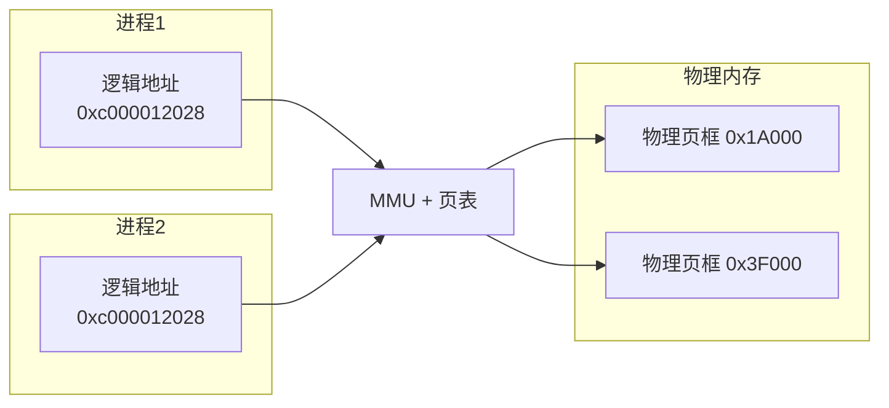
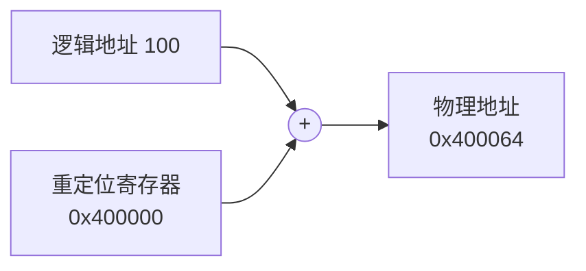
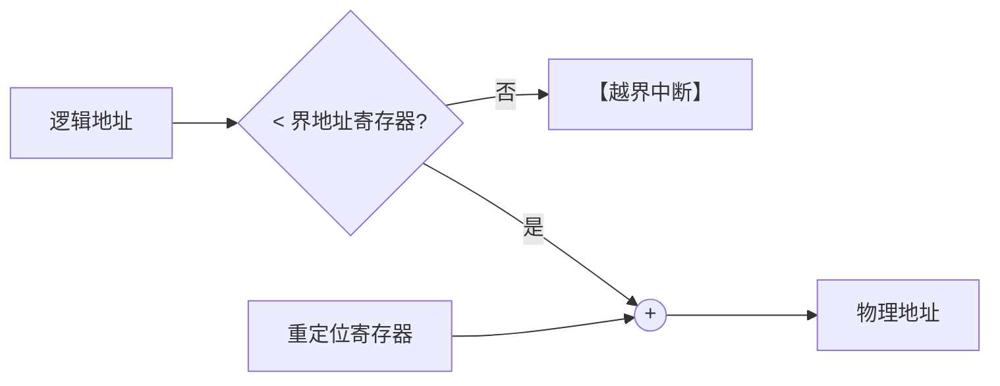
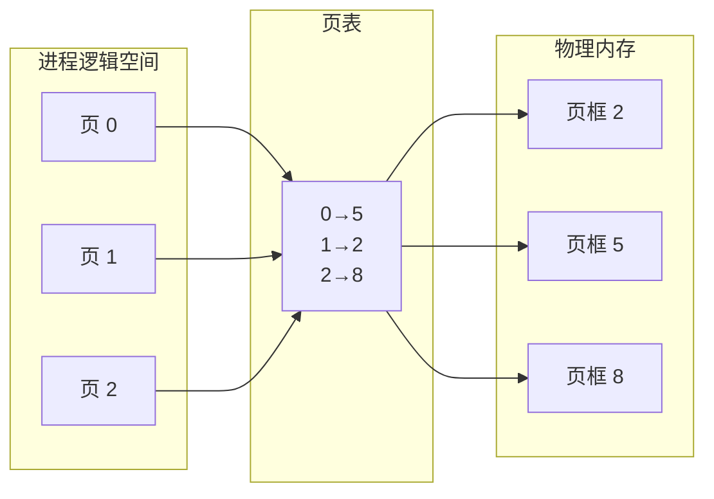
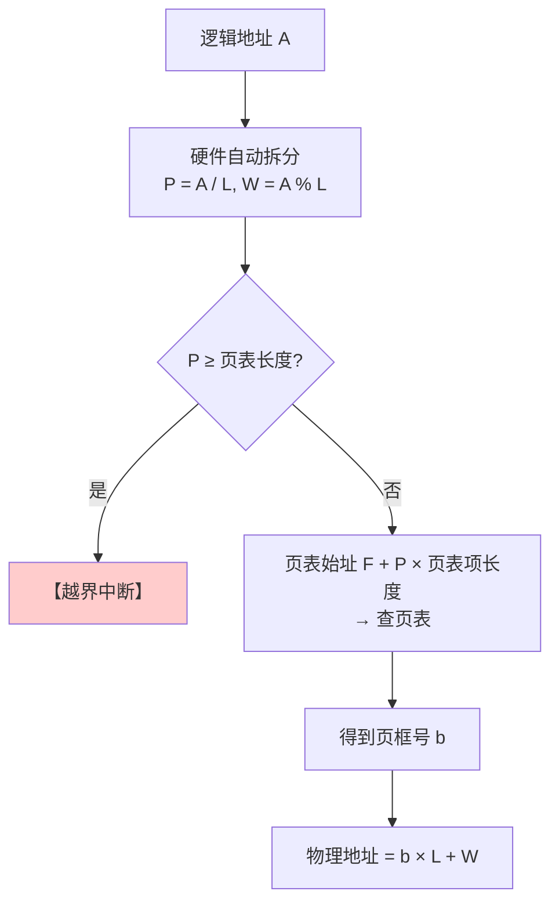
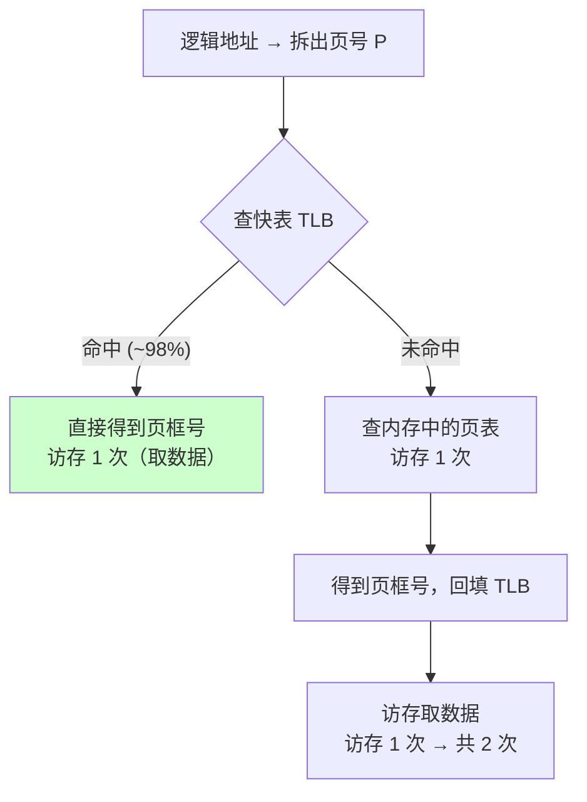
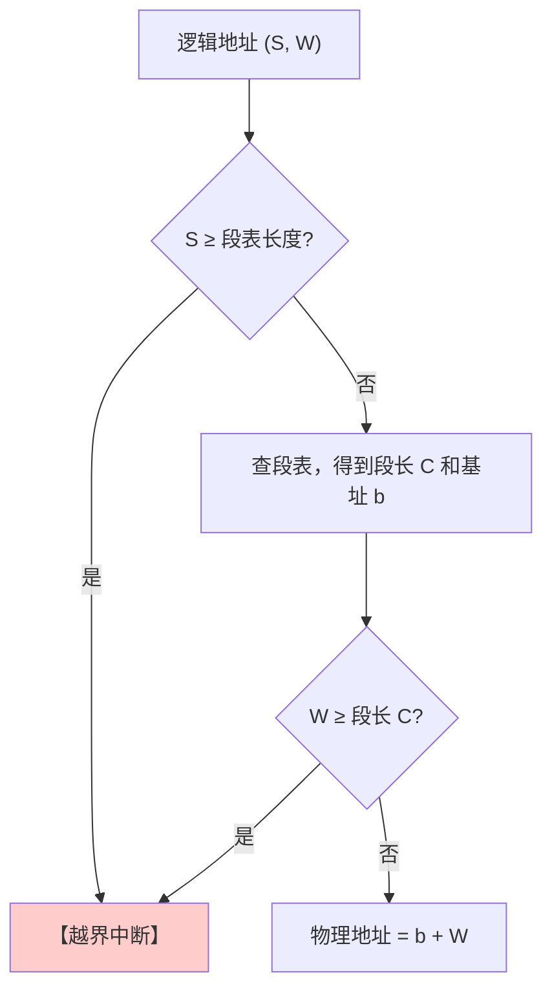
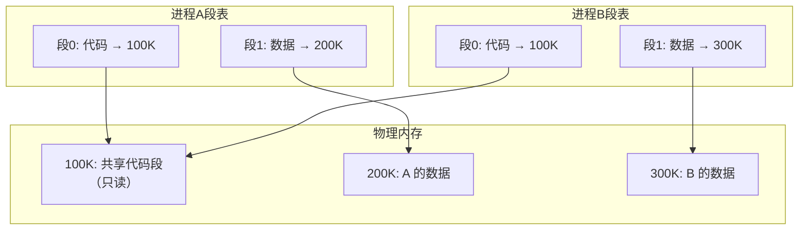
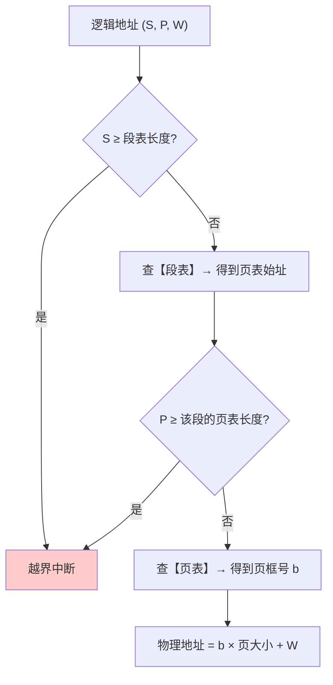
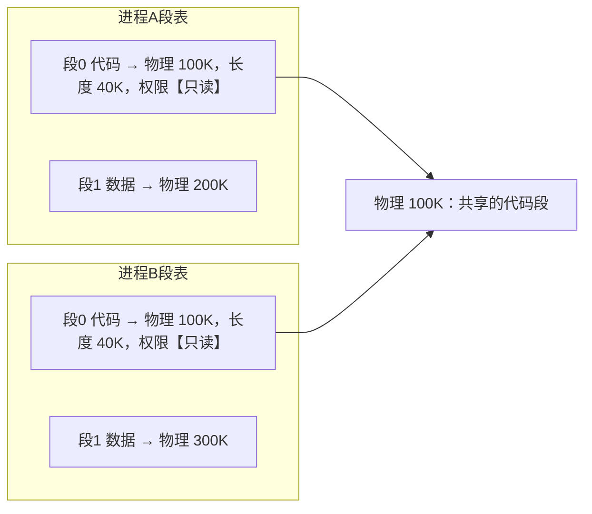

# 精通内存管理：连续分配、分页、分段与段页式

> 课程编号：OS06
> 路线图来源：计算机基础四大件 · 操作系统（408 第 3 章上半）
> 难度：⭐⭐⭐⭐
> 预计阅读时间：85 分钟
> 内容基准：2026 年 8 月（408 考纲操作系统第 3 章「内存管理」）
> **代码语言：Go**。本章用 Go 观察真实的虚拟地址布局与页表行为。

---

## 引言：两个程序都说自己在 `0x400000`

编译一个最简单的 Go 程序，打印一个全局变量的地址：

```go
package main

import "fmt"

var global int = 42

func main() {
    fmt.Printf("global 的地址: %p\n", &global)
    fmt.Println("按回车退出")
    fmt.Scanln()
}
```

**开两个终端，同时运行两份**：

```
终端 1: global 的地址: 0xc000012028
终端 2: global 的地址: 0xc000012028      ← 完全相同！
```

**两个进程的同一个变量，地址一模一样。它们是同一块内存吗？**

当然不是——改其中一个的值，另一个纹丝不动。

答案是：**程序看到的地址是"逻辑地址"（虚拟地址），不是真实的物理地址**。两个进程的 `0xc000012028` 被 MMU 映射到了**完全不同的物理页框**。



**这个"地址翻译层"是整个内存管理的核心**，它一次性解决了三个问题：

| 问题 | 没有地址翻译时 | 有了地址翻译后 |
|---|---|---|
| **重定位** | 程序必须知道自己会被装到哪 | 编译时统统假设从 0 开始 |
| **保护** | 任何程序能读写任意物理地址 | 页表里没有的地址**根本访问不到** |
| **扩展** | 程序不能大于物理内存 | 虚拟空间远大于物理内存（[OS07](./OS07-精通-虚拟内存.md)） |

本章讲清楚这层翻译是怎么一步步演化出来的：

```
绝对装入 → 静态重定位 → 动态重定位
    → 连续分配（单一/固定/动态分区）
    → 离散分配（分页 / 分段 / 段页式）
```

读完你应该能：

- 区分三种装入方式，说清动态重定位为什么必须有重定位寄存器
- 对比四种动态分区分配算法，说清"首次适应通常最好"的原因
- **准确区分内部碎片与外部碎片**（本章最高频考点）
- 熟练完成分页系统的逻辑地址 → 物理地址转换
- 计算有/无快表时的访存次数与有效访问时间
- 说清分页与分段的五点区别，以及段页式为什么要查两次表

---

## 第一章 程序装入与地址重定位

### 1.1 从源码到运行的四步


**三种链接方式**：

| 方式 | 何时链接 | 特点 |
|---|---|---|
| **静态链接** | **装入前**，一次链接成完整装入模块 | 运行时不再需要库；**文件大** |
| **装入时动态链接** | **边装入边链接** | 便于修改和更新模块 |
| **运行时动态链接** | **执行到才链接** | **最省内存**（用不到的模块根本不装入） |

> 💡 **Go 默认静态链接**（所以 Go 的可执行文件大但部署简单，不依赖目标机器的 glibc）；C 程序默认动态链接 libc（`ldd ./prog` 能看到依赖）。

### 1.2 三种装入方式

| 方式 | 地址转换时机 | 能否移动 | 需要硬件支持 |
|---|---|---|---|
| **绝对装入** | **编译时**就确定物理地址 | ❌ 不能 | 无 |
| **静态重定位**（可重定位装入） | **装入时**一次性把逻辑地址改成物理地址 | ❌ **装入后不能移动** | 无 |
| **动态重定位**（动态运行时装入） | **运行时**每次访存都转换 | ✅ **可以移动** | **重定位寄存器** ⭐ |

#### 动态重定位

```
物理地址 = 重定位寄存器（基址） + 逻辑地址
```



**动态重定位的三大好处**：

1. **程序可以在内存中移动**（碎片整理时把进程挪个位置，只需改重定位寄存器）
2. **便于共享**（多个进程可以映射到同一块物理内存）
3. **是虚拟内存的基础**（部分装入成为可能）

> ⚠️ **静态重定位一旦装入就不能移动**——因为地址已经被"写死"进代码里了。而动态重定位的代码里始终是逻辑地址，**转换发生在每一次访存时**，所以随时可以搬家。

### 1.3 内存保护

**两种实现**：

**① 上下限寄存器**

```
if (下限 ≤ 物理地址 ≤ 上限) 允许访问
else 越界中断
```

**② 重定位寄存器 + 界地址寄存器（更常用）**



- **界地址寄存器（限长寄存器）**：存放进程的**最大逻辑地址**
- **重定位寄存器（基址寄存器）**：存放进程的**起始物理地址**

> ⚠️ **先检查越界，再做加法**。若先加后查，攻击者可以用一个超大的逻辑地址绕过检查（整数溢出）。

---

## 第二章 连续分配管理方式

**连续分配 = 为一个进程分配一整块连续的内存空间。**

### 2.1 单一连续分配

```
┌─────────────────┐
│   系统区（OS）   │
├─────────────────┤
│                 │
│   用户区        │  ← 整个用户区只放一个程序
│   （一个程序）   │
│                 │
└─────────────────┘
```

- ✅ 实现极简、无外部碎片、**无需内存保护**（只有一个用户程序）
- ❌ **只支持单道程序**、有严重的**内部碎片**、内存利用率极低

### 2.2 固定分区分配

把用户区**预先划分成若干个固定大小的分区**，每个分区装一个作业。

| 类型 | 说明 |
|---|---|
| **分区大小相等** | 缺乏灵活性；适合"一台机器控制多个相同对象"的场合 |
| **分区大小不等** | 增加灵活性，能容纳不同大小的作业 |

用**分区说明表**记录每个分区的大小、起始地址、状态。

- ✅ 实现简单、无外部碎片
- ❌ **有内部碎片**（作业比分区小，剩下的空间浪费）
- ❌ 分区数固定，**并发度受限**；大作业可能装不下

### 2.3 动态分区分配（可变分区）

**不预先划分**，进程装入时**按需**分配一块刚好够用的连续空间。

```
初始：         [────────── 64MB 空闲 ──────────]

装入 P1(20M)： [P1 20M][──────── 44MB 空闲 ────────]
装入 P2(14M)： [P1 20M][P2 14M][───── 30MB 空闲 ─────]
装入 P3(18M)： [P1 20M][P2 14M][P3 18M][ 12MB 空闲 ]
P2 结束：      [P1 20M][ 14M空 ][P3 18M][ 12MB 空闲 ]
                        ↑ 外部碎片开始出现
装入 P4(4M)：  [P1 20M][P4 4M][10M空][P3 18M][12M空 ]
                              ↑ 碎片越来越碎
```

> ⚠️ **动态分区没有内部碎片，但有外部碎片**——空闲空间被分割成许多不连续的小块，**总量够但没有一块连续的够用**。

**解决外部碎片：紧凑（拼凑 / Compaction）**

把所有进程往一端挪，把碎片合并成一整块。

```
紧凑前：[P1][空][P3][空][P4][空]
紧凑后：[P1][P3][P4][──── 大块空闲 ────]
```

> ⚠️ **紧凑必须有动态重定位支持**！因为进程被移动了，其物理起始地址变了，只有修改重定位寄存器才能让它继续正常运行。静态重定位做不到。
>
> 紧凑的开销很大（要复制大量内存），所以不能频繁做。

### 2.4 四种动态分区分配算法（高频考点）

用同一个初始状态演示：空闲分区 **20MB、10MB、40MB、7MB**（按地址从低到高排列）。

| 算法 | 空闲分区表的排序 | 从哪开始找 | 特点 |
|---|---|---|---|
| **首次适应 First Fit** | **地址递增** | **每次从头开始** | 综合最好 ⭐ |
| **最佳适应 Best Fit** | **容量递增** | 从头（即最小的开始） | 留下**最多小碎片** |
| **最坏适应 Worst Fit** | **容量递减** | 从头（即最大的开始） | **大分区被迅速用完** |
| **邻近适应 Next Fit** | 地址递增（循环链表） | **从上次结束的位置** | 大分区被均匀消耗 |

#### 逐个演示：依次分配 15MB、9MB、25MB

**① 首次适应（First Fit）**

```
空闲表（按地址）：20M | 10M | 40M | 7M

分配 15M：从头找 → 20M 够 ✅ → 20M 变 5M
         5M | 10M | 40M | 7M
分配 9M： 从头找 → 5M 不够 → 10M 够 ✅ → 10M 变 1M
         5M | 1M | 40M | 7M
分配 25M：从头找 → 5M✗ 1M✗ → 40M 够 ✅ → 40M 变 15M
         5M | 1M | 15M | 7M
```

**② 最佳适应（Best Fit）**——找**能装下的最小**分区

```
空闲表（按容量递增）：7M | 10M | 20M | 40M

分配 15M：找 ≥15 的最小 → 20M ✅ → 20M 变 5M
         5M | 7M | 10M | 40M
分配 9M： 找 ≥9 的最小 → 10M ✅ → 10M 变 1M
         1M | 5M | 7M | 40M
分配 25M：找 ≥25 的最小 → 40M ✅ → 40M 变 15M
         1M | 5M | 7M | 15M
```

> ⚠️ **最佳适应的问题**：它"精打细算"的结果是**留下一堆极小的碎片**（1M、5M、7M），这些碎片小到几乎无法再分配给任何进程——**"最佳"反而制造了最多的外部碎片**。

**③ 最坏适应（Worst Fit）**——找**最大**的分区

```
空闲表（按容量递减）：40M | 20M | 10M | 7M

分配 15M：用最大的 40M ✅ → 40M 变 25M
         25M | 20M | 10M | 7M
分配 9M： 用最大的 25M ✅ → 25M 变 16M
         20M | 16M | 10M | 7M
分配 25M：用最大的 20M → 不够！❌ 分配失败
```

> ⚠️ **最坏适应的问题**：它把大分区**优先切碎**，导致后来的大作业**无处安放**。上例中明明总空闲量足够，25M 却装不下。

**④ 邻近适应（Next Fit）**

```
空闲表（循环，按地址）：20M | 10M | 40M | 7M
                      ↑ 起始查找位置

分配 15M：从 20M 开始 → 20M 够 ✅ → 变 5M，【指针停在这里】
         5M | 10M | 40M | 7M
                ↑ 下次从这开始
分配 9M： 从 10M 开始 → 10M 够 ✅ → 变 1M
         5M | 1M | 40M | 7M
                    ↑
分配 25M：从 40M 开始 → 40M 够 ✅ → 变 15M
         5M | 1M | 15M | 7M
```

#### 四种算法综合对比

| 算法 | 优点 | 缺点 | 综合评价 |
|---|---|---|---|
| **首次适应** | 实现简单；**低地址部分保留大空闲块** | 低地址部分会积累小碎片，每次都要扫过它们 | **⭐ 综合性能最好** |
| **最佳适应** | 保留大分区 | **产生最多的外部小碎片**；每次都要遍历（或维护有序表） | 性能反而差 |
| **最坏适应** | 减少小碎片 | **大分区被迅速用完**，大作业无法装入 | **最差** |
| **邻近适应** | 不用每次从头扫 | **会把高地址的大分区也切碎**，全局看不如首次适应 | 中等 |

> ⭐ **反直觉但重要的结论：名字叫"最佳"的算法综合性能并不好，"首次适应"才是实践中的赢家。**
>
> 原因：首次适应总是优先消耗低地址的碎片，**把高地址的大块完整保留下来**——这恰好是大作业需要的。而最佳适应制造的一堆"1MB、2MB"的碎片，几乎永远用不掉。

---

## 第三章 碎片：内部 vs 外部（最高频考点）

| | **内部碎片** | **外部碎片** |
|---|---|---|
| **定义** | **分配给进程但用不上**的部分 | **分区之间**太小而无法利用的空闲空间 |
| **位置** | 在**已分配区的内部** | 在**已分配区之间** |
| **产生原因** | 分配单位**固定**，进程用不满 | 分配单位**可变**，反复分配释放后被切碎 |
| **哪些方式有** | 固定分区、**分页** | 动态分区、**分段** |
| **解决办法** | 减小分配粒度 | **紧凑（compaction）** |

```
【内部碎片】固定分区，分区 16KB，进程只要 10KB
┌──────────────────────┐
│ 进程 10KB │ 浪费 6KB │  ← 浪费在【分区内部】
└──────────────────────┘

【外部碎片】动态分区，反复分配释放后
[P1][空3K][P2][空5K][P3][空2K]
       ↑        ↑        ↑
    这些小空隙加起来 10K，但没有一块能装下 8K 的进程
```

> ⭐ **必须记牢的对应关系**：
>
> | 管理方式 | 碎片类型 |
> |---|---|
> | **固定分区** | **内部**碎片 |
> | **动态分区** | **外部**碎片 |
> | **分页** | **内部**碎片（最后一页装不满） |
> | **分段** | **外部**碎片（段长可变） |
> | **段页式** | **内部**碎片 |
>
> **口诀：固定大小 → 内碎片；可变大小 → 外碎片。**

---

## 第四章 基本分页存储管理 ⭐

**核心思想：把内存和进程都切成固定大小的块，进程可以【离散地】存放。**

| 术语 | 含义 |
|---|---|
| **页框 / 页帧 / 物理块** | **内存**被划分成的固定大小的块 |
| **页 / 页面** | **进程**被划分成的、与页框**同样大小**的块 |
| **页表** | 记录"页号 → 页框号"的映射 |



> 💡 **分页最大的价值：彻底消灭外部碎片**。因为块大小固定，任何空闲页框都能装任何一页——不存在"够大但不连续"的问题。代价是**每个进程最后一页可能装不满**（内部碎片，平均半页）。

### 4.1 地址结构

**逻辑地址被硬件自动拆成两部分**：

```
┌──────────────┬──────────────┐
│   页号 P      │  页内偏移 W   │
└──────────────┴──────────────┘
```

设**页面大小为 $2^k$ 字节**，逻辑地址共 $n$ 位：

$$
\text{页内偏移位数} = k, \qquad \text{页号位数} = n - k
$$

**手工计算公式**：

$$
\text{页号 } P = \left\lfloor \frac{\text{逻辑地址 } A}{\text{页面大小 } L} \right\rfloor, \qquad \text{页内偏移 } W = A \bmod L
$$

> ⚠️ **页面大小必须是 2 的幂**。这样硬件只需**截取二进制位**就能拆分地址，不需要做除法和取模——**一个时钟周期内完成**。若页面大小是 1000 字节，硬件就得做真正的除法，慢几十倍。

### 4.2 地址变换过程（必须能画）



**关键点**：

1. **页表寄存器（PTR）**存放"页表始址 F"和"页表长度 M"，进程切换时从 PCB 恢复
2. **必须做越界检查**：$P \ge M$ 则越界中断
3. **页内偏移 W 直接拼接**，不参与计算

### 4.3 完整例题

**例**：某系统页面大小 **1 KB**，逻辑地址 **16 位**，页表如下：

| 页号 | 页框号 |
|---|---|
| 0 | 2 |
| 1 | 5 |
| 2 | 8 |

求逻辑地址 **2500** 对应的物理地址。

**解**：

```
① 页面大小 L = 1KB = 1024 = 2¹⁰
   → 页内偏移 10 位，页号 16-10 = 6 位

② 拆分逻辑地址 2500：
   页号 P = 2500 / 1024 = 2  （向下取整）
   偏移 W = 2500 % 1024 = 2500 - 2048 = 452

③ 越界检查：P = 2 < 页表长度 3 ✅

④ 查页表：页 2 → 页框号 b = 8

⑤ 物理地址 = b × L + W = 8 × 1024 + 452 = 8192 + 452 = 8644
```

**二进制验证**：

```
2500 = 0000 1001 1100 0100₂
       └─页号─┘└──偏移 10 位──┘
页号 = 000010₂ = 2 ✅
偏移 = 1111000100₂ = 452 ✅

物理地址：页框号 8 = 001000₂，拼上偏移
= 001000 1111000100₂ = 8644 ✅
```

> 💡 **硬件根本不做除法**——它就是直接**截取二进制位**。这就是"页面大小必须是 2 的幂"的全部原因。

### 4.4 快表（TLB）与访存次数

**问题**：页表在内存里，所以每次访存都要**两次访问内存**（一次查页表，一次取数据）——**速度直接减半**。

**解法**：**快表（TLB，Translation Lookaside Buffer）**——页表项的高速缓存，用**相联存储器**实现，在 CPU 内部。



**访存次数总表**：

| 情况 | 访存次数 |
|---|---|
| **无快表** | **2 次**（查页表 + 取数据） |
| **有快表，命中** | **1 次**（只取数据） |
| **有快表，未命中** | **2 次**（查页表 + 取数据） |
| **二级页表，无快表** | **3 次**（查一级 + 查二级 + 取数据） |
| **二级页表，快表命中** | **1 次** |

**有效访问时间（EAT）计算**：

设快表命中率 $a$，查快表时间 $t_{TLB}$，访存时间 $t_M$。

**若快表与页表**同时**查找（并行）：

$$
EAT = a \times (t_{TLB} + t_M) + (1-a) \times (t_{TLB} + 2t_M)
$$

**若先查快表，未命中再查页表（串行）**：同上公式（因为查快表的时间总是要花的）。

**例**：TLB 查找 10 ns，访存 100 ns，命中率 98%。

$$
EAT = 0.98 \times (10 + 100) + 0.02 \times (10 + 200) = 107.8 + 4.2 = 112\ \text{ns}
$$

**对比无快表**：$2 \times 100 = 200$ ns。**快表把开销从 100% 降到 12%**。

> 💡 **TLB 命中率能到 98% 的原因还是局部性**——一个页 4KB，能装下大量连续访问的数据。这与 [CO05](../computer-organization/CO05-精通-Cache-与虚拟存储器.md) 的 Cache 是同一个原理。

### 4.5 两级页表

**问题**：32 位地址、4KB 页 → $2^{20}$ = 1M 个页表项，每项 4B → **每个进程 4MB 页表**，且必须连续存放。

**两级页表的解法**：**给页表本身分页**。

```
32 位逻辑地址：
┌──────────┬──────────┬──────────────┐
│ 一级页号  │ 二级页号  │  页内偏移 12  │
│  10 位    │  10 位    │              │
└──────────┴──────────┴──────────────┘

一级页表（页目录）：2¹⁰ = 1024 项 × 4B = 4KB  ← 正好一页！
二级页表：每张 1024 项 × 4B = 4KB
```

**节省效果**：

```
一个进程实际只用 3 个二级页表（代码、堆、栈各一块）：
  总开销 = 4KB（一级）+ 3 × 4KB（二级）= 16KB
  
对比单级页表的 4MB → 【节省 99.6%】
```

**访存次数的代价**：

```
无快表：查一级页表(1) + 查二级页表(1) + 取数据(1) = 【3 次访存】
```

> ⚠️ **两级页表用"访存次数"换"内存空间"**。而 TLB 把这个代价又抵消掉了——**TLB 命中时一次访存搞定，跟几级页表无关**。这就是为什么 64 位系统敢用 4 级甚至 5 级页表。
>
> **两条硬性要求**：
> 1. **各级页表的大小不能超过一个页面**（否则它自己又需要连续空间，前功尽弃）
> 2. **顶级页表只能有一个页面**

### 4.6 用 Go 观察虚拟地址布局

```go
package main

import (
    "fmt"
    "os"
)

var globalVar = 42

func main() {
    local := 100
    heap := new(int)
    *heap = 200

    fmt.Println("页大小:", os.Getpagesize()) // 4096
    fmt.Printf("全局变量  %p\n", &globalVar)
    fmt.Printf("栈上变量  %p\n", &local)
    fmt.Printf("堆上变量  %p\n", heap)
    fmt.Printf("函数代码  %p\n", main)

    // ★ 算出各个地址落在哪一页
    const pageSize = 4096
    for name, addr := range map[string]uintptr{
        "全局": uintptr(ptr(&globalVar)),
        "栈":   uintptr(ptr(&local)),
        "堆":   uintptr(ptr(heap)),
    } {
        fmt.Printf("%s: 页号=0x%X 页内偏移=%d\n",
            name, addr/pageSize, addr%pageSize) // ★ 就是本章的拆分公式
    }
}
```

**查看进程的完整内存映射**（Linux）：

```bash
./demo &
cat /proc/$!/maps
```

典型输出：

```
00400000-004a2000 r-xp  ...  /tmp/demo      ← 代码段（只读+可执行）
004a2000-00520000 r--p  ...  /tmp/demo      ← 只读数据
00520000-0053a000 rw-p  ...  /tmp/demo      ← 可读写数据（全局变量）
c000000000-c004000000 rw-p ...              ← Go 的堆
7ffd8a3b0000-7ffd8a3d1000 rw-p ... [stack]  ← 栈
```

> 💡 **`/proc/<pid>/maps` 就是页表的可读版本**。每一行是一个连续的虚拟地址区间及其权限（`r-xp` = 读+执行+私有）。**权限位就是 §1.3 讲的内存保护在页表项里的落地**——试图写只读段会立刻触发段错误。

---

## 第五章 基本分段存储管理

**核心思想：按【程序的逻辑结构】划分，而不是按固定大小。**

```
一个 C/Go 程序天然分成：
  主程序段、子程序段、全局数据段、栈段、堆段…

每段有自己的名字和长度，【长度可变】
```

### 5.1 地址结构

```
┌──────────────┬──────────────┐
│   段号 S      │  段内偏移 W   │
└──────────────┴──────────────┘
```

> ⭐ **分段的地址是"二维"的**——段号和段内偏移是**两个独立的量**，段号由程序员/编译器显式给出。而**分页是"一维"的**——一个线性地址由硬件自动拆分，程序员感觉不到分页的存在。
>
> **这是分页与分段最本质的区别**，也是 408 最爱考的点。

### 5.2 段表与地址变换

**段表项**比页表项多一个字段：

| 段号 | **段长** | 基址 |
|---|---|---|
| 0 | 7K | 40K |
| 1 | 3K | 80K |
| 2 | 10K | 120K |

**地址变换**：



> ⚠️ **分段要做【两次】越界检查**：① 段号是否超出段表长度 ② **段内偏移是否超出该段的段长**。
>
> **分页只需要一次**（页号是否越界）——因为**页内偏移永远不可能越界**（偏移的位数天然限制了它 < 页面大小）。这是 408 的高频辨析点。

### 5.3 分段的优势：共享与保护



**为什么分段更便于共享和保护？**

因为**段是按逻辑单位划分的**——"整个代码段"是一个完整的、有意义的单元，可以整体标记为"只读+可共享"。

而**分页的页边界是机械划分的**，一个页可能**一半是代码一半是数据**，无法整体赋予统一的权限。

> ⚠️ **可重入代码（纯代码）才能共享**——即执行过程中不修改自身的代码。若代码段里有可修改的变量，就不能共享。

### 5.4 分页 vs 分段（五点区别，必背）

| 维度 | **分页** | **分段** |
|---|---|---|
| **① 划分依据** | **物理**单位（固定大小） | **逻辑**单位（按程序结构） |
| **② 大小** | **固定**，由系统决定 | **可变**，由用户/编译器决定 |
| **③ 地址空间** | **一维**（一个线性地址，硬件自动拆） | **二维**（段号 + 段内偏移，需显式给出） |
| **④ 目的** | 提高**内存利用率**（消除外部碎片） | 更好地**满足用户需求**（共享、保护、动态增长） |
| **⑤ 碎片** | **内部**碎片 | **外部**碎片 |
| **⑥ 越界检查次数** | **1 次**（页号） | **2 次**（段号 + 段内偏移） |
| **⑦ 共享与保护** | 不便（页边界不是逻辑边界） | **方便**（段是完整的逻辑单元） |
| **⑧ 对用户** | **透明**（用户不知道有分页） | **不透明**（用户可见段的划分） |

---

## 第六章 段页式管理

**思路：先分段，段内再分页。** 兼取两者优点。

### 6.1 地址结构（三部分）

```
┌──────────┬──────────┬──────────────┐
│  段号 S   │  页号 P   │  页内偏移 W   │
└──────────┴──────────┴──────────────┘
```

### 6.2 地址变换：查两次表



**访存次数**：

| 情况 | 访存次数 |
|---|---|
| 无快表 | **3 次**（查段表 + 查页表 + 取数据） |
| 快表命中 | **1 次** |

### 6.3 三种方式总对比

| | 连续分配 | 分页 | 分段 | 段页式 |
|---|---|---|---|---|
| 是否连续 | **连续** | 离散 | 离散 | 离散 |
| 地址维度 | 一维 | **一维** | **二维** | 二维 |
| 碎片 | 内/外 | **内部** | **外部** | **内部** |
| 共享保护 | 困难 | 不便 | **方便** | **方便** |
| 无快表访存次数 | 1 | **2** | **2** | **3** |
| 表的数量 | 无 | 页表×1 | 段表×1 | **段表×1 + 页表×段数** |

---

## 第七章 408 高频考点与陷阱清单

### 7.1 考点分布

第 3 章上半是操作系统**分值很高**的部分：**2-3 道选择题 + 常见于大题**（地址变换计算）。

最常考：

1. **逻辑地址 → 物理地址的转换计算**（大题常客）
2. **内部碎片 vs 外部碎片的判断**
3. 访存次数（有/无快表、几级页表）
4. 分页与分段的区别
5. 四种动态分区分配算法

### 7.2 十六个陷阱

**陷阱 1：静态重定位后进程可以在内存中移动**

**错**。静态重定位在**装入时**就把地址写死了，**装入后不能移动**。只有**动态重定位**（靠重定位寄存器）才能移动。

**陷阱 2：紧凑（compaction）不需要硬件支持**

**错**。紧凑要移动进程，**必须有动态重定位（重定位寄存器）支持**，否则移动后地址全错。

**陷阱 3：最佳适应算法性能最好**

**错**。"最佳适应"每次都精确匹配，**留下大量极小的外部碎片**，综合性能反而差。**首次适应通常最好**。

**陷阱 4：最坏适应能减少碎片所以更好**

**错**。最坏适应**优先切碎大分区**，导致后来的大作业无处安放，**综合性能最差**。

**陷阱 5：动态分区分配会产生内部碎片**

**错**。动态分区**按需分配，正好够用**，所以**没有内部碎片，只有外部碎片**。

**陷阱 6：分页会产生外部碎片**

**错**。分页的块大小固定，任何空闲页框都能用，**没有外部碎片**；只有**最后一页装不满**的**内部碎片**。

**陷阱 7：分段会产生内部碎片**

**错**。分段按逻辑单位分配，**正好够用**，产生的是**外部碎片**。

**陷阱 8：页面大小可以是任意值**

**错**。**页面大小必须是 2 的幂**，这样硬件才能通过"截取二进制位"完成地址拆分，无需除法。

**陷阱 9：分页的逻辑地址是二维的**

**错，反了**。**分页是一维**（一个线性地址，硬件自动拆分，对用户透明）；**分段是二维**（段号 + 段内偏移，用户可见）。

**陷阱 10：分页需要做两次越界检查**

**错**。**分页只需 1 次**（检查页号）——页内偏移的位数天然限制了它不可能越界。**分段才需要 2 次**（段号 + 段内偏移）。

**陷阱 11：有快表时访存次数一定是 1 次**

**错**。快表**命中**才是 1 次；**未命中**仍要 2 次（查页表 + 取数据）。

**陷阱 12：二级页表一定比单级页表慢**

**不准确**。无快表时确实慢（3 次 vs 2 次），但**有快表且命中时都是 1 次**。二级页表的收益是**节省内存**，代价被 TLB 大幅抵消。

**陷阱 13：各级页表的大小可以超过一个页面**

**错**。**每级页表必须能装进一个页面**，否则它自身又需要连续空间，就失去了分级的意义。

**陷阱 14：分页比分段更便于共享和保护**

**错，反了**。**分段更便于共享保护**——段是完整的逻辑单元（如"整个代码段"），可以整体赋权限。分页的页边界是机械的，一个页可能横跨代码和数据。

**陷阱 15：段页式管理无快表时访存 2 次**

**错，是 3 次**（查段表 + 查页表 + 取数据）。

**陷阱 16：段页式有外部碎片**

**错**。段页式的**段内是分页的**，所以是**内部碎片**。

### 7.3 速查卡

```
【三种装入】
绝对装入  ：编译时定地址，不能移动
静态重定位：装入时改地址，【装入后不能移动】
动态重定位：运行时转换，【可以移动】，需【重定位寄存器】

【碎片对应关系】★★★
固定分区 → 内碎片      动态分区 → 外碎片
分页     → 内碎片      分段     → 外碎片      段页式 → 内碎片
口诀：固定大小→内碎片；可变大小→外碎片

【四种分配算法】
首次适应：按地址递增，每次从头 → 【综合最好】⭐
最佳适应：按容量递增 → 留下【最多小碎片】
最坏适应：按容量递减 → 大分区被切碎，【最差】
邻近适应：从上次位置继续

【分页地址转换】
页号 P = 逻辑地址 / 页面大小（向下取整）
偏移 W = 逻辑地址 % 页面大小
物理地址 = 页框号 × 页面大小 + W
★ 页面大小必须是 2 的幂（硬件靠截位，不做除法）

【访存次数】
无快表单级页表：2 次      快表命中：1 次
无快表二级页表：3 次      快表未命中：2 次
段页式无快表  ：3 次

【EAT】
EAT = a×(t_TLB + t_M) + (1-a)×(t_TLB + 2·t_M)

【分页 vs 分段】
分页：物理单位、大小固定、【一维】、提高利用率、内碎片、【1 次】越界检查、对用户透明
分段：逻辑单位、大小可变、【二维】、满足用户需求、外碎片、【2 次】越界检查、便于共享保护
```

---

## 第八章 Go ↔ C 对照

| 场景 | C | Go | 说明 |
|---|---|---|---|
| 查看页大小 | `sysconf(_SC_PAGESIZE)` | `os.Getpagesize()` | 通常 4096 |
| 申请内存 | `malloc` / `mmap` | `make` / `new`（运行时用 `mmap`） | Go 是"批发-零售"模型 |
| 页对齐分配 | `posix_memalign` | `syscall.Mmap` | |
| 查看内存映射 | 读 `/proc/self/maps` | 同左 | 页表的可读版本 |
| 锁定页不换出 | `mlock()` | `syscall.Mlock` | 防敏感数据落盘 |
| 改变页权限 | `mprotect()` | `syscall.Mprotect` | 对应页表项的权限位 |
| 共享内存 | `shmget` / `mmap(MAP_SHARED)` | `syscall.Mmap` + `MAP_SHARED` | 对应"多个页表指向同一页框" |

**观察 Go 的内存分配为什么很少陷入内核**：

```bash
strace -e trace=mmap,brk ./demo 2>&1 | wc -l
```

即使程序做了百万次 `make([]byte, 64)`，`mmap` 调用也只有几十次。

> 💡 **Go 运行时向内核"批发"内存（一次 `mmap` 几十 MB），然后在用户态"零售"给各个 `make`/`new`**。这与 [OS01](./OS01-精通-操作系统概述与运行环境.md) §4.5 讲的"减少系统调用次数"是同一个优化思路。
>
> Go 的堆地址从 `0xc000000000` 开始也是刻意选的——这个区间在 64 位 Linux 上几乎不会与其他映射冲突，便于运行时管理。

---

## 第九章 练习题

### 选择题

**1.** 允许程序在内存中移动位置的装入方式是：
A. 绝对装入　B. 静态重定位　C. 动态重定位　D. 以上都可以

**2.** 采用紧凑（compaction）技术消除外部碎片，必须的硬件支持是：
A. 界地址寄存器　B. 重定位寄存器　C. 中断机构　D. 快表

**3.** 下列存储管理方式中，**会产生外部碎片**的是：
A. 固定分区　B. 分页　C. 分段　D. 段页式

**4.** 动态分区分配算法中，综合性能通常**最好**的是：
A. 首次适应　B. 最佳适应　C. 最坏适应　D. 邻近适应

**5.** "最佳适应"算法的主要缺点是：
A. 查找速度慢
B. 会留下大量难以利用的小碎片
C. 大作业无法装入
D. 需要额外的硬件支持

**6.** 分页存储管理中，页面大小通常取 2 的幂，主要原因是：
A. 便于内存分配
B. 便于硬件通过截取二进制位完成地址拆分
C. 减少内部碎片
D. 提高快表命中率

**7.** 某系统页面大小为 4KB，逻辑地址为 9000（十进制），则页号和页内偏移分别是：
A. 2, 808　B. 2, 812　C. 3, 808　D. 2, 904

**8.** 在采用快表（TLB）的分页系统中，若快表**未命中**，则完成一次访存共需访问内存：
A. 1 次　B. 2 次　C. 3 次　D. 4 次

**9.** 关于分页和分段，**正确**的是：
A. 分页的地址空间是二维的
B. 分段的大小由系统固定
C. 分段更便于实现信息共享和保护
D. 分页需要做两次越界检查

**10.** 段页式存储管理中，若没有快表，完成一次访存需要访问内存：
A. 1 次　B. 2 次　C. 3 次　D. 4 次

### 应用题

**11.** 某系统采用**动态分区分配**，内存中空闲分区（按地址由低到高）为：**100KB、500KB、200KB、300KB、600KB**。现依次有作业请求 **212KB、417KB、112KB、426KB**。

分别用**首次适应**、**最佳适应**、**最坏适应**三种算法完成分配，写出每步的分配结果和最终的空闲分区状态，并说明哪种算法能成功分配全部作业。

**12.** 某分页系统，**逻辑地址 32 位**，**页面大小 8KB**，**物理内存 1GB**，页表项占 **4 字节**。

（1）逻辑地址中页号和页内偏移各占多少位？
（2）页表最多有多少项？单级页表占多大空间？
（3）物理页框号需要多少位？
（4）若采用二级页表，且要求每级页表恰好占一个页面，问一级和二级页号各占多少位？

**13.** 某系统采用分页管理，页面大小 **1KB**，某进程页表如下：

| 页号 | 页框号 | 有效位 |
|---|---|---|
| 0 | 3 | 1 |
| 1 | 7 | 1 |
| 2 | — | 0 |
| 3 | 5 | 1 |

（1）将逻辑地址 **1500**、**3200**、**2100** 转换为物理地址（若无法转换请说明原因）。
（2）若访存时间为 100 ns，快表查找时间 20 ns，快表命中率 90%，求有效访问时间 EAT。

**14.** 详细对比**分页**与**分段**存储管理，从**六个维度**分析，并解释：

（1）为什么说"分页的地址空间是一维的，分段是二维的"？
（2）为什么分段比分页更便于实现信息共享与保护？

**15.** 解释**内部碎片**与**外部碎片**的区别，并逐一说明下列存储管理方式各会产生哪种碎片、原因是什么：

固定分区、动态分区、分页、分段、段页式

### 答案与解析

<details>
<summary>点击展开</summary>

**1. C**

| 装入方式 | 能否移动 | 原因 |
|---|---|---|
| 绝对装入 | ❌ | 编译时地址就固定了 |
| 静态重定位 | ❌ | **装入时地址被写死进代码** |
| **动态重定位** | ✅ | **代码里始终是逻辑地址**，转换发生在每次访存时，改重定位寄存器即可 |

**2. B**

紧凑要**移动进程在内存中的位置**。移动后进程的物理起始地址变了，只有通过**重定位寄存器（基址寄存器）**在运行时动态转换，才能让它继续正常运行。

A（界地址寄存器）是做**越界保护**的，与移动无关。

**3. C**

| 管理方式 | 碎片类型 |
|---|---|
| 固定分区 | **内部** |
| 动态分区 | **外部** |
| 分页 | **内部** |
| **分段** | **外部** |
| 段页式 | **内部** |

**分段的段长可变**，反复分配释放后会在段之间留下无法利用的小空隙 → **外部碎片**。

**4. A**

**首次适应综合性能最好**。原因：它总是优先消耗低地址的小碎片，**把高地址的大块完整保留**——这恰好是大作业需要的。

**5. B**

"最佳适应"每次都精确匹配"能装下的最小分区"，剩下的余量极小（1KB、2KB 这种），**这些碎片小到几乎无法再分配给任何进程**，最终制造出最多的外部碎片。

**"最佳"是局部最优，全局反而最差**——这是本章最反直觉的结论。

**6. B**

页面大小是 $2^k$ 时，逻辑地址的**低 k 位就是页内偏移，高位就是页号**，硬件只需**截取二进制位**，一个时钟周期完成。

若页面大小是 1000（非 2 的幂），硬件就得做真正的**除法和取模**，慢几十倍。

**7. A**

```
页面大小 4KB = 4096
页号 = 9000 / 4096 = 2（向下取整）
偏移 = 9000 % 4096 = 9000 - 8192 = 808
```

**8. B**

| 情况 | 访存次数 |
|---|---|
| 快表**命中** | **1 次**（只取数据） |
| 快表**未命中** | **2 次**（查内存中的页表 + 取数据） |

注意：查快表本身**不算访问内存**（TLB 在 CPU 内部）。

**9. C**

- A 错：**分页是一维**（线性地址硬件自动拆分）
- B 错：**分段的大小可变**，由用户/编译器决定；分页才是系统固定
- **C 对**：段是完整的逻辑单元，便于整体赋予权限和共享
- D 错：**分页只需 1 次越界检查**（页号）；**分段才需 2 次**

**10. C**

段页式无快表：**查段表(1) + 查页表(1) + 取数据(1) = 3 次**。

**11.**

初始空闲分区（按地址）：**100K、500K、200K、300K、600K**

---

**① 首次适应（按地址递增，每次从头找）**

```
分配 212K：
  100K ✗ → 500K ✅ → 500K 剩 288K
  空闲：100K, 288K, 200K, 300K, 600K

分配 417K：
  100K ✗ → 288K ✗ → 200K ✗ → 300K ✗ → 600K ✅ → 600K 剩 183K
  空闲：100K, 288K, 200K, 300K, 183K

分配 112K：
  100K ✗ → 288K ✅ → 288K 剩 176K
  空闲：100K, 176K, 200K, 300K, 183K

分配 426K：
  100K ✗ → 176K ✗ → 200K ✗ → 300K ✗ → 183K ✗
  → 【分配失败】❌

最终空闲：100K, 176K, 200K, 300K, 183K（总计 959K，但无一块 ≥ 426K）
```

---

**② 最佳适应（找能装下的最小分区）**

```
分配 212K：
  候选：500K, 300K, 600K → 最小的是 300K ✅ → 300K 剩 88K
  空闲：100K, 500K, 200K, 88K, 600K

分配 417K：
  候选：500K, 600K → 最小的是 500K ✅ → 500K 剩 83K
  空闲：100K, 83K, 200K, 88K, 600K

分配 112K：
  候选：200K, 600K → 最小的是 200K ✅ → 200K 剩 88K
  空闲：100K, 83K, 88K, 88K, 600K

分配 426K：
  候选：600K ✅ → 600K 剩 174K
  空闲：100K, 83K, 88K, 88K, 174K

→ 【全部分配成功】✅
```

---

**③ 最坏适应（每次找最大的分区）**

```
分配 212K：
  最大是 600K ✅ → 600K 剩 388K
  空闲：100K, 500K, 200K, 300K, 388K

分配 417K：
  最大是 500K ✅ → 500K 剩 83K
  空闲：100K, 83K, 200K, 300K, 388K

分配 112K：
  最大是 388K ✅ → 388K 剩 276K
  空闲：100K, 83K, 200K, 300K, 276K

分配 426K：
  最大是 300K ✗（不够）
  → 【分配失败】❌

最终空闲：100K, 83K, 200K, 300K, 276K（总计 959K，无一块 ≥ 426K）
```

---

**结论对比**

| 算法 | 结果 | 说明 |
|---|---|---|
| 首次适应 | ❌ 第 4 个失败 | 600K 大块被 417K 用掉，只剩 183K |
| **最佳适应** | ✅ **全部成功** | 精确匹配保住了 600K 大块给最后的 426K |
| 最坏适应 | ❌ 第 4 个失败 | **600K 大块最先被 212K 切碎** |

> 💡 **本题恰好是"最佳适应表现最好"的例子**——这说明**算法优劣依赖具体的请求序列**。
>
> 但从**统计意义**上，首次适应仍是综合最好的：它实现最简单、平均查找时间短、且不会像最佳适应那样长期积累微小碎片。**"最坏适应最差"这个结论则是稳定的**——本题里它第一步就把 600K 切了。

**12.**

**（1）页号与页内偏移位数**

```
页面大小 8KB = 2¹³
→ 页内偏移 = 13 位
→ 页号 = 32 - 13 = 19 位
```

**（2）页表项数与单级页表大小**

```
页表项数 = 2¹⁹ = 524,288 项 ≈ 512K 项
单级页表大小 = 2¹⁹ × 4B = 2²¹ B = 2 MB
```

**（3）物理页框号位数**

```
物理内存 1GB = 2³⁰
页框数 = 2³⁰ / 2¹³ = 2¹⁷
→ 页框号需要 17 位
```

**（4）二级页表的位数划分**

```
要求：每级页表恰好占一个页面（8KB）

每个页面能放的页表项数 = 8KB / 4B = 2¹³ / 2² = 2¹¹ = 2048 项
→ 每级页号占 log₂(2048) = 11 位

验证：
  一级页号 11 位 + 二级页号 11 位 = 22 位
  但总页号只有 19 位！
```

**⚠️ 出现矛盾，需要调整**：

```
总页号 19 位，要分成两级：
  二级页号取 11 位（正好装满一个页面的页表项数）
  一级页号 = 19 - 11 = 8 位

验证：
  一级页表：2⁸ = 256 项 × 4B = 1KB  ≤ 8KB ✅（占不满一页，但不超过）
  二级页表：2¹¹ = 2048 项 × 4B = 8KB = 恰好一页 ✅

地址结构：
┌────────┬──────────┬────────────┐
│ 一级 8  │  二级 11  │  偏移 13   │
└────────┴──────────┴────────────┘
   总计 8 + 11 + 13 = 32 位 ✅
```

> 💡 **实际系统的分级设计正是这样"从下往上"推的**：先让最底层的页表恰好装满一页（最大化利用），剩下的位数给上层。若上层位数太多，就再加一级——这就是 x86-64 用 4 级页表（9+9+9+9+12 = 48 位）的由来。

**13.**

**（1）地址转换**

页面大小 **1KB = 1024**。

---

**逻辑地址 1500**

```
页号 P = 1500 / 1024 = 1
偏移 W = 1500 % 1024 = 476

查页表：页 1 → 页框号 7，有效位 = 1 ✅

物理地址 = 7 × 1024 + 476 = 7168 + 476 = 7644
```

---

**逻辑地址 3200**

```
页号 P = 3200 / 1024 = 3
偏移 W = 3200 % 1024 = 3200 - 3072 = 128

查页表：页 3 → 页框号 5，有效位 = 1 ✅

物理地址 = 5 × 1024 + 128 = 5120 + 128 = 5248
```

---

**逻辑地址 2100**

```
页号 P = 2100 / 1024 = 2
偏移 W = 2100 % 1024 = 2100 - 2048 = 52

查页表：页 2 → 【有效位 = 0】❌

→ 【无法直接转换】
   该页不在内存中，产生【缺页中断】
   需要 OS 从外存把这一页调入内存，更新页表后重新执行该指令
```

> 💡 **这正是 [OS07](./OS07-精通-虚拟内存.md) 虚拟内存的入口**——有效位为 0 意味着"页不在内存"，是请求分页系统的核心机制。在**基本分页**系统中（本章），所有页必须全部装入，有效位恒为 1；有效位为 0 只出现在**请求分页**系统。

---

**（2）有效访问时间 EAT**

```
快表查找时间 t_TLB = 20 ns
访存时间     t_M   = 100 ns
命中率       a     = 90%

命中：  查快表(20) + 取数据(100)        = 120 ns
未命中：查快表(20) + 查页表(100) + 取数据(100) = 220 ns

EAT = 0.9 × 120 + 0.1 × 220
    = 108 + 22
    = 130 ns
```

**对比**：

| 方案 | 时间 |
|---|---|
| 无快表（每次 2 次访存） | 200 ns |
| **有快表（90% 命中）** | **130 ns** |
| 理想（100% 命中） | 120 ns |

**快表把开销从 100%（多花 100ns）降到了 30%（多花 30ns）。**

**14.**

**六维对比**：

| 维度 | **分页** | **分段** |
|---|---|---|
| **① 划分依据** | **物理**单位——按固定大小机械切分 | **逻辑**单位——按程序结构（代码段、数据段、栈段） |
| **② 长度** | **固定**，由系统决定（如 4KB） | **可变**，由用户/编译器决定 |
| **③ 地址空间** | **一维**——一个线性地址 | **二维**——(段号, 段内偏移) |
| **④ 设计目的** | 提高**内存利用率**，消除外部碎片 | 更好地**满足用户和程序的逻辑需求** |
| **⑤ 碎片类型** | **内部**碎片（最后一页装不满） | **外部**碎片（段长可变） |
| **⑥ 越界检查** | **1 次**（页号 vs 页表长度） | **2 次**（段号 vs 段表长度；段内偏移 vs 段长） |
| ⑦ 共享与保护 | 不便 | **方便** |
| ⑧ 对用户 | **透明**（用户不知道有分页） | **不透明**（用户可见段） |

---

**（1）为什么分页是"一维"，分段是"二维"？**

**分页：一维**

程序员写代码时使用的是**一个连续的线性地址空间**：

```go
var arr [10000]byte
p := &arr[5000]     // ★ 程序员眼里这就是"一个地址"
```

这个地址是**一个单一的数值**（如 `0xc000012028`）。**硬件在访存时自动**把它的高位当页号、低位当偏移：

```
0xc000012028
└─────┬────┘└┬─┘
   页号      偏移      ← 【硬件自动拆分，程序员完全无感】
```

**程序员永远不需要说"我要访问第 3 页的第 128 字节"**——他只说"我要访问地址 X"。所以地址空间是**一维**的。

---

**分段：二维**

分段系统中，**段号和段内偏移是两个独立的量，必须分别给出**：

```asm
; 早期 x86 的分段模式
MOV  AX, DS:[0x1000]    ; ★ DS 是段寄存器（段号），0x1000 是段内偏移
                        ;   两者是【两个独立的操作数】
```

程序员/编译器必须明确指出"**哪个段**的**第几个字节**"。

**关键差异的本质**：

| | 一维（分页） | 二维（分段） |
|---|---|---|
| 地址的形式 | **一个数** | **一对数 (S, W)** |
| 谁负责拆分 | **硬件自动** | **程序员/编译器显式指定** |
| 各段能否连续编址 | —— | **不能**——每段独立从 0 开始编址 |

**一个直观的判据**：

> **在分页系统中，把逻辑地址 +1 会自然地跨到下一个字节（可能跨页，但地址仍连续）。**
> **在分段系统中，段内偏移 +1 可能超出段长，而"下一个段"的偏移又从 0 开始——地址不是连续的。**

---

**（2）为什么分段更便于共享与保护？**

**核心原因：段是有【完整语义】的逻辑单元，页不是。**

**共享的例子**：

多个进程运行同一个程序（如 10 个用户同时用 vim），希望**共享代码**。

**分段系统**：



**只需一个段表项**，就把"整个代码段"共享出去了——因为**"代码段"本身就是一个完整的逻辑概念**。

**分页系统**：

```
代码占 10 个页 → 需要在每个进程的页表里【逐个】设置这 10 个页表项
若代码长度变化 → 要重新调整所有进程的页表项数量
```

更麻烦的是**边界问题**：

```
假设代码段长 10.5 KB，页大小 4KB：
  页0：全是代码
  页1：全是代码
  页2：【前 2.5KB 是代码，后 1.5KB 是数据的开头】← 问题！

这一页该设成"只读"（保护代码）还是"可写"（数据需要）？
  设只读 → 数据写不了 ❌
  设可写 → 代码可被篡改 ❌
```

**分页的页边界是机械划分的，不对齐逻辑边界**，导致无法给出统一的权限。

---

**保护的例子**：

**分段**能天然表达这些规则：

| 段 | 权限 | 为什么合理 |
|---|---|---|
| 代码段 | **只读 + 可执行** | 代码不该被修改 |
| 数据段 | 可读 + 可写 + **不可执行** | 防止数据被当代码执行（缓冲区溢出攻击） |
| 栈段 | 可读 + 可写 + **不可执行**，且**向下增长** | 同上 |

**每条规则都作用在一个完整的逻辑单元上**，语义清晰。

而分页要实现同样的保护，必须**保证每个逻辑单元都页对齐**——这正是现代系统的做法（链接器把代码段、数据段都按页对齐），**相当于用分页去模拟分段的语义**。

> 💡 **这也解释了段页式为什么出现**：先按逻辑分段（拿到共享与保护的便利），段内再分页（拿到消除外部碎片的好处）。
>
> **现代 x86-64 实际上放弃了分段**（段寄存器基址强制为 0，即"平坦模型"），只用分页。但它通过**链接器的页对齐 + 页表项的权限位（NX bit 等）**，在分页机制上重建了分段的保护语义。

**15.**

**内部碎片 vs 外部碎片**

| | **内部碎片** | **外部碎片** |
|---|---|---|
| **定义** | **已分配给某进程、但该进程用不上**的空间 | **未分配给任何进程、但太小无法利用**的空闲空间 |
| **位置** | 在**已分配区的内部** | 在**已分配区之间** |
| **根本原因** | 分配单位**固定**，进程大小与之不匹配 | 分配单位**可变**，反复分配释放后被切碎 |
| **能否统计** | 容易（每个分区都能算出浪费多少） | 需要遍历所有空闲块 |
| **解决办法** | **减小分配粒度**（但会增大页表） | **紧凑（compaction）**，需动态重定位支持 |

**图示**：

```
【内部碎片】固定分区 16KB，进程只需 10KB
┌────────────────────────┐
│  进程 10KB  │ 浪费 6KB │   ← 浪费在【已分配区内部】
└────────────────────────┘
        这 6KB 属于该进程，但它用不上，别人也拿不走

【外部碎片】动态分区，多次分配释放后
[P1 20K][空 3K][P2 15K][空 5K][P3 30K][空 2K]
             ↑          ↑             ↑
        总空闲 10K，但要装一个 8K 的进程也装不下
        （没有任何一块连续空间 ≥ 8K）
```

---

**五种管理方式逐一分析**

---

**① 固定分区 → 内部碎片**

```
预先把内存划成固定大小的分区（如 8K、16K、32K）
进程装入时选一个"够大"的分区

进程 10KB → 装入 16KB 的分区 → 【浪费 6KB】

【原因】分区大小是【预先固定】的，进程大小千差万别，
       几乎不可能刚好用满 → 必然产生内部碎片

【无外部碎片】因为分区数量和位置固定，
             不会因为反复分配释放而"碎掉"
```

---

**② 动态分区 → 外部碎片**

```
按进程实际需要分配，正好够用 → 【无内部碎片】

但反复分配和释放后：
  初始：[────────── 100K ──────────]
  装入 P1(30K), P2(20K), P3(25K)：
        [P1 30K][P2 20K][P3 25K][空 25K]
  P2 结束：
        [P1 30K][空 20K][P3 25K][空 25K]
  装入 P4(15K)（用首次适应）：
        [P1 30K][P4 15K][空 5K][P3 25K][空 25K]
                          ↑ 5K 的小碎片诞生了

【原因】分配单位【可变】，每次分配后剩下的余量
       会越来越小、越来越分散 → 外部碎片

【无内部碎片】按需分配，不多给
```

---

**③ 分页 → 内部碎片**

```
进程被切成固定大小的页（如 4KB），装入同样大小的页框

进程大小 10KB，页大小 4KB：
  页0：4KB（满）
  页1：4KB（满）
  页2：2KB 有效 + 【2KB 浪费】← 最后一页装不满

【原因】页大小【固定】，进程大小不一定是页大小的整数倍
       → 最后一页必然可能装不满
       平均每个进程浪费【半页】

【无外部碎片】★ 这是分页最大的价值：
  所有页框大小相同，任何空闲页框都能装任何一页
  不存在"够大但不连续"的问题
```

---

**④ 分段 → 外部碎片**

```
按逻辑单位分段，段长可变，每段在内存中【必须连续存放】

  [代码段 40K][数据段 20K][栈段 10K][空 15K][另一进程的段 30K][空 8K]

某进程结束，释放它的 20K 数据段：
  [代码段 40K][空 20K][栈段 10K][空 15K][...][空 8K]
                                  ↑ 空隙分散

要装入一个 30K 的段：总空闲 43K 够，但【没有一块连续的 30K】❌

【原因】段长【可变】且【段内必须连续】
       → 与动态分区完全相同的机制 → 外部碎片

【无内部碎片】段按实际需要分配，不多给
```

---

**⑤ 段页式 → 内部碎片**

```
先分段（逻辑划分），【段内再分页】（物理划分）

关键：段不再需要连续存放！段内的页可以离散分布在任意页框

  代码段（10KB）→ 切成 3 页 → 装入页框 5、12、8（不连续也没关系）
                                        ↑ 最后一页装不满 → 内部碎片

【原因】最终的分配单位是【固定大小的页】→ 内部碎片
【无外部碎片】★ 因为段内分页后，段不需要连续空间了，
             继承了分页"消灭外部碎片"的优点
```

---

**总结对照表**

| 管理方式 | 分配单位 | 是否固定 | 碎片类型 | 原因 |
|---|---|---|---|---|
| **固定分区** | 预设分区 | **固定** | **内部** | 进程装不满分区 |
| **动态分区** | 按需大小 | **可变** | **外部** | 反复分配释放切碎空间 |
| **分页** | 页（4KB） | **固定** | **内部** | 最后一页装不满 |
| **分段** | 段 | **可变** | **外部** | 段长可变 + 段内需连续 |
| **段页式** | 页 | **固定** | **内部** | 最终按页分配 |

> ⭐ **一句话口诀**：
>
> **分配单位【固定】→ 内部碎片（装不满）**
> **分配单位【可变】→ 外部碎片（切太碎）**
>
> 段页式之所以只有内部碎片，是因为**它最终的分配单位是页（固定）**，"分段"那一层只是逻辑划分，不直接对应物理分配。

</details>

---

## 小结

| 要点 | 一句话 |
|---|---|
| 地址翻译的价值 | 一次解决**重定位、保护、扩展**三个问题 |
| 绝对装入 / 静态重定位 | **装入后不能移动** |
| **动态重定位** | 运行时转换，**可移动**，需**重定位寄存器** |
| 紧凑（compaction） | 消除外部碎片，**必须有动态重定位支持** |
| 内存保护 | **先查界地址寄存器越界，再加重定位寄存器** |
| 单一连续 / 固定分区 | 无外部碎片，**有内部碎片** |
| 动态分区 | 无内部碎片，**有外部碎片** |
| **首次适应** | 按地址递增，每次从头；**综合最好** ⭐ |
| **最佳适应** | 找最小够用的；**留下最多小碎片** |
| **最坏适应** | 找最大的；**大分区被切碎，最差** |
| ⭐ **碎片口诀** | **固定大小 → 内碎片；可变大小 → 外碎片** |
| 分页的核心价值 | **彻底消灭外部碎片** |
| 页面大小 | **必须是 2 的幂**（硬件靠截取二进制位，不做除法） |
| 地址转换 | $P = A / L$，$W = A \bmod L$，物理地址 $= b \times L + W$ |
| 分页越界检查 | **1 次**（页号）；页内偏移**天然不会越界** |
| 分段越界检查 | **2 次**（段号 + 段内偏移） |
| 访存次数 | 无快表 **2 次**；快表命中 **1 次**；二级页表无快表 **3 次**；段页式无快表 **3 次** |
| EAT | $a(t_{TLB}+t_M) + (1-a)(t_{TLB}+2t_M)$ |
| 两级页表 | 用**访存次数换内存空间**；每级页表**必须装进一个页面** |
| **分页一维** | 一个线性地址，**硬件自动拆分**，对用户透明 |
| **分段二维** | (段号, 段内偏移)，**用户显式给出** |
| 分段便于共享保护 | **段是完整的逻辑单元**，可整体赋权限；页边界是机械的 |
| 段页式 | 先分段后分页；**内部碎片**；无快表访存 **3 次** |

**下一章** → OS07 虚拟内存，把"页不在内存"这件事讲透：请求分页、页面置换算法与抖动。

---

## 延伸阅读

- 《操作系统概念》第 9 章「主存」—— 分页分段的标准论述
- 《操作系统导论》(OSTEP) 第 13-20 章 —— **地址空间与分页讲得最透**
- 《深入理解计算机系统》第 9 章「虚拟内存」—— 含 Intel Core i7 的真实页表结构
- 本仓库对照：
  - [CO05 Cache 与虚拟存储器](../computer-organization/CO05-精通-Cache-与虚拟存储器.md) —— 同一套机制的**硬件视角**
  - [OS07 虚拟内存](./OS07-精通-虚拟内存.md) —— 请求分页与页面置换
  - [linux/L04 虚拟内存与分页](../../linux/L04-精通-虚拟内存与分页.md) —— Linux 的真实实现
  - [golang/G20 Go 内存管理](../../golang/G20-精通-Go-内存管理.md) —— 运行时的"批发-零售"模型
