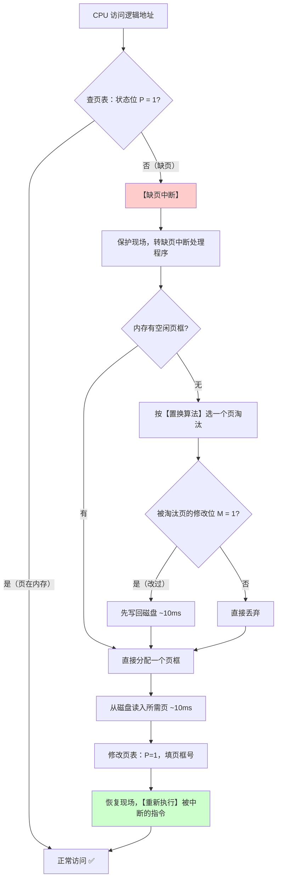
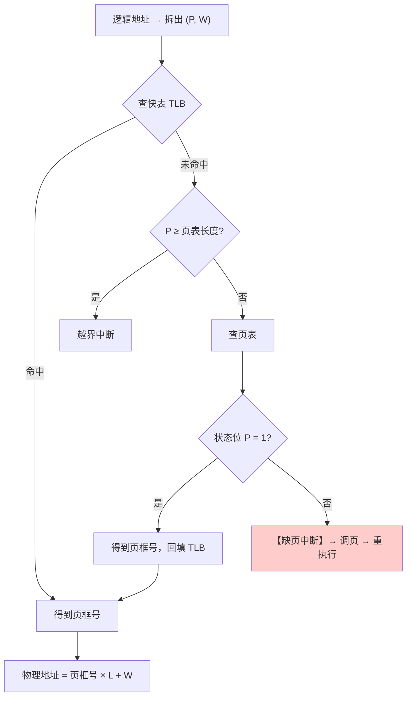
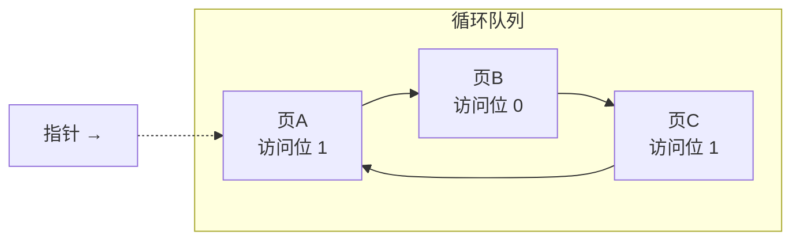
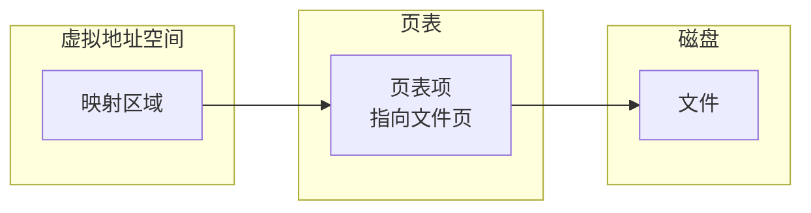
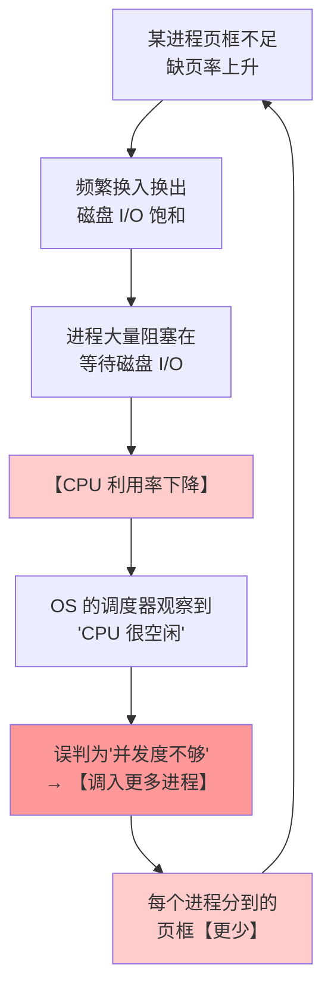

# 精通虚拟内存：请求分页、页面置换算法与抖动

> 课程编号：OS07
> 路线图来源：计算机基础四大件 · 操作系统（408 第 3 章下半）
> 难度：⭐⭐⭐⭐⭐
> 预计阅读时间：95 分钟
> 内容基准：2026 年 8 月（408 考纲操作系统第 3 章「虚拟内存管理」）
> **代码语言：Go**。本章用 Go 实现四种置换算法并复现抖动现象。

---

## 引言：8 GB 内存，为什么能跑 100 GB 的程序

写一个申请 100 GB 内存的 Go 程序，在一台只有 8 GB 内存的机器上跑：

```go
package main

import (
    "fmt"
    "syscall"
)

func main() {
    const size = 100 << 30 // 100 GB
    data, err := syscall.Mmap(-1, 0, size,
        syscall.PROT_READ|syscall.PROT_WRITE,
        syscall.MAP_PRIVATE|syscall.MAP_ANONYMOUS|syscall.MAP_NORESERVE)
    if err != nil {
        fmt.Println("失败:", err)
        return
    }
    fmt.Println("成功申请 100 GB！")

    // 只碰其中几个地方
    data[0] = 1
    data[50<<30] = 2
    data[99<<30] = 3
    fmt.Println("写入成功:", data[0], data[50<<30], data[99<<30])
}
```

**输出**：

```
成功申请 100 GB！
写入成功: 1 2 3
```

再看实际内存占用：

```bash
$ ps -o pid,vsz,rss,comm -p <pid>
  PID    VSZ    RSS COMMAND
12345  104857600  4832 demo
       ↑虚拟 100GB  ↑实际驻留 4.8MB
```

**虚拟内存 100 GB，物理内存只用了 4.8 MB。**

原因：`mmap` 只是在页表里**建立了映射关系**，并没有真的分配物理页框。只有当你**真正访问**某个地址时，才触发**缺页中断**，OS 才分配一个物理页框。100 GB 里我们只碰了 3 个地方，所以只分配了 3 个页（加上运行时自身的开销）。

这就是虚拟内存的核心思想：

> **程序运行不需要全部装入内存，只需要装入【当前正在用的那部分】。**

理论依据是**局部性原理**（[CO05](../computer-organization/CO05-精通-Cache-与虚拟存储器.md) 已经见过一次）：

| 局部性 | 在虚拟内存中的体现 |
|---|---|
| **时间局部性** | 刚访问过的页，**很快还会访问**（循环体所在的页） |
| **空间局部性** | 访问了某页，**它相邻的页也很可能被访问**（顺序执行、数组遍历） |

**但天下没有免费的午餐**：物理内存不够时必须"换出"某些页。**换出谁？** 换错了就会：

```
换出的页马上又要用 → 缺页 → 换入 → 又换出另一个马上要用的页 → 缺页 …
     ↓
【抖动 Thrashing】：CPU 99% 的时间在等磁盘，几乎不干活
```

本章讲清楚：请求分页怎么工作、缺页了换谁（五种置换算法）、以及怎么避免抖动。

读完你应该能：

- 说清虚拟内存的三个特征与实现的三个前提
- 画出请求分页的页表项结构，说清每个字段的作用
- 完整叙述缺页中断的处理流程
- **手工模拟 OPT、FIFO、LRU、CLOCK 四种置换算法**（408 必考）
- 解释 Belady 异常为什么只出现在 FIFO
- 说清抖动的成因与工作集的作用

---

## 第一章 虚拟内存的基本概念

### 1.1 传统存储管理的两个问题

| 问题 | 表现 |
|---|---|
| **一次性** | 作业**必须全部装入**内存才能运行 → 大作业跑不了；小作业挤占内存 |
| **驻留性** | 作业装入后**一直驻留**内存直到结束 → 长期不用的部分也白占着 |

**观察**：很多程序中有大量**很少执行**的代码（错误处理分支、罕见功能），把它们一直放在内存里是浪费。

### 1.2 虚拟内存的三个特征

| 特征 | 含义 |
|---|---|
| **多次性** | 作业**分多次调入**内存运行（对应打破"一次性"） |
| **对换性** | 作业运行时**可以换进换出**（对应打破"驻留性"） |
| **虚拟性** | 逻辑上**扩充了内存容量**，用户看到的内存远大于实际物理内存 |

> ⚠️ **"虚拟性"是最终目的，"多次性"和"对换性"是手段**。三者不是并列关系。408 常考"虚拟内存最重要的特征是什么"→ **虚拟性**。

### 1.3 实现虚拟内存的三个前提

| 前提 | 说明 |
|---|---|
| **① 足够大的辅存** | 存放换出的页 |
| **② 一定容量的内存** | 至少能装下当前活跃的页 |
| **③ 地址变换机构（MMU）** | 把逻辑地址映射到物理地址，且能**检测出"页不在内存"** |

### 1.4 虚拟内存的容量上限

```
虚拟内存容量 = min(【地址总线位数决定的寻址空间】, 【内存 + 外存容量之和】)
```

**例**：32 位系统，物理内存 4GB，硬盘 500GB。

```
地址空间上限 = 2³² = 4GB
内外存之和   = 4GB + 500GB = 504GB

虚拟内存容量 = min(4GB, 504GB) = 4GB   ← 受限于地址位数
```

> ⚠️ **常见误解**："硬盘越大虚拟内存越大"。**在 32 位系统上不成立**——地址总线只有 32 位，最多寻址 4GB，再大的硬盘也用不上。64 位系统才不受这个限制（$2^{48}$ = 256 TB 的有效寻址空间）。

---

## 第二章 请求分页管理

**请求分页 = 基本分页（[OS06](./OS06-精通-内存管理.md)）+ 请求调页 + 页面置换。**

### 2.1 页表项的扩充

**基本分页的页表项**：只有页框号。

**请求分页的页表项**：

```
┌────────┬────────┬──────────┬────────┬────────────┐
│ 页号   │ 页框号  │ 状态位 P  │ 访问字段A│ 修改位 M │ 外存地址 │
└────────┴────────┴──────────┴────────┴────────────┘
```

| 字段 | 作用 |
|---|---|
| **状态位 P（有效位/存在位）** | **该页是否已在内存**（0 → 缺页） |
| **访问字段 A** | 记录**最近被访问的情况**（次数或时间），供**置换算法**参考 |
| **修改位 M（脏位）** | 该页调入后**是否被修改过** |
| **外存地址** | 该页在**磁盘上的位置** |

> ⭐ **修改位 M 的价值**：换出一页时——
> - **M = 0**（没改过）→ 磁盘上的副本仍然有效 → **直接丢弃，不用写盘** ✅
> - **M = 1**（改过）→ **必须先写回磁盘**，再换出 ❌ 多一次磁盘 I/O
>
> 一次磁盘写要 **10 ms**，能省则省。这就是"改进型 CLOCK 算法"要优先淘汰 M=0 页面的全部原因。

### 2.2 缺页中断的处理流程



**四个关键点**：

**① 缺页中断属于"内中断"中的"故障（Fault）"**

回顾 [OS01](./OS01-精通-操作系统概述与运行环境.md) §3.2：

| 类型 | 返回位置 |
|---|---|
| 陷入 Trap（系统调用） | **下一条**指令 |
| **故障 Fault（缺页）** | **当前指令，重新执行** ⭐ |
| 终止 Abort | 不返回 |

**为什么必须重新执行当前指令**：这条指令因为拿不到数据而**没能完成**，页调入后要**重做一遍**才能拿到数据。

**② 一条指令可能产生多次缺页中断**

```asm
MOV  [目的地址], [源地址]     ; 这条指令可能：
                             ; ① 取指令本身缺页
                             ; ② 读源操作数缺页
                             ; ③ 写目的操作数缺页
                             ; → 【最多 3 次缺页中断】
```

若操作数跨页存放，次数还会更多。

**③ 缺页中断在指令执行【过程中】产生**

这与外中断不同——外中断在**指令执行结束**时才检查。

**④ 缺页的代价是巨大的**

```
正常访存（TLB 命中）：      ~1 ns
缺页 + 磁盘 I/O：           ~10 ms = 10,000,000 ns

【差 1000 万倍】
```

> 💡 **正因为代价如此悬殊，页面置换算法的每 1% 命中率提升都极其值钱**——这和 [CO05](../computer-organization/CO05-精通-Cache-与虚拟存储器.md) 里 Cache 命中率的道理相同，但**杠杆大了 10 万倍**。

### 2.3 请求分页的地址变换



> ⚠️ **快表中的页一定在内存中**（TLB 只缓存 P=1 的表项）。所以 **TLB 命中 ⟹ 一定不缺页**——这是 [CO05](../computer-organization/CO05-精通-Cache-与虚拟存储器.md) §5.4 讲过的"不可能组合"。

---

## 第三章 页面置换算法（核心考点）

统一用这个**页面访问序列**演示（**物理块数 = 3**）：

```
7, 0, 1, 2, 0, 3, 0, 4, 2, 3, 0, 3, 2, 1, 2, 0, 1, 7, 0, 1
```

### 3.1 OPT（最佳置换算法）

**规则**：淘汰**未来最长时间内不会被访问**的页。

```
访问  7  0  1  2  0  3  0  4  2  3  0  3  2  1  2  0  1  7  0  1
────────────────────────────────────────────────────────────────
块1   7  7  7  2  2  2  2  2  2  2  2  2  2  2  2  2  2  7  7  7
块2      0  0  0  0  0  0  0  0  0  0  0  0  0  0  0  0  0  0  0
块3         1  1  1  3  3  3  3  3  3  3  3  1  1  1  1  1  1  1
────────────────────────────────────────────────────────────────
      F  F  F  F  -  F  -  F  -  -  -  -  -  F  -  -  -  F  -  -

缺页 9 次，缺页率 = 9/20 = 45%
```

**逐步说明关键决策**：

```
访问 2（第4个）：内存 {7,0,1} 已满
  未来访问序列：0,3,0,4,2,3,0,3,2,1,...
  7 → 后面第 17 个位置才出现（最远）★ 淘汰 7
  0 → 下一个就是
  1 → 第 13 个位置
  
访问 3（第6个）：内存 {2,0,1} 已满
  未来：0,4,2,3,0,3,2,1,...
  2 → 第 8 个   0 → 下一个   1 → 第 13 个（最远）★ 淘汰 1
  
访问 4（第8个）：内存 {2,0,3} 已满
  未来：2,3,0,3,2,1,...
  2 → 下一个   0 → 第 10 个   3 → 第 9 个
  ★ 淘汰 0（最远）
  
  等等——重新核对：访问 4 时，剩余序列是 2,3,0,3,2,1,2,0,1,7,0,1
  2 → 位置 1（最近）
  3 → 位置 2
  0 → 位置 3
  三者都会用到，0 最远 → ★ 淘汰 0
```

| 优点 | 缺点 |
|---|---|
| ✅ **缺页率最低，是理论最优** | ❌ **无法实现**——需要预知未来的访问序列 |

> 💡 **OPT 的价值是作为"基准线"**——用来衡量其他算法离最优有多远。这和 [OS03](./OS03-精通-CPU-调度.md) 的 SJF 是同一个处境：理论最优但需要预知未来。

### 3.2 FIFO（先进先出）

**规则**：淘汰**最早进入内存**的页。用一个**队列**维护。

```
访问  7  0  1  2  0  3  0  4  2  3  0  3  2  1  2  0  1  7  0  1
────────────────────────────────────────────────────────────────
块1   7  7  7  2  2  2  2  4  4  4  0  0  0  0  0  0  0  7  7  7
块2      0  0  0  0  3  3  3  2  2  2  2  2  1  1  1  1  1  0  0
块3         1  1  1  1  0  0  0  3  3  3  3  3  2  2  2  2  2  1
────────────────────────────────────────────────────────────────
      F  F  F  F  -  F  F  F  F  F  F  -  -  F  F  -  -  F  F  F

缺页 15 次，缺页率 = 15/20 = 75%
```

| 优点 | 缺点 |
|---|---|
| ✅ 实现简单（一个队列） | ❌ **性能差**——最早进来的页可能是最常用的（如主程序页）<br/>❌ **有 Belady 异常** |

#### Belady 异常

> **增加物理块数，缺页次数反而增加。**

**经典反例**（访问序列 `3,2,1,0,3,2,4,3,2,1,0,4`）：

| 物理块数 | FIFO 缺页次数 |
|---|---|
| **3 块** | **9 次** |
| **4 块** | **10 次** ⚠️ |

**根本原因**：**FIFO 不满足"栈算法"性质（包含性）**——4 块 Cache 的驻留集**不是** 3 块驻留集的超集。

> ⚠️ **只有 FIFO 有 Belady 异常**。**LRU、OPT、CLOCK 都没有**（它们都是栈算法）。这是 408 的必考判断题。
>
> [CO05](../computer-organization/CO05-精通-Cache-与虚拟存储器.md) §3.2 从 Cache 角度讲过同一现象。

### 3.3 LRU（最近最久未使用）

**规则**：淘汰**最近最久未被访问**的页。**往回看**（对比 OPT 是往前看）。

```
访问  7  0  1  2  0  3  0  4  2  3  0  3  2  1  2  0  1  7  0  1
────────────────────────────────────────────────────────────────
块1   7  7  7  2  2  2  2  4  4  4  0  0  0  1  1  1  1  1  1  1
块2      0  0  0  0  0  0  0  0  3  3  3  3  3  3  0  0  0  0  0
块3         1  1  1  3  3  3  2  2  2  2  2  2  2  2  2  7  7  7
────────────────────────────────────────────────────────────────
      F  F  F  F  -  F  -  F  F  F  F  -  -  F  -  F  -  F  -  -

缺页 12 次，缺页率 = 12/20 = 60%
```

**关键决策示例**：

```
访问 4（第8个）：内存 {2,0,3}，最近访问顺序（新→旧）：0,3,2
  最久未用的是 2 → ★ 淘汰 2
  
访问 2（第9个）：内存 {4,0,3}，最近顺序：4,0,3
  最久未用的是 3 → ★ 淘汰 3
```

| 优点 | 缺点 |
|---|---|
| ✅ **性能接近 OPT**（局部性原理保证"最近用过的马上还会用"） | ❌ **硬件开销大**——需要记录每页的访问时间戳或维护访问栈 |
| ✅ **无 Belady 异常**（是栈算法） | ❌ 每次访存都要更新记录，代价高 |

> ⚠️ **纯 LRU 在实际系统中很少用**。因为它要求**每次访存**都更新时间戳/链表，硬件成本太高。实际系统用的是它的**近似算法 CLOCK**。

### 3.4 CLOCK（时钟置换 / NRU 最近未用）

**思路：用一个"访问位"近似 LRU，代价极低。**

**规则**：

```
① 每页有一个【访问位】，被访问时硬件自动置 1
② 所有页组成【循环队列】，有一个指针
③ 淘汰时，指针扫描：
     访问位 = 1 → 【置 0】，指针后移（给它一次机会）
     访问位 = 0 → 【淘汰它】
④ 指针停在被淘汰页的下一个位置
```



**演示**（3 块，访问序列 `1,2,3,4,1,2,5,1,2,3,4,5`）：

```
访问 1: 装入，[1(1)]                      指针→空位
访问 2: 装入，[1(1), 2(1)]
访问 3: 装入，[1(1), 2(1), 3(1)]          满了，指针指向 1
访问 4: 扫描
        1 访问位=1 → 置0，指针后移
        2 访问位=1 → 置0，指针后移
        3 访问位=1 → 置0，指针后移
        回到 1，访问位=0 → ★ 淘汰 1，装入 4
        [4(1), 2(0), 3(0)]  指针指向 2
访问 1: 缺页。2 访问位=0 → ★ 淘汰 2，装入 1
        [4(1), 1(1), 3(0)]  指针指向 3
访问 2: 缺页。3 访问位=0 → ★ 淘汰 3，装入 2
        [4(1), 1(1), 2(1)]  指针指向 4
...
```

> ⭐ **CLOCK 的精髓：给每个页"一次机会"**。第一次扫到访问位为 1 的页，不淘汰它，只是把标记清掉；只有第二次扫到它还是 0（说明这一圈内没被访问过），才淘汰。
>
> **这就用一个二进制位近似了 LRU 的"最近是否用过"**，硬件代价从"每页一个时间戳"降到"每页一个 bit"。

**最坏情况**：所有页访问位都是 1 → 指针**扫一圈全部置 0**，第二圈淘汰第一个 → 退化成 FIFO。

### 3.5 改进型 CLOCK（考虑修改位）

**动机**：换出**没修改过**的页不用写盘（省 10 ms），应该优先淘汰。

用 **(访问位 A, 修改位 M)** 组成四类：

| 类别 | (A, M) | 含义 | 淘汰优先级 |
|---|---|---|---|
| **第 1 类** | **(0, 0)** | 最近没用、没改过 | **最优先**（不用写盘） |
| **第 2 类** | **(0, 1)** | 最近没用、**改过** | 次之（要写盘） |
| **第 3 类** | **(1, 0)** | 最近用过、没改过 | 再次之 |
| **第 4 类** | **(1, 1)** | 最近用过、改过 | **最后** |

**扫描算法**（最多 3 轮）：

```
【第 1 轮】找 (0, 0)，【不修改任何标志位】
    找到 → 淘汰，结束
    
【第 2 轮】找 (0, 1)，【把扫过的页的访问位 A 置 0】
    找到 → 淘汰，结束
    
【第 3 轮】再找 (0, 0)
    （因为第 2 轮已经把 A 全清了，原来的 (1,0) 现在变成了 (0,0)）
    找到 → 淘汰，结束
    
【第 4 轮】再找 (0, 1)
    必定能找到（原来的 (1,1) 现在变成了 (0,1)）
```

> 💡 **改进型 CLOCK 用"多扫几轮"换"少一次磁盘写"**——扫描是纳秒级的内存操作，磁盘写是 10 ms，**这个交换极其划算**。

### 3.6 五种算法总对比

| 算法 | 缺页率 | 实现复杂度 | Belady 异常 | 实际使用 |
|---|---|---|---|---|
| **OPT** | **最低（理论下界）** | **无法实现** | ❌ 无 | 只作基准 |
| **FIFO** | **最高（最差）** | 最简单 | ✅ **有** ⚠️ | 几乎不用 |
| **LRU** | 接近 OPT | **硬件开销大** | ❌ 无 | 少用（太贵） |
| **CLOCK** | 略差于 LRU | **低** ⭐ | ❌ 无 | **广泛使用** |
| **改进型 CLOCK** | 略差于 LRU，**I/O 次数最少** | 中 | ❌ 无 | **实际系统采用** |

**本例的缺页次数对比**（3 块，同一序列）：

| 算法 | 缺页次数 | 缺页率 |
|---|---|---|
| **OPT** | **9** | 45% |
| **LRU** | 12 | 60% |
| **FIFO** | 15 | 75% |

---

## 第四章 用 Go 实现四种置换算法

```go
package main

import "fmt"

// FIFO：用队列，淘汰最早进来的
func fifo(pages []int, frames int) int {
    mem := make([]int, 0, frames)
    inMem := map[int]bool{}
    faults := 0

    for _, p := range pages {
        if inMem[p] {
            continue // 命中
        }
        faults++
        if len(mem) == frames {
            victim := mem[0] // ★ 队首 = 最早进来的
            mem = mem[1:]
            delete(inMem, victim)
        }
        mem = append(mem, p)
        inMem[p] = true
    }
    return faults
}

// LRU：用切片模拟访问栈，栈顶是最近使用的
func lru(pages []int, frames int) int {
    var stack []int // stack[0] 最久未用，stack[len-1] 最近使用
    faults := 0

    for _, p := range pages {
        idx := -1
        for i, v := range stack {
            if v == p {
                idx = i
                break
            }
        }
        if idx >= 0 { // 命中：移到栈顶
            stack = append(append(stack[:idx], stack[idx+1:]...), p)
            continue
        }
        faults++
        if len(stack) == frames {
            stack = stack[1:] // ★ 淘汰栈底（最久未用）
        }
        stack = append(stack, p)
    }
    return faults
}

// OPT：往前看，淘汰未来最久不用的
func opt(pages []int, frames int) int {
    mem := make([]int, 0, frames)
    faults := 0

    for i, p := range pages {
        hit := false
        for _, v := range mem {
            if v == p {
                hit = true
                break
            }
        }
        if hit {
            continue
        }
        faults++
        if len(mem) == frames {
            victim, farthest := 0, -1
            for j, v := range mem {
                next := len(pages) // ★ 未来不再出现 → 视为无穷远
                for k := i + 1; k < len(pages); k++ {
                    if pages[k] == v {
                        next = k
                        break
                    }
                }
                if next > farthest {
                    farthest, victim = next, j
                }
            }
            mem[victim] = p
            continue
        }
        mem = append(mem, p)
    }
    return faults
}

// CLOCK：循环扫描 + 访问位
func clock(pages []int, frames int) int {
    type frame struct {
        page int
        used bool // 访问位
    }
    mem := make([]frame, 0, frames)
    hand, faults := 0, 0

    for _, p := range pages {
        hit := false
        for i := range mem {
            if mem[i].page == p {
                mem[i].used = true // ★ 命中时置访问位
                hit = true
                break
            }
        }
        if hit {
            continue
        }
        faults++
        if len(mem) < frames {
            mem = append(mem, frame{p, true})
            hand = len(mem) % frames
            continue
        }
        for { // ★ 循环扫描找访问位为 0 的
            if !mem[hand].used {
                mem[hand] = frame{p, true}
                hand = (hand + 1) % frames
                break
            }
            mem[hand].used = false // ★ 给一次机会
            hand = (hand + 1) % frames
        }
    }
    return faults
}

func main() {
    pages := []int{7, 0, 1, 2, 0, 3, 0, 4, 2, 3, 0, 3, 2, 1, 2, 0, 1, 7, 0, 1}

    fmt.Printf("%-8s %-8s %-8s\n", "算法", "缺页数", "缺页率")
    for _, a := range []struct {
        name string
        f    func([]int, int) int
    }{{"OPT", opt}, {"LRU", lru}, {"CLOCK", clock}, {"FIFO", fifo}} {
        n := a.f(pages, 3)
        fmt.Printf("%-8s %-8d %.1f%%\n", a.name, n, float64(n)/float64(len(pages))*100)
    }

    // ★ 验证 Belady 异常
    fmt.Println("\n=== Belady 异常验证（FIFO） ===")
    belady := []int{3, 2, 1, 0, 3, 2, 4, 3, 2, 1, 0, 4}
    for f := 3; f <= 4; f++ {
        fmt.Printf("FIFO %d 块: 缺页 %2d 次   LRU %d 块: 缺页 %2d 次\n",
            f, fifo(belady, f), f, lru(belady, f))
    }
}
```

**输出**：

```
算法     缺页数   缺页率
OPT      9        45.0%
LRU      12       60.0%
CLOCK    13       65.0%
FIFO     15       75.0%

=== Belady 异常验证（FIFO） ===
FIFO 3 块: 缺页  9 次   LRU 3 块: 缺页 10 次
FIFO 4 块: 缺页 10 次   LRU 4 块: 缺页  8 次
       ↑ FIFO 块数增加，缺页反而【变多】= Belady 异常
                                    ↑ LRU 块数增加，缺页【单调减少】
```

**两个关键观察**：

1. **缺页数排序 `OPT < LRU < CLOCK < FIFO`** —— 与理论完全一致，CLOCK 确实是 LRU 的良好近似
2. **FIFO 从 3 块到 4 块，缺页从 9 涨到 10**（Belady 异常）；**LRU 从 10 降到 8**（单调改善）

---

## 第五章 页面分配与置换策略

### 5.1 两个正交的维度

| 维度 | 选项 |
|---|---|
| **分配方式** | **固定分配**（页框数不变） / **可变分配**（页框数可调整） |
| **置换范围** | **局部置换**（只在本进程的页中换） / **全局置换**（可换其他进程的页） |

**三种可行组合**：

| 策略 | 说明 | 特点 |
|---|---|---|
| **固定分配 + 局部置换** | 页框数固定，只换自己的页 | 简单；**难以确定合适的页框数** |
| **可变分配 + 全局置换** | 缺页就从空闲池或其他进程要页框 | 实现简单；**可能过度剥夺其他进程** |
| **可变分配 + 局部置换** ⭐ | 只换自己的页，但**根据缺页率动态调整**分配的页框数 | **最优**，但开销大 |

> ⚠️ **"固定分配 + 全局置换"是不存在的组合**——全局置换意味着从别的进程抢页框，那本进程的页框数就变了，与"固定分配"矛盾。**这是 408 的经典判断题。**

### 5.2 可变分配 + 局部置换的调节机制

```
监控每个进程的缺页率：
    缺页率【过高】 → 说明分配的页框【太少】 → 【增加】页框
    缺页率【过低】 → 说明分配的页框【太多】（浪费）→ 【减少】页框
```

### 5.3 调页时机

| 策略 | 做法 | 特点 |
|---|---|---|
| **预调页** | **预测**将来要用的页，提前批量调入 | 适合**进程首次启动**（一次性调入一批）；运行中命中率通常只有 50% 左右 |
| **请求调页** | **缺页时才调入** | 命中率 100%（调入的一定要用），但**每次只调一页，I/O 开销大** |

**实际系统两者结合**：进程启动时预调页（局部性好，猜得准），运行中用请求调页。

### 5.4 从何处调入

内存分为**对换区**（连续存储，I/O 快）和**文件区**（离散存储，I/O 慢）：

| 情况 | 策略 |
|---|---|
| **对换区空间足够** | 运行前把**全部数据复制到对换区**，之后一律从对换区调页 |
| **对换区空间不足** | **不会被修改的数据**（代码）从**文件区**调入（换出时直接丢弃，不用写回）<br/>**可能被修改的部分**换出到**对换区** |
| **UNIX 方式** | 首次使用从**文件区**调入；换出时写到**对换区**，再次使用从对换区调 |

---

## 第六章 抖动与工作集

### 6.1 什么是抖动（Thrashing）

**现象**：刚换出的页面**马上又要被访问**，导致系统频繁地换入换出，**CPU 大部分时间在等磁盘 I/O，几乎不干实际工作**。


> ⚠️ **抖动最可怕的地方是它有【正反馈】**：CPU 利用率低 → OS 认为该提高并发度 → 调入更多进程 → 每个进程分到的页框更少 → 缺页更严重 → CPU 利用率更低……**系统雪崩式崩溃**。

**多道程序度与 CPU 利用率的关系**：

```
CPU
利用率
  │        ╭─────╮
  │       ╱       ╲          ← 越过临界点后【断崖式下跌】
  │      ╱         ╲
  │     ╱           ╲___________
  │    ╱                        
  └───┴──────┴──────────────────→ 多道程序度
            临界点
```

**根本原因：分配给进程的物理块数【不足以容纳其活跃页面集合】。**

### 6.2 工作集（Working Set）

**定义**：在某段时间间隔 $\Delta$（**窗口尺寸**）内，进程**实际访问过的页面集合**。

**例**：窗口 $\Delta = 5$，访问序列：

```
… 2 6 1 5 7 7 7 7 5 1 6 2 3 4 1 2 3 4 4 4 3 4 4 4 …
                    └───┬───┘
                     最近 5 次访问：{7, 5, 1}
                     工作集 WS = {1, 5, 7}，|WS| = 3
```

**工作集的性质**：

| 性质 | 说明 |
|---|---|
| **随窗口 Δ 增大而增大** | 但增长会趋于平缓（局部性所致） |
| **反映进程当前的"活跃页面"** | 是分配页框数的重要依据 |

> ⭐ **工作集模型的核心原则**：
>
> **分配给进程的物理块数应【略大于】其工作集大小。**
>
> 若分配的页框数 < 工作集大小 → **必然抖动**。

### 6.3 抖动的解决办法

| 方法 | 做法 |
|---|---|
| **① 工作集模型** | 按工作集大小分配页框；工作集装不下就**挂起**该进程 |
| **② 缺页率控制** | 监控缺页率，过高就加页框，过低就减 |
| **③ 挂起（中级调度）** | 内存实在不够时，**换出**优先级低的进程，腾出页框 |
| **④ 加内存** | 最直接（也最贵） |

> 💡 **Linux 上抖动的直接症状**：`vmstat 1` 里 `si`（swap in）和 `so`（swap out）持续非零，同时 `wa`（I/O wait）飙高、`us`+`sy` 很低。这时候唯一有效的处理是**杀掉或挂起大内存进程**——继续等只会更糟。

### 6.4 用 Go 复现抖动

```go
package main

import (
    "fmt"
    "math/rand"
    "time"
)

// 模拟：工作集大小固定，逐步减少可用页框数，观察缺页率的变化
func simulate(workingSetSize, frames, accesses int) float64 {
    mem := make([]int, 0, frames)
    inMem := map[int]bool{}
    faults := 0

    for i := 0; i < accesses; i++ {
        // ★ 访问模式：90% 落在工作集内（局部性）
        var page int
        if rand.Float64() < 0.9 {
            page = rand.Intn(workingSetSize)
        } else {
            page = workingSetSize + rand.Intn(50)
        }

        if inMem[page] {
            continue
        }
        faults++
        if len(mem) == frames { // FIFO 置换
            delete(inMem, mem[0])
            mem = mem[1:]
        }
        mem = append(mem, page)
        inMem[page] = true
    }
    return float64(faults) / float64(accesses) * 100
}

func main() {
    rand.Seed(time.Now().UnixNano())
    const ws = 20 // 工作集大小 20 页

    fmt.Printf("工作集大小 = %d 页\n\n", ws)
    fmt.Printf("%-10s %-12s %s\n", "分配页框", "缺页率", "状态")
    for _, f := range []int{40, 30, 25, 20, 15, 10, 5} {
        rate := simulate(ws, f, 100000)
        status := "正常"
        if f < ws {
            status = "★ 页框 < 工作集 → 抖动"
        }
        fmt.Printf("%-10d %-12.2f%% %s\n", f, rate, status)
    }
}
```

**典型输出**：

```
工作集大小 = 20 页

分配页框    缺页率       状态
40         1.15       % 正常
30         1.31       % 正常
25         1.68       % 正常
20         3.42       % 正常
15         26.85      % ★ 页框 < 工作集 → 抖动
10         48.12      % ★ 页框 < 工作集 → 抖动
5          71.03      % ★ 页框 < 工作集 → 抖动
```

**关键观察**：**页框数从 20 降到 15（只少了 25%），缺页率从 3.4% 暴涨到 26.9%（涨了 8 倍）**。

> ⭐ **这就是抖动的非线性特征**：页框数在工作集大小附近有一个**悬崖**。略高于工作集时一切正常；一旦低于工作集，性能断崖式下跌。
>
> **工程含义**：容量规划时**必须给足内存**。"内存用了 90%，还能再挤一挤"这种想法非常危险——你可能就站在悬崖边上。

---

## 第七章 内存映射文件

**思路：把文件直接映射到进程的虚拟地址空间，像访问内存一样访问文件。**



**优点**：

| 优点 | 说明 |
|---|---|
| **省掉一次拷贝** | 传统 `read` 是"磁盘→内核缓冲区→用户缓冲区"；mmap 是"磁盘→页缓存"，用户直接访问 |
| **按需加载** | 只有真正访问的部分才触发缺页调入 |
| **便于共享** | 多个进程映射同一文件 → 天然共享同一份页缓存 |
| **简化编程** | 不需要 `seek`/`read`/`write`，直接用指针 |

```go
package main

import (
    "fmt"
    "os"
    "syscall"
)

func main() {
    f, _ := os.Open("bigfile.dat")
    defer f.Close()
    fi, _ := f.Stat()

    // ★ 把整个文件映射到虚拟地址空间
    data, err := syscall.Mmap(int(f.Fd()), 0, int(fi.Size()),
        syscall.PROT_READ, syscall.MAP_SHARED)
    if err != nil {
        panic(err)
    }
    defer syscall.Munmap(data)

    // ★ 像访问数组一样访问文件，不需要 Read
    fmt.Println("第一个字节:", data[0])
    fmt.Println("最后一个字节:", data[len(data)-1])
    // ↑ 访问 data[len-1] 时才触发那一页的缺页调入
}
```

> 💡 **mmap 是"虚拟内存机制的直接暴露"**——它让用户程序能主动利用页表和缺页机制。数据库（如 LMDB、MongoDB 的早期版本）大量使用 mmap 来管理数据文件。

---

## 第八章 408 高频考点与陷阱清单

### 8.1 考点分布

第 3 章下半是操作系统**最重要的部分之一**：**2-3 道选择题 + 高概率的大题**（页面置换模拟）。

最常考：

1. **页面置换算法的手工模拟与缺页率计算**（大题必考）
2. **Belady 异常**
3. 缺页中断的类型与处理流程
4. 抖动与工作集
5. 分配置换策略的组合

### 8.2 十八个陷阱

**陷阱 1：虚拟内存最重要的特征是多次性**

**错，是虚拟性**。多次性和对换性是**手段**，虚拟性是**目的**。

**陷阱 2：虚拟内存容量 = 内存 + 外存**

**不准确**。是 $\min(\text{地址位数决定的空间},\ \text{内存} + \text{外存})$。32 位系统上限就是 4GB，硬盘再大也没用。

**陷阱 3：缺页中断是外中断**

**错**。缺页是**内中断中的"故障（Fault）"**——由访存指令本身引发。

**陷阱 4：缺页中断处理完返回下一条指令**

**错**。**故障返回【当前】指令重新执行**——因为这条指令没能完成。

**陷阱 5：一条指令最多产生一次缺页中断**

**错**。一条指令可能产生**多次**：取指令缺页、取源操作数缺页、写目的操作数缺页，跨页存放时更多。

**陷阱 6：OPT 算法在实际系统中广泛使用**

**错**。OPT 需要**预知未来的访问序列**，**无法实现**，只用作衡量其他算法的基准。

**陷阱 7：LRU 算法会出现 Belady 异常**

**错**。**只有 FIFO 有 Belady 异常**。LRU、OPT、CLOCK 都是**栈算法**，满足包含性，不会出现。

**陷阱 8：LRU 是实际系统最常用的算法**

**错**。LRU **硬件开销太大**（每次访存都要更新时间戳）。实际系统用的是它的近似——**CLOCK / 改进型 CLOCK**。

**陷阱 9：CLOCK 算法扫描时遇到访问位为 1 就淘汰**

**错，反了**。访问位 = 1 **不淘汰**，而是**置 0 后指针后移**（给一次机会）；访问位 = 0 才淘汰。

**陷阱 10：改进型 CLOCK 优先淘汰访问位为 0 的页**

**不完整**。它优先淘汰 **(A=0, M=0)** 的页——**同时考虑访问位和修改位**，因为 M=0 的页换出时**不用写盘**，省一次 10ms 的磁盘 I/O。

**陷阱 11：修改位 M 的作用是判断页面是否被访问过**

**错**。**访问位 A** 判断是否被访问；**修改位 M** 判断是否被**写过**（决定换出时要不要写回磁盘）。

**陷阱 12："固定分配 + 全局置换"是可行的策略**

**错，这个组合不存在**。全局置换会从别的进程抢页框，导致本进程页框数变化，与"固定分配"矛盾。

**陷阱 13：预调页策略的命中率很高**

**错**。预调页是**猜测**将来要用的页，运行中的命中率通常只有 **50% 左右**。它主要用在**进程首次启动**时。

**陷阱 14：抖动是因为置换算法选得不好**

**不准确**。抖动的**根本原因是分配的物理块数不足以容纳工作集**。换个算法只能缓解，不能根治。

**陷阱 15：抖动时应该提高多道程序度**

**大错，恰恰相反**。抖动时 CPU 利用率低，若 OS 误以为"并发不够"而调入更多进程，会**加剧抖动，形成正反馈雪崩**。正确做法是**挂起部分进程**。

**陷阱 16：工作集大小是固定的**

**错**。工作集**随窗口尺寸 Δ 增大而增大**，也随程序运行阶段而变化。

**陷阱 17：请求分页系统中，页面大小越小越好**

**不准确**。页面小 → 内部碎片少、缺页率可能降低，但 **页表变大**、缺页中断次数增多。需要权衡。

**陷阱 18：快表命中时也可能缺页**

**错**。TLB 只缓存**状态位 P=1** 的页表项，**TLB 命中 ⟹ 页一定在内存 ⟹ 不会缺页**。

### 8.3 速查卡

```
【虚拟内存】
三特征：多次性、对换性、【虚拟性（目的）】
三前提：足够大的辅存、一定容量的内存、【地址变换机构】
容量 = min(地址位数决定的空间, 内存+外存)

【请求分页的页表项】
页框号 | 状态位P（在不在内存）| 访问字段A（置换算法用）| 修改位M（要不要写盘）| 外存地址

【缺页中断】
属于【内中断-故障(Fault)】
处理完返回【当前指令重新执行】
一条指令可能产生【多次】缺页

【置换算法】
OPT   ：淘汰未来最久不用的；【最优但无法实现】
FIFO  ：淘汰最早进来的；【最差】；【有 Belady 异常】
LRU   ：淘汰最久未用的；接近 OPT；【硬件开销大】
CLOCK ：访问位=1 → 置0后移（给一次机会）；=0 → 淘汰
改进CLOCK：优先淘汰 (A=0,M=0)，最多扫 4 轮

★ 只有 FIFO 有 Belady 异常；LRU/OPT/CLOCK 都是栈算法

【分配置换策略】
固定分配 + 局部置换  ✅
可变分配 + 全局置换  ✅
可变分配 + 局部置换  ✅（最优）
固定分配 + 全局置换  ❌【不存在】

【调页时机】
预调页  ：提前批量调入，适合【首次启动】，命中率约 50%
请求调页：缺页才调，命中率 100%，但 I/O 频繁

【抖动】
现象：频繁换入换出，CPU 空等磁盘
根因：【分配的物理块数 < 工作集大小】
危险：有【正反馈】—— CPU利用率低 → 调入更多进程 → 更糟
解决：工作集模型 / 缺页率控制 / 【挂起进程】/ 加内存

【工作集】
定义：窗口 Δ 内实际访问过的页面集合
原则：分配的物理块数应【略大于】工作集大小
```

---

## 第九章 Go ↔ C 对照

| 场景 | C | Go | 说明 |
|---|---|---|---|
| 内存映射文件 | `mmap()` | `syscall.Mmap` | 本章 §7 |
| 匿名映射（申请大块虚存） | `mmap(MAP_ANONYMOUS)` | `syscall.Mmap` + `MAP_ANONYMOUS` | 引言的 100GB 例子 |
| 不预留 swap | `MAP_NORESERVE` | 同左 | 允许超额分配 |
| 建议内核预读 | `madvise(MADV_WILLNEED)` | `syscall.Madvise` | 对应"预调页" |
| 建议内核回收 | `madvise(MADV_DONTNEED)` | 同左 | 主动释放物理页 |
| 锁定页不换出 | `mlock()` | `syscall.Mlock` | 防敏感数据落盘 |
| 查看缺页次数 | `getrusage()` | `syscall.Getrusage` | `Minflt` / `Majflt` |
| 查看 RSS/VSZ | `/proc/self/status` | 同左 | 或 `runtime.ReadMemStats` |

**观察缺页的两种类型**：

```go
package main

import (
    "fmt"
    "syscall"
)

func faults() (minor, major int64) {
    var ru syscall.Rusage
    syscall.Getrusage(syscall.RUSAGE_SELF, &ru)
    return ru.Minflt, ru.Majflt
}

func main() {
    m0, M0 := faults()

    // 申请并touch 100MB
    buf := make([]byte, 100<<20)
    for i := 0; i < len(buf); i += 4096 { // ★ 每页碰一下
        buf[i] = 1
    }

    m1, M1 := faults()
    fmt.Printf("次缺页 (minor, 不访盘): %d\n", m1-m0)
    fmt.Printf("主缺页 (major, 要访盘): %d\n", M1-M0)
}
```

**输出**：

```
次缺页 (minor, 不访盘): 25612
主缺页 (major, 要访盘): 0
```

| 类型 | 含义 | 代价 |
|---|---|---|
| **次缺页 minor** | 页表项无效，但**数据已在物理内存**（如页缓存里、或只需分配零页） | **微秒级** |
| **主缺页 major** | **必须从磁盘读入** | **~10 ms** |

> ⚠️ **线上服务监控要盯 `majflt`**。次缺页多是正常的（首次访问新分配的内存必然触发）；**主缺页持续增长意味着内存不足开始 swap，性能会断崖下跌**——这就是抖动的前兆。
>
> ```bash
> vmstat 1     # si/so 持续非零 + wa 高 = 正在抖动
> ```

---

## 第十章 练习题

### 选择题

**1.** 虚拟内存的三个特征中，**最重要**（体现其本质目的）的是：
A. 多次性　B. 对换性　C. 虚拟性　D. 离散性

**2.** 某 32 位系统，物理内存 4GB，硬盘 1TB。该系统虚拟内存的最大容量是：
A. 4GB　B. 1TB　C. 1004GB　D. 无上限

**3.** 缺页中断属于：
A. 外中断　B. 内中断中的陷入　C. 内中断中的故障　D. 内中断中的终止

**4.** 缺页中断处理完成后，CPU 应：
A. 执行下一条指令
B. 重新执行被中断的那条指令
C. 终止当前进程
D. 由用户程序决定

**5.** 请求分页系统的页表项中，用于判断"换出时是否需要写回磁盘"的字段是：
A. 状态位 P　B. 访问字段 A　C. 修改位 M　D. 外存地址

**6.** 下列页面置换算法中，会产生 **Belady 异常**的是：
A. OPT　B. LRU　C. FIFO　D. CLOCK

**7.** CLOCK 置换算法中，扫描到访问位为 1 的页面时，应该：
A. 立即淘汰该页
B. 将访问位置 0，指针后移
C. 将访问位置 1，指针后移
D. 跳过该页不做任何处理

**8.** 改进型 CLOCK 算法优先淘汰的页面是：
A. (访问位=1, 修改位=1)
B. (访问位=1, 修改位=0)
C. (访问位=0, 修改位=1)
D. (访问位=0, 修改位=0)

**9.** 下列页面分配与置换策略的组合中，**不存在**的是：
A. 固定分配 + 局部置换
B. 可变分配 + 全局置换
C. 可变分配 + 局部置换
D. 固定分配 + 全局置换

**10.** 产生"抖动（Thrashing）"的主要原因是：
A. 置换算法选择不当
B. 分配给进程的物理块数不足以容纳其工作集
C. 磁盘速度太慢
D. CPU 速度太快

**11.** 系统发生抖动时，正确的处理措施是：
A. 提高多道程序度，调入更多进程
B. 挂起部分进程，降低多道程序度
C. 增大页面大小
D. 改用 FIFO 置换算法

**12.** 关于工作集，**正确**的是：
A. 工作集大小是固定不变的
B. 工作集随窗口尺寸 Δ 增大而减小
C. 分配给进程的物理块数应略大于其工作集大小
D. 工作集只与页面大小有关

### 应用题

**13.** 设某进程的页面访问序列为：

```
4, 3, 2, 1, 4, 3, 5, 4, 3, 2, 1, 5
```

分别在**物理块数为 3** 和 **物理块数为 4** 的情况下，用 **FIFO**、**LRU**、**OPT** 三种算法模拟：

（1）画出每种情况的置换过程表
（2）统计缺页次数与缺页率
（3）指出哪种算法在哪种块数下出现了 Belady 异常

**14.** 某系统采用请求分页管理，页面大小 4KB，某进程的页表如下（页框号为十进制）：

| 页号 | 页框号 | 状态位 P | 访问位 A | 修改位 M |
|---|---|---|---|---|
| 0 | 12 | 1 | 1 | 0 |
| 1 | 5 | 1 | 0 | 1 |
| 2 | — | 0 | 0 | 0 |
| 3 | 8 | 1 | 1 | 1 |

（1）将逻辑地址 **9000** 和 **5000** 转换为物理地址（十进制）。
（2）若现在需要调入页 2，但内存已满，用**改进型 CLOCK** 算法应该淘汰哪一页？说明理由和扫描过程。
（3）若磁盘读写一页各需 10 ms，比较淘汰页 0 和淘汰页 3 的时间开销差异。

**15.** 某系统的页面访问情况如下，窗口尺寸 Δ = 6：

```
时刻:  1  2  3  4  5  6  7  8  9  10 11 12
页面:  2  6  1  5  7  7  7  5  1  6  2  1
```

（1）求 t = 6、t = 9、t = 12 时刻的工作集。
（2）若系统为该进程分配 3 个物理块，会发生什么？说明理由。

**16.** 详细解释**抖动（Thrashing）**现象：

（1）什么是抖动？
（2）为什么说抖动有"正反馈"效应？画出多道程序度与 CPU 利用率的关系曲线并解释。
（3）给出三种解决抖动的方法。

**17.** 为什么 **LRU 算法性能接近 OPT，但实际系统很少使用纯 LRU**？CLOCK 算法是如何用极低的代价近似 LRU 的？

### 答案与解析

<details>
<summary>点击展开</summary>

**1. C**

- **多次性**：分多次调入 → **手段**
- **对换性**：可以换进换出 → **手段**
- **虚拟性**：逻辑上扩充了内存容量 → **目的** ⭐

**虚拟性是虚拟内存的本质和最终目的**，前两者是实现它的技术手段。

D（离散性）是分页/分段的特征，不是虚拟内存的三特征之一。

**2. A**

$$
\text{虚拟内存容量} = \min(2^{32},\ 4\text{GB} + 1\text{TB}) = \min(4\text{GB},\ 1004\text{GB}) = 4\text{GB}
$$

**受限于地址总线位数**。32 位地址最多寻址 $2^{32}$ = 4GB，硬盘再大也无法被寻址。

**3. C**

缺页由**访存指令本身**引发（CPU 内部），与当前指令**直接相关**，属于**内中断**。

在内中断的三个子类中：

| 子类 | 特点 | 缺页属于哪个 |
|---|---|---|
| 陷入 Trap | 主动（系统调用） | ❌ |
| **故障 Fault** | **可恢复，修复后重试** | ✅ |
| 终止 Abort | 不可恢复 | ❌ |

**缺页是"故障"**——调入页面后可以继续执行。

**4. B**

**故障（Fault）返回【当前】指令重新执行**。

原因：这条指令因为访问的页不在内存而**未能完成**，页调入后必须**重做一遍**才能真正拿到数据。

对比：陷入（系统调用）返回**下一条**指令，因为请求的服务已经完成了。

**5. C**

| 字段 | 作用 |
|---|---|
| 状态位 P | 该页**是否在内存** |
| 访问字段 A | 最近**是否/多久被访问过**（置换算法用） |
| **修改位 M** | **该页是否被写过** → 决定换出时**要不要写回磁盘** |
| 外存地址 | 该页在磁盘上的位置 |

**M = 0 → 直接丢弃（省一次 10ms 写盘）；M = 1 → 必须先写回。**

**6. C**

**只有 FIFO 有 Belady 异常**（增加物理块数，缺页反而增多）。

**OPT、LRU、CLOCK 都是"栈算法"**，满足包含性：n 块的驻留集始终是 n+1 块驻留集的子集，所以块数增加时缺页**单调不增**。

**7. B**

CLOCK 算法的核心是"**给每个页一次机会**"：

```
访问位 = 1 → 【置 0】，指针后移（这一轮放它一马）
访问位 = 0 → 【淘汰】
```

只有当指针**转了一圈回来**，发现它的访问位仍是 0（说明这一圈内确实没被访问），才淘汰它。

**8. D**

改进型 CLOCK 的淘汰优先级：

| 优先级 | (A, M) | 理由 |
|---|---|---|
| **最高** | **(0, 0)** | 最近没用 + **没改过 → 不用写盘** ✅ |
| 次之 | (0, 1) | 最近没用，但要写盘 |
| 再次 | (1, 0) | 最近用过，但不用写盘 |
| 最低 | (1, 1) | 最近用过 + 要写盘 |

**优先淘汰 (0,0) 能同时省下"可能马上要用"的风险和"写盘 10ms"的开销。**

**9. D**

**"固定分配 + 全局置换"不存在**。

原因：**全局置换**意味着可以淘汰**其他进程**的页面，这样本进程就获得了额外的页框，其**页框数发生了变化**——这与"**固定**分配（页框数不变）"**直接矛盾**。

**10. B**

**抖动的根本原因：分配给进程的物理块数不足以容纳其工作集。**

置换算法（A）只能缓解不能根治——即使用 OPT，页框数少于工作集时也必然频繁缺页。

**11. B**

抖动时 CPU 利用率低，此时**绝对不能再调入进程**。

正确做法：**挂起（换出）部分进程，降低多道程序度**，让剩余进程能分到足够的页框。

A 是**最危险的错误做法**——它正是抖动"正反馈"的触发点（见第 16 题）。

**12. C**

**工作集模型的核心原则**：分配的物理块数应**略大于**工作集大小。

- A 错：工作集随程序运行阶段而**变化**
- B 错：工作集随 Δ 增大而**增大**（不是减小）
- D 错：工作集取决于**程序的访问模式**，不只是页面大小

**13.**

访问序列：`4, 3, 2, 1, 4, 3, 5, 4, 3, 2, 1, 5`（共 12 次访问）

---

**（1）（2）三种算法在 3 块和 4 块下的模拟**

---

**① FIFO，3 块**

```
访问   4  3  2  1  4  3  5  4  3  2  1  5
──────────────────────────────────────────
块1    4  4  4  1  1  1  5  5  5  5  5  5
块2       3  3  3  4  4  4  4  4  2  2  2
块3          2  2  2  3  3  3  3  3  1  1
──────────────────────────────────────────
       F  F  F  F  F  F  F  -  -  F  F  -

缺页 9 次，缺页率 = 9/12 = 75%
```

---

**② FIFO，4 块**

```
访问   4  3  2  1  4  3  5  4  3  2  1  5
──────────────────────────────────────────
块1    4  4  4  4  4  4  5  5  5  5  1  1
块2       3  3  3  3  3  3  4  4  4  4  5
块3          2  2  2  2  2  2  3  3  3  3
块4             1  1  1  1  1  1  2  2  2
──────────────────────────────────────────
       F  F  F  F  -  -  F  F  F  F  F  F

缺页 10 次，缺页率 = 10/12 ≈ 83.3%
```

> ⚠️ **FIFO：3 块缺页 9 次，4 块缺页 10 次 → 【Belady 异常】** ★

---

**③ LRU，3 块**

```
访问   4  3  2  1  4  3  5  4  3  2  1  5
──────────────────────────────────────────
块1    4  4  4  1  1  1  5  5  5  2  2  2
块2       3  3  3  4  4  4  4  4  4  1  1
块3          2  2  2  3  3  3  3  3  3  5
──────────────────────────────────────────
       F  F  F  F  F  F  F  -  -  F  F  F

缺页 10 次，缺页率 = 10/12 ≈ 83.3%
```

---

**④ LRU，4 块**

```
访问   4  3  2  1  4  3  5  4  3  2  1  5
──────────────────────────────────────────
块1    4  4  4  4  4  4  4  4  4  4  4  5
块2       3  3  3  3  3  3  3  3  3  1  1
块3          2  2  2  2  5  5  5  5  5  4
块4             1  1  1  1  1  1  2  2  2
──────────────────────────────────────────
       F  F  F  F  -  -  F  -  -  F  F  F

缺页 8 次，缺页率 = 8/12 ≈ 66.7%
```

> ✅ **LRU：3 块缺页 10 次，4 块缺页 8 次 → 单调改善，无 Belady 异常**

---

**⑤ OPT，3 块**

```
访问   4  3  2  1  4  3  5  4  3  2  1  5
──────────────────────────────────────────
块1    4  4  4  4  4  4  4  4  4  2  1  1
块2       3  3  3  3  3  3  3  3  3  3  5
块3          2  1  1  1  5  5  5  5  5  5
──────────────────────────────────────────
       F  F  F  F  -  -  F  -  -  F  F  F

缺页 7 次，缺页率 = 7/12 ≈ 58.3%
```

**关键决策**：

```
访问 1（第4个）：内存 {4,3,2}
  未来：4,3,5,4,3,2,1,5
  4 → 位置1   3 → 位置2   2 → 位置6（最远）★ 淘汰 2

访问 5（第7个）：内存 {4,3,1}
  未来：4,3,2,1,5
  4 → 位置1   3 → 位置2   1 → 位置4（最远）★ 淘汰 1
```

---

**⑥ OPT，4 块**

```
访问   4  3  2  1  4  3  5  4  3  2  1  5
──────────────────────────────────────────
块1    4  4  4  4  4  4  4  4  4  4  4  4
块2       3  3  3  3  3  3  3  3  3  3  3
块3          2  2  2  2  2  2  2  2  1  1
块4             1  1  1  5  5  5  5  5  5
──────────────────────────────────────────
       F  F  F  F  -  -  F  -  -  -  F  -

缺页 6 次，缺页率 = 6/12 = 50%
```

---

**（3）汇总与 Belady 异常判定**

| 算法 | 3 块缺页 | 4 块缺页 | 变化 | Belady 异常？ |
|---|---|---|---|---|
| **FIFO** | **9** | **10** | **↑ 增加** | ✅ **出现异常** ⚠️ |
| **LRU** | 10 | 8 | ↓ 减少 | ❌ 无 |
| **OPT** | 7 | 6 | ↓ 减少 | ❌ 无 |

**结论**：**FIFO 在物理块数从 3 增加到 4 时出现了 Belady 异常**——块数增加，缺页次数反而从 9 次涨到 10 次。

**原因**：FIFO **不满足栈算法的包含性**。它只看"进入的先后"，与"是否常用"完全无关，多一块可能恰好把一个即将被访问的页推迟到更糟的时机淘汰。

LRU 和 OPT 都是**栈算法**（n 块的驻留集必是 n+1 块驻留集的子集），所以块数增加时缺页**单调不增**。

**14.**

**（1）地址转换**

页面大小 **4KB = 4096**。

---

**逻辑地址 9000**

```
页号 P = 9000 / 4096 = 2
偏移 W = 9000 % 4096 = 9000 - 8192 = 808

查页表：页 2 → 【状态位 P = 0】❌

→ 【缺页中断】
   该页不在内存，需要 OS 从磁盘调入后重新执行该指令
```

---

**逻辑地址 5000**

```
页号 P = 5000 / 4096 = 1
偏移 W = 5000 % 4096 = 5000 - 4096 = 904

查页表：页 1 → 页框号 5，状态位 P = 1 ✅

物理地址 = 5 × 4096 + 904 = 20480 + 904 = 21384
```

---

**（2）改进型 CLOCK 选择淘汰页**

当前在内存中的页（P=1）及其 (A, M)：

| 页号 | 页框号 | (A, M) | 类别 |
|---|---|---|---|
| 0 | 12 | **(1, 0)** | 第 3 类 |
| 1 | 5 | **(0, 1)** | 第 2 类 |
| 3 | 8 | **(1, 1)** | 第 4 类 |

**扫描过程**：

```
【第 1 轮】找 (0, 0)，不修改任何标志位
  页0: (1,0) ✗
  页1: (0,1) ✗
  页3: (1,1) ✗
  → 未找到

【第 2 轮】找 (0, 1)，并把扫过页的访问位 A 置 0
  页0: (1,0) ✗ → A 置 0，变成 (0,0)
  页1: (0,1) ✅ ★ 找到！
  
→ 【淘汰页 1】
```

**理由**：

页 1 是 **(A=0, M=1)** —— **最近未被访问**（A=0，说明它不太可能马上再被用到），是仅次于 (0,0) 的最优淘汰对象。

虽然它 **M=1 需要写回磁盘**（多一次 10ms I/O），但内存中**不存在 (0,0) 的页**，只能退而求其次。

对比另外两页：

- **页 0 (1,0)**：虽然不用写盘，但 **A=1 说明最近刚用过**，淘汰它很可能马上又要调回来
- **页 3 (1,1)**：既刚用过又要写盘，**最差的选择**

---

**（3）淘汰页 0 vs 淘汰页 3 的时间开销**

```
【淘汰页 0】(A=1, M=0)
  M=0 → 磁盘上的副本仍有效 → 【直接丢弃，不用写盘】
  开销 = 读入页 2 (10 ms)
       = 【10 ms】

【淘汰页 3】(A=1, M=1)
  M=1 → 内存中的内容比磁盘新 → 【必须先写回】
  开销 = 写回页 3 (10 ms) + 读入页 2 (10 ms)
       = 【20 ms】

时间差异：20 - 10 = 【10 ms】，即【慢一倍】
```

> ⭐ **这就是"修改位 M"存在的全部价值，也是改进型 CLOCK 优先淘汰 M=0 页面的原因。**
>
> 更进一步：页 0 的 **A=1** 意味着它最近刚被访问，按局部性原理**很可能马上又要用**。若淘汰它，很快又会缺页调回来——**这次 10ms 的 I/O 相当于白做了**。
>
> 所以改进型 CLOCK 在"省一次写盘"和"避免马上又要调回"之间做了权衡：**(0,0) 两全其美 > (0,1) 至少不会马上再用 > (1,0) 至少不用写盘 > (1,1) 最差**。

**15.**

窗口尺寸 **Δ = 6**，即工作集是**最近 6 次访问**涉及的页面集合。

```
时刻:  1  2  3  4  5  6  7  8  9  10 11 12
页面:  2  6  1  5  7  7  7  5  1  6  2  1
```

---

**（1）三个时刻的工作集**

**t = 6**：最近 6 次访问（时刻 1~6）

```
访问序列：2, 6, 1, 5, 7, 7
去重后：{2, 6, 1, 5, 7}

WS(6) = {1, 2, 5, 6, 7}，|WS| = 5
```

---

**t = 9**：最近 6 次访问（时刻 4~9）

```
访问序列：5, 7, 7, 7, 5, 1
去重后：{5, 7, 1}

WS(9) = {1, 5, 7}，|WS| = 3
```

---

**t = 12**：最近 6 次访问（时刻 7~12）

```
访问序列：7, 5, 1, 6, 2, 1
去重后：{7, 5, 1, 6, 2}

WS(12) = {1, 2, 5, 6, 7}，|WS| = 5
```

**汇总**：

| 时刻 | 工作集 | 大小 |
|---|---|---|
| t = 6 | {1, 2, 5, 6, 7} | **5** |
| t = 9 | {1, 5, 7} | **3** |
| t = 12 | {1, 2, 5, 6, 7} | **5** |

> 💡 **注意 t=9 时工作集只有 3**——因为时刻 5~7 连续访问了三次页 7，**局部性极强**。这体现了工作集**随程序运行阶段动态变化**的特点。

---

**（2）分配 3 个物理块的后果**

**会发生【抖动】。**

**分析**：

```
工作集大小的变化：
  t=6  : |WS| = 5
  t=9  : |WS| = 3
  t=12 : |WS| = 5

分配的物理块数 = 3
```

| 时段 | 工作集大小 | 分配块数 | 状况 |
|---|---|---|---|
| t≈6 | **5** | 3 | ❌ **块数不足 → 抖动** |
| t≈9 | 3 | 3 | ⚠️ 勉强够（但没有余量） |
| t≈12 | **5** | 3 | ❌ **块数不足 → 抖动** |

**具体的抖动过程**（以 t=10~12 为例，分配 3 块，用 LRU）：

```
t=9  内存 {1, 5, 7}（假设）
t=10 访问 6 → 缺页！淘汰最久未用的 7 → {1, 5, 6}
t=11 访问 2 → 缺页！淘汰 5 → {1, 6, 2}
t=12 访问 1 → 命中

若序列继续，5 和 7 马上又要用 → 又缺页 → 又淘汰刚调入的…
     ↓
【刚换出的页马上又要用】= 抖动的典型特征
```

**根本原因**：

> **工作集模型的核心原则：分配给进程的物理块数应【略大于】其工作集大小。**
>
> 本例中工作集峰值是 **5**，只分配 **3 块**，**缺了 40%**——进程当前活跃的页面根本装不下，必然频繁地把"马上要用的页"换出去。

**正确的分配**：应至少分配 **5~6 块**（工作集峰值 5，留一点余量）。

**若系统确实只有 3 块可用**：正确做法是**挂起该进程**（中级调度换出），等有足够页框时再换入——而不是让它在 3 块上勉强跑并拖垮整个系统。

**16.**

**（1）什么是抖动**

**抖动（Thrashing）**：进程刚被换出的页面**马上又要被访问**，导致系统频繁地进行页面换入换出，**CPU 绝大部分时间花在等待磁盘 I/O 上，几乎不执行有效工作**。

**典型特征**：

| 指标 | 抖动时的表现 |
|---|---|
| 缺页率 | **极高**（可达 50% 以上） |
| CPU 利用率 | **极低**（< 10%） |
| 磁盘 I/O | **饱和** |
| 系统吞吐量 | **趋近于 0** |

**根本原因**：**分配给进程的物理块数 < 其工作集大小**。

---

**（2）为什么抖动有"正反馈"效应**



**致命之处在于 E → F 这一步的误判**：

```
OS 的常规逻辑：CPU 利用率低 = 内存里的进程不够多 = 应该多调几个进来
                                    ↑
                          【这个前提在抖动时是【错的】！】
                          
真实情况：CPU 利用率低 = 大家都在等磁盘 = 内存已经严重不足
```

**调入更多进程 → 内存更紧张 → 缺页更多 → CPU 更闲 → 又调入更多……**

**系统在几秒内雪崩式崩溃**。

---

**多道程序度与 CPU 利用率的关系曲线**：

```
CPU
利用率
100% │
     │           ╭────╮
     │         ╱        ╲              ← 越过临界点，【断崖式下跌】
 60% │       ╱            ╲
     │     ╱                ╲
     │   ╱                    ╲_______________
     │ ╱                                       
  0% └─────────────────┴──────────────────────→ 多道程序度
                    临界点
     ├──── 正常区 ────┼──── 【抖动区】 ────────┤
```

**三段解释**：

| 区间 | 现象 | 原因 |
|---|---|---|
| **上升段** | 多道程序度↑，CPU 利用率↑ | 进程多了，CPU 等 I/O 时可以切换到别的进程，**利用率提升** |
| **临界点** | 达到峰值 | 内存刚好够所有进程的工作集 |
| **下跌段** | 多道程序度↑，CPU 利用率**急剧↓** | **每个进程分到的页框已小于其工作集** → 全体开始抖动 |

> ⚠️ **曲线的下跌是"断崖式"而非"渐进式"**——这正是本章 §6.4 Go 实验里"页框从 20 降到 15，缺页率从 3.4% 暴涨到 26.9%"所展示的非线性特征。

---

**（3）三种解决方法**

**方法一：工作集模型（预防）**

```
① 周期性地统计每个进程的工作集大小 |WS|
② 保证分配给它的物理块数 ≥ |WS|（略大于）
③ 若内存装不下所有进程的工作集之和：
   → 【挂起】部分进程（中级调度换出），而不是硬塞
```

**核心思想：不让抖动发生。**

---

**方法二：缺页率控制（PFF, Page Fault Frequency）**

设定缺页率的上下阈值，**动态调整**每个进程的页框数：

```
监控每个进程的缺页率：

  缺页率 > 上限（如 10%）→ 页框【太少】→ 【增加】页框
  缺页率 < 下限（如 1%） → 页框【太多】→ 【回收】部分页框给别人
  
  若已无空闲页框可分配 → 【挂起】该进程
```

**核心思想：用可观测的指标（缺页率）反推需要多少页框。**

这比工作集模型更实用——**不需要维护复杂的窗口统计，只需数缺页次数**。

---

**方法三：降低多道程序度（挂起进程 / 中级调度）**

**这是抖动已经发生时的【急救措施】**：

```
检测到抖动（CPU 利用率骤降 + 缺页率飙升）
     ↓
【挂起】部分进程：把它们整个换出到外存
     ↓
剩余进程分到足够的页框 → 缺页率恢复正常
     ↓
待内存充裕后，再逐个换入被挂起的进程
```

**选择挂起哪个进程的原则**：

- 优先级低的
- 缺页率高的（说明它最"饥饿"）
- 驻留集大的（换出它能腾出最多页框）
- 剩余执行时间长的

> ⚠️ **绝对不能做的事：抖动时提高多道程序度**。这会直接触发正反馈雪崩。

---

**方法四（补充）：增加物理内存**

最直接也最有效，但需要成本。

**工程上的判断**：若 `vmstat` 显示 `si`/`so` 持续非零、`wa` 高而 `us`+`sy` 低，且这个状态在业务低峰期也不缓解，说明**内存确实不够，加内存是唯一根治手段**。

**17.**

**第一部分：LRU 为什么性能好但实际很少用**

---

**LRU 性能好的原因：它与局部性原理高度契合**

```
时间局部性：刚被访问过的页，很快还会被访问
     ↓
反过来说：【很久没被访问的页，短期内也不太可能被访问】
     ↓
所以淘汰"最久未使用"的页，是对未来的一个【很好的估计】
```

**LRU 可以看作是"用过去预测未来"版的 OPT**：

| 算法 | 依据 | 可实现性 |
|---|---|---|
| **OPT** | **往前看**：未来最久不用的 | ❌ 需预知未来 |
| **LRU** | **往回看**：过去最久没用的 | ✅ 历史是已知的 |

正因如此，LRU 的缺页率通常**只比 OPT 差 10~30%**，远优于 FIFO。

---

**实际系统很少用纯 LRU 的原因：硬件开销太大**

要实现精确的 LRU，必须知道**每个页面最后一次被访问的时刻**。两种实现方式：

**实现一：时间戳（计数器）**

```
每个页表项增加一个【时间戳字段】（通常 32~64 位）

每次访存时：
  硬件把当前时钟值写入该页的时间戳字段   ← ★ 每次访存都要写！

淘汰时：
  遍历所有页表项，找时间戳最小的           ← ★ O(n) 遍历
```

**代价**：

| 问题 | 说明 |
|---|---|
| **每次访存都要写内存** | 访存本来 1 次，现在变成 **2 次**（读数据 + 写时间戳）→ **速度腰斩** |
| **页表项变大** | 每项多 4~8 字节，页表体积膨胀 |
| **淘汰时要遍历** | O(n) 查找最小值 |

---

**实现二：访问栈（链表）**

```
维护一个栈（或双向链表），栈顶是最近使用的页

每次访存时：
  把被访问的页【从链表中摘出】，【移到栈顶】    ← ★ 每次访存都要改链表

淘汰时：
  直接淘汰【栈底】                              ← O(1)，这点很好
```

**代价**：

| 问题 | 说明 |
|---|---|
| **每次访存都要改链表** | 摘除 + 插入，涉及多个指针的修改 |
| **需要专门的硬件栈** | 用软件实现的话，每次访存的开销无法接受 |
| **多核下的同步问题** | 多个 CPU 同时访存，链表操作要加锁 → 严重竞争 |

---

**核心矛盾**：

> **访存是最高频的操作（每秒数十亿次）。任何需要在"每次访存"时做额外工作的机制，其开销都会被放大到不可接受的程度。**

这与 [CO05](../computer-organization/CO05-精通-Cache-与虚拟存储器.md) 里"Cache 的 LRU 只在小相联度下才实用"是同一个道理——**相联度 8 路的 Cache 可以用近似 LRU，但页表有几十万项，精确 LRU 完全不可行**。

---

**第二部分：CLOCK 如何用极低代价近似 LRU**

**核心洞察**：

> **我们不需要知道"每个页【多久】没被访问"这个精确值。**
> **只需要知道"这个页【最近】有没有被访问过"这个【一个 bit】的信息。**

---

**CLOCK 的三个设计**

**① 用 1 个访问位代替时间戳**

```
每个页表项只增加【1 位】访问位 A

访存时：硬件把 A 置 1                    ← ★ 硬件自动完成，【零软件开销】
                                          （MMU 在地址转换时顺手做的）
```

**对比**：

| | 精确 LRU | CLOCK |
|---|---|---|
| 每页额外存储 | 32~64 位时间戳 | **1 位** |
| 访存时的开销 | 写内存（1 次额外访存） | **硬件置位，无额外访存** |

**② 用循环扫描代替全局遍历**

```
所有页组成【循环链表】，维护一个指针

淘汰时：从指针位置开始扫描
  A = 1 → 【置 0】，指针后移      （给它一次机会）
  A = 0 → 【淘汰】，指针后移
```

**不需要遍历全部页找最小值**——扫到第一个 A=0 的就停。平均扫描长度很短。

**③ "第二次机会"机制近似出 LRU 的效果**

**这是 CLOCK 最精妙的地方**：

```
指针转一圈的时间，构成了一个【时间窗口】

一个页要被淘汰，必须满足：
  【在指针转完一圈的这段时间内，它一次都没被访问过】
       ↓
  这正是"最近最久未使用"的近似判据！
```

**具体过程**：

```
第一次扫到页 P：A=1（这一圈内被访问过）
     → 置 A=0，放它一马，指针继续
     
指针转了一圈回来，再次扫到 P：
     ├─ A 又变成 1 了 → 说明这一圈内它【又被访问了】→ 【是活跃页】→ 再放一马
     └─ A 仍然是 0   → 说明整整一圈内它【都没被访问】→ 【是冷页】→ 淘汰 ✅
```

> ⭐ **"访问位在一圈内是否被重新置 1"，就是"这个页最近是否活跃"的低成本判据。**

---

**代价对比总表**

| 维度 | 精确 LRU | **CLOCK** |
|---|---|---|
| 每页额外存储 | 32~64 位 | **1 位** |
| **每次访存的开销** | **1 次额外写内存**（速度腰斩） | **硬件自动置位，0 开销** ⭐ |
| 淘汰时的开销 | O(n) 遍历找最小 | 平均扫描很短 |
| 多核同步 | 需要锁保护链表/时间戳 | **访问位是独立的，无竞争** |
| 缺页率 | 最优（接近 OPT） | **略差于 LRU，远好于 FIFO** |
| **是否有 Belady 异常** | 无 | **无**（也是栈算法） |

---

**CLOCK 的退化情况**

```
若所有页的访问位都是 1（系统负载很高，所有页都活跃）：
  指针扫一圈把所有 A 全部置 0
  第二圈从起点开始，第一个页的 A=0 → 淘汰它
       ↓
  【退化成 FIFO】
```

但这种情况本身就说明**内存严重不足**（所有页都活跃却装不下），这时任何算法都救不了——**该做的是加内存或挂起进程**（见第 16 题）。

---

**一句话总结**：

> **CLOCK 用"1 个 bit + 一圈扫描"，把 LRU 的"精确排序"降级成"是否在最近一圈内活跃过"的二元判断。**
> **牺牲了一点精度（缺页率略高），换来了 【每次访存零额外开销】——而访存是最高频的操作，这个交换极其划算。**

这与 [CO07](../computer-organization/CO07-精通-中央处理器.md) 的 **2 位饱和计数器**（用 2 个 bit 近似分支历史）、[CO05](../computer-organization/CO05-精通-Cache-与虚拟存储器.md) 的**伪 LRU**（用树形 bit 近似 Cache 替换）是**完全相同的工程哲学**：

> **在高频路径上，"足够好且极便宜"永远胜过"完美但昂贵"。**

</details>

---

## 小结

| 要点 | 一句话 |
|---|---|
| 虚拟内存的依据 | **局部性原理**（时间 + 空间） |
| 三个特征 | 多次性、对换性、**虚拟性（目的）** |
| 三个前提 | 足够大的辅存、一定容量的内存、**地址变换机构** |
| 容量上限 | $\min(\text{地址位数决定的空间},\ \text{内存}+\text{外存})$ |
| 页表项新增字段 | **状态位 P**、**访问字段 A**、**修改位 M**、外存地址 |
| **修改位 M 的价值** | M=0 换出时**不用写盘**，省 10 ms |
| 缺页中断的类型 | **内中断 - 故障（Fault）** |
| 缺页返回位置 | **当前指令，重新执行** |
| 一条指令的缺页次数 | **可能多次**（取指、取源、写目的） |
| 缺页代价 | ~10 ms，是正常访存的 **1000 万倍** |
| **OPT** | 淘汰未来最久不用的；**最优但无法实现** |
| **FIFO** | 淘汰最早进来的；**最差**；**唯一有 Belady 异常** |
| **LRU** | 淘汰最久未用的；接近 OPT；**硬件开销大，实际少用** |
| **CLOCK** | A=1 → 置 0 后移（给一次机会）；A=0 → 淘汰 |
| **改进型 CLOCK** | 优先淘汰 **(A=0, M=0)**，最多扫 4 轮 |
| Belady 异常 | **只有 FIFO 有**；LRU/OPT/CLOCK 都是**栈算法** |
| 不存在的组合 | **固定分配 + 全局置换** ❌ |
| 最优策略 | **可变分配 + 局部置换**（按缺页率动态调整） |
| 预调页 vs 请求调页 | 预调页适合**首次启动**（命中率约 50%）；请求调页命中率 100% 但 I/O 频繁 |
| **抖动的根因** | **分配的物理块数 < 工作集大小** |
| 抖动的危险 | 有**正反馈**——CPU 利用率低 → 误调入更多进程 → 雪崩 |
| 抖动的处理 | **挂起进程降低多道程序度**，**绝不能**再调入 |
| 工作集 | 窗口 Δ 内访问过的页面集合；分配块数应**略大于**它 |
| 主缺页 vs 次缺页 | major **要访盘（10ms）**；minor 不访盘（微秒级） |
| 工程哲学 | CLOCK / 2 位预测器 / 伪 LRU：**"足够好且极便宜" > "完美但昂贵"** |

**下一章** → OS08 文件管理，从文件的逻辑结构到磁盘上的物理组织。

---

## 延伸阅读

- 《操作系统概念》第 10 章「虚拟内存」—— 置换算法的标准论述
- 《操作系统导论》(OSTEP) 第 21-24 章 —— **抖动与工作集讲得最好**
- 《深入理解计算机系统》第 9 章 —— Linux 缺页处理的真实流程
- [Denning, "The Working Set Model for Program Behavior" (1968)](https://dl.acm.org/doi/10.1145/363095.363141) —— 工作集的原始论文
- 本仓库对照：
  - [OS06 内存管理](./OS06-精通-内存管理.md) —— 基本分页是本章的基础
  - [CO05 Cache 与虚拟存储器](../computer-organization/CO05-精通-Cache-与虚拟存储器.md) —— 同一机制的**硬件视角**，含 TLB
  - [OS01 概述与运行环境](./OS01-精通-操作系统概述与运行环境.md) —— 缺页中断属于内中断中的故障
  - [linux/L04 虚拟内存与分页](../../linux/L04-精通-虚拟内存与分页.md) —— Linux 的真实实现
  - [linux/L05 物理内存管理与回收](../../linux/L05-精通-物理内存管理与回收.md) —— Linux 的页面回收算法（双 LRU 链表）
