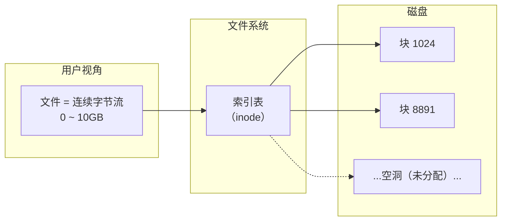
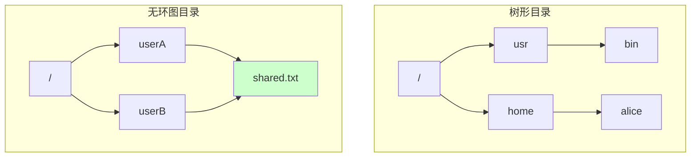
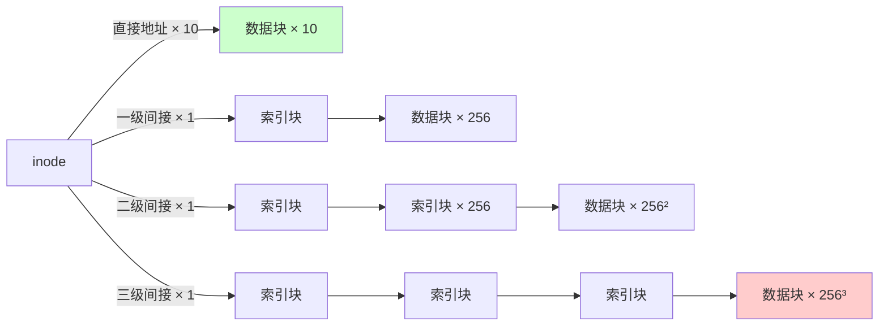
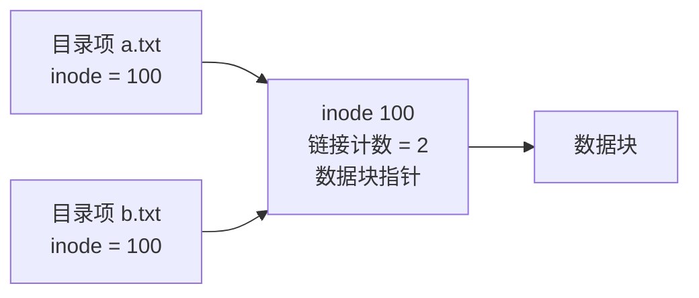
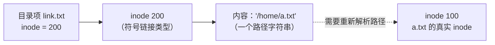
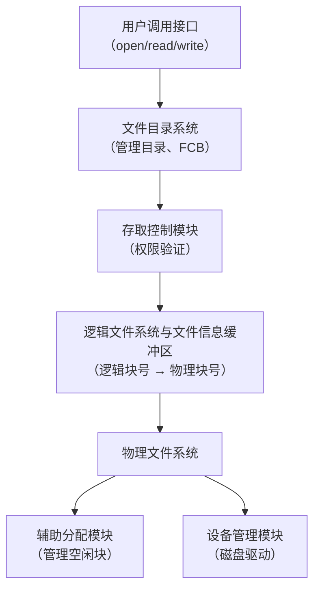
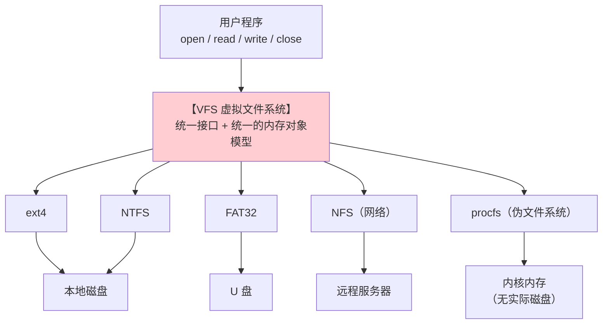
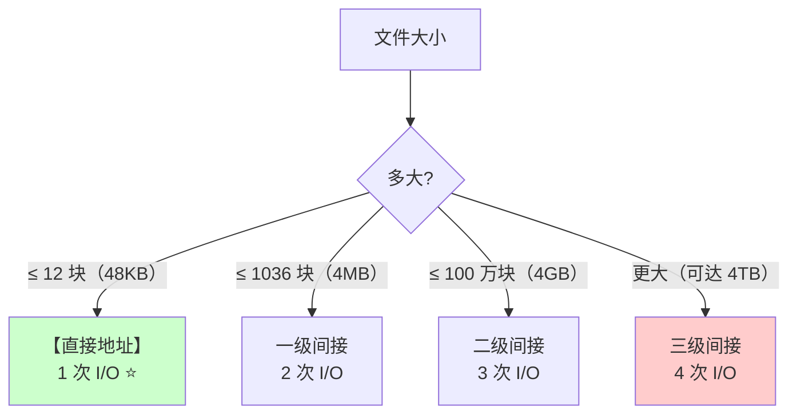

# 精通文件管理：逻辑结构、目录、文件分配与空闲空间管理

> 课程编号：OS08
> 路线图来源：计算机基础四大件 · 操作系统（408 第 4 章）
> 难度：⭐⭐⭐
> 预计阅读时间：85 分钟
> 内容基准：2026 年 8 月（408 考纲操作系统第 4 章「文件管理」）
> **代码语言：Go**。本章用 Go 观察真实的 inode、硬链接与稀疏文件。

---

## 引言：一个 10 GB 的文件，为什么只占 4 KB 磁盘

创建一个"10 GB"的文件：

```go
package main

import (
    "fmt"
    "os"
)

func main() {
    f, _ := os.Create("sparse.dat")
    defer f.Close()

    // ★ 跳到 10GB 处写 1 个字节
    f.Seek(10<<30, 0)
    f.Write([]byte{1})

    fi, _ := f.Stat()
    fmt.Printf("文件逻辑大小: %.2f GB\n", float64(fi.Size())/(1<<30))
}
```

```bash
$ go run main.go
文件逻辑大小: 10.00 GB

$ ls -lh sparse.dat
-rw-r--r-- 1 root root 10G  sparse.dat      ← 逻辑大小 10 GB

$ du -h sparse.dat
4.0K    sparse.dat                          ← 【实际只占 4 KB】
```

**`ls` 说 10 GB，`du` 说 4 KB。谁在撒谎？**

都没有。这是**稀疏文件（sparse file）**：

- **`ls` 显示的是"文件的逻辑长度"**——从头到尾有多少字节
- **`du` 显示的是"真正占用了多少磁盘块"**

中间那 10 GB 的"空洞"**根本没有分配磁盘块**。文件系统在**索引表里把这些位置标记为"未分配"**，读它们时直接返回 0，不碰磁盘。

这个现象直接揭示了本章的核心问题：

> **文件在用户眼里是"一串连续的字节"，在磁盘上却是"一堆离散的块 + 一张记录它们在哪的表"。**



**这张"索引表"怎么组织，是文件系统设计的核心**。本章从五个角度拆开：

```
文件的逻辑结构（用户怎么看）
    → 目录结构（怎么找到文件）
    → 文件的物理结构（磁盘块怎么组织）★ 本章重点
    → 空闲空间管理（哪些块还没用）
    → 文件共享与保护
```

读完你应该能：

- 区分文件的逻辑结构与物理结构
- 说清顺序文件、索引文件、索引顺序文件的检索效率差异
- 对比三种文件分配方式，说清 UNIX **混合索引**的结构
- **计算混合索引能支持的最大文件大小**（408 高频计算题）
- **用位示图完成盘块号与字号/位号的双向转换**（408 高频）
- 说清硬链接与软链接的本质区别

---

## 第一章 文件的基本概念

### 1.1 文件的属性

| 属性 | 说明 |
|---|---|
| **文件名** | 同一目录下**不允许重名** |
| **标识符** | 系统内部使用的**唯一 ID**（用户看不到）——Linux 里就是 **inode 号** |
| **类型** | 可执行文件、文本文件、二进制文件… |
| **位置** | 文件在**外存**中的地址 |
| **大小** | 当前大小 |
| **保护信息** | 读/写/执行权限 |
| **时间** | 创建时间、上次修改时间、上次访问时间 |

> 💡 **"文件名"和"标识符"是两回事**。Linux 里真正标识一个文件的是 **inode 号**，文件名只是目录项里的一条"名字 → inode 号"的映射。**这是硬链接能存在的根本原因**（见 §5.1）。

### 1.2 文件的逻辑结构 vs 物理结构

| | **逻辑结构** | **物理结构** |
|---|---|---|
| **谁关心** | **用户 / 应用程序** | **操作系统** |
| **内容** | 文件内部的数据怎么组织 | 文件在**磁盘上**怎么存放 |
| **例子** | 无结构文件、顺序文件、索引文件 | 连续分配、链接分配、索引分配 |

> ⚠️ **这两个概念必须分清**。"顺序文件"是**逻辑结构**（记录按关键字排序）；"连续分配"是**物理结构**（磁盘块连续）。一个顺序文件完全可以用链接分配存储在磁盘上。

---

## 第二章 文件的逻辑结构

### 2.1 无结构文件（流式文件）

**文件内部就是一串字节序列，没有任何结构。**

- Linux/UNIX 的所有普通文件都是这种
- 需要什么结构，由**应用程序自己解释**

### 2.2 有结构文件（记录式文件）

文件由**若干记录**组成，每条记录有若干**数据项**。

```
学生文件：
┌────────┬────────┬────────┬────────┐
│ 学号   │ 姓名   │ 年龄   │ 成绩   │  ← 数据项
├────────┼────────┼────────┼────────┤
│ 001    │ 张三   │ 20     │ 85     │  ← 记录 1
│ 002    │ 李四   │ 21     │ 92     │  ← 记录 2
└────────┴────────┴────────┴────────┘
```

**按记录长度分**：

| 类型 | 说明 |
|---|---|
| **定长记录** | 每条记录长度相同 → **可以按序号直接计算位置**，随机访问快 |
| **变长记录** | 长度不同 → **只能顺序查找** |

### 2.3 三种组织方式

#### ① 顺序文件

记录**依次排列**在存储介质上。

| 子类 | 说明 | 检索效率 |
|---|---|---|
| **串结构** | 记录**按存入时间**排列，与关键字无关 | **只能顺序查找** O(n) |
| **顺序结构** | 记录**按关键字排序** | **定长记录 + 顺序存储**时可**折半查找** O(log n) |

> ⚠️ **顺序文件能否折半查找，取决于三个条件同时满足**：
> 1. 记录**按关键字有序**（顺序结构）
> 2. 记录**定长**
> 3. 采用**顺序存储**（连续分配）
>
> 缺一不可。**变长记录无法折半**——因为算不出第 i 条记录的地址。

**缺点**：**增删记录困难**（要移动大量记录）。

#### ② 索引文件

为文件建立一张**索引表**，每条记录对应一个索引项。

```
索引表（按关键字排序）          文件本身（可无序）
┌──────────┬────────┐        ┌─────────────────┐
│ 关键字    │ 指针    │        │ 记录 C          │
├──────────┼────────┤        │ 记录 A          │
│ A        │ →      │────────│ 记录 B          │
│ B        │ →      │        └─────────────────┘
│ C        │ →      │
└──────────┴────────┘
```

- ✅ **索引表本身是定长的，可以折半查找** → 检索快
- ✅ 支持**变长记录**
- ❌ **索引表占额外空间**（可能与文件本身一样大）

#### ③ 索引顺序文件（⭐ 实用折中）

**把记录分组，每组一个索引项**（不是每条记录一个）。

```
索引表（组级）              文件（组内顺序）
┌──────┬──────┐          ┌──────────────────┐
│ 组1  │  →   │──────────│ 记录1 记录2 记录3 │
│ 组2  │  →   │──────────│ 记录4 记录5 记录6 │
│ 组3  │  →   │──────────│ 记录7 记录8 记录9 │
└──────┴──────┘          └──────────────────┘
```

**检索过程**：先在索引表中定位到组，再在组内顺序查找。

**效率分析**（$n$ 条记录，均分 $\sqrt{n}$ 组）：

$$
\text{平均查找次数} = \frac{\sqrt{n}}{2} + \frac{\sqrt{n}}{2} = \sqrt{n}
$$

**对比**：

| 方式 | 10000 条记录的平均查找次数 |
|---|---|
| 顺序文件（串结构） | **5000** |
| **索引顺序文件** | **100** ⭐ |
| 索引文件（折半） | ~14 |

> 💡 **这与 [DS07](../data-structure/DS07-精通-查找.md) 的"分块查找"是同一个东西**——索引顺序文件就是分块查找在文件系统中的应用。**多级索引顺序文件**（索引表本身再建索引）则对应多级分块。

---

## 第三章 目录结构

### 3.1 文件控制块（FCB）

**目录本身也是一个文件**，它的"记录"叫做**文件控制块（FCB）**。

```
FCB 包含：文件名、文件类型、物理位置、权限、时间…
```

**目录 = FCB 的有序集合。**

### 3.2 四种目录结构的演进

| 结构 | 特点 | 问题 |
|---|---|---|
| **单级目录** | 整个系统一张目录表 | ❌ **不允许重名**、不便于共享、查找慢 |
| **两级目录** | 主文件目录（MFD）+ 用户文件目录（UFD） | ✅ 不同用户可重名<br/>❌ 用户间**无法共享**、不能对文件分类 |
| **多级（树形）目录** ⭐ | 可以任意分层 | ✅ 层次清晰、便于分类<br/>❌ **不便于共享**（一个文件只有一个父目录） |
| **无环图目录** | 允许一个文件**有多个父目录** | ✅ **支持共享**<br/>❌ 删除时要小心（用**共享计数器**） |



> ⚠️ **无环图目录删除文件时必须用"共享计数器"**：
> ```
> 删除一个链接 → 计数器 −1
> 计数器 == 0 → 才真正删除文件本体
> ```
> 否则 A 删了文件，B 的链接就成了悬空指针。

### 3.3 索引结点（inode）

**问题**：目录项（FCB）太大，检索目录时要读入大量无用信息。

```
查找一个文件时，只需要比较【文件名】
但每个 FCB 有几十字节（含权限、时间、物理地址…）
     ↓
一个盘块（4KB）只能装几十个 FCB → 要读很多次磁盘
```

**解法：把 FCB 拆成两部分**

```
目录项（超短）        索引结点 inode（其余全部信息）
┌────────┬────────┐    ┌───────────────────────┐
│ 文件名  │ inode号│───→│ 权限 / 时间 / 物理地址 │
└────────┴────────┘    └───────────────────────┘
   ~16 字节                    ~128 字节
```

**效果**：

```
盘块 4KB，目录项 16 字节 → 一个盘块能装 【256 个】目录项
对比 FCB 128 字节 → 一个盘块只能装 32 个

检索目录的磁盘 I/O 次数【降到 1/8】
```

> ⭐ **这就是 UNIX/Linux 的 inode 机制**。**目录项只存"文件名 → inode 号"，其余信息全在 inode 里**。这个设计还顺带带来了**硬链接**的能力（见 §5.1）。

**存放在磁盘上的叫"磁盘索引结点"，调入内存后的叫"内存索引结点"**（会增加"访问计数""是否被修改"等运行时字段）。

---

## 第四章 文件的物理结构（核心考点）

**问题：一个文件的数据分散在磁盘的哪些块上？怎么记录？**

磁盘按**块（block）**管理，块大小通常 **1KB / 4KB**。

### 4.1 连续分配

**每个文件在磁盘上占据一组【连续的】块。**

```
目录项：文件名 | 起始块号 | 长度
       a.txt  |   10     |  5

磁盘：  [8][9][10][11][12][13][14][15]
                └──── a.txt ────┘
```

| 优点 | 缺点 |
|---|---|
| ✅ **支持顺序访问和直接访问（随机访问）** | ❌ **产生外部碎片**（需要紧凑） |
| ✅ **读写速度最快**（磁头移动最少，顺序 I/O） | ❌ **文件不能动态增长** |
| | ❌ 创建时**必须预知文件大小** |

**直接访问的地址计算**：

$$
\text{第 } i \text{ 个逻辑块的物理块号} = \text{起始块号} + i
$$

> 💡 **连续分配是读写最快的方案**（回顾 [CO08](../computer-organization/CO08-精通-总线与输入输出系统.md)：顺序读比随机读快 20 倍以上）。这就是为什么**磁盘碎片整理**能提升性能，也是**数据库预分配连续空间**的原因。

### 4.2 链接分配

#### ① 隐式链接

**每个盘块末尾存放"下一块"的指针**。

```
目录项：文件名 | 起始块号 | 结束块号

磁盘：  块10 [数据|→20]  块20 [数据|→7]  块7 [数据|→-1]
```

| 优点 | 缺点 |
|---|---|
| ✅ **无外部碎片**，磁盘利用率高 | ❌ **只支持顺序访问，不支持直接访问** |
| ✅ **文件可以动态增长** | ❌ 访问第 i 块要**从头读 i 次磁盘** |
| | ❌ **指针占用空间**；**一个指针损坏，后面全丢** |

**访问第 i 块需要 i+1 次磁盘 I/O**（读块 0、块 1、…、块 i）。

#### ② 显式链接（FAT）⭐

**把所有块的指针集中到一张表里——文件分配表（FAT, File Allocation Table）**。

```
FAT（常驻内存）：
┌──────┬──────┐
│ 块号  │ 下一块│
├──────┼──────┤
│  7   │  -1  │  ← 文件结束
│ 10   │  20  │
│ 20   │   7  │
└──────┴──────┘

目录项：文件名 | 起始块号
       a.txt  |   10
```

| 优点 | 缺点 |
|---|---|
| ✅ **无外部碎片** | ❌ **FAT 占用内存空间**（磁盘越大 FAT 越大） |
| ✅ **支持随机访问**（在内存的 FAT 里查链，**不访问磁盘**） | |
| ✅ 文件可动态增长 | |

> ⭐ **显式链接的关键改进：把"链"从磁盘搬到内存**。
>
> - **隐式链接**：找第 i 块要读 i 次**磁盘**（每次 10 ms）
> - **显式链接**：在**内存**的 FAT 里跳 i 次（每次纳秒级），然后**只读 1 次磁盘**
>
> **磁盘 I/O 从 i 次降到 1 次**——这就是 FAT 文件系统的名字由来。

### 4.3 索引分配 ⭐

**为每个文件建立一张【索引表】，记录它的所有盘块号。**

```
索引块（一个磁盘块）：
┌────────────────────────┐
│ 逻辑块0 → 物理块 10     │
│ 逻辑块1 → 物理块 20     │
│ 逻辑块2 → 物理块  7     │
└────────────────────────┘

目录项：文件名 | 索引块号
```

| 优点 | 缺点 |
|---|---|
| ✅ **支持随机访问**（查索引表即可） | ❌ **索引表本身占空间** |
| ✅ **无外部碎片** | ❌ **文件大时一个索引块装不下** |
| ✅ 文件可动态增长 | |

#### 索引块装不下怎么办？三种方案

**① 链接方案**：多个索引块用**指针串起来**

```
索引块1 [块号...|→索引块2] → 索引块2 [块号...|→索引块3] → ...
```

❌ 找后面的索引块要**顺序读**，效率低。

**② 多层索引**：索引块指向索引块

```
一级索引块 → 二级索引块 → 数据块
```

❌ **小文件也要读多次**（哪怕文件只有 1 块，也要先读一级索引再读二级）。

**③ 混合索引（UNIX/Linux 采用）** ⭐

**同时提供直接地址、一级间接、二级间接、三级间接。**



**为什么这样设计**：

| 文件大小 | 用到的索引层级 | 访问一个数据块的 I/O 次数 |
|---|---|---|
| **小文件**（≤ 10 块） | **只用直接地址** | **1 次**（直接读数据块）⭐ |
| 中等（≤ 266 块） | 一级间接 | 2 次 |
| 大（≤ 65802 块） | 二级间接 | 3 次 |
| 超大 | 三级间接 | 4 次 |

> ⭐ **混合索引的精妙之处：让绝大多数文件（小文件）只需 1 次磁盘 I/O，同时又能支持超大文件。**
>
> 真实文件系统中 **90% 以上的文件都很小**（几 KB），它们全部走"直接地址"这条最快的路。这是典型的"**为常见情况优化（optimize for the common case）**"。

#### 混合索引的最大文件大小计算（408 高频）

**标准设定**：盘块大小 **1 KB**，盘块号占 **4 字节**。

```
一个索引块能存的块号数 = 1KB / 4B = 256 个
```

**假设 inode 中有 10 个直接地址 + 1 个一级间接 + 1 个二级间接 + 1 个三级间接**：

| 类型 | 能寻址的块数 | 容量 |
|---|---|---|
| **直接地址** | 10 | 10 KB |
| **一级间接** | 256 | 256 KB |
| **二级间接** | $256^2$ = 65,536 | 64 MB |
| **三级间接** | $256^3$ = 16,777,216 | 16 GB |
| **合计** | 16,843,018 块 | **≈ 16.06 GB** |

$$
\text{最大文件} = (10 + 256 + 256^2 + 256^3) \times 1\text{KB} \approx 16\ \text{GB}
$$

> 💡 **计算套路**：
> 1. 先算**一个索引块能存多少个块号** = 盘块大小 ÷ 盘块号长度
> 2. 各级能寻址的块数：直接 = 个数；一级 = $k$；二级 = $k^2$；三级 = $k^3$
> 3. 总块数 × 盘块大小 = 最大文件大小

### 4.4 三种分配方式总对比

| | **连续分配** | **隐式链接** | **显式链接(FAT)** | **索引分配** |
|---|---|---|---|---|
| **随机访问** | ✅ **支持** | ❌ **不支持** | ✅ 支持 | ✅ **支持** |
| **外部碎片** | ❌ **有** | ✅ 无 | ✅ 无 | ✅ 无 |
| **动态增长** | ❌ **困难** | ✅ 容易 | ✅ 容易 | ✅ 容易 |
| **额外空间开销** | 无 | 指针（每块） | **FAT 表（内存）** | **索引块** |
| **访问第 i 块的磁盘 I/O** | **1 次** | **i+1 次** ⚠️ | **1 次** | **1~4 次** |
| **读写速度** | **最快** | 慢 | 中 | 中 |
| **典型应用** | CD-ROM、数据库预分配 | 少用 | **FAT32、exFAT** | **UNIX/Linux ext、XFS** |

---

## 第五章 文件共享与保护

### 5.1 硬链接 vs 软链接（高频考点）

#### 硬链接（基于索引结点）

**多个目录项指向【同一个 inode】。**



**关键机制：inode 里有一个【链接计数 count】**

```
建立硬链接 → count + 1
删除一个链接 → count − 1
count == 0 → 【才真正删除文件数据】
```

#### 软链接（符号链接）

**创建一个特殊的文件，里面存的是【目标文件的路径字符串】。**



**访问软链接时，OS 要【重新解析这个路径】**——多几次磁盘 I/O。

#### 五点区别（必背）

| 维度 | **硬链接** | **软链接（符号链接）** |
|---|---|---|
| **本质** | 多个目录项指向**同一 inode** | 一个**独立的文件**，内容是**路径字符串** |
| **inode 号** | **与原文件相同** | **与原文件不同**（自己有独立 inode） |
| **能否跨文件系统** | ❌ **不能**（inode 号只在本文件系统内唯一） | ✅ **可以** |
| **能否指向目录** | ❌ **通常不能**（防止目录环） | ✅ **可以** |
| **删除原文件后** | ✅ **仍然可用**（count 只是减 1） | ❌ **失效**（成为"悬空链接"） |
| **访问开销** | 无额外开销 | **需要多次解析路径**，多几次 I/O |

#### 用 Go 观察

```go
package main

import (
    "fmt"
    "os"
    "syscall"
)

func inodeOf(path string) (uint64, uint64) {
    fi, err := os.Lstat(path) // ★ Lstat 不跟随符号链接
    if err != nil {
        return 0, 0
    }
    st := fi.Sys().(*syscall.Stat_t)
    return st.Ino, uint64(st.Nlink)
}

func main() {
    os.WriteFile("original.txt", []byte("hello"), 0644)
    os.Link("original.txt", "hard.txt")       // ★ 硬链接
    os.Symlink("original.txt", "soft.txt")    // ★ 软链接

    for _, f := range []string{"original.txt", "hard.txt", "soft.txt"} {
        ino, nlink := inodeOf(f)
        fmt.Printf("%-14s inode=%-10d 链接计数=%d\n", f, ino, nlink)
    }

    // ★ 删除原文件，看两种链接的差异
    os.Remove("original.txt")
    fmt.Println("\n--- 删除 original.txt 后 ---")

    if b, err := os.ReadFile("hard.txt"); err == nil {
        fmt.Printf("硬链接 hard.txt: 仍可读 ✅ 内容=%q\n", b)
    }
    if _, err := os.ReadFile("soft.txt"); err != nil {
        fmt.Printf("软链接 soft.txt: 已失效 ❌ %v\n", err)
    }
}
```

**输出**：

```
original.txt   inode=1234567    链接计数=2
hard.txt       inode=1234567    链接计数=2      ← ★ inode 完全相同
soft.txt       inode=1234890    链接计数=1      ← ★ 独立的 inode

--- 删除 original.txt 后 ---
硬链接 hard.txt: 仍可读 ✅ 内容="hello"
软链接 soft.txt: 已失效 ❌ no such file or directory
```

> ⭐ **这个实验一次说清了两者的本质**：硬链接的 inode 号与原文件**完全相同**（它们就是同一个文件的两个名字）；软链接有**自己的 inode**（它是一个存着路径的独立文件）。

### 5.2 文件保护

| 方法 | 做法 | 缺点 |
|---|---|---|
| **口令保护** | 给文件设密码 | 口令要存在系统里，**不安全** |
| **加密保护** | 用密钥加密文件内容 | **保密性强**，但加解密**消耗 CPU** |
| **访问控制** ⭐ | 给每个文件配一张**访问控制表（ACL）** | 表可能很大 |

**UNIX 的精简 ACL**：把用户分成三类，每类 3 个权限位。

```
$ ls -l file.txt
-rw-r--r-- 1 alice staff 1024 Aug 10 12:00 file.txt
 └┬┘└┬┘└┬┘
  │  │  └── 其他用户 other: r--  (4)
  │  └───── 同组用户 group: r--  (4)
  └──────── 文件主  owner: rw-  (6)
  
权限值 644
```

| 位 | 含义（文件） | 含义（目录） |
|---|---|---|
| **r (4)** | 读取内容 | **列出目录内容**（`ls`） |
| **w (2)** | 修改内容 | **在目录中增删文件** |
| **x (1)** | 执行 | **进入目录**（`cd`）、访问其中的文件 |

> ⚠️ **对目录来说，`x` 权限比 `r` 更关键**。没有 `x` 就**无法进入目录**，即使有 `r` 也只能看到文件名，无法访问文件内容。
>
> 反过来，只有 `x` 没有 `r`：可以进入并访问**已知名字**的文件，但**列不出目录内容**——这是一种常见的安全配置。

---

## 第六章 文件存储空间管理

**问题：磁盘上哪些块是空闲的？**

### 6.1 空闲表法

用一张表记录**每个连续空闲区**的起始块号和长度。

| 序号 | 起始块号 | 空闲块数 |
|---|---|---|
| 1 | 10 | 5 |
| 2 | 30 | 12 |

- **适合连续分配**（配合首次适应、最佳适应等算法，与 [OS06](./OS06-精通-内存管理.md) 动态分区完全同构）

### 6.2 空闲链表法

**空闲盘块链**：把每个空闲块用指针串起来。
**空闲盘区链**：把每个连续空闲区串起来（每个区记录长度）。

- 空闲盘块链：分配/回收简单，但**分配大文件时效率低**（要摘很多块）
- 空闲盘区链：适合连续分配

### 6.3 位示图法 ⭐（408 高频计算题）

**用一个二进制位表示一个盘块的状态**：

```
0 = 空闲，1 = 已分配（也可能反过来，看题目约定）

位示图（假设每个字 16 位）：
       位号 0  1  2  3  4  5 ... 15
字号 0     1  1  0  1  0  0 ...  0
字号 1     0  0  1  1  1  0 ...  1
字号 2     ...
```

#### 双向转换公式（必背）

设**每个字有 $n$ 位**（常见 16、32、64），**字号和位号都从 0 开始**：

**① 已知字号 $i$、位号 $j$，求盘块号 $b$**：

$$
\boxed{b = n \times i + j}
$$

**② 已知盘块号 $b$，求字号 $i$、位号 $j$**：

$$
\boxed{i = \left\lfloor \frac{b}{n} \right\rfloor, \qquad j = b \bmod n}
$$

> ⚠️ **最大的陷阱是"从 0 开始还是从 1 开始"**。若**字号、位号、盘块号都从 1 开始**，公式要变成：
>
> $$b = n \times (i-1) + j, \qquad i = \left\lfloor \frac{b-1}{n} \right\rfloor + 1, \qquad j = (b-1) \bmod n + 1$$
>
> **408 题目会明确说明起始值，务必看清题干**。

#### 例题

**某系统位示图每个字 32 位，字号和位号都从 0 开始。**

**问题一：盘块号 100 对应的字号和位号？**

$$
i = \left\lfloor \frac{100}{32} \right\rfloor = 3, \qquad j = 100 \bmod 32 = 100 - 96 = 4
$$

**答：字号 3，位号 4。**

**问题二：字号 5、位号 20 对应的盘块号？**

$$
b = 32 \times 5 + 20 = 160 + 20 = 180
$$

**答：盘块号 180。**

**问题三：若磁盘有 1024 MB，块大小 4 KB，位示图需要多少个字（32 位/字）？**

```
盘块总数 = 1024 MB / 4 KB = (1024 × 1024) / 4 = 262,144 块

位示图需要 262,144 位
字数 = 262144 / 32 = 8192 字
位示图占空间 = 8192 × 4B = 32 KB
```

> 💡 **位示图的优点：连续空间的查找很快**（用位运算一次扫描 32/64 个块），且**空间开销极小**（1 GB 磁盘只需 32 KB 位示图）。这是现代文件系统（ext4 的块位图、XFS）的主流做法。

### 6.4 成组链接法（UNIX 采用）

**结合空闲表和空闲链表**，专为大型文件系统设计。

```
超级块（内存中）
┌──────────────────┐
│ 100（本组块数）   │
│ 块号: 201,202,... │  ← 第一组的 100 个空闲块号
└──────────────────┘
         ↓ 其中第一个块（201）里存着下一组的信息
    块 201
   ┌──────────────────┐
   │ 100（下组块数）   │
   │ 块号: 301,302,... │  ← 第二组的 100 个空闲块号
   └──────────────────┘
              ↓
           ...
```

**分配**：从超级块的表中取一个块号；若取完了，就把**该组的第一个块**读进来（它存着下一组的信息），然后用它。

**回收**：把块号加入超级块的表；若表满了（100 个），就把**当前表写入这个新回收的块**，超级块重新开始记录。

- ✅ **不需要把全部空闲块信息常驻内存**（只需一组）
- ✅ 分配回收都很快
- ✅ 适合**超大文件系统**

---

## 第七章 文件系统的层次结构与全局布局

### 7.1 七层结构



### 7.2 打开文件的过程与两张表

**打开文件的过程**：

```
open("/home/alice/a.txt")
     ↓
① 逐级查目录：/ → home → alice → a.txt，找到 inode 号
② 把 inode 读入内存（内存索引结点）
③ 在【系统打开文件表】中登记（全局唯一，记录 inode 指针、打开计数）
④ 在【进程打开文件表】中登记，返回【文件描述符 fd】
```

> ⭐ **两张表的设计**：
>
> | 表 | 位置 | 作用 |
> |---|---|---|
> | **系统打开文件表** | **全局唯一** | 每个被打开的文件一个表项，记录 inode、打开计数 |
> | **进程打开文件表** | **每个进程一张** | 记录该进程打开的文件、**读写指针**、访问权限 |
>
> **为什么要两张？** 因为**同一个文件可能被多个进程打开**，它们**共享 inode**（系统表），但**各有各的读写指针**（进程表）。

```go
// Go 里 fd 就是"进程打开文件表"的索引
f1, _ := os.Open("a.txt")
f2, _ := os.Open("a.txt") // ★ 同一个文件，两个 fd

f1.Seek(100, 0)  // ★ 只影响 f1 的读写指针
// f2 的读写指针仍在 0 —— 因为它们是【不同的进程打开文件表项】
// 但两者指向【同一个 inode】（系统打开文件表中的同一项）
```

### 7.3 文件系统在外存中的布局 ⭐

> 408 考纲「文件系统实现」明确列出「**文件系统的全局结构（布局）**」。这一节回答的是：**一块刚格式化好的磁盘上，到底放了些什么？**

一块磁盘先被分成若干**分区**，每个分区上独立建立一个文件系统。以类 UNIX 文件系统为例，一个分区的典型布局是：


| 区域 | 内容 | 要点 |
|---|---|---|
| **MBR**（整盘唯一） | 主引导记录 + **分区表** | 位于磁盘 **0 号扇区**，属于整块磁盘而**不属于任何分区**（见 [OS01](./OS01-精通-操作系统概述与运行环境.md) §6.1） |
| **引导块** | 该分区的引导程序 | **每个分区都有**，即使该分区没装 OS 也保留这个位置 |
| **超级块** ⭐ | **整个文件系统的元数据**：块大小、块总数、空闲块数、inode 总数、空闲 inode 数、位图位置、文件系统类型与状态 | **挂载时第一个被读入内存**；它损坏则整个文件系统无法使用，所以现代文件系统都存**多个备份** |
| **inode 位图 / 数据块位图** | 每一位表示一个 inode / 数据块是否已分配 | 就是 §6.3 讲的**位示图** |
| **inode 区** | 所有 inode 连续存放 | **数量在格式化时就固定了**——这就是"磁盘明明还有空间却提示 `No space left`"的另一种原因（inode 用尽） |
| **数据块区** | 文件的实际内容、**目录的内容**（目录项数组） | 占分区绝大部分空间 |

**两个必考结论**：

1. **inode 数量在格式化时固定**，无法事后扩充。海量小文件场景要在格式化时调大 inode 密度（`mkfs.ext4 -i 8192`）。用 `df -i` 可以看 inode 使用率——**这是排查"空间够但建不了文件"的第一条命令**。
2. **目录本身也是文件**，它的内容（目录项数组）就存在**数据块区**里，和普通文件的数据放在一起。所以"查目录"本质上是"读一个特殊文件"。

### 7.4 文件系统在内存中的结构

磁盘上的结构被读进内存后，形成一套**内存中的镜像与索引**：

| 内存结构 | 从哪来 | 作用 |
|---|---|---|
| **内存中的超级块** | 挂载时从磁盘读入 | 缓存被频繁访问的文件系统元数据，**修改后定期写回** |
| **内存中的索引结点（inode）** | 文件被打开时读入 | 缓存活跃文件的 inode，避免反复访磁盘 |
| **目录项缓存（dentry cache）** | 路径解析过程中建立 | **缓存"路径名 → inode"的映射**，避免每次都逐级查目录 |
| **系统打开文件表** | 打开文件时建立 | 全局唯一，见 §7.2 |
| **进程打开文件表** | 打开文件时建立 | 每进程一张，存**读写指针** |

**四个基本操作的完整流程**（408 简答高频）：

| 操作 | 关键步骤 |
|---|---|
| **创建文件** | ① 在**数据块位图**中找空闲块、**inode 位图**中找空闲 inode → ② 填写 inode（属性、权限、大小 0）→ ③ 在**父目录的数据块**中添加一个目录项（文件名 + inode 号）→ ④ 更新超级块的空闲计数 |
| **删除文件** | ① 在父目录中**找到并删除该目录项** → ② inode 的**链接计数减 1** → ③ 计数为 0 且无进程打开时，**回收数据块与 inode**（位图相应位置 0）→ ④ 更新超级块 |
| **打开文件** | 见 §7.2：查目录 → 读 inode 入内存 → 登记两张表 → 返回 fd。**目的是把后续读写要用的信息一次性准备好，避免每次读写都查目录** |
| **关闭文件** | ① 删除**进程打开文件表**中的表项 → ② **系统打开文件表**的打开计数减 1 → ③ 计数为 0 则删除该表项，**把内存 inode 的修改写回磁盘** |

> ⚠️ **最高频的陷阱**：**删除文件时并不清除数据块里的内容**，只是把位图对应位置 0、把目录项抹掉。这解释了三件事：① 删大文件为什么很快；② 为什么误删的文件**有可能被数据恢复工具找回**；③ 为什么"删了文件但 `df` 显示空间没释放"——**还有进程持有打开的 fd，链接计数未归零**（用 `lsof | grep deleted` 就能抓到元凶）。

### 7.5 虚拟文件系统 VFS ⭐

> 同样是考纲「文件系统实现」明确列出的考点。

**要解决的问题**：一台机器上同时存在 ext4、NTFS、FAT32、NFS（网络文件系统）、procfs（伪文件系统）…… 它们的**内部实现天差地别**。如果让应用程序自己区分，`read()` 就得写成 `read_ext4()`、`read_ntfs()`——灾难。

**VFS（Virtual File System，虚拟文件系统）**：在用户程序与各具体文件系统之间加一个**抽象层**，向上提供**统一的系统调用接口**，向下要求每个具体文件系统实现一组**规定的函数指针**。



**VFS 的三个特征**：

1. **向上：统一的接口**。不论底下是哪种文件系统，用户程序一律用 `open/read/write/close`——**位置透明**。
2. **向下：强制的规范**。每个具体文件系统必须实现 VFS 规定的一组函数（Linux 中是 `file_operations`、`inode_operations` 等**函数指针结构体**）。这本质上是**用 C 实现的"接口 / 多态"**。
3. **中间：统一的内存对象**。VFS 在内存中建立自己的抽象对象，屏蔽磁盘上格式的差异。

**Linux VFS 的四大对象**（记这张表即可）：

| 对象 | 代表什么 | 对应磁盘上的 |
|---|---|---|
| **超级块（super_block）** | 一个**已挂载的文件系统** | 磁盘超级块 |
| **索引结点（inode）** | 一个**文件**（的元数据） | 磁盘 inode |
| **目录项（dentry）** | **路径中的一个组成部分**（一个名字到 inode 的映射） | 目录文件里的一条目录项 |
| **文件（file）** | 一个**被进程打开的文件**（含读写指针） | 无——**纯内存对象** |

> ⚠️ **最易混的两个**：`inode` 是**文件本身**（磁盘上真实存在），`dentry` 是**文件的名字**（可以有多个 dentry 指向同一个 inode——**这就是硬链接**）；`file` 对象则是**"某进程的某次打开"**，它有独立的读写指针（**这就是 §7.2 说的进程打开文件表项**）。三者的关系正好把前面几节串起来了。

**为什么"一切皆文件"能成立**：正因为有 VFS，Linux 可以把**根本不是文件的东西**也包装成文件——`/proc/self/status`（进程信息）、`/sys`（设备树）、`/dev/null`（伪设备）、socket、管道，全都实现了 VFS 接口，于是全都能用 `read()` 读。

```bash
# 看当前系统挂载了哪些文件系统类型 —— 每一种都是 VFS 下的一个实现
findmnt -t ext4,xfs,btrfs,tmpfs,proc,sysfs -o TARGET,SOURCE,FSTYPE | head
# TARGET   SOURCE      FSTYPE
# /        /dev/sda2   ext4      ← 真实磁盘
# /proc    proc        proc      ← 内核内存，无磁盘
# /sys     sysfs       sysfs     ← 内核对象树
# /dev/shm tmpfs       tmpfs     ← 内存文件系统

# 看内核支持哪些文件系统
cat /proc/filesystems | head -5
```

### 7.6 文件系统的挂载（mount）

**挂载**：把一个文件系统**接到目录树的某个目录（挂载点）上**，使其成为整棵目录树的一部分。这是 UNIX/Linux **单一目录树**模型的关键——不像 Windows 那样每个分区一个盘符。

挂载时操作系统做三件事：

1. 在 VFS 中**为该文件系统建立一个超级块对象**（从磁盘读入超级块）；
2. 读入该文件系统的**根目录 inode**；
3. 建立**挂载点与该文件系统根目录的关联**——此后访问挂载点路径，就会被重定向到新文件系统的根目录。

> 💡 **挂载点原有的内容会被"遮住"**（不是删除）——卸载后又会重新出现。这是运维常见的坑：往还没挂盘的挂载点写数据，写进的是**根分区**，挂上盘后这些数据就"消失"了（其实还占着根分区的空间）。

---

## 第八章 408 高频考点与陷阱清单

### 8.1 考点分布

第 4 章通常是 **1-2 道选择题 + 高概率的计算题**。

最常考：

1. **混合索引的最大文件大小计算**
2. **位示图的字号/位号与盘块号转换**
3. 三种文件分配方式的对比
4. 硬链接与软链接的区别
5. 逻辑结构与物理结构的辨析
6. **文件系统的全局布局与创建/删除文件的流程**（考纲明列）
7. **虚拟文件系统 VFS 的作用与四大对象**（考纲明列）

### 8.2 十九个陷阱

**陷阱 1：顺序文件是一种物理结构**

**错**。顺序文件是**逻辑结构**（记录的组织方式）；连续分配才是**物理结构**（磁盘块的组织方式）。

**陷阱 2：顺序文件一定能折半查找**

**错**。必须**同时满足**：① 顺序结构（按关键字有序）② **定长记录** ③ 顺序存储。**变长记录无法折半**（算不出第 i 条记录的地址）。

**陷阱 3：索引文件的索引表可以是变长的**

**错**。索引表项**必须定长**，这样才能对索引表本身做折半查找。

**陷阱 4：树形目录结构便于文件共享**

**错**。树形目录中一个文件**只有一个父目录**，不便于共享。**无环图目录**才支持共享（一个文件多个父目录）。

**陷阱 5：无环图目录中，删除文件时直接删除即可**

**错**。必须用**共享计数器**：删除一个链接只是 count−1，**count == 0 时才真正删除文件数据**。

**陷阱 6：inode 中存放文件名**

**错**。**文件名在目录项里**，inode 中**不含文件名**（这正是硬链接能存在的原因——多个文件名指向同一 inode）。

**陷阱 7：连续分配不支持随机访问**

**错，恰恰相反**。连续分配**完美支持随机访问**（`起始块号 + i` 直接算出）。**隐式链接**才不支持。

**陷阱 8：隐式链接分配支持随机访问**

**错**。要访问第 i 块必须**从头顺序读 i 次磁盘**。

**陷阱 9：显式链接（FAT）不支持随机访问**

**错**。FAT 在**内存**中，可以在内存里快速跳链，**磁盘 I/O 只需 1 次**。这正是它相对隐式链接的最大改进。

**陷阱 10：索引分配访问任何块都只要 1 次 I/O**

**不准确**。单级索引是 2 次（读索引块 + 读数据块）；**混合索引**中，小文件走直接地址只要 1 次，三级间接要 4 次。

**陷阱 11：混合索引对所有文件的访问效率相同**

**错**。这正是混合索引的精妙之处——**小文件（走直接地址）只需 1 次 I/O，大文件才需要多次**。为常见情况优化。

**陷阱 12：硬链接可以跨文件系统**

**错**。硬链接基于 **inode 号**，而 **inode 号只在本文件系统内唯一**，所以**不能跨文件系统**。软链接存的是路径字符串，**可以跨**。

**陷阱 13：删除原文件后硬链接失效**

**错**。硬链接**仍然可用**——删除只是让 count−1，数据还在。**软链接才会失效**（成为悬空链接）。

**陷阱 14：软链接和原文件的 inode 号相同**

**错**。软链接是**独立的文件，有自己的 inode**。**硬链接**才与原文件 inode 号相同。

**陷阱 15：目录只需要 r 权限就能访问其中的文件**

**错**。**目录的 `x` 权限才是"能否进入"**。没有 `x`，即使有 `r` 也只能看到文件名，无法访问文件内容。

**陷阱 16：位示图中字号和位号一定从 0 开始**

**错**。**看题目约定**。从 1 开始时公式要变：$b = n(i-1) + j$。

**陷阱 17：删除文件时会把数据块的内容清零**

**错**。只是**抹掉目录项 + 位图相应位置 0**，数据内容原封不动留在盘上。所以删大文件很快，误删也有可能恢复。

**陷阱 18：磁盘还有剩余空间就一定能创建新文件**

**错**。**inode 数量在格式化时就固定了**，inode 用尽时即使数据块还空着也创建不了文件（`df -i` 可查）。海量小文件场景尤其容易踩。

**陷阱 19：VFS 是一种具体的文件系统**

**错**。VFS 是**抽象层**，它自己**不管理任何磁盘空间**。它向上提供统一接口、向下要求各具体文件系统（ext4/NTFS/NFS/procfs）实现一组规定的函数。**"一切皆文件"能成立就是靠它**。

### 8.3 速查卡

```
【逻辑结构 vs 物理结构】
逻辑结构：用户视角，文件内部数据怎么组织（顺序/索引/索引顺序文件）
物理结构：OS 视角，磁盘块怎么组织（连续/链接/索引分配）

【三种逻辑结构的检索】
顺序文件（串结构）：只能顺序查找 O(n)
顺序文件（顺序结构+定长+顺序存储）：可折半 O(log n)
索引顺序文件：平均 √n 次（= 分块查找）

【目录结构】
单级 → 两级 → 树形（不便共享）→ 【无环图（支持共享，需共享计数器）】
inode：目录项只存【文件名 + inode号】，其余信息在 inode 里

【三种物理结构】
连续分配：✅随机访问 ✅最快  ❌外部碎片 ❌不能增长
隐式链接：❌随机访问（第i块要 i+1 次I/O）✅无碎片 ✅可增长
显式链接FAT：✅随机访问（内存查表，磁盘只1次）✅无碎片
索引分配：✅随机访问 ✅无碎片，索引块占空间

【混合索引最大文件】
一个索引块能存的块号数 k = 盘块大小 / 盘块号长度
最大块数 = 直接数 + k + k² + k³
最大文件 = 最大块数 × 盘块大小
访问 I/O：直接1次、一级2次、二级3次、三级4次

【位示图】（字号位号从 0 开始）
盘块号 b = n × 字号i + 位号j
字号 i = ⌊b / n⌋，位号 j = b mod n
★ 从 1 开始时：b = n(i-1) + j

【硬链接 vs 软链接】
硬链接：同一inode、【不能跨文件系统】、不能指向目录、
        【删原文件仍可用】、无额外开销
软链接：独立inode存路径、【可跨文件系统】、可指向目录、
        【删原文件失效】、需多次解析路径

【打开文件的两张表】
系统打开文件表：全局唯一，记 inode 和打开计数
进程打开文件表：每进程一张，记【读写指针】和权限
→ 同一文件被多进程打开：共享 inode，各有读写指针

【文件系统的外存布局】★考纲明列
MBR（整盘唯一，0 号扇区，含分区表）
 → 每个分区：引导块 → 【超级块】→ inode 位图 + 数据块位图
             → inode 区 → 数据块区（文件内容 + 目录内容）
★ 超级块 = 整个文件系统的元数据，挂载时【第一个】读入内存
★ inode 数量【格式化时固定】，用尽则空间够也建不了文件（df -i）
★ 删除文件【不清数据】，只抹目录项 + 位图置 0

【VFS 虚拟文件系统】★考纲明列
作用：向上统一接口（open/read/write），向下规范各文件系统实现
四大对象：超级块（一个已挂载的文件系统）
          inode（一个文件本身）
          dentry（一个名字 → inode 的映射，多个 dentry 指向同一 inode = 硬链接）
          file（一次【打开】，含读写指针 = 进程打开文件表项）
「一切皆文件」（/proc、/dev、socket、管道）就是靠 VFS 实现的
```

---

## 第九章 Go ↔ C 对照

| 场景 | C | Go | 说明 |
|---|---|---|---|
| 打开文件 | `open()` | `os.Open` / `os.OpenFile` | 返回 fd / `*os.File` |
| 创建硬链接 | `link()` | `os.Link` | 不能跨文件系统 |
| 创建软链接 | `symlink()` | `os.Symlink` | 可跨文件系统 |
| 读链接目标 | `readlink()` | `os.Readlink` | 读出软链接存的路径 |
| 取文件元信息（跟随符号链接） | `stat()` | `os.Stat` | |
| 取元信息（**不**跟随） | `lstat()` | **`os.Lstat`** ⭐ | 判断是否为软链接必须用它 |
| 获取 inode 号 | `st.st_ino` | `fi.Sys().(*syscall.Stat_t).Ino` | Go 需类型断言 |
| 获取链接计数 | `st.st_nlink` | `...Stat_t.Nlink` | |
| 遍历目录 | `opendir`/`readdir` | `os.ReadDir` | |
| 创建稀疏文件 | `lseek` + `write` | `f.Seek` + `f.Write` | 引言的例子 |

```go
// 判断一个路径是软链接还是硬链接
fi, _ := os.Lstat(path)                       // ★ 必须 Lstat
if fi.Mode()&os.ModeSymlink != 0 {
    target, _ := os.Readlink(path)
    fmt.Println("软链接 →", target)
} else {
    st := fi.Sys().(*syscall.Stat_t)
    if st.Nlink > 1 {
        fmt.Println("硬链接，共", st.Nlink, "个名字指向同一 inode")
    }
}
```

> ⚠️ **`os.Stat` 会跟随符号链接**（返回目标文件的信息），**`os.Lstat` 不跟随**（返回链接本身的信息）。判断"这是不是一个软链接"**必须用 `Lstat`**——用 `Stat` 永远判断不出来。这是 Go 文件操作最常见的坑之一。

---

## 第十章 练习题

### 选择题

**1.** 下列属于文件**逻辑结构**的是：
A. 连续分配　B. 链接分配　C. 索引顺序文件　D. 索引分配

**2.** 顺序文件能够使用折半查找的前提**不包括**：
A. 记录按关键字有序
B. 记录定长
C. 采用顺序存储
D. 文件采用索引分配

**3.** 下列目录结构中，能够方便地实现文件共享的是：
A. 单级目录　B. 两级目录　C. 树形目录　D. 无环图目录

**4.** UNIX 系统中，文件名存放在：
A. 索引结点 inode 中
B. 目录项中
C. 超级块中
D. 文件的第一个数据块中

**5.** 下列文件物理结构中，**不支持**随机访问的是：
A. 连续分配　B. 隐式链接分配　C. 显式链接分配（FAT）　D. 索引分配

**6.** 显式链接（FAT）相对隐式链接的主要优点是：
A. 节省磁盘空间
B. 支持随机访问，访问第 i 块只需 1 次磁盘 I/O
C. 不产生外部碎片
D. 文件可以动态增长

**7.** 关于硬链接，**正确**的是：
A. 硬链接可以跨文件系统建立
B. 硬链接与原文件的 inode 号不同
C. 删除原文件后硬链接失效
D. 硬链接与原文件共享同一个 inode

**8.** 若某目录的权限为 `--x`（只有执行权限），则用户：
A. 可以列出目录中的所有文件
B. 可以进入目录并访问已知文件名的文件
C. 无法进行任何操作
D. 可以在目录中创建新文件

**9.** 位示图中，若每个字 32 位，字号和位号均从 0 开始，则盘块号 200 对应的字号和位号分别是：
A. 6, 8　B. 6, 200　C. 7, 8　D. 6, 24

**10.** 混合索引分配中，访问一个位于**二级间接**索引下的数据块，共需要读磁盘：
A. 1 次　B. 2 次　C. 3 次　D. 4 次

### 应用题

**11.** 某文件系统采用**混合索引分配**，盘块大小 **4 KB**，盘块号占 **4 字节**。索引结点中包含 **12 个直接地址**、**1 个一级间接地址**、**1 个二级间接地址**、**1 个三级间接地址**。

（1）一个索引块能存放多少个盘块号？
（2）该文件系统支持的**最大文件**是多大？
（3）文件的第 **10000** 个逻辑块（从 0 开始编号）通过哪一级索引访问？访问它需要读几次磁盘？
（4）若只保留直接地址和一级间接地址，最大文件是多大？

**12.** 某磁盘容量 **2 GB**，盘块大小 **1 KB**，采用**位示图**管理空闲空间，每个字 **16 位**，字号和位号均**从 1 开始**。

（1）位示图共需要多少个字？占多少存储空间？
（2）盘块号 **1500** 对应的字号和位号是多少？
（3）字号 **50**、位号 **9** 对应的盘块号是多少？

**13.** 分析下列 Go 程序的输出，并解释原因：

```go
os.WriteFile("f.txt", []byte("data"), 0644)
os.Link("f.txt", "h.txt")
os.Symlink("f.txt", "s.txt")

// 第一次检查
printInfo("f.txt"); printInfo("h.txt"); printInfo("s.txt")

os.Remove("f.txt")

// 第二次检查
readFile("h.txt")   // 输出？
readFile("s.txt")   // 输出？
```

（1）三个文件的 inode 号和链接计数分别是什么关系？
（2）删除 `f.txt` 后，`h.txt` 和 `s.txt` 分别会怎样？为什么？
（3）若把 `os.Symlink("f.txt", "s.txt")` 改成绝对路径，删除后行为有变化吗？

**14.** 详细对比**连续分配**、**隐式链接分配**、**显式链接分配（FAT）**、**索引分配**四种文件物理结构，从**五个维度**分析，并说明各自的典型应用场景。

**15.** 解释 UNIX **混合索引**的设计思想：

（1）为什么不用纯粹的多级索引（所有文件都走三级）？
（2）为什么不用纯粹的单级索引？
（3）混合索引如何做到"小文件快、大文件也能支持"？

### 答案与解析

<details>
<summary>点击展开</summary>

**1. C**

| 类别 | 例子 |
|---|---|
| **逻辑结构**（用户视角） | 无结构文件、顺序文件、**索引文件**、**索引顺序文件** |
| **物理结构**（OS 视角） | 连续分配、链接分配、索引分配 |

**索引顺序文件**是逻辑结构；A、B、D 都是物理结构。

> ⚠️ 注意区分"**索引文件**"（逻辑结构）和"**索引分配**"（物理结构）——名字像但完全不同。

**2. D**

折半查找的三个前提：

1. 记录**按关键字有序**（顺序结构）
2. 记录**定长**（才能算出第 i 条记录的地址）
3. **顺序存储**（连续分配）

**D 不是前提**——索引分配是物理结构，与折半查找无关。事实上，若文件用索引分配（物理上离散），只要逻辑上满足前三条，仍可折半（通过索引表定位）。

**3. D**

| 目录结构 | 共享 |
|---|---|
| 单级/两级 | ❌ |
| **树形目录** | ❌ **一个文件只有一个父目录** |
| **无环图目录** | ✅ **一个文件可有多个父目录** |

**4. B**

**文件名存放在目录项中，inode 中不含文件名。**

这正是**硬链接**能够存在的根本原因：

```
目录项 a.txt → inode 100
目录项 b.txt → inode 100     ← 两个名字，一个 inode
```

若文件名存在 inode 里，一个 inode 就只能有一个名字，硬链接无从谈起。

**5. B**

| 物理结构 | 随机访问 | 访问第 i 块的磁盘 I/O |
|---|---|---|
| 连续分配 | ✅ | 1 次（起始块号 + i） |
| **隐式链接** | ❌ | **i+1 次**（必须从头顺序读） |
| 显式链接 FAT | ✅ | 1 次（内存查 FAT） |
| 索引分配 | ✅ | 1~4 次 |

**6. B**

**FAT 的核心改进：把"链"从磁盘搬到内存。**

```
隐式链接：找第 i 块 → 读 i 次【磁盘】（每次 ~10ms）
显式链接：在【内存】的 FAT 里跳 i 次（纳秒级）→ 只读 1 次磁盘
```

C、D 是链接分配的**共同优点**（隐式链接也有），不是显式链接**相对**隐式链接的优点。

**7. D**

| 说法 | 正误 |
|---|---|
| A. 可跨文件系统 | ❌ **不能**（inode 号只在本文件系统内唯一） |
| B. inode 号不同 | ❌ **相同**（这正是硬链接的本质） |
| C. 删原文件后失效 | ❌ **仍可用**（count 只减 1） |
| **D. 共享同一 inode** | ✅ |

**8. B**

目录的三个权限位：

| 权限 | 对目录的含义 |
|---|---|
| **r** | **列出目录内容**（`ls`） |
| **w** | 在目录中**增删文件** |
| **x** | **进入目录**（`cd`）、**访问其中已知名字的文件** |

只有 `--x`：**能进入并访问已知文件名的文件，但列不出目录内容**（`ls` 会报 Permission denied）。

这是一种常见的安全配置——比如 `/home` 常设为 `711`，用户能进入自己的目录，但看不到别人的目录列表。

**9. A**

字号位号均从 **0** 开始，每字 32 位：

$$
\text{字号} = \left\lfloor \frac{200}{32} \right\rfloor = 6, \qquad \text{位号} = 200 \bmod 32 = 200 - 192 = 8
$$

**答：字号 6，位号 8。**

**10. C**

| 索引级别 | 磁盘 I/O 次数 | 说明 |
|---|---|---|
| **直接地址** | **1** | 直接读数据块 |
| 一级间接 | 2 | 读索引块 + 读数据块 |
| **二级间接** | **3** | 读一级索引 + 读二级索引 + 读数据块 |
| 三级间接 | 4 | 三层索引 + 数据块 |

**11.**

**（1）一个索引块能存放的盘块号数**

$$
k = \frac{\text{盘块大小}}{\text{盘块号长度}} = \frac{4\ \text{KB}}{4\ \text{B}} = \frac{4096}{4} = 1024\ \text{个}
$$

---

**（2）最大文件大小**

| 索引类型 | 能寻址的盘块数 | 容量 |
|---|---|---|
| **12 个直接地址** | 12 | 48 KB |
| **1 个一级间接** | $1024$ | 4 MB |
| **1 个二级间接** | $1024^2 = 1{,}048{,}576$ | 4 GB |
| **1 个三级间接** | $1024^3 = 1{,}073{,}741{,}824$ | **4 TB** |

$$
\text{总盘块数} = 12 + 1024 + 1024^2 + 1024^3 = 1{,}074{,}791{,}436
$$

$$
\text{最大文件} = 1{,}074{,}791{,}436 \times 4\ \text{KB} \approx 4\ \text{TB}
$$

**精确值**：

$$
= 48\text{KB} + 4\text{MB} + 4\text{GB} + 4\text{TB} \approx 4.004\ \text{TB}
$$

> 💡 **三级间接贡献了 99.9% 的容量**。这也说明前三级（直接、一级、二级）的存在**不是为了扩大容量，而是为了让中小文件访问更快**。

---

**（3）第 10000 个逻辑块通过哪一级索引？**

逻辑块号从 **0** 开始编号，各级索引覆盖的范围：

```
直接地址：    逻辑块 0 ~ 11              （12 块）
一级间接：    逻辑块 12 ~ 1035           （12 + 1024 - 1 = 1035）
二级间接：    逻辑块 1036 ~ 1049611      （1036 + 1024² - 1 = 1049611）
三级间接：    逻辑块 1049612 ~ ...
```

**判断**：

$$
1036 \le 10000 \le 1049611 \implies \text{通过【二级间接】索引访问}
$$

**访问需要的磁盘 I/O 次数**：

```
① 读【一级】索引块（inode 中的二级间接指针指向它）  → 1 次
② 读【二级】索引块                                  → 1 次
③ 读【数据块】                                      → 1 次
─────────────────────────────────────────────────
共 【3 次】磁盘 I/O
```

（假设 inode 已在内存中；若 inode 也要从磁盘读，则再加 1 次）

---

**（4）只保留直接地址 + 一级间接**

$$
\text{总盘块数} = 12 + 1024 = 1036
$$

$$
\text{最大文件} = 1036 \times 4\ \text{KB} = 4144\ \text{KB} \approx 4.05\ \text{MB}
$$

> ⚠️ **对比（2）的 4 TB**——去掉二级和三级间接后，最大文件从 **4 TB 暴跌到 4 MB**，缩小了 **100 万倍**。这直观说明了多级间接索引对支持大文件的决定性作用。

**12.**

**（1）位示图的大小**

```
盘块总数 = 磁盘容量 / 盘块大小
        = 2 GB / 1 KB
        = (2 × 1024 × 1024 KB) / 1 KB
        = 2,097,152 块

位示图需要 2,097,152 位

字数 = 2,097,152 / 16 = 131,072 字

占用空间 = 131,072 × 16 位 = 2,097,152 位 = 262,144 B = 【256 KB】
```

> 💡 **2 GB 磁盘只需 256 KB 位示图**（占比 0.0125%）——位示图的空间效率极高，这是它被现代文件系统广泛采用的原因。

---

**（2）盘块号 1500 对应的字号和位号**

⚠️ **注意题目说"字号和位号均从 1 开始"**，公式要用带偏移的版本：

$$
i = \left\lfloor \frac{b-1}{n} \right\rfloor + 1, \qquad j = (b-1) \bmod n + 1
$$

（这里盘块号 $b$ 也从 1 开始）

$$
i = \left\lfloor \frac{1500-1}{16} \right\rfloor + 1 = \left\lfloor \frac{1499}{16} \right\rfloor + 1 = 93 + 1 = 94
$$

$$
j = (1500-1) \bmod 16 + 1 = 1499 \bmod 16 + 1 = 11 + 1 = 12
$$

**答：字号 94，位号 12。**

**验算**：$16 \times (94-1) + 12 = 16 \times 93 + 12 = 1488 + 12 = 1500$ ✅

---

**（3）字号 50、位号 9 对应的盘块号**

$$
b = n \times (i-1) + j = 16 \times (50-1) + 9 = 16 \times 49 + 9 = 784 + 9 = 793
$$

**答：盘块号 793。**

> ⚠️ **本题最大的陷阱就是"从 1 开始"**。若误用从 0 开始的公式：
> - （2）会算成字号 93、位号 12（错）
> - （3）会算成 $16 \times 50 + 9 = 809$（错）
>
> **408 的题目会明确说明起始值，一定要看清题干再套公式。**

**13.**

**（1）inode 号与链接计数的关系**

```
f.txt   inode = 1234567   Nlink = 2
h.txt   inode = 1234567   Nlink = 2      ← ★ 与 f.txt 完全相同
s.txt   inode = 1234890   Nlink = 1      ← ★ 独立的 inode
```

**解释**：

| 文件 | inode | 原因 |
|---|---|---|
| `f.txt` | 1234567 | 原始文件 |
| **`h.txt`** | **与 f.txt 相同** | **硬链接的本质就是"同一个 inode 的第二个名字"**，只是在目录里加了一条 `h.txt → 1234567` 的映射，并把 inode 的 `Nlink` 从 1 加到 2 |
| **`s.txt`** | **不同** | 软链接是一个**独立的文件**，它有自己的 inode，内容是字符串 `"f.txt"` |

---

**（2）删除 f.txt 后的行为**

```
readFile("h.txt")  →  成功，输出 "data" ✅
readFile("s.txt")  →  失败，报 "no such file or directory" ❌
```

**h.txt 仍可用的原因**：

```
os.Remove("f.txt") 做的事：
  ① 从目录中删除 "f.txt → 1234567" 这条映射
  ② inode 1234567 的 Nlink 从 2 减到 【1】
  ③ Nlink ≠ 0 → 【不释放数据块】

  → 数据还在，h.txt 仍指向 inode 1234567 ✅
```

**只有当 Nlink 减到 0 时，文件系统才真正回收数据块。**

**s.txt 失效的原因**：

```
s.txt 的内容是字符串 "f.txt"

访问 s.txt 时：
  ① 读出 s.txt 的内容 → 得到路径 "f.txt"
  ② 【重新解析这个路径】→ 在当前目录找 f.txt
  ③ f.txt 已被删除 → 【找不到】❌

  → 成为"悬空链接（dangling symlink）"
```

---

**（3）改用绝对路径后的行为**

```go
os.Symlink("/full/path/to/f.txt", "s.txt")   // 绝对路径
```

**行为【没有变化】——删除后仍然失效。**

**原因**：软链接失效的根源**不是路径是相对还是绝对**，而是**目标文件本身不存在了**。无论存的是 `"f.txt"` 还是 `"/full/path/to/f.txt"`，解析后都会指向一个**已被删除的文件**。

**但绝对路径与相对路径确实有一个重要区别**：

```
【相对路径软链接】s.txt 的内容是 "f.txt"
  解析时：相对于【软链接所在的目录】查找
  → 若把 s.txt 移动到别的目录，它会指向【新目录下的 f.txt】

【绝对路径软链接】s.txt 的内容是 "/full/path/to/f.txt"
  解析时：从根目录开始查找
  → 移动 s.txt 到任何地方，它始终指向【同一个文件】
```

> 💡 **工程建议**：
> - **相对路径软链接**适合"整个目录树一起移动"的场景（如源码包内部的链接）
> - **绝对路径软链接**适合"指向固定的系统位置"（如 `/usr/bin/python → /usr/bin/python3.11`）

**14.**

**五维对比**：

| 维度 | **连续分配** | **隐式链接** | **显式链接 FAT** | **索引分配** |
|---|---|---|---|---|
| **① 是否支持随机访问** | ✅ **支持**（起始块+i） | ❌ **不支持** | ✅ 支持 | ✅ **支持** |
| **② 访问第 i 块的磁盘 I/O** | **1 次** | **i+1 次** ⚠️ | **1 次**（内存查 FAT） | **1~4 次**（看索引层级） |
| **③ 外部碎片** | ❌ **有**（需紧凑） | ✅ 无 | ✅ 无 | ✅ 无 |
| **④ 文件能否动态增长** | ❌ **困难**（后面可能被占） | ✅ 容易 | ✅ 容易 | ✅ 容易 |
| **⑤ 额外空间开销** | 无 | 每块一个**指针** | **FAT 表**（要常驻内存） | **索引块** |
| ⑥ 读写速度 | **最快**（顺序 I/O） | 慢 | 中 | 中 |
| ⑦ 可靠性 | 高 | ❌ **差**（一个指针坏，后面全丢） | 中（FAT 通常有备份） | 高 |

---

**典型应用场景**

**① 连续分配 → CD-ROM / DVD、数据库预分配**

```
特点：文件【一次写入，多次读取】，大小【事先已知】

CD-ROM：内容刻录时就固定了，永远不会增长
       → 连续分配的"不能动态增长"缺点【不存在】
       → 而"读写最快"的优点被充分利用 ✅

数据库表空间：Oracle/PostgreSQL 会【预分配】大块连续空间
             → 避免文件碎片化，保证顺序扫描的性能
```

**② 隐式链接 → 几乎不用**

```
致命缺陷：访问第 i 块要读 i+1 次磁盘

一个 1000 块的文件，读最后一块要 1001 次磁盘 I/O × 10ms = 【10 秒】
     ↓
完全不可接受，实际系统都改用显式链接或索引分配
```

**③ 显式链接 FAT → FAT32 / exFAT（U 盘、SD 卡）**

```
优点：
  - 实现简单，规范公开，【跨平台兼容性极好】
  - 无外部碎片
  - 支持随机访问

缺点：
  - FAT 表要常驻内存，磁盘越大表越大
    （2TB 磁盘、4KB 簇 → 5亿个表项 × 4B = 2GB 的 FAT 表！）
  - 这就是 FAT32 不适合大容量磁盘的原因

适用：U 盘、SD 卡等【中小容量 + 需要跨平台】的场景
```

**④ 索引分配（混合索引）→ ext4 / XFS / UFS（Linux/UNIX 主流）**

```
优点：
  - 支持随机访问
  - 无外部碎片
  - 【混合索引让小文件只需 1 次 I/O】
  - 索引块【按需分配】（小文件不需要索引块）
  - 天然支持【稀疏文件】（引言的例子）

适用：通用文件系统 —— 文件大小分布极广（从几字节到几 TB）
```

---

**选择的核心考量**：

> | 场景特征 | 推荐方案 |
> |---|---|
> | 文件大小已知、只读、追求速度 | **连续分配** |
> | 中小容量、需要跨平台 | **FAT** |
> | 通用场景、文件大小分布广 | **混合索引** ⭐ |

**15.**

**（1）为什么不用纯粹的多级索引（所有文件都走三级）？**

**因为小文件会付出不必要的代价。**

假设所有文件都走**固定三级索引**：

```
访问任何一个数据块，都必须：
  ① 读一级索引块      → 1 次磁盘 I/O
  ② 读二级索引块      → 1 次磁盘 I/O
  ③ 读三级索引块      → 1 次磁盘 I/O
  ④ 读数据块          → 1 次磁盘 I/O
  ─────────────────────────────
  共 【4 次】磁盘 I/O = 40 ms
```

**问题的严重性**：

```
真实文件系统中，【90% 以上的文件都很小】（几 KB 到几十 KB）

一个只有 1 个数据块（4KB）的小文件：
  - 数据本身：1 块
  - 索引开销：3 个索引块
  - 【索引块比数据块还多 3 倍】❌
  
  访问它要 4 次 I/O，而实际上 1 次就够
```

**空间浪费同样惊人**：

```
一个 4KB 的小文件，要额外占用 3 个索引块（12 KB）
→ 【索引开销是数据的 3 倍】
```

---

**（2）为什么不用纯粹的单级索引？**

**因为大文件会撑爆索引块。**

```
单级索引：所有数据块的块号都放在【一个索引块】里

盘块 4KB，块号 4B → 一个索引块最多存 1024 个块号
     ↓
最大文件 = 1024 × 4KB = 【4 MB】
```

**4 MB 完全不够用**——现代系统里，一个视频文件动辄几 GB，数据库文件几 TB。

**"链接多个索引块"的改良也不行**：

```
索引块1 [1024个块号 | →索引块2] → 索引块2 [...] → 索引块3 [...]

要访问第 5000 个数据块：
  ① 读索引块1（覆盖块 0~1022）→ 没找到，跟指针
  ② 读索引块2（覆盖块 1023~2045）→ 没找到
  ③ 读索引块3 …
  ④ 读索引块5 …
  ⑤ 终于找到，读数据块
  
  → 【索引块本身要顺序遍历】，退化成隐式链接的老问题 ❌
```

---

**（3）混合索引如何做到"小文件快、大文件也能支持"？**

**核心思想：按文件大小分级，为最常见的情况（小文件）走最快的路径。**



**四个设计优势**：

---

**① 小文件零索引开销，1 次 I/O 命中**

```
文件 ≤ 12 块（48 KB）时：
  - 所有块号【直接存在 inode 里】
  - 【不需要任何索引块】→ 零额外空间开销
  - 访问任何块【只需 1 次磁盘 I/O】

而 inode 本身在打开文件时就已读入内存 → 后续访问几乎零成本
```

**这覆盖了绝大多数文件**（源码、配置文件、图片缩略图、小文档…）。

---

**② 索引块按需分配**

```
只有当文件【真的超过 12 块】时，才分配一级间接索引块
只有当文件【真的超过 1036 块】时，才分配二级间接索引块
...

→ 不用的层级【一个字节都不占】
```

对比"固定三级索引"：即使 1 KB 的小文件也要分配 3 个索引块。

---

**③ 上限足够大**

```
12 + 1024 + 1024² + 1024³ ≈ 10.7 亿块 × 4KB ≈ 【4 TB】
```

**三级间接贡献了 99.9% 的容量**——它平时"闲置"，但需要时能提供惊人的扩展能力。

---

**④ I/O 次数与文件大小成"对数级"关系**

| 文件大小 | I/O 次数 |
|---|---|
| 48 KB | **1** |
| 4 MB | 2 |
| 4 GB | 3 |
| 4 TB | 4 |

**文件大小增长了 1 亿倍，I/O 次数只增加了 3 次。**

---

**工程哲学**：

> ⭐ **"为常见情况优化（Optimize for the common case）"**
>
> 混合索引没有追求"所有文件的访问代价相同"这种表面上的公平，而是：
> - **让最常见的小文件走最快的路（1 次 I/O）**
> - **让罕见的大文件付出更多代价（4 次 I/O），但至少能支持**

**这个思想在计算机系统中反复出现**：

| 机制 | 为哪种"常见情况"优化 |
|---|---|
| **混合索引** | 小文件（90%+） |
| **Cache**（[CO05](../computer-organization/CO05-精通-Cache-与虚拟存储器.md)） | 局部性访问 |
| **TLB** | 重复访问同一页 |
| **分支预测**（[CO07](../computer-organization/CO07-精通-中央处理器.md)） | 规律性分支 |
| **快路径/慢路径**（`sync.Mutex`） | 无竞争的加锁 |

**它们的共同点**：**不追求最坏情况最优，而追求"绝大多数情况极快 + 最坏情况可接受"。**

</details>

---

## 小结

| 要点 | 一句话 |
|---|---|
| 逻辑结构 vs 物理结构 | 逻辑 = **用户视角**（顺序/索引文件）；物理 = **OS 视角**（连续/链接/索引分配） |
| 顺序文件折半的前提 | **有序 + 定长 + 顺序存储**，三者缺一不可 |
| 索引顺序文件 | 分组建索引；平均查找 $\sqrt{n}$ 次（= **分块查找**） |
| 目录结构演进 | 单级 → 两级 → 树形（**不便共享**）→ **无环图（支持共享）** |
| 无环图删除 | 必须用**共享计数器**，count = 0 才真删 |
| **inode** | 目录项只存**文件名 + inode 号**；**inode 中不含文件名** |
| inode 的价值 | 目录项变短 → **一个盘块装更多项** → 检索 I/O 降到 1/8 |
| **连续分配** | ✅随机访问 ✅**最快** ❌**外部碎片** ❌不能增长 |
| **隐式链接** | ❌**随机访问**（第 i 块要 **i+1 次** I/O） |
| **显式链接 FAT** | 把链搬到**内存** → 磁盘 I/O **降到 1 次** |
| **索引分配** | ✅随机访问 ✅无碎片；索引块占空间 |
| **混合索引** | 直接 + 一级 + 二级 + 三级；**小文件 1 次 I/O，大文件可达 TB 级** |
| 最大文件公式 | $(\text{直接数} + k + k^2 + k^3) \times \text{盘块大小}$，$k = \frac{\text{盘块大小}}{\text{块号长度}}$ |
| **位示图公式** | $b = n \times i + j$；$i = \lfloor b/n \rfloor$，$j = b \bmod n$（**注意起始值**） |
| 成组链接法 | UNIX 采用；**不需全部空闲块信息常驻内存** |
| **硬链接** | **同一 inode**、不能跨文件系统、不能指向目录、**删原文件仍可用** |
| **软链接** | **独立 inode 存路径**、**可跨文件系统**、可指向目录、**删原文件失效** |
| 判断软链接 | **必须用 `os.Lstat`**（`Stat` 会跟随链接） |
| 目录权限 | **`x` 才是"能否进入"**；只有 `r` 只能看名字 |
| 两张打开文件表 | **系统表**（全局，记 inode）+ **进程表**（各自的**读写指针**） |
| 工程哲学 | **为常见情况优化**——混合索引 / Cache / TLB / 分支预测同源 |

**下一章** → OS09 磁盘与 I/O 管理，把"磁盘块到底怎么读出来"讲透。

---

## 延伸阅读

- 《操作系统概念》第 13-14 章「文件系统」—— 标准论述
- 《操作系统导论》(OSTEP) 第 39-43 章 —— **VSFS（超简单文件系统）**的完整实现推演，理解 inode 的最佳材料
- [Linux inode 详解](https://www.kernel.org/doc/html/latest/filesystems/ext4/inodes.html) —— ext4 的 inode 结构
- 本仓库对照：
  - [DS07 查找](../data-structure/DS07-精通-查找.md) —— 索引顺序文件 = 分块查找；B+ 树是现代文件系统的索引结构
  - [OS09 磁盘与 I/O 管理](./OS09-精通-磁盘与-IO-管理.md) —— 盘块最终怎么读出来
  - [CO08 总线与输入输出系统](../computer-organization/CO08-精通-总线与输入输出系统.md) —— 磁盘存取时间的构成
  - [linux/L07 VFS 与文件系统](../../linux/L07-精通-VFS-与文件系统.md) —— Linux VFS 的抽象层
