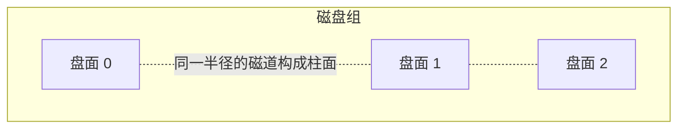
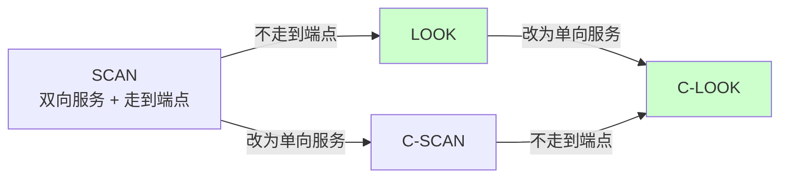
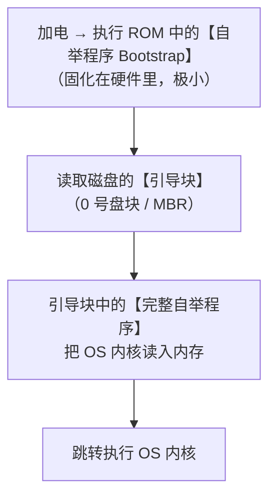
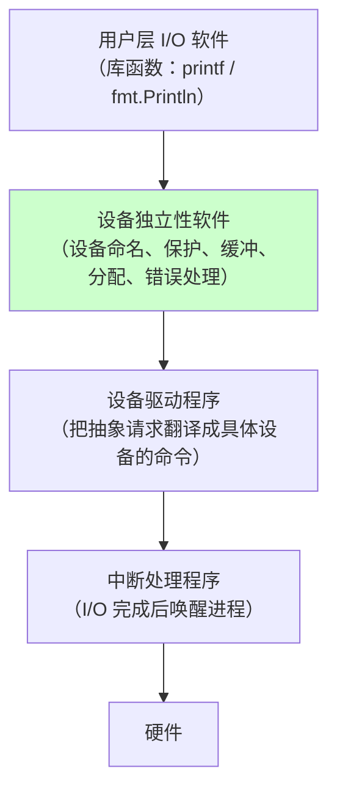
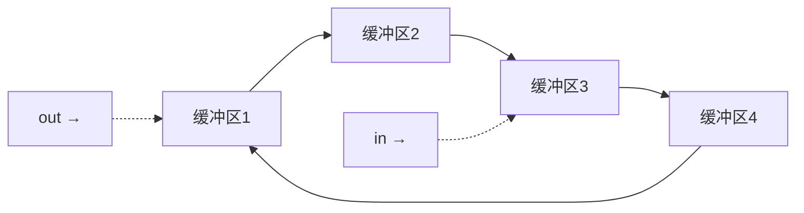
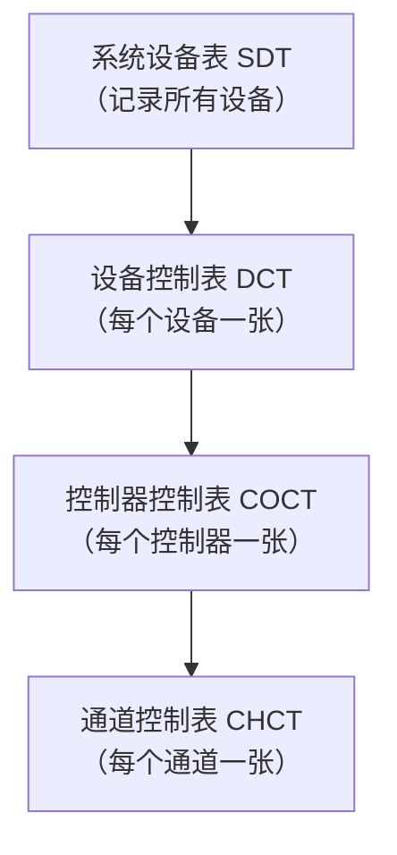
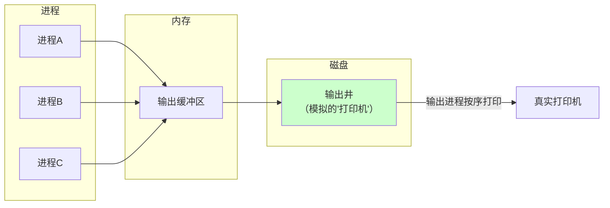
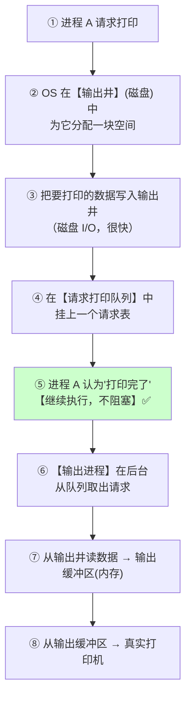
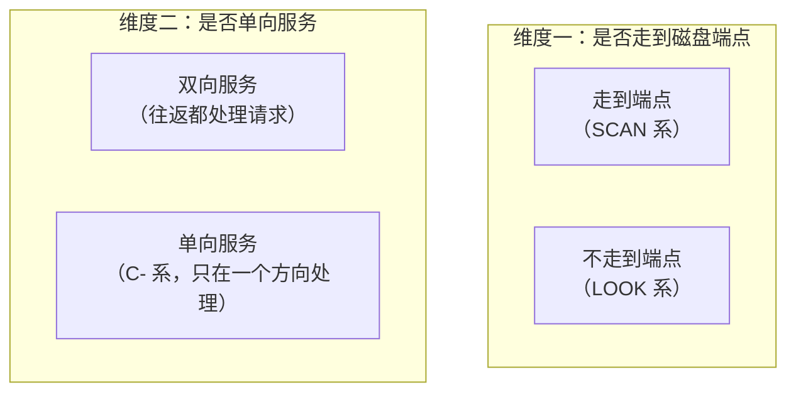
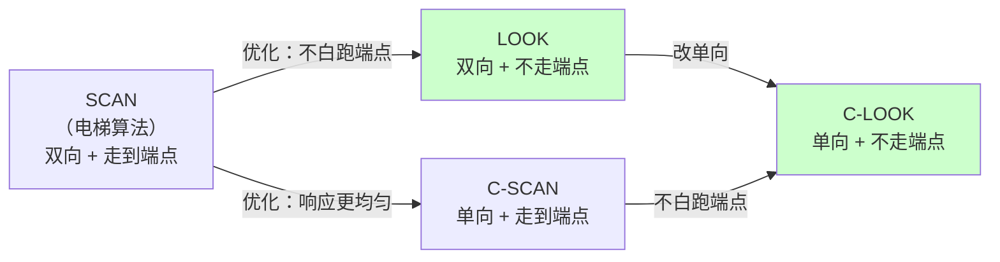

# 精通磁盘与 I/O 管理：磁盘调度、缓冲区与 SPOOLing

> 课程编号：OS09
> 路线图来源：计算机基础四大件 · 操作系统（408 第 4-5 章）
> 难度：⭐⭐⭐⭐
> 预计阅读时间：85 分钟
> 内容基准：2026 年 8 月（408 考纲操作系统「磁盘组织与管理」「I/O 管理」）
> **代码语言：Go**。本章用 Go 模拟磁盘调度算法并实测顺序/随机 I/O 差异。

---

## 引言：同样读 1000 个块，为什么差 50 倍

写两个程序，都从一个 4 GB 的文件里读 1000 个 4KB 的块：

```go
// 版本 A：顺序读
for i := 0; i < 1000; i++ {
    f.ReadAt(buf, int64(i)*4096)          // 块 0, 1, 2, 3, ...
}

// 版本 B：随机读
for i := 0; i < 1000; i++ {
    off := rand.Int63n(1000000) * 4096    // 块号完全随机
    f.ReadAt(buf, off)
}
```

**机械硬盘上的实测**：

```
顺序读 1000 块:   0.08 秒
随机读 1000 块:   4.20 秒      ← 慢 52 倍
```

读的数据量**完全相同**（4 MB），差别只在**读的顺序**。

原因在 [CO08](../computer-organization/CO08-精通-总线与输入输出系统.md) 已经算过一遍：

$$
T_{存取} = \underbrace{T_{寻道}}_{\sim 8\ ms} + \underbrace{T_{旋转延迟}}_{\sim 4\ ms} + \underbrace{T_{传输}}_{\sim 0.06\ ms}
$$

**"找到位置"的开销占 99.5%，真正传输只占 0.5%。**

```
顺序读：磁头几乎不动，1000 块共享【1 次】寻道 → 总时间 ≈ 12ms + 1000×0.06ms ≈ 72ms
随机读：每块都要重新寻道 + 等旋转 → 1000 × 12ms = 12000ms
```

**这就是磁盘调度存在的全部理由**：

> **磁盘的性能瓶颈不在"传输"，而在"移动磁头"。所以 OS 的核心任务是——【重排请求顺序，让磁头少跑路】。**

想象一个电梯：有人在 1 楼按了上行，有人在 8 楼按了下行，有人在 3 楼按了上行。电梯**不会**按按键的先后顺序一趟趟跑，而是**沿一个方向依次响应**。磁盘调度算法的名字里就有一个叫 **SCAN（电梯算法）**——它们解决的是同一个问题。

本章讲清楚三件事：

```
① 磁盘调度：怎么排请求顺序，让磁头少跑
② 缓冲区管理：怎么用内存缓冲抹平 CPU 与 I/O 的速度差
③ 设备管理：I/O 软件的分层，以及 SPOOLing 怎么把独占设备变共享
```

读完你应该能：

- **手工模拟五种磁盘调度算法并计算磁头移动总量**（408 必考）
- 说清 SCAN / LOOK / C-SCAN / C-LOOK 的两两区别
- 计算单缓冲、双缓冲处理一块数据的时间
- 说清 I/O 软件的四个层次各自负责什么
- 解释 SPOOLing 如何把独占设备改造成共享设备

---

## 第一章 磁盘的物理结构

### 1.1 基本术语



| 术语 | 含义 |
|---|---|
| **盘面（Platter surface）** | 每个盘片有上下两面，每面一个磁头 |
| **磁道（Track）** | 盘面上的同心圆 |
| **扇区（Sector）** | 磁道被划分成的小段，**是磁盘读写的最小单位**（通常 512 B 或 4 KB） |
| **柱面（Cylinder）** | **所有盘面上相同半径的磁道**的集合 |

**磁盘容量公式**：

$$
\text{容量} = \text{盘面数} \times \text{每面磁道数} \times \text{每道扇区数} \times \text{扇区大小}
$$

### 1.2 磁盘地址的组织

磁盘物理地址通常表示为 **(柱面号, 盘面号, 扇区号)**。

> ⚠️ **为什么柱面号在最前面？**
>
> 因为**换柱面要移动磁头臂（机械动作，最慢）**，而换盘面只需**电子切换磁头**（几乎瞬时）。
>
> 把柱面号放在高位，意味着**逻辑上连续的块会先填满同一柱面的所有盘面，再移到下一柱面**——这样顺序读写时磁头臂**几乎不用移动**。
>
> 若把盘面号放在最前面，连续的块就会分散在不同柱面上，每读一块都要寻道，**性能暴跌**。这是 408 常考的设计题。

### 1.3 存取时间

$$
\boxed{T_{存取} = T_{寻道} + T_{旋转延迟} + T_{传输}}
$$

| 分量 | 计算 | 典型值 |
|---|---|---|
| **寻道时间** $T_s$ | $T_s = m \times n + s$（$n$ = 跨越磁道数，$m$ = 每道耗时，$s$ = 启动时间） | **~5-10 ms** |
| **旋转延迟** $T_r$ | **平均 = 半圈** $= \dfrac{1}{2} \times \dfrac{60}{\text{rpm}}$ | **~2-4 ms** |
| **传输时间** $T_t$ | $\dfrac{\text{读取字节数}}{\text{每道字节数}} \times \dfrac{60}{\text{rpm}}$ | 很短 |

> ⭐ **只有【寻道时间】是 OS 能优化的**——旋转延迟和传输时间由硬件决定。所以**磁盘调度算法的唯一目标就是减少寻道**。

### 1.4 减少延迟时间的两个技巧

#### ① 交替编号

**问题**：连续读扇区 0、1、2 时，读完 0 之后要**处理数据**，等处理完，扇区 1 已经**转过去了**——必须等**整整一圈**才能再读到它。

**解法**：**扇区号不连续排列，中间隔开**。

```
连续编号：0  1  2  3  4  5  6  7        ← 读完 0，1 已转过去
交替编号：0  4  1  5  2  6  3  7        ← 读完 0，转两个位置就到 1
```

#### ② 错位命名

**问题**：同一柱面的不同盘面，若扇区号从同一位置开始，切换盘面后也要等一圈。

**解法**：**相邻盘面的起始扇区号错开一个位置**。

```
盘面 0: 0 1 2 3 4 5 6 7
盘面 1: 7 0 1 2 3 4 5 6      ← ★ 整体错开一位
盘面 2: 6 7 0 1 2 3 4 5
```

> 💡 **这两个技巧都是在"用空间布局换时间"**——不改变任何硬件，只调整编号方式，就能显著减少旋转等待。

---

## 第二章 磁盘调度算法（核心考点）

**统一示例**：磁道号 0~199，磁头**当前在 100 号磁道**，**上一次是从 90 移动到 100**（即当前方向**向大磁道号移动**）。

**请求队列**（按到达顺序）：

```
55, 58, 39, 18, 90, 160, 150, 38, 184
```

### 2.1 FCFS（先来先服务）

**规则**：严格按请求到达的顺序服务。

```
移动路径：
100 → 55 → 58 → 39 → 18 → 90 → 160 → 150 → 38 → 184

移动距离：
|100-55| + |55-58| + |58-39| + |39-18| + |18-90|
 + |90-160| + |160-150| + |150-38| + |38-184|
= 45 + 3 + 19 + 21 + 72 + 70 + 10 + 112 + 146
= 498 个磁道
```

| 优点 | 缺点 |
|---|---|
| ✅ **公平**，不会饥饿 | ❌ **磁头来回大幅横跳**，性能极差 |
| ✅ 实现简单 | ❌ 请求分散时开销巨大 |

### 2.2 SSTF（最短寻道时间优先）

**规则**：每次选择**距离当前磁头最近**的请求。

```
当前 100，队列 {55,58,39,18,90,160,150,38,184}

100 → 90  （距离 10，最近）
 90 → 58  （距离 32）
 58 → 55  （距离 3）
 55 → 39  （距离 16）
 39 → 38  （距离 1）
 38 → 18  （距离 20）
 18 → 150 （距离 132）★ 左边没了，只能跑到右边
150 → 160 （距离 10）
160 → 184 （距离 24）

移动距离 = 10+32+3+16+1+20+132+10+24 = 248 个磁道
```

| 优点 | 缺点 |
|---|---|
| ✅ 性能**比 FCFS 好很多**（498 → 248） | ❌ **可能饥饿**——若中间磁道请求不断，两端的请求永远等不到 |
| | ❌ 磁头仍可能来回移动 |

> ⚠️ **SSTF 的饥饿问题**：假设磁头在 100，不断有 99、101、100 的请求到来，那么磁道 18 和 184 的请求会**永远等待**。这与 [OS03](./OS03-精通-CPU-调度.md) 的 SJF 饥饿问题是同一种病。

### 2.3 SCAN（电梯算法）⭐

**规则**：磁头**沿一个方向移动到底**（到达磁盘端点），再**反向**移动到底，途中顺路响应请求。

```
当前 100，方向【向大】

向大移动：100 → 150 → 160 → 184 → 【199（磁盘末端）】
向小移动：199 → 90 → 58 → 55 → 39 → 38 → 18

移动距离 = (199 - 100) + (199 - 18)
        = 99 + 181
        = 280 个磁道
```

| 优点 | 缺点 |
|---|---|
| ✅ **不会饥饿**（磁头必然会扫过每个位置） | ❌ **必须走到端点**，即使那边已无请求（本例白跑 199-184=15 道） |
| ✅ 性能好 | ❌ **对两端磁道不公平**——刚被扫过的位置要等最久 |

> 💡 **"电梯算法"这个名字非常贴切**：电梯不会因为 3 楼有人按了就立刻掉头，而是**先把当前方向的乘客送完，到顶后再往下**。

### 2.4 LOOK（改进的 SCAN）

**规则**：与 SCAN 相同，但**该方向上没有请求时就立即掉头**，**不必走到端点**。

```
当前 100，方向【向大】

向大移动：100 → 150 → 160 → 184
         ★ 184 之后已无更大的请求 → 【立即掉头】，不走到 199
向小移动：184 → 90 → 58 → 55 → 39 → 38 → 18

移动距离 = (184 - 100) + (184 - 18)
        = 84 + 166
        = 250 个磁道
```

**比 SCAN 省了 30 个磁道**（就是那段白跑的 15×2）。

> ⭐ **LOOK 的名字含义**："先 **look**（看一眼）前面还有没有请求，没有就掉头"。

### 2.5 C-SCAN（循环扫描）

**规则**：磁头**只在一个方向上响应请求**；到达端点后**快速返回起点**（返回途中**不处理任何请求**），再重新开始。

```
当前 100，方向【向大】

向大移动（处理请求）：100 → 150 → 160 → 184 → 199
快速返回（不处理）：  199 → 0                  ★ 直接跳回
向大移动（处理请求）：0 → 18 → 38 → 39 → 55 → 58 → 90

移动距离 = (199-100) + (199-0) + (90-0)
        = 99 + 199 + 90
        = 388 个磁道
```

| 优点 | 缺点 |
|---|---|
| ✅ **各磁道的等待时间更均匀**（每个位置的响应间隔固定） | ❌ **总移动距离更长**（返回途中不干活） |

> 💡 **为什么 C-SCAN 更公平？**
>
> **SCAN**：磁头刚扫过位置 X，X 处的新请求要等磁头**跑到另一端再回来**（最长约 2 倍磁盘长度）。
> **C-SCAN**：每个位置的响应间隔**固定为一个扫描周期**，等待时间的**方差小得多**。
>
> **牺牲总移动距离，换取响应时间的可预测性**——这与 [OS03](./OS03-精通-CPU-调度.md) 的 RR 算法追求"响应时间可预测"是同一思路。

### 2.6 C-LOOK

**规则**：C-SCAN + LOOK 的结合——**只在一个方向服务，且不走到端点**。

```
当前 100，方向【向大】

向大移动（处理）：100 → 150 → 160 → 184
                 ★ 前方无请求，掉头
快速返回：       184 → 18            ★ 直接跳到最小的请求处
向大移动（处理）：18 → 38 → 39 → 55 → 58 → 90

移动距离 = (184-100) + (184-18) + (90-18)
        = 84 + 166 + 72
        = 322 个磁道
```

### 2.7 五种算法总对比

| 算法 | 本例移动距离 | 是否饥饿 | 是否走到端点 | 是否单向服务 |
|---|---|---|---|---|
| **FCFS** | **498** | ❌ 不饥饿 | —— | 否 |
| **SSTF** | **248** ⭐最短 | ✅ **会饥饿** | —— | 否 |
| **SCAN** | 280 | ❌ 不饥饿 | ✅ **走到端点** | 否（双向服务） |
| **LOOK** | **250** | ❌ 不饥饿 | ❌ 不走到端点 | 否（双向服务） |
| **C-SCAN** | 388 | ❌ 不饥饿 | ✅ 走到端点 | ✅ **单向服务** |
| **C-LOOK** | 322 | ❌ 不饥饿 | ❌ **不走到端点** | ✅ 单向服务 |

**四个算法的关系（记忆图）**：



> ⭐ **两个维度的正交组合**：
>
> | | **走到端点** | **不走到端点（LOOK 系）** |
> |---|---|---|
> | **双向服务** | **SCAN** | **LOOK** |
> | **单向服务（C- 系）** | **C-SCAN** | **C-LOOK** |
>
> **"C" = Circular（循环，单向）**；**"LOOK" = 先看一眼再决定要不要掉头**。

> 💡 **实际系统用的是 LOOK 或 C-LOOK**（走到端点纯属浪费）。Linux 的 `deadline`、`mq-deadline` 调度器就是 LOOK 的变体，额外加了"超时强制服务"来彻底杜绝饥饿。

### 2.8 用 Go 验证

```go
package main

import (
    "fmt"
    "sort"
)

func abs(x int) int {
    if x < 0 {
        return -x
    }
    return x
}

// FCFS
func fcfs(reqs []int, start int) int {
    total, cur := 0, start
    for _, r := range reqs {
        total += abs(r - cur)
        cur = r
    }
    return total
}

// SSTF：每次选最近的
func sstf(reqs []int, start int) int {
    pending := append([]int(nil), reqs...)
    total, cur := 0, start
    for len(pending) > 0 {
        best, bestDist := 0, 1<<30
        for i, r := range pending {
            if d := abs(r - cur); d < bestDist {
                best, bestDist = i, d
            }
        }
        total += bestDist
        cur = pending[best]
        pending = append(pending[:best], pending[best+1:]...)
    }
    return total
}

// SCAN / LOOK：up=向大方向；toEnd=是否走到端点
func scanLike(reqs []int, start, maxTrack int, up, toEnd bool) int {
    s := append([]int(nil), reqs...)
    sort.Ints(s)

    var right, left []int
    for _, r := range s {
        if r >= start {
            right = append(right, r)
        } else {
            left = append(left, r)
        }
    }

    total, cur := 0, start
    if up {
        for _, r := range right { // 先向大
            total += r - cur
            cur = r
        }
        if toEnd && cur < maxTrack { // ★ SCAN 要走到端点
            total += maxTrack - cur
            cur = maxTrack
        }
        for i := len(left) - 1; i >= 0; i-- { // 掉头向小
            total += cur - left[i]
            cur = left[i]
        }
    }
    return total
}

// C-SCAN / C-LOOK：单向服务
func cScanLike(reqs []int, start, maxTrack int, toEnd bool) int {
    s := append([]int(nil), reqs...)
    sort.Ints(s)

    var right, left []int
    for _, r := range s {
        if r >= start {
            right = append(right, r)
        } else {
            left = append(left, r)
        }
    }

    total, cur := 0, start
    for _, r := range right {
        total += r - cur
        cur = r
    }
    if len(left) == 0 {
        return total
    }
    if toEnd { // C-SCAN：到端点再回 0
        total += (maxTrack - cur) + maxTrack
        cur = 0
    } else { // C-LOOK：直接跳到最小请求
        total += cur - left[0]
        cur = left[0]
    }
    for _, r := range left {
        total += r - cur
        cur = r
    }
    return total
}

func main() {
    reqs := []int{55, 58, 39, 18, 90, 160, 150, 38, 184}
    const start, maxT = 100, 199

    fmt.Printf("%-10s %s\n", "算法", "磁头移动总距离")
    fmt.Printf("%-10s %d\n", "FCFS", fcfs(reqs, start))
    fmt.Printf("%-10s %d\n", "SSTF", sstf(reqs, start))
    fmt.Printf("%-10s %d\n", "SCAN", scanLike(reqs, start, maxT, true, true))
    fmt.Printf("%-10s %d\n", "LOOK", scanLike(reqs, start, maxT, true, false))
    fmt.Printf("%-10s %d\n", "C-SCAN", cScanLike(reqs, start, maxT, true))
    fmt.Printf("%-10s %d\n", "C-LOOK", cScanLike(reqs, start, maxT, false))
}
```

**输出**（与手算完全一致）：

```
算法       磁头移动总距离
FCFS       498
SSTF       248
SCAN       280
LOOK       250
C-SCAN     388
C-LOOK     322
```

---

## 第三章 磁盘管理

### 3.1 磁盘初始化


| 步骤 | 做什么 |
|---|---|
| **低级格式化** | 把磁盘划分成**扇区**，为每个扇区建立**头、数据区、尾**（含**纠错码 ECC**） |
| **分区** | 把磁盘划分成若干**分区**（C 盘、D 盘 / `/dev/sda1`、`/dev/sda2`） |
| **逻辑格式化** | 建立**文件系统**（初始化 inode 表、空闲块位图、根目录） |

### 3.2 引导块

**问题**：计算机开机时，内存里什么都没有，怎么把 OS 装进来？



> ⭐ **为什么要分两级？**
>
> ROM 是**只读的、容量极小**，把完整的自举程序固化进去既装不下也无法更新（换了 OS 就得换硬件）。
>
> **解法**：ROM 里只放一段**极小的引导装入程序**，它唯一的任务是"**从磁盘 0 号块读入真正的自举程序**"。这样：
> - ROM 部分**永不改变**
> - 磁盘上的引导块**可以随时更新**（换 OS 只需改磁盘）

### 3.3 坏块管理

| 磁盘类型 | 处理方式 |
|---|---|
| **简单磁盘** | 逻辑格式化时**扫描出坏块，在 FAT 或位图上标记为"已占用"**，从此不再分配 |
| **现代磁盘（SCSI/SATA）** | 控制器**自动维护一个坏块链表**，出厂时就留有**备用扇区**，坏块被**透明地重映射**到备用扇区 |

> 💡 **现代磁盘的坏块处理对 OS 完全透明**——OS 根本不知道有坏块。用 `smartctl -a /dev/sda` 能看到 `Reallocated_Sector_Ct`（已重映射扇区数），**这个值持续增长是磁盘即将失效的强信号**。

---

## 第四章 I/O 设备与控制方式

### 4.1 设备分类

**按传输速率**：

| 类别 | 速率 | 例子 |
|---|---|---|
| 低速设备 | 每秒几字节~几百字节 | 键盘、鼠标 |
| 中速设备 | 每秒数千~上万字节 | 打印机 |
| 高速设备 | 每秒数十万字节以上 | 磁盘、网卡 |

**按信息交换单位**（重要）：

| 类别 | 特点 | 例子 |
|---|---|---|
| **块设备** | 以**块**为单位传输；**可寻址**（能随机读写任意块）；速度快；**用 DMA** | **磁盘**、SSD |
| **字符设备** | 以**字符**为单位传输；**不可寻址**（只能顺序）；速度慢；**用中断驱动** | 键盘、鼠标、打印机、终端 |

**按共享属性**：

| 类别 | 说明 |
|---|---|
| **独占设备** | 一段时间只能一个进程用（打印机） |
| **共享设备** | 可多进程同时访问（磁盘） |
| **虚拟设备** | 用 **SPOOLing** 把独占设备**改造成**逻辑上的共享设备 |

### 4.2 四种 I/O 控制方式

这部分与 [CO08](../computer-organization/CO08-精通-总线与输入输出系统.md) 第三章完全对应，这里从 OS 视角快速回顾：

| 方式 | 数据传送单位 | 数据流向 | CPU 参与度 |
|---|---|---|---|
| **程序查询（轮询）** | 字 | 设备 → **CPU** → 内存 | **全程死等** |
| **程序中断** | 字 | 设备 → **CPU** → 内存 | 每传一个字中断一次 |
| **DMA** | **块** | 设备 → **内存**（不经 CPU） | 只在**块传输开始和结束**时干预 |
| **通道** | **一组块** | 设备 → 内存 | **CPU 只需发一条 I/O 指令**，通道自己执行"通道程序" |

> ⭐ **通道是"专用的 I/O 处理器"**——它有自己的指令系统（通道指令），能执行一段"通道程序"，完成**一组**数据块的传输。
>
> **DMA vs 通道**：
> - **DMA**：CPU 每次要指明"读哪个块、放哪里、读多少"
> - **通道**：CPU 只说"执行这段通道程序"，通道自己完成**多个不连续块**的传输，全部完成后才中断一次

---

## 第五章 I/O 软件的层次结构



| 层次 | 职责 | 关键点 |
|---|---|---|
| **① 用户层 I/O 软件** | 提供**库函数接口**；**SPOOLing 也在这一层** | 用户直接调用的部分 |
| **② 设备独立性软件（设备无关软件）** | **统一接口**、设备保护、**差错处理**、**缓冲管理**、**设备分配与回收**、逻辑设备名 → 物理设备名 | **本层最重要** ⭐ |
| **③ 设备驱动程序** | 把上层的抽象请求（"读第 100 块"）翻译成**具体设备的控制命令**（"移动磁头到第 5 柱面…"） | **每类设备一个驱动** |
| **④ 中断处理程序** | I/O 完成后处理中断，**唤醒等待的进程** | |

> ⭐ **"设备独立性"的含义**：**用户程序使用【逻辑设备名】而不是【物理设备名】**。
>
> ```
> 用户程序说："往打印机输出"（逻辑设备名）
>      ↓ 设备独立性软件查【逻辑设备表 LUT】
> 实际映射到："3 号打印机"（物理设备名）
> ```
>
> **好处**：
> 1. 3 号打印机坏了，改映射到 5 号即可，**用户程序不用改一行代码**
> 2. 同一个程序可以在不同配置的机器上运行

**Linux 的"一切皆文件"就是设备独立性的极致体现**：

```go
// 完全相同的代码，可以操作文件、管道、设备、socket
f1, _ := os.Open("data.txt")     // 普通文件
f2, _ := os.Open("/dev/urandom") // 字符设备
f3, _ := os.Open("/dev/sda")     // 块设备

// ★ 上层代码完全不需要区分它们
io.Copy(os.Stdout, f1)
io.Copy(os.Stdout, f2)
```

---

## 第六章 缓冲区管理

### 6.1 为什么需要缓冲区

| 目的 | 说明 |
|---|---|
| **缓和 CPU 与 I/O 设备速度不匹配** | CPU 快 100 万倍，缓冲区让两者能"错峰"工作 |
| **减少中断频率** | 攒够一批再中断，而不是每字节一次 |
| **解决数据粒度不匹配** | 进程一次产生 1 字节，磁盘一次要写 4KB |
| **提高 CPU 与 I/O 的并行性** | CPU 计算的同时，设备在传输 |

### 6.2 四种缓冲方式的时间分析（408 高频计算）

**三个时间量**：

| 符号 | 含义 |
|---|---|
| **T** | 设备把**一块数据送入缓冲区**的时间 |
| **M** | 把数据**从缓冲区传送到工作区**的时间 |
| **C** | CPU **处理一块数据**的时间 |

#### ① 单缓冲

```
缓冲区只有一个：
  设备 --T--> [缓冲区] --M--> [工作区] --C--> CPU 处理
```

**关键约束**：**缓冲区被"充满"之前，不能被取走；被"取空"之前，设备不能再送入。**

```
时间轴（处理连续两块）：
块1:  |--- T ---|- M -|--- C ---|
块2:            |--- T ---|- M -|--- C ---|
                ↑ 设备可以在 CPU 处理块1 时充填缓冲区吗？
                ★ 不行！M 完成后缓冲区才空出来
```

$$
\boxed{\text{单缓冲处理一块的平均时间} = \max(C,\ T) + M}
$$

**推导**：

```
若 T > C：设备是瓶颈
  在 CPU 处理块 i（耗时 C）的同时，设备可以往缓冲区送块 i+1（耗时 T）
  由于 T > C，CPU 处理完还要等设备
  → 周期 = T + M

若 C > T：CPU 是瓶颈
  设备送完块 i+1 后要等 CPU 处理完块 i 才能 M
  → 周期 = C + M

合并：周期 = max(C, T) + M
```

#### ② 双缓冲

```
两个缓冲区交替使用：
  设备往缓冲区1 送 ←→ 同时从缓冲区2 取走
```

$$
\boxed{\text{双缓冲处理一块的平均时间} = \max(C + M,\ T)}
$$

**推导**：

```
若 T > C + M：设备是瓶颈
  CPU 从一个缓冲区取数据（M）并处理（C）的时间内，
  设备还没填满另一个缓冲区
  → 周期 = T

若 C + M > T：CPU 是瓶颈
  设备很快填满另一个缓冲区，在等 CPU
  → 周期 = C + M
```

> ⭐ **双缓冲的价值：把 M 从"串行"变成"并行"**。
>
> - **单缓冲**：$\max(C,T) + M$ —— M 必须**单独占用时间**
> - **双缓冲**：$\max(C+M, T)$ —— M 可以**与设备传输并行**
>
> 当 $T$ 很大（慢设备）时，双缓冲能把 M 完全"藏"进 T 里面。

**例题**：$T = 100$ ms，$M = 5$ ms，$C = 90$ ms，处理 10 块数据。

```
单缓冲：max(90, 100) + 5 = 105 ms/块
       10 块 ≈ 105 × 10 = 1050 ms

双缓冲：max(90+5, 100) = max(95, 100) = 100 ms/块
       10 块 ≈ 100 × 10 = 1000 ms
```

> ⚠️ **408 题目常问"处理 n 块数据总共需要多少时间"**。严格算法要考虑首尾的边界（第一块的填充、最后一块的处理），但**当 n 较大时，通常直接用"周期 × n"近似**。**看清题目要求的精度**。

#### ③ 循环缓冲

**多个缓冲区组成循环链表**，设置 `in` 和 `out` 两个指针。



适合**生产者-消费者速度差异波动大**的场景（能吸收突发）。

#### ④ 缓冲池

**统一管理的缓冲区集合**，供**多个进程共享**。

**三个队列**：

| 队列 | 内容 |
|---|---|
| **空缓冲队列 emq** | 空闲的缓冲区 |
| **输入队列 inq** | 装满了**输入数据**的缓冲区 |
| **输出队列 outq** | 装满了**输出数据**的缓冲区 |

**四种工作缓冲区**：

| 类型 | 用途 |
|---|---|
| `hin` | 收容输入（设备往里写） |
| `sin` | 提取输入（进程从里读） |
| `hout` | 收容输出（进程往里写） |
| `sout` | 提取输出（设备从里读） |

> 💡 **Go 的 `bufio` 和 channel 缓冲就是这套机制的语言级实现**：
> ```go
> w := bufio.NewWriterSize(f, 4096)  // 单缓冲
> ch := make(chan []byte, 10)        // 循环缓冲（容量 10）
> ```

### 6.3 缓冲区 vs 高速缓存

| | **缓冲区（Buffer）** | **高速缓存（Cache）** |
|---|---|---|
| **存放什么** | 即将**传输**的数据 | **可能被重复访问**的数据副本 |
| **目的** | **速度匹配** + 减少中断 | **减少访问慢速存储的次数** |
| **数据是否在慢速设备也有** | **不一定**（可能是新产生的） | **一定有**（是副本） |

> 💡 Linux 的 `free -h` 里有 `buff/cache` 两列，正是这两个概念：
> - **buffers**：块设备 I/O 的缓冲
> - **cache**：文件内容的页缓存

---

## 第七章 设备分配与 SPOOLing

### 7.1 设备分配中的数据结构



**分配流程**：**分配设备 → 分配控制器 → 分配通道**，三者**全部成功**才算分配成功。

### 7.2 设备独立性（逻辑设备表 LUT）

用户程序用**逻辑设备名**请求，OS 通过 **LUT（逻辑设备表）**映射到物理设备。

| 逻辑设备名 | 物理设备名 | 驱动程序入口 |
|---|---|---|
| `/dev/打印机` | 3 号打印机 | 0x1234 |

**两种设置方式**：

| 方式 | 特点 |
|---|---|
| **整个系统一张 LUT** | 各用户**不能使用相同的逻辑设备名**（不适合多用户） |
| **每个用户一张 LUT** ⭐ | 不同用户可以用**相同的逻辑设备名**，互不冲突 |

### 7.3 SPOOLing 技术（假脱机）⭐

**目标：把【独占设备】改造成【逻辑上的共享设备】。**

**背景**：打印机是独占设备。若进程 A 正在打印，进程 B 必须**一直等到 A 打印完**（可能几分钟），期间 B 完全阻塞。

**SPOOLing 的解法**：



**五个组成部分**：

| 组成 | 位置 | 作用 |
|---|---|---|
| **输入井 / 输出井** | **磁盘** | 模拟脱机时的输入/输出设备（**核心**） |
| **输入缓冲区 / 输出缓冲区** | **内存** | 缓和速度差异 |
| **输入进程 / 输出进程** | —— | 模拟脱机时的外围控制机 |

**工作流程（以打印为例）**：

```
① 进程 A 请求打印
     ↓
② OS 在【输出井】中为它分配一块空间，把数据写进去（磁盘 I/O，很快）
     ↓
③ OS 把 A 的打印请求挂到【请求打印队列】上
     ↓
④ 【进程 A 认为自己已经打印完了，继续执行】✅ 不再阻塞
     ↓
⑤ 【输出进程】在后台从队列中取请求，逐个送到真实打印机打印
```

**效果**：

| | 无 SPOOLing | 有 SPOOLing |
|---|---|---|
| 进程 B 的等待 | 阻塞几分钟 | **几乎不等**（只等写磁盘的时间） |
| 打印机利用率 | 低（进程间切换有空隙） | **高**（输出进程连续供给） |
| 用户感受 | 打印机是独占的 | **打印机好像有很多台** |

> ⭐ **SPOOLing 的本质：用【磁盘】这个共享设备，虚拟出多台【独占设备】。**
>
> 进程感觉自己独占了一台打印机，实际上它只是往磁盘上写了个文件。**这是"虚拟"这一操作系统特征（[OS01](./OS01-精通-操作系统概述与运行环境.md) §1.2）最典型的应用。**

> 💡 **今天的 Linux 打印系统 CUPS 仍然是 SPOOLing 架构**：`lp` 命令把文件放进 `/var/spool/cups/`，后台的 `cupsd` 守护进程负责实际打印。**"spool" 这个词就是从这里来的**（Simultaneous Peripheral Operations On-Line）。

---

## 第八章 408 高频考点与陷阱清单

### 8.1 考点分布

本章通常是 **1-2 道选择题 + 高概率的计算题**（磁盘调度、缓冲区时间）。

最常考：

1. **五种磁盘调度算法的手工模拟与磁头移动距离计算**（必考）
2. **单缓冲/双缓冲的时间计算**
3. SCAN / LOOK / C-SCAN / C-LOOK 的区别
4. I/O 软件的层次划分
5. SPOOLing 的组成与作用

### 8.2 十六个陷阱

**陷阱 1：磁盘存取时间中传输时间占主导**

**错**。**寻道 + 旋转延迟占 99% 以上**，传输时间很短。这正是"顺序读比随机读快几十倍"的原因。

**陷阱 2：磁盘调度能减少旋转延迟**

**错**。磁盘调度只能减少**寻道时间**（这是 OS 唯一能控制的）。旋转延迟由硬件转速决定。

**陷阱 3：磁盘地址应该把盘面号放在最高位**

**错**。**柱面号应放在最高位**——因为换柱面要移动磁头臂（机械动作），换盘面只需电子切换。这样连续的块会先填满同一柱面。

**陷阱 4：SSTF 算法不会产生饥饿**

**错**。SSTF **会饥饿**——若中间磁道请求不断，两端的请求永远得不到服务。

**陷阱 5：SCAN 算法就是 LOOK 算法**

**错**。区别在于**是否走到磁盘端点**：

| | 走到端点 |
|---|---|
| **SCAN** | ✅ 必须走到 |
| **LOOK** | ❌ 前方无请求就掉头 |

**陷阱 6：C-SCAN 的总移动距离比 SCAN 短**

**错，通常更长**（返回途中不处理请求）。C-SCAN 换来的是**响应时间更均匀**。

**陷阱 7：C-SCAN 返回起点的路上也响应请求**

**错**。**C-SCAN 只在一个方向上响应请求**，返回途中**不处理任何请求**（这正是 "C = Circular 单向"的含义）。

**陷阱 8：磁盘调度算法中 SSTF 总是最优的**

**不准确**。SSTF 的**总移动距离通常最短**，但它**会饥饿**。实际系统用 LOOK / C-LOOK 的变体（兼顾性能与公平）。

**陷阱 9：单缓冲处理一块的时间是 T + M + C**

**错**。是 $\max(C, T) + M$——设备传输 T 和 CPU 处理 C 可以**并行**。

**陷阱 10：双缓冲处理一块的时间是 max(C, T)**

**错**。是 $\max(C + M, T)$——M（缓冲区→工作区）与 C 是**串行**的，两者合起来才与 T 并行。

**陷阱 11：缓冲区和高速缓存是一回事**

**错**：

| | 缓冲区 | 高速缓存 |
|---|---|---|
| 存的数据 | 即将**传输**的 | **可能被重复访问**的**副本** |
| 慢速设备上是否有 | **不一定** | **一定有** |

**陷阱 12：块设备用中断驱动，字符设备用 DMA**

**错，反了**。**块设备（磁盘）用 DMA**（数据量大）；**字符设备（键盘）用中断驱动**（数据量小）。

**陷阱 13：SPOOLing 中的输入井/输出井在内存中**

**错**。**输入井和输出井在【磁盘】上**。在内存的是**输入缓冲区和输出缓冲区**。

**陷阱 14：SPOOLing 把共享设备改造成独占设备**

**错，反了**。SPOOLing 把**独占设备**（打印机）改造成**逻辑上的共享设备**。

**陷阱 15：设备驱动程序属于设备独立性软件**

**错**。这是**两个不同的层次**：

```
用户层 I/O 软件
设备独立性软件      ← 统一接口、缓冲、分配
设备驱动程序        ← 每类设备一个，翻译成具体命令
中断处理程序
```

**陷阱 16：SPOOLing 属于设备驱动程序层**

**错**。**SPOOLing 属于【用户层 I/O 软件】**。

### 8.3 速查卡

```
【磁盘存取时间】
T = 寻道 + 旋转延迟 + 传输
★ 只有【寻道时间】能被 OS 优化（磁盘调度的唯一目标）
平均旋转延迟 = (1/2)×(60/rpm)
磁盘地址：【柱面号 | 盘面号 | 扇区号】← 柱面号在最高位

【五种调度算法】
FCFS  ：公平但性能最差
SSTF  ：距离最近优先，性能好但【会饥饿】
SCAN  ：双向服务 + 【走到端点】（电梯算法）
LOOK  ：双向服务 + 【不走到端点】
C-SCAN：【单向服务】+ 走到端点，响应更均匀
C-LOOK：【单向服务】+ 不走到端点

二维记忆：
          走到端点     不走到端点
双向服务   SCAN         LOOK
单向服务   C-SCAN       C-LOOK
（C = Circular 单向；LOOK = 先看一眼再掉头）

【缓冲区时间】
单缓冲：max(C, T) + M
双缓冲：max(C + M, T)
★ 双缓冲把 M 藏进了并行里

【I/O 软件四层】
① 用户层 I/O 软件      ← 【SPOOLing 在这层】
② 设备独立性软件       ← 统一接口、缓冲、分配、逻辑设备名映射
③ 设备驱动程序         ← 每类设备一个
④ 中断处理程序

【SPOOLing】
输入井/输出井 → 在【磁盘】上
输入/输出缓冲区 → 在【内存】中
输入/输出进程 → 模拟外围控制机
作用：把【独占设备】改造成【逻辑上的共享设备】

【设备分类】
块设备（磁盘）：可寻址、速度快、【用 DMA】
字符设备（键盘）：不可寻址、速度慢、【用中断驱动】
```

---

## 第九章 Go ↔ C 对照

| 场景 | C | Go | 说明 |
|---|---|---|---|
| 缓冲写 | `setvbuf` / stdio 自带 | **`bufio.NewWriterSize`** | 对应"单缓冲" |
| 循环缓冲 | 手工实现环形队列 | **带缓冲 channel** | `make(chan T, n)` |
| 随机读写 | `pread` / `pwrite` | **`f.ReadAt` / `f.WriteAt`** | 不改变文件偏移，并发安全 |
| 强制刷盘 | `fsync()` | **`f.Sync()`** | 保证数据真正落盘 |
| 建议顺序读 | `posix_fadvise(SEQUENTIAL)` | `syscall.Fadvise` | 提示内核预读 |
| 绕过页缓存 | `O_DIRECT` | `syscall.Open` + `O_DIRECT` | 数据库常用 |
| 查看 I/O 统计 | `/proc/diskstats` | 同左 | 或用 `iostat` |

**实测顺序 vs 随机 I/O**：

```go
package main

import (
    "fmt"
    "math/rand"
    "os"
    "time"
)

func bench(f *os.File, blocks int64, random bool) time.Duration {
    buf := make([]byte, 4096)
    start := time.Now()
    for i := int64(0); i < 1000; i++ {
        var off int64
        if random {
            off = rand.Int63n(blocks) * 4096 // ★ 随机位置
        } else {
            off = i * 4096 // ★ 顺序位置
        }
        f.ReadAt(buf, off)
    }
    return time.Since(start)
}

func main() {
    f, err := os.Open("/path/to/bigfile")
    if err != nil {
        fmt.Println("需要先准备一个大文件:", err)
        return
    }
    defer f.Close()
    fi, _ := f.Stat()
    blocks := fi.Size() / 4096

    seq := bench(f, blocks, false)
    rnd := bench(f, blocks, true)
    fmt.Printf("顺序读 1000 块: %v\n", seq)
    fmt.Printf("随机读 1000 块: %v\n", rnd)
    fmt.Printf("慢 %.1f 倍\n", float64(rnd)/float64(seq))
}
```

> ⚠️ **在 SSD 上这个差距会小很多**（SSD 没有机械寻道），但**随机写**仍明显慢——因为 Flash 必须**按块擦除**，随机写引发"写放大"和垃圾回收。
>
> **所以 append-only 的设计（WAL、LSM-Tree、Kafka 日志）在 SSD 时代依然正确**，见 [CO08](../computer-organization/CO08-精通-总线与输入输出系统.md) §6 的讨论。

---

## 第十章 练习题

### 选择题

**1.** 磁盘存取时间中，**操作系统能够优化**的部分是：
A. 寻道时间　B. 旋转延迟　C. 传输时间　D. 全部都能

**2.** 磁盘物理地址通常表示为"柱面号、盘面号、扇区号"，把柱面号放在最高位的原因是：
A. 柱面数量最多
B. 移动磁头臂（换柱面）的代价最大，这样能让连续块尽量在同一柱面
C. 便于计算
D. 历史原因

**3.** 下列磁盘调度算法中，**可能导致饥饿**的是：
A. FCFS　B. SSTF　C. SCAN　D. C-LOOK

**4.** SCAN 算法与 LOOK 算法的主要区别是：
A. 是否单向服务
B. 是否必须移动到磁盘的端点
C. 是否考虑请求的到达时间
D. 是否会饥饿

**5.** C-SCAN 相对 SCAN 的主要优点是：
A. 磁头移动总距离更短
B. 各磁道的等待时间更均匀
C. 不会饥饿
D. 实现更简单

**6.** 单缓冲情况下，处理一块数据的平均时间是（T=输入到缓冲区，M=缓冲区到工作区，C=CPU 处理）：
A. T + M + C　B. max(C, T) + M　C. max(C + M, T)　D. max(T, M, C)

**7.** 双缓冲情况下，处理一块数据的平均时间是：
A. T + M + C　B. max(C, T) + M　C. max(C + M, T)　D. max(T, M)

**8.** SPOOLing 技术中，输入井和输出井位于：
A. 内存　B. 磁盘　C. 高速缓存　D. 设备控制器

**9.** SPOOLing 技术属于 I/O 软件的哪一层：
A. 用户层 I/O 软件
B. 设备独立性软件
C. 设备驱动程序
D. 中断处理程序

**10.** 关于块设备和字符设备，**正确**的是：
A. 块设备通常采用中断驱动方式，字符设备采用 DMA
B. 块设备可寻址，字符设备不可寻址
C. 字符设备的传输速度通常高于块设备
D. 磁盘属于字符设备

### 应用题

**11.** 某磁盘有 **200 个磁道**（编号 0~199），当前磁头位于 **143** 号磁道，**刚刚从 125 号磁道移动过来**（即当前方向为**磁道号增大**方向）。

请求队列（按到达顺序）：**86, 147, 91, 177, 94, 150, 102, 175, 130**

分别用 **FCFS、SSTF、SCAN、LOOK、C-SCAN、C-LOOK** 六种算法：

（1）写出磁头的移动顺序
（2）计算磁头移动的总磁道数
（3）比较六种算法的优劣

**12.** 某系统采用**单缓冲**方式从磁盘读入数据并处理。已知：

- 磁盘把一块数据送入缓冲区：**T = 80 ms**
- 缓冲区送到用户工作区：**M = 15 ms**
- CPU 处理一块数据：**C = 60 ms**

（1）单缓冲处理**一块**数据的平均时间是多少？
（2）改用**双缓冲**后，平均时间是多少？
（3）若要处理 **100 块**数据，两种方式各需多长时间？（用平均时间估算）
（4）若 CPU 处理时间变为 **C = 100 ms**，重新计算（1）（2）。

**13.** 某磁盘转速 **7200 rpm**，平均寻道时间 **9 ms**，每个磁道有 **500 个扇区**，每扇区 **512 B**。

（1）平均旋转延迟是多少？
（2）读取**一个扇区**的平均存取时间是多少？
（3）若要读取**同一磁道上连续的 100 个扇区**，总时间约为多少？
（4）若这 100 个扇区**随机分布在不同磁道**上，总时间约为多少？对比说明。

**14.** 详细说明 **SPOOLing 技术**：

（1）它由哪五部分组成？各部分位于何处？
（2）以打印为例，说明完整的工作流程。
（3）为什么说 SPOOLing 把独占设备"虚拟"成了共享设备？

**15.** 对比 **SCAN、LOOK、C-SCAN、C-LOOK** 四种算法：

（1）用两个维度（是否走到端点、是否单向服务）画出它们的关系。
（2）为什么 C-SCAN 的总移动距离更长，却仍被采用？
（3）实际系统（如 Linux）为什么用 LOOK / C-LOOK 而不是 SCAN / C-SCAN？

### 答案与解析

<details>
<summary>点击展开</summary>

**1. A**

$$
T_{存取} = T_{寻道} + T_{旋转延迟} + T_{传输}
$$

| 分量 | OS 能否优化 |
|---|---|
| **寻道时间** | ✅ **能**——通过**磁盘调度算法**重排请求顺序 |
| 旋转延迟 | ❌ 由**转速**决定（硬件） |
| 传输时间 | ❌ 由**转速和数据量**决定 |

**磁盘调度算法的唯一目标就是减少寻道时间。**

**2. B**

**换柱面 = 移动磁头臂（机械动作，~10 ms）**
**换盘面 = 电子切换磁头（~0 ms）**

把柱面号放在最高位，意味着**逻辑上连续的块会先填满同一柱面的所有盘面**，再移到下一柱面。顺序读写时**磁头臂几乎不动**。

若盘面号在最高位，连续块会分散到不同柱面，**每读一块都要寻道**——性能暴跌几十倍。

**3. B**

**SSTF（最短寻道时间优先）会饥饿**：若中间磁道的请求源源不断，磁头就一直在中间附近徘徊，**两端的请求永远得不到服务**。

SCAN / LOOK / C-LOOK 都保证磁头会**周期性地扫过所有磁道**，不会饥饿。FCFS 严格按到达顺序，更不会饥饿。

**4. B**

| | SCAN | LOOK |
|---|---|---|
| **是否走到磁盘端点** | ✅ **必须走到**（0 或 199） | ❌ **前方无请求就掉头** |
| 是否单向服务 | 否（双向） | 否（双向） |

A 描述的是 SCAN 与 C-SCAN 的区别。

**5. B**

**C-SCAN 的优点是"各磁道等待时间更均匀"**：

```
SCAN：磁头刚扫过位置 X，X 处的新请求要等磁头
      【跑到另一端再回来】→ 最长约 2 倍磁盘长度

C-SCAN：每个位置的响应间隔【固定为一个扫描周期】
       → 等待时间的方差小得多
```

A 错——C-SCAN 的**总移动距离通常更长**（返回途中不处理请求）。这正是它为公平性付出的代价。

**6. B**

$$
\text{单缓冲} = \max(C,\ T) + M
$$

**原因**：设备传输（T）和 CPU 处理（C）**可以并行**，但 M（缓冲区→工作区）期间**缓冲区被占用**，设备不能往里送，所以 M 必须**单独占用时间**。

**7. C**

$$
\text{双缓冲} = \max(C + M,\ T)
$$

**原因**：有两个缓冲区，**M 可以与设备传输并行**——设备往缓冲区 1 送的同时，CPU 从缓冲区 2 取（M）并处理（C）。所以是 $(C+M)$ 与 $T$ 并行。

**8. B**

| 组成 | 位置 |
|---|---|
| **输入井 / 输出井** | **磁盘** ⭐ |
| 输入缓冲区 / 输出缓冲区 | **内存** |
| 输入进程 / 输出进程 | —— |

**输入井/输出井在磁盘上**——它们是"用磁盘模拟出来的独占设备"，这正是 SPOOLing 能把独占设备虚拟成共享设备的关键。

**9. A**

**SPOOLing 属于【用户层 I/O 软件】**。

I/O 软件的四层：

```
① 用户层 I/O 软件         ← 【SPOOLing 在这里】
② 设备独立性软件
③ 设备驱动程序
④ 中断处理程序
```

**10. B**

| | 块设备 | 字符设备 |
|---|---|---|
| 传输单位 | **块** | 字符 |
| **是否可寻址** | ✅ **可以**（随机读写任意块） | ❌ **不可以**（只能顺序） |
| 速度 | **快** | 慢 |
| **控制方式** | **DMA** | **中断驱动** |
| 例子 | **磁盘、SSD** | 键盘、鼠标、打印机 |

A 说反了；C 说反了；D 错（磁盘是块设备）。

**11.**

当前磁头 **143**，方向**向大**（从 125 → 143）。
请求队列：`86, 147, 91, 177, 94, 150, 102, 175, 130`

排序后：`86, 91, 94, 102, 130, 147, 150, 175, 177`

---

**① FCFS**

```
移动顺序：143 → 86 → 147 → 91 → 177 → 94 → 150 → 102 → 175 → 130

移动距离：
|143-86|  = 57
|86-147|  = 61
|147-91|  = 56
|91-177|  = 86
|177-94|  = 83
|94-150|  = 56
|150-102| = 48
|102-175| = 73
|175-130| = 45
─────────────
总计 = 565 磁道
```

---

**② SSTF**

```
当前 143，每次选最近的：

143 → 147 (距离 4)
147 → 150 (距离 3)
150 → 130 (距离 20)
130 → 102 (距离 28)
102 → 94  (距离 8)
 94 → 91  (距离 3)
 91 → 86  (距离 5)
 86 → 175 (距离 89)  ★ 左边没了
175 → 177 (距离 2)

移动顺序：143 → 147 → 150 → 130 → 102 → 94 → 91 → 86 → 175 → 177

移动距离 = 4+3+20+28+8+3+5+89+2 = 162 磁道
```

---

**③ SCAN**（双向服务，**走到端点**）

```
方向向大：143 → 147 → 150 → 175 → 177 → 【199（端点）】
方向向小：199 → 130 → 102 → 94 → 91 → 86

移动顺序：143 → 147 → 150 → 175 → 177 → 199 → 130 → 102 → 94 → 91 → 86

移动距离 = (199 - 143) + (199 - 86)
        = 56 + 113
        = 169 磁道
```

---

**④ LOOK**（双向服务，**不走到端点**）

```
方向向大：143 → 147 → 150 → 175 → 177
         ★ 177 之后无更大请求 → 立即掉头
方向向小：177 → 130 → 102 → 94 → 91 → 86

移动顺序：143 → 147 → 150 → 175 → 177 → 130 → 102 → 94 → 91 → 86

移动距离 = (177 - 143) + (177 - 86)
        = 34 + 91
        = 125 磁道
```

---

**⑤ C-SCAN**（**单向服务**，走到端点）

```
方向向大（处理请求）：143 → 147 → 150 → 175 → 177 → 199
快速返回（不处理）：  199 → 0
方向向大（处理请求）：0 → 86 → 91 → 94 → 102 → 130

移动顺序：143 → 147 → 150 → 175 → 177 → 199 → 0 → 86 → 91 → 94 → 102 → 130

移动距离 = (199-143) + (199-0) + (130-0)
        = 56 + 199 + 130
        = 385 磁道
```

---

**⑥ C-LOOK**（**单向服务**，不走到端点）

```
方向向大（处理）：143 → 147 → 150 → 175 → 177
                 ★ 前方无请求，掉头
快速返回：       177 → 86         ★ 直接跳到最小的请求
方向向大（处理）：86 → 91 → 94 → 102 → 130

移动顺序：143 → 147 → 150 → 175 → 177 → 86 → 91 → 94 → 102 → 130

移动距离 = (177-143) + (177-86) + (130-86)
        = 34 + 91 + 44
        = 169 磁道
```

---

**（3）六种算法对比**

| 算法 | 移动总距离 | 排名 | 会饥饿 | 响应均匀性 |
|---|---|---|---|---|
| **FCFS** | **565** | 6（最差） | ❌ 不会 | 差 |
| **SSTF** | **162** | **1（最优）** | ✅ **会** ⚠️ | 差 |
| **SCAN** | 169 | 3 | ❌ 不会 | 中 |
| **LOOK** | **125** | **1（最优）** | ❌ 不会 | 中 |
| **C-SCAN** | **385** | 5 | ❌ 不会 | **最好** |
| **C-LOOK** | 169 | 3 | ❌ 不会 | **好** |

> ⚠️ **本例中 LOOK（125）竟然优于 SSTF（162）**——这不是普遍规律。SSTF 在本例吃亏是因为它先向右扫了一小段（143→150），然后被拉回左边（150→86），最后又要跑回右边（86→175），**来回横跳浪费了 89 个磁道**。
>
> **一般而言 SSTF 的总距离最短**，但它有饥饿风险；**LOOK 在性能接近的同时保证了公平**，所以实际系统选它。

**综合评价**：

| 维度 | 最佳选择 |
|---|---|
| **总移动距离** | SSTF / LOOK |
| **公平性（无饥饿）** | 除 SSTF 外都可以 |
| **响应时间均匀** | **C-SCAN / C-LOOK** |
| **工程最优** | **LOOK / C-LOOK** ⭐（性能好 + 不饥饿 + 不白跑） |

**12.**

已知：**T = 80 ms，M = 15 ms，C = 60 ms**

---

**（1）单缓冲**

$$
\text{单缓冲} = \max(C, T) + M = \max(60, 80) + 15 = 80 + 15 = \boxed{95\ \text{ms}}
$$

---

**（2）双缓冲**

$$
\text{双缓冲} = \max(C + M, T) = \max(60 + 15, 80) = \max(75, 80) = \boxed{80\ \text{ms}}
$$

**节省**：$95 - 80 = 15$ ms/块（**正好是 M**——双缓冲把 M 完全"藏"进了 T 里面）。

---

**（3）处理 100 块数据**

```
单缓冲：95 ms × 100 = 9500 ms = 9.5 秒
双缓冲：80 ms × 100 = 8000 ms = 8.0 秒

节省 1500 ms = 1.5 秒（约 15.8%）
```

---

**（4）C 变为 100 ms**

**单缓冲**：

$$
\max(C, T) + M = \max(100, 80) + 15 = 100 + 15 = \boxed{115\ \text{ms}}
$$

**双缓冲**：

$$
\max(C + M, T) = \max(100 + 15, 80) = \max(115, 80) = \boxed{115\ \text{ms}}
$$

> ⭐ **关键观察：C = 100 ms 时，单缓冲和双缓冲的时间【完全相同】！**
>
> **原因**：此时 **CPU 成了瓶颈**（$C + M = 115 > T = 80$）。设备早就把数据准备好了，一直在等 CPU。**再多加缓冲区也没用**——瓶颈不在缓冲。
>
> **对比 C = 60 ms 时**：$T = 80 > C + M = 75$，**设备是瓶颈**，双缓冲能把 M 藏进 T，有收益。
>
> **工程结论**：
>
> | 情况 | 瓶颈 | 加缓冲区有用吗 |
> |---|---|---|
> | $T > C + M$ | **设备（I/O）** | ✅ **有用**（能并行掉 M） |
> | $C + M > T$ | **CPU** | ❌ **没用**（应该优化 CPU 处理逻辑） |
>
> **加缓冲之前先判断瓶颈在哪**——这与 [CO01](../computer-organization/CO01-精通-计算机系统概述与性能指标.md) 的 Amdahl 定律是同一个道理。

**13.**

已知：**转速 7200 rpm，平均寻道 9 ms，每道 500 扇区，每扇区 512 B**

---

**（1）平均旋转延迟**

$$
T_r = \frac{1}{2} \times \frac{60}{7200}\ \text{秒} = \frac{30}{7200}\ \text{秒} = 0.004167\ \text{秒} = \boxed{4.17\ \text{ms}}
$$

---

**（2）读一个扇区的平均存取时间**

```
转一圈的时间 = 60 / 7200 = 8.33 ms
读一个扇区的传输时间 = 8.33 ms / 500 扇区 = 0.0167 ms

平均存取时间 = 寻道 + 旋转延迟 + 传输
            = 9 + 4.17 + 0.0167
            ≈ 13.19 ms
```

> 💡 **注意比例**：寻道 + 旋转 = 13.17 ms（**99.87%**），传输只占 0.0167 ms（**0.13%**）。

---

**（3）同一磁道上连续 100 个扇区**

```
只需【一次】寻道 + 【一次】旋转延迟：

寻道           : 9 ms
平均旋转延迟    : 4.17 ms
传输 100 个扇区 : 100 × 0.0167 = 1.67 ms
──────────────────────────────────
总计 ≈ 14.84 ms
```

---

**（4）100 个扇区随机分布在不同磁道**

```
每个扇区都要重新寻道 + 等旋转：

100 × 13.19 ms = 1319 ms ≈ 1.32 秒
```

---

**对比分析**：

| 方式 | 总时间 | 倍数 |
|---|---|---|
| **同磁道连续读** | **14.84 ms** | 1× |
| **随机分布读** | **1319 ms** | **88.9×** |

$$
\frac{1319}{14.84} \approx \boxed{88.9\ \text{倍}}
$$

**原因**：

```
连续读：寻道(9ms) + 旋转(4.17ms) 这【13.17ms 的固定开销】
        被 100 个扇区【平摊】 → 每扇区只分摊 0.13 ms

随机读：每个扇区都要【单独付一遍】13.17ms 的固定开销
        → 100 × 13.17 = 1317 ms
```

> ⭐ **这个 89 倍的差距直接解释了三件事**：
>
> 1. **为什么数据库索引用 B+ 树**（[DS07](../data-structure/DS07-精通-查找.md)）——减少 I/O **次数**远比减少比较次数重要
> 2. **为什么日志系统用 append-only**（WAL、Kafka、LSM-Tree）——顺序写能跑满带宽
> 3. **为什么要做磁盘碎片整理**——把文件的块聚拢到相邻位置

**14.**

**（1）五个组成部分**

| 组成 | 位置 | 作用 |
|---|---|---|
| **① 输入井** | **磁盘** | 收容**输入设备**送来的数据（模拟脱机输入时的磁盘） |
| **② 输出井** | **磁盘** | 收容**用户程序**的输出数据（模拟脱机输出时的磁盘） |
| **③ 输入缓冲区** | **内存** | 暂存输入设备送来的数据，再传送到输入井 |
| **④ 输出缓冲区** | **内存** | 暂存从输出井送来的数据，再传送到输出设备 |
| **⑤ 输入进程 / 输出进程** | —— | **模拟脱机 I/O 时的外围控制机** |

> ⚠️ **最容易错的是位置**：
> - **输入井、输出井在【磁盘】上** ⭐
> - **输入缓冲区、输出缓冲区在【内存】中**

---

**（2）打印的完整工作流程**



**详细说明**：

```
① 进程 A 调用"打印"请求

② OS 检查输出井是否有空闲空间
     有 → 分配；没有 → 让 A 等待

③ A 把打印数据写到输出井（这是【磁盘写】，几毫秒）
     ★ 对比：直接打印要几分钟

④ OS 创建一个"打印请求表"（记录数据在输出井的位置、页数等），
   挂到【请求打印队列】的队尾

⑤ 【进程 A 从此认为打印已完成，继续执行后续代码】
   ★ 这是 SPOOLing 的核心价值：进程不再被慢速设备阻塞

⑥⑦⑧ 后台的【输出进程】不断从队列取请求，
      从输出井读数据 → 输出缓冲区 → 打印机
      按队列顺序逐个打印
```

---

**（3）为什么说 SPOOLing 把独占设备"虚拟"成了共享设备**

**核心：用【磁盘】这个共享设备，模拟出多台【独占设备】。**

**没有 SPOOLing 时**：

```
打印机是【物理上的独占设备】

进程 A 打印（耗时 3 分钟）
     ↓
进程 B 请求打印 → 【阻塞等待 3 分钟】❌
进程 C 请求打印 → 【阻塞等待 6 分钟】❌

→ B 和 C 的 CPU 时间被白白浪费
→ 系统吞吐量极低
```

**有 SPOOLing 时**：

```
进程 A 请求打印 → 写输出井(几ms) → 【立即返回，继续执行】✅
进程 B 请求打印 → 写输出井(几ms) → 【立即返回，继续执行】✅
进程 C 请求打印 → 写输出井(几ms) → 【立即返回，继续执行】✅

三个进程【几乎同时】"完成"了打印
在它们看来，每个人都有一台自己的打印机 ⭐

实际上：后台的输出进程按队列顺序，一个个真正地打印
```

**"虚拟"的三层含义**：

| 层面 | 说明 |
|---|---|
| **① 数量上的虚拟** | 1 台物理打印机 → **看起来有 N 台** |
| **② 速度上的虚拟** | 打印机慢（分钟级）→ **进程感受到的是磁盘速度（毫秒级）** |
| **③ 独占变共享** | 物理上仍是独占（同一时刻只有一个作业在打）→ **逻辑上多进程可"同时"使用** |

**这正是操作系统"虚拟"特征（[OS01](./OS01-精通-操作系统概述与运行环境.md) §1.2）的典型应用**：

| 虚拟技术 | 把什么变成什么 |
|---|---|
| **时分复用** | 1 个 CPU → n 个"虚拟 CPU" |
| **空分复用** | 有限内存 → 巨大的虚拟地址空间 |
| **SPOOLing** | **1 台独占设备 → n 台"虚拟设备"** |

> 💡 **今天的 Linux 打印系统 CUPS 仍然是这个架构**：
> ```bash
> lp file.pdf                  # 立即返回，文件被放进 /var/spool/cups/
> lpq                          # 查看打印队列
> ```
> `cupsd` 守护进程就是"输出进程"，`/var/spool/cups/` 就是"输出井"。**"spool" 这个词沿用了 50 年。**

**15.**

**（1）两个维度的关系图**



**四种算法的正交组合**：

| | **走到端点** | **不走到端点（LOOK）** |
|---|---|---|
| **双向服务** | **SCAN** | **LOOK** |
| **单向服务（C-）** | **C-SCAN** | **C-LOOK** |

**命名规律**：

```
"C" = Circular（循环 / 单向）
     → 只在一个方向服务，返回时不处理请求

"LOOK" = 先"看一眼"前方还有没有请求
       → 没有就立即掉头，不必走到端点
```

**演化关系**：



---

**（2）为什么 C-SCAN 总移动距离更长，却仍被采用？**

**因为它换来了【响应时间的公平性和可预测性】。**

**SCAN 的不公平之处**：

```
假设磁头刚从 199 扫到 0，现在正往回走（向大方向）

此时磁道 195 来了一个新请求：
  磁头要先向大走到 199，再折返向小走到 0，再折返向大走到 195
  
  等待时间 ≈ 【接近 2 倍磁盘长度】❌

而磁道 5 的新请求：
  磁头马上就要经过它
  等待时间 ≈ 【几乎为 0】✅

→ 同样是新请求，等待时间差了几十倍
```

**根本问题**：SCAN 双向服务，**磁头刚扫过的位置要等最久**（磁头得跑到另一端再回来）。**位置不同，等待时间的差异极大**。

**C-SCAN 的改进**：

```
磁头【只在向大的方向服务】，到端点后快速返回 0，重新开始

→ 每个磁道的响应间隔【固定为一个扫描周期】
→ 无论请求落在哪个位置，等待时间的【上界相同】
→ 等待时间的【方差】大幅降低 ✅
```

**类比**：

> **SCAN 像一个"往返摆渡车"**：你在中点上车等 1 分钟，在终点上车可能等 10 分钟。
>
> **C-SCAN 像一个"环形巴士"**：无论你在哪一站，**最多等一圈的时间**。总里程更长（要空跑回起点），但**每个人的等待时间都可预测**。

**这与 [OS03](./OS03-精通-CPU-调度.md) 的取舍完全同构**：

| | 追求总量最优 | 追求公平/可预测 |
|---|---|---|
| **CPU 调度** | SJF / SRTN（平均周转最短） | **RR**（响应时间可预测） |
| **磁盘调度** | SSTF（总移动最短） | **C-SCAN**（等待时间均匀） |

**适用场景**：

| 场景 | 推荐 |
|---|---|
| **批处理、吞吐优先** | SSTF / LOOK（总距离短） |
| **交互式、需要可预测的延迟** | **C-SCAN / C-LOOK** |
| **数据库、有 SLA 要求（P99 延迟）** | **C-LOOK** ⭐ |

---

**（3）实际系统为什么用 LOOK / C-LOOK 而不是 SCAN / C-SCAN？**

**核心原因：走到端点是【纯粹的浪费】，没有任何收益。**

**具体分析**：

```
假设磁盘 0~199，磁头在 100，最大的请求在磁道 150

【SCAN】：100 → 150 → 【继续走到 199】→ 折返
        ★ 从 150 到 199 这 49 个磁道，一个请求都没有
        ★ 白白浪费了 49 × 2 = 98 个磁道的移动
        ★ 按每磁道 0.05 ms 算，浪费了约 5 ms

【LOOK】：100 → 150 → 【立即掉头】
        ★ 一个磁道都不浪费 ✅
```

**LOOK 相对 SCAN 的三个优势**：

| 优势 | 说明 |
|---|---|
| **① 减少无效移动** | 平均能节省 **10~20%** 的磁头移动 |
| **② 降低磁头磨损** | 机械部件的移动次数直接影响寿命 |
| **③ 没有任何代价** | LOOK 的公平性、无饥饿性与 SCAN **完全相同** |

**实现代价也极低**：

```
SCAN 的实现：走到端点才掉头
LOOK 的实现：检查"当前方向上是否还有待服务请求"
            → 只需看一眼请求队列，【O(1) 或 O(log n)】

→ 几乎零额外开销，却能省 10~20% 的移动
```

**结论**：**SCAN 和 C-SCAN 是【教学模型】，LOOK 和 C-LOOK 是【工程实现】。**

---

**Linux 的实际做法（更进一步）**：

Linux 的 I/O 调度器（`mq-deadline`、`bfq`、`kyber`）在 LOOK 的基础上又加了几层：

| 机制 | 作用 |
|---|---|
| **合并（merge）** | 把相邻的请求合并成一个大请求，减少 I/O 次数 |
| **超时（deadline）** | 每个请求有截止时间，超时后**强制优先服务** → **彻底杜绝饥饿** |
| **读写分离** | 读请求通常是**同步的**（进程在等），给更高优先级；写可以延迟 |
| **多队列（blk-mq）** | 每个 CPU 核一个队列，减少锁竞争（为 NVMe SSD 设计） |

```bash
# 查看当前磁盘的 I/O 调度器
cat /sys/block/sda/queue/scheduler
# [mq-deadline] kyber bfq none
```

> 💡 **在 NVMe SSD 上，Linux 默认用 `none`（不调度）**——因为 SSD **没有机械寻道**，重排请求顺序带来的收益远小于调度本身的 CPU 开销。
>
> **这说明磁盘调度算法的价值完全建立在"寻道很贵"这个前提上**。前提消失（SSD），算法也就失去了意义。这是**技术演进让经典算法退场**的典型例子——但**理解它仍然重要**，因为机械硬盘在冷存储、备份、大容量场景中仍在大量使用。

</details>

---

## 小结

| 要点 | 一句话 |
|---|---|
| 磁盘存取时间 | **寻道 + 旋转延迟 + 传输**；**只有寻道能被 OS 优化** |
| 平均旋转延迟 | **半圈** $= \frac{1}{2}\times\frac{60}{\text{rpm}}$ |
| 磁盘地址 | **柱面号在最高位**（换柱面最贵，让连续块留在同一柱面） |
| 交替编号 / 错位命名 | 用**编号布局**减少旋转等待 |
| **FCFS** | 公平但性能**最差** |
| **SSTF** | 总移动通常**最短**，但**会饥饿** |
| **SCAN** | 双向服务 + **走到端点**（电梯算法） |
| **LOOK** | 双向服务 + **不走到端点** ⭐ |
| **C-SCAN** | **单向服务** + 走到端点，**响应最均匀** |
| **C-LOOK** | **单向服务** + 不走到端点 ⭐ |
| 二维记忆 | **C = 单向**；**LOOK = 不走到端点** |
| 工程选择 | **LOOK / C-LOOK**（SCAN 走到端点是纯浪费） |
| **单缓冲** | $\max(C, T) + M$ |
| **双缓冲** | $\max(C + M, T)$ |
| 双缓冲的价值 | 把 **M 藏进 T 的并行里**；**CPU 是瓶颈时加缓冲无用** |
| 缓冲区 vs Cache | 缓冲区存**即将传输**的；Cache 存**可能重复访问**的副本 |
| I/O 软件四层 | 用户层（**SPOOLing**）/ **设备独立性软件** / 设备驱动 / 中断处理 |
| 设备独立性 | 用**逻辑设备名**，靠 **LUT** 映射到物理设备 |
| 块设备 vs 字符设备 | 块设备**可寻址、用 DMA**；字符设备不可寻址、用**中断驱动** |
| **SPOOLing 五组成** | 输入井/输出井（**磁盘**）、输入/输出缓冲区（**内存**）、输入/输出进程 |
| SPOOLing 的作用 | 把**独占设备**虚拟成**逻辑上的共享设备** |
| 顺序 vs 随机 I/O | 机械盘上差 **50~90 倍**；这是 B+ 树、append-only 设计的根源 |

**本科完结** —— 操作系统 OS01–OS09 九篇齐了。接下来是计算机网络 CN01–CN06。

---

## 延伸阅读

- 《操作系统概念》第 11-12 章「大容量存储」「I/O 系统」—— 标准论述
- 《操作系统导论》(OSTEP) 第 36-37 章 —— **磁盘调度与 RAID**
- [Linux I/O 调度器文档](https://www.kernel.org/doc/html/latest/block/index.html) —— mq-deadline / BFQ / Kyber 的设计
- 本仓库对照：
  - [CO08 总线与输入输出系统](../computer-organization/CO08-精通-总线与输入输出系统.md) —— 中断、DMA、通道的**硬件视角**
  - [OS08 文件管理](./OS08-精通-文件管理.md) —— 盘块是怎么组织成文件的
  - [DS07 查找](../data-structure/DS07-精通-查找.md) —— B+ 树为什么能减少 I/O 次数
  - [linux/L10 块设备与 IO 调度](../../linux/L10-精通-块设备与IO调度.md) —— Linux 的完整 I/O 栈
