# 操作系统（408）路线图 · Mermaid 可视化

> 配合 [INDEX.md](./INDEX.md) 与 [QUIZ.md](./QUIZ.md) 使用
>
> **📅 内容基准：2026 年 7 月**

---

## 🗺️ 全景路线图

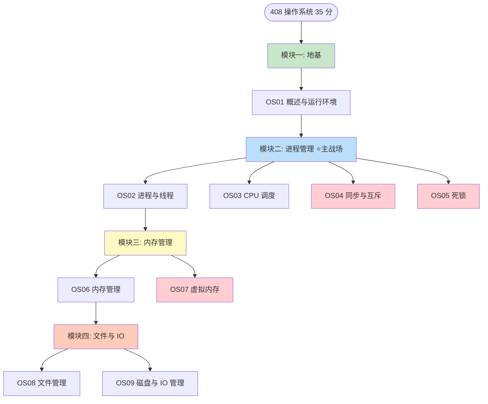

---

## 🔀 进程五状态模型（OS02 高频）

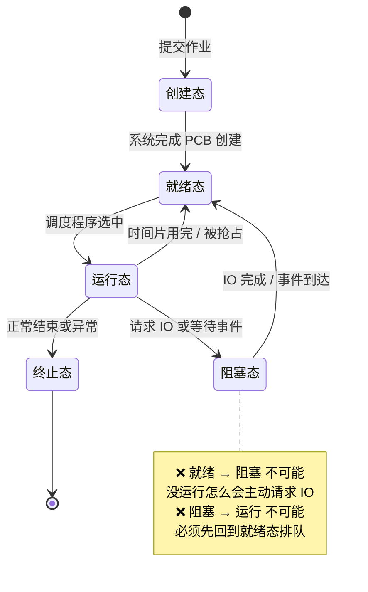

**必考点**：`就绪 → 阻塞` 与 `阻塞 → 运行` **都不可能**。前者因为只有运行中的进程才能发出 I/O 请求，后者因为唤醒后必须重新参与调度。

---

## 🧵 线程模型对比（OS02）

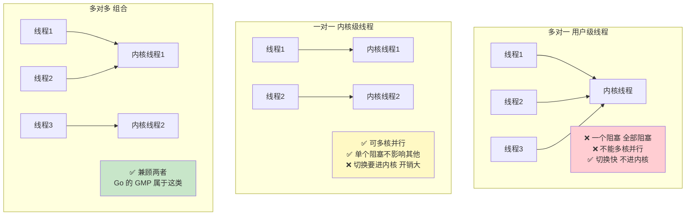

---

## ⏱️ 调度算法选型（OS03）

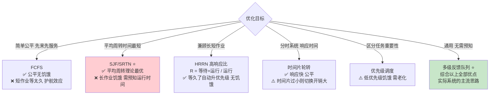

**指标公式**：
- `周转时间 = 完成时间 − 到达时间`
- `带权周转时间 = 周转时间 ÷ 实际运行时间`（**恒 ≥ 1**，越接近 1 越好）
- `等待时间 = 周转时间 − 运行时间`

---

## 🔒 临界区四原则与实现方案（OS04）

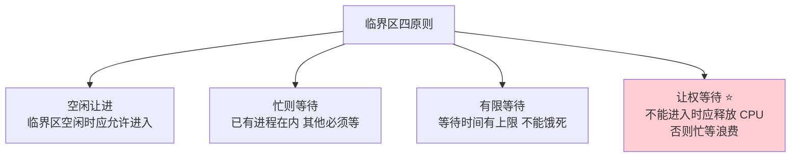

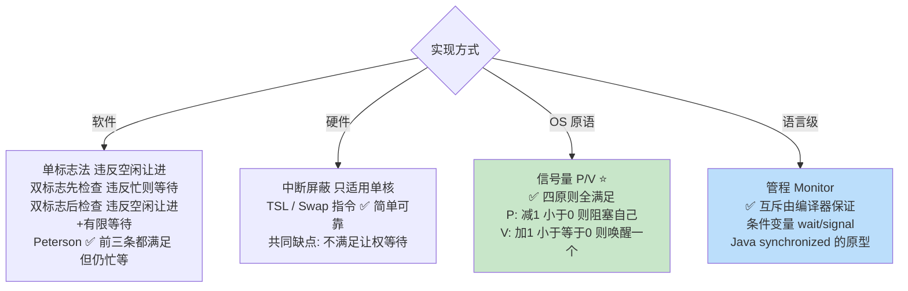

---

## 🍝 五大经典同步问题（OS04）

**PV 操作解题三步**：① 找出**同步关系**（谁必须在谁之前）；② 每个同步关系设一个信号量（初值 = 初始可用资源数）；③ 前 V 后 P 配对写出——**互斥信号量的 P 一定放在同步信号量的 P 之后**，否则会死锁。

---

## ☠️ 死锁四条件与三种策略（OS05）

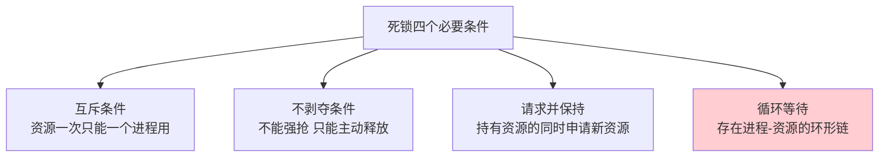

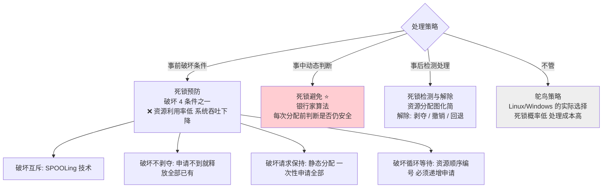

**银行家算法五步**：① `Need = Max − Allocation`；② 找 `Need ≤ Available` 的进程；③ 假设分配并**回收其全部资源**（`Available += Allocation`）；④ 重复直到所有进程入列（**安全**）或找不到（**不安全**）；⑤ 输出安全序列。

---

## 🧠 内存管理演进（OS06）

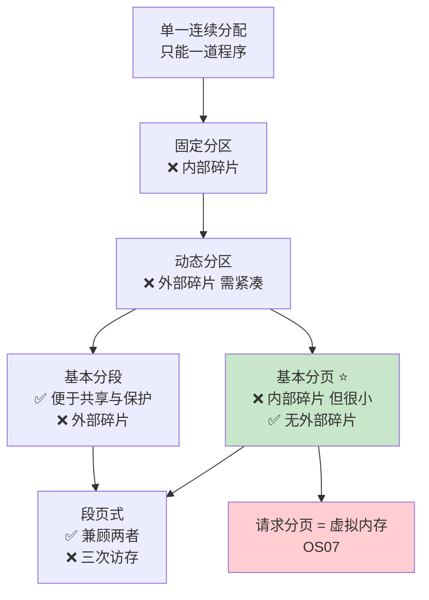

### 碎片辨析（最高频概念题）

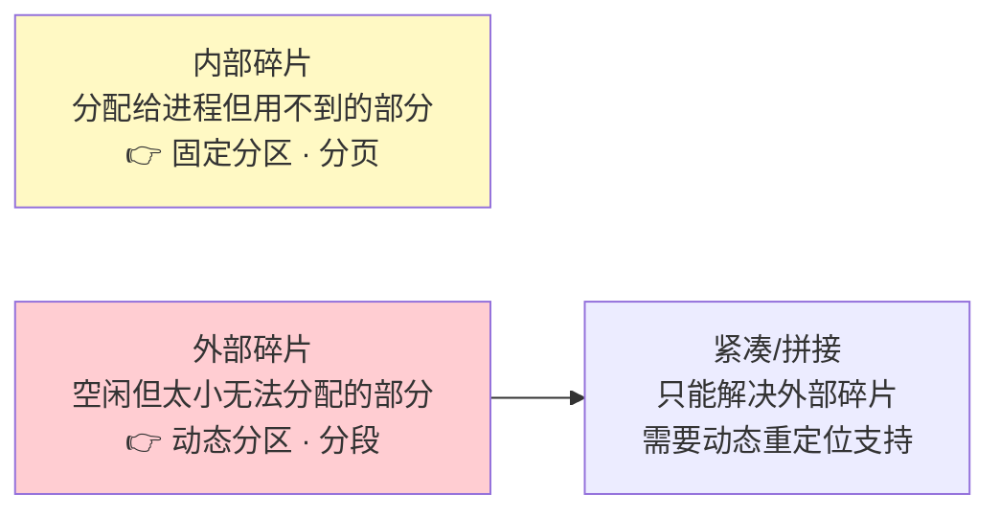

---

## 📄 分页地址变换全流程（OS06-OS07）

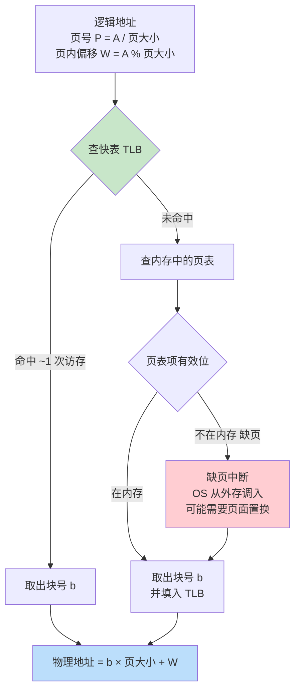

**访存次数**：TLB 命中 = **1 次**（只访数据）；TLB 未命中但页在内存 = **2 次**（页表 + 数据）；两级页表且 TLB 未命中 = **3 次**；段页式 = **3 次**（段表 + 页表 + 数据）。

---

## 🔄 页面置换算法（OS07 必考）

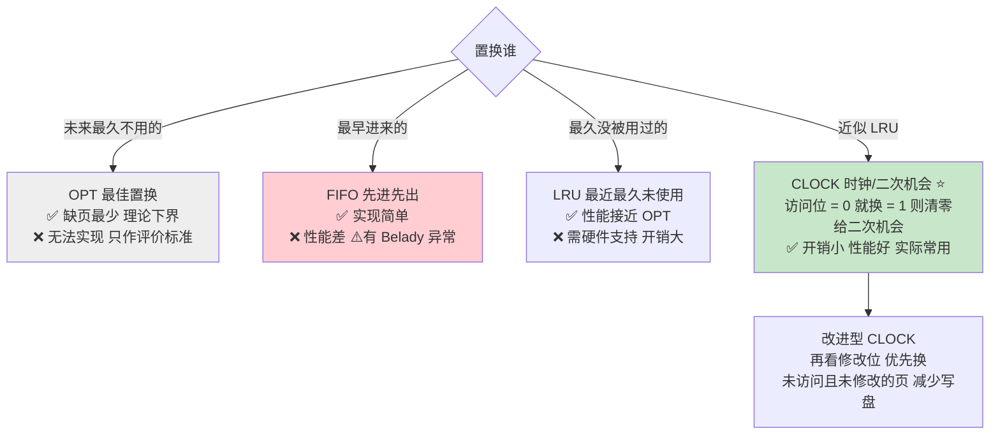

**Belady 异常**：**分配的物理块增多，缺页次数反而增加**。只有 **FIFO** 会出现。
LRU / OPT 属于**栈算法**（`k` 块时驻留的页集合 ⊆ `k+1` 块时的页集合），数学上保证不会出现该异常。

---

## 📁 文件物理分配方式（OS08）

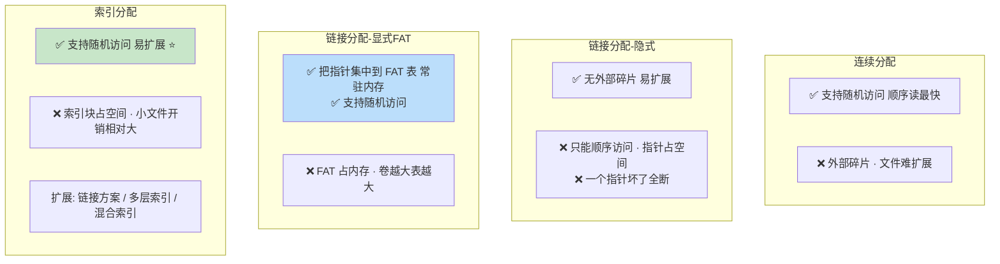

**UNIX 混合索引**：inode 中放 `N` 个直接块 + 1 个一级间址 + 1 个二级间址 + 1 个三级间址。
最大文件大小 = `(N + k + k² + k³) × 块大小`，其中 `k = 块大小 ÷ 每个地址所占字节数`。

---

## 💽 磁盘调度算法（OS09 必考）

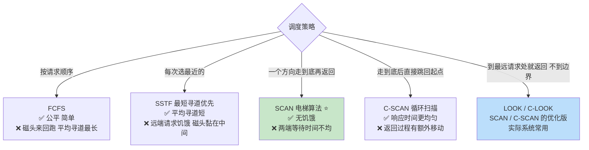

**时间构成**：`存取时间 = 寻道时间 + 旋转延迟(平均半圈) + 传输时间`。磁盘调度**只能优化寻道时间**；旋转延迟靠**交替编号 / 错位命名**优化。

---

## 🧊 缓冲区与 SPOOLing（OS09）

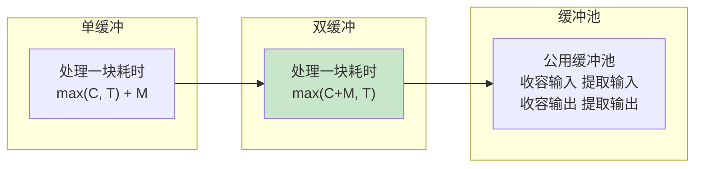

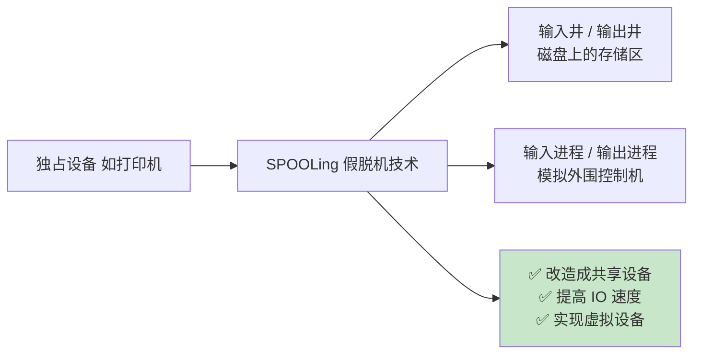

---

## 🎓 建议学习顺序

红色 = 最难也最值钱的两段。大题清单见 [INDEX.md 路径 C](./INDEX.md#路径-c只突击大题1-周)。
