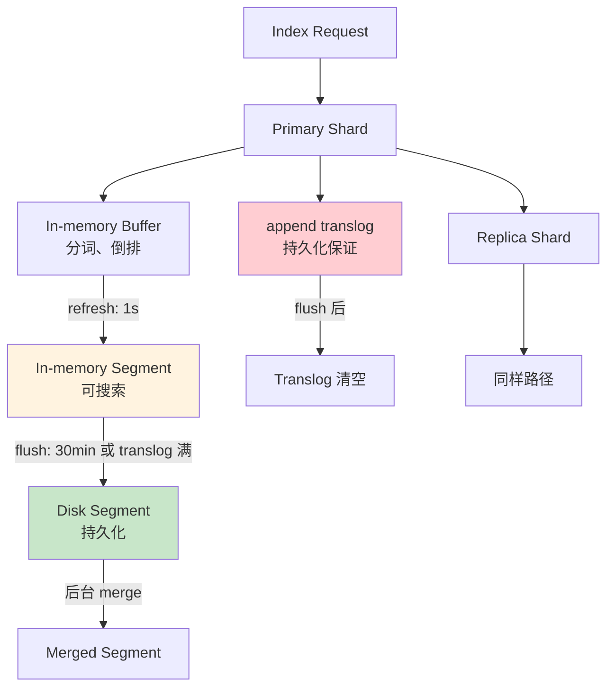
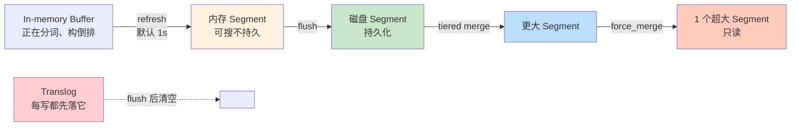

# 精通 Segment 与合并策略：refresh、flush、force_merge 的物理代价

> 关联章节：[E01 倒排索引与 Lucene](./01-精通-倒排索引-与-Lucene.md)、[E09 写入与近实时](./09-精通-写入与近实时.md)

---

## 引言：Segment 是 ES 一切设计的根因

每次有人抱怨 ES 的某个"奇怪"行为，背后多半都能追溯到一个事实——**Lucene 的 segment 是不可变的**。

- 为什么删了文档磁盘空间不立刻释放？→ 删除只是打 tombstone，物理删除发生在合并
- 为什么写完立刻搜不到？→ refresh 间隔（默认 1 秒）内还没生成新 segment
- 为什么集群越跑越慢？→ segment 数量爆炸，每次查询要扫所有 segment
- 为什么 force_merge 这么吓人？→ 一次性把所有 segment 合一个，IO 风暴

这章把 segment 生命周期完整讲一遍：**create → refresh → merge → flush → delete**。读完之后你应该能：

- 解释 refresh / flush / force_merge / commit 各自的副作用
- 给写多读少 / 读多写少的索引设计不同的 refresh / merge 策略
- 看懂 `GET _cat/segments` 与 `GET _segments` 输出
- 评估 `force_merge` 何时该做、何时禁止
- 解释 Tiered Merge Policy 的工作机制与参数

---

## 第一章：Segment 是什么

### 1.1 一句话定义

**Segment 是 Lucene 磁盘上一份独立、不可变、可独立搜索的倒排索引**。

```
shard (Lucene index)
├─ segment_1   (不可变)
├─ segment_2   (不可变)
├─ segment_3   (不可变)
└─ ...
```

一个 shard = 一个 Lucene index = 多个 segment 的集合。

每个 segment 内部包含：

- 倒排索引（FST 词典 + posting list）
- doc_values（列存正排）
- stored fields（_source）
- norms / payloads / term vectors（按字段配置）
- liveDocs.bin（哪些 doc 没被删）

### 1.2 一个 segment 的文件结构

```bash
ls /var/lib/elasticsearch/nodes/0/indices/{uuid}/0/index/

_0.cfe    # compound file entry table
_0.cfs    # compound file segment（包含所有 segment 文件）
_0.si     # segment info
_0_1.liv  # 第 1 次删除生成的 liveDocs
_0_2.liv  # 第 2 次删除生成的 liveDocs
segments_5  # 当前 commit point（指向所有有效 segment）
write.lock
```

Lucene 把多种文件打包到 .cfs 里减少文件句柄数（compound file format）。

### 1.3 segment 不变性的含义

- **写入** 不修改已有 segment，而是写入内存 buffer，定期生成**新** segment
- **删除** 不物理删除，而是在新文件 `.liv` 中标记
- **更新** = 删 + 写新（旧版本仍在 segment 里，被标记为 deleted）

代价：

- **磁盘膨胀**：删除/更新过的数据物理仍在
- **合并成本**：定期合并多个小 segment 为大 segment，物理删除过期数据

收益：

- **无锁读**：segment 不变 → 多个查询线程并发读无需加锁
- **缓存友好**：内核 page cache、Lucene 自己的缓存都依赖文件不变
- **崩溃安全**：旧 segment 不会被破坏

→ 这是搜索引擎与数据库根本的设计哲学分歧。

---

## 第二章：写入到 segment 的完整路径

### 2.1 写入流程图



### 2.2 三个关键操作

| 操作 | 触发条件 | 副作用 |
|---|---|---|
| refresh | 默认每 1 秒 | 内存 buffer → 新 segment（in-memory），可被搜到 |
| flush | translog ≥ 512MB 或每 30 分钟 | 把所有内存 segment 落盘 + fsync + 清 translog |
| commit | flush 的一部分 | 写新 segments_N，让本次 segment 永久可见 |

注意：

- **refresh** 让文档"近实时可见"，但**不持久化**——掉电会丢
- **flush** 才是真正的持久化（fsync）
- **translog** 是写入持久化保证：写文档前先写 translog（fsync 频率可配），即使 segment 还在内存也不丢

### 2.3 refresh

```bash
# 默认 1s 自动 refresh
PUT myindex/_settings
{ "index.refresh_interval": "30s" }   # 拉长间隔 → 写吞吐上升、可见延迟变长

# 完全关闭自动 refresh（批量写入时）
PUT myindex/_settings
{ "index.refresh_interval": "-1" }

# 手动 refresh
POST myindex/_refresh
```

副作用：

- **越频繁，small segment 越多** → 合并压力越大 → 后台 IO 增加
- **越稀疏，新文档延迟到达搜索结果** → 但写入吞吐更高

经验：

- 实时搜索（电商搜索）：1s（默认）
- 日志类（10s 后能看到也行）：30s
- 批量重建索引：-1（彻底关）

### 2.4 flush

```bash
POST myindex/_flush
```

副作用：

- 强制 fsync，IO 抖动
- 自动 commit 一个新 segments_N
- 清空 translog

通常**不需要手动调** —— 让 ES 自己按策略来。

### 2.5 translog

```bash
# 配置
index.translog.durability: request    # 默认，每个请求 fsync（最安全）
index.translog.durability: async      # 异步 fsync（默认每 5s）
index.translog.sync_interval: 5s
index.translog.flush_threshold_size: 512mb
```

| 模式 | 数据安全 | 写吞吐 |
|---|---|---|
| request | 不丢已提交请求 | 慢 |
| async | 掉电丢最近 sync_interval | 快 30-50% |

日志类业务可以接受 async + 短 sync_interval。

---

## 第三章：合并（Merge）

### 3.1 为什么需要合并

不合并的后果：

- 每秒 refresh 一次 → 每秒 1 个新 segment → 10 分钟 = 600 个 segment
- 每次查询要扫所有 segment → 查询变慢
- 每个 segment 都占内存（doc_values 缓存、FST 加载）
- 删除/更新的 tombstone 永不清理

→ 必须把多个小 segment 合并成大 segment。

### 3.2 合并的代价

合并 = 读取多个 segment + 写一个新 segment：

- 旧 segment 仍在被查询时不能立刻删除
- 合并是 IO 密集型 + CPU 密集型（重新构造倒排）
- 大 segment 合并耗时几分钟到几小时

→ 合并行为决定了 ES "稳态"性能。

### 3.3 Tiered Merge Policy

Lucene 默认策略——把 segment 按大小分层，每层选一组合并：

```
Tier 0:  小 segment (< 5MB)
Tier 1:  中 segment (50MB)
Tier 2:  大 segment (500MB)
Tier 3:  巨型 (5GB - max_merged_segment 上限)
```

每层最多 N 个 segment（默认 10），超过就在该层选一组合并到上层。

关键参数：

```yaml
index.merge.policy.max_merge_at_once: 10        # 一次最多合并几个 segment
index.merge.policy.max_merged_segment: 5gb      # segment 最大允许大小
index.merge.policy.segments_per_tier: 10        # 每层最多几个
index.merge.policy.floor_segment: 2mb           # 小于此都按 2mb 处理（避免无穷小）
index.merge.policy.deletes_pct_allowed: 20      # 允许的 deleted_doc 占比（超了优先合并）
```

### 3.4 调整合并并发

```yaml
# 节点级
indices.merge.scheduler.max_thread_count: 4    # 单 shard 同时几个合并线程
                                                # 默认 max(1, min(4, cpu/2))
```

SSD：默认即可。
HDD：调到 1（HDD 多线程合并会严重相互打扰）。

### 3.5 监控合并

```bash
GET _cat/segments/myindex?v

# 输出示例
index   shard prirep ip          segment generation docs.count docs.deleted size size.memory committed searchable
myindex 0     p      10.0.0.1    _0      0          10000      100          5mb  1024        true      true
myindex 0     p      10.0.0.1    _1      1          5000       50           2mb  512         true      true

# 看节点合并 IO
GET _nodes/stats/indices/merges
```

异常信号：

- `docs.deleted / docs.count > 30%` → 应该合并了
- `segment` 数 > 50 / shard → 合并跟不上
- merge total time / index total time 长期 > 50% → 写入太猛

---

## 第四章：force_merge —— 终极合并

### 4.1 用途

```bash
POST myindex/_forcemerge?max_num_segments=1
```

把一个 shard 内所有 segment 合并为指定数量（通常 1 个）：

- 物理删除所有 deleted_doc
- 大幅压缩磁盘占用
- 减少查询时扫描的 segment 数

但这是个**重操作**——会阻塞磁盘 IO 几分钟到几小时。

### 4.2 何时该做

✅ 适合 force_merge：

- 索引已经停止写入（只读索引）
- 想压缩磁盘空间
- 想加速查询（segment 数减少 → 文件句柄、内存占用减少）
- 时序数据：ILM 把 hot phase 迁到 warm phase 时

❌ 禁止 force_merge：

- 索引还在写入 — force_merge 出来的大 segment 后续新写入合并不进去，反而拖累
- 集群高峰期 — 会抢 IO
- max_num_segments=1 但磁盘空间不够 - 合并需要 = 原大小的空间

### 4.3 force_merge 的内部逻辑

合并任务是**异步**的——API 立刻返回 `task_id`，但实际合并在后台跑：

```bash
POST myindex/_forcemerge?max_num_segments=1&wait_for_completion=false
# 返回 task_id

GET _tasks/{task_id}
```

注意：force_merge 比普通合并更激进——它会忽略 `max_merged_segment` 上限。

### 4.4 force_merge 5GB 限制

普通合并不会产生 > 5GB（默认）的 segment——单个大文件后续合并代价过大。

但 force_merge 不受这个限制——所以一次 force_merge 把 100GB 数据合到 1 个 segment 后，**这个 segment 永远是个大球**，后续任何小的修改都会成本极高。

→ 这就是为什么 force_merge 必须在"不再写"的索引上做。

---

## 第五章：Refresh、Flush 与可见性

### 5.1 三层可见性

```
请求写入  →  在 translog 里  →  在内存 segment 里  →  在磁盘 segment 里
              不可搜            可搜               可搜 + 持久化
              不可见            可见               可见 + 持久化
              refresh 前        refresh 后         flush 后
```

### 5.2 GET vs SEARCH 的可见性差异

```bash
# 写入后立刻 GET（按 _id 查）
GET myindex/_doc/abc  
# 即使没 refresh，也能拿到（因为 GET 会查 translog）

# 写入后立刻 SEARCH
POST myindex/_search { "query": {"match_all": {}} }
# refresh 之前查不到
```

→ **GET by ID 是 strongly consistent，SEARCH 是 near real-time（NRT）**。

### 5.3 强制可见

```bash
POST myindex/_doc?refresh=true
{ "msg": "hello" }
# 写完立即触发 refresh，下次 search 能看到

POST myindex/_doc?refresh=wait_for
# 等到下次自动 refresh 再返回，不主动触发（避免小 segment 爆炸）
```

`refresh=true` 是最常被滥用的参数——每个请求都触发 refresh = 每个请求 = 一个新 segment = segment 爆炸。

→ 通常**只在测试 / 集成测试**用 `refresh=true`，生产用 `wait_for`。

---

## 第六章：删除与更新的物理

### 6.1 删除

```bash
DELETE myindex/_doc/abc
```

物理操作：

1. 找到 abc 在哪个 segment 的哪个 doc_id
2. 在该 segment 的 `_X.liv` 中把对应 bit 置 0
3. 这个 doc 在搜索结果中被过滤掉，但**物理数据仍在**

直到该 segment 被合并，数据才物理消失。

### 6.2 更新

```bash
POST myindex/_update/abc
{ "doc": { "field": "new" } }
```

物理操作：

1. 读出原 doc（从 _source）
2. merge 新 field
3. **删除原 doc + 写入新 doc**（新版本）

→ "更新" = "删除 + 新增"。Lucene 不存在真正的 in-place update。

意味着：

- 频繁更新同一个 doc → segment 里有大量历史版本 → 必须合并清理
- 更新比新增更贵 — 多了"读旧 + 删旧"

### 6.3 deleted_pct

```bash
GET _cat/segments/myindex?v&h=index,shard,segment,docs.count,docs.deleted

# docs.deleted / (docs.count + docs.deleted) > 30% → 合并应优先
```

默认 `deletes_pct_allowed: 20` —— deleted 比例超过 20% 的 segment 优先合并。

可调高（写多但删少时减少合并 IO）或调低（频繁更新时尽快回收空间）。

---

## 第七章：版本号与并发更新

### 7.1 _version

每个文档有一个 `_version`，每次更新自增：

```bash
PUT myindex/_doc/abc?version=5&version_type=external
```

old `version_type=internal` 弃用，现在用：

```bash
PUT myindex/_doc/abc?if_seq_no=10&if_primary_term=2
{ "msg": "hi" }
```

`seq_no` + `primary_term` 才是 ES 6+ 的"乐观锁版本"。

### 7.2 乐观锁 update

```bash
# 1. 先 GET 拿到 seq_no 和 primary_term
GET myindex/_doc/abc

# 2. 带条件 update
POST myindex/_update/abc?if_seq_no=10&if_primary_term=2
{ "doc": { "counter": 42 } }

# 如果有人先于你更新了 → 409 Conflict
```

### 7.3 retry_on_conflict

```bash
POST myindex/_update/abc?retry_on_conflict=5
{ "script": "ctx._source.counter += 1" }
```

ES 自动重试 5 次冲突。但只适合 idempotent 的脚本（如计数器）。

---

## 第八章：合并对查询性能的影响

### 8.1 segment 数 vs 查询延迟

查询逻辑：

```
QUERY → 每个 shard → 每个 segment → 倒排索引查找 → 合并结果
```

→ shard 内 segment 越多，单次查询要重复"打开 segment、查倒排"越多次。

但**单 segment 越大**也不好：

- 内存占用大（FST、doc_values 缓存）
- 单次合并耗时长

经验：每 shard **几十到几百**个 segment 是健康的。> 1000 个 segment 一般是合并跟不上的信号。

### 8.2 查询时跳过 segment

Lucene 支持"跳段"：

- 时序数据按 @timestamp 过滤时，每个 segment 都记录 min/max timestamp
- 查询 `@timestamp > 2026-05-13` 时，min_ts > 该值的 segment 直接跳过

→ **段级别的"分区裁剪"**——这就是为什么时序数据要用 **rollover** 把每段时间分到独立索引而不是一个巨大索引。

### 8.3 Index Sorting

```bash
PUT myindex
{
  "settings": {
    "index.sort.field": ["@timestamp"],
    "index.sort.order": ["desc"]
  }
}
```

让每个 segment 内部按字段排序，配合 `track_total_hits=false` 时能"提前终止"：

```bash
POST myindex/_search
{
  "size": 10,
  "sort": [{ "@timestamp": "desc" }],
  "track_total_hits": false
}
```

→ 拿到前 10 条满足条件的就停，不必扫所有数据。

代价：写入时 segment 内部按字段排序，写吞吐略降。

---

## 第九章：实战调优

### 9.1 写多读少场景（日志、监控）

```yaml
index.refresh_interval: 30s         # 拉长 refresh（默认 1s 太频繁）
index.number_of_replicas: 1
index.translog.durability: async    # 容忍掉电丢几秒
index.translog.sync_interval: 5s
index.translog.flush_threshold_size: 1gb
index.merge.scheduler.max_thread_count: 2  # HDD 设 1
index.codec: best_compression       # 写日志推荐（压缩率高，CPU 略增）
```

按时间 rollover，老索引 ILM 迁到 warm tier、force_merge 到 1。

### 9.2 写少读多场景（搜索引擎）

```yaml
index.refresh_interval: 1s          # 实时搜索
index.number_of_replicas: 2-3       # 提高搜索并发
index.translog.durability: request  # 强一致
index.codec: default
```

定期（如每周）force_merge max_num_segments=1，加速查询。

### 9.3 中庸场景（业务搜索 + 偶尔写）

默认设置已经合适，重点调：

- shard 大小：10-50GB
- replica：1-2
- 索引模板与别名

---

## 第十章：典型故障案例

### 10.1 segment 数爆炸

**现象**：查询慢，`_cat/segments` 显示某索引每 shard 2000+ segment。

**排查**：

```bash
GET _nodes/stats/indices/merges
# total_time_in_millis 与 indexing total_time 比较
```

如果 merge 总时间 > 索引时间的 50%，说明节点 IO 跟不上合并需求。

**原因**：

- refresh_interval 太短（如 1s 但有几十亿文档持续写入）
- merge_scheduler.max_thread_count 太小
- 磁盘是 HDD

**修复**：

- refresh_interval 拉长到 30s
- 节点用 SSD
- 临时停止写入，让合并追平

### 10.2 force_merge 导致集群挂

**现象**：在峰值时段对一个 100GB 索引执行 `force_merge?max_num_segments=1`，集群 IO 满，查询超时大批量出现。

**原因**：force_merge 是同步阻塞的高 IO 操作，单 shard 几十 GB → 几小时合并 + 巨大 IO。

**修复**：

- 永远在低峰期 force_merge
- 用 `wait_for_completion=false` 异步
- 限速：通过修改 `cluster.routing.allocation.cluster_concurrent_rebalance` 间接限制

### 10.3 长时间 refresh=true 滥用

**现象**：某接口在每次写入后调 `refresh=true`，集群 segment 数飙到 5000+/shard。

**原因**：`refresh=true` 每次都生成一个新 segment，每次都很小，合并跟不上。

**修复**：改为 `refresh=wait_for`，或干脆移到批量写入 + 末尾一次 `_refresh`。

### 10.4 deleted_pct 高，磁盘膨胀

**现象**：索引磁盘 200GB，但只有 50GB 是活数据。

**原因**：业务大量更新 / 删除，但 `deletes_pct_allowed=20%` 让合并不主动清理。

**修复**：

- 调低 `deletes_pct_allowed` 到 10
- 或离线 force_merge `only_expunge_deletes=true`：

```bash
POST myindex/_forcemerge?only_expunge_deletes=true
# 只合并 deleted_doc 多的 segment，不强求合并所有
```

---

## 第十一章：ES 9 / 时序索引的新特性

### 11.1 _tsdb 模式

ES 8.7+ 引入时序数据流（`time_series` mode），9.x 持续增强：

```bash
PUT _component_template/logs-template
{
  "template": {
    "settings": {
      "index.mode": "time_series",
      "index.routing_path": ["host.name"]
    },
    "mappings": {
      "properties": {
        "@timestamp": {"type": "date"},
        "host.name": {"type": "keyword", "time_series_dimension": true},
        "cpu": {"type": "double", "time_series_metric": "gauge"}
      }
    }
  }
}
```

物理优化：

- 自动按 `routing_path` 路由 → 同 host 数据在同一 shard
- segment 内按 dimension + timestamp 排序 → 极高压缩
- 专用 metric 字段类型 → 更省空间

→ ES 9 时序数据存储成本可以做到比通用模式低 50-70%。

### 11.2 LogsDB

ES 8.17 起 GA 的 `logsdb` 模式 —— 针对日志场景的优化存储，与 OpenSearch 的 `compression: zstd` 并行。

```bash
PUT _component_template/logs-default
{
  "template": {
    "settings": {
      "index.mode": "logsdb"
    }
  }
}
```

收益：

- 比普通 ES 索引节省 ~50% 磁盘
- 与 _tsdb 类似的列存优化
- 9.x 设为某些 stack template 的默认

### 11.3 Searchable Snapshots

冷数据放到 S3 / 对象存储，仍然可查（按需 fetch）：

```bash
POST _snapshot/my_repo/snapshot_1/_mount?storage=shared_cache
{ "index": "logs-2024-01" }
```

适合：超长留存日志（90 天+）。磁盘成本降到 1/10。

---

## 总结 · Segment 一图流



记住：**所有"奇怪行为"都来自 segment 不变性**。改不动现有 segment → 写新的 → 合并旧的 → 周期性 IO 抖动。这是搜索引擎的宿命，也是设计上的功劳。

---

## 练习题

1. 写入 ES 一个文档后立刻 GET 能拿到，立刻 SEARCH 拿不到。为什么？

2. `refresh_interval` 设 30s 后，写入吞吐升高了，但其他什么也会变？

3. translog 在写入路径里扮演什么角色？`durability=async` 的代价是什么？

4. 一个 shard 有 500 个 segment，查询性能受什么影响？

5. force_merge max_num_segments=1 后，这个 shard 后续再有少量写入会发生什么？

6. 删除文档后磁盘空间没立即释放，正常吗？怎么强制释放？

7. `refresh=true` 每次写都触发，后果是什么？正确做法？

8. 时序数据为什么推荐用 rollover 按时间切索引，而不是一个永远写的大索引？

9. Tiered Merge Policy 的 `max_merged_segment=5gb` 默认值的意图是什么？

10. 设计一个 1TB/天的日志集群的 ILM：hot/warm/cold/frozen 各阶段的 refresh / replicas / merge 策略。

---

> 📁 下一篇：[E03 精通集群拓扑与节点角色](./03-精通-集群拓扑.md)
