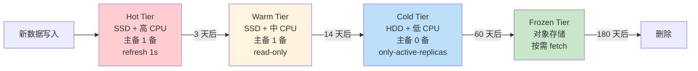
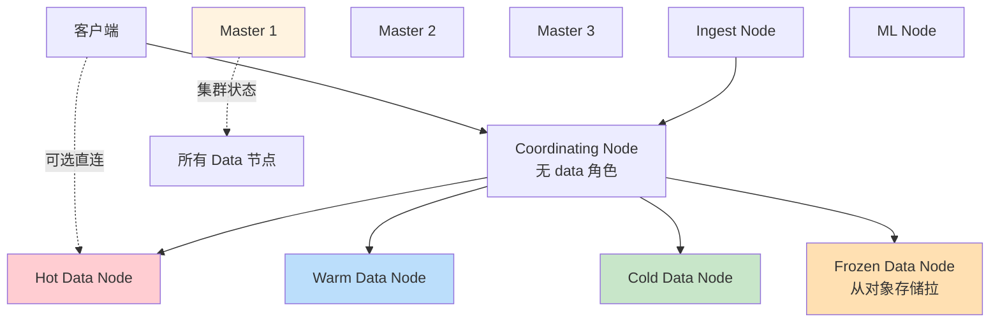

# 精通集群拓扑与节点角色：master、data tier、coordinating 的分工

> 关联章节：[E04 分片与路由](./04-精通-分片与路由.md)、[E10 性能调优](./10-精通-性能调优.md)

---

## 引言：节点角色错配是 ES 故障的最大单一原因

很多 ES 故障最终都能追溯到一句话——**一台机器干了不该它干的活**。

- 把 master 角色和 data 角色混在一起，data 写入压力大时 master 心跳超时 → 选举频繁 → 集群抖动
- 所有节点都是 coordinating，导致大查询的归并阶段把任意节点打挂
- 把 hot tier 用大磁盘 + 慢盘服务器，写入瓶颈
- ML / ingest 角色没拆出来，跟 data 抢资源

这章讲清楚 ES 9 的节点角色体系：哪些角色、各自负责什么、什么样的拓扑组合是合理的、怎么从默认"all-role"集群演进到生产级架构。

读完之后你应该能：

- 列出 ES 9 的全部节点角色及职责
- 设计一个 1B 文档 + 100 QPS 搜索的拓扑
- 解释 master 选举（基于 Raft 变种的 `cluster.discovery`）的流程
- 规划 hot / warm / cold / frozen 四层数据分布
- 配置专用 coordinating 节点的场景与代价

---

## 第一章：节点角色全集

### 1.1 ES 9 节点角色一览

```yaml
# elasticsearch.yml
node.roles: [master, data_hot, data_warm, data_cold, data_frozen, 
             ingest, ml, remote_cluster_client, transform]
```

| 角色 | 职责 | 资源特征 |
|---|---|---|
| `master` | 集群状态、元数据、分片分配 | CPU 中、内存中、IO 小、网络小 |
| `data_hot` | 当前写入的新数据 | CPU 高、内存高、IO 极高、SSD/NVMe |
| `data_warm` | 已停止写入但还查的数据 | CPU 低、内存中、IO 中、SSD |
| `data_cold` | 很少查的数据 | IO 低、HDD 或便宜 SSD |
| `data_frozen` | 几乎不查、按需从快照拉 | 磁盘极少、靠对象存储 |
| `data_content` | 非时序业务数据（如商品、用户） | 中等配置 |
| `ingest` | 文档进入前的预处理 pipeline | CPU 高、内存中 |
| `ml` | 异常检测 / NLP 推理 | CPU/GPU 极高、内存极高 |
| `remote_cluster_client` | 跨集群搜索的客户端 | 网络高 |
| `transform` | 持续 transform job | CPU 中、内存中 |
| 无角色（coordinating） | 接收请求、查询归并 | CPU 高、内存高、网络高 |

### 1.2 角色组合

任何节点可以同时具备多个角色：

```yaml
# 单节点集群（开发）
node.roles: [master, data_hot, data_content, ingest, ml, remote_cluster_client]
# 简写
node.roles: [ ]   # 等价于全角色（开发默认）
```

```yaml
# 生产 master 专用
node.roles: [master]

# 生产 hot 数据节点
node.roles: [data_hot, data_content, ingest]

# 生产 warm 数据节点
node.roles: [data_warm]
```

### 1.3 取消 coordinating-only 概念

7.x 之前可以单独设置 `node.master=false, node.data=false` 让节点成为纯 coordinating。

8.x+ 改为：**roles 列表为空的节点（除非显式声明 [master] 等）** 仍然有 data 角色。要纯 coordinating：

```yaml
node.roles: [ remote_cluster_client ]
# 任何角色都没有 data_* 和 master 就是 coordinating-only
# 一般至少留 remote_cluster_client 用于 CCS
```

更明确：

```yaml
node.roles: []   # 真的空数组 = coordinating only
```

---

## 第二章：master 节点深入

### 2.1 master 干什么

- 维护**集群状态**（cluster state）：所有索引、shard、节点的元数据
- 决定**分片分配**：新 shard 放哪个节点、failover 时迁到哪
- 处理**索引/mapping 变更**：创建索引、修改 settings
- **不**参与具体数据写入或查询

→ 工作不密集，但**必须稳定**。

### 2.2 master 选举

ES 7.0 起改用基于 Raft 的算法（`cluster.discovery` 模块）。

```yaml
# 必须配置可选 master 节点的"种子列表"
discovery.seed_hosts: ["10.0.0.1:9300", "10.0.0.2:9300", "10.0.0.3:9300"]

# 首次启动时的初始 master 列表（启动后忽略）
cluster.initial_master_nodes: ["m1", "m2", "m3"]
```

选举条件：

- master-eligible 节点（具备 master 角色的）形成多数派（quorum）
- 多数派 = floor(N/2) + 1

→ 强烈建议**奇数个 master 节点**（3 个起步，大集群 5 个）。

### 2.3 split-brain 防护

ES 7+ 自动管理 `discovery.zen.minimum_master_nodes`（旧版手动配置），由内置多数派算法保护，**不再需要手动配**。

但仍然要注意：

- 3 个 master 同时挂 2 个 → 集群停止接受元数据变更（数据查询仍能继续）
- 5 个 master 挂 2 个仍能工作 → 大集群更稳

### 2.4 master 的资源配置

| 集群规模 | master 配置 |
|---|---|
| < 50 节点 | 3 个 4 核 8GB |
| 50-200 节点 | 3 个 8 核 16GB |
| 200-500 节点 | 3-5 个 16 核 32GB |
| > 500 节点 | 5 个 32 核 64GB |

绝对不要把 master 和 data 混合 —— 大写入压力会让 master 心跳超时，触发频繁选举。

### 2.5 cluster state 大小

```bash
GET _cluster/state?filter_path=metadata.indices.*.settings,metadata.templates
```

cluster state = 所有 mapping 字段 + 索引设置 + alias + template + shard 分配。

风险：

- 单集群超过 10 万 shard → cluster state 达几百 MB → master 推送给所有节点的延迟变高
- mapping 字段爆炸（如允许动态映射，业务乱写字段）→ cluster state 变巨

监控：

```bash
GET _cluster/stats?human
# 看 cluster_state_size
```

> 10MB 警告，> 100MB 危险。

---

## 第三章：data tier 与 ILM

### 3.1 四层数据生命周期



### 3.2 节点 tier 配置

```yaml
# hot 节点
node.roles: [data_hot, data_content, ingest]

# warm 节点
node.roles: [data_warm]

# cold 节点（独立或与 warm 共存）
node.roles: [data_cold]

# frozen 节点（特殊：从 snapshot 拉数据）
node.roles: [data_frozen]
```

### 3.3 ILM Policy 示例

```bash
PUT _ilm/policy/logs_policy
{
  "policy": {
    "phases": {
      "hot": {
        "actions": {
          "rollover": {
            "max_age": "1d",
            "max_primary_shard_size": "50gb"
          },
          "set_priority": { "priority": 100 }
        }
      },
      "warm": {
        "min_age": "3d",
        "actions": {
          "shrink": { "number_of_shards": 1 },
          "forcemerge": { "max_num_segments": 1 },
          "allocate": { "include": { "data": "warm" } },
          "set_priority": { "priority": 50 }
        }
      },
      "cold": {
        "min_age": "14d",
        "actions": {
          "allocate": { "include": { "data": "cold" }, "number_of_replicas": 0 },
          "freeze": {}
        }
      },
      "frozen": {
        "min_age": "60d",
        "actions": {
          "searchable_snapshot": { "snapshot_repository": "my_repo" }
        }
      },
      "delete": {
        "min_age": "180d",
        "actions": { "delete": {} }
      }
    }
  }
}
```

### 3.4 hot tier 配置要点

- **CPU**：写入 + refresh + merge 都要 CPU
- **内存**：FST 必须在堆内 / page cache
- **SSD / NVMe**：所有 IO 集中在 hot
- **副本数 = 1**：保证可用性，但不要更多（写入 1 倍放大已经够了）

### 3.5 warm tier 配置要点

- **CPU 可降级**：只查询，无写入
- **副本 = 1**
- **shrink + force_merge**：在转 warm 时完成
- **read_only**：可设为只读（防止误改）

### 3.6 cold tier 配置要点

- **HDD 可行**：磁盘成本是主要考量
- **副本 = 0**：用 searchable snapshot 在 S3 上有保护
- **查询慢可接受**：响应时间从亚秒到秒级

### 3.7 frozen tier 配置要点

- **本地磁盘只放缓存**（partial cache）
- **主体存在对象存储**（S3 / GCS / Azure Blob）
- **查询冷启动慢**（几秒到几十秒）
- **磁盘成本低 10-20 倍**

---

## 第四章：coordinating 节点

### 4.1 任何节点都可以 coordinate

接到客户端请求的节点充当 coordinator：

1. 分析查询，决定要 fanout 给哪些 shard
2. 把请求路由到对应 data 节点
3. 收集所有 shard 的结果
4. 归并（merge、排序、聚合）后返回客户端

### 4.2 什么时候需要专用 coordinating

- **大聚合查询**：归并阶段消耗大量内存
- **多客户端**：避免客户端连接打满 data 节点
- **跨集群搜索**：CCS 协调多个远程集群结果

如果不拆，data 节点同时干"搜索 + 归并"两份重活，互相干扰。

### 4.3 拆出后的好处

- data 节点专注查询自己 shard，吞吐稳定
- coordinating 横向扩展应对前端请求量
- 减少 GC 压力（归并是 GC 密集型操作）

### 4.4 副作用

多一跳网络（client → coord → data → coord → client）。简单 GET by ID 反而慢一点。

→ 适合大集群（> 10 data 节点）+ 复杂查询场景。

---

## 第五章：ingest 节点

### 5.1 什么是 ingest pipeline

```bash
PUT _ingest/pipeline/parse_logs
{
  "processors": [
    { "grok": {
        "field": "message",
        "patterns": ["%{IPORHOST:client_ip} %{WORD:method} %{URIPATH:path}"]
    }},
    { "date": { "field": "@timestamp", "formats": ["ISO8601"] }},
    { "geoip": { "field": "client_ip", "target_field": "geo" }}
  ]
}

PUT logs/_doc/1?pipeline=parse_logs
{ "message": "1.2.3.4 GET /api/foo" }
```

→ 文档写入前先经过 pipeline 处理：parse、enrich、geoip、user_agent、转换字段等。

### 5.2 ingest vs Logstash

| 维度 | ES Ingest Node | Logstash |
|---|---|---|
| 部署 | ES 集群内部 | 独立进程 |
| 资源 | 抢 ES 节点资源 | 独立资源 |
| 功能 | 中等 | 丰富（filter 多） |
| 容错 | 简单（同 ES） | 强（持久化队列） |

中小型场景用 ingest node 够用。

### 5.3 ingest 节点专属

```yaml
node.roles: [ingest]
```

避免预处理 CPU 跟 data 抢资源。

---

## 第六章：ML 与 transform 节点

### 6.1 ML 节点

ES X-Pack ML 提供：

- 异常检测（unsupervised）
- 数据帧分析（regression / classification）
- NLP（情感分析、文本分类、向量化）
- Transformer 模型（BERT 等）部署

```yaml
node.roles: [ml]
```

资源：

- CPU 极高（推理）
- 内存极高（模型 + 数据）
- 部分模型支持 GPU（9.x 增强）

### 6.2 transform

定义连续运行的"物化视图"——把原始数据周期性聚合到新索引：

```bash
PUT _transform/orders_summary
{
  "source": { "index": "orders-*" },
  "dest": { "index": "orders_summary" },
  "pivot": {
    "group_by": { "customer": { "terms": { "field": "customer_id" }}},
    "aggregations": {
      "total": { "sum": { "field": "amount" }},
      "count": { "value_count": { "field": "amount" }}
    }
  },
  "sync": { "time": { "field": "@timestamp", "delay": "60s" }}
}
```

适合：dashboard 加速、复杂报表预计算。

---

## 第七章：典型拓扑模板

### 7.1 单机开发

```yaml
# 1 节点，all-in-one
node.roles: []   # 接受任意角色
discovery.type: single-node
```

不适合任何生产场景。

### 7.2 小型生产（< 100GB 数据）

```
3 节点（每节点 16 核 64GB）
  全是 master + data + ingest
```

```yaml
node.roles: [master, data_hot, data_content, ingest]
```

注意：master 与 data 混合，但因为集群小、写入压力可控，能跑。

### 7.3 中型生产（100GB - 10TB）

```
3 个 master-only        ← 隔离选举
5 个 data_hot           ← 当前写入 + 热查询
3 个 data_warm          ← 历史数据
2 个 coordinating-only  ← 复杂查询前端
1-2 个 ingest-only      ← pipeline 处理（可选）
```

```yaml
# master
node.roles: [master]

# hot data
node.roles: [data_hot, data_content]

# warm data
node.roles: [data_warm]

# coordinating
node.roles: []
```

### 7.4 大型生产（10TB+）

```
5 个 master-only        ← 高容错
20+ 个 data_hot
10+ 个 data_warm
5+ 个 data_cold
3+ 个 data_frozen
5+ 个 coordinating
3+ 个 ml-only
2+ 个 ingest-only
```

每种角色独立机型，按需扩容。

### 7.5 跨可用区/机房

```yaml
cluster.routing.allocation.awareness.attributes: zone
node.attr.zone: us-east-1a    # 节点 1
node.attr.zone: us-east-1b    # 节点 2
node.attr.zone: us-east-1c    # 节点 3
```

→ ES 自动让主副本分布在不同 zone，单 zone 故障不影响数据可用。

强制约束：

```yaml
cluster.routing.allocation.awareness.force.zone.values: us-east-1a,us-east-1b,us-east-1c
```

如果某 zone 完全不可用，shard 不会被分配到其他 zone（防止 zone 恢复后双副本同步打爆）。

---

## 第八章：网络与发现

### 8.1 transport vs http

- **transport port (9300)**：节点间通信（二进制协议）
- **http port (9200)**：客户端 REST API

```yaml
network.host: 0.0.0.0
http.port: 9200
transport.port: 9300
```

### 8.2 节点发现

```yaml
# 静态种子（推荐）
discovery.seed_hosts: ["m1:9300", "m2:9300", "m3:9300"]

# DNS / Kubernetes 自动发现
discovery.seed_providers: file
# 或
discovery.seed_providers: ec2  # AWS
```

### 8.3 跨集群搜索（CCS）

```bash
PUT _cluster/settings
{
  "persistent": {
    "cluster.remote.cluster_a.seeds": ["host_a:9300"],
    "cluster.remote.cluster_b.seeds": ["host_b:9300"]
  }
}

# 跨集群查询
POST cluster_a:logs-*,cluster_b:logs-*,local-logs-*/_search
{ "query": {...} }
```

适用场景：

- 多机房集群联邦查询
- 历史 cold 集群 + 当前 hot 集群分离
- 跨业务 / 跨地域

---

## 第九章：集群健康与诊断

### 9.1 健康状态

```bash
GET _cluster/health

# status: green / yellow / red
# green:  所有主副本健康
# yellow: 主健康但有副本缺失
# red:    有主缺失，数据不可用
```

```bash
GET _cluster/health?level=indices    # 看每个索引
GET _cluster/health?level=shards     # 看每个 shard
```

### 9.2 分片分配解释

```bash
GET _cluster/allocation/explain
{ "index": "myindex", "shard": 0, "primary": false }
```

输出告诉你为什么 shard 没被分配：

- 磁盘水位
- awareness 冲突
- 节点离线
- shard recovery 进行中

### 9.3 等待集群健康

```bash
GET _cluster/health?wait_for_status=green&timeout=30s
```

变更后用于验证。

---

## 第十章：常见陷阱与最佳实践

### 10.1 master 节点放在 data 上

后果：data 节点 GC 时心跳超时 → 选举频繁 → cluster state 推送阻塞 → 全集群抖动。

→ **生产必须 master 专用**。

### 10.2 master 节点数为偶数

4 个 master vs 3 个 master 的容错能力相同（都容忍挂 1 个），但 4 个集群投票成本更高、脑裂风险更高。

### 10.3 cluster state 过大

mapping 字段成千上万 → cluster state 几百 MB → master 推送给所有节点的延迟 + 网络压力大。

监控：

```bash
GET _cluster/stats?filter_path=indices.mappings.field_types
```

字段数 > 10 万要警惕。

### 10.4 节点数太多

> 500 节点的单集群是个工程挑战。除非有专门的搜索团队，否则用**跨集群搜索 (CCS)** 拆分。

### 10.5 不用 ILM

新业务时不规划 ILM，半年后磁盘爆满才慌着做 → 历史数据迁移成本很高。

→ 索引创建时就应该挂 ILM policy。

---

## 总结 · 节点角色一图



---

## 练习题

1. 为什么 master 节点要奇数？3 个 master 挂 1 个能正常吗？挂 2 个呢？

2. coordinating-only 节点的本质作用是什么？小集群有必要拆吗？

3. hot / warm / cold / frozen 各 tier 在 CPU / 内存 / 磁盘上的需求差异？

4. ILM rollover 的 `max_primary_shard_size: 50gb` 这个阈值为什么是 50GB？设 100GB 会怎样？

5. searchable snapshot 在 frozen tier 上是怎么"按需查询"的？冷启动慢的原因？

6. cluster state 包含哪些信息？为什么字段爆炸会让集群变慢？

7. 跨可用区部署，`awareness.force` 比单独的 `awareness` 多了什么保护？

8. 在 50 节点集群里发现 master 心跳频繁超时，可能的原因有几个？

9. CCS（跨集群搜索）什么场景下值得用？它的额外延迟来自哪里？

10. 设计一个：每天 1TB 日志、保留 90 天、查询主要集中在最近 7 天的集群拓扑。

---

> 📁 下一篇：[E04 精通分片、副本与路由](./04-精通-分片与路由.md)
