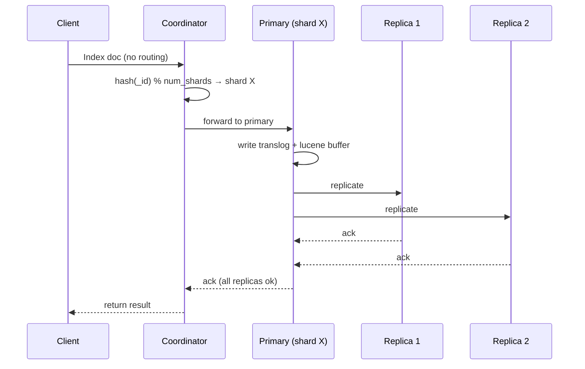
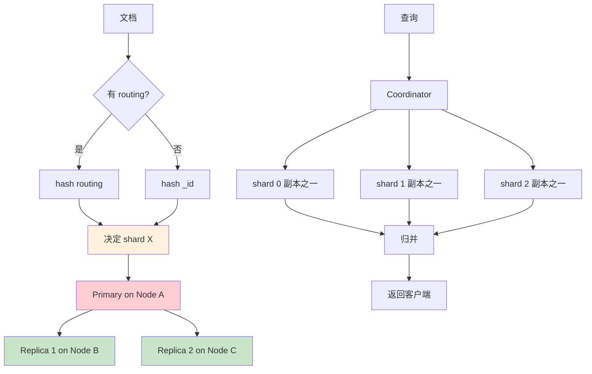

# 精通分片、副本与路由：shard 数怎么算、文档放哪个 shard

> 关联章节：[E03 集群拓扑](./03-精通-集群拓扑.md)、[E02 Segment 与合并](./02-精通-Segment-与合并.md)

---

## 引言：shard 数选错，全盘皆输

ES 的 shard 数是**索引创建时定死**的——之后想改？要 reindex 或 split/shrink，又是几小时几天。

新手最常犯的错：

- 业务才 1GB 数据，设了 50 个 shard → 每个 shard 几十 MB，元数据开销 > 数据本身
- 觉得"shard 越多查询越并行" → 30 节点集群一个索引设 100 shard → 实际查询要 100 个节点都参与，归并开销巨大
- 没规划分片键，业务高频按 user_id 查询，但每次都要 broadcast 到所有 shard

shard 不是越多越好，也不是越少越好。这章把"shard 数怎么算"、"路由怎么走"、"replica 怎么用"讲清楚。

读完之后你应该能：

- 给一个 5TB 索引选合理的 shard 数
- 理解 `_routing` 参数与 hash 路由的关系
- 解释 primary / replica 在写入和查询路径上的差异
- 用 split / shrink / clone 在线改变 shard 数
- 设计 cross-cluster replication（CCR）
- 识别 hot shard 与不均衡分配

---

## 第一章：shard 的双重身份

### 1.1 shard = Lucene Index

```
ES 索引 (myindex)
├─ shard 0
│  ├─ primary  → Node A 上的 Lucene index
│  └─ replica  → Node B 上的 Lucene index
├─ shard 1
│  ├─ primary  → Node B 上的 Lucene index
│  └─ replica  → Node C 上的 Lucene index
└─ ...
```

每个 shard 都是一个**完整、独立的 Lucene index**。primary 和 replica 互为副本（不是分片）。

→ shard 是数据切片的最小单位，replica 是高可用的副本。

### 1.2 写入路径



关键：**写入要等所有 in-sync 副本 ack**。

如果一个副本慢，整个写入慢——这就是为什么"添加副本会降低写入吞吐"。

### 1.3 读取路径

```
Search → Coordinator → 每个 shard 选一个副本（primary 或 replica，按负载均衡）→ 归并
```

- primary 和 replica 都可服务读请求（轮询）
- 副本越多，读吞吐越高
- 但每个 search 仍然是"每 shard 一份"，不是"每副本一份"

---

## 第二章：shard 数的选择

### 2.1 经典经验法则

| 单 shard 大小 | 适用 |
|---|---|
| < 1GB | shard 数过多，浪费 |
| 1-10GB | 小索引 |
| 10-50GB | 一般业务 |
| 50GB | 时序/日志理想大小 |
| > 50GB | 略大，但可接受 |
| > 100GB | 太大，rebalance / recovery 缓慢 |

**生产推荐**：单 shard 30-50GB。

### 2.2 计算公式

```
shard 数 = ceil(总数据量 / 50GB)

例：
  100GB 索引 → 2 shard
  500GB 索引 → 10 shard
  5TB 索引 → 100 shard
```

注意：

- 时序索引按时间 rollover → 单个索引不大，shard 数算的是"单时间段"
- 业务索引不滚动 → 一开始就要按未来 1-2 年预估

### 2.3 shard 与节点数的关系

- shard 数应该 **≥ data 节点数**（让每个节点都参与查询）
- shard 数应该 **≤ data 节点数 × 2-3**（避免单节点放太多 shard）

例：10 data 节点，建议 shard 数 10-30。

### 2.4 索引数 × shard 数 ≠ 越多越好

每个 shard 都消耗资源：

- 内存：FST、doc_values 缓存
- 文件句柄：每 segment 几十个
- CPU：refresh / merge / search 都按 shard 进行

集群级建议：**每 GB 堆内存对应 20 个 shard 以下**。

例：每节点 32GB 堆 → 单节点 ≤ 640 shard。

```bash
GET _cluster/stats?filter_path=indices.shards
# total / primaries
```

### 2.5 时序数据怎么算

```yaml
# ILM 配置 rollover
"rollover": {
  "max_age": "1d",
  "max_primary_shard_size": "50gb"
}
```

每天 1TB 日志：

- max_primary_shard_size = 50GB → 单 shard 不超过 50GB
- 1TB / 50GB = 20 shard

但实际要看每天数据均不均匀。可以先用 `max_primary_shard_size` 自动控制，shard 数随数据自然调整。

---

## 第三章：路由（Routing）

### 3.1 默认路由

```
shard = hash(_id) % num_primary_shards
```

`_id` 默认是 ES 生成的 UUID，分布均匀。

### 3.2 自定义 routing

```bash
# 写入时指定 routing
PUT myindex/_doc/1?routing=user_42
{ "user_id": "user_42", "msg": "hello" }

# 查询时也要带相同的 routing
GET myindex/_doc/1?routing=user_42

# 搜索
POST myindex/_search?routing=user_42
{ "query": {"match_all": {}} }
```

→ 让"同一 routing 的文档"落在同一 shard，查询时只查这个 shard（避免 broadcast）。

### 3.3 路由的应用场景

✅ 适合 routing：

- 每个用户的数据相对独立（电商订单、私信、单租户 SaaS）
- 查询 90% 带 user_id 等键
- 数据分布相对均匀（不会有"大客户"独占一片）

❌ 不适合 routing：

- 数据严重倾斜（明星用户数据是普通用户 1000 倍）
- 查询大多是全局查询，按 routing 没意义

### 3.4 routing 的陷阱

- **必须每次都带 routing**——一旦忘带，查不到该文档
- **routing 选错会倾斜**——大客户落同一 shard 把它打爆
- **删除时也要带 routing**——否则可能误删别人的

### 3.5 mapping 强制 routing

```bash
PUT myindex
{
  "mappings": {
    "_routing": { "required": true }
  }
}
```

写入不带 routing 会报错——避免"忘带"。

### 3.6 routing partition

```bash
PUT myindex
{
  "settings": {
    "index.routing_partition_size": 4,
    "number_of_shards": 16
  }
}
```

效果：

```
shard = (hash(_routing) + hash(_id) % 4) % 16
```

→ 同 routing 的数据落在 4 个 shard 中（不是 1 个），缓解"大客户单 shard 倾斜"。

代价：查询时只能缩到 4 个 shard，无法完全单 shard。

---

## 第四章：副本（Replica）

### 4.1 用途

1. **高可用**：primary 节点挂了，replica 升 primary
2. **读吞吐**：query 在 primary / replica 间负载均衡
3. **跨可用区**：和 awareness 配合，单 AZ 故障不丢数据

### 4.2 副本数

```bash
PUT myindex/_settings
{ "index.number_of_replicas": 1 }
```

| 副本数 | 写入开销 | 读吞吐 | 容错 |
|---|---|---|---|
| 0 | 最低 | 1x | 单点风险 |
| 1 | 2x | 2x | 容忍 1 节点 |
| 2 | 3x | 3x | 容忍 2 节点 |

- 默认 1 适合大多数场景
- 日志类可设 0（数据可重导，省成本）
- 关键业务设 2（容忍同时 2 个故障）

### 4.3 动态调整副本

```bash
# 升级时减副本 → 写入快
PUT myindex/_settings
{ "index.number_of_replicas": 0 }

# 完成后恢复
PUT myindex/_settings
{ "index.number_of_replicas": 1 }
```

注意：副本恢复 = 从 primary 拷整个 shard 文件，几十 GB 要几分钟到几十分钟。

### 4.4 同步与异步副本

ES 7+ 都是**同步副本** —— primary 必须等所有 in-sync replica ack 才返回。

如果某 replica 跟不上，被自动剔除 in-sync 集合，写入继续：

```bash
GET _cluster/health?level=shards
# 看 unassigned_shards 与 active_shards_percent_as_number
```

剔除的 replica 后台 recovery，追上后重新加入。

### 4.5 wait_for_active_shards

```bash
PUT myindex/_doc/1?wait_for_active_shards=2
{ "msg": "hi" }
```

要求至少 2 个 shard 副本 active 才接受写入（默认 1，即 primary）。

设 `all` 要求所有副本都 active。

---

## 第五章：改变 shard 数

### 5.1 Split（拆分）

把现有 shard 数**整数倍**放大：

```bash
PUT myindex/_settings
{ "index": { "blocks.write": true }}      # 先只读

POST myindex/_split/myindex_v2
{ "settings": { "index.number_of_shards": 6 }}    # 原 2 → 新 6
```

要求：

- 新 shard 数 = 旧 × N（N 是整数）
- 原索引只读

物理上：拷贝原 shard 文件，然后按 hash 重新分到新 shard。

### 5.2 Shrink（收缩）

把现有 shard 数**整数因子**缩小：

```bash
# 先让所有副本到一个节点
PUT myindex/_settings
{ "index.routing.allocation.require._name": "node-1", "index.blocks.write": true }

POST myindex/_shrink/myindex_v2
{ "settings": { "index.number_of_shards": 1 }}    # 原 5 → 新 1
```

要求：

- 新 shard 数是旧 shard 数的因子（5 → 1 或 5；6 → 1, 2, 3, 6）
- 原索引所有 shard 在同一节点
- 原索引只读

ILM 在 hot → warm 转换时常用 shrink 把 shard 数减少（warm 不写入，少 shard 查得更快）。

### 5.3 Clone

```bash
POST myindex/_clone/myindex_copy
```

完全复制（同 shard 数）。常用于测试或归档。

### 5.4 Reindex

```bash
POST _reindex
{
  "source": { "index": "old" },
  "dest":   { "index": "new" }
}
```

通过 scroll + 重新写入，可以**改变 shard 数、改变 mapping、改变 setting**。最灵活但最慢——几 TB 要几小时。

加速：

- 关闭 dest 索引的 refresh（`-1`）
- 临时去掉 replicas（`0`）
- 提高 slice 并行度

```bash
POST _reindex?slices=auto&refresh=false
```

---

## 第六章：shard 分配

### 6.1 allocation 决定因素

新 shard 创建或 failover 时，master 决定放在哪个节点。考虑：

1. **节点角色**（data_hot / warm / ...）
2. **磁盘水位**（low / high / flood watermark）
3. **awareness**（按 zone / rack）
4. **filter**（include / exclude / require）
5. **shard 数均衡**（balance）

### 6.2 磁盘水位

```yaml
cluster.routing.allocation.disk.watermark.low: 85%
cluster.routing.allocation.disk.watermark.high: 90%
cluster.routing.allocation.disk.watermark.flood_stage: 95%
```

| 水位 | 行为 |
|---|---|
| < low (85%) | 正常 |
| low - high (85-90%) | 不再分配新 shard |
| high - flood (90-95%) | 把 shard 迁出去 |
| > flood (95%) | 索引被标记 read_only_allow_delete |

监控：

```bash
GET _cat/allocation?v
# 看 disk.percent
```

### 6.3 allocation filter

```bash
# 让索引只去某些节点
PUT myindex/_settings
{
  "index.routing.allocation.include._tier_preference": "data_hot",
  "index.routing.allocation.exclude._name": "node-5"
}
```

按 tier、按节点名、按自定义 attribute 都行。

### 6.4 awareness

```yaml
# elasticsearch.yml
cluster.routing.allocation.awareness.attributes: zone, rack
node.attr.zone: us-east-1a
node.attr.rack: rack-7
```

→ 同一 shard 的 primary 和 replica 自动分布到不同 zone。

强制约束：

```yaml
cluster.routing.allocation.awareness.force.zone.values: us-east-1a, us-east-1b, us-east-1c
```

某 zone 全挂时，shard **不会迁到其他 zone**——防止 zone 恢复后双副本同步打爆，也避免数据不均衡。

### 6.5 手动 reroute

```bash
POST _cluster/reroute
{
  "commands": [
    {
      "move": {
        "index": "myindex", "shard": 0,
        "from_node": "node-1", "to_node": "node-3"
      }
    }
  ]
}
```

只在调试或紧急情况下用。

---

## 第七章：hot shard / 不均衡

### 7.1 hot shard 现象

某个 shard 接收了远超平均的请求 → 该 shard 所在节点 CPU/IO 飙升。

常见原因：

- routing 倾斜（大客户）
- 索引中某个文档被频繁更新
- 时序索引最新一天的 shard 是热点

### 7.2 诊断

```bash
# 看每个 shard 的 indexing / search 速率
GET _cat/shards?v&h=index,shard,prirep,docs,store,indexing.index_total,search.query_total

# 节点级
GET _nodes/stats/indices/indexing,search
```

如果某 shard 的 indexing/search 速率比其他高 5 倍以上 → hot shard。

### 7.3 解决

- 增加 shard 数（split）
- 调整 routing
- 用 `index.routing_partition_size` 把大 client 拆到多 shard
- 加副本（缓解读压力，不解决写压力）

### 7.4 节点不均衡

```bash
GET _cat/allocation?v
# shard 数差异 > 20% 不均衡

GET _cluster/settings
# 查看 balance 设置
```

```yaml
cluster.routing.allocation.balance.shard: 0.45        # 默认 0.45
cluster.routing.allocation.balance.index: 0.55        # 同一索引的 shard 均衡权重
cluster.routing.allocation.balance.threshold: 1.0     # 触发 rebalance 的阈值
```

调高 `balance.index` 让同一索引尽量分散。

---

## 第八章：跨集群复制 CCR

### 8.1 用途

把 leader 集群的索引**持续同步**到 follower 集群（异步）：

- 灾备
- 跨地域加速读
- 数据本地化（合规要求）

### 8.2 设置

```bash
# 在 follower 集群配置 leader 集群
PUT _cluster/settings
{
  "persistent": {
    "cluster.remote.leader.seeds": ["leader-host:9300"]
  }
}

# 创建 follower 索引
PUT myindex-follower/_ccr/follow
{
  "remote_cluster": "leader",
  "leader_index": "myindex"
}
```

### 8.3 auto-follow

```bash
PUT _ccr/auto_follow/logs
{
  "remote_cluster": "leader",
  "leader_index_patterns": ["logs-*"],
  "follow_index_pattern": "{{leader_index}}-replica"
}
```

leader 集群新建匹配的索引时，follower 自动跟随。

### 8.4 注意

- CCR 是企业版功能（X-Pack）
- 异步复制，follower 落后 leader（秒级）
- follower 索引只读
- 切主时需要 unfollow + 重建反向

---

## 第九章：典型故障案例

### 9.1 over-sharding

**现象**：5 节点集群，10 个索引每个 50 shard + 1 replica = 1000 shard。集群启动慢、cluster state 大、查询慢。

**修复**：

- 减少每个索引的 shard 数（reindex 到新索引）
- 索引合并（按业务合一个）
- 老索引 close（cluster state 中删除）

### 9.2 unassigned shard

```bash
GET _cluster/allocation/explain
# 看具体原因
```

常见原因：

- 节点磁盘超 high watermark
- awareness 约束无法满足
- 节点离线后 grace period 内不会重新分配

修复：调水位、节点重启、`POST _cluster/reroute?retry_failed=true`。

### 9.3 shard recovery 慢

```bash
GET _cat/recovery?v&active_only=true
```

可能原因：

- 网络慢
- recovery 限速太低

```yaml
indices.recovery.max_bytes_per_sec: 40mb   # 默认 40MB/s
# 调高（小心 IO 影响生产）
indices.recovery.max_bytes_per_sec: 200mb
```

### 9.4 大 reindex 影响生产

reindex 默认占用大量资源。限速：

```bash
POST _reindex?requests_per_second=1000
```

或拆分 slices 并行（注意不要让总速率太高）。

---

## 第十章：决策清单

### 10.1 索引创建前必须想清楚

- [ ] 这个索引 1 年后多大？（决定 shard 数）
- [ ] 单 shard 大小预估 30-50GB？
- [ ] 是否需要 routing？字段是什么？
- [ ] 副本数？1 还是 2？
- [ ] 用 ILM 吗？rollover 阈值？
- [ ] mapping 是否完整？有 dynamic 风险吗？
- [ ] 分配 tier？hot only 还是会迁 warm？

### 10.2 索引创建后的检查

- [ ] `GET myindex/_settings` 确认 number_of_shards / replicas
- [ ] `GET myindex/_mapping` 确认字段
- [ ] 是否绑定 alias？方便后续 reindex 切换
- [ ] 是否在合适的 tier？

---

## 总结 · 分片与路由一图流



---

## 练习题

1. 索引 5TB 数据，shard 数 5 个还是 100 个合适？计算并解释。

2. 默认 shard 路由公式是什么？为什么 shard 数定死后不能随便改？

3. 使用 routing 时，写入和查询为什么必须都带？不带会发生什么？

4. 一个大客户的 routing 把它打到单 shard 后该 shard 严重倾斜，怎么解决？

5. 副本数 = 2 vs = 1，写入吞吐受什么影响？为什么？

6. Split 与 Shrink 各自的前提条件是什么？

7. 磁盘水位 high (90%) 触发时集群行为是什么？flood_stage (95%) 呢？

8. awareness 与 awareness.force 的差异？什么场景必须用 force？

9. CCR 与 cross-cluster search 的根本区别？

10. 集群 50 节点、100 索引、每索引 10 shard 1 replica，cluster state 接近 100MB，你会做什么优化？

---

## 参考答案

1. 5 个更合适（计算：5TB / 50GB ≈ 100，但要看是否时序）。若是**不滚动的业务索引**且总量恒定 5TB，则 ceil(5TB/50GB)=100 shard 才能保证单 shard 30-50GB——选 100。若是**时序按时间 rollover**，单个时间段索引远小于 5TB，则单索引可能只要 5 个。题目"5TB 一个索引"按 50GB/shard 算应是 ~100 shard，5 个会让单 shard 达 1TB（太大，recovery/rebalance 极慢）。

2. `shard = hash(_routing) % number_of_primary_shards`（默认 _routing = _id）。shard 数参与取模，一旦改变所有已有文档的归属 shard 都会变，导致按 _id 查找定位错误，所以创建后不能随意改——只能通过 split（整数倍放大）/shrink（整数因子缩小）/reindex 改变。

3. 因为路由公式用 _routing 决定 shard：写入带 routing 让文档落到 hash(routing) 对应的 shard；查询带相同 routing 才能直接定位到那个 shard。不带 routing 查询会退化为 broadcast 到所有 shard（GET by id 不带 routing 可能直接查不到，因为它只查 hash(_id) 对应的 shard，而文档实际在 hash(routing) 的 shard 上）。

4. 用 `index.routing_partition_size`：让同一 routing 的数据分散到 N 个 shard（公式变为 `(hash(routing)+hash(_id)%partition) % shards`），缓解单 shard 倾斜；或对大客户单独建索引；或重新设计 routing 键。增加 shard 数（split）也能稀释，但根因是 routing 倾斜，partition 是针对性方案。

5. 副本=2 时每次写入要等 2 个 replica 都 ack（primary + 2 副本），fanout 与等待最慢副本的开销更大，写吞吐比副本=1 更低（大致从 X 降到 X×0.5 左右，非线性）。原因：写入是同步等所有 in-sync 副本 ack，副本越多，等待与网络/IO 放大越严重；但读吞吐相应提升。

6. Split：新 shard 数必须是旧的整数倍，且原索引需只读（`blocks.write: true`）。Shrink：新 shard 数必须是旧 shard 数的因子，原索引所有 shard 需先迁到同一节点且设为只读。两者都通过硬链接/拷贝原 shard 文件实现，比 reindex 快。

7. high (90%) 触发时：ES 主动把该节点上的 shard 迁移到其他节点（不再往该节点分配新 shard）。flood_stage (95%) 触发时：该节点上的索引被标记为 `read_only_allow_delete`，写入全部失败（只能删除），是最后的保护闸，需要人工清理空间后手动解除。

8. `awareness`（如按 zone）让主副本尽量分散到不同 zone，是软约束。`awareness.force` 是硬约束：某 zone 全不可用时 shard 不会迁到其他 zone。必须用 force 的场景：跨可用区部署且要防止 zone 短暂故障时副本全挤到剩余 zone、zone 恢复后又触发大规模再同步打爆集群。

9. CCR（跨集群复制）是把 leader 集群索引**持续异步复制**到 follower 集群，follower 有完整数据副本（用于灾备/本地化/就近读），是企业版功能。CCS（跨集群搜索）不复制数据，只是查询时把请求**转发**到远程集群并归并结果。一个是数据复制，一个是查询联邦。

10. cluster state 100MB 偏大，优化：(1) 减少 shard 总数——50 节点但 100×10×2=2000 shard，按 30-50GB/shard 重新评估，过多小索引用 ILM 合并或 reindex 减 shard；(2) 检查 mapping 字段是否爆炸（dynamic mapping 失控），改 strict / flattened / runtime；(3) close 或删除不再使用的老索引；(4) 合并小索引、用别名；(5) 必要时拆集群 + CCS。

---

> 📁 下一篇：[E05 精通 Mapping 与 Analyzer](./05-精通-Mapping-与-Analyzer.md)
