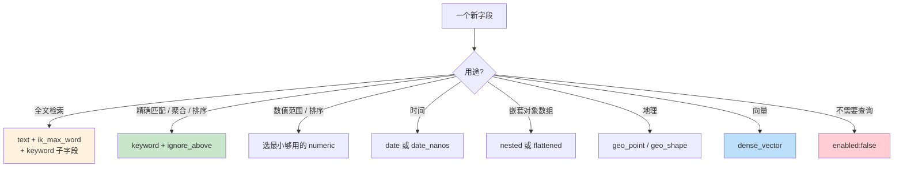

# 精通 Mapping 与 Analyzer：text vs keyword、动态映射与中文分词

> 关联章节：[E01 倒排索引与 Lucene](./01-精通-倒排索引-与-Lucene.md)、[E06 Query DSL](./06-精通-Query-DSL.md)

---

## 引言：Mapping 是 ES 的"建模语言"

ES 让你"开箱即用 schema-less"——丢一个 JSON 进去就能搜。但这是个**陷阱**。

- 字段类型自动推断错（一个文档里 `id` 是数字，下一个是字符串 → mapping 冲突）
- `text` 和 `keyword` 用错（前者全文检索，后者精确匹配，混用导致排序聚合失效）
- 中文分词不配置 → 默认 standard analyzer 把每个汉字当一个 token → 检索质量灾难
- dynamic mapping 默认开启 → 业务乱写字段 → mapping 几千个字段 → cluster state 爆炸

这章把 Mapping 的核心讲透：字段类型、动态映射、analyzer 链、runtime field，以及中文场景的 IK / SmartCN / Jieba 选型。

读完之后你应该能：

- 区分 text、keyword、wildcard、constant_keyword、flattened 各自适用场景
- 设计 dynamic_templates 控制字段爆炸
- 选对中文分词器并理解其内部
- 用 multi-field 同时支持检索和精确匹配
- 用 runtime field 推迟 schema 决定
- 解释 normalizer 与 analyzer 的差异

---

## 第一章：字段类型大全

### 1.1 文本类

| 类型 | 用途 | 是否分词 | 是否聚合 |
|---|---|---|---|
| `text` | 全文检索 | ✓ | ✗（除非 fielddata） |
| `keyword` | 精确匹配、排序、聚合 | ✗ | ✓ |
| `wildcard` | 优化的 `LIKE` 查询 | ✗ | ✗ |
| `constant_keyword` | 整索引同一值（如 dataset 标签） | ✗ | ✓（极省） |
| `match_only_text` | 节省的全文检索（牺牲短语查询） | ✓ | ✗ |
| `search_as_you_type` | 自动完成 | ✓（多种 analyzer） | ✗ |

### 1.2 数值类

```bash
PUT myindex
{
  "mappings": {
    "properties": {
      "price":   { "type": "double" },
      "qty":     { "type": "integer" },
      "id":      { "type": "long" },
      "score":   { "type": "scaled_float", "scaling_factor": 100 },
      "rate":    { "type": "half_float" }
    }
  }
}
```

- 用最小够用的类型节省空间
- `scaled_float`：小数转整数存（如 9.99 × 100 = 999），最适合金融金额
- `half_float`：16 位浮点，向量场景常用

### 1.3 时间类

```bash
"created_at": {
  "type": "date",
  "format": "yyyy-MM-dd'T'HH:mm:ss.SSSZ||yyyy-MM-dd||epoch_millis"
}
```

支持：

- ISO 8601 字符串
- `epoch_millis` / `epoch_second`
- 自定义 Java DateTimeFormatter 模式

`date_nanos` 类型可以存纳秒精度（默认 date 是毫秒）。

### 1.4 复合类

| 类型 | 用途 |
|---|---|
| `object` | 嵌套字段（默认 flatten） |
| `nested` | 嵌套数组，每元素独立 doc |
| `flattened` | 整个对象当一个字段 |
| `join` | 父子关系 |

**object vs nested 的区别**：

```json
{ "people": [
    {"name": "Alice", "age": 30},
    {"name": "Bob",   "age": 25}
]}
```

`object`（默认）会被 flatten 为：

```
people.name = ["Alice", "Bob"]
people.age  = [30, 25]
```

→ 查询 `people.name=Alice AND people.age=25` 会**误匹配**（Alice 30 + Bob 25 拼出来）。

`nested` 把每个对象当独立小 doc 索引，查询时用 `nested` query：

```bash
POST myindex/_search
{
  "query": {
    "nested": {
      "path": "people",
      "query": {
        "bool": {
          "must": [
            {"match": {"people.name": "Alice"}},
            {"match": {"people.age": 25}}
          ]
        }
      }
    }
  }
}
```

代价：nested 写入慢、聚合复杂、shard size 膨胀。

### 1.5 特殊类

| 类型 | 用途 |
|---|---|
| `ip` | IPv4/IPv6 地址，支持 CIDR 查询 |
| `geo_point` | 经纬度，地理查询 |
| `geo_shape` | 复杂几何 |
| `dense_vector` | 向量（kNN 搜索） |
| `sparse_vector` | 稀疏向量（ELSER 等） |
| `binary` | base64 二进制 |
| `range` | 范围类型（integer_range / date_range / ip_range） |
| `version` | 语义化版本 |

---

## 第二章：text vs keyword 深度

### 2.1 同样的字符串两种存法

```bash
PUT myindex
{
  "mappings": {
    "properties": {
      "title": {
        "type": "text",
        "analyzer": "standard",
        "fields": {
          "raw": {
            "type": "keyword",
            "ignore_above": 256
          }
        }
      }
    }
  }
}
```

→ multi-field：同一个字段两份倒排，使用时分别访问。

```bash
# 全文检索（分词、模糊）
POST myindex/_search { "query": { "match": { "title": "elastic search" }}}

# 精确匹配（不分词）
POST myindex/_search { "query": { "term":  { "title.raw": "Elastic Search Tutorial" }}}

# 排序 / 聚合
POST myindex/_search { "sort": [{"title.raw": "asc"}]}
POST myindex/_search { "aggs": {"by_title": {"terms": {"field": "title.raw"}}}}
```

### 2.2 ignore_above

```json
"raw": { "type": "keyword", "ignore_above": 256 }
```

超过 256 字节的字符串**不索引**（但 _source 仍存）—— 避免长字符串占用 keyword 倒排空间。

### 2.3 doc_values

| 类型 | doc_values 默认 |
|---|---|
| keyword / numeric / date | ON |
| text | OFF（开启需要 `fielddata: true`，强烈不建议） |

doc_values = 列存正排，用于排序、聚合、脚本访问字段值。

`text` 字段不适合排序聚合 → 用 multi-field 加一个 keyword 子字段。

### 2.4 fielddata

如果你**真的**要对 text 字段聚合（如统计每个词出现频次）：

```bash
PUT myindex/_mapping
{
  "properties": {
    "content": { "type": "text", "fielddata": true }
  }
}
```

⚠️ 警告：fielddata 在堆内存里构造（不是 doc_values 的列存格式），对大字段来说会**吃光堆**。

→ 永远优先用 keyword multi-field。

---

## 第三章：dynamic mapping

### 3.1 默认行为

```bash
PUT auto-test/_doc/1
{ "name": "alice", "age": 30, "ts": "2026-05-13T10:00:00Z", "tags": ["a", "b"] }
```

ES 自动创建 mapping：

```json
{
  "name": "text + keyword",
  "age":  "long",
  "ts":   "date",
  "tags": "text + keyword"
}
```

### 3.2 dynamic 控制

```bash
PUT myindex
{
  "mappings": {
    "dynamic": "strict",      
    "properties": { ... }
  }
}
```

| dynamic 值 | 行为 |
|---|---|
| `true` | 自动创建新字段（默认） |
| `runtime` | 新字段作为 runtime field（不索引） |
| `false` | 新字段被忽略（仍存在 _source） |
| `strict` | 新字段直接 reject 写入 |

生产推荐：

- 业务核心索引：`strict` + 显式 mapping
- 日志类：`runtime` 或 `false`（避免字段爆炸）
- 临时探索数据：`true`

### 3.3 动态字段爆炸

某 logs 索引几个月后 mapping 字段达到 8000+，cluster state 几十 MB——多半因为业务把"动态字段"当字典用：

```json
{ "user_42_score": 99, "user_43_score": 87, ... }
```

每个 user_N 都成为新字段。

修复：

- mapping 里设 `dynamic: false` 或 `strict`
- 把动态部分改用 `flattened` 类型存
- 用 `runtime` 推迟到查询时计算

```bash
"user_scores": { "type": "flattened" }
# 整个 object 当一个字段，内部 key 不进 mapping
```

### 3.4 dynamic_templates

精细控制动态映射规则：

```bash
PUT myindex
{
  "mappings": {
    "dynamic_templates": [
      {
        "strings_as_keyword": {
          "match_mapping_type": "string",
          "mapping": { "type": "keyword" }
        }
      },
      {
        "longs_as_long": {
          "match_mapping_type": "long",
          "mapping": { "type": "long", "doc_values": false }
        }
      }
    ]
  }
}
```

→ 所有动态生成的 string 字段直接当 keyword（不要 text + keyword 双份）。

---

## 第四章：Analyzer 链

### 4.1 Analyzer 三件套

```
原始文本 
   ↓ Character Filters（字符级处理）
中间文本
   ↓ Tokenizer（切词）
[token, token, token]
   ↓ Token Filters（小写、stem、同义词）
最终 tokens
```

例：`"Hello, World!"` 经 standard analyzer：

```
Char filter: 不变
Tokenizer (standard): ["Hello", "World"]
Token filters (lowercase): ["hello", "world"]
```

### 4.2 内置 Analyzer

| Analyzer | 行为 |
|---|---|
| `standard` | 默认：unicode 切分 + 小写 |
| `simple` | 按非字母切 + 小写 |
| `whitespace` | 仅按空白切 |
| `keyword` | 不切，整个当一个 token |
| `pattern` | 按正则切 |
| `english` / `german` / ... | 含语言特定 stem 与停用词 |

### 4.3 自定义 Analyzer

```bash
PUT myindex
{
  "settings": {
    "analysis": {
      "char_filter": {
        "html_strip_filter": {
          "type": "html_strip"
        }
      },
      "tokenizer": {
        "ngram_tokenizer": {
          "type": "ngram",
          "min_gram": 2,
          "max_gram": 3
        }
      },
      "filter": {
        "synonym_filter": {
          "type": "synonym",
          "synonyms": ["computer, pc", "tv, television"]
        }
      },
      "analyzer": {
        "my_analyzer": {
          "char_filter": ["html_strip_filter"],
          "tokenizer": "standard",
          "filter": ["lowercase", "synonym_filter"]
        }
      }
    }
  },
  "mappings": {
    "properties": {
      "content": { "type": "text", "analyzer": "my_analyzer" }
    }
  }
}
```

### 4.4 测试 Analyzer

```bash
POST myindex/_analyze
{
  "analyzer": "my_analyzer",
  "text": "<p>I have a Computer and a TV</p>"
}
```

返回切出来的 token 列表——开发分词器必备。

### 4.5 search_analyzer

```bash
"content": {
  "type": "text",
  "analyzer": "ik_max_word",       // 索引时
  "search_analyzer": "ik_smart"    // 查询时
}
```

→ 索引时用细粒度分词（覆盖更全），查询时用粗粒度分词（更准）。

---

## 第五章：中文分词

### 5.1 standard 的灾难

```bash
POST _analyze
{
  "analyzer": "standard",
  "text": "我爱北京天安门"
}
```

输出：`["我", "爱", "北", "京", "天", "安", "门"]` —— 一字一 token。

→ 检索"北京"会匹配任何含"北"或"京"的文档，质量灾难。

### 5.2 IK Analyzer（最常用）

```bash
# 安装（与你的 ES 版本号匹配，9.x 当前推荐 9.1.x）
bin/elasticsearch-plugin install https://get.infini.cloud/elasticsearch/analysis-ik/9.1.4
```

提供两个 analyzer：

- `ik_max_word`：尽可能多切（"中华人民共和国" → "中华人民共和国/中华人民/中华/华人/人民共和国/人民/共和国/共和/国"）
- `ik_smart`：粗粒度（"中华人民共和国" → "中华人民共和国"）

推荐组合：索引 `ik_max_word`，搜索 `ik_smart`。

### 5.3 IK 自定义词典

公司术语、品牌词、新词需要补：

```bash
# config/IKAnalyzer.cfg.xml
<entry key="ext_dict">custom.dic</entry>

# config/custom.dic
深度学习
大语言模型
ChatGPT
我们的产品名
```

IK 支持远程词典（HTTP 请求拉），便于热更新。

### 5.4 SmartCN（官方）

```bash
bin/elasticsearch-plugin install analysis-smartcn
```

基于 HMM 中文分词。质量比 IK 略低，但官方维护、跟版本紧。

### 5.5 Jieba（社区移植）

来自 Python 的 jieba 算法。社区有 ES 插件。质量高，支持 paddle 模式。

### 5.6 选型建议

| 场景 | 推荐 |
|---|---|
| 通用中文搜索 | IK |
| 与 LLM 配合（不太依赖 BM25） | smartcn 或不分词都可 |
| 强 NLP 需求 | jieba 或自定义 |
| 多语言混合 | IK + standard 组合 |

### 5.7 同义词

```bash
"filter": {
  "synonym_filter": {
    "type": "synonym",
    "synonyms_path": "analysis/synonyms.txt"
  }
}

# synonyms.txt
手机, 电话, mobile, phone
i-phone, iphone, 苹果手机
```

注意：

- 同义词扩展在**索引时**和**查询时**都可以做，但只做查询时更灵活（不用 reindex）
- 大词典影响性能 — 几千个同义词没事，几十万个要谨慎

---

## 第六章：normalizer

### 6.1 keyword 也需要"轻量处理"

`keyword` 默认不做任何处理，但有些场景想统一大小写：

```bash
PUT myindex
{
  "settings": {
    "analysis": {
      "normalizer": {
        "lowercase_norm": {
          "type": "custom",
          "filter": ["lowercase"]
        }
      }
    }
  },
  "mappings": {
    "properties": {
      "tag": {
        "type": "keyword",
        "normalizer": "lowercase_norm"
      }
    }
  }
}
```

→ 索引 "JavaScript" 和搜索 "javascript" 都被规范化为 "javascript" → 命中。

normalizer 限制：只能用 char_filter 和不影响 token 数量的 token filter（lowercase / asciifolding 等）。不能用 tokenizer 或 stemmer。

---

## 第七章：runtime field

### 7.1 推迟到查询时计算

```bash
PUT myindex/_mapping
{
  "runtime": {
    "name_uppercase": {
      "type": "keyword",
      "script": "emit(doc['name.keyword'].value.toUpperCase())"
    }
  }
}

POST myindex/_search
{
  "query": { "match": { "name_uppercase": "ALICE" }},
  "fields": ["name_uppercase"]
}
```

特点：

- 不占索引空间
- 查询时按需计算（慢，但灵活）
- 可在查询请求中临时定义（不改 mapping）

### 7.2 临时 runtime field

```bash
POST myindex/_search
{
  "runtime_mappings": {
    "price_with_tax": {
      "type": "double",
      "script": "emit(doc['price'].value * 1.13)"
    }
  },
  "query": { "range": { "price_with_tax": { "gt": 100 }}}
}
```

→ 不修改 mapping，单次查询用。适合 ad-hoc 分析。

### 7.3 适用场景

- mapping 还没定下来想先探索数据
- 字段不常用，懒加载更经济
- 需要从 _source 派生新字段

不适合：高频查询的字段（每次查都重算，慢）。

---

## 第八章：mapping 设计原则

### 8.1 显式 > 动态

```bash
PUT myindex
{
  "mappings": {
    "dynamic": "strict",
    "properties": {
      "id":         { "type": "keyword" },
      "title":      { "type": "text", "analyzer": "ik_max_word",
                      "fields": { "raw": { "type": "keyword" }}},
      "category":   { "type": "keyword" },
      "price":      { "type": "scaled_float", "scaling_factor": 100 },
      "tags":       { "type": "keyword" },
      "created_at": { "type": "date" }
    }
  }
}
```

字段精确指定类型 + dynamic strict → 业务写错字段直接报错，不会污染 mapping。

### 8.2 multi-field 是常态

```json
"name": {
  "type": "text",
  "analyzer": "ik_max_word",
  "fields": {
    "raw":     { "type": "keyword" },
    "english": { "type": "text", "analyzer": "english" },
    "pinyin":  { "type": "text", "analyzer": "pinyin_analyzer" }
  }
}
```

一个字段同时支持多种检索（中文、英文、拼音、精确）。

### 8.3 关闭不用的特性

```json
"large_text": {
  "type": "text",
  "norms": false,            // 不计算长度归一化（不参与评分）
  "index_options": "freqs"   // 不存 position（不支持短语查询）
}

"binary_data": {
  "type": "binary",
  "doc_values": false        // 不需要排序聚合
}
```

每个不需要的特性都省一份磁盘 + 内存。

### 8.4 enabled: false

```json
"raw_payload": {
  "type": "object",
  "enabled": false           // 完全不索引，仅存于 _source
}
```

适合：webhook 原始内容、备份字段。`_source` 里能看到，但搜索不到。

### 8.5 _source 控制

```bash
PUT myindex
{
  "mappings": {
    "_source": {
      "enabled": true,
      "excludes": ["large_blob", "internal_state"]
    }
  }
}
```

排除一些大字段不存 _source，节省磁盘和返回带宽。

但**强烈不建议** `_source.enabled: false`：会失去 reindex / update / highlight 能力。

---

## 第九章：mapping 演进

### 9.1 mapping 的"不可改"

mapping 一旦创建，**已存在字段**的类型大多不能改：

- ✅ 加新字段（dynamic 允许的话）
- ✅ 改部分 setting（如 `ignore_above`）
- ❌ 改类型（int → keyword）
- ❌ 改 analyzer

要改 → reindex。

### 9.2 reindex 改 mapping

```bash
# 1. 创建新索引（新 mapping）
PUT myindex_v2 { ... }

# 2. reindex
POST _reindex
{
  "source": { "index": "myindex" },
  "dest":   { "index": "myindex_v2" }
}

# 3. 切 alias
POST _aliases
{
  "actions": [
    { "remove": { "index": "myindex",   "alias": "myindex_active" }},
    { "add":    { "index": "myindex_v2", "alias": "myindex_active" }}
  ]
}
```

→ **永远用 alias 访问索引**，方便后续无缝切换。

### 9.3 ILM 自动 mapping 演进

时序数据用 component template + index template + rollover：

```bash
PUT _component_template/logs_mappings
{
  "template": {
    "mappings": {
      "properties": {
        "@timestamp": { "type": "date" },
        "level":      { "type": "keyword" },
        "msg":        { "type": "text", "analyzer": "ik_max_word" }
      }
    }
  }
}

PUT _index_template/logs_template
{
  "index_patterns": ["logs-*"],
  "composed_of": ["logs_mappings"],
  "data_stream": {}
}
```

新建 `logs-2026.05.13` 时自动套用模板。

---

## 第十章：踩坑清单

### 10.1 默认 standard analyzer 处理中文

→ 必装 IK 或类似，并显式指定 analyzer。

### 10.2 nested 字段聚合慢

每个 nested 子文档是独立 lucene doc，聚合时要"先 join 父文档"。

→ 简单关联用 object（接受 cross-pollution），复杂才用 nested。

### 10.3 dynamic: true 的字段爆炸

→ 强制 strict 或 runtime。

### 10.4 keyword 没设 ignore_above

某字段偶尔来个超长 token (URL / log message) → 倒排里塞了 8KB 的"词" → 内存爆。

→ 默认就设 `ignore_above: 256`。

### 10.5 doc_values 所有字段都开

某字段从不排序也不聚合，但 `doc_values: true` → 浪费几倍磁盘。

→ 明确不用就 `doc_values: false`。

### 10.6 mapping 改不了硬要改

不能改的字段类型，硬用 `_close` + `_open` + 偷偷改 → 数据损坏。

→ 永远 reindex。

---

## 总结 · Mapping 决策树



---

## 练习题

1. text 与 keyword 类型何时同时建（multi-field），何时单独建？

2. nested 与 object 在聚合查询上的本质差异是什么？

3. `ik_max_word` 与 `ik_smart` 各自适合索引时还是查询时？为什么？

4. `dynamic: strict` 在生产中的好处与坏处？

5. runtime field 的代价是什么？什么时候不该用？

6. mapping 字段数从 100 涨到 10000 对集群有什么影响？

7. `flattened` 类型解决了什么问题？查询能力上有什么限制？

8. ignore_above: 256 的实际作用是什么？设 0 会怎样？

9. 同义词放在索引时分词 vs 查询时分词，各自的取舍？

10. 设计一个商品搜索的 mapping：包含中英文标题、品牌、价格、tags、规格 JSON、上架时间、向量。

---

> 📁 下一篇：[E06 精通 Query DSL 与 Aggregation](./06-精通-Query-DSL.md)
