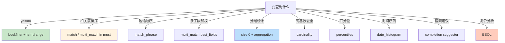

# 精通 Query DSL 与 Aggregation：从 bool 到 ESQL

> 关联章节：[E05 Mapping 与 Analyzer](./05-精通-Mapping-与-Analyzer.md)、[E07 BM25 评分](./07-精通-BM25-与-Reranking.md)

---

## 引言：DSL 是 ES 的"SQL"

ES 的查询语言（Query DSL）是个 JSON DSL。优势是表达力强、与 mapping 联动；劣势是初学者觉得啰嗦。

新手最常踩的坑：

- 把 `term` 用在 `text` 字段上 → 查不到（text 已被分词，存的是 token）
- `match` 多个词以为是 AND 关系，实际默认 OR
- `bool` 的 should / must / filter / must_not 语义混乱
- 聚合不带 `size: 0`，每次还返回 hits，浪费带宽
- 不知道有 ESQL（ES 9 推荐），还在写复杂嵌套聚合 JSON

这章把 DSL 拆开讲清楚：term level / full text / bool / 聚合 / scripted / ESQL。读完之后你应该能：

- 区分 query context 与 filter context
- 写出能用上倒排索引的高效查询
- 设计三层 bool 嵌套不犯昏
- 用 ESQL 写复杂分析查询
- 解释 `terms` 聚合的 doc_count_error 是什么

---

## 第一章：查询的两种 Context

### 1.1 Query context vs Filter context

```bash
POST myindex/_search
{
  "query": {
    "bool": {
      "must":   [{ "match": { "title": "elastic" }}],       // query context：算分
      "filter": [{ "term":  { "status": "published" }}]     // filter context：不算分
    }
  }
}
```

- **Query context**：参与评分（_score），结果按相关度排序
- **Filter context**：只判断 yes/no，不算分。**结果会被缓存**

→ 凡是"是否匹配"够用的，都用 filter，不要用 query。

### 1.2 缓存

Filter 命中会被 ES 缓存（node-level query cache）。下次同样的 filter 命中直接取 cache。

```bash
GET _cat/indices/myindex?v&h=index,query_cache.memory_size,query_cache.hit_count

# 看缓存使用
```

常见 filter：

- `term` / `terms`（精确匹配）
- `range`（范围）
- `exists`（字段存在）
- `prefix`

→ 这些**总应该放 filter**。

---

## 第二章：Term Level Query

### 2.1 term

```bash
POST myindex/_search
{
  "query": { "term": { "status": "active" }}
}
```

不分词、精确匹配 keyword 字段。

陷阱：

```bash
# title 是 text 字段，被分词存
POST myindex/_search
{
  "query": { "term": { "title": "Mastering Elasticsearch" }}
}
```

→ **查不到**。因为 "Mastering Elasticsearch" 整体不是任何 token（已分成 "mastering" 和 "elasticsearch"）。

修复：

- 用 `match`（让查询也分词）
- 或查 keyword 子字段 `title.raw`

### 2.2 terms

```bash
POST myindex/_search
{
  "query": { "terms": { "status": ["active", "pending"] }}
}
```

多个值 OR。等价 SQL 的 IN。

### 2.3 range

```bash
{ "range": { "price": { "gte": 100, "lt": 1000 }}}
{ "range": { "ts":    { "gte": "now-7d/d", "lt": "now/d" }}}
```

`now-7d/d` 是 ES 时间数学语法：当前时间减 7 天，并 round 到天。

### 2.4 exists

```bash
{ "exists": { "field": "email" }}
```

字段存在且不是 null。

### 2.5 prefix / wildcard / regexp

```bash
{ "prefix":   { "name": "alic" }}            # 前缀匹配
{ "wildcard": { "name": "al*ce" }}           # 通配符
{ "regexp":   { "name": "ali.*" }}           # 正则
```

⚠️ wildcard 以 `*` 开头会**全表扫描**（不能用倒排索引）。生产慎用，或换 `wildcard` 字段类型。

### 2.6 ids

```bash
{ "ids": { "values": ["1", "2", "3"] }}
```

按 `_id` 列表查（不用 routing 时跨 shard）。

---

## 第三章：Full Text Query

### 3.1 match

```bash
{ "match": { "title": "elastic search tutorial" }}
```

行为：

1. 用字段的 search_analyzer 把 query 分词 → ["elastic", "search", "tutorial"]
2. 默认 OR：包含任一即匹配
3. 多 token 匹配得分高

显式 AND：

```bash
{ "match": { "title": { "query": "elastic search", "operator": "and" }}}
```

### 3.2 match_phrase

```bash
{ "match_phrase": { "title": "elastic search" }}
```

要求 token 顺序相邻（默认 slop=0）。

```bash
{ "match_phrase": { "title": { "query": "elastic search", "slop": 2 }}}
```

`slop=2`：允许中间隔 2 个词。

### 3.3 multi_match

跨字段搜索：

```bash
{
  "multi_match": {
    "query": "elastic search",
    "fields": ["title^3", "description", "tags"],
    "type": "best_fields"
  }
}
```

`title^3` = title 字段权重 ×3。

type 选项：

| type | 行为 |
|---|---|
| `best_fields`（默认） | 每字段独立打分，取最高 |
| `most_fields` | 各字段分数相加 |
| `cross_fields` | 把所有字段当一个虚拟字段 |
| `phrase` | 在每个字段上做 match_phrase |
| `phrase_prefix` | 末尾的词作为前缀 |
| `bool_prefix` | match_bool_prefix 行为 |

### 3.4 match_phrase_prefix

```bash
{ "match_phrase_prefix": { "title": "elastic sea" }}
```

最后一个词作为前缀展开——常用于 search-as-you-type。

### 3.5 query_string / simple_query_string

```bash
{ "query_string": { "query": "title:elastic AND tags:tutorial" }}
```

支持 Lucene query 语法。

`simple_query_string` 更安全：

```bash
{ "simple_query_string": {
    "query": "elastic +search -postgres",
    "fields": ["title", "description"]
}}
```

⚠️ `query_string` 解析错误会直接报 400。`simple_query_string` 容错好——适合直接暴露给用户。

---

## 第四章：bool 复合查询

### 4.1 四种子句

```bash
{
  "bool": {
    "must":     [...],   // 必须匹配（参与评分）
    "should":   [...],   // 应该匹配（参与评分；如果没 must/filter，至少 1 个 should 命中）
    "filter":   [...],   // 必须匹配（不评分，可缓存）
    "must_not": [...]    // 必须不匹配（不评分）
  }
}
```

### 4.2 等价 SQL 翻译

```sql
SELECT * FROM products
WHERE status = 'active'            -- filter: term status=active
  AND (title LIKE '%elastic%')     -- must: match title elastic
  AND price BETWEEN 100 AND 1000   -- filter: range price
  AND category != 'deleted'        -- must_not: term category=deleted
```

```bash
{
  "bool": {
    "must":   [{ "match": { "title": "elastic" }}],
    "filter": [
      { "term":  { "status": "active" }},
      { "range": { "price": { "gte": 100, "lte": 1000 }}}
    ],
    "must_not": [{ "term": { "category": "deleted" }}]
  }
}
```

### 4.3 嵌套 bool

```bash
{
  "bool": {
    "must": [{ "match": { "title": "elastic" }}],
    "filter": [
      { "bool": {
          "should": [
            { "term": { "lang": "zh" }},
            { "term": { "lang": "en" }}
          ],
          "minimum_should_match": 1
      }}
    ]
  }
}
```

→ title 匹配 elastic AND (lang=zh OR lang=en)。

### 4.4 minimum_should_match

```bash
{
  "bool": {
    "should": [
      { "match": { "tag": "search" }},
      { "match": { "tag": "lucene" }},
      { "match": { "tag": "java" }}
    ],
    "minimum_should_match": 2
  }
}
```

3 个 should 至少匹配 2 个。

### 4.5 constant_score

```bash
{
  "constant_score": {
    "filter": { "term": { "status": "published" }},
    "boost": 1.2
  }
}
```

filter 命中后给固定分（避免 BM25 计算）——配合 bool 控制分数。

---

## 第五章：Aggregation 聚合

### 5.1 三类聚合

- **Bucket**：按值分组（terms / histogram / date_histogram / range）
- **Metric**：算指标（avg / sum / max / min / cardinality / stats / percentiles）
- **Pipeline**：基于其他聚合结果再算（bucket_sort / cumulative_sum）

### 5.2 size: 0

聚合通常不需要 hits：

```bash
POST myindex/_search
{
  "size": 0,
  "aggs": {
    "by_category": {
      "terms": { "field": "category", "size": 10 }
    }
  }
}
```

`size: 0` 跳过查询的 fetch 阶段，省网络。

### 5.3 terms 聚合

```bash
{
  "aggs": {
    "top_categories": {
      "terms": {
        "field": "category",
        "size": 10,
        "order": { "_count": "desc" }
      }
    }
  }
}
```

返回：

```json
{
  "aggregations": {
    "top_categories": {
      "buckets": [
        { "key": "electronics", "doc_count": 12345 },
        ...
      ],
      "doc_count_error_upper_bound": 0,
      "sum_other_doc_count": 567
    }
  }
}
```

### 5.4 doc_count_error_upper_bound

每个 shard 返回它自己的 top N，coordinator 合并。可能出现：

- shard A：[X:100, Y:80, Z:70, ...]
- shard B：[Y:90, X:60, W:50, ...]

合并 top 2：X(160) Y(170) → 实际可能不准（W 在 shard A 也可能有 49 个，但被截断了）。

`doc_count_error_upper_bound` 是这种误差的上界。

减小误差：

```bash
{ "terms": { "field": "category", "size": 10, "shard_size": 100 }}
```

每个 shard 返回 top 100 而非默认 (size × 1.5 + 10)，提高准确度，代价是内存。

### 5.5 date_histogram

```bash
{
  "aggs": {
    "by_day": {
      "date_histogram": {
        "field": "@timestamp",
        "calendar_interval": "1d",
        "time_zone": "Asia/Shanghai"
      }
    }
  }
}
```

`calendar_interval`：year / quarter / month / week / day / hour / minute / second
`fixed_interval`：固定毫秒（如 `30m` / `2h`）

### 5.6 嵌套聚合

```bash
{
  "aggs": {
    "by_day": {
      "date_histogram": { "field": "ts", "calendar_interval": "1d" },
      "aggs": {
        "avg_price": { "avg": { "field": "price" }},
        "top_products": {
          "terms": { "field": "product_id", "size": 5 },
          "aggs": {
            "total_sales": { "sum": { "field": "amount" }}
          }
        }
      }
    }
  }
}
```

每天 → 平均价格 + Top 5 产品 → 每个产品的总销售额。

### 5.7 cardinality

```bash
{ "aggs": { "unique_users": { "cardinality": { "field": "user_id" }}}}
```

基于 HyperLogLog++ 算法的**近似**去重计数。

精度参数：

```bash
{ "cardinality": { "field": "user_id", "precision_threshold": 40000 }}
```

`precision_threshold` 越高越准但越费内存。默认 3000，最大 40000。

### 5.8 percentiles

```bash
{ "aggs": { "p99": { "percentiles": { "field": "latency_ms", "percents": [50, 90, 95, 99] }}}}
```

基于 T-Digest 算法，**近似**百分位。

精确百分位：

```bash
{ "percentile_ranks": { "field": "latency_ms", "values": [100, 500, 1000] }}
```

返回有多少比例的 doc <= 100 / 500 / 1000。

### 5.9 Pipeline 聚合

```bash
{
  "aggs": {
    "by_month": {
      "date_histogram": { "field": "ts", "calendar_interval": "1M" },
      "aggs": { "sales": { "sum": { "field": "amount" }}}
    },
    "cumulative_sales": {
      "cumulative_sum": { "buckets_path": "by_month>sales" }
    }
  }
}
```

→ 月度销售 + 累计销售。

---

## 第六章：分页

### 6.1 from + size

```bash
{ "from": 100, "size": 20 }
```

跳过 100 取 20。

⚠️ ES 默认限制 `from + size ≤ 10000`：

- coordinator 需要从每个 shard 取 from+size 条再归并
- 大 from 时归并代价巨大

### 6.2 search_after

```bash
# 第 1 页
POST myindex/_search
{
  "size": 20,
  "sort": [{ "ts": "desc" }, { "_id": "asc" }]
}

# 第 2 页：把上页最后一条的排序值传进来
POST myindex/_search
{
  "size": 20,
  "sort": [{ "ts": "desc" }, { "_id": "asc" }],
  "search_after": ["2026-05-13T10:00:00Z", "abc123"]
}
```

→ 无 from 限制，性能稳定。

要求：必须有**唯一排序键**（通常加 `_id` 作 tiebreaker）。

### 6.3 PIT（Point in Time）

```bash
# 1. 开 PIT
POST myindex/_pit?keep_alive=5m
# 返回 pit_id

# 2. 用 pit 查询
POST _search
{
  "pit": { "id": "...", "keep_alive": "5m" },
  "size": 20,
  "sort": [...],
  "search_after": [...]
}
```

→ 提供**一致性视图**（防止翻页时数据变化）。

### 6.4 scroll（不推荐了）

7.x 起官方推荐用 PIT + search_after 替代 scroll。scroll 仍能用但不再增强。

---

## 第七章：highlight

```bash
{
  "query": { "match": { "title": "elastic" }},
  "highlight": {
    "fields": {
      "title": {
        "pre_tags": ["<em>"],
        "post_tags": ["</em>"],
        "number_of_fragments": 3,
        "fragment_size": 100
      }
    }
  }
}
```

返回：

```json
"highlight": {
  "title": ["Mastering <em>Elasticsearch</em> 9..."]
}
```

注意：highlight 需要从 `_source` / stored field / term_vectors 重新分析，**慢且贵**。

### 7.1 三种 highlighter

| 类型 | 适合 | 速度 |
|---|---|---|
| `plain`（默认） | 短字段 | 中 |
| `unified` | 通用 | 快 |
| `fvh`（fast vector highlighter） | 长字段，需要 `term_vector: with_positions_offsets` | 极快 |

长字段（文章正文）用 fvh + 配置 term_vector。

---

## 第八章：suggester（搜索建议）

### 8.1 term suggester

```bash
{
  "suggest": {
    "my_sugg": {
      "text": "elastick",
      "term": { "field": "title" }
    }
  }
}
```

→ 返回 "elastic" 的建议（基于 edit distance）。

### 8.2 completion suggester

```bash
# mapping
{ "title_suggest": { "type": "completion" }}

# 查询
{
  "suggest": {
    "my_sugg": {
      "prefix": "elas",
      "completion": { "field": "title_suggest", "size": 5 }
    }
  }
}
```

→ 自动完成（FST 内存查询，极快）。

### 8.3 context suggester

支持类别过滤的 completion。

---

## 第九章：ESQL（ES 9 主推）

### 9.1 一句话

ES 9 引入 ESQL（Elasticsearch Query Language）—— 类 SQL 的管道式查询语言。

```bash
POST _query
{
  "query": "FROM logs-* | WHERE level == \"error\" | STATS count = COUNT(*) BY host | SORT count DESC | LIMIT 10"
}
```

### 9.2 优势

- 比 JSON DSL 简洁得多
- 适合复杂分析（不用嵌套聚合）
- 工程师友好（类 SQL）

### 9.3 常用语法

```sql
FROM logs-*
| WHERE status >= 400
| EVAL latency_sec = latency_ms / 1000
| STATS avg_lat = AVG(latency_sec), p99 = PERCENTILE(latency_sec, 99) BY host
| SORT p99 DESC
| LIMIT 20
```

| 命令 | 作用 |
|---|---|
| `FROM` | 数据源 |
| `WHERE` | 过滤 |
| `EVAL` | 计算字段 |
| `STATS` | 聚合 |
| `SORT` | 排序 |
| `LIMIT` | 限制 |
| `KEEP` / `DROP` | 选择/去除列 |
| `RENAME` | 重命名 |
| `LOOKUP JOIN`（9.x 新） | 查找表 join |

### 9.4 LOOKUP JOIN

ES 9 重磅：从查找表关联：

```sql
FROM logs
| WHERE @timestamp > NOW() - 1 hour
| LOOKUP JOIN user_profiles ON user_id
| STATS count = COUNT(*) BY user_profiles.country
```

→ 终于不用提前 enrich！

### 9.5 ESQL 局限

- 不支持所有 DSL 特性（如 nested、parent-child）
- 评分能力有限（不像 BM25 那样完整）
- 大复杂查询性能不一定比手工 DSL 好

---

## 第十章：性能与陷阱

### 10.1 避免大 from

```bash
# ❌ 慢
{ "from": 100000, "size": 20 }

# ✅ 用 search_after
{ "size": 20, "search_after": [...], "sort": [...] }
```

### 10.2 always use filter 当 yes/no

把所有"yes/no"条件放 filter，节省评分 + 享受缓存。

### 10.3 不要 `*` 通配符开头

```bash
{ "wildcard": { "name": "*abc" }}   # 灾难
```

→ 用 `reverse` 字段或 `wildcard` 类型。

### 10.4 terms 聚合 size 选择

```bash
{ "terms": { "field": "category", "size": 10000 }}   # 慢且占内存
```

→ 真要遍历所有桶用 `composite` 聚合分页。

### 10.5 script 慎用

```bash
{ "script": { "source": "doc['price'].value * 1.2 > 100" }}
```

每个 doc 都跑一遍脚本——慢。用 runtime_mappings 仍然没解决根本问题。

→ 能在写入时算好的字段，写入时算好。

### 10.6 大查询 cancel

```bash
# 查询超时
POST myindex/_search?timeout=5s
{ ... }

# 主动 cancel
POST _tasks/{task_id}/_cancel
```

`timeout` 只是 "尽力" —— 不保证立刻停。

---

## 总结 · DSL 选择速查



---

## 练习题

1. `term` 查 text 字段为什么经常匹配不上？

2. query context 与 filter context 在性能上的根本差异？

3. bool 的 must / should / filter / must_not 各自语义？should 单独存在时的特殊行为？

4. multi_match 的 best_fields vs cross_fields 各适合什么场景？

5. terms 聚合的 doc_count_error_upper_bound 来自哪里？怎么减小？

6. 为什么 from > 10000 被默认禁止？search_after 怎么解决？

7. cardinality 聚合的"精度"是什么意思？给出参数权衡。

8. ES 9 的 ESQL 相比传统 DSL 的根本优势？什么场景仍然不能取代 DSL？

9. LOOKUP JOIN 解决了什么问题？没有它之前怎么做？

10. 写一个 DSL：搜索 title 含"机器学习"且 price 在 50-200 之间、status=published，按 BM25 + score 降序，并按 category 聚合 Top 5。

---

> 📁 下一篇：[E07 精通评分 BM25 与 Reranking](./07-精通-BM25-与-Reranking.md)
