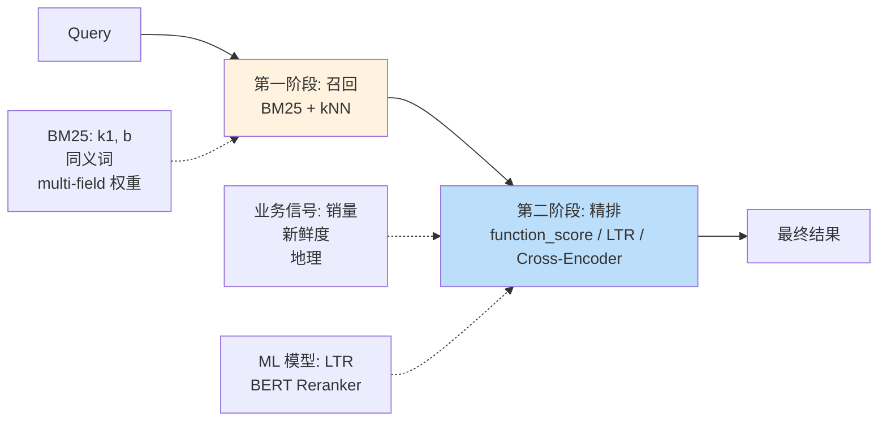

# 精通评分 BM25 与 Reranking：让搜索结果"更对"

> 关联章节：[E06 Query DSL](./06-精通-Query-DSL.md)、[E08 向量检索](./08-精通-向量检索.md)

---

## 引言：评分是搜索的灵魂

排序是搜索引擎与数据库最大的区别——

- 数据库：按 ORDER BY 字段排
- 搜索引擎：按"相关度"排，相关度由评分函数算

ES 默认的相关度评分函数是 **BM25**，从 2016 年起取代 TF-IDF 成为 Lucene/ES 的默认。

但 BM25 算的"相关度"只是个统计学指标——它不"懂"文档实际意义。生产中通常要：

- 用 `function_score` / `rank_feature` 把业务信号融入分数（销量、点击率、新鲜度）
- 用 LTR（Learning to Rank）训练机器学习排序模型
- 用 **reranker**（cross-encoder / rerank API）对 top N 重新排序

这章把 BM25 公式拆开，再讲怎么改进它。读完之后你应该能：

- 推导 BM25 公式，解释 k1、b 各自调什么
- 用 explain API 看每个 token 贡献多少分
- 用 function_score 融合业务信号
- 评估 LTR 与 cross-encoder reranker 的取舍
- 设计一个搜索质量评测流程

---

## 第一章：从 TF-IDF 到 BM25

### 1.1 TF-IDF 的核心思想

```
score(d, q) = Σ_{t in q}  TF(t, d) × IDF(t)

TF(t, d)  = 词 t 在文档 d 中出现次数（越多越相关）
IDF(t)    = log(N / df(t))    词 t 越罕见，越能区分文档
```

直觉：

- 文档里出现"elasticsearch"5 次比 1 次更相关 → 用 TF
- 但"the"在所有文档都出现 → 它对区分没用 → IDF 把它打压

### 1.2 TF-IDF 的问题

- TF 线性增长 → 一个词出现 100 次得 100 分，但实际意义没那么强（diminishing return）
- 没有归一化文档长度 → 长文档因为词多，分数虚高

### 1.3 BM25 公式

BM25 = Best Match 25 (Stephen Robertson 1994)：

```
score(d, q) = Σ_{t in q}  IDF(t) × (TF(t, d) × (k1 + 1)) / (TF(t, d) + k1 × (1 - b + b × |d|/avgdl))

k1: TF 饱和参数（默认 1.2）
b:  长度归一化（默认 0.75）
|d|: 文档长度
avgdl: 平均文档长度
```

关键改进：

- **TF 饱和**：TF 增长到一定值后分数趋平（不会"刷词作弊"）
- **文档长度归一化**：长文档不会自动得分高

### 1.4 k1 与 b 的调节

- `k1`：TF 影响多快饱和。0 = 完全不看 TF；越大 = TF 影响越大
  - 1.2-2.0 是经验范围
- `b`：长度归一化的强度。0 = 不归一化；1 = 完全归一化
  - 长内容差异大的场景（文章）：b 接近 1
  - 内容长度均匀的场景（标题）：b 接近 0

```bash
PUT myindex
{
  "settings": {
    "similarity": {
      "my_bm25": {
        "type": "BM25",
        "k1": 1.5,
        "b": 0.6
      }
    }
  },
  "mappings": {
    "properties": {
      "content": { "type": "text", "similarity": "my_bm25" }
    }
  }
}
```

### 1.5 IDF 的实现细节

ES 用平滑版 IDF：

```
IDF(t) = log(1 + (N - df(t) + 0.5) / (df(t) + 0.5))
```

每个 shard 独立算 IDF —— 多 shard 时**每 shard 的 IDF 略有不同**，影响最终分数。

→ 极端情况下，如果一个词在 shard A 罕见、shard B 常见，同样的 query 在不同 shard 算分不一致。

减轻：

- 大数据分布均匀时 IDF 差异不显著
- 少 shard（< 5 个）影响小
- `search_type=dfs_query_then_fetch`（先全局算 IDF 再查询，慢）

---

## 第二章：explain API

### 2.1 看分数怎么来的

```bash
POST myindex/_explain/{doc_id}
{
  "query": { "match": { "title": "elasticsearch" }}
}
```

返回：

```json
{
  "matched": true,
  "explanation": {
    "value": 1.2345,
    "description": "weight(title:elasticsearch in doc 0) [PerFieldSimilarity]",
    "details": [
      {
        "value": 1.2345,
        "description": "score, computed as boost * idf * tf",
        "details": [
          { "value": 2.2, "description": "boost" },
          { "value": 0.5, "description": "idf, computed as log(1 + ...)" },
          { "value": 1.1, "description": "tf, computed as freq / (freq + k1 * (1-b + b * dl/avgdl))" }
        ]
      }
    ]
  }
}
```

每个字段、每个 token 的贡献都列出来——**调试评分必备**。

### 2.2 search 加 explain

```bash
POST myindex/_search
{
  "query": { "match": { "title": "elasticsearch" }},
  "explain": true
}
```

返回每个 hit 的 `_explanation`。

注意：explain 对每个 hit 都算解释，**性能比正常 search 慢几倍**。仅调试用。

---

## 第三章：function_score —— 融入业务信号

### 3.1 一句话定义

`function_score` 在 query 算出的 _score 之上，叠加业务函数，重新排序。

### 3.2 经典案例：搜索 + 销量加权

```bash
{
  "query": {
    "function_score": {
      "query": { "match": { "title": "iphone" }},
      "functions": [
        {
          "field_value_factor": {
            "field": "sales",
            "modifier": "log1p",
            "factor": 0.1
          }
        }
      ],
      "boost_mode": "multiply",
      "score_mode": "sum"
    }
  }
}
```

最终 _score = 原 BM25 分数 × log1p(sales × 0.1)。

→ 销量高的产品在搜索结果中排前。

### 3.3 内置函数

| 函数 | 用途 |
|---|---|
| `field_value_factor` | 用某字段的值参与评分（如 sales、views） |
| `decay`（gauss/exp/linear） | 越接近某值得分越高（地理、时间衰减） |
| `random_score` | 随机分（用于 A/B 测试洗牌） |
| `script_score` | 自定义脚本算分 |
| `weight` | 简单乘以常数 |

### 3.4 时间衰减

```bash
{
  "function_score": {
    "query": { "match_all": {}},
    "functions": [
      {
        "exp": {
          "publish_date": {
            "origin": "now",
            "scale": "30d",
            "offset": "7d",
            "decay": 0.5
          }
        }
      }
    ]
  }
}
```

→ 7 天内得分不衰减；之后指数衰减；30 天衰减到 0.5。

新闻、热搜场景的标配。

### 3.5 地理衰减

```bash
{
  "function_score": {
    "query": { "match_all": {}},
    "functions": [
      {
        "gauss": {
          "location": {
            "origin": "30.5, 114.3",     // 当前位置
            "scale": "5km",
            "offset": "1km",
            "decay": 0.5
          }
        }
      }
    ]
  }
}
```

→ 1km 内不衰减；5km 外衰减一半。

外卖、酒店搜索。

### 3.6 boost_mode 与 score_mode

`boost_mode` —— query 分数与 functions 总分怎么合：

| 值 | 公式 |
|---|---|
| `multiply`（默认） | _score × functions |
| `sum` | _score + functions |
| `min` | min(_score, functions) |
| `max` | max |
| `replace` | 只用 functions |

`score_mode` —— 多个 function 之间怎么合（同上）。

---

## 第四章：rank_feature / rank_features

### 4.1 专门为评分优化的字段类型

```bash
PUT myindex
{
  "mappings": {
    "properties": {
      "pagerank":   { "type": "rank_feature" },
      "url_length": { "type": "rank_feature", "positive_score_impact": false }
    }
  }
}
```

特点：

- 比 `function_score` 性能好（无 script 开销）
- 自动归一化（不用手动调 modifier）
- 可参与 should 子句直接加分

```bash
{
  "query": {
    "bool": {
      "must":  [{ "match": { "title": "elastic" }}],
      "should": [
        { "rank_feature": { "field": "pagerank" }},
        { "rank_feature": { "field": "freshness" }}
      ]
    }
  }
}
```

### 4.2 rank_features（多键）

```bash
"topics": { "type": "rank_features" }

# 文档
{ "topics": { "search": 1.5, "machine_learning": 0.8 }}

# 查询
{ "rank_feature": { "field": "topics.search" }}
```

适合：高维稀疏特征（如 ELSER 输出的 token 权重）。

---

## 第五章：multi-stage 排序

### 5.1 思路

1. **第一阶段（粗排 / Retrieval）**：用 BM25 / 向量 召回 top 1000
2. **第二阶段（精排 / Reranking）**：用更精确但更慢的算法对 top N 重新排序

### 5.2 ES 的 retriever（9.x 新）

```bash
POST myindex/_search
{
  "retriever": {
    "rrf": {
      "retrievers": [
        {
          "standard": {
            "query": { "match": { "title": "elastic" }}
          }
        },
        {
          "knn": {
            "field": "vec",
            "query_vector": [...],
            "k": 50,
            "num_candidates": 100
          }
        }
      ],
      "rank_window_size": 100,
      "rank_constant": 60
    }
  }
}
```

→ BM25 + kNN 各自召回，然后用 **RRF（Reciprocal Rank Fusion）** 合并。

### 5.3 text_similarity_reranker

```bash
POST myindex/_search
{
  "retriever": {
    "text_similarity_reranker": {
      "retriever": {
        "standard": { "query": { "match": { "content": "iphone screen broken" }}}
      },
      "field": "content",
      "inference_id": "my-rerank-model",
      "inference_text": "iphone screen broken",
      "rank_window_size": 50
    }
  }
}
```

→ 先 BM25 召回 50，再调用 cross-encoder 模型对 50 个文档与 query 算精确语义相似度。

模型可以是：

- ES 内置部署的 BERT 类模型
- 通过 inference API 接外部服务（Cohere Rerank、Jina Reranker、自部署模型）

### 5.4 RRF 公式

```
RRF_score(d) = Σ_{i in retrievers}  1 / (k + rank_i(d))

k = rank_constant（默认 60，调整影响不大）
rank_i(d) = 文档 d 在第 i 个 retriever 的排名
```

直觉：

- 多个 retriever 都把文档排前 → 总分高
- 不同 retriever 即使分数尺度差异很大，rank 都是 1, 2, 3... → 天然可融合

→ 这是 hybrid search 的事实标准。

---

## 第六章：Learning to Rank (LTR)

### 6.1 什么是 LTR

把"什么算更相关"建模成机器学习问题：

1. 收集 `(query, doc, label)` 训练数据
2. 提取特征：BM25 score、点击率、销量、freshness、用户特征等
3. 训练 ranker（XGBoost / LightGBM / 神经网络）
4. 在线推理：每次查询用模型预测分数

### 6.2 ES 的 LTR 插件

ES 8.12+ 内置 LTR 框架（之前是社区插件 elasticsearch-learning-to-rank）：

```bash
PUT _ml/trained_models/my_ltr_model
{
  "input": { "field_names": ["bm25_score", "ctr_30d", "price_normalized"] },
  "definition": { ... }   // XGBoost / LightGBM 模型
}
```

```bash
POST myindex/_search
{
  "retriever": {
    "rescorer": {
      "rescore": {
        "learning_to_rank": {
          "model_id": "my_ltr_model",
          "params": { "query_string": "iphone" }
        },
        "window_size": 100
      },
      "retriever": {
        "standard": { "query": { "match": { "title": "iphone" }}}
      }
    }
  }
}
```

### 6.3 LTR 训练数据来源

- **人工标注**：高质量但贵
- **点击日志**：query → user clicked which doc（有 position bias，需修正）
- **隐式反馈**：购买、收藏、停留时长

通常用 **click model**（如 PBM, DBN）从原始日志生成训练 label。

### 6.4 评测指标

| 指标 | 含义 |
|---|---|
| MRR (Mean Reciprocal Rank) | 第一个相关结果的位置倒数 |
| MAP (Mean Average Precision) | 平均精度 |
| NDCG (Normalized Discounted Cumulative Gain) | 折扣累积增益（业界主流） |
| Recall@K | 前 K 个里召回多少相关 |

NDCG@10 是工业界默认指标。

---

## 第七章：cross-encoder reranker

### 7.1 原理

```
query → embedding   ─┐
                     ├─→  cross-encoder model  →  similarity score
doc   → embedding   ─┘
```

cross-encoder 把 (query, doc) 一起喂给 transformer，输出一个分数。

vs bi-encoder（向量检索常用）：bi-encoder 分别编码再算余弦相似度。

精度：cross-encoder >> bi-encoder（因为能让 query 和 doc 在 attention 里互动）。
速度：cross-encoder << bi-encoder（每个 (q, d) 都要跑一次模型）。

→ 所以 cross-encoder 只用于 top N 精排（N 通常 50-200）。

### 7.2 主流模型

| 模型 | 来源 | 特点 |
|---|---|---|
| `cross-encoder/ms-marco-MiniLM-L-12-v2` | sentence-transformers | 经典开源 |
| Cohere Rerank 3 | Cohere API | 商业 |
| Jina Reranker v2 | Jina | 多语言强 |
| BGE-Reranker-Large | BAAI | 中文好 |

### 7.3 在 ES 里部署

```bash
# 通过 eland 把 HF 模型导入 ES
eland_import_hub_model \
  --hub-model-id BAAI/bge-reranker-base \
  --task-type text_similarity \
  --es-url http://localhost:9200

# 启动模型部署
POST _ml/trained_models/baai__bge-reranker-base/deployment/_start
```

然后 `text_similarity_reranker` 就能用 inference_id 调它。

### 7.4 性能预算

- bi-encoder（向量检索）：每个 query 几毫秒
- cross-encoder rerank top 50：通常 50-200ms

如果延迟敏感，rerank top N 取小一些（如 20）。

---

## 第八章：评测搜索质量

### 8.1 离线评测

ES 8+ 内置 _rank_eval API：

```bash
POST myindex/_rank_eval
{
  "requests": [
    {
      "id": "amsterdam_query",
      "request": { "query": { "match": { "text": "amsterdam" }}},
      "ratings": [
        { "_index": "myindex", "_id": "doc_1", "rating": 3 },
        { "_index": "myindex", "_id": "doc_2", "rating": 2 },
        { "_index": "myindex", "_id": "doc_3", "rating": 0 }
      ]
    }
  ],
  "metric": { "dcg": { "k": 10, "normalize": true }}
}
```

→ 自动计算 NDCG / MRR / Precision@K。

### 8.2 业务评测

- A/B 测试：把新算法分流给 5% 用户，比较点击率 / 转化率
- Interleaving：同一个 query 把两组结果交错呈现，看哪个被点更多
- 人工抽查：每天人工评 100 个搜索结果

---

## 第九章：经典调优策略

### 9.1 同义词扩召回

```bash
# 索引时
"search_analyzer": {
  ...
  "filter": ["lowercase", "synonym_filter"]
}

# synonyms.txt
手机, 电话, mobile, phone
```

### 9.2 字段加权

```bash
{
  "multi_match": {
    "query": "iphone screen",
    "fields": ["title^5", "description^2", "tags^3", "content"],
    "type": "best_fields"
  }
}
```

权重经验：

- title × 3-5
- tags / category × 2-3
- description × 1-2
- 长文本 × 1

### 9.3 提升精确匹配

```bash
{
  "bool": {
    "should": [
      { "match": { "title": "iphone screen" }},                 // 部分匹配
      { "match_phrase": { "title": { "query": "iphone screen", "boost": 2 }}},  // 精确匹配加分
      { "term": { "title.raw": { "value": "iphone screen", "boost": 5 }}}      // 完全匹配最高
    ]
  }
}
```

### 9.4 业务"硬规则"

```bash
{
  "function_score": {
    "query": { "match": { "title": "iphone" }},
    "functions": [
      { "filter": { "term": { "promoted": true }}, "weight": 2 },     // 促销加权
      { "field_value_factor": { "field": "stock", "modifier": "ln1p" }} // 库存多的加分
    ]
  }
}
```

### 9.5 排除噪声

业务相关：

- 已下架商品 → filter 排除
- 测试账号数据 → filter 排除
- 用户黑名单 → must_not

---

## 第十章：典型故障案例

### 10.1 用户搜不到东西

**现象**：搜"iPhone"返回 0 结果。

**排查**：

```bash
POST myindex/_analyze
{ "analyzer": "ik_max_word", "text": "iPhone" }

# 索引里实际存的 token 是什么？
GET myindex/_doc/abc/_termvectors?fields=title
```

可能原因：

- analyzer 不匹配（索引 ik_max_word，搜 standard）
- 业务方写入时 _source 是大写，但 analyzer 没小写
- 同义词缺失（用户搜"苹果手机"但索引只有"iPhone"）

### 10.2 评分顺序怪

**现象**：搜"iPhone"，结果第 1 个是 "iPhone 配件袋"，真正的"iPhone"排第 5。

**排查**：

```bash
POST myindex/_explain/iphone_配件袋_id
{ "query": { "match": { "title": "iPhone" }}}

POST myindex/_explain/iphone_id
{ "query": { "match": { "title": "iPhone" }}}
```

对比每个文档的分数构成。

可能原因：

- 长度归一化：短标题分数高 → "配件袋"标题短
- TF：配件袋的 title 重复出现"iPhone"
- 业务字段没参与评分

修复：

- 加 function_score 把销量 / 类目权重算进来
- 调 BM25 b 参数

### 10.3 最热的查询超时

**现象**：某 query 1% 概率超时。

**排查**：

```bash
GET _nodes/hot_threads
GET myindex/_search?profile=true
```

可能原因：

- query 太复杂（嵌套 bool 几十层）
- agg 涉及高基数 cardinality
- 同时跑大 size 排序

---

## 总结 · 评分调优一图



---

## 练习题

1. BM25 相比 TF-IDF 解决了哪两个核心问题？

2. BM25 中 k1 与 b 参数的语义？长内容差异大的场景应该怎么调？

3. 多 shard 时 BM25 评分可能不一致的根源是什么？怎么缓解？

4. function_score 的 boost_mode 与 score_mode 的差异？默认值是什么？

5. rank_feature 字段类型相对 function_score 的优势是什么？

6. RRF 公式怎么算？为什么适合 hybrid search？

7. cross-encoder reranker 与 bi-encoder（向量检索）的精度/速度差异及配合方式？

8. LTR 训练数据从点击日志生成，什么是 position bias？怎么修正？

9. 评测搜索质量的 NDCG@10 比 MRR 多了什么信息？

10. 设计一个搜索：query 是用户输入的文本，结果按 BM25 + 销量 + 新鲜度 + 用户偏好综合排序，并对 top 50 用 cross-encoder rerank。给出完整 DSL。

---

> 📁 下一篇：[E08 精通向量检索与 Hybrid Search](./08-精通-向量检索.md)
