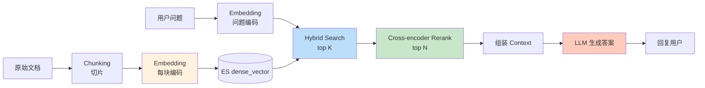
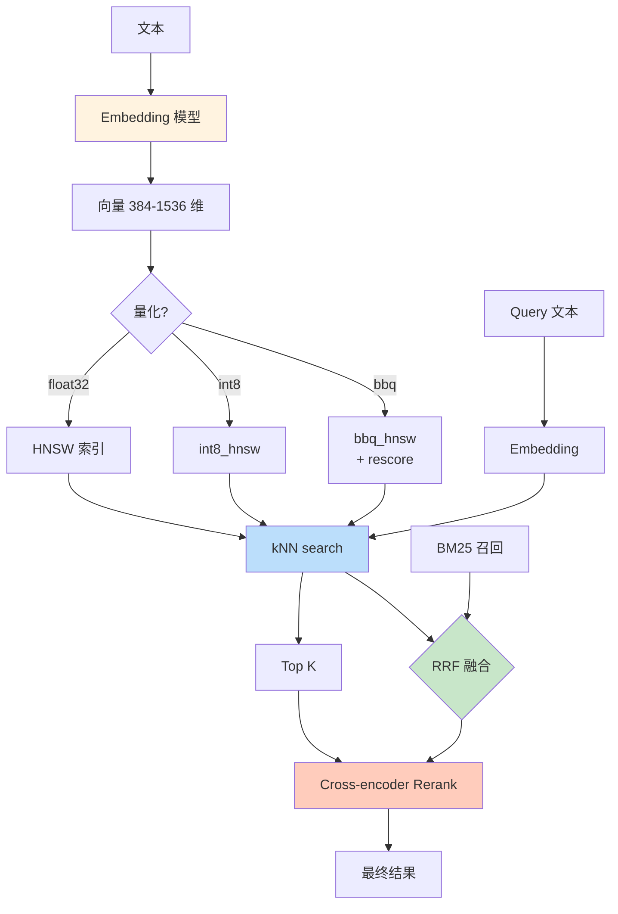

# 精通向量检索与 Hybrid Search：dense_vector、HNSW 与 RAG

> 关联章节：[E07 BM25 与 Reranking](./07-精通-BM25-与-Reranking.md)、[E05 Mapping 与 Analyzer](./05-精通-Mapping-与-Analyzer.md)

---

## 引言：BM25 的极限与向量崛起

BM25 是基于"词袋 + 统计"的传统检索——它**不懂语义**。

- 查询"苹果手机"，文档里写"iPhone"，BM25 不会匹配（除非有同义词）
- 查询"为什么会失眠"，文档写"睡眠障碍的常见原因"，BM25 不匹配
- 查询是俗语 / 错别字 / 同义表达，BM25 全部失灵

向量检索（dense retrieval）用 transformer 模型把文本编码成**几百维浮点向量**，然后查询相似向量——**理解语义**。

但向量检索也有自己的问题：

- 慢（比 BM25 慢 10-100 倍）
- 精确召回低（语义相近但关键词不同的可能漏掉）
- 调参敏感（HNSW 的 ef_construction / ef_search 不会调就是灾难）

→ 现代搜索是 **Hybrid**：BM25 + 向量，结合两者的优势。

读完这章你应该能：

- 理解 dense_vector 字段的物理结构
- 解释 HNSW 算法的层级图原理
- 设计 RAG 的 chunking / embedding / retrieval 流程
- 写 hybrid search（BM25 + kNN + RRF）
- 选合适的 embedding 模型与维度
- 评估 ELSER（sparse vector）vs dense vector 的取舍

---

## 第一章：向量检索的基础

### 1.1 什么是 embedding

```
文本 → embedding 模型 → 向量（如 384 维或 768 维 float）
```

```python
# Python 示例
from sentence_transformers import SentenceTransformer
m = SentenceTransformer('BAAI/bge-small-zh')
v = m.encode("我喜欢搜索引擎")   # numpy array of shape (512,)
```

特性：

- 同样的文本 → 同样的向量（确定性）
- 语义相近的文本 → 向量在空间中接近（cosine 距离小）
- 向量空间维度：通常 64-1536 维（小模型 384 / 512，大模型 1024 / 1536）

### 1.2 相似度度量

| 度量 | 公式 | 适用 |
|---|---|---|
| Cosine | dot(a,b) / (|a||b|) | 语义相似（最常用） |
| Dot product | dot(a,b) | 已归一化时等价 cosine |
| L2 / Euclidean | sqrt(Σ (a-b)²) | 图像、嵌入 |

embedding 模型通常输出 **L2-归一化** 向量，此时 cosine ≈ dot product。

### 1.3 最近邻搜索（NN）

给定 query 向量 q，找数据库里离 q 最近的 K 个向量。

- 暴力（brute force）：算 q 与所有向量的距离，排序取 top K → O(N)，准确但慢
- **近似最近邻 (ANN)**：用图 / 哈希 / 量化加速 → 牺牲少量精度换巨大速度

ES 的 dense_vector 默认用 **HNSW (Hierarchical Navigable Small World)** 算法做 ANN。

---

## 第二章：HNSW 算法

### 2.1 直觉

```
Level 2 (高层): 稀疏，全局连接 →  快速跨大距离
Level 1: 中等密度
Level 0: 所有节点都在，密集连接 → 精确局部搜索
```

每个节点出现在前 k 层（k 按几何分布抽样，越高层节点越少）。

查询：

1. 从最顶层一个固定起点开始
2. 在当前层贪心走（每步去离 query 更近的邻居）
3. 走到该层最近时，下降到下一层
4. 最底层最终找到 top K

效果：

- 查询复杂度 ≈ O(log N)
- 召回率 95%+（按参数调）

### 2.2 关键参数

```bash
PUT myindex
{
  "mappings": {
    "properties": {
      "vec": {
        "type": "dense_vector",
        "dims": 384,
        "index": true,
        "similarity": "cosine",
        "index_options": {
          "type": "hnsw",
          "m": 16,
          "ef_construction": 100
        }
      }
    }
  }
}
```

| 参数 | 含义 | 默认 |
|---|---|---|
| `m` | 每个节点的连接数 | 16 |
| `ef_construction` | 建图时的探索数 | 100 |
| `ef_search`（查询时） | 查询时的探索数 | 等同 `num_candidates` |

- `m` 越大 → 图越密 → 精度高 / 内存大
- `ef_construction` 越大 → 建图慢但质量高
- `ef_search` 越大 → 查询慢但召回高

经验：默认值 (m=16, ef_construction=100) 适合多数场景。极高召回要求时调到 `m=32, ef_construction=200`。

### 2.3 量化

HNSW 默认存 float32 向量——1536 维 = 6KB / doc，1 亿 doc = 600GB 内存。太贵。

ES 8.12+ 支持 **量化**：

```bash
{
  "vec": {
    "type": "dense_vector",
    "dims": 1536,
    "index_options": {
      "type": "int8_hnsw"   // 8-bit 量化（节省 4x）
    }
  }
}
```

ES 8.16+ 引入 BBQ（Better Binary Quantization）作为技术预览，8.18 / 9.0 起 GA：

```bash
{ "index_options": { "type": "bbq_hnsw" }}   // 1-bit 量化（节省 32x）
```

- int8: 精度损失 < 5%
- bbq: 精度损失 5-15%，需要 oversample（多取 K，rerank 精确）

→ 大规模向量库**必须量化**。

### 2.4 量化的 rescoring

```bash
POST myindex/_search
{
  "knn": {
    "field": "vec",
    "query_vector": [...],
    "k": 10,
    "num_candidates": 100,
    "rescore_vector": {
      "oversample": 3.0     // 实际拿 30 个，用 full precision 重排
    }
  }
}
```

→ 用量化向量召回 100 候选，对前 30 用 float32 重排，取最终 top 10。

---

## 第三章：dense_vector 字段

### 3.1 mapping

```bash
PUT myindex
{
  "mappings": {
    "properties": {
      "text":  { "type": "text" },
      "vec":   {
        "type": "dense_vector",
        "dims": 384,
        "index": true,
        "similarity": "cosine"
      }
    }
  }
}
```

- `dims`：维度（必须固定，与 embedding 模型对应）
- `index: true`：建 HNSW 索引（false 则只能 brute force）
- `similarity`: `cosine` / `dot_product` / `l2_norm` / `max_inner_product`

### 3.2 写入

```bash
PUT myindex/_doc/1
{
  "text": "我喜欢搜索引擎",
  "vec": [0.12, 0.43, -0.05, ...]   // 384 float
}
```

应用层用模型预先编码向量。

### 3.3 写入性能

向量写入比普通字段慢得多：

- 每个新向量都要插入 HNSW 图（建立连接）
- 1536 维 + m=16 + ef_construction=100 → 单文档写入几毫秒

集群写入：

- 单 shard 1k docs/s 可达
- 多 shard 并行能放大到 10k-100k docs/s

→ 大规模导入用 bulk + `refresh=false` + 完成后再 force_merge。

---

## 第四章：kNN 查询

### 4.1 基础查询

```bash
POST myindex/_search
{
  "knn": {
    "field": "vec",
    "query_vector": [0.1, 0.2, ...],
    "k": 10,
    "num_candidates": 100
  }
}
```

- `k`：最终返回数量
- `num_candidates`：每 shard 候选数（最终全 shard 合并取 top k）

`num_candidates` 越大召回越高、越慢。经验：`num_candidates = 10 × k` 起步。

### 4.2 query_vector_builder

ES 8.7+ 支持在查询时调用模型：

```bash
POST myindex/_search
{
  "knn": {
    "field": "vec",
    "query_vector_builder": {
      "text_embedding": {
        "model_id": "my-embedding-model",
        "model_text": "用户的查询文本"
      }
    },
    "k": 10,
    "num_candidates": 100
  }
}
```

→ ES 内部把文本转向量。简化应用层。

### 4.3 kNN + 过滤

```bash
POST myindex/_search
{
  "knn": {
    "field": "vec",
    "query_vector": [...],
    "k": 10,
    "num_candidates": 100,
    "filter": {
      "term": { "category": "tech" }
    }
  }
}
```

filter 在 HNSW 搜索时**预过滤**——只在符合 filter 的节点间走图。

代价：filter 命中率太低时召回会塌：

- filter 命中 100 个 doc，但 num_candidates=100 → 几乎全扫
- filter 命中 10 个 doc，但 k=10 → HNSW 找不到足够节点

→ 高选择性的 filter 不要用 pre-filter，用 post-filter。

### 4.4 多向量 kNN

```bash
POST myindex/_search
{
  "knn": [
    { "field": "title_vec", "query_vector": [...], "k": 50 },
    { "field": "body_vec",  "query_vector": [...], "k": 50 }
  ],
  "size": 10
}
```

多个 kNN 子查询的结果**自动合并**（按 score 排序去重）。

---

## 第五章：Hybrid Search

### 5.1 为什么 hybrid

- BM25：精确召回（关键词、专有名词、错别字）
- dense vector：语义召回（同义、改述、隐含关系）

两者各有盲点，组合起来覆盖最广。

### 5.2 RRF 融合

ES 9.x retriever 推荐用法：

```bash
POST myindex/_search
{
  "retriever": {
    "rrf": {
      "retrievers": [
        {
          "standard": {
            "query": { "match": { "text": "苹果手机" }}
          }
        },
        {
          "knn": {
            "field": "vec",
            "query_vector_builder": {
              "text_embedding": {
                "model_id": "my-embedding",
                "model_text": "苹果手机"
              }
            },
            "k": 50,
            "num_candidates": 100
          }
        }
      ],
      "rank_window_size": 100,
      "rank_constant": 60
    }
  },
  "size": 10
}
```

效果：

- BM25 返回的 top 100
- kNN 返回的 top 100
- RRF 公式合并：`score(d) = Σ 1 / (60 + rank_i(d))`
- 最终 top 10

### 5.3 加权融合

```bash
"rrf": {
  "retrievers": [
    { "standard": {...}, "weight": 1.5 },
    { "knn": {...}, "weight": 1.0 }
  ]
}
```

让 BM25 占主导（业务搜索常这样）或让 kNN 占主导（语义检索为主）。

### 5.4 加 rerank

```bash
{
  "retriever": {
    "text_similarity_reranker": {
      "retriever": {
        "rrf": { ... }
      },
      "field": "text",
      "inference_id": "bge-reranker",
      "inference_text": "苹果手机",
      "rank_window_size": 50
    }
  },
  "size": 10
}
```

→ Hybrid 召回 → cross-encoder 精排 top 50 → 返回 top 10。

这就是 2026 年生产级 RAG / 搜索的标准管线。

---

## 第六章：RAG 落地

### 6.1 RAG 流程



### 6.2 Chunking 策略

- **固定长度**：每 500 字符切一段（简单但可能切断语义）
- **按段落 / 标题**：保持语义完整（推荐）
- **滑动窗口**：每 500 字符切，重叠 100 → 边界信息不丢
- **递归切分**：按 markdown 标题层级切

```python
from langchain.text_splitter import RecursiveCharacterTextSplitter
splitter = RecursiveCharacterTextSplitter(
    chunk_size=500,
    chunk_overlap=50,
    separators=["\n\n", "\n", "。", ".", " "]
)
chunks = splitter.split_text(doc)
```

### 6.3 chunk 大小经验

- 太小（< 100 字）：缺乏上下文，向量不准
- 太大（> 2000 字）：单 chunk 信息太杂，向量不集中
- 经验：300-800 字最佳

### 6.4 索引设计

```bash
PUT rag_index
{
  "mappings": {
    "properties": {
      "doc_id":     { "type": "keyword" },         // 原文档 ID
      "chunk_idx":  { "type": "integer" },          // 第几块
      "text":       { "type": "text", "analyzer": "ik_max_word" },
      "vec":        {
        "type": "dense_vector",
        "dims": 1024,
        "index": true,
        "similarity": "cosine",
        "index_options": { "type": "int8_hnsw" }
      },
      "metadata":   { "type": "flattened" },        // 来源、作者、时间...
      "@timestamp": { "type": "date" }
    }
  }
}
```

### 6.5 Embedding 模型选择

| 模型 | 维度 | 多语言 | 大小 |
|---|---|---|---|
| `BAAI/bge-small-zh` | 512 | 中文 | 95MB |
| `BAAI/bge-large-zh-v1.5` | 1024 | 中文 | 1.3GB |
| `BAAI/bge-m3` | 1024 | 多语言 | 2.3GB |
| `OpenAI text-embedding-3-small` | 1536 | 多语言 | API |
| `OpenAI text-embedding-3-large` | 3072 | 多语言 | API |
| `voyage-large-2` | 1536 | 多语言 | API |

经验：

- 中文场景首选 BGE 系列
- 多语言用 BGE-M3 或 OpenAI
- 大规模（> 1 亿）选小维度（512）

### 6.6 实战 RAG 检索

```bash
POST rag_index/_search
{
  "retriever": {
    "text_similarity_reranker": {
      "retriever": {
        "rrf": {
          "retrievers": [
            {
              "standard": {
                "query": {
                  "bool": {
                    "must": [{ "match": { "text": "用户问题" }}],
                    "filter": [{ "range": { "@timestamp": { "gte": "now-1y" }}}]
                  }
                }
              }
            },
            {
              "knn": {
                "field": "vec",
                "query_vector_builder": {
                  "text_embedding": {
                    "model_id": "bge-m3",
                    "model_text": "用户问题"
                  }
                },
                "k": 30,
                "num_candidates": 100
              }
            }
          ],
          "rank_window_size": 60
        }
      },
      "field": "text",
      "inference_id": "bge-reranker",
      "inference_text": "用户问题",
      "rank_window_size": 30
    }
  },
  "size": 5,
  "_source": ["text", "doc_id", "metadata"]
}
```

效果：top 5 高质量 chunk → 输入到 LLM 生成答案。

---

## 第七章：ELSER 与稀疏向量

### 7.1 什么是 ELSER

ELSER (Elastic Learned Sparse EncodeR) 是 Elastic 自研的**稀疏向量**模型：

```
"vec": {
  "search": 1.3,
  "engine": 0.8,
  "lucene": 0.5,
  ...
}
```

不是 384/1024 维的稠密浮点，而是几百到几千个 (token, weight) 对。

### 7.2 优势

- **不需要 ANN 索引**——直接用 ES 的倒排索引（terms + boost）
- **混合 BM25 友好**——本质上和词袋一脉相承
- **解释性好**——可看出每个 token 贡献多少

### 7.3 用法

```bash
PUT my-elser-index
{
  "mappings": {
    "properties": {
      "text_embedding": { "type": "sparse_vector" }
    }
  }
}
```

```bash
# 通过 inference pipeline 自动生成稀疏向量
PUT _ingest/pipeline/elser-pipeline
{
  "processors": [
    {
      "inference": {
        "model_id": ".elser_model_2",
        "input_output": [
          { "input_field": "text", "output_field": "text_embedding" }
        ]
      }
    }
  ]
}

PUT my-elser-index/_doc/1?pipeline=elser-pipeline
{ "text": "我喜欢搜索引擎" }
```

查询：

```bash
POST my-elser-index/_search
{
  "query": {
    "sparse_vector": {
      "field": "text_embedding",
      "inference_id": ".elser_model_2",
      "query": "搜索引擎喜好"
    }
  }
}
```

### 7.4 ELSER vs dense vector

| 维度 | ELSER | Dense Vector |
|---|---|---|
| 索引 | 倒排索引 | HNSW |
| 内存 | 较少 | 较多（HNSW 图） |
| 速度 | 中（依赖倒排） | 快（HNSW） |
| 与 BM25 融合 | 天然 | 需要 RRF |
| 跨语言 | 英文好，多语言一般 | 看模型 |
| 部署 | 只能 ES 内 | 任意 |

→ 英文为主、不想搞 HNSW 调参 → ELSER。
→ 多语言、大规模 → dense vector。

---

## 第八章：性能与扩展

### 8.1 内存预算

dense_vector 占用：

```
内存 = doc 数 × dims × bytes_per_dim
     = 1 亿 × 1024 × 4 (float32)
     = 400 GB
```

量化后：

- int8: 100 GB
- bbq: 12.5 GB

加上 HNSW 图（约 1.5x 向量本身）：

- float32: 1 亿 × 1024 维 → 600GB
- int8: 150GB
- bbq: 20GB

### 8.2 单节点限制

每节点能装多少向量？

```
节点堆 32GB + 节点磁盘 1TB:
  dense 1024 维 float32: ~5000 万 doc
  dense 1024 维 int8: ~2 亿 doc
  dense 1024 维 bbq: ~10 亿 doc
```

超过这个就要分 shard 到多节点。

### 8.3 索引构建提速

```bash
# 大批量导入时
PUT myindex/_settings
{
  "index.refresh_interval": "-1",
  "index.number_of_replicas": 0
}

# 导入完毕
PUT myindex/_settings
{
  "index.refresh_interval": "1s",
  "index.number_of_replicas": 1
}

POST myindex/_forcemerge?max_num_segments=1
```

### 8.4 num_candidates 调参

延迟 vs 召回的取舍：

```
k=10, num_candidates=10:   最快，召回率最低
k=10, num_candidates=100:  中等（推荐起步）
k=10, num_candidates=1000: 慢，召回率接近 brute force
```

实测：从 100 起步，看业务 NDCG@10 满意度，再决定要不要加。

---

## 第九章：典型故障案例

### 9.1 召回率低

**现象**：用户搜"产品退款流程"，向量召回的全是无关结果。

**排查**：

- embedding 模型是否匹配业务领域？（通用模型不一定理解专业术语）
- chunk 是否切得太碎？
- num_candidates 是否够大？

修复：

- 微调 embedding 模型（在自有数据上 fine-tune）
- 改 chunk 策略
- 加大 num_candidates

### 9.2 写入慢

**现象**：每秒只能写 200 doc，CPU/IO 都没满。

**排查**：

- m / ef_construction 是否过大？
- 向量维度是不是 3072 这种巨型？
- single shard 写入瓶颈？

修复：

- 减小 m 到 8 或 16
- 减小 ef_construction 到 50
- 增加 shard 数
- 用 bulk + 多线程

### 9.3 查询 P99 抖动

**现象**：99% query < 50ms，但偶尔 500ms+。

**排查**：

- GC 频繁？
- HNSW 图是否在 page cache 中？
- 磁盘 IO 抖动？

修复：

- HNSW 图大小不能超过 page cache 一半（否则要从磁盘读）
- 用量化减小图体积
- 单独的 vec_search 角色节点

### 9.4 量化后召回崩了

**现象**：用 bbq 量化后召回率从 95% 跌到 70%。

**修复**：用 oversample rescoring。

```bash
"rescore_vector": { "oversample": 5.0 }
```

bbq 量化损失大，oversample 3-5 倍才稳。

---

## 第十章：未来 —— ColBERT 与多向量

### 10.1 ColBERT

把每个 token 编码成独立向量（一篇文档 = 100 个向量），查询时 token-level 相似度。

精度比单向量高很多，但存储与计算开销也高。

ES 9.x 在实验性支持 multi-vector 字段。

### 10.2 late-interaction 模型

cross-encoder（一次 query+doc）慢；bi-encoder（分别编码）精度差。late-interaction 是中间方案——文档预编码成多个 token 向量，查询时做轻量交互。

---

## 总结 · 向量检索一图



---

## 练习题

1. 为什么向量检索可以"理解"同义和改述，而 BM25 不能？

2. HNSW 的"层级图"结构是怎么加速查询的？层数怎么决定？

3. int8 量化和 bbq 量化各损失多少精度？bbq 必须配合什么策略？

4. kNN 查询的 `num_candidates` 设小了会怎样？设大了会怎样？

5. RRF 公式相比加权分数融合的优势是什么？

6. 为什么 chunking 是 RAG 的关键？太小和太大各有什么问题？

7. ELSER 与 dense vector 在索引结构、性能、用法上的差异？

8. 一个 1 亿 doc、768 维向量的索引，float32 时需要多少内存？int8、bbq 呢？

9. embedding 模型选 1536 维 vs 384 维，主要权衡是什么？

10. 设计一个公司内部知识库的 RAG：100 万文档、中英文混合、希望 P95 延迟 < 500ms、最高准确度。给出完整索引设计、检索 DSL、rerank 策略。

---

> 📁 下一篇：[E09 精通 ES 写入流程与近实时](./09-精通-写入与近实时.md)
