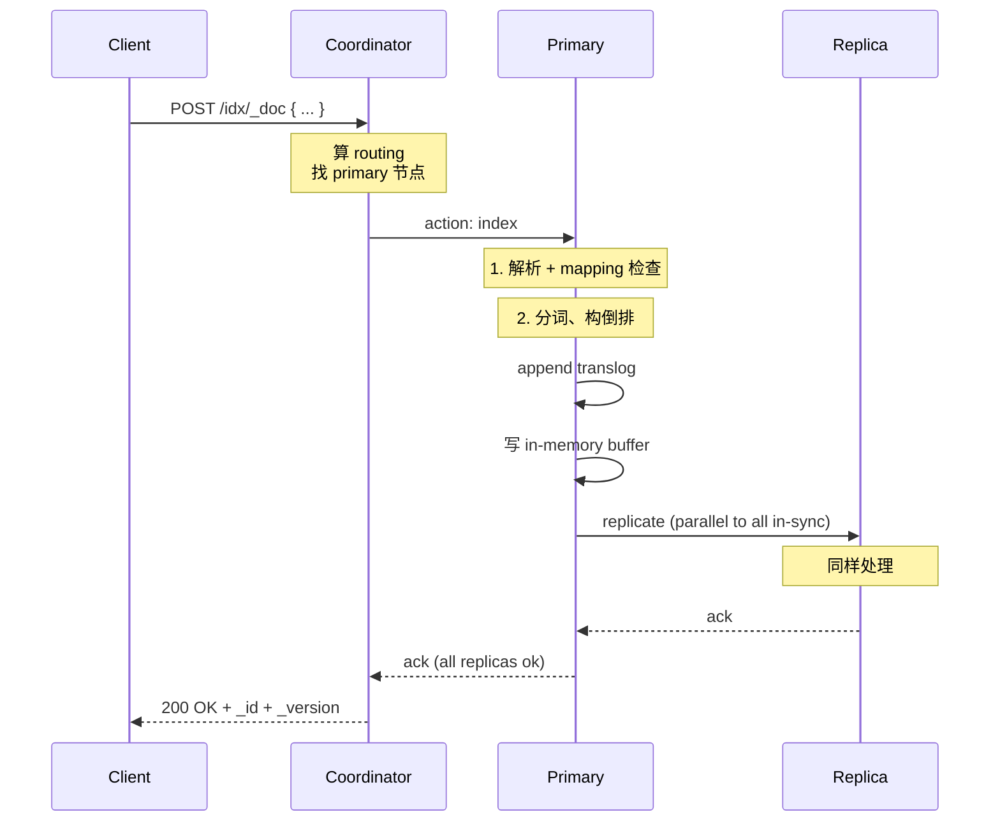
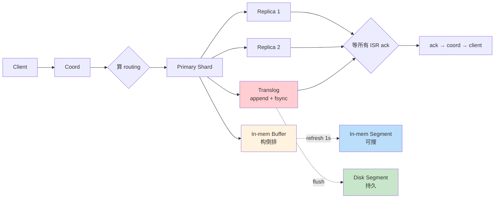

# 精通 ES 写入流程与近实时：translog、indexing pressure 与 bulk

> 关联章节：[E02 Segment 与合并](./02-精通-Segment-与合并.md)、[E04 分片与路由](./04-精通-分片与路由.md)

---

## 引言：写入比你想象的复杂

ES 的"写"看着简单——一个 POST 请求就行。但它内部经过：

1. 客户端 → coordinator 节点
2. coordinator 算 routing → primary shard
3. primary 解析、构 mapping、写 translog、更新内存 buffer
4. primary 把请求转发给所有 in-sync replica
5. replica 同样处理
6. 所有 replica ack 后 → primary ack → coordinator → client

链路里任何一环慢，整个写入就慢。最常见的"写入慢"根因：

- bulk 太大或太小（30MB 是甜点）
- translog durability 默认 request → 每次都 fsync
- replica 同步串行化 → 副本越多越慢
- indexing pressure 触发反压 → 拒绝写入
- mapping 频繁变更 → cluster state 更新阻塞

这章把"一个文档怎么进入 ES"的完整路径讲透。读完之后你应该能：

- 画出从 client 到 segment 的全链路时序图
- 解释 translog 在崩溃恢复中的角色
- 调 indexing buffer / bulk size / refresh interval
- 监控 indexing pressure 与 backpressure
- 设计批量导入百亿文档的方案

---

## 第一章：写入完整路径

### 1.1 时序图



### 1.2 每一步的耗时

| 阶段 | 典型耗时 |
|---|---|
| 网络 client→coord | < 1ms（同机房） |
| routing 决策 | < 1ms |
| coord→primary 转发 | < 1ms（同机房） |
| mapping 检查 / 解析 | 1-5ms（mapping 简单时 < 1ms） |
| translog append | < 1ms |
| in-memory buffer 更新 | 1-3ms（分词重的话更长） |
| primary→replica 转发 + 处理 | replica 写入耗时 + 网络 RTT |
| 全链路 | 5-50ms 典型 |

→ 多数延迟在**分词** + **replica 同步**。

### 1.3 关键观察

- 写入响应时间 ≈ primary 处理时间 + 最慢 replica 处理时间
- 加副本 → 写入吞吐线性下降（但读吞吐线性上升）
- mapping 复杂（很多字段、复杂 analyzer）→ 写入越慢

---

## 第二章：translog

### 2.1 角色

translog (transaction log) 是 ES 的 WAL（write-ahead log）：

```
请求到 primary
  ↓
1. append translog（顺序写文件）
  ↓
2. 更新 in-memory buffer（构倒排）
  ↓
3. ack 给 coord
```

为什么先 translog 再 buffer？— **崩溃恢复**。

- 内存 buffer 在 refresh 前不是 segment，不持久化
- translog 一直在磁盘
- 崩溃后从最近 commit 点开始 replay translog → 重建内存 buffer 状态

### 2.2 durability

```yaml
index.translog.durability: request    # 默认：每个请求 fsync
index.translog.durability: async      # 异步：按 sync_interval fsync
index.translog.sync_interval: 5s
```

| 模式 | 数据安全 | 性能 |
|---|---|---|
| request | 不丢已 ack 的请求 | 慢（每次 fsync） |
| async | 崩溃时丢 ≤ sync_interval | 快 30-50% |

经验：

- 重要业务：request
- 日志类（容忍丢几秒）：async + 5s

### 2.3 flush 与 translog 清空

```yaml
index.translog.flush_threshold_size: 512mb   # translog 累计到 512MB 触发 flush
```

flush = "把内存 buffer 序列化为 segment + fsync segment + 清 translog"。

之后崩溃恢复就不需要重放该 translog 段。

### 2.4 监控

```bash
GET _cat/indices/myindex?v&h=index,translog.operations,translog.size

# 或
GET myindex/_stats/translog
```

translog 文件大小持续增长（接近 512MB）→ 写入猛或 flush 不及时。

---

## 第三章：indexing buffer

### 3.1 in-memory 阶段

每个 shard 有自己的 in-memory buffer（堆内）。文档进来构倒排，先在这里：

```yaml
indices.memory.index_buffer_size: 10%      # 默认堆的 10%
indices.memory.min_index_buffer_size: 48mb
```

→ 32GB 堆 = 3.2GB indexing buffer，所有 shard 共享。

### 3.2 buffer 满 / refresh

两种情况会触发 buffer → segment：

1. **refresh**（默认每 1s）：把当前 buffer 内容转成内存 segment（可被搜到）
2. **buffer 满**：紧急 flush（强制 refresh）

refresh 之后 buffer 清空，开始接收新文档。

### 3.3 调大 buffer

如果**写多 + 单 shard 流量大**：

```yaml
indices.memory.index_buffer_size: 20%
```

让 buffer 大一些，refresh 间隔可拉长（减少 segment 数）。

但 buffer 太大占堆 → GC 压力 → 反而慢。一般 10-20% 是合理范围。

---

## 第四章：bulk API

### 4.1 单条 vs bulk

```bash
# 单条（慢）
POST idx/_doc { "msg": "1" }
POST idx/_doc { "msg": "2" }
...

# bulk（快几十倍）
POST _bulk
{ "index": { "_index": "idx" }}
{ "msg": "1" }
{ "index": { "_index": "idx" }}
{ "msg": "2" }
...
```

bulk 的优势：

- 一次网络往返
- coord 内部按 shard 分组并发转发
- 一次响应

### 4.2 bulk size 调优

经验：每批 **5-15MB** 是甜点。

太小（< 1MB）：每批管理开销大，吞吐起不来。
太大（> 50MB）：单批占内存大，GC 压力，可能 OOM。

```python
# 推荐配置：用 helpers.streaming_bulk
from elasticsearch.helpers import streaming_bulk
for ok, result in streaming_bulk(es, actions, chunk_size=1000, max_chunk_bytes=15*1024*1024):
    pass
```

`chunk_size=1000` 文档或 `max_chunk_bytes=15MB` 哪个先到就发送。

### 4.3 bulk 的 partial failure

bulk 一批 1000 条，如果第 500 条 mapping 不对：

- 第 500 条**单独失败**（response 里标错）
- 其他 999 条仍然成功

需要应用层检查 response：

```python
for item in resp["items"]:
    if "error" in item.get("index", {}):
        log.error(f"Failed: {item}")
```

### 4.4 reindex / update_by_query 也是 bulk

```bash
POST _reindex?slices=auto
{
  "source": { "index": "old" },
  "dest":   { "index": "new" }
}
```

`slices=auto` 让 ES 按 shard 数并行。手动 slices=N 可以控制并行度。

### 4.5 bulk 并发

单个 client 串行 bulk 限速。多个 client 并发 bulk 才能压满集群：

```
client 数 ≈ data_node 数 × 2-4
```

例：5 个 data 节点 → 10-20 个 client 并发 bulk。

---

## 第五章：refresh 与近实时

### 5.1 NRT 的含义

ES 是 **Near Real-Time**（NRT）—— 写入到可搜的延迟约 1s（refresh_interval 默认）。

注意：

- **GET by _id** 是 strong consistent（直接走 translog + segment）
- **SEARCH** 必须等 refresh 后才能看到新文档

### 5.2 refresh_interval

```bash
PUT myindex/_settings
{ "index.refresh_interval": "30s" }
```

| 值 | 影响 |
|---|---|
| `1s`（默认） | 实时搜索；segment 数累积快 |
| `30s` | 写吞吐 + 30-50%；可见延迟 30s |
| `-1` | 禁用自动 refresh；手动控制 |
| `null` | 恢复默认 |

经验：

- 用户搜索（电商）：1s
- 日志：30s
- 批量导入：-1（导入完再手动 refresh）

### 5.3 refresh=true / wait_for

```bash
POST myindex/_doc?refresh=true       # 写完立刻 refresh
POST myindex/_doc?refresh=wait_for   # 等到下次 refresh 才返回
POST myindex/_doc?refresh=false      # 默认，不等
```

⚠️ `refresh=true` 是反模式——每次写都创建 segment → 几百个小 segment → 合并爆炸。

**集成测试**用 `refresh=true` OK，生产用 `wait_for`。

### 5.4 idle refresh

ES 7+ 引入：索引如果 30 秒没人查 → 自动暂停 refresh。

第一次查询时 refresh 才触发——节省 idle 索引的开销。

如果不想这样：

```yaml
index.search.idle.after: 30s   # 默认 30s
```

或对该索引 `?force_refresh=true`。

---

## 第六章：replica 路径

### 6.1 in-sync replica（ISR）

每个 shard 有"in-sync 副本集合"。

- 写入要等所有 ISR ack
- 落后太多的 replica 被剔除 ISR，后台 recovery 追上后重回

```bash
GET _cluster/state?filter_path=routing_table.indices.myindex
# 看 routing_table 里的 active / unassigned shard
```

### 6.2 wait_for_active_shards

```bash
PUT myindex/_doc/1?wait_for_active_shards=2
{ "msg": "hi" }
```

要求至少 2 个 active shard（包括 primary）。

值：

- `1`（默认）：只要 primary 活就接受
- `all`：所有副本都必须活
- 具体数字：N 个 active

注意：`wait_for_active_shards` 是**接收写入前的检查**，不是"等多少 replica ack"。后者由 ES 内部固定逻辑（等 ISR 全部 ack）。

### 6.3 副本数与写入吞吐

```
副本数=1: 写入吞吐 = X
副本数=2: 写入吞吐 ≈ X × 0.7
副本数=3: 写入吞吐 ≈ X × 0.5
```

（不是简单除法 —— replica 并行，但 fanout 与等待最慢者拖累）

→ 写多场景副本数 = 1，必要时临时降到 0（批量导入后恢复）。

---

## 第七章：indexing pressure 与反压

### 7.1 indexing pressure 是什么

ES 7.9+ 引入。每个节点跟踪"正在处理的 indexing 请求所占字节"，超过阈值时**拒绝**新请求：

```yaml
indexing_pressure.memory.limit: 10%   # 默认堆的 10%
```

→ 32GB 堆 → 3.2GB 上限。

超过 → 返回 429 `circuit_breaking_exception`，应用层应该退避重试。

### 7.2 三种 indexing pressure

| 类型 | 含义 |
|---|---|
| coordinating | coord 节点收到的请求 |
| primary | primary shard 处理 |
| replica | replica shard 处理 |

```bash
GET _nodes/stats/indexing_pressure
```

输出每个节点这三类的当前 / 累计字节数。

### 7.3 触发 backpressure 的常见原因

- bulk 太大
- 副本太多 + 写入猛 → primary 等 replica 占用内存久
- replica 节点 GC 卡顿 → primary 攒堆
- 节点配置不对称 → 弱节点拖累

### 7.4 应用层应对

```python
from elasticsearch import Elasticsearch
from elasticsearch.exceptions import TransportError

while True:
    try:
        helpers.bulk(es, actions, chunk_size=500)
        break
    except TransportError as e:
        if e.status_code == 429:
            time.sleep(2 ** retry)   # 指数退避
            retry += 1
            continue
        raise
```

→ 永远要带重试。

---

## 第八章：批量导入百亿文档

### 8.1 设计原则

- 临时降级（refresh -1, replica 0）
- bulk 5-15MB
- 多 client 并发
- 流控 + 重试
- 完成后恢复 + force_merge

### 8.2 模板

```bash
# 1. 准备索引（设最小开销）
PUT bigindex
{
  "settings": {
    "number_of_shards": 20,
    "number_of_replicas": 0,
    "refresh_interval": "-1",
    "translog.durability": "async",
    "translog.flush_threshold_size": "2gb",
    "merge.scheduler.max_thread_count": 4
  },
  "mappings": { ... }
}

# 2. 多 client 并发 bulk
# 推荐：每 client 串行，client 数 = data 节点数 × 2

# 3. 完成后
PUT bigindex/_settings
{
  "number_of_replicas": 1,
  "refresh_interval": "1s",
  "translog.durability": "request"
}

POST bigindex/_refresh
POST bigindex/_forcemerge?max_num_segments=1
```

### 8.3 监控

```bash
GET _cat/indices/bigindex?v&h=index,docs.count,store.size,segments.count,health

GET _nodes/stats/indices/indexing
# index_total / index_current / index_time_in_millis

GET _cat/thread_pool/write?v
# 看 write 线程池：queue 满 = 写入饱和
```

### 8.4 出错处理

- 429：退避重试
- mapping conflict：先把出错文档 dump 到 dead letter queue，单独处理
- 持续 5 分钟 0 进度：诊断（hot threads, cluster health）

---

## 第九章：update 与 delete

### 9.1 update 内部

```bash
POST myindex/_update/1
{ "doc": { "field": "new" }}
```

逻辑：

1. 读出 doc（从 _source）
2. merge 新字段
3. **删除原 doc + 写入新 doc**（产生新 _version）

→ 比 insert 慢 30-100%。

### 9.2 doc_as_upsert

```bash
POST myindex/_update/1
{
  "doc": { "field": "value" },
  "doc_as_upsert": true
}
```

→ 不存在则 insert，存在则 update。一次操作。

### 9.3 scripted update

```bash
POST myindex/_update/1
{
  "script": {
    "source": "ctx._source.counter += params.amount",
    "params": { "amount": 5 }
  }
}
```

适合**计数器**类操作。

⚠️ script 慢，且要 `retry_on_conflict`：

```bash
POST myindex/_update/1?retry_on_conflict=5
{ "script": {...}}
```

### 9.4 update_by_query

```bash
POST myindex/_update_by_query
{
  "query": { "term": { "status": "draft" }},
  "script": { "source": "ctx._source.status = 'published'" }
}
```

→ 类似 SQL 的 UPDATE WHERE。

注意：

- 是 scroll + 逐条 update → 慢
- 大量数据更新建议 reindex
- 用 `slices=auto` 并行

### 9.5 delete_by_query

```bash
POST myindex/_delete_by_query
{
  "query": { "range": { "@timestamp": { "lt": "now-30d" }}}
}
```

也是 scroll + 逐条删除。**比按时间 drop 索引慢得多**——优先用 ILM rollover + delete index。

### 9.6 deleted doc 的清理

```bash
POST myindex/_forcemerge?only_expunge_deletes=true
```

只合并 deleted_pct 高的 segment，物理删除墓碑。比全 force_merge 轻量。

---

## 第十章：写入故障排查

### 10.1 写入慢

```bash
# 1. 看 indexing 速率
GET _nodes/stats/indices/indexing
# index_total / index_time_in_millis 计算 ms/doc

# 2. 看队列
GET _cat/thread_pool/write?v
# queue > active 持续 = 饱和

# 3. 看 hot threads
GET _nodes/hot_threads?threads=5&type=cpu

# 4. 看 indexing pressure
GET _nodes/stats/indexing_pressure
```

可能原因：

- bulk 太小 → 增大
- replica 拖累 → 检查 replica 节点健康
- mapping 复杂 / 分词重 → 减少字段、改简单 analyzer
- segment 过多 → 调 merge 参数
- 磁盘 IO 满 → 升 SSD

### 10.2 写入被拒（429）

```
{"error": "circuit_breaking_exception", "reason": "..."}
```

- **indexing pressure 超 10%** → 减小 bulk、加节点
- **parent circuit breaker 超 95% 堆** → 加堆、查内存泄漏
- **fielddata circuit breaker** → 关掉某字段的 fielddata

### 10.3 写入失败但 ack

少见但严重：写入 ack 后查不到。

可能原因：

- 不同 shard 时差：写到 primary 后 primary 还没 refresh，去其他 shard 查
- 用 alias 但 alias 指向多个索引，部分缺数据

修复：理解 GET by _id（强一致）vs SEARCH（NRT）的区别。

### 10.4 cluster state 阻塞

mapping 频繁变更（dynamic mapping 字段爆炸）→ cluster state 更新串行化 → 全集群阻塞。

修复：

- mapping strict
- 关掉 dynamic 或用 runtime field

---

## 第十一章：性能基准

### 11.1 单节点写入吞吐

| 配置 | 吞吐 |
|---|---|
| 32C, 64GB, NVMe, 简单 mapping | 100-200k docs/s |
| 16C, 32GB, SSD, 中等 mapping | 30-80k docs/s |
| 8C, 16GB, HDD, 复杂 mapping + 重 analyzer | 5-15k docs/s |
| 加向量字段（1024 维 HNSW） | 减半到 1/3 |

### 11.2 集群水平扩展

线性扩到 ~50 节点不难。超过 50 节点：

- master 负担重（cluster state）
- recovery / rebalance 慢
- 建议拆集群 + CCS

### 11.3 写入与查询的资源竞争

写入主要消耗：

- CPU（分词、构倒排、HNSW 插入）
- IO（translog fsync、segment 持久化）
- 堆内存（indexing buffer）

查询主要消耗：

- CPU（评分、聚合）
- 堆外内存（page cache）
- IO（segment 读取）

→ 写读混合负载，CPU 是最早瓶颈。

---

## 总结 · 写入路径一图



---

## 练习题

1. 写入 ES 一个文档后立即用 GET 能拿到，用 SEARCH 拿不到，为什么？

2. translog 在崩溃恢复里扮演什么角色？durability=async 的代价？

3. bulk 大小 1MB / 15MB / 100MB 各自的取舍是什么？

4. refresh=true 的滥用为什么是反模式？

5. 副本数从 1 调到 2，写入吞吐大致会怎么变？为什么？

6. indexing pressure 触发 429 时应用层应该怎么做？

7. 批量导入 100 亿文档，列出 5 个临时降级的设置。

8. update 比 insert 慢的根本原因是什么？

9. delete_by_query 比按时间 drop 索引慢得多——为什么时序数据应该用 rollover？

10. 设计一个：每天 50 亿文档、每文档约 2KB（含 1024 维向量）的日志集群，给出节点配置 + 写入策略 + 监控告警。

---

> 📁 下一篇：[E10 精通 ES 性能调优](./10-精通-性能调优.md)
